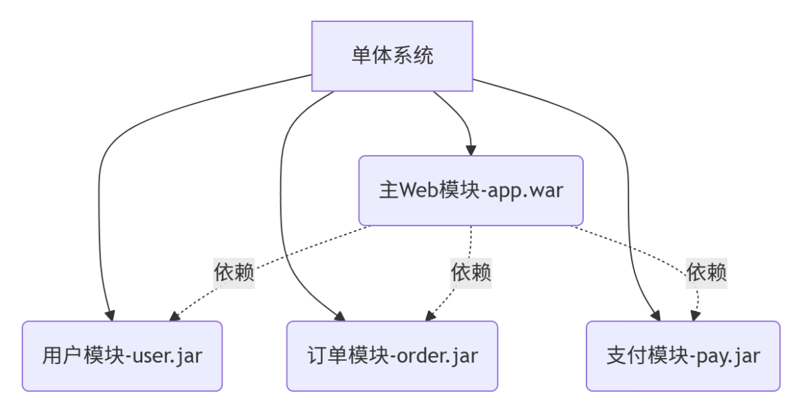
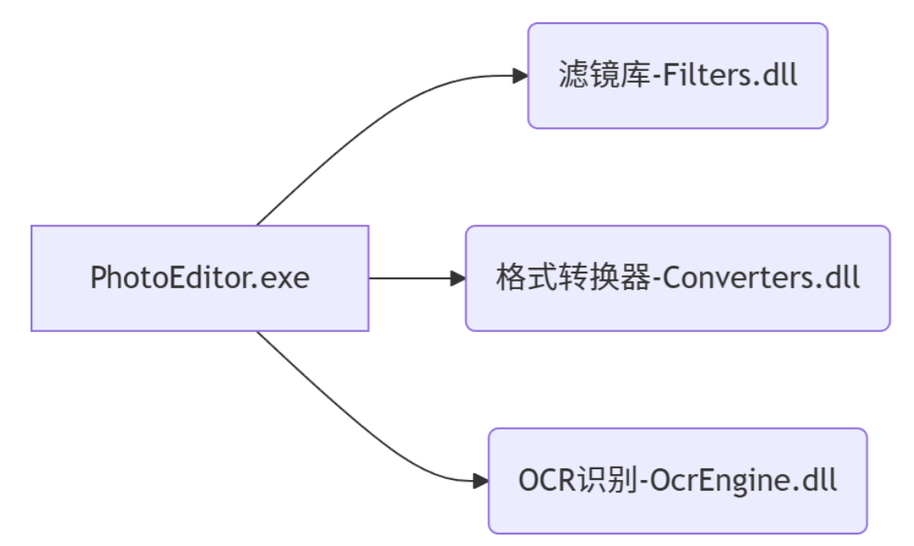

## 1.2 单体系统时代

> 从横向角度来看，单体架构也支持按照技术、功能、职责等维度，将软件拆分为各种模块，以便重用和管理代码。单体系统并不意味着只能有一个整体的程序封装形式，如果需要，它完全可以由多个JAR、WAR、DLL、Assembly或者其他模块格式来构成。

**示例1：Java企业级应用（JAR + WAR组合）**



```
deploy/
├── app.war        # 主Web应用
├── lib/
│   ├── user.jar   # 用户管理模块
│   ├── order.jar  # 订单处理模块
│   └── pay.jar    # 支付接口模块
```

运行时行为：

- 所有模块被同一个Tomcat容器加载
- 模块间通过直接方法调用通信（非网络）
- 最终体现为单一访问入口：`http://app:8080`

**示例2：.NET桌面应用（EXE + DLL组合）**



```
Program Files/PhotoEditor/
├── PhotoEditor.exe
├── Filters.dll
├── Converters.dll
└── OcrEngine.dll
```

工作方式：

1. 用户双击启动`PhotoEditor.exe`
2. EXE主程序动态加载所有DLL
3. 功能按钮直接调用DLL中的方法
4. 所有组件在同一个Windows进程中运行