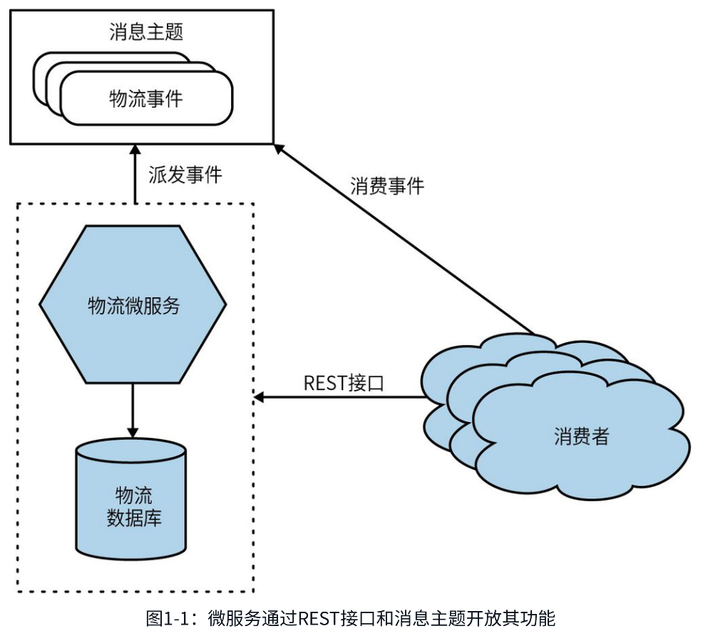
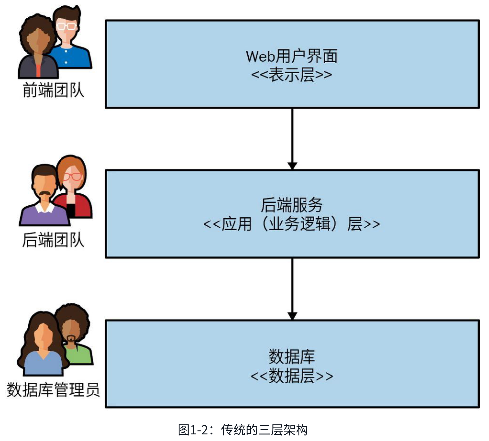
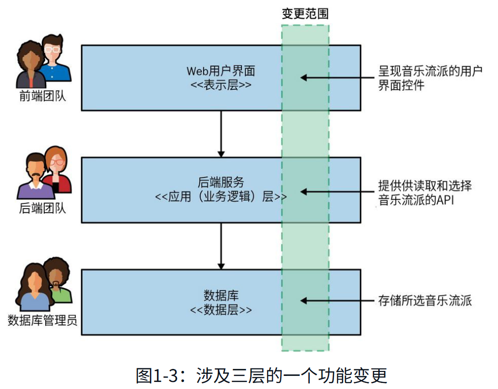
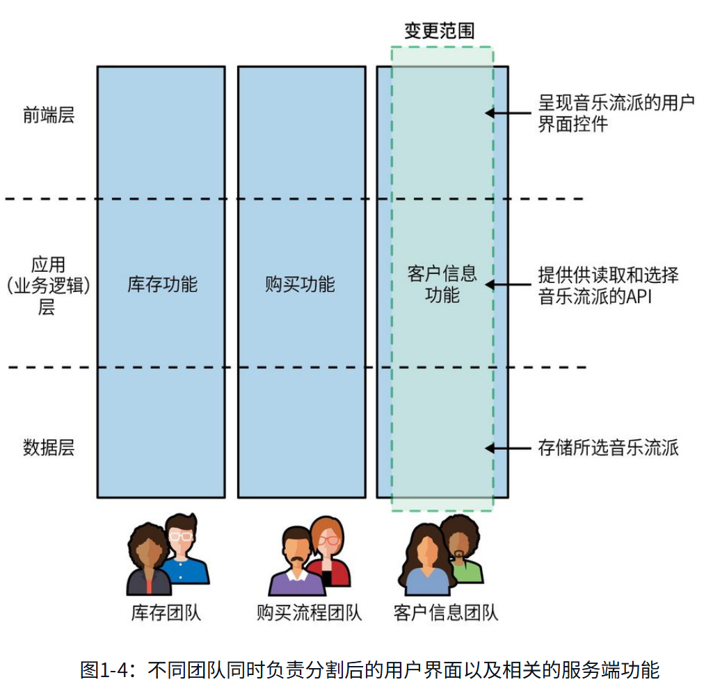
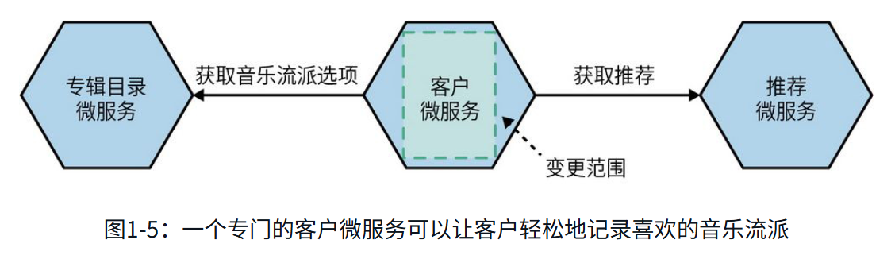

# **第一部分 基础**

## **第一章 刨根问底微服务**

### **1.1 微服务概述**

**微服务(microservice)是基于业务领域建模的、可独立发布的服务。它会把业务内聚的功能封装起来，并通过网络供其他服务访问。**将这样的服务进行组合就可以构建出更复杂的系统。例如，3个不同的微服务分别负责库存、订单管理、物流，这三者组合便能构成一个完整的电子商务系统。

微服务是一种面向服务的架构，尤其看重如何划分服务边界，且强调独立部署。此外，微服务与特定技术（如开发语言、开发框架）无关，这也是它的优势之一。

从外部看，单个微服务被看作一个黑盒。它通过适配协议在一个或多个网络端点（例如，消息队列或REST接口，如图1-1所示）提供业务功能。无论是其他微服务还是其他类型服务的消费者，都可以通过这些网络端点访问相关业务功能，而需要隐藏的内部实现细节（例如，服务所使用的技术或数据存储方式）可以对外界完全不可见。因为微服务架构在大多数情况下避免采用共享数据库，而是尽可能封装自己的数据库。

**微服务提倡信息隐藏。信息隐藏是指最大程度地隐藏组件内的信息，对外部的接口尽可能减少信息的暴露。这样可以清楚地将容易变更的（内部实现）部分和较难变更的（外部集成）部分分离开。**

微服务能够独立演进和按需发布的关键在于，微服务边界内（图1-1）的变更不应该影响上游消费者，能够确保功能可独立发布。拥有清晰和稳定的服务边界，不随内部实现的变更而变更的服务边界能够实现系统的高内聚低耦合。

### **1.2 微服务的关键概念**

**可独立部署**是指我们可以变更和部署某个微服务，并向用户发布这些变更，而无须同时部署其他微服务。更重要的是，这不仅是可行的，而且应该成为你所管理系统的标准部署方式。这个概念看似简单但在执行过程非常复杂。**如果你从本书和微服务的整体概念中只学一件事，那就是确保你真正接纳了独立部署微服务的概念。**

可独立部署本身就非常有价值，但是要想实现独立部署，你还需要正确处理很多其他方面的工作，这些工作本身也很有价值。因此，你可以将可独立部署视为强制机制——通过将其作为目标进行持续关注，从而实现增益。

领域驱动设计之类的技术可以让你设计的代码更好地表达软件运行的实际业务领域。在微服务架构中我们使用相同的思想来定义服务边界。**通过围绕业务领域规划微服务，我们可以更轻松地推出新特性，或以不同的方式重组微服务，从而为我们的用户提供新功能。**

推出一个需要通过改变多个微服务才能实现的功能成本巨大。你需要协调每个微服务之间（可能还要跨越多个团队）的工作，并谨慎管理这些微服务新版本的部署顺序。这比在一个服务内实现相同的变更要更加费力。因此，我们需要找到尽可能减少跨服务变更的办法。

我经常看到分层架构，如图1-2所示的三层架构。图中的每一层代表了架构中的不同服务边界，**每个服务边界的划分都基于不同的技术功能诉求。**在这个例子中，如果我们只需要改变表示层，那将是相当高效的。但是经验表明，在这类架构中，功能变化通常会跨越多层——需要对表示层、应用层和数据层都做出变更。

将微服务按照业务端到端的方式切片，可以确保我们的架构尽可能高效地响应业务的变化。**可以说，采用微服务的设计理念意味着我们决定优先考虑业务功能的高内聚性，而非技术功能的高内聚性。**

要想实现独立部署，我们需要尽力避免向后不兼容的变更。如果破坏了与上游消费者的兼容性，就会迫使它们也要跟着改变。在微服务中，明确界定内部实现和外部契约可以帮助减少向后不兼容的变更。

**除非你真的需要，否则不要共享数据库。即便需要，还是应该尽一切可能避免共享。在我看来，只要你想实现独立部署，那么共享数据库就是最糟糕的事情。**

“一个微服务应该有多大？”这是我最常被问到的问题。考虑到“微服务”这个名字中的“微”字，人们会问这样的问题也就不奇怪了。然而，当你明白了是什么让微服务这种架构类型发挥作用时，大小的概念便毫无意义。

Thoughtworks技术总监James Lewis曾说过一句微服务领域广为人知的话：“一个微服务最好和我的头一样大。”乍一看，这似乎没有给出答案。毕竟，我们不清楚James的头到底有多大。这句话的深意是：一个微服务应该保持在易于理解的大小，其挑战在于人的理解能力是不同的，你需要自行决定适合自己的大小。一个有经验的团队也许比其他团队能够更好地管理更大的代码库。如此说来，也许将James的话解读成“一个微服务最好和你的头一样大”会更好。

MusicCorp是一家在线销售CD的电子商务公司，它使用如图1-2所示的简单三层架构。我们决定推动MusicCorp的架构变革以使它适应21世纪的变化。作为这个计划的一部分，我们正在评估现有的系统架构。我们有一个基于网页的用户界面层、一个以后端单体服务形式实现的业务逻辑层，以及一个使用传统数据库的数据层。和常见的情形一样，这些层由不同的团队负责。我们将在整本书中不时提到这家公司所经历的考验。

我们想实现一个简单的功能变更：我们希望客户能够指定他们喜欢的音乐流派。这个变更需要我们改变用户界面以显示选择流派的控件，后端服务需要实现将流派显示到用户界面中并支持流派的更改。最后，数据库需要能保存这个更改。每个团队都需要参与这一变更，并按正确的顺序完成部署，如图1-3所示。

现在这个架构还不错。整体架构都是围绕一组设定的目标完成优化的。三层架构之所以如此常见，部分原因是它的通用性——每个人都听说过它。倾向于选择你见过的通用架构通常是我们总能看到它的一个原因。**但是，我认为我们反复见到这种架构的最大原因是，它符合我们组织团队的方式。**

如今耳熟能详的**康威定律指出：设计系统的架构受制于产生这些设计的组织的沟通结构。**三层架构是这一定律在实践中的一个很好的例子。过去，IT组织主要是根据成员的核心能力进行分组的：数据库管理员与其他数据库管理员组成一个团队；Java开发人员与其他Java开发人员组成一个团队；而前端开发人员则组成另外一个团队。这种分组方式创建了与这些团队相对应的IT资产。

但现在我们对软件的期望已经发生改变，这种方式也需要随之变化。**现在，我们将人员分配到多技能团队中，以减少工作交接和信息孤岛。**我们希望比以往更快地交付软件，这促使我们根据系统划分来组织团队，这代替了传统的团队组织方式。

我们所做的大多数系统变更都与业务功能的变更有关。但在图1-3中，业务功能实际上分布在三层中的每一层，这大大增加了产生跨层变更的可能性。这是一种技术内聚性高但业务内聚性低的架构。如果想让变更更容易实现，我们就需要改变代码的组织方式，**应按业务内聚性而不是技术内聚性组织代码。**

我们将其与另一种可能的替代架构进行比较，如图1-4所示。不对组织和架构做横向的分层，而是按照垂直业务线划分，此处设有一个专门的团队来负责完善与客户信息相关的各种功能，这确保了本示例中的变更仅由一个团队来完成。

在这种架构设计里，这一变更可以通过让客户信息团队负责单个微服务来实现。在图1-5中，我们展示了从专辑目录微服务中获取的可用音乐流派列表，这种功能可能已经存在。我们还看到一个新的推荐微服务读取了客户喜欢的音乐流派信息，这在后续版本中很容易实现。

在这种情况下，客户微服务封装了三层架构中每一层的部分功能——一部分用户界面、一部分业务逻辑以及一部分数据存储。**我们的业务领域变成了驱动系统架构的主要力量**，希望这种做法能让我们更改起来更轻松，也能让团队和组织内的业务线保持一致。

### **1.3 单体**

**本书中提到的单体，主要是指部署单元。当系统中的所有功能必须一起部署时，我们可以视它为一个单体。**符合这个定义的架构有很多种，但是本书仅讨论常见单体，比如单进程单体、模块化单体和分布式单体。

...

### **1.4 技术能力**

### **1.5 微服务的优势**

### **1.6 微服务的痛点**

### **1.7 我应该采用微服务吗**

# **第二部分 实现**

# **第三部分 人与组织**