# **第一部分 基础**

## 第一章 刨根问底微服务

### 1.1 微服务概述

**微服务(microservice)是基于业务领域建模的、可独立发布的服务。它会把业务内聚的功能封装起来，并通过网络供其他服务访问。**将这样的服务进行组合就可以构建出更复杂的系统。例如，3个不同的微服务分别负责库存、订单管理、物流，这三者组合便能构成一个完整的电子商务系统。

微服务是一种面向服务的架构，尤其看重如何划分服务边界，且强调独立部署。此外，微服务与特定技术（如开发语言、开发框架）无关，这也是它的优势之一。

从外部看，单个微服务被看作一个黑盒。它通过适配协议在一个或多个网络端点（例如，消息队列或REST接口，如图1-1所示）提供业务功能。无论是其他微服务还是其他类型服务的消费者，都可以通过这些网络端点访问相关业务功能，而需要隐藏的内部实现细节（例如，服务所使用的技术或数据存储方式）可以对外界完全不可见。因为微服务架构在大多数情况下避免采用共享数据库，而是尽可能封装自己的数据库。

**微服务提倡信息隐藏。信息隐藏是指最大程度地隐藏组件内的信息，对外部的接口尽可能减少信息的暴露。这样可以清楚地将容易变更的（内部实现）部分和较难变更的（外部集成）部分分离开。**

微服务能够独立演进和按需发布的关键在于，微服务边界内（图1-1）的变更不应该影响上游消费者，能够确保功能可独立发布。拥有清晰和稳定的服务边界，不随内部实现的变更而变更的服务边界能够实现系统的高内聚低耦合。

### 1.2 微服务的关键概念

#### 可独立部署

可独立部署是指我们可以变更和部署某个微服务，并向用户发布这些变更，而无须同时部署其他微服务。更重要的是，这不仅是可行的，而且应该成为你所管理系统的标准部署方式。这个概念看似简单但在执行过程非常复杂。**如果你从本书和微服务的整体概念中只学一件事，那就是确保你真正接纳了独立部署微服务的概念。**

#### 围绕业务领域建模

领域驱动设计之类的技术可以让你设计的代码更好地表达软件运行的实际业务领域。在微服务架构中我们使用相同的思想来定义服务边界。**通过围绕业务领域规划微服务，我们可以更轻松地推出新特性，或以不同的方式重组微服务，从而为我们的用户提供新功能。**

我经常看到分层架构，如图1-2所示的三层架构。图中的每一层代表了架构中的不同服务边界，**每个服务边界的划分都基于不同的技术功能诉求。**在这个例子中，如果我们只需要改变表示层，那将是相当高效的。但是经验表明，在这类架构中，功能变化通常会跨越多层——需要对表示层、应用层和数据层都做出变更。

将微服务按照业务端到端的方式切片，可以确保我们的架构尽可能高效地响应业务的变化。**可以说，采用微服务的设计理念意味着我们决定优先考虑业务功能的高内聚性，而非技术功能的高内聚性。**

#### 状态自主

要想实现独立部署，我们需要尽力避免向后不兼容的变更。如果破坏了与上游消费者的兼容性，就会迫使它们也要跟着改变。在微服务中，明确界定内部实现和外部契约可以帮助减少向后不兼容的变更。

**除非你真的需要，否则不要共享数据库。即便需要，还是应该尽一切可能避免共享。在我看来，只要你想实现独立部署，那么共享数据库就是最糟糕的事情。**

#### 服务大小

“一个微服务应该有多大？”这是我最常被问到的问题。考虑到“微服务”这个名字中的“微”字，人们会问这样的问题也就不奇怪了。然而，当你明白了是什么让微服务这种架构类型发挥作用时，大小的概念便毫无意义。

Thoughtworks 技术总监 James Lewis 曾说过一句微服务领域广为人知的话：“一个微服务最好和我的头一样大。”乍一看，这似乎没有给出答案。毕竟，我们不清楚 James 的头到底有多大。这句话的深意是：一个微服务应该保持在易于理解的大小，其挑战在于人的理解能力是不同的，你需要自行决定适合自己的大小。一个有经验的团队也许比其他团队能够更好地管理更大的代码库。如此说来，也许将 James 的话解读成“一个微服务最好和你的头一样大”会更好。

#### 架构和组织的一致性

MusicCorp 是一家在线销售CD的电子商务公司，它使用如图1-2所示的简单三层架构。我们决定推动 MusicCorp 的架构变革以使它适应 21 世纪的变化。作为这个计划的一部分，我们正在评估现有的系统架构。我们有一个基于网页的用户界面层、一个以后端单体服务形式实现的业务逻辑层，以及一个使用传统数据库的数据层。和常见的情形一样，这些层由不同的团队负责。我们将在整本书中不时提到这家公司所经历的考验。

我们想实现一个简单的功能变更：我们希望客户能够指定他们喜欢的音乐流派。这个变更需要我们改变用户界面以显示选择流派的控件，后端服务需要实现将流派显示到用户界面中并支持流派的更改。最后，数据库需要能保存这个更改。每个团队都需要参与这一变更，并按正确的顺序完成部署，如图 1-3 所示。

现在这个架构还不错。整体架构都是围绕一组设定的目标完成优化的。三层架构之所以如此常见，部分原因是它的通用性——每个人都听说过它。倾向于选择你见过的通用架构通常是我们总能看到它的一个原因。**但是，我认为我们反复见到这种架构的最大原因是，它符合我们组织团队的方式。**

如今耳熟能详的**康威定律指出：设计系统的架构受制于产生这些设计的组织的沟通结构。**三层架构是这一定律在实践中的一个很好的例子。过去，IT 组织主要是根据成员的核心能力进行分组的：数据库管理员与其他数据库管理员组成一个团队；Java 开发人员与其他 Java 开发人员组成一个团队；而前端开发人员则组成另外一个团队。这种分组方式创建了与这些团队相对应的 IT 资产。

但现在我们对软件的期望已经发生改变，这种方式也需要随之变化。**现在，我们将人员分配到多技能团队中，以减少工作交接和信息孤岛。**我们希望比以往更快地交付软件，**这促使我们根据系统划分来组织团队**，这代替了传统的团队组织方式。

我们所做的大多数系统变更都与业务功能的变更有关。但在图 1-3 中，业务功能实际上分布在三层中的每一层，这大大增加了产生跨层变更的可能性。这是一种技术内聚性高但业务内聚性低的架构。如果想让变更更容易实现，我们就需要改变代码的组织方式，**应按业务内聚性而不是技术内聚性组织代码。**

我们将其与另一种可能的替代架构进行比较，如图 1-4 所示。不对组织和架构做横向的分层，而是按照垂直业务线划分，此处设有一个专门的团队来负责完善与客户信息相关的各种功能，这确保了本示例中的变更仅由一个团队来完成。

在这种架构设计里，这一变更可以通过让客户信息团队负责单个微服务来实现。

在这种情况下，客户微服务封装了三层架构中每一层的部分功能——一部分用户界面、一部分业务逻辑以及一部分数据存储。**我们的业务领域变成了驱动系统架构的主要力量**，希望这种做法能让我们更改起来更轻松，也能让团队和组织内的业务线保持一致。

### 1.3 单体

**本书中提到的单体，主要是指部署单元。当系统中的所有功能必须一起部署时，我们可以视它为一个单体。**符合这个定义的架构有很多种，但是本书仅讨论常见单体，比如单进程单体、模块化单体和分布式单体。

...

### 1.4 技术能力

使用微服务架构的初期，不需要采用很多新技术。事实上，采用新技术可能会适得其反。随着微服务架构的逐步推进，我们应该不断地寻找和关注由系统分布程度不断提升所带来的问题，并根据具体问题寻找应对的技术。

#### 日志聚合和分布式追踪

随着你管理的进程数量的不断增加，了解系统在生产环境中的运行状态将变得越发困难。这也会导致故障排除变得更难。我强烈建议在采用微服务架构之前，将实现日志聚合作为先决条件。虽然我说过在使用微服务的初期，要谨慎引入过多的新技术，但是**日志聚合工具**至关重要，你应该将其视为采用微服务的先决条件。

#### 容器和Kubernetes

在开始使用容器后，你会意识到还需要一些东西来帮助你在众多底层设备上管理这些容器。像Kubernetes这样的容器编排平台正是做这种工作的，它可以按照服务需要的方式分发容器实例。同时，它也让你能够更加有效地利用底层设备。

不过，不要急于采用Kubernetes，即便是容器也别着急采用。与传统的部署技术相比，它们绝对具有显著的优势，但如果只有几个微服务，则很难证明采用它们是有必要的。在管理部署的开销开始变成令人头疼的问题后，再开始考虑服务的容器化和使用Kubernetes比较合适。但是，如果你已经开始使用它们，尽量让其他人为你维护Kubernetes集群，比如使用公有云供应商的托管服务。自己运维Kubernetes集群可是个大工程！

#### 流技术

尽管使用微服务让我们远离了单体架构下的共享数据库，但我们仍需要找到在微服务之间共享数据的方法。因此，那些让**流数据的传输和处理**（通常是在具有大量数据的场景中）变得简单的产品在采用微服务架构的团队中备受欢迎。

对许多人来说，选择Apache Kafka作为微服务环境中流数据传输的工具是有充分理由的，其消息的持久性和压缩，以及处理大量消息的扩展能力等都非常有用。

### 1.5 微服务的优势

#### 技术的异构性

如果系统中的某个部分需要较高性能，我们可以使用不同的技术栈以更好地达到所需的性能水平。我们还可以用不同的数据存储方式，对系统的不同部分进行增强。例如，在社交网络的业务场景下，可以将用户的交互存储在图数据库中，以图的方式反映社交的高度互联性质，但用户发布的帖子可以存储在文档数据库中，从而产生如图 1-10 所示的异构架构。

通过使用微服务，我们还能够更快地尝试新技术，并了解技术的进步是否对系统有所帮助。尝试和采用新技术的最大障碍就是与之相关的风险。许多组织认为，这种更快地尝试和采用新技术的能力是一种真正的优势。

#### 健壮性

提高应用系统健壮性的一个关键概念是**舱壁(bulkhead)**。系统的某个组件可能会发生故障，但只要该故障没有扩散，你就实现了故障隔离，系统的其余部分还可以继续工作。在这里，服务边界成为显著的舱壁。而在单体系统中，如果发生故障，则一切都会停止工作。虽然在单体系统中，可以通过在多台机器上运行多个实例的方式来降低完全失败的可能性，但是采用微服务，我们就能够处理其中完全失败的服务，或相应地将服务降级，从而维护系统的可用性。

#### 扩展性

对于一个大型的单体系统，在实施扩展时，需要对所有组件进行扩展。因为即便只是整个系统的一小部分在性能上受到了限制，但如果这部分功能被固化在一个庞大的单体系统里，我们仍然需要将所有组件作为一个整体来处理。然而，如果采用多个较小的服务，我们就可以只扩展那些需要扩展的服务，并可以在不那么强大的硬件上运行系统的其他部分，如图 1-11 所示。

#### 部署的便捷性

在有着百万代码行体量的单体系统中，即便是单行代码导致的变更，也必须通过重新部署整个系统才能发布。这种部署往往影响大、风险高。在实际操作中，出于担忧，我们会尽可能地回避少量变更导致的部署，从而降低发布变更的频率。但是，这意味着所做的更改会持续累积，直到最终进入生产环境，而这个新版本中包含着累积下来的大量变更。版本之间的差异越大，我们出错的风险就会越高。

如果使用微服务，我们就可以对单个服务进行更改，然后以独立于系统其余部分的方式进行部署。这让我们能够更快地部署代码。如果确实出现了问题，可以快速隔离这一单个服务，并轻松实现快速回滚。这也意味着可以更快地向客户推出我们的新功能。这是亚马逊和奈飞等组织使用这种架构的主要原因之一，即尽可能地消除妨碍软件快速发布的障碍。

#### 组织协调

我们中的许多人都经历过大型团队和大型代码库带来的问题，而如果团队还分布在不同地方，那么这些问题可能会更加严重。我们清楚，处理小规模代码库的小团队往往更有效率。

微服务可以让我们更好地保持架构和组织的一致性，最大限度地减少每个代码库上工作的人数，从而达到团队规模和生产力的最佳平衡点。我们还可以随着组织的变化来改变服务的所有权，使我们在未来也能够持续保持架构和组织的一致性。

### 1.6 微服务的痛点

我们已经看到微服务架构可以带来许多好处，但它们也带来了许多复杂性。如果你正在考虑采用微服务架构，那么有能力去衡量其带来的优点和缺点至关重要。**实际上，大多数微服务的问题都可以归结于分布式系统**，它们在分布式单体应用中和在微服务架构中一样明显。

####  开发者体验

随着拥有越来越多的服务，开发者体验可能会开始受到影响。像 JVM 这样的资源密集型运行时会限制在单个开发机器上运行的微服务的数量。我可以在笔记本电脑上运行 4 个或 5 个基于 JVM 的独立进程微服务，但我能运行 10 个或 20 个吗？可能比较难。即便运行时负担少，你可以在本地运行的服务的数量也还是有限的。如果你无法在一台机器上运行整个系统，就无法继续进行开发工作；而如果你使用了本地无法运行的云服务，那问题将变得更加复杂。

#### 技术过载

在开始采用微服务时，你必然会面对一些基本的挑战：需要花费大量时间来理解有关数据一致性、延迟、服务建模等方面的问题。如果在试图搞清楚这些问题会对目前的开发过程有何影响的同时，还要运用大量新技术，那么这会让工作难上加难。同样值得指出的是，学习新技术将会占用原本可以用来向用户交付功能的时间。

#### 成本

至少在短期内，你很有可能会看到多种因素导致的成本增加。首先，你可能需要运行更多额外的东西——更多的进程、计算机、网络、存储空间以及更多的支持软件（这将产生额外的许可费用）。

其次，向团队或组织引入的任何新的变化都会在短期内减慢交付速度。学习新想法并搞清楚如何有效地利用它们是需要时间的。同时，其他活动也将受到影响。这将直接导致新功能的交付放缓，或者需要增加更多的人手来抵消这种代价。

#### 生成报表

单体系统通常有一个单体数据库。报表可以直接在单体数据库上生成，或者可以采用只读副本，如图 1-12 所示。

采用微服务架构意味着我们打破了这种单体系统模式。这并不是说我们不再需要跨模块一起分析所有数据，而是工作变难了，因为我们的数据现在分散在多个隔离的结构中。

更现代的生成报表的方法，例如用流式传输来为大量数据生成实时报表可以很好地与微服务架构配合使用，但通常这需要采用新思路、使用新技术。或者，你只需将微服务中的数据发布到中心数据库（或结构化较低的数据湖），以满足生成报表的使用场景。

**监控和故障排除**

......

#### 安全

在单进程单体系统中，大部分信息仅在该进程中传输。现在，更多信息是通过服务之间的网络而传输的。这会使传输过程中的数据更容易地被观察到，也更容易遭到中间人攻击而被篡改。这意味着你需要更加注意保护传输中的数据，并确保微服务的接入端点受到保护——只有被授权方才能使用它们。

#### 测试

对于任何类型的功能测试，都需要寻找一个微妙的平衡点。测试所涉及的功能越多（测试范围越广），你对应用的信心就越大。此外，测试的范围越广，就越难设置测试数据和测试基线，且测试的运行时间就会越长；当测试失败时也就越难弄清哪里出了问题。

在涵盖的功能方面，端到端测试对于任何类型系统来说，其测试规模都是最大的，且在编写和维护方面要比小范围的单元测试更容易出问题——我们可能已经习惯了这一点。不过，这通常是值得的，因为我们希望通过端到端测试来模拟用户的使用方式以验证系统，从而获得信心。

但是，在微服务架构中，端到端测试的范围变得非常大。现在，我们需要跨多个进程运行测试，且所有这些进程都需要针对测试场景进行部署和配置。我们还需要处理误报，因为环境问题也会导致测试失败。

#### 延迟

使用微服务架构时，以前在本地一个处理器上可以完成的处理任务现在被拆分为多个单独的微服务；以前只在单个进程中传输的信息现在需要通过网络进行序列化、传输和反序列化，你可能需要比以往任何时候都更频繁地使用网络。而所有这些都可能导致系统延迟问题愈加严重。

#### 数据一致性

从在单个数据库中存储和管理数据的单体系统转变为分布式系统（其中多个进程在不同的数据库中管理状态）会对数据的一致性带来潜在挑战。过去，你可以依赖数据库事务来管理状态变更，但分布式系统很难提供类似的一致性保障。在大多数情况下，在协调状态变更方面，使用分布式事务已被证明问题会很多。

1.7 我应该采用微服务吗

......

### 1.8 小结

微服务架构可以在选择技术、处理健壮性和扩展性、组织团队等方面为你提供极大的灵活性。这种灵活性是许多人采用微服务架构的部分原因。但是微服务也带来了很大程度的复杂性，你需要确保这种复杂性是可掌控的。对于许多人来说，微服务已成为默认的架构方法，几乎可以在所有情况下使用。但是，我仍然认为它只是一种架构选择，你必须根据要解决的问题来确认其必要性；通常，更简单的方法有助于更容易地完成交付工作。

尽管如此，在许多组织，尤其是大型组织中，微服务已经大有作为。当微服务的核心概念得到正确理解和实施时，它们可以帮助创建自治且高效的架构，从而使系统成为超越各个部分之和的整体。

## 第2章 微服务建模

2.1 MusicCorp简介

### 2.2 合理划分微服务边界

我们希望微服务能够独立更改和独立部署，并将功能发布给用户。能够独立更改一个微服务而不影响其他微服务的能力至关重要。那么在划定微服务边界时，我们需要考虑哪些因素呢？

**从本质上说，微服务只是模块化拆分的另一种方式，尽管它在模块之间具有基于网络的交互问题，以及由此带来的相关挑战。这仍然意味着可以依靠模块化软件和结构化编程领域的大量现有技术，来帮助和指导我们去定义微服务间的边界。**考虑到这一点，我们需要更深入地探究第 1 章简要介绍过的 3 个关键概念—信息隐藏、内聚和耦合，这些概念对于确定良好的微服务边界至关重要。

#### 信息隐藏

信息隐藏是 David Parnas 提出的一个概念，旨在研究定义模块边界最有效的方法。信息隐藏描述了一种期望，即将尽可能多的实现细节隐藏在模块（微服务）边界内。Parnas 研究了这种模块划分理论上带来的好处：

- 提升开发效率：允许模块独立开发，我们可以并行完成更多的工作，并减少添加项目人员带来的影响。
- 可理解性：每个模块都可以被独立地看待和理解，这使整个系统的功能更易于理解。
- 灵活性：每个模块可以被独立地更改，即在无须更改其他模块的情况下，我们仍然可以对系统的功能进行更改。此外，模块还可以按不同的方式组合以提供新功能。

以上特征很好地补充了我们试图通过微服务架构实现的目标——事实上，我现在的确将微服务视为模块化架构的另一种方式。正如 Parnas 在他的大部分工作中所探究的，仅仅划分模块并不会直接获得收益，获取收益很大程度上取决于模块边界是如何划分的。

在 Parnas 的另一篇论文中，我们还认识到下面这句至关重要的话：模块之间的连接是模块相互之间做出的假设。

通过减少一个模块（或微服务）对另一个模块的假设数量，可以直接影响它们之间的连接。限制假设的数量更能够确保在更改一个模块时不会影响其他模块。如果更改模块的开发人员清楚地了解其他人如何使用该模块，那么开发人员将更容易且安全地完成更改，从而使得上游调用方也不必更改。

这同样适用于微服务，唯一的区别是我们可以只部署已修改的微服务，而无须部署其他。可以说，微服务架构放大了Parnas 所描述的 3 个理想特征，即提升开发效率、可理解性和灵活性。

#### 内聚

关于内聚，我听过的最简明的定义是：“一起变化的代码应该组织在一起。”就我们的目标而言，这是一个相当合适的定义。之前我们讨论过，优化架构就是为了更容易地进行业务变更，因此我们希望以这种方式对功能进行分组，从而将变更限制在尽可能小的范围内。

为了在行为发生改变时，能够在同一地方进行更改并尽快发布，我们希望将相关行为放在一起，无关行为放在别处。如果必须在很多不同的地方实施改造，就必须发布很多不同的服务来实现这个变更。在许多不同的地方进行改造会更慢，而一次部署许多服务是有风险的，因此我们需要避免出现这两种情况。

所以，我们希望在问题域中找到边界，确保相关行为放在了一起，并尽可能松散地与其他边界通信。如果相关功能分散在整个系统中，这被称为“低内聚”，而对于微服务架构，我们的目标是要实现高内聚。

#### 耦合

当服务之间耦合度较低时，对一个服务的更改不应依赖于对另一个服务的更改。微服务的全部意义在于能够对服务进行独立更改和部署，而无须更改任何其他部分。这相当重要。

在构建低耦合系统时，相互协作的服务之间应该只了解最少必要信息，这也意味着需要限制服务间不同类型调用的数量，因为除了潜在的性能问题，过于频繁的通信也会导致紧密耦合。

耦合有多种形式，我看到过不少关于耦合的误解是涉及服务架构的，所以我认为很有必要对这个话题进行更详细地探讨。下面将深入探究这一话题。

#### 内聚和耦合的相互作用

正如之前提到的，耦合和内聚的概念显然是一脉相承的。从逻辑上讲，如果某个功能分散在系统中，对该功能的变更就会跨越这些边界，这意味着更高的耦合性。以结构化设计先驱 Larry Constantine 命名的康斯坦丁定律巧妙地总结了这一点：高内聚低耦合的结构是稳定的。

这句话里所说的“稳定”的概念很重要。为了让微服务边界的划分可以支持独立部署、实现并行开发以及团队之间更少的协调工作，**边界本身就需要具有一定程度的稳定性**。如果微服务暴露的契约以向后不兼容的方式不断变化，那么上游消费者也会因此而被迫不断变化。

**耦合和内聚密切相关，甚至在某种程度上可以说是相同的，因为这两个概念都描述了事物之间的关系。内聚用于描述边界内事物之间的关系（这里是指微服务），而耦合则用于描述跨边界事物之间的关系。**没有绝对最佳的方式来组织代码；对代码分组的方式和原因需要我们进行各种权衡，而内聚和耦合只是用来阐明权衡结果的一种方式。我们能做的就是在这两种想法之间找到平衡，找到一种最适用于当前场景以及问题的做法。

要记住的是，世界瞬息万变。随着需求的变化，你可能需要重新审视曾经做出的决策。有时，系统的某些部分可能正在经历非常大的变化，以至于无法保持稳定。

### 2.3 耦合的类型

从前面的讲述中，你可能会得出所有的耦合都不好的结论。但严格来说，这并不完全正确。因为在系统中一定程度的耦合是不可避免的，我们要做的是尽可能减少这些耦合。

图 2-1 简单展示了几种类型的耦合，它们是按照从低（理想）到高（不理想）的顺序排列的。

#### 领域耦合

领域耦合描述了一个微服务需要与另一个微服务进行交互的情况，因为前者需要使用后者提供的功能。

在图 2-2 中，我们可以看到在 MusicCorp 内部管理 CD 订单的部分内容。在这个示例中，订单处理器微服务调用仓库微服务来预留库存，并调用支付微服务来收款。因此，订单处理器微服务依赖于仓库微服务和支付微服务并与二者耦合，以实现这一操作。但是，仓库微服务和支付微服务之间没有这种耦合，因为它们没有交互。

在微服务架构中，这种类型的交互在很大程度上是不可避免的。基于微服务的系统依赖于多个微服务的协作才能完成工作。不过，我们仍然希望将这种依赖保持在最低限度；**每当看到这样的单个微服务依赖于多个下游微服务时，我们需要给予特别的关注，因为这可能意味着微服务做得太多了。**

通常，领域耦合被认为是一种松散形式的耦合，即便如此也可能会遇到问题。存在需要与大量下游服务通信的微服务，可能意味着逻辑过于集中。

#### 传递耦合

传递耦合描述的情况是，一个微服务将数据传递给另一个微服务，仅因为下游的其他微服务需要这些数据。从许多方面来看，这是耦合中最棘手的一种形式。

我们来看一个传递耦合的示例，看看 MusicCorp 是如何处理订单的。图 2-4 中的订单处理器微服务在向仓库微服务发送一个请求来创建发货单。这个请求里包含一个运输清单。该运输清单不仅有客户的地址，还包含运输类型。仓库微服务只是将此清单传递给下游的物流微服务。

传递耦合的主要问题是，对下游服务所需数据的更改可能会导致更重大的上游服务的更改。在这个示例中，如果物流微服务现在需要更改数据的格式或内容，那么仓库微服务和订单处理器微服务都可能需要更改。

有几种方法可以解决这个问题。**首先是考虑调用方微服务是否可以直接绕过中介。**在这个示例中，这意味着订单处理器微服务直接调用物流微服务，如图 2-5 所示。但是，这会引起其他麻烦。订单处理器微服务正在增加领域耦合，因为物流微服务是它需要了解的另一个微服务——如果这是唯一的问题可能还好，因为领域耦合是一种更松散的耦合形式。但是，解决方案在这里变得更加复杂，因为在使用物流微服务发送包裹之前，必须在仓库微服务保留库存，并且在完成运输之后，我们需要相应地更新库存。这将许多以前隐藏在仓库微服务中的复杂性和业务逻辑推移到了订单处理器微服务中。

对于这个特定示例，我可能会考虑一种更简单（尽管更细微）的更改——向订单处理器微服务完全隐藏对运输清单的要求。将库存管理和配送调度的工作委托给仓库微服务的想法是合理的，但我们不满意的是我们泄露了一些低级的实现细节，即下游的物流微服务需要一份运输清单。隐藏这个细节的一种方法是，让仓库微服务将清单所需信息作为其服务契约的一部分，然后由它在本地创建运输清单，如图 2-6 所示。这意味着如果物流微服务更改其服务契约，只要是由仓库微服务负责收集物流微服务所需的数据，那么这个变更从订单处理器微服务的角度来看将是不可见的。

虽然这有助于保护订单处理器微服务免受物流微服务的更改的影响，但仍有一些情况需要各方进行更改。如果考虑增加对国际运输的支持，作为该变更的一部分，物流微服务需要将海关申报单包含在运输清单中。如果这是一个可选参数，那么我们可以毫无顾忌地部署新版本的物流微服务。但是，如果这是一个必选参数，那么仓库微服务将必须创建一个海关申报单。它可以使用现有信息来创建，或者可能需要订单处理器微服务向它提供更多的信息。

减少传递耦合的最后一种方法是，订单处理器微服务仍然通过仓库微服务将运输清单发送到物流微服务，但让仓库微服务完全不知道运输清单本身的结构。订单处理器微服务将运输清单作为订单请求的一部分发送，但仓库微服务不会尝试查看或处理该字段，它只是将其视为一个数据块，将其传递出去，而不关心内容。对运输清单格式的更改仍然需要变更订单处理器微服务和物流微服务，但由于仓库微服务不关心清单中的实际内容，因此不需要变更。

#### 公共耦合

当两个或多个微服务使用同一组公共数据时，就会发生公共耦合。这种耦合形式的一个简单且常见的例子是多个微服务使用同一个共享数据库；当然，它也可以表现为使用共享内存或共享文件系统。

公共耦合的主要问题是数据结构的更改会同时影响多个微服务，比如下图 2-7 中 MusicCorp 的服务示例。前面讲过MusicCorp 在世界各地开展业务，因此它需要有关业务所在国家的各种信息。在这里，多个服务都是从共享数据库中读取静态参考数据的。如果此数据库的结构以向后不兼容的方式更改，那么该数据库的每个使用者都需要随之更改。

相对而言，图 2-7 中的示例是比较温和的。这是因为静态数据本质上不会经常更改，而且由于这些数据是只读的，因此我倾向于以这种方式共享这类数据。但是，如果公共数据的结构会被频繁地更改，或者多个微服务正在读取和写入相同的数据，那么公共耦合就会更成问题。

图 2-8 展示了订单处理器微服务和仓库微服务同时读取和写入共享订单微服务表，以帮助管理向 MusicCorp 的客户发送 CD 的过程。两个微服务都会更新“Status”（状态）列。订单处理器微服务可设置 PLACED（已下单）、PAID（已付款）和 COMPLETED（已完成）状态，仓库微服务可设置 PICKING（拣货中）或 SHIPPED（已发货）状态。

尽管你可能认为图 2-8 有点儿牵强，但这个公共耦合的简单示例有助于说明一个核心问题。它从概念上说明了订单处理器微服务和仓库微服务可以同时管理订单生命周期的不同阶段。在更改订单处理器微服务时，我们能够确定这个更改不会破坏仓库微服务对订单数据的要求吗？反过来呢？

使用有限状态机是确保正确更改某一事物状态的一种方法。它可用于管理某个实体从一种状态到另一种状态的转换，并确保不发生无效的状态转换。在图 2-9 中可以看到 MusicCorp 中订单允许的状态转换。订单可以直接从“已下单”到“已付款”，但不能直接从“已下单”到“拣货中”（这个状态机可能不足以完成从下单到发货所涉及的实际业务流程，这里仅举个简单的例子作为说明）。

**这个示例中，仓库微服务和订单处理器微服务共同管理此状态机。如何确保它们对允许的状态转换达成一致就是下一个问题了。有多种方法可以跨微服务边界管理此类流程。在第 6 章中讨论 Saga 时，我们将回到这个话题。**

**一个潜在的解决方案是由单个微服务管理订单状态**。在图 2-10 中，仓库微服务或订单处理器微服务都可以向订单微服务发送状态更新请求。在这里，订单微服务是所有订单的准确保证。订单微服务的工作是集中管理与订单相关的可接受的状态转换。因此，如果订单微服务收到来自订单处理器微服务的“将状态从‘已下单'切换到‘已发货'”的请求，它可以拒绝该请求，因为这是无效的状态转换。

在这种情况下，还有一种方法是将订单微服务实现为仅是数据库 CRUD 操作的包装器，对这个服务的请求会直接映射到数据库更新。

**如果一个微服务看起来是一个对数据库 CRUD 操作的简单包装器，那就表明可能存在低内聚和高耦合，因为本应该在该服务中管理数据的逻辑被分散到了系统的其他地方。**

公共耦合的源头也是资源争用的潜在来源。使用相同文件系统或数据库的多个微服务可能会使共享资源过载，如果共享资源变慢甚至完全不可用，可能会导致严重问题。共享数据库特别容易出现这个问题，因为多个消费者可以直接对数据库执行任意查询，而这些查询又可能具有完全不同的性能表现。我见过不止一个数据库因一个 SQL 的慢查询而陷入崩溃——我曾经就导致了一两次崩溃。

所以，除了某些特殊场景，公共耦合在通常情况下是不可接受的。即便它是良性的，我们对共享数据可以进行的更改也是有限的，它通常反映了代码缺乏内聚性。这还可能带来操作争用方面的问题。正是由于这些原因，公共耦合是不理想的耦合形式之一——它甚至会让情况更加糟糕。

#### 内容耦合

**内容耦合讲的是上游服务进入下游服务内部，并改变其内部状态的情况。最常见的是外部服务访问一个微服务的数据库并直接做出更改。内容耦合和公共耦合之间的区别是微妙的。在这两种情况下，两个或多个微服务都在读取和写入同一组数据。**在公共耦合的情况下，你知道正在使用共享的外部依赖项，也知道它不在你的控制之下；而在内容耦合的情况下，所有权界限变得不那么清晰，开发人员更改系统变得更加困难。

我们回顾一下之前的 MusicCorp 的例子。在图 2-11 中，有一个订单微服务，它应该按照系统允许的订单状态来管理订单的更改。订单处理器微服务向订单微服务发送请求，订单微服务不仅负责执行具体的状态变更操作，还负责决定何时执行状态转换。另外，仓库微服务直接更新保存订单数据的表，绕过订单微服务中的校验功能。我们只能指望仓库微服务有一套和订单微服务一致的校验逻辑，以确保只发生有效的更改。最好的情况下，这代表着仅是逻辑的重复，而在最坏的情况下，仓库微服务中对状态更改的校验逻辑与订单微服务中的校验逻辑不同，因此我们可能会面对一些状态反常又令人困惑的订单。

在这种情况下，还存在订单表的内部数据结构暴露给外部的问题。在更改订单微服务时，我们必须非常小心地更改这张表——甚至需要假设我们明确知道该表正在被外部直接访问。简单的解决方法是让仓库微服务向订单微服务发送请求，然后对请求进行校验，同时也隐藏内部细节，从而使订单微服务的后续更改更加容易。

如果你正在开发一个微服务，那么必须明确地区分可以自由更改的内容和不能自由更改的内容。确切地说，作为开发人员，你需要知道何时可以更改这个服务向外部公开的契约，还需要确保在进行更改时不会破坏上游消费者的使用。而对于其他不影响公开契约的部分，你可以不受拘束地进行更改。

当允许外部直接访问数据库时，该数据库实际上成了外部契约的一部分，这会导致你无法轻易推断出哪些内容可以更改，哪些内容不能更改。你失去了定义什么可以共享（如果共享就无法轻易更改）和什么需要隐藏的能力。信息隐藏已经无从谈起。

总之，我们应该避免内容耦合。

2.4 恰到好处的领域驱动设计

......

2.5 DDD在微服务环境中的应用案例

......

2.6 领域边界的替代方法

......

2.7 混合模型和例外

......

## 第3章 拆分大单体

本书的大多数读者通常不会从头开始设计一个系统。即便真的是从头开始，我也不推荐从微服务入手。更常见的情况是，系统是现成的，可能是某种形式的单体架构，而你希望将其改造为微服务架构。

### 3.1 明确目标

微服务不是目标。拥有微服务并不意味着你“赢了”。采用微服务架构应当是基于理性判断且经过深思熟虑的结果。只有在当前架构下无法找到更容易的方法来实现最终目标时，才应该考虑迁移到微服务架构。我见过一些团队痴迷于创建微服务，却从不问为什么。微服务会引入新的问题，增加系统的复杂性，在某些情况下，出现的问题会非常棘手。

微服务并不容易，所以应先尝试简单的方法。

### 3.2 增量迁移

如果你确信拆分现有的单体系统是正确的做法，我强烈建议你逐步切割这一单体系统，一次只切一点儿。这种增量方式不仅有助于边拆分边学习微服务，而且还可以在问题发生时将风险最小化（出现问题是在所难免的）。

将大工程分成许多小步骤，每一个步骤都可以执行和复盘。如果发现方向不对，那也只是一小步而已。这一步无论对错，你都可以从中学到知识或吸取教训，并据此调整和优化后续的步骤。

我对那些关注微服务的人提出以下建议：如果你认为微服务是个好主意，那就先从小处着手。选择一两个业务领域，将它们实现为微服务，并部署到生产环境中，然后，回顾并评估这些新建的微服务是否真的帮助你更接近既定的目标。

只有在生产环境中运行，你才能真正体会到伴随微服务架构而来的恐惧、痛苦和折磨。

### 3.3 单体并不是威胁

虽然本书的开头已经指出，某种形式的单体架构可以是一个完全有效的选择，但还是有必要重申，单体架构本身并没有问题，不应该被视为一种威胁。**你的重心不应该放在摆脱单体架构上，相反，应该更多地关注你期望通过架构转型获得哪些好处。**通常情况下，在转向微服务之后，现有的单体系统会保留下来，只是容量通常会减小。例如，为了提高应用程序处理负载的能力，可以迁移目前存在瓶颈的10%的功能，剩余90%的功能仍留在单体系统中。

**许多人觉得，单体和微服务共存是“混乱”的，但现实世界中运行的系统架构往往是杂乱无章的，不可能永远保持整洁或处于刚刚完工的状态。**如果追求完全“整洁”的架构，则需要具备极其深远的前瞻性和几乎无限的资源，那样才能把理想的系统架构复刻出来。但是真正的系统架构是不断发展的，必须适应需求和知识的变化。关键在于要习惯这种思维方式。

通过增量方式迁移微服务，可以逐步拆解现有的单体系统，并在这个过程中实现有价值的改进。同时，重要的是，你知道何时应该停下来。

只有在非常罕见的情况下，完全放弃使用单体系统是一个硬性要求。根据我的经验，这通常仅限于以下情形：现有的单体架构是基于“已死”或“将死”的技术，或者与即将“退役”的基础设施绑定，或者试图放弃昂贵的第三方系统。即使在这些情况下，由于前面提到的原因，你仍然需要采用增量迁移的方式。

### 3.4 先拆分什么

**只要你真正理解了选择微服务的理由，就能据此来决定微服务改造的优先次序。**如果想要扩容应用程序，那么应当优先选择限制当前系统处理能力的功能。如果想缩短交付时间，就去找出那些变化最频繁的功能，看看它们是否可以改为微服务。

但你还是必须考虑哪些拆分是可行的。有些功能可能已经深深地融入现有的单体系统中，以至于无法分解。或者，所涉及的功能可能对应用系统非常重要，以至于任何更改都是高风险的。又或者，要迁移的功能本身就是独立的，那么拆分就会非常简单。

**从根本上说，将哪些功能拆分为微服务，最终取决于两种考量之间的权衡——实现拆分的难易程度和优先拆分的好处。**

我建议，在多个可优先拆分的微服务中，选择相对容易实现的。在这样的过渡中，尤其是在需要花费数月或数年的迁移过程中，尽早获得正向激励是很重要的。你需要积累一些速赢的经验。

此外，如果在尝试拆分本以为最简单的微服务时，却无法让它发挥作用，那么可能需要重新考虑微服务架构是否真的适合你和你的组织。

积累一些成功的经验和失败的教训后，你将可以更好地处理更复杂的迁移工作，并且这些迁移也更可能在核心业务领域获得成功。

### 3.5 按层拆分

至此你已经确定了要拆分出的第一个微服务。接下来该怎么做？我们可以将这种拆分进一步分解成更小的步骤。

如果是基于 Web 服务的传统三层架构，那么我们可以从 UI、后端应用服务和数据存储这 3 个方面来寻找想要拆分的功能。

从微服务到 UI 的映射通常不是一一对应的。因此，拆分与微服务相关的 UI 可以看作一个单独的步骤。在这里，我要提醒大家不要忽视 UI 部分。我见过太多的组织只关注拆分后端服务的好处，而这通常会导致架构重组的方法过于孤立。有时候最大的好处可能来自对 UI 的拆分，因此忽略这一点会带来危险。通常，UI 的拆分往往滞后于后端应用服务的拆分，因为在微服务可用之前，很难看到 UI 拆分的可能性，但要确保拆分 UI 不会滞后太久。

再看看后端服务和相关的数据存储，我们在拆分微服务时，保证两者都在拆分范围内是至关重要的。从图 3-2 中可以看到，我们期望拆分出与客户愿望清单相关的功能。应用的功能代码存在于单体系统中，而相关的数据则存储在数据库中。那么应该先拆分哪一个呢？

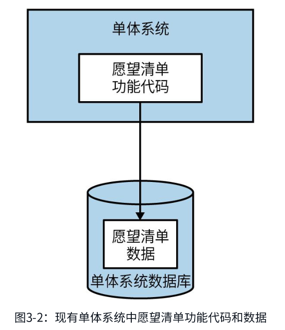

#### 代码优先

在图 3-3 中，我们将与愿望清单功能相关的代码拆分到新的微服务中。这个时候，愿望清单的数据仍保留在单体系统的数据库中，只有把愿望清单微服务相关的数据移出来后，分解工作才算完成。

根据我的经验，这往往是最常见的第一步，主要是因为它通常会带来更多的短期好处。如果将数据一直留在单体系统的数据库中，会为将来带来很多麻烦，因此这个问题也需要解决，不过至少从新的微服务中已经可以获得不少益处。

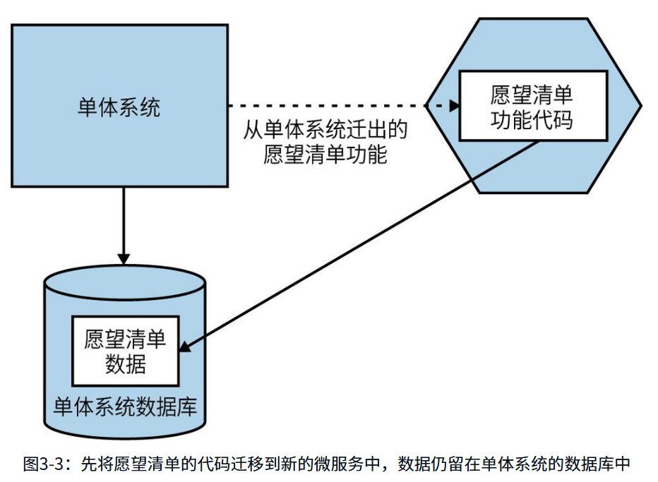

拆分应用服务的代码往往比拆分数据库容易。当发现无法整洁地拆分应用服务代码时，我们可以随时停下来，从而避免对数据库的拆分。但如果代码被整洁地拆分出后，你发现无法拆分数据库，那就麻烦了。因此，即便决定在拆分数据库之前先拆分代码，你也需要先理解相关的数据存储情况，并想清楚数据库拆分是否可行以及如何实现。因此，在实际动手前要想出拆分应用服务代码和数据的办法。

#### 数据优先

在图 3-4 中，我们首先拆分数据库，然后才是应用服务代码。这种方法比较少见，但它在不确定数据是否可以被整洁地拆分出来的情况下，还是很有用的。在进行相对更容易的代码迁移工作之前，这样做可以证明这种拆分方案是否可行。

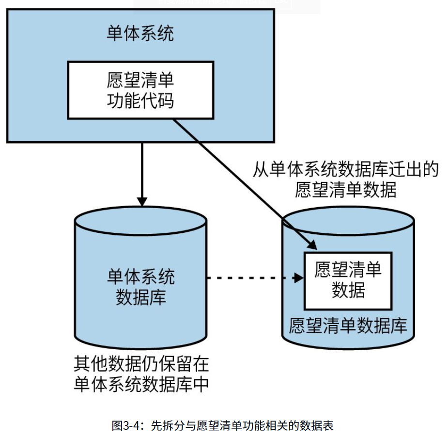

采用这种方法在短期内的主要好处是降低了全面拆分微服务的风险。它迫使你提前处理一些问题，比如数据库中的数据失去完整性约束或无法跨数据库使用事务等。

3.6 有用的拆分模式

......

### 3.7 拆分数据库的注意事项

#### 性能

**数据库，尤其是关系数据库，擅长实现跨不同表的数据关联。这非常有用，而且事实上，这会被认为是理所当然的。但是按微服务的要求拆分数据库时，我们通常不得不将数据关联操作从数据存储层移动到微服务内部。无论采用什么方法，操作速度都不如在数据库中那么快。**

图 3-6 描述了在 MusicCorp 遇到的情况。

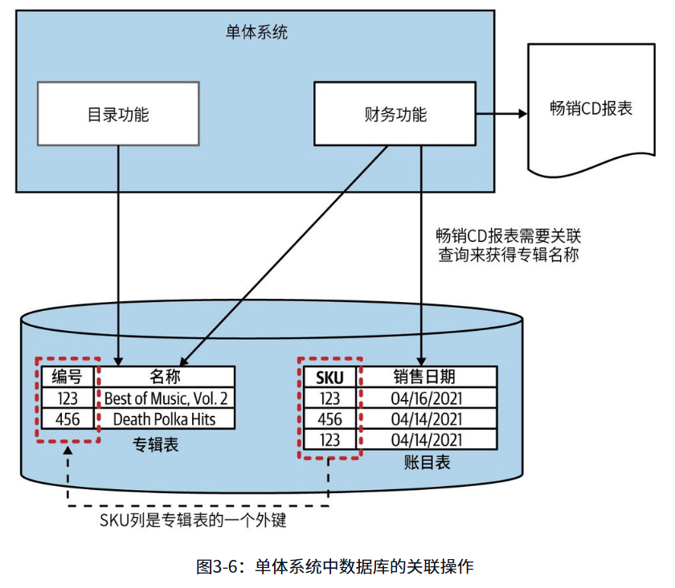

在基于微服务的新架构中，新的财务微服务负责生成畅销报表，但其在本地并没有专辑的信息，所以它需要从新的专辑目录微服务中获取这些数据，如图 3-7 所示。生成报表时，财务微服务首先查询账目表，提取上个月最畅销的SKU 列表。

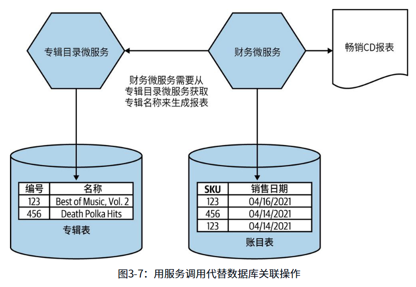

从逻辑上讲，关联操作仍然存在，但它现在发生在财务微服务的内部，而不是在数据库中。关联已从数据层转移到应用服务层。可惜这个操作不会像数据库中实现的关联那样高效。

#### 数据完整性

数据库可用于确保数据的完整性。回到图 3-6，由于专辑表和账目表都在同一个数据库，我们就可以（且很可能会）在账目表和专辑表中的行之间定义外键约束。这将确保我们始终能够从账目表中的记录关联到相关专辑的信息，因为只要账目表引用了它们，就无法从专辑表中删除这些被引用的记录。

由于这些表现在存在于不同的数据库中，因此无法强制实现数据的完整性约束。没有什么可以制止删除专辑表中行的行为，所以当试图准确计算售出商品时，就会引发问题。

**在某种程度上，我们只需要“习惯”这个事实，即不能再依赖数据库来强制实现数据实体间关系的完整性。**显然，对于仍然保留在单个数据库中的数据来说，这不是问题。

我们有一些变通的方法，而“应对模式”这一术语可能更适合描述这个问题的处理方法。我们可以在专辑表中使用软删除，这样做，记录实际上并没有被删除，而只是被标记为已删除。另一种方式是，在发生销售时将专辑名称复制到账目表中，但我们必须考虑如何同步专辑名称的变更。

#### 事务

**我们许多人已经依赖于在数据库事务中管理数据所获得的保障。基于这种确定性，我们构建了应用程序，知道可以依靠数据库处理许多事情。但是，一旦开始将数据拆分到多个数据库，我们就会失去业已习惯的 ACID 事务所提供的一致性保障。**

对于在单个事务边界中就能管理系统所有状态变更的人来说，转向分布式系统可能会带来冲击，且人们通常的反应是寻求实现分布式事务，以重新获得在简单架构下 ACID 事务所带来的保障。可惜的是，正如 6.1 节所介绍的那样，**分布式事务不仅实现起来很复杂，而且即便做得再好，它实际上还是无法提供在更小范围的数据库事务中所期望的那种保障。**

**工具**

......

**报表数据库**

......

## 第4章 微服务间通信模式

对许多人来说，正确地实现微服务间通信并不容易，这往往是因为在选择技术时，他们没有仔细斟酌各种可能的通信模式，而是直接选择了某种技术。因此，在本章中，我将梳理不同的通信模式，展示每种模式的优缺点，并帮助你选择最合适的通信模式。

### 4.1 从进程内到进程间

下面，我们来看看进程内调用和进程间调用的不同之处，以及它们对于我们理解微服务间交互的影响。

#### 性能

从根本上讲，进程内的调用性能与进程间的调用性能是不同的。当执行进程内调用时，底层的编译器和运行时可以使用各种优化技巧来降低调用的开销，例如在编译阶段使用内联(inline)技术，从而避免在运行时产生真正的调用。但是进程间通信没有这样的优化方式，通信数据包必须被发送。相比于进程内调用的开销，进程间调用的开销大得多。

这种差异通常会让你重新考虑 API 的设计。一个在进程内合理的 API 调用不一定在进程间仍然合理。在进程内，我可以跨 API 边界执行 1000 次调用而不必担心性能问题。但是，我会在两个微服务之间执行 1000 次网络调用吗？答案可能是否定的。

给方法传递参数时，数据不会移动，就如同传递了指向内存地址的指针。将一个对象或数据传递给另一个方法不需要分配新的内存来复制数据。

但是，当通过网络进行微服务间调用时，数据实际上被序列化为某种可以在网络上传输的格式，然后再发送到另一端时进行反序列化。因此，我们需要更加关注进程间发送的负载大小。那么上次你在进程内考虑数据的大小是什么时候呢？实际上，你可能原本没必要知道数据的大小，但现在必须加以考虑。你自然会尝试减少发送和接收的数据的大小（这对信息隐藏来说可能不是坏事），选择更高效的序列化机制，甚至会考虑将数据转存到文件系统中，并通过传递文件位置来代替直接传递数据。

这些不同的操作并不会直接产生问题，但必须谨慎对待。我曾看到很多设计，尝试对开发人员隐藏网络调用的存在。他们期望通过创建抽象来隐藏细节，从而能够更有效地做更多的事情，**但是有时候，抽象也隐藏了本不应该隐藏的内容。开发人员需要知道某个操作是否会触发网络调用，否则，在遇到性能瓶颈问题时，你可能会意外地发现某一处的代码引入了意想不到的跨服务调用。**

#### 接口变更

当进程内接口发生变更时，我们可以轻松列出所有需要进行的更改，因为实现接口的代码和调用接口的代码都打包在同一进程中。实际上，如果在支持代码重构的 IDE 中更改了方法签名，IDE通常会连带对该方法的调用自动重构。

然而，在微服务间的通信中，提供接口的微服务和使用该接口的消费者微服务是分开部署的。当微服务接口进行向后不兼容的变更时，我们要么需要与消费者进行同步部署，以确保将变更更新到使用新接口的版本，要么找到某种方法分阶段推出新的契约。

#### 错误处理

在进程内调用方法时，错误的性质往往非常直观。简单来说，这些错误会通过调用栈向上传递，它们要么是可预期且可处理的，要么是不可处理的严重错误。总的来说，错误是可确定的。

而在分布式系统中，错误的性质可能是不同的。你会面临许多超出控制范围的错误。例如，网络超时、下游微服务临时失效、网络断开、容器因内存消耗过大而被强制终止，甚至在极端情况下，数据中心可能发生了局部火灾。

在 Distributed Systems: Principles and Paradigms, 3rd Edition 这本书中，其作者Andrew Tanenbaum和Maarten Steen列举了**进程间通信中可能遇到的 5 种故障**。以下是这 5 种故障的简述：

- 崩溃故障：一切运行正常，直到服务器崩溃。只能重启服务器。
- 遗漏故障：你发出了一些请求，但没有得到响应。
- 时效故障：有些事情发生得太晚（没有及时实现），或者发生得太早。
- 响应故障：收到了一个响应，但它似乎是错误的。例如，你请求获取订单摘要，但响应中缺少所需的信息。
- 恶性故障：也称为“拜占庭故障”(Byzantine failure)，是指出现了故障，但参与者无法就故障是否发生（或为什么发生）达成一致。

这些错误中有不少是暂时性的，可能会随着时间流逝而消失。考虑这样一个场景：你向一个微服务发送请求，但没有收到响应（类似于遗漏故障）。这可能意味着下游微服务从一开始就没有收到请求，因此我们需要重新发送请求。其他问题就没这么容易处理了，还可能需要运维人员的介入。因此，为错误返回更清晰、更详细的语义描述非常重要，这样客户端才可以采取更适合的应对措施。

4.2 进程内的通信技术：选择众多

在选择太多而时间受限的情况下，最简单的做法就是忽略那些不重要的事情。——Seth Godin

......

### 4.3 微服务间的通信模式

图 4-1 展示了我用来思考不同通信模式的模型概貌。虽然这个模型并不完全和详尽（我并不想在这里提出一个关于进程间通信的大一统理论），但它为微服务架构广泛使用的不同通信方式提供了一个高阶概述。

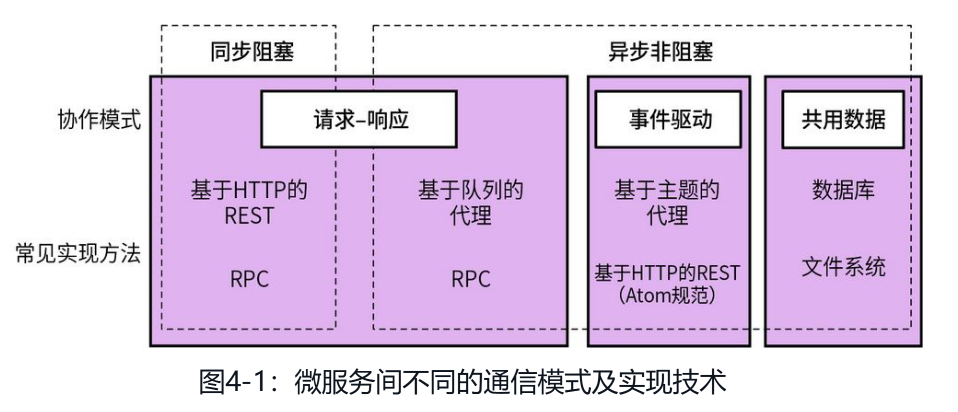

在更加详细地探讨该模型中的不同元素前，我想先简要描述下这些元素：

- 同步阻塞：当微服务调用另一个微服务时，在等待响应期间暂停其他操作。
- 异步非阻塞：无论是否收到响应，发出请求的微服务会继续进行其他操作。
- 请求 - 响应：微服务向另一个微服务发送请求，要求完成某事，并期望收到告知该请求结果的响应。
- 事件驱动：微服务发出事件，其他微服务消费这些事件并做出相应的反应。发出事件的微服务对其消费者（如果有的话）的使用无感知。
- 共用数据：虽然不常被看作是一种通信方式，但是微服务可以基于一些可共同使用的数据源完成协作。

当使用这个模型来帮助团队找到正确的方法时，我花了很多时间了解团队的运行环境。团队在可靠通信、可接受的延迟和通信量方面的需求都会影响技术选型。**但总的来说，我倾向于在给定情况下，首先确定是选择请求 - 响应的协作方式还是事件驱动的协作方式。如果考虑请求 - 响应的协作方式，那么使用同步实现还是异步实现，可以在下一步再去选择。但是，如果选择事件驱动的协作方式，我的实现选择将仅限于异步非阻塞。**

在选择合适的技术时，我们还需要考虑许多其他因素，这些因素超出了通信模式的范围，例如，对低延迟通信的需求、与安全相关的要求或扩展能力。

### 4.4 同步阻塞模式

通过同步阻塞调用，微服务向下游进程（可能是另一个微服务）发起某个调用，并等待该调用完成，此时也意味着收到了响应。在图 4-2 中，订单处理器微服务向积分微服务发起了调用，通知其将一些积分添加到客户的账户中。

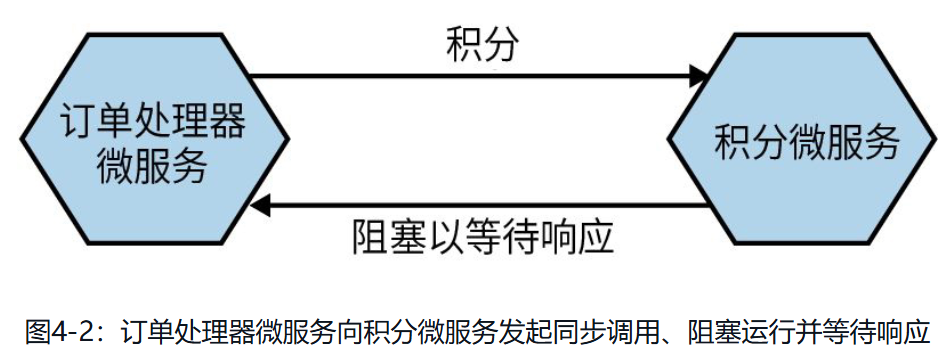

通常，同步阻塞调用会等待下游进程的响应，这可能是因为下一步的操作需要用到其结果，或者只是因为它要确保调用有效；如果没有成功，则会进行重试。因此，几乎每个同步阻塞调用都会形成一个请求 - 响应的配对。

**缺点**

**同步调用的主要挑战是内在的时间耦合**。在前面的示例中，当订单处理器微服务在调用积分微服务时，积分微服务需要可被访问才能使这个调用成功。如果积分微服务不可用，则调用将失败，且订单处理器微服务需要确定要执行什么样的补偿性操作——可能是立即重试、稍后重试或者完全放弃。

**这种耦合是双向的。**在这种集成方式下，响应通常使用相同的入站网络连接发送给上游微服务。因此，如果积分微服务想要将响应发回订单处理器微服务，但上游实例又宕机了，则响应会丢失。

由于调用的发起方被阻塞并等待下游微服务的响应，因此如果下游微服务响应速度缓慢，或者有网络延迟问题，那么调用的发起方将被阻塞，并长时间等待回复。如果积分微服务负载很大且对请求的响应速度很慢，这将会导致订单处理器微服务的响应也变慢。

因此，与使用异步调用相比，使用同步调用会使系统更容易受到下游故障引发的连锁问题所带来的影响。

### 4.5 异步非阻塞模式

在异步通信模式下，通过网络发送调用的行为不会阻塞微服务的运行，微服务能够继续进行其他工作而无须等待响应。异步非阻塞通信有多种形式，但这里将详细地探究微服务架构中最常见的3种：

- 共用数据通信：上游微服务更改一些共用数据，这些数据随后被其他微服务使用。
- 请求 - 响应：一个微服务向另一个微服务发送一个请求，要求其完成某项任务。当操作完成时，无论成功与否，上游微服务都会收到响应。
- 事件驱动的交互：微服务广播一个事件，可以将其视为对已发生事件的事实陈述。其他微服务可以监听感兴趣的事件并做出相应的处理。

**优点**

采用异步非阻塞通信后，发起调用的微服务和被调用的微服务（可以是多个微服务）可以在时间上是解耦的。被调用的微服务不需要在此时立刻接收调用。

当所调用的功能处理时间较长时，这种通信方式也很有用。在图4-5中，订单处理器微服务已经接受付款并准备发货，因此它向仓库微服务发送了一个调用。查找CD、从货架上取下、打包并邮寄的过程可能需要几个小时，甚至数天，所需时间取决于实际发货工作的流程。因此，订单处理器微服务向仓库微服务发起一次异步非阻塞调用是合理的。这样，仓库微服务可以稍后通过回调来通知订单处理器微服务订单处理的进度。这是一种异步请求 - 响应通信的形式。

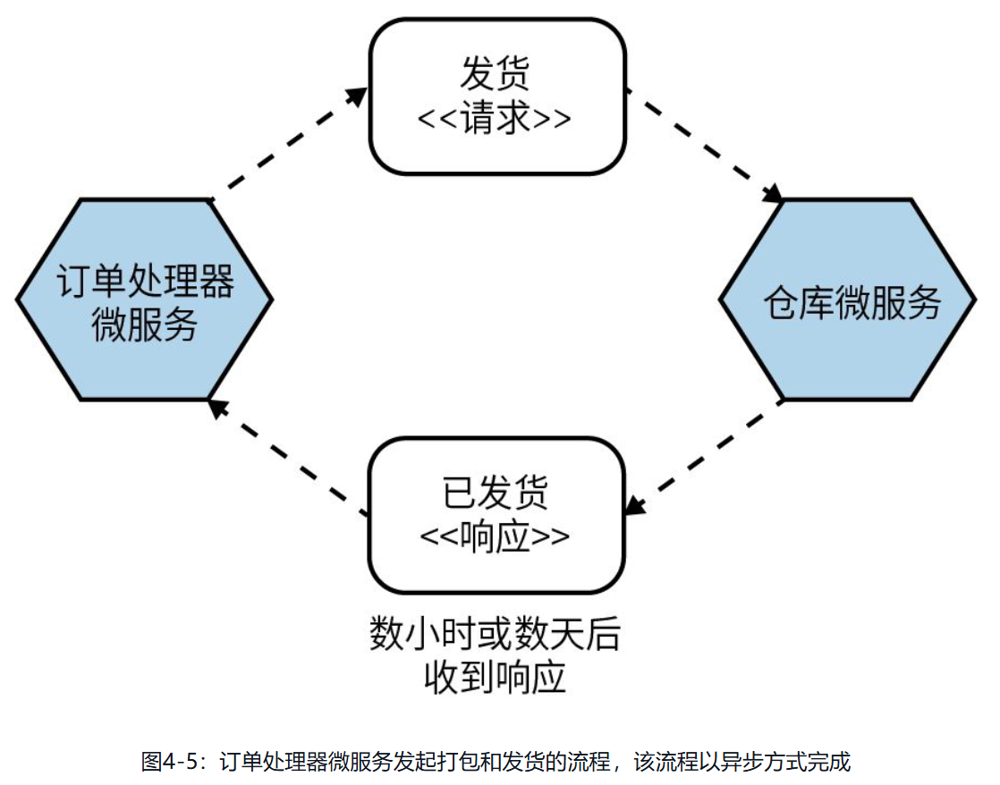

**适用情况**

在考虑异步通信是否适合时，需要同时考虑拟选异步通信的类型和其优缺点。接下来，我们将更深入地探讨3种常见的异步通信形式——共用数据模式、请求 - 响应模式和事件驱动模式。

### 4.6 共用数据模式

**该模式的核心是，在一个微服务中将数据放置在约定好的位置，然后另一个（或多个）微服务会去使用这些数据。**这种方式可能很简单，例如一个微服务只需将文件放在某个位置，另一个微服务稍后会获取该文件并对其进行处理。这种集成方式本质上是异步的。

图4-6是这种模式的一个例子，其中产品导入微服务创建了一个文件，然后下游的库存微服务和专辑目录微服务将读取该文件。

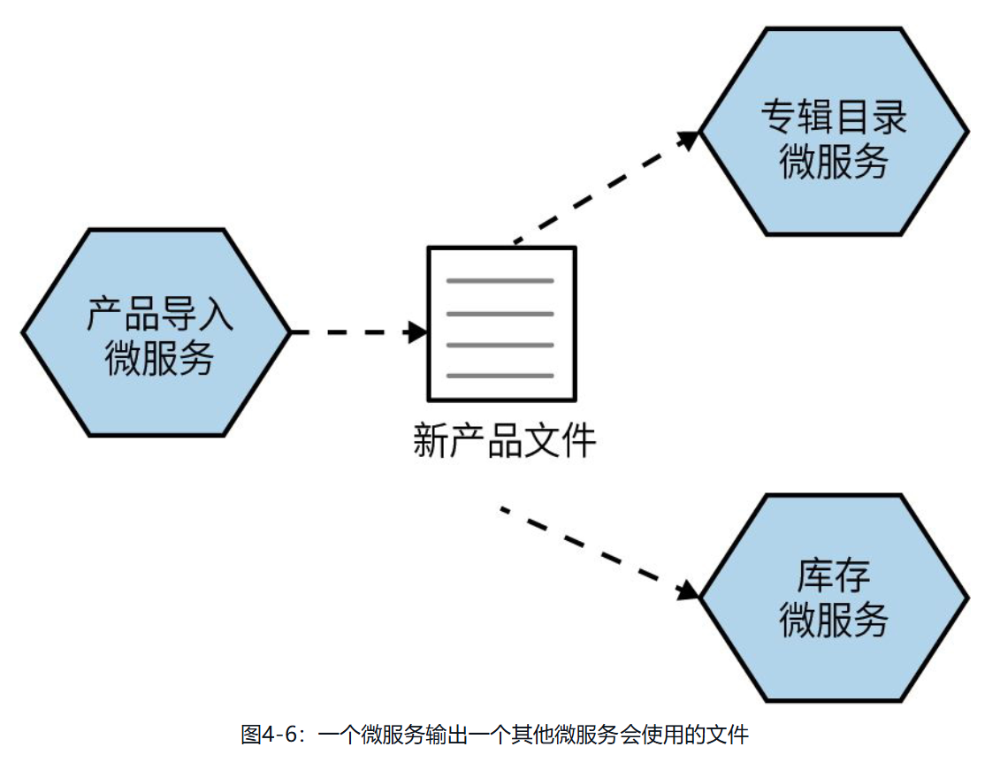

这种模式是你会遇见的最常见的通用进程间通信模式，但有时你可能根本没有意识到它是一种通信模式。

**实现**

实现这种模式需要某种数据的持久化存储机制。在大多数情况下，一个文件系统可能就已经足够了。我曾经构建过很多系统，它们只需要定期扫描文件系统，观察新文件并对其进行处理。当然，你也可以使用某种强大的分布式内存存储机制。但需要注意的是，任何需要处理这些数据的下游微服务都需要自己的机制来检测新数据的可用性——轮询是解决这个问题的常见方案。

这种模式的两个常见例子是数据湖和数据仓库。这两种场景的解决方案通常是为了处理大量数据而设计的，但可以说，**两者的耦合程度处在耦合度光谱的两端（数据湖为松耦合，数据仓库为紧耦合）。使用数据湖方案时，数据源可以以它们认为合适的任何格式上传原始数据，而下游消费者需要知道如何处理这些原始数据。对于数据仓库，它本身就是一个结构化的数据存储。**将数据推送到数据仓库的微服务需要知道数据仓库的数据结构——如果这种结构以向后不兼容的方式发生了变化，那么数据生产者也需要进行更新。

**缺点**

下游的消费者微服务通常会通过某种轮询或周期性触发的定时作业来检测新数据并进行处理。这意味着在低延迟要求的场景下，这种机制的可用性较低。当然，这种模式也可以与其他类型的调用结合使用，通知下游微服务有新数据可用。例如，你可以将文件写入共享文件系统，然后向感兴趣的微服务发起一个调用，通知它可能需要处理新数据。这可以缩短数据发布和数据处理之间的时间间隔。不过，如果将这种模式用于有大量数据的场景中，那么低延迟要求的优先级一般不会很高。但是，如果你确实需要发送大量数据并希望进行“实时”处理，那么使用像Kafka这样的流技术会更合适。

如果你还记得在图4-7中对公共耦合的讨论，那么另一个缺点就会相当明显，即共用数据存储会成为潜在的耦合因素。如果该数据存储以某种方式改变了结构，它可能会破坏微服务之间的通信。

### 4.7 请求-响应模式

**通过请求 - 响应模式，微服务会向下游服务发送请求，要求其执行某些操作，并给予带有请求结果的响应。这种交互可以通过同步阻塞调用来进行，也可以采用异步非阻塞方式来实现。**图4-8展示了这种交互的一个简单示例。在此示例中，排行榜微服务会汇总不同流派的畅销CD，并向库存微服务发送请求，以查询CD当前的库存情况。

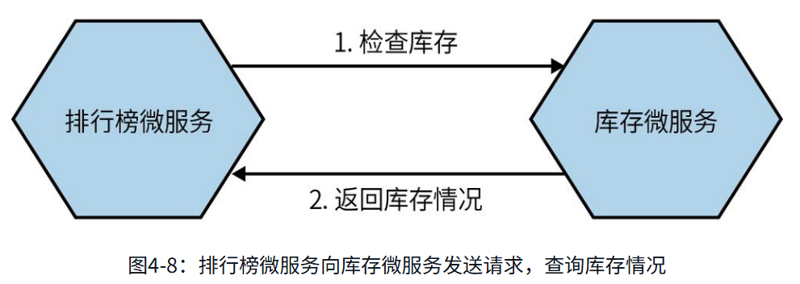

像这样从其他微服务中检索数据是请求 - 响应模式的常见用例。但有时，你只需要确保任务完成。在图4-9中，仓库微服务收到了来自订单处理器微服务的请求，要求保留库存。订单处理器微服务只需要知道库存已成功预留，就可以接受付款。如果无法预留库存（比如商品暂停销售），则取消付款。类似这种需要按照特定顺序完成调用的情况，时常会采用请求 - 响应模式。

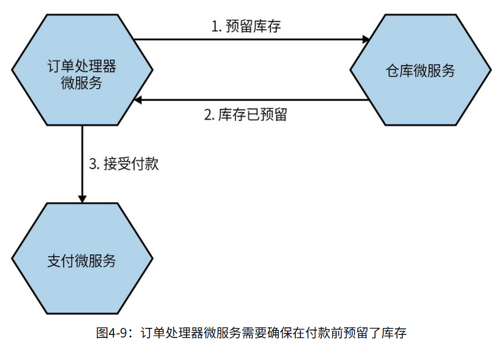

#### 实现：同步与异步

请求 - 响应模式可以通过同步阻塞或异步非阻塞的方式实现。同步调用通常会打开网络连接与下游微服务通信，并通过该网络连接发送请求。**当上游微服务等待下游微服务响应时，该网络连接保持开启状态。在这种情况下，发送响应的微服务并不需要了解发送请求的微服务，它只需要通过入站网络连接发送响应信息。**如果上游或下游微服务实例中止导致连接中断，我们可能会遇到麻烦。

而使用异步方式实现请求 - 响应模式，情况会比较复杂。让我们重新看一下和预留库存有关的具体流程。在图4-10中，预留库存的请求作为消息通过某种消息代理发送。这条消息不会从订单处理器微服务直接发送到仓库微服务，而是会被存放在队列中。当可用时，仓库微服务会获取此队列中的消息。它读取请求，执行与预留库存相关的工作，然后将响应发送回订单处理器微服务正在读取的队列。仓库微服务需要知道将响应路由到何处。在这个示例中，它通过另一个队列将此响应发回，而该队列会被订单处理器微服务读取。

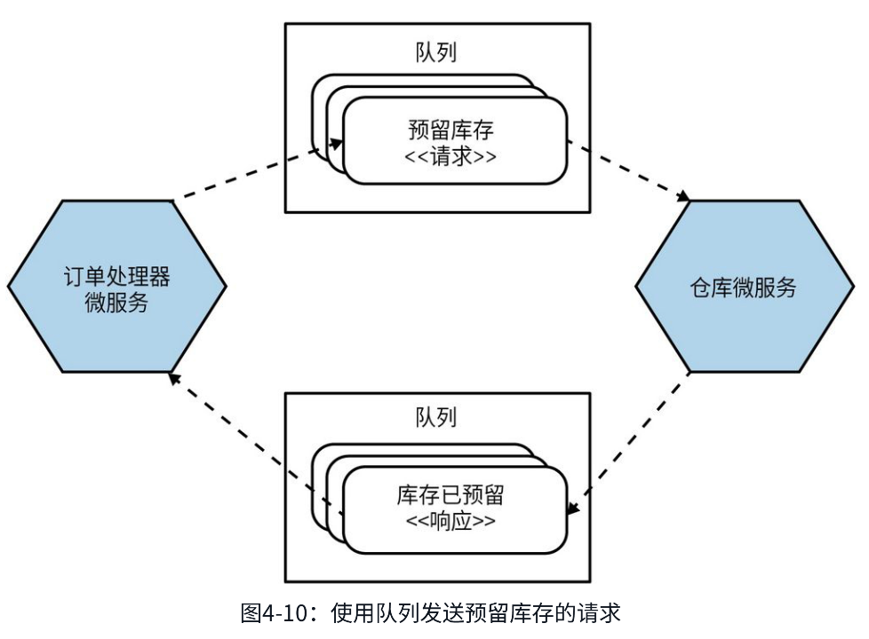

因此，在异步非阻塞实现方式中，接收请求的微服务需要知道如何路由响应，或者被告知响应应该发回到哪里。使用队列还会带来一个额外的好处，即多个请求可以在队列中缓冲等待处理。这在请求无法被迅速处理的时候会很有帮助。微服务可以在准备好后接收下一个请求，而不会被过多的调用淹没。当然，这在很大程度上需要依赖于接收请求的队列中间件。

**当微服务以这种方式获取响应时，需要将响应与请求关联起来。**这通常具有一定的挑战性。处理这个问题的一种简单方法是，将与原始请求相关联的任何状态都存储到数据库中，这样当响应到达时，接收响应的微服务实例可以重新加载任何相关状态并做出相应的操作。

**最后需要注意的一点是，所有形式的请求 - 响应交互都可能需要某种形式的超时处理，以避免系统因等待可能永远不会发生的事情而被阻塞。**超时处理的实现方式可能因具体实现技术而异，但一定要实现。

**适用情况**

请求 - 响应模式非常适合两种情况：一种是后续工作依赖于当前的请求结果；另一种是微服务想知道调用是否成功的情况（如果调用失败可以执行某种补偿操作，比如重试）。如果符合以上任何一种情况，那么请求 - 响应模式是个好办法。剩下的唯一问题就是确定使用同步方式还是异步方式实现，这需要进行权衡。

### 4.8 事件驱动模式

与请求 - 响应模式相比，事件驱动模式看起来很奇特。与要求其他微服务执行某项任务不同，微服务是要发出事件，这些事件可能会也可能不会被其他微服务接收到。

事件是关于已发生事件的描述，主要是指发出事件的微服务所发生的事情。发出事件的微服务并不知道其他微服务使用该事件的意图，实际上它甚至可能不知道其他微服务的存在。它在需要时发出事件，这就是它的全部职责。

在图4-11中，仓库微服务发送出与订单打包过程相关的事件。这些事件会由通知微服务和库存微服务接收，它们会分别做出相应的处理。通知微服务会发送一封电子邮件，为客户更新订单状态，而库存微服务可以在商品放入客户订单中时更新库存情况。

仓库微服务只是广播事件，并假定感兴趣的相关方会自行做出相应的处理。它不知道事件的接收者是谁，这使得事件驱动的交互通常更加松散。和请求 - 响应模式相比，我们需要多花一些时间才能理解职责的倒置。

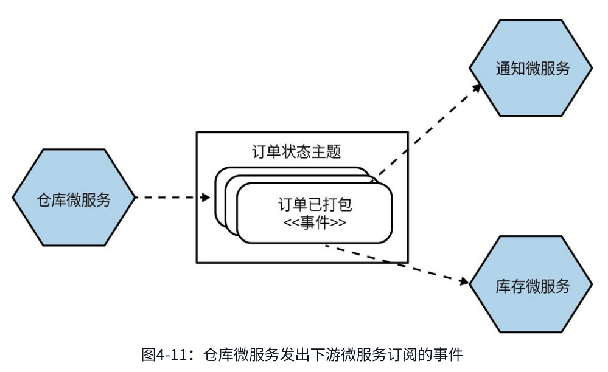

采用事件可以被视为采用请求的反面。事件发布方将“要做什么”交给接收方来决定。通过请求 - 响应模式，发送请求的微服务知道应该做什么，并告诉其他微服务下一步应该做什么。这说明在请求 - 响应模式中，请求者必须知道下游接收者的能力，这就意味着更大程度的耦合。而在事件驱动的协作中，事件发布方不需要知道下游微服务的能力，实际上甚至可能都不知道它们的存在，因此耦合度大大降低。

**在事件驱动的交互中所看到的职责分配方式可以反映出组织在试图构建更多的自治团队。我们不想把所有的职责都集中在一起，而是希望将职责分配给团队本身，让团队以更自主的方式运作。**在这个例子中，我们将职责从仓库微服务转移给了通知微服务和库存微服务，这有助于降低仓库微服务等微服务的复杂性，实现更均匀分布的“智能化”系统。

#### 事件和消息

有时，“消息”和“事件”这两个术语会让人混淆。一个事件是一个事实，一个关于已经发生事情的陈述，以及一些相关的信息。而消息一般是通过异步通信机制（比如消息代理）发送的东西。

在事件驱动的协作中，如果需要广播事件，实现这一广播机制的典型方法是将事件放入消息中。**消息是媒介，事件是有效负载。**

同样，我们也可能需要将请求作为消息的有效负载发送，在这种情况下，我们要实现的是一种异步形式的请求 - 响应交互。

#### 实现

在实现事件驱动模式时，我们需要考虑两个主要问题：微服务发出事件的方式和消费者发现事件的方式。

传统上，类似RabbitMQ这样的消息代理可以解决这两个问题。生产者可以使用API将事件发布到代理中，代理会处理订阅，使得消费者可以在事件到达时获得通知。这些代理甚至可以处理消费者的状态，例如帮助消费者追踪之前看过的消息。这些系统通常可伸缩并具备弹性，但这并非没有代价。它可能会增加开发过程的复杂度，因为它是开发和测试微服务时额外需要运行的系统。此外，还可能需要额外的服务器和专业知识来维护这一基础设施的正常运行。但是，一旦实现，它将是一种非常有效的实现松耦合、事件驱动架构的方法。总的来说，我赞成使用这种方法。

......

#### 事件

在图4-12中，客户微服务正在广播一个事件，通知相关方有新客户在系统中注册成功。两个下游微服务——积分微服务和通知微服务——都关注了这个事件。积分微服务为新客户开设了一个账户来作为该事件的响应，这样客户就可以开始赚取积分，而通知微服务则向新客户发送了一封电子邮件。

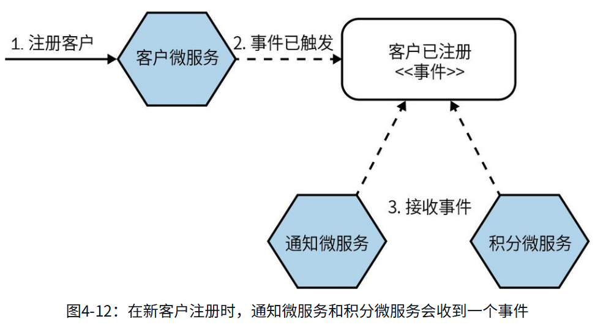

通过请求，我们可以要求微服务执行某些操作，并同时提供执行请求的操作所需的信息。而事件则被用来广播一个其他方可能感兴趣的事实，但由于发出事件的微服务不能且不应该知道谁会接收该事件，我们如何才能知道其他方可能需要从该事件中获得什么样的信息呢？事件究竟应该包含什么呢？

#### 只有ID

一种方法是让事件只包含新注册客户的标识符。积分微服务只需要这个标识符来创建对应的会员账户，所以它获得了所需的全部信息。尽管通知微服务知道收到此类事件时要发送一封欢迎电子邮件，但它还需要额外的信息来完成这个工作，例如客户的姓名和至少一个电子邮件地址，以便生成更加个性化的电子邮件。由于通知微服务无法从接收到的事件中获取这些信息，因此它只能从客户微服务中获取这些信息，如图4-13所示。

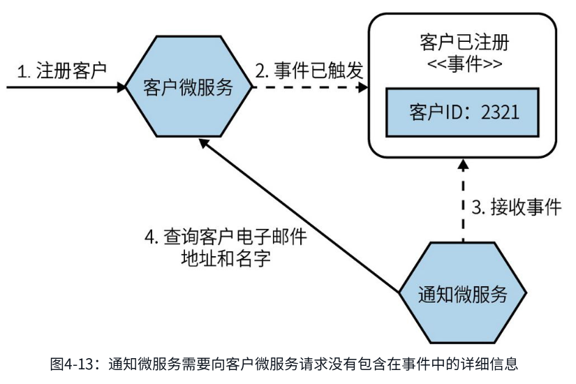

这种方法存在一些缺点。首先，通知微服务现在必须知道客户微服务，这增加了额外的领域耦合。如果接收到的事件中包含通知微服务所需的所有信息，则无须再次调用查询。由接收微服务发出回调也可能暴露另一个主要缺点，即在有大量接收微服务的情况下，发出事件的微服务可能会收到一连串的请求。

#### 完整的事件

我更喜欢的另一种方法是，将所有通过API共享的内容放入一个事件中。如果通知微服务需要客户的电子邮件地址和姓名，为什么不将这些信息直接放在事件中呢？在图4-14中，我们可以看到这种方法，通知微服务现在更加自主，无须与客户微服务通信即可完成其工作。事实上，它可能永远不需要知道客户微服务的存在。

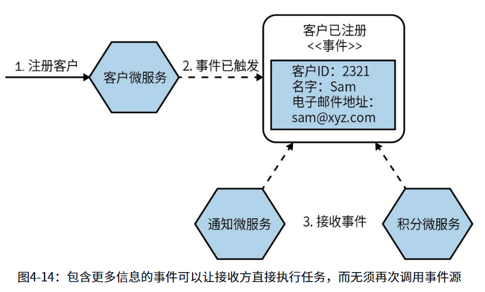

虽然我更喜欢这种方法，但它也有缺点。首先，如果与事件关联的数据量很大，我们可能会担心事件的大小。现代的消息代理（假设使用它来实现事件广播机制）对消息大小有相当大的限制。Kafka中消息大小的默认上限为1 MB，而最新版本的RabbitMQ对单个消息的理论上限为512 MB。如果你开始担心事件规模过大，那么我建议考虑混用，将其中一些信息放在事件里，但其他（较大的）数据可以在需要时再去查找。

在图4-14中，积分微服务不需要知道客户的电子邮件地址或姓名，但它仍然可以通过事件获取到这些数据。例如我们可能想限制一些微服务看到个人身份信息（或PII）、支付卡详细信息或类似的敏感信息。解决这个问题的一种方法是发送两种不同类型的事件：一种包含PII且仅可以被某些微服务看到，另一种不包含PII且可以被广泛地广播。**这在“管理不同事件的可见性和确保两个事件都被实际触发”两个方面都增加了复杂性。如果微服务发送了第一种类型的事件，但在发送第二种类型的事件前崩溃的话，会发生什么呢？**

另一个需要考虑的因素是，**一旦将数据放入事件中，它就会成为与外部签订的契约的一部分。**我们必须意识到，如果在事件中删除某个字段，就可能会影响外部各方的使用。信息隐藏仍然是事件驱动协作中的一个重要概念——放到事件中的数据越多，外部各方对该事件的假设就越多。

#### 适用情况

事件驱动的协作方式在需要广播信息的情况下非常有用。不要告诉下游微服务该做什么，而让它们自行决定，这种方式具有很大的吸引力。

但需要注意的是，这种方式通常会引入新的复杂性因素，尤其是在你接触它的机会不多、经验有限的情况下。

就个人而言，我倾向于将事件驱动的协作当作一种默认的选择。我的大脑似乎已经以某种方式进行了重构——采用这种通信方式对我来说显得理所当然。对你来说，这可能帮不上什么忙，因为很难解释其中的原因，只能说感觉上是对的。这种交互形式对我的吸引力，几乎完全来自之前在过度耦合系统中的糟糕经验。

我想说的是，抛开个人偏好，确实有越来越多的团队正在使用事件驱动的交互方式来取代请求 - 响应的交互方式。

### 4.9 谨慎行事

异步编程看起来很有趣，对吗？事件驱动的架构似乎对实现更为松散、可扩展的系统意义非凡。它们的确能够发挥这些优点，但是这些通信模式也会增加复杂性。复杂性不光源于管理发布和订阅消息，还包括其他可能面临的问题。例如，在处理长时间运行的异步请求 - 响应时，我们必须考虑响应返回时的处理方式。它是否需要返回到发起请求的节点？如果是，那么要是该节点关闭会发生什么？如果不是，是否需要在某处存储信息以便后续做出相应的反应？

与事件驱动架构和异步编程相关的复杂性时刻提醒我，一旦准备采用这些方法就应该更加谨慎。**你要确保有良好的监控机制，并考虑使用关联ID。它可以帮助你对跨进程边界的请求进行追踪。**

然而，我们也必须坦诚地对待那些可能被认为是“更简单”的集成模式——与确认调用是否成功有关的问题不仅局限于异步形式的通信。同步阻塞调用也会有相似的问题，例如调用超时是因为请求丢失导致了下游方没有收到，还是请求成功传递但响应丢失了？在这种情况下该怎么做？如果重试，但原始请求已经成功传递，那又该怎么办呢？（是的，这就是幂等的用武之地，第12章将会讨论这个主题。）

可以说，在故障处理方面，同步阻塞调用在判断事情是否发生时同样会带来让人头疼的问题，只是我们可能对这些问题更加熟悉而已！

4.10 小结

......

# **第二部分 实现**

## 第5章 实现微服务间通信

### 5.1 寻找理想的技术

在微服务之间通信方式的选择上可谓五花八门。SOAP、XML-RPC、REST、gRPC，究竟哪一个才是更恰当的选择？与此同时，新的技术层出不穷。因此在讨论具体技术之前，我们先来思考一下选择某种技术时我们希望达成什么目标。

#### 轻松实现向后兼容

在对微服务进行更改时，我们需要确保所做的更改不会破坏微服务自身的向后兼容性。因此不论选择什么样的技术，我们都希望它可以方便我们实现向后兼容，比如添加新字段等简单的操作不应该对客户端造成影响。在理想情况下，我们希望有一种机制能够验证我们所做的更改的向后兼容性，并在将更改部署到生产环境之前，可以提供相应的反馈。

#### 明确你的接口

微服务对外提供的接口必须明确。微服务提供的功能对消费者必须清晰可见。微服务开发人员必须清楚，哪些功能是需要对外保持不变的，因为我们希望尽量避免因微服务的更改而导致其兼容性被破坏。

提供显式模式的接口定义可以在很大程度上确保微服务提供的接口是明确的。有的技术工具要求提供模式定义；而有的技术工具对模式的定义是可选的。但无论采用何种技术，我强烈建议使用显式的接口定义，并附带足够的文档，确保消费者能够清晰地了解微服务对外提供的功能。

#### 保持API的技术中立

只要你曾在IT行业里工作过，就会明白我们所处的工作环境变化得有多快。唯一确定不变的就是变化。新的工具、框架、语言层出不穷，帮助我们更快、更高效地实现新的目标。现在，你可能还在使用 .Net，但是1年以后呢？5年以后呢？又或者你想尝试新技术栈来提升工作效率，要怎么办呢？

我喜欢微服务是因为它能给我们更多选择的余地。因此，我认为在微服务间通信上选择中立的API技术是非常重要的。这意味着要尽量避免使用在实现上规定特定技术栈的集成方式。

#### 简化提供给消费者的服务

我们希望消费者能够轻松地使用我们的微服务。如果消费者使用的成本过高，那么微服务的设计即使再精巧也没有意义。所以，我们需要考虑如何让消费者能够更容易地使用我们的微服务。理想情况下，可以为消费者在技术选择方面提供较高的自由度；也可以通过提供客户端库来简化对微服务的调用。但是，提供的这些库通常与我们希望实现的其他目标不兼容。例如，通过提供客户端库简化了微服务的使用，但也会加剧耦合。

#### 隐藏内部实现细节

我们不希望消费者在使用微服务时与微服务的内部实现绑定在一起，因为这会加剧服务提供方和消费者之间的耦合；这也意味着，如果我们想改变微服务的内部逻辑，那么消费者也需要跟着进行相应的更改，从而导致成本的增加，而这正是我们想要避免的。这还意味着，因为担心必须升级消费者，我们就不太愿意对服务做更改，这会导致服务内部技术债的增加。因此，应当尽量避免选择会暴露微服务内部实现细节的技术。

### 5.2 技术选型

有很多技术可供选择，但在这里我们先重点介绍一些最受欢迎、最有趣的选择。以下是一些可以关注的选项。

- 远程过程调用：一种允许像调用本地方法一样完成远程程序调用的框架，常见的框架包括SOAP和gRPC。
- REST：一种API架构风格，使用这种技术可以对对外暴露的资源（客户、订单等）进行一系列常规操作(Get、Post)。
- GraphQL：一种相对较新的协议。使用该协议，消费者可以自定义查询，从多个下游微服务获取信息；该协议支持对查询结果进行过滤，并只返回所需要的内容。
- 消息代理：通过队列或主题来支持异步通信的中间件。

#### 远程过程调用

远程过程调用(RPC)是一种可以在本地进行调用，但在远程服务上执行的技术。在使用过程中，RPC有很多不同的实现。**这个领域中的大多数技术通常要求使用显式模式，例如SOAP或gRPC。**在RPC的上下文中，模式是使用“接口定义语言”(interface definition language，IDL)定义的，SOAP的模式格式则为“Web服务描述语言”(Web service definition language，WSDL)。**采用独立的模式定义可以更容易为不同的技术栈生成对应的客户端和服务端代码**，例如我们可以用Java实现一个SOAP接口的服务端，并使用相同的WSDL模式生成一个 .Net客户端。其他技术，比如Java RMI，会让服务端和客户端之间的耦合更加紧密，它要求服务端和客户端使用相同的底层技术实现，**但不需要单独定义服务接口**，因为Java的类型定义已经隐式提供了相应的功能。**然而，所有这些技术都有一个共同的特点：让远程调用看起来就像本地调用一样。**

**通常情况下，使用RPC技术意味着需要选择一种序列化协议。RPC框架定义了数据序列化和反序列化的方式。**例如，gRPC使用协议缓冲区(protocol buffer)格式进行序列化。**一些RPC技术的实现会绑定到特定的网络协议上**（比如SOAP，虽然它名义上是使用HTTP作为传输协议，但其本身是一种独立协议），**而另一些RPC技术的实现则可以使用不同类型的网络协议，并且提供更多的附加功能**。例如，TCP可以保证传输的可靠性，而UDP虽然无法保证可靠性，但开销更低。这使得我们可以根据不同的使用场景选择不同的网络技术。

RPC框架中因为有明确的模式定义，所以能够轻松生成客户端代码，因为任何客户端都可以基于模式生成自己的代码。但是，为了让客户端的代码生成可以正常工作，客户端需要以某种方式获取模式。换句话说，消费者需要在实际调用之前就可以获取模式。

生成客户端代码的便利程度通常是RPC技术的一个主要卖点。事实上，只需要进行一个简单的方法调用，而无须关心其他内容，这才是它的一个巨大优势。

**适用情况**

尽管存在缺点，但实际上我还是很喜欢RPC的，其中一些更为现代化的实现，比如gRPC是非常出色的。不过，也有一些实现存在很多问题，这会让我对它们敬而远之。例如，Java RMI在脆弱性和技术选型的限制方面存在许多问题。而SOAP从开发视角来看则是一种比较重的实现，特别是在和更为现代化的实现相比时。

如果你想使用RPC，一定要注意与它相关的一些陷阱。不要过分抽象远程调用，以至于网络调用全部被隐藏起来；同时，要确保服务端代码的更新与客户端代码的更新是松耦合的。为客户端的调用代码找到合适的平衡是很重要的，例如，确保客户端对即将进行的网络调用有所认知，而不是完全无视这一事实。

如果让我在这个领域里选择的话，gRPC一定是我的首选。它利用了HTTP/2的优势，在性能方面有显著的提升，且具有良好的易用性。gRPC的周边生态也十分友好。

gRPC非常适合同步的请求 - 响应模式，但它也仍然可以与响应式架构结合使用。**当我对服务端和客户端都有一定控制权的时候，我会选择这项技术。如果需要支撑各种各样的其他应用来调用你的微服务，那么基于服务端的模式来编译客户端代码可能会成为问题。在这种情况下，基于HTTP API的REST可能更加合适。**

#### REST

表示层状态转换(representational state transfer，REST)是一种受Web启发的架构风格。REST风格背后有许多原则和约束，但我们将重点关注那些在应对微服务集成挑战以及替换服务接口的RPC方案上真正能帮助我们的原则和约束。

谈及REST时，最重要的概念是资源。资源可以被视为服务自身所知道的内容，比如 Customer。服务端会根据请求提供 Customer 的不同的表现形式。资源的外部表现形式与其在内部存储的方式是完全解耦的。例如，客户端可能会请求一个以JSON形式展示的 Customer 资源，即使该资源是以一种完全不同的形式存储的。一旦客户端通过这些表现形式知道了某 Customer 的一些信息，它就可以发送更改的请求，而服务端可以接受也可以拒绝这些请求。

**REST自身并不受限于底层协议，不过在大多数情况下它是基于HTTP的。我之前见过并不基于HTTP的REST实现，那样需要做大量的工作。HTTP的某些特性，例如动词，使得基于HTTP来实现REST更为容易，而在其他协议中，你需要自己实现这些功能。**

**REST和HTTP**

HTTP定义了许多与REST风格非常契合的功能。例如，HTTP动词（比如GET、POST和PUT）在其规范中已经有了清晰的定义，说明了它们会如何操作资源。REST架构风格告诉我们，这些动词应该对所有资源保持相同的行为方式，而HTTP规范恰好定义了一些可以直接使用的动词。例如，GET以幂等的方式获取一个资源，而POST则会创建一个新的资源。

HTTP还有着相关工具和技术的庞大的生态体系。我们可以以透明的方式使用这些组件来处理和路由大规模的HTTP请求。我们也可以基于HTTP提供的安全控制方式实现安全通信。从基础认证到客户端证书，HTTP生态为我们提供了很多工具，可以用更便捷的方式来支持通信安全。也就是说，为了获得这些便利，你需要很好地使用HTTP。如果使用不当，它就会像其他技术一样，带来安全风险或者导致难以扩展。如果正确使用它，就会事半功倍。

要知道HTTP也可以用于实现RPC。举例来说，SOAP通过HTTP进行路由，但可惜的是，它很少利用HTTP规范。动词会被忽略，HTTP错误码等简单的东西也会被忽略。而gRPC的实现则更多利用了HTTP/2的优势，例如它具有通过单个连接发送多个请求 - 响应流的能力。

**挑战**

从过去的经验来看，在易用性上，你不能像使用RPC那样为基于HTTP的REST应用自动生成客户端代码。因此，提供REST API的服务方，通常会为其消费者提供客户端库，帮助他们更简便地调用API。这些客户端库为你实现了对API的调用，简化了客户端的集成工作。但这也同时增加了客户端和服务端之间的耦合。

近年来，这个问题得到了一定的改善。从Swagger项目发展而来的OpenAPI规范可以用来提供REST接口的信息，使你能更方便地使用不同语言生成相应的客户端代码。但据我所知，即使很多团队已经在用Swagger编写文档，真正利用这一功能的团队并不多。**我猜测可能是因为将其应用于现存的API上有一定的困难。我也担心以前仅用于文档的规范现在被用来定义更严谨的契约会带来更多问题，例如这可能会导致规范的复杂性**。

性能也可能是一个问题。基于HTTP的REST的消息体实际上可以比SOAP更紧凑，因为REST支持JSON甚至二进制等替代格式，但它仍然远不如Thrift那样精简的二进制协议。每个请求的HTTP开销也会对低延迟带来一定的挑战。当前使用的所有主流HTTP协议都需要在底层使用传输控制协议(transmission control protocol，TCP)，它与其他网络协议相比效率较低，而一些RPC实现支持其他网络协议替代TCP，比如用户数据报协议(user datagram protocol，UDP)。

尽管存在这些缺点，基于HTTP的REST仍然是服务间通信的默认选择。

#### GraphQL

GraphQL 是一种新兴的数据查询协议，专为高效获取数据而生。在传统的数据请求模式下，客户端就像在超市购物，只能按照既定的套餐（固定接口返回的数据格式）采购商品，即便有些东西并不需要。而 GraphQL 改变了这一局面，客户端成为 “点菜大师”，可以精准定制需求 ：

- 灵活查询：你能自由决定想要哪些数据，比如想获取一篇文章的标题、作者和部分内容，而不是接收整个文章附带的所有信息，就像点餐时只需主食、配菜，不要饮料。
- 跨服务整合：数据分散在不同微服务中？没关系！借助 GraphQL，客户端一次请求就能从多个微服务里捞取所需数据，就像点一桌菜，来自不同后厨却能同时上桌。
- 精准过滤：获取到数据后，还能按需筛选。例如查询电影列表时，只保留评分 8 分以上的影片，将其他数据 “过滤掉”，最终只接收自己真正需要的信息。

在传统的 API 架构中，当客户端需要的数据分散在不同的微服务时，客户端可能需要分别向各个微服务发送请求来获取数据。比如一个电商应用中，商品信息可能在商品微服务中，用户的购物车信息在购物车微服务中，订单信息在订单微服务中。若客户端需要同时获取商品、购物车和订单的相关数据，就要依次向这三个微服务发送请求，这增加了请求次数和网络开销。

而在 GraphQL 架构下，客户端可以通过一次 GraphQL 查询，将需要从不同微服务获取的数据要求都包含在一个请求中。服务端的 GraphQL 服务器接收到这个请求后，会根据查询内容，分别从对应的微服务中获取数据。比如上述电商应用，客户端通过 GraphQL 发起一个查询，指定需要商品名称、购物车中商品数量以及订单的总金额等数据。GraphQL 服务器会解析这个查询，向商品微服务请求商品名称数据，向购物车微服务请求购物车中商品数量数据，向订单微服务请求订单总金额数据。最后，GraphQL 服务器将从各个微服务获取到的数据进行整合，并将整合后的数据返回给客户端，就如同一次点了来自不同后厨的菜，这些菜同时被端上桌一样。这样大大简化了客户端获取数据的流程，减少了请求次数和网络开销，提高了数据获取的效率。

当使用 GraphQL 时，服务端需要做出以下一些改变：

- 架构调整：服务端需要建立 GraphQL 服务器，用于接收和处理客户端的 GraphQL 请求。这可能涉及到对现有后端架构的调整，以集成 GraphQL 相关的库和中间件。
- 数据解析：服务端要根据客户端的查询请求，从不同的数据源（如数据库、其他微服务等）获取数据，并进行解析和组装，以满足客户端的特定需求。
- 权限控制：由于客户端可以灵活自定义查询，服务端需要更精细地控制访问权限，确保客户端只能查询到其有权限访问的数据。
- 性能优化：服务端需要针对 GraphQL 查询进行性能优化，例如合理设计数据加载策略、缓存数据等，以提高查询响应速度，避免因复杂查询导致性能问题。

**挑战**

在GraphQL发展的早期，一个限制是语言支持的不足，那时只有JavaScript可选。现在，情况已经有了很大的改进，所有主流技术都支持该规范。事实上，GraphQL在很多方面都进行了显著的改进，比几年前更加可靠。不过，你还是需要了解与GraphQL相关的一些挑战。

**第一个问题是，由于GraphQL支持客户端动态构建查询，有些团队因此遇到了服务端负载过重的问题**。这和我们在使用SQL时可能遇到的问题是一样的。一条昂贵的SQL语句可能会导致数据库出现严重问题，从而影响整个系统的性能。GraphQL也存在同样的问题。不同的是，对于SQL，我们至少有数据库查询规划器之类的工具可以帮助我们诊断有问题的查询，而在GraphQL上，定位类似问题可能更具挑战。

**相较于常规的基于REST的HTTP API，GraphQL的缓存机制要复杂得多**。使用基于REST的API，我可以设置许多响应头来帮助客户端设备或内容分发网络(CDN)来缓存响应，从而避免重复请求。但在GraphQL中，这种方式不再可行。

**另一个问题是，虽然理论上GraphQL可以用于写入操作，但它似乎更适合读取操作。因此，很多团队都会使用GraphQL进行读取而使用REST进行写入。**

最后一个问题可能有些主观，但我认为仍然值得一提。GraphQL可能会给人一种错觉，让人觉得只是在处理数据，从而导致人们可能会错误地认为与其交互的微服务仅仅是数据库的一个访问层。事实上，我见过很多人将GraphQL和OData相提并论，后者是一种旨在作为通用API访问数据库的技术。**正如我们之前深入讨论的，将微服务简单地视为对数据库的封装会带来很大问题。微服务通过网络接口公开功能，其中一些功能可能需要公开数据或导致数据公开，但它们仍然应该具有自己的内部逻辑和行为。**所以，当使用GraphQL时，不要误以为你的微服务只是一个数据库上的接口——你的GraphQL API一定不要与微服务的底层数据存储耦合在一起。

#### 消息代理

消息代理通常被称为“中间件”，它们位于进程之间，用于管理进程间的通信。消息代理常被用在微服务间的异步通信中，因为它们提供了许多强大的功能。

正如我们前面讨论过的，**消息是一个通用概念，它定义了消息代理要传输的内容。消息可以包含请求、响应或事件。**与微服务间的直接通信不同，微服务会将消息传递给消息代理，并在消息中指明发送的方式和目标。

**主题和队列**

**代理通常提供队列或主题，或者两者兼有。队列通常是点对点的。发送方将消息放入队列，消费者从该队列中读取。在使用基于主题的系统中，多个消费者可以订阅一个主题，每个订阅的消费者都会收到该消息的一个副本。**

在图5-1中，我们看到了一个示例，其中订单处理器微服务部署了3个实例，它们都属于同一个消费者组。当一条消息被放入队列时，只有一个组成员会收到该消息；这意味着队列提供了负载均衡的机制。

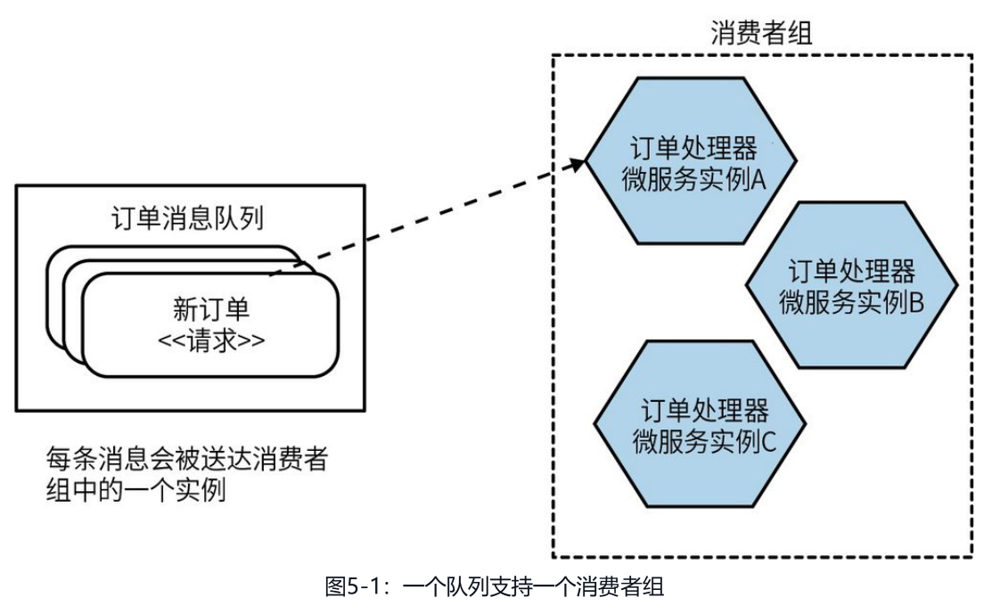

使用主题时，你可以设置多个消费者组。在图5-2中，表示正在付款的订单事件被放入订单状态主题中。仓库微服务和通知微服务在不同的消费者组中，它们都会收到该事件的副本。每个消费者组中只有一个实例会看到该事件。

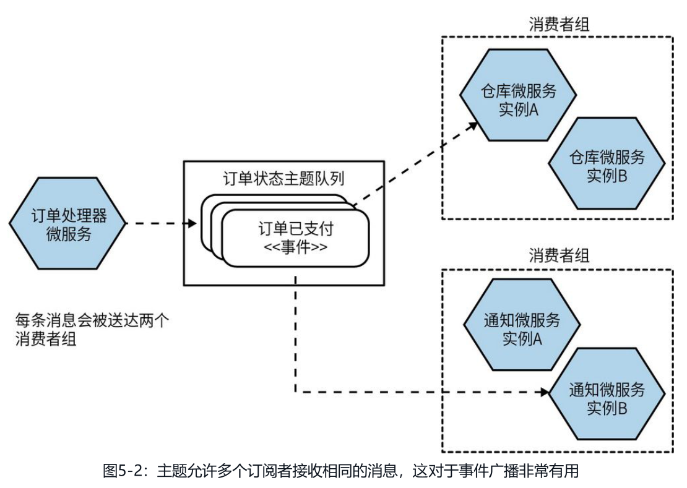

**乍一看，队列只是一个具有单个消费者组的主题。这两者之间的主要区别在于，当通过队列发送消息时，我们知道消息被发送到什么地方；而对于主题，这些信息对于消息的发送方是隐藏的——发送方不知道谁（如果有的话）会最终收到消息。**

主题非常适合基于事件的协作，而队列更适合请求 - 响应通信。不过，这只是一个一般性指导而不是严格的规则。

**消息确认机制**

那么，为什么要采用代理方式呢？核心原因是，代理提供了许多对异步通信非常有用的功能。尽管它们所提供的功能有所不同，但其中最为关键的是消息确认机制，几乎所有被广泛使用的代理都以某种方式支持这一点。有了这个机制，代理可以确保信息一定会被送达。

**从发送消息的微服务的角度来看，这种功能非常有价值。即使目标服务暂时不可达，也不会产生什么问题——代理将保留消息，直到消息可以被传递。这可以减少上游微服务的负担。**相较于同步直接调用（比如HTTP请求），如果下游微服务不可达，上游微服务会面临如何处理该请求的问题：是选择重试还是放弃？

为了保证信息的成功传递，代理需要有能力将尚未传递的消息持久化，直到它们被成功传递。为了实现这个目标，代理通常是分布式系统，以确保单台机器出现的故障不会导致消息的丢失。由于管理分布式软件存在很多挑战，保持代理正常运行通常涉及很多工作。如果代理设置不正确，信息确认的保障机制可能就会受到影响。

值得注意的是，不同代理对消息确认机制的支持可能是不同的。同样，阅读文档是一个很好的开始。

**其他特性**

除了信息确认机制外，代理还可以提供其他有用的特性。

**大多数代理都可以保证消息传递的顺序，但并不是所有代理都可以做到；而那些有此功能的代理，其顺序保证也可能存在一定的局限性。**例如Kafka，它只能保证单个分区内的消息顺序。如果不能确保消息会按顺序接收，那么消费者可能需要采取一些补偿措施，比如推迟处理乱序接收到的消息，直到收到所有先前遗漏的消息为止。

**有一些消息代理具备写入事务的能力，例如，Kafka可以在单个事务中向多个主题写入消息。**一些消息代理还具备读取事务的能力，......

另一个颇受争议的特性是一些消息代理宣称的“仅发送一次”。......

**Kafka**

作为消息代理，Kafka值得专门讲讲——这很大程度上是因为它实在太流行了。**Kafka流行的原因之一是它在流处理中的出色表现，能够高效地传输大量数据。这促成了从批处理向实时处理的转变。**

Kafka具有几个显著的特性。首先，它是为超大规模设计的——它由LinkedIn团队设计，目的是用一个单一平台替换多个已存在的消息集群。Kafka可以处理众多的消费者和生产者。我曾与一家大型科技公司的专家交流，他提到他的公司在同一个集群上有5万多个生产者和消费者。坦白说，很少有组织会有这种规模的需求，但对于那些需要的组织来说，（相对而言）Kafka的扩展性是一个巨大的优势。

Kafka另一个相当独特的特性是消息持久性。在传统的消息代理中，一旦所有消费者都收到了消息，消息代理就不再需要保留该消息。使用Kafka，消息可以存储一段可自定义的时间，甚至可以永久存储。这为消费者重新提取他们已经处理过的消息，或使新上线的消费者处理之前发送的消息成为可能。

### 5.3 序列化格式

我们所讨论的一些技术选型，**特别是一些RPC实现，虽然会替你选择数据序列化和反序列化方案。例如，使用gRPC时，任何发送的数据都会被转换为协议缓冲区(protocol buffer)格式。但是，许多技术方案在网络数据转换方面还是提供了很大的自由度。**选择Kafka作为消息代理时，你有多种消息格式可以选择。面对这些选择，哪个最适合你呢？

#### 文本格式

采用标准文本格式使客户端在资源使用方面更具灵活性。REST API通常在请求和响应主体中使用文本格式，当然理论上你也可以通过HTTP发送二进制数据。事实上，gRPC就是这样——它使用HTTP，但传输的是二进制的协议缓冲区(protocol buffer)格式。

**JSON已经取代XML成为文本序列化格式的首选。**这其中有很多原因，但最核心的还是API的主要消费者通常是浏览器，而浏览器对JSON的支持非常好。JSON之所以普及，部分原因是人们对XML的反感。支持者认为，与XML相比，JSON相对紧凑和简单。但实际上，经过压缩后的JSON和XML消息体在大小上差异并不明显。值得指出的是，JSON的简单是有代价的——在采用这个更简单的协议时，我们在模式方面做了妥协。

#### 二进制格式

虽然文本格式易于阅读并能与不同工具和技术保持互操作性，但如果你开始担心消息的有效负载大小，或写入和读取有效负载的效率，那么你应该考虑二进制序列化协议。**协议缓冲区(protocol buffer)已经存在了一段时间，且并不仅限于gRPC场景下的使用，它或许是微服务间通信中最受欢迎的二进制序列化协议。**

然而，可供选择的格式还有很多，人们已经开发出了诸多格式以满足各种需求。尽管许多格式都有其评测报告，强调了它们相对于协议缓冲区(protocol buffer)、JSON或其他格式的优势，但评测报告的问题在于，它们不一定能真实反映你的实际使用情况。如果你的目标是进一步压缩序列化格式的大小或者节省几微秒的读写时间，我强烈建议你亲自比对这些格式。**根据我的经验，绝大多数系统很少需要考虑这类优化问题，因为通常可以通过发送更少的数据或根本不进行调用，来实现所需的改进。但是，如果目标是构建一个超低延迟的分布式系统，那么你应该深入探索二进制序列化格式。**

### 5.4 模式

有一个反复出现的讨论是，我们是否应该使用模式(schema)来定义我们的接口暴露什么和接受什么。模式可以有许多不同的类型，通常，选择的序列化格式决定了你可以使用哪种技术。**我们已经提到的一些技术选项（特别是一些RPC技术的子集）都需要使用显式的模式，所以如果你选择了这些技术，你就必须使用模式。SOAP通过使用WSDL来工作，而gRPC需要使用协议缓冲区(protocol buffer)规范。我们探讨过的其他技术中，模式是可选项，这是让事情变得有趣的地方。**

正如已经讨论过的，**我支持为微服务端点提供显式模式，原因有两个。首先，它可以明确地表示微服务端点暴露的内容和可接受的内容。**这不仅有助于开发人员更容易地开发微服务，还可以让消费者使用起来更加方便。模式可能无法取代对良好文档的需求，但它们肯定可以减少所需文档的数量。

然而，**我喜欢显式模式的另一个原因是，它有助于发现微服务端点意外出现的破坏**。稍后我们将探讨如何处理微服务之间的变更，但首先值得探讨的是不同类型的破坏以及模式在其中发挥的作用。

#### 结构性破坏和语义性破坏

从广义上讲，我们可以将契约破坏分为两类——结构性破坏(structural breakage)和语义性破坏(semantic breakage)。结构性破坏是指接口的结构发生变化，导致消费者不再兼容。这可能表现为字段或方法被删除，或者添加了新的必要字段。语义性破坏是指微服务端点的结构没有改变，但端点的行为发生了变化，从而违背了消费者的预期。

#### 是否应该使用模式

**通过使用模式并比较不同版本的模式，我们可以捕捉到结构性破坏；而捕捉语义性破坏则需要通过测试来发现。**如果你没有定义模式，那么在代码部署到生产环境之前，发现和修复可能的结构性破坏的责任就会落在测试上。

**实际上，问题不在于你是否有模式，而是该模式是不是显式的。**如果你正在使用无模式API中的数据，你还是会对其中应该包含哪些数据以及应该如何构建这些数据有期望。编写处理数据的代码时，你仍然会考虑有关数据结构的假设。在这种情况下，我认为仍然存在模式，但它是完全隐含的而不是显式的。我对显式模式非常关切是因为我认为尽可能地明确微服务可以暴露什么（或不暴露什么）内容是非常重要的。

支撑无模式接口的主要论点似乎是模式带来更多工作却没有提供足够价值。在我看来，一部分原因是想象力的匮乏，另一部分原因是缺乏好的工具，且工具无法及时捕获结构性破坏从而导致模式化的接口无法更好地发挥优势。

最终，模式提供的许多内容是客户端和服务端之间部分结构契约的显式表示。它们有助于使事情更加明确，可以极大地促进团队之间的沟通并起到安全网的作用。但在更改成本较低的情况下——例如，当客户端和服务端都属于同一个团队时——我更倾向于无模式。

### 5.5 处理微服务间的变更

**关于微服务我经常被问到的问题之一是：“它应该有多大？”然后就是：“你如何处理版本控制？”当有人提出这些问题时，他不是在问你应该使用哪种版本编号方案，而是在问你如何处理微服务之间的契约变更。**

如何处理变更可以分为两个主题。稍后，我们将看看在需要做出破坏性变更时会发生什么。但在此之前，让我们看看如何避免一开始就做出破坏性变更。

### 5.6 避免破坏性变更

如果你想避免做出破坏性变更，有一些关键的想法值得探索，其中一些我们已经在本章的开始部分提到了。

- 扩展式更改：为微服务接口添加新东西，而不删除旧东西。
- 兼容的消费者：在使用微服务接口时，灵活调整你的期望。
- 正确的技术：选择可以更容易地对接口进行向后兼容更改的技术。
- 显式接口：明确说明微服务可以暴露的内容。这使得客户端和微服务的维护人员更容易理解哪些内容可以自由更改。
- 尽早发现破坏性变更：在部署这些变更之前，要有适当的机制来发现会破坏消费者使用的接口变更。

这些想法确实相得益彰，而且许多想法都基于我们经常讨论的信息隐藏这一关键概念。现在，让我们依次看看每个想法。

#### 扩展式更改

最容易开始的地方可能是仅向微服务契约添加新内容，而不删除任何其他内容。试想这样一个场景，向消息体添加新字段——假设客户端以某种方式兼容这一更改，那么这一更改就不会对其产生实质性影响。

#### 兼容的消费者

微服务消费者的实现方式对简化向后兼容的更改有很大影响。具体来说，我们希望避免客户端代码过于紧密地绑定到微服务的接口。

客户试图尽可能灵活地使用服务的示例展示了波斯特尔定律（Postel's Law，也被称为“健壮性原则”）。该定律指出：“输出保守、输入多元（严输出、宽输入）。”这条智慧原则最初是针对设备在网络上的交互提出的，**在这种情况下，你应该能预料到会发生各种奇怪的事情。在基于微服务间通信的上下文中，它引导我们构建可以兼容消息体更改的客户端代码。**

**合适的技术**

......

#### 显式接口

微服务提供了一个明确的模式来清晰地表明其接口的作用，我很喜欢这一点。拥有一个明确的模式可以让消费者清楚地了解他们可以期待什么，同时也让微服务的开发人员更清楚地知道哪些地方应该保持不变，以确保消费者的功能不被破坏。换句话说，显式模式在很大程度上有助于使信息隐藏的边界更加明确——模式中公开的内容根据定义是不隐藏的。

**RPC的显式模式是长期存在的，实际上它是许多RPC实现的要求。REST通常将模式视为可选的，而且我发现REST端点的显式模式非常罕见。**但这种情况正在发生变化，前面提到的OpenAPI规范越来越受到欢迎，而JSON Schema规范也越来越成熟。

#### 尽早发现破坏性变更

尽快发现会破坏消费者的变更是至关重要的，因为即使选择了最好的技术，对微服务的任意更改也可能导致消费者的功能崩溃。正如前面提到的，使用某种工具来比较模式版本可以帮助我们检测结构性变更。但是，你要寻找的不只是报告两个模式之间的差异，而是在发现不兼容的模式之后，能够判定CI构建是否应该成功。这样就可以在发现不兼容的模式时让CI构建失败，确保这个微服务不会被部署。

### 5.7 管理破坏性变更

当你已尽了最大努力来确保对微服务接口所做的更改是向后兼容的，但仍然不得不做出破坏性变更的时候，你应该如何做呢？这里有3个主要选择。

- 同步部署：要求暴露接口的微服务和具有该接口的消费者同时发生变化。
- 共存不兼容的微服务版本：同时运行微服务的新版本和旧版本。
- 模拟旧接口：让你的微服务公开新接口并模拟旧接口。（个人更愿意称为共存新旧接口）

#### 同步部署

当然，同步部署是与可独立部署是背道而驰的。如果我们希望能够部署一个微服务的新版本来对其接口进行重大更改，并且通过独立部署的方式来执行此操作，那么这仍然需要给予消费者足够的时间来升级到新接口。这就引出了下面需要考虑的两个选项。

#### 共存不兼容的微服务版本

另一个经常被提到的版本控制解决方案是同时运行不同版本的服务，让老用户将他们的流量路由到旧版本，让新用户看到新版本，如图5-3所示。当更换老用户的成本太高时，Netflix会使用这种方法，尤其是在遗留设备仍与旧版本的API绑定的情况下。我个人不太喜欢这个想法，也理解为什么Netflix很少使用这种方法。首先，如果需要修复服务中的内部错误，那么现在必须修复和部署两组不同的服务。这可能意味着必须创建分支代码库，而这样做总会产生问题。其次，这意味着需要智能路由来将消费者引导到正确的微服务。这种行为不可避免地会出现在某个中间件或一堆nginx脚本中，这使得推理系统行为变得更加困难。最后，考虑到服务可能管理的任何持久状态。无论最初使用哪个版本创建数据，都需要存储由任一版本的服务创建的客户，并使其对所有服务可见。这是复杂性的另一个来源。

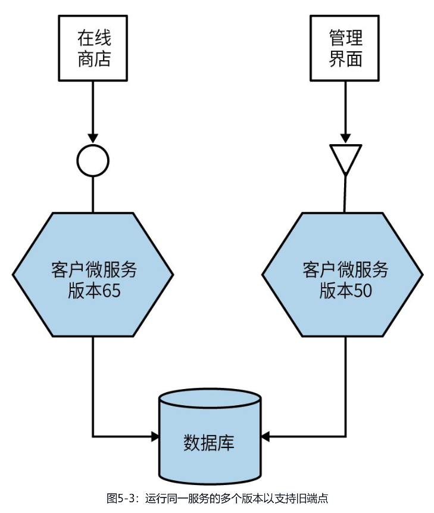

有时在短时间内并存不同版本的服务是合理的，尤其是在进行金丝雀发布时。在这种情况下，可能只需让不同版本的服务共存几分钟或几小时，并且通常只会同时存在两个不同版本的服务。

#### 共存新旧接口

如果我们已经尽可能避免引入破坏性的接口更改，那么下一项工作就是尽可能减少破坏性变更对消费者造成影响。尽量避免迫使消费者进行同步升级，因为我们总是希望保持彼此独立发布微服务的能力。我成功地使用了一种方法来处理这个问题，即在同一个正在运行的服务中同时共存新旧接口。**因此，如果想要发布重大更改，我们将部署一个新版本的服务，这个服务同时支持旧版本和新版本的接口。**

这使我们能够尽快推出新的微服务和新的接口，同时让消费者有时间转移。一旦所有消费者不再使用旧接口，你就可以将这个接口连同其他相关代码一起删除，如图5-4所示。

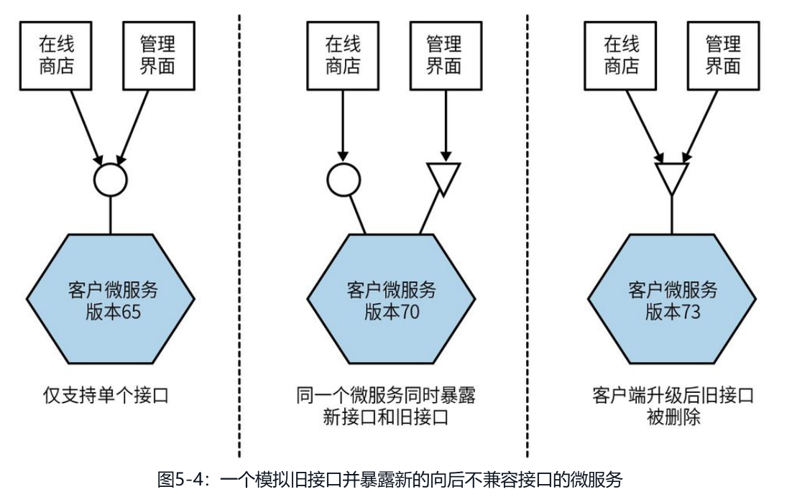

如果要共存接口，则需要一种方法让调用者相应地路由其请求。对于使用HTTP的系统，我看到是在请求标头和URI本身中使用版本号来实现的，例如 /v1/customer/ 或 /v2/customer/。我不确定哪种方法最为合理。

#### 推荐的方法

对于一个团队同时管理微服务和所有消费者的特定情况，我认为同步发布其实是可行的。假设这确实是一次性的情况，那么当影响仅限于单个团队时这样做是合理的。不过，我对此非常谨慎，因为一次性活动可能会变成习惯。如果过于频繁地使用同步部署，那么你很快就会发现，尽管你的应用是分布式的，但是你在按单体的方式进行管理。

正如前面所指出的，同一微服务的不同版本共存可能会产生问题。我只会在需要短时间内同时运行微服务版本的情况下考虑这样做。现实情况是，可能需要数周或更长时间留给消费者进行升级。

我的一般偏好是尽可能使用旧接口的模拟。在我看来，实现模拟的挑战比共存的微服务版本更容易应对。

#### 社会契约

你选择哪种方法在很大程度上取决于消费者对变更的期望。保留旧接口会产生成本，理想情况下，你会希望尽快将其关闭，并移除相关代码和基础设施。但同时，你也希望给消费者尽可能多的时间来适应变更。**请记住，在许多情况下，你正在进行的向后不兼容的更改通常是消费者要求的，且实际上也最终会使他们受益。**当然，在微服务维护者的需求和消费者的需求之间如何进行平衡，是值得探讨的话题。

你不一定需要大量的文件和大型会议来就如何处理更改达成一致。但假设你没有走同步发布的路线，我建议微服务的所有者和消费者都需要明确以下几点：

- 如何提出需要更改接口的提议？
- 消费者和微服务团队应该如何协作，就更改的内容达成一致？
- 谁来负责消费者的更新工作？
- 就更改达成一致后，消费者需要多长时间才能切换到新接口，然后将旧接口移除？

请记住，有效的微服务架构的秘诀之一是采用消费者至上的方法。你的微服务是为了供其他消费者调用而存在的。消费者的需求是最重要的，如果对微服务进行更改会给上游消费者带来问题，你需要考虑到这一点。

当然，在某些情况下，可能无法更改消费者。我听说Netflix在使用旧版Netflix API的旧机顶盒方面（至少在历史上）遇到了问题。这些机顶盒不太容易升级，因此旧接口必须保持可用，除非旧机顶盒的数量下降到可以停用旧接口的水平。有时决定停止旧消费者访问你的接口最终会涉及财务问题——支持旧接口的成本和你从消费者那里赚到的钱需要相平衡。

**追踪使用情况**

即使你已经同意消费者停止使用旧接口的时间点，但能够确定他们真的停止使用了吗？确保你为微服务暴露的每个接口都设置了日志记录会有所帮助，同时还要确保你拥有某种客户端标识符，以便你与相关团队进行沟通，在需要时让他们迁移到新接口。......

#### 极端措施

假设你知道消费者仍在使用你想要删除的旧接口，并且他们不太愿意升级到新版本，你该怎么办呢？首先要做的事情就是与他们沟通。也许你可以帮助他们做出改变。如果所有方法都试过，他们还是不愿意升级，或者他们口头同意升级，但最后仍然没有升级，我们也有一些极端技术可以使用。

在一家大型科技公司，我们讨论了它是如何处理这个问题的。在内部，该公司设定了一个宽松的期限，即在旧接口弃用之前留给消费者一年的时间。我问该公司负责人如何知道消费者是否仍在使用旧接口，该公司回答说它并没有那么麻烦地去追踪这些信息；一年后，它只是关闭了旧接口。公司内部认为，如果这导致消费者出现故障，那么这就是是消费微服务团队的问题——他们本有一年的时间来做出变更，他们却没有这样做。当然，这种方法并不适用许多情况（我说过这太极端了）。这也导致了很大程度的效率低下。因为不清楚旧接口是否在被使用，所以该公司错过了在一年的时间里移除它的机会。就我个人而言，即使我建议可以在一段时间后关闭接口，但仍然希望通过追踪来了解谁会受到影响。

### 5.8 DRY和微服务架构中的代码复用风险

作为开发人员，我们经常听到的一个缩略词是“DRY”(don't repeat yourself)——不要重复自己。虽然DRY的定义有时被简化为试图避免重复代码，但更准确地说，DRY意味着要避免重复实现系统功能和处理相同信息。在一般情况下，这是非常明智的建议。用很多行代码做同样的事情会使代码库比实际需要的大，也更难被人理解。当你想要更改行为而该行为在系统的许多部分重复时，你很容易忘记需要进行更改的所有地方，这可能会导致错误。因此一般来说，把DRY当作口头禅是有道理的。

DRY是指导创建可复用代码的原则。我们将重复的代码提取到抽象中，然后可以从多个地方调用这些抽象。甚至可以考虑创建一个可以在任何地方使用的共享库！然而，事实证明，在微服务环境中共享代码比这更复杂。与往常一样，我们有多个选项要考虑。

#### 通过库共享代码

我们不惜一切代价避免微服务和消费者的过度耦合，以防止任何对微服务本身的微小改动会对消费者造成不必要的更改。然而，有时共享代码的使用恰恰会导致这种耦合。例如，我们有一个通用域对象库，代表系统中使用的核心实体。我们拥有的所有服务都使用了这个库。但是，当其中一个发生更改时，所有服务都必须做出更新。我们的系统通过消息队列进行通信，这些消息队列也必须清除它们现在已收到的但已失效的内容，如果你忘记了，就会有麻烦了。

关于库共享代码很重要的一点是，你不能一次性更新库的所有使用场景。尽管多个微服务可能都使用同一个库，但它们通常是通过将该库打包到微服务部署中来实现的。要升级正在使用的库的版本，你需要重新部署微服务。如果你想同时在所有地方更新同一个库，那么这可能会导致同时部署多个不同的微服务，而这会带来麻烦。

因此，如果你使用库来跨微服务边界复用代码，你必须接受同一库的多个不同版本可能同时存在。随着时间的推移，你当然可以考虑将所有服务使用的库更新到最新版本，只要你能接受这个成本，你当然可以通过库复用代码。

### 5.9 服务发现

一旦你拥有多个微服务，你的注意力不可避免地会关注它们的部署位置。也许你想知道某个环境中运行着什么，以便知道应该监控什么。也许就像你知道账户微服务在哪里一样，客户端也可以很容易地知道在哪里找到它。或者，你只是想让组织中的开发人员知道有哪些API可用，这样他们就不必重复发明轮子。从广义上讲，所有这些使用场景都属于服务发现(service discovery)的范畴。与微服务一样，我们有很多不同的选择来处理它。

**所有的解决方案可分为两个部分。首先，它们提供了一种机制，让实例注册自己并说：“我在这里！”其次，它们提供了一种在注册后查找服务的方法。**但是，当我们考虑一个不断销毁旧服务实例和部署新服务实例的环境时，服务发现会变得更加复杂。理想情况下，我们希望无论我们选择哪种方案，这个问题都可以得到解决。

让我们一起看看常见的解决方案并做出合适的选择。

#### 域名系统

从简单方案做起总是不错的开始。域名系统(DNS)可以将名称与一台或多台机器的IP地址相关联。例如，我们可以决定用 accounts.musiccorp.net 来访问账户微服务。然后，我们将该入口点指向运行该微服务的主机的IP地址，或者将其解析为在多个实例之间分配负载的负载均衡器。**这意味着我们必须将更新这些记录作为部署服务的一部分。**

在处理不同环境中的服务实例时，我发现基于约定的域名模板会很有用。例如，可以将模板定义为 < 服务名称 >-< 环境 >.musiccorp.net，这样我们可以得到诸如 accounts-uat.musiccorp.net 或 accounts-dev.musiccorp.net 之类的记录。

**另一个更高级的方法是让不同的环境使用不同的域名服务器**。所以我可以假设 accounts.musiccorp.net 是我查找账户微服务的地址，但它可以解析到不同的主机，解析到的主机取决于在哪个环境进行查找。如果你能够自如地手动管理DNS服务器和记录，且不同环境已经位于不同的网段中，那么这会是一个非常好的解决方案；但是如果没有从这种部署方式中获得其他好处，那么这意味着要多做很多工作。

DNS有许多优点，其中主要的一个优点是，它是一个易于理解和广泛使用的标准，几乎所有技术栈都会支持它。**不过，尽管存在许多用于管理组织内部DNS的服务，但很少有为临时主机的环境而设计的服务，临时主机的存在使得DNS需要频繁地更新，而这会带来不少手动更新的工作量。**除了更新DNS记录的问题外，DNS规范本身也会给我们带来一些问题。

域名的DNS记录具有存活时间(time to live，TTL)。这是客户端认为记录有效的时间。想要更改域名所指的主机时，我们会更新该记录，但必须假设客户端仍会在TTL内保留旧IP。DNS记录还可能会缓存在多个位置，且记录缓存的位置越多，旧记录存在的时间就会越久。

解决此问题的一种方法是让服务的域名记录指向负载均衡器，而负载均衡器又指向服务实例，如图5-5所示。当部署新实例时，你可以从负载均衡器记录中移除旧实例并添加新实例。

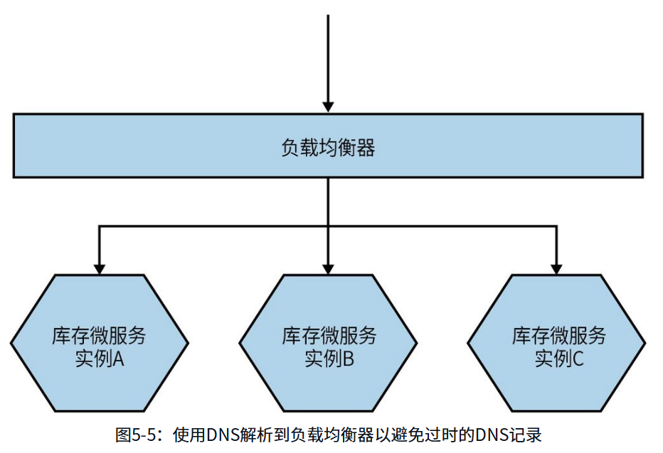

如前所述，DNS众所周知且受到广泛支持，但它确实有上述的一两个缺点。我建议你在选择更复杂的东西之前先调查一下DNS是否适合你。对于只有单个节点的情况，让DNS直接引用主机应该没有问题。但是对于需要多个主机实例的情况，需将DNS记录解析为负载均衡器，它可以根据需要将某个主机放入服务或移出服务。

#### 动态服务注册

在高度动态的环境中，基于DNS查找节点的方式存在一些缺点，因此出现了许多替代系统，其中大多数涉及将服务注册到某个注册中心，并通过注册中心来提供服务查找功能。通常，这些系统不仅仅提供服务注册和服务发现，还提供其他功能，这可能是好事，也可能不是。这是一个竞争激烈的领域，所以这里只提供几个选项，让你有个大致了解。

**ZooKeeper**

ZooKeeper最初是作为Hadoop项目的一部分开发的。它有一系列令人眼花缭乱的使用场景，包括配置管理、服务间的数据同步、领导者选举、消息队列以及（对我们有用的）命名服务。

与许多类似的系统一样，ZooKeeper依赖于在集群中运行多个节点来提供各种保证。这意味着你应该至少配置3个Zookeeper节点。ZooKeeper中的大部分关键代码主要用于确保数据在节点间安全复制，并在节点发生故障时保持一致性。

ZooKeeper的核心是提供了一个用于存储信息的分层命名空间。客户端可以在层次结构中插入新节点、更改或查询新节点。此外，它们可以向节点添加监视器，支持在节点更改时得到通知。这意味着可以在此结构中存储有关服务位置的信息，并在它们发生更改时告知客户端。ZooKeeper通常用于配置管理，因此你还可以在其中存储服务的配置信息，从而可以执行动态更改日志级别或关闭正在运行的系统功能等任务。

事实上，对于动态服务注册来说，存在更好的解决方案，因此我现在会主动避免使用ZooKeeper。

扩展===

ZooKeeper 实现服务注册和发现的原理是利用其分层命名空间和节点监视器功能，具体过程如下：

服务注册

- 创建节点：当一个服务启动时，它会在 ZooKeeper 的命名空间中创建一个代表自己的节点。例如，一个名为 “UserService” 的服务可能会在 “/services/user-service” 路径下创建一个名为 “user-service-1” 的子节点（假设这是该服务的第一个实例）。这个节点的路径就成为了该服务实例的唯一标识。
- 存储服务信息：在创建的节点中，服务会将自身的相关信息，如服务地址、端口号、服务版本等，以数据的形式存储在节点中。例如，“user-service-1” 节点可能存储了 “192.168.1.100:8080” 这样的服务地址和端口信息，以及服务的版本号 “v1.0” 等。
- 设置节点类型：通常会将服务节点设置为临时节点。这意味着如果服务实例因为故障或其他原因停止运行，它在 ZooKeeper 中对应的节点会自动被删除，从而其他服务能够及时感知到该服务实例的下线。

ZooKeeper 能够实现当服务实例停止运行时自动删除对应节点，主要是基于其会话机制和临时节点的特性，具体原理如下：

- 会话机制：ZooKeeper 客户端与服务端建立连接后会创建一个会话，这个会话有一个超时时间。在会话期间，客户端会定期向服务端发送心跳包以保持连接。服务端会监控每个会话的状态，如果在一定时间内没有收到某个客户端的心跳包，就会认为该会话已过期，判定客户端与服务端之间的连接已断开。
- 临时节点特性：临时节点的生命周期与客户端的会话绑定。当客户端与 ZooKeeper 服务端的会话结束（例如因为服务实例停止运行导致客户端与服务端的连接断开，进而会话过期），ZooKeeper 服务端会自动删除与该会话相关的所有临时节点。因此，当服务实例停止运行时，其在 ZooKeeper 中创建的临时节点会由于会话的结束而被自动删除，这样其他服务就能通过观察节点的消失，及时感知到该服务实例的下线。

服务发现

- 客户端查询：当客户端需要使用某个服务时，它会向 ZooKeeper 查询相关服务的节点信息。例如，一个需要调用 “UserService” 的客户端会向 ZooKeeper 询问 “/services/user-service” 路径下的所有子节点。
- 获取服务列表：ZooKeeper 会返回该路径下的所有子节点信息给客户端，客户端通过解析这些节点的数据，就能得到可用的服务实例列表，包括每个实例的地址、端口等信息。例如，客户端得到了 “user-service-1” 节点存储的 “192.168.1.100:8080” 和 “v1.0” 等信息，就可以根据这些信息去调用相应的服务实例。
- 节点监视器：为了及时感知服务实例的变化（如新增实例或实例下线），客户端会在感兴趣的节点上设置监视器。当服务节点发生变化时，比如有新的 “UserService” 实例上线创建了新节点，或者某个实例下线导致其节点被删除，ZooKeeper 会向设置了监视器的客户端发送通知。客户端收到通知后，可以再次查询相关节点信息，以获取最新的服务实例列表，从而实现动态的服务发现。

通过以上方式，ZooKeeper 利用其分层命名空间和节点监视器功能，实现了服务的注册和发现，使得客户端能够方便地找到可用的服务实例，并及时感知服务实例的变化，保证了分布式系统中服务之间的高效通信和协同工作。

**Consul**

与ZooKeeper一样，Consul支持配置管理和服务发现。但在为关键特性提供支持方面，它比ZooKeeper做得更好。例如，它公开了一个用于服务发现的HTTP接口，而Consul的卓越功能之一是，它实际上提供了一个开箱即用的DNS服务器；具体来说，它可以提供SRV记录，为你提供给定名称的IP和端口。这意味着如果你的系统的一部分已经使用DNS并且可以支持SRV记录，你可以直接登录Consul并开始使用它，而无须对现有系统进行任何更改。

Consul还具备其他你会觉得有用的功能，例如在节点上执行健康检查的能力。因此，Consul提供的功能可能会与其他专用监控工具提供的功能有所重叠，尽管你更有可能使用Consul作为相应信息的来源，然后将其纳入更全面的监控设置中。

从注册服务到查询键 - 值存储或插入健康检查，Consul使用RESTful HTTP接口来执行所有的操作。这使得与不同技术栈的集成变得非常简单。Consul还有一套与之配合良好的工具，进一步提高了它的实用性。consul-template就是一个例子，它提供了一种根据Consul中的条目更新文本文件的方法。乍一看，这似乎没有那么有趣，但是考虑到使用consul-template，你现在就可以更改Consul中的值（例如微服务的位置或配置值），并让系统中所有的配置文件都能动态更新时，你就会明白它的用处了。突然之间，任何从文本文件中读取配置的程序都可以动态更新，而无须了解Consul本身的任何信息。这在动态添加或删除节点以构建负载均衡池的情况下非常有用，你可以使用软件负载均衡器如HAProxy来实现。另一个与Consul集成良好的工具是Vault，这是一个密钥管理工具，我们将在第11章中重新讨论。密钥管理可能没那么容易，但Consul和Vault的组合绝对可以让你的工作更轻松。

**etcd和Kubernetes**

如果你正在运行一个管理容器工作负载的平台，那么你可能已经有了一个服务发现机制。Kubernetes也不例外，它的服务发现机制部分来自etcd——一个与Kubernetes捆绑的配置管理库。etcd具有类似Consul的功能。Kubernetes使用它来管理各种配置信息。

我们将在8.5节中更详细地探讨Kubernetes。但简而言之，服务发现在Kubernetes上的工作方式是，你将容器部署在一个pod中，然后服务会通过与pod相关的元数据的模式匹配来动态地识别哪些pod应该是服务的一部分。这是一个相当优雅的机制，可以非常强大。然后，对一个服务的请求会被路由到组成该服务的一个pod。

Kubernetes提供的开箱即用的功能很可能导致你只想使用核心平台自带的东西，而放弃使用像Consul这样的专用工具；这对许多人来说很有意义，特别是如果你对Consul周边更广泛的工具生态系统不感兴趣的话。然而，如果你在一个混合环境中运行，工作负载在Kubernetes和其他平台上运行，那么有一个专门的服务发现工具可以在两个平台上使用也是一种选择。

**使用自己的系统**

我自己用过且在其他地方也看到过的一种方法是使用自己的系统。在一个项目中，我们大量使用了AWS，它提供了向实例添加标记的方式。在启动服务实例时，我会用标记来帮助定义实例是什么以及它有什么用途。例如：

- service = accounts；
- environment = production；
- version = 154。

然后，我使用AWS API查询与给定AWS账户关联的所有实例，以便找到我关心的机器。在这里，AWS自己处理与每个实例相关联的元数据的存储，并提供查询它的能力。然后，我构建了用于与这些实例交互的命令行工具，并提供了图形界面，以便一目了然地查看实例状态。如果你可以以编程方式收集有关服务接口的信息，那么所有这些都将变得非常简单。

过去我们并没有使用AWS API来查找服务依赖项，但没有理由不这样做。显然，如果你希望在下游服务的部署发生变化时向上游服务发出警报，那么你就只能靠自己了。

现在，这绝不会是我选择的方式。这个领域的工具已经足够成熟，这种方式不仅仅是在重复发明轮子，而是重新创造一个更糟糕的轮子。

#### 不要忘记人类

到目前为止，我们所研究的系统都可以支持服务实例轻松地自行注册并查找需要与之通信的其他服务。但作为人类，我们有时也想获取这些信息。以便于人类使用的方式提供信息是至关重要的，比如使用API将这些细节提取到人性化注册表中。

### 5.10 服务网格和API网关

与微服务相关的技术中，很少有像服务网格和API网关这样引起如此多的关注、炒作和困惑的领域。它们都有各自的位置和作用，但令人困惑的是，它们在职责上也有重叠，尤其是API网关容易被误用（或者被推销），因此对于我们来说，理解这些技术类型如何适配我们的微服务架构十分重要。**我不会提供一个详尽的产品列表告诉你你可以做什么，而是会提供一个概览来介绍它们可以如何适配到你的架构里以解决问题，以及如何避免它们可能产生的问题。**

一般来说，API网关位于系统的边界，处理南北向流量。它的主要关注点是管理外部世界对内部微服务的访问。此外，服务网格更加关注内部微服务间通信，即东西向流量，如图5-6所示。

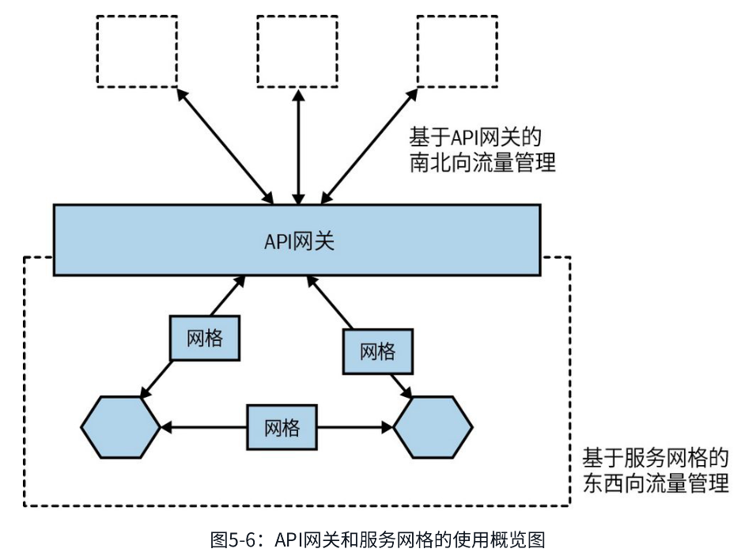

服务网格和API网关可能需要微服务间共享代码，但无须创建新的客户端库或新的微服务。**简单来讲，服务网格和API网关可以当作微服务之间的代理。这意味着它们可以用来实现一些与具体微服务无关的通用功能，否则这些功能可能需要在代码中实现，例如服务发现或记录日志。**

如果你正在使用API网关或服务网格来实现微服务的共享功能，那么这些功能必须是完全通用的；换句话说，代理提供的功能与单个微服务的任何特定行为无关。

现在，需要解释一下，世界并不总是如此清晰明了。一些API网关也在尝试解决东西向流量的问题，但这是我们稍后讨论的内容。先来看看API网关以及它能提供的功能。

#### API网关

**由于更关注南北向流量，API网关在微服务环境中的主要任务是将外部各方的请求映射到内部微服务上。**这种责任类似于使用简单的HTTP代理可以实现的任务。实际上API网关通常在现有的HTTP代理产品的基础之上构建出了更多的功能，它们在很大程度上起到反向代理的作用。此外，API网关可用于实现外部各方的API密钥、日志记录、速率限制等机制。

关于API网关的一些容易混淆的概念与历史有关。不久前，人们对所谓的“API经济”产生了浓厚的兴趣。从像Salesforce这样的SaaS产品到像AWS这样的平台，业界的企业开始了解到采用托管解决方案的方式管理API的好处，因为很明显，API为客户在如何使用其软件方面提供了更大的灵活性。**这让很多人开始审视他们已经拥有的软件，并考虑不仅通过GUI将功能暴露给客户，还要通过API为客户提供服务。**他们希望这可以开辟更大的市场；当然，也希望赚更多的钱。**在这波由利益推动的浪潮中，涌现了一系列API网关产品，帮助人们实现这些目标。**这些产品的功能主要集中在API密钥管理、强制实施速率限制以及追踪收费使用情况等目的上。现实情况是，虽然API已经被证明是向一些客户提供服务的绝佳方式，但是API经济的规模并没有像一些人希望的那么大，很多公司发现它们所购买的API网关产品附带了许多它们实际上用不到的功能。

对于Kubernetes来说，某种形式的API网关是必不可少的，因为Kubernetes只处理集群内部的网络，不处理与集群本身的通信。但在这种情况下，专为管理外部第三方访问而设计的API网关是大材小用了。

因此，如果你需要一个API网关，请确保你清楚希望达到什么目的。事实上，更进一步地说，你应该避免使用功能过于复杂的API网关。

**适用情况**

一旦想清楚使用场景，就很容易弄清需要什么样的网关了。如果只是暴露在Kubernetes集群里运行的微服务，你可以运行自己的反向代理。当然，使用专注于这种场景的产品是更好的选择，比如Ambassador就是针对这种情况构建的。如果你确实需要管理调用API的大量第三方用户，那么还有其他产品可以考虑。实际上，为了更好地处理关注点分离，你可能会在混合环境中使用多个网关。我认为在许多情况下这是明智的选择，尽管通常会带来一些问题，比如增加整个系统的复杂性和增加网络跳数。

我有时会直接与供应商打交道，帮助客户选择工具。可以毫不犹豫地说，在API网关领域，我遇到的销售误导、不良行为或残酷竞争比其他任何领域都多，因此你在本章中找不到任何对供应商产品的介绍。这主要是因为获得风险投资支持的公司在API经济的繁荣时期构建了不少产品，但最终发现市场并不存在。他们不得不同时应对两个战线上的挑战——一方面争夺需要复杂网关功能的少数用户，另一方面与专注于满足绝大多数简单需求的API网关产品相比，又落于下风。

**需要避免的事情**

由于一些API网关供应商急功近利，他们为这些产品能够实现的功能做出了让人眼花缭乱的说明。这导致了对这些产品的滥用，进而让人们不再信任本质上非常简单的概念。**我见过的滥用API网关的两个典型例子是调用聚合和协议重写，但我也看到了广泛推动的势头，即将API网关用于系统内（东西向）调用。**

在本章中，我们简要讨论了GraphQL这类协议的作用，它在进行大量调用后，汇总和过滤结果的情况下很有用。但人们也想在API网关层解决此问题。一开始的想法很简单：将几个调用组合在一起并返回一个单一的消息体。接着，你想要添加条件逻辑，但不久你就意识到，你已经将核心业务流程嵌入一个不适合执行这项任务的第三方工具中。

如果你发现需要调用聚合和过滤，那么请考虑使用GraphQL或BFF模式，我们将在第14章中介绍。如果你正在执行的调用聚合本质上是一个业务流程，那么最好通过一个Saga模式来完成，我们将在第6章中介绍。

除了聚合方面，协议重写通常也被推广为API网关应该使用的功能之一。我记得一家不知名的供应商非常积极地宣传其产品可以“将任何SOAP API更改为REST API”。首先，REST是一个完整的架构思维，不能简单地在代理层中实现。其次，协议重写应该是服务本身要做的事情，不应该在中间层完成，这样做会把太多的行为推到错误的地方。

**协议重写能力和API网关内部实现调用聚合的主要问题是，我们违反了让管道保持简单，而让终端保持智能的规则。我们系统中的“智能”应该存在于我们的代码中，这样我们才可以完全控制它。本例中的API网关是一个管道，我们希望它尽可能简单**。通过微服务，我们正在推动一种模式，在这种模式下，可以通过独立部署进行更改并更容易地发布。在微服务中保持智能有助于实现这一目标。如果现在还必须在中间层进行更改，情况会变得更加麻烦。鉴于API网关的关键性，对它们的更改通常受到严格控制。单个团队似乎不太可能被允许自由更改这些通常是被集中管理的服务。这意味着什么呢？工单。为了让你的更改生效，你最终需要API网关团队为你做出更改。你向API网关（或企业服务总线）暴露的行为越多，你就越有可能面临交接、协调增多和交付速度放缓的风险。

最后一个问题是将API网关作为所有微服务间调用的中介。这可能会带来很大的问题。如果我们在两个微服务之间插入一个API网关或一个普通的网络代理，那么我们通常至少在调用链路上增加了一跳。从微服务A到微服务B的调用首先从A到API网关，然后再从API网关到B。我们必须考虑额外的网络调用所带来的延迟影响以及代理所引入的开销。接下来要探讨的服务网格更适合解决这个问题。

#### 扩展

**API 网关工作流程**

1. 请求接收：客户端向 API 网关发送 HTTP 或其他协议请求 ，API 网关在特定端口监听并接收该请求。
2. 请求解析与验证：解析请求中的属性，如 URL、HTTP 方法（GET、POST 等 ）、请求头、请求参数等，并进行格式验证，确保请求符合规范。
3. 黑白名单检查：执行白名单或黑名单检查，判断请求来源是否被允许访问。
4. 认证与授权：通过 API 密钥、OAuth、JWT 等方式验证请求者身份；核实用户是否有权执行特定操作或访问特定资源。
5. 限流处理：依据令牌桶或漏桶等算法，检查请求速率是否超出限制，超出则拒绝请求。
6. 路由匹配：通过 URL 路径匹配、请求参数等条件，确定将请求路由到哪个后端微服务。
7. 协议转换（如有需要）：将请求转换为后端微服务适用的协议，如将 HTTP 请求转换为 gRPC 请求等。
8. 请求转发：把处理后的请求转发至对应的后端微服务。
9. 响应处理：接收后端微服务的响应，可进行数据格式转换（如 JSON 与 XML 转换 ）、添加响应头信息等操作。
10. 错误处理与监控：处理请求过程中的错误，如熔断处理；利用 ELK 等工具进行日志记录和性能指标监控。
11. 结果返回：将最终响应返回给客户端。

服务网格（Service Mesh）通过**Sidecar 代理**和**控制平面**的协同工作，实现微服务间的通信管理与服务治理。以下是其核心工作流程及关键机制：

**服务网格核心组件**

在了解工作流程前，需明确两个核心组件：

1. Sidecar 代理（数据平面）
   - 每个微服务实例旁部署一个轻量级代理（如 Istio 的 Envoy），**透明接管微服务的出入流量**。
   - 负责流量转发、负载均衡、熔断、认证、监控数据收集等具体通信逻辑。
2. 控制平面
   - 集中管理组件（如 Istio 的 Pilot、Citadel），**定义全局路由规则、安全策略和服务发现逻辑**。
   - 向 Sidecar 下发配置，实现对整个网格的统一控制。

**服务网格工作流程**

以微服务 A 调用微服务 B 为例，流程如下：

1. 服务注册与发现

- 微服务启动时：
  - 微服务 B 的实例向注册中心（如 Kubernetes API Server、Consul）注册自身地址、端口、健康状态等信息。
  - 控制平面从注册中心获取服务 B 的实例列表，生成服务路由规则（如负载均衡策略、流量分配比例等），并下发至所有 Sidecar（包括 A 和 B 的 Sidecar）。
- Sidecar 缓存路由信息：
  - 微服务 A 的 Sidecar（记为 Sidecar-A）本地缓存服务 B 的实例列表和路由规则，无需每次调用都查询注册中心，减少延迟。

2. 流量拦截与转发

- 微服务 A 发起调用：
  - 微服务 A 的代码直接调用本地 Sidecar-A（通常通过本地回环地址，如`127.0.0.1:端口`），而非直接访问微服务 B 的地址。
  - 关键点：Sidecar 对微服务透明，微服务无需感知网格存在，仅需与本地 Sidecar 通信。
- Sidecar-A 处理请求：
  - 根据控制平面下发的路由规则，从服务 B 的实例列表中选择目标实例（如通过轮询、最少连接数等负载均衡算法）。
  - 若存在流量治理规则（如灰度发布要求将 10% 流量路由至 B 的 v2 版本），Sidecar-A 按比例分配流量。

3. 通信增强与安全机制

- 协议处理与优化：
  - Sidecar-A 可自动处理协议转换（如 HTTP/1.1 转 HTTP/2、gRPC 转 HTTP），或利用 HTTP/2 的多路复用特性减少连接开销。
  - 对请求进行压缩、加密（如 TLS 双向认证），确保传输安全。
- 服务治理逻辑执行：
  - 熔断机制：若检测到服务 B 的某个实例故障率过高，Sidecar-A 自动熔断该实例，避免故障扩散。
  - 超时重试：若请求超时，Sidecar-A 按配置自动重试，选择其他健康实例。
  - 流量镜像：将部分流量复制到影子实例（如 B 的测试环境），用于非侵入式测试。

4. Sidecar-B 接收请求并转发至微服务 B

- Sidecar-B 监听端口，接收 Sidecar-A 的请求。
- 同样基于控制平面的规则，对请求进行认证（如验证 JWT 令牌）、权限检查（如判断 A 是否有权限调用 B）。
- 验证通过后，将请求转发至微服务 B 。

5. 响应返回与监控数据收集

- 微服务 B 处理请求并返回响应，经 Sidecar-B 发送给 Sidecar-A。
- Sidecar-A 将响应返回给微服务 A，同时收集通信指标（如延迟、吞吐量、错误率），发送至控制平面或监控系统（如 Prometheus、Grafana）。
- 控制平面基于这些数据动态调整路由规则（如自动扩缩容触发的流量重新分配）。

6. 控制平面的全局管理

- 动态配置更新：当需要变更路由策略（如灰度发布切换）或安全策略（如更新 TLS 证书）时，控制平面主动向所有 Sidecar 推送新配置，Sidecar 无需重启即可生效。
- 服务发现更新：若服务 B 新增实例或下线，注册中心通知控制平面，控制平面更新 Sidecar 的路由表，实现流量的动态再平衡。

**服务网格 vs. API 网关：核心差异**

| **维度**     | **服务网格**                                          | **API 网关**                                   |
| ------------ | ----------------------------------------------------- | ---------------------------------------------- |
| **定位**     | 处理**微服务间通信**（内部流量）                      | 作为**外部流量入口**，处理客户端到微服务的请求 |
| **架构**     | 分布式（每个微服务配 Sidecar）                        | 集中式（单一入口节点）                         |
| **流量路径** | 微服务 A → Sidecar-A → Sidecar-B → 微服务 B           | 客户端 → API 网关 → 微服务 B                   |
| **延迟**     | 同一主机内 Sidecar 间通信（本地回环）；跨主机直接连接 | 必经网关节点，增加一跳网络延迟                 |
| **功能侧重** | 服务治理（负载均衡、熔断、流量控制）                  | 安全防护（认证、限流）、协议转换               |
| **适用场景** | 复杂微服务架构的内部通信治理                          | 对外暴露 API，处理外部客户端请求               |

#### 服务网格

**在使用服务网格的架构中，与微服务之间通信相关的常见功能被放到网格中实现，这减少了每个微服务内部需要实现的功能，同时也提供了一致的功能实现方式。**

服务网格提供的常见功能包括双向TLS(mTLS)、关联ID、服务发现和负载均衡，等等。通常情况下，这类功能在不同服务之间是具有通用性的，所以我们通常会通过共享库来处理它。但与此同时你也需要处理不同服务运行不同版本的库的问题，或者如果微服务是由不同的技术栈编写的，你就需要针对相应的技术栈提供相应的实现。

但是，有了服务网格，即使是基于不同语言实现的微服务也可以复用常见的微服务间功能。服务网格在不同团队创建的微服务之间实现统一标准方面也非常有用，尤其是在Kubernetes上使用服务网格已日益成为一种用于微服务的自助部署和管理的默认设定。

**有了服务网格，实现跨微服务的通用功能变得更加容易。如果这些通用功能都是通过共享库来实现的，那么更新这些功能就需要拉取新版本的库并在更改生效之前重新部署每一个微服务。有了服务网格将拥有了更多的灵活性，在更改微服务内部的通信时我们不再需要重新构建和重新部署。**

**工作方式**

通常来讲，在微服务架构中我们希望南北向流量少于东西向流量。举例来说，一个简单的南北向的调用—下订单—可能会导致多次东西向的调用。这意味着，我们必须意识到这些额外调用可能会引起的开销，这是如何构建服务网格的核心考虑因素之一。

服务网格有不同的形式和规模，但它们的共同之处是，它们都尝试限制代理之间调用所造成的影响。这主要通过将代理进程分布在与微服务实例相同的物理机器上来实现，以确保远程网络调用的数量受到限制。图5-7展示了一个实例—订单处理器微服务向支付微服务发送请求。这个调用首先被路由到与订单处理器微服务运行在同一台机器上的代理实例上，然后通过其本地代理实例继续向支付微服务发送请求。订单处理器认为自己正在进行一个普通的网络调用，却不知道这个调用被路由到了本地的一台机器上；这会显著提升速度，也不容易出现网络分区带来的问题。

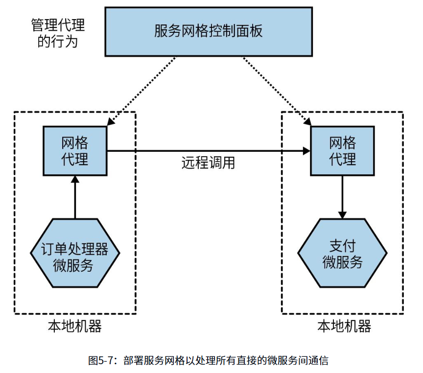

**控制面板会位于本地服务网格代理的上层，既可以用来更改这些代理的行为，也可以用来收集有关代理正在执行的操作信息。**

在Kubernetes上部署时，你会将每个微服务实例部署在一个具有本地代理的单个pod中。pod始终部署为独立单元，因此你总是知道你有一个可用的代理。此外，单一代理如果出了问题只会影响相应的pod。这种设置方式支持我们针对不同的目的配置每个代理。

**许多服务网格的实现都使用Envoy作为本地运行进程的基础。**Envoy是一款轻量级C++代理，常常用于构建服务网格和其他类型的基于代理的软件的基础模块，例如，它是Istio和Ambassador的重要组件。

这些代理又由控制面板统一管理。控制面板由一些软件组成，帮助你了解当前集群的情况并控制正在执行的操作。例如，当使用服务网格来实现双向TLS时，控制面板用于分发客户端和服务端证书。

**服务网格不就是智能管道吗**

所以，这种把通用功能纳入服务网格的讨论，可能会让一些人产生警惕。这难道不会像企业服务总线或者臃肿的API网关一样带来相同类型的问题吗？我们把过多的“智能”推给服务网格不会有风险吗？

**在这里需要记住的关键点是，我们放入服务网格中的通用行为并不针对任何一个微服务，也不会有业务功能泄露到外部。**我们只是配置了一些通用的功能，比如如何处理请求超时。对于需要基于每个微服务进行微调的通用行为，服务网格通常能够很好地满足需求，而无须在中心化平台上完成工作。

**你是否需要服务网格**

服务网格刚开始流行起来时，正值第1版出版之后。我认为这个想法有很多优点，但是也看到了这个领域的很多变化。业界提出并实现了不同的部署模型，然后又放弃，在这个领域提供解决方案的公司数量也大幅增加；但即使对于那些已经存在很长时间的工具，似乎也缺乏稳定性。Linkerd可以说是该领域的开创者之一。在第1版到第2版的转换中，它完全从头开始重建了产品。Istio作为谷歌指定的服务网格，花费了多年时间才推出首个1.0版本，甚至在后续的架构上仍然有重大调整（其控制平面的部署模型更趋向于单体化，这在某种程度上有些讽刺意味，但也是合理的）。

过去的5年中，当我被问及“我们是否应该使用服务网格”时，我的建议总是“如果你能够等待6个月再做决定，那么请在6个月之后再决定”。我对服务网格的想法很感兴趣，但是确实担心它的稳定性。像服务网格这样的技术不是我愿意冒很大风险的领域，因为它对整个系统的正常运行非常关键。就像选择消息代理或云供应商一样，我会非常认真地对待这个问题。

时至今日，我很高兴地看到，这个领域已经比较成熟了。尽管如此，服务网格并不适合所有人。首先，如果你没有使用Kubernetes，那么你的选择是很有限的。其次，这确实会增加复杂性。如果你只有5个微服务，我认为服务网格并不适合你（当然了，如果只有5个微服务，你是否需要使用Kubernetes也是值得商议的事情）。对于拥有更多微服务的组织而言，特别是当他们希望这些微服务可以用不同的编程语言实现的时候，服务网格是一个值得一试的选项。当然，你需要提前做好调研，因为在服务网格之间切换是一件令人痛苦的事情。

Monzo是一家公开谈论过如何使用服务网格的组织，它表示服务网格对于支撑其以现有规模运行起到了至关重要的作用。它使用Linkerd第1版来管理微服务间的RPC调用，这是极其有益的。有趣的是，当Linkerd第1版的旧架构不再满足其需求时，Monzo不得不经历服务网格迁移的痛苦以支持所需的规模。最终，它还是成功地转向了基于Envoy的内部服务网格。

#### 其他协议

API网关和服务网格主要用于处理与HTTP相关的调用。因此，REST、SOAP、gRPC等可以通过这些产品进行管理。但是，当你开始使用其他协议进行通信时，例如使用Kafka等消息代理时，情况就变得有些复杂了。通常的做法是，绕过服务网格，直接与代理进行通信。这意味着你不能假设你的服务网格能够作为所有微服务之间调用的中介。

### 5.11 文档服务

通过将系统分解为更细粒度的微服务，我们希望能够暴露许多API接口供人们使用，以便他们可以执行更多令人期待的功能。如果你已经实现了服务发现，你就已经知道了服务部署在哪里。但是我们如何才能知道它们在做什么以及如何使用它们呢？很明显，文档是一个办法。当然，文档总会过时。理想情况下，我们应该尽可能保证文档始终与微服务提供的API保持同步，并提供便捷的访问方式，使我们在访问接口时可以轻松地查看这些文档。

#### 显式模式

从长远来讲，拥有显式模式确实有助于理解服务所暴露的接口信息，但仅靠它们通常是不够的。正如我们讨论过的，模式有助于展示结构，但是在帮助消费者理解如何使用接口方面，它的帮助并不大。当然，如果你已经决定不使用显式模式，那就无所谓了，因为你会用文档来解决这类问题。你需要解释接口做的事情、记录相应的结构以及接口的实现细节。此外，如果没有显式模式，检测文档信息是否与接口的真实信息保持同步会非常困难。过时的文档是一个持续存在的问题，但至少有了显式模式可以让你有更多机会使文档保持最新状态。

我介绍过OpenAPI这种模式格式，它在提供文档方面也非常有效。对于使用Kubernetes的人来说，Ambassador的开发者门户非常值得关注。Ambassador已经成为Kubernetes API网关的热门选项，它的开发者门户可以自动发现可用的OpenAPI接口。部署新的微服务时可以自动提供相应文档的想法非常吸引我。

过去，我们缺乏针对基于事件的接口的文档支持。现在至少我们有了选择。AsyncAPI格式最初是对OpenAPI的一种改编，我们现在还有CNCF的CloudEvents。我没有在实际环境中使用过它们，但我更倾向CloudEvents，纯粹是因为它似乎具有丰富的集成和支持，这在很大程度上是由于它与CNCF的关联。从历史上看，与AsyncAPI相比，CloudEvents在事件格式方面似乎更加受限，在协议缓冲区模式被重新引入（之前曾被移除）前，它只支持JSON格式；因此，这可能是你在做出选择时需要考虑的因素。

**自描述系统**

......

5.12 小结

......

## 第6章 工作流

先暂时跳过这部分......

6.1 数据库事务

6.2 分布式事务：两阶段提交

6.3 分布式事务：只需说"不"

6.4 Saga

6.5 小结

## 第7章 构建

暂时跳过......

7.1 持续集成简介

7.2 构建流水线和持续交付

7.3 将源代码和构建映射到微服务

7.4 小结

## 第8章 部署

8.1 从逻辑到物理

8.2 微服务部署原则

8.3 部署选项

8.4 哪种部署方式适合你

8.5 Kubernetes与容器编排

8.6 渐进式交付

8.7 小结

## 第9章 测试

9.1 测试类型

9.2 测试范围

9.3 实现服务测试

9.4 微妙的端到端测试

9.5 应该放弃端到端测试吗

9.6 开发者体验

9.7 从预发布环境测试到生产环境测试

9.8 跨功能测试

9.10 小结

## 第10章 从监控到可观测性

### 10.1 混乱、恐慌和困惑

### 10.2 单个微服务，单个服务器

### 10.3 单个微服务，多个服务器

### 10.4 多个微服务，多个服务器

### 10.5 可观测性与监控

### 10.6 构建可观测性的组件

### 10.7 标准化

### 10.8 选择工具

### 10.9 机器专家

### 10.10 起点

10.11 小结

## 第11章 安全

11.1 核心原则

11.2 五大网络安全功能

11.3 应用安全的基础

11.4 隐式信任与零信任

11.5 数据保护

11.6 身份验证和鉴权

11.7 小结

## 第12章 弹性

### 12.1 弹性介绍

### 12.2 故障无处不在

### 12.3 多少才算多

### 12.4 功能降级

### 12.5 稳定性模式

### 12.6 分散风险

### 12.7 CAP定理

### 12.8 混沌工程

### 12.9 问责

### 12.10 小结

## 第13章 扩展性

### 13.1 扩展性的4个维度

### 13.2 组合模式

### 13.3 从小处着手

### 13.4 缓存

### 13.5 自动扩展

### 13.6 重新出发

### 13.7 小结

# **第三部分 人与组织**

## 第14章 用户界面

### 14.1 迈向数字化

### 14.2 集中所有权模型

### 14.3 业务流团队

### 14.4 单体前端模式

### 14.5 微前端模式

### 14.6 基于页面的拆分模式

### 14.7 基于部件的拆分模式

### 14.8 约束

### 14.9 中心聚合网关模式

### 14.10 服务于前端的后端模式

### 14.11 GraphQL

### 14.12 模式的混合应用

### 14.13 小结

## 第15章 组织架构

### 15.1 低耦合组织架构

### 15.2 康威定律

### 15.3 团队规模

### 15.4 理解康威定律

### 15.5 小团队、大组织

### 15.6 关注团队自治

### 15.7 强所有权与集中所有权

### 15.8 赋能团队

### 15.9 共享微服务

### 15.10 内部开源

### 15.11 可插拔式模块化微服务

### 15.12 孤儿服务

### 15.13 案例研究：Real Estate网站

### 15.14 地域分布

### 15.15 逆康威定律

### 15.16 人

### 15.17 小结

## 第16章 演进式架构师

### 16.1 名字的意义

### 16.2 什么是软件架构

### 16.3 让改变成为可能

### 16.4 架构师的可演进愿景

### 16.5 定义系统边界

### 16.6 一种社会边界

### 16.7 宜居性

### 16.8 原则方法

### 16.9 演进式架构

### 16.10 业务流组织中的架构

### 16.11 组建团队

### 16.12 必要标准

### 16.13 治理并铺路

### 16.14 技术债务

### 16.15 异常处理

### 16.16 小结

