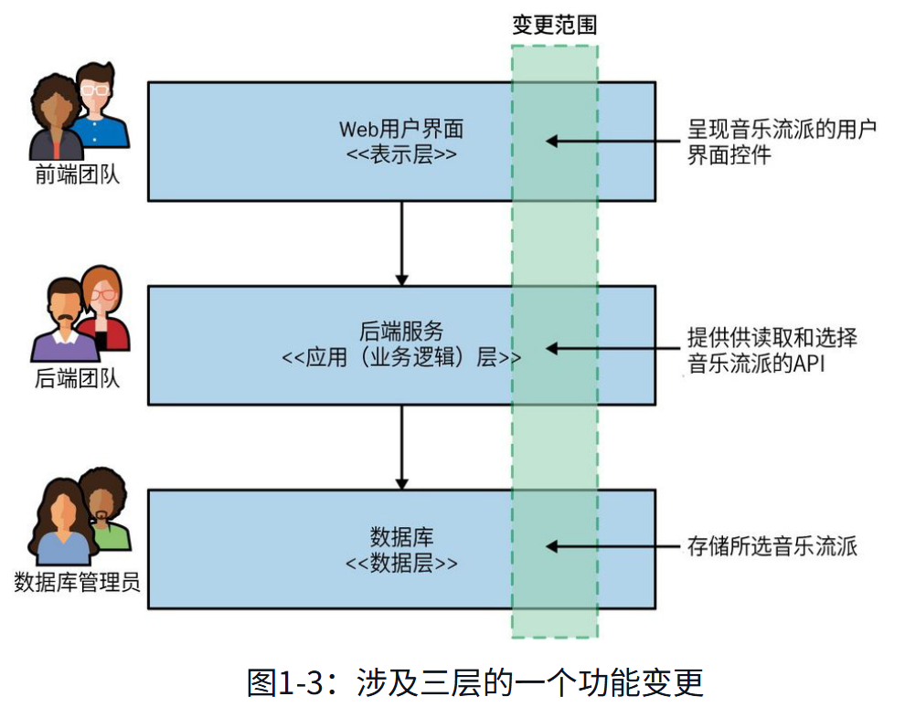

# **第一部分 基础**

## 第一章 刨根问底微服务

### 1.1 微服务概述

**微服务(microservice)是基于业务领域建模的、可独立发布的服务。它会把业务内聚的功能封装起来，并通过网络供其他服务访问。**将这样的服务进行组合就可以构建出更复杂的系统。例如，3个不同的微服务分别负责库存、订单管理、物流，这三者组合便能构成一个完整的电子商务系统。

微服务是一种面向服务的架构，尤其看重如何划分服务边界，且强调独立部署。此外，微服务与特定技术（如开发语言、开发框架）无关，这也是它的优势之一。

从外部看，单个微服务被看作一个黑盒。它通过适配协议在一个或多个网络端点（例如，消息队列或REST接口，如图1-1所示）提供业务功能。无论是其他微服务还是其他类型服务的消费者，都可以通过这些网络端点访问相关业务功能，而需要隐藏的内部实现细节（例如，服务所使用的技术或数据存储方式）可以对外界完全不可见。因为微服务架构在大多数情况下避免采用共享数据库，而是尽可能封装自己的数据库。

**微服务提倡信息隐藏。信息隐藏是指最大程度地隐藏组件内的信息，对外部的接口尽可能减少信息的暴露。这样可以清楚地将容易变更的（内部实现）部分和较难变更的（外部集成）部分分离开。**

微服务能够独立演进和按需发布的关键在于，微服务边界内（图1-1）的变更不应该影响上游消费者，能够确保功能可独立发布。拥有清晰和稳定的服务边界，不随内部实现的变更而变更的服务边界能够实现系统的高内聚低耦合。

### 1.2 微服务的关键概念

**可独立部署**

可独立部署是指我们可以变更和部署某个微服务，并向用户发布这些变更，而无须同时部署其他微服务。更重要的是，这不仅是可行的，而且应该成为你所管理系统的标准部署方式。这个概念看似简单但在执行过程非常复杂。**如果你从本书和微服务的整体概念中只学一件事，那就是确保你真正接纳了独立部署微服务的概念。**

可独立部署本身就非常有价值，但是要想实现独立部署，你还需要正确处理很多其他方面的工作，这些工作本身也很有价值。因此，你可以将可独立部署视为强制机制——通过将其作为目标进行持续关注，从而实现增益。

**围绕业务领域建模**

领域驱动设计之类的技术可以让你设计的代码更好地表达软件运行的实际业务领域。在微服务架构中我们使用相同的思想来定义服务边界。**通过围绕业务领域规划微服务，我们可以更轻松地推出新特性，或以不同的方式重组微服务，从而为我们的用户提供新功能。**

推出一个需要通过改变多个微服务才能实现的功能成本巨大。你需要协调每个微服务之间（可能还要跨越多个团队）的工作，并谨慎管理这些微服务新版本的部署顺序。这比在一个服务内实现相同的变更要更加费力。因此，我们需要找到尽可能减少跨服务变更的办法。

我经常看到分层架构，如图1-2所示的三层架构。图中的每一层代表了架构中的不同服务边界，**每个服务边界的划分都基于不同的技术功能诉求。**在这个例子中，如果我们只需要改变表示层，那将是相当高效的。但是经验表明，在这类架构中，功能变化通常会跨越多层——需要对表示层、应用层和数据层都做出变更。

将微服务按照业务端到端的方式切片，可以确保我们的架构尽可能高效地响应业务的变化。**可以说，采用微服务的设计理念意味着我们决定优先考虑业务功能的高内聚性，而非技术功能的高内聚性。**

**状态自主**

要想实现独立部署，我们需要尽力避免向后不兼容的变更。如果破坏了与上游消费者的兼容性，就会迫使它们也要跟着改变。在微服务中，明确界定内部实现和外部契约可以帮助减少向后不兼容的变更。

**除非你真的需要，否则不要共享数据库。即便需要，还是应该尽一切可能避免共享。在我看来，只要你想实现独立部署，那么共享数据库就是最糟糕的事情。**

**服务大小**

“一个微服务应该有多大？”这是我最常被问到的问题。考虑到“微服务”这个名字中的“微”字，人们会问这样的问题也就不奇怪了。然而，当你明白了是什么让微服务这种架构类型发挥作用时，大小的概念便毫无意义。

Thoughtworks 技术总监 James Lewis 曾说过一句微服务领域广为人知的话：“一个微服务最好和我的头一样大。”乍一看，这似乎没有给出答案。毕竟，我们不清楚 James 的头到底有多大。这句话的深意是：一个微服务应该保持在易于理解的大小，其挑战在于人的理解能力是不同的，你需要自行决定适合自己的大小。一个有经验的团队也许比其他团队能够更好地管理更大的代码库。如此说来，也许将 James 的话解读成“一个微服务最好和你的头一样大”会更好。

**架构和组织的一致性**

MusicCorp 是一家在线销售CD的电子商务公司，它使用如图1-2所示的简单三层架构。我们决定推动 MusicCorp 的架构变革以使它适应 21 世纪的变化。作为这个计划的一部分，我们正在评估现有的系统架构。我们有一个基于网页的用户界面层、一个以后端单体服务形式实现的业务逻辑层，以及一个使用传统数据库的数据层。和常见的情形一样，这些层由不同的团队负责。我们将在整本书中不时提到这家公司所经历的考验。

我们想实现一个简单的功能变更：我们希望客户能够指定他们喜欢的音乐流派。这个变更需要我们改变用户界面以显示选择流派的控件，后端服务需要实现将流派显示到用户界面中并支持流派的更改。最后，数据库需要能保存这个更改。每个团队都需要参与这一变更，并按正确的顺序完成部署，如图 1-3 所示。

现在这个架构还不错。整体架构都是围绕一组设定的目标完成优化的。三层架构之所以如此常见，部分原因是它的通用性——每个人都听说过它。倾向于选择你见过的通用架构通常是我们总能看到它的一个原因。**但是，我认为我们反复见到这种架构的最大原因是，它符合我们组织团队的方式。**

如今耳熟能详的**康威定律指出：设计系统的架构受制于产生这些设计的组织的沟通结构。**三层架构是这一定律在实践中的一个很好的例子。过去，IT 组织主要是根据成员的核心能力进行分组的：数据库管理员与其他数据库管理员组成一个团队；Java 开发人员与其他 Java 开发人员组成一个团队；而前端开发人员则组成另外一个团队。这种分组方式创建了与这些团队相对应的 IT 资产。

但现在我们对软件的期望已经发生改变，这种方式也需要随之变化。**现在，我们将人员分配到多技能团队中，以减少工作交接和信息孤岛。**我们希望比以往更快地交付软件，这促使我们根据系统划分来组织团队，这代替了传统的团队组织方式。

我们所做的大多数系统变更都与业务功能的变更有关。但在图 1-3 中，业务功能实际上分布在三层中的每一层，这大大增加了产生跨层变更的可能性。这是一种技术内聚性高但业务内聚性低的架构。如果想让变更更容易实现，我们就需要改变代码的组织方式，**应按业务内聚性而不是技术内聚性组织代码。**

我们将其与另一种可能的替代架构进行比较，如图 1-4 所示。不对组织和架构做横向的分层，而是按照垂直业务线划分，此处设有一个专门的团队来负责完善与客户信息相关的各种功能，这确保了本示例中的变更仅由一个团队来完成。

在这种架构设计里，这一变更可以通过让客户信息团队负责单个微服务来实现。在图 1-5 中，我们展示了从专辑目录微服务中获取的可用音乐流派列表，这种功能可能已经存在。我们还看到一个新的推荐微服务读取了客户喜欢的音乐流派信息，这在后续版本中很容易实现。

在这种情况下，客户微服务封装了三层架构中每一层的部分功能——一部分用户界面、一部分业务逻辑以及一部分数据存储。**我们的业务领域变成了驱动系统架构的主要力量**，希望这种做法能让我们更改起来更轻松，也能让团队和组织内的业务线保持一致。

### 1.3 单体

**本书中提到的单体，主要是指部署单元。当系统中的所有功能必须一起部署时，我们可以视它为一个单体。**符合这个定义的架构有很多种，但是本书仅讨论常见单体，比如单进程单体、模块化单体和分布式单体。

...

### 1.4 技术能力

使用微服务架构的初期，不需要采用很多新技术。事实上，采用新技术可能会适得其反。随着微服务架构的逐步推进，我们应该不断地寻找和关注由系统分布程度不断提升所带来的问题，并根据具体问题寻找应对的技术。

**日志聚合和分布式追踪**

随着你管理的进程数量的不断增加，了解系统在生产环境中的运行状态将变得越发困难。这也会导致故障排除变得更难。我强烈建议在采用微服务架构之前，将实现日志聚合作为先决条件。虽然我说过在使用微服务的初期，要谨慎引入过多的新技术，但是**日志聚合工具**至关重要，你应该将其视为采用微服务的先决条件。

**容器和Kubernetes**

在开始使用容器后，你会意识到还需要一些东西来帮助你在众多底层设备上管理这些容器。像Kubernetes这样的容器编排平台正是做这种工作的，它可以按照服务需要的方式分发容器实例。同时，它也让你能够更加有效地利用底层设备。

不过，不要急于采用Kubernetes，即便是容器也别着急采用。与传统的部署技术相比，它们绝对具有显著的优势，但如果只有几个微服务，则很难证明采用它们是有必要的。在管理部署的开销开始变成令人头疼的问题后，再开始考虑服务的容器化和使用Kubernetes比较合适。但是，如果你已经开始使用它们，尽量让其他人为你维护Kubernetes集群，比如使用公有云供应商的托管服务。自己运维Kubernetes集群可是个大工程！

**流技术**

尽管使用微服务让我们远离了单体架构下的共享数据库，但我们仍需要找到在微服务之间共享数据的方法。因此，那些让**流数据的传输和处理**（通常是在具有大量数据的场景中）变得简单的产品在采用微服务架构的团队中备受欢迎。

对许多人来说，选择Apache Kafka作为微服务环境中流数据传输的工具是有充分理由的，其消息的持久性和压缩，以及处理大量消息的扩展能力等都非常有用。

### 1.5 微服务的优势

**技术的异构性**

如果系统中的某个部分需要较高性能，我们可以使用不同的技术栈以更好地达到所需的性能水平。我们还可以用不同的数据存储方式，对系统的不同部分进行增强。例如，在社交网络的业务场景下，可以将用户的交互存储在图数据库中，以图的方式反映社交的高度互联性质，但用户发布的帖子可以存储在文档数据库中，从而产生如图 1-10 所示的异构架构。

通过使用微服务，我们还能够更快地尝试新技术，并了解技术的进步是否对系统有所帮助。尝试和采用新技术的最大障碍就是与之相关的风险。对于单体服务，如果想尝试一种新的编程语言、数据库或框架，任何变更都会影响大部分系统。有了一个由多个微服务组成的系统，就有了多个新地方来尝试这项新技术。我们可以选择风险可能最低的微服务并在其中使用新技术，因为我们可以控制潜在的负面影响。许多组织认为，这种更快地尝试和采用新技术的能力是一种真正的优势。

**健壮性**

提高应用系统健壮性的一个关键概念是**舱壁(bulkhead)**。系统的某个组件可能会发生故障，但只要该故障没有扩散，你就实现了故障隔离，系统的其余部分还可以继续工作。在这里，服务边界成为显著的舱壁。而在单体系统中，如果发生故障，则一切都会停止工作。虽然在单体系统中，可以通过在多台机器上运行多个实例的方式来降低完全失败的可能性，但是采用微服务，我们就能够处理其中完全失败的服务，或相应地将服务降级，从而维护系统的可用性。

**扩展性**

对于一个大型的单体系统，在实施扩展时，需要对所有组件进行扩展。因为即便只是整个系统的一小部分在性能上受到了限制，但如果这部分功能被固化在一个庞大的单体系统里，我们仍然需要将所有组件作为一个整体来处理。然而，如果采用多个较小的服务，我们就可以只扩展那些需要扩展的服务，并可以在不那么强大的硬件上运行系统的其他部分，如图 1-11 所示。

**部署的便捷性**

在有着百万代码行体量的单体系统中，即便是单行代码导致的变更，也必须通过重新部署整个系统才能发布。这种部署往往影响大、风险高。在实际操作中，出于担忧，我们会尽可能地回避少量变更导致的部署，从而降低发布变更的频率。但是，这意味着所做的更改会持续累积，直到最终进入生产环境，而这个新版本中包含着累积下来的大量变更。版本之间的差异越大，我们出错的风险就会越高。

如果使用微服务，我们就可以对单个服务进行更改，然后以独立于系统其余部分的方式进行部署。这让我们能够更快地部署代码。如果确实出现了问题，可以快速隔离这一单个服务，并轻松实现快速回滚。这也意味着可以更快地向客户推出我们的新功能。这是亚马逊和奈飞等组织使用这种架构的主要原因之一，即尽可能地消除妨碍软件快速发布的障碍。

**组织协调**

我们中的许多人都经历过大型团队和大型代码库带来的问题，而如果团队还分布在不同地方，那么这些问题可能会更加严重。我们清楚，处理小规模代码库的小团队往往更有效率。

微服务可以让我们更好地保持架构和组织的一致性，最大限度地减少每个代码库上工作的人数，从而达到团队规模和生产力的最佳平衡点。我们还可以随着组织的变化来改变服务的所有权，使我们在未来也能够持续保持架构和组织的一致性。

### 1.6 微服务的痛点

我们已经看到微服务架构可以带来许多好处，但它们也带来了许多复杂性。如果你正在考虑采用微服务架构，那么有能力去衡量其带来的优点和缺点至关重要。**实际上，大多数微服务的问题都可以归结于分布式系统**，它们在分布式单体应用中和在微服务架构中一样明显。

 **开发者体验**

随着拥有越来越多的服务，开发者体验可能会开始受到影响。像 JVM 这样的资源密集型运行时会限制在单个开发机器上运行的微服务的数量。我可以在笔记本电脑上运行 4 个或 5 个基于 JVM 的独立进程微服务，但我能运行 10 个或 20 个吗？可能比较难。即便运行时负担少，你可以在本地运行的服务的数量也还是有限的。如果你无法在一台机器上运行整个系统，就无法继续进行开发工作；而如果你使用了本地无法运行的云服务，那问题将变得更加复杂。

**技术过载**

在开始采用微服务时，你必然会面对一些基本的挑战：需要花费大量时间来理解有关数据一致性、延迟、服务建模等方面的问题。如果在试图搞清楚这些问题会对目前的开发过程有何影响的同时，还要运用大量新技术，那么这会让工作难上加难。同样值得指出的是，学习新技术将会占用原本可以用来向用户交付功能的时间。

**成本**

至少在短期内，你很有可能会看到多种因素导致的成本增加。首先，你可能需要运行更多额外的东西——更多的进程、计算机、网络、存储空间以及更多的支持软件（这将产生额外的许可费用）。

其次，向团队或组织引入的任何新的变化都会在短期内减慢交付速度。学习新想法并搞清楚如何有效地利用它们是需要时间的。同时，其他活动也将受到影响。这将直接导致新功能的交付放缓，或者需要增加更多的人手来抵消这种代价。

**生成报表**

单体系统通常有一个单体数据库。报表可以直接在单体数据库上生成，或者可以采用只读副本，如图 1-12 所示。

采用微服务架构意味着我们打破了这种单体系统模式。这并不是说我们不再需要跨模块一起分析所有数据，而是工作变难了，因为我们的数据现在分散在多个隔离的结构中。

更现代的生成报表的方法，例如用流式传输来为大量数据生成实时报表可以很好地与微服务架构配合使用，但通常这需要采用新思路、使用新技术。或者，你只需将微服务中的数据发布到中心数据库（或结构化较低的数据湖），以满足生成报表的使用场景。

**监控和故障排除**

......

**安全**

在单进程单体系统中，大部分信息仅在该进程中传输。现在，更多信息是通过服务之间的网络而传输的。这会使传输过程中的数据更容易地被观察到，也更容易遭到中间人攻击而被篡改。这意味着你需要更加注意保护传输中的数据，并确保微服务的接入端点受到保护——只有被授权方才能使用它们。

**测试**

对于任何类型的功能测试，都需要寻找一个微妙的平衡点。测试所涉及的功能越多（测试范围越广），你对应用的信心就越大。此外，测试的范围越广，就越难设置测试数据和测试基线，且测试的运行时间就会越长；当测试失败时也就越难弄清哪里出了问题。

在涵盖的功能方面，端到端测试对于任何类型系统来说，其测试规模都是最大的，且在编写和维护方面要比小范围的单元测试更容易出问题——我们可能已经习惯了这一点。不过，这通常是值得的，因为我们希望通过端到端测试来模拟用户的使用方式以验证系统，从而获得信心。

但是，在微服务架构中，端到端测试的范围变得非常大。现在，我们需要跨多个进程运行测试，且所有这些进程都需要针对测试场景进行部署和配置。我们还需要处理误报，因为环境问题也会导致测试失败。

**延迟**

使用微服务架构时，以前在本地一个处理器上可以完成的处理任务现在被拆分为多个单独的微服务；以前只在单个进程中传输的信息现在需要通过网络进行序列化、传输和反序列化，你可能需要比以往任何时候都更频繁地使用网络。而所有这些都可能导致系统延迟问题愈加严重。

**数据一致性**

从在单个数据库中存储和管理数据的单体系统转变为分布式系统（其中多个进程在不同的数据库中管理状态）会对数据的一致性带来潜在挑战。过去，你可以依赖数据库事务来管理状态变更，但分布式系统很难提供类似的一致性保障。在大多数情况下，在协调状态变更方面，使用分布式事务已被证明问题会很多。

### 1.7 我应该采用微服务吗

......

### 1.8 小结

微服务架构可以在选择技术、处理健壮性和扩展性、组织团队等方面为你提供极大的灵活性。这种灵活性是许多人采用微服务架构的部分原因。但是微服务也带来了很大程度的复杂性，你需要确保这种复杂性是可掌控的。对于许多人来说，微服务已成为默认的架构方法，几乎可以在所有情况下使用。但是，我仍然认为它只是一种架构选择，你必须根据要解决的问题来确认其必要性；通常，更简单的方法有助于更容易地完成交付工作。

尽管如此，在许多组织，尤其是大型组织中，微服务已经大有作为。当微服务的核心概念得到正确理解和实施时，它们可以帮助创建自治且高效的架构，从而使系统成为超越各个部分之和的整体。

## 第2章 微服务建模

### 2.1 MusicCorp简介

### 2.2 合理划分微服务边界

在 MusicCorp 团队全力以赴、开发一个又一个在线服务，并试图向所有人售卖八轨磁带之前，让我们暂停一下，谈谈需要时刻谨记的最重要的基本理念。我们希望微服务能够独立更改和独立部署，并将功能发布给用户。能够独立更改一个微服务而不影响其他微服务的能力至关重要。那么在划定微服务边界时，我们需要考虑哪些因素呢？

**从本质上说，微服务只是模块化拆分的另一种方式，尽管它在模块之间具有基于网络的交互问题，以及由此带来的相关挑战。这仍然意味着可以依靠模块化软件和结构化编程领域的大量现有技术，来帮助和指导我们去定义微服务间的边界。**考虑到这一点，我们需要更深入地探究第 1 章简要介绍过的 3 个关键概念—信息隐藏、内聚和耦合，这些概念对于确定良好的微服务边界至关重要。

**信息隐藏**

信息隐藏是 David Parnas 提出的一个概念，旨在研究定义模块边界最有效的方法。信息隐藏描述了一种期望，即将尽可能多的实现细节隐藏在模块（微服务）边界内。Parnas 研究了这种模块划分理论上带来的好处。

- 提升开发效率：允许模块独立开发，我们可以并行完成更多的工作，并减少添加项目人员带来的影响。
- 可理解性：每个模块都可以被独立地看待和理解，这使整个系统的功能更易于理解。
- 灵活性：每个模块可以被独立地更改，即在无须更改其他模块的情况下，我们仍然可以对系统的功能进行更改。此外，模块还可以按不同的方式组合以提供新功能。

以上特征很好地补充了我们试图通过微服务架构实现的目标——事实上，我现在的确将微服务视为模块化架构的另一种方式。正如 Parnas 在他的大部分工作中所探究的，仅仅划分模块并不会直接获得收益，获取收益很大程度上取决于模块边界是如何划分的。

在 Parnas 的另一篇论文中，我们还认识到下面这句至关重要的话：模块之间的连接是模块相互之间做出的假设。

通过减少一个模块（或微服务）对另一个模块的假设数量，可以直接影响它们之间的连接。限制假设的数量更能够确保在更改一个模块时不会影响其他模块。如果更改模块的开发人员清楚地了解其他人如何使用该模块，那么开发人员将更容易且安全地完成更改，从而使得上游调用方也不必更改。

这同样适用于微服务，唯一的区别是我们可以只部署已修改的微服务，而无须部署其他。可以说，微服务架构放大了Parnas 所描述的 3 个理想特征，即提升开发效率、可理解性和灵活性。

**内聚**

关于内聚，我听过的最简明的定义是：“一起变化的代码应该组织在一起。”就我们的目标而言，这是一个相当合适的定义。之前我们讨论过，优化架构就是为了更容易地进行业务变更，因此我们希望以这种方式对功能进行分组，从而将变更限制在尽可能小的范围内。

为了在行为发生改变时，能够在同一地方进行更改并尽快发布，我们希望将相关行为放在一起，无关行为放在别处。如果必须在很多不同的地方实施改造，就必须发布很多不同的服务来实现这个变更。在许多不同的地方进行改造会更慢，而一次部署许多服务是有风险的，因此我们需要避免出现这两种情况。

所以，我们希望在问题域中找到边界，确保相关行为放在了一起，并尽可能松散地与其他边界通信。如果相关功能分散在整个系统中，这被称为“低内聚”，而对于微服务架构，我们的目标是要实现高内聚。

**耦合**

当服务之间耦合度较低时，对一个服务的更改不应依赖于对另一个服务的更改。微服务的全部意义在于能够对服务进行独立更改和部署，而无须更改任何其他部分。这相当重要。

在构建低耦合系统时，相互协作的服务之间应该只了解最少必要信息，这也意味着需要限制服务间不同类型调用的数量，因为除了潜在的性能问题，过于频繁的通信也会导致紧密耦合。

耦合有多种形式，我看到过不少关于耦合的误解是涉及服务架构的，所以我认为很有必要对这个话题进行更详细地探讨。下面将深入探究这一话题。

**内聚和耦合的相互作用**

正如之前提到的，耦合和内聚的概念显然是一脉相承的。从逻辑上讲，如果某个功能分散在系统中，对该功能的变更就会跨越这些边界，这意味着更高的耦合性。以结构化设计先驱 Larry Constantine 命名的康斯坦丁定律巧妙地总结了这一点：高内聚低耦合的结构是稳定的。

这句话里所说的“稳定”的概念很重要。为了让微服务边界的划分可以支持独立部署、实现并行开发以及团队之间更少的协调工作，边界本身就需要具有一定程度的稳定性。如果微服务暴露的契约以向后不兼容的方式不断变化，那么上游消费者也会因此而被迫不断变化。

**耦合和内聚密切相关，甚至在某种程度上可以说是相同的，因为这两个概念都描述了事物之间的关系。内聚用于描述边界内事物之间的关系（这里是指微服务），而耦合则用于描述跨边界事物之间的关系。**没有绝对最佳的方式来组织代码；对代码分组的方式和原因需要我们进行各种权衡，而内聚和耦合只是用来阐明权衡结果的一种方式。我们能做的就是在这两种想法之间找到平衡，找到一种最适用于当前场景以及问题的做法。

要记住的是，世界瞬息万变。随着需求的变化，你可能需要重新审视曾经做出的决策。有时，系统的某些部分可能正在经历非常大的变化，以至于无法保持稳定。

### 2.3 耦合的类型

从前面的讲述中，你可能会得出所有的耦合都不好的结论。但严格来说，这并不完全正确。因为在系统中一定程度的耦合是不可避免的，我们要做的是尽可能减少这些耦合。

图 2-1 简单展示了几种类型的耦合，它们是按照从低（理想）到高（不理想）的顺序排列的。

**领域耦合**

领域耦合描述了一个微服务需要与另一个微服务进行交互的情况，因为前者需要使用后者提供的功能。

在图 2-2 中，我们可以看到在 MusicCorp 内部管理 CD 订单的部分内容。在这个示例中，订单处理器微服务调用仓库微服务来预留库存，并调用支付微服务来收款。因此，订单处理器微服务依赖于仓库微服务和支付微服务并与二者耦合，以实现这一操作。但是，仓库微服务和支付微服务之间没有这种耦合，因为它们没有交互。

在微服务架构中，这种类型的交互在很大程度上是不可避免的。基于微服务的系统依赖于多个微服务的协作才能完成工作。不过，我们仍然希望将这种依赖保持在最低限度；**每当看到这样的单个微服务依赖于多个下游微服务时，我们需要给予特别的关注，因为这可能意味着微服务做得太多了。**

通常，领域耦合被认为是一种松散形式的耦合，即便如此也可能会遇到问题。存在需要与大量下游服务通信的微服务，可能意味着逻辑过于集中。当微服务之间发送更复杂的数据集时，领域耦合也可能出现问题，这通常指向我们将很快探讨的更为棘手的耦合形式。

**关于时间耦合的简要说明**

你可能听说过被称为“时间耦合”的另一种耦合形式。在分布式系统的上下文中，时间耦合是指一个微服务需要另一个微服务同时做某事才能完成操作的情况。

两个微服务需要同时启动并且可以相互通信，以完成操作。所以在图 2-3 中，MusicCorp 的订单处理器微服务正在对仓库微服务进行同步 HTTP 调用，仓库微服务需要在调用的同时保持可用。

如果某种原因导致了订单处理器微服务无法访问仓库微服务，那么我们就无法预留订单中要发送的 CD 库存，那么操作将会失败。订单处理器微服务还必须阻塞并等待仓库微服务的响应，这也可能会导致资源争用的问题。

时间耦合并不总是坏事，只是需要我们给予关注。随着拥有更多的微服务，它们之间的交互会更加复杂，时间耦合带来的挑战可能会更大，这使得扩展系统和保持系统正常工作变得更加困难。避免时间耦合的一种方式是使用某种形式的异步通信，比如消息代理。

**传递耦合**

传递耦合描述的情况是，一个微服务将数据传递给另一个微服务，仅因为下游的其他微服务需要这些数据。从许多方面来看，这是耦合中最棘手的一种形式。

我们来看一个传递耦合的示例，看看 MusicCorp 是如何处理订单的。图 2-4 中的订单处理器微服务在向仓库微服务发送一个请求来创建发货单。这个请求里包含一个运输清单。该运输清单不仅有客户的地址，还包含运输类型。仓库微服务只是将此清单传递给下游的物流微服务。

传递耦合的主要问题是，对下游服务所需数据的更改可能会导致更重大的上游服务的更改。在这个示例中，如果物流微服务现在需要更改数据的格式或内容，那么仓库微服务和订单处理器微服务都可能需要更改。

有几种方法可以解决这个问题。首先是考虑调用方微服务是否可以直接绕过中介。在这个示例中，这意味着订单处理器微服务直接调用物流微服务，如图 2-5 所示。但是，这会引起其他麻烦。订单处理器微服务正在增加领域耦合，因为物流微服务是它需要了解的另一个微服务——如果这是唯一的问题可能还好，因为领域耦合是一种更松散的耦合形式。但是，解决方案在这里变得更加复杂，因为在使用物流微服务发送包裹之前，必须在仓库微服务保留库存，并且在完成运输之后，我们需要相应地更新库存。这将许多以前隐藏在仓库微服务中的复杂性和业务逻辑推移到了订单处理器微服务中。

对于这个特定示例，我可能会考虑一种更简单（尽管更细微）的更改——向订单处理器微服务完全隐藏对运输清单的要求。将库存管理和配送调度的工作委托给仓库微服务的想法是合理的，但我们不满意的是我们泄露了一些低级的实现细节，即下游的物流微服务需要一份运输清单。隐藏这个细节的一种方法是，让仓库微服务将清单所需信息作为其服务契约的一部分，然后由它在本地创建运输清单，如图 2-6 所示。这意味着如果物流微服务更改其服务契约，只要是由仓库微服务负责收集物流微服务所需的数据，那么这个变更从订单处理器微服务的角度来看将是不可见的。

虽然这有助于保护订单处理器微服务免受物流微服务的更改的影响，但仍有一些情况需要各方进行更改。如果考虑增加对国际运输的支持，作为该变更的一部分，物流微服务需要将海关申报单包含在运输清单中。如果这是一个可选参数，那么我们可以毫无顾忌地部署新版本的物流微服务。但是，如果这是一个必选参数，那么仓库微服务将必须创建一个海关申报单。它可以使用现有信息来创建，或者可能需要订单处理器微服务向它提供更多的信息。

尽管在这种情况下，我们并没有避免对所有 3 个微服务进行变更，但是我们可以更灵活地决定何时以及如何实现这些变更。如果在之前示例中的紧耦合（传递耦合）情况下，添加海关申报单可能需要同步发布所有 3 个微服务。通过隐藏这个细节，我们至少可以更容易地进行分阶段部署。

减少传递耦合的最后一种方法是，订单处理器微服务仍然通过仓库微服务将运输清单发送到物流微服务，但让仓库微服务完全不知道运输清单本身的结构。订单处理器微服务将运输清单作为订单请求的一部分发送，但仓库微服务不会尝试查看或处理该字段，它只是将其视为一个数据块，将其传递出去，而不关心内容。对运输清单格式的更改仍然需要变更订单处理器微服务和物流微服务，但由于仓库微服务不关心清单中的实际内容，因此不需要变更。

**公共耦合**

当两个或多个微服务使用同一组公共数据时，就会发生公共耦合。这种耦合形式的一个简单且常见的例子是多个微服务使用同一个共享数据库；当然，它也可以表现为使用共享内存或共享文件系统。

公共耦合的主要问题是数据结构的更改会同时影响多个微服务，比如下图 2-7 中 MusicCorp 的服务示例。前面讲过MusicCorp 在世界各地开展业务，因此它需要有关业务所在国家的各种信息。在这里，多个服务都是从共享数据库中读取静态参考数据的。如果此数据库的结构以向后不兼容的方式更改，那么该数据库的每个使用者都需要随之更改。实际上这样的共享数据往往很难进行更改。

相对而言，图 2-7 中的示例是比较温和的。这是因为静态数据本质上不会经常更改，而且由于这些数据是只读的，因此我倾向于以这种方式共享这类数据。但是，如果公共数据的结构会被频繁地更改，或者多个微服务正在读取和写入相同的数据，那么公共耦合就会更成问题。

图 2-8 展示了订单处理器微服务和仓库微服务同时读取和写入共享订单微服务表，以帮助管理向 MusicCorp 的客户发送 CD 的过程。两个微服务都会更新“Status”（状态）列。订单处理器微服务可设置 PLACED（已下单）、PAID（已付款）和 COMPLETED（已完成）状态，仓库微服务可设置 PICKING（拣货中）或 SHIPPED（已发货）状态。

尽管你可能认为图 2-8 有点儿牵强，但这个公共耦合的简单示例有助于说明一个核心问题。它从概念上说明了订单处理器微服务和仓库微服务可以同时管理订单生命周期的不同阶段。在更改订单处理器微服务时，我们能够确定这个更改不会破坏仓库微服务对订单数据的要求吗？反过来呢？

使用有限状态机是确保正确更改某一事物状态的一种方法。它可用于管理某个实体从一种状态到另一种状态的转换，并确保不发生无效的状态转换。在图 2-9 中可以看到 MusicCorp 中订单允许的状态转换。订单可以直接从“已下单”到“已付款”，但不能直接从“已下单”到“拣货中”（这个状态机可能不足以完成从下单到发货所涉及的实际业务流程，这里仅举个简单的例子作为说明）。

**这个示例中，仓库微服务和订单处理器微服务共同管理此状态机。如何确保它们对允许的状态转换达成一致就是下一个问题了。有多种方法可以跨微服务边界管理此类流程。在第 6 章中讨论 Saga 时，我们将回到这个话题。**

**一个潜在的解决方案是由单个微服务管理订单状态**。在图 2-10 中，仓库微服务或订单处理器微服务都可以向订单微服务发送状态更新请求。在这里，订单微服务是所有订单的准确保证。在这种情况下，将来自仓库微服务和订单处理器微服务的请求，仅仅视为请求是非常重要的。订单微服务的工作是集中管理与订单相关的可接受的状态转换。因此，如果订单微服务收到来自订单处理器微服务的“将状态从‘已下单'切换到‘已发货'”的请求，它可以拒绝该请求，因为这是无效的状态转换。

对于发送给下游微服务的请求，如果请求是无效的，请确保下游微服务可以拒绝。

在这种情况下，还有一种方法是将订单微服务实现为仅是数据库 CRUD 操作的包装器，对这个服务的请求会直接映射到数据库更新。这类似于一个对象具有私有字段但具有公共的 getter 和 setter 的情况——行为已经从微服务暴露给上游消费者（内聚性降低），我们又回到了管理跨多个不同服务的可接受状态转换的情况。

**如果一个微服务看起来是一个对数据库 CRUD 操作的简单包装器，那就表明可能存在低内聚和高耦合，因为本应该在该服务中管理数据的逻辑被分散到了系统的其他地方。**

公共耦合的源头也是资源争用的潜在来源。使用相同文件系统或数据库的多个微服务可能会使共享资源过载，如果共享资源变慢甚至完全不可用，可能会导致严重问题。共享数据库特别容易出现这个问题，因为多个消费者可以直接对数据库执行任意查询，而这些查询又可能具有完全不同的性能表现。我见过不止一个数据库因一个 SQL 的慢查询而陷入崩溃——我曾经就导致了一两次崩溃。

所以，除了某些特殊场景，公共耦合在通常情况下是不可接受的。即便它是良性的，我们对共享数据可以进行的更改也是有限的，它通常反映了代码缺乏内聚性。这还可能带来操作争用方面的问题。正是由于这些原因，公共耦合是不理想的耦合形式之一——它甚至会让情况更加糟糕。

**内容耦合**

**内容耦合讲的是上游服务进入下游服务内部，并改变其内部状态的情况。最常见的是外部服务访问一个微服务的数据库并直接做出更改。内容耦合和公共耦合之间的区别是微妙的。在这两种情况下，两个或多个微服务都在读取和写入同一组数据。**在公共耦合的情况下，你知道正在使用共享的外部依赖项，也知道它不在你的控制之下；而在内容耦合的情况下，所有权界限变得不那么清晰，开发人员更改系统变得更加困难。

我们回顾一下之前的 MusicCorp 的例子。在图 2-11 中，有一个订单微服务，它应该按照系统允许的订单状态来管理订单的更改。订单处理器微服务向订单微服务发送请求，订单微服务不仅负责执行具体的状态变更操作，还负责决定何时执行状态转换。另外，仓库微服务直接更新保存订单数据的表，绕过订单微服务中的校验功能。我们只能指望仓库微服务有一套和订单微服务一致的校验逻辑，以确保只发生有效的更改。最好的情况下，这代表着仅是逻辑的重复，而在最坏的情况下，仓库微服务中对状态更改的校验逻辑与订单微服务中的校验逻辑不同，因此我们可能会面对一些状态反常又令人困惑的订单。

在这种情况下，还存在订单表的内部数据结构暴露给外部的问题。在更改订单微服务时，我们必须非常小心地更改这张表——甚至需要假设我们明确知道该表正在被外部直接访问。简单的解决方法是让仓库微服务向订单微服务发送请求，然后对请求进行校验，同时也隐藏内部细节，从而使订单微服务的后续更改更加容易。

如果你正在开发一个微服务，那么必须明确地区分可以自由更改的内容和不能自由更改的内容。确切地说，作为开发人员，你需要知道何时可以更改这个服务向外部公开的契约，还需要确保在进行更改时不会破坏上游消费者的使用。而对于其他不影响公开契约的部分，你可以不受拘束地进行更改。

当然，在公共耦合中出现的问题也会在内容耦合中出现，但内容耦合还会带来一些额外的更令人头疼的问题，以至于有些人称其为“病态耦合”。

当允许外部直接访问数据库时，该数据库实际上成了外部契约的一部分，这会导致你无法轻易推断出哪些内容可以更改，哪些内容不能更改。你失去了定义什么可以共享（如果共享就无法轻易更改）和什么需要隐藏的能力。信息隐藏已经无从谈起。

总之，我们应该避免内容耦合。

### 2.4 恰到好处的领域驱动设计

在第 1 章中，我们介绍过用于确定微服务边界的主要机制是围绕领域本身，利用领域驱动设计(domain-driven design，DDD)来帮助创建领域模型。接下来，让我们看下 DDD 在微服务的环境中是如何工作的。

这里有必要在这里强调 DDD 的几个核心概念：

- 通用语言：定义并采用一种通用语言，用于代码实现和描述领域，以促进沟通。
- 聚合：作为单个实体进行管理的对象集合，通常指向的是现实世界中的概念。
- 限界上下文：业务领域内的明确边界，为系统的其他部分提供业务功能，同时也隐藏了内部的复杂性。

**通用语言**

**通用语言是指，我们应该努力在代码中使用用户使用的术语。在交付团队和实际用户之间使用通用语言，将更容易对现实世界的领域进行建模，并且能够促进沟通。**

通过将真实世界的语言融入代码中，事情就会变得容易得多。当开发人员直接使用产品所有者给出的术语来编写故事时，他们更容易理解其含义并弄清楚需要做什么工作。

**聚合**

在 DDD 中，聚合是一个容易让人困惑的概念，它有许多不同的定义。它只是由对象随意组成的集合吗？是应该从数据库中取出的最小单位吗？对我而言，一个行之有效的模型是先将聚合视为真实领域概念的一种表示，例如订单、发票、库存商品等。聚合通常有自己的生命周期，因此可以作为状态机来实现。

举一个 MusicCorp 的例子，订单聚合可能包含多个订单行。这些订单行只有作为整个订单聚合的一部分才有意义。

我们希望将聚合视为独立的单元，且确保处理聚合状态转换的代码与状态本身组合在一起。因此，尽管单个微服务可以管理多个聚合，但一个聚合应该只由一个微服务管理。

然而一般来说，我们应该将聚合视为具有状态、唯一身份和生命周期的事物，并将其作为系统的一部分进行管理。聚合通常涉及真实世界中的概念。

......

**限界上下文**

......

### 2.5 DDD在微服务环境中的应用案例

......

### 2.6 领域边界的替代方法

......

### 2.7 混合模型和例外

......

## 第3章 拆分大单体

本书的大多数读者通常不会从头开始设计一个系统。即便真的是从头开始，我也不推荐从微服务入手。更常见的情况是，系统是现成的，可能是某种形式的单体架构，而你希望将其改造为微服务架构。

### 3.1 明确目标

微服务不是目标。拥有微服务并不意味着你“赢了”。采用微服务架构应当是基于理性判断且经过深思熟虑的结果。只有在当前架构下无法找到更容易的方法来实现最终目标时，才应该考虑迁移到微服务架构。我见过一些团队痴迷于创建微服务，却从不问为什么。微服务会引入新的问题，增加系统的复杂性，在某些情况下，出现的问题会非常棘手。

过分关注微服务本身而不是最终目标，还意味着你很可能会停止思考其他方式来实现你所寻求的改变。例如，微服务能帮助我们扩展系统，但我们通常应该先考虑其他扩展技术。在负载均衡器后面增加几个现有单体系统的副本，可能会更快速、更有效地实现扩展。相比之下，微服务改造的过程则是复杂而漫长的。

微服务并不容易，所以应先尝试简单的方法。

最后，如果没有明确的目标，就很难知道从哪里开始。你应该先创建哪个微服务？如果对目标没有全面的了解，就会盲目行事。

### 3.2 增量迁移

如果你确信拆分现有的单体系统是正确的做法，我强烈建议你逐步切割这一单体系统，一次只切一点儿。这种增量方式不仅有助于边拆分边学习微服务，而且还可以在问题发生时将风险最小化（出现问题是在所难免的）。

将大工程分成许多小步骤，每一个步骤都可以执行和复盘。如果发现方向不对，那也只是一小步而已。这一步无论对错，你都可以从中学到知识或吸取教训，并据此调整和优化后续的步骤。

将事情分解成更小的部分还可以尽早识别成功的做法并从中学习，这有助于让接下来的工作更加轻松，并逐步走向成功。一次拆分一个微服务可以增量地体现微服务的价值，而不必等到最后的大爆炸式部署。

综上所述，我对那些关注微服务的人提出以下建议：如果你认为微服务是个好主意，那就先从小处着手。选择一两个业务领域，将它们实现为微服务，并部署到生产环境中，然后，回顾并评估这些新建的微服务是否真的帮助你更接近既定的目标。

只有在生产环境中运行，你才能真正体会到伴随微服务架构而来的恐惧、痛苦和折磨。

### 3.3 单体并不是威胁

虽然本书的开头已经指出，某种形式的单体架构可以是一个完全有效的选择，但还是有必要重申，单体架构本身并没有问题，不应该被视为一种威胁。**你的重心不应该放在摆脱单体架构上，相反，应该更多地关注你期望通过架构转型获得哪些好处。**通常情况下，在转向微服务之后，现有的单体系统会保留下来，只是容量通常会减小。例如，为了提高应用程序处理负载的能力，可以迁移目前存在瓶颈的10%的功能，剩余90%的功能仍留在单体系统中。

许多人觉得，单体和微服务共存是“混乱”的，但现实世界中运行的系统架构往往是杂乱无章的，不可能永远保持整洁或处于刚刚完工的状态。如果追求完全“整洁”的架构，则需要具备极其深远的前瞻性和几乎无限的资源，那样才能把理想的系统架构复刻出来。但是真正的系统架构是不断发展的，必须适应需求和知识的变化。关键在于要习惯这种思维方式，我将在第16章中继续探讨这一点。

通过增量方式迁移微服务，可以逐步拆解现有的单体系统，并在这个过程中实现有价值的改进。同时，重要的是，你知道何时应该停下来。

只有在非常罕见的情况下，完全放弃使用单体系统是一个硬性要求。根据我的经验，这通常仅限于以下情形：现有的单体架构是基于“已死”或“将死”的技术，或者与即将“退役”的基础设施绑定，或者试图放弃昂贵的第三方系统。即使在这些情况下，由于前面提到的原因，你仍然需要采用增量迁移的方式。

### 3.4 先拆分什么

**只要你真正理解了选择微服务的理由，就能据此来决定微服务改造的优先次序。**如果想要扩容应用程序，那么应当优先选择限制当前系统处理能力的功能。如果想缩短交付时间，就去找出那些变化最频繁的功能，看看它们是否可以改为微服务。你还可以使用 CodeScene 等静态分析工具来快速查找代码库中易变的部分。图 3-1 中呈现了 CodeScene 的一个示例，它展示了开源项目 Apache Zookeeper 中的热点分布。

但你还是必须考虑哪些拆分是可行的。有些功能可能已经深深地融入现有的单体系统中，以至于无法分解。或者，所涉及的功能可能对应用系统非常重要，以至于任何更改都是高风险的。又或者，要迁移的功能本身就是独立的，那么拆分就会非常简单。

**从根本上说，将哪些功能拆分为微服务，最终取决于两种考量之间的权衡——实现拆分的难易程度和优先拆分的好处。**

我建议，在多个可优先拆分的微服务中，选择相对容易实现的。在这样的过渡中，尤其是在需要花费数月或数年的迁移过程中，尽早获得正向激励是很重要的。你需要积累一些速赢的经验。

此外，如果在尝试拆分本以为最简单的微服务时，却无法让它发挥作用，那么可能需要重新考虑微服务架构是否真的适合你和你的组织。

积累一些成功的经验和失败的教训后，你将可以更好地处理更复杂的迁移工作，并且这些迁移也更可能在核心业务领域获得成功。

### 3.5 按层拆分

至此你已经确定了要拆分出的第一个微服务。接下来该怎么做？我们可以将这种拆分进一步分解成更小的步骤。如果是基于Web服务的传统三层架构，那么我们可以从UI、后端应用服务和数据存储这3个方面来寻找想要拆分的功能。从微服务到UI的映射通常不是一一对应的（这是第14章将深入探讨的话题）。因此，拆分与微服务相关的UI可以看作一个单独的步骤。在这里，我要提醒大家不要忽视UI部分。我见过太多的组织只关注拆分后端服务的好处，而这通常会导致架构重组的方法过于孤立。有时候最大的好处可能来自对UI的拆分，因此忽略这一点会带来危险。通常，UI的拆分往往滞后于后端应用服务的拆分，因为在微服务可用之前，很难看到UI拆分的可能性，但要确保拆分UI不会滞后太久。再看看后端服务和相关的数据存储，我们在拆分微服务时，保证两者都在拆分范围内是至关重要的。从图3-2中可以看到，我们期望拆分出与客户愿望清单相关的功能。应用的功能代码存在于单体系统中，而相关的数据则存储在数据库中。那么应该先拆分哪一个呢？

### 3.6 有用的拆分模式

### 3.7 拆分数据库的注意事项

## 第4章 微服务间通信模式

### 4.1 从进程内到进程间

### 4.2 进程内的通信技术：选择众多

### 4.3 微服务间的通信模式

### 4.4 同步阻塞模式

### 4.5 异步非阻塞模式

### 4.6 共用数据模式

### 4.7 请求-响应模式

### 4.8 事件驱动模式

### 4.9 谨慎行事

### 4.10 小结

# **第二部分 实现**

## 第5章 实现微服务间通信

### 5.1 寻找理想的技术

### 5.2 技术选型

### 5.3 序列化格式

### 5.4 模式

### 5.5 处理微服务间的变更

### 5.6 避免破坏性变更

### 5.7 管理破坏性变更

### 5.8 DRY和微服务架构中的代码复用风险

### 5.9 服务发现

### 5.10 服务网格和API网关

### 5.11 文档服务

### 5.12 小结

## 第6章 工作流

### 6.1 数据库事务

### 6.2 分布式事务：两阶段提交

### 6.3 分布式事务：只需说"不"

### 6.4 Saga

### 6.5 小结

## 第7章 构建

### 7.1 持续集成简介

### 7.2 构建流水线和持续交付

### 7.3 将源代码和构建映射到微服务

### 7.4 小结

## 第8章 部署

### 8.1 从逻辑到物理

### 8.2 微服务部署原则

### 8.3 部署选项

### 8.4 哪种部署方式适合你

### 8.5 Kubernetes与容器编排

### 8.6 渐进式交付

### 8.7 小结

## 第9章 测试

### 9.1 测试类型

### 9.2 测试范围

### 9.3 实现服务测试

### 9.4 微妙的端到端测试

### 9.5 应该放弃端到端测试吗

### 9.6 开发者体验

### 9.7 从预发布环境测试到生产环境测试

### 9.8 跨功能测试

### 9.10 小结

## 第10章 从监控到可观测性

### 10.1 混乱、恐慌和困惑

### 10.2 单个微服务，单个服务器

### 10.3 单个微服务，多个服务器

### 10.4 多个微服务，多个服务器

### 10.5 可观测性与监控

### 10.6 构建可观测性的组件

### 10.7 标准化

### 10.8 选择工具

### 10.9 机器专家

### 10.10 起点

### 10.11 小结

## 第11章 安全

### 11.1 核心原则

### 11.2 五大网络安全功能

### 11.3 应用安全的基础

### 11.4 隐式信任与零信任

### 11.5 数据保护

### 11.6 身份验证和鉴权

### 11.7 小结

## 第12章 弹性

### 12.1 弹性介绍

### 12.2 故障无处不在

### 12.3 多少才算多

### 12.4 功能降级

### 12.5 稳定性模式

### 12.6 分散风险

### 12.7 CAP定理

### 12.8 混沌工程

### 12.9 问责

### 12.10 小结

## 第13章 扩展性

### 13.1 扩展性的4个维度

### 13.2 组合模式

### 13.3 从小处着手

### 13.4 缓存

### 13.5 自动扩展

### 13.6 重新出发

### 13.7 小结

# **第三部分 人与组织**

## 第14章 用户界面

### 14.1 迈向数字化

### 14.2 集中所有权模型

### 14.3 业务流团队

### 14.4 单体前端模式

### 14.5 微前端模式

### 14.6 基于页面的拆分模式

### 14.7 基于部件的拆分模式

### 14.8 约束

### 14.9 中心聚合网关模式

### 14.10 服务于前端的后端模式

### 14.11 GraphQL

### 14.12 模式的混合应用

### 14.13 小结

## 第15章 组织架构

### 15.1 低耦合组织架构

### 15.2 康威定律

### 15.3 团队规模

### 15.4 理解康威定律

### 15.5 小团队、大组织

### 15.6 关注团队自治

### 15.7 强所有权与集中所有权

### 15.8 赋能团队

### 15.9 共享微服务

### 15.10 内部开源

### 15.11 可插拔式模块化微服务

### 15.12 孤儿服务

### 15.13 案例研究：Real Estate网站

### 15.14 地域分布

### 15.15 逆康威定律

### 15.16 人

### 15.17 小结

## 第16章 演进式架构师

### 16.1 名字的意义

### 16.2 什么是软件架构

### 16.3 让改变成为可能

### 16.4 架构师的可演进愿景

### 16.5 定义系统边界

### 16.6 一种社会边界

### 16.7 宜居性

### 16.8 原则方法

### 16.9 演进式架构

### 16.10 业务流组织中的架构

### 16.11 组建团队

### 16.12 必要标准

### 16.13 治理并铺路

### 16.14 技术债务

### 16.15 异常处理

### 16.16 小结

