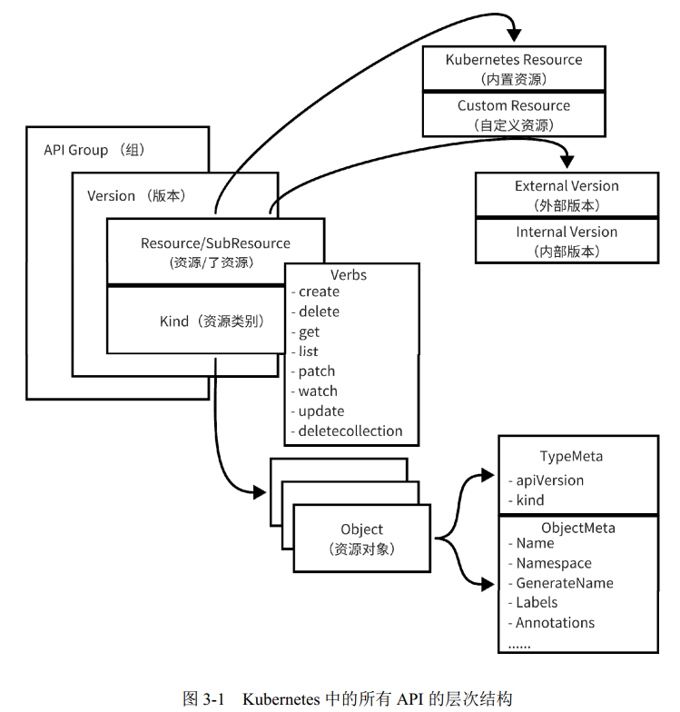

# 初识数据结构

Kubernetes 是基于 API 的基础设施， Kubernetes 中的概念都被抽象成各种资源（ Resource），不同的资源（如我们熟悉并经常使用的 Deployment 资源、 Pod 资源、 StatefulSet 资源、 Service资源、 ConfigMap 资源、 Node 资源等）拥有不同的功能。在 Kubernetes 的世界里对各种资源的操作都是基于 API 来完成的， Kubernetes 通过 kube-apiserver 提供一系列的 REST API 来完成对资源的基本操作。  

实际上， 除了上述提到的 Pod、 Node、 Deployment、 Service 等系统内置资源， Kubernetes 还支持资源的扩展，即 CustomResourceDefinition（ CRD），它可以在无须修改 Kubernetes 源码的情况下进行扩展，还能被 Kubernetes 识别。  

# 基本概念

## API 的层次结构

- API Group：API 组，将 API 分类，如 apps、 batch 等。
- Version：Group 包含多个 Version，用于版本控制。
- Resource/SubResource：资源/子资源。
- Kind：资源类别。
- Verbs：某种资源类型支持的操作方法。
- Object：某种资源类型创建出的实体对象。
- TypeMeta：Object 所属的组、版本、资源类型信息，对应 YAML 资源文件中的 kind 和 apiVersion。
- ObjectMeta：Object 自身的属性信息，对应 YAML 资源文件中的 metadata。

## 版本控制

开源界常用的版本控制一般可分为 3 种，分别是 alpha、 beta、 stable，它们之间的迭代顺序为 alpha → beta → stable，通常用来表示软件测试过程中的 3 个阶段。 alpha 表示第 1 个阶段，一般用于内部测试； beta 表示第 2 个阶段，该版本已经修复了大部分的不完善之处，但仍然可能存在缺陷和漏洞，一般供特定的用户群进行测试； stable 表示第 3 个阶段，此时基本形成了产品并相当成熟，可以稳定运行。资源版本控制如下。

1） alpha 版本

alpha 版本为内部测试版本，供 Kubernetes 开发者内部测试使用。该版本是不稳定的，可能存在很多缺陷和漏洞，开发者随时可能会丢弃对该版本功能的支持。在默认情况下，处于 alpha 版本的功能会被禁用。 alpha 版本的命名格式为 v1alpha1、 v1alpha2、 v2alpha1。

2） beta 版本

beta 版本为相对稳定版本。 beta 版本经过官方和社区多次测试，后面迭代时会有较小的改变，但该版本不会被删除。 1.24 之前的版本，在默认情况下，处于 beta 版本的 API 是开启状态的，从 1.24 版本开始，在默认情况下，不会在集群中启用新的 beta 版本的 API，现有的 beta 版本的 API 将继续默认启用。 beta 版本的命名格式为 v1beta1、 v1beta2、 v2beta1。

3） stable 版本

stable 版本为正式发布的版本。 stable 版本基本形成了产品，该版本不会被删除。在默认情况下，处于 stable 版本的功能全部是开启状态的。 stable 版本的命名格式为 v1、 v2、 v3。  

## 组

Kubernetes 早期采用上述介绍的版本控制方式，目前内置的核心资源（如 Pod、 Service、ConfigMap 等）都是使用 v1 作为这些资源的 API 版本的。但是后来又引入了 API 组，两者配合形成\<group>/\<version>的组合，最终作为 API 版本的完整表现形式。我们在定义一个 Deployment YAML 文件时，第 1 行 apiVersion: apps/v1 中的 apps 表示组， v1 表示版本。同时为了兼容核心资源， Kubernetes 也支持 Pod 资源的 apiVersion:v1 表现形式。Pod 等核心资源（也被称为 legacy 资源），在 Kubernetes 源码中已经被划归到 core 组中，因此我们也可以将其理解为这些核心资源省略了 core 分组，只需要指定 Version。

核心资源对应的 API 版本通过请求 Kubernetes 的/api 接口来访问，没有组的信息，且只有 v1 一个结果；非核心资源对应的 API 版本通过请求 Kubernetes 的 /apis 接口来访问，都带有组的信息，组可能包含一个或多个版本。

## API 术语

Kubernetes 中有各种 API 术语，包括资源、对象、类别、类型等，在后续内容中会经常提及，尤其是资源一词，在不同的语境下可能代表资源类型（ Resource Type）或资源对象（ Resource Object）。例如，当我们描述：“通过执行 kubectl 命令可以请求 Pod 资源，并检查返回的资源是否正确”这句话时，前者指的是资源类型，而后者指的是资源对象。本节将对这些术语做相关说明，它们的关系如图 3-2 所示。  

访问资源：

- 集群作用域的资源：
  - `GET /apis/GROUP/VERSION/RESOURCETYPE` - 返回指定资源类型的资源集合
  - `GET /apis/GROUP/VERSION/RESOURCETYPE/NAME` - 返回指定资源类型下名称为 NAME 的资源
- 名字空间作用域的资源：
  - `GET /apis/GROUP/VERSION/RESOURCETYPE` - 返回所有名字空间中指定资源类型的全部实例集合
  - `GET /apis/GROUP/VERSION/namespaces/NAMESPACE/RESOURCETYPE` - 返回名字空间 NAMESPACE 内给定资源类型的全部实例集合
  - `GET /apis/GROUP/VERSION/namespaces/NAMESPACE/RESOURCETYPE/NAME` - 返回名字空间 NAMESPACE 中给定资源类型的名称为 NAME 的实例

由于名字空间本身是一个集群作用域的资源类型，你可以通过 `GET /api/v1/namespaces/` 检视所有名字空间的列表，使用 `GET /api/v1/namespaces/NAME` 查看特定名字空间的详细信息。

1、资源与动词

Kubernetes API 是通过 HTTP 提供的基于资源的编程接口。它支持标准 HTTP 动词（ Verbs），包括 Get、 List、 Watch、 Create、 Update、 Patch、 Delete、 Deletecollection、 Proxy 等。

在 RESTful 领域，资源是一个比较宽泛的统称，既可以把某种对象类型称为资源，又可以把某种特定实例称为资源，在 Kubernetes 中的术语区分如下：

- 资源类型是 URL 中使用的名称（ pods、 namespaces、 services），可通过`kubectl api-resources`查看。
- 资源类型的单个实例被称为对象（ Object）。
- 对于某些资源类型， API 包含一个或多个子资源，这些子资源被表示为资源下的 URI 路径。  

在 Kubernetes 源码中， GVR（ Group、 Version、 Resource）中的 Resource 正是这里介绍的资源类型。  

Kubernetes 支持对资源进行 Patch（选择性修改某些字段）和 Watch（流式集合读取数据）操作。  

2、资源类别

所有资源类型都有一个具体的表示，被称为类别（Kind），也被称为对象模式（ObjectScheme），是指特定的数据结构，即属性和特性的某种组合。资源类别分为以下 3 种：

- Object：资源类型的单个实例，代表系统中的持久对象， API 对象一旦被创建，系统就努力确保资源存在。一个对象可能有多个资源，客户端可以使用这些资源来执行创建、更新、删除或获取等特定操作。所有 API 对象都有共同的元数据，如 Pod、ReplicationController、 Service、 Namespace、 Node。  

- List：列表是一种（通常）或多种（偶尔）资源的集合。列表种类的名称必须以 List 结尾。列表具有一组有限的通用元数据，如 resourceVersion 元数据，但是没有 name元数据。所有列表必需使用 items 字段来包含它们返回的对象数组。任何具有 items 字段的种类必须是列表种类。系统中定义的大多数对象都应该有一个返回完整资源列表的 RESTful 接口，以及零个或多个返回完整资源列表子集的 RESTful 接口。一些对象可能是单例（当前用户，系统默认）且可能没有列表。此外，所有返回带标签对象的列表都应该支持标签过滤（ label-selector），并且大多数列表应该支持按字段过滤（ field-selector），如 PodList、 ServiceList、 NodeList。  
  
- Simple：简单类型，用于对对象和非持久实体进行特定操作。鉴于它们的范围有限，它们具有与列表相同的一组有限的通用元数据。许多简单的资源都是“子资源”，它们以特定资源的 API 路径为根。当资源希望公开与单个资源紧密耦合的替代操作或视图时，它们应该使用新的子资源来实现。常见的子资源如下。  

  - /binding：用于将表示用户请求的资源（如 Pod、 PersistentVolumeClaim）绑定到集群基础设施资源（如 Node、 PersistentVolume）中。

  - /status： 用于仅写入 Status 资源的部分。 例如， /pods 端点只允许更新 metadata 和 spec，因为它们反映了用户的最终意图。自动化流程应该能够通过将更新的 Pod 类型发送到服务器的/pods/\<name>/status 端点来修改状态以供用户查看——备用端点允许将不同的规则应用于更新，并且访问受到适当限制。

  - /scale：用于管理和调整控制器的副本数量。通过访问/scale 资源，可以获取当前控制器的副本数量，并且可以通过发送 PATCH 请求来修改副本数量。  

Kubernetes 中使用的大多数对象，包括 API 返回的所有 JSON 对象，都有 Kind 字段。这些对象允许客户端和服务器在通过网络发送它们或将它们存储在磁盘上之前正确地序列化和反序列化。  

3、资源对象

## API 资源组成

