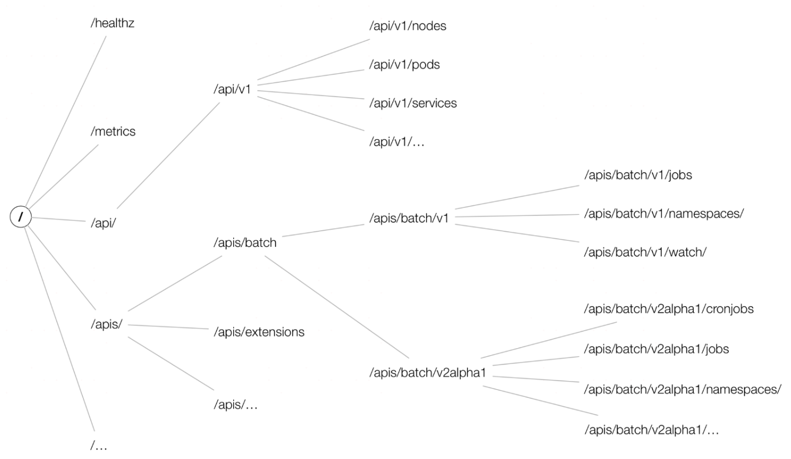
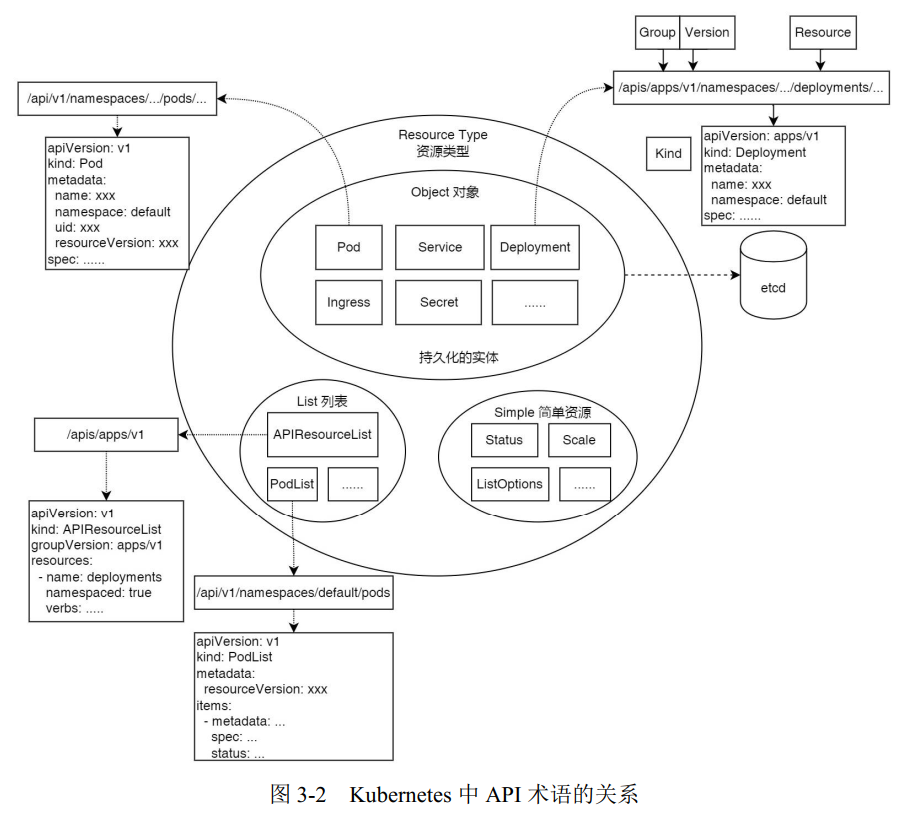
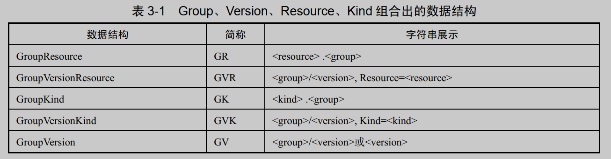

# 基本概念

## API 的层次结构

- API Group：API 组，将 API 分类，如 apps、 batch 等。
- Version：Group 包含多个 Version，用于版本控制。
- Resource/SubResource：资源/子资源。
- Kind：资源类别。
- Verbs：某种资源类型支持的操作方法。
- Object：某种资源类型创建出的实体对象。
- TypeMeta：Object 所属的组、版本、资源类型信息，对应 YAML 资源文件中的 kind 和 apiVersion。
- ObjectMeta：Object 自身的属性信息，对应 YAML 资源文件中的 metadata。

## 版本控制

开源界常用的版本控制一般可分为 3 种，分别是 alpha、 beta、 stable，它们之间的迭代顺序为 alpha → beta → stable，通常用来表示软件测试过程中的 3 个阶段。 alpha 表示第 1 个阶段，一般用于内部测试； beta 表示第 2 个阶段，该版本已经修复了大部分的不完善之处，但仍然可能存在缺陷和漏洞，一般供特定的用户群进行测试； stable 表示第 3 个阶段，此时基本形成了产品并相当成熟，可以稳定运行。

1） alpha 版本

alpha 版本为内部测试版本，供 Kubernetes 开发者内部测试使用。该版本是不稳定的，可能存在很多缺陷和漏洞，开发者随时可能会丢弃对该版本功能的支持。在默认情况下，处于 alpha 版本的功能会被禁用。 alpha 版本的命名格式为 v1alpha1、v1alpha2、v2alpha1。

2） beta 版本

beta 版本为相对稳定版本。 beta 版本经过官方和社区多次测试，后面迭代时会有较小的改变，但该版本不会被删除。 1.24 之前的版本，在默认情况下，处于 beta 版本的 API 是开启状态的，从 1.24 版本开始，在默认情况下，不会在集群中启用新的 beta 版本的 API，现有的 beta 版本的 API 将继续默认启用。 beta 版本的命名格式为 v1beta1、v1beta2、v2beta1。

3） stable 版本

stable 版本为正式发布的版本。 stable 版本基本形成了产品，该版本不会被删除。在默认情况下，处于 stable 版本的功能全部是开启状态的。 stable 版本的命名格式为 v1、v2、v3。  

## 组

核心资源对应的 API 版本通过请求 Kubernetes 的 `/api` 接口来访问，没有组的信息，且只有 `v1` 一个结果；非核心资源对应的 API 版本通过请求 Kubernetes 的 `/apis` 接口来访问，都带有组的信息，组可能包含一个或多个版本。



## API 术语

Kubernetes 中有各种 API 术语，包括资源、对象、类别、类型等，在后续内容中会经常提及，尤其是资源一词，在不同的语境下可能代表资源类型（ Resource Type）或资源对象（ Resource Object）。例如，当我们描述：“通过执行 kubectl 命令可以请求 Pod 资源，并检查返回的资源是否正确”这句话时，前者指的是资源类型，而后者指的是资源对象。本节将对这些术语做相关说明，它们的关系如图 3-2 所示。  



访问资源：

- 集群作用域的资源：
  - `GET /apis/GROUP/VERSION/RESOURCETYPE` - 返回指定资源类型的资源集合
  - `GET /apis/GROUP/VERSION/RESOURCETYPE/NAME` - 返回指定资源类型下名称为 NAME 的资源
- 名字空间作用域的资源：
  - `GET /apis/GROUP/VERSION/RESOURCETYPE` - 返回所有名字空间中指定资源类型的全部实例集合
  - `GET /apis/GROUP/VERSION/namespaces/NAMESPACE/RESOURCETYPE` - 返回名字空间 NAMESPACE 内给定资源类型的全部实例集合
  - `GET /apis/GROUP/VERSION/namespaces/NAMESPACE/RESOURCETYPE/NAME` - 返回名字空间 NAMESPACE 中给定资源类型的名称为 NAME 的实例

由于名字空间本身是一个集群作用域的资源类型，你可以通过 `GET /api/v1/namespaces/` 检视所有名字空间的列表，使用 `GET /api/v1/namespaces/NAME` 查看特定名字空间的详细信息。

1、资源与动词

在 Kubernetes 中的术语区分如下：

- 资源类型是 URL 中使用的名称（pods、 namespaces、 services），可通过`kubectl api-resources`查看。
- 资源类型的单个实例被称为对象（Object）。
- 对于某些资源类型包含一个或多个子资源，这些子资源被表示为资源下的 URI 路径。  

在 Kubernetes 源码中， GVR（ Group、 Version、 Resource）中的 Resource 正是这里介绍的资源类型。Kubernetes 支持对资源进行 Patch（选择性修改某些字段）和 Watch（流式集合读取数据）操作。  

`kubectl api-resources` 命令实际上列出的不是完整的 API 资源类型。如 `deployments/scale`子资源就没有在结果中被列出。要想列出完整的 API 资源类型，需要先执行 `kubectl get --raw /` 命令，然后根据返回的所有 Path 递归查询 API 组支持的资源类型。

```shell
root@OPS-LVS-172-30-3-240:~# kubectl get --raw /apis/apps/v1
{
    "kind": "APIResourceList",
    "apiVersion": "v1",
    "groupVersion": "apps/v1",
    "resources": [
        {
            "name": "deployments",
            "singularName": "deployment",
            "namespaced": true,
            "kind": "Deployment",
            "verbs": [
                "create",
                "delete",
                "deletecollection",
                "get",
                "list",
                "patch",
                "update",
                "watch"
            ],
            "shortNames": [
                "deploy"
            ],
            "categories": [
                "all"
            ],
            "storageVersionHash": "8aSe+NMegvE="
        },
        {
            "name": "deployments/scale",
            "singularName": "",
            "namespaced": true,
            "group": "autoscaling",
            "version": "v1",
            "kind": "Scale",
            "verbs": [
                "get",
                "patch",
                "update"
            ]
        },
        {
            "name": "deployments/status",
            "singularName": "",
            "namespaced": true,
            "kind": "Deployment",
            "verbs": [
                "get",
                "patch",
                "update"
            ]
        },
        ......
    ]
}
```

2、资源类别

所有资源类型都有一个具体的表示，被称为类别（Kind），也被称为对象模式（ObjectScheme），是指特定的数据结构，即属性和特性的某种组合。资源类别分为以下 3 种：

- Object：资源类型的单个实例，代表系统中的持久对象。
- List：
- Simple：

> 注意区分 Kubernetes 源码中两个相似单词的不同含义。
>
> - Schema：表示对象的模式，由 Group、 Version、 Kind、 Resource 组成的 GVK 或 GVR 等数据结构的包名使用的是 Schema。
> - Scheme：资源类型注册、转换等操作的注册表使用的是 Scheme。  

3、资源对象

从狭义上讲，对象是资源类型的单个实例，代表集群的意图（期望状态）和状态（实际状态）。 API 返回的所有 JSON 资源对象的字段具有以下特点：

（1）必须包含以下字段：

- kind：字符串，标识此对象应具有的模式。
- apiVersion：字符串，标识此对象应具有的架构版本。

这些字段是正确解码对象所必需的。这些字段对应源码中的 TypeMeta 数据结构。

（2）包含 metadata

- metadata.namespace：命名空间的字符串（默认为default）。
- metadata.name：在当前命名空间中唯一标识此对象的字符串。
- metadata.uid：时间和空间上唯一的值，用于区分已删除和重新创建的同名对象。

此外， metadata 还包括 labels 和 annotations 字段，以及一些版本控制和时间戳信息。对应源码中的 ObjectMeta 数据结构。

（3）包含 Spec 和 Status

它们负责管理对象的配置： Spec（规约）和 Status（状态）。对于具有 Spec 的对象，用户必须在创建对象时设置其内容，描述希望对象具有的特征，即期望状态（ Desired State）。Status 描述了对象的当前状态（ Current State），它是由 Kubernetes 系统和组件设置并更新的。在任何时刻，Kubernetes 控制平面都在积极地管理对象的实际状态，以使其达成期望状态。

## API 资源组成

Kubernetes 中的 API 资源主要分为三大类：

- 内置资源： Kubernetes 官方提供的资源。
- 自定义资源： 向 Kubernetes API 中增加新类型， 以扩展 Kubernetes 的功能。
- 聚合资源：与自定义资源（CRD）不同，聚合资源通过 APIService 对象注册新的 API 路径，并将这些路径的请求转发到开发者自己的服务上。

## 版本化资源与未版本化资源

在 Kubernetes 源码中，会出现 Versioned Type、Unversioned Type 字样，其可被翻译为版本化、未版本化。它们之间的区别如下。

- Versioned Type：表示该资源的字段信息会随着时间的变化不断迭代，需要随着版本的变化而演进， 以及控制不同版本的兼容性。如 Deployment 资源， 从 `extensions` 组的 `alpha` 版本逐渐演进到目前的 `apps` 组的 `v1` 版本，不同版本之间可能废弃或新增一些字段，彼此是不兼容的。
- Unversioned Type：表示该资源的字段信息永远保持向后兼容，就好像它们在一个永远不会更新的 API 组和版本中。

除部分资源是 Unversioned 类型的外，其他资源都是 Versioned 类型的。

未版本化类型通常不是业务核心对象。它们是 Kubernetes API 系统内部运作的基础设施元数据和核心通信机制：

- **API 响应结构 (`metav1.Status`)：** 用于表示操作结果（成功/失败、状态码、错误消息）。无论你操作的是哪个版本的对象，表示操作结果的结构 `Status`必须是统一的、客户端始终能理解的。
- **API 发现机制 (`metav1.APIVersions`, `metav1.APIGroupList`, `metav1.APIGroup`, `metav1.APIResourceList`)：** 客户端需要一种标准的方式（即使用这些固定的结构）来“发现”当前服务器上有哪些 API 组、哪些版本、哪些资源可用。这个发现机制本身的输出格式不能变，否则客户端就无法开始查找和理解 API。

 未版本化资源不需要版本转换 (No Version Conversion Needed)：

- 由于它们本身的结构不变，也就不存在 `v1beta1.Status`和 `v1.Status`之说。在任何需要用到这些结构的地方，Kubernetes 代码库中都只有一个版本的定义（尽管它在 `metav1`包下，但这个 `v1`是包内部的版本表示方式，并不是一个会演变的 API 版本）。
- API 服务器在处理这些资源时无需执行复杂的注册到 `scheme`的过程来进行版本转换，它们只有一个格式。

使用未版本化的巨大优势是极大地简化了客户端库、命令行工具（kubectl）、控制器、API 服务器自身以及与其他组件的交互。

**metav1.APIVersions(`/api`响应结构)**

- 作用：表示**核心 API 组（Core Group / Legacy Group）** 支持的版本列表。这个组比较特殊，没有显式的组名（路径前缀是 `/api`而不是 `/apis/<group>`），它包含了像 Pod，Service，Node，Namespace 等最基础的核心资源。
- 核心字段：
  - `Versions []string`: 该核心组支持的 API 版本列表 (例如 `["v1"]`)。早期可能有更多。
  - `ServerAddressByClientCIDRs []metav1.ServerAddressByClientCIDR`: (可选) 提供服务器地址信息，主要用于高可用或网络配置复杂的场景。
- 示例输出 (`kubectl get --raw /api`)：

```shell
root@eden:~# kubectl get --raw /api
{
    "kind": "APIVersions",
    "versions": [
        "v1"
    ],
    "serverAddressByClientCIDRs": [
        {
            "clientCIDR": "0.0.0.0/0",
            "serverAddress": "192.168.243.100:6443"
        }
    ]
}
// 位于：staging/src/k8s.io/apimachinery/pkg/apis/meta/v1/types.go
type APIVersions struct {
	TypeMeta `json:",inline"`
	Versions []string `json:"versions" protobuf:"bytes,1,rep,name=versions"`
	ServerAddressByClientCIDRs []ServerAddressByClientCIDR `json:"serverAddressByClientCIDRs" protobuf:"bytes,2,rep,name=serverAddressByClientCIDRs"`
}
```

客户端访问 `/api`时必须能解析其结构才能知道有哪些版本可用。如果这个结构本身还需要版本控制，就陷入了死循环（客户端首先需要知道 `/api`接口自身的版本）

**`metav1.APIGroupList`(`/apis`响应结构)**

- 作用：表示所有非核心 API 组（Groups）的列表。这是客户端发现所有 API 组的入口（核心组通过 `/api`单独列出）。

- 核心字段：`Groups []APIGroup`: 一个列表，每个元素是一个 `metav1.APIGroup`对象，描述一个 API 组。

- 示例输出 (`kubectl get --raw /apis`)：

  ```shell
  root@eden:~# kubectl get --raw /apis
  {
    "kind": "APIGroupList",
    "apiVersion": "v1",
    "groups": [
      {
          "name": "apps",
          "versions": [
              {
                  "groupVersion": "apps/v1",
                  "version": "v1"
              }
          ],
          "preferredVersion": {
              "groupVersion": "apps/v1",
              "version": "v1"
          }
      },
      ...
    ]
  }
  
  // 位于：staging/src/k8s.io/apimachinery/pkg/apis/meta/v1/types.go
  type APIGroupList struct {
  	TypeMeta `json:",inline"`
  	Groups []APIGroup `json:"groups" protobuf:"bytes,1,rep,name=groups"`
  }
  ```

这是发现所有非核心组的**总目录**。客户端访问 `/apis`时必须能理解返回的是什么才能继续发现每个组内的资源。其核心职责就是返回一个 `groups`数组。即使未来 Kubernetes 加入几百个新 API 组，这个结构也足够表示，无需改变格式。

**`metav1.APIGroup`(`/apis/<group>`响应结构)**

- 作用：表示单个API 组（Group） 的详细信息。
- 核心字段：
  - `name string`: API 组的名称 (e.g., `"apps"`, `"networking.k8s.io"`)。
  - `versions []GroupVersionForDiscovery`: 该组支持的 API 版本列表 (每个 `GroupVersionForDiscovery`包含 `groupVersion`和 `version`字符串)。
  - `preferredVersion GroupVersionForDiscovery`: API Server 推荐优先使用的版本。
- 示例 (来自 `kubectl get --raw /apis/apps`)：

```json
{
    "kind": "APIGroup",
    "apiVersion": "v1",
    "name": "apps",
    "versions": [
        {
            "groupVersion": "apps/v1",
            "version": "v1"
        }
    ],
    "preferredVersion": {
        "groupVersion": "apps/v1",
        "version": "v1"
    }
}

// 位于：staging/src/k8s.io/apimachinery/pkg/apis/meta/v1/types.go
type APIGroup struct {
	TypeMeta `json:",inline"`
	Name string `json:"name" protobuf:"bytes,1,opt,name=name"`
	Versions []GroupVersionForDiscovery `json:"versions" protobuf:"bytes,2,rep,name=versions"`
	PreferredVersion GroupVersionForDiscovery `json:"preferredVersion,omitempty" protobuf:"bytes,3,opt,name=preferredVersion"`
	ServerAddressByClientCIDRs []ServerAddressByClientCIDR `json:"serverAddressByClientCIDRs,omitempty" protobuf:"bytes,4,rep,name=serverAddressByClientCIDRs"`
}
```

描述一个 API 组需要哪些信息？名称、支持的版本列表、推荐的版本——这些需求在 Kubernetes API 的演进中非常稳定。结构足以清晰地表达这些信息，不需要额外的字段或改变字段含义。

 **`metav1.APIResourceList`(`/apis/<group>/<version>`响应结构)**

- 作用：表示在特定 API 组和版本 (`<group>/<version>`) 下，所有可用的具体资源（Resources）及其相关信息。
- 核心字段：
  - `groupVersion string`: 该列表对应的组和版本 (e.g., `"apps/v1"`)。
  - `resources []APIResource`: 一个列表，每个元素是一个 `metav1.APIResource`对象。`APIResource`包含的关键信息：
    - `name string`: 资源的复数名称 (e.g., `"deployments"`)。用于组成 URL（如 `/apis/apps/v1/namespaces/default/deployments`）。
    - `singularName string`: 资源的单数名称 (e.g., `"deployment"`)。
    - `namespaced bool`: 该资源是否是命名空间作用域的资源。
    - `kind string`: 资源对应的 Kind (e.g., `"Deployment"`)，出现在 YAML/JSON 中的 `kind`字段。
    - `verbs []string`: 该资源支持的操作 (`"get"`, `"list"`, `"watch"`, `"create"`, `"update"`, `"patch"`, `"delete"`, `"deletecollection"`等)。
    - `shortNames []string`: 资源的缩写 (e.g., `["deploy"]`)，用于 `kubectl`命令。
    - `categories []string`: 资源所属的分类 (e.g., `["all"]`)，便于 `kubectl get`按类查询。
- 示例 (`kubectl get --raw /apis/apps/v1`)：

```json
{
  "kind": "APIResourceList",
  "apiVersion": "v1", // 固定为 "v1"，表示 APIResourceList 结构本身的格式版本
  "groupVersion": "apps/v1",
  "resources": [
    {
      "name": "deployments",
      "singularName": "deployment",
      "namespaced": true,
      "kind": "Deployment",
      "verbs": ["create", "delete", "deletecollection", "get", "list", "patch", "update", "watch"],
      "shortNames": ["deploy"],
      "categories": ["all"],
      ...
    },
    {
      "name": "daemonsets",
      "singularName": "",
      "namespaced": true,
      "kind": "DaemonSet",
      "verbs": [...],
      ...
    },
    ...
  ]
}

// 位于：staging/src/k8s.io/apimachinery/pkg/apis/meta/v1/types.go
type APIResourceList struct {
	TypeMeta `json:",inline"`
	GroupVersion string `json:"groupVersion" protobuf:"bytes,1,opt,name=groupVersion"`
	APIResources []APIResource `json:"resources" protobuf:"bytes,2,rep,name=resources"`
}
```

这是 API 发现的**最终目标**：告诉客户端在某个特定 `group/version`下能操作哪些资源（`deployments`, `daemonsets`），以及每个资源的基本元信息（`kind`, `name`, `namespaced`, `verbs`等）。

结构 `APIResourceList`完美地、永恒地承载了这些信息，并且足够通用以描述任何API 组版本下的任何资源。客户端只需要解析一次这种结构，就能理解如何访问所有资源。

## 内部版本与外部版本

Unversioned 资源永远保持向后兼容，无须进行版本化管理。而 Versioned 资源需要随着版本的变化而演进，不同版本之间还可以互相转换。

转换操作其实是通过 Versioned 资源的内部版本实现的。每种 Versioned 资源对应两类版本，分别是外部版本（External Version）和内部版本（Internal Version）。

- 外部版本： 对外暴露给用户请求的接口所使用的资源， 例如， 用户在通过 YAML 或 JSON 格式的描述文件创建资源时，外部版本资源通过资源版本（alpha、 beta、 stable）标识。
- 内部版本：通过 `runtime.APIVersionInternal`标识（这个标识就是常量 `APIVersionInternal = "__internal"`），内部版本不对外暴露，仅在 kube-apiserver 内部使用，实现多资源版本转换。例如，将 `v1beta1` 版本转换为 `v1` 版本，其过程为 `v1beta1 → __internal → v1`，即先将 `v1beta1` 转换为内部版本，再由内部版本转换为 `v1` 版本。

~~资源的外部版本代码定义在 `pkg/apis/<group>/<version>/`目录下，资源的内部版本代码定义在 `pkg/apis/<group>` 目录下（内部版本与资源组在同一级目录下）。~~

资源的外部版本和内部版本是需要相互转换的，而实现转换功能的函数需要事先被初始化到 Scheme 中，多个外部版本之间的资源相互转换，都需要通过内部版本进行中转。这也是 Kubernetes 能实现多资源版本转换的关键。

资源的外部版本和内部版本的代码定义也不太一样，因为外部版本的资源需要对外暴露给用户请求的接口，所以资源代码定义了 `JSON Tag` 和 `Proto Tag`，用于请求的序列化和反序列化操作。因为内部版本的资源不对外暴露，所以没有任何的 `JSON Tag` 和 `Proto Tag` 定义。  

以 Pod 资源定义为例，外部版本代码示例如下。

```go
// 位置：staging/src/k8s.io/api/core/v1/types.go
type Pod struct {
	metav1.TypeMeta `json:",inline"`
	// Standard object's metadata.
	// More info: https://git.k8s.io/community/contributors/devel/sig-architecture/api-conventions.md#metadata
	// +optional
	metav1.ObjectMeta `json:"metadata,omitempty" protobuf:"bytes,1,opt,name=metadata"`

	// Specification of the desired behavior of the pod.
	// More info: https://git.k8s.io/community/contributors/devel/sig-architecture/api-conventions.md#spec-and-status
	// +optional
	Spec PodSpec `json:"spec,omitempty" protobuf:"bytes,2,opt,name=spec"`

	// Most recently observed status of the pod.
	// This data may not be up to date.
	// Populated by the system.
	// Read-only.
	// More info: https://git.k8s.io/community/contributors/devel/sig-architecture/api-conventions.md#spec-and-status
	// +optional
	Status PodStatus `json:"status,omitempty" protobuf:"bytes,3,opt,name=status"`
}
```

Pod 资源的内部版本代码示例如下。

```go
// 位置：pkg/apis/core/types.go
type Pod struct {
	metav1.TypeMeta
	// +optional
	metav1.ObjectMeta

	// Spec defines the behavior of a pod.
	// +optional
	Spec PodSpec

	// Status represents the current information about a pod. This data may not be up
	// to date.
	// +optional
	Status PodStatus
}
```

# K8S API 的数据结构  

实际上， Kubernetes 源码中的所有 API 资源都通过 APIGroup、 APIVersions、APIResource 这 3 个数据结构存放。当用户调用相关接口查询 Kubernetes 中所有的 API 资源时，kube-apiserver 会将所有资源封装到这 3 个数据结构中并返回。本节将重点讲解 APIGroup、APIVersions、APIResource 这 3 个数据结构，以及标识资源和资源 URL 信息的 GVK、 GVR 三元组，最后展示 Kubernetes 中的内置资源全景图。

## APIGroup、 APIVersions

在 Kubernetes 源码中，核心组对应的数据结构为 APIVersions，其他组对应的数据结构为 APIGroupList，其包含多个 APIGroup。 APIVersions、APIGroup、APIGroupList 对应的代码示例如下：可查看上面章节‘未版本化资源’。

APIVersions 主要接收 `/api` 接口请求的结果，只包含 Versions 一个 `[]string` 类型的字段，早期考虑到扩展问题将其设计为切片，目前实际只有 v1 一个值。  

APIGroupList 主要接收 `/apis` 接口请求的结果，只包含 Groups 一个 `[]APIGroup` 类型的字段。  

## GVK 和 GVR

在 Kubernetes API 中，我们经常使用 GVK 或 GVR 来区分特定的 Kubernetes 资源。其中 GVK 是 Group Version Kind 的简称，而 GVR 则是 Group Version Resource 的简称。

**1. GVK**

每个资源对象都需要通过 Kind 来区分它自身代表的资源类型，一般来说，在 Kubernetes API 中有 3 种不同的 Kind。

需要注意的是，同一 Kind 不仅可以出现在同一组的不同版本中，例如，`apps/v1beta1` 与 `apps/v1`；还可以出现在不同的组中，例如， Deployment 开始以 alpha 的特性出现在 extensions 组中，之后被推到 apps 组中。所以为了严格区分不同的 Kind，需要将 API Group、API Version 和 Kind 组合为 GVK。  

**2. GVR**

GVR 常用于组合成 RESTful API 请求路径。Kubernetes 源码中定义了相关的数据结构来表示 GVK 和 GVR。

- GVK： `<group>/<version>`, Kind=`<kind>`。
- GVR： `<group>/<version>`, Resource=`<resource>`。  

GroupVersionKind 定义的代码示例如下：

```go
// 位置：staging/src/k8s.io/apimachinery/pkg/apis/meta/v1/group_version.go
type GroupVersionKind struct {
	Group   string `json:"group" protobuf:"bytes,1,opt,name=group"`
	Version string `json:"version" protobuf:"bytes,2,opt,name=version"`
	Kind    string `json:"kind" protobuf:"bytes,3,opt,name=kind"`
}
```

GroupVersionResource 定义的代码示例如下：

```go
// 位置：staging/src/k8s.io/apimachinery/pkg/apis/meta/v1/group_version.go
type GroupVersionResource struct {
	Group    string `json:"group" protobuf:"bytes,1,opt,name=group"`
	Version  string `json:"version" protobuf:"bytes,2,opt,name=version"`
	Resource string `json:"resource" protobuf:"bytes,3,opt,name=resource"`
}
```

通过获取资源的 JSON 或 YAML 格式的序列化对象，进而从资源类型信息中获取该资源的 GVK。 RESTMapper 作为 GVK 到 GVR 的映射，通过 GVK 信息可以获取要读取的资源对象的 GVR，进而构建 RESTful API 请求以获取对应的资源。关于 RESTMapper 的知识，请参考 3.9 节。  

实际上，除了 GVK 和 GVR，在 Kubernetes 源码中， Group、 Version、 Resource、 Kind 这 4 个维度可以组合出多种数据结构，如表 3-1 所示。



## 内置资源全景图

Kubernetes 内置了众多“资源组/资源版本/资源类别”，才有了现在功能强大的资源管理系统。用户可以通过以下方式获得当前 Kubernetes 支持的内置资源。

- kubectl api-versions：列出当前 Kubernetes 支持的资源组和资源版本，其表现形式为 `<group>/<version>`。
- kubectl api-resources：列出当前 Kubernetes 支持的 Resource 资源列表。

内置资源有以下特点：

- 绝大部分资源的 Kind 就是 Resource 名称的大写单数形式，少部分资源的 Kind 与 Resource 名称不同。例如， “ core/v1, Kind=Pod ” 对应的是 “ core/v1, Resource=pods ”，而 “ metrics.k8s.io/v1beta1, Kind=PodMetrics ” 对应的是 “ metrics.k8s.io/v1beta1, Resource=pods ”。
- 部分子资源的 Kind 是父资源。例如， `deployments/status` 子资源的 Kind 是 Deployment。
- 部分子资源的 Kind 引用别的 API 组中的资源类型。例如， `deployments/scale` 子资源的 Kind 是`autoscaling.v1/Scale`。
- 部分子资源的 Kind 使用一个自己的类型。例如， `services/proxy` 子资源的 Kind 是 ServiceProxyOptions。
- 大部分资源都有对应的 List 资源。  

全景图省略......

# K8S 资源定义

资源的内部版本定义了所支持的资源类型（types.go）、资源验证方法（validation.go）、资源注册到 Scheme 的方法（install/install.go）。而资源的外部版本定义了资源的转换方法（conversion.go）和资源的默认值（defaults.go）。（在 v1.30.14 版本中，conversion 与 defaults 相关文件在内部版本的版本文件夹中） 

## 内部版本定义

以 Deployment 资源为例，它的内部版本定义在 `pkg/apis/apps/` 目录下。内部版本的资源代码结构如下。

```shell
|-- OWNERS
|-- doc.go
|-- fuzzer
|-- install
|-- register.go
|-- types.go
|-- v1
|-- v1beta1
|-- v1beta2
|-- validation
|-- zz_generated.deepcopy.go
```

内部版本的资源代码结构说明如下：

- doc.go：GoDoc 文件，定义了当前包的注释信息。
- install：**安装**资源组。它通过调用 `register.go`中的 `AddToScheme`函数，将整个 `apps`资源组（包括 `Deployment`等内部版本资源）一次性注册到全局的 Scheme 中。这是将资源组整合到 API 服务器的入口点。
- register.go：**注册**内部版本的 API 对象到 Kubernetes 的 `runtime.Scheme`中。
- types.go：定义了当前资源组支持的资源类型。
- v1、v1beta1、v1beta2：定义了资源组下拥有资源版本的资源（外部版本）。
- validation：定义了资源的验证方法。
- zz_generated.deepcopy.go：定义了资源的深复制操作，该文件由代码生成器自动生成。


## 外部版本定义

# 将资源注册到 Scheme 中