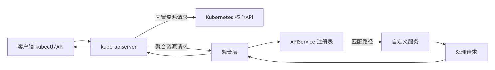

# 初识数据结构

Kubernetes 是基于 API 的基础设施， Kubernetes 中的概念都被抽象成各种资源（ Resource），不同的资源（如我们熟悉并经常使用的 Deployment 资源、 Pod 资源、 StatefulSet 资源、 Service资源、 ConfigMap 资源、 Node 资源等）拥有不同的功能。在 Kubernetes 的世界里对各种资源的操作都是基于 API 来完成的， Kubernetes 通过 kube-apiserver 提供一系列的 REST API 来完成对资源的基本操作。  

实际上， 除了上述提到的 Pod、 Node、 Deployment、 Service 等系统内置资源， Kubernetes 还支持资源的扩展，即 CustomResourceDefinition（ CRD），它可以在无须修改 Kubernetes 源码的情况下进行扩展，还能被 Kubernetes 识别。  

# 基本概念

## API 的层次结构


- API Group：API 组，将 API 分类，如 apps、 batch 等。
- Version：Group 包含多个 Version，用于版本控制。
- Resource/SubResource：资源/子资源。
- Kind：资源类别。
- Verbs：某种资源类型支持的操作方法。
- Object：某种资源类型创建出的实体对象。
- TypeMeta：Object 所属的组、版本、资源类型信息，对应 YAML 资源文件中的 kind 和 apiVersion。
- ObjectMeta：Object 自身的属性信息，对应 YAML 资源文件中的 metadata。

## 版本控制

开源界常用的版本控制一般可分为 3 种，分别是 alpha、 beta、 stable，它们之间的迭代顺序为 alpha → beta → stable，通常用来表示软件测试过程中的 3 个阶段。 alpha 表示第 1 个阶段，一般用于内部测试； beta 表示第 2 个阶段，该版本已经修复了大部分的不完善之处，但仍然可能存在缺陷和漏洞，一般供特定的用户群进行测试； stable 表示第 3 个阶段，此时基本形成了产品并相当成熟，可以稳定运行。资源版本控制如下。

1） alpha 版本

alpha 版本为内部测试版本，供 Kubernetes 开发者内部测试使用。该版本是不稳定的，可能存在很多缺陷和漏洞，开发者随时可能会丢弃对该版本功能的支持。在默认情况下，处于 alpha 版本的功能会被禁用。 alpha 版本的命名格式为 v1alpha1、 v1alpha2、 v2alpha1。

2） beta 版本

beta 版本为相对稳定版本。 beta 版本经过官方和社区多次测试，后面迭代时会有较小的改变，但该版本不会被删除。 1.24 之前的版本，在默认情况下，处于 beta 版本的 API 是开启状态的，从 1.24 版本开始，在默认情况下，不会在集群中启用新的 beta 版本的 API，现有的 beta 版本的 API 将继续默认启用。 beta 版本的命名格式为 v1beta1、 v1beta2、 v2beta1。

3） stable 版本

stable 版本为正式发布的版本。 stable 版本基本形成了产品，该版本不会被删除。在默认情况下，处于 stable 版本的功能全部是开启状态的。 stable 版本的命名格式为 v1、 v2、 v3。  

## 组

Kubernetes 早期采用上述介绍的版本控制方式，目前内置的核心资源（如 Pod、 Service、ConfigMap 等）都是使用 v1 作为这些资源的 API 版本的。但是后来又引入了 API 组，两者配合形成\<group>/\<version>的组合，最终作为 API 版本的完整表现形式。我们在定义一个 Deployment YAML 文件时，第 1 行 apiVersion: apps/v1 中的 apps 表示组， v1 表示版本。同时为了兼容核心资源， Kubernetes 也支持 Pod 资源的 apiVersion:v1 表现形式。Pod 等核心资源（也被称为 legacy 资源），在 Kubernetes 源码中已经被划归到 core 组中，因此我们也可以将其理解为这些核心资源省略了 core 分组，只需要指定 Version。

核心资源对应的 API 版本通过请求 Kubernetes 的/api 接口来访问，没有组的信息，且只有 v1 一个结果；非核心资源对应的 API 版本通过请求 Kubernetes 的 /apis 接口来访问，都带有组的信息，组可能包含一个或多个版本。


## API 术语

Kubernetes 中有各种 API 术语，包括资源、对象、类别、类型等，在后续内容中会经常提及，尤其是资源一词，在不同的语境下可能代表资源类型（ Resource Type）或资源对象（ Resource Object）。例如，当我们描述：“通过执行 kubectl 命令可以请求 Pod 资源，并检查返回的资源是否正确”这句话时，前者指的是资源类型，而后者指的是资源对象。本节将对这些术语做相关说明，它们的关系如图 3-2 所示。  


访问资源：

- 集群作用域的资源：
  - `GET /apis/GROUP/VERSION/RESOURCETYPE` - 返回指定资源类型的资源集合
  - `GET /apis/GROUP/VERSION/RESOURCETYPE/NAME` - 返回指定资源类型下名称为 NAME 的资源
- 名字空间作用域的资源：
  - `GET /apis/GROUP/VERSION/RESOURCETYPE` - 返回所有名字空间中指定资源类型的全部实例集合
  - `GET /apis/GROUP/VERSION/namespaces/NAMESPACE/RESOURCETYPE` - 返回名字空间 NAMESPACE 内给定资源类型的全部实例集合
  - `GET /apis/GROUP/VERSION/namespaces/NAMESPACE/RESOURCETYPE/NAME` - 返回名字空间 NAMESPACE 中给定资源类型的名称为 NAME 的实例

由于名字空间本身是一个集群作用域的资源类型，你可以通过 `GET /api/v1/namespaces/` 检视所有名字空间的列表，使用 `GET /api/v1/namespaces/NAME` 查看特定名字空间的详细信息。

1、资源与动词

Kubernetes API 是通过 HTTP 提供的基于资源的编程接口。它支持标准 HTTP 动词（ Verbs），包括 Get、 List、 Watch、 Create、 Update、 Patch、 Delete、 Deletecollection、 Proxy 等。

在 RESTful 领域，资源是一个比较宽泛的统称，既可以把某种对象类型称为资源，又可以把某种特定实例称为资源，在 Kubernetes 中的术语区分如下：

- 资源类型是 URL 中使用的名称（ pods、 namespaces、 services），可通过`kubectl api-resources`查看。
- 资源类型的单个实例被称为对象（ Object）。
- 对于某些资源类型， API 包含一个或多个子资源，这些子资源被表示为资源下的 URI 路径。  

在 Kubernetes 源码中， GVR（ Group、 Version、 Resource）中的 Resource 正是这里介绍的资源类型。  

Kubernetes 支持对资源进行 Patch（选择性修改某些字段）和 Watch（流式集合读取数据）操作。  

2、资源类别

所有资源类型都有一个具体的表示，被称为类别（Kind），也被称为对象模式（ObjectScheme），是指特定的数据结构，即属性和特性的某种组合。资源类别分为以下 3 种：

- Object：

- List：
  
- Simple：


3、资源对象

从狭义上讲，对象是资源类型的单个实例，代表集群的意图（期望状态）和状态（实际状态）。 API 返回的所有 JSON 资源对象的字段具有以下特点：

（1）必须包含以下字段：

- kind：字符串，标识此对象应具有的模式。
- apiVersion：字符串，标识此对象应具有的架构版本。

这些字段是正确解码对象所必需的。这些字段对应源码中的 TypeMeta 数据结构。

（2）包含 metadata。

大多数 Kubernetes API 资源代表对象。其他形式的资源只要求 kind 字段，而对象必须定义更多的字段。

- metadata.namespace：带有命名空间的字符串（默认为 default）。
- metadata.name：在当前命名空间中唯一标识此对象的字符串。
- metadata.uid：时间和空间上唯一的值，用于区分已删除和重新创建的同名对象。

此外， metadata 还包括 labels 和 annotations 字段，以及一些版本控制和时间戳信息。对应源码中的 ObjectMeta 数据结构。

（3）包含 Spec 和 Status。

几乎每个 Kubernetes 对象都包含的两个嵌套字段，它们负责管理对象的配置： Spec（规约）和 Status（状态）。对于具有 Spec 的对象，用户必须在创建对象时设置其内容，描述希望对象具有的特征，即期望状态（ Desired State）。 Status 描述了对象的当前状态（ Current State），它是由 Kubernetes 系统和组件设置并更新的。在任何时刻， Kubernetes 控制平面都在积极地管理对象的实际状态，以使其达成期望状态。

总之， Kubernetes 用语中的资源可以指两种：资源类型和对象。资源类型被组织成 API 组，并且 API 组是版本化的。后续章节不会刻意说对象这一词，某个具体的 Pod、 Node，有时候也被称为资源，这其实也是合理的，对象是资源的实例，所以对象也是资源，不必要钻牛角尖，理解意思即可。  

## API 资源组成

Kubernetes 中的 API 资源主要分为三大类：

- 内置资源： Kubernetes 官方提供的资源。

- 自定义资源： Kubernetes API 的扩展， 向 Kubernetes API 中增加新类型， 以扩展 Kubernetes 的功能。

- 聚合资源：聚合资源（Aggregated API）是 Kubernetes API 的扩展机制，允许开发者将自己的服务集成到 Kubernetes API 服务器（kube-apiserver）中，使其成为原生 API 的一部分。与自定义资源（CRD）不同，聚合资源通过 APIService 对象注册新的 API 路径，并将这些路径的请求转发到开发者自己的服务上。


**核心概念**

1. APIService 对象：
   - 用于声明新的 API 路径（如 `/apis/mygroup.example.com/v1`）。
   - 指定后端服务（Service）的位置，用于处理该 API 路径的请求。
2. 聚合层（Aggregation Layer）：
   - kube-apiserver 中的一个组件，负责将请求转发到注册的后端服务。
3. 后端服务：
   - 开发者实现的服务，处理注册的 API 路径的请求。
   - 必须实现 Kubernetes API 的接口（如支持 RESTful API、身份认证、授权等）。

**工作流程**

1. 注册 APIService：创建一个 APIService 对象，声明新的 API 组/版本（如 `mygroup.example.com/v1`）和后端服务（Service）的位置。
2. 请求路由：当用户访问 `/apis/mygroup.example.com/v1/...` 时，kube-apiserver 的聚合层将请求转发到后端服务。
3. 后端服务处理：后端服务接收请求，处理业务逻辑，并返回响应。



注册阶段：

```yaml
# APIService 注册示例
apiVersion: apiregistration.k8s.io/v1
kind: APIService
metadata:
  name: v1beta1.metrics.k8s.io
spec:
  service:
    name: metrics-server
    namespace: kube-system
  group: metrics.k8s.io
  version: v1beta1
  insecureSkipTLSVerify: true
```

- 开发者创建 APIService 对象
- kube-aggregator 控制器监听到创建事件
- 将 `/apis/metrics.k8s.io/v1beta1` 路径注册到聚合层

# K8S API 的数据结构  


