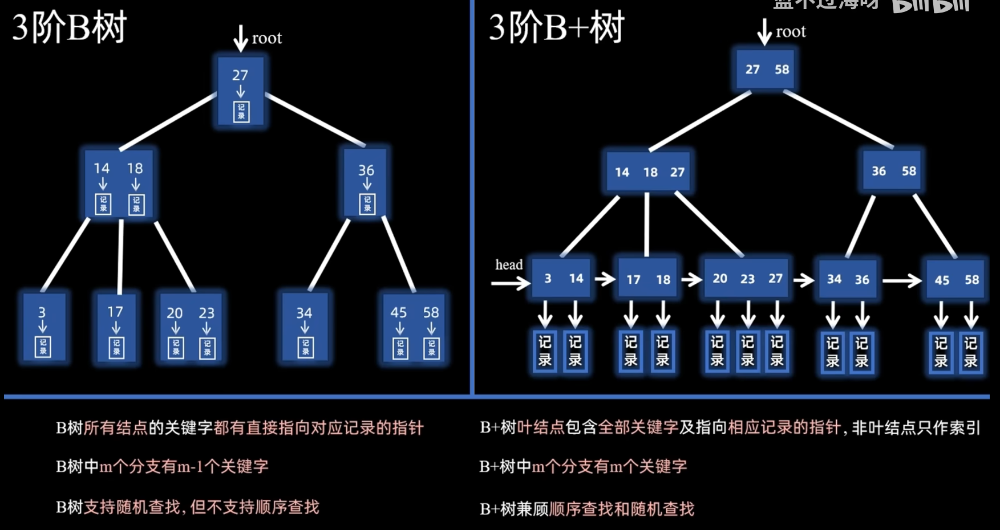
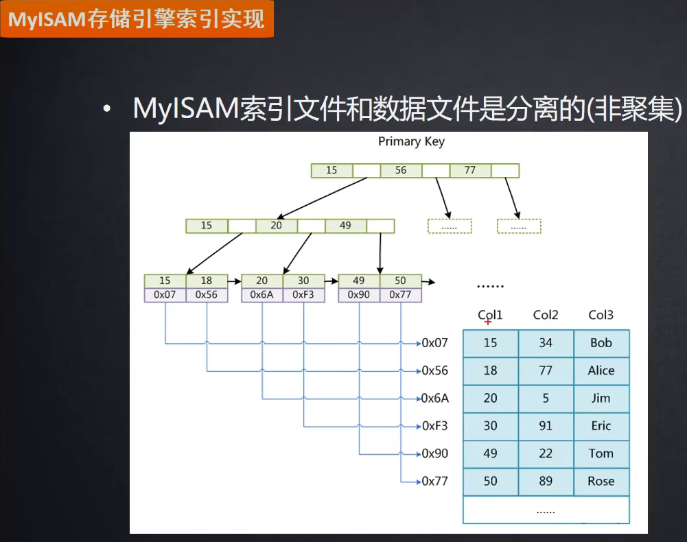
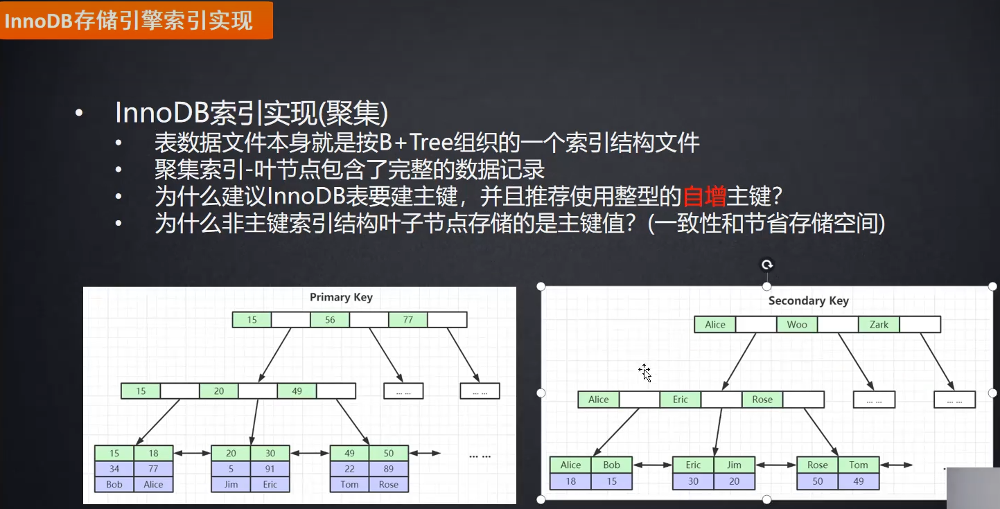

# 技术栈


熟练运用 Cobra、Viper、Pflag 等构建企业级 CLI 应用框架，实现配置的集中化与多源化管理。

miniblog 项目为了方便日志记录，降低开发者理解日志记录方法的负担，只实现了结构化记录方法。基于zap并结合业务需求定制化开发日志包。统一了项目的日志规范，极大提升了代码的可读性与一致性。

实现了包含 HTTP/gRPC 状态码、业务错误码、错误信息及元数据的错误返回机制。此外，还为 ErrorX 提供了便捷的字段设置方法，方便开发者快速构造和返回错误。


具备大型项目性能调优经验：使用pprof定位协程泄漏、使用trace分析调度瓶颈、通过benchmark进行关键路径优化

悉CI/CD流程设计（GitLab CI/ArgoCD）熟练使用Prometheus+Grafana监控体系。


必看技术：singefilght、errgroup、sync.Pool、ants协程池、GMP、GC、分布式锁、channel原理、gitops课程

利用pprof定位GC瓶颈，通过池化技术和sync.Pool减少60%内存分配


锁竞争问题：缩小临界区、使用读写锁、使用无锁数据结构


内存分配/GC：使用sync.Pool（频繁创建和销毁的对象：请求上下文、缓冲区）、预分配切片/Map（使用make指定容量，避免append频繁扩容拷贝）


# 项目梳理


- [x] 梳理订阅安全产品的过程
- [x] 安全服务的基本介绍：UCWI、SWG、DSG、SEG、DSA、终端DLP。DLP的基本内容
- [x] 熟悉UCSS平台的基本内容
- [x] 扩缩容HPA

首先由云平台管理人员通过customer租户管理平台创建租户并填写基本信息，然后根据租户的订阅要求授权相应的安全服务及其规格，主要的安全服务有......

介绍 UCWI 时，由于它是提供RESTful接口，那流量是如何导入到集群中的呢？如何按每日查询数、查询并发数进行限流的呢？

```
OPS、UCSS、POP集群，LVS机器通过IPVS
IPVS - 内核空间的“数据平面”
ipvsadm - 用户空间的“控制平面”

go模板生成租户自己的消费者配置consumer（定义客户端如何认证和限速访问）、上游配置upstream
```

介绍SWG时，导流方式为NodePort。

介绍SEG时，导流方式为LVS到Node节点，然后MTA服务直接NodePort方式暴露。

介绍DSA时，数据发现通过SLAB内网穿透实现访问内网资源的能力。

```
1. 由内向外建立控制通道 (握手)
内网中的穿透客户端（如SLAB Agent）主动向位于公网的穿透服务器（中继服务器）发起一个持久的、稳定的TCP连接。因为这个连接是从内网“向外”建立的，它符合防火墙的出站规则，通常不会被阻拦。
这个连接一旦建立，就成为一个控制通道。客户端会通过这个通道告诉服务器：“你好，我在这里，我愿意为某个端口（比如映射到内网的AD服务的445端口）提供代理服务”。
2. 公网服务器作为中介 (代理)
穿透服务器拥有一个固定的公网IP和域名，它是一个双方都能访问的“中介”。
当公网客户端（如SASE云服务）需要访问企业内网资源时，它并不直接连接企业防火墙，而是去连接这个“中介”服务器。
3. 隧道转发与数据中继
穿透服务器收到公网客户端的请求后，立即通过之前建立好的控制通道，“通知”内网的穿透客户端：“现在有一个外部请求，需要你帮忙访问一下你内部的AD服务”。
内网穿透客户端收到指令后，在本机内部访问目标服务（如127.0.0.1:445或内网IP），获取响应。
最后，内网客户端将响应数据通过控制通道发回给公网服务器，公网服务器再最终返回给公网客户端。
整个过程，企业防火墙只看到一个从内网到指定公网服务器的出站SSL加密连接，没有任何端口暴露在公网上。公网客户端访问的也是这个公网服务器，而不是企业地址。
```


UCSS统一内容安全管理平台：

- 数据看板：系统健康状况（用户目录、URL分类更新、邮件服务器连接）、热点命中策略
- 报告：用户行为、网络事件、发现事件、终端事件
- 监控与日志：
- DLP管理、各种安全服务的配置管理、终端管理


sk-proxy-go、sk-service-controller、sk-gatorcloud-operator三者之间的联动，以及各个项目的特点与难点

## sk-proxy-go

```
import "k8s.io/apimachinery/pkg/util/wait"

func (c *TenantCacher) Start(ctx context.Context) {
	go wait.JitterUntilWithContext(ctx, c.sync, time.Duration(c.cfg.SyncTenantInfoInterval)*time.Second, 0.1, true)
}
帮我详细解释一下wait.JitterUntilWithContext的使用与原理

import "k8s.io/client-go/util/workqueue"
s.queue = workqueue.NewNamedRateLimitingQueue(workqueue.NewItemExponentialFailureRateLimiter(400*time.Millisecond, 10*time.Minute), "notify-task-queue")
帮我详细解释一下 workqueue.NewNamedRateLimitingQueue的使用与原理
```

- interface用于缓存租户的策略
  - interface实现了通知接口，因此SPS在租户策略变更之后，将会调用通知接口，interface即可实时获取租户策略
  - 另外，为了防止SPS的通知机制失败，interface做了定时拉取补偿机制，因此interface可以定时租户策略
- service用于对外提供接口，其它组件可以通过service服务获取租户策略
- interface还有一个很核心的功能，就是会缓存租户授权信息到ETCD当中，后续service-controller以及operator看到租户授权信息之后将会创建租户的授权产品（主要涉及etcd的增删改查）

重点解释两个队列：queue、syncQueue的使用，对于两种方式都是通过队列来实现生产者消费者模型的。


### 难点与亮点

interface同时依赖 SPS 的主动推送（Push） 和自身的定时拉取（Pull）。这两条通道并行，就引入了数据一致性的挑战。每个租户策略附带一个单调递增的版本号（version），无论是推送通知还是拉取补偿，处理逻辑必须是幂等的。基于版本号的判断，重复处理同一条数据不会产生副作用。

**面试表达**：“我们设计了一个推拉结合的双通道更新机制，并用数据版本号作为逻辑时钟，解决了双写冲突和乱序到达的问题，确保了缓存数据的最终强一致性。”

**面试表达**：“我们将租户授权信息作为‘期望状态’写入ETCD，利用ETCD可靠的Watch机制，实现了控制器（Controller）模式的自动化流程。这里最大的挑战是保证事件处理的幂等性和系统在故障恢复后能自动收敛到正确状态。”

我们采用**双队列异步处理**架构，实时推送走**高优先级队列**，定时补偿走**低优先级队列**，两者通过**版本号机制**协调。


**SharedInformer与缓存利用**：在监听多集群资源时，为每个集群使用`SharedInformer`，**避免重复的List-Watch连接**，并利用其本地缓存`Lister()`进行读操作，极大减轻K8S API Server压力。

**ResyncPeriod优化**：根据资源变更频率，合理设置`ResyncPeriod`，对于几乎不变的基础配置（如集群信息）设置较长时间，对频繁变更的资源（如Pod状态）设置较短时间或禁用Resync。

**Workqueue的深度使用**：除了限速队列，可能还根据错误类型（可重试/不可重试）设定了不同的**重试策略（指数退避）**，并利用`Forget`方法在成功后清理记录，防止内存泄漏。


## sk-service-controller

用于监听ETCD，监听`/tenant/info`，与此同时对于所有的`/tenant/info/<tenant id>/rs/<product>`产品的变动都会创建/修改/删除对应的CR

集群之间通信需要通过APISIX的认证，根据popId、popCode、tenantId、时间戳（检查 `x-timestamp`是否在合理的时间窗口内（例如，与服务器时间相差不超过 ±5 分钟），以防止重放攻击）信息生成认证头。不管是HTTP还是GRPC可以通过APISIX的认证插件。通过apisix/plugins/token-auth.lua来自定义认证插件。

删除安全产品时，设置删除传播策略为：metav1.DeletePropagationOrphan，只删除父资源，其管理的所有子资源都会被保留，成为“孤儿”资源。

这通常基于一种特定的架构设计：

1. 一个“产品”或“租户”资源（由 `BaseProduct`管理）可能创建并管理着很多其他底层资源（如 Deployments, Services, ConfigMaps 等）。
2. 当删除这个“产品”时，你可能不希望立即删除所有这些底层资源。
3. 你可能有一个更高级别的控制器或清理流程，需要在这些资源成为“孤儿”后，再进行更复杂、更安全的清理操作。
4. 使用 `Orphan`策略可以避免误删，实现分阶段、可控的删除过程。

更新CR时：

| 特性           | 说明                                              | 优点                                                         |
| :------------- | :------------------------------------------------ | :----------------------------------------------------------- |
| 智能合并       | 使用三路合并算法计算差异                          | 大幅减少不必要的 API 调用，避免无意义的资源更新和控制器重建。 |
| 关注点分离     | 使用 `IgnoreStatusFields`忽略状态字段             | 避免因状态变化触发业务逻辑更新，只关注期望状态（spec）的变更。 |
| 元数据安全     | 精心保留 `resourceVersion`, `creationTimestamp`等 | 确保更新操作符合 Kubernetes 的并发控制要求，避免基础元数据被破坏。 |
| 注解合并       | 合并而非覆盖现有注解                              | 保证其他系统设置的注解不会丢失，体现了良好的协同工作设计。   |
| 优雅的错误处理 | 捕获特定错误并尝试删除后重建                      | 实现了自我修复。能够自动处理一些棘手的更新冲突（如字段不可变性验证失败），极大地增强了系统的鲁棒性。 |


```go
	// 它使用了一个patch库来计算 currObj（当前状态）和 newObj（目标状态）之间的差异
	// 它告诉差异计算器忽略 .status 字段的任何不同。我们只关心 spec 的变更，避免因状态字段的变化而触发不必要的更新。
	patchResult, err := patch.DefaultPatchMaker.Calculate(currObj, newObj, patch.IgnoreStatusFields())
	if err != nil {
		return errors.Wrapf(err, "calculate diff by three-way merge error")
	}
	// 如果计算出的差异是空的（patchResult.IsEmpty()），说明新的 spec与当前的 spec没有实质性区别
	if patchResult.IsEmpty() {
		s.Log.Infof("%s not modify, ingnoed", name)
		return nil
	}
	// 这类似于 kubectl apply的工作方式，在对象上设置一个注解（通常是 kubectl.kubernetes.io/last-applied-configuration）来记录本次更新的完整配置。
	// 这为未来的三路合并提供了“原始状态”。
	if err := patch.DefaultAnnotator.SetLastAppliedAnnotation(newObj); err != nil {
		return errors.Wrapf(err, "unable to patch %s with comparison object", name)
	}

三路合并引入了第三个关键的参考点：最初的共同版本（也叫“祖先”或“基础”版本）。
现在你有三个版本：
O (Original)：原始文件（你们最开始一起看的那个版本）
A (Your Version)：你的修改版
B (Friend‘s Version)：你朋友的修改版
算法的思路非常简单：
“看看你（A）在原始文件（O）基础上改了啥，再看看你朋友（B）在原始文件（O）基础上改了啥。只要你们修改的不是同一个地方，就把你们俩的修改合在一起。如果修改了同一个地方，那就冲突了，需要人工来处理。”

在你提供的 Patch方法中：
O (Original)：并不是一个真实存在的文件，而是由 LastAppliedAnnotation等机制推断出的“上一次应用的状态”。
A (Your Version)：currObj（Kubernetes 中当前的资源对象）。
B (Friend’s Version)：newObj（你希望资源变成的新状态）。
```


## sk-gatorcloud-operator

```shell
# swg这种产品Operator被部署到gator-cloud命名空间中，其中的各个组件被部署到租户的命名空间中
root@POP-LVS-172-30-3-242:~# kubectl get swgs -n gator-cloud
NAME          TENANTNAME     TENANTID   TENANTCODE   STORAGE   REPLICAS   VERSION   STARTTIME    ENDTIME      AGE    DESCRIPTION
swg-1000006   zhangyong      1000006    c5cb27eb     80Gi      13         202       2024-06-18   2028-12-31   280d   ca-init 容器修改
swg-1000009   yuhongyan      1000009    b078e46e     80Gi      2          200       2024-09-01   2028-09-03   406d   spe更新到3.10.0_133

# 产品的组件可共享、启动具有优先级
```

0、定义finalizer，添加删除逻辑hook

有 Finalizer：当你执行 `kubectl delete`时，Kubernetes API Server 只会做两件事：

1. 设置资源的 `deletionTimestamp`字段（标记为正在删除）。
2. 阻止资源被真正删除，直到所有 Finalizer 被移除。


1、根据 spec 中的 version 字段获取 产品配置大清单 productConfig。

2、检查产品配置中是否存在产品配置 如果存在，对当前产品依赖进行排序。

3、根据产品组件依赖的优先级进行分桶，相同优先级的资源可以同时创建 与此同时，渲染模板。

4、如果CR被删除，执行删除产品逻辑（资源已经被标记删除 `AND`本控制器的 Finalizer 还未被移除时，返回 `true`。）

```
删除产品，非产品级共享组件直接删除即可，若为产品级共享组件，则需判断是否有其它产品在使用该组件，若无，则直接删除
删除逻辑按照优先级倒序进行

非租户级共享资源，直接删除组件
租户级别共享资源，判断租户的引用计数是否为一，如果为一，那么删除资源，否则引用计数减一


```

5、更新CR以及组件资源状态

6、创建或者更新资源，一个桶中的资源可以一起创建，下一个桶的资源在创建之前必须要等到前一个桶中的所有资源全部Ready

```
创建后立即检测当前桶中的所有资源是否已经Ready, 这样做的好处时可以判断产品是否已经全部创建完成
如果当前桶的资源还未Ready，就丢到延时队列中

创建完成后，有一个后处理逻辑，可以创建apisix相关的路由信息
```


## task-pop

负责多个集群之间集群基本信息、认证信息的同步

当多个集群需要更新全局配置时，需要确保配置更新的原子性，防止部分更新导致配置不一致。

```go
// 伪代码示例
func UpdateGlobalConfig(newConfig Config) error {
    // 获取全局配置更新锁
    lock, err := distributedLock.Acquire("global:config:update", 5*time.Minute)
    if err != nil {
        return fmt.Errorf("无法获取配置更新锁: %v", err)
    }
    defer lock.Release()
    
    // 读取当前配置
    currentConfig, err := readGlobalConfig()
    if err != nil {
        return err
    }
    
    // 验证并合并配置
    mergedConfig, err := mergeConfigs(currentConfig, newConfig)
    if err != nil {
        return err
    }
    
    // 写入新配置
    if err := writeGlobalConfig(mergedConfig); err != nil {
        return err
    }
    
    // 通知所有集群配置已更新
    notifyAllClusters(mergedConfig)
    
    return nil
}
```


# OPS运维管理平台

多集群管理：

- 负责添加集群：包括集群IP（这里是LVS服务器地址）、区域、提供商、集群类型、安全服务网关IP、KubeConfig等信息。
- 跨集群认证：popCode、popId用于pop集群之间通信认证、由ops产生并分发给各个pop。思路：由于启用、禁用、刷新popcode等操作，我们需要根据版本号同步popcode信息到各个集群中，admin会生成包含popcode的configmap内容到DB，并调用job来分发该版本的configmap到集群中。job收到携带版本号的通知后创建分发任务并入库，任务成功则修改DB中任务状态，如果任务失败则重新放到队列尾部进行重试，job启动时也会从DB中查询未成功任务进行重试。
- 集群日志收集配置：日志收集开关、系统日志收集与过滤、应用日志收集与过滤；基于EFK实现日志收集
- 资源监控、Web终端、K8S常用工作负载信息展示

多租户管理：

- 租户基本信息展示：包括租户名称、企业代码、服务提供点、授权状态、产品版本
- 安全服务的展示：包括各个安全服务的组件及其运行情况
- 安全服务的资源定义、版本控制、接口测试
- 租户独立升降级安全产品


集成 Grafana，对产品服务进行监控可视化。上报业务监控指标到 Prometheus，结合 Grafana 实现服务异常告警。

集群问题排查，解决容器资源占用异常、容器性能差等问题。

> 资源限制不合理，没有考虑 pagecache，memory cgroup。request 太小
>
> ApiSix，不同集群，内存，oom，节点资源丰富。大量nginx进程，limit cpu，top，/proc/state。深入学习 cgroup，k8s cadvisor，lxcfs。

涉及技术：Client-go，Operator，Kubebuilder，K8s，Prometheus，Grafana，ApiSix，Kratos，Gorm，Wire，Grpc，Postgresql 等。

## 难点与亮点

使用`singleflight`对同时请求同一租户状态的多个API调用进行合并，防止热点租户拖垮系统。

# Operator模块

 项目描述： 通过 Operator 封装租户产品业务逻辑， 实现租户不同 DLP 产品的订购、 修改、 取消订购等逻辑。
 技 术 栈： kubernetes + kubebuilder + operator + controller -runtime + apisix + etcd
 技术要点：
o 租户 DLP 产品订购、 修改、 取消订购以及产品到期问题
o 不同 DLP 产品容器依赖问题
o 不同 DLP 产品容器共享问题
o 后续不同 DLP 产品资源清单维护问题
o 后续不同 DLP 服务灰度升级、 回滚问题
o 不同 DLP 产品 apisix 路由维护问题  

# 私有化部署

响应一汽集团数字化转型战略，将传统硬件部署的UCWI-11000安全产品改造为Kubernetes云原生架构。实现从物理设备到容器化K8S部署的转型，满足客户对弹性伸缩、高可用和统一管理的核心需求。

原来采用docker-compose的方式部署，了解原来如何实现容器启动顺序、网络访问等原理


## 相关改造

appliance容器化改造

- 之前的设备注册流程需要人工操作（人工输入一些配置信息然后进行设备注册），该流程需要自动化，依赖的信息可通过环境变量或者configmap的方式获取；注册成功后获取的证书等信息通过存入指定的存储让其他组件可以感知到并应用。

各组件间调用方式修改（Cloud Team）

- 设备版是docker-compose方式部署，服务通过固定IP来调用。如果所有组件放到同一个Pod中，会存在端口冲突导致容器无法启动的问题，修改端口又会引入访问的修改。
- 所以该方案将各组件以单独的Pod来部署，通过暴露的service name来访问。
- 目前组件的依赖服务地址基本支持配置文件，并将依赖服务地址修改为对应服务的service name。

UCWI与UCSS的交互（Cloud Team）

- UCWI通过服务网关暴露到集群外，供外部服务访问。在设备注册时，将服务网关的访问地址上传到UCSS。
- 整个交互和当前设备版类似，改动较小。

容器依赖关系（Cloud Team）

- 组件之间存在依赖关系，在 docker-compose 中是可以控制启动顺序的，在 pod 中不行。
- 解决方案：可通过 init container 检查依赖服务的端口（通过 nc 工具），就绪后才启动。

该方案可支持同一个K8S集群部署多套UCWI来支持扩容和负载均衡

- 使用 namespace 隔离，类似多个UCWI设备，保持原有逻辑。
- 目前方案为了简化部署，选择通过HostPort暴露，并选择一个work节点的IP作为对外访问的入口。具体选择集群中的哪一个节点，在安装部署时需要指定。
- 没有使用 NodePort 暴露，因为 NodePort 默认端口范围是 30000 以上，而 UCSS 固定了对 UCWI 的访问端口为 9443 和 5443，因此采用 HostPort 暴露。
- 每个 UCWI 实例需要绑定一个 work 节点，用于暴露 UCWI 服务网关，集群外通过此节点的 IP 访问 UCWI。

交付方式（Cloud Team）

- 通过导出镜像+部署文件+相关脚本
- 升级和bug修复：导出新的镜像+部署文件+相关脚本
- 镜像通过公网镜像仓库发布（后续镜像的更新由成都团队负责）
- 部署程序会通过公网镜像仓库拉取需要的镜像

## 具体实现

容器调度

1、appliance & ucwi 容器部署到同一个 Pod

appliance 访问 ucwi 时，由于 ucwi 授信 IP 功能，需要固定 appliance 访问时的客户端 IP，才能授信。因此将这两个容器放到同一个 Pod 里，appliance 通过 127.0.0.1 的方式去访问 ucwi，ucwi 只需要授信 127.0.0.1 即可。

2、appliance Pod（包含 ucwi 容器）需要调度到固定某个节点

通过 hostPort 的形式暴露 appliance 9443 端口，用于集群外的 ucss 访问。通过 hostPort 的形式暴露 ucwi 5443 端口，用于集群外的客户端访问。为什么没用NodePort呢？因为NodePort默认范围是30000+。（熟悉亲和性调度）

3、dcrp 和 rde 容器部署到同一个 Pod

因为这两个容器内部通过 127.0.0.1 的形式相互访问，所以需要在同一个 network namespace。

4、spe & kvserver 容器部署到同一个 Pod

spe 和 kvserver 挂载了同一个PV，spe 运行时，会挂载 tmpfs 文件系统到该PV。因此 spe 和 kvserver 必须在同一个 Pod，并配置挂载传播特性，才能保证 spe 挂载的文件系统对 kvserver 可见。

5、appliance 部署后和 ucss 通信需要默认证书，此证书由成都团队以挂载文件的形式提供。后续 appliance 会申请新的证书进行覆盖。

## 代码实现

使用 pflag、viper、cobra 三个强大的 Go 包来构建应用的命令行选项、配置文件和应用启动框架。

version：给应用添加版本号打印功能：通过编译时指定 -ldflags -X importpath.name=value 参数，来为程序自动注入版本信息。

status：查看所有部署产品实例的相关信息，注意要读取产品命名空间下的config这个configmap，config中的data为config: |- xxxx，以此获得 网关对外地址：bs.Appliance.ServerOutIp。是否所有产品都是此种方式呢？

config：查看选择的产品实例的配置信息，也就是读取产品命名空间下的config这个configmap，config中的data为config: |- xxxx。

deploy：部署实例（创建、更新、删除、回滚），

创建过程：

- 校验命名空间（设备名、实例名）是否已经存在、校验node节点状态（污点、已被部署实例）Appliance.Node、校验Appliance.ServerOutIp通过部署nginx的hostNetwork方式、校验storageClass（当前并没有校验只是检查了kubectl version）、校验UcssAddr（当前并没有校验）。

- 创建命名空间，命名空间中增加annotation：device、status、product。

- 用户配置完成之后，将用户修改的配置存到命名空间中的configMap中。

- 生成部署的资源清单文件，然后将资源清单与配置文件一起进行备份，configmap名为config-backup，data有两个key：manifest-backup、config-backup。方便后期回滚。

- 创建完成之后更新命名空间的status注解为Running 运行中。

删除过程：

- 用户选择要删除的设备名
- 删除对应的命名空间
- 如果删除失败，更新相应的状态到命名空间的注解中

更新过程：

- 用户选择要更新的设备名。
- 合并之前保存的configmap配置与最新安装包中嵌入的配置，镜像使用嵌入配置文件，其余的使用configmap的配置。
- 将合并的配置存到命名空间中的configMap中。
- 生成部署的资源清单文件，然后将资源清单与配置文件一起进行备份，configmap名为config-backup，data有两个key：manifest-backup、config-backup。方便后期回滚。
- 创建完成之后更新命名空间的status注解为Running 运行中。

回滚过程：

- 用户选择要回滚的设备名。
- 读取备份configmap中的manifest-backup资源清单。
- 创建完成之后更新命名空间的status注解为Running 运行中。


## 问题排查与优化

1、配置管理复杂性问题

```
难点：
配置来源多样：命令行参数、环境变量、配置文件、默认值
配置层次复杂：全局配置、产品配置、实例配置
```

2、父子命令间参数继承与覆盖、命令help文档是自动生成

3、部署过程可视化

4、错误处理（配置错误、环境错误、网络错误）、调试模式（收集系统信息、集群状态、日志、生成诊断报告）

5、频繁查询集群状态，导致API Server压力大

# ETCD

## watch机制

> 参考文档：https://cloud.tencent.com/developer/article/2485343

Watch 是 etcd 提供的一种订阅机制，允许客户端监听特定键或键前缀的变化。当被监听的键发生增删改操作时，etcd 会向所有订阅者发送事件通知。Watch 机制的核心特点包括：

- 实时性：变更发生后，几乎实时地通知客户端。
- 持久性：支持长时间监听，客户端可以持续接收事件。
- 高效性：仅传输变化的数据，减少网络开销。

etcd Watch机制的基本原理

1. 订阅：客户端向 etcd 发送 Watch 请求，指定要监听的键或前缀。
2. 监听：etcd 监控指定范围内的键值变化。
3. 通知：当有变更发生时，etcd 将事件推送给所有订阅者。


## 租约机制

在 etcd 中，租约是一个有时间限制的授权。你可以将一个或多个键（Key）绑定到一个租约上。当租约到期后，所有绑定到该租约上的键都会被 etcd 自动删除。

```shell
etcdctl lease grant 240
# etcd 成功创建了租约，并返回了租约的ID：5a578262b3f6f545。这个ID是后续操作这个租约的凭证。
lease 5a578262b3f6f545 granted with TTL(240s)

# 查询了 ID 为5a578262b3f6f545的租约的详细信息
etcdctl lease timetolive 5a578262b3f6f545
lease 5a578262b3f6f545 granted with TTL(240s), remaining(198s)

# 将键绑定到租约
etcdctl put --lease=5a578262b3f6f545 /abc  111
OK

# 对指定的租约进行续约
etcdctl lease keep-alive 5a578262b3f6f545
# 输出示例：（会持续阻塞并输出续约结果，直到你 Ctrl+C）
# lease 5a578262b3f6f545 keepalived with TTL(240)
# lease 5a578262b3f6f545 keepalived with TTL(240)
# ...
# lease keep-alive命令默认会一直阻塞运行并定期（通常是 TTL 的 1/3 时间）续约一次。对于程序来说，通常使用客户端的自动异步续约接口。

# 撤销指定租约
etcdctl lease revoke 5a578262b3f6f545
# 输出示例：
# lease 5a578262b3f6f545 revoked
# 此时再查询绑定在该租约上的键 /abc，会发现已经被删除了
etcdctl get /abc
# （无输出，键已不存在）

# 查看租约详情，并显示其绑定的所有键
etcdctl lease timetolive 5a578262b3f6f545 --keys
# 输出示例：（如果租约还存在且绑定了键）
# lease 5a578262b3f6f545 granted with TTL(240s), remaining(232s), attached keys([/abc])
#                                                              ^^^^^^^^^^^^^^^^
# 输出示例：（如果租约已过期或被撤销）
# lease 5a578262b3f6f545 already expired
```

**典型应用场景：**

1. 服务注册与发现：服务节点启动时，用租约注册到 etcd（例如 `key=/services/order/192.168.1.100`）。服务需要定期续约（心跳）。如果服务节点宕机，心跳停止，租约到期后 key 自动被删除，客户端就知道这个节点不可用了。
2. 分布式锁：获取锁时可以绑定一个租约，如果持有锁的客户端崩溃，能保证锁最终会被自动释放，防止死锁。


## MVCC实现

ETCD MVCC的主要目标：支持 watch 机制和乐观锁

### 支持watch机制

MVCC 的核心结构（简化版）

```
时间线: rev=1   rev=2   rev=3   rev=4   rev=5
键 /foo: "A"    "B"    "C"    "D"    "E"
索引:  {1,0}   {2,0}   {3,0}   {4,0}   {5,0}
```

支持 Watch 机制的实现逻辑："告诉我某个键（或范围）从某个时间点（revision）开始的所有变化"

```
客户端 Watch
  ↓
指定: key="/foo", from_rev=3
  ↓
服务端:
  1. 检查当前 revision=5
  2. 找到 /foo 在 revision>=3 的所有变化
  3. 历史: rev=3:"C", rev=4:"D", rev=5:"E"
  4. 立即返回: {PUT "C"}, {PUT "D"}, {PUT "E"}
  5. 持续监听: 当有 rev=6 的变更时推送
```

内存中的数据结构

```go
// Watch 注册表
watchers = {
    "/foo": [
        {client1, from_rev=3, channel=ch1},
        {client2, from_rev=5, channel=ch2}
    ],
    "/bar": [
        {client3, from_rev=1, channel=ch3}
    ]
}

// 事件分发流程
func notifyWatchers(event) {
    // 1. 找到监听这个key的所有watcher
    for watcher in watchers[event.key] {
        // 2. 检查是否满足revision条件
        if event.rev >= watcher.from_rev {
            // 3. 发送到客户端通道
            watcher.channel <- event
        }
    }
}
```

实际的代码逻辑

```go
// 客户端发起 watch
client.Watch(ctx, "/config/server", 
    clientv3.WithRev(100),  // 从版本100开始
    clientv3.WithPrefix())  // 监听前缀

// 服务端处理
func (s *watchServer) Watch(stream pb.Watch_WatchServer) error {
    for {
        // 1. 接收watch请求
        req, _ := stream.Recv()
        
        // 2. 创建watcher
        watcher := &watcher{
            key:    req.Key,
            rev:    req.StartRevision,
            ch:     make(chan WatchResponse, 128),
        }
        
        // 3. 注册到watchableStore
        s.watchable.watchers[req.Key] = append(watchers, watcher)
        
        // 4. 发送历史事件（如果有）
        if req.StartRevision < s.currentRevision {
            events := s.getHistory(req.Key, req.StartRevision)
            for _, ev := range events {
                stream.Send(ev)
            }
        }
        
        // 5. 监听新事件
        go func() {
            for event := range watcher.ch {
                stream.Send(event)
            }
        }()
    }
}
```

### 支持乐观锁

支持乐观锁的实现逻辑："只有当我上次读取的值没有被改变时，才允许我写入新值"


## 分布式锁

核心性质：

- 独占性：对于同一把锁，在同一时刻只能被一个取锁方占有，这是作为“锁”工具最基础的一项性质。
- 健壮性：即不能产生死锁（dead lock），假如某个占有锁的使用方因为宕机而无法主动执行解锁动作，锁也应该能够被正常传承下去，被其他使用方所延续使用。
- 对称性：加锁和解锁的使用方必须为同一身份，不允许非法释放他人持有的分布式锁。
- 高可用：当提供分布式锁服务的基础组件中存在少量节点发生故障时，不应该影响到分布式锁服务的稳定性。

主动轮询型分布式锁redis

- key作为当前锁的唯一标识，value作为使用方的唯一标识；当解锁时就需要检查是否是当前锁持有者在进行解锁操作。
- 加锁和解锁都需要原子性，只是加锁redis提供了（使用 set 指令并附加 nx 参数来实现与 setnx 指令相同的效果），解锁通过Lua脚本实现。
- 死锁：在插入分布式锁对应的KV数据时设置一个过期时间，以便使用方因为异常原因无法正常解锁时，锁对应的数据项也会在达到过期时间后被自动删除。但是该时间只能是经验值，时间设置过长或者过短都不行；针对这个问题引入了——看门狗策略：在锁的持有方未完成业务逻辑的处理时，会持续对分布式锁的过期阈值进行延期操作。
- 弱一致性问题：
- RedLock思想：同时向多个独立的Redis实例（通常是奇数个）节点申请锁。只要大多数节点认可你获得了锁，你才算真正获得锁。使用红锁时必须部署多个独立的 Redis 主节点（Master），且这些主节点之间不能配置主从复制关系（即不进行数据同步）。

watch回调型etcd

- 与主动轮询型分布式锁不同的是，在取锁失败时，watch 回调型分布式锁不会持续轮询，而是会 watch 监听锁的删除事件。
- etcd本身就提供了租约机制，可以实现redis的看门狗策略；异步启动一个续约协程，当使用方宕机时续约协程自然就退出无法续约了。
- 惊群效应：使用前缀prefix机制以及revision机制。etcd 维护的一个全局单调递增的计数器，每次对 etcd 存储的修改（增删改）都会产生一个新的、更大的 `revision`。这个 `revision`是全局有序的，是判断操作先后顺序的关键。

**假设场景：** 三个客户端 (Client A, B, C) 竞争同一把锁，锁前缀为 `/locks/mylock`。

1. 所有客户端：创建租约 (Lease Creation)

每个客户端在尝试获取锁之前，必须先创建一个租约。租约的 TTL 决定了锁的最大持有时间（如果客户端崩溃，TTL 到期后锁会自动释放）。

```
# Client A 创建租约 (假设返回 Lease ID 12345abcd)
etcdctl lease grant 30
# lease 12345abcd granted with TTL(30s)

# Client B 创建租约 (假设返回 Lease ID 67890efgh)
etcdctl lease grant 30
# lease 67890efgh granted with TTL(30s)

# Client C 创建租约 (假设返回 Lease ID a1b2c3d4e5)
etcdctl lease grant 30
# lease a1b2c3d4e5 granted with TTL(30s)
```

- 关键点：每个客户端获得一个唯一的租约 ID (`leaseID`)。租约需要定期 `lease keep-alive`来维持。

2. 所有客户端：生成唯一锁键并插入记录 (PUT with Lease)

客户端使用锁前缀 (`/locks/mylock`) 和自身的 `leaseID`拼接成唯一的锁键 (`lockKey`)，并将该键值对写入 etcd，同时绑定租约。写入成功会返回一个全局唯一的 `revision`。

```
# Client A: PUT /locks/mylock/12345abcd (绑定租约 12345abcd)
etcdctl put /locks/mylock/12345abcd clientA_data --lease=12345abcd
# OK (返回 revision=1001)

# Client B: PUT /locks/mylock/67890efgh (绑定租约 67890efgh)
etcdctl put /locks/mylock/67890efgh clientB_data --lease=67890efgh
# OK (返回 revision=1002)

# Client C: PUT /locks/mylock/a1b2c3d4e5 (绑定租约 a1b2c3d4e5)
etcdctl put /locks/mylock/a1b2c3d4e5 clientC_data --lease=a1b2c3d4e5
# OK (返回 revision=1003)
```

- 关键点：键名格式：`<prefix>/<leaseID>`(e.g., `/locks/mylock/12345abcd`)。值 (`clientX_data`) 可以是任意数据，通常包含客户端标识或元数据。`--lease=`参数将键绑定到租约。租约到期或客户端主动撤销租约，该键会被自动删除。`revision`由 etcd 分配，全局单调递增。写入顺序决定了 `revision`大小 (A:1001 < B:1002 < C:1003)。

3. 所有客户端：查询锁列表并判断是否获得锁 (Range Query)

每个客户端需要查询以锁前缀 `/locks/mylock`开头的所有键 (`--prefix`)，获取当前所有竞争者的锁记录（包括自己）。然后检查自己的 `revision`是否是最小的。

```
# 所有客户端执行相同的查询命令：
etcdctl get /locks/mylock --prefix --sort-by=MODIFY --order=ascending --keys-only
# 输出示例 (按 revision 升序排列)：
# /locks/mylock/12345abcd (revision=1001)
# /locks/mylock/67890efgh (revision=1002)
# /locks/mylock/a1b2c3d4e5 (revision=1003)

# Client A 检查：自己的 revision=1001 是列表中最小的 -> 加锁成功！
# Client B 检查：自己的 revision=1002 (最小是 1001) -> 加锁失败。
# Client C 检查：自己的 revision=1003 (最小是 1001) -> 加锁失败。
```

- 命令参数解释：`get /locks/mylock --prefix`: 获取所有以 `/locks/mylock`开头的键。`--sort-by=MODIFY`: 按修改事件排序（即按创建时的 `revision`排序）。`--order=ascending`: 升序排列（最小的 `revision`排在最前面）。`--keys-only`: 只返回键名（节省带宽，我们主要关心键名和隐含的 `revision`顺序）。
- 关键点：客户端需要从查询结果中解析出每个键对应的 `revision`（通常 etcd 的 get 响应会包含每个 kv 对的 `revision`）。然后比较自己的 `revision`是否是最小的。

4. 未获锁客户端 (B & C)：监听前驱节点 (Watch Predecessor)

获取锁失败的客户端 (B 和 C) 不会轮询，而是设置一个 Watch，监听排在自己前面一位的客户端对应的键的删除事件。

- 确定监听目标 (前驱节点)：从步骤 3 的排序列表 `[A@1001, B@1002, C@1003]`中：Client B (`revision=1002`) 的前驱是 A (`/locks/mylock/12345abcd`)。Client C (`revision=1003`) 的前驱是 B (`/locks/mylock/67890efgh`)。

```
# Client B: 监听前驱节点 A 的键 (/locks/mylock/12345abcd) 的删除事件
# 指定从当前已知的 revision (1003 或更高) 开始监听，避免处理旧事件
etcdctl watch /locks/mylock/12345abcd --rev=1004
# (命令会阻塞在这里，等待事件)

# Client C: 监听前驱节点 B 的键 (/locks/mylock/67890efgh) 的删除事件
etcdctl watch /locks/mylock/67890efgh --rev=1004
# (命令会阻塞在这里，等待事件)
```

- 关键点：`watch [key]`: 监听指定键的事件。
- `--rev=1004`: 指定从哪个 `revision`开始监听。确保了它能捕获到在它完成查询锁列表（步骤 3）之后发生的、关于 A 的键的任何事件（特别是删除事件），这解决了“查询后、监听前”这个时间窗口内事件丢失的问题。

5. 锁持有者 (Client A)：释放锁 (DELETE Key)

当 Client A 完成工作后，它需要释放锁。释放操作就是删除自己创建的那个键。

```
# Client A: 删除自己的锁键
etcdctl del /locks/mylock/12345abcd
# 1  # (返回删除的 key 数量)

# 这个删除操作会产生一个新的 revision (例如 1004)
```

- 关键点：删除操作会触发 etcd 事件。只有正在监听 `/locks/mylock/12345abcd`的 Client B 会收到这个 `DELETE`事件。

6. 等待者 (Client B)：被唤醒并尝试获取锁

Client B 的 `watch`命令收到 Client A 键被删除的事件：

```
# Client B 的 watch 命令输出示例：
DELETE /locks/mylock/12345abcd (revision=1004) # <- 收到这个事件！
```

Client B 被唤醒后，重新执行步骤 3：查询当前锁列表并判断自己是否最小。

```
# Client B 重新查询锁列表
etcdctl get /locks/mylock --prefix --sort-by=MODIFY --order=ascending --keys-only
# 输出示例 (A 的键已删除)：
# /locks/mylock/67890efgh (revision=1002)
# /locks/mylock/a1b2c3d4e5 (revision=1003)

# Client B 检查：自己的 revision=1002 现在是列表中最小的 -> 加锁成功！
```

Client B 现在成为锁的持有者。


# MYSQL高频面试题

## 索引与存储引擎

二叉搜索树、平衡二叉树（AVL：所有结点左子树高度-右子树高度 的绝对值<=1）、红黑树（任一结点左右子树的高度相差不超过两倍）、B树（多叉平衡搜索树：这是平衡、有序、多路的）、B+树








# REDIS高频面试题


# 分布式任务调度

問：如果要把大象放進冰箱裡怎麼做？
答：把冰箱門打開，放進去

問：如果要把長頸鹿放進冰箱裡怎麼做？
答：把大象拿出來，再把長頸鹿放進去

問：有一天獅王要召開會議，誰不會去？
答：長頸鹿（因為他還在冰箱裡）

問：有個人要過河，當地人警告他河裡有鱷魚，他該怎麼過去？
答：游過去‥（因為鱷魚都去開會了)


# 仅了解技术

MinIO是对象存储服务器，完全兼容S3 API

```
# 使用 AWS S3 SDK 直接操作 MinIO
aws s3 ls --endpoint-url http://minio:9000 mybucket
```

SpringBoot是快速搭建微服务的脚手架，核心理念是“约定优于配置”。

SpringCloud：基于 Spring Boot 的分布式系统解决方案，提供微服务架构所需的全套工具。服务注册发现、配置中心、熔断器、分布式追踪、API网关。


# 个人介绍

面试官您好，我是19年大学毕业，然后加入北京华宇（主要做电子政务相关）从事了约两年java研发工作，期间主要的项目是智慧执行系统，技术栈主要是springboot+springcloud+vue。后来加入现在这个公司，天空卫士，主要做数据安全相关，我们团队是云团队，负责将公司的各种安全产品如UCWI、SWG、DSG、SEG等迁移到云上，实现从传统的物理设备销售模式转变为基于云的按需订阅销售模式，让中小企业也可很方便的获得数据保护能力。


**项目介绍**

那我先大致介绍一下云平台项目的整体流程，以及我认为其中涉及的亮点和难点。用户需要首先到订阅平台订阅所需的安全服务并按需进行配置（如用户数、磁盘大小、VPN连接数等）。


你对AI有什么了解吗？

大学期间跟着老师做过一个基于深度学习的DNA测序，那个时候就看了一些吴恩达的机器学习、深度学习的课程，了解了一些基本概念比如


# 大致过一下简历

- [x] gRPC与HTTP、http1.1与http2.0与http3.0
- [x] ETCD的MVCC机制主要支持watch机制和乐观锁、租约机制、分布式锁
- [x] redis分布式锁与etcd分布式锁对比：ETCD 分布式锁是基于强一致性的租约锁（watch回调，基于revision避免惊群效应），Redis 分布式锁是基于 AP 系统的超时锁（主动轮询）。
- [x] raft算法：leader选举（Follower、Candidate、Leader），日志复制，安全性
- [x] pprof 
  - [x] 通过Prometheus告警规则触发，发现大量协程和内存偏高
  - [x] 然后使用pprof的命令行查看实时状态和火焰图观察
  - [x] 协程泄露：1、为每个租户的每个安全配置都开协程进行处理，导致大量协程（使用协程池ants限制总数）；2、channel阻塞导致的协程泄露（增加default或者超时机制）。
  - [x] 内存：每次处理都创建新对象（buffer_pool）、频繁序列化/反序列化（直接赋值处理）

- [ ] CGroup：cpu.cfs_period_us、cpu.cfs_quota_us、cpu.shares


- [ ] 

- [ ] mysql慢查询：排序没有走索引
- [ ] 
