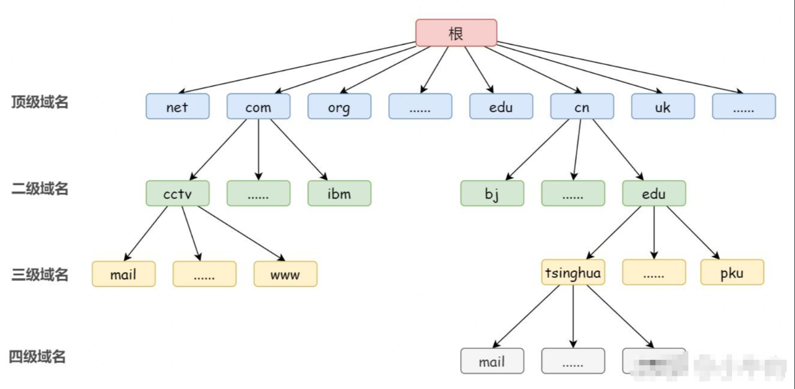

# 参考资料
> 前置疑问：https://www.zhihu.com/question/23042131
层级关系与域名服务器：https://zhuanlan.zhihu.com/p/351059293
DNS报文格式：https://fasionchan.com/network/dns/packet-format/

# DNS前置疑问
## 为什么需要DNS解析域名为IP地址？
网络通讯大部分是基于TCP/IP的，而TCP/IP是基于IP地址的，所以计算机在网络上进行通讯时只能识别如“202.96.134.133”之类的IP地址，而不能认识域名。我们无法记住10个以上IP地址的网站，所以我们访问网站时，更多的是在浏览器地址栏中输入域名，就能看到所需要的页面，这是因为有一个叫“DNS服务器”的计算机自动把我们的域名“翻译”成了相应的IP地址，然后调出IP地址所对应的网页。

## 具体什么是DNS？
DNS( Domain Name System)是“域名系统”的英文缩写，是一种组织成域层次结构的计算机和网络服务命名系统，它用于TCP/IP网络，它所提供的服务是用来将主机名和域名转换为IP地址的工作。DNS就是这样的一位“翻译官”，它的基本工作原理可用下图来表示。


## DNS的过程？
DNS是应用层协议，事实上它是为其他应用层协议工作的，包括不限于HTTP和SMTP以及FTP，用于将用户提供的主机名解析为ip地址。
具体过程如下：
1. 用户主机上运行着DNS的客户端，就是我们的PC机或者手机客户端运行着DNS客户端了
2. 浏览器将接收到的url中抽取出域名字段，就是访问的主机名，比如http://www.baidu.com/, 并将这个主机名传送给DNS应用的客户端
3. DNS客户机端向DNS服务器端发送一份查询报文，报文中包含着要访问的主机名字段
4. 该DNS客户机最终会收到一份回答报文，其中包含有该主机名对应的IP地址
5. 一旦该浏览器收到来自DNS的IP地址，就可以向该IP地址定位的HTTP服务器发起TCP连接

## DNS服务的体系架构是怎样的？
假设运行在用户主机上的某些应用程序（如Webl浏览器或者邮件阅读器）需要将主机名转换为IP地址。这些应用程序将调用DNS的客户机端，并指明需要被转换的主机名。（在很多基于UNIX的机器上，应用程序为了执行这种转换需要调用函数gethostbyname() ）。用户主机的DNS客户端接收到后，向网络中发送一个DNS查询报文。所有DNS请求和回答报文使用的UDP数据报经过端口53发送（至于为什么使用UDP，请参看为什么域名根服务器只能有13台呢？ - 郭无心的回答）经过若干ms到若干s的延时后，用户主机上的DNS客户端接收到一个提供所希望映射的DNS回答报文。这个查询结果则被传递到调用DNS的应用程序。因此，从用户主机上调用应用程序的角度看，DNS是一个提供简单、直接的转换服务的黑盒子。但事实上，实现这个服务的黑盒子非常复杂，它由分布于全球的大量DNS服务器以及定义了DNS服务器与查询主机通信方式的应用层协议组成。

使用分布式的层次数据库模式以及缓存方法来解决单点集中式的问题。

## DNS为什么不采用单点的集中式的设计方式，而是使用分布式集群的工作方式？
DNS的一种简单的设计模式就是在因特网上只使用一个DNS服务器，该服务器包含所有的映射，在这种集中式的设计中，客户机直接将所有查询请求发往单一的DNS服务器，同时该DNS服务器直接对所有查询客户机做出响应，尽管这种设计方式非常诱人，但他不适用当前的互联网，因为当今的因特网有着数量巨大并且在持续增长的主机，这种集中式设计会有**单点故障**（嗝屁一个，全球着急），**通信容量**（上亿台主机发送的查询DNS报文请求，包括但不限于所有的HTTP请求，电子邮件报文服务器，TCP长连接服务），**远距离的时间延迟**（澳大利亚到纽约的举例），**维护开销大**（因为所有的主机名-ip映射都要在一个服务站点更新）等问题。

# DNS层级关系


## 顶级域名
先来讲讲顶级域名（TLD），即最高层级的域名。简单说，就是网址的最后一个部分。比如，网址www.baidu.com 的顶级域名就是 .com。ICANN 的一项主要工作，就是规定哪些字符串可以当作顶级域名。截至 2015 年 7 月，顶级域名共有 1058 个，它们大致可以分成两类：
- 一类是通用顶级域名（gTLD），比如.com、.net、.edu、.org、.xxx等等，共有 700 多个。
- 另一类是国家顶级域名（ccTLD），代表不同的国家和地区，比如.cn（中国）、.io（英属印度洋领地）、.cc（ 科科斯群岛）、.tv（图瓦卢）等，共有 300 多个。

当然，ICANN 自己不会去管理这些顶级域名。ICANN 的政策是，每个顶级域名都找一个托管商，该域名的所有事项都由托管商负责。ICANN 只与托管商联系，这样管理起来就容易多了。举例来说，.cn 国家顶级域名的托管商就是中国互联网络信息中心（CNNIC），它决定了 .cn 域名的各种政策。

## 二级域名
而二级域名(Second Level Domain,SLD) 在通用顶级域名或国家顶级域名之下具有不同的意义：
- 通用顶级域名下的二级域名：一般是指域名注册人选择使用的网上名称，如 yahoo.com（商业组织通常使用自己的商标、商号或其他商业标志作为自己的网上名称，如 baidu.com）
- 国家顶级域名下的二级域名：一般是指类似于通用顶级域名。例如，在 .com.cn 域名结构中，.com 此时是置于国家顶级域名 .cn 下的二级域名，表示中国的商业性组织，以此类推。

三级域名是形如 www.baidu.com 的域名，可以当做是二级域名的子域名，特征为域名包含两个 .。对于域名所有者/使用者而言，三级域名都是二级域名的附属物而无需单独费用。三级域名甚至不能称为域名，一般称之为域名下的 “二级目录”。

## 根域名
那么根域名在哪里呢？在层次结构中根域名不是最顶级的吗？域名中怎么没有看见它？

由于 ICANN 管理着所有的最顶级域名，所以它是最高一级的域名节点，被称为根域名（root domain）。在有些场合，www.xxx.com 被写成 www.xxx.com.，即最后还会多出一个点。这个点就是根域名。

理论上，所有域名的查询都必须先查询根域名，因为只有根域名才能告诉你，某个顶级域名由哪台服务器管理。事实上也确实如此，ICANN 维护着一张列表（根域名列表），里面记载着顶级域名和对应的托管商。

比如，我要访问abc.xyz，也必须先去询问根域名列表，它会告诉我 .xyz 域名由 CentralNic 公司托管。根域名列表还记载，.google由谷歌公司托管，.apple由苹果公司托管等等。由于根域名列表很少变化，大多数 DNS 服务商都会提供它的缓存，所以根域名的查询事实上不是那么频繁。

# DNS域名服务器
域名服务器是指管理域名的主机和相应的软件，它可以管理所在分层的域的相关信息。一个域名服务器所负责管里的分层叫作 区 (ZONE)。域名的每层都设有一个域名服务器：
- 根域名服务器
- 顶级域名服务器
- 权限域名服务器

下面这幅图就很直观了：


除了上面三种 DNS 服务器，还有一种不在 DNS 层次结构之中，但是很重要的 DNS 服务器，即本地域名服务器。下面我们分别讲解这四种服务器都是用来干什么的。

## 根域名服务器
理论上，查询任何域名都需要先查询 ICANN 的根域。因为只有根域才能知道：某个域由谁托管，服务器是哪些。事实上也确实如此，ICANN 维护着一张映射表，记录了每个顶级域名和对应的托管商。举个例子，查询 www.fasionchan.com 这个域名时，我们需要先查询 ICANN 的映射表。它会告诉我 .com 域名由 VeriSign 托管，所以我必须去找 VeriSign ，而 VeriSign 会告诉我查询 fasionchan.com 又该找谁。

ICANN 维护的这个根域名列表，叫做 DNS根区 （ DNS root zone ）。ICANN 官网提供了根区相关信息，包括根区文件。根区文件保存着所有顶级域名的托管信息，所以非常大，超过 2MB 。

以 .com 这个顶级域为例，从根区可以查询到 13 个域名服务器：
```sh
com.			172800	IN	NS	b.gtld-servers.net.
com.			172800	IN	NS	g.gtld-servers.net.
com.			172800	IN	NS	f.gtld-servers.net.
com.			172800	IN	NS	e.gtld-servers.net.
com.			172800	IN	NS	c.gtld-servers.net.
com.			172800	IN	NS	j.gtld-servers.net.
com.			172800	IN	NS	k.gtld-servers.net.
com.			172800	IN	NS	a.gtld-servers.net.
com.			172800	IN	NS	i.gtld-servers.net.
com.			172800	IN	NS	m.gtld-servers.net.
com.			172800	IN	NS	d.gtld-servers.net.
com.			172800	IN	NS	h.gtld-servers.net.
com.			172800	IN	NS	l.gtld-servers.net.
```
也就是说， .com 结尾的域名可以到这 13 台服务器中的任一台去查询，比如 a.gtld-servers.net 。

我们注意到，这 13 台服务器还是以域名的形式提供的。换句话讲，我们必须先通过域名，找到 .com 服务器的 IP 地址。但是，这样不就造成循环查询了吗？

为此，DNS 根区还会同时提供这些服务器的 IP 地址，包括 IPv4 和 IPv6 两个版本：
```sh
a.gtld-servers.net.	172800	IN	A	192.5.6.30
b.gtld-servers.net.	172800	IN	A	192.33.14.30
...
m.gtld-servers.net.	172800	IN	A	192.55.83.30
a.gtld-servers.net.	172800	IN	AAAA	2001:503:a83e::2:30
b.gtld-servers.net.	172800	IN	AAAA	2001:503:231d::2:30
...
m.gtld-servers.net.	172800	IN	AAAA	2001:501:b1f9::30
```
那 DNS 根区列表保存在哪里呢？答案是 根域名服务器 （ root name server ）。

早年间，全世界只有 13 台根域名服务器，编号从 a.root-servers.net 到 m.root-servers.net 。因为早期的 DNS 查询结果是通过一个 512 字节的 UDP 数据报来传输的，它最多只能容纳 13 个服务器地址。

> 根域名服务器列表可在 [root-servers.org](https://root-servers.org/) 上查询。

这 13 台根域名服务器，由 12 个独立的组织独立运营。其中，A 和 J 这两台是由 VeriSign 公司管理的。每个运营组织为了保证可用性，会部署很多个节点。单单根服务器 A 就部署了 16 个节点，分布在世界各地。13 台根域名服务器（Root Name Servers）保存的顶级域名（Top-Level Domain, TLD）信息是一样的。这些根服务器提供了整个域名系统（DNS）的基础，并且都包含了相同的全球顶级域名的信息。

虽然每个根服务器都部署了多个节点，但他们的 IP 地址都是一样的。拿根服务器 A 来说，它的 16 个节点，IP 地址都是 198.41.0.4 。这也太神奇了吧！这么多节点共用一个 IP 地址，难道不会冲突吗？

得益于 Anycast(任播) 路由技术，分散在不同地理位置的多台服务器，可以使用相同的 IP 地址。当发送方向这个 IP 地址发送数据时，路由协议会自动选择一个最近的节点。Anycast 路由技术先按下不表，后续有机会再展开介绍。

这意味着全球只有 13 台根域名服务器，对应的 IP 地址也只有 13 个，执行 dig 命令即可获得：
```sh
root@netbox [ ~ ]  ➜ dig . NS

; <<>> DiG 9.16.1-Ubuntu <<>> @10.2.66.66 . NS
; (1 server found)
;; global options: +cmd
;; Got answer:
;; ->>HEADER<<- opcode: QUERY, status: NOERROR, id: 42791
;; flags: qr rd ra; QUERY: 1, ANSWER: 13, AUTHORITY: 0, ADDITIONAL: 8

;; OPT PSEUDOSECTION:
; EDNS: version: 0, flags:; udp: 4000
;; QUESTION SECTION:
;.				IN	NS

;; ANSWER SECTION:
.			1700	IN	NS	k.root-servers.net.
.			1700	IN	NS	m.root-servers.net.
.			1700	IN	NS	l.root-servers.net.
.			1700	IN	NS	b.root-servers.net.
.			1700	IN	NS	g.root-servers.net.
.			1700	IN	NS	f.root-servers.net.
.			1700	IN	NS	d.root-servers.net.
.			1700	IN	NS	e.root-servers.net.
.			1700	IN	NS	i.root-servers.net.
.			1700	IN	NS	a.root-servers.net.
.			1700	IN	NS	h.root-servers.net.
.			1700	IN	NS	j.root-servers.net.
.			1700	IN	NS	c.root-servers.net.

;; ADDITIONAL SECTION:
k.root-servers.net.	3282	IN	A	193.0.14.129
g.root-servers.net.	2845	IN	A	192.112.36.4
d.root-servers.net.	118	IN	A	199.7.91.13
e.root-servers.net.	494	IN	A	192.203.230.10
a.root-servers.net.	1771	IN	A	198.41.0.4
j.root-servers.net.	3197	IN	A	192.58.128.30
c.root-servers.net.	1830	IN	A	192.33.4.12

;; Query time: 14 msec
;; SERVER: 10.2.66.66#53(10.2.66.66)
;; WHEN: Thu Apr 08 09:01:17 CST 2021
;; MSG SIZE  rcvd: 364
```

## 顶级域名服务器
按照根域名服务器管理顶级域名的逻辑，顶级域名服务器显然就是用来管理注册在该顶级域名下的所有二级域名的，记录这些二级域名的 IP 地址。

## 权限域名服务器
按照上面的逻辑，权限域名服务器应该是管理注册在二级域名下的所有三/四级域名的，但其实不是这样，如果一个二级域名或者一个三/四级域名对应一个域名服务器，则域名服务器数量会很多，我们需要使用划分区的办法来解决这个问题。那么权限域名服务器就是负责管理一个“区”的域名服务器。

什么是区？怎样划分区呢？

区和域其实是不同的，区可以有多种不同的划分方法。以百度为例，我们假设有 fanyi.baidu.com、ai.baidu.com、tieba.baidu.com 这三个三级域名。我们可以这样分区，fanyi.baidu.com 和 tieba.baidu.com 放在 baidu.com 权限域名服务器，ai.baidu.com 放在 ai.baidu.com 权限域名服务器中。并且 baidu.com 权限域名服务器和 ai.baidu.com 权限域名服务器是同等地位的，而具体怎么分区是百度公司根据域名多少、访问多少等情况去自己规定的。

画个图直观理解一下：


## 本地域名服务器
除了上面三种 DNS 服务器，还有一种不在 DNS 层次结构之中，但是很重要的 DNS 服务器，就是本地域名服务器（也被称为权威域名服务器）。本地域名服务器是电脑解析时的默认域名服务器，即电脑中设置的首选 DNS 服务器和备选 DNS 服务器。常见的有电信、联通、谷歌、阿里等的本地 DNS 服务。

# DNS查询方式
具体 DNS 查询的方式有两种：
- 递归查询
- 迭代查询

## 迭代查询
当我们查询一个域名时，必须从根服务器开始，逐层查询，这就是所谓的 迭代查询 （ iterative query ）。


如上图，当我们查询一个域名，例如 www.fasionchan.com 时：
1. 先查询 根域名服务器 ；
   - 根域名服务器就 13 台，IP 大家都知道，极少改动；
   - 根域名服务器保存根区列表，列表包含顶级域名的托管商，以及相关服务器信息；
   - 根域名服务器根据根区列表，告诉我们 .com 顶级域应该找谁查询；
2. 根据根服务器返回结果，继续查询负责 .com 解析的服务器，一般叫做 顶级域名服务器 ；
   - 主域名 fasionchan.com 注册后，需要将负责该域名解析的服务器，登记在 .com 顶级域名服务器上；
   - .com 顶级域名服务器根据这个信息，告诉我们 fasionchan.com 这个域名应该找谁查询；
3. 根据顶级域名服务器返回结果，继续查询负责 fasionchan.com 解析的服务器，一般叫做 权威域名服务器 ；
   - fasionchan.com 子域信息一般都登记在权威服务器上；
   - 权威服务器取出 www.fasionchan.com 对应记录，并返回给我们，查询结束；
   - 如果某个子域由其他权威服务器负责，我们还需要继续迭代，直到查询完毕；

无论查询什么域名，都需要先查根域名服务器。这样的话，根服务器不会压力太大了吗？

其实完全不用担心。因为保存在根服务器上的根区列表一般很少改变，因此客户端可以将它缓存起来，以此降低根服务器的查询压力。

## 缓存服务器
实际上，客户端一般不自己进行迭代解析，而是通过本地的 递归解析器 。以访问网站 www.fasionchan.com 为例：


1. 客户端向本地的递归解析器查询域名 www.fasionchan.com ；
2. 递归解析器向根域名服务器查询域名 www.fasionchan.com ；
3. 根域名服务器告诉递归解析器，应该去找 .com 的顶级域名服务器；
4. 递归解析器向顶级域名服务器查询域名 www.fasionchan.com ；
5. 顶级域名服务器告诉递归解析器，应该去找 fasionchan.com 的权威域名服务器；
6. 递归解析器向权威域名服务器查询域名 www.fasionchan.com ；
7. 权威服务器向递归解析器返回结果；
8. 递归解析器向客户端返回结果；
9. 客户端拿到域名对应的 IP 地址后，即可向该 Web 服务器发起请求；
10. Web 服务器处理请求后，向客户端返回结果；

注意到，递归解析器需要从根服务器开始，逐层查询，这个过程是 迭代解析 。迭代解析最显著的特征在于，如果服务器没有关于待查域名的结果，它会告诉客户端应该去哪里查询，根服务器就是典型的例子。

递归解析器就不一样了。当它收到未知域名的查询请求后，它会替客户端向其他 DNS 服务器发起请求，然后再把结果返回给客户端，这个过程就叫 递归解析 （ recursive query ）。

递归解析对客户端来说是完全透明的，客户端完全不用关心递归解析器背后的其他 DNS 服务器。

此外，递归解析器还会将查询结果在本地缓存起来。当域名再次被查询时，它可直接返回缓存结果，无须重新查询其他 DNS 服务器。正因如此，递归解析器通常被称为 DNS缓存服务器 。

那么，客户端主机如何配置 DNS 缓存服务器呢？以 Linux 系统为例，只需编辑 /etc/resolv.conf 配置文件：
```sh
root@netbox [ ~ ]  ➜ cat /etc/resolv.conf
# This file is included on the metadata iso
nameserver 192.168.65.1
```
关键字 nameserver 后面跟 DNS 缓存服务器地址，可以写多行配置多个 DNS 缓存服务器，以达到冗余效果。

# DNS报文格式
经过前面学习，我们知道查询一个域名，需要与 DNS 服务器进行通信。那么，DNS 通信过程大概是怎样的呢？DNS 是一个典型的 Client-Server 应用，客户端发起域名查询请求，服务端对请求进行应答：


DNS 一般采用 UDP 作为传输层协议（ TCP 亦可），端口号是 53 。请求报文和应答报文均作为数据，搭载在 UDP 数据报中进行传输：


很显然，DNS 请求报文和应答报文均需要满足一定的格式，才能被通信双方所理解。这就是 DNS 协议负责的范畴，它位于传输层之上，属于 应用层 协议。

## 报文格式
DNS 报文分为 请求 和 应答 两种，结构是类似的，大致分为五部分：
- 头部（ header ），描述报文类型，以及其下 4 个小节的情况；
- 问题节（ question ），保存查询问题；
- 答案节（ answer ），保存问题答案，也就是查询结果；
- 授权信息节（ authority ），保存授权信息；
- 附加信息节（ additional ），保存附加信息；

> 也有不少文献将 DNS 请求称为 DNS 查询（ query ），两者是一个意思。


其中，头部是固定的，共 12 字节；其他节不固定，记录数可多可少，数目保存在头部中。头部分为 6 个字段：
- 标识（ identifier ），一个 16 位的 ID ，在应答中原样返回，以此匹配请求和应答；
- 标志（ flags ），一些标志位，共 16 位；
- 问题记录数（ question count ），一个 16 位整数，表示问题节中的记录个数；
- 答案记录数（ answer count ），一个 16 位整数，表示答案节中的记录个数；
- 授权信息记录数（ authority record count ），一个 16 位整数，表示授权信息节中的记录个数；
- 附加信息记录数（ additional record count ），一个 16 位整数，表示附加信息节中的记录个数；

最后，我们来解释一下标志字段中的各个标志位：
- QR 位标记报文是一个查询请求，还是查询应答；
  - 0 表示查询请求；
  - 1 表示查询应答；
- 操作码（ opcode ）占 4 位，表示操作类型：
  - 0 代表标准查询；
  - 1 代表反向查询；
  - 2 代表服务器状态请求；
- AA 位表示 权威回答（ authoritative answer ），意味着当前查询结果是由域名的权威服务器给出的；
- TC 位表示 截短（ truncated ），使用 UDP 时，如果应答超过 512 字节，只返回前 512 个字节；
- RD 位表示 期望递归 （ recursion desired ），在请求中设置，并在应答中返回；
  - 该位为 1 时，服务器必须处理这个请求：如果服务器没有授权回答，它必须替客户端请求其他 DNS 服务器，这也是所谓的 递归查询 ；
  - 该位为 0 时，如果服务器没有授权回答，它就返回一个能够处理该查询的服务器列表给客户端，由客户端自己进行 迭代查询 ；
- RA 位表示可递归（ recursion available ），如果服务器支持递归查询，就会在应答中设置该位，以告知客户端；
- 保留位，这 3 位目前未用，留作未来扩展；
- 响应码（ response code ）占 4 位，表示请求结果，常见的值包括：
  - 0 表示没有差错；
  - 3 表示名字差错，该差错由权威服务器返回，表示待查询的域名不存在；

## 问题记录
客户端查询域名时，需要向服务端发送请求报文；待查询域名作为问题记录，保存在问题节中。


问题节支持保存多条问题记录，记录条数则保存在 DNS 头部中的问题记录数字段。这意味着，DNS 协议单个请求能够同时查询多个域名，虽然通常只查询一个。

一个问题记录由 3 个字段组成：
- 待查询域名（ Name ），这个字段长度不固定，由具体域名决定；
- 查询类型（ Type ），域名除了关联 IP 地址，还可以关联其他信息，常见类型包括（下节详细介绍）：
  - 1 表示 A 记录，即 IP 地址；
  - 28 表示 AAAA 记录，即 IPv6 地址；
  - etc
- 类 （ Class ）通常为 1 ，表示 TCP/IP 互联网地址；

最后，我们回过头来考察域名字段，它的长度是不固定的。域名按 . 切分成若干部分，再依次保存。每个部分由一个前导计数字节开头，记录当前部分的字符数。

以域名 fasionchan.com. 为例，以 . 切分成 3 个部分，fasionchan 、com 以及空字符串 。请注意，空字符串 代表根域。因此，待查询域名字段依次为：
- 一个前导字节保存整数 10 ，然后 10 个字节保存 fasionchan 部分（二级域）；
- 一个前导字节保存整数 3 ，然后 3 个字节保存 com 部分（一级域）；
- 一个前导字节保存整数 0 ，然后 0 个字节保存 部分（根域）；

由此可见，每一级域名的长度理论上可以支持多达 255 个字符。
| 查询类型 | 名称代码 | 描述       |
|----------|----------|------------|
| 1        | A        | IPv4地址   |
| 2        | NS       | 名称服务器 |
| 5        | CNAME    | 规范名称   |
| 15       | MX       | 电子邮件交互 |
| 16       | TXT      | 文本信息   |
| 28       | AAAA     | IPv6地址   |

查询类型这里先不展开，下一小节会详细介绍。

## 资源记录
服务端处理查询请求后，需要向客户端发送应答报文；域名查询结果作为资源记录，保存在答案以及其后两节中。


答案节、授权信息节和附加信息节均由一条或多条资源记录组成，记录数目保存在头部中的对应字段，不再赘述。

资源记录结构和问题记录非常相似，它总共有 6 个字段，前 3 个和问题记录完全一样：
- 被查询域名（ Name ），与问题记录相同；
- 查询类型（ Type ），与问题记录相同；
- 类 （ Class ），与问题记录相同；
- 有效期（ TTL ），域名记录一般不会频繁改动，所以在有效期内可以将结果缓存起来，降低请求频率；
- 数据长度（ Resource Data Length ），即查询结果的长度；
- 数据（ Resource Data ），即查询结果；

如果查询类型是 A 记录，那查询结果就是一个 IP 地址，保存于资源记录中的数据字段；而数据长度字段值为 4 ，因为 IP 地址的长度为 32 位，折合 4 字节。

## 报文实例
我们以 test.fasionchan.com 这个域名为例，来讲解 DNS 查询请求报文和应答报文。

执行 dig 命令即可查询该域名：dig test.fasionchan.com

我们对查询 test.fasionchan.com 的一次通信过程进行抓包，结果保存在 [Github](https://github.com/coding-fans/netcode/blob/master/pcap/dns-resolve.pcap) 上，以供参考。童鞋们可以将抓包结果下载到本地，并用 WireShark 打开，并结合讲解进行分析。

### 请求报文

抓包结果请求报文只有头部、问题节和附加节，图解假设没有附加节。

先看头部，问题记录数为 1 ，其他记录数都是 0 。这意味着，请求报文只有问题节，而且问题节中只有一条问题记录，只查询一个域名。头部中的标志位分别如下：
- QR=0 ，表示该报文是一个请求报文；
- 操作码为 0 ，表示这个 DNS 请求是一个标准请求；
- TC=0 ，表示请求报文没有被截短；
- RD=1 ，表示客户端希望服务器可以执行递归查询；

问题记录我们已经很熟悉了，不再赘述：
- Type=1 ，表示客户端希望查询 A 记录，即与域名关联的 IP 地址；
- Class=1 ，代表 TCP/IP 互联网；

### 应答报文


抓包结果应答报文只有头部、问题节和答案节。其中，问题节中的问题记录与请求报文一样，图中就不展开了。

先看头部，问题记录数为 1 ，答案记录数也是 1 ，其他记录数都是 0 。这意味着，应答报文只有问题节和答案节，而且它们各自只有一条记录。头部中的标志位分别如下：
- QR=1 ，表示该报文是一个应答报文；
- 操作码为 0 ，表示这个 DNS 请求是一个标准请求；
- AA=0 ，表示结果不是由域名的权威服务器返回的，因为查询对象是本地的 DNS 缓存服务器（如果是向权威服务器发起查询，它返回的应答报文 AA=1 ）；
- TC=0 ，表示应答报文没有被截短；
- RD=1 ，与请求报文保持一致，略；
- RA=1 ，表示服务端支持递归查询；
- 响应码为 0 ，表示查询成功，没有出错

答案节中的资源记录就是查询结果，前 3 个字段与问题记录一样，不再赘述。

TTL 字段是一个整数，表示有效期，单位是秒。例子中的查询结果，有效期是752秒，即 12 分 32 秒。也就是说，查询结果从现在开始算，12分32秒内均有效，无须重新请求。

查询结果是一个 IP 地址，长度为 4 个字节，保存在资源数据字段中。

## 域名压缩
我们注意到，应答报文中，会将请求报文中的问题记录原样返回。由于问题记录和资源记录都会保存域名，这意味着域名会被重复保存，而报文尺寸是有限的！

为了节约报文空间，有必要解决域名重复保存问题，这也是所谓的信息压缩。具体做法如下：


域名在报文中第二次出现时，只用两个字节来保存。第一个字节最高两位都是 1 ，余下部分和第二个字节组合在一起，表示域名第一次出现时在报文中的偏移量。通过这个偏移量，就可以找到对应的域名。

由此一来，原来需要 21 个字节来保存的域名，现在只需区区两个字节即可搞定，数据量大大降低！

实际上，域名压缩机制还可以针对域名的某个部分进行。举个例子，假设一个请求报文同时查询两个域名：
- fasionchan.com
- test.fasionchan.com

请求报文中包含两个问题记录，分别对应域名 fasionchan.com 和 test.fasionchan.com 。这两个域名都有一个公共后缀 fasionchan.com ，无须重复保存。


如上图，第二个域名只需保存 test 部分，然后接两个字节特殊的压缩字节，指向第一个问题记录中的 fasionchan.com 。如果两条问题记录顺序颠倒，结果也是类似的，留待童鞋们自行思考。

# DNS记录类型
经过前面学习，我们初步掌握了域名系统的基本原理。

我们知道，域名可以和指定的 IP 进行关联，进而充当 IP 的别名。我们通过域名来访问网络服务时，域名系统会帮我们将域名解析成对应的 IP 地址。

那么，域名是否只能关联 IP 地址呢？其实并不是。除了 IP 地址，域名还可以关联其他类型的信息。

实际上，域名和与之关联的信息，就构成了一条 DNS记录 （ DNS record ）。DNS记录可以理解成一个键值对：
- 键：域名；
- 值：与域名关联的值；

除了 IP 地址，DNS记录值还可以是 IPv6 地址、别名、文本等等。据此，DNS记录可分为若干不同类型，包括：
- A ，主机 IP 地址；
- AAAA ，主机 IPv6 地址；
- ALIAS ，自动解析的别名（ alias ）；
- CNAME ，别名的权威名称（ canonical name ）；
- MX ，邮件交换服务器（ Mail eXchange ）；
- NS ，域名服务器（ name server ）；
- TXT ，描述文本；

> 记录类型也就是 DNS 报文中，问题记录和资源记录的类型（ Type ）。

## A记录
A 记录，表示主机的 IP 地址，这是最常见的 DNS 记录类型。
```sh
C:\Users\zhuqiqi>dig test.fasionchan.com

; <<>> DiG 9.11.3 <<>> test.fasionchan.com
;; global options: +cmd
;; Got answer:
;; ->>HEADER<<- opcode: QUERY, status: NOERROR, id: 50164
;; flags: qr rd ra; QUERY: 1, ANSWER: 1, AUTHORITY: 0, ADDITIONAL: 1

;; OPT PSEUDOSECTION:
; EDNS: version: 0, flags:; udp: 4096
; COOKIE: f18b02b5ba72abbc (echoed)
;; QUESTION SECTION:
;test.fasionchan.com.           IN      A

;; ANSWER SECTION:
test.fasionchan.com.    5       IN      A       10.0.0.1

;; Query time: 6 msec
;; SERVER: 172.30.3.22#53(172.30.3.22)
;; WHEN: Tue Mar 05 17:47:31 中国标准时间 2024
;; MSG SIZE  rcvd: 95
```

## AAAA记录
AAAA 记录，表示主机的 IPv6 地址，与 A 记录类似。IP 地址长度为 4 字节，IPv6 地址长度为 16 字节，这也是 AAAA 记录的由来。随着 IPv6 的部署，AAAA 记录也正变得常用了。

dig 命令默认查询 A 记录，如果想查询 AAAA 记录，必须通过命令行参数指定：
```sh
C:\Users\zhuqiqi>dig t-aaaa.fasionchan.com AAAA

; <<>> DiG 9.11.3 <<>> t-aaaa.fasionchan.com AAAA
;; global options: +cmd
;; Got answer:
;; ->>HEADER<<- opcode: QUERY, status: NOERROR, id: 38530
;; flags: qr rd ra; QUERY: 1, ANSWER: 1, AUTHORITY: 0, ADDITIONAL: 1

;; OPT PSEUDOSECTION:
; EDNS: version: 0, flags:; udp: 4096
; COOKIE: 7f8d946b258dbf90 (echoed)
;; QUESTION SECTION:
;t-aaaa.fasionchan.com.         IN      AAAA

;; ANSWER SECTION:
t-aaaa.fasionchan.com.  30      IN      AAAA    ::1

;; Query time: 55 msec
;; SERVER: 172.30.3.22#53(172.30.3.22)
;; WHEN: Tue Mar 05 17:49:02 中国标准时间 2024
;; MSG SIZE  rcvd: 111
```

## CNAME记录
CNAME 记录，表示别名的 权威名称 （ canonical name ）。

域名可以取别名，以 webserver.fasionchan.com 为例，它可以取一个别名，比如：network.fasionchan.com 。如此一来，我们称前者是后者的 权威名称 ，CNAME 记录则保存权威名称。


当查询别名 network.fasionchan.com 时，如果 DNS 服务器返回的是 CNAME 记录，我们还需要进一步查询权威名称，才能得到最终结果。一个典型的 CNAME 记录看起来可能像这样：
```sh
network.fasionchan.com.    IN    CNAME    webserver.fasionchan.com.
```
这条记录读作：“network.fasionchan.com 是别名，对于任何指向 network.fasionchan.com 的查询，请查询 webserver.fasionchan.com。” 当 DNS 解析器收到对 network.fasionchan.com 的查询时，它会找到这条 CNAME 记录，并继续查询 webserver.fasionchan.com 的记录，而不是直接返回 network.fasionchan.com 的 IP 地址。如果 webserver.fasionchan.com 有一条 A 记录（或 AAAA 记录，对于 IPv6），那么解析器会返回该记录中的 IP 地址。

那么，域名为什么需要别名呢？CNAME 记录又有什么典型的应用场景呢？

假设我有一台 Web 服务器，它上面部署了多个站点：
- 我的网络专栏：network.fasionchan.com ；
- 我的 Linux 专栏：linux.fasionchan.com ；
- 我的 Python 专栏：python.fasionchan.com ；

我可以申请一个域名 webserver.fasionchan.com ，通过 A 记录指向 Web 服务器；然后为几个专栏域名配置 CNAME 记录，指向 webserver.fasionchan.com ：


这样做有一个好处：如果我调整了 Web 服务器，将它迁移到另一台主机上，我只需修改 webserver.fasionchan.com 一个域名，其他专栏域名均无须调整。


我的个人网站 fasionchan.com 部署在阿里云 CDN 上，域名也是通过 CNAME 记录指向一个阿里云域名。不然的话，只要阿里云 CDN 一调整，我就得修改域名！这肯定会是一场噩梦！

## MX记录
MX 记录，表示 邮件交换 （ mail exchange ）服务，即邮件服务器。其中，MX 是 Mail exchange 的缩写。

电子邮件可以是说是互联网中发展最早，应用最为广泛的应用。我们发送邮件时，客户端需要根据自己的邮箱账号找到邮件服务器的地址，并通过 SMTP 协议和它进行通信。

每个邮件厂商都有一个自己的域名，查询该域名的 MX 记录，即可找到邮件服务器的地址。以 QQ邮箱 为例，它的域名是 qq.com 。我们执行 dig 命令查询 qq.com 的 MX 记录：
```sh
C:\Users\zhuqiqi>dig qq.com MX

; <<>> DiG 9.11.3 <<>> qq.com MX
;; global options: +cmd
;; Got answer:
;; ->>HEADER<<- opcode: QUERY, status: NOERROR, id: 38140
;; flags: qr rd ra; QUERY: 1, ANSWER: 3, AUTHORITY: 0, ADDITIONAL: 1

;; OPT PSEUDOSECTION:
; EDNS: version: 0, flags:; udp: 4096
; COOKIE: 45a333336d1a07db (echoed)
;; QUESTION SECTION:
;qq.com.                                IN      MX

;; ANSWER SECTION:
qq.com.                 30      IN      MX      30 mx1.qq.com.
qq.com.                 30      IN      MX      10 mx3.qq.com.
qq.com.                 30      IN      MX      20 mx2.qq.com.

;; Query time: 27 msec
;; SERVER: 172.30.3.22#53(172.30.3.22)
;; WHEN: Tue Mar 05 18:13:04 中国标准时间 2024
;; MSG SIZE  rcvd: 143
```
数字（10、20、30）代表优先级，数值越小，优先级越高。邮件服务器会首先尝试连接优先级最高的 MX 服务器（这里是 mx3.qq.com.）。由此可见，QQ邮箱总共有 3 个邮件交换服务，分别是：
- mx1.qq.com.
- mx2.qq.com.
- mx3.qq.com.

我们可以从中挑选一台优先级最高的：mx3.qq.com. 要连接到 mx3.qq.com，您需要知道它的 IP 地址。通常，邮件客户端需要解析 mx3.qq.com 的 IP 地址。这通常通过再次查询 DNS 来完成，这次是请求 mx3.qq.com 域名的 A（IPv4）或 AAAA（IPv6）记录。得到 IP 地址后，邮件客户端会尝试通过 SMTP 协议与该 IP 地址上的邮件服务器建立连接，通常在端口 25、587（用于提交邮件的端口），或者如果使用加密连接，则可能是端口 465。

读到此处，您可能会有疑问了：根据域名找到邮件服务器，A 记录不也能够胜任吗？

确实如此，A 记录理论上也是可以胜任的。只不过在互联网发展早期，电子邮件是一个重量级应用。网络先驱们为它特地设计了 MX 记录，也就不奇怪了。

实际上，腾讯不止 QQ 邮箱一个产品，还有腾讯网。由于邮件服务有自己的 MX 记录，腾讯网可以使用 A 记录。这样一来，两者可以使用相同的域名qq.com：


浏览器访问腾讯网时，可以查询 qq.com 的 A 记录，得到服务器地址。我们可以执行 dig 命令模拟一下：
```sh
C:\Users\zhuqiqi>dig qq.com A

; <<>> DiG 9.11.3 <<>> qq.com A
;; global options: +cmd
;; Got answer:
;; ->>HEADER<<- opcode: QUERY, status: NOERROR, id: 52412
;; flags: qr rd ra; QUERY: 1, ANSWER: 2, AUTHORITY: 0, ADDITIONAL: 1

;; OPT PSEUDOSECTION:
; EDNS: version: 0, flags:; udp: 4096
; COOKIE: 9d824f330c30515f (echoed)
;; QUESTION SECTION:
;qq.com.                                IN      A

;; ANSWER SECTION:
qq.com.                 30      IN      A       113.108.81.189
qq.com.                 30      IN      A       123.150.76.218

;; Query time: 8 msec
;; SERVER: 172.30.3.22#53(172.30.3.22)
;; WHEN: Tue Mar 05 18:27:05 中国标准时间 2024
;; MSG SIZE  rcvd: 91
```

## NS记录
NS 记录，保存着负责该域解析的权威DNS服务器，记录值为DNS服务器的域名。

以我的域名 fasionchan.com 为例，它在腾讯云 dnspod 上解析。我注册域名后，需要配置 NS 记录，指向 dnspod 服务器。这个 NS 记录，最终会被同步到 .com 顶级域名服务器。


由此一来，当客户端发起迭代解析时，com 域名服务器就知道查询该域名应该去找 dnspod 。

如果我想将域名转到阿里云上去解析，我只需找我的域名注册商，修改 NS 记录指向阿里云的 DNS 服务器。一切就绪后，我就可以在阿里云上管理我的域名了。


我还可以将子域 lumy.fasionchan.com 送给我的朋友 Lumy ，只要我在 dnspod 上为 lumy.fasionchan.com 添加 NS 记录，指向 Lumy 选择的 DNS 服务器即可。此后，Lumy 就可以在自己的 DNS 服务上管理该域。

当有客户端迭代查询 lumy.fasionchan.com 这个子域时，dnspod 将根据该 NS 记录，告诉客户端应该去找 Lumy 的 DNS 服务器查询（假设 Lumy 在阿里云上管理子域）：


由此可见，NS 记录在 DNS 迭代查询中扮演着非常重要的角色。上级 DNS 服务器通过 NS 记录，找到下级 DNS 服务器，直到域名查询完毕。

理论上，根域也需要 NS 记录，来指向全球的 13 台根域名服务器。那根域的 NS 记录维护在哪里呢？由于根服务器极少改动，所以可以通过配置的形式指定。客户端可以查询根域 NS 记录，DNS 缓存服务器会根据自己的配置进行回答：
```sh

```

## TXT记录
TXT 记录用来保存一些文本信息，这些信息可以用作配置，但不太常见。我们举个例子：
```sh

```
很多云平台使用 TXT 记录来验证域名所有权：先让域名所有人配置一条特殊的 TXT 记录，然后查询该记录看结果是否匹配。
