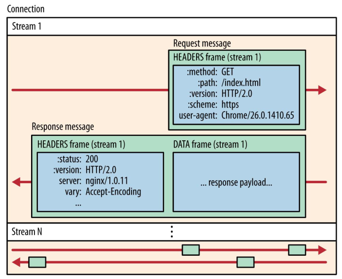

根据HTTP/2协议规范，通常来说，一个流（Stream）在它的生命周期内，通常只用于交换一对请求和响应消息。

1. 流由请求发起：客户端通过发送一个`HEADERS`帧（其中包含一个新的Stream ID）来开启一个流。
2. 流随响应结束：当服务器发送完响应消息后，通常会通过最后一个`DATA`帧或`HEADERS`帧设置`END_STREAM`标志位，来表示这个流的结束。此后，这个流ID就不能再被用于发送新的帧了。
3. 服务器可以在客户端尚未发起请求时，主动创建一个新的流（使用偶数号Stream ID），并向客户端“推送”一个响应消息。在这种情况下，这个流上只有响应消息，而没有对应的请求消息。

接收端读到任何一个帧（无论是HEADERS帧还是DATA帧），首先就是提取出这个流ID。接收端会为每一个活跃的流（Stream）维护一个独立的接收缓冲区。当收到一个帧时，就通过流ID找到它应该去的那个“专属文件夹”（缓冲区）。这样，即使来自Stream 1、Stream 2、Stream N的DATA帧在TCP连接上杂乱交错地到达，也能被准确地分拣到各自流的缓冲区里，互不干扰。这解决了不同流之间的顺序问题（即多路复用）。

虽然HTTP/2帧是交错传输的，但它们底层的TCP连接提供了可靠、有序的字节流传输。这意味着，发送端先发出的TCP报文段一定会先到达接收端。因此，属于同一个流的DATA帧，其到达接收端的顺序就是它们被发送的顺序。接收端只需要按照到达的先后顺序将它们放入该流的缓冲区即可，不需要额外的显式序号。这解决了同一个流内，多个DATA帧之间的顺序问题。

帧头中还包含一个8位的标志位字段。对于DATA帧，有一个至关重要的标志位叫做`END_STREAM`。当`END_STREAM = 0`时，表示“这个DATA帧后面还有同一条消息的后续DATA帧，消息还没结束”。当`END_STREAM = 1`时，表示“这是当前消息的最后一个DATA帧”。对于响应消息来说，这个标志位就意味着服务器已经发送完了所有的响应体数据。

这时，接收端就可以开始将缓冲区中该流的所有DATA帧的数据按顺序拼接起来，还原出完整的HTTP消息体（Message Body），并将其提交给上层的应用程序（如浏览器）。这解决了消息的边界问题，指明了组合的完成时刻。

这是HTTP/2的一个高级特性。客户端可以通过`PRIORITY`帧告诉服务器：“流B依赖于流A，请先处理A”。这允许浏览器指示服务器优先加载关键资源（如HTML、CSS），而非关键资源（如图片）可以稍后处理。