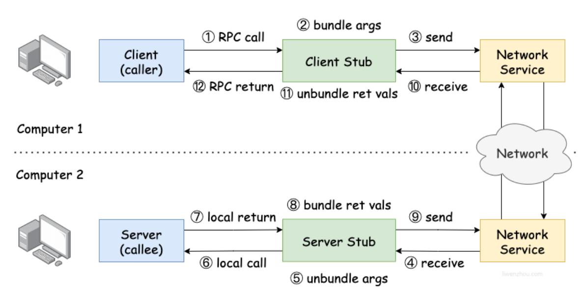

# 什么是RPC

RPC（Remote Procedure Call），即远程过程调用。它允许像调用本地服务一样调用远程服务。

RPC是一种服务器-客户端（Client/Server）模式，经典实现是一个通过发送请求-接受回应进行信息交互的系统。

要实现RPC就需要解决以下三个问题：

1. 如何确定要执行的函数？ 调用方和被调用方都需要维护一个{ function <-> ID }映射表，以确保调用正确的函数。
2. 如何表达参数？ 参数或返回值需要在传输期间序列化并转换成字节流，反之亦然。
3. 如何进行网络传输？ 函数的调用方和被调用方通常是通过网络连接的，也就是说，function ID 和序列化字节流需要通过网络传输，因此，只要能够完成传输，调用方和被调用方就不受某个网络协议的限制。例如，一些 RPC 框架使用 TCP 协议，一些使用 HTTP。

# net/rpc

## 基础RPC示例

Go语言的 rpc 包提供对通过网络导出对象方法的访问，服务器注册一个对象，并把它作为服务对外可见（服务名称就是类型名称）。注册后，对象的导出方法将支持远程访问。服务器可以注册不同类型的多个对象(服务) ，但是不支持注册同一类型的多个对象（可以结合下面的例子进行理解）。

在下面的代码中我们定义一个`ServiceA`类型，并为其定义了一个可导出的`Add`方法。

```go
// rpc demo/service.go

package main

type Args struct {
	X, Y int
}

// ServiceA 自定义一个结构体类型
type ServiceA struct{}

// Add 为ServiceA类型增加一个可导出的Add方法
func (s *ServiceA) Add(args *Args, reply *int) error {
	*reply = args.X + args.Y
	return nil
}
```

通过下面的代码将上面定义的`ServiceA`类型注册为一个服务，其Add方法就支持RPC调用了。

```go
// rpc demo/server.go

package main

import (
	"log"
	"net"
	"net/http"
	"net/rpc"
)

func main() {
	service := new(ServiceA)
	rpc.Register(service) // 注册RPC服务
	rpc.HandleHTTP()      // 基于HTTP协议
	l, e := net.Listen("tcp", ":9091")
	if e != nil {
		log.Fatal("listen error:", e)
	}
	http.Serve(l, nil)
}
```

此时，client 端便能看到一个拥有“Add”方法的“ServiceA”服务，想要调用这个服务需要使用下面的代码先连接到server端再执行远程调用。

```go
// rpc demo/client.go

package main

import (
	"fmt"
	"log"
	"net/rpc"
)

type Args struct {
	X, Y int
}

func main() {
	// 建立HTTP连接
	client, err := rpc.DialHTTP("tcp", "127.0.0.1:9091")
	if err != nil {
		log.Fatal("dialing:", err)
	}

	// 同步调用
	args := &Args{10, 20}
	var reply int
	err = client.Call("ServiceA.Add", args, &reply)
	if err != nil {
		log.Fatal("ServiceA.Add error:", err)
	}
	fmt.Printf("ServiceA.Add: %d+%d=%d\n", args.X, args.Y, reply)

	// 异步调用
	var reply2 int
	divCall := client.Go("ServiceA.Add", args, &reply2, nil)
	replyCall := <-divCall.Done // 接收调用结果
	fmt.Println(replyCall.Error)
	fmt.Println(reply2)
}
```

执行上述程序，查看 RPC 调用的结果。会看到如下输出结果：

```
ServiceA.Add: 10+20=30
<nil>
30
```

## 基于TCP协议的RPC

当然 rpc 包也支持直接使用 TCP 协议而不使用HTTP协议。server 端代码修改如下。

```go
// rpc_demo/server2.go

package main

import (
	"log"
	"net"
	"net/rpc"
)

func main() {
	service := new(ServiceA)
	rpc.Register(service) // 注册RPC服务
	l, e := net.Listen("tcp", ":9091")
	if e != nil {
		log.Fatal("listen error:", e)
	}
	for {
		conn, _ := l.Accept()
		rpc.ServeConn(conn)
	}
}
```

client 端代码修改如下。

```go
// rpc demo/client2.go

package main

import (
	"fmt"
	"log"
	"net/rpc"
)

func main() {
	// 建立TCP连接
	client, err := rpc.Dial("tcp", "127.0.0.1:9091")
	if err != nil {
		log.Fatal("dialing:", err)
	}

	// 同步调用
	args := &Args{10, 20}
	var reply int
	err = client.Call("ServiceA.Add", args, &reply)
	if err != nil {
		log.Fatal("ServiceA.Add error:", err)
	}
	fmt.Printf("ServiceA.Add: %d+%d=%d\n", args.X, args.Y, reply)

	// 异步调用
	var reply2 int
	divCall := client.Go("ServiceA.Add", args, &reply2, nil)
	replyCall := <-divCall.Done // 接收调用结果
	fmt.Println(replyCall.Error)
	fmt.Println(reply2)
}
```


## 使用JSON协议的RPC

rpc 包默认使用的是 gob 协议对传输数据进行序列化/反序列化，比较有局限性。下面的代码将尝试使用 JSON 协议对传输数据进行序列化与反序列化。

server 端代码修改如下。

```go
// rpc demo/server3.go

package main

import (
	"log"
	"net"
	"net/rpc"
	"net/rpc/jsonrpc"
)

func main() {
	service := new(ServiceA)
	rpc.Register(service) // 注册RPC服务
	l, e := net.Listen("tcp", ":9091")
	if e != nil {
		log.Fatal("listen error:", e)
	}
	for {
		conn, _ := l.Accept()
		// 使用JSON协议
		rpc.ServeCodec(jsonrpc.NewServerCodec(conn))
	}
}
```

# RPC原理


① 服务调用方（client）以本地调用方式调用服务；
② client stub接收到调用后负责将方法、参数等组装成能够进行网络传输的消息体；
③ client stub找到服务地址，并将消息发送到服务端；
④ server 端接收到消息；
⑤ server stub收到消息后进行解码；
⑥ server stub根据解码结果调用本地的服务；
⑦ 本地服务执行并将结果返回给server stub；
⑧ server stub将返回结果打包成能够进行网络传输的消息体；
⑨ 按地址将消息发送至调用方；
⑩ client 端接收到消息；
⑪ client stub收到消息并进行解码；
⑫ 调用方得到最终结果。

使用RPC框架的目标是只需要关心第1步和最后1步，中间的其他步骤统统封装起来，让使用者无需关心。例如社区中各式RPC框架（grpc、thrift等）就是为了让RPC调用更方便。