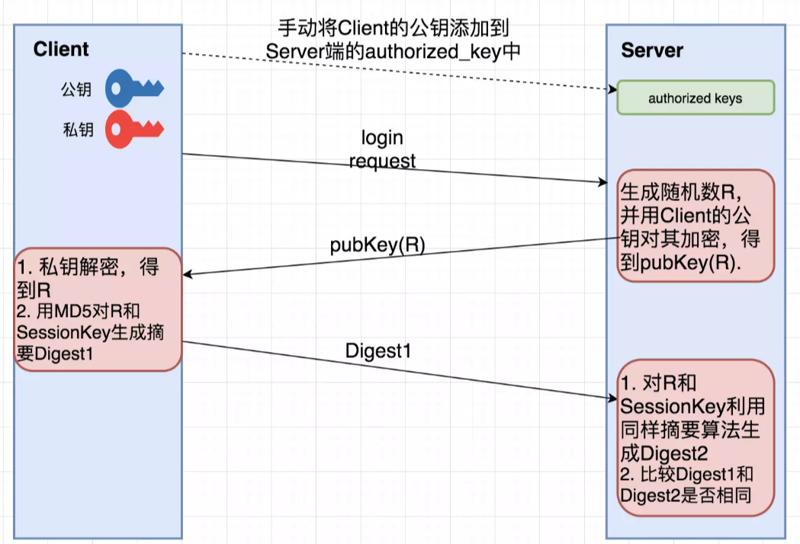

> 参考资料：https://blog.csdn.net/weixin_53049621/article/details/122428597

# 初见SSH

SSH（Secure Shell Protocol，安全的 Shell 协议），它可以通过数据包加密技术将等待传输的数据包加密后再传输到网络上。SSH 协议主要提供两个服务功能：

1. **远程连接使用 Shell 的服务器**：
   - 功能：允许用户通过网络远程登录到另一台计算机，并执行命令和操作，类似于传统的 Telnet 服务。
   - 安全性：与 Telnet 不同，SSH 使用加密技术（如 AES、3DES 等）来保护数据传输，防止数据在传输过程中被窃听或篡改。
   - 使用场景：管理员可以通过 SSH 远程管理服务器，开发人员可以远程调试代码，用户可以远程访问和控制他们的计算机。
2. **SFTP（Secure File Transfer Protocol）服务**：
   - 功能：提供了一种安全的文件传输服务，类似于 FTP（File Transfer Protocol），但比 FTP 更安全。
   - 安全性：SFTP 通过 SSH 协议进行数据传输，所有的数据（包括用户名、密码、文件内容等）都是加密的，确保了数据的机密性和完整性。
   - 使用场景：用户可以通过 SFTP 客户端上传和下载文件，管理员可以安全地备份和恢复文件，开发人员可以安全地传输代码和配置文件。

# SSH工作原理

在整个通讯过程中，为实现 SSH 的安全连接，服务端与客户端要经历如下五个阶段：

| 阶段                       | 描述                                                         |
| -------------------------- | ------------------------------------------------------------ |
| 版本号协商阶段             | SSH目前包括SSH1和SSH2两个版本，双方通过版本协商确定使用的版本 |
| 算法协商和会话密钥生成阶段 | SSH支持多种加密算法，双方根据本端和对端支持的算法，协商出最终使用的算法 |
| 认证阶段                   | SSH客户端向服务器端发起认证请求，服务器端对客户端进行认证    |
| 会话请求阶段               | 认证通过后，客户端向服务器端发送会话请求                     |
| 交互会话阶段               | 会话请求通过后，服务器端和客户端进行信息的交互               |

一、版本协商阶段

1. 服务器端打开端口22，等待客户端连接。
2. 客户端向服务器端发起 TCP 连接请求，TCP 连接建立后，服务器向客户端发送第一个报文，包括版本标志字符串，格式为`SSH-<主协议版本号>.<次协议版本号>.<软件版本号>`。
3. 客户端收到报文后，解析该数据包，如果服务器的协议版本号比自己的低，且客户端能支持服务器端的低版本，就使用服务器端的低版本协议号，否则使用自己的协议版本号。
4. 客户端回应服务器一个报文，包含了客户端决定使用的协议版本号。服务器比较客户端发来的版本号，决定是否能同客户端一起工作。如果协商成功，则进入密钥和算法协商阶段，否则服务器断开TCP连接。

说明：上述报文都是采用明文方式传输。

二、算法协商和会话密钥生成阶段

1. 服务器端和客户端分别发送算法协商报文给对端，报文中包含自己支持的公钥算法列表、加密算法列表、MAC（Message Authentication Code，消息验证码）算法列表、压缩算法列表等等。
2. 服务器端和客户端根据对端和本端支持的算法列表得出最终使用的算法。
3. 服务器端和客户端利用DH交换（Diffie-Hellman Exchange）算法、主机密钥对等参数，生成会话密钥和会话ID。

由此，服务器端和客户端就取得了相同的会话密钥和会话ID。对于后续传输的数据，两端都会使用会话密钥进行加密和解密，保证了数据传送的安全。

会话密钥的生成：

1. 客户端需要使用适当的客户端程序来请求连接服务器，服务器将服务器的公钥发送给客户端。（服务器的公钥产生过程：服务器每次启动 sshd 服务时，该服务会主动去找 `/etc/ssh/ssh_host_*` 文件，若系统刚装完没有这些文件，sshd 会去生成需要的公钥文件，同时也会计算出服务器自己所需要的私钥文件。）
2. 服务器生成会话ID，并将会话ID发给客户端。
3. 若客户端第一次连接到此服务器，则会将服务器的公钥数据记录到客户端的用户主目录内的`~/.ssh/known_hosts`。若是已经记录过该服务器的公钥数据，则客户端会去比对此次接收到的与之前的记录是否有差异。
4. 客户端生成会话密钥，并用服务器的公钥加密后，发送给服务器。
5. 服务器用自己的私钥将收到的数据解密，获得会话密钥。
6. 服务器和客户端都知道了会话密钥，以后的传输都将被会话密钥加密。

三、认证阶段

SSH提供两种认证方法：

1. 基于口令的认证（password 认证）：客户端向服务器发出 password 认证请求，将用户名和密码加密后发送给服务器，服务器将该信息解密后得到用户名和密码的明文，与设备上保存的用户名和密码进行比较，并返回认证成功或失败消息。
2. 基于密钥的认证（publickey 认证）：客户端产生一对非对称密钥，将公钥手动保存到将要登录的服务器上的那个账号的家目录的 `.ssh/authorized_keys` 文件中。
   认证阶段：客户端首先将公钥传给服务器端。服务器端收到公钥后会与本地该账号家目录下的 `authorized_keys `中的公钥进行对比，如果不相同，则认证失败；否则服务端生成一段随机字符串，并先后用客户端公钥和会话密钥对其加密，发送给客户端。客户端收到后，先后用会话密钥和客户端私钥进行解密，将解密后的随机字符串用会话密钥发送给服务器。如果发回的字符串与服务器端之前生成的一样，则认证通过，否则，认证失败。



四、会话请求阶段

1. 服务器等待客户端的请求；
2. 认证通过后，客户端向服务器发送会话请求；
3. 服务器处理客户端的请求。请求被成功处理后， 服务器会向客户端回应 SSH_SMSG_SUCCESS 包，SSH 进入交互会话阶段；否则回应 SSH_SMSG_FAILURE 包，表示服务器处理请求失败或者不能识别请求。

五、交互会话阶段

在这个模式下，数据被双向传送：

1. 客户端将要执行的命令加密后传给服务器;
2. 服务器接收到报文，解密后执行该命令，将执行的结果加密发还给客户端;
3. 客户端将接收到的结果解密后显示到终端上。

# SSH实践

1、基于口令的认证

在会话密钥的生成中，服务器的公钥会发送给客户端，问题就在于**如何对Server的公钥进行认证？**在 HTTPS 中可以通过 CA 来进行公证，可是 SSH 服务端的 **publish key** 和 **private key** 都是自己生成的，没法公证。只能通过 Client 端自己对公钥进行确认。通常在第一次登录的时候，系统会出现下面提示信息：

```
The authenticity of host 'ssh-server.example.com (12.18.429.21)' can't be established.
RSA key fingerprint is 98:2e:d7:e0:de:9f:ac:67:28:c2:42:2d:37:16:58:4d.
Are you sure you want to continue connecting (yes/no)?
```

上面的信息说的是：无法确认主机 `ssh-server.example.com (12.18.429.21)`的真实性，是否继续连接？

> 之所以用 fingerprint 代替 key，主要是 key 过于长（RSA算法生成的公钥有1024位），很难直接比较。所以，对公钥进行 hash 生成一个128位的指纹，这样就方便比较了。

如果输入**yes**后，会出现下面信息：

```
Warning: Permanently added 'ssh-server.example.com,12.18.429.21' (RSA) to the list of known hosts. 
Password: (enter password)
```

该 host 已被确认，并被追加到文件 **known_hosts** 中，然后就需要输入密码，进行基于口令的认证。


2、基于公钥认证

就是GitHub上面SSH Keys的设置

