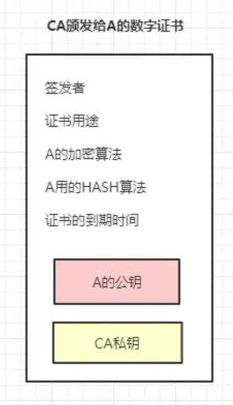
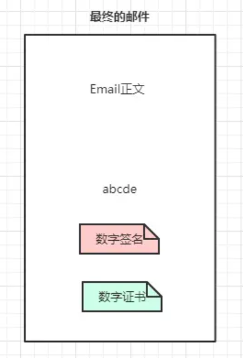

# 数字签名与数字证书

> 参考资料：https://www.jianshu.com/p/4932cb1499bf

## 非对称加密与对称加密

两种算法：对称加密和非对称加密。

- 对称加密：加密和解密的密钥一样，比如用 123 加密就是用 123 解密，但是实际中密码都是普通数据在互联网传输的，这样一点密码被中间人截取并破解，加密直接被攻破。

- 非对称加密：把密钥分为公钥和私钥，公钥是公开的所有人都可以认领，私钥是保密的只有一个人知道。假设A要发送一封 Email 给 B，他不想让任何其他人在传输中看到 Email 的内容，做法就是使用 B 的公钥对 Email 加密，只有 B 的私钥能够解密（ B 的私钥唯一性保证信件不会泄露）。

  某天出意外了，有黑客冒充 A 给 B 发送 Email，并且也用 B 的公钥加密，导致 B 无法区分这封邮件是否来自 A。怎么办？此时 A 可以用自己的私钥加密，那么 B 收到邮件后如果用 A 的公钥可以解密邮件，那么证明这封信肯定来自于 A。

OK，通过这个例子我想你们基本明白非对称加密了！我总结了下面几点：

- 公钥加密：对内容本身加密，保证不被其他人看到，因为只有私钥可以解密。
- 私钥加密：证明内容的来源，无法保证加密，因为公钥是公开的，所有人都可以用公钥来解密
- 公钥和私钥是配对关系，公钥加密就用私钥解密，反之亦然，用错的密钥来尝试解密会报错。

## 数字签名

接着聊上面发邮件的例子，假设 A 用自己的私钥对 Email 加密发送，这存在下面问题：

对文件本身加密可能是个耗时过程，比如这封 Email 足够大，那么私钥加密整个文件以及拿到文件后的解密无疑是巨大的开销。

数字签名可以解决这个问题：

1. A 先对这封 Email 执行哈希运算得到 hash 值简称“摘要”，取名 h1
2. 然后用自己私钥对摘要加密，生成的东西叫“数字签名”
3. 把数字签名加在 Email 正文后面，一起发送给 B（当然，为了防止邮件被窃听你可以用继续公钥加密，这个不属于数字签名范畴）
4. B 收到邮件后用 A 的公钥对数字签名解密，成功则代表 Email 确实来自 A，失败说明有人冒充
5. B 对邮件正文执行哈希运算得到 hash 值，取名 h2
6. B 会对比第4步解密的 hash 值 h1 和自己运算得到的 h2，一致则说明邮件未被篡改。

其实就是利用算法（不一定是非对称算法）对原文 hash 值加密，然后附着到原文的一段数据。数字签名的作用就是验证数据来源以及数据完整性！解密过程则称为数字签名验证。

 几点疑惑：

1. 如果中间人同时篡改了 Email 正文和数字签名，那 B 收到邮件无法察觉啊。
    答案：数字签名的生成需要 A 的私钥，所以数字签名很难被伪造。万一私钥泄漏了呢，不好意思，你私钥都能弄丢了那这篇文章当我白写。（私钥绝对保密不参与传输）
2. 公钥是公开的并且可以自行导入到电脑，如果有人比如 C 偷偷在 B 的电脑用自己公钥替换了 A 的公钥，然后用自己的私钥给 B 发送 Email，这时 B 收到邮件其实是被 C 冒充的但是他无法察觉。
    答案：确实存在这种情况！解决办法就是数字证书

## 数字证书

上面第 2 点描述的安全漏洞根源就是 A 的公钥很容易被替换！那么数字证书是怎么生成的呢？以及如何配合数字签名工作呢？

1. 首先 A 去找"证书中心"（certificate authority，简称 CA），为公钥做认证。证书中心用自己的私钥，对 A 的公钥和一些相关信息一起加密，生成"数字证书"（Digital Certificate）：

2. A 在邮件正文下方除了数字签名，另外加上这张数字证书

3. B 收到 Email 后用 CA 的公钥解密这份数字证书，拿到 A 的公钥，然后验证数字签名，后面流程就和图1的流程一样了，不再赘述。
   

几点疑惑：

- 假设数字证书被伪造了呢？
   答案：是的，传输中数字证书有可能被篡改。因此数字证书也是经过数字签名的，上文说到数字签名的作用就是验证数据来源以及数据完整性！B 收到邮件后可以先验证这份数字证书的可靠性，通过后再验证数字签名。
- 要是有1万个人要给 B 发邮件，难道 B 要保存1万份不同的 CA 公钥吗？
   答案：不需要，CA 认证中心给可以给 B 一份“根证书”，里面存储 CA 公钥来验证所有 CA 分中心颁发的数字证书。CA 中心是分叉树结构，类似于公安部->省公安厅->市级派出所，不管 A 从哪个 CA 分支机构申请的证书，B 只要预存根证书就可以验证下级证书可靠性。
- 如何验证根证书可靠性？
   答案：无法验证。根证书是自验证证书，CA 机构是获得社会绝对认可和有绝对权威的第三方机构，这一点保证了根证书的绝对可靠。如果根证书都有问题那么整个加密体系毫无意义

## 下载文件举例

看下我之前从网上下载的`Chrome.exe`，右键属性，通过鼠标点击一步验证：

Google Inc 就是 google 从 CA 中心申请的数字证书。这样看来，这个软件确实来源于 google 官方，并且文件完整。接下来我干点坏事，用 notepad 打开这个 exe 文件并且篡改里面的内容（修改二进制数据，09 改为33），保存：

再看下数字签名还正常吗？

文件被篡改导致数字签名无效，数字证书没有问题。

# 证书签发和验证

> 参考资料：https://www.jianshu.com/p/46e48bc517d0

签发证书的步骤：

1. Signing阶段，首先撰写证书的元信息：签发人(Issuer)、地址、签发时间、过期失效等；当然，这些信息中还包含证书持有者(owner)的基本信息，例如owner的DN(DNS Name，即证书生效的域名)，owner的公钥等基本信息。
2. 通过通用的Hash算法将信息摘要提取出来；
3. Hash摘要通过Issuer(CA)私钥进行非对称加密，生成一个签名密文；
4. 将签名密文attach到文件证书上，使之变成一个签名过的证书。

验证证书的步骤：

1. Verification阶段，浏览器获得之前签发的证书；
2. 将其解压后分别获得“元数据”和“签名密文”；
3. 将同样的Hash算法应用到“元数据”获取摘要；
4. 将密文通过Issuer(CA)的公钥（非对称算法，私钥加密，公钥解密）解密获得同样的摘要值。
5. 比对两个摘要，如果匹配，则说明这个证书是被CA验证过合法证书，里面的公钥等信息是可信的。

在Verification阶段，解密Signature获得摘要需要通过签发者(Issuer)的公钥，又该如何获得这个公钥，同时确保这个公钥是有效的呢？就是下面的证书链的内容。

# 证书链

# 自签名证书

