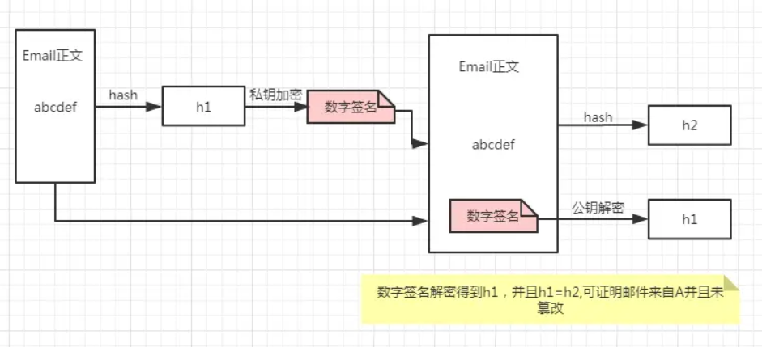
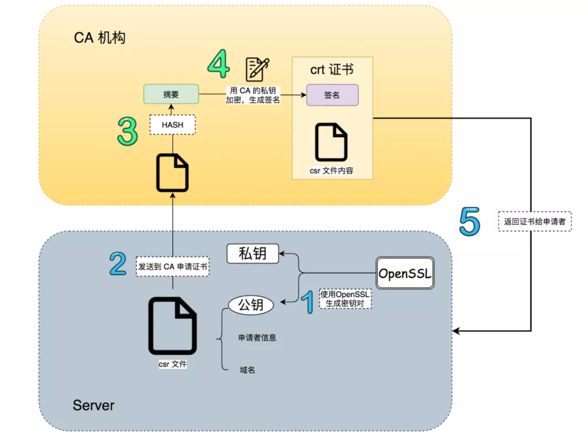
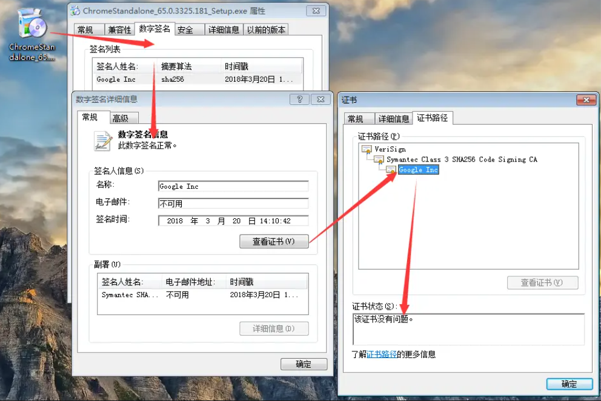
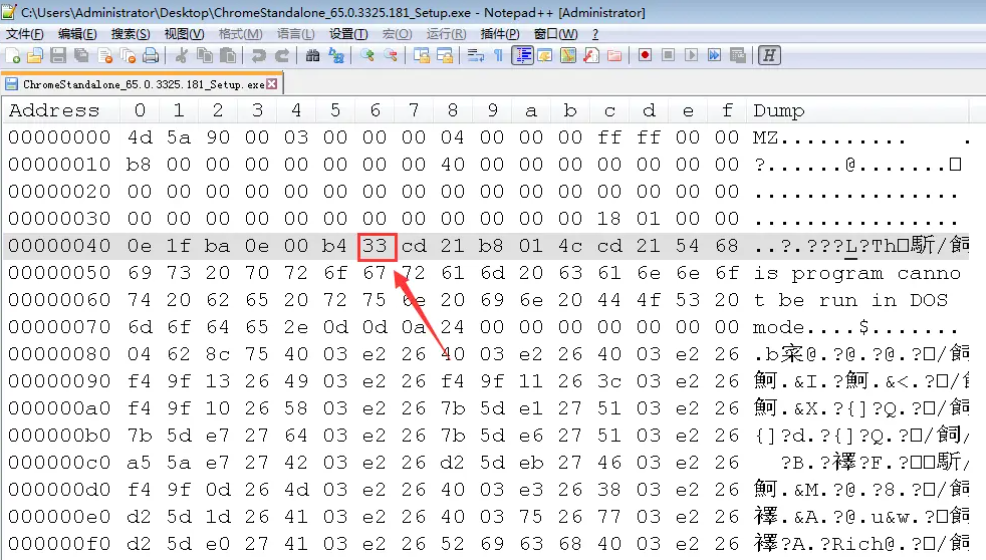
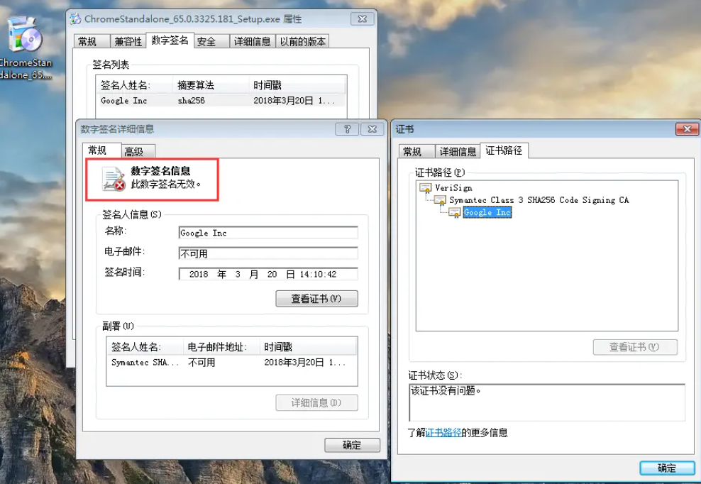
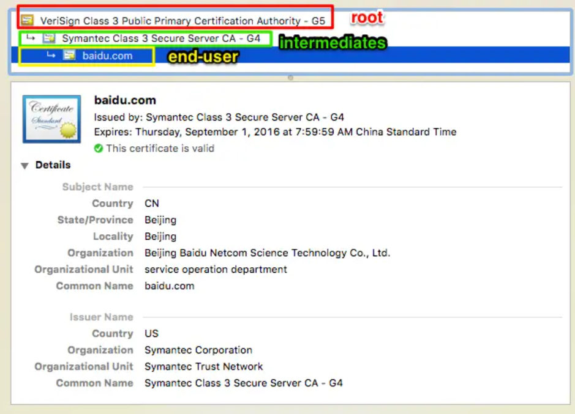
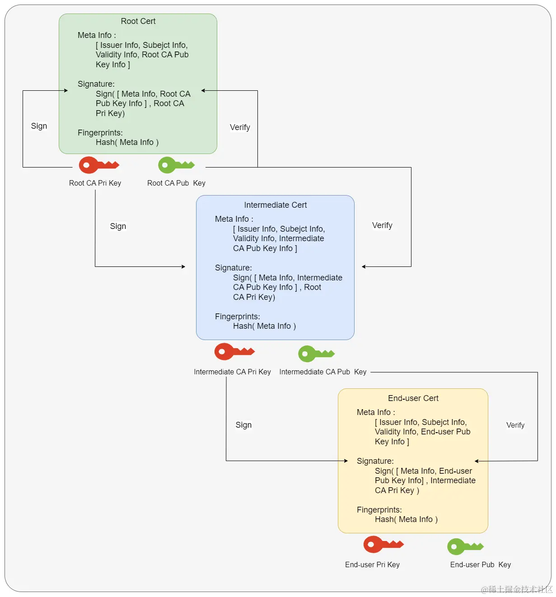

# 数字签名与数字证书

> 参考资料：https://www.jianshu.com/p/4932cb1499bf

## 非对称加密与对称加密

两种算法：对称加密和非对称加密。

对称加密：加密和解密的密钥一样，比如用 123 加密就是用 123 解密，但是实际中密码都是普通数据在互联网传输的，这样一旦密码被中间人截取并破解，加密直接被攻破。常见的对称加密算法有AES、DES、RC4，其中最常用的是AES。对称加密的优点是：速度快。

非对称加密：把密钥分为公钥和私钥，公钥是公开的所有人都可以认领，私钥是保密的只有一个人知道。典型的非对称加密算法有 RSA 。非对称加密的优点，就是安全系数特别高；缺点就是速度会慢一些。

假设A要发送一封 Email 给 B，他不想让任何其他人在传输中看到 Email 的内容，做法就是使用 B 的公钥对 Email 加密，只有 B 的私钥能够解密（ B 的私钥唯一性保证信件不会泄露）。

某天出意外了，有黑客冒充 A 给 B 发送 Email，并且也用 B 的公钥加密，导致 B 无法区分这封邮件是否来自 A。怎么办？此时 A 可以用自己的私钥加密，那么 B 收到邮件后如果用 A 的公钥可以解密邮件，那么证明这封信肯定来自于 A。

OK，通过这个例子我想你们基本明白非对称加密了！我总结了下面几点：

- 公钥加密：对内容本身加密，保证不被其他人看到，因为只有私钥可以解密。
- 私钥加密：证明内容的来源，无法保证加密，因为公钥是公开的，所有人都可以用公钥来解密
- 公钥和私钥是配对关系，公钥加密就用私钥解密，反之亦然，用错的密钥来尝试解密会报错。

## 摘要

一段信息，经过摘要算法得到一串哈希值，就是摘要(digest)。常见的摘要算法有 MD5、SHA1、SHA256、SHA512等。

关于摘要，有几点需要你明白的：

- 摘要算法，是把任意长度的信息，映射成一个定长的字符串。
- 摘要算法，两个不同的信息，是有可能算出同一个摘要值的。
- 摘要算法与加密算法不同，不存在解密的过程。
- 摘要算法不用于数据的保密，而是用于数据的完整性校验。

## 数字签名

接着聊上面发邮件的例子，假设 A 用自己的私钥对 Email 加密发送，这存在下面问题：

对文件本身加密可能是个耗时过程，比如这封 Email 足够大，那么私钥加密整个文件以及拿到文件后的解密无疑是巨大的开销。

数字签名可以解决这个问题：

1. A 先对这封 Email 执行哈希运算得到 hash 值简称“摘要”，取名 h1
2. 然后用自己私钥对摘要加密，生成的东西叫“数字签名”
3. 把数字签名加在 Email 正文后面，一起发送给 B（当然，为了防止邮件被窃听你可以用继续公钥加密，这个不属于数字签名范畴）
4. B 收到邮件后用 A 的公钥对数字签名解密，成功则代表 Email 确实来自 A，失败说明有人冒充
5. B 对邮件正文执行哈希运算得到 hash 值，取名 h2
6. B 会对比第4步解密的 hash 值 h1 和自己运算得到的 h2，一致则说明邮件未被篡改。

其实就是利用算法（不一定是非对称算法）对原文 hash 值加密，然后附着到原文的一段数据。数字签名的作用就是验证数据来源以及数据完整性！解密过程则称为数字签名验证。

 几点疑惑：

1. 如果中间人同时篡改了 Email 正文和数字签名，那 B 收到邮件无法察觉啊。
    答案：数字签名的生成需要 A 的私钥，所以数字签名很难被伪造。万一私钥泄漏了呢，不好意思，你私钥都能弄丢了那这篇文章当我白写。（私钥绝对保密不参与传输）
2. 公钥是公开的并且可以自行导入到电脑，如果有人比如 C 偷偷在 B 的电脑用自己公钥替换了 A 的公钥，然后用自己的私钥给 B 发送 Email，这时 B 收到邮件其实是被 C 冒充的但是他无法察觉。
    答案：确实存在这种情况！解决办法就是数字证书

## 数字证书

上面第 2 点描述的安全漏洞根源就是 A 的公钥很容易被替换！要理解数字证书，需要搞懂下面几个问题。

- 数字证书是什么东西？其实它就是一个 `.crt` 文件
- 数字证书是谁颁发的？由权威证书认证机构颁发，一般我们简称为 CA 机构
- 数字证书如何申请的?或者说如何颁发的?

为了让你理解这一过程，我画了下面这张图：

- 在自己的服务器上生成一对公钥和私钥。然后将域名、申请者、公钥（注意不是私钥，私钥是无论如何也不能泄露的）等其他信息整合在一起，生成 `.csr` 文件。
- 将这个 `.csr` 文件发给 CA 机构，CA 机构收到申请后，会通过各种手段验证申请者的组织信息和个人信息，如无异常（组织存在，企业合法，确实是域名的拥有者），CA 就会使用散列算法对 `.csr` 里的明文信息先做一个HASH，得到一个信息摘要，再用 CA 自己的私钥对这个信息摘要进行加密，生成一串密文，密文即是所说的 签名。签名 + .csr 明文信息，即是 证书。CA 把这个证书返回给申请人。

疑惑：

- 要是有1万个人要给 B 发邮件，难道 B 要保存1万份不同的 CA 公钥吗？
   答案：不需要，CA 认证中心给可以给 B 一份“根证书”，里面存储 CA 公钥来验证所有 CA 分中心颁发的数字证书。CA 中心是分叉树结构，类似于公安部->省公安厅->市级派出所，不管 A 从哪个 CA 分支机构申请的证书，B 只要预存根证书就可以验证下级证书可靠性。
- 如何验证根证书可靠性？
   答案：无法验证。根证书是自验证证书，CA 机构是获得社会绝对认可和有绝对权威的第三方机构，这一点保证了根证书的绝对可靠。如果根证书都有问题那么整个加密体系毫无意义

## 下载文件举例

看下我之前从网上下载的`Chrome.exe`，右键属性，通过鼠标点击一步验证：

Google Inc 就是 google 从 CA 中心申请的数字证书。这样看来，这个软件确实来源于 google 官方，并且文件完整。接下来我干点坏事，用 notepad 打开这个 exe 文件并且篡改里面的内容（修改二进制数据，09 改为33），保存：

再看下数字签名还正常吗？

文件被篡改导致数字签名无效，数字证书没有问题。

# 数字证书

在HTTPS的传输过程中，有一个非常关键的角色——数字证书，有什么作用呢？

所谓数字证书，是一种用于电脑的身份识别机制。由数字证书颁发机构（CA）对使用私钥创建的签名请求文件做的签名（盖章），表示 CA 机构对证书持有者的认可。

(1) 数字证书拥有以下几个优点

- 使用数字证书能够提高用户的信任度;
- 数字证书中的公钥，能够与服务端的私钥配对使用，实现数据传输过程中的加密和解密;

(2) 证书类型

x509的证书编码格式有两种：

PEM(Privacy-enhanced Electronic Mail)是明文格式的,以 -----BEGIN CERTIFICATE-----开头，以-----END CERTIFICATE-----结尾。中间是经过base64编码的内容,apache需要的证书就是这类编码的证书.查看这类证书的信息的命令为: openssl x509 -noout -text -in server.pem。其实PEM就是把DER的内容进行了一次base64编码

DER是二进制格式的证书，查看这类证书的信息的命令为: openssl x509 -noout -text -inform der -in server.der

(3) 扩展名

- .crt证书文件,可以是DER(二进制)编码的，也可以是PEM(ASCII (Base64))编码的),在类unix系统中比较常见;
- .cer也是证书，常见于Windows系统。编码类型同样可以是DER或者PEM的，windows下有工具可以转换crt到cer;
- .csr证书签名请求文件，一般是生成请求以后发送给CA，然后CA会给您签名并发回证书
- .key一般公钥或者密钥都会用这种扩展名，可以是DER编码的或者是PEM编码的。查看DER编码的(公钥或者密钥)的文件的命令为: openssl rsa -inform DER -noout -text -in xxx.key。查看PEM编码的(公钥或者密钥)的文件的命令为: openssl rsa -inform PEM -noout -text -in xxx.key;
- .p12证书文件,包含一个X509证书和一个被密码保护的私钥

(4) 证书的种类

安全证书主要分为DV、OV和EV三个种类，对应的安全等级为一般、较好和最高三个等级。三者的审核过程、审核标准和对应的域名数量也不同，所以价格在一两百元到几万元不等。

DV SSL：

DV SSL证书是只验证网站域名所有权的简易型(Class 1级)SSL证书，可10分钟快速颁发，能起到加密传输的作用，但无法向用户证明网站的真实身份。

目前市面上的免费证书都是这个类型的，只是提供了对数据的加密，但是对提供证书的个人和机构的身份不做验证。

OV SSL：

OV SSL,提供加密功能,对申请者做严格的身份审核验证,提供可信×××明。

和DV SSL的区别在于，OV SSL 提供了对个人或者机构的审核，能确认对方的身份，安全性更高。

所以这部分的证书申请是收费的~

EV SSL：

超安=EV=最安全、最严格 超安EV SSL证书遵循全球统一的严格身份验证标准，是目前业界安全级别最高的顶级 (Class 4级)SSL证书。

金融证券、银行、第三方支付、网上商城等，重点强调网站安全、企业可信形象的网站，涉及交易支付、客户隐私信息和账号密码的传输。

这部分的验证要求最高，申请费用也是最贵的。

选择签发机构时，最好选择行业认可的全球范围内都可以使用的ca机构签发的证书。目前我们国内的证书能够符合标准的还不是特别多，主要原因是有一些证书不能够被国外的浏览器所认可，在使用的时候需要进行一定的额外操作。

根据保护域名的数量，SSL证书又分为：

- 单域名版：只保护一个域名，例如 www.abc.com 或者 login.abc.com 之类的单个域名
- 多域名版：一张证书可以保护多个域名，例如同时保护 www.abc.com , www.bcd.com, pay.efg.com 等
- 通配符版：一张证书保护同一个主域名下同一级的所有子域名，不限个数，形如 *.abc.com 。注意，通配符版只有 DVSSL 和 OVSSL 具有， EVSSL 不具有通配符版本。

(5) 证书在哪里

当你在下载并安装浏览器时，浏览器内部其实已经内嵌了全世界公认的根证书颁发机构的证书。

若一个网站的数字证书的证书颁发机构在浏览器中没有，则需要引导用户自行导入。

如果你想在 Chrome 中查看有哪些受信任的证书颁发机构，可以点击 设置 -> 隐私设置与安全性 -> 安全 -> 管理证书

(6) 证书里的信息

在上图的位置里，随便双击点开一个证书，就可以查看证书里的内容。

内容非常多，最主要的有

- 证书是哪个机构的?
- 证书里的公钥是什么?
- 证书有效期是什么时候?
- 采用的哪种加解密的算法?

(7) 证书吊销

证书是有生命周期的，如果证书的私钥泄漏了那这个证书就得吊销，一般有两种吊销方式：CRL和OCSP。

CRL( Certificate Revocation List)是CA机构维护的一个已经被吊销的证书序列号列表，浏览器需要定时更新这个列表，浏览器在验证证书合法性的时候也会在证书吊销列表中查询是否已经被吊销，如果被吊销了那这个证书也是不可信的。可以看出，这个列表随着被吊销证书的增加而增加，列表会越来越大，浏览器还需要定时更新，实时性也比较差。

所以，后来就有了 OCSP (Online Certificate Status Protocol)在线证书状态协议，这个协议就是解决了 CRL 列表越来越大和实时性差的问题而生的。有了这个协议，浏览器就可以不用定期更新CRL了，在验证证书的时候直接去CA服务器实时校验一下证书有没有被吊销就可以，是解决了CRL的问题，但是每次都要去CA服务器上校验也会很慢，在网络环境较差的时候或者跨国访问的时候，体验就非常差了，OCSP虽然解决了CRL的问题但是性能却很差。

# 证书链

## 示例

在 Chrome 上任意打开一个支持 HTTPS 的网站，例如 [https://www.baidu.com/](https://link.jianshu.com?t=https://www.baidu.com/) ，我们会发现在地址栏的左侧有个绿色的小锁，点击这个小锁，然后就可以查看这个网站的证书信息，打开baidu，查看证书信息如下：

这个时候我们应该想到之前举的例子，下载的文件也可以通过数字签名和数字证书来验证完整性和来源。那么我们通过浏览器访问的所有网页也应该可以通过数字签名和数字证书保证完整性和来源，所以他们是相通的。

## 证书内容

为了说明证书链，我们先来看看证书的组成内容，一般证书由这几个部分构成：

1. Issuer ：也就是这个证书是由谁签发的，里面包含了 CA 的相关信息，如下：
   - Common Name (CN)：CA 的通用名称。
   - Organization (O)：CA 所属的组织。
   - Organizational Unit (OU)：CA 组织内的部门或单位。
   - Country (C)：CA 所在的国家。
   - State or Province (ST)：CA 所在的州或省。
   - Locality (L)：CA 所在的城市或地区。
2. Subject ：证书的持有者信息，即证书颁发给的对象。里面包括了证书持有者的相关信息，和 Issuer 相同
3. Validity ：证书的有效时间范围，通常包含两部分：NotBefore（有效期的最早时间点）和 NotAfter（有效期的最晚时间点）
4. Subject Public Key Info ：公钥信息包括签名算法（Public Key Algorithm）和公钥（Public Key），用于当前证书签发的下一级证书验签。当前的证书私钥签发下一级证书，下一级用当前证书的公钥进行验签， 所以当前的证书公钥需要在证书里面体现出来，下面一级的证书才能被验签。
5. Signature ：证书签名，用当前证书的CA私钥对当前证书的主体信息进行签名。可以用当前证书的CA公钥对当前证书的 Signature 进行验签。
6. Fingerprints ：证书指纹是证书所有信息（除了当前证书的私钥）的哈希值，确保当前证书的内容没有被篡改。这里注意区分 Signature 和 Fingerprints，Signature 关注点在于确保当前证书确实是由指定的 CA 签发的，并且证书的内容没有被篡改，而 Fingerprints 的关注点在于确保当前证书没有被篡改，指纹可以用于快速验证证书的完整性，而不需要进行完整的签名验证。

## 证书链过程

特别注意，每一级证书私钥并不是放在证书里面的，而是有一个单独的私钥文件，当前这一级的私钥用于签发下一级证书，不对外公开。私钥应该由当前的CA严格保管，不能外泄！！！

# 自签名证书

## 文件格式

在制作自签名证书的过程中会涉及到几个不同类型的证书文件，这里统一说明以下，防止被绕晕了：

- `.pem` ：采用 `PEM` 编码格式的 `X.509` 证书的文件扩展名，全称是 `Privacy-enhanced Electronic Mail`，是明文格式的内容，以 `-----BEGIN CERTIFICATE-----` 开头，以 `-----END CERTIFICATE-----` 结尾，中间是经过 `base64`编码的内容，查看这类证书信息的命令为 `openssl x509 -noout -text -in xx.pem`。
- `.der` ：是二进制编码的证书，查看这类证书信息的命令为 `openssl x509 -noout -text -inform der -in xx.der`。
- `.crt` ：即 `certificate` 的缩写，证书文件 ，常见于类 UNIX 系统，可以是 DER（二进制）编码的，也可以是PEM（ ASCII (Base64) ）编码的 ，但绝大多数情况下此格式证书都是采用 PEM 编码。
- .`cer` ：也是 `certificate` 的缩写，常见于 Windows 系统，编码类型同样可以是 DER 或者 PEM 的，但绝大多数情况下此格式证书都是采用 DER 编码。
- `.csr` ：`Certificate Signing Request` 的缩写，即证书签名请求，它并不是证书的格式，而是用于向权威证书颁发机构（`Certificate Authority，CA`）获得签名证书的申请，一般是生成请求以后发送给 CA，然后 CA 会给你签名并发回证书。其核心内容包含一个 RSA 公钥和其他附带信息，在生成这个 `.csr` 申请的时候，同时也会生成一个配对 RSA 私钥，私钥通常需要严格保存于服务端，不能外泄。
- `.key` ：一般公钥或者密钥都会用这种扩展名，可以是 DER 编码的或者是 PEM 编码的，查看 DER 编码的（公钥或者密钥）的文件的命令为 `openssl rsa -inform DER -noout -text -in xxx.key`；查看 PEM 编码的（公钥或者密钥）的文件的命令为 `openssl rsa -inform PEM -noout -text -in xxx.key`。
- `.p12` ：也写作 `.pfx`，是公钥加密标准（`Public Key Cryptography Standards，PKCS`）系列的一种，它定义了描述个人信息交换语法（`Personal Information Exchange Syntax`）的标准，可以用来将包含了公钥的 `X.509` 证书和证书对应的私钥以及其他相关信息打包，进行交换。简单理解：一份 `.p12` 文件 = `X.509` 证书 + 私钥；
- `.cnf` ：这种文件一般是各种软件程序使用的配置文件，用于保存软件参数、用户设定以及各种配置选项，通常以纯文本格式保存，这里通常是 OpenSSL 的配置文件。

## OpenSSL

OpenSSL是一个开放源代码的软件包，应用程序可以使用这个包来进行安全通信，避免窃听，同时确认另一端连接者的身份。其主要库是以 C 语言所写成，实现了基本的加密功能，实现了 `SSL/TLS` 协议。

OpenSSL 非常强大，据说支持四百多个命令，而且像 Mac、Linux 的很多版本都是内置了 OpenSSL，在自建 CA 时我们可以使用到 OpenSSL 的以下功能：

- 生成和管理公钥、私钥以及相关生成参数。
- 使用公钥和私钥来加密、解密、签名、验证。
- 管理证书（X.509格式）认证请求和证书吊销。
- 计算摘要（hash），支持各种摘要算法。
- 使用各种加密方法（cipher）加密，解密。
- 测试 SSL 和 TLS 连接。
- 生成、验证时间戳。

### 加密

先说一下 OpenSSL 支持的加密算法。

**对称加密算法**

OpenSSL一共提供了 8 种对称加密算法，其中 7 种是分组加密算法，仅有的一种流加密算法是RC4。这 7 种分组加密算法分别是AES、DES、Blowfish、CAST、IDEA、RC2、RC5，都支持电子密码本模式（ECB）、加密分组链接模式（CBC）、加密反馈模式（CFB）和输出反馈模式（OFB）四种常用的分组密码加密模式。其中，AES使用的加密反馈模式（CFB）和输出反馈模式（OFB）分组长度是128位，其它算法使用的则是64位。事实上，DES算法里面不仅仅是常用的DES算法，还支持三个密钥和两个密钥 3DES 算法。

**非对称加密算法**

OpenSSL一共实现了4种非对称加密算法，包括DH算法、RSA算法、DSA算法和椭圆曲线算法（EC）。DH算法一般用于密钥交换。RSA算法既可以用于密钥交换，也可以用于数字签名，当然，如果你能够忍受其缓慢的速度，那么也可以用于数据加密。DSA算法则一般只用于数字签名。

### Hash

OpenSSL实现了 5 种哈希算法，分别是 MD2、MD5、MDC2、SHA（SHA1）和 RIPEMD。SHA 算法事实上包括了SHA 和 SHA1 两种哈希算法，此外，OpenSSL 还实现了 DSS 标准中规定的两种哈希算法 DSS 和 DSS1。

哈希一般有两个作用：1）做信息完整性校验；2）保存密码；有些密码是直接在数据库中采用 `MD5(真实密码值)` 保存的，有的还进行加盐处理，使其难以破解，这样密码只能重置，因为哈希是不可逆的。