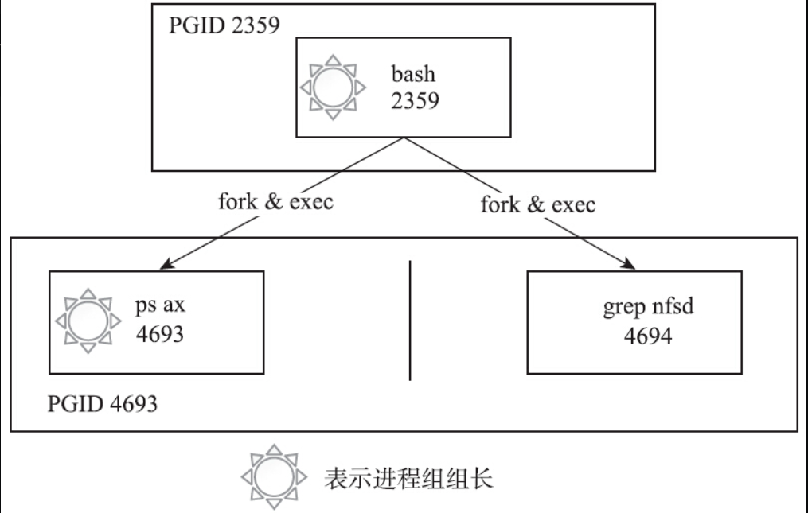
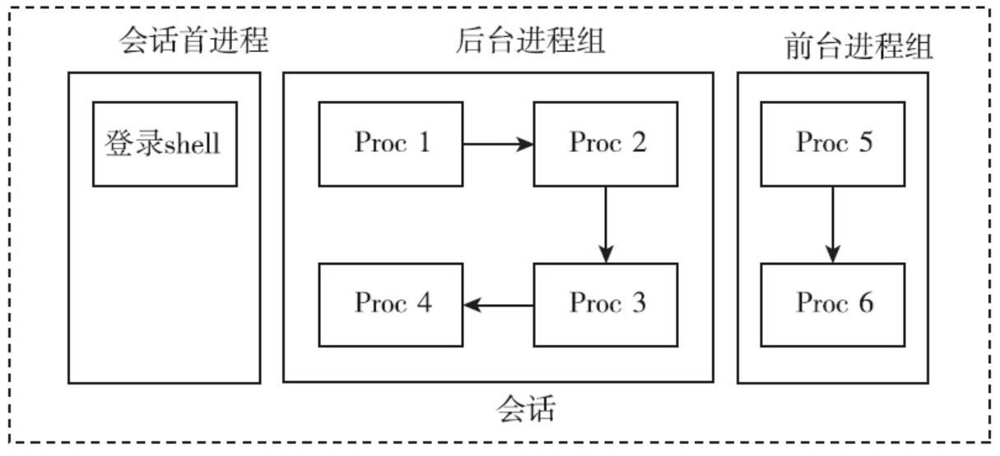
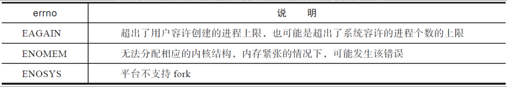

# 进程控制：进程的一生

进程是操作系统的一个核心概念。每个进程都有自己唯一的标识：进程ID，也有自己的生命周期。

## 进程ID

Linux下每个进程都会有一个非负整数表示的唯一进程ID，简称pid。Linux提供了getpid函数来获取进程的pid，同时还提供了getppid函数来获取父进程的pid，相关接口定义如下：

```c
#include <sys/types.h>
#include <unistd.h>
pid_t getpid(void);
pid_t getppid(void);
```

每个进程都有自己的父进程，父进程又会有自己的父进程，最终都会追溯到1号进程即init进程。这就决定了操作系统上所有的进程必然会组成树状结构，就像一个家族的家谱一样。可以通过pstree的命令来查看进程的家族树。

procfs文件系统会在/proc下为每个进程创建一个目录，名字是该进程的pid。目录下有很多文件，用于记录进程的运行情况和统计信息等，如下所示：

```shell
root@LVS-OPS-172-22-175-192:/proc# ll /proc
total 4
dr-xr-xr-x 230 root             root                           0 Sep  4  2023 ./
drwxr-xr-x  20 root             root                        4096 Mar  6 14:59 ../
dr-xr-xr-x   9 root             root                           0 Sep  4  2023 1/
dr-xr-xr-x   9 root             root                           0 Apr 26 14:05 10/
dr-xr-xr-x   9 root             root                           0 Apr 26 14:05 1016/
dr-xr-xr-x   9 root             root                           0 Apr 26 14:05 102/
dr-xr-xr-x   9 root             root                           0 Apr 26 14:05 103/
dr-xr-xr-x   9 root             root                           0 Apr 26 14:05 105/
...
```

因为进程有创建，也有终止，所以/proc/下记录进程信息的目录（以及目录下的文件）也会发生变化。

操作系统必须保证在任意时刻都不能出现两个进程有相同pid的情况。虽然进程ID是唯一的，但是进程ID可以重用。进程退出以后，其进程ID还可以再次分配给其他的进程使用。那么问题就来了，内核是如何分配进程ID的？

Linux分配进程ID的算法不同于给进程分配文件描述符的最小可用算法，它采用了延迟重用的算法，即分配给新创建进程的ID尽量不与最近终止进程的ID重复，这样就可以防止将新创建的进程误判为使用相同进程ID的已经退出的进程。

那么如何实现延迟重用呢？内核采用的方法如下：

1）位图记录进程ID的分配情况（0为可用，1为已占用）。
2）将上次分配的进程ID记录到last_pid中，分配进程ID时，从last_pid+1开始找起，从位图中寻找可用的ID。
3）如果找到位图集合的最后一位仍不可用，则回滚到位图集合的起始位置，从头开始找。

既然是位图记录进程ID的分配情况，那么位图的大小就必须要考虑周全。位图的大小直接决定了系统允许同时存在的进程的最大个数，这个最大个数在系统中称为pid_max。

上面的第3步提到，回绕到位图集合的起始位置，从头寻找可用的进程ID。事实上，严格说来，这种说法并不正确，回绕时并不是从0开始找起，而是从300开始找起。内核在 kernel/pid.c 文件中定义了RESERVED_PIDS，其值是300，300以下的pid会被系统占用，而不能分配给用户进程：

```c
define RESERVED_PIDS       300
int pid_max = PID_MAX_DEFAULT;
```

Linux系统下可以通过 procfs 或 sysctl 命令来查看pid_max的值：

```shell
manu@manu-rush:~$ cat /proc/sys/kernel/pid_max
131072
manu@manu-rush:~$ sysctl kernel.pid_max
kernel.pid_max = 131072
```

其实，此上限值是可以调整的，系统管理员可以通过如下方法来修改此上限值：

```shell
root@manu-rush:~# sysctl -w kernel.pid_max=4194304
kernel.pid_max = 4194304
```

但是内核自己也设置了硬上限，如果尝试将pid_max的值设成一个大于硬上限的值就会失败，如下所示：

```shell
root@manu-rush:~# sysctl -w kernel.pid_max=4194305
error: "Invalid argument" setting key "kernel.pid_max"
```

从上面的操作可以看出，Linux系统将系统进程数的硬上限设置为4194304（4M）。内核又是如何决定系统进程个数的硬上限的呢？对此，内核定义了如下的宏：

```c
#define PID_MAX_LIMIT (CONFIG_BASE_SMALL ? PAGE_SIZE * 8 : \
    (sizeof(long) > 4 ? 4 * 1024 * 1024 :PID_MAX_DEFAULT))
```

从上面代码中可以看出决定系统进程个数硬上限的逻辑为：

- 如果选择了CONFIG_BASE_SMALL编译选项，则为页面（PAGE_SIZE）的位数。
- 如果选择了CONFIG_BASE_FULL编译选项，那么：

  - 对于32位系统，系统进程个数硬上限为32768（即32K）。
  - 对于64位系统，系统进程个数硬上限为4194304（即4M）。

通过上面的讨论可以看出，在64位系统中，系统容许创建的进程的个数超过了400万，这个数字是相当庞大的，足够应用层使用。

对于单线程的程序，进程ID比较好理解，就是唯一标识进程的数字。对于多线程的程序，每一个线程调用getpid函数，其返回值都是一样的，即进程的ID。

## 进程的层次

每个进程都有父进程，父进程也有父进程，这就形成了一个以 init 进程为根的家族树。除此以外，进程还有其他层次关系：进程、进程组和会话。

进程组和会话在进程之间形成了两级的层次：进程组是一组相关进程的集合，会话是一组相关进程组的集合。用人来打比方，会话如同一个公司，进程组如同公司里的部门，进程则如同部门里的员工。尽管每个员工都有父亲，但是不影响员工同时属于某个公司中的某个部门。

这样说来，一个进程会有如下ID：

- PID：进程的唯一标识。对于多线程的进程而言，所有线程调用getpid函数会返回相同的值。
- PGID：进程组ID。每个进程都会有进程组ID，表示该进程所属的进程组。默认情况下新创建的进程会继承父进程的进程组ID。
- SID：会话ID。每个进程也都有会话ID。默认情况下，新创建的进程会继承父进程的会话ID。

可以调用如下指令来查看所有进程的层次关系：

```shell
ps -ejH
ps axjf
```

对于进程而言，可以通过如下函数调用来获取其进程组ID和会话ID。

```c
#include <unistd.h>
pid_t getpgrp(void);
pid_t getsid(pid_t pid);
```

前面提到过，新进程默认继承父进程的进程组ID和会话ID，如果都是默认情况的话，那么追根溯源可知，所有的进程应该有共同的进程组ID和会话ID。但是调用 `ps axjf` 可以看到，实际情况并非如此，系统中存在很多不同的会话，每个会话下也有不同的进程组。

为何会如此呢？

就像家族企业一样，如果从创业之初，所有家族成员都墨守成规，循规蹈矩，默认情况下，就只会有一个公司、一个部门。但是也有些“叛逆”的子弟，愿意为家族公司开疆拓土，愿意成立新的部门。这些新的部门就是新创建的进程组。如果有子弟“离经叛道”，甚至不愿意呆在家族公司里，他别开天地，另创了一个公司，那这个新公司就是新创建的会话组。由此可见，系统必须要有改变和设置进程组ID和会话ID的函数接口，否则，系统中只会存在一个会话、一个进程组。

进程组和会话是为了支持shell作业控制而引入的概念。当有新的用户登录Linux时，登录进程会为这个用户创建一个会话。用户的登录shell就是会话的首进程。会话的首进程ID会作为整个会话的ID。会话是一个或多个进程组的集合，囊括了登录用户的所有活动。

在登录shell时，用户可能会使用管道，让多个进程互相配合完成一项工作，这一组进程属于同一个进程组。当用户通过SSH客户端工具（putty、xshell等）连入Linux时，与上述登录的情景是类似的。

### 进程组

修改进程组ID的接口如下：

```c
#include <unistd.h>
int setpgid(pid_t pid, pid_t pgid);
```

这个函数的含义是，找到进程ID为pid的进程，将其进程组ID修改为pgid，如果pid的值为0，则表示要修改调用进程的进程组ID。该接口一般用来创建一个新的进程组。如果pgid的值为0，则表示使用pid参数的值作为新的进程组ID。

下面三个接口含义一致，都是创立新的进程组，并且指定的进程会成为进程组的首进程。如果参数pid和pgid的值不匹配，那么setpgid函数会将一个进程从原来所属的进程组迁移到pgid对应的进程组。

```c
setpgid(0,0)
setpgid(getpid(),0)
setpgid(getpid(),getpid())
```

`setpgid`函数有很多限制：

- pid参数必须指定为调用 `setpgid`函数的进程或其子进程，不能随意修改不相关进程的进程组ID，如果违反这条规则，则返回-1，并置errno为ESRCH。
- pid参数可以指定调用进程的子进程，但是子进程如果已经执行了 `exec`函数，则不能修改子进程的进程组ID。如果违反这条规则，则返回-1，并置errno为EACCESS。
- 在进程组间移动，调用进程，pid指定的进程及目标进程组必须在同一个会话之内。这个比较好理解，不加入公司（会话），就无法加入公司下属的部门（进程组），否则就是部门要造反的节奏。如果违反这条规则，则返回-1，并置errno为EPERM。
- pid指定的进程，不能是会话首进程。如果违反这条规则，则返回-1，并置errno为EPERM。

有了创建进程组的接口，新创建的进程组就不必继承父进程的进程组ID了。最常见的创建进程组的场景就是在shell中执行管道命令，代码如下：

```shell
cmd1 | cmd2 | cmd3
```

下面用一个最简单的命令来说明，其进程之间的关系如图所示。

```shell
ps ax|grep nfsd
```


ps进程和grep进程都是bash创建的子进程，两者通过管道协同完成一项工作，它们隶属于同一个进程组，其中ps进程是进程组的组长。

进程组的概念并不难理解，可以将人与人之间的关系做类比。一起工作的同事，自然比毫不相干的路人更加亲近。shell中协同工作的进程属于同一个进程组，就如同协同工作的人属于同一个部门一样。

引入了进程组的概念，可以更方便地管理这一组进程了。比如这项工作放弃了，不必向每个进程一一发送信号，可以直接将信号发送给进程组，进程组内的所有进程都会收到该信号。

前文曾提到过，子进程一旦执行exec，父进程就无法调用setpgid函数来设置子进程的进程组ID了，这条规则会影响shell的作业控制。出于保险的考虑，一般父进程在调用fork创建子进程后，会调用setpgid函数设置子进程的进程组ID，同时子进程也要调用setpgid函数来设置自身的进程组ID。这两次调用有一次是多余的，但是这样做能够保证无论是父进程先执行，还是子进程先执行，子进程一定已经进入了指定的进程组中。由于fork之后，父子进程的执行顺序是不确定的，因此如果不这样做，就会造成在一定的时间窗口内，无法确定子进程是否进入了相应的进程组。

可以通过跟踪bash进程的系统调用来证明这一点，下面的2258进程是bash，我们在该bash上执行sleep 200，在执行之前，在另一个终端用strace跟踪bash的系统调用，可以看到，父进程和子进程都执行了一遍setpgid函数，代码如下所示：

```shell
manu@manu-hacks:~$ sudo strace -f -p 2258
Process 2258 attached
    ．．．
/*父进程调用setpgid函数*/
[pid  2258] setpgid(2509, 2509 <unfinished ...>．．．
/*子进程调用setpgid函数*/
[pid  2509] setpgid(2509, 2509 <unfinished ...>．．．
/*子进程执行execve*/
[pid  2509] execve("/bin/sleep", ["sleep", "200"], [/* 31 vars */]) = 0．．．
```

strace工具说明：`strace` 是 Linux 系统中一个非常有用的命令行工具，它可以跟踪系统调用和信号。

- `-f` 参数告诉 `strace` 跟踪指定进程及其所有的子进程（forked processes）。
- `-p 2258` 参数告诉 `strace` 要附加（attach）到进程号为 2258 的进程，并开始跟踪它的系统调用。

所以，`sudo strace -f -p 2258` 命令的含义是以超级用户权限（sudo）启动 `strace`，并附加到进程号为 2258 的进程，同时监视该进程及其所有子进程的所有系统调用。使用 `strace` 可以帮助你理解进程在运行时与操作系统如何交互，包括它打开的文件、它发出的网络请求、它如何分配内存等等。这是一种强大的方式来诊断程序中的问题或了解程序的行为。

用户在shell中可以同时执行多个命令。对于耗时很久的命令（如编译大型工程），用户不必傻傻等待命令运行完毕才执行下一个命令。用户在执行命令时，可以在命令的结尾添加“&”符号，表示将命令放入后台执行。这样该命令对应的进程组即为后台进程组。在任意时刻，可能同时存在多个后台进程组，但是不管什么时候都只能有一个前台进程组。只有在前台进程组中进程才能在控制终端读取输入。当用户在终端输入信号生成终端字符（如ctrl+c、ctrl+z、ctr+\等）时，对应的信号只会发送给前台进程组。

shell中可以存在多个进程组，无论是前台进程组还是后台进程组，它们或多或少存在一定的联系，为了更好地控制这些进程组（或者称为作业），系统引入了会话的概念。会话的意义在于将很多的工作囊括在一个终端，选取其中一个作为前台来直接接收终端的输入及信号，其他的工作则放在后台执行。

### 会话

会话是一个或多个进程组的集合，以用户登录系统为例，可能存在如图所示的情况。


系统提供setsid函数来创建会话，其接口定义如下：

```c
#include <unistd.h>
pid_t setsid(void);
```

如果这个函数的调用进程不是进程组组长，那么调用该函数会发生以下事情：
1）创建一个新会话，会话ID等于进程ID，调用进程成为会话的首进程。
2）创建一个进程组，进程组ID等于进程ID，调用进程成为进程组的组长。
3）该进程没有控制终端，如果调用setsid前，该进程有控制终端，这种联系就会断掉。

调用setsid函数的进程不能是进程组的组长，否则调用会失败，返回-1，并置errno为EPERM。

这个限制是比较合理的。如果允许进程组组长迁移到新的会话，而进程组的其他成员仍然在老的会话中，那么，就会出现同一个进程组的进程分属不同的会话之中的情况，这就破坏了进程组和会话的严格的层次关系了。

Linux提供了setsid命令，可以在新的会话中执行命令，通过该命令可以很容易地验证上面提到的三点：

```shell
manu@manu-hacks:~$ setsid sleep 100
manu@manu-hacks:~$ ps ajxf
PPID   PID  PGID   SID TTY      TPGID STAT   UID   TIME COMMAND…
1     4469  4469  4469 ?           -1   Ss   1000   0:00 sleep 100
```

从输出中可以看出，系统创建了新的会话4469，新的会话下又创建了新的进程组，会话ID和进程组ID都等于进程ID，而该进程已经不再拥有任何控制终端了（TTY对应的值为“？”表示进程没有控制终端）。

常用的调用setsid函数的场景是login和shell。除此以外创建daemon进程也要调用setsid函数。

## 进程的创建之fork()

Linux系统下，进程可以调用fork函数来创建新的进程。调用进程为父进程，被创建的进程为子进程。fork函数的接口定义如下：

```c
#include <unistd.h>
pid_t fork(void);
```

与普通函数不同，fork函数会返回两次。一般说来，创建两个完全相同的进程并没有太多的价值。大部分情况下，父子进程会执行不同的代码分支。fork函数的返回值就成了区分父子进程的关键。fork函数向子进程返回0，并将子进程的进程ID返给父进程。当然了，如果fork失败，该函数则返回-1，并设置errno。

常见的出错情景如表所示。


所以一般而言，调用fork的程序，大多会如此处理：

```c
ret = fork();
if(ret == 0)
{
    …//此处是子进程的代码分支
}
else if(ret > 0)
{
    …//此处是父进程的代码分支
}
else
{
     …// fork失败，执行error handle
}
```

注意　fork可能失败。检查返回值进行正确的出错处理，是一个非常重要的习惯。设想如果fork返回-1，而程序没有判断返回值，直接将-1当成子进程的进程号，那么后面的代码执行`kill（child_pid，9）`就相当于执行`kill（-1，9）`。这会发生什么？后果是惨重的，它将杀死除了init以外的所有进程，只要它有权限。读者可以通过`man 2 kill`来查看`kill（-1，9）`的含义。

fork之后，对于父子进程，谁先获得CPU资源，而率先运行呢？从内核2.6.32开始，在默认情况下，父进程将成为fork之后优先调度的对象。采取这种策略的原因是：fork之后，父进程在CPU中处于活跃的状态，并且其内存管理信息也被置于硬件内存管理单元的转译后备缓冲器（TLB），所以先调度父进程能提升性能。从2.6.24起，Linux采用完全公平调度（Completely Fair Scheduler，CFS）。用户创建的普通进程，都采用CFS调度策略。对于CFS调度策略，procfs提供了如下控制选项：

```shell
/proc/sys/kernel/sched_child_runs_first
```

该值默认是0，表示父进程优先获得调度。如果将该值改成1，那么子进程会优先获得调度。POSIX标准和Linux都没有保证会优先调度父进程。因此在应用中，决不能对父子进程的执行顺序做任何的假设。如果确实需要某一特定执行的顺序，那么需要使用进程间同步的手段。

### fork之后父子进程的内存关系

fork之后的子进程完全拷贝了父进程的地址空间，包括栈、堆、代码段等。通过下面的示例代码，我们一起来查看父子进程的内存关系：

```c
#include <stdio.h>
#include <stdlib.h>
#include <unistd.h>
#include <string.h>
#include <errno.h>
#include <sys/types.h>
#include <wait.h>
int g_int = 1;
int main()
{
    int local_int = 1;
    int *malloc_int = malloc(sizeof(int));
    *malloc_int = 1;
    pid_t pid = fork();
    if(pid == 0) /*子进程*/
    {
        local_int = 0;
        g_int = 0;
        *malloc_int = 0;
        fprintf(stderr,"[CHILD ] child change local global malloc value to 0\n");
        free(malloc_int);
        sleep(10);
        fprintf(stderr,"[CHILD ] child exit\n");
        exit(0);
    }
    else if(pid < 0)
    {
        printf("fork failed (%s)",strerror(errno));
        return 1;
    }
    fprintf(stderr,"[PARENT] wait child exit\n");
    waitpid(pid,NULL,0);
    fprintf(stderr,"[PARENT] child have exit\n");
    printf("[PARENT] g_int = %d\n",g_int);
    printf("[PARENT] local_int = %d\n",local_int);
    printf("[PARENT] malloc_int = %d\n",malloc_int);
    free(malloc_int);
    return 0;
}
```

这里刻意定义了三个变量，一个是位于数据段的全局变量，一个是位于栈上的局部变量，还有一个是通过malloc动态分配位于堆上的变量，三者的初始值都是1。然后调用fork创建子进程，子进程将三个变量的值都改成了0。

按照fork的语义，子进程完全拷贝了父进程的数据段、栈和堆上的内存，如果父子进程对相应的数据进行修改，那么两个进程是并行不悖、互不影响的。因此，在上面示例代码中，尽管子进程将三个变量的值都改成了0，对父进程而言这三个值都没有变化，仍然是1，代码的输出也证实了这一点。

```shell
[PARENT] wait child exit
[CHILD ] child change local global malloc value to 0
[CHILD ] child exit
[PARENT] child have exit
[PARENT] g_int = 1
[PARENT] local_int = 1
[PARENT] malloc_int = 1
```

前文提到过，子进程和父进程执行一模一样的代码的情形比较少见。Linux提供了execve系统调用，构建在该系统调用之上，glibc提供了exec系列函数。这个系列函数会丢弃现存的程序代码段，并构建新的数据段、栈及堆。调用fork之后，子进程几乎总是通过调用exec系列函数，来执行新的程序。

在这种背景下，fork时子进程完全拷贝父进程的数据段、栈和堆的做法是不明智的，因为接下来的exec系列函数会毫不留情地抛弃刚刚辛苦拷贝的内存。为了解决这个问题，Linux引入了写时拷贝（copy-on-write）的技术。


### fork之后父子进程与文件的关系

### 文件描述符复制的内核实现

## 进程的创建之vfork()

## daemon进程的创建

## 进程的终止

## 等待子进程

### 僵尸进程

### 等待子进程之wait()

### 等待子进程之waitpid()

### 等待子进程之等待状态值

### 等待子进程之waitid()

### 进程退出和等待的内核实现

## exec家族

## system函数

## 总结

# 进程控制：状态、调度和优先级

## 进程的状态

## 进程调度概述

## 普通进程的优先级

## 完全公平调度的实现

## 普通进程的组调度

## 实时进程

## CPU的亲和力

# 信号

## 信号的完整生命周期

## 信号的产生

### 硬件异常

### 终端相关的信号

### 软件事件相关的信号

## 信号的默认处理函数

## 信号的分类

## 传统信号的特点

## 信号的可靠性

## 信号的安装

## 信号的发送

## 信号与线程的关系

## 等待信号

## 通过文件描述符来获取信号

## 信号递送的顺序

## 异步信号安全

## 总结
