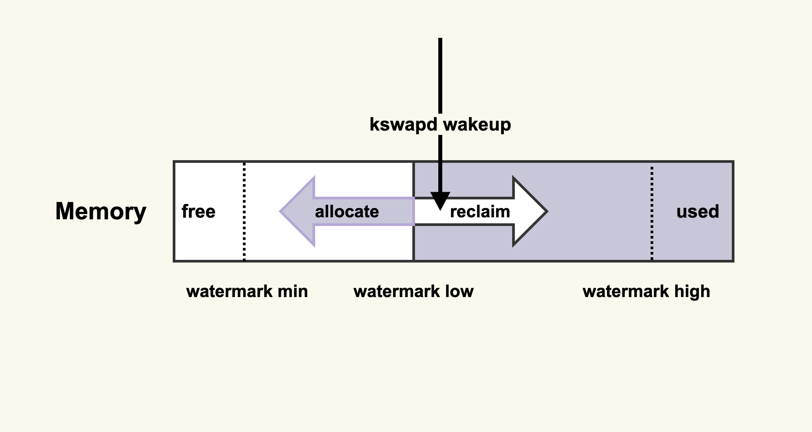
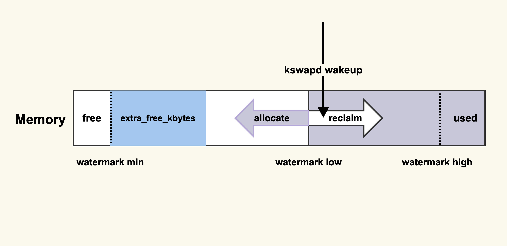
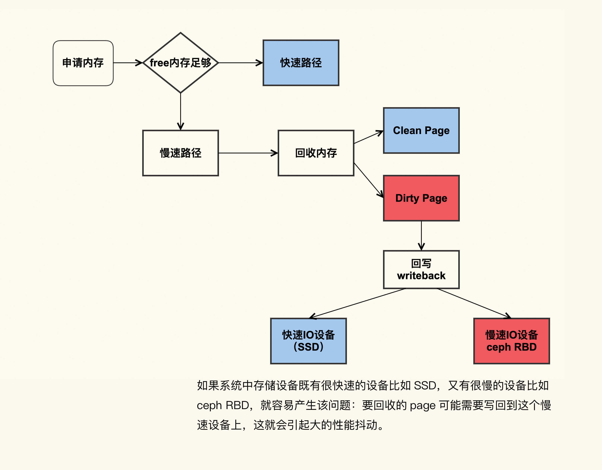
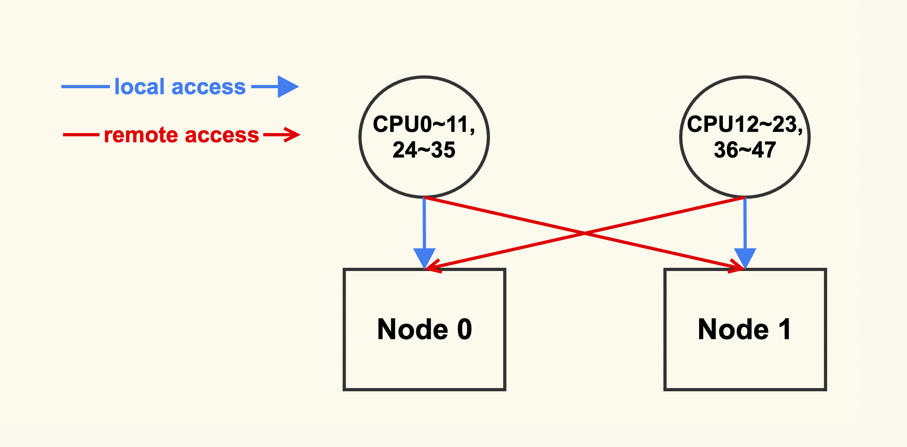

# 03 案例篇 | 如何处理Page Cache难以回收产生的load飙高问题？
你好，我是邵亚方。今天这节课，我想跟你聊一聊怎么处理在生产环境中，因为Page Cache管理不当引起的系统load飙高的问题。

相信你在平时的工作中，应该会或多或少遇到过这些情形：系统很卡顿，敲命令响应非常慢；应用程序的RT变得很高，或者抖动得很厉害。在发生这些问题时，很有可能也伴随着系统load飙得很高。

那这是什么原因导致的呢？据我观察，大多是有三种情况：

- 直接内存回收引起的load飙高；
- 系统中脏页积压过多引起的load飙高；
- 系统NUMA策略配置不当引起的load飙高。

这是应用开发者和运维人员向我咨询最多的几种情况。问题看似很简单，但如果对问题产生的原因理解得不深，解决起来就会很棘手，甚至配置得不好，还会带来负面的影响。

所以这节课，我们一起来分析下这三种情况，可以说，搞清楚了这几种情况，你差不多就能解决掉绝大部分Page Cache引起的load飙高问题了。如果你对问题的原因排查感兴趣，也不要着急，在第5讲，我会带你学习load飙高问题的分析方法。

接下来，我们就来逐一分析下这几类情况。

## 直接内存回收引起load飙高或者业务时延抖动

直接内存回收是指在进程上下文同步进行内存回收，那么它具体是怎么引起load飙高的呢？

因为直接内存回收是在进程申请内存的过程中同步进行的回收，而这个回收过程可能会消耗很多时间，进而导致进程的后续行为都被迫等待，这样就会造成很长时间的延迟，以及系统的CPU利用率会升高，最终引起load飙高。

我们详细地描述一下这个过程，为了尽量不涉及太多技术细节，我会用一张图来表示，这样你理解起来会更容易。


从图里你可以看到，在开始内存回收后，首先进行后台异步回收（上图中蓝色标记的地方），这不会引起进程的延迟；如果后台异步回收跟不上进程内存申请的速度，就会开始同步阻塞回收，导致延迟（上图中红色和粉色标记的地方，这就是引起load高的地址）。

那么，针对直接内存回收引起load飙高或者业务RT抖动的问题，一个解决方案就是 **及早地触发后台回收来避免应用程序进行直接内存回收，那具体要怎么做呢？**

我们先来了解一下后台回收的原理，如图：



它的意思是：当内存水位低于watermark low时，就会唤醒kswapd进行后台回收，然后kswapd会一直回收到watermark high。

那么，我们可以增大min\_free\_kbytes这个配置选项来及早地触发后台回收，该选项最终控制的是内存回收水位，不过，内存回收水位是内核里面非常细节性的知识点，我们可以先不去讨论。

> vm.min\_free\_kbytes = 4194304

对于大于等于128G的系统而言，将min\_free\_kbytes设置为4G比较合理，这是我们在处理很多这种问题时总结出来的一个经验值，既不造成较多的内存浪费，又能避免掉绝大多数的直接内存回收。

该值的设置和总的物理内存并没有一个严格对应的关系，我们在前面也说过，如果配置不当会引起一些副作用，所以在调整该值之前，我的建议是：你可以渐进式地增大该值，比如先调整为1G，观察sar -B中pgscand是否还有不为0的情况；如果存在不为0的情况，继续增加到2G，再次观察是否还有不为0的情况来决定是否增大，以此类推。

在这里你需要注意的是，即使将该值增加得很大，还是可能存在pgscand不为0的情况（这个略复杂，涉及到内存碎片和连续内存申请，我们在此先不展开，你知道有这么回事儿就可以了）。那么这个时候你要考虑的是，业务是否可以容忍，如果可以容忍那就没有必要继续增加了，也就是说，增大该值并不是完全避免直接内存回收，而是尽量将直接内存回收行为控制在业务可以容忍的范围内。

这个方法可以用在3.10.0以后的内核上（对应的操作系统为CentOS-7以及之后更新的操作系统）。

当然了，这样做也有一些缺陷：提高了内存水位后，应用程序可以直接使用的内存量就会减少，这在一定程度上浪费了内存。所以在调整这一项之前，你需要先思考一下， **应用程序更加关注什么，如果关注延迟那就适当地增大该值，如果关注内存的使用量那就适当地调小该值。**

除此之外，对CentOS-6(对应于2.6.32内核版本)而言，还有另外一种解决方案：

> vm.extra\_free\_kbytes = 4194304

那就是将extra\_free\_kbytes 配置为4G。extra\_free\_kbytes在3.10以及以后的内核上都被废弃掉了，不过由于在生产环境中还存在大量的机器运行着较老版本内核，你使用到的也可能会是较老版本的内核，所以在这里还是有必要提一下。它的大致原理如下所示：



extra\_free\_kbytes的目的是为了解决min\_free\_kbyte造成的内存浪费，但是这种做法并没有被内核主线接收，因为这种行为很难维护会带来一些麻烦，感兴趣的可以看一下这个讨论： [add extra free kbytes tunable](https://lkml.org/lkml/2013/2/17/210)

总的来说，通过调整内存水位，在一定程度上保障了应用的内存申请，但是同时也带来了一定的内存浪费，因为系统始终要保障有这么多的free内存，这就压缩了Page Cache的空间。调整的效果你可以通过/proc/zoneinfo来观察：

```
$ egrep "min|low|high" /proc/zoneinfo
...
        min      7019
        low      8773
        high     10527
...

```

其中min、low、high分别对应上图中的三个内存水位。你可以观察一下调整前后min、low、high的变化。需要提醒你的是，内存水位是针对每个内存zone进行设置的，所以/proc/zoneinfo里面会有很多zone以及它们的内存水位，你可以不用去关注这些细节。

## 系统中脏页过多引起load飙高

接下来，我们分析下由于系统脏页过多引起load飙高的情况。在前一个案例中我们也提到，直接回收过程中，如果存在较多脏页就可能涉及在回收过程中进行回写，这可能会造成非常大的延迟，而且因为这个过程本身是阻塞式的，所以又可能进一步导致系统中处于D状态的进程数增多，最终的表现就是系统的load值很高。

我们来看一下这张图，这是一个典型的脏页引起系统load值飙高的问题场景：



如图所示，如果系统中既有快速I/O设备，又有慢速I/O设备（比如图中的ceph RBD设备，或者其他慢速存储设备比如HDD），直接内存回收过程中遇到了正在往慢速I/O设备回写的page，就可能导致非常大的延迟。

这里我多说一点。这类问题其实是不太好去追踪的，为了更好追踪这种慢速I/O设备引起的抖动问题，我也给Linux Kernel提交了一个patch来进行更好的追踪： [mm/page-writeback: introduce tracepoint for wait\_on\_page\_writeback()](https://git.kernel.org/pub/scm/linux/kernel/git/torvalds/linux.git/commit/?id=19343b5bdd16ad4ae6b845ef829f68b683c4dfb5)，这种做法是在原来的基础上增加了回写的设备，这样子用户就能更好地将回写和具体设备关联起来，从而判断问题是否是由慢速I/O设备导致的（具体的分析方法我会在后面第5讲分析篇里重点来讲）。

那如何解决这类问题呢？一个比较省事的解决方案是控制好系统中积压的脏页数据。很多人知道需要控制脏页，但是往往并不清楚如何来控制好这个度，脏页控制的少了可能会影响系统整体的效率，脏页控制的多了还是会触发问题，所以我们接下来看下如何来衡量好这个“度”。

首先你可以通过sar -r来观察系统中的脏页个数：

```
$ sar -r 1
07:30:01 PM kbmemfree kbmemused  %memused kbbuffers  kbcached  kbcommit   %commit  kbactive   kbinact   kbdirty
09:20:01 PM   5681588   2137312     27.34         0   1807432    193016      2.47    534416   1310876         4
09:30:01 PM   5677564   2141336     27.39         0   1807500    204084      2.61    539192   1310884        20
09:40:01 PM   5679516   2139384     27.36         0   1807508    196696      2.52    536528   1310888        20
09:50:01 PM   5679548   2139352     27.36         0   1807516    196624      2.51    536152   1310892        24

```

kbdirty就是系统中的脏页大小，它同样也是对/proc/vmstat中nr\_dirty的解析。你可以通过调小如下设置来将系统脏页个数控制在一个合理范围:

> vm.dirty\_background\_bytes = 0
>
> vm.dirty\_background\_ratio = 10
>
> vm.dirty\_bytes = 0
>
> vm.dirty\_expire\_centisecs = 3000
>
> vm.dirty\_ratio = 20

调整这些配置项有利有弊，调大这些值会导致脏页的积压，但是同时也可能减少了I/O的次数，从而提升单次刷盘的效率；调小这些值可以减少脏页的积压，但是同时也增加了I/O的次数，降低了I/O的效率。

**至于这些值调整大多少比较合适，也是因系统和业务的不同而异，我的建议也是一边调整一边观察，将这些值调整到业务可以容忍的程度就可以了，即在调整后需要观察业务的服务质量(SLA)，要确保SLA在可接受范围内**。调整的效果你可以通过/proc/vmstat来查看：

```
$ grep "nr_dirty_" /proc/vmstat
nr_dirty_threshold 366998
nr_dirty_background_threshold 183275

```

你可以观察一下调整前后这两项的变化。 **这里我要给你一个避免踩坑的提示**，解决该方案中的设置项如果设置不妥会触发一个内核Bug，这是我在2017年进行性能调优时发现的一个内核Bug，我给社区提交了一个patch将它fix掉了，具体的commit见 [writeback: schedule periodic writeback with sysctl](https://git.kernel.org/pub/scm/linux/kernel/git/torvalds/linux.git/commit/?id=94af584692091347baea4d810b9fc6e0f5483d42) , commit log清晰地描述了该问题，我建议你有时间看一看。

## 系统NUMA策略配置不当引起的load飙高

除了我前面提到的这两种引起系统load飙高或者业务延迟抖动的场景之外，还有另外一种场景也会引起load飙高，那就是系统NUMA策略配置不当引起的load飙高。

比如说，我们在生产环境上就曾经遇到这样的问题：系统中还有一半左右的free内存，但还是频频触发direct reclaim，导致业务抖动得比较厉害。后来经过排查发现是由于设置了zone\_reclaim\_mode，这是NUMA策略的一种。

设置zone\_reclaim\_mode的目的是为了增加业务的NUMA亲和性，但是在实际生产环境中很少会有对NUMA特别敏感的业务，这也是为什么内核将该配置从默认配置1修改为了默认配置0: [mm: disable zone\_reclaim\_mode by default](https://git.kernel.org/pub/scm/linux/kernel/git/torvalds/linux.git/commit/?id=4f9b16a64753d0bb607454347036dc997fd03b82) ，配置为0之后，就避免了在其他node有空闲内存时，不去使用这些空闲内存而是去回收当前node的Page Cache，也就是说，通过减少内存回收发生的可能性从而避免它引发的业务延迟。

那么如何来有效地衡量业务延迟问题是否由zone reclaim引起的呢？它引起的延迟究竟有多大呢？这个衡量和观察方法也是我贡献给Linux Kernel的： [mm/vmscan: add tracepoints for node reclaim](https://git.kernel.org/pub/scm/linux/kernel/git/torvalds/linux.git/commit/?id=132bb8cfc9e081238e7e2fd0c37c8c75ad0d2963) ，大致的思路就是利用linux的tracepoint来做这种量化分析，这是性能开销相对较小的一个方案。

我们可以通过numactl来查看服务器的NUMA信息，如下是两个node的服务器：

```
$ numactl --hardware
available: 2 nodes (0-1)
node 0 cpus: 0 1 2 3 4 5 6 7 8 9 10 11 24 25 26 27 28 29 30 31 32 33 34 35
node 0 size: 130950 MB
node 0 free: 108256 MB
node 1 cpus: 12 13 14 15 16 17 18 19 20 21 22 23 36 37 38 39 40 41 42 43 44 45 46 47
node 1 size: 131072 MB
node 1 free: 122995 MB
node distances:
node   0   1
  0:  10  21
  1:  21  10

```

其中CPU0～11，24～35的local node为node 0；而CPU12～23，36～47的local node为node 1。如下图所示：



推荐将zone\_reclaim\_mode配置为0。

> vm.zone\_reclaim\_mode = 0

因为相比内存回收的危害而言，NUMA带来的性能提升几乎可以忽略，所以配置为0，利远大于弊。

好了，对于Page Cache管理不当引起的系统load飙高和业务时延抖动问题，我们就分析到这里，希望通过这篇的学习，在下次你遇到直接内存回收引起的load飙高问题时不再束手无策。

总的来说，这些问题都是Page Cache难以释放而产生的问题，那你是否想过，是不是Page Cache很容易释放就不会产生问题了？这个答案可能会让你有些意料不到：Page Cache容易释放也有容易释放的问题。这到底是怎么回事呢，我们下节课来分析下这方面的案例。

## 课堂总结

这节课我们讲的这几个案例都是内存回收过程中引起的load飙高问题。关于内存回收这事，我们可以做一个形象的类比。我们知道，内存是操作系统中很重要的一个资源，它就像我们在生活过程中很重要的一个资源——钱一样，如果你的钱（内存）足够多，那想买什么就可以买什么，而不用担心钱花完（内存用完）后要吃土（引起load飙高）。

但是现实情况是我们每个人用来双十一购物的钱（内存）总是有限的，在买东西（运行程序）的时候总需要精打细算，一旦预算快超了（内存快不够了），就得把一些不重要的东西（把一些不活跃的内容）从购物车里删除掉（回收掉），好腾出资金（空闲的内存）来买更想买的东西（运行需要运行的程序）。

我们讲的这几个案例都可以通过调整系统参数/配置来解决，调整系统参数/配置也是应用开发者和运维人员在发生了内核问题时所能做的改动。比如说，直接内存回收引起load飙高时，就去调整内存水位设置；脏页积压引起load飙高时，就需要去调整脏页的水位；NUMA策略配置不当引起load飙高时，就去检查是否需要关闭该策略。同时我们在做这些调整的时候，一定要边调整边观察业务的服务质量，确保SLA是可以接受的。

如果你想要你的系统更加稳定，你的业务性能更好，你不妨去研究一下系统中的可配置项，看看哪些配置可以帮助你的业务。

## 课后作业

这节课我给你布置的作业是针对直接内存回收的，现在你已经知道直接内存回收容易产生问题，是我们需要尽量避免的，那么我的问题是：请你执行一些模拟程序来构造出直接内存回收的场景（小提示： 你可以通过sar -B中的pgscand来判断是否有了直接内存回收）。欢迎在留言区分享你的看法。

感谢你的阅读，如果你认为这节课的内容有收获，也欢迎把它分享给你的朋友，我们下一讲见。