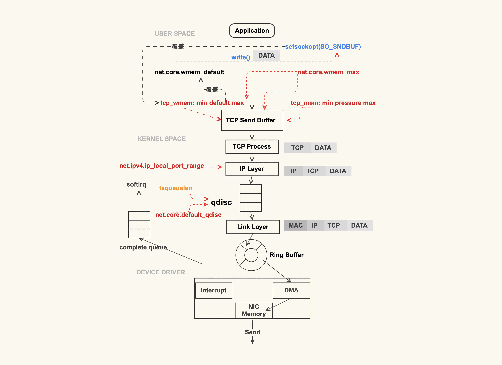
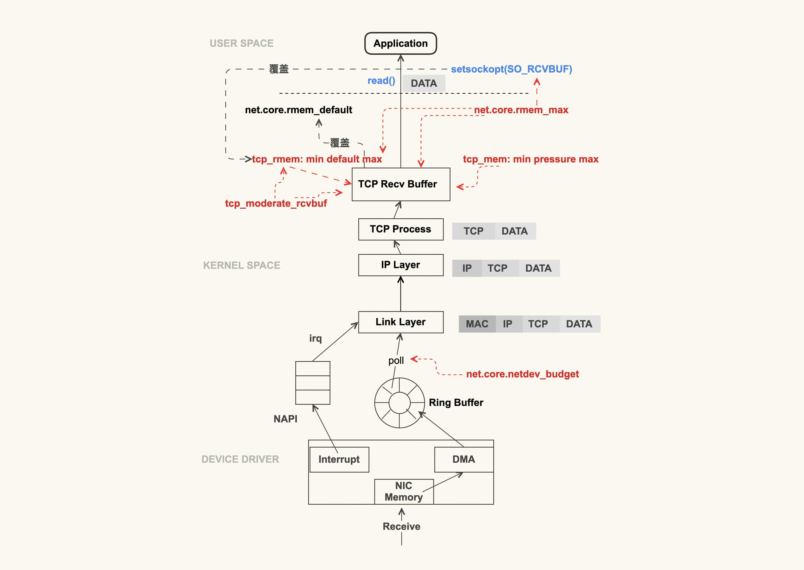
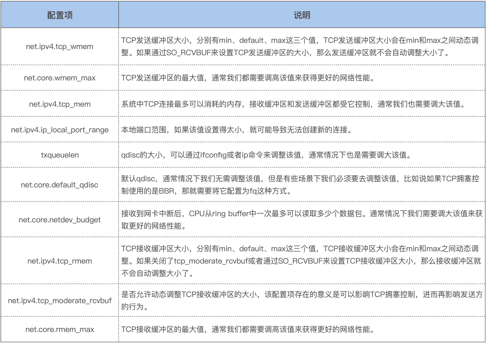

# 12 基础篇 | TCP收发包过程会受哪些配置项影响？
你好，我是邵亚方。我们这节课来讲一下，TCP数据在传输过程中会受到哪些因素干扰。

TCP收包和发包的过程也是容易引起问题的地方。收包是指数据到达网卡再到被应用程序开始处理的过程。发包则是应用程序调用发包函数到数据包从网卡发出的过程。你应该对TCP收包和发包过程中容易引发的一些问题不会陌生，比如说：

- 网卡中断太多，占用太多CPU，导致业务频繁被打断；
- 应用程序调用write()或者send()发包，怎么会发不出去呢；
- 数据包明明已经被网卡收到了，可是应用程序为什么没收到呢；
- 我想要调整缓冲区的大小，可是为什么不生效呢；
- 是不是内核缓冲区满了从而引起丢包，我该怎么观察呢；
- …

想要解决这些问题呢，你就需要去了解TCP的收发包过程容易受到哪些因素的影响。这个过程中涉及到很多的配置项，很多问题都是这些配置项跟业务场景不匹配导致的。

我们先来看下数据包的发送过程，这个过程会受到哪些配置项的影响呢？

## TCP数据包的发送过程会受什么影响？



上图就是一个简略的TCP数据包的发送过程。应用程序调用write(2)或者send(2)系列系统调用开始往外发包时，这些系统调用会把数据包从用户缓冲区拷贝到TCP发送缓冲区（TCP Send Buffer），这个TCP发送缓冲区的大小是受限制的，这里也是容易引起问题的地方。

TCP发送缓冲区的大小默认是受net.ipv4.tcp\_wmem来控制：

> net.ipv4.tcp\_wmem = 8192 65536 16777216

tcp\_wmem中这三个数字的含义分别为min、default、max。TCP发送缓冲区的大小会在min和max之间动态调整，初始的大小是default，这个动态调整的过程是由内核自动来做的，应用程序无法干预。自动调整的目的，是为了在尽可能少的浪费内存的情况下来满足发包的需要。

tcp\_wmem中的max不能超过net.core.wmem\_max这个配置项的值，如果超过了，TCP 发送缓冲区最大就是net.core.wmem\_max。通常情况下，我们需要设置net.core.wmem\_max的值大于等于net.ipv4.tcp\_wmem的max：

> net.core.wmem\_max = 16777216

对于TCP 发送缓冲区的大小，我们需要根据服务器的负载能力来灵活调整。通常情况下我们需要调大它们的默认值，我上面列出的 tcp\_wmem 的 min、default、max 这几组数值就是调大后的值，也是我们在生产环境中配置的值。

我之所以将这几个值给调大，是因为我们在生产环境中遇到过TCP发送缓冲区太小，导致业务延迟很大的问题，这类问题也是可以使用systemtap之类的工具在内核里面打点来进行观察的（观察sk\_stream\_wait\_memory这个事件）:

```
# sndbuf_overflow.stp
# Usage :
# $ stap sndbuf_overflow.stp
probe kernel.function("sk_stream_wait_memory")
{
    printf("%d %s TCP send buffer overflow\n",
         pid(), execname())
}

```

如果你可以观察到sk\_stream\_wait\_memory这个事件，就意味着TCP发送缓冲区太小了，你需要继续去调大wmem\_max和tcp\_wmem:max的值了。

应用程序有的时候会很明确地知道自己发送多大的数据，需要多大的TCP发送缓冲区，这个时候就可以通过setsockopt(2)里的SO\_SNDBUF来设置固定的缓冲区大小。一旦进行了这种设置后，tcp\_wmem就会失效，而且这个缓冲区大小设置的是固定值，内核也不会对它进行动态调整。

但是，SO\_SNDBUF设置的最大值不能超过net.core.wmem\_max，如果超过了该值，内核会把它强制设置为net.core.wmem\_max。所以，如果你想要设置SO\_SNDBUF，一定要确认好net.core.wmem\_max是否满足需求，否则你的设置可能发挥不了作用。通常情况下，我们都不会通过SO\_SNDBUF来设置TCP发送缓冲区的大小，而是使用内核设置的tcp\_wmem，因为如果SO\_SNDBUF设置得太大就会浪费内存，设置得太小又会引起缓冲区不足的问题。

另外，如果你关注过Linux的最新技术动态，你一定听说过eBPF。你也可以通过eBPF来设置SO\_SNDBUF和SO\_RCVBUF，进而分别设置TCP发送缓冲区和TCP接收缓冲区的大小。同样地，使用eBPF来设置这两个缓冲区时，也不能超过wmem\_max和rmem\_max。不过eBPF在一开始增加设置缓冲区大小的特性时并未考虑过最大值的限制，我在使用的过程中发现这里存在问题，就给社区提交了一个PATCH把它给修复了。你感兴趣的话可以看下这个链接： [bpf: sock recvbuff must be limited by rmem\_max in bpf\_setsockopt()](https://git.kernel.org/pub/scm/linux/kernel/git/torvalds/linux.git/commit/?h=v5.8&id=c9e4576743eeda8d24dedc164d65b78877f9a98c)。

tcp\_wmem以及wmem\_max的大小设置都是针对单个TCP连接的，这两个值的单位都是Byte（字节）。系统中可能会存在非常多的TCP连接，如果TCP连接太多，就可能导致内存耗尽。因此，所有TCP连接消耗的总内存也有限制：

> net.ipv4.tcp\_mem = 8388608 12582912 16777216

我们通常也会把这个配置项给调大。与前两个选项不同的是，该选项中这些值的单位是Page（页数），也就是4K。它也有3个值：min、pressure、max。当所有TCP连接消耗的内存总和达到max后，也会因达到限制而无法再往外发包。

因tcp\_mem达到限制而无法发包或者产生抖动的问题，我们也是可以观测到的。为了方便地观测这类问题，Linux内核里面预置了静态观测点：sock\_exceed\_buf\_limit。不过，这个观测点一开始只是用来观察TCP接收时遇到的缓冲区不足的问题，不能观察TCP发送时遇到的缓冲区不足的问题。后来，我提交了一个patch做了改进，使得它也可以用来观察TCP发送时缓冲区不足的问题： [net: expose sk wmem in sock\_exceed\_buf\_limit tracepoint](https://github.com/torvalds/linux/commit/563e0bb0dc74b3ca888e24f8c08f0239fe4016b0) ，观察时你只需要打开tracepiont（需要4.16+的内核版本）：

> $ echo 1 > /sys/kernel/debug/tracing/events/sock/sock\_exceed\_buf\_limit/enable

然后去看是否有该事件发生：

> $ cat /sys/kernel/debug/tracing/trace\_pipe

如果有日志输出（即发生了该事件），就意味着你需要调大tcp\_mem了，或者是需要断开一些TCP连接了。

TCP层处理完数据包后，就继续往下来到了IP层。IP层这里容易触发问题的地方是net.ipv4.ip\_local\_port\_range这个配置选项，它是指和其他服务器建立IP连接时本地端口（local port）的范围。我们在生产环境中就遇到过默认的端口范围太小，以致于无法创建新连接的问题。所以通常情况下，我们都会扩大默认的端口范围：

> net.ipv4.ip\_local\_port\_range = 1024 65535

为了能够对TCP/IP数据流进行流控，Linux内核在IP层实现了qdisc（排队规则）。我们平时用到的TC就是基于qdisc的流控工具。qdisc的队列长度是我们用ifconfig来看到的txqueuelen，我们在生产环境中也遇到过因为txqueuelen太小导致数据包被丢弃的情况，这类问题可以通过下面这个命令来观察：

> $ ip -s -s link ls dev eth0
>
> …
>
> TX: bytes packets errors dropped carrier collsns
>
> 3263284 25060 0 0 0 0

如果观察到dropped这一项不为0，那就有可能是txqueuelen太小导致的。当遇到这种情况时，你就需要增大该值了，比如增加eth0这个网络接口的txqueuelen：

> $ ifconfig eth0 txqueuelen 2000

或者使用ip这个工具：

> $ ip link set eth0 txqueuelen 2000

在调整了txqueuelen的值后，你需要持续观察是否可以缓解丢包的问题，这也便于你将它调整到一个合适的值。

Linux系统默认的qdisc为pfifo\_fast（先进先出），通常情况下我们无需调整它。如果你想使用 [TCP BBR](https://github.com/google/bbr) 来改善TCP拥塞控制的话，那就需要将它调整为fq（fair queue, 公平队列）：

> net.core.default\_qdisc = fq

经过IP层后，数据包再往下就会进入到网卡了，然后通过网卡发送出去。至此，你需要发送出去的数据就走完了TCP/IP协议栈，然后正常地发送给对端了。

接下来，我们来看下数据包是怎样收上来的，以及在接收的过程中会受哪些配置项的影响。

## TCP数据包的接收过程会受什么影响？

TCP数据包的接收过程，同样也可以用一张图来简单表示：



从上图可以看出，TCP数据包的接收流程在整体上与发送流程类似，只是方向是相反的。数据包到达网卡后，就会触发中断（IRQ）来告诉CPU读取这个数据包。但是在高性能网络场景下，数据包的数量会非常大，如果每来一个数据包都要产生一个中断，那CPU的处理效率就会大打折扣，所以就产生了NAPI（New API）这种机制让CPU一次性地去轮询（poll）多个数据包，以批量处理的方式来提升效率，降低网卡中断带来的性能开销。

那在poll的过程中，一次可以poll多少个呢？这个poll的个数可以通过sysctl选项来控制：

> net.core.netdev\_budget = 600

该控制选项的默认值是300，在网络吞吐量较大的场景中，我们可以适当地增大该值，比如增大到600。增大该值可以一次性地处理更多的数据包。但是这种调整也是有缺陷的，因为这会导致CPU在这里poll的时间增加，如果系统中运行的任务很多的话，其他任务的调度延迟就会增加。

接下来继续看TCP数据包的接收过程。我们刚才提到，数据包到达网卡后会触发CPU去poll数据包，这些poll的数据包紧接着就会到达IP层去处理，然后再达到TCP层，这时就会面对另外一个很容易引发问题的地方了：TCP Receive Buffer（TCP接收缓冲区）。

与 TCP发送缓冲区类似，TCP接收缓冲区的大小也是受控制的。通常情况下，默认都是使用tcp\_rmem来控制缓冲区的大小。同样地，我们也会适当地增大这几个值的默认值，来获取更好的网络性能，调整为如下数值：

> net.ipv4.tcp\_rmem = 8192 87380 16777216

它也有3个字段：min、default、max。TCP接收缓冲区大小也是在min和max之间动态调整 ，不过跟发送缓冲区不同的是，这个动态调整是可以通过控制选项来关闭的，这个选项是tcp\_moderate\_rcvbuf 。通常我们都是打开它，这也是它的默认值：

> net.ipv4.tcp\_moderate\_rcvbuf = 1

之所以接收缓冲区有选项可以控制自动调节，而发送缓冲区没有，那是因为TCP接收缓冲区会直接影响TCP拥塞控制，进而影响到对端的发包，所以使用该控制选项可以更加灵活地控制对端的发包行为。

除了tcp\_moderate\_rcvbuf 可以控制TCP接收缓冲区的动态调节外，也可以通过setsockopt()中的配置选项SO\_RCVBUF来控制，这与TCP发送缓冲区是类似的。如果应用程序设置了SO\_RCVBUF这个标记，那么TCP接收缓冲区的动态调整就是关闭，即使tcp\_moderate\_rcvbuf为1，接收缓冲区的大小始终就为设置的SO\_RCVBUF这个值。

也就是说，只有在tcp\_moderate\_rcvbuf为1，并且应用程序没有通过SO\_RCVBUF来配置缓冲区大小的情况下，TCP接收缓冲区才会动态调节。

同样地，与TCP发送缓冲区类似，SO\_RCVBUF设置的值最大也不能超过net.core.rmem\_max。通常情况下，我们也需要设置net.core.rmem\_max的值大于等于net.ipv4.tcp\_rmem的max：

> net.core.rmem\_max = 16777216

我们在生产环境中也遇到过，因达到了TCP接收缓冲区的限制而引发的丢包问题。但是这类问题不是那么好追踪的，没有一种很直观地追踪这种行为的方式，所以我便在我们的内核里添加了针对这种行为的统计。

为了让使用Linux内核的人都能很好地观察这个行为，我也把我们的实践贡献给了Linux内核社区，具体可以看这个commit： [tcp: add new SNMP counter for drops when try to queue in rcv queue](https://git.kernel.org/pub/scm/linux/kernel/git/torvalds/linux.git/commit/?h=v5.9-rc1&id=ea5d0c32498e1a08ff5f3dbeafa4d74895851b0d)。使用这个SNMP计数，我们就可以很方便地通过netstat查看，系统中是否存在因为TCP接收缓冲区不足而引发的丢包。

不过，该方法还是存在一些局限：如果我们想要查看是哪个TCP连接在丢包，那么这种方式就不行了，这个时候我们就需要去借助其他一些更专业的trace工具，比如eBPF来达到我们的目的。

## 课堂总结

好了，这节课就讲到这里，我们简单回顾一下。TCP/IP是一个很复杂的协议栈，它的数据包收发过程也是很复杂的，我们这节课只是重点围绕这个过程中最容易引发问题的地方来讲述的。我们刚才提到的那些配置选项都很容易在生产环境中引发问题，并且也是我们针对高性能网络进行调优时必须要去考虑的。我把这些配置项也总结为了一个表格，方便你来查看：



这些值都需要根据你的业务场景来做灵活的调整，当你不知道针对你的业务该如何调整时，你最好去咨询更加专业的人员，或者一边调整一边观察系统以及业务行为的变化。

## 课后作业

我们这节课中有两张图，分别是TCP数据包的发送过程 和 TCP数据包的接收过程，我们可以看到，在TCP发送过程中使用到了qdisc，但是在接收过程中没有使用它，请问是为什么？我们可以在接收过程中也使用qdisc吗？欢迎你在留言区与我讨论。

感谢你的阅读，如果你认为这节课的内容有收获，也欢迎把它分享给你的朋友，我们下一讲见。