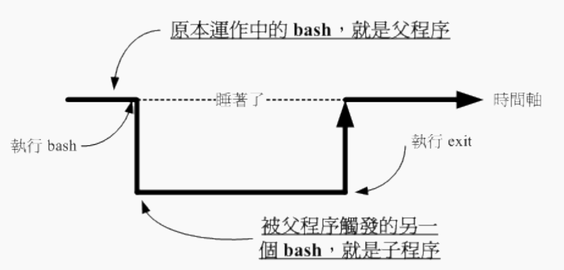

# 认识 BASH 这个 Shell

我们在 [第一章 Linux 是什么] 当中提到了： 管理整个计算机硬件的其实是操作系统的核心 （kernel），这个核心是需要被保护的！ 所以我们一般使用者就只能通过 shell 来跟核心沟通，以让核心达到我们所想要达到的工作。 那么系统有多少 shell 可用呢？为什么我们要使用 bash 啊？下面分别来谈一谈喔！

## 硬件、核心与 Shell

这应该是个蛮有趣的话题：“什么是 Shell ”？相信只要摸过计算机，对于操作系统 （不论是 Linux 、 Unix 或者是 Windows） 有点概念的朋友们大多听过这个名词，因为只要有“操作系统”那么就离不开 Shell 这个东西。

我们曾经提到过， 操作系统其实是一组软件，由于这组软件在控制整个硬件与管理系统的活动监测， 如果这组软件能被使用者随意的操作，若使用者应用不当，将会使得整个系统崩溃！因为操作系统管理的就是整个硬件功能嘛！ 所以当然不能够随便被一些没有管理能力的终端用户随意使用啰！

其实shell的功能只是提供使用者操作系统的一个接口，因此这个shell需要可以调用其他软件才好。 我们在第四章到第九章提到过很多指令，包括 man, chmod, chown, vi, fdisk, mkfs 等等指令，这些指令都是独立的应用程序， 但是我们可以通过shell （就是命令行界面） 来操作这些应用程序，让这些应用程序调用核心来运行所需的工作！ 这样对于shell是否有了一定的概念了？

## 系统合法的shell

知道什么是 Shell 之后，那么我们来了解一下 Linux 使用的是哪一个 shell 呢？什么！哪一个？难道说 shell 不就是“一个 shell 吗？”哈哈！那可不！由于早年的 Unix 年代，发展者众，所以由于 shell 依据发展者的不同就有许多的版本。

常见的Linux shell包括：

1. **Bourne-Again Shell (Bash)**: Bash是大多数Linux发行版的默认shell，是Bourne Shell（sh）的增强版本，支持自动补全、命令历史、函数和别名等功能。
2. **Bourne Shell (sh)**: sh是Unix系统上最早的shell之一，现代大多数shell都是基于sh的概念和功能设计的。
3. **C Shell (csh)**: csh的语法类似于C语言，对于熟悉C语言的用户来说可能更容易上手。
4. **Korn Shell (ksh)**: ksh是Bourne Shell的超集，它结合了Bourne Shell和C Shell的特点，同时增加了许多改进。
5. **Fish (friendly interactive shell)**: Fish是一个相对较新的shell，专注于用户友好性和易用性，它提供了丰富的功能，如自动建议、彩色高亮显示等。

Shell的主要特点：

- **命令提示符**: shell在等待用户输入时提供一个提示符，通常是 `$` 或者 `#`（对于root用户）。
- **命令执行**: 用户可以在命令提示符下输入命令，shell会解释并执行这些命令，也可以执行存储在脚本文件中的一系列命令。
- **管道和重定向**: shell可以将一个命令的输出作为另一个命令的输入（管道），也可以将输出重定向到文件中或从文件中读取输入。
- **环境变量**: shell使用环境变量来存储关于操作系统环境的信息，这些变量可以影响shell和其他程序的行为。
- **脚本编程**: shell脚本是一系列命令的集合，可以被保存在文本文件中以便重复执行。它包括变量、流程控制语句等编程元素。
- **用户接口**: shell通常提供了交互式和非交互式两种模式。在交互式模式下，用户可以与shell直接交互；而在非交互式模式下，shell可以自动运行脚本而无需用户干预。

# Shell的变量功能

变量是 bash 环境中非常重要的一个玩意儿，我们知道 Linux 是多用户多任务的环境，每个人登陆系统都能取得一个 bash shell， 每个人都能够使用 bash 下达 mail 这个指令来收受“自己”的邮件等等。问题是， bash 是如何得知你的邮件信箱是哪个文件？ 这就需要“变量”的帮助啦！

## 什么是变量？

那么，什么是“变量”呢？简单的说，就是让某一个特定字串代表不固定的内容。举个大家在国中都会学到的数学例子， 那就是：“ y = ax + b ”这东西，在等号左边的（y）就是变量，在等号右边的（ax+b）就是变量内容。 要注意的是，左边是未知数，右边是已知数喔！ 讲的更简单一点，我们可以“用一个简单的 "字眼" 来取代另一个比较复杂或者是容易变动的数据”。这有什么好处啊？最大的好处就是“方便！”。

## 变量的取用与设置：echo, 变量设置规则, unset

### 变量的取用: echo

```shell
[dmtsai@study ~]$ echo $variable
[dmtsai@study ~]$ echo $PATH
/usr/local/bin:/usr/bin:/usr/local/sbin:/usr/sbin:/home/dmtsai/.local/bin:/home/dmtsai/bin
[dmtsai@study ~]$ echo ${PATH}  # 近年来，鸟哥比较偏向使用这种格式喔！
```

变量的取用就如同上面的范例，利用 echo 就能够读出，只是需要在变量名称前面加上 $ ， 或者是以 ${变量} 的方式来取用！当然啦，echo 的功能可是很多的， 这里单纯是拿 echo 来读出变量的内容而已，更多的 echo 使用，请自行 man echo 吧

那么要如何“设置”或者是“修改” 某个变量的内容啊？很简单啦！用“等号（=）”连接变量与他的内容就好啦！举例来说： 我要将 myname 这个变量名称的内容设置为 VBird ，那么：

```shell
[dmtsai@study ~]$ echo ${myname}
       <==这里并没有任何数据～因为这个变量尚未被设置！是空的！
[dmtsai@study ~]$ myname=VBird
[dmtsai@study ~]$ echo ${myname}
VBird  <==出现了！因为这个变量已经被设置了！
```

各位读者注意喔，每一种 shell 的语法都不相同。在变量的使用上，bash 在没有设置的变量中强迫去 echo 时，它会显示出空的值。 在其他某些 shell 中，随便去 echo 一个不存在的变量，它是会出现错误信息的喔！要注意！要注意！

### 变量设置规则

- 等号两边不能直接接空白字符，如下所示为错误： “myname = VBird”
- 若该变量需要在其他子程序执行，则需要以 export 来使变量变成环境变量： “export PATH”
- 变量名称只能是英文字母与数字，但是开头字符不能是数字，如下为错误： “2myname=VBird”
- 通常大写字符为系统默认变量，自行设置变量可以使用小写字符，方便判断 （纯粹依照使用者兴趣与嗜好） 
- 取消变量的方法为使用 unset ：“unset 变量名称”例如取消 myname 的设置： “unset myname”

下面让鸟哥举几个例子来让你试看看，就知道怎么设置好你的变量啰！

```shell
范例一：设置一变量 name ，且内容为 VBird
[dmtsai@study ~]$ 12name=VBird
bash: 12name=VBird: command not found...  <==屏幕会显示错误！因为不能以数字开头！
[dmtsai@study ~]$ name = VBird            <==还是错误！因为有空白！
[dmtsai@study ~]$ name=VBird              <==OK 的啦！

范例二：承上题，若变量内容为 VBird's name 呢，就是变量内容含有特殊符号时：
[dmtsai@study ~]$ name=VBird's name  
# 单引号与双引号必须要成对，在上面的设置中仅有一个单引号，因此当你按下 enter 后，
# 你还可以继续输入变量内容。这与我们所需要的功能不同，失败啦！
# 记得，失败后要复原请按下 [ctrl]-c 结束！
[dmtsai@study ~]$ name="VBird's name"    <==OK 的啦！
# 指令是由左边向右找→，先遇到的引号先有用，因此如上所示， 单引号变成一般字符！
[dmtsai@study ~]$ name='VBird's name'    <==失败的啦！
# 因为前两个单引号已成对，后面就多了一个不成对的单引号了！因此也就失败了！
[dmtsai@study ~]$ name=VBird\'s\ name     <==OK 的啦！
# 利用反斜线 （\） 跳脱特殊字符，例如单引号与空白键，这也是 OK 的啦！

范例三：我要在 PATH 这个变量当中“累加”:/home/dmtsai/bin 这个目录
[dmtsai@study ~]$ PATH=$PATH:/home/dmtsai/bin
[dmtsai@study ~]$ PATH="$PATH":/home/dmtsai/bin
[dmtsai@study ~]$ PATH=${PATH}:/home/dmtsai/bin
# 上面这三种格式在 PATH 里头的设置都是 OK 的！但是下面的例子就不见得啰！

范例四：承范例三，我要将 name 的内容多出 "yes" 呢？
[dmtsai@study ~]$ name=$nameyes  
# 知道了吧？如果没有双引号，那么变量成了啥？name 的内容是 $nameyes 这个变量！
# 呵呵！我们可没有设置过 nameyes 这个变量呐！所以，应该是下面这样才对！
[dmtsai@study ~]$ name="$name"yes
[dmtsai@study ~]$ name=${name}yes  <==以此例较佳！

范例五：如何让我刚刚设置的 name=VBird 可以用在下个 shell 的程序？
[dmtsai@study ~]$ name=VBird
[dmtsai@study ~]$ bash        <==进入到所谓的子程序
[dmtsai@study ~]$ echo $name  <==子程序：再次的 echo 一下；
       <==嘿嘿！并没有刚刚设置的内容喔！
[dmtsai@study ~]$ exit        <==子程序：离开这个子程序
[dmtsai@study ~]$ export name
[dmtsai@study ~]$ bash        <==进入到所谓的子程序
[dmtsai@study ~]$ echo $name  <==子程序：在此执行！
VBird  <==看吧！出现设置值了！
[dmtsai@study ~]$ exit        <==子程序：离开这个子程序
```

## 环境变量的功能

```shell
# 创建一个局部变量
MY_VARIABLE="Hello, World!"

# 使用 export 命令将其导出为环境变量
export MY_VARIABLE
```

在上面的示例中，我们首先创建了一个名为 `MY_VARIABLE` 的局部变量，并给它赋予了一个字符串值 "Hello, World!"。然后，我们使用 `export` 命令将 `MY_VARIABLE` 导出为环境变量，这样它就可以在当前 shell 的子进程中被访问到了。

例如，如果你有一个名为 `script.sh` 的子脚本，在该脚本中可以通过环境变量来访问 `MY_VARIABLE`：

```bash
#!/bin/bash
echo $MY_VARIABLE
```

在运行 `script.sh` 之前，如果你已经在父 shell 中导出了 `MY_VARIABLE`，当子脚本运行时，它将能够打印出 "Hello, World!"。

你也可以在一行中创建并导出变量，如下所示：

```shell
export MY_VARIABLE="Hello, World!"
```

这样可以将变量创建和导出的步骤合并为一步。目前我的 shell 环境中， 有多少默认的环境变量啊？我们可以利用两个指令来查阅，分别是 env 与 export ！

### 用 env 观察环境变量与常见环境变量说明

```shell
范例一：列出目前的 shell 环境下的所有环境变量与其内容。
[dmtsai@study ~]$ env
HOSTNAME=study.centos.vbird    <== 这部主机的主机名称
TERM=xterm                     <== 这个终端机使用的环境是什么类型
SHELL=/bin/bash                <== 目前这个环境下，使用的 Shell 是哪一个程序？
HISTSIZE=1000                  <== “记录指令的笔数”在 CentOS 默认可记录 1000 笔
OLDPWD=/home/dmtsai            <== 上一个工作目录的所在
LC_ALL=en_US.utf8              <== 由于语系的关系，鸟哥偷偷丢上来的一个设置
USER=dmtsai                    <== 使用者的名称啊！
LS_COLORS=rs=0:di=01;34:ln=01;36:mh=00:pi=40;33:so=01;35:do=01;35:bd=40;33;01:cd=40;33;01:
or=40;31;01:mi=01;05;37;41:su=37;41:sg=30;43:ca=30;41:tw=30;42:ow=34;42:st=37;44:ex=01;32:
*.tar=01...                    <== 一些颜色显示
MAIL=/var/spool/mail/dmtsai    <== 这个使用者所取用的 mailbox 位置
PATH=/usr/local/bin:/usr/bin:/usr/local/sbin:/usr/sbin:/home/dmtsai/.local/bin:/home/dmtsai/bin
PWD=/home/dmtsai               <== 目前使用者所在的工作目录 （利用 pwd 取出！）
LANG=zh_TW.UTF-8               <== 这个与语系有关，下面会再介绍！
HOME=/home/dmtsai              <== 这个使用者的主文件夹啊！
LOGNAME=dmtsai                 <== 登陆者用来登陆的帐号名称
_=/usr/bin/env                 <== 上一次使用的指令的最后一个参数（或指令本身）
```

### 用 set 观察所有变量 （含环境变量与自定义变量）

bash 可不只有环境变量喔，还有一些与 bash 操作接口有关的变量，以及使用者自己定义的变量存在的。 那么这些变量如何观察呢？这个时候就得要使用 set 这个指令了。 set 除了环境变量之外， 还会将其他在 bash 内的变量通通显示出来。

```shell
[dmtsai@study ~]$ set
BASH=/bin/bash                        <== bash 的主程序放置路径
BASH_VERSINFO=（[0]="4" [1]="2" [2]="46" [3]="1" [4]="release" [5]="x86_64-redhat-linux-gnu"）
BASH_VERSION='4.2.46（1）-release'      <== 这两行是 bash 的版本啊！
COLUMNS=90                            <== 在目前的终端机环境下，使用的字段有几个字符长度
HISTFILE=/home/dmtsai/.bash_history   <== 历史命令记录的放置文件，隐藏文件
HISTFILESIZE=1000                     <== 存起来（与上个变量有关）的文件之指令的最大纪录笔数。
HISTSIZE=1000                         <== 目前环境下，内存中记录的历史命令最大笔数。
IFS=$' \t\n'                          <== 默认的分隔符号
LINES=20                              <== 目前的终端机下的最大行数
MACHTYPE=x86_64-redhat-linux-gnu      <== 安装的机器类型
OSTYPE=linux-gnu                      <== 操作系统的类型！
PS1='[\u@\h \W]\$ '                   <== PS1 就厉害了。这个是命令提示字符，也就是我们常见的
                                          [root@www ~]# 或 [dmtsai ~]$ 的设置值啦！可以更动的！
PS2='&gt; '                              <== 如果你使用跳脱符号 （\） 第二行以后的提示字符也
$                                     <== 目前这个 shell 所使用的 PID
?                                     <== 刚刚执行完指令的回传值。
...
# 有许多可以使用的函数库功能被鸟哥取消啰！请自行查阅！
```

- $：（关于本 shell 的 PID）

$本身也是个变量，这个代表的是“目前这个 Shell 的线程代号”，亦即是所谓的 PID （Process ID）。 想要知道我们的 shell 的 PID ，就可以用：“ echo $$ ”即可！出现的数字就是你的 PID 号码。

```shell
ubuntu $ echo $$
2515
```

- ?：（关于上个执行指令的回传值）

问号也是一个特殊的变量，在 bash 里面这个变量很重要。这个变量是：“上一个执行的指令所回传的值”， 上面这句话的重点是“上一个指令”与“回传值”两个地方。当我们执行某些指令时， 这些指令都会回传一个执行后的代码。一般来说，如果成功的执行该指令， 则会回传一个 0 值，如果执行过程发生错误，就会回传“错误代码”才对！一般就是以非为 0 的数值来取代。 我们以下面的例子来看看：

```shell
[dmtsai@study ~]$ echo $SHELL
/bin/bash                                  <==可顺利显示！没有错误！
[dmtsai@study ~]$ echo $?
0                                          <==因为没问题，所以回传值为 0
[dmtsai@study ~]$ 12name=VBird
bash: 12name=VBird: command not found...   <==发生错误了！bash回报有问题
[dmtsai@study ~]$ echo $?
127                                        <==因为有问题，回传错误代码（非为0）
# 错误代码回传值依据软件而有不同，我们可以利用这个代码来搜寻错误的原因喔！
[dmtsai@study ~]$ echo $?
0
# 咦！怎么又变成正确了？这是因为 "?" 只与“上一个执行指令”有关，
# 所以，我们上一个指令是执行“ echo $? ”，当然没有错误，所以是 0 没错！
```

### export： 自定义变量转成环境变量

谈了 env 与 set 现在知道有所谓的环境变量与自定义变量，那么这两者之间有啥差异呢？其实这两者的差异在于“ 该变量是否会被子程序所继续引用” ！那么啥是父程序？子程序？ 这就得要了解一下指令的下达行为了。

当你登陆 Linux 并取得一个 bash 之后，你的 bash 就是一个独立的程序。 接下来你在这个 bash 下面所下达的任何指令都是由这个 bash 所衍生出来的，那些被下达的指令就被称为子程序了。 我们可以用下面的图示来简单的说明一下父程序与子程序的概念：


如上所示，我们在原本的 bash 下面执行另一个 bash ，结果操作的环境接口会跑到第二个 bash 去（就是子程序）， 那原本的 bash 就会在暂停的情况 （睡着了，就是 sleep）。整个指令运行的环境是实线的部分！若要回到原本的 bash 去， 就只有将第二个 bash 结束掉 （下达 exit 或 logout） 才行。更多的程序概念我们会在第四篇谈及，这里只要有这个概念即可。

这个程序概念与变量有啥关系啊？关系可大了！因为子程序仅会继承父程序的环境变量， 子程序不会继承父程序的自订变量啦！所以你在原本 bash 的自订变量在进入了子程序后就会消失不见， 一直到你离开子程序并回到原本的父程序后，这个变量才会又出现！

换个角度来想，也就是说，如果我能将自订变量变成环境变量的话，那不就可以让该变量值继续存在于子程序了？ 呵呵！没错！此时，那个 export 指令就很有用啦！如你想要让该变量内容继续的在子程序中使用，那么就请执行：
```shell
[dmtsai@study ~]$ export 变量名称
```
这东西用在“分享自己的变量设置给后来调用的文件或其他程序”啦！ 像鸟哥常常在自己的主文件后面调用其他附属文件（类似函数的功能），但是主文件与附属文件内都有相同的变量名称， 若一再重复设置时，要修改也很麻烦，此时只要在原本的第一个文件内设置好“ export 变量 ”， 后面所调用的文件就能够使用这个变量设置了！而不需要重复设置，这非常实用于 shell script 当中喔！ 如果仅下达 export 而没有接变量时，那么此时将会把所有的“环境变量”秀出来喔！例如：


