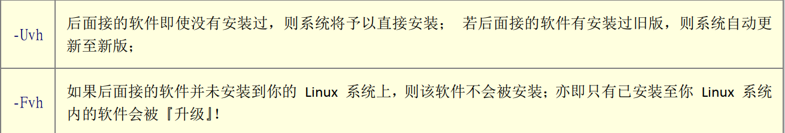

# Linux软件包（源码包和二进制包）

## Linux源码包

实际上，源码包就是一大堆源代码程序，是由程序员按照特定的格式和语法编写出来的。我们都知道，计算机只能识别机器语言，也就是二进制语言，所以源码包的安装需要一名“翻译官”将“abcd”翻译成二进制语言，这名“翻译官”通常被称为编译器。  

虽然源码包免费开源，但用户不会编程怎么办？一大堆源代码程序不会使用怎么办？源码包容易安装吗？等等这些都是使用源码包安装方式无法解答的问题。

另外，由于源码包的安装需要把源代码编译为二进制代码，因此安装时间较长。比如，大家应该都在 Windows 下安装过 QQ， QQ 功能较多，程序相对较大（有 70 MB 左右），但由于其并非是以源码包的形式发布，而是编译后才发布的，因此只需几分钟（经过简单的配置）即可安装成功。但如果我们以源码包安装的方式在 Linux 中安装一个 MySQL 数据库，即便此软件的压缩包仅有 23 MB 左右，也需要 30 分钟左右的时间（根据硬件配置不同，略有差异）。  

为了解决使用源码包安装方式的这些问题， Linux 软件包的安装出现了使用二进制包的安装方式。  

## Linux二进制包

二进制包，也就是源码包经过成功编译之后产生的包。由于二进制包在发布之前就已经完成了编译的工作，因此用户安装软件的速度较快（同 Windows 下安装软件速度相当），且安装过程报错几率大大减小。

二进制包是 Linux 下默认的软件安装包，因此二进制包又被称为默认安装软件包。目前主要有以下 2 大主流的二进制包管理系统：  

- dpkg： 这个机制最早是由 Debian Linux 社群所开发出来的，通过 dpkg 的机制， Debian 提供的软件就能够简单的安装起来，同时还能提供安装后的软件信息，实在非常不错。 只要是衍生于 Debian 的其他 Linux distributions 大多使用 dpkg 这个机制来管理软件的， 包括 B2D, Ubuntu 等等。
- RPM： 这个机制最早是由 Red Hat 这家公司开发出来的，后来实在很好用，因此很多 distributions 就使用这个机制来作为软件安装的管理方式。包括 Fedora, CentOS, SuSE 等等知名的开发商都是用这个。

## 源码包 VS RPM二进制包

源码包一般包含多个文件，为了方便发布，通常会将源码包做打包压缩处理， Linux 中最常用的打包压缩格式为“tar.gz”，因此源码包又被称为 Tarball。  

。。。。。。


## RPM包安装、卸载和升级

### 安装

安装 RPM 的命令格式为：

```shell
[root@localhost ~]# rpm -ivh 包全名
```

注意一定是包全名。涉及到包全名的命令，一定要注意路径，可能软件包在光盘中，因此需提前做好设备的挂载工作。

此命令中各选项参数的含义为：

- -i：安装（ install） ;
- -v：显示更详细的信息（ verbose） ;
- -h：打印 #，显示安装进度（ hash） ;  

### 升级

使用如下命令即可实现 RPM 包的升级：  

```shell
[root@localhost ~]# rpm -Uvh 包全名
[root@localhost ~]# rpm -Fvh 包全名
```



RPM 软件包的安装与卸载要考虑包之间的依赖性。 否则会报错。  

### 卸载

RPM 软件包的卸载很简单，使用如下命令即可：  

```shell
[root@localhost ~]# rpm -e 包名
```

-e 选项表示卸载，也就是 erase 的首字母。  

RPM 软件包的卸载命令支持使用“ --noscripts ”选项，即可以不检测依赖性直接卸载，但此方式不推荐大家使用，因为此操作很可能导致其他软件也无法正常使用。  

## RPM查询

rpm 命令还可用来对 RPM 软件包做查询操作，具体包括：

- 查询软件包是否已安装；`rpm -q 包名`  
- 查询系统中所有已安装的软件包；`rpm -qa`  
- 查看软件包的详细信息；`rpm -qi 包名`  
- 查询软件包的文件列表；`rpm -ql 包名`  
- 查询某系统文件具体属于哪个 RPM 包。  `rpm -qf 系统文件名`  

## RPM包的依赖性及其解决方案

RPM 软件包（包含 SRPM 包）的依赖性主要体现在 RPM 包安装与卸载的过程中。

例如，如果采用最基础的方式安装 Linux 系统，则 gcc 这个软件是没有安装的，需要自己手工安装。当你使用rpm 命令安装 gcc 软件的 RPM 包，就会发生依赖性错误，错误提示信息如下所示：  

```sh
[root@localhost ~]# rpm -ivh /mnt/cdrom/Packages/gcc-4.4.6-4.el6.i686.rpm
error: Failed dependencies: <―依赖性错误
cloog-ppi >= 0.15 is needed by gcc-4.4.6-4.el6.i686
cpp = 4.4.6-4.el6 is needed by gcc-4.4.6-4.el6.i686
glibc-devel >= 2.2.90-12 is needed by gcc-4.4.6-4.el6.i686
```

yum，全称“Yellow dog Updater, Modified”，是一个专门为了解决包的依赖关系而存在的软件包管理器。  

可以这么说， yum 是改进型的 RPM 软件管理器，它很好的解决了 RPM 所面临的软件包依赖问题。 yum 在服务器端存有所有的 RPM包，并将各个包之间的依赖关系记录在文件中，当管理员使用 yum 安装 RPM 包时， yum 会先从服务器端下载包的依赖性文件，通过分析此文件从服务器端一次性下载所有相关的 RPM 包并进行安装。  

使用 yum 安装软件包之前，需指定好 yum 下载 RPM 包的位置，此位置称为 yum 源。换句话说， yum 源指的就是软件安装包的来源。  

## yum 命令详解

查询命令：

- yum list：查询所有已安装的软件包
- yum list 包名：查询软件包的安装情况
- yum search 关键字：从 yum 源服务器上查找与关键字相关的所有软件包

- yum info 包名：查询软件包的详细信息

安装命令：yum -y install 包名

升级命令：yum -y update 包名

卸载命令：yum remove 包名
使用 yum 卸载软件包时，会同时卸载所有与该包有依赖关系的其他软件包，即便有依赖包属于系统运行必备文件，也会被 yum 无情卸载，带来的直接后果就是使系统崩溃。

## 源码包安装和卸载教程

Linux 系统中，绝大多数软件的源代码都是用 C 语言编写的，少部分用 C++（或其他语言）编写。因此要想安装源码包，必须安装 gcc 编译器（如果涉及 C++ 源码程序，还需要安装 gcc-c++）。  

除了安装编译器，还需要安装 make 编译命令。要知道，编译源码包可不像编译一个 hello.c 文件那样轻松，包中含大量的源码文件，且文件之间有着非常复杂的关联，直接决定着各文件编译的先后顺序，因此手动编译费时费力，而使用 make 命令可以完成对源码包的自动编译。  

本节仍然以安装 apache 为例，安装过程分为如下几步：  

1、下载 apache 源码包。该软件的源码包可通过官方网站下载，得到的源码包格式为压缩包（ ".tar.gz" 或 ".tar.bz2" ）。  

将各种文件分门别类保存在对应的目录中，应该成为合格 Linux 管理员约定俗成的习惯。 Linux 系统中用于保存源代码的位置主要有 2个，分别是 "/usr/src" 和 "/usr/local/src"，其中 "/usr/src" 用来保存内核源代码， "/usr/local/src" 用来保存用户下载的源代码。  

2、将源码包进行解压缩，使用命令如下：  

```shell
[root@localhost ~]# tar -zxvf httpd-2.2.9.tar.gz | more
```

3、进入解压目录，执行如下命令：  

```shell
[root@localhost ~]# cd httpd-2.2.9
```

4、./configure 软件配置与检查。这一步主要完成以下 3 项任务：  

- 检测系统环境是否符合安装要求
- 定义需要的功能选项。通过 "./configure --prefix=安装路径" 可以指定安装路径。
  注意， configure 不是系统命令，而是源码包软件自带的一个脚本程序，所以必须采用 "./configure" 方式执行（ "./" 代表在当前目录下）。 "./configure" 支持的功能选项较多，可执行 "./configure --help" 命令查询其支持的功能。
- 把系统环境的检测结果和定义好的功能选项写入 Makefile 文件，因为后续的编译和安装需要依赖这个文件的内容。  


```shell
[root@localhost httpd-2.2.9]# ./configure --prefix=/usr/local/apache2
checking for chosen layout...Apache
。。。
```

5、make 编译。 make 会调用 gcc 编译器，并读取 Makefile 文件中的信息进行软件编译。编译的目的就是把源码程序转变为能被Linux 识别的可执行文件，这些可执行文件保存在当前目录下。  

```shell
[root@localhost httpd-2.2.9]# make
```

编程过程较为耗时，需要有足够的耐心。  

6、正式开始安装软件，这里通常会写清程序的安装位置，如果没有，则建议读者把安装的执行过程保存下来，以备将来删除软件时使用。安装指令如下：  

```shell
[root@localhost httpd-2.2.9]# make install
```

整个过程不报错，即为安装成功。  安装源码包过程中，如果出现“error”（或“warning”）且安装过程停止，表示安装失败；反之，如果仅出现警告信息，但安装过程还在继续，这并不是安装失败，顶多使软件部分功能无法使用。  

注意，如果在 "./configure" 或 "make" 编译中报错，则在重新执行命令前一定要执行 make clean 命令，它会清空 Makefile 文件或编译产生的 ".o" 文件。  

### 源码包卸载

通过源码包方式安装的各个软件，其安装文件独自保存在 /usr/local/ 目录下的各子目录中。例如， apache 所有的安装文件都保存在/usr/local/apache2 目录下。这就为源码包的卸载提供了便利。  

源码包的卸载，只需要找到软件的安装位置，直接删除所在目录即可，不会遗留任何垃圾文件。需要读者注意的是，在删除软件之前，应先将软件停止服务。  

以删除 apache 为例，只需关闭 apache 服务后执行如下命令即可：  

```shell
[root@localhost ~]# rm -rf /usr/local/apache2/
```

## 源码包快速升级方法详解

Linux 系统中更新用源码包安装的软件，除了卸载重装这种简单粗暴的方法外，还可以下载补丁文件更新源码包，用新的源码包重新编译安装软件。比较两种方式，后者更新软件的速度更快。  

使用补丁文件更新源码包，省去了用 ./configured 生成新的 Makefile 文件，还省去了大量的编译工作，因此效率更高。学完本节后会有更深入的理解。  

### Linux 补丁文件的生成和使用

Linux 系统中可以使用 diff 命令对比出新旧软件的不同，并生成补丁文件。

diff 命令基本格式为：  

```shell
[root@localhost ~]# diff 选项 old new
#比较 old 和 new 文件的不同
```

此命令中可使用如下几个选项：

- -a：将任何文档当作文本文档处理；
- -b：忽略空格造成的不同；
- -B：忽略空白行造成的不同；
- -I：忽略大小写造成的不同；
- -N：当比较两个目录时，如果某个文件只在一个目录中，则在另一个目录中视作空文件；
- -r：当比较目录时，递归比较子目录；
- -u：使用同一输出格式；  

从生成补丁文件，到使用其实现更新软件的目的，为了让读者清楚地了解整个过程的来龙去脉，下面我们自己创建两个文件（分别模拟旧软件和新软件），通过对比新旧文件生成补丁文件，最后利用补丁文件更新旧文件，具体步骤如下：  

1、创建两个文件，执行如下命令：  

```shell
[root@localhost ~]# mkdir test
#建立测试目录
[root@localhost ~]# cd test
#进入测试目录
[root@localhost test]# vi old.txt
our
school
is
lampbrother
#文件 old.txt，为了便于比较，将每行分开
[root@localhost test]# vi new.txt
our
school
is
lampbrother
in
Beijing
#文件 new.txt
```

2、利用 diff 命令，比较两个文件（ old.txt 和 new.txt）的不同，并生成补丁文件（ txt.patch），执行代码如下：  

```shell
[root@localhost test]# diff -Naur /root/test/old.txt /root/test/new.txt > txt. patch
#比较两个文件的不同，同时生成 txt.patch 补丁文件
[root@localhost test]#vi txt.patch
#查看一下这个文件
--- /root/test/old.txt 2012-11-23 05:51:14.347954373 +0800
#前一个文件
+++ /root/test/new.txt 2012-11-23 05:50:05.772988210 +0800
#后一个文件
@@ -2,3 +2,5 @@
 school
 is
 lampbrother
+in
+Beijing
#后一个文件比前一个文件多两行（用+表示）
```

3、利用补丁文件 txt.patch 更新 old.txt 旧文件，实现此步操作需利用 patch 命令，该命令基本格式如下：  

```shell
[root@localhost test]# patch -pn < 补丁文件
#按照补丁文件进行更新
```

-pn 选项中， n 为数字（例如 p1、 p2、 p3 等）， pn 表示按照补丁文件中的路径，指定更新文件的位置。

这里对 -pn 选项的使用做一下额外说明。我们知道，补丁文件是要打入旧文件的，但是当前所在目录和补丁文件中记录的目录不一定是匹配的，需要 "-pn" 选项来同步两个目录。

例如，当前位于 "/root/test/" 目录下（要打补丁的旧文件就在当前目录下），补丁文件中记录的文件目录为 "/root/test/old.txt"，如果写入 "-p1"（在补丁文件目录中取消一级目录），那么补丁文件会打入 "/root/test/root/test/old.txt" 文件中，这显然是不对的；如果写入的是 "-p2"（在补丁文件目录中取消二级目录），补丁文件会打入 "/root/test/test/old.txt" 文件中，这显然也不对。如果写入的是 "-p3"（在补丁文件目录中取消三级目录），补丁文件会打入 "/root/test/old.txt" 文件中， old.txt 文件就在这个目录下，所以应该用 "-p3" 选项。

如果当前所在目录是 "/root/" 目录呢？因为补丁文件中记录的文件目录为 "/root/test/old.txt"，所以这里就应该用 "-p2" 选项（代表取消两级目录），补丁打在当前目录下的 "test/old.txt" 文件上。

因此， -pn 选项可以这样理解，即想要在补丁文件中所记录的目录中取消几个 "/"， n 就是几。去掉目录的目的是和当前所在目录匹配。

现在更新 "old.txt" 文件，命令如下：  

```shell
[root@localhost test]# patch -p3 < txt.patch
patching file old.txt
#给 old.txt 文件打补丁
[root@localhost test]# cat old.txt
#查看一下 old.txt 文件的内容
our
school
is
lampbrother
in
Beijing
#多出了 in Beijing 两行
```

可以看到，通过使用补丁文件 txt.patch 对旧文件进行更新，使得旧文件和新文件完全相同。  

通过这个例子，大家要明白以下两点：

1. 给旧文件打补丁依赖的不是新文件，而是补丁文件，所以即使新文件被删除也没有关系。
2. 补丁文件中记录的目录和当前所在目录需要通过 "-pn" 选项实现同步，否则更新可能失败。 

### 给 apache 打入补丁

本节仍以 apache 为例，通过从官网上下载的补丁文件 "mod_proxy_ftp_CVE-2008-2939.diff"，更新 httpd-2.2.9 版本的 apache。

1、从 apache 官网上下载补丁文件；
2、复制补丁文件到 apache 源码包解压目录中，执行命令如下：  

```shell
[root@localhost ~]# cp mod_proxy_ftp_CVE-2008-2939.diff httpd-2.2.9
```

3、给旧 apache 打入补丁，具体执行命令如下：  

```shell
[root@localhost ~]# cd httpd-2.2.9
#进入 apache 源码目录
[root@localhost httpd-2.2.9]# vi mod_proxy_ftp_CVE-2008-2939.diff
#查看补丁文件
--- modules/proxy/mod_proxy_ftp.c (Revision 682869)
+++ modules/proxy/mod_proxy_ftp.c (Revision 682870)
…省略部分输出…
#查看一下补丁文件中记录的目录，以便一会儿和当前所在目录同步
[root@localhost httpd-2.2.9]# patch -p0 < mod_proxy_ftp_CVE-2008-2939.diff
#打入补丁
```

为什么是 "-p0" 呢？因为当前在 "/root/httpd-2.2.9/" 目录中，但补丁文件中记录的目录是 "modules/proxy/mod_proxy_ftp.c"，就在当前所在目录中，因此一个 "/" 都不需要去掉，所以是 "-p0"。

4、重新编译 apache 源码包，执行如下命令：

```shell
[root@localhost httpd-2.2.9]# make
```

5、安装 apache，执行如下命令：

```shell
[root@localhost httpd-2.2.9]# make install
```

通过对比《源码包安装和卸载》一节中安装源码包的过程，不难发现，打补丁更新软件的过程比安装软件少了 "./configure" 步骤，且编译时也只是编译变化的位置，编译速度更快。  

patch 命令不仅可以给旧文件打入补丁，还可以执行反操作，即恢复用补丁文件修改过的源文件，例如：  

```shell
[root@localhost httpd-2.2.9]# patch -R < mod_proxy_ftp_CVE-2008-2939.diff
```

-R（大写）选项表示还原补丁。

# 函数库（静态函数库和动态函数库）及其安装过程

Linux 系统中存在大量的函数库。简单来讲，函数库就是一些函数的集合，每个函数都具有独立的功能且能被外界调用。 我们在编写代码时，有些功能根本不需要自己实现，直接调用函数库中的函数即可。  

需要注意的是，函数库中的函数并不是以源代码的形式存在的，而是经过编译后生成的二进制文件，这些文件无法独立运行，只有链接到我们编写的程序中才可以运行。  

Linux 系统中的函数库分为 2 种，分别是静态函数库（简称静态库）和动态函数库（也称为共享函数库，简称动态库或共享库），两者的主要区别在于，程序调用函数时，将函数整合到程序中的时机不同：  

- 静态函数库在程序编译时就会整合到程序中，换句话说，程序运行前函数库就已经被加载。这样做的好处是程序运行时不再需要调用外部函数库，可直接执行；缺点也很明显，所有内容都整合到程序中，编译文件会比较大，且一旦静态函数库改变，程序就需要重新编译。
- 动态函数库在程序运行时才被加载，程序中只保存对函数库的指向（程序编译仅对其做简单的引用）。  

Linux 系统中，静态函数库文件扩展名是 ".a"，文件通常命令为 libxxx.a（ xxx 为文件名）；动态函数库扩展名为 ".so"，文件通常命令为 libxxx.so.major.minor（ xxx 为文件名， major 为主版本号， minor 为副版本号）。  

目前， Linux 系统中大多数都是动态函数库（主要考虑到软件的升级方便），其中被系统程序调用的函数库主要存放在 "/usr/lib" 和"/lib" 中； Linux 内核所调用的函数库主要存放在 "/lib/modules" 中。  

## linux函数库的安装

Linux 发行版众多，不同 Linux 版本安装函数库的方式不同。 CentOS 中，安装函数库可直接使用 yum 命令。例如，安装 curses 函数库命令如下：  

```shell
[root@Linux ~]# yum install ncurses-devel
```

这里先想一个问题，如何查看可执行程序调用了哪些函数库呢？通过以下命令即可：

```shell
[root@localhost ~]# ldd -v 可执行文件名
-v 选项的含义是显示详细版本信息（不是必须使用）。
```

如果函数库安装后仍无法使用（运行程序时会提示找不到某个函数库），这时就需要对函数库的配置文件进行手动调整，也很简单，只需进行如下操作：  

1、将函数库文件放入指定位置（通常放在 "/usr/lib" 或 "/lib" 中），然后把函数库所在目录写入" /etc/ld.so.conf "文件。例如：  

```shell
[root@localhost ~]# cp *.so /usr/lib/
#把函数库复制到/usr/lib/目录中
[root@localhost ~]# vi /etc/ld.so.conf
#修改函数库配置文件
include ld.so.conf.d/*.conf
/usr/lib
#写入函数库所在目录（其实/usr/lib/目录默认已经被识别）
```

注意，这里写入的是函数库所在的目录，而不是函数库的文件名。另外，如果自己在其他目录中创建了函数库文件，这里也可以直接在 "/etc/ld.so.conf" 文件中写入函数库文件所在的完整目录。

2、使用 ldconfig 命令重新读取 /etc/ld.so.conf 文件，把新函数库读入缓存。命令如下：

```shell
[root@localhost ~]# ldconfig
#从/etc/ld.so.conf 文件中把函数库读入缓存
[root@localhost ~]# ldconfig -p
#列出系统缓存中所有识别的函数库
```

