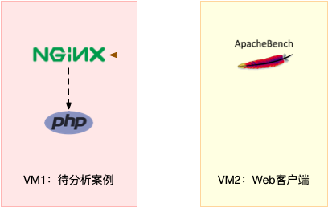
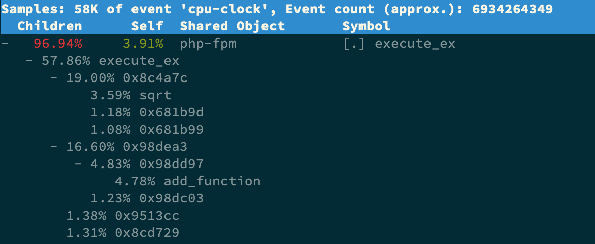

# 05 | 基础篇：某个应用的CPU使用率居然达到100%，我该怎么办？
你好，我是倪朋飞。

通过前两节对平均负载和 CPU 上下文切换的学习，我相信你对 CPU 的性能已经有了初步了解。不过我还是想问一下，在学这个专栏前，你最常用什么指标来描述系统的 CPU 性能呢？我想你的答案，可能不是平均负载，也不是 CPU 上下文切换，而是另一个更直观的指标—— CPU 使用率。

我们前面说过，CPU 使用率是单位时间内 CPU 使用情况的统计，以百分比的方式展示。那么，作为最常用也是最熟悉的 CPU 指标，你能说出 CPU 使用率到底是怎么算出来的吗？再有，诸如 top、ps 之类的性能工具展示的 %user、%nice、 %system、%iowait 、%steal 等等，你又能弄清楚它们之间的不同吗？

今天我就带你了解 CPU 使用率的内容，同时，我也会以我们最常用的反向代理服务器 Nginx 为例，带你在一步步操作和分析中深入理解。

## CPU 使用率

在上一期我曾提到，Linux 作为一个多任务操作系统，将每个 CPU 的时间划分为很短的时间片，再通过调度器轮流分配给各个任务使用，因此造成多任务同时运行的错觉。

为了维护 CPU 时间，Linux 通过事先定义的节拍率（内核中表示为 HZ），触发时间中断，并使用全局变量 Jiffies 记录了开机以来的节拍数。每发生一次时间中断，Jiffies 的值就加 1。

节拍率 HZ 是内核的可配选项，可以设置为 100、250、1000 等。不同的系统可能设置不同数值，你可以通过查询 /boot/config 内核选项来查看它的配置值。比如在我的系统中，节拍率设置成了 250，也就是每秒钟触发 250 次时间中断。

```shell
$ grep 'CONFIG_HZ=' /boot/config-$(uname -r)
CONFIG_HZ=250
```

同时，正因为节拍率 HZ 是内核选项，所以用户空间程序并不能直接访问。为了方便用户空间程序，内核还提供了一个用户空间节拍率 USER\_HZ，它总是固定为 100，也就是1/100秒。这样，用户空间程序并不需要关心内核中 HZ 被设置成了多少，因为它看到的总是固定值 USER\_HZ。

Linux 通过 /proc 虚拟文件系统，向用户空间提供了系统内部状态的信息，而 /proc/stat 提供的就是系统的 CPU 和任务统计信息。比方说，如果你只关注 CPU 的话，可以执行下面的命令：

```shell
# 只保留各个CPU的数据
$ cat /proc/stat | grep ^cpu
cpu  280580 7407 286084 172900810 83602 0 583 0 0 0
cpu0 144745 4181 176701 86423902 52076 0 301 0 0 0
cpu1 135834 3226 109383 86476907 31525 0 282 0 0 0
```

这里的输出结果是一个表格。其中，第一列表示的是 CPU 编号，如cpu0、cpu1 ，而第一行没有编号的 cpu ，表示的是所有 CPU 的累加。其他列则表示不同场景下 CPU 的累加节拍数，它的单位是 USER\_HZ，也就是 10 ms（1/100秒），所以这其实就是不同场景下的 CPU 时间。

当然，这里每一列的顺序并不需要你背下来。你只要记住，有需要的时候，查询 man proc 就可以。不过，你要清楚man proc文档里每一列的涵义，它们都是CPU使用率相关的重要指标，你还会在很多其他的性能工具中看到它们。下面，我来依次解读一下。

- user（通常缩写为 us），代表用户态 CPU 时间。注意，它不包括下面的 nice 时间，但包括了 guest 时间。

- nice（通常缩写为 ni），代表低优先级用户态 CPU 时间，也就是进程的 nice 值被调整为 1-19 之间时的 CPU 时间。这里注意，nice 可取值范围是 -20 到 19，数值越大，优先级反而越低。

- system（通常缩写为sys），代表内核态 CPU 时间。

- idle（通常缩写为id），代表空闲时间。注意，它不包括等待 I/O 的时间（iowait）。

- iowait（通常缩写为 wa），代表等待 I/O 的 CPU 时间。

- irq（通常缩写为 hi），代表处理硬中断的 CPU 时间。

- softirq（通常缩写为 si），代表处理软中断的 CPU 时间。

- steal（通常缩写为 st），代表当系统运行在虚拟机中的时候，被其他虚拟机占用的 CPU 时间。

- guest（通常缩写为 guest），代表通过虚拟化运行其他操作系统的时间，也就是运行虚拟机的 CPU 时间。

- guest\_nice（通常缩写为 gnice），代表以低优先级运行虚拟机的时间。


而我们通常所说的 **CPU 使用率，就是除了空闲时间外的其他时间占总 CPU 时间的百分比**，用公式来表示就是：


根据这个公式，我们就可以从 /proc/stat 中的数据，很容易地计算出 CPU 使用率。当然，也可以用每一个场景的CPU时间，除以总的CPU时间，计算出每个场景的CPU使用率。

不过先不要着急计算，你能说出，直接用 /proc/stat 的数据，算的是什么时间段的 CPU 使用率吗？

看到这里，你应该想起来了，这是开机以来的节拍数累加值，所以直接算出来的，是开机以来的平均 CPU 使用率，一般没啥参考价值。

事实上，为了计算 CPU 使用率，性能工具一般都会取间隔一段时间（比如3秒）的两次值，作差后，再计算出这段时间内的平均 CPU 使用率，即


这个公式，就是我们用各种性能工具所看到的CPU 使用率的实际计算方法。

现在，我们知道了系统 CPU 使用率的计算方法，那进程的呢？跟系统的指标类似，Linux 也给每个进程提供了运行情况的统计信息，也就是 /proc/\[pid\]/stat。不过，这个文件包含的数据就比较丰富了，总共有 52 列的数据。

当然，不用担心，因为你并不需要掌握每一列的含义。还是那句话，需要的时候，查 man proc 就行。

回过头来看，是不是说要查看 CPU 使用率，就必须先读取 /proc/stat 和 /proc/\[pid\]/stat 这两个文件，然后再按照上面的公式计算出来呢？

### 统计时间间隔

当然不是，各种各样的性能分析工具已经帮我们计算好了。不过要注意的是， **性能分析工具给出的都是间隔一段时间的平均 CPU 使用率，所以要注意间隔时间的设置**，特别是用多个工具对比分析时，你一定要保证它们用的是相同的间隔时间。

比如，对比一下 top 和 ps 这两个工具报告的 CPU 使用率，默认的结果很可能不一样，因为 top 默认使用 3 秒时间间隔，而 ps 使用的却是进程的整个生命周期。

这点很重要，我们看看下面的例子：

```shell
# 使用ab压测接口
[root@localhost ~]# ab -c 10 -n 10000   http://192.168.220.141:10000/

# 使用pidstat命令观察
# 当你只运行 pidstat，它会提供自系统启动以来的平均统计数据。这意味着它报告的是自系统启动以来所有进程的各项资源使用情况的平均值。
root@eden:~/linux-study/linux-perf-examples/nginx-high-cpu# pidstat
Linux 5.15.0-117-generic (eden)         08/01/2024      _x86_64_        (4 CPU)
03:57:06 PM   UID       PID    %usr %system  %guest   %wait    %CPU   CPU  Command
04:02:06 PM     1    127545    0.01    0.00    0.00    0.01    0.01     0  php-fpm
04:02:06 PM     1    127546    0.01    0.00    0.00    0.00    0.01     0  php-fpm
04:02:06 PM     1    127547    0.01    0.00    0.00    0.00    0.01     3  php-fpm
04:02:06 PM     1    127548    0.01    0.00    0.00    0.01    0.01     3  php-fpm
04:02:06 PM     1    127549    0.01    0.00    0.00    0.01    0.01     1  php-fpm


# 使用pidstat 5
# 当你运行 pidstat 5，它会每隔 5 秒采集一次数据并显示。这意味着你会看到每 5 秒时间段内的资源使用情况的统计信息。
# 这更适用于实时监控，因为它提供了连续的、定期的更新，帮助你观察进程的资源使用动态变化情况。
root@eden:~/linux-study/linux-perf-examples/nginx-high-cpu# pidstat 5
Linux 5.15.0-117-generic (eden)         08/01/2024      _x86_64_        (4 CPU)
03:57:06 PM   UID       PID    %usr %system  %guest   %wait    %CPU   CPU  Command
04:02:17 PM     1    127545   58.37    5.38    0.00   35.46   63.75     2  php-fpm
04:02:17 PM     1    127546   63.75    8.96    0.00   26.69   72.71     0  php-fpm
04:02:17 PM     1    127547   63.55    6.18    0.00   29.88   69.72     0  php-fpm
04:02:17 PM     1    127548   59.36   11.55    0.00   28.09   70.92     3  php-fpm
04:02:17 PM     1    127549   61.55    5.18    0.00   32.07   66.73     2  php-fpm

```

### pidstat的%CPU列

在使用 `pidstat` 或类似工具（如 `top`）监控 CPU 使用情况时，某些情况下 `%CPU` 值可能会超过 100%。这通常与系统的 CPU 核心数量有关。下面是一些可能导致这种情况的原因：

1. **多核处理器**：
   - 在多核处理器系统中，CPU 使用率的计算是基于所有核心的总和。因此，如果一个进程在一个双核系统上完全占用了两个核心的资源，它的 `%CPU` 使用率可能会显示为 200%（每个核心各 100%）。
   - 类似地，在四核系统上，单个进程的 `%CPU` 使用率最高可以达到 400%。

2. **超线程技术（Hyper-Threading）**：
   - 在支持超线程技术的系统上，每个物理核心可以表现为两个逻辑核心。这个逻辑核心的数量也会影响到 `%CPU` 的显示。如一个四核超线程 CPU 看起来像是 8 核（4个物理核心 * 2 个逻辑核心）。

**举例说明**

假设你有一个四核 CPU：

- 如果一个进程使用了一个核心的全部资源，那么它的 `%CPU` 将显示为 100%。
- 如果一个进程使用了两个核心的全部资源，那么它的 `%CPU` 将显示为 200%。
- 如果一个进程使用了所有四个核心的全部资源，那么它的 `%CPU` 将显示为 400%。

**`pidstat` 示例**

运行以下命令来观察 CPU 使用情况：

```sh
pidstat 5
```

你可能会看到如下输出（假设在一个四核系统上）：

```
#      Time   UID       PID    %usr %system  %guest    %CPU   CPU  Command
12:00:00 PM     0       1234    50.00    25.00     0.00   75.00     1  example-process
12:00:05 PM     0       5678   100.00     0.00     0.00  100.00     2  another-process
12:00:10 PM     0       1234   200.00     0.00     0.00  200.00     0  example-process
```

在这个例子中：
- `example-process` 在第二个时间点使用了两个核心的全部资源，显示为 200%。
- `another-process` 使用了一个核心的全部资源，显示为 100%。


## 怎么查看 CPU 使用率

知道了 CPU 使用率的含义后，我们再来看看要怎么查看 CPU 使用率。说到查看 CPU 使用率的工具，我猜你第一反应肯定是 top 和 ps。的确，top 和 ps 是最常用的性能分析工具：

- top 显示了系统总体的 CPU 和内存使用情况，以及各个进程的资源使用情况。

- ps 则只显示了每个进程的资源使用情况。


比如，top 的输出格式为：

```shell
# 默认每3秒刷新一次
$ top
top - 11:58:59 up 9 days, 22:47,  1 user,  load average: 0.03, 0.02, 0.00
Tasks: 123 total,   1 running,  72 sleeping,   0 stopped,   0 zombie
%Cpu(s):  0.3 us,  0.3 sy,  0.0 ni, 99.3 id,  0.0 wa,  0.0 hi,  0.0 si,  0.0 st
KiB Mem :  8169348 total,  5606884 free,   334640 used,  2227824 buff/cache
KiB Swap:        0 total,        0 free,        0 used.  7497908 avail Mem

  PID USER      PR  NI    VIRT    RES    SHR S  %CPU %MEM     TIME+ COMMAND
    1 root      20   0   78088   9288   6696 S   0.0  0.1   0:16.83 systemd
    2 root      20   0       0      0      0 S   0.0  0.0   0:00.05 kthreadd
    4 root       0 -20       0      0      0 I   0.0  0.0   0:00.00 kworker/0:0H
...
```

这个输出结果中，第三行 %Cpu 就是系统的 CPU 使用率，具体每一列的含义上一节都讲过，只是把CPU时间变换成了CPU使用率，我就不再重复讲了。不过需要注意，top 默认显示的是所有 CPU 的平均值，这个时候你只需要按下数字 1 ，就可以切换到每个 CPU 的使用率了。

继续往下看，空白行之后是进程的实时信息，每个进程都有一个 %CPU 列，表示进程的 CPU 使用率。它是用户态和内核态 CPU 使用率的总和，包括进程用户空间使用的 CPU、通过系统调用执行的内核空间 CPU 、以及在就绪队列等待运行的 CPU。在虚拟化环境中，它还包括了运行虚拟机占用的 CPU。（这里的包括内容有待确认）

所以，到这里我们可以发现， top 并没有细分进程的用户态CPU和内核态 CPU。那要怎么查看每个进程的详细情况呢？你应该还记得上一节用到的 pidstat 吧，它正是一个专门分析每个进程 CPU 使用情况的工具。

比如，下面的pidstat命令，就间隔1秒展示了进程的5组CPU使用率，包括：

- 用户态CPU使用率 （%usr）；

- 内核态CPU使用率（%system）；

- 运行虚拟机CPU使用率（%guest）；

- 等待 CPU使用率（%wait）；

- 以及总的CPU使用率（%CPU）。


最后的 Average 部分，还计算了 5 组数据的平均值。

```shell
# 每隔1秒输出一组数据，共输出5组
$ pidstat 1 5
15:56:02      UID       PID    %usr %system  %guest   %wait    %CPU   CPU  Command
15:56:03        0     15006    0.00    0.99    0.00    0.00    0.99     1  dockerd

...

Average:      UID       PID    %usr %system  %guest   %wait    %CPU   CPU  Command
Average:        0     15006    0.00    0.99    0.00    0.00    0.99     -  dockerd
```

## CPU 使用率过高怎么办？

通过 top、ps、pidstat 等工具，你能够轻松找到 CPU 使用率较高（比如 100% ）的进程。接下来，你可能又想知道，占用 CPU 的到底是代码里的哪个函数呢？找到它，你才能更高效、更针对性地进行优化。

我猜你第一个想到的，应该是 GDB（The GNU Project Debugger）， 这个功能强大的程序调试利器。的确，GDB 在调试程序错误方面很强大。但是，我又要来“挑刺”了。请你记住，GDB 并不适合在性能分析的早期应用。

为什么呢？因为 GDB 调试程序的过程会中断程序运行，这在线上环境往往是不允许的。所以，GDB 只适合用在性能分析的后期，当你找到了出问题的大致函数后，线下再借助它来进一步调试函数内部的问题。

那么哪种工具适合在第一时间分析进程的 CPU 问题呢？我的推荐是 perf。perf 是 Linux 2.6.31 以后内置的性能分析工具。它以性能事件采样为基础，不仅可以分析系统的各种事件和内核性能，还可以用来分析指定应用程序的性能问题。

使用 perf 分析 CPU 性能问题，我来说两种最常见、也是我最喜欢的用法。

第一种常见用法是 perf top，类似于 top，它能够实时显示占用 CPU 时钟最多的函数或者指令，因此可以用来查找热点函数，使用界面如下所示：

```shell
$ perf top
Samples: 833  of event 'cpu-clock', Event count (approx.): 97742399
Overhead  Shared Object       Symbol
   7.28%  perf                [.] 0x00000000001f78a4
   4.72%  [kernel]            [k] vsnprintf
   4.32%  [kernel]            [k] module_get_kallsym
   3.65%  [kernel]            [k] _raw_spin_unlock_irqrestore
...
```

采样数（Samples）是指 `perf` 在指定的时间窗口内实际采集的性能事件样本数。这些性能事件样本数具体指的是当前监控的特定性能事件。例如，在你的示例中，事件类型是 `cpu-clock`，因此采样数指的是在给定时间窗口内采集的 `cpu-clock` 性能事件的样本数。

常见的性能事件包括：

- `cpu-clock`：CPU时钟周期（时钟周期数）。
- `task-clock`：任务时钟（时间单位，通常为毫秒）。
- `cache-misses`：缓存未命中次数。
- `branch-misses`：分支预测错误次数。
- `instructions`：指令执行次数。

```shell
# 在执行 perf top 时，可以通过 -e 选项来指定要监控的性能事件类型
$ perf top -e cpu-clock
```

事件总数量是指自 `perf` 开始运行以来，累积的特定性能事件的总数。它提供了一个大致的事件计数。在你的示例中，事件总数量是 `97742399`，这意味着自 `perf` 开始监控以来，捕获了大约 `97742399` 个 CPU 时钟事件。

**采样数（Samples）**

采样数表示 `perf` 在监控期间采集到的性能事件样本数。`perf` 并不会记录每一个性能事件，而是根据设定的采样率（sampling rate）定期采集样本。

- 采样率：采样率决定了 `perf` 记录性能事件样本的频率。例如，如果采样率设置为每 1000 个 CPU 时钟周期采集一个样本，那么采样数将会表示在监控期间采集到的这些样本总数。
- 特定时间窗口内的样本：采样数显示的是在当前监控周期内采集到的样本数量，通常用于实时分析。

**事件总数量（Event count）**

事件总数量是自 `perf` 开始运行以来，累积的特定类型性能事件的总数。它表示性能事件发生的总次数，而不是采样数。

- 总事件计数：表示实际发生的性能事件的总数，通常是一个估算值，因为并不是所有事件都会被记录。
- 整个监控期间：事件总数量显示的是自 `perf` 开始监控以来累积的事件总数量，不局限于当前时间窗口。

另外， **采样数需要我们特别注意**。如果采样数过少（比如只有十几个），那下面的排序和百分比就没什么实际参考价值了。

### Overhead含义

1. CPU 时钟周期事件（cpu-clock）

- 事件类型：`cpu-clock`
- Overhead 含义：表示特定函数或指令占用的 CPU 时钟周期的百分比。
- 解释：如果 `Overhead` 为 7.28%，意味着在所有采样(Samples)到的 CPU 时钟周期中，有 7.28% 的时间花费在这个函数或指令上。

2. 指令事件（instructions）

- **事件类型**：`instructions`
- **Overhead 含义**：表示特定函数或指令执行的指令数量占总采样指令数量的百分比。
- **解释**：如果 `Overhead` 为 4.72%，意味着在所有采样到的指令中，有 4.72% 是由这个函数或指令执行的。

3. 缓存未命中事件（cache-misses）

- **事件类型**：`cache-misses`
- **Overhead 含义**：表示特定函数或指令导致的缓存未命中数量占总采样缓存未命中数量的百分比。
- **解释**：如果 `Overhead` 为 3.65%，意味着在所有采样到的缓存未命中事件中，有 3.65% 是由这个函数或指令导致的。

4. 分支预测错误事件（branch-misses）

- **事件类型**：`branch-misses`
- **Overhead 含义**：表示特定函数或指令导致的分支预测错误数量占总采样分支预测错误数量的百分比。
- **解释**：如果 `Overhead` 为 2.34%，意味着在所有采样到的分支预测错误事件中，有 2.34% 是由这个函数或指令导致的。

5. 自定义事件

- **事件类型**：可以是自定义的硬件或软件事件。
- **Overhead 含义**：表示特定函数或指令在自定义事件采样中的百分比。
- **解释**：具体含义取决于自定义事件的定义，例如某些特定的硬件计数器或软件计数器事件。

### Shared Object

表示符号所属的共享对象或模块。例如，`perf` 表示符号属于 `perf` 工具自身，`[kernel]` 表示符号属于内核模块。

### Symbol

表示具体的函数名或指令地址。例如，`0x00000000001f78a4` 是特定指令的内存地址，`vsnprintf` 是内核函数名。

还是以上面的输出为例，我们可以看到，占用 CPU 时钟最多的是 perf 工具自身，不过它的比例也只有 7.28%，说明系统并没有 CPU 性能问题。 perf top的使用你应该很清楚了吧。


接着再来看第二种常见用法，也就是 perf record 和 perf report。 perf top 虽然实时展示了系统的性能信息，但它的缺点是并不保存数据，也就无法用于离线或者后续的分析。而 perf record 则提供了保存数据的功能，保存后的数据，需要你用 perf report 解析展示。

```shell
$ perf record # 按Ctrl+C终止采样
[ perf record: Woken up 1 times to write data ]
[ perf record: Captured and wrote 0.452 MB perf.data (6093 samples) ]

$ perf report # 展示类似于perf top的报告
```

在实际使用中，我们还经常为 perf top 和 perf record 加上 -g 参数，开启调用关系的采样，方便我们根据调用链来分析性能问题。

## 案例

下面我们就以 Nginx + PHP 的 Web 服务为例，来看看当你发现 CPU 使用率过高的问题后，要怎么使用 top 等工具找出异常的进程，又要怎么利用 perf 找出引发性能问题的函数。

### 你的准备

以下案例基于 Ubuntu 18.04，同样适用于其他的 Linux 系统。我使用的案例环境如下所示：

- 机器配置：2 CPU，8GB 内存

- 预先安装 docker、sysstat、perf、ab 等工具，如 apt install docker.io sysstat linux-tools-common apache2-utils


我测试使用Ubuntu20.04，内核5.15.0-117-generic，通过上面的指令无法安装，改用下面的方式：

```shell
root@eden:~# apt install sysstat linux-tools-common apache2-utils
root@eden:~# perf top
WARNING: perf not found for kernel 5.15.0-117

  You may need to install the following packages for this specific kernel:
    linux-tools-5.15.0-117-generic
    linux-cloud-tools-5.15.0-117-generic

  You may also want to install one of the following packages to keep up to date:
    linux-tools-generic
    linux-cloud-tools-generic
root@eden:~# apt-get install linux-tools-5.15.0-117-generic linux-cloud-tools-5.15.0-117-generic
# 安装过程中会报下面的错误
Setting up linux-cloud-tools-common (5.4.0-190.210) ...
A dependency job for hv-kvp-daemon.service failed. See 'journalctl -xe' for details.
# hv-kvp-daemon.service 是一个与 Hyper-V 虚拟化相关的服务。如果你不在 Hyper-V 虚拟化环境中运行，这个服务可能对你没有影响
```


我先简单介绍一下这次新使用的工具 ab。ab（apache bench）是一个常用的 HTTP 服务性能测试工具，这里用来模拟 Ngnix 的客户端。由于 Nginx 和 PHP 的配置比较麻烦，我把它们打包成了两个 [Docker 镜像](https://github.com/feiskyer/linux-perf-examples/tree/master/nginx-high-cpu)，这样只需要运行两个容器，就可以得到模拟环境。

注意，这个案例要用到两台虚拟机，如下图所示：



你可以看到，其中一台用作 Web 服务器，来模拟性能问题；另一台用作 Web 服务器的客户端，来给 Web 服务增加压力请求。使用两台虚拟机是为了相互隔离，避免“交叉感染”。

接下来，我们打开两个终端，分别 SSH 登录到两台机器上，并安装上面提到的工具。

```shell
#另外一台机器位centos7，安装下面的httpd工具，也就是curl命令
yum install httpd

curl --noproxy '*' -v http://192.168.220.141:10000/
--noproxy '*' 表示忽略所有代理，并直接访问目标地址。
```

还是同样的“配方”。下面的所有命令，都默认假设以 root 用户运行，如果你是普通用户身份登陆系统，一定要先运行 sudo su root 命令切换到 root 用户。到这里，准备工作就完成了。

不过，操作之前，我还想再说一点。这次案例中 PHP 应用的核心逻辑比较简单，大部分人一眼就可以看出问题，但你要知道，实际生产环境中的源码就复杂多了。

所以，我希望你在按照步骤操作之前，先不要查看源码（避免先入为主），而是 **把它当成一个黑盒来分析。** 这样，你可以更好地理解整个解决思路，怎么从系统的资源使用问题出发，分析出瓶颈所在的应用、以及瓶颈在应用中的大概位置。

### 操作和分析

接下来，我们正式进入操作环节。

首先，在第一个终端执行下面的命令来运行 Nginx 和 PHP 应用：

```shell
$ docker run --name nginx -p 10000:80 -itd feisky/nginx # 这里其实应该加上tag，本地build镜像，直接使用本地的镜像
$ docker run --name phpfpm -itd --network container:nginx feisky/php-fpm
```

然后，在第二个终端使用 curl 访问 http://\[VM1的IP\]:10000，确认 Nginx 已正常启动。你应该可以看到 It works! 的响应。

```shell
# 192.168.0.10是第一台虚拟机的IP地址
$ curl http://192.168.0.10:10000/
It works!
```

接着，我们来测试一下这个 Nginx 服务的性能。在第二个终端运行下面的 ab 命令：

```shell
# 并发10个请求测试Nginx性能，总共测试100个请求
$ ab -c 10 -n 100 http://192.168.0.10:10000/
This is ApacheBench, Version 2.3 <$Revision: 1706008 $>
Copyright 1996 Adam Twiss, Zeus Technology Ltd,
...
Requests per second:    11.63 [#/sec] (mean)
Time per request:       859.942 [ms] (mean)
...
```

从ab的输出结果我们可以看到，Nginx能承受的每秒平均请求数只有 11.63。你一定在吐槽，这也太差了吧。那到底是哪里出了问题呢？我们用 top 和 pidstat 再来观察下。

这次，我们在第二个终端，将测试的请求总数增加到 10000。这样当你在第一个终端使用性能分析工具时， Nginx 的压力还是继续。

继续在第二个终端，运行 ab 命令：

```shell
$ ab -c 10 -n 10000 http://192.168.0.10:10000/
```

接着，回到第一个终端运行 top 命令，并按下数字 1 ，切换到每个 CPU 的使用率：

```shell
$ top
...
%Cpu0  : 98.7 us,  1.3 sy,  0.0 ni,  0.0 id,  0.0 wa,  0.0 hi,  0.0 si,  0.0 st
%Cpu1  : 99.3 us,  0.7 sy,  0.0 ni,  0.0 id,  0.0 wa,  0.0 hi,  0.0 si,  0.0 st
...
  PID USER      PR  NI    VIRT    RES    SHR S  %CPU %MEM     TIME+ COMMAND
21514 daemon    20   0  336696  16384   8712 R  41.9  0.2   0:06.00 php-fpm
21513 daemon    20   0  336696  13244   5572 R  40.2  0.2   0:06.08 php-fpm
21515 daemon    20   0  336696  16384   8712 R  40.2  0.2   0:05.67 php-fpm
21512 daemon    20   0  336696  13244   5572 R  39.9  0.2   0:05.87 php-fpm
21516 daemon    20   0  336696  16384   8712 R  35.9  0.2   0:05.61 php-fpm
```

这里可以看到，系统中有几个 php-fpm 进程的 CPU 使用率加起来接近 200%；而每个 CPU 的用户使用率（us）也已经超过了 98%，接近饱和。这样，我们就可以确认，正是用户空间的 php-fpm 进程，导致CPU 使用率骤升。

这里是用docker容器来进行测试的，所以映射到主机上的进程信息会有所改变，这里可以仔细研究一下容器运行时是如何处理的。理论上说我们知道是php-fpm进程CPU使用率高，但是我们并不知道这是哪个容器里面的进程，所以排查基于容器的性能问题还需要深入学习。

那再往下走，怎么知道是 php-fpm 的哪个函数导致了 CPU 使用率升高呢？我们来用 perf 分析一下。在第一个终端运行下面的perf命令：

```shell
# -g开启调用关系分析，-p指定php-fpm的进程号21515
$ perf top -g -p 21515
```

按方向键切换到 php-fpm，再按下回车键展开 php-fpm 的调用关系，你会发现，调用关系最终到了 sqrt 和 add\_function。看来，我们需要从这两个函数入手了。



我们拷贝出 [Nginx 应用的源码](https://github.com/feiskyer/linux-perf-examples/blob/master/nginx-high-cpu/app/index.php)，看看是不是调用了这两个函数：

```shell
# 从容器phpfpm中将PHP源码拷贝出来
$ docker cp phpfpm:/app .

# 使用grep查找函数调用
$ grep sqrt -r app/ #找到了sqrt调用
app/index.php:  $x += sqrt($x);
$ grep add_function -r app/ #没找到add_function调用，这其实是PHP内置函数
```

OK，原来只有 sqrt 函数在 app/index.php 文件中调用了。那最后一步，我们就该看看这个文件的源码了：

```shell
$ cat app/index.php
<?php
// test only.
$x = 0.0001;
for ($i = 0; $i <= 1000000; $i++) {
  $x += sqrt($x);
}

echo "It works!"
```

呀，有没有发现问题在哪里呢？我想你要笑话我了，居然犯了一个这么傻的错误，测试代码没删就直接发布应用了。为了方便你验证优化后的效果，我把修复后的应用也打包成了一个Docker镜像，你可以在第一个终端中执行下面的命令来运行它：

```shell
# 停止原来的应用
$ docker rm -f nginx phpfpm
# 运行优化后的应用
$ docker run --name nginx -p 10000:80 -itd feisky/nginx:cpu-fix
$ docker run --name phpfpm -itd --network container:nginx feisky/php-fpm:cpu-fix
```

接着，到第二个终端来验证一下修复后的效果。首先Ctrl+C停止之前的ab命令后，再运行下面的命令：

```shell
$ ab -c 10 -n 10000 http://10.240.0.5:10000/
...
Complete requests:      10000
Failed requests:        0
Total transferred:      1720000 bytes
HTML transferred:       90000 bytes
Requests per second:    2237.04 [#/sec] (mean)
Time per request:       4.470 [ms] (mean)
Time per request:       0.447 [ms] (mean, across all concurrent requests)
Transfer rate:          375.75 [Kbytes/sec] received
...
```

从这里你可以发现，现在每秒的平均请求数，已经从原来的11变成了2237。

你看，就是这么很傻的一个小问题，却会极大的影响性能，并且查找起来也并不容易吧。当然，找到问题后，解决方法就简单多了，删除测试代码就可以了。

## 小结

CPU 使用率是最直观和最常用的系统性能指标，更是我们在排查性能问题时，通常会关注的第一个指标。所以我们更要熟悉它的含义，尤其要弄清楚用户（%user）、Nice（%nice）、系统（%system） 、等待 I/O（%iowait） 、中断（%irq）以及软中断（%softirq）这几种不同 CPU 的使用率。比如说：

- 用户 CPU 和 Nice CPU 高，说明用户态进程占用了较多的 CPU，所以应该着重排查进程的性能问题。

- 系统 CPU 高，说明内核态占用了较多的 CPU，所以应该着重排查内核线程或者系统调用的性能问题。

- I/O 等待 CPU 高，说明等待 I/O 的时间比较长，所以应该着重排查系统存储是不是出现了 I/O 问题。

- 软中断和硬中断高，说明软中断或硬中断的处理程序占用了较多的 CPU，所以应该着重排查内核中的中断服务程序。


碰到 CPU 使用率升高的问题，你可以借助 top、pidstat 等工具，确认引发 CPU 性能问题的来源；再使用 perf 等工具，排查出引起性能问题的具体函数。


## 问题

执行perf top -g -p  （php-fpm进程号），发现不了sqrt函数？

作者回复: 只看到地址而不是函数名是由于应用程序运行在容器中，它的依赖也都在容器内部，故而perf无法找到PHP符号表。一个简单的解决方法是使用perf record生成perf.data拷贝到容器内部 perf report。

```shell
# 先在宿主机上使用 perf record 采集容器内进程的数据。
# 这会生成一个 perf.data 文件，其中包含采集的性能数据。
perf record -p <php-fpm进程号> -g

# 使用 docker cp 或其他方法将生成的 perf.data 文件拷贝到容器内部。
docker cp /path/to/perf.data <container_id>:/path/inside/container/

# 进入容器内部，然后使用 perf report 解析 perf.data 文件。
# 在容器内部运行 perf report 可以正确解析符号，因为容器内部有完整的符号表和调试信息。
docker exec -it <container_id> /bin/bash
cd /path/inside/container/
perf report

```


