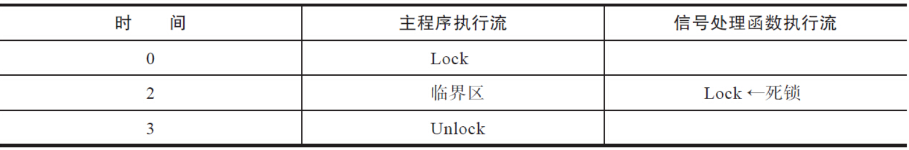

# 信号

**信号是一种软件中断，用来处理异步事件。内核递送这些异步事件到某个进程，告诉进程某个特殊事件发生了。**这些异步事件，可能来自硬件，比如访问了非法的内存地址，或者除以0了；可能来自用户的输入，比如shell终端上用户在键盘上敲击了Ctrl+C；还可能来自另一个进程（一个进程可以使用 `kill` 系统调用向另一个进程发送 `SIGTERM` 信号；一个进程可以使用 `kill` 系统调用向另一个进程发送 `SIGSTOP` 信号，以暂停该进程的执行。），甚至有些来自进程自身（进程可以设置一个定时器，当定时器到期时，内核会发送 `SIGALRM` 信号给该进程）。

**信号的本质是一种进程间的通信，一个进程向另一个进程发送信号，内核至少传递了信号值这个字段。实际上，通信的内容不止是信号值。**

信号机制是Unix家族里一个古老的通信机制。传统的信号机制有一些弊端，更为严重的是，信号处理函数的执行流和正常的执行流同时存在，给编程带来了很多的麻烦和困扰，一不小心就可能掉入陷阱。本章将会介绍信号的方方面面，包括传统信号的弊端，Linux对信号机制的改进，以及信号机制里面的陷阱，希望对读者能有所帮助。

## 信号的完整生命周期

前文提到过，**信号的本质是一种进程间的通信。进程之间约定好：如果发生了某件事情T（trigger），就向目标进程（destination process）发送某特定信号X，而目标进程看到X，就意识到T事件发生了，目标进程就会执行相应的动作A（action）。**

接下来以配置文件改变为例，来描述整个过程。很多应用都有配置文件，如果配置文件发生改变，需要通知进程重新加载配置。一般而言，程序会默认采用SIGHUP信号来通知目标进程重新加载配置文件。

目标进程首先约定，只要收到SIGHUP，就执行重新加载配置文件的动作。这个行为称为信号的安装（installation），或者信号处理函数的注册。安装好了之后，因为信号是异步事件，不知道何时会发生，所以目标进程依然正常地干自己的事情。某年某月的某一天，管理员突然改变了配置文件，想通知这个目标进程，于是就向目标进程发送了信号。他可能在终端执行了`kill-SIGHUP`命令，也可能调用了C的API，不管怎样，信号产生了。**这时候，Linux内核收到了产生的信号，然后就在目标进程的进程描述符里记录了一笔：收到信号SIGHUP一枚。Linux内核会在适当的时机，将信号递送（deliver）给进程。在内核收到信号，但是还没有递送给目标进程的这一段时间里，信号处于挂起状态，被称为挂起（pending）信号，也称为未决信号。内核将信号递送给进程，进程就会暂停当前的控制流，转而去执行信号处理函数。这就是一个信号的完整生命周期。**

一个典型的信号会按照上面所述的流程来处理，但是实际情况要复杂得多，还有很多场景需要考虑，比如：

- 目标进程正在执行关键代码，不能被信号中断，需要阻塞某些信号，那么在这期间，信号就不允许被递送到进程，直到目标进程解除阻塞。
- 内核发现同一个信号已经存在，那么它该如何处理这种重复的信号，排队还是丢弃？
- 内核递送信号的时候，发现已有多个不同的信号被挂起，那它应该优先递送哪个信号？
- 对于多线程的进程，如果向该进程发送信号，应该由哪个线程来负责响应？

这些问题，在接下来的章节中会逐一得到解决。

## 信号的产生

作为进程间通信的一种手段，进程之间可以互相发送信号，然而发给进程的信号，通常源于内核，包括：

- 硬件异常。
- 终端相关的信号。
- 软件事件相关的信号。

### 硬件异常

硬件检测到了错误并通知内核，由内核发送相应的信号给相关进程。和硬件异常相关的信号见表6-1。


常见的能触发SIGBUS信号的场景有：

- 变量地址未对齐：很多架构访问数据时有对齐的要求。比如int型变量占用4个字节，因此架构要求int变量的地址必须为4字节对齐，否则就会触发SIGBUS信号。
- mmap映射文件：使用mmap将文件映射入内存，如果文件大小被其他进程截短，那么在访问文件大小以外的内存时，会触发SIGBUS信号。

虽然SIGFPE的后缀FPE是浮点异常（Float Point Exception）的含义，但是该异常并不限于浮点运算，常见的算术运算错误也会引发SIGFPE信号。最常见的就是“整数除以0”的例子。

SIGILL的含义是非法指令（illegal instruction）。一般表示进程执行了错误的机器指令。下面来看一段示例代码：

```c
typedef void(*FUNC)(void);
int main(void)
{
    const static unsigned char insn[4] = { 0xff, 0xff, 0xff, 0xff };
    FUNC function = (FUNC) insn;
    function();
}
```

上述代码中，因为函数地址不是合法有效的值，所以触发了SIGILL错误。发生这种错误，一般是函数指针遭到破坏，当执行函数指针指向的函数时，就会触发SIGILL信号。另外也可能是由指令集的演进引起的。比如，很多在新的体系结构中编译出来的可执行程序，在老的机器上可能会无法运行，故而在老机器上运行时，也可能产生SIGILL信号。

SIGSEGV是所有C程序员的噩梦。没经历几个刻骨铭心的段错误，很难成长为合格的C程序员。由于C语言可以直接操作指针，就像时常行走在河边的顽童很难避免湿鞋一样，程序员很难避免段错误，没有经验的程序员更是如此。常见的情况有：

- 访问未初始化的指针或NULL指针指向的地址。
- 进程企图在用户态访问内核部分的地址。
- 进程尝试去修改只读的内存地址。

当然，程序员不会直接去做这种傻事，一般来说是由于程序的错误，导致原本存放的指针被篡改成错乱值，因而在访问指针指向的变量时，触发了SIGSEGV信号。

前面所讲的这四种硬件异常，一般是由程序自身引发的，不是由其他进程发送的信号引发的，并且这些异常都比较致命，以至于进程无法继续下去。所以这些信号产生之后，会立刻递送给进程。默认情况下，这四种信号都会使进程终止，并且产生core dump文件以供调试。对于这些信号，进程既不能忽略，也不能阻塞。

### 终端相关的信号

对于Linux程序员而言，终端操作是免不了的。终端有很多的设置，可以通过执行如下指令来查看：

```shell
root@LVS-OPS-172-22-175-192:~# stty -a
speed 38400 baud; rows 47; columns 147; line = 0;
intr = ^C; quit = ^\; erase = ^H; kill = ^U; eof = ^D; eol = <undef>; eol2 = <undef>; swtch = <undef>; start = ^Q; stop = ^S; susp = ^Z; rprnt = ^R;
werase = ^W; lnext = ^V; discard = ^O; min = 1; time = 0;
-parenb -parodd -cmspar cs8 -hupcl -cstopb cread -clocal -crtscts
-ignbrk -brkint -ignpar -parmrk -inpck -istrip -inlcr -igncr icrnl ixon -ixoff -iuclc ixany -imaxbel iutf8
opost -olcuc -ocrnl onlcr -onocr -onlret -ofill -ofdel nl0 cr0 tab0 bs0 vt0 ff0
isig icanon iexten echo echoe echok -echonl -noflsh -xcase -tostop -echoprt echoctl echoke -flusho -extproc
```

很重要的是，终端定义了如下几种信号生成字符：

- Ctrl+C：产生SIGINT信号。
- Ctrl+\：产生SIGQUIT信号。
- Ctrl+Z：产生SIGTSTP信号。

键入这些信号生成字符，相当于向前台进程组发送了对应的信号。

另一个和终端关系比较密切的信号是SIGHUP信号。很多程序员都遇到过这种问题：使用`ssh`登录到远程的Linux服务器，执行比较耗时的操作（如编译项目代码），却因为网络不稳定，或者需要关机回家，`ssh`连接被断开，最终导致操作中途被放弃而失败。

之所以会如此，是因为一个控制进程在失去其终端之后，内核会负责向其发送一个SIGHUP信号。在登录会话中，`shell`通常是终端的控制进程，控制进程收到SIGHUP信号后，会引发如下的连锁反应。

`shell`收到SIGHUP后会终止，但是在终止之前，会向由`shell`创建的前台进程组和后台进程组发送SIGHUP信号，为了防止处于停止状态的任务接收不到SIGHUP信号，通常会在SIGHUP信号之后，发送SIGCONT信号，唤醒处于停止状态的任务。前台进程组和后台进程组的进程收到SIGHUP信号，默认的行为是终止进程，这也是前面提到的耗时任务会中途失败的原因。

注意，单纯地将命令放入后台执行（通过`&`符号，如下所示），并不能摆脱被SIGHUP信号追杀的命运。

```shell
command &
root@LVS-OPS-172-22-175-192:~# sleep 20000 &
[1] 3908009
root@LVS-OPS-172-22-175-192:~# ps ajxf |grep 3388078
   PPID     PID    PGID     SID TTY        TPGID STAT   UID   TIME COMMAND
3387799 3388078 3388078 3388078 pts/0    3915694 Ss       0   0:00  |   \_ -bash
3388078 3908009 3908009 3388078 pts/0    3915694 S        0   0:00  |   |   \_ sleep 20000
3388078 3915694 3915694 3388078 pts/0    3915694 R+       0   0:00  |   |   \_ ps ajxf
3388078 3915695 3915694 3388078 pts/0    3915694 S+       0   0:00  |   |   \_ grep --color=auto 3388078

```

那么如何让进程在后台稳定地执行而不受终端连接断开的影响呢？可以采用如下方法。

**1.nohup**

可以使用如下方式执行命令：

```shell
nohup command
```

标准输入会重定向到`/dev/null`，标准输出和标准错误会重定向到`nohup.out`，如果无权限写入当前目录下的`nohup.out`，则会写入`home`目录下的`nohup.out`。

**2.setsid**

使用如下方式执行命令：

```shell
setsid command
```

这种方式和`nohup`的原理不太一样。`nohup`仅仅是使启动的进程不再响应SIGHUP信号，但是`setsid`则完全不属于`shell`所在的会话了，并且其父进程也已经不是`shell`而是`init`进程了。

```shell
manu@manu-hacks:~$ nohup sleep 200 &
[1] 11686
nohup: 忽略输入并把输出追加到"nohup.out"
manu@manu-hacks:~$ ps -o cmd,pid,ppid,pgid,sid,etime
CMD                           PID  PPID  PGID   SID     ELAPSED
-bash                       11365 11364 11365 11365       03:59
sleep 200                   11686 11365 11686 11365       00:30
ps -o cmd,pid,ppid,pgid,sid 11750 11365 11750 11365       00:00
manu@manu-hacks:~$ setsid sleep 300 &
[1] 11910
[1]+  已完成               setsid sleep 300
manu@manu-hacks:~$ ps -p 11912 -o cmd,pid,ppid,pgid,sid,etime
CMD                           PID  PPID  PGID   SID     ELAPSED
sleep 300                   11912     1 11912 11912       00:48
```

**3.disown**

很多情况下，启动命令时，忘记了使用`nohup`或`setsid`，可还有办法亡羊补牢？

答案是使用作业控制里面的`disown`，方法如下：

```shell
manu@manu-hacks:~$ sleep 1004 &
[1] 13861  # 这个输出显示了作业的信息。[1] 表示这是第一个作业，13861 是该作业的进程 ID。
manu@manu-hacks:~$ jobs -l # 这个命令用于列出当前 shell 中的作业。-l 选项表示显示作业的 PID 和作业状态。
[1]+ 13861 Running             sleep 1004 &
manu@manu-hacks:~$ disown %1 # 这个命令将作业 %1（即第一个作业）从 shell 的作业控制中分离。这意味着即使退出当前 shell，该作业仍会继续在后台运行。
manu@manu-hacks:~$ jobs -l
manu@manu-hacks:~$ exit # 这个命令用于退出当前 shell 会话。在这种情况下，由于之前使用了 disown 命令分离了作业，即使退出当前 shell，sleep 1004 这个作业仍会继续在后台运行，不受影响。
```

使用`disown`之后，`shell`退出时，就不会向这些进程发送SIGHUP信号了。在另一个终端上，仍然可以看到`sleep 1004`在运行：

```shell
manu@manu-hacks:~$ ps -ef|grep sleep
manu     13861     1  0 12:42 ?        00:00:00 sleep 1004
```

当然，还有其他的方法可以做到这点，如`screen`命名。对这个感兴趣的朋友可以阅读网上的参考资料。

### 软件事件相关的信号

软件事件触发信号产生的情况也比较多：

- 子进程退出，内核可能会向父进程发送SIGCHLD信号。
- 父进程退出，内核可能会给子进程发送信号。
- 定时器到期，给进程发送信号。

我们已熟知子进程退出时会向父进程发送SIGCHLD信号。这点在第4章中已经做了很详细的分析。

与子进程退出向父进程发送信号相反，有时候，进程希望父进程退出时向自己发送信号，从而可以得知父进程的退出事件。Linux也提供了这种机制。

每一个进程的进程描述符`task_struct`中都存在如下成员变量：

```c
int pdeath_signal;  /*  The signal sent when the parent dies  */
```

如果父进程退出，子进程希望收到通知，那么子进程可以通过执行如下代码来做到：

```c
prctl(PR_SET_PDEATHSIG, sig);
```

父进程退出时，会遍历其子进程，发现有子进程很关心自己的退出，就会向该子进程发送子进程希望收到的信号。

很多定时器相关的函数，背后都牵扯到信号，具体见表6-2（表6-2　定时器相关的信号）。


## 信号的默认处理函数

从上一节可以看出，信号产生的源头有很多。那么内核将信号递送给进程后，进程会执行什么操作呢？

很多信号尤其是传统的信号，都会有默认的信号处理方式。如果我们不改变信号的处理函数，那么收到信号之后，就会执行默认的操作。

信号的默认操作有以下几种：

- 显式地忽略信号：即内核将会丢弃该信号，信号不会对目标进程产生任何影响。
- 终止进程：很多信号的默认处理是终止进程，即将进程杀死。
- 生成核心转储文件并终止进程：进程被杀死，并且产生核心转储文件。核心转储文件记录了进程死亡现场的信息。用户可以使用核心转储文件来调试，分析进程死亡的原因。
- 停止进程：停止进程不同于终止进程，终止进程是进程已经死亡，但是停止进程仅仅是使进程暂停，将进程的状态设置成TASK_STOPPED，一旦收到恢复执行的信号，进程还可以继续执行。
- 恢复进程的执行：和停止进程相对应，某些信号可以使进程恢复执行。

这5种行为的简单标记如下：

- ignore
- terminate
- core
- stop
- continue

事实上，根据信号的默认操作，可以将传统信号分成5派，具体见表6-3到表6-7。

**表6-3　ignore派的信号**

`SIGCHLD` 信号是属于子进程状态改变的信号类别。当子进程改变状态时，内核会向父进程发送 `SIGCHLD` 信号，以通知父进程子进程的状态变化，父进程可以通过捕获这个信号来处理子进程的状态改变。通常情况下，父进程会调用 `wait()` 或 `waitpid()` 等系统调用来获取子进程的退出状态，以避免僵尸进程的产生。


**表6-4　terminate派的信号**


**表6-5　core派的信号**


**表6-6　stop派的信号**


**表6-7　continue派的信号**


信号的这些默认行为是非常有用的。比如停止行为和恢复执行。系统可能有一些备份的工作，这些工作优先级并不高，但是却消耗了大量的I/O资源，甚至是CPU资源（比如需要先压缩再备份）。这样的工作一般是在夜深人静，业务稀少的时候进行的。在业务比较繁忙的情况下，如果备份工作还在进行，则可能会影响到业务。这时候停止和恢复就非常有用了。在业务繁忙之前，可以通过SIGSTOP信号将备份进程暂停，在几乎没有什么业务的时候，通过SIGCONT信号使备份进程恢复执行。

很多信号产生核心转储文件也是非常有意义的。一般而言，程序出错才会导致SIGSEGV、SIGBUS、SIGFPE、SIGILL及SIGABRT等信号的产生。生成的核心转储文件保留了进程死亡的现场，提供了大量的信息供程序员调试、分析错误产生的原因。核心转储文件的作用有点类似于航空中的黑盒子，可以帮助程序员还原事故现场，找到程序漏洞。

很多情况下，默认的信号处理函数，可能并不能满足实际的需要，这时需要修改信号的信号处理函数。信号发生时，不执行默认的信号处理函数，改而执行用户自定义的信号处理函数。为信号指定新的信号处理函数的动作，被称为信号的安装。glibc提供了`signal`函数和`sigaction`函数来完成信号的安装。`signal`出现得比较早，接口也比较简单，`sigaction`则提供了精确的控制。

## 信号的分类

在Linux的`shell`终端，执行`kill -l`，可以看到所有的信号：

```shell
 1) SIGHUP      2) SIGINT         3) SIGQUIT        4) SIGILL          5) SIGTRAP
 6) SIGABRT     7) SIGBUS         8) SIGFPE         9) SIGKILL        10) SIGUSR1
11) SIGSEGV    12) SIGUSR2       13) SIGPIPE       14) SIGALRM        15) SIGTERM
16) SIGSTKFLT  17) SIGCHLD       18) SIGCONT       19) SIGSTOP        20) SIGTSTP
21) SIGTTIN    22) SIGTTOU       23) SIGURG        24) SIGXCPU        25) SIGXFSZ
26) SIGVTALRM  27) SIGPROF       28) SIGWINCH      29) SIGIO          30) SIGPWR
31) SIGSYS      34) SIGRTMIN     35) SIGRTMIN+1   36) SIGRTMIN+2  37) SIGRTMIN+3
38) SIGRTMIN+4  39) SIGRTMIN+5   40) SIGRTMIN+6   41) SIGRTMIN+7  42) SIGRTMIN+8
43) SIGRTMIN+9  44) SIGRTMIN+10  45) SIGRTMIN+11  46) SIGRTMIN+12 47) SIGRTMIN+13
48) SIGRTMIN+14 49) SIGRTMIN+15  50) SIGRTMAX-14  51) SIGRTMAX-13 52) SIGRTMAX-12
53) SIGRTMAX-11 54) SIGRTMAX-10  55) SIGRTMAX-9   56) SIGRTMAX-8  57) SIGRTMAX-7
58) SIGRTMAX-6  59) SIGRTMAX-5   60) SIGRTMAX-4   61) SIGRTMAX-3  62) SIGRTMAX-2
63) SIGRTMAX-1  64) SIGRTMAX
```

这些信号可以分成两类：

- 可靠信号。
- 不可靠信号。

信号值在[1，31]之间的所有信号，都被称为不可靠信号；在[SIGRTMIN，SIGRTMAX]之间的信号，被称为可靠信号。

不可靠信号是从传统的Unix继承而来的。早期Unix系统信号的机制并不完备，在实践过程中暴露了很多弊端，因此把这些早期出现的信号值在[1，31]之间的信号称之为不可靠信号。**所谓不可靠，指的是发送的信号，内核不一定能递送给目标进程，信号可能会丢失。**

随着时间的流逝，人们意识到原有的信号机制存在弊端。但是[1，31]之间的信号存在已久，在很多应用中被广泛使用，出于兼容性的考虑，不能改变这些信号的行为模式，所以只能新增信号。新增的信号就是我们今天看到的在[SIGRTMIN，SIGRTMAX]范围内的信号，它们被称为可靠信号。

对信号有了初步了解后，知道`signal`和`sigaction`函数接口的读者可能会产生误解，认为用`signal`函数安装、用`kill`函数（或者`tkill`函数）发送的信号，就是不可靠信号；用`sigaction`函数安装、用`sigqueue`函数发送的信号，就是可靠信号。这种理解是错误的。信号的可靠与否，完全取决于信号的值，而与采用哪种方式安装或发送无关。

说了这么多，不可靠信号和可靠信号的根本差异到底在哪里？根本差异在于收到信号后，内核有不同的处理方式。

**对于不可靠信号，内核用位图来记录该信号是否处于挂起状态。如果收到某不可靠信号，内核发现已经存在该信号处于未决状态，就会简单地丢弃该信号。因此发送不可靠信号，信号可能会丢失，即内核递送给目标进程的次数，可能小于信号发送的次数。**

**对于可靠信号，内核内部有队列来维护，如果收到可靠信号，内核会将信号挂到相应的队列中，因此不会丢失。严格说来，内核也设有上限，挂起信号的个数也不能无限制地增大，因此只能说，在一定范围之内，可靠信号不会被丢弃。**

如果细心观察从`kill -l`列出的信号，可以看出，其中少了32号信号和33号信号。这两个信号（SIGCANCEL和SIGSETXID）被NPTL这个线程库征用了，用来实现线程的取消。从内核层来说，32号信号应该是最小的实时信号（SIGRTMIN），但是由于32号和33号被glibc内部征用了，所以glibc将SIGRTMIN设置成了34号信号。

## 传统信号的特点

前文提到过，`signal`是一个古老的机制，早期的信号在使用过程中，暴露出了一些弊端，那么早期的信号机制有什么弊端，表现出了什么样的行为模式呢？今天Linux下的glibc提供的信号函数是否解决了这些弊端，它又表现出了什么样的行为模式呢？下面来一探究竟。

传统的`signal`机制，分为System V风格和BSD风格的`signal`。

glibc提供了`signal`函数来注册用户定义的信号处理函数，代码如下：

```c
#include <signal.h>
typedef void (*sighandler_t)(int);
sighandler_t signal(int signum, sighandler_t handler);
```

除此以外，Linux还提供了如下两个接口供我们“考古”，下面来探查一下`signal`机制的演化：

```c
#include <signal.h>
typedef void (*sighandler_t)(int);
sighandler_t sysv_signal(int signum, sighandler_t handler);
sighandler_t bsd_signal(int signum, sighandler_t handler)
```

从接口上看，存在4种`signal`函数，见表6-8。


接下来用实验的方法，测试各种不同的信号机制表现出来的行为模式，帮助大家体会传统信号的特点和弊端，以及学习Linux下glibc提供的`signal`函数的行为特性：

```c
#include <stdio.h>
#include <stdlib.h>
#include <signal.h>
#include <string.h>
#include <errno.h>
#include <sys/syscall.h>
#define MSG "OMG , I catch the signal SIGINT\n"
#define MSG_END "OK,finished process signal SIGINT\n"
int do_heavy_work()
{
    int i ;
    int k;
    srand(time(NULL));
    for(i = 0 ; i < 100000000;i++)
    {
             k = rand()%1234589;
    }
    return 0;
}
void signal_handler(int signo)
{
    write(2,MSG,strlen(MSG));
    do_heavy_work();
    write(2,MSG_END,strlen(MSG_END));
}
int main()
{
    char input[1024] = {0};
#if defined SYSCALL_SIGNAL_API
    if(syscall(SYS_signal ,SIGINT,signal_handler) == -1)
#elif defined SYSV_SIGNAL_API
    if(sysv_signal(SIGINT,signal_handler) == SIGERR)
#elif defined BSD_SIGNAL_API
    if(bsd_signal(SIGINT,signal_handler) == SIGERR)
#else
    if(signal(SIGINT,signal_handler) == SIG_ERR)
#endif
    {
        fprintf(stderr,"signal failed\n");
        return -1;
    }
    printf("input a string:\n");
    if(fgets(input,sizeof(input),stdin)== NULL)
    {
        fprintf(stderr,"fgets failed(%s)\n",strerror(errno));
        return -2;
    }
    else
    {
        printf("you entered:%s",input);
    }
    return 0;
}
```

斜体的地方是这个测试程序的核心，这个函数分别采用了Linux操作系统提供的`signal`系统调用、System V风格的`sysv_signal`、BSD风格的`bsd_signal`，还有glibc提供的标准API `signal`函数。下面来分别体会它们之间的不同之处。

```shell
gcc -o systemcall_signal -DSYSCALL_SIGNAL_API    signal_comp.c
gcc -o sysv_signal    -DSYSV_SIGNAL_API          signal_comp.c
gcc -o bsd_signal     -DBSD_SIGNAL_API           signal_comp.c
gcc -o glibc_signal                              signal_comp.c
```

这里分别生成了4种风格的测试程序，接下来就可以验证它们的特性了。

因为在x86_64位系统上，glibc的头文件并没有声明`signal`系统调用，因此，无法使用`syscall`函数来调用`signal`系统调用。详情可以参阅`bits/syscall.h`。不得已，只能在32位机器上做测试，比较四种函数语义上的差别。后面的输出都是在32位机器上的输出，希望不会给大家带来困扰。

### 信号的ONESHOT特性

**传统的System V风格的`signal`，其注册的信号处理函数是一次性的，信号递送给目标进程之后，信号处理函数会变成默认值SIG_DFL。**

```shell
manu@manu-hacks:~/code/c/self/signal$ ./sysv_signal
input a string:
hello
you entered:hello
manu@manu-hacks:~/code/c/self/signal$ ./sysv_signal
input a string:
hello^COMG , I catch the signal SIGINT
^C # 在信号处理期间又收到了当前信号，但是由于SA_NODEFER标志的存在，不会阻塞该信号，所以执行新的信号处理函数，也就是默认的信号处理函数
manu@manu-hacks:~/code/c/self/signal$
```

可以看到第一次实验的时候，输入一个字符串，敲击回车，正常显示了输入的字符串。第二次输入结束之前，按Ctrl+C键，系统会向进程发送SIGINT信号，进程收到信号后，执行了信号处理函数（打印出了`OMG，I catch the signal SIGINT`），再次向进程发送SIGINT信号，进程就退出了。

可见，在System V风格的信号处理机制中，安装的信号处理函数是一次性的，内核把信号递送出去后，信号处理函数恢复成默认值SIG_DFL。因为SIGINT信号的默认处理是终止进程，所以进程就退出了。

Linux系统调用也是如此，信号处理函数同样是一次性的：

```shell
manu@manu-hacks:signal$ ./systemcall_signal
input a string:
hello
you entered:hello
manu@manu-hacks:signal$ ./systemcall_signal
input a string:
hello^COMG , I catch the signal SIGINT
^C
manu@manu-hacks:signal$
```

对于这种风格，内核中有个很形象的宏来描述这种行为模式，即SA_ONESHOT。

System V风格的`singal`处理机制就像老式的单发手枪，每次射击完之后，都要重新上子弹，即信号处理函数触发之后，要想重复触发，必须再次安装信号处理函数。

对于信号而言，是用标志位来控制信号的ONESHOT行为模式的，这个标志位是：

```c
/*架构相关，对于x86平台*/
#define SA_RESETHAND    0x80000000u
#define SA_ONESHOT SA_RESETHAND
```

当内核递送信号给进程时，如果发现同时满足以下两个条件，则会将信号处理函数恢复成默认函数：

- 信号处理函数不是默认值。
- 信号处理函数的标志位中，SA_ONESHOT标志置位。

这部分控制逻辑，出现于内核的`get_signal_to_deliver`函数中：

```c
int get_signal_to_deliver(siginfo_t *info, struct k_sigaction *return_ka,
              struct pt_regs *regs, void *cookie)
{
        ...
        if (ka->sa.sa_handler == SIG_IGN) /* Do nothing.  */
            continue;
        if (ka->sa.sa_handler != SIG_DFL) {
            /* Run the handler.  */
            *return_ka = *ka;
            if (ka->sa.sa_flags & SA_ONESHOT)
                ka->sa.sa_handler = SIG_DFL;
            break; /* will return non-zero "signr" value */
        }
        ...
}
```

使用strace来追踪`sysv_signal`的执行，可以看到有如下的系统调用：

```c
rt_sigaction(SIGINT, {0x8048756, [], SA_INTERRUPT|SA_NODEFER|SA_RESETHAND}, {SIG_DFL, [], 0}, 8) = 0
```

BSD风格的`signal`和glibc的`signal`函数已经不存在ONESHOT的问题了，代码如下所示：

```shell
manu@manu-hacks:signal$ ./bsd_signal
input a string:
hello^COMG , I catch the signal SIGINT
^COK,finished process signal SIGINT # 在信号处理函数执行期间，又收到了当前信号，由于没有SA_NODEFER标志，所以会阻塞该信号
OMG , I catch the signal SIGINT # 将上一个阻塞信号拿来继续执行
OK,finished process signal SIGINT
^COMG , I catch the signal SIGINT # 所有信号执行完毕，由于SA_RESTART标志会重启被信号中断的系统调用，然后又收到了信号
OK,finished process signal SIGINT
manu@manu-hacks:signal$ ./glibc_signal
input a string:
hello^COMG , I catch the signal SIGINT
^COK,finished process signal SIGINT
OMG , I catch the signal SIGINT
^COK,finished process signal SIGINT
OMG , I catch the signal SIGINT
OK,finished process signal SIGINT
```

通过`strace`追踪`bsd_signal`和`glibc_signal`执行的系统调用，可以看到，两者调用`rt_sigaction`系统调用时都没有设置SA_ONESHOT的标志位。

```c
rt_sigaction(SIGINT, {0x8048736, [INT], SA_RESTART}, {SIG_DFL, [], 0}, 8) = 0
```


### 信号执行时屏蔽自身的特性

在执行信号处理函数期间，很有可能会收到其他的信号，当然也有可能再次收到正在处理的信号。如果在处理A信号期间再次收到A信号，会发生什么呢？

**对于传统的System V信号机制与系统调用，在信号处理期间，不会屏蔽对应的信号，而这就会引起信号处理函数的重入。**这算是传统的System V信号机制的另一个弊端了。BSD信号处理机制修正了这个缺陷。当然了，BSD信号处理机制只是屏蔽了当前信号，并没有屏蔽当前信号以外的其他信号。

来比较下System V和BSD `signal`机制的区别。

System V风格的系统调用：

```c
rt_sigaction(SIGINT, {0x8048756, [], SA_INTERRUPT|SA_NODEFER|SA_RESETHAND}, {SIG_DFL, [], 0}, 8) = 0
```

BSD风格的系统调用：

```c
rt_sigaction(SIGINT, {0x8048736, [INT], SA_RESTART}, {SIG_DFL, [], 0}, 8) = 0
```

在上面的输出中，中括号内的是信号执行期间需要暂时屏蔽的信号。

BSD风格的信号处理机制，在安装信号的时候，会将自身这个信号添加到信号处理函数的屏蔽集合中。如果在执行A信号的信号处理函数期间，再次收到A信号，那么当前的A信号处理流程则不会被新来A信号打断。简单地说，就是不会嵌套了。

System V风格的信号，在其信号处理期间没有屏蔽任何信号，换句话说，执行信号处理函数期间，处理流程可以被任意信号中断，包括正在处理的信号。

从前面的实验可以看出，BSD风格的信号处理函数“OMG，I catch the signal SIGINT”，以及“OK，finished process signal SIGINT”总是成对出现的，不可能连续出现两个“OMG，I catch the signal SIGINT”，原因就是SIGINT信号在信号处理函数执行期间被暂时屏蔽了。

内核是如何做到这一点的？

完整的信号递送流程大致如此：内核首先调用`get_signal_to_deliver`，在挂起的信号集合中选择一个信号，递送给进程，选择完毕后，调用`handler_signal`函数。`handler_signal`函数的作用是为执行信号处理函数做准备。

```c
void handler_signal(int sig, siginfo_t *info, struct k_sigaction *ka,
            struct pt_regs *regs, int stepping)
{
    sigset_t blocked;
    ...
    clear_restore_sigmask();
    sigorsets(&blocked, &current->blocked, &ka->sa.sa_mask);
    if (!(ka->sa.sa_flags & SA_NODEFER))
        sigaddset(&blocked, sig);
    set_current_blocked(&blocked);
    tracehook_signal_handler(sig, info, ka, regs, stepping);
}
```

从上面代码中不难看出，如果信号没有设置SA_NODEFER标志位，正在处理的信号就必须在信号处理程序执行期间被阻塞。

System V风格的`signal`机制为何会出现不屏蔽自身信号的情况？原因就是`sysv_signal`函数，在调用`rt_sigaction`系统调用时加上了SA_NODEFER标志位，如下：

```c
rt_sigaction(SIGINT, {0x8048756, [], SA_INTERRUPT|SA_NODEFER|SA_RESETHAND}, {SIG_DFL, [], 0}, 8) = 0
```


### 信号中断系统调用的重启特性

系统调用在执行期间，很可能会收到信号，此时进程可能不得不从系统调用中返回，去执行信号处理函数。对于执行时间比较久的系统调用（如wait、read等）被信号中断的可能性会大大增加。系统调用被中断后，一般会返回失败，并置错误码为EINTR。

如果程序员希望处理完信号之后，被中断的系统调用能够重启，则需要通过判断errno的值来解决，即如果发现错误码是EINTR，就重新调用系统调用。来看下面的例子：

```shell
manu@manu-hacks:~/code/c/self/signal$ ./sysv_signal
input a string:
^COMG , I catch the signal SIGINT
OK,finished process signal SIGINT
fgets failed(Interrupted system call)
```

通过strace可以看到，`fgets`调用了`read`系统调用，而`read`系统调用因为等待用户输入而陷入长时间的阻塞。在阻塞过程中，收到了一个SIGINT信号，导致`read`系统调用被中断，返回了错误码EINTR。

Linux世界中的很多系统调用都会遭遇这种情景，尤其是`read`、`wait`这种可能比较耗时的系统调用。《Unix系统编程：通信、并发和线程》一书中存在很多类似的例子：

```c
pid_t r_wait(int *stat_loc)
{
    int retval;
    while(((retval = wait(stat_loc)) ==-1 && (errno == EINTR)){
        ;}
    return retval;
}
```

这种封装就是用来应对系统调用被信号中断的场景的。当系统调用被信号中断时，程序并不认为这是一种无法处理的错误，相反，程序完全可以通过重新调用系统调用，来完成其想做的事情。

在System V信号机制下，系统调用如果被信号中断，则会返回-1，并置errno为EINTR，而不会主动重启被信号中断的系统调用。

细细想来，如果所有的系统调用都要判断返回值是否为EINTR，是的话，则重启系统调用，那么程序员就太累了。BSD风格的`signal`机制提供了另外一种思路，即如果系统调用被信号中断，内核会在信号处理函数结束之后，自动重启系统调用，无须程序员再次调用系统调用。

Linux操作系统提供了一个标志位SA_RESTART来告诉内核，被信号中断后是否要重启系统调用。如果该标志位为1，则表示如果系统调用被信号中断，那么内核会自动重启系统调用。

BSD风格的`signal`函数和`glibc`的函数，毫无意外地都带有该标志位：

```c
rt_sigaction(SIGINT, {0x8048736, [INT], SA_RESTART}, {SIG_DFL, [], 0}, 8) = 0
```

由于BSD风格的`signal`存在这个标志SA_RESTART，因此`fgets`不会像System V的`signal`一样，返回错误码：

```shell
manu@manu-hacks:~/code/c/self/signal$ ./bsd_signal
input a string:
hello^COMG , I catch the signal SIGINT
OK,finished process signal SIGINT
^COMG , I catch the signal SIGINT
OK,finished process signal SIGINT
```

非常不幸的是，并不是所有的系统调用对信号中断都表现出同样的行为。某些系统调用哪怕设置了SA_RESTART的标志位，也绝不会自动重启。

那么问题就来了，在Linux下，如果信号处理函数设置了SA_RESTART，哪些阻塞型的系统调用遭到信号中断后，可以自动重启，哪些系统调用又是死活也无法自动重启的呢？

表6-9列出了设置SA_RESTART标志位后，可以自动重启的阻塞型系统调用。


表6-10是设置了SA_RESTART标志位，也不会重启的系统调用。


太多了，记不住怎么办？man来帮忙。通过`man 7 signal`就可以获得这些信息。

通过前面三节的测试，可以得到表6-11中的结论。


手册明确表示`bsd_signal`没有ONESHOT特性，信号处理函数不会`reset`成默认值，无须重复安装信号处理函数；信号处理函数期间，自身信号会被屏蔽；系统调用被中断，会重启系统调用。这三个特性都是可以保证的，但是glibc下`signal`函数就不一定了，这要取决于操作系统，取决于glibc的版本。这是`signal`函数被人诟病的一个重要原因。简言之，就是其历史负担太重。

通过前面的讨论可以发现，Linux系统会通过一些标志位和屏蔽信号集来完成对某些特性的控制。

- SA_ONESHOT（或SA_RESERTHAND）：将信号处理函数恢复成默认值。
- SA_NODEFER（或SA_NOMASK）：显式地告诉内核，不要将当前处理信号值添加进阻塞信号集。
- SA_RESTART：将中断的系统调用重启，而不是返回错误码EINTR。


## 信号的可靠性=

6.4节讲信号的分类时提到过，传统的信号存在信号丢失的问题，因此被称为不可靠信号。为了对传统的不可靠信号有更直观的认识，下面来做一个简单的实验，让事实来说话。我们可以疯狂地向某个进程发送信号，然后通过比较信号发送的次数和信号处理函数执行的次数来验证是否存在信号丢失的问题。

。。。。。。

## 信号的安装

前面讲了传统信号的很多弊端，讲了`signal`的兼容性问题，有问题就会有解决方案。对此，Linux提供了新的信号安装方法：`sigaction`函数。和`signal`函数相比，这个函数的优点在于语义明确，可以提供更精确的控制。

先来看一下`sigaction`函数的定义：

```c
#include <signal.h>
int sigaction(int signum, const struct sigaction *act,
                 struct sigaction *oldact);
struct sigaction {
       void     (*sa_handler)(int);
       void     (*sa_sigaction)(int, siginfo_t *, void *);
       sigset_t   sa_mask;
       int       sa_flags;
       void     (*sa_restorer)(void);
};
```

上面给出的`sigaction`结构体的定义并非严格意义上的定义，即结构体必须要有上述的成员变量，但成员变量的具体顺序取决于实现。

顾名思义，`sa_mask`就是信号处理函数执行期间的屏蔽信号集。前文介绍`bsd_signal`的时候曾提到，为SIGINT安装处理函数时，内核会自动将SIGINT添加入屏蔽信号集，在SIGINT信号处理函数执行期间，SIGINT信号不会被递送给进程。但是，也仅仅是SIGINT，如果执行SIGINT信号处理函数期间，需要屏蔽SIGHUP、SIGUSR1等其他信号，那`bsd_signal`函数就爱莫能助了。这个屏蔽其他信号的需求对`sigaction`函数而言，根本就不是问题，只需如下代码即可做到：

```c
struct sigaction sa；
sa.sa_mask = SIGHUP|SIGUSR1|SIGINT;
```

需要特别指出的是，并不是所有的信号都能被屏蔽。对于SIGKILL和SIGSTOP，不可以为它们安装信号处理函数，也不能屏蔽掉这些信号。原因是，系统总要控制某些进程，如果进程可以自行设计所有信号的处理函数，那么操作系统可能无法控制这些进程。换言之，操作系统是终极boss，需要杀死某些进程的时候，要能够做到，SIGKILL和SIGSTOP不能被屏蔽，就是为了防止出现进程无法无天而操作系统徒叹奈何的困境。

SIGKILL和SIGSTOP也不是万能的。如果进程处于TASK_UNINTERRUPTIBLE的状态，进程就不会处理信号。如果进程失控，长期处于该状态，SIGKILL也无法杀死该进程。详情可以回顾第5章。

若通过`sigaction`强行给SIGKILL或SIGSTOP注册信号处理函数，则会返回-1，并置errno为EINVAL。

在`sigaction`函数接口中，比较有意思的是`sa_flags`。`sigaction`函数之所以可以提供更精确的控制，大部分都是该参数的功劳。下面简要介绍一下`sa_flags`的含义，其中很多标志位并不是新面孔，前面已经讨论过了。

（1）SA_NOCLDSTOP

这个标志位只用于SIGCHLD信号。4.7节“等待子进程”中曾经提到过，父进程可以监测子进程的三种事件：

- 子进程终止（即子进程死亡）
- 子进程停止（即子进程暂停）
- 子进程恢复（即子进程从暂停中恢复执行）

其中SA_NOCLDSTOP标志位是用来控制第二种和第三种事件的。即一旦父进程为SIGCHLD信号设置了这个标志位，那么子进程停止和子进程恢复这两件事情，就无须向父进程发送SIGCHLD信号了。

（2）SA_NOCLDWAIT

这个标志只用于SIGCHLD信号，它可控制上面提到的子进程终止时的行为。如果父进程为SIGCHLD设置了SA_NOCLDWAIT标志位，那么子进程退出时，就不会进入僵尸状态，而是直接自行了断。但是子进程还会不会向父进程发送SIGCHLD信号呢？这取决于具体的实现。对于Linux而言，仍然会发送SIGCHLD信号。这点和上面的SA_NOCLDSTOP略有不同。

（3）SA_ONESHOT和SA_RESETHAND这两个标志位的本质是一样的，表示信号处理函数是一次性的，信号递送出去之后，信号处理函数便恢复成默认值SIG_DFL。

（4）SA_NODEFER和SA_NOMASK这两个标志位的作用是一样的，在信号处理函数执行期间，不阻塞当前信号。

（5）SA_RESTART这个标志位表示，如果系统调用被信号中断，则不返回错误，而是自动重启系统调用。

（6）SA_SIGINFO这个标志位表示信号发送者会提供额外的信息。这种情况下，信号处理函数应该为三参数的函数，代码如下：

```c
void handle(int, siginfo_t *, void *);
```

此处重点讲述一下带SA_SIGINFO标志位的信号安装方式。本章引言中提到过，`signal`的本质是一种进程间的通信。一个进程向另外一个进程发送信号，能够传递的信息，不仅仅是`signo`，它还可以发送更多的信息，而接收进程也能获取到发送进程的PID、UID及发送的额外信息。

来看下面的例子：

```c
#include<stdio.h>
#include<stdlib.h>
#include<signal.h>
void sig_handler(int signo,siginfo_t *info,void *context)
{
    printf("\nget signal:%d\n",signo);
    printf("signal number is %d\n",info->si_signo);
    printf("pid=%d\n",info->si_pid);
    printf("sigval = %d\n",info->si_value.sival_int);
}
int main(void)
{
    struct sigaction new_action;
    // 使用 sigemptyset(&new_action.sa_mask) 来清空信号集，表示不阻塞任何信号
    sigemptyset(&new_action.sa_mask);
    new_action.sa_sigaction = sig_handler;
    new_action.sa_flags |= SA_SIGINFO|SA_RESTART;
    if(sigaction(36,&new_action,NULL)==-1){
        printf("set signal process mode\n");
        exit(1);
    }
    while(1)
        pause();
    printf("Done\n");
    exit(0);
}
```

这个例子比较简单，为36号信号注册了信号处理函数。因为`sa_flags`带上了SA_SIGINFO标志位，所以必须使用三参数的信号处理函数。

```c
void sig_handler(int signo,siginfo_t *info,void *context)
```

本例中的信号处理函数中，`info->si_pid`记录着信号发送者的PID，`info->si_value.sival_int`是信号发送进程额外发送的int值。发送进程和接收进程约定好，发送者使用`sigqueue`发送信号，同时带上int型的额外信息，接收进程就能获得发送进程的PID及int型的额外信息。

如果调用`sigaction`函数时，`sa_flags`带了SIGINFO标志位，那么进程可以获得哪些信息？6.8.3小节介绍`sigqueue`函数时，会展开讲述。


## 信号的发送

### kill、tkill和tgkill

kill函数的接口定义如下：

```c
#include <sys/types.h>
#include <signal.h>
int kill(pid_t pid, int sig);
```

注意，不能望文生义，将`kill`函数的作用理解为杀死进程。`kill`函数的作用是发送信号。`kill`函数不仅可以向特定进程发送信号，也可以向特定进程组发送信号。第一个参数pid的值，决定了`kill`函数的不同含义，具体来讲，可以分成以下几种情况。

- pid＞0：发送信号给进程ID等于pid的进程。
- pid＝0：发送信号给调用进程所在的同一个进程组的每一个进程（包括调用该函数的进程自身）。
- pid＝-1：有权限向调用进程发送信号的所有进程发出信号，init进程和进程自身除外。
- pid＜-1：向进程组-pid发送信号。

当函数成功时，返回0，失败时，返回-1，并置errno。常见的出错情况见表6-12。


有一种情况很有意思，即调用`kill`函数时，第二个参数signo的值为0。众所周知，没有一个信号的值是为0的，这种情况下，`kill`函数其实并不是真的向目标进程或进程组发送信号，而是用来检测目标进程或进程组是否存在。如果kill函数返回-1且errno为ESRCH，则可以断定我们关注的进程或进程组并不存在。

发送信号的典型方法如下：

```c
if(kill(3423,SIGUSR1) == -1)
{
     /*error handler*/
}
```

如何向线程发送信号？Linux提供了`tkill`和`tgkill`两个系统调用来向某个线程发送信号：

```c
int tkill(int tid, int sig);
int tgkill(int tgid, int tid, int sig);
```

这两个都是内核提供的系统调用，glibc并没有提供对这两个系统调用的封装，所以如果想使用这两个函数，需要采用`syscall`的方式，如下：

```c
ret = syscall(SYS_tkill,tid,sig)
ret = syscall(SYS_tgkill,tgid,tid,sig)
```

等一下，为什么有了`tkill`，还要引入`tgkill`？

实际上，`tkill`是一个过时的接口，并不推荐使用它来向线程发送信号。相比之下，`tgkill`接口更加安全。`tgkill`系统调用的第一个参数`tgid`，为线程组中主线程的线程ID，或者称为进程号。这个参数表面看起来是多余的，其实它能起到保护的作用，防止向错误的线程发送信号。进程ID或线程ID这种资源是由内核负责管理的，进程（或线程）有自己的生命周期，比如向线程ID为1234的线程发送信号时，很可能线程1234早就退出了，而线程ID 1234恰好被内核分配给了另一个不相干的进程。这种情况下，如果直接调用`tkill`，就会将信号发送到不相干的进程上。为了防止出现这种情况，于是内核引入了`tgkill`系统调用，含义是向线程组ID是`tgid`、线程ID为`tid`的线程发送信号。这样，出现误杀的可能就几乎不存在了。

这两个函数都是Linux特有的，存在可移植性的问题。

### raise函数

Linux提供了向进程自身发送信号的接口：`raise`函数，其定义如下：

```c
#include <signal.h>
int raise(int sig);
```

这个接口对于单线程的程序而言，就相当于执行如下语句：

```c
kill(getpid(),sig)
```

这个接口对于多线程的程序而言，就相当于执行如下语句：

```c
pthread_kill(pthread_self(),sig)
```

执行成功的时候，返回0，否则返回非零的值，并置errno。如果`sig`的值是无效的，`raise`函数就将errno置为EINVAL。值得注意的是，信号处理函数执行完毕之后，`raise`才能返回。

### sigqueue函数

在信号发送的方式当中，`sigqueue`算是后起之秀，传统的信号多用`signal/kill`这两个函数搭配，完成信号处理函数的安装和信号的发送。后来因为`signal`函数的表达力有限，控制不够精准，所以引入了`sigaction`函数来负责信号的安装，与其对应的是，引入了`sigqueue`函数来完成实时信号的发送。当然了，`sigqueue`函数也能发送非实时信号。`sigqueue`函数的接口定义如下：

```c
#include <signal.h>
int sigqueue(pid_t pid, int sig, const union sigval value);
```

`sigqueue`函数拥有和`kill`函数类似的语义，也可以发送空信号（信号0）来检查进程是否存在。和`kill`函数不同的地方在于，它不能通过将pid指定为负值而向整个进程组发送信号。比较有意思的是函数的第三个入参，它指定了信号的伴随数据（或者称为有效载荷，payload），该参数的数据类型是联合体，定义代码如下：

```c
union sigval {
      int   sival_int;
      void *sival_ptr;
};
```

通过指定`sigqueue`函数的第三个参数，可以传递一个int值或指针给目标进程。考虑到不同的进程有各自独立的地址空间，传递指针到另一个进程几乎没有任何意义。因此`sigqueue`函数很少传递指针（sival_ptr），大多是传递整型（sival_int）。

`sigval`联合体的存在，扩展了信号的通信能力。一些简单的消息传递完全可以使用`sigqueue`函数来进行。比如，通信双方事先定义某些事件为不同的int值，通过`sigval`联合体，将事件发送给目标进程。目标进程根据联合体中的int值来区分不同的事件，做出不同的响应。但是这种方法传递的消息内容受到了限制，不容易扩展，所以不宜作为常规的通信手段。

下面的例子会使用`sigqueue`函数向目标进程发送信号，其中目标进程、信号值和发送次数都可指定，发送信号的同时，也发送了伴随数据。

```c
#include <signal.h>
#include <sys/types.h>
#include <unistd.h>
#include <string.h>
#include <errno.h>
#include <stdio.h>
#include <stdlib.h>
void usage()
{
    fprintf(stderr,"sigqueue_send sig pid [times]\n");
}
int main(int argc,char* argv[])
{
    pid_t pid;
    int sig;
    int times = 0;
    union sigval mysigval ;
    // 判断参数个数，不足时输出使用说明并返回错误码。
    if(argc < 3)
    {
        usage();
        return -1;
    }
    // 首先进行命令行参数解析，获取要发送信号的进程 PID、要发送的信号号码以及发送的次数。
    pid = atoi(argv[1]);
    sig = atoi(argv[2]);
    if(argc >= 4)
    {
        times = atoi(argv[3]);
    }
    mysigval.sival_int = 123;
    if(sig < 0 || sig >64 ||times < 0)
    {
        usage();
        return -2;
    }
    int i = 0;
    // 循环发送信号给指定的进程 times 次，使用 sigqueue 函数发送信号，如果发送失败则输出错误信息并返回错误码。
    for(i = 0 ; i< times; i++)
    {
        if(sigqueue(pid,sig,mysigval) != 0)
        {
            fprintf(stderr,"sigqueue failed (%s)\n",  strerror(errno));
            return -3;
        }
    }
    return 0;
}
```

一般来说，`sigqueue`函数的黄金搭档是`sigaction`函数。在使用`sigaction`函数时，只要给成员变量`sa_flags`置上SA_SIGINFO的标志位，就可以使用三参数的信号处理函数来处理实时信号。

```c
struct sigaction act；
act.sa_flags  |= SA_SIGINFO;
```

三参数的信号处理函数如下：

```c
void   handle(int, siginfo_t *info, void *ucontext);
```

`siginfo_t`结构体存在以下成员：

```c
siginfo_t {
          int      si_signo;
          int      si_errno;
          int      si_code;
          int      si_trapno;
          pid_t    si_pid;
          uid_t    si_uid;
          union sigval si_value;
          void    *si_addr
          ...
 }
```

这个结构体包含很多信息，目标进程可以通过该数据结构获取到如下的信息：

- `si_signo`：信号的值。
- `si_code`：信号来源，可以通过这个值来判断信号的来源，具体见表6-13。


除此之外，一些特殊的信号会产生一些独特的`si_code`，来表示信号产生的根源或来源。

例如，如果无效地址对齐引发SIGBUS信号，`si_code`就会被置为BUS_ADRALN等。想进一步了解详情，可以查看glibc的`bits/siginfo.h`头文件。

- `si_value`：`sigqueue`函数发送信号时所带的伴随数据。
- `si_pid`：信号发送进程的进程ID。
- `si_uid`：信号发送进程的真实用户ID。
- `si_addr`：仅针对硬件产生的信号SIGBUS、SIGFPE、SIGILL和SIGSEGV设置该字段，该字段表示无效的内存地址（SIGBUS和SIGSEGV）或导致信号产生的程序的指令地址（SIGFPE和SIGILL）。

三参数信号处理函数的第三个参数是`void*`类型的，其实它是一个`ucontext_t`类型的变量。

```c
typedef struct ucontext
{
    unsigned long int uc_flags;
    struct ucontext *uc_link;
    stack_t uc_stack;
    mcontext_t uc_mcontext;
    __sigset_t uc_sigmask;
    struct _libc_fpstate __fpregs_mem;
} ucontext_t;
```

这个结构体提供了进程上下文的信息，用于描述进程执行信号处理函数之前进程所处的状态。通常情况下信号处理函数很少会用到这个变量，但是该变量也有很精妙的应用，如下面的例子。

对于C程序员而言，基本每个人都会遇到段错误。一般情况下，段错误出现的原因是程序访问了非法的内存地址。当段错误发生时，操作系统会发送一个SIGSEGV信号给进程，导致进程产生核心转储文件并且退出。如何才能让进程先捕捉SIGSEGV信号，打印出有用的方便定位问题的信息，然后再优雅地退出呢？可以通过给SIGSEGV注册信号处理函数来实现，代码如下所示：

。。。。。。


## 信号与线程的关系

前面也曾简单提到过多线程，比如如何向多线程中的某个线程发送信号，本节就来重点讲述多线程与信号的关系。

提到线程与信号的关系，必须先介绍下POSIX标准，POSIX标准对多线程情况下的信号机制提出了一些要求：

- 信号处理函数必须在多线程进程的所有线程之间共享，但是每个线程要有自己的挂起信号集合和阻塞信号掩码。
- POSIX函数`kill/sigqueue`必须面向进程，而不是进程下的某个特定的线程。
- 每个发给多线程应用的信号仅递送给一个线程，这个线程是由内核从不会阻塞该信号的线程中随意选出来的。
- 如果发送一个致命信号到多线程，那么内核将杀死该应用的所有线程，而不仅仅是接收信号的那个线程。

这些就是POSIX标准提出的要求，Linux也要遵循这些要求，那它是怎么做到的呢？

### 线程之间共享信号处理函数

对于进程下的多个线程来说，信号处理函数是共享的。

在Linux内核实现中，同一个线程组里的所有线程都共享一个`struct sighand`结构体。该结构体中存在一个`action`数组，数组共64项，每一个成员都是`k_sigaction`结构体类型，一个`k_sigaction`结构体对应一个信号的信号处理函数。

相关数据结构定义如下（这与架构相关，这里给出的是x86_64位下的定义）：

```c
struct sigaction {__sighandler_t sa_handler;
       unsigned long sa_flags;
       __sigrestore_t sa_restorer;
       sigset_t sa_mask;
};
struct k_sigaction {
        struct sigaction sa;
};
struct sighand_struct {
    atomic_t        count;
    struct k_sigaction  action[_NSIG];
    spinlock_t      siglock;
    wait_queue_head_t   signalfd_wqh;
};
struct  task_struct{
    ...
    struct sighand_struct *sighand;...
}
```

多线程的进程中，信号处理函数相关的数据结构如图6-2所示。

内核中`k_sigaction`结构体的定义和glibc中`sigaction`函数中用到的`struct sigaction`结构体的定义几乎是一样的。通过`sigaction`函数安装信号处理函数，最终会影响到进程描述符中的`sighand`指针指向的`sighand_struct`结构体对应位置上的`action`成员变量。

在创建线程时，最终会执行内核的`do_fork`函数，由`do_fork`函数走进`copy_sighand`来实现线程组内信号处理函数的共享。创建线程时，CLONE_SIGHAND标志位是置位的。创建线程组的主线程时，内核会分配`sighand_struct`结构体；创建线程组内的其他线程时，并不会另起炉灶，而是共享主线程的`sighand_struct`结构体，只须增加引用计数而已。


```c
static int copy_sighand(unsigned long clone_flags,
                        struct task_struct *tsk)
{
    struct sighand_struct *sig;
    if (clone_flags & CLONE_SIGHAND) {
        // 如果发现是线程，则直接将引用计数++，无须分配sighand_struct结构
        atomic_inc(&current->sighand->count);
        return 0;
    }
    sig = kmem_cache_alloc(sighand_cachep, GFP_KERNEL);
    rcu_assign_pointer(tsk->sighand, sig);
    if (!sig)
        return -ENOMEM;
    atomic_set(&sig->count, 1);
    memcpy(sig->action, current->sighand->action, sizeof(sig->action));
    return 0;
}
```


### 线程有独立的阻塞信号掩码

每个线程都拥有独立的阻塞信号掩码。在介绍这条性质之前，首先需要介绍什么是阻塞信号掩码。

就像我们开重要会议时要关闭手机一样，进程在执行某些重要操作时，不希望内核递送某些信号，阻塞信号掩码就是用来实现该功能的。**如果进程将某信号添加进了阻塞信号掩码，纵然内核收到了该信号，甚至该信号在挂起队列中已经存在了相当长的时间，内核也不会将信号递送给进程，直到进程解除对该信号的阻塞为止。**

开会时关闭手机是一种比较极端的例子。更合理的做法是暂时屏蔽部分人的电话。对于某些重要的电话，比如儿子老师的电话、父母的电话或老板的电话，是不希望被屏蔽的。信号也是如此。进程在执行某些操作的时候，可能只需要屏蔽一部分信号，而不是所有信号。

为了实现掩码的功能，Linux提供了一种新的数据结构：信号集。多个信号组成的集合被称为信号集，其数据类型为`sigset_t`。在Linux的实现中，`sigset_t`的类型是位掩码，每一个比特代表一个信号。

Linux提供了两个函数来初始化信号集，如下：

```c
#include<signal.h>
int sigemptyset(sigset_t *set);
int sigfillset(sigset_t *set);
```

`sigemptyset`函数用来初始化一个空的未包含任何信号的信号集，而`sigfillset`函数则会初始化一个包含所有信号的信号集。

初始化信号之后，Linux提供了`sigaddset`函数向信号集中添加一个信号，同时还提供了`sigdelset`函数在信号集中移除一个信号：

```c
int sigaddset(sigset_t *set, int signum);
int sigdelset(sigset_t *set, int signum);
```

为了判断某一个信号是否属于信号集，Linux提供了`sigismember`函数：

```
int sigismember(const sigset_t *set, int signum);
```

如果`signum`属于信号集，则返回1，否则返回0。出错的时候，返回-1。

有了信号集，就可以使用信号集来设置进程的阻塞信号掩码了。Linux提供了`sigprocmask`函数来做这件事情：

```c
#include <signal.h>
int sigprocmask(int how, const sigset_t *set, sigset_t *oldset);
```

`sigprocmask`根据`how`的值，提供了三种用于改变进程的阻塞信号掩码的方式，见表6-14。

- set：指向一个信号集（signal set）的指针，该信号集指定要阻塞或解除阻塞的信号。如果为 `NULL`，则不修改当前信号屏蔽字
- oldset：指向一个保存旧信号屏蔽字的指针。如果不为 `NULL`，则在调用 `sigprocmask` 之前，当前的信号屏蔽字将通过 `oldset` 保存


我们知道SIGKILL信号和SIGSTOP信号不能阻塞，可是如果调用`sigprocmask`函数时，将SIGKILL信号和SIGSTOP信号添加进阻塞信号集中，会怎么样？答案是不怎么样。`sigprocmask`函数不会报错，但是也不会将SIGKILL和SIGSTOP真的添加进阻塞信号集中。对应的`rt_sigprocmask`系统调用会执行如下语句，剔除掉集合中的SIGKILL和SIGSTOP：

```c
sigdelsetmask(&new_set, sigmask(SIGKILL)|sigmask(SIGSTOP));
```

对于多线程的进程而言，每一个线程都有自己的阻塞信号集：

```c
struct task_struct{
    sigset_t blocked;
}
```

`sigprocmask`函数改变的是调用线程的阻塞信号掩码，而不是整个进程。`sigprocmask`出现得比较早，它出现在线程尚未引入Linux的时代。在单线程的时代，进程的阻塞信号掩码和线程的阻塞掩码是一回事，但是引入多线程之后，`sigprocmask`的语义就变成了设置调用线程的阻塞信号掩码。

为了更显式地设置线程的阻塞信号掩码，线程库提供了`pthread_sigmask`函数来设置线程的阻塞信号掩码：

```c
#include <signal.h>
int pthread_sigmask(int how, const sigset_t *set, sigset_t *oldset);
```

事实上`pthread_sigmask`函数和`sigprocmask`函数的行为是一样的。

### 私有挂起信号和共享挂起信号

POSIX标准中有如下要求：对于多线程的进程，`kill`和`sigqueue`发送的信号必须面对所有的线程，而不是某个线程，内核是如何做到的呢？而系统调用`tkill`和`tgkill`发送的信号，又必须递送给进程下某个特定的线程。内核又是如何做到的呢？

前面简单提到过内核维护有挂起队列，尚未递送进程的信号可以挂入挂起队列中。有意思的是，内核的进程描述符`task_struct`之中，维护了两套`sigpending`，代码如下所示：

```c
struct task_struct{
    ...
    struct signal_struct *signal;
    struct sighand_struct *sighand;
    struct sigpending pending;      ...
}
struct signal_struct {...
    struct sigpending       shared_pending;
    ...
}
```


内核就是靠这两个挂起队列实现了POSIX标准的要求。在Linux实现中，线程作为独立的调度实体也有自己的进程描述符。Linux下既可以向进程发送信号，也可以向进程中的特定线程发送信号。因此进程描述符中需要有两套`sigpending`结构。其中`task_struct`结构体中的`pending`，记录的是发送给线程的未决信号；而通过`signal`指针指向`signal_struct`结构体的`shared_pending`，记录的是发送给进程的未决信号。每个线程都有自己的私有挂起队列（`pending`），但是进程里的所有线程都会共享一个公有的挂起队列（`shared_pending`）。

图6-4描述的是通过`kill`、`sigqueue`、`tkill`和`tgkill`发送信号后，内核的相关处理流程。


从图6-4中可以看出，向进程发送信号也好，向线程发送信号也罢，最终都殊途同归，在`do_send_sig_info`函数处会师。尽管会师在一处，却还是存在不同。不同的地方在于，到底将信号放入哪个挂起队列。

在`__send_signal`函数中，通过`group`入参的值来判断需要将信号放入哪个挂起队列（如果需要进队列的话）。

```c
static int __send_signal(int sig, struct siginfo *info, struct task_struct *t,
           int group, int from_ancestor_ns)
{
    ...pending = group ? &t->signal->shared_pending : &t->pending;...
}
```

如果用户调用的是`kill`或`sigqueue`，那么`group`就是1；如果用户调用的是`tkill`或`tgkill`，那么`group`参数就是0。内核就是以此来区分该信号是发给进程的还是发给某个特定线程的，如表6-15所示。


上述情景并不难理解。多线程的进程就像是一个班级，进程下的每一个线程就像是班级的成员。`kill`和`sigqueue`函数发送的信号是给进程的，就像是优秀班集体的荣誉是颁发给整个班级的；`tkill`和`tgkill`发送的信号是给特定线程的，就像是三好学生的荣誉是颁发给学生个人的。

另一个需要解决的问题是，多线程情况下发送给进程的信号，到底由哪个线程来负责处理？这个问题就和高二（五）班荣获优秀班集体，由谁负责上台领奖一样。

内核是不是一定会将信号递送给进程的主线程？

答案是不一定。尽管如此，Linux还是采取了尽力而为的策略，尽量地尊重函数调用者的意愿，如果进程的主线程方便的话，则优先选择主线程来处理信号；如果主线程确实不方便，那就有可能由线程组里的其他线程来负责处理信号。

用户在调用`kill/sigqueue`函数之后，内核最终会走到`__send_signal`函数。在该函数的最后，由`complete_signal`函数负责寻找合适的线程来处理该信号。因为主线程的线程ID等于进程ID，所以该函数会优先查询进程的主线程是否方便处理信号。如果主线程不方便，则会遍历线程组中的其他线程。如果找到了方便处理信号的线程，就调用`signal_wake_up`函数，唤醒该线程去处理信号。

```c
signal_wake_up(t, sig == SIGKILL);
```

如果线程组内全都不方便处理信号，`complete`函数也就当即返回了。

如何判断方便不方便？内核通过`wants_signal`函数来判断某个调度实体是否方便处理某信号：

```c
static inline int wants_signal(int sig, struct task_struct *p)
{
    if (sigismember(&p->blocked, sig))/*位于阻塞信号集，不方便*/
        return 0;
    if (p->flags & PF_EXITING)/*正在退出，不方便*/
        return 0;
    if (sig == SIGKILL)/*SIGKILL信号，必须处理*/
        return 1;
    if (task_is_stopped_or_traced(p))/*被调试或被暂停，不方便*/
        return 0;
    return task_curr(p) || !signal_pending(p);
}
```

glibc提供了一个API来获取当前线程的阻塞挂起信号，如下：

```c
#include <signal.h>
int sigpending(sigset_t *set);
```

该函数很容易产生误解，很多人认为该接口返回的是线程的挂起信号，即还没有来得及处理的信号，这种理解其实是错误的。

严格来讲，返回的信号集中的信号必须同时满足以下两个条件：

- 处于挂起状态。
- 信号属于线程的阻塞信号集。

看下内核的`do_sigpending`函数的内容就不难理解`sigpending`函数的含义了：

```c
spin_lock_irq(&current->sighand->siglock);
sigorsets(&pending, &current->pending.signal,
     &current->signal->shared_pending.signal);
spin_unlock_irq(&current->sighand->siglock);
sigandsets(&pending, &current->blocked, &pending);
error = -EFAULT;
if (!copy_to_user(set, &pending, sigsetsize))
    error = 0;
```

因此，返回的挂起阻塞信号集合的计算方式是：

1）进程共享的挂起信号和线程私有的挂起信号取并集，得到集合1。
2）对集合1和线程的阻塞信号集取交集，以获得最终的结果。

从此处可以看出，`sigprocmask`函数会影响到`sigpendig`函数的输出结果。

### 致命信号下，进程组全体退出

关于进程的退出，前面已经有所提及，Linux为了应对多线程，提供了`exit_group`系统调用，确保多个线程一起退出。对于线程收到致命信号的这种情况，操作是类似的。可以通过给每个调度实体的`pending`上挂上一个SIGKILL信号以确保每个线程都会退出。此处就不再赘述了。

## 等待信号

有时候，需要等待某种信号的发生。POSIX中的`pause`、`sigsuspend`和`sigwait`函数提供了三种方法，可以将进程暂时挂起，等待信号来临。

### pause函数

`pause`函数将调用进程挂起，使进程进入可中断的睡眠状态，直到传递了一个信号为止。这个信号的动作或者是执行用户定义的信号处理函数，或者是终止进程。如果是执行用户自定义的信号处理函数，那么`pause`会在信号处理函数执行完毕后返回；如果是终止进程，`pause`函数就不返回了。如果内核发出的信号被忽略，那么进程就不会被唤醒。

`pause`函数的定义如下：

```c
#include <unistd.h>
int pause (void);
```

比较有意思的是，`pause`函数如果可以返回，那它总是返回-1，并且errno为EINTR（怎么理解呢，因为pause函数会将调用进程挂起使其进入可中断的睡眠状态，这个时候因为受到信号从睡眠状态返回那errno就是EINTR了）。

如果希望`pause`函数等待某个特定的信号，就必须确定哪个信号会让`pause`返回。事实上，`pause`并不能主动区分使pause返回的信号是不是正在等待的信号，我们必须间接地完成这个任务。

常用的方法是，在期待的特定信号的信号处理函数中，将某变量的值设置为1，待pause返回后，通过查看该变量的值是否为1来判定等待的特定信号是否被捕获，方法如下面的代码所示：

```c
static volatile sig_atomic_t sig_received_flag = 0;
while(sig_received_flag == 0)
    pause();
```

如果只有等待的那个信号的处理函数会将`sig_received_flag`置成1，那么进程就会一直阻塞，直到接收到特定的信号为止。

看起来很美好，可是上面的逻辑是有漏洞的。检查`sig_received_flag==0`和调用`pause`之间存在一个时间窗口，如果在该时间窗口内收到信号，并且信号处理函数将`sig_received_flag`置1，那么主控制流根本就不知道这件事情，进程就会依然阻塞。也就是说，等待的信号已经到来，但是进程错过了。在收到下一个信号之前，`pause`函数不会返回，进程也就没有机会发现其实在等待的信号早就已经收到了。

因为检查和`pause`之间存在时间窗口，所以就有了错失信号的情况，如表6-16所示。


下面通过另一个例子来描述一下`pause`的困境。程序执行过程中，关键部分不期望被信号打断，于是临时阻塞信号，关键部分完成之后，就解除信号的阻塞，然后暂停执行直到有信号到达为止：

```c
/*关键代码结束*/
sigprocmask(SIG_SETMASK,&orig_mask,NULL);
/*此处信号可能已经递送给进程了，导致pause无法返回*/
pause();
```

可以看到解除对特定信号的阻塞之后，调用`pause`之前，信号已经被递送给进程，这个信号已经错失了，`pause`无法等到这个信号，直到下一个信号递送给进程为止，`pause`函数都无法返回。这就违背了代码的本意：解除对信号的阻塞并且等待该信号的第一次出现。

要避免这种情况，必须将解除信号阻塞和挂起进程等待信号这两个动作封装成一个原子操作。这就是引入`sigsuspend`系统调用的原因。

### sigsuspend函数

从本质上讲，必须将解除对信号的阻塞和挂起进程以等待信号的形式封装成一个原子操作，才能解决该问题，而`sigsuspend`函数就是为了解决这个难题而生的。

`sigsuspend`函数的定义如下：

```c
#include <signal.h>
int sigsuspend(const sigset_t *mask);
```

如果信号终止了进程，那么`sigsuspend`函数不会返回。如果内核将信号递送给进程，并执行了信号处理函数，那么`sigsuspend`函数返回-1，并置`errno`为EINTR。如果`mask`指针指向的地址不是合法地址，那么`sigsuspend`函数返回-1，并置`errno`为EFAULT。

**`sigsuspend`函数用`mask`指向的掩码来设置进程的阻塞掩码，并将进程挂起，直到进程捕捉到信号为止。一旦从信号处理函数中返回，`sigsuspend`函数就会把进程的阻塞掩码恢复为调用之前的老的阻塞掩码值。**

简单地说，`sigsuspend`相当于以不可中断的方式执行下面的操作：

```c
sigprocmask(SIG_SETMASK,&mask,&old_mask);
pause();
sigprocmask(SIG_SETMASK,&old_mask,NULL);
```

有了`sigsuspend`函数，就可以完成上一节`pause`完成不了的任务了。

```c
static volatile sig_atomic_t sig_received_flag = 0;
sigset_t mask_all, mask_most, mask_old;
int signum = SIGUSR1;
sigfillset(&mask_all);
sigfillset(&mask_most);
sigdelset(&mask_most,signum);
sigprocmask(SIG_SETMASK,&mask_all,&mask_old);
/*不要忘记先判断，因为在sigprocmask阻塞所有信号之前，SIGUSR1可能已经被递送*/
if(sig_received_flag == 0)
    sigsuspend(&mask_most);
sigprocmask(SIG_SETMASK,&mask_old,NULL);
```

假定等待特定信号SIGUSR1，首先要将所有的信号屏蔽掉，如果屏蔽信号之前，已经收到了SIGUSR1，那么`sig_received_flag`会被设置为1，此时就不需要再调用`sigsuspend`了，我们已经等到了要等的信号SIGUSR1。如果没收到，则调用`sigsuspend`，将阻塞掩码设为`mask_most`，即将所有信号都屏蔽，只有SIGUSR1未被屏蔽。`sigsuspend`返回时，我们就可以确定，收到了信号SIGUSR1。此时，阻塞掩码也已经恢复成调用`sigsuspend`之前的`mask_all`了，然后显式地将阻塞掩码恢复成默认的阻塞掩码`mask_old`。

等一等，类似于上一节的代码，在判断之后、`pause`之前，有信号递送，会导致信号错失，那么在上面的代码中，判断`sig_received_flag==1`之后，调用`sigsuspend`函数之前，是否会有SIGUSR1被递送给进程，再次导致错失信号一次？答案是否定的，因为我们已经通过`setprocmask`函数阻塞了所有的信号，因此SIGUSR1没有机会被递送给进程。

上面的代码虽然完成了等待某特定信号的任务，但是它也有副作用，就是在等待特定信号期间，所有的其他信号都不能递送，原因是`sigsuspend`的`mask`阻塞了SIGUSR1以外的所有信号，导致其他信号无法正常递送。

下面的代码对这种情况做了改进：

```c
static volatile sig_atomic_t sig_received_flag = 0;
sigset_t mask_blocked, mask_old, mask_unblocked;
int signum = SIGUSR1;
sigprocmask(SIGSETMASK,NULL,&mask_blocked);
sigprocmask(SIGSETMASK,NULL,&mask_unblocked);
sigaddset(&mask_blocked,signum);
sigdelset(&mask_unblocked,signum);
/*将SIGUSR1添加到阻塞掩码中，确保下面判断sig_received_flag和sigsuspend之间不会收到SIGUSR1信号，从而导致SIGUSR1错失*/
sigprocmask(SIG_BLOCK,&mask_blocked,&mask_old);
/*sigsuspend返回，可能是由其他信号引起的，因此需要再次判断sig_received_flag是否置1*/
while(sig_received_flag == 0)
     sigsuspend(&mask_unblocked);
/*将信号恢复成默认值*/
sigprocmask(SIG_SETMASK,&mask_old,NULL);
```

上面的例子不仅做到了等待特定信号SIGUSR1，而且期间如果有其他信号，也不会影响其他信号的递送。至此等待特定信号的任务算是圆满地解决了。

### sigwait函数和sigwaitinfo函数

`sigsuspend`函数可以实现等待特定信号的任务，但是上面的示例过于繁复，不够直接。`sigwait`系列函数就可以比较优雅地等待某个特定信号的到来。`sigwait`系列函数提供了一种同步接收信号的机制，代码如下：

```c
#include <signal.h>
int sigwait(const sigset_t *set, int *sig);
int sigwaitinfo(const sigset_t *set, siginfo_t *info);
int sigtimedwait(const sigset_t *set, siginfo_t *info,
                 const struct timespec *timeout);
```

这三个函数虽然接口上有差异，但是总体来说做的事情是一样的。信号集`set`里面的信号是进程关心的信号。当调用`sigwait`系列函数中的任何一个时，内核会查看进程的信号挂起队列（包括私有挂起队列和线程组共享的挂起队列），检查`set`中是否有信号处于挂起状态。如果有，那么`sigwait`相关的函数会立刻返回，并将信号从相应的挂起队列中移除；如果没有，进程就会陷入阻塞，进入可中断的睡眠状态，直到进程醒来，再次检查挂起队列。

上面是这三个函数的共同之处，不过它们在接口设计上有些许差异。

对于`sigwait`函数，成功返回时，返回值是0，并将导致函数返回的信号记录在`sig`指向的地址中。如果`sigwait`调用失败，则返回值不是-1，而是直接将errno返回。

`sigwaitinfo`函数是升级加强版的`sigwait`，通过它可以获取到信号相关的更多信息。当第二个`siginfo_t`结构体类型的指针`info`不是NULL时，内核会将信号相关的信息填入该指针指向的地址，从而获得导致函数返回的信号的详细信息。和`sigwait`函数不同，如果`sigwaitinfo`函数成功返回，那么返回值则是导致函数返回的信号的值（signo），而不是0；如果`sigwaitinfo`函数失败，则会返回-1，并置errno。

`sigtimedwait`函数和`sigwaitinfo`函数几乎是一样的，除了前者约定了一个`timeout`时间之外。如果到了`timeout`时间，还未等到set中的信号，`sigtimedwait`就不再继续等待了，而是返回-1，并置errno为EAGAIN。

sigwait系列函数的本质是同步等待信号的到达，所以不需要编写信号处理函数。需要提示的是，纵然某信号遭到了阻塞，sigwaitinfo依然可以获取等待信号。

看到这里，不知道读者有没有意识到，引入了sigwait系列函数之后，其实也引入了竞争。**正常的信号处理流程，会从信号挂起队列中摘取信号递送给进程，而sigwait函数也会从信号挂起队列中摘取信号，返回给调用进程，两者成了抢生意的关系**，如图6-5所示。


所以在调用`sigwait`系列函数之前，首先需要将`set`中的信号阻塞，并将`set`中信号的独家经营权拿到手，否则，如果调用`sigwaitinfo`之前或两次`sigwaitinfo`之间有信号到达，很有可能会被正常地递送给进程，进而执行注册的信号处理函数（如果有的话）或执行默认操作SIG_DFL。

`sigwait`系列函数的典型使用方式如下：

```c
int sigusr1 = 0;
sigemptyset(&mask_sigusr1);
sigaddset(&mask_sigusr1,SIGUSR1);
sigprocmask(SIG_SETMASK,&mask_sigusr1,NULL);
while(1)
{
    sig = sigwaitinfo(&mask_sigusr1,&si);
    if(sig != -1)
    {
        sigusr1_count++;
    }
}
```

上面这个例子是统计收到SIGUSR1的次数。在调用sigwaitinfo之前，需要先调用sigprocmask将等待的信号屏蔽。

sigtimedwait函数的用法和sigwaitinfo函数类似，只不过timeout参数指定了最大的等待时长。如果调用超时却没有等到任何信号，那么sigtimedwait就返回-1，并且设errno为EAGAIN。

最后，SIGKILL和SIGSTOP不能等待，尝试等待SIGKILL和SIGSTOP会被忽略。原因和无法更改SIGKILL和SIGSTOP信号的信号处理函数一样。

## 通过文件描述符来获取信号

从内核2.6.22版本开始，Linux提供了另外一种机制来接收信号：通过文件描述符来获取信号即`signalfd`机制。

这个机制和`sigwaitinfo`非常地类似，都属于同步等待信号的范畴，都需要首先调用`sigprocmask`将关注的信号屏蔽，以防止被信号处理函数劫走。不同之处在于，文件描述符方法提供了文件系统的接口，可以通过select、poll和epoll来监控这些文件描述符。

`signalfd`接口的定义如下：

```c
#include <sys/signalfd.h>
int signalfd(int fd, const sigset_t *mask, int flags);
```

其中，mask参数是信号集，表示关注信号的集合。这些信号的集合应该在调用signalfd函数之前，先调用sigprocmask函数阻塞这些信号，以防止被信号处理函数劫走。

首次创建时fd参数应该为-1，该函数会创建一个文件描述符，用于读取mask中到来的信号。如果fd不是-1，则表示是修改操作，一般是修改mask的值，此时fd是之前调用signalfd时返回的值。

第三个参数flags用来控制行为，目前支持的标志位如下。

- SFD_CLOEXEC：和普通文件的O_CLOEXEC一样，调用exec函数时，文件描述符会被关闭。
- SFD_NONBLOCK：控制将来的读取操作，如果执行read操作时，并没有信号到来，则立刻返回失败，并设置errno为EAGAIN。

创建文件描述符后，可以使用read函数来读取到来的信号。提供的缓冲区大小一般要足以放下一个`signalfd_siginfo`结构体，该结构体一般包括如下成员变量：

```c
struct signalfd_siginfo {
   uint32_t ssi_signo;
   int32_t  ssi_errno;
   int32_t  ssi_code;
   uint32_t ssi_pid;
   uint32_t ssi_uid;
   int32_t  ssi_fd;
   uint32_t ssi_tid;
   uint32_t ssi_band;
   uint32_t ssi_overrun;
   uint32_t ssi_trapno;
   int32_t  ssi_status;
   int32_t  ssi_int;
   uint64_t ssi_ptr;
   uint64_t ssi_utime;
   uint64_t ssi_stime;
   uint64_t ssi_addr;
   uint8_t  pad[X];
};
```

这个结构体和前面提到的`siginfo_t`结构体几乎可以一一对应。含义和`siginfo_t`中的成员也一样，在此就不再赘述了。

使用`signalfd`来接收信号的方法如下（此处忽略了一些异常处理）：

```c
sigprocmask(SIG_BLOCK,&mask,NULL);
sfd = signalfd(-1,&mask,NULL);
for(;;)
{
    n = read(sfd,&fd_siginfo,sizeof(struct signalfd_siginfo));
    if(n != sizeof(struct signalfd_siginfo))
    {
        /*error handle*/}
    else{
    /*process the signal*/}
}
```

比较推荐的做法是用文件描述符`signalfd`和`sigwaitinfo`两种方法来处理信号，使用传统信号处理函数会因为异步带来很多问题，大量的函数因不是异步信号安全的，而无法用于信号处理函数。本节介绍的`signalfd`方法更加值得推荐，因为方法简单，且可以和select、poll和epoll函数配合使用，非常灵活。

## 信号递送的顺序

有一个非常有意思的话题，当有多个处于挂起状态的信号时，信号递送的顺序又是如何的呢？

**信号实质上是一种软中断，中断有优先级，信号也有优先级。**如果一个进程有多个未决信号，那么对于同一个未决的实时信号，内核将按照发送的顺序来递送信号。如果存在多个未决的实时信号，那么值（或者说编号）越小的越优先被递送。如果既存在不可靠信号，又存在可靠信号（实时信号），虽然POSIX对这一情况没有明确规定，但Linux系统和大多数遵循POSIX标准的操作系统一样，即将优先递送不可靠信号。

虽然是优先递送不可靠信号，但在不可靠信号中，不同信号的优先级又是如何的呢？内核如何实现这些这些优先级的顺序呢？

内核选择信号递送给进程的流程如图6-6所示。


下面来分析相关的代码：

```c
int dequeue_signal(struct task_struct *tsk,
                           sigset_t *mask, siginfo_t *info)
{
    int signr;
    /* We only dequeue private signals from ourselves, we don't let
     * signalfd steal them
     */
    /*线程私有的挂起信号队列优先*/
    signr = __dequeue_signal(&tsk->pending, mask, info);
    if (!signr) {
        signr = __dequeue_signal(&tsk->signal->shared_pending,
                  mask, info);
       ...
    }
```

前文讲过，线程的挂起信号队列有两个：线程私有的挂起队列（pending）和整个线程组共享的挂起队列（signal->shared_pending）。如上面的代码所示，选择信号的顺序是优先从私有的挂起队列中选择，如果没有找到，则从线程组共享的挂起队列中选择信号递送给线程。当然选择的时候需要考虑线程的阻塞掩码，属于阻塞掩码集中的信号不会被选出。

在挂起信号队列（无论是共享挂起队列还是私有挂起队列）中，选择信号的工作交给了next_signal函数，其逻辑如下：

```c
int next_signal(struct sigpending *pending, sigset_t *mask)
{
    unsigned long i, *s, *m, x;
    int sig = 0;
    s = pending->signal.sig;
    m = mask->sig;
    /*
     * Handle the first word specially: it contains the
     * synchronous signals that need to be dequeued first.
     */
    x = *s &~ *m;
    if (x) {
        /*优先选择同步信号，所谓同步信号集合就是SIGSEGV、SIGBUS等六种信号*/
        if (x & SYNCHRONOUS_MASK)
            x &= SYNCHRONOUS_MASK;
        /*小信号值优先递送的算法*/
        sig = ffz(~x) + 1;
        return sig;
    }
    switch (_NSIG_WORDS) {
    default:
        for (i = 1; i < _NSIG_WORDS; ++i) {
            x = *++s &~ *++m;
            if (!x)
                continue;
            sig = ffz(~x) + i*_NSIG_BPW + 1;
            break;
        }
        break;
    case 2:
        x = s[1] &~ m[1];
        if (!x)
            break;
        sig = ffz(~x) + _NSIG_BPW + 1;
        break;
    case 1:
        /* Nothing to do */
        break;
    }
    return sig;
}
#define SYNCHRONOUS_MASK \
    (sigmask(SIGSEGV) | sigmask(SIGBUS) | sigmask(SIGILL) | \
     sigmask(SIGTRAP) | sigmask(SIGFPE) | sigmask(SIGSYS))
```

由于不同平台long的长度不同，所以算法略有不同，但是思想是一样的，如下。

1）出现在阻塞掩码集中的信号不能被选出。

2）优先选择同步信号，所谓同步信号指的是以下6种信号：

```
{SIGSEGV,SIGBUS,SIGILL,SIGTRAP,SIGFPE,SIGSYS}，
```

这6种信号都是与硬件相关的信号。

3）如果没有上面6种信号，非实时信号优先；如果存在多种非实时信号，小信号值的信号优先。

4）如果没有非实时信号，那么实时信号按照信号值递送，小信号值的信号优先递送。

通过下面的测试程序来验证是否如此：

```c
#include <stdio.h>
#include <stdlib.h>
#include <unistd.h>
#include <signal.h>
#include <string.h>
#include <errno.h>
static int sig_cnt[NSIG];
static number= 0 ;
int sigorder[128]= {0};
#define MSG "#%d:receiver signal %d\n"
void handler(int signo)
{
    /*此处最好判断一下number的值，不要超出数组的长度*/
    sigorder[number++] = signo;
}
int main(int argc,char* argv[])
{
    int i = 0;
    int k = 0;
    sigset_t blockall_mask ;
    sigset_t pending_mask ;
    sigset_t empty_mask ;
    struct sigaction sa ;
    sigfillset(&blockall_mask);
#ifdef USE_SIGACTION
    sa.sa_handler = handler;
    sa.sa_mask = blockall_mask ;
    sa.sa_flags = SA_RESTART ;
#endif
    printf("%s:PID is %d\n",argv[0],getpid());
    for(i = 1; i < NSIG; i++)
    {
        if(i == SIGKILL || i == SIGSTOP)
           continue;
#ifdef USE_SIGACTION
        if(sigaction(i,&sa, NULL)!=0)
#else
        if(signal(i,handler)== SIG_ERR)
#endif
        {
            fprintf(stderr,"sigaction for signo(%d) failed (%s)\n",i, strerror(errno));
                //      return -1;
        }
    }
    int sleep_time = atoi(argv[1]);
    if(sigprocmask(SIG_SETMASK,&blockall_mask,NULL) == -1)
    {
        fprintf(stderr,"setprocmask to block all signal failed(%s)\n",strerror(errno));
        return -2;
    }
    printf("I will sleep %d second\n",sleep_time);
    sleep(sleep_time);
    sigemptyset(&empty_mask);
    if(sigprocmask(SIG_SETMASK,&empty_mask,NULL) == -1)
    {
        fprintf(stderr,"setprocmask to release all signal failed(%s)\n",strerror(errno));
        return -3;
    }
    sleep(3)
    for(i = 0 ; i< number ; i++)
    {
        if(sigorder[i] != 0)
        {
            printf("#%d: signo=%d\n",i,sigorder[i]);
        }
    }
    return 0;
}
```

注意上面的代码必须要定义USE_SIGACTION宏，因为在执行信号处理函数期间，需要屏蔽掉其他信号，否则信号处理函数被其他信号打断，会导致无法得到信号的真实递送顺序。

上述程序首先会安装所有信号的信号处理函数（SIGKILL和SIGSTOP除外），然后阻塞所有信号，之后睡眠一段时间，在这段时间内，通过命令向进程发送各种信号，一旦睡眠结束，解除阻塞，信号就会被递送给进程，进程就会执行信号处理函数。信号处理函数是精心定制的，按照递送的顺序，被记录在静态数组中。只要按顺序打印出信号的值，就可获得信号的递送顺序：

```shell
gcc -o sigaction_delivery_order -DUSE_SIGACTION signal_delivery_order.c
```

向进程发送信号的脚本如下：

```sh
#!/bin/bash
./sigaction_delivery_order  30  &
signal_pid=$!
sleep 2
kill -10  $signal_pid
kill -3   $signal_pid
kill -12  $signal_pid
kill -11  $signal_pid
kill -39  $signal_pid
kill -2   $signal_pid
kill -5   $signal_pid
kill -4   $signal_pid
kill -36  $signal_pid
kill -24  $signal_pid
kill -38  $signal_pid
kill -37  $signal_pid
kill -31  $signal_pid
kill -8   $signal_pid
kill -7   $signal_pid
./tkill -p $signal_pid  -s 44
```

tkill是发给具体线程的，信号会挂在线程私有的挂起信号队列上，所以会优先递送，因此44号信号应该第一个被递送；其他的信号中4=SIGILL、5=SIGTRAP、7=SIGBUS、8=SIGFPE、11=SIGSEGV、31=SIGSYS，这些都属于同步信号集合；紧随44号信号之后，按照从小到大的顺序递送；2、3、10、12、24作为非实时信号，再随其后被递送；最后是实时信号，按照从小到大的顺序（即36、37、38、39），依次递送给进程。

测试的输出结果如下所示：

```shell
root@manu-hacks:~/code/c/self/signal# ./test_order.sh
./sigaction_delivery_order:PID is 21897
sigaction for signo(32) failed (Invalid argument)
sigaction for signo(33) failed (Invalid argument)
I will sleep 30 second
root@manu-hacks:~/code/c/self/signal# #0: signo=44
#1: signo=4
#2: signo=5
#3: signo=7
#4: signo=8
#5: signo=11
#6: signo=31
#7: signo=2
#8: signo=3
#9: signo=10
#10: signo=12
#11: signo=24
#12: signo=36
#13: signo=37
#14: signo=38
#15: signo=39
```

和预想的一样，信号就是按照这四个优先级递送给进程的。

## 异步信号安全

设计信号处理函数是一件很头疼的事情，原因就藏在图6-7中。当内核递送信号给进程时，进程正在执行的指令序列就会被中断，转而执行信号处理函数。待信号处理函数执行完毕返回（如果可以返回的话），则继续执行被中断的正常指令序列。此时，问题就来了，同一个进程中出现了两条执行流，而两条执行流正是信号机制众多问题的根源。


在信号处理函数中有很多函数都不可以使用，原因就是它们并不是异步信号安全的，强行使用这些不安全的函数隐患重重，还可能带来很诡异的bug。

引入多线程后，很多库函数为了保证线程安全，不得不使用锁来保护临界区（见表6-17）。比如malloc就是一种典型的场景。


加锁保护临界区的方法，虽然不可重入，却是实现线程安全的一种选择。但是这种方法无法保证异步信号安全见表6-18。



还是以malloc为例，如果主程序执行流调用malloc已经持有了锁，但是尚未完成临界区的操作，这时候被信号中断，转而执行信号处理函数，如果信号处理函数中再次调用malloc加锁，就会发生死锁。

从上面的讨论可以看出，异步信号安全是一个很苛刻的条件。事实上只有非常有限的函数才能保证异步信号安全。一般说来，不安全的函数大抵上可以分为以下几种情况：

- 使用了静态变量，典型的是strtok、localtime等函数。
- 使用了malloc或free函数。
- 标准I/O函数，如printf。

读者可以通过man 7 signal的Async-signal-safe functions小节查看异步信号安全的函数列表，在此就不罗列了。本书中有很多地方在信号处理函数中调用了printf函数，其实这是不对的，在真正的工程代码中，是不允许非异步信号安全的函数出现在信号处理函数中的。

在正常程序流里面工作得很正常的函数，在异步信号的条件下，会出现很诡异的bug。这种bug的触发，经常依赖信号到达的时间、进程调度等不可控制的时序条件，很难重现。因此编写信号处理函数就像将船驶入暗礁丛生的海域，不可不小心。既然陷阱重重，那该如何使用信号机制呢？

**1.轻量级信号处理函数**

这是一种比较常见的做法，就是信号处理函数非常短，基本就是设置标志位，然后由主程序执行流根据标志位来获知信号已经到达。

这种做法可用伪代码的形式表示，如下：

```c
volatile sig_atomic_t get_SIGINT = 0;
/*信号处理函数*/
void sigint_handler(int sig)
{
    switch(sig){    case SIGINT:         get_SIGINT = 1         break;    ...}
}
/*主程序流是一个循环*/
while(true)
{
    if(get_SIGINT==1)
    {
        /*在主程序流中处理SIGINT*/
    }
    job = get_next_job();
    do_single_job(job);
}
```

这是一种常见的设计，信号处理函数非常简单，非常轻量，仅仅是设置了一个标志位。程序的主流程会周期性地检查标志，以此来判断是否收到某信号。若收到信号，则执行相应的操作，通常也会将标志重新清零。

一般来讲定义标志的时候，会将标志的类型定义成：

```c
volatile sig_atomic_t flag;
```

sig_atomic_t是C语言标志定义的一种数据类型，该数据类型可以保证读写操作的原子性。而volatile关键字则是告诉编译器，flag的值是易变的，每次使用它的时候，都要到flag的内存地址去取。之所以这么做，是因为编译器会做优化，编译器如果发现两次取flag值之间，并没有代码修改过flag，就有可能将上一次的flag值拿来用。而由于主程序和信号处理不在一个控制流之中，因此编译器几乎总是会做这种优化，这就违背了设计的本意。因此使用volatile来保证主程序流能够看到信号处理函数对flag的修改。

**2.化异步为同步**

由于信号处理函数的存在，进程会同时存在两条执行流，这带来了很多问题，因此操作系统也想了一些办法，就是前面提到的sigwait和signalfd机制。

sigwait的设计本意是同步地等待信号。在执行流中，执行sigwait函数会陷入阻塞，直到等待的信号降临。一般来讲，sigwait用在多线程的程序中，而等待信号降临的使命，一般落在主线程身上。具体做法如下：

```c
sigfillset(&set_all);
sigprocmask(SIG_SETMASK,&set_all,NULL);
for(;;)
{
    ret = sigwait(&set_all,&signo)；
     /*处理收到的signo*/
}
```

sigwait虽然化异步为同步，但是也废掉了一条执行流。signalfd机制则提供了另外一种思路：

```c
#include <sys/signalfd.h>
int signalfd(int fd, const sigset_t *mask, int flags);
```

具体步骤如下：

1）将关心的信号放入集合。
2）调用sigprocmask函数，阻塞关心的信号。
3）调用signalfd函数，返回一个文件描述符。

有了文件描述符，就可以使用select/poll/epoll等I/O多路复用函数来监控它。这样，当信号来临时，就可以通过read接口来获取到信号的相关信息：

```c
struct signalfd_info signalfd_info;
read(signal_fd,&signalfd_info,sizeof(struct signalfd_info));
```

在引入signalfd机制以前，有一种很有意思的化异步为同步的方式被广泛使用。这种技术被称为“self-pipe trick”。简单地讲，就是打开一个无名管道，在信号处理函数中向管道写入一个字节（write函数是异步信号安全的），而主程序从无名管道中读取一个字节。通过这种方式也做到了在主程序流中处理信号的目的。

《Linux高性能服务器编程》一书中，在“统一事件源”一节中详细介绍了这个技术。不过使用的不是无名管道，而是socketpair函数。

```c
static int pipefd[2]
/*信号处理函数中，向socketpair中写入1个字节，即信号值*/
void sig_handler(int sig)
{
    int save_errno = errno ;
    int msg = sig;
    send(pipefd[1],(char*)&msg,1,0);
    errno = save_errno ;
}
ret = socketpair(PF_UNIX,SOCK_STREAM,0,pipefd);
/*当I/O多路复用函数，侦测到pipefd[0]，有内容到来时，则使用recv读取*/
char signals[1024];
ret = recv(pipefd[0],signals,sizeof(signals),0);
```

将`socketpair`的一端置于select/poll/epoll等函数的监控下，当信号到达的时候，信号处理函数会往`socketpair`的另一端写入1个字节，即信号的值。此时，主程序的select/poll/epoll函数就能侦测到此事，对`socketpair`执行`recv`操作，获取到信号处理函数写入的信号值，进行相应的处理。


## 总结
Linux的`signal`机制是一种原始的进程间通信机制，传递的信息有限，很难传递复杂的消息，加上信号处理函数和进程处于两条执行逻辑流，会带来函数的重入问题，因此`signal`机制不适合作为进程间通信的主要手段。但是信号又不是完全无用的，对于某些不频繁发生的异步事件，还是可以使用`signal`来通知进程。