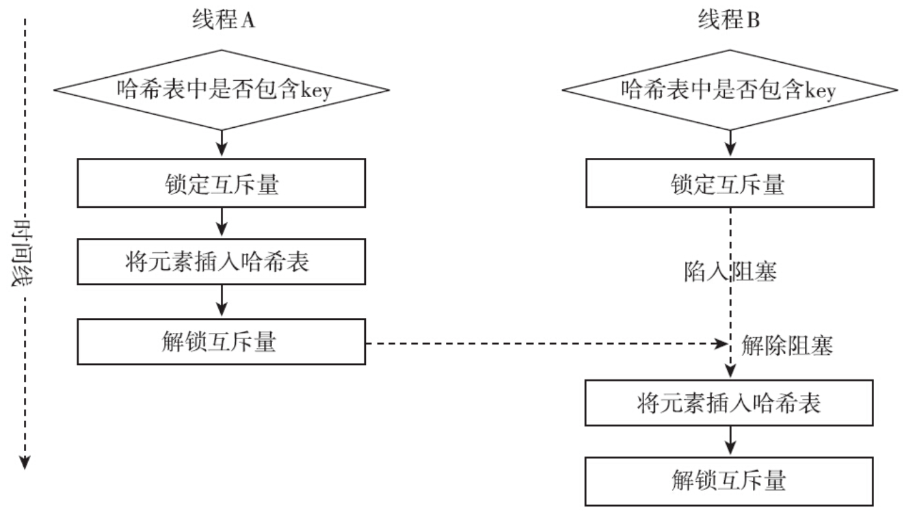

# 线程与进程

在Linux下，程序或可执行文件是一个静态的实体，它只是一组指令的集合，没有执行的含义。进程是一个动态的实体，有自己的生命周期。线程是操作系统进程调度器可以调度的最小执行单元。进程和线程的关系如图7-1所示。


一个进程可能包含多个线程，传统意义上的进程，不过是多线程的一种特例，即该进程只包含一个线程。

为什么要有多线程？

举个生活中的例子，这就好比去银行办理业务。到达银行后，首先找到领导的机器领取一个号码，然后坐下来安心等待。这时候你一定希望，办理业务的窗口越多越好。如果把整个营业大厅当成一个进程的话，那么每一个窗口就是一个工作线程。

有人说不必非要使用线程，多个进程也能做到这点。的确如此。Unix/Linux原本的设计是没有线程的，类Unix系统包括Linux从设计上更倾向于使用进程，反倒是Windows因为创建进程的开销巨大，而更加钟爱线程。

那么线程是不是一种设计上的冗余呢？

其实不是这样的。进程之间，彼此的地址空间是独立的，但线程会共享内存地址空间（如图7-3所示）。同一个进程的多个线程共享一份全局内存区域，包括初始化数据段、未初始化数据段和动态分配的堆内存段。


这种共享给线程带来了很多的优势：

- 创建线程花费的时间要少于创建进程花费的时间。
- 终止线程花费的时间要少于终止进程花费的时间。
- 线程之间上下文切换的开销，要小于进程之间的上下文切换。
- 线程之间数据的共享比进程之间的共享要简单。

# 进程ID和线程ID

在Linux中，目前的线程实现是Native POSIX Thread Library，简称NPTL。在这种实现下，线程又被称为轻量级进程（Light Weighted Process），每一个用户态的线程，在内核之中都对应一个调度实体，也拥有自己的进程描述符（`task_struct`结构体）。

没有线程之前，一个进程对应内核里的一个进程描述符，对应一个进程ID。但是引入了线程的概念之后，情况就发生了变化，一个用户进程下管辖N个用户态线程，每个线程作为一个独立的调度实体在内核态都有自己的进程描述符，进程和内核的进程描述符一下子就变成了1∶N的关系，POSIX标准又要求进程内的所有线程调用`getpid`函数时返回相同的进程ID。如何解决上述问题呢？

内核引入了线程组（Thread Group）的概念。

```c
struct task_struct {...
    pid_t pid;
    pid_t tgid
      ...
    struct task_struct *group_leader;
      ...
    struct list_head thread_group;
      ...
}
```

多线程的进程，又被称为线程组，线程组内的每一个线程在内核之中都存在一个进程描述符（`task_struct`）与之对应。进程描述符结构体中的`pid`，表面上看对应的是进程ID，其实不然，它对应的是线程ID；进程描述符中的`tgid`，含义是Thread Group ID，该值对应的是用户层面的进程ID，具体见表7-3。


本节介绍的线程ID，不同于后面会讲到的`pthread_t`类型的线程ID，和进程ID一样，线程ID是`pid_t`类型的变量，而且是用来唯一标识线程的一个整型变量。那么如何查看一个线程的ID呢？

```shell
manu@manu-hacks:~$ ps –eLf
...
UID        PID  PPID   LWP  C NLWP STIME TTY          TIME CMD
syslog     837     1   837  0    4 22:20 ?        00:00:00 rsyslogd
syslog     837     1   838  0    4 22:20 ?        00:00:00 rsyslogd
syslog     837     1   839  0    4 22:20 ?        00:00:00 rsyslogd
syslog     837     1   840  0    4 22:20 ?        00:00:00 rsyslogd
...
```

ps命令中的-L选项，会显示出线程的如下信息。

- LWP：线程ID，即`gettid()`系统调用的返回值。
- NLWP：线程组内线程的个数。

所以从上面可以看出`rsyslogd`进程是多线程的，进程ID为`837`，进程内有`4`个线程，线程ID分别为837、838、839和840（如图7-5所示）。


已知某进程的进程ID，该如何查看该进程内线程的个数及其线程ID呢？其实可以通过`/proc/PID/task/`目录下的子目录来查看，如下。因为`procfs`在`task`下会给进程的每个线程建立一个子目录，目录名为线程ID。

```shell
manu@manu-hacks:~$ ll /proc/837/task/
dr-xr-xr-x 6 syslog syslog 0  4月 16 22:32 ./
dr-xr-xr-x 9 syslog syslog 0  4月 16 22:20 ../
dr-xr-xr-x 6 syslog syslog 0  4月 16 22:32 837/
dr-xr-xr-x 6 syslog syslog 0  4月 16 22:32 838/
dr-xr-xr-x 6 syslog syslog 0  4月 16 22:32 839/
dr-xr-xr-x 6 syslog syslog 0  4月 16 22:32 840/
```

对于线程，Linux提供了`gettid`系统调用来返回其线程ID，可惜的是`glibc`并没有将该系统调用封装起来，再开放出接口来供程序员使用。如果确实需要获取线程ID，可以采用如下方法：

```c
#include <sys/syscall.h>
int TID = syscall(SYS_gettid);
```

从上面的示例来看，`rsyslogd`是个多线程的进程，进程ID为837，下面有一个线程的ID也是837，这不是巧合。线程组内的第一个线程，在用户态被称为主线程（main thread），在内核中被称为Group Leader。内核在创建第一个线程时，会将线程组ID的值设置成第一个线程的线程ID，`group_leader`指针则指向自身，即主线程的进程描述符，如下。

```c
/*线程组ID等于主线程的ID，group_leader指向自身*/
p->tgid = p->pid;
p->group_leader = p;
INIT_LIST_HEAD(&p->thread_group);
```

所以可以看到，线程组内存在一个线程ID等于进程ID，而该线程即为线程组的主线程。

至于线程组其他线程的ID则由内核负责分配，其线程组ID总是和主线程的线程组ID一致，无论是主线程直接创建的线程，还是创建出来的线程再次创建的线程，都是这样。

```c
if (clone_flags & CLONE_THREAD)
         p->tgid = current->tgid;
if (clone_flags & CLONE_THREAD) {
     p->group_leader = current->group_leader;
     list_add_tail_rcu(&p->thread_group, &p->group_leader->thread_group);
}
```

通过`group_leader`指针，每个线程都能找到主线程。主线程存在一个链表头，后面创建的每一个线程都会链入到该双向链表中。利用上述的结构，每个线程都可以轻松地找到其线程组的主线程（通过`group_leader`指针），另一方面，通过线程组的主线程，也可以轻松地遍历其所有的组内线程（通过链表）。需要强调的一点是，线程和进程不一样，进程有父进程的概念，但在线程组里面，所有的线程都是对等的关系（如图7-6所示）。

- 并不是只有主线程才能创建线程，被创建出来的线程同样可以创建线程。
- 不存在类似于fork函数那样的父子关系，大家都归属于同一个线程组，进程ID都相等，`group_leader`都指向主线程，而且各有各的线程ID。
- 并非只有主线程才能调用`pthread_join`连接其他线程，同一线程组内的任意线程都可以对某线程执行`pthread_join`函数。
- 并非只有主线程才能调用`pthread_detach`函数，其实任意线程都可以对同一线程组内的线程执行分离操作。


# pthread库接口介绍

1995年，POSIX.1c标准对POSIX线程API进行了标准化，这就是我们今天看到的`pthread`库的接口。这些接口包括线程的创建、退出、取消和分离，以及连接已经终止的线程，互斥量，读写锁，线程的条件等待等（如表7-4所示）。


上面提到的函数列表，是pthread的基本接口，接下来的章节，将分别介绍这些接口。

# 线程的创建和标识

首先要介绍的接口是创建线程的接口，即`pthread_create`函数。程序开始启动的时候，产生的进程只有一个线程，我们称之为主线程或初始线程。对于单线程的进程而言，只存在主线程一个线程。如果想在主线程之外，再创建一个或多个线程，就需要用到这个接口了。

## pthread_create函数

pthread库提供了如下接口来创建线程：

```c
#include <pthread.h>
int pthread_create(pthread_t *restrict thread,
                   const pthread_attr_t *restrict attr,
                   void *(*start_routine)(void*),
                   void *restrict arg);
```

`pthread_create`函数的第一个参数是`pthread_t`类型的指针，线程创建成功的话，会将分配的线程ID填入该指针指向的地址。线程的后续操作将使用该值作为线程的唯一标识。

第二个参数是`pthread_attr_t`类型，通过该参数可以定制线程的属性，比如可以指定新建线程栈的大小、调度策略等。如果创建线程无特殊的要求，该值也可以是NULL，表示采用默认属性。

第三个参数是线程需要执行的函数。创建线程，是为了让线程执行一定的任务。线程创建成功之后，该线程就会执行`start_routine`函数，该函数之于线程，就如同main函数之于主线程。

第四个参数是新建线程执行的`start_routine`函数的入参。新建线程如果想要正常工作，则可能需要入参，那么主线程在调用`pthread_create`的时候，就可以将入参的指针放入第四个参数以传递给新建线程。

如果线程的执行函数`start_routine`需要很多入参，传递一个指针就能提供足够的信息吗？答案是能。线程创建者（一般是主线程）和线程约定一个结构体，创建者便把信息填入该结构体，再将结构体的指针传递给子进程，子进程只要解析该结构体，就能取出需要的信息。

如果成功，则`pthread_create`返回0；如果不成功，则`pthread_create`返回一个非0的错误码。常见的错误码如表7-5所示。


`pthread_create`函数的返回情况有些特殊，通常情况下，函数调用失败，则返回-1，并且设置errno。`pthread_create`函数则不同，它会将errno作为返回值，而不是一个负值。

```c
void * thread_worker(void *)
{
    printf(“I am thread worker”);
    pthread_exit(NULL)
}
pthread_t tid ;
int ret = 0;
ret = pthread_create(&tid,NULL,&thread_worker,NULL);
if(ret != 0)/* 注意此处，不能用ret < 0 作为出错判断*/
{
    /*ret is the errno*/
     /*error handler*/
}
```


## 线程ID及进程地址空间布局

`pthread_create`函数，会产生一个线程ID，存放在第一个参数指向的地址中。该线程ID和7.2节分析的线程ID是一回事吗？答案是否定的。

**7.2节提到的线程ID，属于进程调度的范畴。因为线程是轻量级进程，是操作系统调度器的最小单位，所以需要一个数值来唯一标识该线程。**

**`pthread_create`函数产生线程ID并记录在第一个参数指向地址中，属于NPTL线程库的范畴，线程库的后续操作，就是根据该线程ID来操作线程的。**

线程库NPTL提供了`pthread_self`函数，可以获取到线程自身的ID：

```c
 #include <pthread.h>
 pthread_t pthread_self(void);
```

在同一个线程组内，线程库提供了接口，可以判断两个线程ID是否对应着同一个线程：

```c
#include <pthread.h>
int pthread_equal(pthread_t t1, pthread_t t2);
```

返回值是`0`的时候，表示两个线程是同一个线程，非零值则表示不是同一个线程。

`pthread_t`到底是个什么样的数据结构呢？因为POSIX标准并没有限制`pthread_t`的数据类型，所以该类型取决于具体实现。**对于Linux目前使用的NPTL实现而言，`pthread_t`类型的线程ID，本质就是一个进程地址空间上的一个地址。**

是时候看一下进程地址空间的布局了。在x86_64平台上，用户地址空间约为128TB，对于地址空间的布局，系统有如下控制选项：

```shell
cat /proc/sys/vm/legacy_va_layout
0
```

该选项影响地址空间的布局，主要是影响mmap区域的基地址位置，以及mmap是向上还是向下增长。如果该值为1，那么mmap的基地址mmap_base变小（约在128T的三分之一处），mmap区域从低地址向高地址扩展。如果该值为0，那么mmap区域的基地址在栈的下面（约在128T空间处），mmap区域从高地址向低地址扩展。默认值为0，布局如图7-7所示。


可以通过procfs或pmap命令来查看进程的地址空间的情况：

```
pmap PID
```

或者

```shell
cat /proc/PID/maps
```

在接近128TB的巨大地址空间里面，代码段、已初始化数据段、未初始化数据段，以及主线程的栈，所占用的空间非常小，都是KB、MB这个数量级的，如下：

```shell
manu@manu-hacks:~$ pmap 3706
3706:   ./process_map
0000000000400000      4K r-x-- process_map
0000000000601000      4K r---- process_map
0000000000602000      4K rw--- process_map…
00007ffdd5f68000   5128K rw---   [ stack ]  /*栈在128T位置附近*/
```

由于主线程的栈大小并不是固定的，要在运行时才能确定大小（上限大概在8MB左右），因此，在栈中不能存在巨大的局部变量，另外编写递归函数时一定要小心，递归不能太深，否则很可能耗尽栈空间。如下面的例子所示，无尽地递归，很轻易就耗尽了栈的空间：

```c
int i = 0;
void func()
{
    int buffer[256];
    printf("i = %d\n",i);
    i++;
    func();
}
int main()
{
    func();
    sleep(100);
}
```

上面代码的递归永不停息，每次递归，都会消耗约1KB（256个int型为1KB）的栈空间。通过运行可以看出，主线程栈最大也就在8MB左右：

```shell
i = 8053
i = 8054
i = 8055段错误（核心已转储）
```

**进程地址空间之中，最大的两块地址空间是内存映射区域和堆。堆的起始地址特别低，向上扩展，mmap区域的起始地址特别高，向下扩展。**

用户调用`pthread_create`函数时，glibc首先要为线程分配线程栈，而线程栈的位置就落在`mmap`区域。glibc会调用`mmap`函数为线程分配栈空间。`pthread_create`函数分配的`pthread_t`类型的线程ID，不过是分配出来的空间里的一个地址，更确切地说是一个结构体的指针，如图7-8所示。


创建两个线程，将其`pthread_self()`的返回值打印出来，输出如下：

```shell
address of tid in thread-1 = 0x7f011ca12700
address of tid in thread-2 = 0x7f011c211700
```

线程ID是进程地址空间内的一个地址，要在同一个线程组内进行线程之间的比较才有意义。不同线程组内的两个线程，哪怕两者的`pthread_t`值是一样的，也不是同一个线程，这是显而易见的。

很有意思的一点是，`pthread_t`类型的线程ID很有可能会被复用。在满足下列条件时，线程ID就有可能会被复用：

1）线程退出。
2）线程组的其他线程对该线程执行了`pthread_join`，或者线程退出前将分离状态设置为已分离。
3）再次调用`pthread_create`创建线程。

为什么`pthread_t`类型的线程ID会被复用，这点将在后面进行分析。下面通过测试来证明一下：

```c
/*省略了error handler*/
void* thread_work(void* param)
{
    int TID = syscall(SYS_gettid);
    printf("thread-%d: gettid return %d\n",TID,TID);
    printf("thread-%d: pthread_self return %p\n",TID,(void *)pthread_self());
    printf("thread-%d: I will exit now\n",TID);
    pthread_exit(NULL);
    return NULL;
}
int main(int argc ,char* argv[])
{
    pthread_t tid = 0;
     int ret
    ret  = pthread_create(&tid,NULL,thread_work,NULL);
    ret  = pthread_join(tid,NULL);
    ret  = pthread_create(&tid,NULL,thread_work,NULL);
    ret  = pthread_join(tid,NULL);
    return 0;
}
```

输出结果如下：

```shell
thread-4158: gettid return 4158
thread-4158: pthread_self return 0x7f43a27d0700
thread-4158: I will exit now
thread-4159: gettid return 4159
thread-4159: pthread_self return 0x7f43a27d0700
thread-4159: I will exit now
```

从输出结果上看，对于`pthread_t`类型的线程ID，虽然在同一时刻不会存在两个线程的ID值相同，但是如果线程退出了，重新创建的线程很可能复用了同一个`pthread_t`类型的ID。从这个角度看，如果要设计调试日志，用`pthread_t`类型的线程ID来标识进程就不太合适了。用`pid_t`类型的线程ID则是一个比较不错的选择。

```c
#include <sys/syscall.h>
int TID = syscall(SYS_gettid);
```

采用`pid_t`类型的线程ID来唯一标识进程有以下优势：

- 返回类型是`pid_t`类型，不同进程之间也不会存在重复的线程ID，在任意时刻都是全局唯一的值。
- procfs中记录了线程的相关信息，可以方便地查看`/proc/pid/task/tid`来获取线程对应的信息。
- ps命令提供了查看线程信息的`-L`选项，可以通过输出中的`LWP`和`NLWP`，来查看同一个线程组的线程个数及线程ID的信息。

另外一个比较有意思的功能是我们可以给线程起一个有意义的名字，命名以后，既可以从procfs中获取到线程的名字，也可以从ps命令中得到线程的名字，这样就可以更好地辨识不同的线程。

Linux提供了`prctl`系统调用：

```c
#include <sys/prctl.h>
int  prctl(int  option,  unsigned  long arg2,
           unsigned long arg3 , unsigned long arg4,
           unsigned long arg5)
```

这个系统调用和`ioctl`非常类似，通过`option`来控制系统调用的行为。当需要给线程设定名字的时候，只需要将`option`设为PR_SET_NAME，同时将线程的名字作为`arg2`传递给`prctl`系统调用即可，这样就能给线程命名了。

下面是示例代码：

```c
void thread_setnamev(const char* namefmt, va_list args)
{
    char name[17];
    vsnprintf(name, sizeof(name), namefmt, args);
    prctl(PR_SET_NAME, name, NULL, NULL, NULL);
}
void thread_setname(const char* namefmt, ...)
{
    va_list args;
    va_start(args, namefmt);
    thread_setnamev(namefmt, args);
    va_end(args);
}
thread_setname("BEAN-%d",num);
```

这里共创建了四个线程，按照调用`pthread_create`的顺序，将0、1、2、3作为参数传递给线程，然后调用`prctl`给每个线程起名字：分别为BEAN-0、BEAN-1、BEAN-2和BEAN-3。命名以后可以通过ps命令来查看线程的名字：

```shell
manu@manu-hacks:~$ ps -L -p 3454
  PID   LWP TTY          TIME CMD
 3454  3454 pts/0    00:00:00 pthread_tid # 主线程
 3454  3455 pts/0    00:00:00 BEAN-0
 3454  3456 pts/0    00:00:00 BEAN-1
 3454  3457 pts/0    00:00:00 BEAN-2
 3454  3458 pts/0    00:00:00 BEAN-3
manu@manu-hacks:~$ cat /proc/3454/task/3457/status
Name:    BEAN-2
State:    S (sleeping)
Tgid:    3454 # 线程组id也就是主线程id，也就是进程id
```

这是一个很有用的技巧。给线程命了名，就可以很直观地区分各个线程，尤其是在线程比较多，且其分工不同的情况下。

## 线程创建的默认属性

线程创建的第二个参数是`pthread_attr_t`类型的指针，`pthread_attr_init`函数会将线程的属性重置成默认值。

```c
pthread_attr_t    attr;
pthread_attr_init(&attr);
```

在创建线程时，传递重置过的属性，或者传递NULL，都可以创建一个具有默认属性的线程，见表7-6。


手册给出了一个如何展示线程属性的例子，若你需要展示线程的属性，则可以参考手册。

本节现在来介绍线程栈的基地址和大小。默认情况下，线程栈的大小为8MB：

```shell
manu@manu-hacks:~$ ulimit -s
8192
```

调用`pthread_attr_getstack`函数可以返回线程栈的基地址和栈的大小。出于可移植性的考虑不建议指定线程栈的基地址，但是有时候会有修改线程栈的大小的需要。

一个线程需要分配8MB左右的栈空间，就决定了不可能无限地创建线程，在进程地址空间受限的32位系统里尤为如此。在32位系统下，3GB的用户地址空间决定了能创建线程的个数不会太多。如果确实需要很多的线程，可以调用接口来调整线程栈的大小：

```c
#include <pthread.h>
int pthread_attr_setstacksize(pthread_attr_t *attr,
                              size_t stacksize);
int pthread_attr_getstacksize(pthread_attr_t *attr,size_t *stacksize);
```

# 线程的退出

有生就有灭，线程执行完任务，也需要终止。下面的三种方法中，线程会终止，但是进程不会终止（如果线程不是进程组里的最后一个线程的话）：

- 创建线程时的`start_routine`函数执行了`return`，并且返回指定值。
- 线程调用`pthread_exit`。
- 其他线程调用了`pthread_cancel`函数取消了该线程（详见第8章）。

如果线程组中的任何一个线程调用了`exit`函数，或者主线程在`main`函数中执行了`return`语句，那么整个线程组内的所有线程都会终止。

值得注意的是，`pthread_exit`和线程启动函数（start_routine）执行`return`是有区别的。在`start_routine`中调用的任何层级的函数执行`pthread_exit()`都会引发线程退出，而`return`，只能是在`start_routine`函数内执行才能导致线程退出。

```c
void* start_routine(void* param)
{
    …
    foo();
    bar();
    return NULL;
}
void foo()
{
    ...
    pthread_exit(NULL);
}
```

如果`foo`函数执行了`pthread_exit`函数，则线程会立刻退出，后面的`bar`就会没有机会执行了。

下面来看看`pthread_exit`函数的定义：

```c
#include <pthread.h>
void pthread_exit(void *value_ptr);
```

`value_ptr`是一个指针，存放线程的“临终遗言”。线程组内的其他线程可以通过调用`pthread_join`函数接收这个地址，从而获取到退出线程的临终遗言。如果线程退出时没有什么遗言，则可以直接传递NULL指针，如下所示：

```c
pthread_exit(NULL);
```

但是这里有一个问题，就是不能将遗言存放到线程的局部变量里，因为如果用户写的线程函数退出了，线程函数栈上的局部变量可能就不复存在了，线程的临终遗言也就无法被接收者读到，示例如下。

```c
void* thread_work(void* param)
{
    int ret = -1;
    ret = whatever();
    pthread_exit(&ret);
}
```

上述用法是一种典型的错误用法，因为当线程退出时，线程栈已经不复存在了，上面的`ret`变量也已经无法访问了。那我们应该如何正确地传递返回值呢？

- 如果是int型的变量，则可以使用`pthread_exit((int*)ret);`。
- 使用全局变量返回。
- 将返回值填入到用`malloc`在堆上分配的空间里。
- 使用字符串常量，如`pthread_exit(“hello，world”)`。

第一种是tricky的做法，我们将返回值ret进行强制类型转换，接收方再把返回值强制转换成int。但是不推荐使用这种方法。这种方法虽然是奏效的，但是太tricky，而且C标准没有承诺将int型转成指针后，再从指针转成int型时，数据一直保持不变。

第二种方法使用全局变量，其他线程调用`pthread_join`时也可见这个变量。

第三种方法是用`malloc`，在堆上分配空间，然后将返回值填入其中。因为堆上的空间不会随着线程的退出而释放，所以`pthread_join`可以取出返回值。切莫忘记释放该空间，否则会引起内存泄漏。

第四种方法之所以可行，是因为字符串常量有静态存储的生存期限。

传递线程的返回值，除了`pthread_exit`函数可以做到，线程的启动函数（`start_routine`函数）`return`也可以做到，两者的数据类型要保持一致，都是`void*`类型。这也解释了为什么线程的启动函数`start_routine`的返回值总是`void*`类型，如下：

```c
void pthread_exit(void *retval);
void * start_routine(void *param)
```

线程退出有一种比较有意思的场景，即线程组的其他线程仍在执行的情况下，主线程却调用`pthread_exit`函数退出了。这会发生什么事情？

在多线程编程中，当主线程（即程序的初始线程）调用`pthread_exit`函数退出，但其他线程仍在执行时，将发生以下情况： 

1. **主线程退出，但进程不退出：** 主线程的退出并不会导致整个进程退出。`pthread_exit`函数会结束调用它的线程，如果这个线程是主线程，那么主线程会结束执行，但是进程中的其他线程会继续执行。 
2. **进程继续运行：** 既然进程还有未终止的线程在运行，整个进程就会继续运行。这意味着操作系统会保持该进程的存在，直至所有线程都终止。 
3. **资源回收和清理：** 当主线程调用`pthread_exit`时，它会释放自己占用的部分资源，比如栈内存。但是，由于进程仍然存在，因此进程级别的资源，比如打开的文件描述符、堆内存等，将会继续存在直到进程结束。 
4. **进程的最终退出：** 当进程中最后一个线程结束时，或者任一线程调用`exit()`函数，或者主线程调用`pthread_exit`后，某一线程调用`exit()`或`_exit()`函数，此时整个进程才会结束，操作系统会回收进程占用的所有资源。 
5. **exit()与pthread_exit()的区别：** 如果主线程调用`exit()`、`_exit()`、或者`return`来退出，那么整个进程将立即结束，包括所有的子线程。而`pthread_exit`仅仅结束调用它的线程，对其他线程没有直接影响。 
6. **主线程等待其他线程：** 在某些场景下，主线程可能会在调用`pthread_exit`之前先调用`pthread_join`或者其他同步机制（如条件变量等），以等待其他线程完成它们的执行。这是一种优雅退出的方式，确保所有线程都可以完成它们的任务。 

总的来说，主线程调用`pthread_exit`而退出时，其他线程仍将继续执行，直到它们自然结束或者被显式地终止。这一行为模式给了多线程程序更大的灵活性和控制力。

# 线程的连接与分离

## 线程的连接

7.5节提到过线程退出时是可以有返回值的，那么如何取到线程退出时的返回值呢？

线程库提供了`pthread_join`函数，用来等待某线程的退出并接收它的返回值。这种操作被称为连接（joining）。

相关函数的接口定义如下：

```c
#include <pthread.h>
int pthread_join(pthread_t thread, void **retval);
```

该函数第一个参数为要等待的线程的线程ID，第二个参数用来接收返回值。

根据等待的线程是否退出，可得到如下两种情况：

- 等待的线程尚未退出，那么`pthread_join`的调用线程就会陷入阻塞。
- 等待的线程已经退出，那么`pthread_join`函数会将线程的退出值（`void*`类型）存放到`retval`指针指向的位置。

线程的连接（join）操作有点类似于进程等待子进程退出的等待（wait）操作，但细细想来，还是有不同之处：

第一点不同之处是进程之间的等待只能是父进程等待子进程，而线程则不然。线程组内的成员是对等的关系，只要是在一个线程组内，就可以对另外一个线程执行连接（join）操作。如图7-9所示，线程F一样可以连接线程A。


第二点不同之处是进程可以等待任一子进程的退出（用下面的代码不难做到），但是线程的连接操作没有类似的接口，即不能连接线程组内的任一线程，必须明确指明要连接的线程的线程ID。

```c
wait(&status);
waitpid(-1,&status,optioins)
```

`pthread_join`不能连接线程组内任意线程的做法，并不是NPTL线程库设计上的瑕疵，而是有意为之的。如果听任线程连接线程组内的任意线程，那么所谓的任意线程就会包括其他库函数私自创建的线程，当库函数尝试连接（join）私自创建的线程时，发现已经被连接过了，就会返回EINVAL错误。如果库函数需要根据返回值来确定接下来的流程，这就会引发严重的问题。正确的做法是，连接已知线程ID的那些线程，就像`pthread_join`函数那样。

下面来分析出错的情况，当调用失败时，和`pthread_create`函数一样，errno作为返回值返回。错误码的情况见表7-7。


`pthread_join`函数之所以能够判断是否死锁和连接操作是否被其他线程捷足先登，是因为目标线程的控制结构体`struct pthread`中，存在如下成员变量，记录了该线程的连接者。

```c
struct pthread *joinid；
```

该指针存在三种可能，如下。

- NULL：线程是可连接的，但是尚没有其他线程调用`pthread_join`来连接它。
- 指向线程自身的`struct pthread`：表示该线程属于自我了断型，执行过分离操作，或者创建线程时，设置的分离属性为PTHREAD_CREATE_DETACHED，一旦退出，则自动释放所有资源，无需其他线程来连接。
- 指向线程组内其他线程的`struct pthread`：表示`joinid`对应的线程会负责连接。

因为有了该成员变量来记录线程的连接者，所以可以判断如下场景，如图7-10所示。


不过两者还是略有区别的，第一种场景，线程A连接线程A，`pthread_join`函数一定会返回EDEADLK。但是第二种场景，大部分情况下会返回EDEADLK，不过也有例外。不管怎样，不建议两个线程互相连接。

如果两个线程几乎同时对处于可连接状态的线程执行连接操作会怎么样？答案是只有一个线程能够成功，另一个则返回EINVAL。

NTPL提供了原子性的保证：

```c
(atomic_compare_and_exchange_bool_acq（&pd->joined,self,NULL）
```

如果是NULL，则设置成调用线程的线程ID，CAS操作（Compare And Swap）是原子操作，不可分割，决定了只有一个线程能成功。

如果joinid不是NULL，表示该线程已经被别的线程连接了，或者正处于已分离的状态，在这两种情况下，都会返回EINVAL。

## 为什么要连接退出的线程

**不连接已经退出的线程会怎么样？如果不连接已经退出的线程，会导致资源无法释放。**所谓资源指的又是什么呢？

下面通过一个测试来让事实说话。测试模拟下面两种情况：

- 主线程并不执行连接操作，待确定创建的第一个线程退出后，再创建第二个线程。
- 主线程执行连接操作，等到第一个线程退出后，再创建第二个线程。

按照时间线来发展，如图7-11所示。


下面是代码部分，为了简化程序和便于理解，使用sleep操作来确保创建的第一个线程退出后，再来创建第二个线程。须知sleep并不是同步原语，在真正的项目代码中，用sleep函数来同步线程是不可原谅的。

```c
#define _GNU_SOURCE
#include <stdio.h>
#include <stdlib.h>
#include <unistd.h>
#include <pthread.h>
#include <string.h>
#include <errno.h>
#include <sys/syscall.h>
#include <sys/types.h>
#define NR_THREAD 1
#define ERRBUF_LEN 4096
void* thread_work(void* param)
{
    int TID = syscall(SYS_gettid);
    printf("thread-%d IN \n",TID);
    printf("thread-%d pthread_self return %p \n",TID,(void*)pthread_self());
    sleep(60);
    printf("thread-%d EXIT \n",TID);
    return NULL;
}
int main(int argc ,char* argv[])
{
    pthread_t tid[NR_THREAD];
    pthread_t tid_2[NR_THREAD];
    char errbuf[ERRBUF_LEN];
    int i, ret;
    for(i = 0 ; i < NR_THREAD ; i++)
    {
        ret = pthread_create(&tid[i],NULL,thread_work,NULL);
        if(ret != 0)
        {
            fprintf(stderr,"create thread failed ,return %d (%s)\n",ret,strerror_r (ret,errbuf,sizeof(errbuf)));
        }
    }
#ifdef NO_JOIN
    sleep(100);/*sleep是为了确保线程退出之后，再来重新创建线程*/
#else
    printf("join thread Begin\n");
    for(i = 0 ; i < NR_THREAD; i++)
    {
        pthread_join(tid[i],NULL);
    }
#endif
    for(i = 0 ; i < NR_THREAD ; i++)
    {
        ret = pthread_create(&tid_2[i],NULL,thread_work,NULL);
        if(ret != 0)
        {
            fprintf(stderr,"create thread failed ,return %d (%s)\n",ret,strerror_r (ret,errbuf,sizeof(errbuf)));
        }
    }
    sleep(1000);
    exit(0);
}
```

根据编译选项NO_JOIN，将程序编译成以下两种情况：

- 编译加上`–DNO_JOIN`：主线不执行`pthread_join`，主线程通过`sleep`足够的时间，来确保第一个线程退出以后，再创建第二个线程。
- 不加`-NO_JOIN`编译选项：主线程负责连接线程，第一个线程退出以后，再来创建第二个线程。

下面按照编译选项，分别编出`pthread_no_join`和`pthread_has_join`两个程序：

```shell
gcc -o pthread_no_join pthread_join_cmp.c -DNO_JOIN –lpthread
gcc -o pthread_has_join pthread_join_cmp.c            -lpthread
```

首先说说`pthread_no_join`的情况，当创建了第一个线程时：

```shell
manu@manu-hacks:~/code/me/thread$ ./pthread_no_join
thread-12876 IN
thread-12876 pthread_self return 0x7fe0c842b700
```

从输出可以看到，创建了第一个线程，其线程ID为12876，通过pmap和procfs可以看到系统为该线程分配了8MB的地址空间：

```shell
manu@manu-hacks:~$ pmap 12875 # PID
00007fe0c7c2b000      4K -----   [ anon ]
00007fe0c7c2c000   8192K rw---   [ anon ]
manu@manu-hacks:~$ cat /proc/12875/maps
7fe0c7c2b000-7fe0c7c2c000 ---p 00000000 00:00 07fe0c7c2c000-7fe0c842c000 rw-p 00000000 00:00 0                    [stack:12876]
```

当线程12876退出，创建新的线程时：

```shell
thread-12876 EXIT
thread-13391 IN
thread-13391 pthread_self return 0x7fe0c7c2a700
```

此时查看进程的地址空间：

```shell
00007fe0c742a000      4K -----   [ anon ]
00007fe0c742b000   8192K rw---   [ anon ]
00007fe0c7c2b000      4K -----   [ anon ]
00007fe0c7c2c000   8192K rw---   [ anon ]
7fe0c742a000-7fe0c742b000 ---p 00000000 00:00 0
7fe0c742b000-7fe0c7c2b000 rw-p 00000000 00:00 0                     [stack:13391]
7fe0c7c2b000-7fe0c7c2c000 ---p 00000000 00:00 07fe0c7c2c000-7fe0c842c000 rw-p 00000000 00:00 0
```

从上面的输出可以看出两点：

1）已经退出的线程，其空间没有被释放，仍然在进程的地址空间之内。
2）新创建的线程，没有复用刚才退出的线程的地址空间。

如果仅仅是情况1的话，尚可以理解，但是1和2同时发生，既不释放，也不复用，这就不能忍了，因为这已经属于内存泄漏了。试想如下场景：FTP Server采用thread per connection的模型，每接受一个连接就创建一个线程为之服务，服务结束后，连接断开，线程退出。但线程退出了，线程栈消耗的空间仍不能释放，不能复用，久而久之，内存耗尽，再也不能创建线程，也无法再提供FTP服务。

之所以不能复用，原因就在于没有对退出的线程执行连接操作。下面来看一下主线程调用`pthread_join`的情况：

```shell
manu@manu-hacks:~/code/me/thread$ ./pthread_has_join
join thread Begin
thread-14581 IN
thread-14581 pthread_self return 0x7f726020f700
thread-14581 EXIT
thread-14871 IN
thread-14871 pthread_self return 0x7f726020f700
thread-14871 EXIT
```

两次创建的线程，`pthread_t`类型的线程ID完全相同，看起来好像前面退出的栈空间被复用了，事实也的确如此：

```shell
manu@manu-hacks:~$ cat /proc/14580/maps
7f725fa0f000-7f725fa10000 ---p 00000000 00:00 0
7f725fa10000-7f7260210000 rw-p 00000000 00:00 0                     [stack:14581]
```

12581退出后，线程栈被后创建的线程复用了：

```shell
manu@manu-hacks:~$ cat /proc/14580/maps
7f725fa0f000-7f725fa10000 ---p 00000000 00:00 0
7f725fa10000-7f7260210000 rw-p 00000000 00:00 0                     [stack:14871]
```

**通过前面的比较，可以看出执行连接操作的重要性：如果不执行连接操作，线程的资源就不能被释放，也不能被复用，这就造成了资源的泄漏。**

**当线程组内的其他线程调用`pthread_join`连接退出线程时，内部会调用`__free_tcb`函数，该函数会负责释放退出线程的资源。**

值得一提的是，纵然调用了`pthread_join`，也并没有立即调用`munmap`来释放掉退出线程的栈，它们是被后建的线程复用了，这是NPTL线程库的设计。释放线程资源的时候，NPTL认为进程可能再次创建线程，而频繁地`munmap`和`mmap`会影响性能，所以NTPL将该栈缓存起来，放到一个链表之中，如果有新的创建线程的请求，NPTL会首先在栈缓存链表中寻找空间合适的栈，有的话，直接将该栈分配给新创建的线程。

始终不将线程栈归还给系统也不合适，所以缓存的栈大小有上限，默认是40MB，如果缓存起来的线程栈的空间总和大于40MB，NPTL就会扫描链表中的线程栈，调用`munmap`将一部分空间归还给系统。

## 线程的分离

默认情况下，新创建的线程处于可连接（Joinable）的状态，可连接状态的线程退出后，需要对其执行连接操作，否则线程资源无法释放，从而造成资源泄漏。

如果其他线程并不关心线程的返回值，那么连接操作就会变成一种负担：你不需要它，但是你不去执行连接操作又会造成资源泄漏。这时候你需要的东西只是：线程退出时，系统自动将线程相关的资源释放掉，无须等待连接。

NPTL提供了`pthread_detach`函数来将线程设置成已分离（detached）的状态，如果线程处于已分离的状态，那么线程退出时，系统将负责回收线程的资源，如下：

```c
#include <pthread.h>
int pthread_detach(pthread_t thread);
```

可以是线程组内其他线程对目标线程进行分离，也可以是线程自己执行`pthread_detach`函数，将自身设置成已分离的状态，如下：

```c
pthread_detach(pthread_self())
```

线程的状态之中，可连接状态和已分离状态是冲突的，一个线程不能既是可连接的，又是已分离的。因此，如果线程处于已分离的状态，其他线程尝试连接线程时，会返回EINVAL错误。

`pthread_detach`出错的情况见表7-8所示。


需要强调的是，不要误解已分离状态的内涵。所谓已分离，并不是指线程失去控制，不归线程组管理，而是指线程退出后，系统会自动释放线程资源。若线程组内的任意线程执行了`exit`函数，即使是已分离的线程，也仍然会受到影响，一并退出。

将线程设置成已分离状态，并非只有`pthread_detach`一种方法。另一种方法是在创建线程时，将线程的属性设定为已分离：

```c
#include <pthread.h>
int pthread_attr_setdetachstate(pthread_attr_t *attr,int detachstate);
int pthread_attr_getdetachstate(pthread_attr_t *attr,int *detachstate);
```

其中detachstate的可能值如表7-9所示。


有了这个，如果确实不关心线程的返回值，可以在创建线程之初，就指定其分离属性为PTHREAD_CREATE_DETACHED。

# 互斥量

## 为什么需要互斥量

大部分情况下，线程使用的数据都是局部变量，变量的地址在线程栈空间内，这种情况下，变量归属于单个线程，其他线程无法获取到这种变量。

如果所有的变量都是如此，将会省去无数的麻烦。但实际的情况是，很多变量都是多个线程共享的，这样的变量称为共享变量（shared variable）。可以通过数据的共享，完成多个线程之间的交互。

但是多个线程并发地操作共享变量，会带来一些问题。下面来看一个例子，如图7-12所示。


如果存在4个线程，不加任何同步措施，共同操作一个全局变量`global_cnt`，假设每个线程执行1000万次自加操作，那么会发生什么事情呢？4个线程结束的时候，`global_cnt`等于几？

这个问题看起来是小学题目，当然是4000万，但实际结果又如何呢？

```c
#define _GNU_SOURCE
#include <stdio.h>
#include <stdlib.h>
#include <unistd.h>
#include <pthread.h>
#include <string.h>
#include <errno.h>
#include <sys/types.h>
#define LOOP_TIMES 10000000
#define NR_THREAD  4
pthread_rwlock_t rwlock;
int global_cnt = 0;
void* thread_work(void* param)
{
    int i;
    pthread_rwlock_rdlock(&rwlock);
    for(i = 0 ; i < LOOP_TIMES; i++ )
    {
        global_cnt++;
    }
    pthread_rwlock_unlock(&rwlock);
    return NULL;
}
int main(int argc ,char* argv[])
{
    pthread_t tid[NR_THREAD];
    char err_buf[1024];
    int i, ret;
    ret = pthread_rwlock_init(&rwlock,NULL);
    if(ret)
    {
        fprintf(stderr,"init rw lock failed (%s)\n",strerror_r(ret,err_buf, sizeof(err_buf)));
        exit(1);
    }
    pthread_rwlock_wrlock(&rwlock);
    for(i = 0 ; i < NR_THREAD ; i++)
    {
        ret = pthread_create(&tid[i],NULL,thread_work,NULL);
        if(ret != 0)
        {
            fprintf(stderr,"create thread failed ,return %d (%s)\n",
                    ret,strerror_r(ret,err_buf,sizeof(err_buf)));
        }
    }
    pthread_rwlock_unlock(&rwlock);
    for(i = 0 ; i < NR_THREAD; i++)
    {
        pthread_join(tid[i],NULL);
    }
    pthread_rwlock_destroy(&rwlock);
    printf("thread num       : %d\n",NR_THREAD);
    printf("loops per thread : %d\n",LOOP_TIMES);
    printf("expect result    : %d\n",LOOP_TIMES*NR_THREAD);
    printf("actual result    : %d\n",global_cnt);
    exit(0);
}
```

上面的代码中，引入了读写锁，来确保线程位于同一起跑线，同时开始执行自加操作，不受线程创建先后顺序的影响。创建4个线程之前，主线程先占住读写锁的写锁，任一线程创建好了之后，要先申请读锁，申请成功方能执行`global_cnt++`，但是写锁已经被主线程占据，所以无法执行。待4个线程都创建成功后，主线程会释放写锁，从而保证4个线程一起执行。

执行结果又如何呢？来看看：

```shell
thread num       : 4
loops per thread : 10000000
expect result    : 40000000
actual result    : 11115156
```

结果并不是期待的4000万，而是11115156，一个很奇怪的数字。而且每次执行，最后的结果都不相同。

为什么无法获得正确的结果？看一下汇编代码，先通过如下指令读取到汇编代码：

```shell
objdump -d pthread_no_sync > pthread_no_sync.objdump
```

然后在汇编代码中取出`global_cnt++`这部分代码相关的汇编代码，就是如下指令：

```assembly
40098c:    8b 05 1a 07 20 00    mov   0x20071a(%rip),%eax   # 6010ac <global_cnt>
400992:    83 c0 01             add   $0x1,%eax
400995:    89 05 11 07 20 00    mov   %eax,0x200711(%rip)   # 6010ac <global_cnt>
```

`++`操作，并不是一个原子操作（atomic operation），而是对应了如下三条汇编指令。

- Load：将共享变量`global_cnt`从内存加载进寄存器，简称L。
- Update：更新寄存器里面的`global_cnt`值，执行加1操作，简称U。
- Store：将新的值，从寄存器写回到共享变量`global_cnt`的内存地址，简称为S。

将上述情况用伪代码表示，就是如下情况：

```
L操作：register = global_cnt
U操作：register = register + 1
S操作：global_cnt = register
```

以两个线程为例，如果两个线程的执行如图7-13所示，就会引发结果不一致：执行了两次`++`操作，最终的结果却只加了1。


上面的例子表明，应该避免多个线程同时操作共享变量，对于共享变量的访问，包括读取和写入，都必须被限制为每次只有一个线程来执行。

用更详细的语言来描述下，解决方案需要能够做到以下三点。

1）代码必须要有互斥的行为：当一个线程正在临界区中执行时，不允许其他线程进入该临界区中。
2）如果多个线程同时要求执行临界区的代码，并且当前临界区并没有线程在执行，那么只能允许一个线程进入该临界区。
3）如果线程不在临界区中执行，那么该线程不能阻止其他线程进入临界区。

上面说了这么多，本质其实就是一句话，我们需要一把锁（如图7-14所示）。


锁是一个很普遍的需求，当然用户可以自行实现锁来保护临界区。但是实现一个正确并且高效的锁非常困难。纵然抛下高效不谈，让用户从零开始实现一个正确的锁也并不容易。正是因为这种需求具有普遍性，所以Linux提供了互斥量。

## 互斥量的接口

**1.互斥量的初始化**

互斥量采用的是英文mutual exclusive（互相排斥之意）的缩写，即mutex。正确地使用互斥量来保护共享数据，首先要定义和初始化互斥量。POSIX提供了两种初始化互斥量的方法。

第一种方法是将PTHREAD_MUTEX_INITIALIZER赋值给定义的互斥量，如下：

```c
#include <pthread.h>
pthread_mutex_t mutex = PTHREAD_MUTEX_INITIALIZER;
```

如果互斥量是动态分配的，或者需要设定互斥量的属性，那么上面静态初始化的方法就不适用了，NPTL提供了另外的函数`pthread_mutex_init()`对互斥量进行动态的初始化：

```c
int pthread_mutex_init(pthread_mutex_t *restrict mutex,
                  const pthread_mutexattr_t *restrict attr);
```

第二个`pthread_mutexattr_t`指针的入参，是用来设定互斥量的属性的。大部分情况下，并不需要设置互斥量的属性，传递NULL即可，表示使用互斥量的默认属性。

调用`pthread_mutex_init()`之后，互斥量处于没有加锁的状态。

**2.互斥量的销毁**

在确定不再需要互斥量的时候，就要销毁它。在销毁之前，有三点需要注意：

- 使用PTHREAD_MUTEX_INITIALIZER初始化的互斥量无须销毁。
- 不要销毁一个已加锁的互斥量，或者是正在配合条件变量使用的互斥量。
- 已经销毁的互斥量，要确保后面不会有线程再尝试加锁。

销毁互斥量的接口如下：

```c
int pthread_mutex_destroy(pthread_mutex_t *mutex);
```

当互斥量处于已加锁的状态，或者正在和条件变量配合使用，调用`pthread_mutex_destroy`函数会返回EBUSY错误码。

**3.互斥量的加锁和解锁**

POSIX提供了如下接口：

```c
int pthread_mutex_lock(pthread_mutex_t *mutex);
int pthread_mutex_trylock(pthread_mutex_t *mutex);
int pthread_mutex_unlock(pthread_mutex_t *mutex);
```

在调用`pthread_lock()`的时候，可能会遭遇以下几种情况：

- 互斥量处于未锁定的状态，该函数会将互斥量锁定，同时返回成功。
- 发起函数调用时，其他线程已锁定互斥量，或者存在其他线程同时申请互斥量，但没有竞争到互斥量，那么`pthread_lock()`调用会陷入阻塞，等待互斥量解锁。

在等待的过程中，如果互斥量持有线程解锁互斥量，可能会发生如下事件：

	- 函数调用线程是唯一等待者，获得互斥量，成功返回。
	- 函数调用线程不是唯一等待者，但成功获得互斥量，返回。
	- 函数调用线程不是唯一等待者，没能获得互斥量，继续阻塞，等待下一轮。

- 如果在调用`pthread_lock()`线程时，之前已经调用过`pthread_lock()`且已经持有了互斥量，则根据互斥锁的类型，存在以下三种可能。

	- PTHREAD_MUTEX_NORMAL：这是默认类型的互斥锁，这种情况下会发生死锁，调用线程永久阻塞，线程组的其他线程也无法申请到该互斥量。
	- PTHREAD_MUTEX_ERRORCHECK：第二次调用`pthread_mutex_lock`函数时返回EDEADLK。
	- PTHREAD_MUTEX_RECURSIVE：这种类型的互斥锁内部维护有引用计数，允许锁的持有者再次调用加锁操作。

有了互斥量，重新运行7.7.1节的程序，将`global_cnt++`改写成：

```c
pthread_mutex_lock(&mutex);
global_cnt++;
pthread_mutex_lock(&mutex);
```

使用互斥量之后，程序获取了正确的执行结果：

```shell
thread num       : 4
loops per thread : 10000000
expect result    : 40000000
actual result    : 40000000
```


## 临界区的大小

现在，我们已经意识到需要用锁来保护共享变量。不过还有另一个需要注意的事项，即合理地设定临界区的范围。

第一临界区的范围不能太小，如果太小，可能起不到保护的目的。考虑如下场景，如果哈希表中不存在某元素，那么向哈希表中插入某元素，代码如下：

```c
if(!htable_contain(hashtable,elem.key))
{
    pthread_mutex_lock(&mutex);
    htable_insert(hashtable,&elem);
    pthread_mutex_lock(&mutex);
}
```

表面上看，共享变量`hashtable`得到了保护，在插入时有锁保护，但是结果却不是我们想要的。上面的程序不希望哈希表中有重复的元素，但是其临界区太小，多线程条件下可能达不到预设的效果。

如果时序如图7-15所示，那么就会有重复的元素被插入哈希表中，没有达到最初的目的。究其原因，就是临界区小了，没有将判断部分加入临界区以内。

临界区也不能太大，临界区的代码不能并发，如果临界区太大，就无法充分利用多处理器发挥多线程的优势。对于被互斥量保护的临界区内的代码，一定要好好审视，不要将不相干的（特别是可能陷入阻塞的）代码放入临界区内执行。




## 互斥量的性能

还是以前面的例子为例进行说明，4个线程分别对全局变量累加1000万次，使用互斥量版本的程序和不使用互斥量的版本相比，会消耗更多的时间，如表7-10所示。


互斥量版本需要消耗更长的时间，其原因有以下三点：

1）对互斥量的加锁和解锁操作，本身有一定的开销。
2）临界区的代码不能并发执行。
3）进入临界区的次数过于频繁，线程之间对临界区的争夺太过激烈，若线程竞争互斥量失败，就会陷入阻塞，让出CPU，所以执行上下文切换的次数要远远多于不使用互斥量的版本。

看到这个结果，又有一个疑问涌上心头，互斥量的性能如何？

Linux下，互斥量的实现采用了futex（fast user space mutex）机制。传统的同步手段，进入临界区之前会申请锁，而此时不得不执行系统调用，查看是否存在竞争；当离开临界区释放锁的时候，需要再次执行系统调用，查看是否需要唤醒正在等待锁的进程。但是在竞争并不激烈的情况下，加锁和解锁的过程中可能会出现以下两种情况：

- 申请锁时，执行系统调用，从用户模式进入内核模式，却发现并无竞争。
- 释放锁时，执行系统调用，从用户模式进入内核模式，尝试唤醒正在等待锁的进程，却发现并没有进程正在等待锁的释放。

考虑到系统调用的开销，这两种情况耗资靡费，却劳而无功。

futex机制的出现有效地解决了这两个问题。futex的全称是fast userspace mutex，中文名为快速用户空间互斥体，它是一种用户态和内核态协同工作的同步机制。glibc使用内核提供的futex系统调用实现了互斥量。

glibc的互斥量实现，含有大量的汇编代码，不易读懂，下面用伪代码来描述下互斥量的加锁和解锁操作：

```c
void lock(mutex* lock)
{
    int c；
    if(c = cmpxchg(lock,0,1) != 0)
    // 如果原始值是0，则表示处于没加锁的状态，将lock改成1，直接返回
    // 如果原始值不是0，则表示互斥量已被加锁，需要继续执行
    do
    {
/* 此处有以下可能性：1) c==2 表示已被加锁，并且有其他正在等待的线程,应立即调用futex_wait2) 原子地检查lock是否为1，如果是，则将lock改成2，然后调用futex_wait
  如果不是，则表示其他线程释放了锁，将lock改成了0，需要执行while语句争夺锁
        */
        if （c == 2 || cmpxchg(lock, 1, 2) != 0)
        {
           //如果执行futex_wait时，lock已经被改写，不等于2，则当即返回
            futex_wait(lock, 2);
        }
    } while （(c = cmpxchg(lock, 0, 2))！= 0）;
    //表示有线程unlock，但是不知道解锁后是1还是2，保险起见，写成2
}
void unlock(mutex* lock)
{
    //atomic_dec的作用是减1并返回原始值
    if (atomic_dec(lock) != 1)
    {
        // 原始值是2，有线程等待互斥量，才会进入
        // 如果原始值是1，则表示没有线程等待，没必要futex_wake
        lock = 0;
        futex_wake(lock, 1);
    }
}
```

上面的cmpxchg和atomic_dec都是原子操作。

- cmpxchg（lock，a，b）：表示如果lock的值等于a，那么将lock改为b，并将原始值返回，否则直接将原始值返回。
- atomic_dec（lock）：表示将lock的值减去1，并且返回原始值。glibc的互斥量中维护了一个值lock，该值有以下三种情况。
- 0：表示互斥量并未上锁。
- 1：表示互斥量已经上锁，但是并没有线程正在等待该锁。
- 2：表示互斥量已经上锁，并且有线程正在等待该锁。

加锁时，如果发现该值是0，那么直接将该值改为1，无须执行任何系统调用，因为并没有线程持有该锁，无须等待；

解锁时，如果发现该值是1，直接将该值改成0，无须执行任何系统调用，因为并没有线程正在等待该锁，无须唤醒。

当然，在这两种情况下，比较和修改操作（Compare And Swap）必须是原子操作，否则会出现问题。如果无竞争，可以看出，互斥量的加锁和解锁非常轻量级。

用一个简单的实验也可以证明，无竞争条件下，加锁解锁的操作是很轻量级的。下面用一个循环执行加锁和解锁操作1000万次，统计下加锁解锁一次消耗的平均时间，即：

```c
clock_gettime(CLOCK_MONOTONIC,&start);
for (int i = 0; i < TIMES; ++i) {
    pthread_mutex_lock(&lock);
    pthread_mutex_unlock(&lock);
}
clock_gettime(CLOCK_MONOTONIC,&end);
```

在笔者用的2.13GHz i3处理器的Ubuntu上，加锁解锁一次，平均消耗24纳秒左右，证明了在无竞争的条件下，互斥量的加锁和解锁操作的确是十分轻量级的。

接下来考虑存在竞争的情况，这时候，就需要内核来参与了。

内核提供了futex_wait和futex_wake两个操作（futex系统调用支持的两个命令）：

```c
int futex_wait(int *uaddr, int val);
int futex_wake(int *uaddr, int n);
```

`futex_wait`是用来协助加锁操作的。线程调用`pthread_mutex_lock`，如果发现锁的值不是0，就会调用`futex_wait`，告知内核，线程须要等待在`uaddr`对应的锁上，请将线程挂起。内核会建立与`uaddr`地址对应的等待队列。

为什么需要内核维护等待队列？因为一旦互斥量的持有者线程释放了互斥量，就需要及时通知那些等待在该互斥量上的线程。如果没有等待队列，内核将无法通知到那些正陷入阻塞的线程。

如果整个系统有很多这种互斥量，是不是需要为每个uaddr地址建立一个等待队列呢？事实上不需要。理论上讲，futex只需要在内核之中维护一个队列就够了，当线程释放互斥量时，可能会调用futex_wake，此时会将uaddr传进来，内核会去遍历该队列，查找等待在该uaddr地址上的线程，并将相应的线程唤醒。

但是只有一个队列的话查找效率有点低，作为优化，内核实现了多个队列。插入等待队列时，会先计算hash值，然后根据hash插入到对应的链表之中，如图7-16所示。

值得一提的是，`futex_wait`操作需要的val入参，乍看之下好像没什么用处。事实上并非如此。从用户程序判断锁的值，到调用`futex_wait`操作是有时间窗口的，在这个时间窗口之内，有可能发生线程解锁的操作，从而可能无须等待。因此`futex_wait`操作会检查`uaddr`对应的锁的值是否等于`val`的值，只有在等于`val`的情况下，内核才会让线程等待在对应的队列上，否则会立刻返回，让用户程序再次申请锁。


`futex_wake`操作是用来实现解锁操作的。glibc就是使用该操作来实现互斥量的解锁函数`pthread_mutex_unlock`的。当线程执行完临界区代码，解锁时，内核需要通知那些正在等待该锁的线程。这时候就需要发挥`futex_wake`操作的作用了。`futex_wake`的第二个参数n，对于互斥量而言，该值总是1，表示唤醒1个线程。当然，也可以唤醒所有正在等待该锁的线程，但是这样做并无好处，因为被唤醒的多个线程会再次竞争，却只能有一个线程抢到锁，这时其他线程不得不再次睡去，徒增了很多开销。

使用strace跟踪系统调用的时候，看不到`futex_wait`和`futex_wake`两个系统调用，看到的是futex系统调用，如下。

```c
#include <linux/futex.h>
#include <sys/time.h>
int futex(int *uaddr, int op, int val,
 const struct timespec *timeout,int *uaddr2, int val3);
```

该系统调用是一个综合的系统调用，根据第二个参数op来决定具体的行为。当op为FUTEX_WAIT时，对应的是前面讨论的`futex_wait`操作，当op为FUTEX_WAKE时，对应的是前面讨论的`futex_wake`操作。

细心的话，可以发现，互斥量加锁和解锁时，调用futex的op参数并非FUTEX_WAIT和FUTEX_WAKE，而是FUTEX_WAIT_PRIVATE和FUTEX_WAKE_PRIVATE，这是为了改进futex的性能而进行的优化。因为futex也可以用在不同的进程之间，加上后缀_PRIVATE是为了明确告知内核，互斥的行为是用在线程之间的。

从上面的角度分析，当存在竞争时，如果线程申请不到互斥量，就会让出CPU，系统会发生上下文切换。在线程个数众多，临界区竞争异常激烈的情况下，上下文切换会是一笔不小的开销。

如果临界区非常小，线程之间对临界区的竞争并不激烈，只会偶尔发生，这种情况下，忙-等待的策略要优于互斥量的“让出CPU，陷入阻塞，等待唤醒”的策略。采用忙-等待策略的锁为自旋锁。

关于futex的原理，Ulrich Drepper《Futexes Are Tricky》一文就是非常好的参考文献。

## 互斥锁的公平性

互斥锁是公平的吗？

首先要定义什么是公平（fairness）。对于锁而言，如果A在B之前调用lock（）方法，那么A应该先于B获得锁，进入临界区。多处理器条件下，很难确定是哪个线程率先调用的lock（）方法。纵然能判定是哪个线程率先调用的lock（）方法，要实现指令级的公平也是很难的。常见的判断锁公平性的方法是，将锁的实现代码分成如下两个部分：

- 门廊区
- 等待区

门廊区必须在有限的操作内完成，等待区则可能有无穷的步骤，它们会陷入未知结束时间的等待中。

如果锁能满足以下条件，就称锁是先来先服务（FCFS）的：

如果线程A门廊区的结束在线程B门廊区的开始之前，那么线程A一定不会被线程B赶超。

互斥量也有门廊区和等待区，就像7.7.4节分析的，如果没有竞争，线程执行几个指令就加锁成功，顺利返回了。在这种情况下，互斥量在门廊区就解决了所有的需要。但是如果有竞争，互斥锁在门廊区判断出存在竞争，线程取不到锁，就不得不执行futex_wait，让内核将其挂起，并记录在等待队列上。需要等待多久？不知道。

从表面上看，内核会将等待互斥量的线程放入队列，每来一个等待线程，就把线程记录在队列的尾部，当互斥量的持有线程解锁时，内核只会唤醒一个线程，而唤醒的正是队列中等待该互斥量的第一个等待者。队列的先入先出（FIFO），看起来已经保证了互斥量的公平性。但是，这样就能确保公平吗？

答案是否定的，互斥锁并没有做到先来先服务。

根据7.7.4节的伪代码可知，当互斥量的lock的值是2，或者尝试调用CAS操作将lock从1改成2并且成功时，线程会调用futex_wait陷入阻塞。值得一提的是，CAS操作在尝试将1改成2时，也可能存在竞争，比如其他线程有解锁操作，lock值已经被改成了0，而这时候恰好存在另外一个线程刚刚调用加锁操作，这时就会发生门廊区的争夺，对于这种情况不做详细分析。假设加锁调用了`futex_wait`，内核将线程挂起在等待队列上，从那时起，线程就进入了漫长的等待区。

如果互斥量的持有线程解锁，会首先将互斥量的lock值设置成0，然后唤醒内核等待队列中等待在该地址上的第一个线程。看起来比较公平，但是问题就出在此处，被唤醒的线程并不是自动就持有了互斥锁，反而须要执行while（）中包裹的`cmpxchg`操作，再次竞争互斥量。如果竞争失败，则被另外一个初来乍到的线程将0改成了1，那么线程刚刚醒来就不得不再次执行`futex_wait`，再次沉睡。这次竞争失败的代价是巨大的，因为`futex_wait`操作会将线程挂载到等待队列的队尾。

由上面的分析可以得出如下结论：

- 线程可能多次调用futex_wait进入等待区，在线程被futex_wait唤醒后，并不会自动拥有互斥量，而是再次进入门廊区，和其他线程争夺锁。
- 在已经有很多线程处于内核等待队列的情况下，新来的加锁请求可能会后发先至，率先获得锁。
- futex_wait唤醒的线程如果没有竞争到锁，那么会再次调用futex_wait函数，陷入睡眠，不过内核会将其放入等待队列的队尾，这种行为加剧了不公平性。

所以，综合上面的讨论，互斥量不是一个公平的锁，没有做到先来先服务。关于futex的早期论文《Fuss，Futexes and Furwocks：Fast Userlevel Locking in Linux》，已经指出了这个问题。futex_up_fair系统调用尝试解决这个不公平的问题，但是最终没有进入内核主线。

为什么开发者并不在意这种不公平性？因为要实现这种公平性会牺牲性能，而这种牺牲并无必要。绝大多数情况下，由于调度的原因，用户根本无法判断哪个线程会优先调用加锁操作，那么内核或glibc维持这种先来先服务（FCFS）就变得毫无意义。如果可以在不牺牲性能的情况下做到公平，自然最好，但是实际情况并非如此。实现这种公平，对性能的伤害很大。就像Ulrich Drepple在Thread starvation with mutex的回复中所说的：

```
Is there a reason why NPTL does not use this "fair" method?
It's slow and unnecessary.
```

综上所述，结论如下：内核维护等待队列，互斥量实现了大体上的公平；由于等待线程被唤醒后，并不自动持有互斥量，需要和刚进入门廊区的线程竞争，所以互斥量并没有做到先来先服务。

## 互斥锁的类型

前面讨论的都是默认类型的互斥锁，除默认类型外，互斥锁还有几个变种，它们的行为模式和默认互斥锁有一定的差异。互斥量有以下4种类型：

- PTHREAD_MUTEX_TIMED_NP
- PTHREAD_MUTEX_RECURSIVE
- PTHREAD_MUTEX_ERRORCHECK
- PTHREAD_MUTEX_ADAPTIVE_NP

glibc提供了接口来查询和设置互斥锁的类型：

```c
#include <pthread.h>
int pthread_mutexattr_gettype(const pthread_mutexattr_t *restrict attr,int *restrict type);
int pthread_mutexattr_settype(pthread_mutexattr_t *attr,int type);
```

可以仿照如下代码来设置互斥量的类型：

```c
/*忽略了出错判断，真实代码中需要判断error*/
pthread_mutex  mtx;
pthread_mutexattr_t mtxAttr;
pthread_mutexattr_init(&mtxAttr);
pthread_mutexattr_settype(&mtxAttr,PTHREAD_MUTEX_ADAPTIVE_NP);
pthread_mutex_init(&mtx,&mtxAttr);
```

其中manual给出了4种类型，但并非前面提到的这4种类型，略有差异，差异在于：manual中存在PTHREAD_MUTEX_DEFAULT类型，而少了一个PTHREAD_MUTEX_ADAPTIVE_NP类型。manual中给出的是标准unix 98定义的4种类型。

对于NPTL的实现，具体如下：

```c
PTHREAD_MUTEX_NORMAL  = PTHREAD_MUTEX_TIMED_NP,
PTHREAD_MUTEX_DEFAULT = PTHREAD_MUTEX_NORMAL；
```

所以，glibc的实现比标准的Unix 98多了一个PTHREAD_MUTEX_ADAPTIVE_NP类型，下面来分别介绍这几个互斥量的特点。

- PTHREAD_MUTEX_NORMAL：最普通的一种互斥锁。前文讨论的就是这种类型的锁。它不具备死锁检测功能，如线程对自己锁定的互斥量再次加锁，则会发生死锁。
- PTHREAD_MUTEX_RECURSIVE_NP：支持递归的一种互斥锁，该互斥量的内部维护有互斥锁的所有者和一个锁计数器。当线程第一次取到互斥锁时，会将锁计数器置1，后续同一个线程再次执行加锁操作时，会递增该锁计数器的值。解锁则递减该锁计数器的值，直到降至0，才会真正释放该互斥量，此时其他线程才能获取到该互斥量。解锁时，如果互斥量的所有者不是调用解锁的线程，则会返回EPERM。
- PTHREAD_MUTEX_ERRORCHECK_NP：支持死锁检测的互斥锁。互斥量的内部会记录互斥锁的当前所有者的线程ID（调度域的线程ID）。如果互斥量的持有线程再次调用加锁操作，则会返回EDEADLK。解锁时，如果发现调用解锁操作的线程并不是互斥锁的持有者，则会返回EPERM。

终于轮到PTHREAD_MUTEX_ADAPTIVE_NP这种类型了。这种类型堪称互斥锁中的战斗机，特点就是一个字——快，libc的文档里面直接将其称为fast mutex。那么它和普通的互斥量相比有何差异，它是如何快速实现的呢？

所有锁的实现都会面临一个相同的问题：加锁时竞争失败了该怎么办？普通互斥量的做法是立刻调用futex_wait，陷入阻塞，让出CPU，安静地等待内核将其唤醒。在临界区非常小且很少发生竞争的情况下，这种策略并不算好，因为如果该线程肯自旋，很可能只需要极短的时间，它就能等到锁的持有线程解锁，继续执行。而调用futex_wait，执行系统调用和上下文切换的开销可能远大于自旋。

出于这种考虑，glibc引入了线程自旋锁。自旋锁采用了和互斥量完全不同的策略，自旋锁加锁失败，并不会让出CPU，而是不停地尝试加锁，直到成功为止。这种机制在临界区非常小且对临界区的争夺并不激烈的场景下，效果非常好，如下。

```c
#include <pthread.h>
int pthread_spin_destroy(pthread_spinlock_t *lock);
int pthread_spin_init(pthread_spinlock_t *lock, int pshared);
int pthread_spin_lock(pthread_spinlock_t *lock);
int pthread_spin_trylock(pthread_spinlock_t *lock);
int pthread_spin_unlock(pthread_spinlock_t *lock);
```

自旋锁的效果好，但是副作用也大，如果使用不当，自旋锁的持有者迟迟无法释放锁，那么，自旋接近于死循环，会消耗大量的CPU资源，造成CPU使用率飙高。因此，使用自旋锁时，一定要确保临界区尽可能地小，不要有系统调用，不要调用sleep。使用strcpy/memcpy等函数也需要谨慎判断操作内存的大小，以及是否会引起缺页中断。

自旋锁副作用大，而互斥量在某些情况下效率可能不够高，有没有一种方法能够结合两种方法的长处呢？

答案是肯定的。这就是PTHREAD_MUTEX_ADAPTIVE_NP类型的互斥量，也被称为自适应锁。大多数操作系统（Solaris、Mac OS X、FreeBSD）都有类似的接口，如果竞争锁失败，首先与自旋锁一样，持续尝试获取，但过了一定时间仍然不能申请到锁，就放弃尝试，让出CPU并等待。PTHREAD_MUTEX_ADAPTIVE_NP类型的互斥量，采用的就是这种机制，如下：

```c
if (LLL_MUTEX_TRYLOCK (mutex) != 0)
{
    int cnt = 0;
    int max_cnt = MIN (MAX_ADAPTIVE_COUNT,
           mutex->__data.__spins * 2 + 10);
    do
    {
        if (cnt++ >= max_cnt)
        {
            /*自旋也没有等到锁，只能睡去*/
            LLL_MUTEX_LOCK (mutex);
            break;
        }
#ifdef BUSY_WAIT_NOP
        BUSY_WAIT_NOP;
#endif
    }
    while (LLL_MUTEX_TRYLOCK (mutex) != 0);
    mutex->__data.__spins += (cnt - mutex->__data.__spins) / 8;
}
```

到底等待多长时间才合适呢？这种互斥量定义了一个名为`__spins`的变量，该值和MAX_ADAPTIVE_COUNT共同决定自旋多久。该类型之所以叫自适应（ADAPTIVE），是因为带有反馈机制，它会根据实际情况，智能地调整`__spins`的值。

```c
mutex->__data.__spins += (cnt - mutex->__data.__spins) / 8;
```

当然自旋不是无止境的向上增长时，MAX_ADAPTIVE_COUNT决定了上限，即调用BUSY_WAIT_NOP的最大次数：

```c
# define MAX_ADAPTIVE_COUNT 100
```

对于7.7.1节中对global_cnt自加1000万次的程序，如果把for循环体内的锁换成自适应互斥锁，会比普通的互斥量更快吗？答案是否定的，在这种时时刻刻要加锁和解锁的激烈竞争下，让其他线程睡去，利用上下文切换的时间间隔，让一个线程飞快地自加，执行时间反而是最短的。

但是，真实场景下临界区的争夺不可能激烈到这种程度，如果竞争真的激烈到这种程度，那首先需要反省的是设计问题。在临界区非常小，偶尔发生竞争的情况下，自适应互斥锁的性能要优于普通的互斥锁。

## 死锁和活锁

对于互斥量而言，可能引起的最大问题就是死锁（dead lock）了。最简单、最好构造的死锁就是图7-17所示的这种场景了。


线程1已经成功拿到了互斥量1，正在申请互斥量2，而同时在另一个CPU上，线程2已经拿到了互斥量2，正在申请互斥量1。彼此占有对方正在申请的互斥量，结局就是谁也没办法拿到想要的互斥量，于是死锁就发生了。上面的例子比较简单，但实际工程中死锁可能会发生在复杂的函数调用之中。可以想象随着程序复杂度的增加，很多死锁并不像上面的例子那样一目了然，如图7-18所示。


在多线程程序中，如果存在多个互斥量，一定要小心防范死锁的形成。存在多个互斥量的情况下，避免死锁最简单的方法就是总是按照一定的先后顺序申请这些互斥量。还是以刚才的例子为例，如果每个线程都按照先申请互斥量1，再申请互斥量2的顺序执行，死锁就不会发生。有些互斥量有明显的层级关系，但是也有一些互斥量原本就没有特定的层级关系，不过没有关系，可以人为干预，让所有的线程必须遵循同样的顺序来申请互斥量。另一种方法是尝试一下，如果取不到锁就返回。Linux提供了如下接口来表达这种思想：

```c
int pthread_mutex_trylock(pthread_mutex_t *mutex);
int pthread_mutex_timedlock(pthread_mutex_t?*restrict mutex, const struct timespec *restrict abs_timeout);
```

这两个函数反应了这种尝试一下，不行就算了的思想。对于pthread_mutex_trylock（）接口，如果互斥量已然被锁定，那么当即返回EBUSY错误，而不像pthread_mutex_lock（）接口一样陷入阻塞。对于pthread_mutex_timedlock（）接口，提供了一个时间参数abs_timeout，如果申请互斥量的时候，互斥量已被锁定，那么等待；如果到了abs_timeout指定的时间，仍然没有申请到互斥量，那么返回ETIMEOUT错误。除此以外，这两个接口的表现与pthread_mutex_lock是一致的。在实际的应用中，这两个接口使用的频率远低于pthread_mutex_lock函数。trylock不行就回退的思想有可能会引发活锁（live lock）。生活中也经常遇到两个人迎面走来，双方都想给对方让路，但是让的方向却不协调，反而互相堵住的情况（如图7-19所示）。活锁现象与这种场景有点类似。


考虑下面两个线程，线程1首先申请锁mutex_a后，之后尝试申请mutex_b，失败以后，释放mutex_a进入下一轮循环，同时线程2会因为尝试申请mutex_a失败，而释放mutex_b，如果两个线程恰好一直保持这种节奏，就可能在很长的时间内两者都一次次地擦肩而过。当然这毕竟不是死锁，终究会有一个线程同时持有两把锁而结束这种情况。尽管如此，活锁的确会降低性能。这种情况的示例代码如下：

```c
//线程1
void func1()
{
    int done = 0;
    while(!done)
    {
        pthread_mutex_lock(&mutex_a);
        if (pthread_mutex_trylock (&mutex_b))
        {
            counter++;
            pthread_mutex_unlock(&mutex_b);
            pthread_mutex_unlock(&mutex_a);
            done = 1;
        }
        else
        {
            pthread_mutex_unlock(&mutex_a);
        }
    }
}
// 线程 2
void func2()
{
    int done = 0;
    while(!done)
    {
        pthread_mutex_lock (&mutex_b);
        if (pthread_mutex_trylock (&mutex_a))
         {
            counter++;
            pthread_mutex_unlock (&mutex_a);
            pthread_mutex_unlock (&mutex_b);
            done = 1;
        }
        else
         {
            pthread_mutex_unlock (&mutex_b);
        }
    }
}
```


# 读写锁

很多时候，对共享变量的访问有以下特点：大多数情况下线程只是读取共享变量的值，并不修改，只有极少数情况下，线程才会真正地修改共享变量的值。对于这种情况，读请求之间是无需同步的，它们之间的并发访问是安全的。然而写请求必须锁住读请求和其他写请求。这种情况在实际中是存在的，比如配置项。大多数时间内，配置是不会发生变化的，偶尔会出现修改配置的情况。如果使用互斥量，完全阻止读请求并发，则会造成性能的损失。出于这种考虑，POSIX引入了读写锁。读写锁比较简单，从表7-11可以看出，对于这种情况，读写锁做了优化，允许大家一起读。


# 性能杀手：伪共享


# 条件等待

条件等待是线程间同步的另一种方法。线程经常遇到这种情况：要想继续执行，可能要依赖某种条件。如果条件不满足，它能做的事情就是等待，等到条件满足为止。通常条件的达成，很可能取决于另一个线程，比如生产者-消费者模型。当另外一个线程发现条件符合的时候，它会选择一个时机去通知等待在这个条件上的线程。有两种可能性，一种是唤醒一个线程，一种是广播，唤醒其他线程。就像工厂里生产车间没有原料了，所有生产车间都停工了，工人们都在车间睡觉。突然进来一批原料，如果原料充足，你会发广播给所有车间，原料来了，快来开工吧。如果进来的原料很少，只够一个车间开工的，你可能只会通知一个车间开工。为什么要有条件等待？考虑生产者-消费者模型，如果任务队列处于空的状态，那么消费者线程就应该停工等待，一直等到队列不空为止。如果没有条件等待，那么消费者线程的代码可能会写成这样：

```c
pthread_mutex_t m = PTHREAD_MUTEX_INITIALIZER;
int WaitForTrue()
{
    pthread_mutex_lock(&m);
    while (condition is false)//条件不满足
    {
        pthread_mutex_unlock(&m);//解锁等待其他线程改变共享数据
        sleep(n);//睡眠n秒后再次加锁验证条件是否满足
        pthread_mutex_lock(&m);
    }
}
```

如果条件不满足，就只能睡眠。上面的代码虽然也能满足这个要求，但存在严重的效率问题。考虑如下场景：解锁之后，sleep之前，等待的条件突然满足了，但很不幸，该线程仍然会睡眠n秒。很自然需要这么一种机制：线程在条件不满足的情况下，主动让出互斥量，让其他线程去折腾，线程在此处等待，等待条件的满足；一旦条件满足，线程就可以立刻被唤醒。线程之所以可以安心等待，依赖的是其他线程的协作，它确信会有一个线程在发现条件满足以后，将向它发送信号，并且让出互斥量。如果其他线程不配合（不发信号，不让出互斥量），这个主动让出互斥量并等待事件发生的线程就真的要等到花儿都谢了。

## 条件变量的创建和销毁


## 条件变量的使用


# 线程取消

线程可以通过调用pthread_cancel函数来请求取消同一进程中的其他线程。从编程的角度来讲，不建议使用这个接口。笔者对该接口的评价不高，该接口实现了一个似是而非的功能，却引入了一堆问题。陈硕在《Linux多线程服务器编程》一书中也提到过，不建议使用取消接口来使线程退出，个人表示十分赞同。

## 函数取消接口


## 线程清理函数


# 线程局部存储


## 使用NPTL库函数实现线程局部存储


## 使用__thread关键字实现线程局部存储


# 线程与信号

## 设置线程的信号掩码


## 向线程发送信号


## 多线程程序对信号的处理


# 多线程与fork()

多线程和fork函数的协作性非常差。对于多线程和fork，最重要的建议就是永远不要在多线程程序里面调用fork。请跟我再念一遍：永远不要在多线程程序里面调用fork。Linux的fork函数，会复制一个进程，对于多线程程序而言，fork函数复制的是调用fork的那个线程，而并不复制其他的线程。fork之后其他线程都不见了。Linux不存在forkall语义的系统调用，无法做到将多线程全部复制。多线程程序在fork之前，其他线程可能正持有互斥量处理临界区的代码。fork之后，其他线程都不见了，那么互斥量的值可能处于不可用的状态，也不会有其他线程来将互斥量解锁。下面用一个例子来描述这种场景：

```c
#include <stdio.h>
#include <signal.h>
#include <stdlib.h>
#include <unistd.h>
#include <pthread.h>
#include <sys/wait.h>
static void* worker(void* arg)
{
    pthread_detach(pthread_self());
    for (;;)
    {
        setenv("foo", "bar", 1);
        usleep(100);
    }
    return NULL;
}
static void sigalrm(int sig)
{
    char a = 'a';
    write(fileno(stderr), &a, 1);
}
int main()
{
    pthread_t setenv_thread;
    pthread_create(&setenv_thread, NULL, worker, 0);
    for (;;)
    {
        pid_t pid = fork();
        if (pid == 0)
        {
            signal(SIGALRM, sigalrm);
            alarm(1);
            unsetenv("bar");
            exit(0);
        }
        wait3(NULL, WNOHANG, NULL);
        usleep(2500);
    }
    return 0;
}
```

上面的代码比较简单，创建了一个线程周期性地执行setenv函数，修改环境变量。主线程会fork子进程，子进程负责执行unsetenv函数，同时调用了alarm，一秒钟后会收到SIGALRM信号。子进程通过执行signal函数，注册了SIGALRM信号的处理函数，即向标准错误打印字母‘a’。fork创建的子进程在调用alarm注册的闹钟之后，只执行unsetenv函数，然后就会调用exit退出。因此，在正常情况下子进程很快就会退出，alarm约定的1秒钟时间还未到就退出了。也就是说，信号处理函数不应该被执行，自然也就不应该打印出字母‘a’。可是实际情况是：

```
./thread_fork
aaaaaaaaaaaaaaaaaaaaaaaaaaaaaaaa^C
```

原因何在？在某些情况下，子进程为什么不能及时退出，以至于过了1秒之后，子进程还没有退出？选择一个阻塞的线程，用gdb调试下，看看到底阻塞在何处。

```
(gdb) bt
#0  __lll_lock_wait_private () at ../nptl/sysdeps/unix/sysv/linux/x86_64/lowlevellock.S:95
#1  0x00007fd5c50270f6 in _L_lock_740 () from /lib/x86_64-linux-gnu/libc.so.6
#2  0x00007fd5c5026f2a in __unsetenv (name=0x400b24 "bar") at setenv.c:325
#3  0x0000000000400a6d in main () at fork.c:41
```

