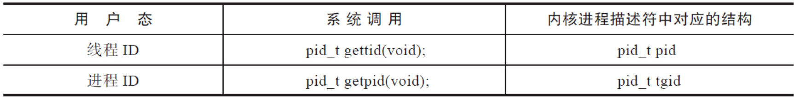

# 线程与进程

在Linux下，程序或可执行文件是一个静态的实体，它只是一组指令的集合，没有执行的含义。进程是一个动态的实体，有自己的生命周期。线程是操作系统进程调度器可以调度的最小执行单元。进程和线程的关系如图7-1所示。


一个进程可能包含多个线程，传统意义上的进程，不过是多线程的一种特例，即该进程只包含一个线程。

为什么要有多线程？

举个生活中的例子，这就好比去银行办理业务。到达银行后，首先找到领导的机器领取一个号码，然后坐下来安心等待。这时候你一定希望，办理业务的窗口越多越好。如果把整个营业大厅当成一个进程的话，那么每一个窗口就是一个工作线程。

有人说不必非要使用线程，多个进程也能做到这点。的确如此。Unix/Linux原本的设计是没有线程的，类Unix系统包括Linux从设计上更倾向于使用进程，反倒是Windows因为创建进程的开销巨大，而更加钟爱线程。

那么线程是不是一种设计上的冗余呢？

其实不是这样的。进程之间，彼此的地址空间是独立的，但线程会共享内存地址空间（如图7-3所示）。同一个进程的多个线程共享一份全局内存区域，包括初始化数据段、未初始化数据段和动态分配的堆内存段。


这种共享给线程带来了很多的优势：

- 创建线程花费的时间要少于创建进程花费的时间。
- 终止线程花费的时间要少于终止进程花费的时间。
- 线程之间上下文切换的开销，要小于进程之间的上下文切换。
- 线程之间数据的共享比进程之间的共享要简单。

# 进程ID和线程ID

在Linux中，目前的线程实现是Native POSIX Thread Library，简称NPTL。在这种实现下，线程又被称为轻量级进程（Light Weighted Process），每一个用户态的线程，在内核之中都对应一个调度实体，也拥有自己的进程描述符（task_struct结构体）。

没有线程之前，一个进程对应内核里的一个进程描述符，对应一个进程ID。但是引入了线程的概念之后，情况就发生了变化，一个用户进程下管辖N个用户态线程，每个线程作为一个独立的调度实体在内核态都有自己的进程描述符，进程和内核的进程描述符一下子就变成了1∶N的关系，POSIX标准又要求进程内的所有线程调用`getpid`函数时返回相同的进程ID。如何解决上述问题呢？

内核引入了线程组（Thread Group）的概念。

```c
struct task_struct {...
    pid_t pid;
    pid_t tgid
      ...
    struct task_struct *group_leader;
      ...
    struct list_head thread_group;
      ...
}
```

多线程的进程，又被称为线程组，线程组内的每一个线程在内核之中都存在一个进程描述符（`task_struct`）与之对应。进程描述符结构体中的`pid`，表面上看对应的是进程ID，其实不然，它对应的是线程ID；进程描述符中的`tgid`，含义是Thread Group ID，该值对应的是用户层面的进程ID，具体见表7-3。


本节介绍的线程ID，不同于后面会讲到的`pthread_t`类型的线程ID，和进程ID一样，线程ID是`pid_t`类型的变量，而且是用来唯一标识线程的一个整型变量。那么如何查看一个线程的ID呢？

```shell
manu@manu-hacks:~$ ps –eLf
...
UID        PID  PPID   LWP  C NLWP STIME TTY          TIME CMD
syslog     837     1   837  0    4 22:20 ?        00:00:00 rsyslogd
syslog     837     1   838  0    4 22:20 ?        00:00:00 rsyslogd
syslog     837     1   839  0    4 22:20 ?        00:00:00 rsyslogd
syslog     837     1   840  0    4 22:20 ?        00:00:00 rsyslogd
...
```

ps命令中的-L选项，会显示出线程的如下信息。

- LWP：线程ID，即`gettid()`系统调用的返回值。
- NLWP：线程组内线程的个数。

所以从上面可以看出`rsyslogd`进程是多线程的，进程ID为`837`，进程内有`4`个线程，线程ID分别为837、838、839和840（如图7-5所示）。


已知某进程的进程ID，该如何查看该进程内线程的个数及其线程ID呢？其实可以通过`/proc/PID/task/`目录下的子目录来查看，如下。因为`procfs`在`task`下会给进程的每个线程建立一个子目录，目录名为线程ID。

```shell
manu@manu-hacks:~$ ll /proc/837/task/
dr-xr-xr-x 6 syslog syslog 0  4月 16 22:32 ./
dr-xr-xr-x 9 syslog syslog 0  4月 16 22:20 ../
dr-xr-xr-x 6 syslog syslog 0  4月 16 22:32 837/
dr-xr-xr-x 6 syslog syslog 0  4月 16 22:32 838/
dr-xr-xr-x 6 syslog syslog 0  4月 16 22:32 839/
dr-xr-xr-x 6 syslog syslog 0  4月 16 22:32 840/
```

对于线程，Linux提供了`gettid`系统调用来返回其线程ID，可惜的是`glibc`并没有将该系统调用封装起来，再开放出接口来供程序员使用。如果确实需要获取线程ID，可以采用如下方法：

```c
#include <sys/syscall.h>
int TID = syscall(SYS_gettid);
```

从上面的示例来看，`rsyslogd`是个多线程的进程，进程ID为837，下面有一个线程的ID也是837，这不是巧合。线程组内的第一个线程，在用户态被称为主线程（main thread），在内核中被称为Group Leader。内核在创建第一个线程时，会将线程组ID的值设置成第一个线程的线程ID，`group_leader`指针则指向自身，即主线程的进程描述符，如下。

```c
/*线程组ID等于主线程的ID，group_leader指向自身*/
p->tgid = p->pid;
p->group_leader = p;
INIT_LIST_HEAD(&p->thread_group);
```

所以可以看到，线程组内存在一个线程ID等于进程ID，而该线程即为线程组的主线程。

至于线程组其他线程的ID则由内核负责分配，其线程组ID总是和主线程的线程组ID一致，无论是主线程直接创建的线程，还是创建出来的线程再次创建的线程，都是这样。

```c
if (clone_flags & CLONE_THREAD)
         p->tgid = current->tgid;
if (clone_flags & CLONE_THREAD) {
     p->group_leader = current->group_leader;
     list_add_tail_rcu(&p->thread_group, &p->group_leader->thread_group);
}
```

通过`group_leader`指针，每个线程都能找到主线程。主线程存在一个链表头，后面创建的每一个线程都会链入到该双向链表中。利用上述的结构，每个线程都可以轻松地找到其线程组的主线程（通过`group_leader`指针），另一方面，通过线程组的主线程，也可以轻松地遍历其所有的组内线程（通过链表）。需要强调的一点是，线程和进程不一样，进程有父进程的概念，但在线程组里面，所有的线程都是对等的关系（如图7-6所示）。

- 并不是只有主线程才能创建线程，被创建出来的线程同样可以创建线程。
- 不存在类似于fork函数那样的父子关系，大家都归属于同一个线程组，进程ID都相等，group_leader都指向主线程，而且各有各的线程ID。
- 并非只有主线程才能调用pthread_join连接其他线程，同一线程组内的任意线程都可以对某线程执行pthread_join函数。
- 并非只有主线程才能调用pthread_detach函数，其实任意线程都可以对同一线程组内的线程执行分离操作。


# pthread库接口介绍


# 线程的创建和标识


# 线程的退出


