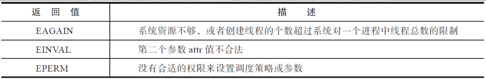

# 线程与进程

在Linux下，程序或可执行文件是一个静态的实体，它只是一组指令的集合，没有执行的含义。进程是一个动态的实体，有自己的生命周期。线程是操作系统进程调度器可以调度的最小执行单元。进程和线程的关系如图7-1所示。


一个进程可能包含多个线程，传统意义上的进程，不过是多线程的一种特例，即该进程只包含一个线程。

为什么要有多线程？

举个生活中的例子，这就好比去银行办理业务。到达银行后，首先找到领导的机器领取一个号码，然后坐下来安心等待。这时候你一定希望，办理业务的窗口越多越好。如果把整个营业大厅当成一个进程的话，那么每一个窗口就是一个工作线程。

有人说不必非要使用线程，多个进程也能做到这点。的确如此。Unix/Linux原本的设计是没有线程的，类Unix系统包括Linux从设计上更倾向于使用进程，反倒是Windows因为创建进程的开销巨大，而更加钟爱线程。

那么线程是不是一种设计上的冗余呢？

其实不是这样的。进程之间，彼此的地址空间是独立的，但线程会共享内存地址空间（如图7-3所示）。同一个进程的多个线程共享一份全局内存区域，包括初始化数据段、未初始化数据段和动态分配的堆内存段。


这种共享给线程带来了很多的优势：

- 创建线程花费的时间要少于创建进程花费的时间。
- 终止线程花费的时间要少于终止进程花费的时间。
- 线程之间上下文切换的开销，要小于进程之间的上下文切换。
- 线程之间数据的共享比进程之间的共享要简单。

# 进程ID和线程ID

在Linux中，目前的线程实现是Native POSIX Thread Library，简称NPTL。在这种实现下，线程又被称为轻量级进程（Light Weighted Process），每一个用户态的线程，在内核之中都对应一个调度实体，也拥有自己的进程描述符（`task_struct`结构体）。

没有线程之前，一个进程对应内核里的一个进程描述符，对应一个进程ID。但是引入了线程的概念之后，情况就发生了变化，一个用户进程下管辖N个用户态线程，每个线程作为一个独立的调度实体在内核态都有自己的进程描述符，进程和内核的进程描述符一下子就变成了1∶N的关系，POSIX标准又要求进程内的所有线程调用`getpid`函数时返回相同的进程ID。如何解决上述问题呢？

内核引入了线程组（Thread Group）的概念。

```c
struct task_struct {...
    pid_t pid;
    pid_t tgid
      ...
    struct task_struct *group_leader;
      ...
    struct list_head thread_group;
      ...
}
```

多线程的进程，又被称为线程组，线程组内的每一个线程在内核之中都存在一个进程描述符（`task_struct`）与之对应。进程描述符结构体中的`pid`，表面上看对应的是进程ID，其实不然，它对应的是线程ID；进程描述符中的`tgid`，含义是Thread Group ID，该值对应的是用户层面的进程ID，具体见表7-3。


本节介绍的线程ID，不同于后面会讲到的`pthread_t`类型的线程ID，和进程ID一样，线程ID是`pid_t`类型的变量，而且是用来唯一标识线程的一个整型变量。那么如何查看一个线程的ID呢？

```shell
manu@manu-hacks:~$ ps –eLf
...
UID        PID  PPID   LWP  C NLWP STIME TTY          TIME CMD
syslog     837     1   837  0    4 22:20 ?        00:00:00 rsyslogd
syslog     837     1   838  0    4 22:20 ?        00:00:00 rsyslogd
syslog     837     1   839  0    4 22:20 ?        00:00:00 rsyslogd
syslog     837     1   840  0    4 22:20 ?        00:00:00 rsyslogd
...
```

ps命令中的-L选项，会显示出线程的如下信息。

- LWP：线程ID，即`gettid()`系统调用的返回值。
- NLWP：线程组内线程的个数。

所以从上面可以看出`rsyslogd`进程是多线程的，进程ID为`837`，进程内有`4`个线程，线程ID分别为837、838、839和840（如图7-5所示）。


已知某进程的进程ID，该如何查看该进程内线程的个数及其线程ID呢？其实可以通过`/proc/PID/task/`目录下的子目录来查看，如下。因为`procfs`在`task`下会给进程的每个线程建立一个子目录，目录名为线程ID。

```shell
manu@manu-hacks:~$ ll /proc/837/task/
dr-xr-xr-x 6 syslog syslog 0  4月 16 22:32 ./
dr-xr-xr-x 9 syslog syslog 0  4月 16 22:20 ../
dr-xr-xr-x 6 syslog syslog 0  4月 16 22:32 837/
dr-xr-xr-x 6 syslog syslog 0  4月 16 22:32 838/
dr-xr-xr-x 6 syslog syslog 0  4月 16 22:32 839/
dr-xr-xr-x 6 syslog syslog 0  4月 16 22:32 840/
```

对于线程，Linux提供了`gettid`系统调用来返回其线程ID，可惜的是`glibc`并没有将该系统调用封装起来，再开放出接口来供程序员使用。如果确实需要获取线程ID，可以采用如下方法：

```c
#include <sys/syscall.h>
int TID = syscall(SYS_gettid);
```

从上面的示例来看，`rsyslogd`是个多线程的进程，进程ID为837，下面有一个线程的ID也是837，这不是巧合。线程组内的第一个线程，在用户态被称为主线程（main thread），在内核中被称为Group Leader。内核在创建第一个线程时，会将线程组ID的值设置成第一个线程的线程ID，`group_leader`指针则指向自身，即主线程的进程描述符，如下。

```c
/*线程组ID等于主线程的ID，group_leader指向自身*/
p->tgid = p->pid;
p->group_leader = p;
INIT_LIST_HEAD(&p->thread_group);
```

所以可以看到，线程组内存在一个线程ID等于进程ID，而该线程即为线程组的主线程。

至于线程组其他线程的ID则由内核负责分配，其线程组ID总是和主线程的线程组ID一致，无论是主线程直接创建的线程，还是创建出来的线程再次创建的线程，都是这样。

```c
if (clone_flags & CLONE_THREAD)
         p->tgid = current->tgid;
if (clone_flags & CLONE_THREAD) {
     p->group_leader = current->group_leader;
     list_add_tail_rcu(&p->thread_group, &p->group_leader->thread_group);
}
```

通过`group_leader`指针，每个线程都能找到主线程。主线程存在一个链表头，后面创建的每一个线程都会链入到该双向链表中。利用上述的结构，每个线程都可以轻松地找到其线程组的主线程（通过`group_leader`指针），另一方面，通过线程组的主线程，也可以轻松地遍历其所有的组内线程（通过链表）。需要强调的一点是，线程和进程不一样，进程有父进程的概念，但在线程组里面，所有的线程都是对等的关系（如图7-6所示）。

- 并不是只有主线程才能创建线程，被创建出来的线程同样可以创建线程。
- 不存在类似于fork函数那样的父子关系，大家都归属于同一个线程组，进程ID都相等，`group_leader`都指向主线程，而且各有各的线程ID。
- 并非只有主线程才能调用`pthread_join`连接其他线程，同一线程组内的任意线程都可以对某线程执行`pthread_join`函数。
- 并非只有主线程才能调用`pthread_detach`函数，其实任意线程都可以对同一线程组内的线程执行分离操作。


# pthread库接口介绍

1995年，POSIX.1c标准对POSIX线程API进行了标准化，这就是我们今天看到的`pthread`库的接口。这些接口包括线程的创建、退出、取消和分离，以及连接已经终止的线程，互斥量，读写锁，线程的条件等待等（如表7-4所示）。


上面提到的函数列表，是pthread的基本接口，接下来的章节，将分别介绍这些接口。

# 线程的创建和标识

首先要介绍的接口是创建线程的接口，即`pthread_create`函数。程序开始启动的时候，产生的进程只有一个线程，我们称之为主线程或初始线程。对于单线程的进程而言，只存在主线程一个线程。如果想在主线程之外，再创建一个或多个线程，就需要用到这个接口了。

## pthread_create函数

pthread库提供了如下接口来创建线程：

```c
#include <pthread.h>
int pthread_create(pthread_t *restrict thread,
                   const pthread_attr_t *restrict attr,
                   void *(*start_routine)(void*),
                   void *restrict arg);
```

`pthread_create`函数的第一个参数是`pthread_t`类型的指针，线程创建成功的话，会将分配的线程ID填入该指针指向的地址。线程的后续操作将使用该值作为线程的唯一标识。

第二个参数是`pthread_attr_t`类型，通过该参数可以定制线程的属性，比如可以指定新建线程栈的大小、调度策略等。如果创建线程无特殊的要求，该值也可以是NULL，表示采用默认属性。

第三个参数是线程需要执行的函数。创建线程，是为了让线程执行一定的任务。线程创建成功之后，该线程就会执行`start_routine`函数，该函数之于线程，就如同main函数之于主线程。

第四个参数是新建线程执行的`start_routine`函数的入参。新建线程如果想要正常工作，则可能需要入参，那么主线程在调用`pthread_create`的时候，就可以将入参的指针放入第四个参数以传递给新建线程。

如果线程的执行函数`start_routine`需要很多入参，传递一个指针就能提供足够的信息吗？答案是能。线程创建者（一般是主线程）和线程约定一个结构体，创建者便把信息填入该结构体，再将结构体的指针传递给子进程，子进程只要解析该结构体，就能取出需要的信息。

如果成功，则`pthread_create`返回0；如果不成功，则`pthread_create`返回一个非0的错误码。常见的错误码如表7-5所示。



`pthread_create`函数的返回情况有些特殊，通常情况下，函数调用失败，则返回-1，并且设置errno。`pthread_create`函数则不同，它会将errno作为返回值，而不是一个负值。

```c
void * thread_worker(void *)
{
    printf(“I am thread worker”);
    pthread_exit(NULL)
}
pthread_t tid ;
int ret = 0;
ret = pthread_create(&tid,NULL,&thread_worker,NULL);
if(ret != 0)/* 注意此处，不能用ret < 0 作为出错判断*/
{
    /*ret is the errno*/
     /*error handler*/
}
```


## 线程ID及进程地址空间布局

`pthread_create`函数，会产生一个线程ID，存放在第一个参数指向的地址中。该线程ID和7.2节分析的线程ID是一回事吗？答案是否定的。

**7.2节提到的线程ID，属于进程调度的范畴。因为线程是轻量级进程，是操作系统调度器的最小单位，所以需要一个数值来唯一标识该线程。**

**`pthread_create`函数产生线程ID并记录在第一个参数指向地址中，属于NPTL线程库的范畴，线程库的后续操作，就是根据该线程ID来操作线程的。**

线程库NPTL提供了`pthread_self`函数，可以获取到线程自身的ID：

```c
 #include <pthread.h>
 pthread_t pthread_self(void);
```

在同一个线程组内，线程库提供了接口，可以判断两个线程ID是否对应着同一个线程：

```c
#include <pthread.h>
int pthread_equal(pthread_t t1, pthread_t t2);
```

返回值是`0`的时候，表示两个线程是同一个线程，非零值则表示不是同一个线程。

`pthread_t`到底是个什么样的数据结构呢？因为POSIX标准并没有限制`pthread_t`的数据类型，所以该类型取决于具体实现。**对于Linux目前使用的NPTL实现而言，`pthread_t`类型的线程ID，本质就是一个进程地址空间上的一个地址。**

是时候看一下进程地址空间的布局了。在x86_64平台上，用户地址空间约为128TB，对于地址空间的布局，系统有如下控制选项：

```shell
cat /proc/sys/vm/legacy_va_layout
0
```

该选项影响地址空间的布局，主要是影响mmap区域的基地址位置，以及mmap是向上还是向下增长。如果该值为1，那么mmap的基地址mmap_base变小（约在128T的三分之一处），mmap区域从低地址向高地址扩展。如果该值为0，那么mmap区域的基地址在栈的下面（约在128T空间处），mmap区域从高地址向低地址扩展。默认值为0，布局如图7-7所示。


可以通过procfs或pmap命令来查看进程的地址空间的情况：

```
pmap PID
```

或者

```shell
cat /proc/PID/maps
```

在接近128TB的巨大地址空间里面，代码段、已初始化数据段、未初始化数据段，以及主线程的栈，所占用的空间非常小，都是KB、MB这个数量级的，如下：

```shell
manu@manu-hacks:~$ pmap 3706
3706:   ./process_map
0000000000400000      4K r-x-- process_map
0000000000601000      4K r---- process_map
0000000000602000      4K rw--- process_map…
00007ffdd5f68000   5128K rw---   [ stack ]  /*栈在128T位置附近*/
```

由于主线程的栈大小并不是固定的，要在运行时才能确定大小（上限大概在8MB左右），因此，在栈中不能存在巨大的局部变量，另外编写递归函数时一定要小心，递归不能太深，否则很可能耗尽栈空间。如下面的例子所示，无尽地递归，很轻易就耗尽了栈的空间：

```c
int i = 0;
void func()
{
    int buffer[256];
    printf("i = %d\n",i);
    i++;
    func();
}
int main()
{
    func();
    sleep(100);
}
```

上面代码的递归永不停息，每次递归，都会消耗约1KB（256个int型为1KB）的栈空间。通过运行可以看出，主线程栈最大也就在8MB左右：

```shell
i = 8053
i = 8054
i = 8055段错误（核心已转储）
```

**进程地址空间之中，最大的两块地址空间是内存映射区域和堆。堆的起始地址特别低，向上扩展，mmap区域的起始地址特别高，向下扩展。**

用户调用`pthread_create`函数时，glibc首先要为线程分配线程栈，而线程栈的位置就落在`mmap`区域。glibc会调用`mmap`函数为线程分配栈空间。`pthread_create`函数分配的`pthread_t`类型的线程ID，不过是分配出来的空间里的一个地址，更确切地说是一个结构体的指针，如图7-8所示。


创建两个线程，将其`pthread_self()`的返回值打印出来，输出如下：

```shell
address of tid in thread-1 = 0x7f011ca12700
address of tid in thread-2 = 0x7f011c211700
```

线程ID是进程地址空间内的一个地址，要在同一个线程组内进行线程之间的比较才有意义。不同线程组内的两个线程，哪怕两者的`pthread_t`值是一样的，也不是同一个线程，这是显而易见的。

很有意思的一点是，`pthread_t`类型的线程ID很有可能会被复用。在满足下列条件时，线程ID就有可能会被复用：

1）线程退出。
2）线程组的其他线程对该线程执行了`pthread_join`，或者线程退出前将分离状态设置为已分离。
3）再次调用`pthread_create`创建线程。

为什么`pthread_t`类型的线程ID会被复用，这点将在后面进行分析。下面通过测试来证明一下：

```c
/*省略了error handler*/
void* thread_work(void* param)
{
    int TID = syscall(SYS_gettid);
    printf("thread-%d: gettid return %d\n",TID,TID);
    printf("thread-%d: pthread_self return %p\n",TID,(void *)pthread_self());
    printf("thread-%d: I will exit now\n",TID);
    pthread_exit(NULL);
    return NULL;
}
int main(int argc ,char* argv[])
{
    pthread_t tid = 0;
     int ret
    ret  = pthread_create(&tid,NULL,thread_work,NULL);
    ret  = pthread_join(tid,NULL);
    ret  = pthread_create(&tid,NULL,thread_work,NULL);
    ret  = pthread_join(tid,NULL);
    return 0;
}
```

输出结果如下：

```shell
thread-4158: gettid return 4158
thread-4158: pthread_self return 0x7f43a27d0700
thread-4158: I will exit now
thread-4159: gettid return 4159
thread-4159: pthread_self return 0x7f43a27d0700
thread-4159: I will exit now
```

从输出结果上看，对于`pthread_t`类型的线程ID，虽然在同一时刻不会存在两个线程的ID值相同，但是如果线程退出了，重新创建的线程很可能复用了同一个`pthread_t`类型的ID。从这个角度看，如果要设计调试日志，用`pthread_t`类型的线程ID来标识进程就不太合适了。用`pid_t`类型的线程ID则是一个比较不错的选择。

```c
#include <sys/syscall.h>
int TID = syscall(SYS_gettid);
```

采用`pid_t`类型的线程ID来唯一标识进程有以下优势：

- 返回类型是`pid_t`类型，不同进程之间也不会存在重复的线程ID，在任意时刻都是全局唯一的值。
- procfs中记录了线程的相关信息，可以方便地查看`/proc/pid/task/tid`来获取线程对应的信息。
- ps命令提供了查看线程信息的`-L`选项，可以通过输出中的`LWP`和`NLWP`，来查看同一个线程组的线程个数及线程ID的信息。

另外一个比较有意思的功能是我们可以给线程起一个有意义的名字，命名以后，既可以从procfs中获取到线程的名字，也可以从ps命令中得到线程的名字，这样就可以更好地辨识不同的线程。

Linux提供了`prctl`系统调用：

```c
#include <sys/prctl.h>
int  prctl(int  option,  unsigned  long arg2,
           unsigned long arg3 , unsigned long arg4,
           unsigned long arg5)
```

这个系统调用和`ioctl`非常类似，通过`option`来控制系统调用的行为。当需要给线程设定名字的时候，只需要将`option`设为PR_SET_NAME，同时将线程的名字作为`arg2`传递给`prctl`系统调用即可，这样就能给线程命名了。

下面是示例代码：

```c
void thread_setnamev(const char* namefmt, va_list args)
{
    char name[17];
    vsnprintf(name, sizeof(name), namefmt, args);
    prctl(PR_SET_NAME, name, NULL, NULL, NULL);
}
void thread_setname(const char* namefmt, ...)
{
    va_list args;
    va_start(args, namefmt);
    thread_setnamev(namefmt, args);
    va_end(args);
}
thread_setname("BEAN-%d",num);
```

这里共创建了四个线程，按照调用`pthread_create`的顺序，将0、1、2、3作为参数传递给线程，然后调用`prctl`给每个线程起名字：分别为BEAN-0、BEAN-1、BEAN-2和BEAN-3。命名以后可以通过ps命令来查看线程的名字：

```shell
manu@manu-hacks:~$ ps -L -p 3454
  PID   LWP TTY          TIME CMD
 3454  3454 pts/0    00:00:00 pthread_tid # 主线程
 3454  3455 pts/0    00:00:00 BEAN-0
 3454  3456 pts/0    00:00:00 BEAN-1
 3454  3457 pts/0    00:00:00 BEAN-2
 3454  3458 pts/0    00:00:00 BEAN-3
manu@manu-hacks:~$ cat /proc/3454/task/3457/status
Name:    BEAN-2
State:    S (sleeping)
Tgid:    3454 # 线程组id也就是主线程id，也就是进程id
```

这是一个很有用的技巧。给线程命了名，就可以很直观地区分各个线程，尤其是在线程比较多，且其分工不同的情况下。

## 线程创建的默认属性

线程创建的第二个参数是`pthread_attr_t`类型的指针，`pthread_attr_init`函数会将线程的属性重置成默认值。

```c
pthread_attr_t    attr;
pthread_attr_init(&attr);
```

在创建线程时，传递重置过的属性，或者传递NULL，都可以创建一个具有默认属性的线程，见表7-6。


手册给出了一个如何展示线程属性的例子，若你需要展示线程的属性，则可以参考手册。

本节现在来介绍线程栈的基地址和大小。默认情况下，线程栈的大小为8MB：

```shell
manu@manu-hacks:~$ ulimit -s
8192
```

调用`pthread_attr_getstack`函数可以返回线程栈的基地址和栈的大小。出于可移植性的考虑不建议指定线程栈的基地址，但是有时候会有修改线程栈的大小的需要。

一个线程需要分配8MB左右的栈空间，就决定了不可能无限地创建线程，在进程地址空间受限的32位系统里尤为如此。在32位系统下，3GB的用户地址空间决定了能创建线程的个数不会太多。如果确实需要很多的线程，可以调用接口来调整线程栈的大小：

```c
#include <pthread.h>
int pthread_attr_setstacksize(pthread_attr_t *attr,
                              size_t stacksize);
int pthread_attr_getstacksize(pthread_attr_t *attr,size_t *stacksize);
```

# 线程的退出

有生就有灭，线程执行完任务，也需要终止。下面的三种方法中，线程会终止，但是进程不会终止（如果线程不是进程组里的最后一个线程的话）：

- 创建线程时的`start_routine`函数执行了`return`，并且返回指定值。
- 线程调用`pthread_exit`。
- 其他线程调用了`pthread_cancel`函数取消了该线程（详见第8章）。

如果线程组中的任何一个线程调用了`exit`函数，或者主线程在`main`函数中执行了`return`语句，那么整个线程组内的所有线程都会终止。

值得注意的是，`pthread_exit`和线程启动函数（start_routine）执行`return`是有区别的。在`start_routine`中调用的任何层级的函数执行`pthread_exit()`都会引发线程退出，而`return`，只能是在`start_routine`函数内执行才能导致线程退出。

```c
void* start_routine(void* param)
{
    …
    foo();
    bar();
    return NULL;
}
void foo()
{
    ...
    pthread_exit(NULL);
}
```

如果`foo`函数执行了`pthread_exit`函数，则线程会立刻退出，后面的`bar`就会没有机会执行了。

下面来看看`pthread_exit`函数的定义：

```c
#include <pthread.h>
void pthread_exit(void *value_ptr);
```

`value_ptr`是一个指针，存放线程的“临终遗言”。线程组内的其他线程可以通过调用`pthread_join`函数接收这个地址，从而获取到退出线程的临终遗言。如果线程退出时没有什么遗言，则可以直接传递NULL指针，如下所示：

```c
pthread_exit(NULL);
```

但是这里有一个问题，就是不能将遗言存放到线程的局部变量里，因为如果用户写的线程函数退出了，线程函数栈上的局部变量可能就不复存在了，线程的临终遗言也就无法被接收者读到，示例如下。

```c
void* thread_work(void* param)
{
    int ret = -1;
    ret = whatever();
    pthread_exit(&ret);
}
```

上述用法是一种典型的错误用法，因为当线程退出时，线程栈已经不复存在了，上面的`ret`变量也已经无法访问了。那我们应该如何正确地传递返回值呢？

- 如果是int型的变量，则可以使用`pthread_exit((int*)ret);`。
- 使用全局变量返回。
- 将返回值填入到用`malloc`在堆上分配的空间里。
- 使用字符串常量，如`pthread_exit(“hello，world”)`。

第一种是tricky的做法，我们将返回值ret进行强制类型转换，接收方再把返回值强制转换成int。但是不推荐使用这种方法。这种方法虽然是奏效的，但是太tricky，而且C标准没有承诺将int型转成指针后，再从指针转成int型时，数据一直保持不变。

第二种方法使用全局变量，其他线程调用`pthread_join`时也可见这个变量。

第三种方法是用`malloc`，在堆上分配空间，然后将返回值填入其中。因为堆上的空间不会随着线程的退出而释放，所以`pthread_join`可以取出返回值。切莫忘记释放该空间，否则会引起内存泄漏。

第四种方法之所以可行，是因为字符串常量有静态存储的生存期限。

传递线程的返回值，除了`pthread_exit`函数可以做到，线程的启动函数（`start_routine`函数）`return`也可以做到，两者的数据类型要保持一致，都是`void*`类型。这也解释了为什么线程的启动函数`start_routine`的返回值总是`void*`类型，如下：

```c
void pthread_exit(void *retval);
void * start_routine(void *param)
```

线程退出有一种比较有意思的场景，即线程组的其他线程仍在执行的情况下，主线程却调用`pthread_exit`函数退出了。这会发生什么事情？

在多线程编程中，当主线程（即程序的初始线程）调用`pthread_exit`函数退出，但其他线程仍在执行时，将发生以下情况： 

1. **主线程退出，但进程不退出：** 主线程的退出并不会导致整个进程退出。`pthread_exit`函数会结束调用它的线程，如果这个线程是主线程，那么主线程会结束执行，但是进程中的其他线程会继续执行。 
2. **进程继续运行：** 既然进程还有未终止的线程在运行，整个进程就会继续运行。这意味着操作系统会保持该进程的存在，直至所有线程都终止。 
3. **资源回收和清理：** 当主线程调用`pthread_exit`时，它会释放自己占用的部分资源，比如栈内存。但是，由于进程仍然存在，因此进程级别的资源，比如打开的文件描述符、堆内存等，将会继续存在直到进程结束。 
4. **进程的最终退出：** 当进程中最后一个线程结束时，或者任一线程调用`exit()`函数，或者主线程调用`pthread_exit`后，某一线程调用`exit()`或`_exit()`函数，此时整个进程才会结束，操作系统会回收进程占用的所有资源。 
5. **exit()与pthread_exit()的区别：** 如果主线程调用`exit()`、`_exit()`、或者`return`来退出，那么整个进程将立即结束，包括所有的子线程。而`pthread_exit`仅仅结束调用它的线程，对其他线程没有直接影响。 
6. **主线程等待其他线程：** 在某些场景下，主线程可能会在调用`pthread_exit`之前先调用`pthread_join`或者其他同步机制（如条件变量等），以等待其他线程完成它们的执行。这是一种优雅退出的方式，确保所有线程都可以完成它们的任务。 

总的来说，主线程调用`pthread_exit`而退出时，其他线程仍将继续执行，直到它们自然结束或者被显式地终止。这一行为模式给了多线程程序更大的灵活性和控制力。

# 线程的连接与分离

## 线程的连接

7.5节提到过线程退出时是可以有返回值的，那么如何取到线程退出时的返回值呢？

线程库提供了`pthread_join`函数，用来等待某线程的退出并接收它的返回值。这种操作被称为连接（joining）。

相关函数的接口定义如下：

```c
#include <pthread.h>
int pthread_join(pthread_t thread, void **retval);
```

该函数第一个参数为要等待的线程的线程ID，第二个参数用来接收返回值。

根据等待的线程是否退出，可得到如下两种情况：

- 等待的线程尚未退出，那么`pthread_join`的调用线程就会陷入阻塞。
- 等待的线程已经退出，那么`pthread_join`函数会将线程的退出值（`void*`类型）存放到`retval`指针指向的位置。

线程的连接（join）操作有点类似于进程等待子进程退出的等待（wait）操作，但细细想来，还是有不同之处：

第一点不同之处是进程之间的等待只能是父进程等待子进程，而线程则不然。线程组内的成员是对等的关系，只要是在一个线程组内，就可以对另外一个线程执行连接（join）操作。如图7-9所示，线程F一样可以连接线程A。


第二点不同之处是进程可以等待任一子进程的退出（用下面的代码不难做到），但是线程的连接操作没有类似的接口，即不能连接线程组内的任一线程，必须明确指明要连接的线程的线程ID。

```c
wait(&status);
waitpid(-1,&status,optioins)
```

`pthread_join`不能连接线程组内任意线程的做法，并不是NPTL线程库设计上的瑕疵，而是有意为之的。如果听任线程连接线程组内的任意线程，那么所谓的任意线程就会包括其他库函数私自创建的线程，当库函数尝试连接（join）私自创建的线程时，发现已经被连接过了，就会返回EINVAL错误。如果库函数需要根据返回值来确定接下来的流程，这就会引发严重的问题。正确的做法是，连接已知线程ID的那些线程，就像`pthread_join`函数那样。

下面来分析出错的情况，当调用失败时，和`pthread_create`函数一样，errno作为返回值返回。错误码的情况见表7-7。


`pthread_join`函数之所以能够判断是否死锁和连接操作是否被其他线程捷足先登，是因为目标线程的控制结构体`struct pthread`中，存在如下成员变量，记录了该线程的连接者。

```c
struct pthread *joinid；
```

该指针存在三种可能，如下。

- NULL：线程是可连接的，但是尚没有其他线程调用`pthread_join`来连接它。
- 指向线程自身的`struct pthread`：表示该线程属于自我了断型，执行过分离操作，或者创建线程时，设置的分离属性为PTHREAD_CREATE_DETACHED，一旦退出，则自动释放所有资源，无需其他线程来连接。
- 指向线程组内其他线程的`struct pthread`：表示`joinid`对应的线程会负责连接。

因为有了该成员变量来记录线程的连接者，所以可以判断如下场景，如图7-10所示。


不过两者还是略有区别的，第一种场景，线程A连接线程A，`pthread_join`函数一定会返回EDEADLK。但是第二种场景，大部分情况下会返回EDEADLK，不过也有例外。不管怎样，不建议两个线程互相连接。

如果两个线程几乎同时对处于可连接状态的线程执行连接操作会怎么样？答案是只有一个线程能够成功，另一个则返回EINVAL。

NTPL提供了原子性的保证：

```c
(atomic_compare_and_exchange_bool_acq（&pd->joined,self,NULL）
```

如果是NULL，则设置成调用线程的线程ID，CAS操作（Compare And Swap）是原子操作，不可分割，决定了只有一个线程能成功。

如果joinid不是NULL，表示该线程已经被别的线程连接了，或者正处于已分离的状态，在这两种情况下，都会返回EINVAL。

## 为什么要连接退出的线程

不连接已经退出的线程会怎么样？如果不连接已经退出的线程，会导致资源无法释放。所谓资源指的又是什么呢？

下面通过一个测试来让事实说话。测试模拟下面两种情况：

- 主线程并不执行连接操作，待确定创建的第一个线程退出后，再创建第二个线程。
- 主线程执行连接操作，等到第一个线程退出后，再创建第二个线程。

按照时间线来发展，如图7-11所示。


下面是代码部分，为了简化程序和便于理解，使用sleep操作来确保创建的第一个线程退出后，再来创建第二个线程。须知sleep并不是同步原语，在真正的项目代码中，用sleep函数来同步线程是不可原谅的。

```c
#define _GNU_SOURCE
#include <stdio.h>
#include <stdlib.h>
#include <unistd.h>
#include <pthread.h>
#include <string.h>
#include <errno.h>
#include <sys/syscall.h>
#include <sys/types.h>
#define NR_THREAD 1
#define ERRBUF_LEN 4096
void* thread_work(void* param)
{
    int TID = syscall(SYS_gettid);
    printf("thread-%d IN \n",TID);
    printf("thread-%d pthread_self return %p \n",TID,(void*)pthread_self());
    sleep(60);
    printf("thread-%d EXIT \n",TID);
    return NULL;
}
int main(int argc ,char* argv[])
{
    pthread_t tid[NR_THREAD];
    pthread_t tid_2[NR_THREAD];
    char errbuf[ERRBUF_LEN];
    int i, ret;
    for(i = 0 ; i < NR_THREAD ; i++)
    {
        ret = pthread_create(&tid[i],NULL,thread_work,NULL);
        if(ret != 0)
        {
            fprintf(stderr,"create thread failed ,return %d (%s)\n",ret,strerror_r (ret,errbuf,sizeof(errbuf)));
        }
    }
#ifdef NO_JOIN
    sleep(100);/*sleep是为了确保线程退出之后，再来重新创建线程*/
#else
    printf("join thread Begin\n");
    for(i = 0 ; i < NR_THREAD; i++)
    {
        pthread_join(tid[i],NULL);
    }
#endif
    for(i = 0 ; i < NR_THREAD ; i++)
    {
        ret = pthread_create(&tid_2[i],NULL,thread_work,NULL);
        if(ret != 0)
        {
            fprintf(stderr,"create thread failed ,return %d (%s)\n",ret,strerror_r (ret,errbuf,sizeof(errbuf)));
        }
    }
    sleep(1000);
    exit(0);
}
```

根据编译选项NO_JOIN，将程序编译成以下两种情况：

- 编译加上`–DNO_JOIN`：主线不执行`pthread_join`，主线程通过`sleep`足够的时间，来确保第一个线程退出以后，再创建第二个线程。
- 不加`-NO_JOIN`编译选项：主线程负责连接线程，第一个线程退出以后，再来创建第二个线程。

下面按照编译选项，分别编出`pthread_no_join`和`pthread_has_join`两个程序：

```shell
gcc -o pthread_no_join pthread_join_cmp.c -DNO_JOIN –lpthread
gcc -o pthread_has_join pthread_join_cmp.c            -lpthread
```

首先说说`pthread_no_join`的情况，当创建了第一个线程时：

```shell
manu@manu-hacks:~/code/me/thread$ ./pthread_no_join
thread-12876 IN
thread-12876 pthread_self return 0x7fe0c842b700
```

从输出可以看到，创建了第一个线程，其线程ID为12876，通过pmap和procfs可以看到系统为该线程分配了8MB的地址空间：

```shell
manu@manu-hacks:~$ pmap 12875 # PID
00007fe0c7c2b000      4K -----   [ anon ]
00007fe0c7c2c000   8192K rw---   [ anon ]
manu@manu-hacks:~$ cat /proc/12875/maps
7fe0c7c2b000-7fe0c7c2c000 ---p 00000000 00:00 07fe0c7c2c000-7fe0c842c000 rw-p 00000000 00:00 0                    [stack:12876]
```

当线程12876退出，创建新的线程时：

```shell
thread-12876 EXIT
thread-13391 IN
thread-13391 pthread_self return 0x7fe0c7c2a700
```

此时查看进程的地址空间：

```shell
00007fe0c742a000      4K -----   [ anon ]
00007fe0c742b000   8192K rw---   [ anon ]
00007fe0c7c2b000      4K -----   [ anon ]
00007fe0c7c2c000   8192K rw---   [ anon ]
7fe0c742a000-7fe0c742b000 ---p 00000000 00:00 0
7fe0c742b000-7fe0c7c2b000 rw-p 00000000 00:00 0                     [stack:13391]
7fe0c7c2b000-7fe0c7c2c000 ---p 00000000 00:00 07fe0c7c2c000-7fe0c842c000 rw-p 00000000 00:00 0
```

从上面的输出可以看出两点：

1）已经退出的线程，其空间没有被释放，仍然在进程的地址空间之内。
2）新创建的线程，没有复用刚才退出的线程的地址空间。

如果仅仅是情况1的话，尚可以理解，但是1和2同时发生，既不释放，也不复用，这就不能忍了，因为这已经属于内存泄漏了。试想如下场景：FTP Server采用thread per connection的模型，每接受一个连接就创建一个线程为之服务，服务结束后，连接断开，线程退出。但线程退出了，线程栈消耗的空间仍不能释放，不能复用，久而久之，内存耗尽，再也不能创建线程，也无法再提供FTP服务。

之所以不能复用，原因就在于没有对退出的线程执行连接操作。下面来看一下主线程调用`pthread_join`的情况：

```shell
manu@manu-hacks:~/code/me/thread$ ./pthread_has_join
join thread Begin
thread-14581 IN
thread-14581 pthread_self return 0x7f726020f700
thread-14581 EXIT
thread-14871 IN
thread-14871 pthread_self return 0x7f726020f700
thread-14871 EXIT
```

两次创建的线程，`pthread_t`类型的线程ID完全相同，看起来好像前面退出的栈空间被复用了，事实也的确如此：

```shell
manu@manu-hacks:~$ cat /proc/14580/maps
7f725fa0f000-7f725fa10000 ---p 00000000 00:00 0
7f725fa10000-7f7260210000 rw-p 00000000 00:00 0                     [stack:14581]
```

12581退出后，线程栈被后创建的线程复用了：

```shell
manu@manu-hacks:~$ cat /proc/14580/maps
7f725fa0f000-7f725fa10000 ---p 00000000 00:00 0
7f725fa10000-7f7260210000 rw-p 00000000 00:00 0                     [stack:14871]
```

通过前面的比较，可以看出执行连接操作的重要性：如果不执行连接操作，线程的资源就不能被释放，也不能被复用，这就造成了资源的泄漏。

当线程组内的其他线程调用`pthread_join`连接退出线程时，内部会调用`__free_tcb`函数，该函数会负责释放退出线程的资源。

值得一提的是，纵然调用了`pthread_join`，也并没有立即调用`munmap`来释放掉退出线程的栈，它们是被后建的线程复用了，这是NPTL线程库的设计。释放线程资源的时候，NPTL认为进程可能再次创建线程，而频繁地`munmap`和`mmap`会影响性能，所以NTPL将该栈缓存起来，放到一个链表之中，如果有新的创建线程的请求，NPTL会首先在栈缓存链表中寻找空间合适的栈，有的话，直接将该栈分配给新创建的线程。

始终不将线程栈归还给系统也不合适，所以缓存的栈大小有上限，默认是40MB，如果缓存起来的线程栈的空间总和大于40MB，NPTL就会扫描链表中的线程栈，调用`munmap`将一部分空间归还给系统。

## 线程的分离


# 互斥量


# 读写锁


# 性能杀手：伪共享