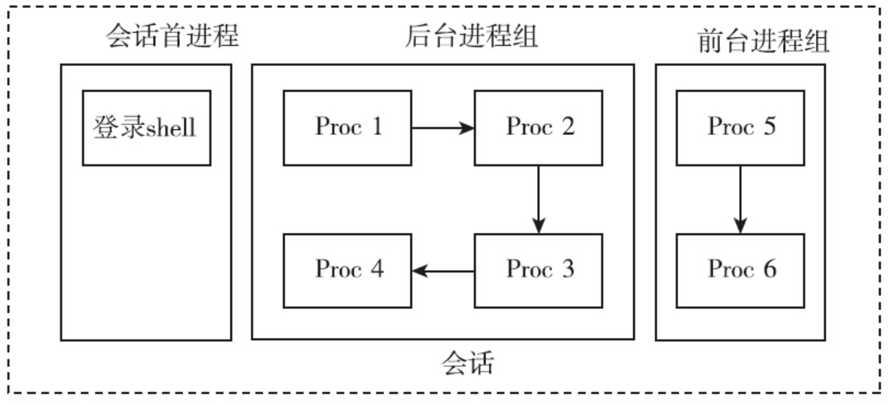
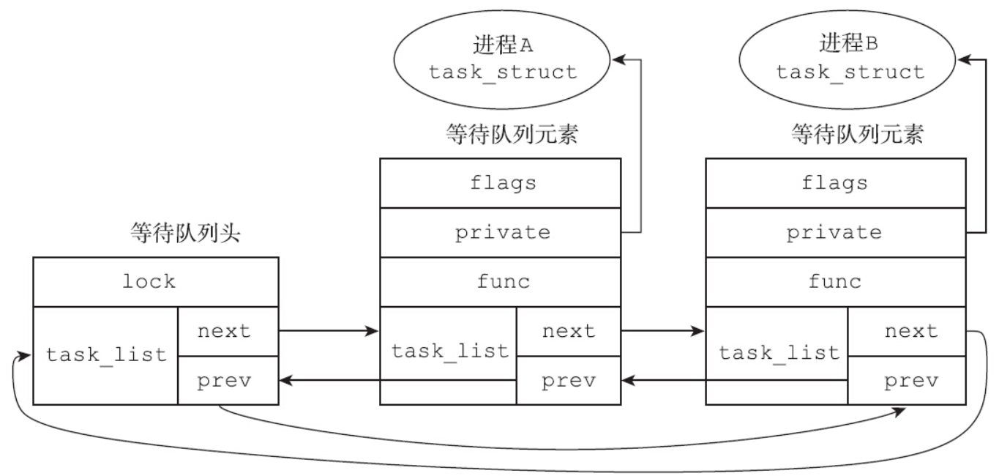
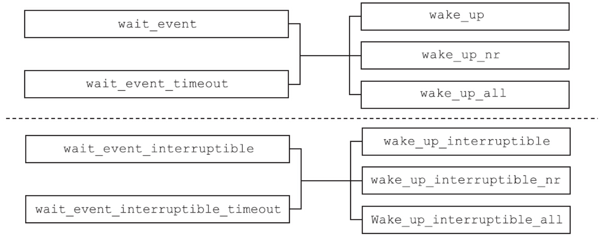
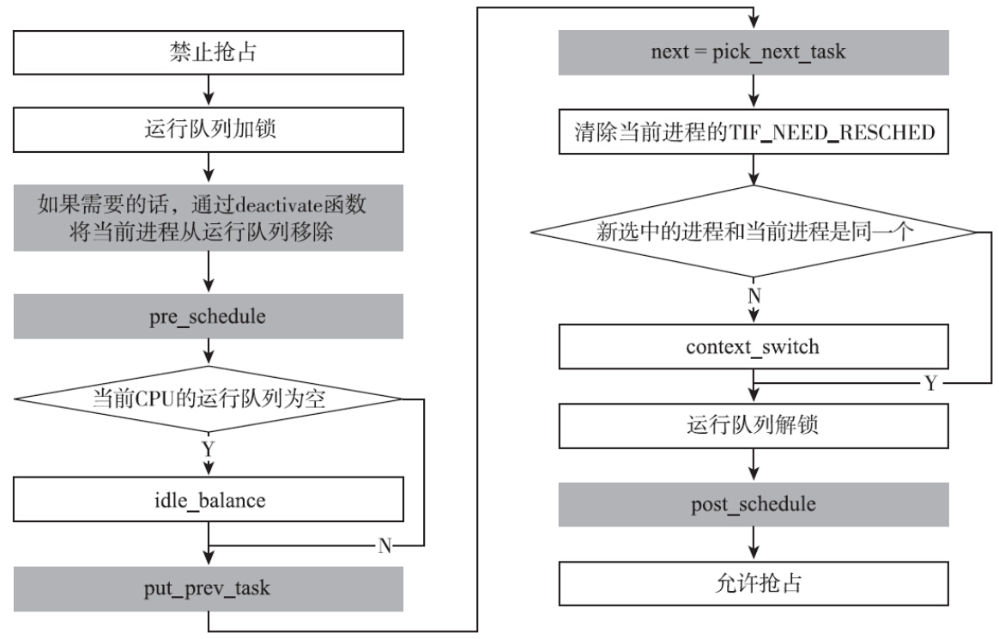
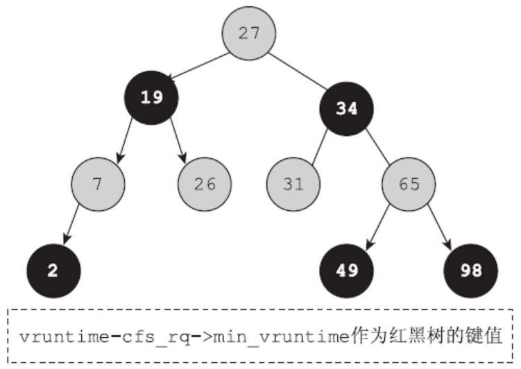
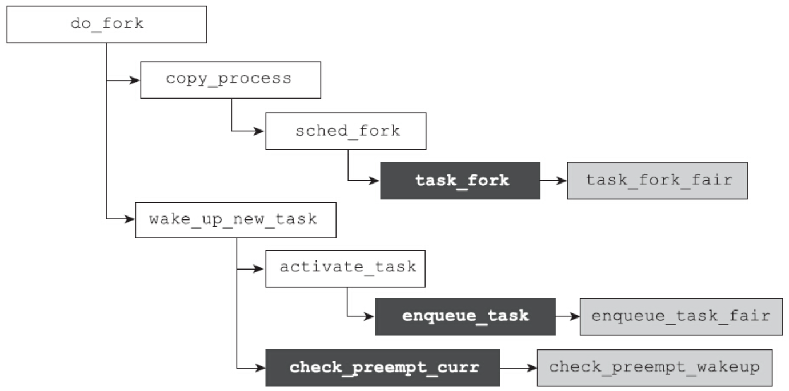
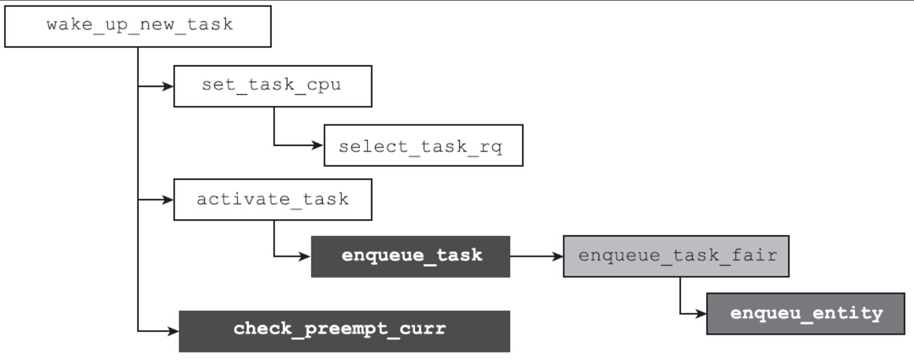
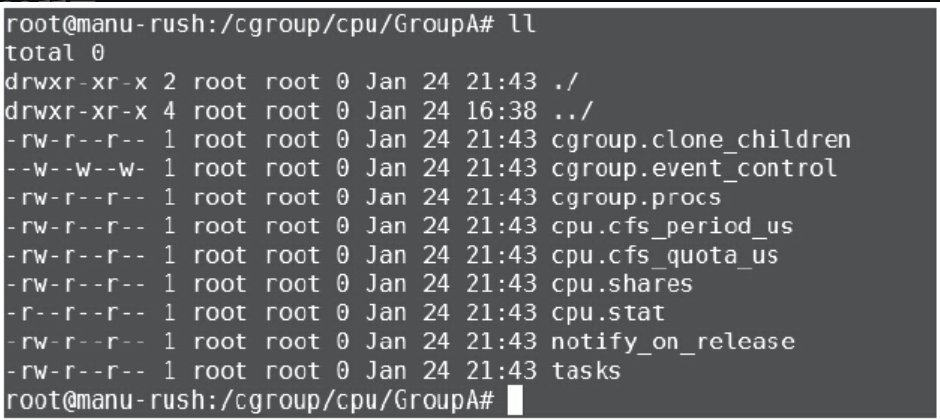

# 进程控制：进程的一生

进程是操作系统的一个核心概念。每个进程都有自己唯一的标识：进程ID，也有自己的生命周期。

## 进程ID

Linux下每个进程都会有一个非负整数表示的唯一进程ID，简称pid。Linux提供了`getpid`函数来获取进程的pid，同时还提供了`getppid`函数来获取父进程的pid，相关接口定义如下：

```c
#include <sys/types.h>
#include <unistd.h>
pid_t getpid(void);
pid_t getppid(void);
```

每个进程都有自己的父进程，父进程又会有自己的父进程，最终都会追溯到1号进程即init进程。这就决定了操作系统上所有的进程必然会组成树状结构，就像一个家族的家谱一样。可以通过`pstree`的命令来查看进程的家族树。

procfs文件系统会在`/proc`下为每个进程创建一个目录，名字是该进程的pid。目录下有很多文件，用于记录进程的运行情况和统计信息等，如下所示：

```shell
root@LVS-OPS-172-22-175-192:/proc# ll /proc
total 4
dr-xr-xr-x 230 root             root                           0 Sep  4  2023 ./
drwxr-xr-x  20 root             root                        4096 Mar  6 14:59 ../
dr-xr-xr-x   9 root             root                           0 Sep  4  2023 1/
dr-xr-xr-x   9 root             root                           0 Apr 26 14:05 10/
dr-xr-xr-x   9 root             root                           0 Apr 26 14:05 1016/
dr-xr-xr-x   9 root             root                           0 Apr 26 14:05 102/
dr-xr-xr-x   9 root             root                           0 Apr 26 14:05 103/
dr-xr-xr-x   9 root             root                           0 Apr 26 14:05 105/
...
```

因为进程有创建，也有终止，所以`/proc/`下记录进程信息的目录（以及目录下的文件）也会发生变化。

操作系统必须保证在任意时刻都不能出现两个进程有相同pid的情况。虽然进程ID是唯一的，但是进程ID可以重用。进程退出以后，其进程ID还可以再次分配给其他的进程使用。那么问题就来了，内核是如何分配进程ID的？

Linux分配进程ID的算法不同于给进程分配文件描述符的最小可用算法，它采用了延迟重用的算法，即分配给新创建进程的ID尽量不与最近终止进程的ID重复，这样就可以防止将新创建的进程误判为使用相同进程ID的已经退出的进程。

那么如何实现延迟重用呢？内核采用的方法如下：

1）位图记录进程ID的分配情况（0为可用，1为已占用）。
2）将上次分配的进程ID记录到`last_pid`中，分配进程ID时，从`last_pid+1`开始找起，从位图中寻找可用的ID。
3）如果找到位图集合的最后一位仍不可用，则回滚到位图集合的起始位置，从头开始找。

既然是位图记录进程ID的分配情况，那么位图的大小就必须要考虑周全。位图的大小直接决定了系统允许同时存在的进程的最大个数，这个最大个数在系统中称为`pid_max`。

上面的第3步提到，回绕到位图集合的起始位置，从头寻找可用的进程ID。事实上，严格说来，这种说法并不正确，回绕时并不是从0开始找起，而是从300开始找起。内核在 `kernel/pid.c` 文件中定义了RESERVED_PIDS，其值是300，300以下的`pid`会被系统占用，而不能分配给用户进程：

```c
define RESERVED_PIDS       300
int pid_max = PID_MAX_DEFAULT;
```

Linux系统下可以通过 `procfs` 或 `sysctl` 命令来查看`pid_max`的值：

```shell
manu@manu-rush:~$ cat /proc/sys/kernel/pid_max
131072
manu@manu-rush:~$ sysctl kernel.pid_max
kernel.pid_max = 131072
```

其实，此上限值是可以调整的，系统管理员可以通过如下方法来修改此上限值：

```shell
root@manu-rush:~# sysctl -w kernel.pid_max=4194304
kernel.pid_max = 4194304
```

但是内核自己也设置了硬上限，如果尝试将`pid_max`的值设成一个大于硬上限的值就会失败，如下所示：

```shell
root@manu-rush:~# sysctl -w kernel.pid_max=4194305
error: "Invalid argument" setting key "kernel.pid_max"
```

从上面的操作可以看出，Linux系统将系统进程数的硬上限设置为4194304（4M）。内核又是如何决定系统进程个数的硬上限的呢？对此，内核定义了如下的宏：

```c
#define PID_MAX_LIMIT (CONFIG_BASE_SMALL ? PAGE_SIZE * 8 : \
    (sizeof(long) > 4 ? 4 * 1024 * 1024 :PID_MAX_DEFAULT))
```

从上面代码中可以看出决定系统进程个数硬上限的逻辑为：

- 如果选择了CONFIG_BASE_SMALL编译选项，则为页面（PAGE_SIZE）的位数。
- 如果选择了CONFIG_BASE_FULL编译选项，那么：

  - 对于32位系统，系统进程个数硬上限为32768（即32K）。
  - 对于64位系统，系统进程个数硬上限为4194304（即4M）。

通过上面的讨论可以看出，在64位系统中，系统容许创建的进程的个数超过了400万，这个数字是相当庞大的，足够应用层使用。

对于单线程的程序，进程ID比较好理解，就是唯一标识进程的数字。对于多线程的程序，每一个线程调用`getpid`函数，其返回值都是一样的，即进程的ID。

## 进程的层次

每个进程都有父进程，父进程也有父进程，这就形成了一个以 init 进程为根的家族树。除此以外，进程还有其他层次关系：进程、进程组和会话。

进程组和会话在进程之间形成了两级的层次：进程组是一组相关进程的集合，会话是一组相关进程组的集合。用人来打比方，会话如同一个公司，进程组如同公司里的部门，进程则如同部门里的员工。尽管每个员工都有父亲，但是不影响员工同时属于某个公司中的某个部门。

这样说来，一个进程会有如下ID：

- PID：进程的唯一标识。对于多线程的进程而言，所有线程调用`getpid`函数会返回相同的值。
- PGID：进程组ID。每个进程都会有进程组ID，表示该进程所属的进程组。默认情况下新创建的进程会继承父进程的进程组ID。
- SID：会话ID。每个进程也都有会话ID。默认情况下，新创建的进程会继承父进程的会话ID。

可以调用如下指令来查看所有进程的层次关系：

```shell
ps -ejH
ps axjf
```

对于进程而言，可以通过如下函数调用来获取其进程组ID和会话ID。

```c
#include <unistd.h>
pid_t getpgrp(void);
pid_t getsid(pid_t pid);
```

前面提到过，新进程默认继承父进程的进程组ID和会话ID，如果都是默认情况的话，那么追根溯源可知，所有的进程应该有共同的进程组ID和会话ID。但是调用 `ps axjf` 可以看到，实际情况并非如此，系统中存在很多不同的会话，每个会话下也有不同的进程组。

为何会如此呢？

就像家族企业一样，如果从创业之初，所有家族成员都墨守成规，循规蹈矩，默认情况下，就只会有一个公司、一个部门。但是也有些“叛逆”的子弟，愿意为家族公司开疆拓土，愿意成立新的部门。这些新的部门就是新创建的进程组。如果有子弟“离经叛道”，甚至不愿意呆在家族公司里，他别开天地，另创了一个公司，那这个新公司就是新创建的会话组。由此可见，系统必须要有改变和设置进程组ID和会话ID的函数接口，否则，系统中只会存在一个会话、一个进程组。

进程组和会话是为了支持shell作业控制而引入的概念。当有新的用户登录Linux时，登录进程会为这个用户创建一个会话。用户的登录shell就是会话的首进程。会话的首进程ID会作为整个会话的ID。会话是一个或多个进程组的集合，囊括了登录用户的所有活动。

在登录shell时，用户可能会使用管道，让多个进程互相配合完成一项工作，这一组进程属于同一个进程组。当用户通过SSH客户端工具（putty、xshell等）连入Linux时，与上述登录的情景是类似的。

### 进程组

修改进程组ID的接口如下：

```c
#include <unistd.h>
int setpgid(pid_t pid, pid_t pgid);
```

这个函数的含义是，找到进程ID为`pid`的进程，将其进程组ID修改为`pgid`，如果pid的值为0，则表示要修改调用进程的进程组ID。该接口一般用来创建一个新的进程组。如果`pgid`的值为0，则表示“当前进程的进程 ID”。

下面三个接口含义一致，都是创立新的进程组，并且指定的进程会成为进程组的首进程。如果参数`pid`和`pgid`的值不匹配，那么`setpgid`函数会将一个进程从原来所属的进程组迁移到`pgid`对应的进程组。

```c
setpgid(0,0)
setpgid(getpid(),0)
setpgid(getpid(),getpid())
```

`setpgid`函数有很多限制：

- pid参数必须指定为调用 `setpgid`函数的进程或其子进程，不能随意修改不相关进程的进程组ID，如果违反这条规则，则返回-1，并置errno为ESRCH。
- pid参数可以指定调用进程的子进程，但是子进程如果已经执行了 `exec`函数，则不能修改子进程的进程组ID。如果违反这条规则，则返回-1，并置errno为EACCESS。
- 在进程组间移动，调用进程、pid指定的进程及目标进程组必须在同一个会话之内。这个比较好理解，不加入公司（会话），就无法加入公司下属的部门（进程组），否则就是部门要造反的节奏。如果违反这条规则，则返回-1，并置errno为EPERM。
- pid指定的进程，不能是会话首进程。如果违反这条规则，则返回-1，并置errno为EPERM。

有了创建进程组的接口，新创建的进程组就不必继承父进程的进程组ID了。最常见的创建进程组的场景就是在shell中执行管道命令，代码如下：

```shell
cmd1 | cmd2 | cmd3
```

下面用一个最简单的命令来说明，其进程之间的关系如图所示。

```shell
ps ax|grep nfsd
```


`ps`进程和`grep`进程都是`bash`创建的子进程，两者通过管道协同完成一项工作，它们隶属于同一个进程组，其中`ps`进程是进程组的组长。

进程组的概念并不难理解，可以将人与人之间的关系做类比。一起工作的同事，自然比毫不相干的路人更加亲近。`shell`中协同工作的进程属于同一个进程组，就如同协同工作的人属于同一个部门一样。

引入了进程组的概念，可以更方便地管理这一组进程了。比如这项工作放弃了，不必向每个进程一一发送信号，可以直接将信号发送给进程组，进程组内的所有进程都会收到该信号。

前文曾提到过，子进程一旦执行`exec`，父进程就无法调用`setpgid`函数来设置子进程的进程组ID了，这条规则会影响shell的作业控制。出于保险的考虑，一般父进程在调用`fork`创建子进程后，会调用`setpgid`函数设置子进程的进程组ID，同时子进程也要调用`setpgid`函数来设置自身的进程组ID。这两次调用有一次是多余的，但是这样做能够保证无论是父进程先执行，还是子进程先执行，子进程一定已经进入了指定的进程组中。由于`fork`之后，父子进程的执行顺序是不确定的，因此如果不这样做，就会造成在一定的时间窗口内，无法确定子进程是否进入了相应的进程组。

可以通过跟踪`bash`进程的系统调用来证明这一点，下面的419114进程是`bash`，我们在该`bash`上执行`sleep 20000`，在执行之前，在另一个终端用`strace`跟踪`bash`的系统调用，可以看到，父进程和子进程都执行了一遍`setpgid`函数，代码如下所示：

```shell
root@LVS-OPS-172-22-175-192:~# sleep 20000 &
[1] 419114
root@LVS-OPS-172-22-175-192:~#
root@LVS-OPS-172-22-175-192:~# ps
    PID TTY          TIME CMD
 418074 pts/3    00:00:00 bash
 419114 pts/3    00:00:00 sleep
 420276 pts/3    00:00:00 ps

root@LVS-OPS-172-22-175-192:~# strace -f -p 418074
strace: Process 418074 attached
...
/*父进程调用setpgid函数*/
[pid 418074] setpgid(419114, 419114 <unfinished ...>
...
/*子进程调用setpgid函数*/
[pid 419114] setpgid(419114, 419114 <unfinished ...>
...
/*子进程执行execve*/
[pid 419114] execve("/usr/bin/sleep", ["sleep", "20000"], 0x55ecf469af00 /* 24 vars */) = 0
...
```

`strace`工具说明：`strace` 是 Linux 系统中一个非常有用的命令行工具，它可以跟踪系统调用和信号。

- `-f` 参数告诉 `strace` 跟踪指定进程及其所有的子进程（forked processes）。
- `-p 2258` 参数告诉 `strace` 要附加（attach）到进程号为 418074 的进程，并开始跟踪它的系统调用。

所以，`sudo strace -f -p 418074` 命令的含义是以超级用户权限（sudo）启动 `strace`，并附加到进程号为 418074 的进程，同时监视该进程及其所有子进程的所有系统调用。使用 `strace` 可以帮助你理解进程在运行时与操作系统如何交互，包括它打开的文件、它发出的网络请求、它如何分配内存等等。这是一种强大的方式来诊断程序中的问题或了解程序的行为。

用户在shell中可以同时执行多个命令。对于耗时很久的命令（如编译大型工程），用户不必傻傻等待命令运行完毕才执行下一个命令。用户在执行命令时，可以在命令的结尾添加“&”符号，表示将命令放入后台执行。这样该命令对应的进程组即为后台进程组。在任意时刻，可能同时存在多个后台进程组，但是不管什么时候都只能有一个前台进程组。只有在前台进程组中进程才能在控制终端读取输入。当用户在终端输入信号生成终端字符（如ctrl+c、ctrl+z、ctr+\等）时，对应的信号只会发送给前台进程组。

shell中可以存在多个进程组，无论是前台进程组还是后台进程组，它们或多或少存在一定的联系，为了更好地控制这些进程组（或者称为作业），系统引入了会话的概念。

### 会话

会话是一个或多个进程组的集合，以用户登录系统为例，可能存在如图所示的情况。


系统提供`setsid`函数来创建会话，其接口定义如下：

```c
#include <unistd.h>
pid_t setsid(void);
```

如果这个函数的调用进程不是进程组组长，那么调用该函数会发生以下事情：
1）创建一个新会话，会话ID等于进程ID，调用进程成为会话的首进程。
2）创建一个进程组，进程组ID等于进程ID，调用进程成为进程组的组长。
3）该进程没有控制终端，如果调用`setsid`前，该进程有控制终端，这种联系就会断掉。

调用`setsid`函数的进程不能是进程组的组长，否则调用会失败，返回-1，并置errno为EPERM。

这个限制是比较合理的。如果允许进程组组长迁移到新的会话，而进程组的其他成员仍然在老的会话中，那么，就会出现同一个进程组的进程分属不同的会话之中的情况，这就破坏了进程组和会话的严格的层次关系了。

Linux提供了`setsid`命令，可以在新的会话中执行命令，通过该命令可以很容易地验证上面提到的三点：

```shell
manu@manu-hacks:~$ setsid sleep 100
manu@manu-hacks:~$ ps ajxf
PPID   PID  PGID   SID TTY      TPGID STAT   UID   TIME COMMAND…
1     4469  4469  4469 ?           -1   Ss   1000   0:00 sleep 100
```

从输出中可以看出，系统创建了新的会话4469，新的会话下又创建了新的进程组，会话ID和进程组ID都等于进程ID，而该进程已经不再拥有任何控制终端了（TTY对应的值为“？”表示进程没有控制终端）。

常用的调用`setsid`函数的场景是login和shell。除此以外创建daemon进程也要调用`setsid`函数。

## 进程的创建之fork()

Linux系统下，进程可以调用fork函数来创建新的进程。调用进程为父进程，被创建的进程为子进程。fork函数的接口定义如下：

```c
#include <unistd.h>
pid_t fork(void);
```

与普通函数不同，fork函数会返回两次。一般说来，创建两个完全相同的进程并没有太多的价值。大部分情况下，父子进程会执行不同的代码分支。fork函数的返回值就成了区分父子进程的关键。fork函数向子进程返回0，并将子进程的进程ID返给父进程。当然了，如果fork失败，该函数则返回-1，并设置errno。

常见的出错情景如表所示。


所以一般而言，调用fork的程序，大多会如此处理：

```c
ret = fork();
if(ret == 0)
{
    …//此处是子进程的代码分支
}
else if(ret > 0)
{
    …//此处是父进程的代码分支
}
else
{
     …// fork失败，执行error handle
}
```

注意　fork可能失败。检查返回值进行正确的出错处理，是一个非常重要的习惯。设想如果fork返回-1，而程序没有判断返回值，直接将-1当成子进程的进程号，那么后面的代码执行`kill（child_pid，9）`就相当于执行`kill（-1，9）`。这会发生什么？后果是惨重的，它将杀死除了init以外的所有进程，只要它有权限。读者可以通过`man 2 kill`来查看`kill（-1，9）`的含义。

fork之后，对于父子进程，谁先获得CPU资源，而率先运行呢？从内核2.6.32开始，在默认情况下，父进程将成为fork之后优先调度的对象。采取这种策略的原因是：fork之后，父进程在CPU中处于活跃的状态，并且其内存管理信息也被置于硬件内存管理单元的转译后备缓冲器（TLB），所以先调度父进程能提升性能。从2.6.24起，Linux采用完全公平调度（Completely Fair Scheduler，CFS）。用户创建的普通进程，都采用CFS调度策略。对于CFS调度策略，procfs提供了如下控制选项：

```shell
/proc/sys/kernel/sched_child_runs_first
```

该值默认是`0`，表示父进程优先获得调度。如果将该值改成`1`，那么子进程会优先获得调度。POSIX标准和Linux都没有保证会优先调度父进程。因此在应用中，决不能对父子进程的执行顺序做任何的假设。如果确实需要某一特定执行的顺序，那么需要使用进程间同步的手段。

### fork之后父子进程的内存关系

fork之后的子进程完全拷贝了父进程的地址空间，包括栈、堆、代码段等。通过下面的示例代码，我们一起来查看父子进程的内存关系：

```c
#include <stdio.h>
#include <stdlib.h>
#include <unistd.h>
#include <string.h>
#include <errno.h>
#include <sys/types.h>
#include <wait.h>
int g_int = 1;
int main()
{
    int local_int = 1;
    int *malloc_int = malloc(sizeof(int));
    *malloc_int = 1;
    pid_t pid = fork();
    if(pid == 0) /*子进程*/
    {
        local_int = 0;
        g_int = 0;
        *malloc_int = 0;
        fprintf(stderr,"[CHILD ] child change local global malloc value to 0\n");
        free(malloc_int);
        sleep(10);
        fprintf(stderr,"[CHILD ] child exit\n");
        exit(0);
    }
    else if(pid < 0)
    {
        printf("fork failed (%s)",strerror(errno));
        return 1;
    }
    fprintf(stderr,"[PARENT] wait child exit\n");
    waitpid(pid,NULL,0);
    fprintf(stderr,"[PARENT] child have exit\n");
    printf("[PARENT] g_int = %d\n",g_int);
    printf("[PARENT] local_int = %d\n",local_int);
    printf("[PARENT] malloc_int = %d\n",malloc_int);
    free(malloc_int);
    return 0;
}
```

这里刻意定义了三个变量，一个是位于数据段的全局变量，一个是位于栈上的局部变量，还有一个是通过`malloc`动态分配位于堆上的变量，三者的初始值都是1。然后调用fork创建子进程，子进程将三个变量的值都改成了0。

按照fork的语义，子进程完全拷贝了父进程的数据段、栈和堆上的内存，如果父子进程对相应的数据进行修改，那么两个进程是并行不悖、互不影响的。因此，在上面示例代码中，尽管子进程将三个变量的值都改成了0，对父进程而言这三个值都没有变化，仍然是1，代码的输出也证实了这一点。

```shell
[PARENT] wait child exit
[CHILD ] child change local global malloc value to 0
[CHILD ] child exit
[PARENT] child have exit
[PARENT] g_int = 1
[PARENT] local_int = 1
[PARENT] malloc_int = 1
```

前文提到过，子进程和父进程执行一模一样的代码的情形比较少见。Linux提供了`execve`系统调用，构建在该系统调用之上，glibc提供了`exec`系列函数。这个系列函数会丢弃现存的程序代码段，并构建新的数据段、栈及堆。调用fork之后，子进程几乎总是通过调用`exec`系列函数，来执行新的程序。

在这种背景下，fork时子进程完全拷贝父进程的数据段、栈和堆的做法是不明智的，因为接下来的`exec`系列函数会毫不留情地抛弃刚刚辛苦拷贝的内存。为了解决这个问题，Linux引入了写时拷贝（copy-on-write）的技术。

写时拷贝是指子进程的页表项指向与父进程相同的物理内存页，这样只拷贝父进程的页表项就可以了，当然要把这些页面标记成只读（如图4-4所示）。如果父子进程都不修改内存的内容，大家便相安无事，共用一份物理内存页。但是一旦父子进程中有任何一方尝试修改，就会引发缺页异常（page fault）。此时，内核会尝试为该页面创建一个新的物理页面，并将内容真正地复制到新的物理页面中，让父子进程真正地各自拥有自己的物理内存页，然后将页表中相应的表项标记为可写。


从上面的描述可以看出，对于没有修改的页面，内核并没有真正地复制物理内存页，仅仅是复制了父进程的页表。这种机制的引入提升了fork的性能，从而使内核可以快速地创建一个新的进程。

从内核代码层面来讲，其调用关系如图4-5所示。


Linux的内存管理使用的是四级页表，如图4-6所示，看了四级页表的名字，也就不难推测图4-5中那些函数的作用了。


在最后的`copy_one_pte`函数中有如下代码：

```c
   /*如果是写时拷贝，那么无论是初始页表，还是拷贝的页表，都设置了写保护
    *后面无论父子进程，修改页表对应位置的内存时，都会触发page fault
    */
    if (is_cow_mapping(vm_flags)) {
        ptep_set_wrprotect(src_mm, addr, src_pte);
        pte = pte_wrprotect(pte);
    }
```

该代码将页表设置成写保护，父子进程中任意一个进程尝试修改写保护的页面时，都会引发缺页中断，内核会走向`do_wp_page`函数，该函数会负责创建副本，即真正的拷贝。

写时拷贝技术极大地提升了`fork`的性能，在一定程度上让`vfork`成为了鸡肋。

### fork之后父子进程与文件的关系

执行fork函数，内核会复制父进程所有的文件描述符。对于父进程打开的所有文件，子进程也是可以操作的。那么父子进程同时操作同一个文件是并行不悖的，还是互相影响的呢？

下面通过对一个例子的讨论来说明这个问题。`read`函数并没有将偏移量作为参数传入，但是每次调用`read`函数或`write`函数时，却能够接着上次读写的位置继续读写。原因是内核已经将偏移量的信息记录在与文件描述符相关的数据结构里了。那么问题来了，父子进程是共用一个文件偏移量还是各有各的文件偏移量呢？

```c
/*read 和write 都没有将pos信息作为入参*/
ssize_t read(int fd, void *buf, size_t count);
ssize_t write(int fd, const void *buf, size_t count);
```

我们用事实说话，请看下面的例子：

```c
#include <stdio.h>
#include <string.h>
#include <strings.h>
#include <unistd.h>
#include <sys/types.h>
#include <sys/stat.h>
#include <fcntl.h>
#include <errno.h>
#define INFILE "./in.txt"
#define OUTFILE "./out.txt"
#define MODE  S_IRUSR |S_IWUSR|S_IRGRP|S_IWGRP|S_IROTH
int main(void)
{
    int fd_in,fd_out;
    char buf[1024];
    memset(buf, 0, 1024);
    fd_in = open(INFILE, O_RDONLY);
    if(fd_in < 0 )
    {
        fprintf(stderr,"failed to open %s, reason(%s)\n",
INFILE,strerror(errno));
        return 1;
    }
    fd_out = open(OUTFILE,O_WRONLY|O_CREAT|O_TRUNC,MODE);
    if(fd_out < 0)
    {
        fprintf(stderr,"failed to open %s, reason(%s)\n", OUTFILE,strerror(errno));
        return 1;
    }
    fork();/*此处忽略错误检查*/
    while(read(fd_in, buf, 2) > 0)
    {
        printf("%d: %s",getpid(),buf);
        sprintf(buf, "%d Hello,World!\n",getpid());
        write(fd_out,buf,strlen(buf));
        sleep(1);
        memset(buf, 0, 1024);
    }
}
```

INFILE的内容是：

```
1
2
3
4
5
6
```

上面的程序中，父子进程都会去读INFILE，如果父子进程各维护各的文件偏移量，那么父子进程都会打印出1~6。

事实如何呢？请看输出内容：

```shell
manu@manu-hacks:~/code/self/c/fork$ ./fork_file
6602: 1
6603: 2
6602: 3
6603: 4
6602: 5
6603: 6
```

当然，有时候输出是这样的：

```shell
manu@manu-hacks:~/code/self/c/fork$ ./fork_file
6610: 1
6611: 2
6610: 3
6611: 4
6610: 5
6611: 5
6610: 6
```

如果父子进程各自维护自己的文件偏移量，那么一定是打印出两套1~6，但是事实并非如此。无论父进程还是子进程调用`read`函数导致文件偏移量后移都会被对方获知，**这表明父子进程共用了一套文件偏移量**。

对于第二个输出，为什么父子进程都打印5呢？这是因为我的机器是多核的，父子进程同时执行，发现当前文件偏移量是4*2，然后各自去读了第8和第9字节，也就是“5\n”。

写文件也是一样，如果fork之前打开了某文件，之后父子进程写入同一个文件描述符而又不采取任何同步的手段，那么就会因为共享文件偏移量而使输出相互混合，不可阅读。

文件描述符还有一个文件描述符标志（file descriptor flag）。目前只定义了一个标志位：FD_CLOSEXEC。细心阅读open函数手册也会发现，open函数也有一个类似的标志位，即O_CLOSEXEC，该标志位也是用于设置文件描述符标志的。

那么这个标志位到底有什么作用呢？**如果文件描述符中将这个标志位置位，那么调用`exec`时会自动关闭对应的文件。**

可是为什么需要这个标志位呢？主要是出于安全的考虑。默认情况下，执行 `execve` (或其它 `exec` 系列函数) 后，所有打开的文件描述符都会被新程序继承。

对于`fork`之后子进程执行`exec`这种场景，如果子进程可以操作父进程打开的文件，就会带来严重的安全隐患。一般来讲，调用`exec`的子进程时，因为它会另起炉灶，因此父进程打开的文件描述符也应该一并关闭，但事实上内核并没有主动这样做。例如，如果你在父进程中打开了一个用于日志记录的文件，并且你不希望在通过 `execve` 调用启动的新程序中继续使用这个文件描述符（可能因为安全或资源管理的考虑），你可以设置 `FD_CLOSEXEC` 标志。这样，在 `execve` 执行时，这个文件描述符会被自动关闭，新程序就不会"继承"这个文件描述符。

为了解决这个问题，Linux引入了close on exec机制。设置了FD_CLOSEXEC标志位的文件，在子进程调用exec家族函数时会将相应的文件关闭。而设置该标志位的方法有两种：

- open时，带上O_CLOSEXEC标志位。
- open时如果未设置，那就在后面调用`fcntl`函数的F_SETFD操作来设置。

建议使用第一种方法。原因是第二种方法在某些时序条件下并不那么绝对的安全。考虑图4-7的场景：Thread 1还没来得及将FD_CLOSEXEC置位，由于Thread 2已经执行过fork，这时候fork出来的子进程就不会关闭相应的文件。尽管Thread1后来调用了fcntl的F_SETFD操作，但是为时已晚，文件已经泄露了。


前面提到，执行`fork`时，子进程不仅会获取父进程所有文件描述符的副本，而且测试结果表明，父子进程共享了文件的很多属性。这到底是怎么回事？让我们深入内核一探究竟。

### 文件描述符复制的内核实现

此小节暂时用不着，先跳过。。。

## 进程的创建之vfork()

在早期的实现中，`fork`没有实现写时拷贝机制，而是直接对父进程的数据段、堆和栈进行完全拷贝，效率十分低下。很多程序在`fork`一个子进程后，会紧接着执行`exec`家族函数，这更是一种浪费。所以BSD引入了`vfork`。既然`fork`之后会执行`exec`函数，拷贝父进程的内存数据就变成了一种无意义的行为，所以引入的`vfork`压根就不会拷贝父进程的内存数据，而是直接共享。再后来Linux引入了写时拷贝的机制，其效率提高了很多，这样一来，`vfork`其实就可以退出历史舞台了。除了一些需要将性能优化到极致的场景，大部分情况下不需要再使用`vfork`函数了。

此小节暂时用不着，先跳过。。。


## daemon进程的创建

daemon进程又被称为守护进程，一般来说它有以下两个特点：

- 生命周期很长，一旦启动，正常情况下不会终止，一直运行到系统退出。但凡事无绝对：daemon进程其实也是可以停止的，如很多daemon提供了stop命令，执行stop命令就可以终止daemon，或者通过发送信号将其杀死，又或者因为daemon进程代码存在bug而异常退出。这些退出一般都是由手工操作或因异常引发的。
- 在后台执行，并且不与任何控制终端相关联。即使daemon进程是从终端命令行启动的，终端相关的信号如SIGINT、SIGQUIT和SIGTSTP，以及关闭终端，都不会影响到daemon进程的继续执行。

习惯上daemon进程的名字通常以d结尾，如sshd、rsyslogd等。但这仅仅是习惯，并非一定要如此。如何使一个进程变成daemon进程，或者说编写daemon进程，需要遵循哪些规则或步骤呢？一般来讲，创建一个daemon进程的步骤被概括地称为double-fork magic。细细说来，需要以下步骤。

（1）执行`fork()`函数，父进程退出，子进程继续

执行这一步，原因有二：·

- 父进程有可能是进程组的组长（在命令行启动的情况下），从而不能够执行后面要执行的setsid函数，子进程继承了父进程的进程组ID，并且拥有自己的进程ID，一定不会是进程组的组长，所以子进程一定可以执行后面要执行的setsid函数。
- 如果daemon是从终端命令行启动的，那么父进程退出会被shell检测到，shell会显示shell提示符，让子进程在后台执行。

（2）子进程执行如下三个步骤，以摆脱与环境的关系

1）修改进程的当前目录为根目录（/）。

这样做是有原因的，因为daemon一直在运行，如果当前工作路径上包含有根文件系统以外的其他文件系统，那么这些文件系统将无法卸载。因此，常规是将当前工作目录切换成根目录，当然也可以是其他目录，只要确保该目录所在的文件系统不会被卸载即可。

```c
chdir("/")
```

2）调用setsid函数。这个函数的目的是切断与控制终端的所有关系，并且创建一个新的会话。

这一步比较关键，因为这一步确保了子进程不再归属于控制终端所关联的会话。因此无论终端是否发送SIGINT、SIGQUIT或SIGTSTP信号，也无论终端是否断开，都与要创建的daemon进程无关，不会影响到daemon进程的继续执行。

3）设置文件模式创建掩码为0。

```c
umask(0)
```

这一步的目的是让daemon进程创建文件的权限属性与shell脱离关系。因为默认情况下，进程的umask来源于父进程shell的umask。如果不执行umask（0），那么父进程shell的umask就会影响到daemon进程的umask。如果用户改变了shell的umask，那么也就相当于改变了daemon的umask，就会造成daemon进程每次执行的umask信息可能会不一致。

（3）再次执行fork，父进程退出，子进程继续执行完前面两步之后，可以说已经比较圆满了：新建会话，进程是会话的首进程，也是进程组的首进程。进程ID、进程组ID和会话ID，三者的值相同，进程和终端无关联。那么这里为何还要再执行一次fork函数呢？

原因是，daemon进程有可能会打开一个终端设备，即daemon进程可能会根据需要，执行类似如下的代码：

```c
int fd = open("/dev/console", O_RDWR);
```

这个打开的终端设备是否会成为daemon进程的控制终端，取决于两点：

- daemon进程是不是会话的首进程。
- 系统实现。（BSD风格的实现不会成为daemon进程的控制终端，但是POSIX标准说这由具体实现来决定）。

既然如此，为了确保万无一失，只有确保daemon进程不是会话的首进程，才能保证打开的终端设备不会自动成为控制终端。因此，不得不执行第二次fork，fork之后，父进程退出，子进程继续。这时，子进程不再是会话的首进程，也不是进程组的首进程了。

（4）关闭标准输入（stdin）、标准输出（stdout）和标准错误（stderr）

因为文件描述符0、1和2指向的就是控制终端。daemon进程已经不再与任意控制终端相关联，因此这三者都没有意义。一般来讲，关闭了之后，会打开/dev/null，并执行dup2函数，将0、1和2重定向到/dev/null。这个重定向是有意义的，防止了后面的程序在文件描述符0、1和2上执行I/O库函数而导致报错。

至此，即完成了daemon进程的创建，进程可以开始自己真正的工作了。

上述步骤比较繁琐，对于C语言而言，glibc提供了daemon函数，从而帮我们将程序转化成daemon进程。

```c
#include <unistd.h>
int daemon(int nochdir, int noclose);
```

该函数有两个入参，分别控制一种行为，具体如下。

其中的nochdir，用来控制是否将当前工作目录切换到根目录。

- 0：将当前工作目录切换到/。
- 1：保持当前工作目录不变。

而noclose，用来控制是否将标准输入、标准输出和标准错误重定向到/dev/null。

- 0：将标准输入、标准输出和标准错误重定向到/dev/null。
- 1：保持标准输入、标准输出和标准错误不变。

一般情况下，这两个入参都要为0。

```c
ret = daemon(0,0)
```

成功时，daemon函数返回0；失败时，返回-1，并置errno。因为daemon函数内部会调用fork函数和setsid函数，所以出错时errno可以查看fork函数和setsid函数的出错情形。

glibc的daemon函数做的事情，和前面讨论的大体一致，但是做得并不彻底，没有执行第二次的fork。

此小节暂时用不着，先跳过。。。

## 进程的终止

在不考虑线程的情况下，进程的退出有以下5种方式。

正常退出有3种：

- 从`main`函数`return`返回：这是最直接的退出方式。当 main 函数执行完成后，它可以通过 return 语句返回一个整数值，这个值通常被视为程序的退出状态。0 表示成功，非零值表示发生了错误或特定的退出原因。
- 调用`exit`：`exit(int status) `函数是标准C库提供的一个函数，用于终止程序执行并退出进程。在调用 exit 之前，会执行所有注册的退出函数（通过 atexit 注册的函数），并关闭所有标准C库的输入输出流（如文件和终端连接）。参数 status 用于指定退出状态，这个值会返回给操作系统。使用 exit 可以确保程序以一种干净的方式退出，释放资源。
- 调用`_exit`：`_exit(int status)` 函数直接终止程序，不执行任何清理操作（如不调用 atexit 注册的函数，不刷新stdio缓冲区）。这通常用在子进程退出时，防止子进程的退出影响父进程（例如，防止子进程中的标准库调用意外关闭父进程的文件描述符）。

异常退出有2种：

- 调用`abort`：`abort()`函数会异常终止一个程序。这通常会生成一个核心转储（core dump），允许程序员后续调试程序以查找导致异常的原因。abort 通常用于表示严重错误，如内部程序逻辑错误。
- 接收到信号，由信号终止：进程可以因接收到某些类型的信号而终止。例如，SIGKILL 和 SIGTERM 是两种常见的用于请求终止进程的信号。SIGKILL 会立即终止进程，而 SIGTERM 可以被捕获和处理，允许进程清理资源。还有如 SIGSEGV（段错误），通常是因为程序访问了非法的内存地址。

### _exit函数

`_exit`函数的接口定义如下：

```c
#include <unistd.h>
void _exit(int status);
```

`_exit`函数中status参数定义了进程的终止状态，父进程可以通过`wait()`来获取该状态值。

需要注意的是返回值，尽管 `status` 参数是一个 `int` 类型，但是操作系统不会完整地传递这个 `int` 的所有位。实际上，只有低8位（即0-255的范围）会被传递。这是由于历史和兼容性的原因，确保在不同的系统和环境中具有相同的行为。所以写`_exit(-1)`结束进程时，在终端执行`$?`会发现返回值是255。（当你使用 `_exit(-1)` 时，这个值会被转换成一个无符号的8位整数，因此 `-1` 实际上会变成 `255`（在二进制表示中，-1 的所有位都是1，截取低8位后即为 `11111111`，对应的十进制值是255）。这就解释了为什么在终端执行 `$?` 后会看到返回值是255。）

`_exit()` 函数是由POSIX标准提供的，主要用于在UNIX类操作系统中快速退出进程。相比 `exit()`，`_exit()` 函数的行为更为简单：

- **不刷新stdio缓冲区**：调用 `_exit()` 时，不会刷新stdio缓冲区。如果缓冲区内有未写入的数据，这些数据将丢失。
- **不执行注册的退出函数**：与 `exit()` 不同，`_exit()` 不会执行通过 `atexit()` 注册的任何函数。
- **立即向操作系统返回状态码**：和 `exit()` 类似，`_exit()` 向操作系统返回一个状态码，但是由于上述省略的步骤，这个过程通常更快。

如果是shell相关的编程，shell可能需要获取进程的退出值，那么退出值最好不要大于128。如果退出值大于128，会给shell带来困扰。POSIX标准规定了退出状态及其含义如表4-2所示。


下面的命令被SIGINT信号（signo=2）中断，返回了130。如程序通过`_exit`返回130，与其配合工作的shell就可能会误判为收到信号而退出。

```shell
root@LVS-OPS-172-22-175-192:~# sleep 10000
^C
root@LVS-OPS-172-22-175-192:~# echo $?
130
```

**用户调用`_exit`函数，本质上是调用`exit_group`系统调用**。这点在前面已经详细介绍过，在此就不再赘述了。

### exit函数

`exit`函数更常见一些，其接口定义如下：

```c
#include <stdlib.h>
void exit(int status);
```

`exit()` 函数是由C标准库提供的，用于结束程序的执行。**`exit()`函数的最后也会调用`_exit()`函数，但是`exit`在调用`_exit`之前，还做了其他工作**：

1）执行用户通过调用`atexit`函数或`on_exit`定义的清理函数。
2）关闭所有打开的流（stream），所有缓冲的数据均被写入（flush），通过`tmpfile`创建的临时文件都会被删除。
3）调用`_exit`。

图4-11给出了`exit`函数和`_exit`函数的差异。


下面介绍`exit`函数和`_exit`函数的不同之处。

首先是`exit`函数会执行用户注册的清理函数。用户可以通过调用`atexit()`函数或`on_exit()`函数来定义清理函数。这些清理函数在调用return或调用`exit`时会被执行。执行顺序与函数注册的顺序相反。当进程收到致命信号而退出时，注册的清理函数不会被执行；当进程调用`_exit`退出时，注册的清理函数不会被执行；当执行到某个清理函数时，若收到致命信号或清理函数调用了`_exit()`函数，那么该清理函数不会返回，从而导致排在后面的需要执行的清理函数都会被丢弃。

其次是`exit`函数会冲刷（flush）标准I/O库的缓冲并关闭流。glibc提供的很多与I/O相关的函数都提供了缓冲区，主要有三种缓冲模式，这些模式旨在优化输入输出性能，减少对底层I/O系统的频繁调用。这三种缓冲模式包括无缓冲、行缓冲和全缓冲。每种模式的选择取决于特定的应用场景和性能要求。下面将详细解释每种缓冲模式：

1. 无缓冲（`_IONBF`）

无缓冲模式意味着输出不经过缓冲区直接写入到目标文件或终端。每次调用输出函数时，如 `putchar` 或 `printf`，系统将立即执行I/O操作。这种模式通常用于错误消息的输出，因为无缓冲能确保即使在程序崩溃或异常退出时，重要的错误信息也能立即显示出来。

2. 行缓冲（`_IOLBF`）

在行缓冲模式中，输出被存放在缓冲区中，直到缓冲区满或者遇到换行符（`\n`）时才会被实际写出。这种模式适用于连接到终端设备的输出流，如标准输出（stdout）。它可以减少对输出设备的调用次数，提高效率，同时保证输出的及时性和适时的可读性。

3. 全缓冲（`_IOFBF`）

全缓冲模式下，输出操作只有在缓冲区满时才会将数据写入目标文件或设备。这种模式适用于不与用户交互的文件或大量数据的处理。全缓冲可以最大限度地减少系统调用，优化I/O性能，尤其是在处理大型数据或进行大量连续的文件操作时。

在C语言中，可以使用 `setvbuf()` 函数来设置文件流的缓冲模式。例如：
```c
#include <stdio.h>

int main() {
    setvbuf(stdout, NULL, _IOLBF, 0);  // 设置标准输出为行缓冲
    printf("Hello, world!\n");        // 输出立即发生，因为有换行符
    return 0;
}
```
在这个例子中，`setvbuf()` 函数将标准输出设置为行缓冲模式。第一个参数是要设置的文件流，第二个参数是一个指向缓冲区的指针（`NULL` 表示库自动分配缓冲区），第三个参数是缓冲类型，最后一个参数是缓冲区的大小（0表示使用默认大小）。

正确选择和配置缓冲模式可以显著提高程序的I/O性能和响应性，特别是在处理大量数据或与用户直接交互的应用程序中。

对于后两种缓冲，可能会出现这种情况：进程退出时，缓冲区里面可能还有未冲刷的数据。如果不冲刷缓冲区，缓冲区的数据就会丢失。比如行缓冲迟迟没有等到换行符，又或者全缓冲没有等到缓冲区满。尤其是后者，很容易出现，因为glibc的缓冲区默认是8192字节。`exit`函数在关闭流之前，会冲刷缓冲区的数据，确保缓冲区里的数据不会丢失。

```c
#include <stdio.h>
#include <stdlib.h>
#include <unistd.h>
void foo()
{
    fprintf(stderr,"foo says bye.\n");
}
void bar()
{
    fprintf(stderr,"bar says bye.\n");
}
int main(int argc, char **argv)
{
    atexit(foo);
    atexit(bar); // foo 和 bar两个函数被注册为退出处理函数，将在exit()调用时被调用，按注册的逆序执行
    // 向标准输出 (stdout) 打印一条消息，但没有包含换行符。由于标准输出通常是行缓冲的，这意味着在终端上可能暂时看不到这条消息，直到缓冲区被刷新或程序结束。
    fprintf(stdout,"Oops ... forgot a newline!"); 
    sleep(2);
    // 如果程序的第一个命令行参数是 "exit"，则调用 exit(0)。这将触发先前通过 atexit() 注册的所有功能，并最终以状态码 0 退出程序。
    if (argc > 1 && strcmp(argv[1],"exit") == 0)
        exit(0);
    // 如果程序的第一个命令行参数是 "_exit"，则调用 _exit(0)。这将直接结束程序，并不会触发 atexit() 注册的函数，也不会刷新 stdio 缓冲区。
    if (argc > 1 && strcmp(argv[1],"_exit") == 0)
        _exit(0);
    // 如果没有提供命令行参数或参数不是 "exit" 或 "_exit"，程序将正常结束并返回 0。这同样会触发 atexit() 注册的函数。
    return 0;
}
```

注意上面的示例代码，`fprintf`打印的字符串是没有换行符的，对于标准输出流`stdout`，采用的是行缓冲，收到换行符之前是不会有输出的。输出情况如下：

```shell
manu@manu-hacks:exit$ ./test exit
bar says bye.
foo says bye.
Oops ... forgot a newline!manu@manu-hacks:exit$
manu@manu-hacks:exit$
manu@manu-hacks:exit$ ./test
bar says bye.
foo says bye.
Oops ... forgot a newline!manu@manu-hacks:exit$
manu@manu-hacks:exit$
manu@manu-hacks:exit$ ./test _exit
manu@manu-hacks:~/code/self/c/exit$
```

下面是对每个执行情况的解析：

1. 使用参数 "exit"

命令：
```sh
./test exit
```
输出：
```
bar says bye.
foo says bye.
Oops ... forgot a newline!manu@manu-hacks:exit$
```
- 程序首先执行了 `exit(0)`，这触发了通过 `atexit()` 注册的 `bar()` 和 `foo()` 函数。这两个函数按照注册的逆序执行，即先打印 "bar says bye." 然后 "foo says bye."。
- 在执行 `exit(0)` 时，标准 I/O 缓冲区被刷新，导致之前未换行的输出 "Oops ... forgot a newline!" 被打印出来，紧接着是 shell 的提示符，因为输出没有包含结束的换行符。

2. 无参数

命令：
```sh
./test
```
输出：
```
bar says bye.
foo says bye.
Oops ... forgot a newline!manu@manu-hacks:exit$
```
- 当没有提供参数时，程序通过 `return 0` 正常结束。这等价于调用 `exit(0)`，因此同样触发了 `bar()` 和 `foo()` 的执行，以及未换行的输出 "Oops ... forgot a newline!"。
- 此情况与提供 "exit" 参数的执行效果完全相同。

3. 使用参数 "_exit"

命令：
```sh
./test _exit
```
输出：
```
manu@manu-hacks:~/code/self/c/exit$
```
- 在这种情况下，程序调用了 `_exit(0)`，直接从操作系统层面终止了进程。这意味着没有执行 `atexit()` 注册的 `bar()` 和 `foo()` 函数，也没有刷新缓冲区，所以 "Oops ... forgot a newline!" 没有被输出。
- `_exit()` 的使用导致了程序直接退出，没有任何输出除了返回到 shell 的提示符。

**结论**

根据这些执行结果，可以明确看到 `exit()` 和 `_exit()` 在处理程序终止时的不同行为：`exit()` 触发注册的清理函数和刷新 I/O 缓冲区，而 `_exit()` 直接终止程序，不执行任何清理操作。此外，由于 "Oops ... forgot a newline!" 没有随即换行，导致输出紧接着命令提示符出现，这表明缓冲区的内容在程序终止时被刷新输出。

第三，存在临时文件，exit函数会负责将临时文件删除，这点在第3章中已经介绍过，此处就不再赘述了。

exit函数的最后调用了`_exit()`函数，最终殊途同归，走向内核清理。

### return退出

return是一种更常见的终止进程的方法。**执行`return(n)`等同于执行`exit(n)`，因为调用`main()`的运行时函数会将`main`的返回值当作`exit`的参数。**

## 等待子进程

### 僵尸进程

进程就像一个生命体，通过`fork()`函数，子进程呱呱坠地。有的子进程子承父业，继续执行与父进程一样的程序（相同的代码段，尽管可能是不同的程序分支），有的子进程则比较叛逆，通过`exec`离家出走，走向与父进程完全不同的道路。

令人悲伤的是，如同所有的生命体一样，进程也会消亡。进程退出时会进行内核清理，基本就是释放进程所有的资源，这些资源包括内存资源、文件资源、信号量资源、共享内存资源（或者引用计数减一，或者彻底释放）。不过，进程的退出其实并没有将所有的资源完全释放，仍保留了少量的资源，比如进程的PID依然被占用着，不可被系统分配。此时的进程不可运行，事实上也没有地址空间让其运行，进程进入僵尸状态。

为什么进程退出之后不将所有的资源释放，从此灰飞烟灭，一了百了，反而非要保留少量资源，进入僵尸状态呢？看看僵尸进程依然占有的系统资源，我们就能获得答案。僵尸进程依然保留的资源有进程控制块`task_struct`、内核栈等。**这些资源不释放是为了提供一些重要的信息，比如进程为何退出，是收到信号退出还是正常退出，进程退出码是多少，进程一共消耗了多少系统CPU时间，多少用户CPU时间，收到了多少信号，发生了多少次上下文切换，最大内存驻留集是多少，产生多少缺页中断？等等。这些信息，就像墓志铭，总结了进程的一生。**如果没有这个僵尸状态，进程的这些信息也会随之流逝，系统也将再也没有机会获知该进程的相关信息了。因此进程退出后，会保留少量的资源，等待父进程前来收集这些信息。一旦父进程收集了这些信息之后（通过调用下面提到的`wait/waitpid`等函数），这些残存的资源完成了它的使命，就可以释放了，进程就脱离僵尸状态，彻底消失了。

从上面的讨论可以看出，制造一个僵尸进程是一件很容易的事情，只要父进程调用`fork`创建子进程，子进程退出后，父进程如果不调用`wait`或`waitpid`来获取子进程的退出信息，子进程就会沦为僵尸进程。示例代码如下：

```c
#include <stdio.h>
#include <stdlib.h>
#include <sys/types.h>
#include <unistd.h>
int main()
{
    pid_t pid;
    pid=fork();
    if(pid<0)
    {
        /* 如果出错 */
        printf("error occurred!\n");
    }
    else if(pid==0)
    {
        /* 子进程 */
        exit(0);
    }
    else
    {
        /* 父进程 */
        sleep(300);  /* 休眠300秒 */
        wait(NULL); /* 获取僵尸进程的退出信息 */
    }
    return 0;
}
```

上面的例子中父进程休眠300秒后才会调用`wait`来获取子进程的退出信息。而子进程退出之后会变成僵尸状态，苦苦等待父进程来获取退出信息。在这300秒左右的时间里，子进程就是一个僵尸进程。

如何查看一个进程是否处于僵尸状态呢？ps命令输出的进程状态Z，就表示进程处于僵尸状态，另外`procfs`提供的status信息中的State给出的值是Z（zombie），也表明进程处于僵尸状态。

```shell
 ps ax
 ......
 3940 pts/10   S      0:00 ./zombie
 3941 pts/10   Z      0:00 [zombie] <defunct>
cat /proc/3941/status
Name:    zombie
State:    Z (zombie)
Tgid:    3941
Ngid:    0
Pid:    3941
PPid:    3940
.......
```

进程一旦进入僵尸状态，就进入了一种刀枪不入的状态，“杀人不眨眼”的`kill -9`也无能为力，因为谁也没有办法杀死一个已经死去的进程。清除僵尸进程有以下两种方法：

- 父进程调用`wait`函数，为子进程“收尸”。
- 父进程退出，`init`进程会为子进程“收尸”。

一般而言，系统不希望大量进程长期处于僵尸状态，因为会浪费系统资源。除了少量的内存资源外，比较重要的是进程ID。僵尸进程并没有将自己的进程ID归还给系统，而是依然占有这个进程ID，因此系统不能将该ID分配给其他进程。

对于编程来说，如何防范僵尸进程的产生呢？答案是具体情况具体分析。

如果我们不关心子进程的退出状态。在编程中，特别是在Unix-like系统中使用C或类似语言时，您可以采用以下两种方法来防止僵尸进程的产生：

**方法 1: 忽略 SIGCHLD 信号**

通过将SIGCHLD信号的处理函数设置为SIG_IGN，您可以告诉操作系统，父进程不关心子进程的结束状态，并且不会为它们“收尸”。这样，子进程在退出时会被操作系统立即清理。在C语言中，可以使用`signal`函数来设置SIGCHLD信号的处理方式：

```c
#include <signal.h>

// 在父进程中
signal(SIGCHLD, SIG_IGN);
```

**方法 2: 使用 sigaction 设置 SA_NOCLDWAIT**

另一种更为灵活和推荐的方式是使用`sigaction`函数。通过设置`SA_NOCLDWAIT`标志，您可以实现类似的效果，即子进程结束时立刻被清理，不会转入僵尸状态。这种方式相比直接忽略SIGCHLD信号，提供了更多的控制和灵活性。

```c
#include <signal.h>
#include <string.h>
// 在父进程中
struct sigaction sa;
memset(&sa, 0, sizeof(sa));
sa.sa_handler = SIG_DFL; // 默认处理
sa.sa_flags = SA_NOCLDWAIT; // 不创建僵尸进程

sigaction(SIGCHLD, &sa, NULL);
```

当在父进程中设置了 `sigaction` 后，每当有子进程结束时，操作系统会检查您所设置的标志和行为，根据您的配置决定如何处理这些结束的子进程。如果设置了 `SA_NOCLDWAIT`，则子进程结束时不会变为僵尸状态，而是立即被清理。

**子进程退出的时候，内核会检查父进程的SIGCHLD信号处理结构体是否设置了SA_NOCLDWAIT标志位，或者是否将信号处理函数显式地设为SIG_IGN。**如果是，则`autoreap`为true，子进程发现`autoreap`为true也就“死心”了，不会进入僵尸状态，而是调用`release_task`函数“自行了断”了。

如果父进程关心子进程的退出信息，则应该在流程上妥善设计，能够及时地调用`wait`，使子进程处于僵尸状态的时间不会太久。

对于创建了很多子进程的应用来说，知道子进程的返回值是有意义的。比如说父进程维护一个进程池，通过进程池里的子进程来提供服务。当子进程退出的时候，父进程需要了解子进程的返回值来确定子进程的“死因”，从而采取更有针对性的措施。

### 等待子进程之wait()

Linux提供了`wait()`函数来获取子进程的退出状态：

```c
include <sys/wait.h>
pid_t wait(int *status);
```

成功时，返回已退出子进程的进程ID；失败时，则返回-1并设置errno，常见的errno及说明见表4-3。


注意父子进程是两个进程，子进程退出和父进程调用`wait()`函数来获取子进程的退出状态在时间上是独立的事件，因此会出现以下两种情况：

- 子进程先退出，父进程后调用`wait()`函数。
- 父进程先调用`wait()`函数，子进程后退出。

对于第一种情况，子进程几乎已经销毁了自己所有的资源，只留下少量的信息，苦苦等待父进程来“收尸”。当父进程调用`wait()`函数的时候，苦守寒窑十八载的子进程终于等到了父进程来“收尸”，这种情况下，父进程获取到子进程的状态信息，`wait`函数立刻返回。

对于第二种情况，父进程先调用`wait()`函数，调用时并无子进程退出，该函数调用就会陷入阻塞状态，直到某个子进程退出。

`wait()`函数等待的是任意一个子进程，任何一个子进程退出，都可以让其返回。当多个子进程都处于僵尸状态，`wait()`函数获取到其中一个子进程的信息后立刻返回。由于`wait()`函数不会接受`pid_t`类型的入参，所以它无法明确地等待特定的子进程。

一个进程如何等待所有的子进程退出呢？`wait()`函数返回有三种可能性：

- 等到了子进程退出，获取其退出信息，返回子进程的进程ID。
- 等待过程中，收到了信号，信号打断了系统调用，并且注册信号处理函数时并没有设置SA_RESTART标志位，系统调用不会被重启，`wait()`函数返回-1，并且将errno设置为EINTR。
- 已经成功地等待了所有子进程，没有子进程的退出信息需要接收，在这种情况下，`wait()`函数返回-1，errno为ECHILD。

《Linux/Unix系统编程手册》给出下面的代码来等待所有子进程的退出：

```c
while((childPid = wait(NULL)) != -1)
    continue;
if(errno !=ECHILD)
    errExit("wait");
```

这种方法并不完全，因为这里忽略了`wait()`函数被信号中断这种情况，如果`wait()`函数被信号中断，上面的代码并不能成功地等待所有子进程退出。若将上面的`wait()`函数封装一下，使其在信号中断后，自动重启wait就完备了。代码如下：

```c
pid_t r_wait(int *stat_loc)
{
    int retval;
    // 当 wait() 被信号中断时，它会返回 -1 并且 errno 被设置为 EINTR。
    // 此时，循环将继续执行，再次调用 wait()。
    // 只有在真正没有子进程可等待（wait() 返回 -1 和 errno 设置为 ECHILD）或者成功地回收了一个子进程时，循环才会停止并返回结果。
    while(((retval = wait(stat_loc)) == -1 &&
        (errno == EINTR))
         ;
    return retval;
}
// 我们使用 r_wait(NULL) 替代了直接调用 wait(NULL)。这样，任何由信号引起的中断都会被 r_wait 内部处理。
// 循环将一直执行直到 r_wait 返回 -1，这通常意味着没有更多的子进程需要等待（即所有子进程都已经被回收）。
while((childPid = r_wait(NULL)) != -1)
    continue;
If(errno != ECHILD)
{
    /*some error happened*/
}
```

如果父进程调用`wait()`函数时，已经有多个子进程退出且都处于僵尸状态，那么哪一个子进程会被先处理是不一定的（标准并未规定处理的顺序）。

通过上面的讨论，可以看出`wait()`函数存在一定的局限性：

- 不能等待特定的子进程。如果进程存在多个子进程，而它只想获取某个子进程的退出状态，并不关心其他子进程的退出状态，此时`wait()`只能一一等待，通过查看返回值来判断是否为关心的子进程。
- 如果不存在子进程退出，`wait()`只能阻塞。有些时候，仅仅是想尝试获取退出子进程的退出状态，如果不存在子进程退出就立刻返回，不需要阻塞等待，类似于`trywait`的概念。`wait()`函数没有提供`trywait`的接口。
- `wait()`函数只能发现子进程的终止事件，它无法获取到子进程由于接收到某些信号（如 SIGSTOP 或 SIGTSTP）而暂停（或称为“昏迷”状态）的情况，也无法知晓暂停的子进程何时接收到 SIGCONT 信号并恢复执行。换言之，`wait()`能够探知子进程的死亡，却不能探知子进程的昏迷（暂停），也无法探知子进程从昏迷中苏醒（恢复执行）。

由于上述三个缺点的存在，所以Linux又引入了`waitpid()`函数。


### 等待子进程之waitpid()

`waitpid()`函数接口如下：

```c
 #include <sys/wait.h>
 pid_t waitpid(pid_t pid, int *status, int options);
```

先说说`waitpid()`与`wait()`函数相同的地方：

- 返回值的含义相同，都是终止子进程或因信号停止或因信号恢复而执行的子进程的进程ID。
- status的含义相同，都是用来记录子进程的相关事件，后面一节将会详细介绍。

接下来介绍`waitpid()`函数特有的功能。其第一个参数是`pid_t`类型，有了此值，不难看出`waitpid`函数肯定具备了精确打击的能力。`waitpid()`函数可以明确指定要等待哪一个子进程的退出（以及停止和恢复执行）。事实上，扩展的功能不仅仅如此：

- pid＞0：表示等待进程ID为pid的子进程，也就是上文提到的精确打击的对象。这是非常有用的，特别是当父进程需要与特定的子进程进行紧密协调时，比如只有当该子进程完成其任务后，父进程才能继续进行。
- pid＝0：表示等待与调用进程同一个进程组的任意子进程；因为子进程可以设置自己的进程组，所以某些子进程不一定和父进程归属于同一个进程组，这样的子进程，`waitpid()`函数就毫不关心了。
- pid＝-1：表示等待任意子进程，同wait类似。`waitpid(-1，&status，0)`与`wait(&status)`完全等价。
- pid＜-1：等待所有子进程中，进程组ID与pid绝对值相等的所有子进程。这意味着父进程希望等待属于特定进程组的所有子进程。在这种情况下，`pid` 的绝对值表示的是那个特定进程组的ID。这使得父进程能够针对特定进程组中的子进程进行等待操作，而不是所有子进程或仅一个特定子进程。

内核之中，`wait`函数和`waitpid`函数调用的都是`wait4`系统调用。下面是`wait4`系统调用的实现。函数的中间部分，根据`pid`的正负或是否为 0 和 -1 来定义`wait_opts`类型的变量`wo`，后面会根据`wo`来控制到底关心哪些进程的事件。

```c
SYSCALL_DEFINE4(wait4, pid_t, upid, int __user *, stat_addr,
        int, options, struct rusage __user *, ru)
{
    struct wait_opts wo;
    struct pid *pid = NULL;
    enum pid_type type;
    long ret;
    if (options & ~(WNOHANG|WUNTRACED|WCONTINUED|
            __WNOTHREAD|__WCLONE|__WALL))
        return -EINVAL;
    if (upid == -1)
        type = PIDTYPE_MAX;   /*任意子进程*/
    else if (upid < 0) {
        type = PIDTYPE_PGID;
        pid = find_get_pid(-upid);
    } else if (upid == 0) {
        type = PIDTYPE_PGID;
        pid = get_task_pid(current, PIDTYPE_PGID);
    } else /* upid > 0 */ {
        type = PIDTYPE_PID;
        pid = find_get_pid(upid);
    }
    wo.wo_type    = type;
    wo.wo_pid    = pid;
    wo.wo_flags    = options | WEXITED;
    wo.wo_info    = NULL;
    wo.wo_stat    = stat_addr;
    wo.wo_rusage    = ru;
    ret = do_wait(&wo);
    put_pid(pid);
    /* avoid REGPARM breakage on x86: */
    asmlinkage_protect(4, ret, upid, stat_addr, options, ru);
    return ret;
}
```

可以看到，内核的`do_wait`函数会根据`wait_opts`类型的`wo`变量来控制到底在等待哪些子进程的状态。

当前进程中的每一个线程（在内核层面，线程就是进程，每个线程都有独立的`task_struct`），都会遍历其子进程。在内核中，`task_struct`中的`children`成员变量是个链表头，该进程的所有子进程都会链入该链表，遍历起来比较方便。代码如下：

```c
static int do_wait_thread(struct wait_opts *wo, struct task_struct *tsk)
{
    struct task_struct *p;
       list_for_each_entry(p, &tsk->children, sibling) {
           /*遍历进程所有的子进程*/
        int ret = wait_consider_task(wo, 0, p);
        if (ret)
            return ret;
    }
    return 0;
}
```

但是我们并不一定关心所有的子进程。当`wait()`函数或`waitpid()`函数的第一个参数 pid 等于 -1 的时候，表示任意子进程我们都关心。但是如果是`waitpid()`函数的其他情况，则表示我们只关心其中的某些子进程或某个子进程。内核需要对所有的子进程进行过滤，找到关心的子进程。这个过滤的环节是在内核的`eligible_pid`函数中完成的。

```c
/* 当waitpid的第一个参数为-1时，wo->wo_type 赋值为PIDTYPE_MAX
* 其他三种情况task_pid_type(p, wo->wo_type)== wo->wo_pid检验
* 或者检查pid是否相等，或者检查进程组ID是否等于指定值
*/
static int eligible_pid(struct wait_opts *wo, struct task_struct *p)
{
    return    wo->wo_type == PIDTYPE_MAX ||
        task_pid_type(p, wo->wo_type) == wo->wo_pid;
}
```

`waitpid()`函数的第三个参数options是一个位掩码（bit mask），可以同时存在多个标志。当options没有设置任何标志位时，其行为与wait类似，即阻塞等待与pid匹配的子进程退出。options的标志位可以是如下标志位的组合：

- WUNTRACE：除了关心终止子进程的信息，也关心那些因信号而停止的子进程信息。
- WCONTINUED：除了关心终止子进程的信息，也关心那些因收到信号而恢复执行的子进程的状态信息。
- WNOHANG：指定的子进程并未发生状态变化，立刻返回，不会阻塞，这种情况下返回值是0。如果调用进程并没有与pid匹配的子进程，则返回-1，并设置errno为ECHILD，根据返回值和errno可以区分这两种情况。

传统的wait函数只关注子进程的终止，而`waitpid()`函数则可以通过前两个标志位来检测子进程的停止和从停止中恢复这两个事件。

讲到这里，需要解释一下什么是“使进程停止”，什么是“使进程继续”，以及为什么需要这些。设想如下的场景，正在某机器上编译一个大型项目，编译过程需要消耗很多CPU资源和磁盘I/O资源，并且耗时很久。如果我暂时需要用机器做其他事情，虽然可能只需要占用几分钟时间。但这会使这几分钟内的用户体验非常糟糕，那怎么办？当然，杀掉编译进程是一个选择，但是这个方案并不好。因为编译耗时很久，贸然杀死进程，你将不得不从头编译起。这时候，我们需要的仅仅是让编译大型工程的进程停下来，把CPU资源和I/O资源让给我，让我从容地做自己想做的事情，几分钟后，我用完了，让编译的进程继续工作就行了。

Linux提供了SIGSTOP（信号值19）和SIGCONT（信号值18）两个信号，来完成暂停和恢复的动作，可以通过执行`kill -SIGSTOP`或`kill -19`来暂停一个进程的执行，通过执行`kill -SIGCONT`或`kill -18`来让一个暂停的进程恢复执行。

`waitpid()`函数可以通过WUNTRACE标志位关注停止的事件，如果有子进程收到信号处于暂停状态，`waitpid()`就可以返回。同样的道理，通过WCONTINUED标志位可以关注恢复执行的事件，如果有子进程收到SIGCONT信号而恢复执行，`waitpid()`就可以返回。

但是上述两个事件和子进程的终止事件是并列的关系，`waitpid()`成功返回的时候，可能是等到了子进程的终止事件，也可能是等到了暂停或恢复执行的事件。这需要通过`status`的值来区分。那么，现在应该分析`status`的值了。

### 等待子进程之等待状态值

无论是`wait()`函数还是`waitpid()`函数，都有一个`status`变量。这个变量是一个int型指针。可以传递NULL，表示不关心子进程的状态信息。如果不为空，则根据填充的`status`值，可以获取到子进程的很多信息，如图4-12所示。


根据图4-12可知，直接根据`status`值可以获得进程的退出方式，但是为了保证可移植性，不应该直接解析`status`值来获取退出状态。因此系统提供了相应的宏（macro），用来解析返回值。下面分别介绍各种情况。

**1、进程是正常退出的**

有两个宏与正常退出相关，见表4-4。


所谓截取退出状态8~15位的值，也就是`exit_group`系统调用用户传入的int型的值。当然只有最低的8位：

```c
#define    __WEXITSTATUS(status)    (((status) & 0xff00) >> 8)
```

**2、进程收到信号，导致退出**

有三个宏与这种情况相关，见表4-5。


**3、进程收到信号，被停止**

有两个宏与这种情况相关，见表4-6。


之所以需要WSTOPSIG宏来返回导致子进程停止的信号值，是因为不只一个信号可以导致子进程停止：SIGSTOP、SIGTSTP、SIGTTIN、SIGTTOU都可以使进程停止。

**4、子进程恢复执行**

有一个宏与这种情况相关，见表4-7。


为何没有返回使子进程恢复的信号值的宏？原因是只有SIGCONT信号能够使子进程从停止状态中恢复过来。如果子进程恢复执行，只可能是收到了SIGCONT信号，所以不需要宏来取信号的值。

下面给出了判断子进程终止的示例代码。等待子进程暂停或恢复执行的情况，可以根据下面的示例代码自行实现。

```c
void print_wait_exit(int status)
{
    printf("status = %d\n",status);
    // 这部分代码使用宏 WIFEXITED 检查子进程是否正常终止（即通过 exit() 调用或 return 从主函数返回）。
    // 如果是，它进一步使用 WEXITSTATUS 宏来获取子进程的退出状态码，然后打印这个状态码。
    // 这个状态码是子进程通过 exit() 传递的值，或者是 main 函数的返回值。
    if(WIFEXITED(status))
    {
        printf("normal termination,exit status = %d\n",WEXITSTATUS(status));
    }
    // 这部分代码使用 WIFSIGNALED 宏检查子进程是否因为信号而异常终止。
    // 如果是这样，它使用 WTERMSIG 宏获取导致子进程终止的信号编号，并打印此信号编号。
    else if(WIFSIGNALED(status))
    {
        printf("abnormal termination,signal number =%d%s\n",WTERMSIG(status),
// 代码还检查是否定义了 WCOREDUMP 宏（这取决于操作系统，不是所有系统都支持此宏）。
// 如果定义了，且 WCOREDUMP(status) 为真，说明子进程在终止时生成了核心转储文件，这通常用于调试程序崩溃的原因（如访问违规等）。
#ifdef WCOREDUMP
                WCOREDUMP(status)?"core file generated" : "");
#else
        "");
#endif
    }
}
```

尽管`waitpid`函数对`wait`函数做了很多的扩展，但`waitpid`函数还是存在不足之处：`waitpid`固然通过WUNTRACE和WCONTINUED标志位，增加了对子进程停止事件和子进程恢复执行事件的支持，但是这种支持并不完美，这两种事件都和子进程的终止事件混在一起了。`wait`和`waitpid`函数都会调用`wait4`系统调用，无论用户传递的参数为何，总会添上WEXITED事件，如下所示：

```c
wo.wo_flags         = options | WEXITED;
```

如果用户不关心子进程的终止事件，只关心子进程的停止事件，能否使用`waitpid()`明确做到？答案是不行。当`waitpid`返回时，可能是因为子进程终止，也可能是因为子进程停止。这是`waitpid`和`wait`的致命缺陷。

为了解决这个缺陷，`wait`家族的最重要成员，`waitid()`函数就要闪亮登场了。

### 等待子进程之waitid()

前面提到过，`waitpid`函数是`wait`函数的超集，`wait`函数能干的事情，`waitpid`函数都能做到。但是`waitpid`函数的控制还是不太精确，无论用户是否关心相关子进程的终止事件，终止事件都可能会返回给用户。因此Linux提供了`waitid`系统调用。glibc封装了`waitid`系统调用从而实现了`waitid`函数。尽管目前普遍使用的是`wait`和`waitpid`两个函数，但是`waitid`函数的设计显然更加合理。

`waitid`函数的接口定义如下：

```c
#include <sys/wait.h>
int waitid(idtype_t idtype, id_t id,siginfo_t *infop, int options);
```

该函数的第一个入参`idtype`和第二个入参`id`用于选择用户关心的子进程。

- idtype==P_PID：精确打击，等待进程ID等于`id`的进程。
- idtype==P_PGID：在所有子进程中等待进程组ID等于id的进程。
- idtype==P_ALL：等待任意子进程，第二个参数id被忽略。

`waitid`函数的改进在于第四个参数`options`。`options`参数是下面标志位的按位或：

- WEXITED：等待子进程的终止事件。
- WSTOPPED：等待被信号暂停的子进程事件。
- WCONTINUED：等待先前被暂停，但是被SIGCONT信号恢复执行的子进程。

这三个标志位互相独立，因此能解决`waitpid`的致命缺陷，两个函数的标志位关系如表4-8所示。


`waitid`函数还支持其他的标志位。

WNOHANG：这个标志位是老相识了，语义与`waitpid`一致，与id匹配的子进程若并无状态信息需要返回，则不阻塞，立刻返回，返回值是0。如果调用进程并无子进程与id匹配，则返回-1，并且设置errno为ECHILD。

WNOWAIT：这个标志位是`waitid`的独门绝技，`waitpid`和`wait`函数都不支持。通过前面的讨论可以知道`wait`并不仅仅是获取子进程的状态信息，它还会改变子进程的状态。最典型的是子进程的退出。`wait`函数返回之前，子进程处于僵尸状态，取走信息之后，内核负责调用`release_task`函数来将僵尸子进程的最后残存资源释放掉，子进程彻底消失。WNOWAIT标志位指示内核，只负责获取信息，不要改变子进程的状态。带有WNOWAIT标志位调用`waitid`函数，稍后还可以调用`wait`或`waitpid`或`waitid`再次获得同样的信息。

第三个参数`infop`本质是个返回值，系统调用负责将子进程的相关信息填充到`infop`指向的结构体中。如果成功获取到信息，下面的字段将会被填充：

- si_pid：子进程的进程ID，相当于`wait`和`waitpid`成功时的返回值。

- si_uid：子进程真正的用户ID。

- si_signo：该字段总被填成SIGCHLD。

- si_code：指示子进程发生的事件，该字段可能的取值是：

  - CLD_EXIT（子进程正常退出）

  - CLD_KILLED（子进程被信号杀死）

  - CLD_DUMPED（子进程被信号杀死，并且产生了core dump）

  - CLD_STOPPED（子进程被信号暂停）

  - CLD_CONTINUED（子进程被SIGCONT信号恢复执行）

  - CLD_TRAPPED（子进程被跟踪）

- si_status：status值的语义与wait函数及waitpid函数一致。

对于返回值，在两种情况下会返回0：

- 成功等到子进程的变化，并取回相应的信息。
- 设置了WNOHANG标志位，并且子进程状态无变化。

如何区分这两种情况呢？

解决的方法就是判断返回的`siginfo_t`结构体中的`si_pid`，如果是因为子进程的状态变化而导致的返回，则`si_pid`必不等于0，而是等于子进程的进程ID；若子进程状态没有变化，则`si_pid`等于0。但是标准并没有规定，`waitid`函数负责将`siginfo_t`结构体的内容清零，所以为了正确区分这两种情况，唯一安全的做法就是首先将`siginfo_t`结构体清零，返回后，通过判断`si_pid`是否为0来分辨这两种情况。示例代码如下：

```c
siginfo_t info ;
memset(&info,0,sizeof(siginfo_t));
if(waited(idtype,id,&info,options | WNOHANG) == -1)
{
    /*发生错误*/
}
else if(info.si_pid == 0)
{
    /*子进程没有发生变化*/
}
else
{
    /*若有子进程状态发生变化，则进一步处理之*/
}
```


### 进程退出和等待的内核实现

此小节暂时用不着，先跳过。。。

## exec家族

前面讨论了进程的创建和退出，`exec`家族函数在其中犹抱琵琶半遮面，现在是时候让`exec`家族函数登台亮相了。

整个`exec`家族有6个函数，这些函数都是构建在`execve`系统调用之上的。该系统调用的作用是，将新程序加载到进程的地址空间，丢弃旧有的程序，进程的栈、数据段、堆等会被新程序替换。基于`execve`系统调用的6个`exec`函数，接口虽然各异，实现的功能却是相同的，首先我们来讲述与系统调用同名的`execve`函数。

### execve函数

execve函数的接口定义如下：

```c
 #include <unistd.h>
 int execve(const char *filename, char *const argv[], char *const envp[]);
```

其中，参数`filename`是准备执行的新程序的路径名，可以是绝对路径，也可以是相对于当前工作目录的相对路径。

后面的第二个参数很容易让我们联想到C语言的`main()`函数的第二个参数，事实上格式也是一样的：字符串指针组成的数组，以NULL结束。`argv[0]`一般对应可执行文件的文件名，也就是`filename`中的`basename`（路径名最后一个/后面的部分）。当然如果`argv[0]`不遵循这个约定也无妨，因为`execve`可以从第一个参数获取到要执行文件的路径，只要不是NULL即可。

第三个参数与C语言的`main`函数中的第三个参数`envp`一样，也是字符串指针数组，以NULL结束，指针指向的字符串的格式为`name=value`。

在使用 `execve()` 函数时，程序的 PID（进程标识符）**不会改变**。这是因为 `execve()` 并不创建一个新的进程，而是在当前进程的上下文中替换掉现有的程序映像、数据、堆栈和其他进程相关的属性，以新的程序内容进行替换。

此特性是 `execve()` 与 `fork()` 的主要区别之一：

- **`fork()`** 函数用于创建一个新的子进程，这个子进程是父进程的一个副本，并且获得一个新的、唯一的 PID。
- **`execve()`** 函数则是在当前进程的上下文中加载一个新的程序。因此，执行了 `execve()` 后，尽管正在运行的程序已经更改，但进程的标识（如 PID）保持不变。

这就意味着，如果你在一个进程中直接调用 `execve()` 而不先调用 `fork()`，那么当前进程将直接变为新的程序，但进程的 PID 等属性不发生变化。这通常用在需要替换当前执行内容但又不需产生新进程的场景中。

在实际应用中，通常见到的模式是先 `fork()` 然后在子进程中调用 `execve()`。这样，父进程可以继续执行原来的程序，而子进程则加载并执行新的程序，各自拥有不同的 PID。这种方式在实现守护进程、启动新服务等场景中非常常见。

但是也可以不执行`fork`，单独调用`execve`函数：

```c
#include <unistd.h>
#include <stdlib.h>
#include <stdio.h>
int main(void)
{
    char *args[] = {"/bin/ls", "-l",NULL};
    if(execve("/bin/ls",args, NULL) == -1) {
        perror("execve");
        exit(EXIT_FAILURE);
    }
    puts("Never get here");
    exit(EXIT_SUCCESS);
}
```

本着“贵在折腾”的原则，上面写了一个不`fork`直接调用`execve`的程序。调用`execve`后，程序就变成了`/bin/sh -l`。这个程序的输出如下：

```shell
total 16
-rwxr-xr-x 1 root root 8672 Dec 27 20:40 exec_no_fork
-rw-r--r-- 1 root root  288 Dec 27 20:40 exec_no_fork.c
```

我们可以看到，代码段最后的`Never get here`没有被打印出来，这是因为`execve`函数的返回是特殊的。如果失败，则会返回`-1`，但是如果成功，则永不返回，这是可以理解的。`execve`做的就是斩断过去，奔向新生活的事情，如果成功，自然不可能再返回来，再次执行老程序的代码。所以无须检查`execve`的返回值，只要返回，就必然是 `-1`。可以从errno判断出出错的原因。出错的可能性非常多，手册提供了19种不同的errno，罗列了22种失败的情景。很难记住，好在大部分都不常见，常见的情况有以下几种：

- EACCESS：这个是我们最容易想到的，就是第一个参数filename，不是个普通文件，或者该文件没有赋予可执行的权限，或者目录结构中某一级目录不可搜索，或者文件所在的文件系统是以MS_NOEXEC标志挂载的。
- ENOENT：文件不存在。
- ETXTBSY：存在其他进程尝试修改filename所指代的文件。
- ENOEXEC：这个错误其实是比较高端的一种错误了，文件存在，也可以执行，但是无法执行，比如说，Windows下的可执行程序，拿到Linux下，调用execve来执行，文件的格式不对，就会返回这种错误。

上面提到的ENOEXEC错误码，其实已经触及了execve函数的核心，即哪些文件是可以执行的，execve系统调用又是如何执行的呢？这些会在execve系统调用的内核实现中详细介绍。

### exec家族

从内核的角度来说，提供execve系统调用就足够了，但是从应用层编程的角度来讲，execve函数就并不那么好使了：

- 第一个参数必须是绝对路径或是相对于当前工作目录的相对路径。习惯在shell下工作的用户会觉得不太方便，因为日常工作都是写`ls`和`mkdir`之类命令的，没有人会写`/bin/ls`或`/bin/mkdir`。shell提供了环境变量`PATH`，即可执行程序的查找路径，对于位于查找路径里的可执行程序，我们不必写出完整的路径，很方便，而`execve`函数享受不到这个福利，因此使用不便。
- `execve`函数的第三个参数是环境变量指针数组，用户使用`execve`编程时不得不自己负责环境变量，书写大量的“key=value”，但大部分情况下并不需要定制环境变量，只需要使用当前的环境变量即可。

正是为了提供相应的便利，所以用户层提供了6个函数，当然，这些函数本质上都是调用`execve`系统调用，只是使用的方法略有不同，代码如下：

```c
#include <unistd.h>
extern char **environ;
int execl(const char *path, const char *arg, ...);
int execlp(const char *file, const char *arg, ...);
int execle(const char *path, const char *arg,
                  ..., char * const envp[]);
int execv(const char *path, char *const argv[]);
int execvp(const char *file, char *const argv[]);
int execve(const char *path, char *const argv[], char *const envp[]);
```

上述6个函数分成上下两个半区。分类的依据是参数采用列表（l，表示`list`）还是数组（v，表示`vector`）。上半区采用列表，它们会罗列所有的参数，下半区采用数组。在每个半区之中，带p的表示可以使用环境变量PATH，带e的表示必须要自己维护环境变量，而不使用当前环境变量，具体见表4-10。


举个例子来加深记忆：

```c
#include <unistd.h>
char *const ps_argv[] = {"ps","-ax",NULL};
char *const ps_envp[] = {"PATH=/bin:/usr/bin","TERM=console",NULL};
execl("/bin/ps","ps","-ax",NULL);
/*带p的，可以使用环境变量PATH，无须写全路径*/
execlp("ps","ps","-ax",NULL);
/*带e的需要自己组拼环境变量*/
execle("/bin/ps","ps","-ax",NULL,ps_envp);
execv("/bin/ps",ps_argv);
/*带p的，可以使用环境变量PATH，无须写全路径*/
execvp("ps",ps_argv);
/*带e的需要自己组拼环境变量*/
execve("/bin/ps",ps_argv,ps_envp);
```

### execve系统调用的内核实现

前面提到的ENOEXEC错误表示内核不知道如何执行对应的可执行文件。Linux支持很多种可执行文件的格式，有渐渐退出历史舞台的`a.out`格式，有比较通用的ELF格式的文件，还有shell脚本文件、python脚本、java文件、php文件等。对于这些形形色色的可执行文件，内核该如何正确地执行呢？直接将Windows平台上的可执行文件拷贝到Linux下，Linux为什么不能执行（假设没有wine这个执行Windows程序的工具）？这是本节需要解决问题。要解决上述问题，首先还是需要深入内核。

execve是平台相关的系统调用，刨去我们不太关心的平台差异，内核都会走到do_execve_common函数这一步。

```c
static int do_execve_common(const char *filename,
        struct user_arg_ptr argv,
        struct user_arg_ptr envp,
        struct pt_regs *regs)
{
    struct linux_binprm *bprm;
    struct file *file;
    struct files_struct *displaced;
    bool clear_in_exec;
    int retval;
    const struct cred *cred = current_cred();
    if ((current->flags & PF_NPROC_EXCEEDED) &&
            atomic_read(&cred->user->processes) > rlimit(RLIMIT_NPROC)) {
        retval = -EAGAIN;
        goto out_ret;
    }
    /* We're below the limit (still or again), so we don't want to make
     * further execve() calls fail. */
    current->flags &= ~PF_NPROC_EXCEEDED;
    retval = unshare_files(&displaced);
    if (retval)
        goto out_ret;
    retval = -ENOMEM;
    bprm = kzalloc(sizeof(*bprm), GFP_KERNEL);
    if (!bprm)
        goto out_files;
    retval = prepare_bprm_creds(bprm);
    if (retval)
        goto out_free;
    retval = check_unsafe_exec(bprm);
    if (retval < 0)
        goto out_free;
    clear_in_exec = retval;
    current->in_execve = 1;
    /*读取可执行文件*/
    file = open_exec(filename);
    retval = PTR_ERR(file);
    if (IS_ERR(file))
        goto out_unmark;
    /*选择负载最小的CPU来执行新程序*/
    sched_exec();
    bprm->file = file;
    bprm->filename = filename;
    bprm->interp = filename;
    retval = bprm_mm_init(bprm);
    if (retval)
        goto out_file;
    bprm->argc = count(argv, MAX_ARG_STRINGS);
    if ((retval = bprm->argc) < 0)
        goto out;
    bprm->envc = count(envp, MAX_ARG_STRINGS);
    if ((retval = bprm->envc) < 0)
        goto out;/*填充linux_binprm数据结构*/
    retval = prepare_binprm(bprm);
    if (retval < 0)
        goto out;
    /*接下来的3个copy用来拷贝文件名、命令行参数和环境变量*/
    retval = copy_strings_kernel(1, &bprm->filename, bprm);
    if (retval < 0)
        goto out;
    bprm->exec = bprm->p;
    retval = copy_strings(bprm->envc, envp, bprm);
    if (retval < 0)
        goto out;
    retval = copy_strings(bprm->argc, argv, bprm);
    if (retval < 0)
        goto out;
    /*核心部分，遍历formats链表，尝试每个load_binary函数*/retval = search_binary_handler(bprm,regs);
    if (retval < 0)
        goto out;
    /* execve succeeded */
    current->fs->in_exec = 0;
    current->in_execve = 0;
    acct_update_integrals(current);
    free_bprm(bprm);
    if (displaced)
        put_files_struct(displaced);
    return retval;
out:
    if (bprm->mm) {
        acct_arg_size(bprm, 0);
        mmput(bprm->mm);
    }
out_file:
    if (bprm->file) {
        allow_write_access(bprm->file);
        fput(bprm->file);
    }
out_unmark:
    if (clear_in_exec)
        current->fs->in_exec = 0;
    current->in_execve = 0;
out_free:
    free_bprm(bprm);
out_files:
    if (displaced)
        reset_files_struct(displaced);
out_ret:
    return retval;
}
```

其中，linux_binprm是重要的结构体，它与稍后提到的linux_binfmt联手，支持了Linux下多种可执行文件的格式。首先，内核会将程序运行需要的参数argv和环境变量搜集到linux_binprm结构体中，比较关键的一步是：

```c
 retval = prepare_binprm(bprm);
```

在prepare_binprm函数中读取可执行文件的头128个字节，存放在linux_binprm结构体的`buf[BINPRM_BUF_SIZE]`中。我们知道日常写shell脚本、python脚本的时候，总是会在第一行写下如下语句：

```shell
#！/bin/bash
#! /usr/bin/python
#！/usr/bin/env python
```

开头的#！被称为shebang，又被称为sha-bang、hashbang等，指的就是脚本中开始的字符。在类Unix操作系统中，运行这种程序，需要相应的解释器。使用哪种解释器，取决于shebang后面的路径。`#！`后面跟随的一般是解释器的绝对路径，或者是相对于当前工作目录的相对路径。格式如下所示：

```sh
#! interpreter [optional-arg]
```

解释器是绝对路径或是相对于当前工作目录的相对路径，这就给脚本的可移植性带来了挑战。以python的解释器为例，python可能位于/usr/bin/python，也可能位于/usr/local/bin/python，甚至有的还位于/home/username/bin/python。这样编写的脚本在新的环境里面运行时，用户就不得不修改脚本了，当大量的脚本移植到新环境中运行时，修改量是巨大的。为了解决这个问题，系统又引入了如下格式：

```sh
#！/usr/bin/env python
```

在执行时，这种格式会从环境变量$PATH中查找python解释器。如果存在多个版本的解释器，则会按照$PATH中查找路径的顺序来查找。

```shell
manu@manu-hacks：~$ echo $PATH
/home/manu/bin:/usr/local/bin:/usr/local/sbin:/usr/local/bin:/usr/sbin:/usr/bin:/sbin:/bin:/usr/games:/usr/local/games
```

如果执行方式是./python_script的方式，就会优先查找/home/manu/bin/python，/usr/local/bin/python次之……如下所示：

```c
execve("/home/manu/bin/python", ["python", "./hello.py"], [/* 25 vars */]) = -1 ENOENT (No such file or directory)
execve("/usr/local/bin/python", ["python", "./hello.py"], [/* 25 vars */]) = -1 ENOENT (No such file or directory)
execve("/usr/local/sbin/python", ["python", "./hello.py"], [/* 25 vars */]) = -1 ENOENT (No such file or directory)
execve("/usr/local/bin/python", ["python", "./hello.py"], [/* 25 vars */]) = -1 ENOENT (No such file or directory)
execve("/usr/sbin/python", ["python", "./hello.py"], [/* 25 vars */]) = -1 ENOENT (No such file or directory)
execve("/usr/bin/python", ["python", "./hello.py"], [/* 25 vars */]) = 0
```

上面提到的是脚本文件，除此以外，还有其他格式的文件。Linux平台上最主要的可执行文件格式是ELF格式，当然还有出现较早，逐渐退出历史舞台的的a.out格式，这些文件的特点是最初的128字节中都包含了可执行文件的属性的重要信息。比如图4-14中ELF格式的可执行文件，开头4字节为7F 45（E）4C（L）46（F）。

```shell
manu@manu-hacks：~$  file hello
hello: ELF 64-bit LSB  executable, x86-64, version 1 (SYSV), dynamically linked 
    (uses shared libs), for GNU/Linux 2.6.24, BuildID[sha1]=657d5ef3eab6741481bb219ef6c2fb21f8e91b51, not stripped
```

此小节暂时用不着，先跳过。。。


### exec与信号

此小节暂时用不着，先跳过。。。

exec系列函数，会将现有进程的所有文本段抛弃，直接奔向新生活。调用exec之前，进程可能执行过signal或sigaction，为某些信号注册了新的信号处理函数。一旦决裂，这些新的信号处理函数就无处可寻了。所以内核会为那些曾经改变信号处理函数的信号负责，将它们的处理函数重新设置为SIG_DFL。

这里有一个特例，就是将处理函数设置为忽略（SIG_IGN）的SIGCHLD信号。调用exec之后，SIGCHLD的信号处理函数是保持为SIG_IGN还是重置成SIG_DFL，SUSv3语焉不详，这点要取决于操作系统。对于Linux系统而言，采用的是前者：保持为SIG_IGN。

### 执行exec之后进程继承的属性

执行`exec`的进程，其个性虽然叛逆，与过去做了决裂，但是也继承了过去的一些属性。

- `exec`运行之后，与进程相关的ID都保持不变。
- 如果进程在执行`exec`之前调用了`alarm`设置了告警，那么告警计时器会继续运行，到时后仍会发送SIGALRM信号给进程，这意味着尽管程序代码已被替换，但之前设置的告警依然有效。
- 如果在执行`exec`之前，进程中有信号被挂起（即已经产生但还未被处理），这些信号依然会保持挂起状态，`exec`执行后，新的程序仍需要处理这些挂起的信号。
- `umask`决定了新创建文件的默认权限，如果在执行`exec`前设置了文件创建掩码，这个掩码会保持到新程序中，影响新程序中所有新创建的文件的权限。

表4-11给出了执行`exec`之后进程继承的属性。


`fork`和`exec`在进程属性继承方面有显著不同。`fork`函数用于创建一个新的子进程，这个子进程几乎是父进程的一个复制，包括程序的代码和数据，但某些特定的属性和状态并不会被继承或者会被重置。这样的设计允许子进程有一个干净的状态开始执行，同时还保持了与父进程相同的执行环境。下面是几个关键点的说明：

1. **告警剩余时间和其他定时器**：子进程不会继承父进程设置的告警和其他定时器（比如通过`setitimer`和`timer_create`设置的定时器）。这意味着子进程需要自己设置定时器，如果需要的话。

2. **进程挂起信号**：在`fork`之后，子进程的挂起信号集会被清空。这是为了防止子进程在没有适当的处理机制的情况下接收到信号，可能会导致不可预测的行为。

3. **信号量调整值（semadj）**：这个值用于System V信号量在进程终止时自动调整信号量的计数。子进程不会继承父进程的这些调整值，因为它们通常是针对父进程特定操作的调整。

4. **记录锁（fcntl）**：文件的记录锁不会被子进程继承。这是因为记录锁通常是与具体的进程ID相关联的。然而，`flock`类型的锁是基于文件描述符的，因此这种锁会被继承，因为文件描述符在`fork`时被子进程继承。

5. **已用的时间（times）**：子进程的CPU时间统计（用户态和内核态时间）会被重置为0。这样可以确保统计的准确性，只计算子进程自己使用的CPU时间。

总体来看，`fork`创建的子进程具有非常独立的执行环境，尽管它们在物理内存中共享了许多内容（通过写时复制技术）。而`exec`则是在现有进程上替换新的程序，但保留了许多运行环境的设置。这两者在进程控制和程序设计中扮演着非常关键的角色。

## system函数

此小节暂时用不着，先跳过。。。

前面提到了`fork`函数、`exec`系列函数、`wait`系列函数。库将这些接口糅合在一起，提供了一个`system`函数。程序可以通过调用`system`函数，来执行任意的shell命令。相信很多程序员都用过`system`函数，因为它起到了一个粘合剂的作用，可以让C程序很方便地调用其他语言编写的程序。同时，相信有很多程序员被`system`函数折磨过，当出现错误时，如何根据system函数的返回值，定位失败的原因是个比较头疼的问题。下面我们来细细展开。

### system函数接口

system函数的接口定义如下：

```c
#include <stdlib.h>
int system(const char *command);
```

这里将需要执行的命令作为command参数，传给system函数，该函数就帮你执行该命令。这样看来system最大的好处就在于使用方便。不需要自己来调用fork、exec和waitpid，也不需要自己处理错误，处理信号，方便省心。

但是system函数的缺点也是很明显的。首先是效率，使用system运行命令时，一般要创建两个进程，一个是shell进程，另外一个或多个是用于shell所执行的命令。如果对效率要求比较高，最好是自己直接调用fork和exec来执行既定的程序。

从进程的角度来看，调用system的函数，首先会创建一个子进程shell，然后shell会创建子进程来执行command，如图4-15所示。


调用system函数后，命令是否运行成功是我们最关心的事情。但是system的返回值比较复杂，下面通过一个简化的不完备（没有处理信号）的system实现来讲述system函数的返回值，代码如下：

```c
#include<unistd.h>
#include<sys/wait.h>
#include<sys/types.h>
int system(char* command)
{
    int status ;
    pid_t child;
    switch(child = fork())
    {
        case -1:
            return -1;
        case 0:
            execl("/bin/sh),"sh","-c",command,NULL);
            _exit(127);
        default:
            while(waitpid(child,&status,0) < 0)
            {
                /*如果系统调用被中断，则重启系统调用*/
                if(errno != EINTR)
                {
                        status = -1;
                        break;}
            }
            else
                return status;
    }
}
```

下面我们来分别讲述system函数的返回值。

（1）当command为NULL时，返回0或1

正常情况下，不会这样用system。但是command为NULL是有用的，用户可以通过调用`system(NULL)`来探测shell是否可用。如果shell存在并且可用，则返回1，如果系统里面压根就没有shell，这种情况下，shell就是不可用的，返回0。那么何种情况下shell不可用呢？比如system函数运行在非Unix系统上，再比如程序调用system之前，执行过了chroot，这些情况下shell都可能无法使用。

command为NULL的情况从简化版的代码段中看不出来，但是从glibc的system函数源码中可以看出端倪：

```c
glibc-2.17/sysdeps/posix/system.c
----------------------------------
int
__libc_system (const char *line)
{
  if (line == NULL)
    return do_system ("exit 0") == 0;
    ……
}
weak_alias (__libc_system, system)
```

（2）创建进程（fork）失败，或者获取子进程终止状态（waitpid）失败，则返回-1

创建进程失败的情况比较少见，比较容易想到的也就是创建了太多的进程，超出了系统的限制。但是等待子进程终止状态失败，是比较容易造出来的。

前面讲过，子进程退出的时候，如果SIGCHLD的信号处理函数是SIG_IGN或用户设置了SA_NOCLDWAIT标志位，那么子进程就不进入僵尸状态等待父进程wait了，直接自行了断，灰飞烟灭。但是system函数的内部实现会调用waitpid来获取子进程的退出状态。这就是父子之前没有协调好造成的错误。这种情况下，system返回-1，errno为ECHLD。

这种错误的示范代码如下：

```c
signal(SIGCHLD,SIG_IGN);/*返回-1的根源在于此处*/
if((status = system(command) )<0)
{
    fprintf(stderr,"system return %d (%s)\n", status, strerror(errno));
    return -2;
}
```

这种情况下，总是返回-1，错误码是ECHLD，如下所示：

```c
manu@manu-hacks:~$ ./t_sys_err "ls"
system_return.c  t_sys    t_sys_err  t_sys_null  t_system.c  t_system_null.c
system return -1 (No child processes)
```


### system函数与信号

4.9.1节介绍了system函数的用法，并且引入了一个system函数的简单不完备的实现。之所以说是不完备的，是因为没有考虑信号。正确地处理信号，将会给system的实现带来复杂度。

首先要考虑SIGCHLD。如果调用system函数的进程还存在其他子进程，并且对SIGCHLD信号的处理函数也执行了`wait()`。那么这种情况下，由`system()`创建的子进程退出并产生SIGCHLD信号时，主程序的信号处理函数就可能先被执行，导致system函数内部的waitpid无法等待子进程的退出，这就产生了竞争。这种竞争带来的危害是双方面的：

- 程序会误认为自己调用fork创建的子进程退出了。
- system函数内部的waitpid返回失败，无法获取内部子进程的终止状态。鉴于上述原因，system运行期间必须要暂时阻塞SIGCHLD信号。

其他需要考虑的信号还有由终端的中断操作（一般是ctrl+c）和退出操作（一般是ctrl+\）产生的SIGINT信号和SIGQUIT信号。调用system函数会创建shell子进程，然后由shell子进程再创建子进程来执行command。

那么这三个进程又是如何应对的呢？SUSv3标准规定：

- 调用system函数的进程，需要忽略SIGINT和SIGQUIT信号。
- system函数内部创建的进程，要恢复对SIGINT和SIGQUIT的默认处理。

从逻辑上讲，当命令传入给system开始执行时，调用system函数的进程，其实已经放弃了控制权。所以调用system函数的进程不应该响应SIGINT信号和SIGQUIT信号，而应该由system内部创建的子进程来负责响应。考虑到system函数执行的可能是交互式应用，交给system创建的子进程来响应SIGINT和SIGQUIT信号更合情合理。

用更通俗的话来讲，就是调用system函数，在system返回之前会忽略SIGINT和SIGQUIT，无论是调用采用终端的操作（ctrl+c或ctrl+\），还是采用kill来发送SIGINT或SIGQUIT信号，调用system函数的进程都会不动如山。但是system内部创建的执行command的子进程，对SIGINT和SIGQUIT的响应是默认值，也就是说会杀掉响应的子进程而导致system函数的返回。

相对于glibc的system函数实现，《Linux/Unix系统编程手册》提供了一个可读性更好的版本，对实现感兴趣的朋友，可以参阅该书里面的实现。

可以验证下system对SIGINT及SIGQUIT信号的行为模式是否如前所述。对t_sys对应的进程执行kill-SIGINT，进程t_sys无动于衷。但是在另一终端，对sleep 1000对应的进程发送SIGINT信号，立刻就会出现如下打印：

```c
./t_sys "sleep 1000"
status = 2
abnormal termination,signal number =2
```


## 总结

进程是操作系统非常重要的概念。和程序相比，进程是有生命的，是流动的。本章介绍了进程的一生，从进程被创建到调用`exec`奔向新生活，从进程退出到父进程等待子进程，另外还介绍了上述接口的综合即`system`函数，以及通过`system`函数来执行程序。

# 进程控制：状态、调度和优先级

第4章介绍了进程的一生，从创建（`fork`或`vfork`）到走向新的征程（`exec`），从退出（`exit`或`_exit`）到被父进程或init进程“收尸”（`wait`）。

本章将介绍进程的其他方面，主要包括：

- 进程在其或长或短的一生中可能处于的状态。
- 内核如何调度进程使用CPU资源。
- 进程如何调整优先级，以求获得更多或更少的CPU资源。
- 对于有实时性要求的进程如何设置调度策略以满足其要求。
- 如何把进程绑定到某个或某些CPU上执行。

## 进程的状态

就像人不可能一刻不停地工作一样，进程也无法始终占有CPU运行。原因有三：

- 进程可能需要等待某种外部条件的满足，在条件满足之前，进程是无法继续执行的。这种情况下，该进程继续占有CPU就是对CPU资源的浪费。
- Linux是多用户多任务的操作系统，可能同时存在多个可以运行的进程，进程个数可能远远多于CPU的个数。一个进程始终占有CPU对其他进程来说是不公平的，进程调度器会在合适的时机，选择合适的进程使用CPU资源。
- Linux进程支持软实时，实时进程的优先级高于普通进程，实时进程之间也有优先级的差别。软实时进程进入可运行状态的时候，可能会发生抢占，抢占当前运行的进程。

下面，首先来讨论一下进程的状态。

### 进程状态概述

Linux下，进程的状态有以下7种，见表5-1。


#### 1.可运行状态

首先是可运行状态。该状态的名称为TASK_RUNNING，严格来说这个名字是不准确的，因为该状态的确切含义是可运行状态，并非一定是在占有CPU运行，将该状态称为TASK_RUNABLE会更准确。

有人说Linux进程有8种状态，这种说法也是对的。因为TASK_RUNNIING可以根据是否在CPU上运行，进一步细分成RUNNING和READY两种状态（如图5-1所示）。处于READY状态的进程表示，它们随时可以投入运行，只不过由于CPU资源有限，调度器暂时并未选中它运行。


处于可运行状态的进程是进程调度的对象。如果进程并不处于可运行状态，进程调度器就不会选择它投入运行。在Linux中，每一个CPU都有自己的运行队列，事实上还不止一个，根据进程所属调度类别的不同，可运行状态的进程也会位于不同的队列上：如果是实时进程（属于实时调度类），则根据优先级的情况，落在相应的优先级的队列上；如果是普通进程（属于完全公平调度类），则根据虚拟运行时间的大小，落在红黑树的相应位置上。这样进程调度器就可以根据一定的算法从运行队列上挑选合适的进程来使用CPU资源。

处于RUNNING状态的进程，可能正在执行用户态（`user-mode`）代码，也可能正在执行内核态（`kernel-mode`）代码，内核提供了进一步的区分和统计。Linux提供的time命令可以统计进程在用户态和内核态消耗的CPU时间：

```shell
manu@manu-rush:~$ time sleep 2
real    0m2.009s
user    0m0.001s
sys     0m0.002s
```

time命令统计了三种时间：实际时间、用户CPU时间和系统CPU时间。其中实际时间最好理解，就是日常生活中的时间（墙上时间，`wall clock time`），即进程从开始到终止，一共执行了多久。`user`一行统计的是进程执行用户态代码消耗的CPU时间；`sys`一行统计的是进程在内核态运行所消耗的CPU时间。

如何区分用户态CPU时间和内核态CPU时间呢？我们举例来说明。如果进程在执行加减乘除或浮点数计算或排序等操作时，尽管这些操作正在消耗CPU资源，但是和内核并没有太多的关系，CPU大部分时间都在执行用户态的指令。这种场景下，我们称CPU时间消耗在用户态。如果进程频繁地执行创建进程、销毁进程、分配内存、操作文件等操作，那么进程不得不频繁地陷入内核执行系统调用，这些时间都累加在进程的内核态CPU时间。

对于这三种时间，最容易产生的误解的是`real time=user time+sys time`。这种想法是错误的。在单核系统上，`real time`总是不小于`user time`与`sys time`的总和。但是在多核系统上，`user time`与`sys time`的总和可以大于`real time`。利用这三个时间，我们可以计算出程序的CPU使用率：

```c
cpu_usage = ((user time) + (sys time))/(real time)
```

在多核处理器情况下，`cpu_usage`如果大于1，则表示该进程是计算密集型（CPU bound）的进程，且`cpu_usage`的值越大，表示越充分地利用了多处理器的并行运行优势；如果`cpu_usage`的值小于1，则表示进程为I/O密集型（I/O bound）的进程，多核并行的优势并不明显。

`time`命令的问题在于要等进程运行完毕后，才能获取到进程的统计信息，正所谓盖棺定论。有些时候，我们需要了解正在运行的进程：它运行了多久，内核态CPU时间和用户态CPU时间分别是多少？`procfs`在`/proc/PID/stat`中提供了相关的信息：

```shell
manu@manu-rush:~$ cat /proc/8283/stat
8283 (stress) R 8282 8282 7015 34817 8282 4218944 35 0 0 0 15988 35 0 0 20 0 1 
    0 3551036 7405568 24 18446744073709551615 4194304 4213100 140736349760736 
    140736349760296 139793990053869 0 0 0 0 0 0 0 17 0 0 0 0 0 0 6311448 6312216 
    17915904 140736349767962 140736349767974 140736349767974 140736349769704 0
```

数组中的每个字段都有自己独特的含义。如果从0开始计数，那么字段13对应的是进程消耗的用户态CPU时间，字段14记录的是进程消耗的内核态CPU时间。两者的单位是时钟嘀嗒（clock tick）。

一个时钟嘀嗒是多久？可以通过如下命令来获取：

```shell
grep CONFIG_HZ /boot/config-`uname -r`
CONFIG_HZ_250=y
CONFIG_HZ=250
```

当配置内核的时候，有100Hz、250Hz、300Hz和1000Hz这4个选项。如果配置的频率为250Hz，那么1秒钟就有250个时钟嘀嗒，即每过`4ms`，增加一个时钟嘀嗒（内核的jiffies++）。

系统提供了`pidstat`命令，通过该命令也可以获取到各个进程的CPU使用情况，如图5-2所示。


`pidstat`可以通过`-p`参数指定观察的进程，从而可以获取到该进程的CPU使用情况，包括用户态CPU时间和内核态CPU时间，如图5-3所示，最后的那个 2 表示每隔 2s 刷新一次。


如何获得进程的实际运行时间呢？通过ps命令的etime（`elapsed time`的缩写）可以获取该值：

```shell
manu@manu-rush:~$ ps -p 8283 -o etime,cmd,pid
    ELAPSED CMD                            PID
    02:39 stress -c 1                    8283
```

#### 2.可中断睡眠状态和不可中断睡眠状态

进程并不总是处于可运行的状态。有些进程需要和慢速设备打交道。比如进程和磁盘进行交互，相关的系统调用消耗的时间是非常长的（可能在毫秒数量级甚至会更久），进程需要等待这些操作完成才可以执行接下来的指令。有些进程需要等待某种特定条件（比如进程等待子进程退出、等待socket连接、尝试获得锁、等待信号量等）得到满足后方可以执行，而等待的时间往往是不可预估的。在这种情况下，进程依然占用CPU就不合适了，对CPU资源而言，这是一种极大的浪费。因此内核会将该进程的状态改变成其他状态，将其从CPU的运行队列中移除，同时调度器选择其他的进程来使用CPU资源。

Linux存在两种睡眠的状态：可中断的睡眠状态（TASK_INTERRUPTIBLE）和不可中断的睡眠状态（TASK_UNINTERRUPTIBLE）。这两种睡眠状态是很类似的。两者的区别就在于能否响应收到的信号。

处于可中断的睡眠状态的进程，返回到可运行的状态有以下两种可能性：

- 等待的事件发生了，继续运行的条件满足了。
- 收到未被屏蔽的信号。

当处于可中断睡眠状态的进程收到信号时，会返回EINTR给用户空间。程序员需要检测返回值，并做出正确的处理。

但是对于不可中断的睡眠状态，只有一种可能性能使其返回到可运行的状态，即等待的事件发生了，继续运行的条件满足了（如图5-4所示）。


TASK_UNINTERRUPTIBLE状态存在的意义在于，内核中某些处理流程是不应该被打断的，如果响应异步信号，程序的执行流程中就会插入一段用于处理异步信号的流程，原有的流程就被中断了。因此当进程在对某些硬件进行某些操作时（比如进程调用read系统调用对某个文件进行读操作，read系统调用最终执行对应设备驱动的代码，并与对应的物理设备交互），需要使用TASK_UNINTERRUPTIBLE状态把进程保护起来，以避免进程与设备的交互过程被打断，致使设备陷入不可控的状态。

TASK_UNINTERRUPTIBLE是一种很危险的状态，因为进程进入该状态后，刀枪不入，任何信号都无法打断它。我们无法通过信号杀死一个处于不可中断的休眠状态的进程，SIGKILL信号也不行。

正常情况下，进程处于TASK_UNINTERRUPTIBLE状态的时间会非常短暂，进程不应该长时间处于不可中断的睡眠状态，但是这种情况确实可能会发生（内核代码流程中可能有bug，或者用户内核模块中的相关机制不合理都会导致某些进程长时间处于D状态）。举例来讲，当通过NFS访问远程目录时，异地文件系统的异常可能会使进程进入该状态。如果远端的文件系统始终异常，使进程的I/O请求得不到满足，该进程会一直处于TASK_UNINTERRUPTIBLE状态，无法杀死，除了重启Linux机器之外，无药可救。

内核提供了`hung task`检测机制，它会启动一个名为`khungtaskd`的内核线程来检测处于TASK_UNINTERRUPTIBLE状态的进程是否已经失控。`khungtaskd`定期被唤醒（默认是120秒），它会遍历所有处于TASK_UNINTERRUPTIBLE状态的进程进行检查，如果某进程超过120秒未获得调度，那么内核就会打印出警告信息和该进程的堆栈信息。

120秒这个时间是可以定制的，内核提供了控制选项：

```shell
 root@manu-rush:~# sysctl  kernel.hung_task_timeout_secs
     kernel.hung_task_timeout_secs = 120
```

关于`khungtaskd`的更多细节，可以阅读内核`kernel/hung_task.c`代码。

无论进程处于可中断的睡眠状态，还是不可中断的睡眠状态，我们都可能会希望了解进程停在什么位置或在等待什么资源。procfs的`wchan`提供了这方面的信息，`wchan`是`wait channel`的含义。ps命令也可以通过`wchan`获得该信息：

```shell
manu@manu-rush:~$ echo $$
3828
manu@manu-rush:~$ cat /proc/3828/wchan
do_wait
manu@manu-rush:~$ ps -p 3828 -o pid,wchan,cmd
   PID WCHAN  CMD
  3828 wait   -bash
```

另外一种方法是查看进程的`stack`信息，方法如下所示：

```shell
manu@manu-rush:~$ sudo cat /proc/3828/stack
[<ffffffff8106d2c4>] do_wait+0x1e4/0x260
[<ffffffff8106e213>] SyS_wait4+0xa3/0x100
[<ffffffff8176847f>] tracesys+0xe1/0xe6
[<ffffffffffffffff>] 0xffffffffffffffff
```

通过`procfs`的`wchan`和`stack`，不难看出，当前的`bash`正在等待子进程的退出。

#### 3.睡眠进程和等待队列

进程无论是处于可中断的睡眠状态还是不可中断的睡眠状态，有一个数据结构是绕不开的：等待队列（wait queue）。进程但凡需要休眠，必然是等待某种资源或等待某个事件，内核必须想办法将进程和它等待的资源（或事件）关联起来，当等待的资源可用或等待的事件已发生时，可以及时地唤醒相关的进程。内核采用的方法是等待队列。

等待队列作为Linux内核中的基础数据结构和进程调度紧密地结合在一起。当进程需要等待特定事件时，就将其放置在合适的等待队列上，因此等待队列对应的是一组进入休眠状态的进程，当等待的事件发生时（或者说等待的条件满足时），这组进程会被唤醒，这类事件通常包括：中断（比如DISK I/O完成）、进程同步、休眠时间到时等。

内核使用双向链表来实现等待队列，每个等待队列都可以用等待队列头来标识，等待队列头的定义如下：

```c
struct __wait_queue_head {
    spinlock_t lock;
    struct list_head task_list;
};
typedef struct __wait_queue_head wait_queue_head_t;
```

进程需要休眠的时候，需要定义一个等待队列元素，将该元素挂入合适的等待队列，等待队列元素的定义如下：

```c
typedef struct __wait_queue wait_queue_t;
struct __wait_queue {
    unsigned int flags;
#define WQ_FLAG_EXCLUSIVE   0x01
    void *private;
    wait_queue_func_t func;
    struct list_head task_list;
};
```

等待队列上的每个等待队列元素，都对应于一个处于睡眠状态的进程（如图5-5所示）。



内核如何使用等待队列完成睡眠，以及条件满足之后如何唤醒对应的进程呢？

首先要定义和初始化等待队列头部。等待队列头部相当于一杆大旗，没有这杆大旗，将来的等待队列元素将成为“孤魂野鬼”，无处安放。内核提供了`init_waitqueue_head`和`DECLARE_WAIT_QUEUE_HEAD`两个宏，用来初始化等待队列头部。

其次，当进程需要睡眠时，需要定义等待队列元素。内核提供了`init_waitqueue_entry`函数和`init_waitqueue_func_entry`函数来完成等待队列元素的初始化：

```c
static inline void init_waitqueue_entry(wait_queue_t *q, struct task_struct *p)
{
    q->flags = 0;
    q->private = p;
    q->func = default_wake_function;/*通用的唤醒回调函数*/
}
static inline void init_waitqueue_func_entry(wait_queue_t *q,
                    wait_queue_func_t func)
{
    q->flags = 0;
    q->private = NULL;
    q->func = func;
}
```

除此以外，内核还提供了宏`DECLARE_WAITQUEUE`，也可用来初始化等待队列元素：

```c
#define __WAITQUEUE_INITIALIZER(name, tsk) {                \
    .private    = tsk,                      \
    .func       = default_wake_function,            \
    .task_list  = { NULL, NULL } }
#define DECLARE_WAITQUEUE(name, tsk)                    \
    wait_queue_t name = __WAITQUEUE_INITIALIZER(name, tsk)
```

从等待队列元素的初始化函数或初始化宏不难看出，等待队列元素的`private`成员变量指向了进程的进程描述符`task_struct`，因此就有了等待队列元素，就可以将进程挂入对应的等待队列。

第三步是将等待队列元素（即睡眠进程）放入合适的等待队列中。内核同时提供了`add_wait_queue`和`add_wait_queue_exclusive`两个函数来把等待队列元素添加到等待队列头部指向的双向链表，代码如下：

```c
void add_wait_queue(wait_queue_head_t *q, wait_queue_t *wait)
{
    unsigned long flags;
    wait->flags &= ~WQ_FLAG_EXCLUSIVE;
    spin_lock_irqsave(&q->lock, flags);
    __add_wait_queue(q, wait);
    spin_unlock_irqrestore(&q->lock, flags);
}
void add_wait_queue_exclusive(wait_queue_head_t *q, wait_queue_t *wait)
{
    unsigned long flags;
    wait->flags |= WQ_FLAG_EXCLUSIVE;
    spin_lock_irqsave(&q->lock, flags);
    __add_wait_queue_tail(q, wait);
    spin_unlock_irqrestore(&q->lock, flags);
}
```

这两个函数的区别在于：

- 一个等待队列元素设置了WQ_FLAG_EXCLUSIVE标志位，而另一个则没有。
- 一个等待队列元素放到了等待队列的尾部，而另一个则放到了等待队列的头部。

同样是添加到等待队列，为何同时提供了两个函数，`WQ_FLAG_EXCLUSIVE`标志位到底有什么作用？

不妨来思考如下问题：如果存在多个进程在等待同一个条件满足或同一个事件发生（即等待队列上有多个等待队列元素），那么当条件满足时，应该把所有进程一并唤醒还是只唤醒某一个或某几个进程？

答案是具体情况具体分析。有时候需要唤醒等待队列上的所有进程，但又有些时候唤醒操作需要具有排他性（EXCLUSIVE）。比如多个进程等待临界区资源，当锁的持有者释放锁时，如果内核将所有等待在该锁上的进程一起唤醒，那么最终也只能有一个进程竞争到锁资源，而大多数的竞争者，不过是从休眠中醒来，然后继续休眠，这会浪费CPU资源，如果等待队列中的进程数目很大，还会严重影响性能。这就是所谓的惊群效应（thundering herd problem）。因此内核提供了`WQ_FLAG_EXCLUSEVE`标志位来实现互斥等待，`add_wait_queue_exclusive`函数会将带有该标志位的等待队列元素添加到等待队列的尾部。当内核唤醒等待队列上的进程时，等待队列元素中的`WQ_FLAG_EXCLUSEVE`标志位会影响唤醒行为，比如`wake_up`宏，它唤醒第一个带有`WQ_FLAG_EXCLUSEVE`标志位的进程后就会停止。

事实上，当进程需要等待某个条件满足而不得不休眠（或是可中断的睡眠，或是不可中断的睡眠）时，内核封装了一些宏来完成前面提到的流程。这些宏包括：

```c
wait_event(wq, condition)
wait_event_timeout(wq, condition, timeout)
wait_event_interruptible(wq, condition)
wait_event_interruptible_timeout(wq, condition, timeout)
```

第一个参数指向的是等待队列头部，表示进程会睡眠在该等队列上。进程醒来时，`condition`需要得到满足，否则继续阻塞。其中`wait_event`和`wait_event_interruptible`的区别在于，睡眠过程中，前者的进程状态是不可中断的睡眠状态，不能被信号中断，而后者是可中断的睡眠状态，可以被信号中断。名字中带有`_timeout`的宏意味着阻塞等待的超时时间，以`jiffy`为单位，当超时时间到达时，无论`condition`是否满足，均返回。

我们不妨以`wait_event`宏为例，欣赏一下内核是如何使用等待队列，等待某个条件的满足的：

```c
#define wait_event(wq, condition)                   \
do {                                    \
    if (condition)                          \
        break;                          \
    __wait_event(wq, condition);                    \
} while (0)
#define __wait_event(wq, condition)                     \
do {                                    \
    DEFINE_WAIT(__wait);                        \
                                    \
    for (;;) {                          \
        prepare_to_wait(&wq, &__wait, TASK_UNINTERRUPTIBLE);    \
        if (condition)                      \
            break;                      \
        schedule();                     \
    }                               \
    finish_wait(&wq, &__wait);                  \
} while (0)
void
prepare_to_wait(wait_queue_head_t *q, wait_queue_t *wait, int state)
{
    unsigned long flags;
    wait->flags &= ~WQ_FLAG_EXCLUSIVE;
    spin_lock_irqsave(&q->lock, flags);
    if (list_empty(&wait->task_list))
        __add_wait_queue(q, wait);
    set_current_state(state);
    spin_unlock_irqrestore(&q->lock, flags);
}
```

`prepare_to_wait`函数负责将等待队列元素添加到对应的等待队列，同时将进程的状态设置成TASK_UNINTERRUPTIBLE，完成`prepare_to_wait`的工作后，会检查条件是否满足条件，如果条件不满足，则调用`schedule()`函数，主动让出CPU使用权，等待被唤醒。

有睡眠就要有唤醒，有`wait_event`系列的宏，与之对应的，就要有`wake_up`系列的宏，它们必须成对出现。这一组宏有：

```c
wake_up(x)
wake_up_nr(x, nr)
wake_up_all(x)
wake_up_interruptible(x)
wake_up_interruptible_nr(x, nr)
wake_up_interruptible_all(x)
```

这些宏和前面`wait_event`系列宏的配对使用情况如图5-6所示。



其中该系列宏中，名字里带`_interruptible`的宏只能唤醒处于TASK_INTERRUPTIBLE状态的进程，而名字中不带`_interruptible`的宏，既可以唤醒TASK_INTERRUPTIBLE状态的进程，也可以唤醒TASK_UNINTERRUPTIBLE状态的进程。

`wake_up`系列函数中为什么有些函数后面有`_nr`和`_all`这样的后缀？其实不难猜到这些后缀的含义：不带后缀的表示最多只能唤醒一个带有WQ_FLAG_EXCLUSIVE标志位的进程，带`_nr`的表示可以唤醒`nr`个带有WQ_FLAG_EXCLUSIVE标志位的进程，而带`_all`后缀的则表示唤醒等待队列上的所有进程。

这些`wake_up`系列的宏，其实最终都是通过`__wake_up`函数的简单封装来实现的，如图5-7所示。


下面来分析下`__wake_up`函数，看看内核是如何唤醒睡眠在等待队列上的进程的，代码如下：

```c
void __wake_up(wait_queue_head_t *q, unsigned int mode,
            int nr_exclusive, void *key)
{
    unsigned long flags;
    spin_lock_irqsave(&q->lock, flags);
    __wake_up_common(q, mode, nr_exclusive, 0, key);
    spin_unlock_irqrestore(&q->lock, flags);
}
static void __wake_up_common(wait_queue_head_t *q, unsigned int mode,
            int nr_exclusive, int wake_flags, void *key)
{
    wait_queue_t *curr, *next;
    /*遍历等待队列头部对应的双向链表*/
    list_for_each_entry_safe(curr, next, &q->task_list, task_list) {
        unsigned flags = curr->flags;
        /*最多唤醒nr设置了排他性标志位的等待进程，以防止惊群*/
        if (curr->func(curr, mode, wake_flags, key) &&
                (flags & WQ_FLAG_EXCLUSIVE) && !--nr_exclusive)
            break;
    }
}
```

注意，遍历等待队列上的所有等待队列元素时，对于每一个需要唤醒的进程，执行的是等待队列元素中定义的`func`，最多唤醒`nr_exclusive`个带有WQ_FLAG_EXCLUSIVE的等待队列元素。

在初始化等待队列元素的时候，需要注册回调函数`func`。当内核唤醒该进程时，就会执行等待队列元素中的回调函数。等待队列元素最常用的回调函数是`default_wake_function`，就像它的名字一样，是默认的唤醒回调函数。无论是DECLARE_WAITQUEUE还是`init_waitqueue_entry`，都将等待队列元素的`func`指向`default_wake_function`。而`default_wake_function`仅仅是大名鼎鼎的`try_to_wake_up`函数的简单封装，代码如下：

```c
int default_wake_function(wait_queue_t *curr, unsigned mode, int wake_flags,
            void *key)
{
    return try_to_wake_up(curr->private, mode, wake_flags);
}
```

`try_to_wake_up`是进程调度里非常重要的一个函数，它负责将睡眠的进程唤醒，并将醒来的进程放置到CPU的运行队列中，然后并设置进程的状态为TASK_RUNNING。在本章的后面会对该函数进行详细的分析。

#### 4.TASK_KILLABLE状态

很多文章在介绍TASK_UNINTERRUPTIBLE状态时，都喜欢通过下面的例子来创建一个处于TASK_UNINTERRUPTIBLE状态的进程：

```c
#include<stdio.h>
int main()
{
    if(!vfork())
    {
        sleep(100);
        printf("hello \n");
    }
}
```

运行上述代码编出的程序：

```c
root@manu-rush:~# ps ax |grep state_d
  5880 pts/2    D+     0:00 ./state_d
  5881 pts/2    S+     0:00 ./state_d
```

很多文章认为，调用`vfork`函数创建子进程时，子进程在调用`exec`函数或退出之前，父进程始终处于TASK_UNINTERRUPTIBLE的状态。其实这种说法是错误的。因为很明显，父进程可以轻易地被信号杀死，这证明父进程并不是处于TASK_UNINTERRUPTIBLE的状态。

```shell
root@manu-hacks:~# ps ax |grep state_d |grep -v grep
  6787 pts/2    D+     0:00 ./state_d
  6788 pts/2    S+     0:00 ./state_d
root@manu-hacks:~# kill -9 6787
root@manu-hacks:~# ps ax |grep state_d |grep -v grep
  6788 pts/2    S      0:00 ./state_d而在程序运行的终端
manu@manu-hacks:~/code/me/c$ ./state_d
Killed
```

为什么进程的状态显示的是`D+`，按照`ps`命令的说法应该是处于不可中断的睡眠状态，可为什么仍然会被信号杀死呢？这好像和前面的讲述并不一致。

事实上，`ps`命令输出的`D`状态不能简单地理解成UNINTERRUPTIBLE状态。内核自2.6.25版本起引入了一种新的状态即TASK_KILLABLE状态。可中断的睡眠状态太容易被信号打断，与之对应，不可中断的睡眠状态完全不可以被信号打断，又容易失控，两者都失之极端。而内核新引入的TASK_KILLABLE状态则介于两者之间，是一种调和状态。该状态行为上类似于TASK_UNINTERRUPTIBLE状态，但是进程收到致命信号（即杀死一个进程的信号）时，进程会被唤醒。

上面的例子中`vfork`创建子进程之后，`ps`显示父进程处于`D`的状态，却依然可以被杀死的原因就是进程并不是处于不可中断的睡眠状态，而是处于TASK_KILLABLE状态。而这种状态，是可以响应致命信号的。

有了该状态，`wait_event`系列宏也增加了`killable`的变体，即`wait_event_killable`宏。该宏会将进程置为TASK_KILLABLE状态，同时睡眠在等待队列上。致命信号SIGKILL可以将其唤醒。

#### 5.TASK_STOPPED状态和TASK_TRACED状态

TASK_STOPPED状态是一种比较特殊的状态。在第4章曾经提到过，SIGSTOP、SIGTSTP、SIGTTIN和SIGTTOU等信号会将进程暂时停止，停止后进程就会进入到该状态。上述4种信号中的SIGSTOP具有和SIGKILL类似的属性，即不能忽略，不能安装新的信号处理函数，不能屏蔽等。当处于TASK_STOPPED状态的进程收到SIGCONT信号后，可以恢复进程的执行（如图5-8所示）。


TASK_TRACED是被跟踪的状态，进程会停下来等待跟踪它的进程对它进行进一步的操作。如何才能制造出处于TASK_TRACED状态的进程呢？最简单的例子是用`gdb`调试程序，当进程在断点处停下来时，此时进程处于该状态。下面用一个最简单的`hello`程序来验证`gdb`停下的程序的确处于TASK_TRACED的状态。在一个终端，`gdb`将程序停下，停在断点处：

```c
Breakpoint 1, main () at hello.c:6
6        printf("hello world\n");
```

在另一个终端查看进程的状态：

```shell
manu@manu-hacks:~$ ps ax  |grep hello
  3768 pts/2    S+     0:00 gdb ./hello
  3770 pts/2    t      0:00 /home/manu/code/me/c/hello
manu@manu-hacks:~$ cat /proc/3770/status
Name:    hello
State:    t (tracing stop)
```

TASK_TRACED和TASK_STOPPED状态的类似之处是都处于暂停状态，不同之处是TASK_TRACED不会被SIGCONT信号唤醒。只有调试进程通过`ptrace`系统调用，下达PTRACE_CONT、PTRACE_DETACH等指令，或者调试进程退出，被调试的进程才能恢复TASK_RUNNING的状态。

#### 6.EXIT_ZOMBIE状态和EXIT_DEAD状态

EXIT_ZOMBIE和EXIT_DEAD是两种退出状态，严格说来，它们并不是运行状态。当进程处于这两种状态中的任何一种时，它其实已经死去了。内核会将这两种状态记录在进程描述符的`exit_state`中，不过不想细分的话，可以笼统地说进程处于TASK_DEAD状态。

两种状态的区别在于，如果父进程没有将SIGCHLD信号的处理函数重设为SIG_IGN，或者没有为SIGCHLD设置SA_NOCLDWAIT标志位，那么子进程退出后，会进入僵尸状态等待父进程或`init`进程来收尸，否则直接进入EXIT_DEAD。如果不停留在僵尸状态，进程的退出是非常快的，因此很难观察到一个进程是否处于EXIT_DEAD状态。


### 观察进程状态

在proc文件系统中，在`/proc/PID/status`中，记录了PID对应进程的状态信息。其中State项记录了该进程的瞬时状态。因为进程状态是不断迁移变化的，所以读出来的结果是瞬时的值。

```shell
manu@manu-rush:~$ cat /proc/1/status
Name:    init
State:    S (sleeping)
```

procfs中，进程的状态有几种可能的值呢？一起去查看内核的源码。在`fs/proc/array.c`中，定义了所有可能的值，定义如下：

```c
static const char * const task_state_array[] = {
    "R (running)",      /*   0 */
    "S (sleeping)",      /*   1 */
    "D (disk sleep)",   /*   2 */
    "T (stopped)",       /*   4 */
    "t (tracing stop)", /*   8 */
    "Z (zombie)",        /*  16 */
    "X (dead)",     /*  32 */
    "x (dead)",     /*  64 */
    "K (wakekill)",     /* 128 */
    "W (waking)",       /* 256 */
};
```

这几种状态都会从procfs中出现吗？并非如此。

```c
static inline const char *get_task_state(struct task_struct *tsk)
{
    unsigned int state = (tsk->state & TASK_REPORT) | tsk->exit_state;
    const char * const *p = &task_state_array[0];
    BUILD_BUG_ON(1 + ilog2(TASK_STATE_MAX) != ARRAY_SIZE(task_state_array));
    while (state) {
        p++;
        state >>= 1;
    }
    return *p;
}
```

只有在TASK_REPORT宏出现的状态加上两个退出状态时，才能出现在procfs中：

```c
#define TASK_REPORT     (TASK_RUNNING | TASK_INTERRUPTIBLE | \     TASK_UNINTERRUPTIBLE | __TASK_STOPPED | \
             __TASK_TRACED)
```

从TASK_REPORT宏中可以看出，并没有TASK_DEAD、TASK_WAKEKILL和TASK_WAKING，也就是说在procfs中，无法观察到下面这三个值，它们从不出现：

```c
        "x (dead)",             /*  64 */
        "K (wakekill)",         /* 128 */
        "W (waking)",           /* 256 */
```

在`vfork`那个例子中，在procfs中查询进程状态时，父进程处于D（disk sleep）状态，而并没有出现K（wakekill），原因就在于此。

那么是时候记住，会在procfs中出现的进程状态了：

```c
        "R (running)",
        "S (sleeping)",
        "D (disk sleep)",
        "T (stopped)",
        "t (tracing stop)",
        "Z (zombie)",
        "X (dead)",
```

这就是传统的进程7状态，如表5-2所示。


（注：在此处，TASK_STOPPED应为`__TASK_STOPPED`，TASK_TRACED应为`__TASK_TRACED`，为了防止产生不必要的困扰，不做严格区分。）


## 进程调度概述

进程调度，是任何一个现代操作系统都要解决的问题，它是操作系统相当重要的一个组成部分。首先需要理解的一点是，进程调度器是对处于可运行（TASK_RUNNING）状态的进程进行调度，如果进程并非TASK_RUNNING的状态，那么该进程和进程调度是没有关系的。

Linux是多任务的操作系统，所谓多任务是指系统能够同时并发地执行多个进程，哪怕是单处理器系统。在单处理器系统上支持多任务，会给用户多个进程同时跑的幻觉，事实上多个进程仅仅是轮流使用CPU资源。只有在多处理器系统中，多个进程才能真正地做到同时、并行地执行。

多任务系统可以根据是否支持抢占分成两类：非抢占式多任务和抢占式多任务。在非抢占式多任务的系统中，下一个任务被调度的前提是当前进程主动让出CPU的使用权，因此非抢占式多任务又称为合作型多任务。而抢占式多任务由操作系统来决定进程调度，在某些时间点上，操作系统可以将正在运行的进程调度出去，选择其他进程来执行。毫无疑问，Linux属于抢占式多任务系统。事实上，大多数的现代操作系统都是抢占式的多任务系统。

CPU是一种关键的系统资源。在普通PC上CPU的核数不过4核、8核等，在服务器上可能有16核、32核甚至更多。在系统负载始终比较轻（即可运行状态的进程不多）的情况下，进程调度的重要性并不大。但是如果系统的负载很高，有几百上千的进程处于可运行的状态，那么一套合理高效的调度算法就非常重要了。

此外，不同的进程之间，其行为模式可能存在着巨大的差异。进程的行为模式可以粗略地分成两类：CPU消耗型（CPU bound）和I/O消耗型（I/O bound）。所谓CPU消耗型是指进程因为没有太多的I/O需求，始终处于可运行的状态，始终在执行指令。而I/O消耗型是指进程会有大量I/O请求（比如等待键盘键入、读写块设备上的文件、等待网络I/O等），它处于可执行状态的时间不多，而是将更多的时间耗费在等待上。当然这种划分方法并非绝对的，可能有些进程某段时间表现出CPU消耗型的特征，另一段时间又表现出I/O消耗型的特征。

还有另外一种进程分类的方法，如下。

- 交互型进程：这种类型的进程有很多的人机交互，进程会不断地陷入休眠状态，等待键盘和鼠标的输入。但是这种进程对系统的响应时间要求非常高，用户输入之后，进程必须被及时唤醒，否则用户就会觉得系统反应迟钝。比较典型的例子是文本编辑程序和图形处理程序等。
- 批处理型进程：这类进程和交互型的进程相反，它不需要和用户交互，通常在后台执行。这样的进程不需要及时的响应。比较典型的例子是编译、大规模科学计算等，一般来说，这种进程总是“被侮辱的和被损害的”。
- 实时进程：这类进程优先级比较高，不应该被普通进程和优先级比它低的进程阻塞。一般需要比较短的响应时间。

系统之中，有很多性格各异的进程，这就增加了设计调度器的难度。有一个很有意思的比喻来描述调度器的困境：Linux内核调度器就像处境尴尬的主妇，满足孩子对晚餐的要求便有可能会伤害到老人的食欲，做出一桌让男女老少都满意的饭菜实在是太难了。

设计一个优秀的进程调度器绝不是一件容易的事情，它还有很多事情需要考虑，很多目标需要达成：

- 公平：每一个进程都可以获得调度的机会，不能出现“饿死”的现象。
- 良好的调度延迟：尽量确保进程在一定的时间范围内，总能够获得调度的机会。
- 差异化：允许重要的进程获得更多的执行时间。
- 支持软实时进程：软实时进程，比普通进程具有更高的优先级。
- 负载均衡：多个CPU之间的负载要均衡，不能出现一些CPU很忙，而另一些CPU很闲的情况。
- 高吞吐量：单位时间内完成的进程个数尽可能多。
- 简单高效：调度算法要高效。不应该在调度上花费太长的时间。
- 低耗电量：在系统并不繁忙的情况下，降低系统的耗电量。在对称多处理器（SMP）的系统上，存在着多个处理器，那么所有处于可运行状态的进程是应该位于一个队列上，还是每个处理器都要有自己的队列？这大概是进程调度首先要解决的问题。

目前Linux采用的是每个CPU都要有自己的运行队列，即`per cpu run queue`。每个CPU去自己的运行队列中选择进程，这样就降低了竞争。这种方案还有另外一个好处：缓存重利用。某个进程位于这个CPU的运行队列上，经过多次调度之后，内核趋于选择相同的CPU执行该进程。这种情况下上次运行的变量很可能仍然在CPU的缓存中，这样就提升了效率。

所有的CPU共用一个运行队列这种方案的弊端是显而易见的，尤其是在CPU数目很多的情况下。我们可以想象一下如果存在1024个CPU，都要去同一个运行队列取下一个调度的进程，这种竞争无疑会降低调度器的性能。

但是凡事无绝对，没有最好的，只有最适合的。对于CPU核数比较少的桌面应用来说，只有一个运行队列的Brain Fuck Scheduler（脑残调度器）却表现的异常出色。

Linux选择了每一个CPU都有自己的运行队列这种解决方案。这种选择也带来了一种风险：CPU之间负载不均衡，可能出现一些CPU闲着而另外一些CPU忙不过来的情况。为了解决这个问题，`load_balance`就闪亮登场了。`load_balance`的任务就是在一定的时机下，通过将任务从一个CPU的运行队列迁移到另一个CPU的运行队列，来保持CPU之间的负载均衡。

进程调度具体要做哪些事情呢？概括地说，进程调度的职责是挑选下一个执行的进程，如果下一个被调度到的进程和调度前运行的进程不是同一个，则执行上下文切换，将新选择的进程投入运行。

下面根据调度的入口点函数`schedule()`来看下进程调度做了哪些事情，代码如下：

```c
asmlinkage void __sched schedule(void)
{
    struct task_struct *tsk = current;
    sched_submit_work(tsk);
    __schedule();
}
static void __sched __schedule(void)
{
    struct task_struct *prev, *next;
    unsigned long *switch_count;
    struct rq *rq;
    int cpu;
need_resched:
    preempt_disable();
    cpu = smp_processor_id();
    rq = cpu_rq(cpu);
    rcu_note_context_switch(cpu);
    prev = rq->curr;
    schedule_debug(prev);
    if (sched_feat(HRTICK))
        hrtick_clear(rq);
    raw_spin_lock_irq(&rq->lock);
    switch_count = &prev->nivcsw;
    if (prev->state && !(preempt_count() & PREEMPT_ACTIVE)) {
        if (unlikely(signal_pending_state(prev->state, prev))) {
            prev->state = TASK_RUNNING;
        } else {
            /*先前的进程不再处于可执行状态，需要将其从运行队列中移除出去*/
            deactivate_task(rq, prev, DEQUEUE_SLEEP);
            prev->on_rq = 0;
            if (prev->flags & PF_WQ_WORKER) {
                struct task_struct *to_wakeup;
                to_wakeup = wq_worker_sleeping(prev, cpu);
                if (to_wakeup)
                    try_to_wake_up_local(to_wakeup);
            }
        }
        switch_count = &prev->nvcsw;
    }
    /*调度之前的准备工作*/
    pre_schedule(rq, prev);/*当前CPU运行队列上没有可运行的进程了，太闲了，需要负载均衡*/
    if (unlikely(!rq->nr_running))
        idle_balance(cpu, rq);
    /*将被抢占的进程放入指定的合适的位置*/
    put_prev_task(rq, prev);
    /*挑选下一个执行的进程*/
    next = pick_next_task(rq);
    /*清除被抢占进程的需要调度的标志位*/
    clear_tsk_need_resched(prev);
    rq->skip_clock_update = 0;
    /*如果选中的进程与原进程不是同一个进程，则需要上下文切换*/
    if (likely(prev != next)) {
        rq->nr_switches++;
        rq->curr = next;
        ++*switch_count;
        /*上下文切换，切换之后，新选中的进程投入执行*/
        context_switch(rq, prev, next);
        cpu = smp_processor_id();
        rq = cpu_rq(cpu);
    } else
        raw_spin_unlock_irq(&rq->lock);
    post_schedule(rq);
    preempt_enable_no_resched();
    if (need_resched())
        goto need_resched;
}
```

Linux是可抢占式内核（Preemptive Kernel），从内核2.6版本开始，Linux不仅支持用户态抢占，也开始支持内核态抢占。可抢占式内核的优势在于可以保证系统的响应时间。当高优先级的任务一旦就绪，总能及时得到CPU的控制权（这意味着即使在内核执行过程中，也可以根据任务的优先级来进行抢占。这种机制可以确保即使在内核关键代码段执行时，系统也能够及时响应高优先级任务的需求）。但是很明显，内核抢占不能随意发生，某些情况下是不允许发生内核抢占的。因此为了更好地支持内核抢占，内核为每一个进程的`thread_info`引入了`preempt_count`计数器，数值为`0`时表示可以被抢占，当该计数器的值不为`0`时，表示禁止被抢占。

并不是所有的时机都允许发生内核抢占。以自旋锁为例，在内核可抢占的系统中，自旋锁持有期间不允许发生内核抢占，否则可能会导致其他CPU长期不能获得锁而死等。因此在`spin_lock`函数中（通过`__raw_spin_lock`），会调用`preempt_disable`宏，而该宏会将进程`preempt_count`计数器的值加1，表示不允许抢占。同样的道理，解锁的时候，会将`preempt_count`的值减1（通过`preempt_enable`宏）。

```c
static inline void __raw_spin_lock(raw_spinlock_t *lock)
{
    preempt_disable();
    spin_acquire(&lock->dep_map, 0, 0, _RET_IP_);
    LOCK_CONTENDED(lock, do_raw_spin_trylock, do_raw_spin_lock);
}
```

`preempt_count`的`Bit 28`是一个很重要的标志位，即PREEMPT_ACTIVE。该标志位用来标记是否正在进行内核抢占。很明显，设置了该标志位之后，`preempt_count`就不再为0了，因此也就不允许再次发生内核抢占，从而使得正在执行抢占工作的代码不会再次被抢占。内核的`preempt_schedule`函数是内核抢占时呼叫调度器的入口，它会调用`__schedule`函数发起调度。在调用`__schedule`函数之前，会设置进程的PREEMPT_ACTIVE标志位，表示这是从抢占过程中进入`__schedule`函数的。

```c
asmlinkage void __sched notrace preempt_schedule(void)
{
    struct thread_info *ti = current_thread_info();
    if (likely(ti->preempt_count || irqs_disabled()))
        return;
    do {
        add_preempt_count_notrace(PREEMPT_ACTIVE);
        __schedule();
        sub_preempt_count_notrace(PREEMPT_ACTIVE);
        barrier();
    } while (need_resched());
}
```

在`__schedule`函数中，内核会检查进程的PREEMPT_ACTIVE标志位，如果发现了该标志位置位，就不会调用`deactivate_task`函数将其从运行队列中移除。PREEMPT_ACTIVE标志位有一个非常重要的作用，即防止不处于TASK_RUNNING状态的进程在被抢占过程中错误地从运行队列中移除。这句话非常地绕，我们结合`__schedule`函数的对应代码来分析该标志位的作用。

```c
    if (prev->state && !(preempt_count() & PREEMPT_ACTIVE)) {
        if (unlikely(signal_pending_state(prev->state, prev))) {
            prev->state = TASK_RUNNING;
        } else {
            deactivate_task(rq, prev, DEQUEUE_SLEEP);
            ...
        }
        ...}
```

如果进程设置了PREEMPT_ACTIVE标志位，上述代码最外层的条件就不会得到满足。这么做的用意是：如果进程是被抢占而进入了`schedule`函数，那么即使它不处于TASK_RUNNING状态，也不能把它从运行队列中移除。

为什么这么做？从运行队列中移除不处于TASK_RUNNING状态的进程是`schedule`函数份内之事，为什么设置了PREEMPT_ACTIVE标志位就不能移除呢？

原因是进程从TASK_RUNNING变成其他状态，是一个过程，在这个过程中可能发生抢占。试想如下场景：一个进程刚把自己设置成TASK_INTERRUPTIBLE，它就被抢占了。因为这时候它还没来得及调用`schedule()`主动交出CPU控制权，仍然在CPU上执行，这就是非TASK_RUNNING状态的进程也会被抢占的场景。对于这种场景，抢占流程不应擅自将其从运行队列中移除，因为它的切换过程并未完成。

下面的代码在`wait_event`系列宏中不断出现，我们以它为例分析上面提到的问题：

```c
for (;;) {
    prepare_to_wait(&wq, &__wait, TASK_UNINTERRUPTIBLE);
    if (condition)
        break;
    schedule();
}
```

执行完prepare_to_wait语句，本来是要检查条件是否满足的，如果这时候被抢占，假如没有PREEMPT_ACTIVE标志位，那么抢占过程中调用的`__schedule`函数就会将进程从运行队列中移除。如果本来`condition`条件满足了，那就错过了唤醒的机会，也许就会永远休眠了。正确的做法是，继续保留在运行队列中，后面还有机会被调度到继续运行，恢复运行后继续判断条件是否满足。上面讨论了抢占的情况，如果进程不处于TASK_RUNNING的状态，并且PREEMPT_ACTIVE并没有置位，那么就有可能会调用`deactivate_task`函数将其从运行队列中移除。这里说可能是因为，该进程可能存在尚未处理的信号，如果是这种情况它并不会被移除出运行队列，相反会被再次设置成TASK_RUNNING的状态，获得再次被调度到的机会。`__schdule`函数的基本流程如图5-9所示。流程图中带有背景色的部分都是调度框架里的hook点。内核的进程调度是模块化的，实现一个新的调度算法，只需要实现一组框架需要的钩子函数即可，内核将会在合适的时机调用这些函数。

不妨以deactivate_task为例，来看下调度框架与具体调度算法中的函数之间的关系。deactivate_task函数的职责可以顾名思义，即进程不再处于TASK_RUNNING的状态，需要将其从对应的运行队列中移除。因此其实现为：

```c
static void deactivate_task(struct rq *rq, struct task_struct *p, int flags)
{
    if (task_contributes_to_load(p))
        rq->nr_uninterruptible++;
    dequeue_task(rq, p, flags);
}
static void dequeue_task(struct rq *rq, struct task_struct *p, int flags)
{
    update_rq_clock(rq);
    sched_info_dequeued(p);
    p->sched_class->dequeue_task(rq, p, flags);
}
```

内核会调用进程所属调度类的dequeue_task函数，至于调度类的dequeue_task函数具体做了哪些事情，完全由具体的调度类来决定。


调用schedule函数时，当前进程可能仍然处于可运行的状态（主动让出CPU或被其他进程抢占），因此选择下一个占用CPU的进程之前，需要调用put_prev_task函数。该函数的目的是，当前进程被调度出去之前，留给具体调度算法一个时机来更新内部的状态（如图5-9所示）。和deactivate_task函数一样，根据当前进程所属的调度类，调用具体的put_prev_task函数。

```c
static void put_prev_task(struct rq *rq, struct task_struct *prev)
{
    if (prev->on_rq || rq->skip_clock_update < 0)
        update_rq_clock(rq);
    prev->sched_class->put_prev_task(rq, prev);
}
```

Linux内核实现了如下4种调度类：·stop_sched_class：停止类·rt_sched_class：实时类·fair_sched_class：完全公平调度类·idle_sched_class：空闲类这4种调度类是按照优先级顺序排列的，停止类（stop_sched_class）具有最高的调度优先级，与之对应的，空闲类（idle_sched_class）具有最低的调度优先级。进程调度器挑选下一个执行的进程时，会首先从停止类中挑选进程，如果停止类中没有挑选到可运行的进程，再从实时类中挑选进程，依此类推。pick_next_task函数负责挑选下一个运行的进程，从其实现逻辑中可以看出，系统是按照优先级顺序从调度类中挑选进程的（如图5-10所示）。

```c
static inline struct task_struct *
pick_next_task(struct rq *rq)
{
    const struct sched_class *class;
    struct task_struct *p;
    /*此处是优化，若所有任务都属于公平类，则直接从公平类中挑选下一个类*/
    if (likely(rq->nr_running == rq->cfs.h_nr_running)) {
        p = fair_sched_class.pick_next_task(rq);
        if (likely(p))
            return p;
    }
    /*按照调度类的优先级，从高到低挑选下一个进程，直到挑选到为止*/
    for_each_class(class) {
        p = class->pick_next_task(rq);
        if (p)
            return p;
    }
    ...
}
```

图5-10　进程调度类优先级次序


优先级最高的停止类进程，主要用于多个CPU之间的负载均衡和CPU的热插拔，它所做的事情就是停止正在运行的CPU，以进行任务的迁移或插拔CPU。优先级最低的空闲类，负责将CPU置于停机状态，直到有中断将其唤醒。idle_sched_class类的空闲任务只有在没有其他任务的时候才能被执行。每一个CPU只有一个停止任务和一个空闲任务。从上面的职责描述也可以看出，这两种调度类属于诸神之战，和应用层的关系并不大。应用层无法将进程设置成停止类进程或空闲类进程。和应用层关系比较密切的两种调度类是实时类和完全公平调度类，尤其是完全公平调度类。


## 普通进程的优先级

本节将停留在进程调度版图中的完全公平调度类（Completely Fair Scheduler，简称CFS）上。事实上，除非将Linux用在特定的领域，否则在大部分时间里所有可运行的进程都属于完全公平调度类。从内核代码pick_next_task函数（该函数负责挑选下一个进程放到CPU上执行）中所做的优化可见一斑。Linux是多任务系统，在存在多个可运行进程的情况下，系统不能放任当前进程始终占着CPU。每个进程运行多长时间，是任何一个调度算法都不能回避的问题。传统的调度算法面临着一种困境，那就是时间片到底多大才合适？如果时间片太大，进程执行前需要等待的时间就会变长，当CPU运行队列上可运行进程的个数比较多的时候尤为明显，用户可能会感觉到明显的延迟。如果时间片太短，进程调度的频率就会增加，考虑到上下文切换也需要花费时间，可以想见，大量的时间都浪费到了进程调度上。

完全公平调度，使用了一种动态时间片的算法。它给每个进程分配了使用CPU的时间比例。进程调度设计上，有一个很重要的指标是调度延迟，即保证每一个可运行的进程都至少运行一次的时间间隔。比如调度延迟是20毫秒，如果运行队列上只有2个同等优先级的进程，那么可以允许每个进程执行10毫秒，如果运行队列上是4个同等优先级的进程，那么，每个进程可以运行5毫秒。如果可运行的进程比较少，采用这种算法则没有问题。可是如果运行队列上有200个同等优先级的进程怎么办？每个进程运行0.1毫秒？这可不是个好主意。因为时间片太小，进程调度过于频繁，上下文切换的开销就不能忽视了。为了应对这种情况，完全公平调度提供了另一种控制方法：调度最小粒度。调度最小粒度指的是任一进程所运行的时间长度的基准值。任何一个进程，只要分配到了CPU资源，都至少会执行调度最小粒度的时间，除非进程在执行过程中执行了阻塞型的系统调用或主动让出CPU资源（通过sched_yield调用）。

在Linux操作系统中，调度延迟被称为`sysctl_sched_latency`，记录在/proc/sys/kernel/sched_latency_ns中，而调度最小粒度被称为sysctl_sched_min_granularity，记录在/proc/sys/kernel/sched_min_granularity_ns中，两者的单位都是纳秒。

```shell
cat /proc/sys/kernel/sched_latency_ns
12000000
cat /proc/sys/kernel/sched_min_granularity_ns
1500000
```

调度延迟和调度最小粒度综合起来看是比较有意思的，它反映了在调度延迟内允许的最大活动进程数目。这个值被称为sched_nr_latency。如果运行队列上可运行状态的进程太多，超出了该值，调度最小粒度和调度延迟两个目标则不可能被同时实现。内核并没有提供参数来指定sched_nr_latency，它的值完全是由调度延迟和调度最小粒度来决定的。计算公式如下：


## 完全公平调度的实现

上一节的全部内容，归纳起来就是下面这个公式：

分配给进程的运行时间＝调度周期 * 进程权重/所有进程权重之和

但是上一节并没有介绍完全公平调度的算法实现，本节将尝试介绍完全公平调度的内容。完全公平调度的算法思想比较简单，按照CFS作者Ingo Molnar的总结：CFS百分之八十的工作可以用一句话来概括，那就是CFS在真实的硬件上模拟了完全理想的多任务处理器。


### 时间片和虚拟运行时间

在Linux操作系统中，每个CPU都维护有运行队列。在该队列上可能存在多个进程处于可执行状态，那么哪个进程应该先获得调度呢？

这个问题和生活中的某些问题很像。比如一个游戏机，5个小孩玩，当一个小孩玩完自己的时间片后，该由哪个小孩接着来玩呢？肯定有一个小孩跳出来说：我玩的时间最短，应该是由我来玩。这是非常朴素的思想，为每个小朋友玩的时间记账，玩的时间最短的小朋友将获得下一个玩的机会。

在进程优先级都相等的情况下，时间记账是一个非常好的方法，但是优先级的存在，给时间记账带来了一定的麻烦。有些进程优先级比较高，理应获得更多的CPU时间，这种情况下如何进行时间记账？





### 周期性调度任务


### 新进程的加入








### 睡眠进程醒来


### 唤醒抢占


## 普通进程的组调度

完全公平调度算法会尽力在进程之间保证公平。如果有50个优先级相同的进程，CFS会努力让每个进程获得的CPU时间为2%，以确保公平。

可是考虑一下如图5-20所示的场景。

表面看每个进程都被进程调度器公平对待了，即4个进程每个都获得了25%的CPU时间。但是其中的用户B并没有得到公平的对待。我们将情况考虑得再极端一点：系统上存在50个进程，其中49个都属于用户A，而用户B只有1个进程。那么对于用户B而言，它只能使用2%的CPU资源，这显然是不公平的。

比较合理的做法是，首先确保组间的公平，然后才是组内进程之间的公平，如图5-21所示。


Linux内核实现了cgroups（control groups的缩写）功能，该功能用来限制、记录和隔离一个进程组群所使用的物理资源（如CPU、内存、磁盘IO、网络等）。为了管理不同的资源，cgroups提供了一系列子系统，本节将要介绍的cpu和后面CPU亲和力一节介绍的cpuset都属于cgroups的子系统。cpu子系统只用于限制进程的CPU使用率。接下来介绍如何使用cgroups的cpu子系统来创建组（task group）及按组来分配CPU资源。

首先需要挂载和安装cgroup文件系统，挂载时需要启用CPU资源控制：

```
mount -t cgroup -o cpu  none /cgroup/cpu/
```





## 实时进程

对于普通进程来说，完全公平调度已经能够提供足够好的性能和响应体验了。但是某些进程对实时性的要求更高。严格说来实时系统可以分成两类：硬实时进程和软实时进程。

硬实时进程对响应时间的要求非常严格，必须保证在一定的时间内完成，超过时间限制就会失败，而且后果非常严重。这类应用典型的例子有军用武器系统、航空航天系统、交通导航系统、医疗设备等。硬实时的关键特征是任务必须在可保证的时间范围内得到处理。当然这并不意味所要求的时间范围特别短，而是系统必须保证绝不会超过某一时间范围，无论当时系统的负载如何。主流内核的Linux并不支持硬实时进程，当然有些修改版本提供了该特性。

软实时进程是硬实时的一种弱化形式。尽管软实时进程仍然需要快速响应和要在规定的时间内完成，但是超过了时间的范围也不会有什么灾难性的后果。比较典型的例子是视频处理应用，如果超过了操作时限，则会影响用户体验，但是少量的丢帧还是可以忍受的。


## CPU的亲和力

在对称多处理器（SMP）环境中，一个进程被重新调度时，不一定是在上次执行的CPU上运行。

同一个进程在不同CPU之间迁移会带来性能的损失，损失的主要原因在于缓存。在进程迁移到新的处理器上后写入新数据到内存时，原有处理器的缓存就过期了。当进程在不同处理器之间迁移时，会带来两方面的性能损失：

- 进程不能访问老的缓存数据；
- 原处理器中缓存中的数据必须标记为无效。

由于迁移会带来性能损失，因此进程调度器趋于把进程固定在一个处理器上执行。

如何查看进程当前运行在哪个CPU上？可以通过ps命令的PSR字段来查看进程当前执行或上一次执行时所在的CPU编号。因为进程调度并不保证进程总是固定在某个CPU上，所以多次查看进程的PSR，其值可能会发生变化。

```shell
root@manu-rush:~# ps -p 7214 -o pid,cmd,psr
   PID CMD                         PSR
  7214 sleep 1000                    0
```

有时候需要把进程绑定到某个或某几个CPU上运行。这就需要设置进程的CPU硬亲和力了。Linux提供了非标准的系统调用来获取和修改进程的硬亲和力：即`sched_setaffinity`函数和`sched_getaffinity`函数。

`sched_setaffinity`函数用来设置pid指定进程的CPU亲和力，如果pid的值为0，那么该函数用来修改调用进程的CPU亲和力。函数接口定义如下：

```c
#define _GNU_SOURCE
#include <sched.h>
int sched_setaffinity(pid_t pid, size_t cpusetsize,
                        cpu_set_t *mask);
```

`cpu_set_t`数据结构是位掩码，但是不应该直接操作`cpu_set_t`类型的变量。Linux提供了一组宏来操作`cpu_set_t`类型的变量：

```c
/*将set初始化为空*/
void CPU_ZERO(cpu_set_t *set);
/*将cpu指定的CPU添加到set中*/
 void CPU_SET(int cpu, cpu_set_t *set);
/*从set中删除CPU cpu*/
 void CPU_CLR(int cpu, cpu_set_t *set);
/*判断CPU cpu是否set中的成员*/
 int  CPU_ISSET(int cpu, cpu_set_t *set);
```

CPU集合中的编号从0开始。一般在调用CPU_XXX系列函数之前，需要对系统中的CPU核数了然于胸，才能有的放矢。指定cpu的值比系统中的最大CPU编号还大是没有意义的。nproc命令和lscpu命令都可以获取系统的CPU核数，代码如下：

```shell
manu@manu-rush:~$ nproc
2
manu@manu-rush:~$ lscpu
Architecture:          x86_64
CPU op-mode(s):        32-bit, 64-bit
Byte Order:            Little Endian
CPU(s):                2
On-line CPU(s) list:   0,1
```

通过proc文件系统的/proc/cpuinfo也可以获取CPU的核数。

可以通过下面的代码将某进程迁移到CPU 1上：

```c
cpu_set_t set;
/*必须首先调用CPU_ZERO清空，不可想当然地认为是空*/
CPU_ZERO(&set);
CPU_SET(1,&set);
sched_setaffinity(pid,sizeof(cpu_set_t),&set);
```

Linux提供了`sched_getaffinity`接口来查看进程的CPU亲和力：

```c
cpu_set_t set;
/*必须首先调用CPU_ZERO清空，不可想当然地认为是空*/
CPU_ZERO(&set);
CPU_SET(1,&set);
sched_setaffinity(pid,sizeof(cpu_set_t),&set);
```

调用sched_getaffinity之前，需要先调用CPU_ZERO将set清空。函数调用成功时，会将结果记录在set中，但是不要直接操作set来判断哪些CPU在集合中，而是应该用CPU_ISSET来判断。

内核如何保证进程只会在某些CPU上执行？内核中的进程对应的进程描述符中有个cpumask_t类型的成员变量cpus_allowed，该成员变量会记住进程允许的CPU。内核在调度的时候会通过select_task_rq来选择CPU，只会选择出允许的CPU。

```c
static inline
int select_task_rq(struct task_struct *p, int sd_flags, int wake_flags)
{
    int cpu = p->sched_class->select_task_rq(p, sd_flags, wake_flags);
    if (unlikely(!cpumask_test_cpu(cpu, tsk_cpus_allowed(p)) ||
             !cpu_online(cpu)))
        cpu = select_fallback_rq(task_cpu(p), p);
    return cpu;
}
```

有个很有意思的话题是内核调用select_task_rq的时机：当新的进程创建出来时，当进程调用exec时，当进程从睡眠中醒来时，都是调用select_task_rq的好时机（如图5-26所示），可以通过这些时机来实现各个CPU之间的负载均衡。

除了编程接口可以获取和修改进程的亲和力以外，Linux的util-linux包中还提供了tasket工具以命令行的方式做同样的事情。它查询进程的CPU亲和力的方法如下：

```shell
manu@manu-rush:~$ taskset -p 1
pid 1's current affinity mask: 3
```

