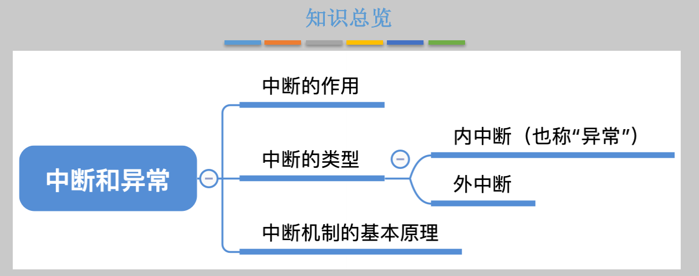
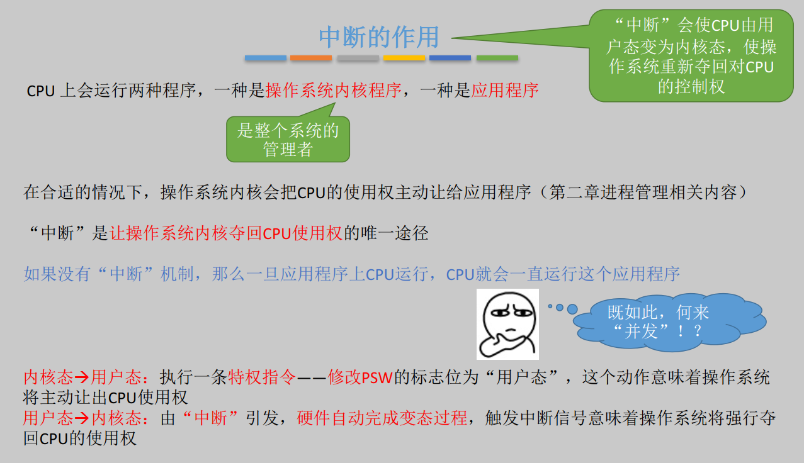
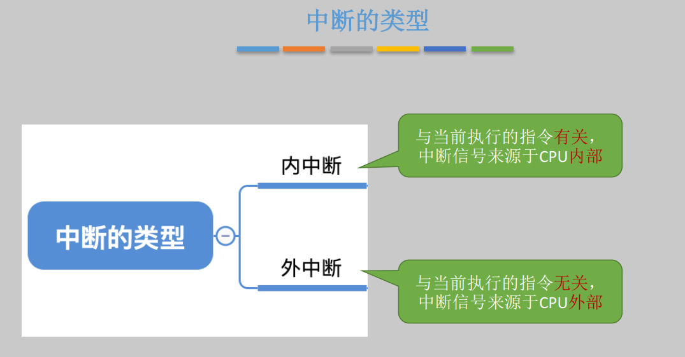
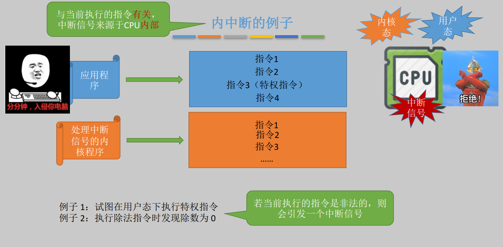
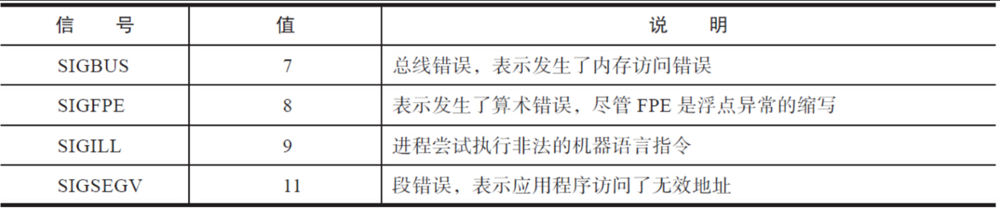
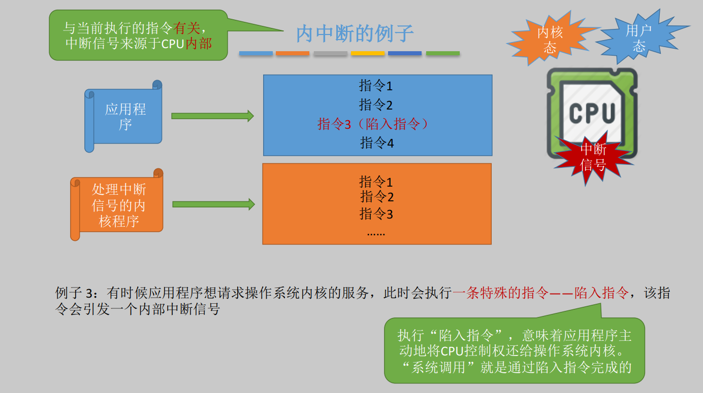
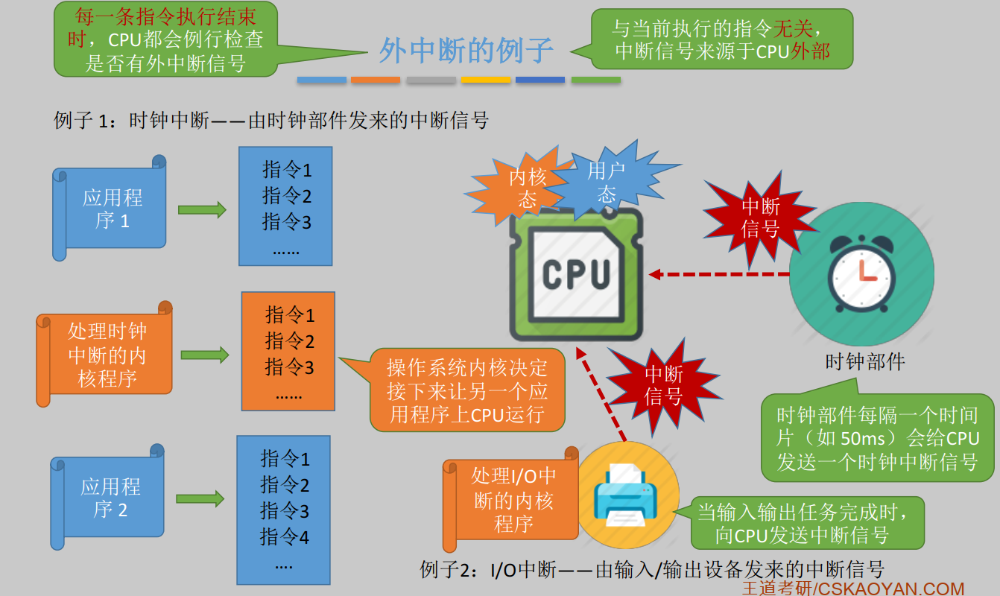
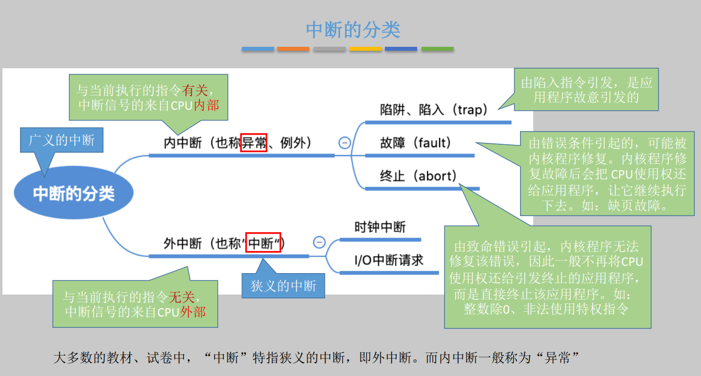
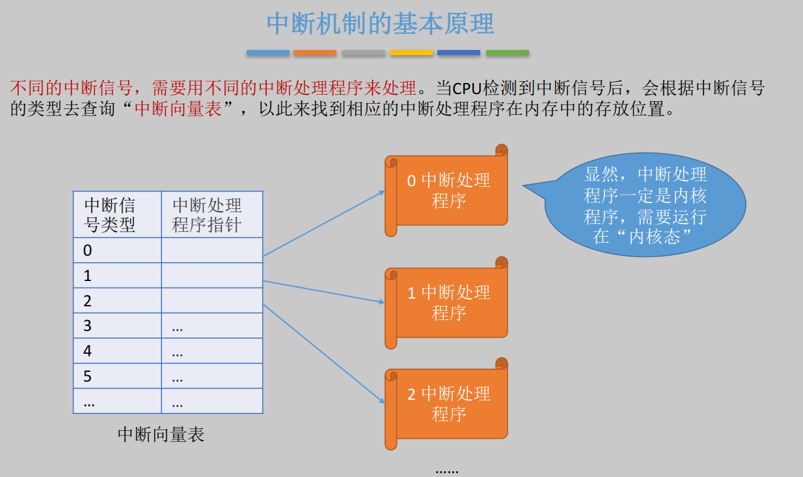
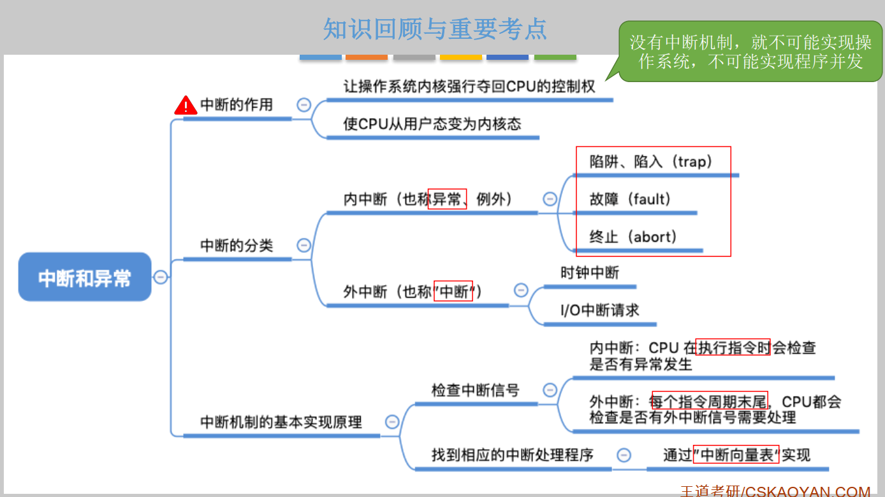

# 知识总览

# 中断的作用

# 中断的类型

# 内中断的例子

我们结合《Linux环境编程》中信号部分一起学习。硬件检测到了错误并通知内核，由内核发送相应的信号给相关进程。和硬件异常相关的信号见表6-1。

前面所讲的这四种硬件异常，一般是由程序自身引发的，不是由其他进程发送的信号引发的，并且这些异常都比较致命，以至于进程无法继续下去。所以这些信号产生之后，会立刻递送给进程。默认情况下，这四种信号都会使进程终止，并且产生core dump文件以供调试。对于这些信号，进程既不能忽略，也不能阻塞。

《Linux环境编程》中学习的信号指的是内核给进程传递的信号，然后进程根据信号进行相应的处理。而这里学习的信号指的是中断信号，这会让CPU执行处理中断信号的内核程序。而根据CPU获得中断信号的来源分为：CPU内部自己产生和外部传递给CPU。CPU有了中断信号之后呢，就会执行之前指定好的处理中断信号的内核程序。这个内核程序就会给对应的进程发送信号，你看看是不是串联起来了！

该例子就是程序想要执行系统调用，然后主动执行陷入指令。

这两类例子都是CPU会产生中断信号，然后执行处理中断信号的内核程序。

# 外中断的例子

这个例子不是CPU自己产生的中断信号，而是外部时钟部件产生的中断信号传递给CPU，

# 中断的分类

这里内中断的分类，其实就是分为主动的系统调用与硬件故障（上面介绍的三种硬件故障）。

外中断的分类倒是没有什么问题。

# 中断机制的基本原理

# 知识回顾

