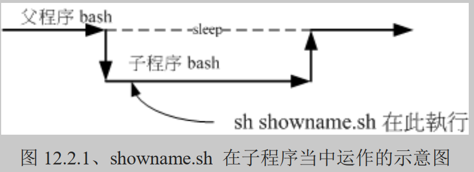
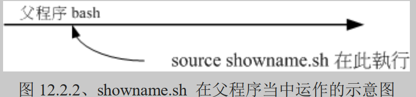

# 什么是 Shell scripts

什么是 shell script （程序化脚本） 呢？就字面上的意义，我们将他分为两部份。 在“ shell ”部分，我们在 [十章的 BASH](https://wizardforcel.gitbooks.io/vbird-linux-basic-4e/Text/index.html) 当中已经提过了，那是一个命令行下面让我们与系统沟通的一个工具接口。那么“ script ”是啥？ 字面上的意义， script 是“脚本、剧本”的意思。整句话是说， shell script 是针对 shell 所写的“剧本！”

什么东西啊？其实， shell script 是利用 shell 的功能所写的一个“程序 （program）”，这个程序是使用纯文本文件，将一些 shell 的语法与指令（含外部指令）写在里面， 搭配正则表达式、管线命令与数据流重导向等功能，以达到我们所想要的处理目的。

所以，简单的说， shell script 就像是早期 DOS 年代的批处理文件 （.bat） ，最简单的功能就是将许多指令汇整写在一起， 让使用者很轻易的就能够 one touch 的方法去处理复杂的动作 （执行一个文件 "shell script" ，就能够一次执行多个指令）。 而且 shell script 更提供阵列、循环、条件与逻辑判断等重要功能，让使用者也可以直接以 shell 来撰写程序，而不必使用类似 C 程序语言等传统程序撰写的语法呢！

这么说你可以了解了吗？是的！ shell script 可以简单的被看成是批处理文件， 也可以被说成是一个程序语言，且这个程序语言由于都是利用 shell 与相关工具指令， 所以不需要编译即可执行，且拥有不错的除错 （debug） 工具，所以，他可以帮助系统管理员快速的管理好主机。

## 干嘛学习 shell scripts

这是个好问题：“我又干嘛一定要学 shell script ？我又不是信息人，没有写程序的概念， 那我干嘛还要学 shell script 呢？不要学可不可以啊？”呵呵～如果 Linux 对你而言， 你只是想要“会用”而已，那么，不需要学 shell script 也还无所谓，这部分先给他跳过去， 等到有空的时候，再来好好的瞧一瞧。但是，如果你是真的想要玩清楚 Linux 的来龙去脉， 那么 shell script 就不可不知，为什么呢？因为：

- 自动化管理的重要依据

不用鸟哥说你也知道，管理一部主机真不是件简单的事情，每天要进行的任务就有：查询登录文件、追踪流量、监控使用者使用主机状态、主机各项硬件设备状态、 主机软件更新查询、更不要说得应付其他使用者的突然要求了。而这些工作的进行可以分为： （1）自行手动处理，或是 （2）写个简单的程序来帮你每日“自动处理分析”这两种方式，你觉得哪种方式比较好？ 当然是让系统自动工作比较好，对吧！呵呵～这就得要良好的 shell script 来帮忙的啦！

- 追踪与管理系统的重要工作

虽然我们还没有提到服务启动的方法，不过，这里可以先提一下，我们 CentOS 6.x 以前的版本中，系统的服务 （services） 启动的接口是在 /etc/init.d/ 这个目录下，目录下的所有文件都是 scripts ； 另外，包括开机 （booting） 过程也都是利用 shell script 来帮忙搜寻系统的相关设置数据， 然后再代入各个服务的设置参数啊！举例来说，如果我们想要重新启动系统登录文件， 可以使用：“/etc/init.d/rsyslogd restart”，那个 rsyslogd 文件就是 script 啦！

另外，鸟哥曾经在某一代的 Fedora 上面发现，启动 MySQL 这个数据库服务时，确实是可以启动的， 但是屏幕上却老是出现“failure”！后来才发现，原来是启动 MySQL 那个 script 会主动的以“空的密码”去尝试登陆 MySQL ，但为了安全性鸟哥修改过 MySQL 的密码啰～当然就登陆失败～ 后来改了改 script ，就略去这个问题啦！如此说来， script 确实是需要学习的啊！

时至今日，虽然 /etc/init.d/* 这个脚本启动的方式 （systemV） 已经被新一代的 systemd 所取代 （从 CentOS 7 开始）， 但是很多的个别服务在管理他们的服务启动方面，还是使用 shell script 的机制喔！所以，最好还是能够熟悉啦！

- 简单入侵侦测功能

当我们的系统有异状时，大多会将这些异状记录在系统记录器，也就是我们常提到的“系统登录文件”， 那么我们可以在固定的几分钟内主动的去分析系统登录文件，若察觉有问题，就立刻通报管理员， 或者是立刻加强防火墙的设置规则，如此一来，你的主机可就能够达到“自我保护”的聪明学习功能啦～ 举例来说，我们可以通过 shell script 去分析“当该封包尝试几次还是连线失败之后，就予以抵挡住该 IP”之类的举动，例如鸟哥写过一个关于[抵挡砍站软件的 shell script](http://linux.vbird.org/linux_server/0360apache.php#security_teleport) ， 就是用这个想法去达成的呢！

- 连续指令单一化

其实，对于新手而言， script 最简单的功能就是：“汇整一些在 command line 下达的连续指令，将他写入 scripts 当中，而由直接执行 scripts 来启动一连串的 command line 指令输入！”例如： 防火墙连续规则 （iptables），开机载入程序的项目 （就是在 /etc/rc.d/rc.local 里头的数据） ，等等都是相似的功能啦！ 其实，说穿了，如果不考虑 program 的部分，那么 scripts 也可以想成“仅是帮我们把一大串的指令汇整在一个文件里面， 而直接执行该文件就可以执行那一串又臭又长的指令段！”就是这么简单啦！

- 简易的数据处理

由前一章[正则表达式](https://wizardforcel.gitbooks.io/vbird-linux-basic-4e/Text/index.html)的 awk 程序说明中， 你可以发现， awk 可以用来处理简单的数据数据呢！例如薪资单的处理啊等等的。 shell script 的功能更强大，例如鸟哥曾经用 shell script 直接处理数据数据的比对啊， 文字数据的处理啊等等的，撰写方便，速度又快（因为在 Linux 性能较佳），真的是很不错用的啦！

举例来说，鸟哥每学期都得要以学生的学号来创建他们能够操作 Linux 的系统帐号，然后每个帐号还得要能够有磁盘容量的限制 （quota） 以及相关的设置等等， 那因为学校的校务系统提供的数据都是一整串学生信息，并没有单纯的学号字段，所以鸟哥就得要通过前几章的方法搭配 shell script 来自动处理相关设置流程， 这样才不会每学期都头疼一次啊！

- 跨平台支持与学习历程较短

几乎所有的 Unix Like 上面都可以跑 shell script ，连 MS Windows 系列也有相关的 script 仿真器可以用， 此外， shell script 的语法是相当友好的，看都看的懂得文字 （虽然是英文），而不是机器码， 很容易学习～这些都是你可以加以考虑的学习点啊！

上面这些都是你考虑学习 shell script 的特点～此外， shell script 还可以简单的以 vim 来直接编写，实在是很方便的好东西！所以，还是建议你学习一下啦。

不过，虽然 shell script 号称是程序 （program） ，但实际上， shell script 处理数据的速度上是不太够的。因为 shell script 用的是外部的指令与 bash shell 的一些默认工具，所以，他常常会去调用外部的函数库，因此，运算速度上面当然比不上传统的程序语言。 所以啰， shell script 用在系统管理上面是很好的一项工具，但是用在处理大量数值运算上， 就不够好了，因为 Shell scripts 的速度较慢，且使用的 CPU 资源较多，造成主机资源的分配不良。还好， 我们通常利用 shell script 来处理服务器的侦测，倒是没有进行大量运算的需求啊！所以不必担心的啦！

## 第一支 script 的撰写与执行

如同前面讲到的，shell script 其实就是纯文本文件，我们可以编辑这个文件，然后让这个文件来帮我们一次执行多个指令， 或者是利用一些运算与逻辑判断来帮我们达成某些功能。所以啦，要编辑这个文件的内容时，当然就需要具备有 bash 指令下达的相关认识。下达指令需要注意的事项在[第四章的开始下达指令](https://wizardforcel.gitbooks.io/vbird-linux-basic-4e/Text/index.html#cmd_cmd)小节内已经提过，有疑问请自行回去翻阅。 在 shell script 的撰写中还需要用到下面的注意事项：

1. 指令的执行是从上而下、从左而右的分析与执行；
2. 指令的下达就如同[第四章](https://wizardforcel.gitbooks.io/vbird-linux-basic-4e/Text/index.html#cmd_cmd)内提到的： 指令、选项与参数间的多个空白都会被忽略掉；
3. 空白行也将被忽略掉，并且 [tab] 按键所推开的空白同样视为空白键；
4. 如果读取到一个 Enter 符号 （CR） ，就尝试开始执行该行 （或该串） 命令；
5. 至于如果一行的内容太多，则可以使用“ [Enter] ”来延伸至下一行；
6. “ # ”可做为注解！任何加在 # 后面的数据将全部被视为注解文字而被忽略！

如此一来，我们在 script 内所撰写的程序，就会被一行一行的执行。现在我们假设你写的这个程序文件名是 /home/dmtsai/shell.sh 好了，那如何执行这个文件？很简单，可以有下面几个方法：

- 直接指令下达： shell.sh 文件必须要具备可读与可执行 （rx） 的权限，然后：
  - 绝对路径：使用 /home/dmtsai/shell.sh 来下达指令；
  - 相对路径：假设工作目录在 /home/dmtsai/ ，则使用 ./shell.sh 来执行
  - 变量“PATH”功能：将 shell.sh 放在 PATH 指定的目录内，例如： ~/bin/
- 以 bash 程序来执行：通过“ bash shell.sh ”或“ sh shell.sh ”来执行

反正重点就是要让那个 shell.sh 内的指令可以被执行的意思啦！ 由于 CentOS 默认使用者主文件夹下的 ~/bin 目录会被设置到 ${PATH} 内，所以你也可以将 shell.sh 创建在 /home/dmtsai/bin/ 下面 。此时，若 shell.sh 在 ~/bin 内且具有 rx 的权限，那就直接输入 shell.sh 即可执行该脚本程序！

那为何“ sh shell.sh ”也可以执行呢？这是因为 /bin/sh 其实就是 /bin/bash （链接文件），使用 sh shell.sh 亦即告诉系统，我想要直接以 bash 的功能来执行 shell.sh 这个文件内的相关指令的意思，所以此时你的 shell.sh 只要有 r 的权限即可被执行喔！而我们也可以利用 sh 的参数，如 -n 及 -x 来检查与追踪 shell.sh 的语法是否正确呢！ ^_^

- 撰写第一支 script

在武侠世界中，不论是那个门派，要学武功要从扫地与蹲马步做起，那么要学程序呢？呵呵，肯定是由“秀出 Hello World！” 这个字眼开始的！OK！那么鸟哥就先写一支 script 给大家瞧一瞧：

```shell
[dmtsai@study ~]$ mkdir bin; cd bin
[dmtsai@study bin]$ vim hello.sh
#!/bin/bash
# Program:
#       This program shows "Hello World!" in your screen.
# History:
# 2015/07/16    VBird    First release
PATH=/bin:/sbin:/usr/bin:/usr/sbin:/usr/local/bin:/usr/local/sbin:~/bin
export PATH
echo -e "Hello World! \a \n" # 是 echo 命令的一个选项，表示启用转义字符的解析功能。
exit 0
```

在本章当中，请将所有撰写的 script 放置到你主文件夹的 ~/bin 这个目录内，未来比较好管理啦！上面的写法当中，鸟哥主要将整个程序的撰写分成数段，大致是这样：

1. 第一行 #!/bin/bash 在宣告这个 script 使用的 shell 名称： 因为我们使用的是 bash ，所以，必须要以“ **#!/bin/bash** ”来宣告这个文件内的语法使用 bash 的语法！那么当这个程序被执行时，他就能够载入 bash 的相关环境配置文件 （一般来说就是 [non-login shell 的 ~/.bashrc](https://wizardforcel.gitbooks.io/vbird-linux-basic-4e/Text/index.html#settings_bashrc_shell)）， 并且执行 bash 来使我们下面的指令能够执行！这很重要的！（在很多状况中，如果没有设置好这一行， 那么该程序很可能会无法执行，因为系统可能无法判断该程序需要使用什么 shell 来执行啊！）
2. 程序内容的说明： 整个 script 当中，除了第一行的“ #! ”是用来宣告 shell 的之外，其他的 # 都是“注解”用途！ 所以上面的程序当中，第二行以下就是用来说明整个程序的基本数据。一般来说， 建议你一定要养成说明该 script 的：1. 内容与功能； 2. 版本信息； 3. 作者与联络方式； 4. 创建日期；5. 历史纪录 等等。这将有助于未来程序的改写与 debug 呢！
3. 主要环境变量的宣告： 建议务必要将一些重要的环境变量设置好，鸟哥个人认为， PATH 与 LANG （如果有使用到输出相关的信息时） 是当中最重要的！ 如此一来，则可让我们这支程序在进行时，可以直接下达一些外部指令，而不必写绝对路径呢！比较方便啦！
4. 主要程序部分 就将主要的程序写好即可！在这个例子当中，就是 echo 那一行啦！
5. 执行成果告知 （定义回传值） 是否记得我们在[第十章](https://wizardforcel.gitbooks.io/vbird-linux-basic-4e/Text/index.html)里面要讨论一个指令的执行成功与否，可以使用 [$?](https://wizardforcel.gitbooks.io/vbird-linux-basic-4e/Text/index.html#redirect_com) 这个变量来观察～ 那么我们也可以利用 exit 这个指令来让程序中断，并且回传一个数值给系统。 在我们这个例子当中，鸟哥使用 exit 0 ，这代表离开 script 并且回传一个 0 给系统， 所以我执行完这个 script 后，若接着下达 echo $? 则可得到 0 的值喔！ 更聪明的读者应该也知道了，呵呵！利用这个 exit n （n 是数字） 的功能，我们还可以自订错误讯息， 让这支程序变得更加的 smart 呢！

接下来通过刚刚上头介绍的执行方法来执行看看结果吧！

```shell
[dmtsai@study bin]$ sh hello.sh
Hello World !

```

你会看到屏幕是这样，而且应该还会听到“咚”的一声，为什么呢？还记得前一章提到的 [printf](https://wizardforcel.gitbooks.io/vbird-linux-basic-4e/Text/index.html#printf) 吧？用 echo 接着那些特殊的按键也可以发生同样的事情～ 不过， echo 必须要加上 -e 的选项才行！呵呵！在你写完这个小 script 之后，你就可以大声的说：“我也会写程序了”！哈哈！ 很简单有趣吧～ ^_^

另外，你也可以利用：“chmod a+x hello.sh; ./hello.sh”来执行这个 script 的呢！

## 撰写 shell script 的良好习惯创建

一个良好习惯的养成是很重要的～大家在刚开始撰写程序的时候，最容易忽略这部分， 认为程序写出来就好了，其他的不重要。其实，如果程序的说明能够更清楚，那么对你自己是有很大的帮助的。

举例来说，鸟哥自己为了自己的需求，曾经撰写了不少的 script 来帮我进行主机 IP 的侦测啊、 登录文件分析与管理啊、自动上传下载重要配置文件啊等等的，不过，早期就是因为太懒了， 管理的主机又太多了，常常同一个程序在不同的主机上面进行更改，到最后，到底哪一支才是最新的都记不起来， 而且，重点是，我到底是改了哪里？为什么做那样的修改？都忘的一干二净～真要命～

所以，后来鸟哥在写程序的时候，通常会比较仔细的将程序的设计过程给他记录下来，而且还会记录一些历史纪录， 如此一来，好多了～至少很容易知道我修改了哪些数据，以及程序修改的理念与逻辑概念等等， 在维护上面是轻松很多很多的喔！

另外，在一些环境的设置上面，毕竟每个人的环境都不相同，为了取得较佳的执行环境， 我都会自行先定义好一些一定会被用到的环境变量，例如 PATH 这个玩意儿！ 这样比较好啦～所以说，建议你一定要养成良好的 script 撰写习惯，在每个 script 的文件开始处记录好：

- script 的功能；
- script 的版本信息；
- script 的作者与联络方式；
- script 的版权宣告方式；
- script 的 History （历史纪录）；
- script 内较特殊的指令，使用“绝对路径”的方式来下达；
- script 运行时需要的环境变量预先宣告与设置。

除了记录这些信息之外，在较为特殊的程序码部分，个人建议务必要加上注解说明，可以帮助你非常非常多！ 此外，程序码的撰写最好使用巢状方式，在包覆的内部程序码最好能以 [tab] 按键的空格向后推， 这样你的程序码会显的非常的漂亮与有条理！在查阅与 debug 上较为轻松愉快喔！ 另外，使用撰写 script 的工具最好使用 vim 而不是 vi ，因为 vim 会有额外的语法检验机制，能够在第一阶段撰写时就发现语法方面的问题喔！

# 简单的 shell script 练习

在第一支 shell script 撰写完毕之后，相信你应该具有基本的撰写功力了。接下来，在开始更深入的程序概念之前，我们先来玩一些简单的小范例好了。 下面的范例中，达成结果的方式相当的多，建议你先自行撰写看看，写完之后再与鸟哥写的内容比对， 这样才能更加深概念喔！好！不啰唆，我们就一个一个来玩吧！

## 简单范例

下面的范例在很多的脚本程序中都会用到，而下面的范例又都很简单！值得参考看看喔！

- 对谈式脚本：变量内容由使用者决定

很多时候我们需要使用者输入一些内容，好让程序可以顺利运行。 简单的来说，大家应该都有安装过软件的经验，安装的时候，他不是会问你“要安装到那个目录去”吗？ 那个让使用者输入数据的动作，就是让使用者输入变量内容啦。

你应该还记得在[十章 bash](https://wizardforcel.gitbooks.io/vbird-linux-basic-4e/Text/index.html) 的时候，我们有学到一个 [read](https://wizardforcel.gitbooks.io/vbird-linux-basic-4e/Text/index.html#read) 指令吧？现在，请你以 read 指令的用途，撰写一个 script ，他可以让使用者输入：1. first name 与 2. last name， 最后并且在屏幕上显示：“Your full name is: ”的内容：

```shell
[dmtsai@study bin]$ vim showname.sh
#!/bin/bash
# Program:
#    User inputs his first name and last name.  Program shows his full name.
# History:
# 2015/07/16    VBird    First release
PATH=/bin:/sbin:/usr/bin:/usr/sbin:/usr/local/bin:/usr/local/sbin:~/bin
export PATH

read -p "Please input your first name: " firstname      # 提示使用者输入
read -p "Please input your last name:  " lastname       # 提示使用者输入
echo -e "\nYour full name is: ${firstname} ${lastname}" # 结果由屏幕输出
```

将上面这个 showname.sh 执行一下，你就能够发现使用者自己输入的变量可以让程序所取用，并且将他显示到屏幕上！ 接下来，如果想要制作一个每次执行都会依据不同的日期而变化结果的脚本呢？

- 随日期变化：利用 date 进行文件的创建

想像一个状况，假设我的服务器内有数据库，数据库每天的数据都不太一样，因此当我备份时，希望将每天的数据都备份成不同的文件名， 这样才能够让旧的数据也能够保存下来不被覆盖。哇！不同文件名呢！这真困扰啊？难道要我每天去修改 script ？

不需要啊！考虑每天的“日期”并不相同，所以我可以将文件名取成类似： backup.2015-07-16.data ， 不就可以每天一个不同文件名了吗？呵呵！确实如此。那个 2015-07-16 怎么来的？那就是重点啦！接下来出个相关的例子： 假设我想要创建三个空的文件 （通过 [touch](https://wizardforcel.gitbooks.io/vbird-linux-basic-4e/Text/index.html#touch)） ，文件名最开头由使用者输入决定，假设使用者输入 filename 好了，那今天的日期是 2015/07/16 ， 我想要以前天、昨天、今天的日期来创建这些文件，亦即 filename_20150714, filename_20150715, filename_20150716 ，该如何是好？

```shell
[dmtsai@study bin]$ vim create_3_filename.sh
#!/bin/bash
# Program:
#    Program creates three files, which named by user's input and date command.
# History:
# 2015/07/16    VBird    First release
PATH=/bin:/sbin:/usr/bin:/usr/sbin:/usr/local/bin:/usr/local/sbin:~/bin
export PATH

# 1\. 让使用者输入文件名称，并取得 fileuser 这个变量；
echo -e "I will use 'touch' command to create 3 files." # 纯粹显示信息
read -p "Please input your filename: " fileuser         # 提示使用者输入

# 2\. 为了避免使用者随意按 Enter ，利用[变量功能]分析文件名是否有设置？
# 这里使用了 ${parameter:-word} 的格式。
# 如果 fileuser 这个变量已经被设置且不为空（即非null），则将其值赋给 filename；
# 如果 fileuser 没有被设置或者是空的，则 filename 的值为 "filename"。
# 这样做的目的是为了确保在用户未提供文件名时，程序有一个默认的文件名值，以避免在后续的文件操作中出现问题。
filename=${fileuser:-"filename"}           # 开始判断有否配置文件名

# 3\. 开始利用 date 指令来取得所需要的文件名了；
date1=$(date --date='2 days ago' +%Y%m%d)  # 前两天的日期
date2=$(date --date='1 days ago' +%Y%m%d)  # 前一天的日期
date3=$(date +%Y%m%d)                      # 今天的日期
file1=${filename}${date1}                  # 下面三行在配置文件名
file2=${filename}${date2}
file3=${filename}${date3}

# 4\. 将文件名创建吧！
touch "${file1}"                           # 下面三行在创建文件
touch "${file2}"
touch "${file3}"
```

如果你开始执行这个 create_3_filename.sh 之后，你可以进行两次执行：一次直接按 [Enter] 来查阅文件名是啥？ 一次可以输入一些字符，这样可以判断你的脚本是否设计正确喔！

- 数值运算：简单的加减乘除

各位看官应该还记得，我们可以使用 [declare](https://wizardforcel.gitbooks.io/vbird-linux-basic-4e/Text/index.html#declare) 来定义变量的类型吧？ 当变量定义成为整数后才能够进行加减运算啊！此外，我们也可以利用“ $（（计算式）） ”来进行数值运算的。 OK！那我们来玩玩看，如果我们要使用者输入两个变量， 然后将两个变量的内容相乘，最后输出相乘的结果，那可以怎么做？

```shell
[dmtsai@study bin]$ vim multiplying.sh
#!/bin/bash
# Program:
#    User inputs 2 integer numbers; program will cross these two numbers.
# History:
# 2015/07/16    VBird    First release
PATH=/bin:/sbin:/usr/bin:/usr/sbin:/usr/local/bin:/usr/local/sbin:~/bin
export PATH
echo -e "You SHOULD input 2 numbers, I will multiplying them! \n"
read -p "first number:  " firstnu
read -p "second number: " secnu
total=$((${firstnu}*${secnu})) # 在 Bash 中，双括号可帮助识别变量，执行算术运算，而不需要使用 expr 或其他工具。
echo -e "\nThe result of ${firstnu} x ${secnu} is ==> ${total}"
```

在数值的运算上，我们可以使用`declare -i total=${firstnu}*${secnu}` 也可以使用上面的方式来进行！基本上，鸟哥比较建议使用这样的方式来进行运算：

> var=$((运算内容))

不但容易记忆，而且也比较方便的多，因为两个小括号内可以加上空白字符喔！ 未来你可以使用这种方式来计算的呀！至于数值运算上的处理，则有： `+, -, *, /, %` 等等。 那个 % 是取余数啦～举例来说， 13 对 3 取余数，结果是 `13=4*3+1`，所以余数是 1 啊！就是：

```shell
[dmtsai@study bin]$ echo $(( 13 % 3 ))
1
```

这样了解了吧？另外，如果你想要计算含有小数点的数据时，其实可以通过 [bc](https://wizardforcel.gitbooks.io/vbird-linux-basic-4e/Text/index.html#bc) 这个指令的协助喔！ 例如可以这样做：

```shell
[dmtsai@study bin]$ echo "123.123*55.9" | bc
6882.575
```

了解了 bc 的妙用之后，来让我们测试一下如何计算 pi 这个东西呢？

- 数值运算：通过 bc 计算 pi

其实计算 pi 时，小数点以下位数可以无限制的延伸下去！。。。。。。

## script 的执行方式差异 （source, sh script, ./script）

不同的 script 执行方式会造成不一样的结果喔！尤其影响 bash 的环境很大呢！脚本的执行方式除了[前面小节谈到的方式](https://wizardforcel.gitbooks.io/vbird-linux-basic-4e/Text/index.html#script_run)之外，还可以利用 [source](https://wizardforcel.gitbooks.io/vbird-linux-basic-4e/Text/index.html#source) 或小数点 （.） 来执行喔！那么这种执行方式有何不同呢？当然是不同的啦！让我们来说说！

- 利用直接执行的方式来执行 script

当使用前一小节提到的直接指令下达 （不论是绝对路径/相对路径还是 ${PATH} 内），或者是利用 bash （或 sh） 来下达脚本时， 该 script 都会使用一个新的 bash 环境来执行脚本内的指令！也就是说，使用这种执行方式时， 其实 script 是在子程序的 bash 内执行的！我们在[第十章 BASH](https://wizardforcel.gitbooks.io/vbird-linux-basic-4e/Text/index.html) 内谈到 [export](https://wizardforcel.gitbooks.io/vbird-linux-basic-4e/Text/index.html#export) 的功能时，曾经就父程序/子程序谈过一些概念性的问题， 重点在于：“当子程序完成后，在子程序内的各项变量或动作将会结束而不会传回到父程序中”！ 这是什么意思呢？

我们举刚刚提到过的 showname.sh 这个脚本来说明好了，这个脚本可以让使用者自行设置两个变量，分别是 firstname 与 lastname，想一想，如果你直接执行该指令时，该指令帮你设置的 firstname 会不会生效？看一下下面的执行结果：

```shell
[dmtsai@study bin]$ echo ${firstname} ${lastname}
    <==确认了，这两个变量并不存在喔！
[dmtsai@study bin]$ sh showname.sh
Please input your first name: VBird <==这个名字是鸟哥自己输入的
Please input your last name:  Tsai 

Your full name is: VBird Tsai      <==看吧！在 script 运行中，这两个变量有生效
[dmtsai@study bin]$ echo ${firstname} ${lastname}
    <==事实上，这两个变量在父程序的 bash 中还是不存在的！
```

上面的结果你应该会觉得很奇怪，怎么我已经利用 showname.sh 设置好的变量竟然在 bash 环境下面无效！怎么回事呢？ 如果将程序相关性绘制成图的话，我们以下图来说明。当你使用直接执行的方法来处理时，系统会给予一支新的 bash 让我们来执行 showname.sh 里面的指令，因此你的 firstname, lastname 等变量其实是在下图中的子程序 bash 内执行的。 当 showname.sh 执行完毕后，子程序 bash 内的所有数据便被移除，因此上表的练习中，在父程序下面 echo ${firstname} 时， 就看不到任何东西了！这样可以理解吗？



- 利用 source 来执行脚本：在父程序中执行

如果你使用 source 来执行指令那就不一样了！同样的脚本我们来执行看看：

```shell
[dmtsai@study bin]$ source showname.sh
Please input your first name: VBird
Please input your last name:  Tsai

Your full name is: VBird Tsai
[dmtsai@study bin]$ echo ${firstname} ${lastname}
VBird Tsai  <==嘿嘿！有数据产生喔！
```

竟然生效了！没错啊！因为 source 对 script 的执行方式可以使用下面的图示来说明！ showname.sh 会在父程序中执行的，因此各项动作都会在原本的 bash 内生效！这也是为啥你不登出系统而要让某些写入 ~/.bashrc 的设置生效时，需要使用`source ~/.bashrc`而不能使用`bash ~/.bashrc`是一样的啊！



# 善用判断式

在第十章中，我们提到过 [$?](https://wizardforcel.gitbooks.io/vbird-linux-basic-4e/Text/index.html#returnvar) 这个变量所代表的意义， 此外，也通过 [&& 及 ||](https://wizardforcel.gitbooks.io/vbird-linux-basic-4e/Text/index.html#redirect_com) 来作为前一个指令执行回传值对于后一个指令是否要进行的依据。第十章的讨论中，如果想要判断一个目录是否存在， 当时我们使用的是 ls 这个指令搭配数据流重导向，最后配合 $? 来决定后续的指令进行与否。 但是否有更简单的方式可以来进行“条件判断”呢？有的～那就是“ test ”这个指令。

## 利用 test 指令的测试功能

当我要检测系统上面某些文件或者是相关的属性时，利用 test 这个指令来工作真是好用得不得了， 举例来说，我要检查 /dmtsai 是否存在时，使用：

```shell
[dmtsai@study ~]$ test -e /dmtsai
```

执行结果并不会显示任何讯息，但最后我们也可以通过 $? 或 && 及 || 来展现整个结果呢！ 例如我们在将上面的例子改写成这样：

```shell
[dmtsai@study ~]$ test -e /dmtsai && echo "exist" || echo "Not exist"
Not exist  <==结果显示不存在啊！
```

最终的结果可以告知我们是“exist”还是“Not exist”呢！那我知道 -e 是测试一个“东西”在不在， 如果还想要测试一下该文件名是啥玩意儿时，还有哪些标志可以来判断的呢？呵呵！有下面这些东西喔！

| 测试的标志                                                   | 代表意义                                                     |
| ------------------------------------------------------------ | ------------------------------------------------------------ |
| 1. 关于某个文件名的“文件类型”判断，如 test -e filename 表示存在否 |                                                              |
| -e                                                           | 该“文件名”是否存在？（常用）                                 |
| -f                                                           | 该“文件名”是否存在且为文件（file）？（常用）                 |
| -d                                                           | 该“文件名”是否存在且为目录（directory）？（常用）            |
| -b                                                           | 该“文件名”是否存在且为一个 block device 设备？               |
| -c                                                           | 该“文件名”是否存在且为一个 character device 设备？           |
| -S                                                           | 该“文件名”是否存在且为一个 Socket 文件？                     |
| -p                                                           | 该“文件名”是否存在且为一个 FIFO （pipe） 文件？              |
| -L                                                           | 该“文件名”是否存在且为一个链接文件？                         |
| 2. 关于文件的权限侦测，如 test -r filename 表示可读否 （但 root 权限常有例外） |                                                              |
| -r                                                           | 侦测该文件名是否存在且具有“可读”的权限？                     |
| -w                                                           | 侦测该文件名是否存在且具有“可写”的权限？                     |
| -x                                                           | 侦测该文件名是否存在且具有“可执行”的权限？                   |
| -u                                                           | 侦测该文件名是否存在且具有“SUID”的属性？                     |
| -g                                                           | 侦测该文件名是否存在且具有“SGID”的属性？                     |
| -k                                                           | 侦测该文件名是否存在且具有“Sticky bit”的属性？               |
| -s                                                           | 侦测该文件名是否存在且为“非空白文件”？                       |
| 3. 两个文件之间的比较，如： test file1 -nt file2             |                                                              |
| -nt                                                          | （newer than）判断 file1 是否比 file2 新                     |
| -ot                                                          | （older than）判断 file1 是否比 file2 旧                     |
| -ef                                                          | 判断 file1 与 file2 是否为同一文件，可用在判断 hard link 的判定上。 主要意义在判定，两个文件是否均指向同一个 inode 哩！ |
| 4. 关于两个整数之间的判定，例如 test n1 -eq n2               |                                                              |
| -eq                                                          | 两数值相等 （equal）                                         |
| -ne                                                          | 两数值不等 （not equal）                                     |
| -gt                                                          | n1 大于 n2 （greater than）                                  |
| -lt                                                          | n1 小于 n2 （less than）                                     |
| -ge                                                          | n1 大于等于 n2 （greater than or equal）                     |
| -le                                                          | n1 小于等于 n2 （less than or equal）                        |
| 5. 判定字串的数据                                            |                                                              |
| test -z string                                               | 判定字串是否为 0 ？若 string 为空字串，则为 true             |
| test -n string                                               | 判定字串是否非为 0 ？若 string 为空字串，则为 false。 -n 亦可省略 |
| test str1 == str2                                            | 判定 str1 是否等于 str2 ，若相等，则回传 true                |
| test str1 != str2                                            | 判定 str1 是否不等于 str2 ，若相等，则回传 false             |
| 6. 多重条件判定，例如： test -r filename -a -x filename      |                                                              |
| -a                                                           | （and）两状况同时成立！例如 test -r file -a -x file，则 file 同时具有 r 与 x 权限时，才回传 true。 |
| -o                                                           | （or）两状况任何一个成立！例如 test -r file -o -x file，则 file 具有 r 或 x 权限时，就可回传 true。 |
| !                                                            | 反相状态，如 test ! -x file ，当 file 不具有 x 时，回传 true |

OK！现在我们就利用 test 来帮我们写几个简单的例子。首先，判断一下，让使用者输入一个文件名，我们判断：

1. 这个文件是否存在，若不存在则给予一个“Filename does not exist”的讯息，并中断程序；
2. 若这个文件存在，则判断他是个文件或目录，结果输出“Filename is regular file”或 “Filename is directory”
3. 判断一下，执行者的身份对这个文件或目录所拥有的权限，并输出权限数据！

你可以先自行创作看看，然后再跟下面的结果讨论讨论。注意利用 test 与 && 还有 || 等标志！

```shell
[dmtsai@study bin]$ vim file_perm.sh
#!/bin/bash
# Program:
#    User input a filename, program will check the flowing:
#    1.） exist? 2.） file/directory? 3.） file permissions
# History:
# 2015/07/16    VBird    First release
PATH=/bin:/sbin:/usr/bin:/usr/sbin:/usr/local/bin:/usr/local/sbin:~/bin
export PATH

# 1\. 让使用者输入文件名，并且判断使用者是否真的有输入字串？
echo -e "Please input a filename, I will check the filename's type and permission. \n\n"
read -p "Input a filename : " filename
test -z ${filename} && echo "You MUST input a filename." && exit 0
# 2\. 判断文件是否存在？若不存在则显示讯息并结束脚本
test ! -e ${filename} && echo "The filename '${filename}' DO NOT exist" && exit 0
# 3\. 开始判断文件类型与属性
test -f ${filename} && filetype="regulare file"
test -d ${filename} && filetype="directory"
test -r ${filename} && perm="readable"
test -w ${filename} && perm="${perm} writable"
test -x ${filename} && perm="${perm} executable"
# 4\. 开始输出信息！
echo "The filename: ${filename} is a ${filetype}"
echo "And the permissions for you are : ${perm}"
```

如果你执行这个脚本后，他会依据你输入的文件名来进行检查喔！先看是否存在，再看为文件或目录类型，最后判断权限。 但是你必须要注意的是，由于 root 在很多权限的限制上面都是无效的，所以使用 root 执行这个脚本时， 常常会发现与 ls -l 观察到的结果并不相同！所以，建议使用一般使用者来执行这个脚本试看看。

## 利用判断符号 [ ]

除了我们很喜欢使用的 test 之外，其实，我们还可以利用判断符号“ [ ] ”（就是中括号啦） 来进行数据的判断呢！ 举例来说，如果我想要知道 ${HOME} 这个变量是否为空的，可以这样做：

```shell
[dmtsai@study ~]$ [ -z "${HOME}" ] ; echo $?
```

使用中括号必须要特别注意，因为中括号用在很多地方，包括万用字符与正则表达式等等，所以如果要在 bash 的语法当中使用中括号作为 shell 的判断式时，必须要注意中括号的两端需要有空白字符来分隔喔！ 假设我空白键使用“□”符号来表示，那么，在这些地方你都需要有空白键：

```shell
[  "$HOME"  ==  "$MAIL"  ]
[□"$HOME"□==□"$MAIL"□]
 ↑       ↑  ↑       ↑
```

**Tips** 你会发现鸟哥在上面的判断式当中使用了两个等号“ == ”。其实在 bash 当中使用一个等号与两个等号的结果是一样的！ 不过在一般惯用程序的写法中，一个等号代表“变量的设置”，两个等号则是代表“逻辑判断 （是与否之意）”。 由于我们在中括号内重点在于“判断”而非“设置变量”，因此鸟哥建议您还是使用两个等号较佳！

上面的例子在说明，两个字串 ${HOME} 与 ${MAIL} 是否相同的意思，相当于 test ${HOME} == ${MAIL} 的意思啦！ 而如果没有空白分隔，例如 [${HOME}==${MAIL}] 时，我们的 bash 就会显示错误讯息了！这可要很注意啊！ 所以说，你最好要注意：

- 在中括号 [] 内的每个元件都需要有空白键来分隔；
- 在中括号内的变量，最好都以双引号括号起来；
- 在中括号内的常数，最好都以单或双引号括号起来。

为什么要这么麻烦啊？直接举例来说，假如我设置了 name="VBird Tsai" ，然后这样判定：

```shell
[dmtsai@study ~]$ name="VBird Tsai"
[dmtsai@study ~]$ [ ${name} == "VBird" ]
bash: [: too many arguments
```

见鬼了！怎么会发生错误啊？bash 还跟我说错误是由于“太多参数 （arguments）”所致！ 为什么呢？因为 ${name} 如果没有使用双引号刮起来，那么上面的判定式会变成：

> [ VBird Tsai == "VBird" ]

上面肯定不对嘛！因为一个判断式仅能有两个数据的比对，上面 VBird 与 Tsai 还有 "VBird" 就有三个数据！ 这不是我们要的！我们要的应该是下面这个样子：

> [ "VBird Tsai" == "VBird" ]

这可是差很多的喔！另外，中括号的使用方法与 test 几乎一模一样啊～ 只是中括号比较常用在[条件判断式 if ..... then ..... fi](https://wizardforcel.gitbooks.io/vbird-linux-basic-4e/Text/index.html#rule) 的情况中就是了。 好，那我们也使用中括号的判断来做一个小案例好了，案例设置如下：

1. 当执行一个程序的时候，这个程序会让使用者选择 Y 或 N ，
2. 如果使用者输入 Y 或 y 时，就显示“ OK, continue ”
3. 如果使用者输入 n 或 N 时，就显示“ Oh, interrupt ！”
4. 如果不是 Y/y/N/n 之内的其他字符，就显示“ I don't know what your choice is ”

利用中括号、 && 与 || 来继续吧！

```
[dmtsai@study bin]$ vim ans_yn.sh
#!/bin/bash
# Program:
#     This program shows the user's choice
# History:
# 2015/07/16    VBird    First release
PATH=/bin:/sbin:/usr/bin:/usr/sbin:/usr/local/bin:/usr/local/sbin:~/bin
export PATH

read -p "Please input （Y/N）: " yn
[ "${yn}" == "Y" -o "${yn}" == "y" ] && echo "OK, continue" && exit 0
[ "${yn}" == "N" -o "${yn}" == "n" ] && echo "Oh, interrupt!" && exit 0
echo "I don't know what your choice is" && exit 0
```

由于输入正确 （Yes） 的方法有大小写之分，不论输入大写 Y 或小写 y 都是可以的，此时判断式内就得要有两个判断才行！ 由于是任何一个成立即可 （大写或小写的 y） ，所以这里使用 -o （或） 链接两个判断喔！ 很有趣吧！利用这个字串判别的方法，我们就可以很轻松的将使用者想要进行的工作分门别类呢！ 接下来，我们再来谈一些其他有的没有的东西吧！

## Shell script 的默认变量（$0, $1...）

我们知道指令可以带有选项与参数，例如 ls -la 可以察看包含隐藏文件的所有属性与权限。那么 shell script 能不能在脚本文件名后面带有参数呢？很有趣喔！举例来说，如果你想要重新启动系统的网络，可以这样做：

```shell
[dmtsai@study ~]$ file /etc/init.d/network
/etc/init.d/network: Bourne-Again shell script, ASCII text executable
# 使用 file 来查询后，系统告知这个文件是个 bash 的可执行 script 喔！
[dmtsai@study ~]$ /etc/init.d/network restart
```

restart 是重新启动的意思，上面的指令可以“重新启动 /etc/init.d/network 这支程序”的意思！ 唔！那么如果你在 /etc/init.d/network 后面加上 stop 呢？没错！就可以直接关闭该服务了！这么神奇啊？ 没错啊！如果你要依据程序的执行给予一些变量去进行不同的任务时，本章一开始是使用 [read](https://wizardforcel.gitbooks.io/vbird-linux-basic-4e/Text/index.html#ex_read) 的功能！但 read 功能的问题是你得要手动由键盘输入一些判断式。如果通过指令后面接参数， 那么一个指令就能够处理完毕而不需要手动再次输入一些变量行为！这样下达指令会比较简单方便啦！

script 是怎么达成这个功能的呢？其实 script 针对参数已经有设置好一些变量名称了！对应如下：

```shell
/path/to/scriptname  opt1  opt2  opt3  opt4
       $0             $1    $2    $3    $4
```

这样够清楚了吧？执行的脚本文件名为 $0 这个变量，第一个接的参数就是 $1 啊～ 所以，只要我们在 script 里面善用 $1 的话，就可以很简单的立即下达某些指令功能了！除了这些数字的变量之外， 我们还有一些较为特殊的变量可以在 script 内使用来调用这些参数喔！

- $# ：代表后接的参数“个数”，以上表为例这里显示为“ 4 ”；
- $@ ：代表“ "$1" "$2" "$3" "$4" ”之意，每个变量是独立的（用双引号括起来）；
- $* ：代表“ "$1<u>c</u>$2<u>c</u>$3<u>c</u>$4" ”，其中 <u>c</u> 为分隔字符，默认为空白键， 所以本例中代表“ "$1 $2 $3 $4" ”之意。

那个 $@ 与 $* 基本上还是有所不同啦！不过，一般使用情况下可以直接记忆 $@ 即可！ 好了，来做个例子吧～假设我要执行一个可以携带参数的 script ，执行该脚本后屏幕会显示如下的数据：

- 程序的文件名为何？
- 共有几个参数？
- 若参数的个数小于 2 则告知使用者参数数量太少
- 全部的参数内容为何？
- 第一个参数为何？
- 第二个参数为何

```shell
[dmtsai@study bin]$ vim how_paras.sh
#!/bin/bash
# Program:
#    Program shows the script name, parameters...
# History:
# 2015/07/16    VBird    First release
PATH=/bin:/sbin:/usr/bin:/usr/sbin:/usr/local/bin:/usr/local/sbin:~/bin
export PATH

echo "The script name is        ==&gt; ${0}"
echo "Total parameter number is ==&gt; $#"
[ "$#" -lt 2 ] && echo "The number of parameter is less than 2\.  Stop here." && exit 0
echo "Your whole parameter is   ==&gt; '$@'"
echo "The 1st parameter         ==&gt; ${1}"
echo "The 2nd parameter         ==&gt; ${2}"
```

执行结果如下：

```shell
[dmtsai@study bin]$ sh how_paras.sh theone haha quot
The script name is        ==&gt; how_paras.sh       &lt;==文件名
Total parameter number is ==&gt; 3                  &lt;==果然有三个参数
Your whole parameter is   ==&gt; 'theone haha quot' &lt;==参数的内容全部
The 1st parameter         ==&gt; theone             &lt;==第一个参数
The 2nd parameter         ==&gt; haha               &lt;==第二个参数
```

- shift：造成参数变量号码偏移

除此之外，脚本后面所接的变量是否能够进行偏移 （shift） 呢？什么是偏移啊？我们直接以下面的范例来说明好了， 用范例说明比较好解释！我们将 how_paras.sh 的内容稍作变化一下，用来显示每次偏移后参数的变化情况：

```shell
[dmtsai@study bin]$ vim shift_paras.sh
#!/bin/bash
# Program:
#    Program shows the effect of shift function.
# History:
# 2009/02/17    VBird    First release
PATH=/bin:/sbin:/usr/bin:/usr/sbin:/usr/local/bin:/usr/local/sbin:~/bin
export PATH

echo "Total parameter number is ==&gt; $#"
echo "Your whole parameter is   ==&gt; '$@'"
shift   # 进行第一次“一个变量的 shift ”
echo "Total parameter number is ==&gt; $#"
echo "Your whole parameter is   ==&gt; '$@'"
shift 3 # 进行第二次“三个变量的 shift ”
echo "Total parameter number is ==&gt; $#"
echo "Your whole parameter is   ==&gt; '$@'"
```

这玩意的执行成果如下：

```shell
[dmtsai@study bin]$ sh shift_paras.sh one two three four five six &lt;==给予六个参数
Total parameter number is ==&gt; 6   &lt;==最原始的参数变量情况
Your whole parameter is   ==&gt; 'one two three four five six'
Total parameter number is ==&gt; 5   &lt;==第一次偏移，看下面发现第一个 one 不见了
Your whole parameter is   ==&gt; 'two three four five six'
Total parameter number is ==&gt; 2   &lt;==第二次偏移掉三个，two three four 不见了
Your whole parameter is   ==&gt; 'five six'
```

光看结果你就可以知道啦，那个 shift 会移动变量，而且 shift 后面可以接数字，代表拿掉最前面的几个参数的意思。 上面的执行结果中，第一次进行 shift 后他的显示情况是“ one two three four five six”，所以就剩下五个啦！第二次直接拿掉三个，就变成“ two three four five six ”啦！ 这样这个案例可以了解了吗？理解了 shift 的功能了吗？

上面这几个例子都很简单吧？几乎都是利用 bash 的相关功能而已～ 不难啦～下面我们就要使用条件判断式来进行一些分别功能的设置了，好好瞧一瞧先～


# 条件判断式


# 循环 （loop）


# shell script 的追踪与 debug


