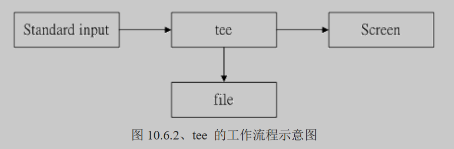

# 认识 BASH 这个 Shell

管理整个计算机硬件的其实是操作系统的核心 （kernel），这个核心是需要被保护的！ 所以一般使用者就只能通过 shell 来跟核心沟通，以让核心达到我们所想要达到的工作。 那么系统有多少 shell 可用呢？为什么我们要使用 bash 啊？下面分别来谈一谈。

## 硬件、核心与 Shell

“什么是 Shell ”？相信只要摸过计算机，对于操作系统 （不论是 Linux 、 Unix 或者是 Windows） 有点概念的朋友们大多听过这个名词，因为只要有“操作系统”那么就离不开 Shell 这个东西。

操作系统其实是一组软件，由于这组软件在控制整个硬件与管理系统的活动监测，如果这组软件能被使用者随意的操作，若使用者应用不当，将会使得整个系统崩溃，因为操作系统管理的就是整个硬件功能，所以当然不能够随便被一些没有管理能力的终端用户随意使用。

其实shell的功能只是提供使用者操作系统的一个接口，因此这个shell需要可以调用其他软件才好。 我们在第四章到第九章提到过很多指令，包括 man, chmod, chown, vi, fdisk, mkfs 等等指令，这些指令都是独立的应用程序， 但是我们可以通过shell来操作这些应用程序，让这些应用程序调用核心来运行所需的工作。

## 系统合法的shell和shell的功能

知道什么是 Shell 之后，那么我们来了解一下 Linux 使用的是哪一个 shell 呢？什么！哪一个？难道说 shell 不就是“一个 shell 吗？”哈哈！那可不！由于早年的 Unix 年代，发展者众，所以由于 shell 依据发展者的不同就有许多的版本。

常见的Linux shell包括：

1. **Bourne-Again Shell (Bash)**: Bash是大多数Linux发行版的默认shell，是Bourne Shell（sh）的增强版本，支持自动补全、命令历史、函数和别名等功能。
2. **Bourne Shell (sh)**: sh是Unix系统上最早的shell之一，现代大多数shell都是基于sh的概念和功能设计的。
3. **C Shell (csh)**: csh的语法类似于C语言，对于熟悉C语言的用户来说可能更容易上手。
4. **Korn Shell (ksh)**: ksh是Bourne Shell的超集，它结合了Bourne Shell和C Shell的特点，同时增加了许多改进。
5. **Fish (friendly interactive shell)**: Fish是一个相对较新的shell，专注于用户友好性和易用性，它提供了丰富的功能，如自动建议、彩色高亮显示等。

Shell的主要特点：

- **命令提示符**: shell在等待用户输入时提供一个提示符，通常是 `$` 或者 `#`（对于root用户）。
- **命令执行**: 用户可以在命令提示符下输入命令，shell会解释并执行这些命令，也可以执行存储在脚本文件中的一系列命令。
- **管道和重定向**: shell可以将一个命令的输出作为另一个命令的输入（管道），也可以将输出重定向到文件中或从文件中读取输入。
- **环境变量**: shell使用环境变量来存储关于操作系统环境的信息，这些变量可以影响shell和其他程序的行为。
- **脚本编程**: shell脚本是一系列命令的集合，可以被保存在文本文件中以便重复执行。它包括变量、流程控制语句等编程元素。
- **用户接口**: shell通常提供了交互式和非交互式两种模式。在交互式模式下，用户可以与shell直接交互；而在非交互式模式下，shell可以自动运行脚本而无需用户干预。

## 查询指令是否为 Bash shell 的内置命令： type

为了方便 shell 的操作，其实 bash 已经“内置”了很多指令了，例如上面提到的 cd ， 还有例如 umask 等等的指令，都是内置在 bash 当中的呢！

那怎么知道这个指令是来自于外部指令（指的是其他非 bash 所提供的指令） 或是内置在 bash 当中的呢？ 嘿嘿！利用 type 这个指令来观察即可！举例来说：

```shell
[dmtsai@study ~]$ type [-tpa] name
选项与参数：
    ：不加任何选项与参数时，type 会显示出 name 是外部指令还是 bash 内置指令
-t  ：当加入 -t 参数时，type 会将 name 以下面这些字眼显示出他的意义：
      file    ：表示为外部指令；
      alias   ：表示该指令为命令别名所设置的名称；
      builtin ：表示该指令为 bash 内置的指令功能；
-p  ：如果后面接的 name 为外部指令时，才会显示完整文件名；
-a  ：包含 alias，并且会将 PATH 变量定义的路径中将所有含 name 的指令都列出来，

范例一：查询一下 ls 这个指令是否为 bash 内置？
[dmtsai@study ~]$ type ls
ls is aliased to `ls --color=auto' <==未加任何参数，列出 ls 的最主要使用情况
[dmtsai@study ~]$ type -t ls
alias                              <==仅列出 ls 执行时的依据
[dmtsai@study ~]$ type -a ls
ls is aliased to `ls --color=auto' <==最先使用 aliase
ls is /usr/bin/ls                  <==还有找到外部指令在 /bin/ls

范例二：那么 cd 呢？
[dmtsai@study ~]$ type cd
cd is a shell builtin              <==看到了吗？ cd 是 shell 内置指令
```

通过 type 这个指令可以知道每个指令是否为 bash 的内置指令。 此外，由于利用 type 搜寻后面的名称时，如果后面接的名称并不能以可执行文件的状态被找到， 那么该名称是不会被显示出来的。也就是说， type 主要在找出“可执行文件”而不是一般文件文件名喔。所以，这个 type 也可以用来作为类似 [which](https://wizardforcel.gitbooks.io/vbird-linux-basic-4e/Text/index.html#which) 指令的用途啦！找指令用的！

# Shell的变量功能

变量是 bash 环境中非常重要的一个玩意儿，我们知道 Linux 是多用户多任务的环境，每个人登陆系统都能取得一个 bash shell， 每个人都能够使用 bash 下达 mail 这个指令来收受“自己”的邮件等等。问题是， bash 是如何得知你的邮件信箱是哪个文件？ 这就需要“变量”的帮助啦！

## 什么是变量？

那么，什么是“变量”呢？简单的说，就是让某一个特定字串代表不固定的内容。举个大家在国中都会学到的数学例子， 那就是：“ y = ax + b ”这东西，在等号左边的（y）就是变量，在等号右边的（ax+b）就是变量内容。 要注意的是，左边是未知数，右边是已知数喔！ 讲的更简单一点，我们可以“用一个简单的 "字眼" 来取代另一个比较复杂或者是容易变动的数据”。这有什么好处啊？最大的好处就是“方便！”。

## 变量的取用与设置：echo, 变量设置规则, unset

### 变量的取用: echo

```shell
[dmtsai@study ~]$ echo $variable
[dmtsai@study ~]$ echo $PATH
/usr/local/bin:/usr/bin:/usr/local/sbin:/usr/sbin:/home/dmtsai/.local/bin:/home/dmtsai/bin
[dmtsai@study ~]$ echo ${PATH}  # 近年来，鸟哥比较偏向使用这种格式喔！
```

变量的取用就如同上面的范例，利用 echo 就能够读出，只是需要在变量名称前面加上 $ ， 或者是以 ${变量} 的方式来取用。当然 echo 的功能可是很多的， 这里单纯是拿 echo 来读出变量的内容而已，更多的 echo 使用，请自行 man echo 吧。

那么要如何“设置”或者是“修改” 某个变量的内容呢？很简单，用“等号（=）”连接变量与他的内容就好啦。举例来说： 我要将 myname 这个变量名称的内容设置为 VBird ，那么：

```shell
[dmtsai@study ~]$ echo ${myname}
       <==这里并没有任何数据～因为这个变量尚未被设置！是空的！
[dmtsai@study ~]$ myname=VBird
[dmtsai@study ~]$ echo ${myname}
VBird  <==出现了！因为这个变量已经被设置了！
```

各位读者注意喔，每一种 shell 的语法都不相同。在变量的使用上，bash 在没有设置的变量中强迫去 echo 时，它会显示出空的值。 在其他某些 shell 中，随便去 echo 一个不存在的变量，它是会出现错误信息的喔。要注意！要注意！

### 变量设置规则

- 等号两边不能直接接空白字符，如下所示为错误： “myname = VBird”
- 若该变量需要在其他子程序执行，则需要以 export 来使变量变成环境变量： “export PATH”
- 变量名称只能是英文字母与数字，但是开头字符不能是数字，如下为错误： “2myname=VBird”
- 通常大写字符为系统默认变量，自定义变量可以使用小写字符，方便判断 （纯粹依照使用者兴趣与嗜好） 
- 取消变量的方法为使用 unset ：“unset 变量名称”例如取消 myname 的设置： “unset myname”

### 变量使用案例

下面让鸟哥举几个例子来让你试看看，就知道怎么设置好你的变量啰。

```shell
范例一：设置一变量 name ，且内容为 VBird
[dmtsai@study ~]$ 12name=VBird
bash: 12name=VBird: command not found...  <==屏幕会显示错误！因为不能以数字开头！
[dmtsai@study ~]$ name = VBird            <==还是错误！因为有空白！
[dmtsai@study ~]$ name=VBird              <==OK 的啦！

范例二：承上题，若变量内容为 VBird's name 呢，就是变量内容含有特殊符号时：
[dmtsai@study ~]$ name=VBird's name  
# 单引号与双引号必须要成对，在上面的设置中仅有一个单引号，因此当你按下 enter 后，
# 你还可以继续输入变量内容。这与我们所需要的功能不同，失败啦！
# 记得，失败后要复原请按下 [ctrl]-c 结束！
[dmtsai@study ~]$ name="VBird's name"    <==OK 的啦！
# 指令是由左边向右找→，先遇到的引号先有用，因此如上所示， 单引号变成一般字符！
[dmtsai@study ~]$ name='VBird's name'    <==失败的啦！
# 因为前两个单引号已成对，后面就多了一个不成对的单引号了！因此也就失败了！
[dmtsai@study ~]$ name=VBird\'s\ name     <==OK 的啦！
# 利用反斜线 （\） 跳脱特殊字符，例如单引号与空白键，这也是 OK 的啦！

范例三：我要在 PATH 这个变量当中“累加”:/home/dmtsai/bin 这个目录
[dmtsai@study ~]$ PATH=$PATH:/home/dmtsai/bin
[dmtsai@study ~]$ PATH="$PATH":/home/dmtsai/bin
[dmtsai@study ~]$ PATH=${PATH}:/home/dmtsai/bin
# 上面这三种格式在 PATH 里头的设置都是 OK 的！但是下面的例子就不见得啰！

范例四：承范例三，我要将 name 的内容多出 "yes" 呢？
[dmtsai@study ~]$ name=$nameyes  
# 知道了吧？如果没有双引号，那么变量成了啥？name 的内容是 $nameyes 这个变量！
# 呵呵！我们可没有设置过 nameyes 这个变量呐！所以，应该是下面这样才对！
[dmtsai@study ~]$ name="$name"yes
[dmtsai@study ~]$ name=${name}yes  <==以此例较佳！

范例五：如何让我刚刚设置的 name=VBird 可以用在下个 shell 的程序？
[dmtsai@study ~]$ name=VBird
[dmtsai@study ~]$ bash        <==进入到所谓的子程序
[dmtsai@study ~]$ echo $name  <==子程序：再次的 echo 一下；
       <==嘿嘿！并没有刚刚设置的内容喔！
[dmtsai@study ~]$ exit        <==子程序：离开这个子程序
[dmtsai@study ~]$ export name
[dmtsai@study ~]$ bash        <==进入到所谓的子程序
[dmtsai@study ~]$ echo $name  <==子程序：在此执行！
VBird  <==看吧！出现设置值了！
[dmtsai@study ~]$ exit        <==子程序：离开这个子程序
```

## 环境变量的功能

```shell
# 创建一个局部变量
MY_VARIABLE="Hello, World!"

# 使用 export 命令将其导出为环境变量
export MY_VARIABLE
```

在上面的示例中，我们首先创建了一个名为 `MY_VARIABLE` 的局部变量，并给它赋予了一个字符串值 "Hello, World!"。然后，我们使用 `export` 命令将 `MY_VARIABLE` 导出为环境变量，这样它就可以在当前 shell 的子进程中被访问到了。

例如，如果你有一个名为 `script.sh` 的子脚本，在该脚本中可以通过环境变量来访问 `MY_VARIABLE`：

```bash
#!/bin/bash
echo $MY_VARIABLE
```

在运行 `script.sh` 之前，如果你已经在父 shell 中导出了 `MY_VARIABLE`，当子脚本运行时，它将能够打印出 "Hello, World!"。

你也可以在一行中创建并导出变量，如下所示：

```shell
export MY_VARIABLE="Hello, World!"
```

这样可以将变量创建和导出的步骤合并为一步。目前我的 shell 环境中， 有多少默认的环境变量啊？我们可以利用两个指令来查阅，分别是 env 与 export 。

### env 观察环境变量、常见环境变量说明

`env` 命令通常用来显示当前shell进程的环境变量。

```shell
范例一：列出目前的 shell 环境下的所有环境变量与其内容。
[dmtsai@study ~]$ env
HOSTNAME=study.centos.vbird    <== 这部主机的主机名称
TERM=xterm                     <== 这个终端机使用的环境是什么类型
SHELL=/bin/bash                <== 目前这个环境下，使用的 Shell 是哪一个程序？
HISTSIZE=1000                  <== “记录指令的笔数”在 CentOS 默认可记录 1000 笔
OLDPWD=/home/dmtsai            <== 上一个工作目录的所在
LC_ALL=en_US.utf8              <== 由于语系的关系，鸟哥偷偷丢上来的一个设置
USER=dmtsai                    <== 使用者的名称啊！
LS_COLORS=rs=0:di=01;34:ln=01;36:mh=00:pi=40;33:so=01;35:do=01;35:bd=40;33;01:cd=40;33;01:
or=40;31;01:mi=01;05;37;41:su=37;41:sg=30;43:ca=30;41:tw=30;42:ow=34;42:st=37;44:ex=01;32:
*.tar=01...                    <== 一些颜色显示
MAIL=/var/spool/mail/dmtsai    <== 这个使用者所取用的 mailbox 位置
PATH=/usr/local/bin:/usr/bin:/usr/local/sbin:/usr/sbin:/home/dmtsai/.local/bin:/home/dmtsai/bin
PWD=/home/dmtsai               <== 目前使用者所在的工作目录 （利用 pwd 取出！）
LANG=zh_TW.UTF-8               <== 这个与语系有关，下面会再介绍！
HOME=/home/dmtsai              <== 这个使用者的主文件夹啊！
LOGNAME=dmtsai                 <== 登陆者用来登陆的帐号名称
_=/usr/bin/env                 <== 上一次使用的指令的最后一个参数（或指令本身）
```

### set 观察所有变量 （含环境变量与自定义变量）

`set` 命令在不同的shell（如bash, zsh, ksh等）中用法可能略有不同，但通常它用来设置和显示shell的局部变量和环境变量。在没有任何选项的情况下，`set` 会显示当前shell环境中定义的所有变量和函数，不仅仅是环境变量，还包括局部变量、shell函数等。`set`通常用于shell脚本中，用于设置或修改shell的行为和属性（通过使用各种选项，如 `-e`，`-u`，`-x` 等）。

因此，简单来说，`env` 是专门用于处理环境变量的，而 `set` 是一个更通用的shell命令，用于显示和设置局部变量和环境变量，以及配置shell的行为。如果你只想看环境变量，`env` 是更合适的命令；如果你想查看或设置shell的更广泛的环境参数，那么 `set` 是更好的选择。

```shell
[dmtsai@study ~]$ set
BASH=/bin/bash                        <== bash 的主程序放置路径
BASH_VERSINFO=（[0]="4" [1]="2" [2]="46" [3]="1" [4]="release" [5]="x86_64-redhat-linux-gnu"）
BASH_VERSION='4.2.46（1）-release'      <== 这两行是 bash 的版本啊！
COLUMNS=90                            <== 在目前的终端机环境下，使用的字段有几个字符长度
HISTFILE=/home/dmtsai/.bash_history   <== 历史命令记录的放置文件，隐藏文件
HISTFILESIZE=1000                     <== 存起来（与上个变量有关）的文件之指令的最大纪录笔数。
HISTSIZE=1000                         <== 目前环境下，内存中记录的历史命令最大笔数。
IFS=$' \t\n'                          <== 默认的分隔符号
LINES=20                              <== 目前的终端机下的最大行数
MACHTYPE=x86_64-redhat-linux-gnu      <== 安装的机器类型
OSTYPE=linux-gnu                      <== 操作系统的类型！
PS1='[\u@\h \W]\$ '                   <== PS1 就厉害了。这个是命令提示字符，也就是我们常见的
                                          [root@www ~]# 或 [dmtsai ~]$ 的设置值啦！可以更动的！
PS2='&gt; '                              <== 如果你使用跳脱符号 （\） 第二行以后的提示字符
$                                     <== 目前这个 shell 所使用的 PID
?                                     <== 刚刚执行完指令的回传值。
...
# 有许多可以使用的函数库功能被鸟哥取消啰！请自行查阅！
```

- $：（关于本 shell 的 PID）

$本身也是个变量，这个代表的是目前这个 Shell 的进程号，亦即PID （Process ID）。 想要知道shell 的 PID ，就可以用：`echo $$`即可，出现的数字就是你的 PID 号码。

```shell
ubuntu $ echo $$
2515
```

- ?：（关于上个执行指令的回传值）

问号也是一个特殊的变量，在 bash 里面这个变量很重要。这个变量是：“上一个执行的指令所回传的值”， 上面这句话的重点是“上一个指令”与“回传值”两个地方。当执行某些指令时， 这些指令都会回传一个执行后的代码。一般来说，如果成功的执行该指令， 则会回传一个 0 值，如果执行过程发生错误，就会回传“错误代码”才对！一般就是以非为 0 的数值来取代。 我们以下面的例子来看看：

```shell
[dmtsai@study ~]$ echo $SHELL
/bin/bash                                  <==可顺利显示！没有错误！
[dmtsai@study ~]$ echo $?
0                                          <==因为没问题，所以回传值为 0
[dmtsai@study ~]$ 12name=VBird
bash: 12name=VBird: command not found...   <==发生错误了！bash回报有问题
[dmtsai@study ~]$ echo $?
127                                        <==因为有问题，回传错误代码（非为0）
# 错误代码回传值依据软件而有不同，我们可以利用这个代码来搜寻错误的原因喔！
[dmtsai@study ~]$ echo $?
0
# 咦！怎么又变成正确了？这是因为 "?" 只与“上一个执行指令”有关，
# 所以，我们上一个指令是执行“ echo $? ”，当然没有错误，所以是 0 没错！
```

### export： 自定义变量转成环境变量

谈了 env 与 set 现在知道有所谓的环境变量与自定义变量，那么这两者之间有啥差异呢？其实这两者的差异在于“ 该变量是否会被子程序所继续引用” ！那么啥是父程序？子程序？ 这就得要了解一下指令的下达行为了。

当登陆 Linux 并取得一个 bash 之后，你的 bash 就是一个独立的程序。 接下来在这个 bash 下面所下达的任何指令都是由这个 bash 所衍生出来的，那些被下达的指令就被称为子程序。 可以用下面的图示来简单的说明一下父程序与子程序的概念：


如上所示，在原本的 bash 下面执行另一个 bash ，操作的环境接口会跑到第二个 bash 去（就是子程序）， 那原本的 bash 就会在暂停的情况 （睡着了，就是 sleep）。整个指令运行的环境是实线的部分！若要回到原本的 bash 去， 就只有将第二个 bash 结束掉 （下达 exit 或 logout） 才行。

因为子程序仅会继承父程序的环境变量， 子程序不会继承父程序的自定义变量，所以在原本 bash 的自定义变量在进入子程序后就会消失不见， 一直到你离开子程序并回到原本的父程序后，这个变量才会又出现。

也就是说，如果能将自定义变量变成环境变量的话，那就可以让该变量值继续存在于子程序。 如想要让该变量内容继续的在子程序中使用，那么就请执行：
```shell
[dmtsai@study ~]$ export 变量名称
```
这东西用在“分享自己的变量设置给后来调用的文件或其他程序”。像鸟哥常常在自己的主文件后面调用其他附属文件（类似函数的功能），但是主文件与附属文件内都有相同的变量名称， 若一再重复设置时，要修改也很麻烦，此时只要在原本的第一个文件内设置好“ export 变量 ”， 后面所调用的文件就能够使用这个变量设置了，而不需要重复设置，这非常实用于 shell script 当中。 如果仅下达 export 而没有接变量时，那么此时将会把所有的“环境变量”秀出来喔！例如：

```shell
root@LVS-OPS-172-22-175-192:/proc# export
declare -x DBUS_SESSION_BUS_ADDRESS="unix:path=/run/user/0/bus"
declare -x DISPLAY="localhost:11.0"
declare -x HOME="/root"
declare -x LANG="en_US.UTF-8"
declare -x LESSCLOSE="/usr/bin/lesspipe %s %s"
declare -x LESSOPEN="| /usr/bin/lesspipe %s"
declare -x LOGNAME="root"
...
```

那如何将环境变量转成自定义变量呢？可以使用本章后续介绍的 [declare]

### 变量的有效范围

变量也有使用的“范围”？没错我们在上头的 [export] 指令说明中，就提到了这个概念了。如果在跑程序的时候，有父程序与子程序的不同程序关系时， 则“变量”可否被引用与 export 有关。被 export 后的变量，我们可以称他为“环境变量”！ 环境变量可以被子程序所引用，但是其他的自定义变量内容就不会存在于子程序中。

**Tips** 在某些不同的书籍会谈到“全局变量, global variable”与“局部变量, local variable”。 在鸟哥的这个章节中，基本上你可以这样看待： 环境变量=全局变量 自定义变量=局部变量

为什么环境变量的数据可以被子程序所引用呢？这是因为内存配置的关系！理论上是这样的：

- 当启动一个 shell，操作系统会分配一记忆区块给 shell 使用，此区块的变量可让子程序取用
- 若在父程序利用 export 功能，可以让自定义变量的内容写到上述的记忆区块当中（环境变量）；
- 当载入另一个 shell 时 （亦即启动子程序，而离开原本的父程序了），子 shell 可以将父 shell 的环境变量所在的记忆区块导入自己的环境变量区块当中。

通过这样的关系，我们就可以让某些变量在相关的程序之间存在，以帮助自己更方便的操作环境。

### 变量键盘读取、数组与宣告： read, array, declare

上面提到的变量设置功能都是由命令行直接设置的，那么，可不可以让使用者能够经由键盘输入？ 什么意思呢？是否记得某些程序执行的过程当中，会等待使用者输入 "yes/no" 之类的讯息啊？ 在 bash 里面也有相对应的功能喔！此外，还可以宣告这个变量的属性，例如：数组或者是数字等等的。下面就来看看吧！

- read

要读取来自键盘输入的变量，就是用 read 这个指令了。这个指令最常被用在 shell script 的撰写当中， 想要跟使用者对谈？用这个指令就对了。关于 script 的写法，我们会在第十三章介绍，下面先来瞧一瞧 read 的相关语法吧！

```shell
[dmtsai@study ~]$ read [-pt] variable
选项与参数：
-p  ：后面可以接提示字符！
-t  ：后面可以接等待的“秒数！”这个比较有趣～不会一直等待使用者啦！

范例一：让使用者由键盘输入一内容，将该内容变成名为 atest 的变量
[dmtsai@study ~]$ read atest
This is a test        <==此时光标会等待你输入！请输入左侧文字看看
[dmtsai@study ~]$ echo ${atest}
This is a test          <==你刚刚输入的数据已经变成一个变量内容！

范例二：提示使用者 30 秒内输入自己的大名，将该输入字串作为名为 named 的变量内容
[dmtsai@study ~]$ read -p "Please keyin your name: " -t 30 named
Please keyin your name: VBird Tsai   <==注意看，会有提示字符喔！
[dmtsai@study ~]$ echo ${named}
VBird Tsai        <==输入的数据又变成一个变量的内容了！
```

read 之后不加任何参数，直接加上变量名称，那么下面就会主动出现一个空白行等待你的输入（如范例一）。 如果加上 `-t` 后面接秒数，例如上面的范例二，那么 30 秒之内没有任何动作时， 该指令就会自动略过了～如果是加上 `-p` ，在输入的光标前就会有比较多可以用的提示字符给我们参考。在指令的下达里面，比较美观啦！ ^_^

- declare / typeset

declare 或 typeset 是一样的功能，就是在“宣告变量的类型”。那么 declare 还有什么语法呢？看看先：

```shell
[dmtsai@study ~]$ declare [-aixr] variable
选项与参数：
-a  ：将后面名为 variable 的变量定义成为数组 （array） 类型
-i  ：将后面名为 variable 的变量定义成为整数数字 （integer） 类型
-x  ：用法与 export 一样，就是将后面的 variable 变成环境变量；
-r  ：将变量设置成为 readonly 类型，该变量不可被更改内容，也不能 unset

范例一：让变量 sum 进行 100+300+50 的加总结果
[dmtsai@study ~]$ sum=100+300+50
[dmtsai@study ~]$ echo ${sum}
100+300+50  <==咦！怎么没有帮我计算加总？因为这是文字体态的变量属性啊！
[dmtsai@study ~]$ declare -i sum=100+300+50
[dmtsai@study ~]$ echo ${sum}
450         
```

由于在默认的情况下面， bash 对于变量有几个基本的定义：

- 变量类型默认为“字串”，所以若不指定变量类型，则 1+2 为一个“字串”而不是“计算式”。 所以上述第一个执行的结果才会出现那个情况的；
- bash 环境中的数值运算，默认最多仅能到达整数形态，所以 1/3 结果是 0；

现在你晓得为啥你需要进行变量宣告了吧？如果需要非字串类型的变量，那就得要进行变量的宣告才行啦！ 下面继续来玩些其他的 declare 功能。

```shell
范例二：将 sum 变成环境变量
[dmtsai@study ~]$ declare -x sum
[dmtsai@study ~]$ export | grep sum
declare -ix sum="450"  <==果然出现了！包括有 i 与 x 的宣告！

范例三：让 sum 变成只读属性，不可更动！
[dmtsai@study ~]$ declare -r sum
[dmtsai@study ~]$ sum=tesgting
-bash: sum: readonly variable  <==老天爷～不能改这个变量了！

范例四：让 sum 变成非环境变量的自定义变量吧！
[dmtsai@study ~]$ declare +x sum  <== 将 - 变成 + 可以进行“取消”动作
[dmtsai@study ~]$ declare -p sum  <== -p 可以单独列出变量的类型
declare -ir sum="450" <== 看吧！只剩下 i, r 的类型，不具有 x 啰！
```

declare 也是个很有用的功能，尤其是当我们需要使用到下面的数组功能时， 他也可以帮我们宣告数组的属性喔！数组也是在 shell script 比较常用的啦！ 比较有趣的是，如果你不小心将变量设置为“只读”，通常得要登出再登陆才能复原该变量的类型，这是因为 `readonly` 属性意味着变量值和状态在其生命周期内不可变更。

- 数组 （array） 变量类型

要如何设置数组的变量与内容呢？在 bash 里头数组的设置方式是：

> var[index]=content

意思是说，我有一个数组名为 var ，而这个数组的内容为 var[1]=小明， var[2]=大明， var[3]=好明 .... 等等，那个 index 就是一些数字啦，重点是用中刮号 （`[ ]`） 来设置的。 目前我们 bash 提供的是一维数组。老实说，如果您不必写一些复杂的程序， 那么这个数组的地方，可以先略过，等到有需要再来学习即可！因为数组通常与循环或者其他判断式交互使用才有比较高的存在意义！

```shell
范例：设置上面提到的 var[1] ～ var[3] 的变量。
[dmtsai@study ~]$ var[1]="small min"
[dmtsai@study ~]$ var[2]="big min"
[dmtsai@study ~]$ var[3]="nice min"
[dmtsai@study ~]$ echo "${var[1]}, ${var[2]}, ${var[3]}"
small min, big min, nice min
[dmtsai@study ~]$ declare -p var
declare -a var='([1]="small min" [2]="big min" [3]="nice min")'
```

数组的变量类型比较有趣的地方在于“读取”，一般来说，建议直接以 `${}` 的方式来读取，比较正确无误的啦！这也是为啥鸟哥一开始就建议你使用 `${变量}` 来记忆的原因！

### 与文件系统及程序的限制关系： ulimit

想像一个状况：我的 Linux 主机里面同时登陆了十个人，这十个人不知怎么搞的， 同时打开了 100 个文件，每个文件的大小约 10MBytes ，请问一下， 我的 Linux 主机的内存要有多大才够？ `10*100*10 = 10000 MBytes` 。为了要预防这个情况的发生，bash 是可以“限制使用者的某些系统资源”的，包括可以打开的文件数量， 可以使用的 CPU 时间，可以使用的内存总量等等。如何设置？用 ulimit 吧！

```shell
[dmtsai@study ~]$ ulimit [-SHacdfltu] [配额]
选项与参数：
-H  ：hard limit ，严格的设置，必定不能超过这个设置的数值；
-S  ：soft limit ，警告的设置，可以超过这个设置值，但是若超过则有警告讯息。
      在设置上，通常 soft 会比 hard 小，举例来说，soft 可设置为 80 而 hard
      设置为 100，那么你可以使用到 90 （因为没有超过 100），但介于 80~100 之间时，
      系统会有警告讯息通知你！
-a  ：后面不接任何选项与参数，可列出所有的限制额度；
-c  ：当某些程序发生错误时，系统可能会将该程序在内存中的信息写成文件（排查bug用），
      这种文件就被称为核心文件（core file）。此为限制每个核心文件的最大容量。
-f  ：此 shell 可以创建的最大文件大小（一般可能设置为 2GB）单位为 KBytes
-d  ：程序可使用的最大段内存（segment）容量；
-l  ：可用于锁定 （lock） 的内存量
-t  ：可使用的最大 CPU 时间 （单位为秒）
-u  ：单一使用者可以使用的最大程序（process）数量。

范例一：列出你目前身份（假设为一般帐号）的所有限制数据数值
[dmtsai@study ~]$ ulimit -a
core file size          （blocks, -c） 0          <==只要是 0 就代表没限制
data seg size           （kBytes, -d） unlimited
scheduling priority             （-e） 0
file size               （blocks, -f） unlimited  <==可创建的单一文件的大小
pending signals                 （-i） 4903
max locked memory       （kBytes, -l） 64
max memory size         （kBytes, -m） unlimited
open files                      （-n） 1024       <==同时可打开的文件数量
pipe size            （512 Bytes, -p） 8
POSIX message queues     （Bytes, -q） 819200
real-time priority              （-r） 0
stack size              （kBytes, -s） 8192
cpu time               （seconds, -t） unlimited
max user processes              （-u） 4096
virtual memory          （kBytes, -v） unlimited
file locks                      （-x） unlimited

范例二：限制使用者仅能创建 10MBytes 以下的容量的文件
[dmtsai@study ~]$ ulimit -f 10240
[dmtsai@study ~]$ ulimit -a | grep 'file size'
core file size          （blocks, -c） 0
file size               （blocks, -f） 10240 <==最大量为10240Kbyes，相当10MBytes

[dmtsai@study ~]$ dd if=/dev/zero of=123 bs=1M count=20
File size limit exceeded （core dumped） <==尝试创建 20MB 的文件，结果失败了！

[dmtsai@study ~]$ rm 123  <==赶快将这个文件删除啰！同时你得要登出再次的登陆才能解开 10M 的限制
```

**Tips** 想要复原 ulimit 的设置最简单的方法就是登出再登陆，否则就是得要重新 ulimit 设置才行！ 不过，要注意的是，一般身份使用者如果以 ulimit 设置了 -f 的文件大小， 那么他“只能继续减小文件大小，不能增加文件大小喔！”另外，若想要管控使用者的 ulimit 限值， 可以参考[第十三章的 pam](https://wizardforcel.gitbooks.io/vbird-linux-basic-4e/Text/index.html#limits) 的介绍。

# 命令别名和历史命令

## 命令别名设置： alias, unalias

命令别名是一个很有趣的东西，特别是惯用指令特别长的时候！还有， 增设默认的选项在一些惯用的指令上面，可以预防一些不小心误杀文件的情况发生。举个例子来说，如果你要查询隐藏文件，并且需要长的列出与一页一页翻看，那么需要下达` ls -al | more `这个指令，鸟哥是觉得很烦啦！ 要输入好几个单字！那可不可以使用 lm 来简化呢？当然可以，你可以在命令列下面下达：

```shell
[dmtsai@study ~]$ alias lm='ls -al | more'
```

立刻多出了一个可以执行的指令喔！这个指令名称为 lm ，且其实他是执行 `ls -al | more` 啊！真是方便。不过， 要注意的是：“alias 的定义规则与[变量定义规则](https://wizardforcel.gitbooks.io/vbird-linux-basic-4e/Text/index.html#variable_rule)几乎相同”， 所以你只要在 alias 后面加上你的 {“别名”='指令 选项...' }， 以后你只要输入 lm 就相当于输入了 `ls -al | more` 这一串指令！很方便吧！

另外，命令别名的设置还可以取代既有的指令喔！举例来说，我们知道 root 可以移除 （rm） 任何数据！所以当你以 root 的身份在进行工作时，需要特别小心， 但是总有失手的时候，那么 `rm` 提供了一个选项来让我们确认是否要移除该文件，那就是 `-i` 这个选项！所以，你可以这样做：

```shell
[dmtsai@study ~]$ alias rm='rm -i'
```

那么以后使用 rm 的时候，就不用太担心会有错误删除的情况了！这也是命令别名的优点啰！ 那么如何知道目前有哪些的命令别名呢？就使用 alias 呀！

```shell
[root@localhost ~]# alias
alias cp='cp -i'
alias egrep='egrep --color=auto'
alias fgrep='fgrep --color=auto'
alias grep='grep --color=auto'
alias l.='ls -d .* --color=auto'
alias ll='ls -l --color=auto'
alias ls='ls --color=auto'
alias mv='mv -i'
alias rm='rm -i'
alias which='alias | /usr/bin/which --tty-only --read-alias --show-dot --show-tilde'
```

至于如果要取消命令别名的话，那么就使用 unalias 吧！例如要将刚刚的 lm 命令别名拿掉，就使用：

```shell
[dmtsai@study ~]$ unalias lm
```

那么命令别名与变量有什么不同呢？命令别名是“新创一个新的指令， 你可以直接下达该指令”，至于变量则需要使用类似`echo`指令才能够调用出变量的内容！ 这两者当然不一样！很多初学者在这里老是搞不清楚！要注意啊！ ^_^

## 历史命令：history

前面我们提过 bash 有提供指令历史的服务！那么如何查询我们曾经下达过的指令呢？就使用 history 啰！当然，如果觉得 histsory 要输入的字符太多太麻烦，可以使用命令别名来设置呢！ 不要跟我说还不会设置呦！ ^_^

```shell
[dmtsai@study ~]$ alias h='history'
```

如此则输入 h 等于输入 history 啰！好了，我们来谈一谈 history 的用法吧！

```shell
[dmtsai@study ~]$ history [n]
[dmtsai@study ~]$ history [-c]
[dmtsai@study ~]$ history [-raw] histfiles
选项与参数：
n   ：数字，意思是“要列出最近的 n 笔命令列表”的意思！
-c  ：将目前的 shell 中的所有 history 内容全部消除
-a  ：将目前新增的 history 指令新增入 histfiles 中，若没有加 histfiles ，
      则默认写入 ~/.bash_history
-r  ：将 histfiles 的内容读到目前这个 shell 的 history 记忆中；
-w  ：将目前的 history 记忆内容写入 histfiles 中！

范例一：列出目前内存内的所有 history 记忆
[dmtsai@study ~]$ history
# 前面省略
 1017  man bash
 1018  ll
 1019  history 
 1020  history
# 列出的信息当中，共分两栏，第一栏为该指令在这个 shell 当中的代码，
# 另一个则是指令本身的内容喔！至于会秀出几笔指令记录，则与 HISTSIZE 有关！

范例二：列出目前最近的 3 笔数据
[dmtsai@study ~]$ history 3
 1019  history 
 1020  history
 1021  history 3

范例三：立刻将目前的数据写入 histfile 当中
[dmtsai@study ~]$ history -w
# 在默认的情况下，会将历史纪录写入 ~/.bash_history 当中！
[dmtsai@study ~]$ echo ${HISTSIZE}
1000
```

在正常的情况下，历史命令的读取与记录是这样的：

- 当我们以 bash 登陆 Linux 主机之后，系统会主动的读取 ~/.bash_history 文件中曾经下过的指令，那么 ~/.bash_history 会记录几笔数据呢？这就与你 bash 的 HISTFILESIZE 这个变量设置值有关了！
- 假设我这次登陆主机后，共下达过 100 次指令，“等我登出时， 系统就会将 101~1100 这总共 1000 笔历史命令**更新**到 ~/.bash_history 当中。” 也就是说，历史命令在我登出时，会将最近的 HISTFILESIZE 笔记录到我的纪录档当中啦！
- 当然，也可以用 history -w 强制立刻写入的！那为何用“更新”两个字呢？ 因为 ~/.bash_history 记录的笔数永远都是 HISTFILESIZE 那么多，旧的讯息会被主动的拿掉！ 仅保留最新的！

那么 history 这个历史命令只可以让我查询命令而已吗？当然不止啊！ 我们可以利用相关的功能来帮我们执行命令呢！举例来说啰：

```shell
[dmtsai@study ~]$ !number
[dmtsai@study ~]$ !command
[dmtsai@study ~]$ !!
选项与参数：
number  ：执行第几笔指令的意思；
command ：由最近的指令向前搜寻“指令串开头为 command”的那个指令，并执行；
!!      ：就是执行上一个指令（相当于按↑按键后，按 Enter）

[dmtsai@study ~]$ history
   66  man rm
   67  alias
   68  man history
   69  history 
[dmtsai@study ~]$ !66  <==执行第 66 笔指令
[dmtsai@study ~]$ !!   <==执行上一个指令，本例中亦即 !66 
[dmtsai@study ~]$ !al  <==执行最近以 al 为开头的指令（上头列出的第 67 个）
```

- 同一帐号同时多次登陆的 history 写入问题

有些朋友在练习 linux 的时候喜欢同时开好几个 bash 接口，这些 bash 的身份都是 root 。 这样会有 ~/.bash_history 的写入问题吗？想一想，因为这些 bash 在同时以 root 的身份登陆， 因此所有的 bash 都有自己的 1000 笔记录在内存中。因为等到登出时才会更新记录文件，所以啰， 最后登出的那个 bash 才会是最后写入的数据。如此一来其他 bash 的指令操作就不会被记录下来了 （其实有被记录，只是被后来的最后一个 bash 所覆盖更新了） 。

由于多重登陆有这样的问题，所以很多朋友都习惯单一 bash 登陆，再用[工作控制 （job control, 第四篇会介绍）](https://wizardforcel.gitbooks.io/vbird-linux-basic-4e/Text/index.html#background) 来切换不同工作！ 这样才能够将所有曾经下达过的指令记录下来，也才方便未来系统管理员进行指令的 debug 啊！

- 无法记录时间

历史命令还有一个问题，那就是无法记录指令下达的时间。由于这 1000 笔历史命令是依序记录的， 但是并没有记录时间，所以在查询方面会有一些不方便。

# Bash Shell 的操作环境

## 路径与指令搜寻顺序

在本章的前几小节也谈到了 alias 与 bash 的内置命令。现在我们知道系统里面其实有不少的 ls 指令，那么来想一想，如果一个指令 （例如 ls） 被下达时， 到底是哪一个 ls 被拿来运行？很有趣吧！基本上，指令运行的顺序可以这样看：

1. 以相对/绝对路径执行指令，例如“ /bin/ls ”或“ ./ls ”；
2. 由 alias 找到该指令来执行；
3. 由 bash 内置的 （builtin） 指令来执行；内置命令是shell自带的，不需要调用外部程序。例如，`cd`（用来改变当前目录）就是一个内置命令。
4. 通过 $PATH 这个变量的顺序搜寻到的第一个指令来执行。

举例来说，你可以下达 /bin/ls 及单纯的 ls 看看，会发现使用 ls 有颜色但是 /bin/ls 则没有颜色。 因为 /bin/ls 是直接取用该指令来下达，而 ls 会因为“ alias ls='ls --color=auto' ”这个命令别名而先使用！ 如果想要了解指令搜寻的顺序，其实通过 `type -a ls` 也可以查询的到啦！

例题：设置 echo 的命令别名成为 echo -n ，然后再观察 echo 执行的顺序：

```shell
[dmtsai@study ~]$ alias echo='echo -n'
[dmtsai@study ~]$ type -a echo
echo is aliased to `echo -n'
echo is a shell builtin
echo is /usr/bin/echo
```

## bash 的环境配置文件

你是否会觉得奇怪，怎么我们什么动作都没有进行，但是一进入 bash 就取得一堆有用的变量了？ 这是因为系统有一些环境设置文件的存在，让 bash 在启动时直接读取这些配置文件，以规划好 bash 的操作环境啦！ 而这些配置文件又可以分为全体系统的配置文件以及使用者个人偏好配置文件。要注意的是， 我们前几个小节谈到的命令别名、自定义变量，在登出 bash 后就会失效，所以你想要保留你的设置， 就得要将这些设置写入配置文件才行。下面就让我们来聊聊吧！

- login 与 non-login shell

在开始介绍 bash 的配置文件前，我们一定要先知道的就是 login shell 与 non-login shell！ 重点在于有没有登陆 （login） 啦！

- login shell：取得 bash 时需要完整的登陆流程的，就称为 login shell。举例来说，你要由 tty1 ~ tty6 登陆，需要输入使用者的帐号与密码，此时取得的 bash 就称为“ login shell ”。
- non-login shell：取得 bash 接口的方法不需要重复登陆的举动，举例来说，（1）你以 X window 登陆 Linux 后， 再以 X 的图形化接口启动终端机，此时那个终端接口并没有需要再次的输入帐号与密码，那个 bash 的环境就称为 non-login shell了。（2）你在原本的 bash 环境下再次下达 bash 这个指令，同样的也没有输入帐号密码， 那第二个 bash （子程序） 也是 non-login shell 。

为什么要介绍 login, non-login shell 呢？这是因为这两个取得 bash 的情况中，读取的配置文件数据并不一样所致。 由于我们需要登陆系统，所以先谈谈 login shell 会读取哪些配置文件。一般来说，login shell 其实只会读取这两个配置文件：

1. `/etc/profile`：这是系统整体的设置，你最好不要修改这个文件；
2. `~/.bash_profile` 或 `~/.bash_login` 或 `~/.profile`：属于使用者个人设置，你要改自己的数据，就写入这里！

那么，就让我们来聊一聊这两个文件吧！这两个文件的内容可是非常繁复的喔！

- `/etc/profile` （login shell 才会读）

你可以使用 vim 去阅读一下这个文件的内容。这个配置文件可以利用使用者的识别码 （UID） 来决定很多重要的变量数据， 这也是每个使用者登陆取得 bash 时一定会读取的配置文件！ 所以如果你想要帮所有使用者设置整体环境，那就是改这里啰！不过，没事还是不要随便改这个文件喔 这个文件设置的变量主要有：

- PATH：会依据 UID 决定 PATH 变量要不要含有 sbin 的系统指令目录；
- MAIL：依据帐号设置好使用者的 mailbox 到 /var/spool/mail/帐号名；
- USER：根据使用者的帐号设置此一变量内容；
- HOSTNAME：依据主机的 hostname 指令决定此一变量内容；
- HISTSIZE：历史命令记录笔数。CentOS 7.x 设置为 1000 ；
- umask：包括 root 默认为 022 而一般用户为 002 等！

`/etc/profile` 可不止会做这些事而已，他还会去调用外部的设置数据喔！在 CentOS 7.x 默认的情况下，下面这些数据会依序的被调用进来：

- `/etc/profile.d/*.sh`

其实这是个目录内的众多文件！只要在 `/etc/profile.d/` 这个目录内且扩展名为 .sh ，另外，使用者能够具有 r 的权限， 那么该文件就会被 `/etc/profile` 调用进来。在 CentOS 7.x 中，这个目录下面的文件规范了 bash 操作接口的颜色、 语系、ll 与 ls 指令的命令别名、vi 的命令别名、which 的命令别名等等。如果你需要帮所有使用者设置一些共享的命令别名时， 可以在这个目录下面自行创建扩展名为 .sh 的文件，并将所需要的数据写入即可喔！

- `/etc/locale.conf`

这个文件是由 /etc/profile.d/lang.sh 调用进来的！这也是我们决定 bash 默认使用何种语系的重要配置文件！

- `/usr/share/bash-completion/completions/*`

记得我们上头谈过 [tab] 的妙用吧？除了命令补齐、文件名补齐之外，还可以进行指令的选项/参数补齐功能！那就是从这个目录里面找到相对应的指令来处理的！ 其实这个目录下面的内容是由 `/etc/profile.d/bash_completion.sh` 这个文件载入的啦！

反正你只要记得，bash 的 login shell 情况下所读取的整体环境配置文件其实只有 `/etc/profile`，但是 `/etc/profile` 还会调用出其他的配置文件，所以让我们的 bash 操作接口变的非常的友善啦！ 接下来，让我们来瞧瞧，那么个人偏好的配置文件又是怎么回事？

- `~/.bash_profile` （login shell 才会读）

bash 在读完了整体环境设置的 `/etc/profile` 并借此调用其他配置文件后，接下来则是会读取使用者的个人配置文件。 在 login shell 的 bash 环境中，所读取的个人偏好配置文件其实主要有三个，依序分别是：

1. `~/.bash_profile`
2. `~/.bash_login`
3. `~/.profile`

其实 bash 的 login shell 设置只会读取上面三个文件的其中一个， 而读取的顺序则是依照上面的顺序。也就是说，如果 `~/.bash_profile` 存在，那么其他两个文件不论有无存在，都不会被读取。 如果 `~/.bash_profile` 不存在才会去读取 `~/.bash_login`，而前两者都不存在才会读取 `~/.profile` 的意思。 会有这么多的文件，其实是因应其他 shell 转换过来的使用者的习惯而已。 先让我们来看一下 dmtsai 的 `/home/dmtsai/.bash_profile` 的内容是怎样呢？

```shell
[dmtsai@study ~]$ cat ~/.bash_profile
# .bash_profile

# Get the aliases and functions
if [ -f ~/.bashrc ]; then    <==下面这三行在判断并读取 ~/.bashrc
        . ~/.bashrc
fi

# User specific environment and startup programs
PATH=$PATH:$HOME/.local/bin:$HOME/bin    <==下面这几行在处理个人化设置
export PATH
```

这个文件内有设置 PATH 这个变量喔！而且还使用了 export 将 PATH 变成环境变量呢！ 由于 PATH 在 `/etc/profile` 当中已经设置过，所以在这里就以累加的方式增加使用者主文件夹下的 `~/bin` 为额外的可执行文件放置目录。这也就是说，你可以将自己创建的可执行文件放置到你自己主文件夹下的 `~/bin` 目录啦！ 那就可以直接执行该可执行文件而不需要使用绝对/相对路径来执行该文件。

这个文件的内容比较有趣的地方在于 `if ... then ...` 那一段！那一段程序码我们会在[第十二章 shell script](https://wizardforcel.gitbooks.io/vbird-linux-basic-4e/Text/index.html) 谈到，假设你现在是看不懂的。 该段的内容指的是“判断主文件夹下的 ~/.bashrc 存在否，若存在则读入 ~/.bashrc 的设置”。 bash 配置文件的读入方式比较有趣，主要是通过一个指令“ source ”来读取的！ 也就是说 `~/.bash_profile` 其实会再调用 `~/.bashrc` 的设置内容喔！最后，我们来看看整个 login shell 的读取流程：


实线的的方向是主线流程，虚线的方向则是被调用的配置文件！从上面也可以清楚的知道，在 CentOS 的 login shell 环境下，最终被读取的配置文件是“ ~/.bashrc ”这个文件喔！所以，你当然可以将自己的偏好设置写入该文件即可。 下面我们还要讨论一下 `source` 与 `~/.bashrc` 

- source ：读入环境配置文件的指令

由于 `/etc/profile` 与 `~/.bash_profile` 都是在取得 login shell 的时候才会读取的配置文件，所以， 如果你将自己的偏好设置写入上述的文件后，通常都是得登出再登陆后，该设置才会生效。那么，能不能直接读取配置文件而不登出登陆呢？ 可以的！那就得要利用 `source` 这个指令了！

```shell
[dmtsai@study ~]$ source 配置文件文件名

范例：将主文件夹的 ~/.bashrc 的设置读入目前的 bash 环境中
[dmtsai@study ~]$ source ~/.bashrc  <==下面这两个指令是一样的！
[dmtsai@study ~]$  .  ~/.bashrc
```

利用 source 或小数点 （.） 都可以将配置文件的内容读进来目前的 shell 环境中！ 举例来说，修改了 `~/.bashrc` ，那么不需要登出，立即以 `source ~/.bashrc` 就可以将刚刚最新设置的内容读进来目前的环境中！很不错吧！还有，包括 `~/.bash_profile` 以及 `/etc/profile` 的设置， 很多时候也都是利用到这个 source （或小数点） 的功能喔！

有没有可能会使用到不同环境配置文件的时候？有啊！ 最常发生在一个人的工作环境分为多种情况的时候了！举个例子来说，在鸟哥的大型主机中， 常常需要负责两到三个不同的案子，每个案子所需要处理的环境变量并不相同， 那么鸟哥就将这两三个案子分别编写属于该案子的环境变量设置文件，当需要该环境时，就直接“ source 变量文件 ”，如此一来，环境变量的设置就变的更简便而灵活了！

- `~/.bashrc` （non-login shell 会读）

谈完了 login shell 后，那么 non-login shell 这种非登陆情况取得 bash 操作接口的环境配置文件又是什么？ 当你取得 non-login shell 时，该 bash 配置文件仅会读取 `~/.bashrc` 而已啦！那么默认的 `~/.bashrc` 内容是如何？

```shell
[root@study ~]# cat ~/.bashrc
# .bashrc

# User specific aliases and functions
alias rm='rm -i'             <==使用者的个人设置
alias cp='cp -i'
alias mv='mv -i'

# Source global definitions
if [ -f /etc/bashrc ]; then  <==整体的环境设置
        . /etc/bashrc
fi
```

特别注意一下，由于 root 的身份与一般使用者不同，鸟哥是以 root 的身份取得上述的数据， 如果是一般使用者的 `~/.bashrc` 会有些许不同。看一下，你会发现在 root 的 `~/.bashrc` 中其实已经规范了较为保险的命令别名了。 此外，咱们的 CentOS 7.x 还会主动的调用 `/etc/bashrc` 这个文件喔！为什么需要调用 `/etc/bashrc` 呢？ 因为 `/etc/bashrc` 帮我们的 bash 定义出下面的数据：

- 依据不同的 UID 规范出 [umask](https://wizardforcel.gitbooks.io/vbird-linux-basic-4e/Text/index.html#umask) 的值；
- 依据不同的 UID 规范出提示字符 （就是 PS1 变量）；
- 调用 /etc/profile.d/*.sh 的设置

你要注意的是，这个 `/etc/bashrc` 是 CentOS 特有的 （其实是 Red Hat 系统特有的），其他不同的 distributions 可能会放置在不同的文件名。由于这个 `~/.bashrc` 会调用 `/etc/bashrc` 及 `/etc/profile.d/*.sh` ， 所以，万一你没有 `~/.bashrc` （可能自己不小心将他删除了），那么你会发现 bash 提示字符可能会变成这个样子：

```shell
-bash-4.2$
```

不要太担心啦！这是正常的，因为你并没有调用 `/etc/bashrc` 来规范 PS1 变量。而且这样的情况也不会影响你的 bash 使用。 如果想要将命令提示字符捉回来，那么可以复制 `/etc/skel/.bashrc` 到你的主文件夹，再修订一下你所想要的内容， 并使用 source 去调用 `~/.bashrc` ，那你的命令提示字符就会回来啦！

- 其他相关配置文件

事实上还有一些配置文件可能会影响到 bash 操作，下面就来谈一谈：

- `/etc/man_db.conf`

这个文件乍看之下好像跟 bash 没相关性，但是对于系统管理员来说， 却也是很重要的一个文件！这文件的内容“规范了使用 [man](https://wizardforcel.gitbooks.io/vbird-linux-basic-4e/Text/index.html#manual_man) 的时候， man page 的路径到哪里去寻找！”所以说的简单一点，这个文件规定了下达 man 的时候，该去哪里查看数据的路径设置！

那么什么时候要来修改这个文件呢？如果你是以 tarball 的方式来安装你的数据，那么你的 man page 可能会放置在 /usr/local/softpackage/man 里头，那个 softpackage 是你的套件名称， 这个时候你就得以手动的方式将该路径加到 /etc/man_db.conf 里头，否则使用 man 的时候就会找不到相关的说明文档啰。

- `~/.bash_history`

还记得我们在[历史命令](https://wizardforcel.gitbooks.io/vbird-linux-basic-4e/Text/index.html#history)提到过这个文件吧？默认的情况下， 我们的历史命令就记录在这里啊！而这个文件能够记录几笔数据，则与 HISTFILESIZE 这个变量有关啊。每次登陆 bash 后，bash 会先读取这个文件，将所有的历史指令读入内存， 因此，当我们登陆 bash 后就可以查知上次使用过哪些指令啰。至于更多的历史指令， 请自行回去参考喔！

- `~/.bash_logout`

这个文件则记录了“当我登出 bash 后，系统再帮我做完什么动作后才离开”的意思。 你可以去读取一下这个文件的内容，默认的情况下，登出时， bash 只是帮我们清掉屏幕的讯息而已。 不过，你也可以将一些备份或者是其他你认为重要的工作写在这个文件中 （例如清空暂存盘）， 那么当你离开 Linux 的时候，就可以解决一些烦人的事情啰！

## 数据流重导向

### 什么是数据流重导向

什么是数据流重导向啊？这得要由指令的执行结果谈起！一般来说，如果你要执行一个指令，通常他会是这样的：


我们执行一个指令的时候，这个指令可能会由文件读入数据，经过处理之后，再将数据输出到屏幕上。 在上图当中， standard output 与 standard error output 分别代表“标准输出 （STDOUT）”与“标准错误输出 （STDERR）”， 这两个玩意儿默认都是输出到屏幕上面来的啊！那什么是标准输出与标准错误输出呢？

- standard output 与 standard error output

简单的说，标准输出指的是“指令执行所回传的正确讯息”，而标准错误输出可理解为“ 指令执行失败后，所回传的错误讯息”。举个简单例子来说，我们的系统默认有 `/etc/crontab` 但却无 `/etc/vbirdsay`， 此时若下达“ cat /etc/crontab /etc/vbirdsay ”这个指令时，cat 会进行：

- 标准输出：读取 `/etc/crontab` 后，将该文件内容显示到屏幕上
- 标准错误输出：因为无法找到 `/etc/vbirdsay`，因此在屏幕上显示错误讯息

不管正确或错误的数据都是默认输出到屏幕上，所以屏幕当然是乱乱的！那能不能通过某些机制将这两股数据分开呢？ 当然可以啊！那就是数据流重导向的功能啊！数据流重导向可以将 standard output （简称 stdout） 与 standard error output （简称 stderr） 分别传送到其他的文件或设备去，而分别传送所用的特殊字符则如下所示：

1. 标准输入　　（stdin） ：代码为 0 ，使用 < 或 << ；
2. 标准输出　　（stdout）：代码为 1 ，使用 > 或 >> ；
3. 标准错误输出（stderr）：代码为 2 ，使用 2> 或 2>> ；

为了理解 stdout 与 stderr ，我们先来进行一个范例的练习：

```shell
范例一：观察你的系统根目录 （/） 下各目录的文件名、权限与属性，并记录下来
[dmtsai@study ~]$ ll /  <==此时屏幕会显示出文件名信息

[dmtsai@study ~]$ ll / > ~/rootfile <==屏幕并无任何信息
[dmtsai@study ~]$ ll  ~/rootfile <==有个新文件被创建了！
-rw-rw-r--. 1 dmtsai dmtsai 1078 Jul  9 18:51 /home/dmtsai/rootfile
```

怪了！屏幕怎么会完全没有数据呢？这是因为原本` ll / `所显示的数据已经被重新导向到 `~/rootfile` 文件中了！ 那个 `~/rootfile` 的文件名可以随便你取。如果你下达`cat ~/rootfile`那就可以看到原本应该在屏幕上面的数据啰。 如果我再次下达：` ll /home > ~/rootfile `后，那个 ~/rootfile 文件的内容变成什么？ 他将变成仅有 `ll /home `的数据而已！咦！原本的` ll / `数据就不见了吗？是的！因为该文件的创建方式是：

1. 该文件 （本例中是 `~/rootfile`） 若不存在，系统会自动的将他创建起来，但是
2. 当这个文件存在的时候，那么系统就会先将这个文件内容清空，然后再将数据写入！
3. 也就是若以 > 输出到一个已存在的文件中，那个文件就会被覆盖掉啰！

那如果我想要将数据累加而不想要将旧的数据删除，那该如何是好？利用两个大于的符号 （>>） 就好啦！以上面的范例来说，你应该要改成` ll / >> ~/rootfile `即可。 如此一来，当 （1） ~/rootfile 不存在时系统会主动创建这个文件；（2）若该文件已存在， 则数据会在该文件的最下方累加进去！

上面谈到的是 standard output 的正确数据，那如果是 standard error output 的错误数据呢？那就通过 2> 及 2>> 啰！同样是覆盖 （2>） 与累加 （2>>） 的特性！我们在刚刚才谈到 stdout 代码是 1 而 stderr 代码是 2 ， 所以这个 2> 是很容易理解的，而如果仅存在 > 时，则代表默认的代码 1 啰！也就是说：

- 1> ：以覆盖的方法将“正确的数据”输出到指定的文件或设备上；
- 1>>：以累加的方法将“正确的数据”输出到指定的文件或设备上；
- 2> ：以覆盖的方法将“错误的数据”输出到指定的文件或设备上；
- 2>>：以累加的方法将“错误的数据”输出到指定的文件或设备上；

要注意喔，“ 1>> ”以及“ 2>> ”中间是没有空格的！OK！有些概念之后让我们继续聊一聊这家伙怎么应用吧！ 当你以一般身份执行 [find](https://wizardforcel.gitbooks.io/vbird-linux-basic-4e/Text/index.html#find) 这个指令的时候，由于权限的问题可能会产生一些错误信息。例如执行“ find / -name testing ”时，可能会产生类似“ find: /root: Permission denied ”之类的讯息。 例如下面这个范例：

```shell
范例二：利用一般身份帐号搜寻 /home 下面是否有名为 .bashrc 的文件存在
[dmtsai@study ~]$ find /home -name .bashrc <==身份是 dmtsai 喔！
find: '/home/arod': Permission denied    <== Standard error output
find: '/home/alex': Permission denied    <== Standard error output
/home/dmtsai/.bashrc                     <== Standard output
```

由于 `/home` 下面还有我们之前创建的帐号存在，那些帐号的主文件夹你当然不能进入啊！所以就会有错误及正确数据了。 好了，那么假如我想要将数据输出到 `list` 这个文件中呢？执行` find /home -name .bashrc > list `会有什么结果？呵呵，你会发现 `list` 里面存了刚刚那个“正确”的输出数据， 至于屏幕上还是会有错误的讯息出现呢！伤脑筋！如果想要将正确的与错误的数据分别存入不同的文件中需要怎么做？

```shell
范例三：承范例二，将 stdout 与 stderr 分存到不同的文件去
[dmtsai@study ~]$ find /home -name .bashrc > list_right 2> list_error
```

注意喔，此时屏幕上不会出现任何讯息！因为刚刚执行的结果中，有 `Permission` 的那几行错误信息都会跑到 `list_error` 这个文件中，至于正确的输出数据则会存到 `list_right` 这个文件中啰！这样可以了解了吗？ 如果有点混乱的话，去休息一下再回来看看吧！

- `/dev/null` 垃圾桶黑洞设备与特殊写法

想像一下，如果知道错误讯息会发生，所以要将错误讯息忽略掉而不显示或储存呢？ 这个时候黑洞设备 `/dev/null` 就很重要了！这个 `/dev/null` 可以吃掉任何导向这个设备的信息喔！将上述的范例修订一下：

```shell
范例四：承范例三，将错误的数据丢弃，屏幕上显示正确的数据
[dmtsai@study ~]$ find /home -name .bashrc 2> /dev/null
/home/dmtsai/.bashrc  <==只有 stdout 会显示到屏幕上， stderr 被丢弃了
```

再想像一下，如果要将正确与错误数据通通写入同一个文件去呢？这个时候就得要使用特殊的写法了！ 我们同样用下面的案例来说明：

```shell
范例五：将指令的数据全部写入名为 list 的文件中
[dmtsai@study ~]$ find /home -name .bashrc > list 2> list  <==错误
[dmtsai@study ~]$ find /home -name .bashrc > list 2>&1     <==正确
[dmtsai@study ~]$ find /home -name .bashrc &> list         <==正确
```

上述表格第一行错误的原因是，由于两股数据同时写入一个文件，又没有使用特殊的语法， 此时两股数据可能会交叉写入该文件内，造成次序的错乱。所以虽然最终 list 文件还是会产生，但是里面的数据排列就会怪怪的，而不是原本屏幕上的输出排序。 至于写入同一个文件的特殊语法如上表所示，你可以使用 `2>&1` 也可以使用 `&>` 。 一般来说，鸟哥比较习惯使用 `2>&1` 的语法啦。

- standard input ： < 与 <<

了解了 stderr 与 stdout 后，那么那个 < 又是什么呀？以最简单的说法来说， 那就是“将原本需要由键盘输入的数据，改由文件内容来取代”的意思。 先由下面的 cat 指令操作来了解一下什么叫做“键盘输入”吧！

```shell
范例六：利用 cat 指令来创建一个文件的简单流程
[dmtsai@study ~]$ cat > catfile
testing
cat file test
<==这里按下 [ctrl]+d 来离开

[dmtsai@study ~]$ cat catfile
testing
cat file test
```

由于加入 > 在 cat 后，所以那个 catfile 会被主动的创建，而内容就是刚刚键盘上面输入的那两行数据了。 唔！那我能不能用纯文本文件取代键盘的输入，也就是说，用某个文件的内容来取代键盘的敲击呢？ 可以的！如下所示：

```shell
范例七：用 stdin 取代键盘的输入以创建新文件的简单流程
[dmtsai@study ~]$ cat > catfile < ~/.bashrc
[dmtsai@study ~]$ ll catfile ~/.bashrc
-rw-r--r--. 1 dmtsai dmtsai 231 Mar  6 06:06 /home/dmtsai/.bashrc
-rw-rw-r--. 1 dmtsai dmtsai 231 Jul  9 18:58 catfile
# 注意看，这两个文件的大小会一模一样！几乎像是使用 cp 来复制一般！
```

这东西非常的有帮助！尤其是用在类似 mail 这种指令的使用上。 理解 < 之后，再来则是怪可怕的 << 这个连续两个小于的符号了。 他代表的是“结束的输入字符”的意思！举例来讲：“我要用 cat 直接将输入的讯息输出到 catfile 中， 且当由键盘输入 eof 时，该次输入就结束”，那我可以这样做：

```shell
[dmtsai@study ~]$ cat > catfile << "eof"
> This is a test.
> OK now stop
> eof  <==输入这关键字，立刻就结束而不需要输入 [ctrl]+d

[dmtsai@study ~]$ cat catfile
This is a test.
OK now stop     <==只有这两行，不会存在关键字那一行！
```

看到了吗？利用 << 右侧的控制字符，可以终止一次输入， 而不必输入 [crtl]+d 来结束哩！这对程序写作很有帮助喔！好了，那么为何要使用命令输出重导向呢？我们来说一说吧！

- 屏幕输出的信息很重要，而且我们需要将他存下来的时候；
- 后台执行中的程序，不希望他干扰屏幕正常的输出结果时；
- 一些系统的例行命令 （例如写在 /etc/crontab 中的文件） 的执行结果，希望他可以存下来时；
- 一些执行命令的可能已知错误讯息时，想以“ 2> /dev/null ”将他丢掉时；
- 错误讯息与正确讯息需要分别输出时。

当然还有很多的功能的，最简单的就是网友们常常问到的：“为何我的 root 都会收到系统 crontab 寄来的错误讯息呢”这个咚咚是常见的错误， 而如果我们已经知道这个错误讯息是可以忽略的时候，嗯！“ 2> errorfile ”这个功能就很重要了吧！ 了解了吗？

问：假设我要将 echo "error message" 以 standard error output 的格式来输出，该如何处置？答：既然有 `2>&1` 来将 `2>` 转到 `1>` 去，那么应该也会有 `1>&2` 吧？没错！就是这个概念！因此你可以这样做：

```shell
[dmtsai@study ~]$ echo "error message" 1>&2
[dmtsai@study ~]$ echo "error message" 2> /dev/null 1>&2
```

你会发现第一条有讯息输出到屏幕上，第二条则没有讯息！这表示该讯息已经是通过 `2> /dev/null` 丢到垃圾桶去了！ `1>&2`它的作用是将文件描述符 1（即标准输出 STDOUT）的内容重定向到文件描述符 2（即标准错误 STDERR）。

### 命令执行的判断依据： ; , &&, ||

在某些情况下，很多指令我想要一次输入去执行，而不想要分次执行时，该如何是好？基本上你有两个选择， 一个是通过第十二章要介绍的 [shell script](https://wizardforcel.gitbooks.io/vbird-linux-basic-4e/Text/index.html) 撰写脚本去执行，一种则是通过下面的介绍来一次输入多重指令喔！

- cmd ; cmd （不考虑指令相关性的连续指令下达）

在某些时候，我们希望可以一次执行多个指令，例如在关机的时候我希望可以先执行两次 sync 同步写入磁盘后才 shutdown 计算机，那么可以怎么作呢？这样做呀：

```shell
[root@study ~]# sync; sync; shutdown -h now
```

在指令与指令中间利用分号 （;） 来隔开，这样一来，分号前的指令执行完后就会立刻接着执行后面的指令了。 这真是方便啊～再来，换个角度来想，万一我想要在某个目录下面创建一个文件，也就是说，如果该目录存在的话， 那我才创建这个文件，如果不存在，那就算了。也就是说这两个指令彼此之间是有相关性的， 前一个指令是否成功的执行与后一个指令是否要执行有关！那就得动用到 && 或 || 啰！

- $? （指令回传值） 与 && 或 ||

如同上面谈到的，两个指令之间有相依性，而这个相依性主要判断的地方就在于前一个指令执行的结果是否正确。 还记得本章之前我们曾介绍过[指令回传值](https://wizardforcel.gitbooks.io/vbird-linux-basic-4e/Text/index.html#returnvar)吧！嘿嘿！没错，您真聪明！就是通过这个回传值啦！ 再复习一次“若前一个指令执行的结果为正确，在 Linux 下面会回传一个 $? = 0 的值”。 那么我们怎么通过这个回传值来判断后续的指令是否要执行呢？这就得要借由“ && ”及“ || ”的帮忙了！ 注意喔，两个 & 之间是没有空格的。

| 指令下达情况   | 说明                                                         |
| -------------- | ------------------------------------------------------------ |
| cmd1 && cmd2   | 1. 若 cmd1 执行完毕且正确执行（$?=0），则开始执行 cmd2。 <br />2. 若 cmd1 执行完毕且为错误 （$?≠0），则 cmd2 不执行。 |
| cmd1 \|\| cmd2 | 1. 若 cmd1 执行完毕且正确执行（$?=0），则 cmd2 不执行。 <br />2. 若 cmd1 执行完毕且为错误 （$?≠0），则开始执行 cmd2。 |

上述的 cmd1 及 cmd2 都是指令。好了，回到我们刚刚假想的情况，就是想要： （1）先判断一个目录是否存在； （2）若存在才在该目录下面创建一个文件。在这里我们使用 ls 以及回传值来判断目录是否存在啦！ 让我们进行下面这个练习看看：

```shell
范例一：使用 ls 查阅目录 /tmp/abc 是否存在，若存在则用 touch 创建 /tmp/abc/hehe
[dmtsai@study ~]$ ls /tmp/abc && touch /tmp/abc/hehe
ls: cannot access /tmp/abc: No such file or directory
# ls 很干脆的说明找不到该目录，但并没有 touch 的错误，表示 touch 并没有执行

[dmtsai@study ~]$ mkdir /tmp/abc
[dmtsai@study ~]$ ls /tmp/abc && touch /tmp/abc/hehe
[dmtsai@study ~]$ ll /tmp/abc
-rw-rw-r--. 1 dmtsai dmtsai 0 Jul  9 19:16 hehe
```

看到了吧？如果 `/tmp/abc` 不存在时，`touch` 就不会被执行，若 `/tmp/abc` 存在的话，那么 `touch` 就会开始执行啰！ 很不错用吧！不过，我们还得手动自行创建目录，伤脑筋～能不能自动判断，如果没有该目录就给予创建呢？ 参考下面的例子：

```shell
范例二：测试 /tmp/abc 是否存在，若不存在则予以创建，若存在就不作任何事情
[dmtsai@study ~]$ rm -r /tmp/abc                <==先删除此目录以方便测试
[dmtsai@study ~]$ ls /tmp/abc || mkdir /tmp/abc
ls: cannot access /tmp/abc: No such file or directory  <==真的不存在喔！
[dmtsai@study ~]$ ll -d /tmp/abc
drwxrwxr-x. 2 dmtsai dmtsai 6 Jul  9 19:17 /tmp/abc   <==结果出现了！有进行 mkdir
```

如果你一再重复` ls /tmp/abc || mkdir /tmp/abc `画面也不会出现重复 mkdir 的错误！这是因为 `/tmp/abc` 已经存在， 所以后续的 `mkdir` 就不会进行！这样理解否？好了，让我们再次的讨论一下，如果我想要创建 `/tmp/abc/hehe` 这个文件， 但我并不知道 `/tmp/abc` 是否存在，那该如何是好？试看看：

```shell
范例三：我不清楚 /tmp/abc 是否存在，但就是要创建 /tmp/abc/hehe 文件
[dmtsai@study ~]$ ls /tmp/abc || mkdir /tmp/abc && touch /tmp/abc/hehe
```

上面这个范例三总是会尝试创建 `/tmp/abc/hehe` 的喔！不论 `/tmp/abc` 是否存在。那么范例三应该如何解释呢？ 由于Linux 下面的指令都是由左往右执行的，所以范例三有几种结果我们来分析一下：

- （1）若 `/tmp/abc` 不存在故回传 $?≠0，则 （2）因为 || 遇到非为 0 的 $? 故开始 `mkdir /tmp/abc`，由于 `mkdir /tmp/abc` 会成功进行，所以回传 $?=0 （3）因为 && 遇到 $?=0 故会执行 `touch /tmp/abc/hehe`，最终 hehe 就被创建了；
- （1）若 `/tmp/abc` 存在故回传 $?=0，则 （2）因为 || 遇到 0 的 $? 不会进行，此时 $?=0 继续向后传，故 （3）因为 && 遇到 $?=0 就开始创建 `/tmp/abc/heh` 了！最终 `/tmp/abc/hehe` 被创建起来。


## 管线命令(pipe)

就如同前面所说的， bash 命令执行的时候有输出的数据会出现！ 那么如果这群数据必需要经过几道手续之后才能得到我们所想要的格式，应该如何来设置？ 这就牵涉到管线命令的问题了 （pipe） ，管线命令使用的是“ | ”这个界定符号！ 另外，管线命令与“连续下达命令”是不一样的呦！ 这点下面我们会再说明。下面我们先举一个例子来说明一下简单的管线命令。

假设我们想要知道 /etc/ 下面有多少文件，那么可以利用 ls /etc 来查阅，不过， 因为 /etc 下面的文件太多，导致一口气就将屏幕塞满了～不知道前面输出的内容是啥？此时，我们可以通过 less 指令的协助，利用：

```shell
[dmtsai@study ~]$ ls -al /etc | less
```

如此一来，使用 ls 指令输出后的内容，就能够被 less 读取，并且利用 less 的功能，我们就能够前后翻动相关的信息了！很方便是吧？我们就来了解一下这个管线命令“ | ”的用途吧！ 其实这个管线命令“ | ”仅能处理经由前面一个指令传来的正确信息，也就是 standard output 的信息，对于 stdandard error 并没有直接处理的能力。那么整体的管线命令可以使用下图表示：


在每个管线后面接的第一个数据必定是“指令”喔！而且这个指令必须要能够接受 standard input 的数据才行，这样的指令才可以是为“管线命令”，例如 less, more, head, tail 等都是可以接受 standard input 的管线命令啦。至于例如 ls, cp, mv 等就不是管线命令了！因为 ls, cp, mv 并不会接受来自 stdin 的数据。 也就是说，管线命令主要有两个比较需要注意的地方：

- 管线命令仅会处理 standard output，对于 standard error output 会予以忽略
- 管线命令必须要能够接受来自前一个指令的数据成为 standard input 继续处理才行。


### 撷取命令： cut, grep

什么是撷取命令啊？说穿了，就是将一段数据经过分析后，取出我们所想要的。或者是经由分析关键字，取得我们所想要的那一行！ 不过，要注意的是，一般来说，撷取讯息通常是针对“一行一行”来分析的， 并不是整篇讯息分析的喔～下面我们介绍两个很常用的讯息撷取命令：

- cut

cut 不就是“切”吗？没错啦！这个指令可以将一段讯息的某一段给他“切”出来～ 处理的讯息是以“行”为单位喔！下面我们就来谈一谈：

```shell
[dmtsai@study ~]$ cut -d '分隔字符' -f fields <==用于有特定分隔字符
[dmtsai@study ~]$ cut -c 字符区间            <==用于排列整齐的讯息
选项与参数：
-d  ：后面接分隔字符。与 -f 一起使用；
-f  ：依据 -d 的分隔字符将一段讯息分区成为数段，用 -f 取出第几段的意思；
-c  ：以字符 （characters） 的单位取出固定字符区间；

范例一：将 PATH 变量取出，我要找出第五个路径。
[dmtsai@study ~]$ echo ${PATH}
/usr/local/bin:/usr/bin:/usr/local/sbin:/usr/sbin:/home/dmtsai/.local/bin:/home/dmtsai/bin
#      1      |    2   |       3       |    4    |           5           |      6         |

[dmtsai@study ~]$ echo ${PATH} | cut -d ':' -f 5
# 如同上面的数字显示，我们是以“ : ”作为分隔，因此会出现 /home/dmtsai/.local/bin
# 那么如果想要列出第 3 与第 5 呢？，就是这样：
[dmtsai@study ~]$ echo ${PATH} | cut -d ':' -f 3,5

范例二：将 export 输出的讯息，取得第 12 字符以后的所有字串
[dmtsai@study ~]$ export
declare -x HISTCONTROL="ignoredups"
declare -x HISTSIZE="1000"
declare -x HOME="/home/dmtsai"
declare -x HOSTNAME="study.centos.vbird"
.....（其他省略）.....
# 注意看，每个数据都是排列整齐的输出！如果我们不想要“ declare -x ”时，就得这么做：

[dmtsai@study ~]$ export | cut -c 12-
HISTCONTROL="ignoredups"
HISTSIZE="1000"
HOME="/home/dmtsai"
HOSTNAME="study.centos.vbird"
.....（其他省略）.....
# 知道怎么回事了吧？用 -c 可以处理比较具有格式的输出数据！
# 我们还可以指定某个范围的值，例如第 12-20 的字符，就是 cut -c 12-20 等等！

范例三：用 last 将显示的登陆者的信息中，仅留下使用者大名
[dmtsai@study ~]$ last
root   pts/1    192.168.201.101  Sat Feb  7 12:35   still logged in
root   pts/1    192.168.201.101  Fri Feb  6 12:13 - 18:46  （06:33）
root   pts/1    192.168.201.254  Thu Feb  5 22:37 - 23:53  （01:16）
# last 可以输出“帐号/终端机/来源/日期时间”的数据，并且是排列整齐的

[dmtsai@study ~]$ last | cut -d ' ' -f 1
# 由输出的结果我们可以发现第一个空白分隔的字段代表帐号，所以使用如上指令：
# 但是因为 root   pts/1 之间空格有好几个，并非仅有一个。
```

cut 主要的用途在于将“同一行里面的数据进行分解！”最常使用在分析一些数据或文字数据的时候！ 这是因为有时候我们会以某些字符当作分区的参数，然后来将数据加以切割，以取得我们所需要的数据。 鸟哥也很常使用这个功能呢！尤其是在分析 log 文件的时候！**不过，cut 在处理多空格相连的数据时，可能会比较吃力一点，所以某些时刻可能会使用下一章的 awk 来取代的！**

- grep

刚刚的 cut 是将一行讯息当中，取出某部分我们想要的，而 grep 则是分析一行讯息， 若当中有我们所需要的信息，就将该行拿出来～简单的语法是这样的：

```shell
[dmtsai@study ~]$ grep [-acinv] [--color=auto] '搜寻字串' filename
选项与参数：
-a ：将 binary 文件以 text 文件的方式搜寻数据
-c ：计算找到 '搜寻字串' 的次数
-i ：忽略大小写的不同，所以大小写视为相同
-n ：顺便输出行号
-v ：反向选择，亦即显示出没有 '搜寻字串' 内容的那一行！
--color=auto ：可以将找到的关键字部分加上颜色的显示喔！

范例一：将 last 当中，有出现 root 的那一行就取出来；
[dmtsai@study ~]$ last | grep 'root'

范例二：与范例一相反，只要没有 root 的就取出！
[dmtsai@study ~]$ last | grep -v 'root'

范例三：在 last 的输出讯息中，只要有 root 就取出，并且仅取第一栏
[dmtsai@study ~]$ last | grep 'root' | cut -d ' ' -f 1
# 在取出 root 之后，利用上个指令 cut 的处理，就能够仅取得第一栏啰！

范例四：取出 /etc/man_db.conf 内含 MANPATH 的那几行
[dmtsai@study ~]$ grep --color=auto 'MANPATH' /etc/man_db.conf
....（前面省略）....
MANPATH_MAP     /usr/games              /usr/share/man
MANPATH_MAP     /opt/bin                /opt/man
MANPATH_MAP     /opt/sbin               /opt/man
# 神奇的是，如果加上 --color=auto 的选项，找到的关键字部分会用特殊颜色显示喔！
```

grep 是个很棒的指令喔！他支持的语法实在是太多了～用在正则表达式里头， 能够处理的数据实在是多的很～不过，我们这里先不谈正则表达式～下一章再来说明～ 您先了解一下， grep 可以解析一行文字，取得关键字，若该行有存在关键字，就会整行列出来！另外， CentOS 7 当中，默认的 grep 已经主动加上 `--color=auto` 在 alias 内了喔！

### 排序命令： sort, wc, uniq

很多时候，我们都会去计算一次数据里头的相同型态的数据总数，举例来说， 使用 last 可以查得系统上面有登陆主机者的身份。那么我可以针对每个使用者查出他们的总登陆次数吗？ 此时就得要排序与计算之类的指令来辅助了！下面我们介绍几个好用的排序与统计指令喔！

- sort

sort 是很有趣的指令，他可以帮我们进行排序，而且可以依据不同的数据型态来排序喔！ 例如数字与文字的排序就不一样。此外，排序的字符与语系的编码有关，因此， 如果您需要排序时，建议使用 LANG=C 来让语系统一，数据排序比较好一些。

```shell
[dmtsai@study ~]$ sort [-fbMnrtuk] [file or stdin]
选项与参数：
-f  ：忽略大小写的差异，例如 A 与 a 视为编码相同；
-b  ：忽略最前面的空白字符部分；
-M  ：以月份的名字来排序，例如 JAN, DEC 等等的排序方法；
-n  ：使用“纯数字”进行排序（默认是以文字体态来排序的）；
-r  ：反向排序；
-u  ：就是 uniq ，相同的数据中，仅出现一行代表；
-t  ：分隔符号，默认是用 [tab] 键来分隔；
-k  ：以那个区间 （field） 来进行排序的意思，从1开始

范例一：个人帐号都记录在 /etc/passwd 下，请将帐号进行排序。
[dmtsai@study ~]$ cat /etc/passwd | sort
abrt:x:173:173::/etc/abrt:/sbin/nologin
adm:x:3:4:adm:/var/adm:/sbin/nologin
alex:x:1001:1002::/home/alex:/bin/bash
# 鸟哥省略很多的输出～由上面的数据看起来， sort 是默认“以第一个”数据来排序，
# 而且默认是以“文字”型态来排序的喔！所以由 a 开始排到最后啰！

范例二：/etc/passwd 内容是以 : 来分隔的，我想以第三栏来排序，该如何？
[dmtsai@study ~]$ cat /etc/passwd | sort -t ':' -k 3
root:x:0:0:root:/root:/bin/bash
dmtsai:x:1000:1000:dmtsai:/home/dmtsai:/bin/bash
alex:x:1001:1002::/home/alex:/bin/bash
arod:x:1002:1003::/home/arod:/bin/bash
# 看到特殊字体的输出部分了吧？怎么会这样排列啊？呵呵！没错啦～
# 如果是以文字体态来排序的话，原本就会是这样，想要使用数字排序：
# cat /etc/passwd | sort -t ':' -k 3 -n
# 这样才行啊！用那个 -n 来告知 sort 以数字来排序啊！

范例三：利用 last ，将输出的数据仅取帐号，并加以排序
[dmtsai@study ~]$ last | cut -d ' ' -f 1 | sort
```

sort 同样是很常用的指令呢！因为我们常常需要比较一些信息啦！ 举个上面的第二个例子来说好了！今天假设你有很多的帐号，而且你想要知道最大的使用者 ID 目前到哪一号了！呵呵！使用 sort 一下子就可以知道答案咯！当然其使用还不止此啦！有空的话不妨玩一玩！

- uniq

如果我排序完成了，想要将重复的数据仅列出一个显示，可以怎么做呢？

```shell
[dmtsai@study ~]$ uniq [-ic]
选项与参数：
-i  ：忽略大小写字符的不同；
-c  ：进行计数

范例一：使用 last 将帐号列出，仅取出帐号栏，进行排序后仅取出一位；
[dmtsai@study ~]$ last | cut -d ' ' -f1 | sort | uniq

范例二：承上题，如果我还想要知道每个人的登陆总次数呢？
[dmtsai@study ~]$ last | cut -d ' ' -f1 | sort | uniq -c
      1
     47 dmtsai
      4 reboot
      7 root
      1 wtmp
# 从上面的结果可以发现 reboot 有 4 次， root 登陆则有 7 次！大部分是以 dmtsai 来操作！
# wtmp 与第一行的空白都是 last 的默认字符，那两个可以忽略的！
```

这个指令用来将“重复的行删除掉只显示一个”，举个例子来说， 你要知道这个月份登陆你主机的使用者有谁，而不在乎他的登陆次数，那么就使用上面的范例， （1）先将所有的数据列出；（2）再将人名独立出来；（3）经过排序；（4）只显示一个！ 由于这个指令是在将重复的东西减少，所以当然需要“配合排序过的文件”来处理啰！

**注意：**要使用uniq进行去重，一定得先排序将它们多个重复的排在一起，然后使用uniq才有效果，因为uniq只会去除挨着一起重复的，如果两个相同但是隔着几行数据不会被去重！！！

- wc

如果我想要知道 /etc/man_db.conf 这个文件里面有多少字？多少行？多少字符的话， 可以怎么做呢？其实可以利用 wc 这个指令来达成喔！他可以帮我们计算输出的讯息的整体数据！

```
[dmtsai@study ~]$ wc [-lwm]
选项与参数：
-l  ：仅列出行；
-w  ：仅列出多少字（英文单字）；
-m  ：多少字符；

范例一：那个 /etc/man_db.conf 里面到底有多少相关字、行、字符数？
[dmtsai@study ~]$ cat /etc/man_db.conf &#124; wc 
    131     723    5171
# 输出的三个数字中，分别代表： “行、字数、字符数”

范例二：我知道使用 last 可以输出登陆者，但是 last 最后两行并非帐号内容，那么请问，
        我该如何以一行指令串取得登陆系统的总人次？
[dmtsai@study ~]$ last &#124; grep [a-zA-Z] &#124; grep -v 'wtmp' &#124; grep -v 'reboot' &#124; \
&gt; grep -v 'unknown' &#124;wc -l 
# 由于 last 会输出空白行, wtmp, unknown, reboot 等无关帐号登陆的信息，因此，我利用
# grep 取出非空白行，以及去除上述关键字那几行，再计算行数，就能够了解啰！
```

wc 也可以当作指令？这可不是上洗手间的 WC 呢！这是相当有用的计算文件内容的一个工具组喔！举个例子来说， 当你要知道目前你的帐号文件中有多少个帐号时，就使用这个方法：“ cat /etc/passwd | wc -l ”啦！因为 /etc/passwd 里头一行代表一个使用者呀！ 所以知道行数就晓得有多少的帐号在里头了！而如果要计算一个文件里头有多少个字符时，就使用 wc -m 这个选项吧！

### 双向重导向： tee

想个简单的东西，我们由前一节知道 > 会将数据流整个传送给文件或设备，因此我们除非去读取该文件或设备， 否则就无法继续利用这个数据流。万一我想要将这个数据流的处理过程中将某段讯息存下来，应该怎么做？ 利用 tee 就可以啰～我们可以这样简单的看一下：



tee 会同时将数据流分送到文件去与屏幕 （screen）；而输出到屏幕的，其实就是 stdout ，那就可以让下个指令继续处理喔！

```
[dmtsai@study ~]$ tee [-a] file
选项与参数：
-a  ：以累加 （append） 的方式，将数据加入 file 当中！

[dmtsai@study ~]$ last &#124; tee last.list &#124; cut -d " " -f1
# 这个范例可以让我们将 last 的输出存一份到 last.list 文件中；

[dmtsai@study ~]$ ls -l /home &#124; tee ~/homefile &#124; more
# 这个范例则是将 ls 的数据存一份到 ~/homefile ，同时屏幕也有输出讯息！

[dmtsai@study ~]$ ls -l / &#124; tee -a ~/homefile &#124; more
# 要注意！ tee 后接的文件会被覆盖，若加上 -a 这个选项则能将讯息累加。
```

tee 可以让 standard output 转存一份到文件内并将同样的数据继续送到屏幕去处理！ 这样除了可以让我们同时分析一份数据并记录下来之外，还可以作为处理一份数据的中间暂存盘记录之用！ tee 这家伙在很多选择/填充的认证考试中很容易考呢！


### 字符转换命令： tr, col, join, paste, expand

我们在 [vim 程序编辑器](https://wizardforcel.gitbooks.io/vbird-linux-basic-4e/Text/index.html#tips_dos)当中，提到过 DOS 断行字符与 Unix 断行字符的不同，并且可以使用 dos2unix 与 unix2dos 来完成转换。好了，那么思考一下，是否还有其他常用的字符替代？ 举例来说，要将大写改成小写，或者是将数据中的 [tab] 按键转成空白键？还有，如何将两篇讯息整合成一篇？ 下面我们就来介绍一下这些字符转换命令在管线当中的使用方法：

- tr

tr 可以用来删除一段讯息当中的文字，或者是进行文字讯息的替换！

```
[dmtsai@study ~]$ tr [-ds] SET1 ...
选项与参数：
-d  ：删除讯息当中的 SET1 这个字串；
-s  ：取代掉重复的字符！

范例一：将 last 输出的讯息中，所有的小写变成大写字符：
[dmtsai@study ~]$ last &#124; tr '[a-z]' '[A-Z]'
# 事实上，没有加上单引号也是可以执行的，如：“ last &#124; tr [a-z] [A-Z] ”

范例二：将 /etc/passwd 输出的讯息中，将冒号 （:） 删除
[dmtsai@study ~]$ cat /etc/passwd &#124; tr -d ':'

范例三：将 /etc/passwd 转存成 dos 断行到 /root/passwd 中，再将 ^M 符号删除
[dmtsai@study ~]$ cp /etc/passwd ~/passwd && unix2dos ~/passwd
[dmtsai@study ~]$ file /etc/passwd ~/passwd
/etc/passwd:         ASCII text
/home/dmtsai/passwd: ASCII text, with CRLF line terminators  &lt;==就是 DOS 断行
[dmtsai@study ~]$ cat ~/passwd &#124; tr -d '\r' &gt; ~/passwd.linux
# 那个 \r 指的是 DOS 的断行字符，关于更多的字符，请参考 man tr
[dmtsai@study ~]$ ll /etc/passwd ~/passwd*
-rw-r--r--. 1 root   root   2092 Jun 17 00:20 /etc/passwd
-rw-r--r--. 1 dmtsai dmtsai 2133 Jul  9 22:13 /home/dmtsai/passwd
-rw-rw-r--. 1 dmtsai dmtsai 2092 Jul  9 22:13 /home/dmtsai/passwd.linux
# 处理过后，发现文件大小与原本的 /etc/passwd 就一致了！
```

其实这个指令也可以写在“正则表达式”里头！因为他也是由正则表达式的方式来取代数据的！ 以上面的例子来说，使用 [] 可以设置一串字呢！也常常用来取代文件中的怪异符号！ 例如上面第三个例子当中，可以去除 DOS 文件留下来的 ^M 这个断行的符号！这东西相当的有用！相信处理 Linux & Windows 系统中的人们最麻烦的一件事就是这个事情啦！亦即是 DOS 下面会自动的在每行行尾加入 ^M 这个断行符号！这个时候除了以前讲过的 dos2unix 之外，我们也可以使用这个 tr 来将 ^M 去除！ ^M 可以使用 \r 来代替之！

- col

```
[dmtsai@study ~]$ col [-xb]
选项与参数：
-x  ：将 tab 键转换成对等的空白键

范例一：利用 cat -A 显示出所有特殊按键，最后以 col 将 [tab] 转成空白
[dmtsai@study ~]$ cat -A /etc/man_db.conf  &lt;==此时会看到很多 ^I 的符号，那就是 tab
[dmtsai@study ~]$ cat /etc/man_db.conf &#124; col -x &#124; cat -A &#124; more
# 嘿嘿！如此一来， [tab] 按键会被取代成为空白键，输出就美观多了！
```

虽然 col 有他特殊的用途，不过，很多时候，他可以用来简单的处理将 [tab] 按键取代成为空白键！ 例如上面的例子当中，如果使用 cat -A 则 [tab] 会以 ^I 来表示。 但经过 col -x 的处理，则会将 [tab] 取代成为对等的空白键！

- join

join 看字面上的意义 （加入/参加） 就可以知道，他是在处理两个文件之间的数据， 而且，主要是在处理“两个文件当中，有 **"相同数据"** 的那一行，才将他加在一起”的意思。我们利用下面的简单例子来说明：

```
[dmtsai@study ~]$ join [-ti12] file1 file2
选项与参数：
-t  ：join 默认以空白字符分隔数据，并且比对“第一个字段”的数据，
      如果两个文件相同，则将两笔数据联成一行，且第一个字段放在第一个！
-i  ：忽略大小写的差异；
-1  ：这个是数字的 1 ，代表“第一个文件要用那个字段来分析”的意思；
-2  ：代表“第二个文件要用那个字段来分析”的意思。

范例一：用 root 的身份，将 /etc/passwd 与 /etc/shadow 相关数据整合成一栏
[root@study ~]# head -n 3 /etc/passwd /etc/shadow
==&gt; /etc/passwd &lt;==
root:x:0:0:root:/root:/bin/bash
bin:x:1:1:bin:/bin:/sbin/nologin
daemon:x:2:2:daemon:/sbin:/sbin/nologin

==&gt; /etc/shadow &lt;==
root:$6$wtbCCce/PxMeE5wm$KE2IfSJr...:16559:0:99999:7:::
bin:*:16372:0:99999:7:::
daemon:*:16372:0:99999:7:::
# 由输出的数据可以发现这两个文件的最左边字段都是相同帐号！且以 : 分隔

[root@study ~]# join -t ':' /etc/passwd /etc/shadow &#124; head -n 3
root:x:0:0:root:/root:/bin/bash:$6$wtbCCce/PxMeE5wm$KE2IfSJr...:16559:0:99999:7:::
bin:x:1:1:bin:/bin:/sbin/nologin:*:16372:0:99999:7:::
daemon:x:2:2:daemon:/sbin:/sbin/nologin:*:16372:0:99999:7:::
# 通过上面这个动作，我们可以将两个文件第一字段相同者整合成一列！
# 第二个文件的相同字段并不会显示（因为已经在最左边的字段出现了啊！）

范例二：我们知道 /etc/passwd 第四个字段是 GID ，那个 GID 记录在 
        /etc/group 当中的第三个字段，请问如何将两个文件整合？
[root@study ~]# head -n 3 /etc/passwd /etc/group
==&gt; /etc/passwd &lt;==
root:x:0:0:root:/root:/bin/bash
bin:x:1:1:bin:/bin:/sbin/nologin
daemon:x:2:2:daemon:/sbin:/sbin/nologin

==&gt; /etc/group &lt;==
root:x:0:
bin:x:1:
daemon:x:2:
# 从上面可以看到，确实有相同的部分喔！赶紧来整合一下！

[root@study ~]# join -t ':' -1 4 /etc/passwd -2 3 /etc/group &#124; head -n 3
0:root:x:0:root:/root:/bin/bash:root:x:
1:bin:x:1:bin:/bin:/sbin/nologin:bin:x:
2:daemon:x:2:daemon:/sbin:/sbin/nologin:daemon:x:
# 同样的，相同的字段部分被移动到最前面了！所以第二个文件的内容就没再显示。
# 请读者们配合上述显示两个文件的实际内容来比对！
```

这个 join 在处理两个相关的数据文件时，就真的是很有帮助的啦！ 例如上面的案例当中，我的 /etc/passwd, /etc/shadow, /etc/group 都是有相关性的， 其中 /etc/passwd, /etc/shadow 以帐号为相关性，至于 /etc/passwd, /etc/group 则以所谓的 GID （帐号的数字定义） 来作为他的相关性。根据这个相关性， 我们可以将有关系的数据放置在一起！这在处理数据可是相当有帮助的！ 但是上面的例子有点难，希望您可以静下心好好的看一看原因喔！

此外，需要特别注意的是，在使用 join 之前，你所需要处理的文件应该要事先经过排序 （sort） 处理！ 否则有些比对的项目会被略过呢！特别注意了！

- paste

这个 paste 就要比 join 简单多了！相对于 join 必须要比对两个文件的数据相关性， paste 就直接“将两行贴在一起，且中间以 [tab] 键隔开”而已！简单的使用方法：

```
[dmtsai@study ~]$ paste [-d] file1 file2
选项与参数：
-d  ：后面可以接分隔字符。默认是以 [tab] 来分隔的！
-   ：如果 file 部分写成 - ，表示来自 standard input 的数据的意思。

范例一：用 root 身份，将 /etc/passwd 与 /etc/shadow 同一行贴在一起
[root@study ~]# paste /etc/passwd /etc/shadow
root:x:0:0:root:/root:/bin/bash root:$6$wtbCCce/PxMeE5wm$KE2IfSJr...:16559:0:99999:7:::
bin:x:1:1:bin:/bin:/sbin/nologin        bin:*:16372:0:99999:7:::
daemon:x:2:2:daemon:/sbin:/sbin/nologin daemon:*:16372:0:99999:7:::
# 注意喔！同一行中间是以 [tab] 按键隔开的！

范例二：先将 /etc/group 读出（用 cat），然后与范例一贴上一起！且仅取出前三行
[root@study ~]# cat /etc/group&#124;paste /etc/passwd /etc/shadow -&#124;head -n 3
# 这个例子的重点在那个 - 的使用！那玩意儿常常代表 stdin 喔！
```

- expand

这玩意儿就是在将 [tab] 按键转成空白键啦～可以这样玩：

```
[dmtsai@study ~]$ expand [-t] file
选项与参数：
-t  ：后面可以接数字。一般来说，一个 tab 按键可以用 8 个空白键取代。
      我们也可以自行定义一个 [tab] 按键代表多少个字符呢！

范例一：将 /etc/man_db.conf 内行首为 MANPATH 的字样就取出；仅取前三行；
[dmtsai@study ~]$ grep '^MANPATH' /etc/man_db.conf &#124; head -n 3
MANPATH_MAP     /bin                    /usr/share/man
MANPATH_MAP     /usr/bin                /usr/share/man
MANPATH_MAP     /sbin                   /usr/share/man
# 行首的代表标志为 ^ ，这个我们留待下节介绍！先有概念即可！

范例二：承上，如果我想要将所有的符号都列出来？（用 cat）
[dmtsai@study ~]$ grep '^MANPATH' /etc/man_db.conf &#124; head -n 3 &#124;cat -A
MANPATH_MAP^I/bin^I^I^I/usr/share/man$
MANPATH_MAP^I/usr/bin^I^I/usr/share/man$
MANPATH_MAP^I/sbin^I^I^I/usr/share/man$
# 发现差别了吗？没错～ [tab] 按键可以被 cat -A 显示成为 ^I 

范例三：承上，我将 [tab] 按键设置成 6 个字符的话？
[dmtsai@study ~]$ grep '^MANPATH' /etc/man_db.conf &#124; head -n 3 &#124; expand -t 6 - &#124; cat -A
MANPATH_MAP /bin              /usr/share/man$
MANPATH_MAP /usr/bin          /usr/share/man$
MANPATH_MAP /sbin             /usr/share/man$
123456123456123456123456123456123456123456123456...
# 仔细看一下上面的数字说明，因为我是以 6 个字符来代表一个 [tab] 的长度，所以，
# MAN... 到 /usr 之间会隔 12 （两个 [tab]） 个字符喔！如果 tab 改成 9 的话，
# 情况就又不同了！这里也不好理解～您可以多设置几个数字来查阅就晓得！
```

expand 也是挺好玩的～他会自动将 [tab] 转成空白键～所以，以上面的例子来说， 使用 cat -A 就会查不到 ^I 的字符啰～此外，因为 [tab] 最大的功能就是格式排列整齐！ 我们转成空白键后，这个空白键也会依据我们自己的定义来增加大小～ 所以，并不是一个 ^I 就会换成 8 个空白喔！这个地方要特别注意的哩！ 此外，您也可以参考一下 unexpand 这个将空白转成 [tab] 的指令功能啊！ ^_^


### 分区命令： split

如果你有文件太大，导致一些携带式设备无法复制的问题，嘿嘿！找 split 就对了！ 他可以帮你将一个大文件，依据文件大小或行数来分区，就可以将大文件分区成为小文件了！ 快速又有效啊！真不错～

```
[dmtsai@study ~]$ split [-bl] file PREFIX
选项与参数：
-b  ：后面可接欲分区成的文件大小，可加单位，例如 b, k, m 等；
-l  ：以行数来进行分区。
PREFIX ：代表前置字符的意思，可作为分区文件的前导文字。

范例一：我的 /etc/services 有六百多K，若想要分成 300K 一个文件时？
[dmtsai@study ~]$ cd /tmp; split -b 300k /etc/services services
[dmtsai@study tmp]$ ll -k services*
-rw-rw-r--. 1 dmtsai dmtsai 307200 Jul  9 22:52 servicesaa
-rw-rw-r--. 1 dmtsai dmtsai 307200 Jul  9 22:52 servicesab
-rw-rw-r--. 1 dmtsai dmtsai  55893 Jul  9 22:52 servicesac
# 那个文件名可以随意取的啦！我们只要写上前导文字，小文件就会以
# xxxaa, xxxab, xxxac 等方式来创建小文件的！

范例二：如何将上面的三个小文件合成一个文件，文件名为 servicesback
[dmtsai@study tmp]$ cat services* &gt;&gt; servicesback
# 很简单吧？就用数据流重导向就好啦！简单！

范例三：使用 ls -al / 输出的信息中，每十行记录成一个文件
[dmtsai@study tmp]$ ls -al / &#124; split -l 10 - lsroot
[dmtsai@study tmp]$ wc -l lsroot*
  10 lsrootaa
  10 lsrootab
   4 lsrootac
  24 total
# 重点在那个 - 啦！一般来说，如果需要 stdout/stdin 时，但偏偏又没有文件，
# 有的只是 - 时，那么那个 - 就会被当成 stdin 或 stdout ～
```

在 Windows 操作系统下，你要将文件分区需要如何作？伤脑筋吧！在 Linux 下面就简单的多了！你要将文件分区的话，那么就使用 -b size 来将一个分区的文件限制其大小，如果是行数的话，那么就使用 -l line 来分区！好用的很！如此一来，你就可以轻易的将你的文件分区成某些软件能够支持的最大容量 （例如 gmail 单一信件 25MB 之类的！），方便你 copy 啰！

### 参数代换： xargs

xargs 是在做什么的呢？就以字面上的意义来看， x 是加减乘除的乘号，args 则是 arguments （参数） 的意思，所以说，这个玩意儿就是在产生某个指令的参数的意思！ xargs 可以读入 stdin 的数据，并且以空白字符或断行字符作为分辨，将 stdin 的数据分隔成为 arguments 。 因为是以空白字符作为分隔，所以，如果有一些文件名或者是其他意义的名词内含有空白字符的时候， xargs 可能就会误判了～他的用法其实也还满简单的！就来看一看先！

```
[dmtsai@study ~]$ xargs [-0epn] command
选项与参数：
-0  ：如果输入的 stdin 含有特殊字符，例如 `, \, 空白键等等字符时，这个 -0 参数
      可以将他还原成一般字符。这个参数可以用于特殊状态喔！
-e  ：这个是 EOF （end of file） 的意思。后面可以接一个字串，当 xargs 分析到这个字串时，
      就会停止继续工作！
-p  ：在执行每个指令的 argument 时，都会询问使用者的意思；
-n  ：后面接次数，每次 command 指令执行时，要使用几个参数的意思。
当 xargs 后面没有接任何的指令时，默认是以 echo 来进行输出喔！

范例一：将 /etc/passwd 内的第一栏取出，仅取三行，使用 id 这个指令将每个帐号内容秀出来
[dmtsai@study ~]$ id root
uid=0（root） gid=0（root） groups=0（root）   # 这个 id 指令可以查询使用者的 UID/GID 等信息

[dmtsai@study ~]$ id $（cut -d ':' -f 1 /etc/passwd &#124; head -n 3）
# 虽然使用 $（cmd） 可以预先取得参数，但可惜的是， id 这个指令“仅”能接受一个参数而已！
# 所以上述的这个指令执行会出现错误！根本不会显示用户的 ID 啊！

[dmtsai@study ~]$ cut -d ':' -f 1 /etc/passwd &#124; head -n 3 &#124; id
uid=1000（dmtsai） gid=1000（dmtsai） groups=1000（dmtsai）,10（wheel）   # 我不是要查自己啊！
# 因为 id 并不是管线命令，因此在上面这个指令执行后，前面的东西通通不见！只会执行 id！

[dmtsai@study ~]$ cut -d ':' -f 1 /etc/passwd &#124; head -n 3 &#124; xargs id
# 依旧会出现错误！这是因为 xargs 一口气将全部的数据通通丢给 id 处理～但 id 就接受 1 个啊最多！

[dmtsai@study ~]$ cut -d ':' -f 1 /etc/passwd &#124; head -n 3 &#124; xargs -n 1 id
uid=0（root） gid=0（root） groups=0（root）
uid=1（bin） gid=1（bin） groups=1（bin）
uid=2（daemon） gid=2（daemon） groups=2（daemon）
# 通过 -n 来处理，一次给予一个参数，因此上述的结果就 OK 正常的显示啰！

范例二：同上，但是每次执行 id 时，都要询问使用者是否动作？
[dmtsai@study ~]$ cut -d ':' -f 1 /etc/passwd &#124; head -n 3 &#124; xargs -p -n 1 id
id root ?...y
uid=0（root） gid=0（root） groups=0（root）
id bin ?...y
.....（下面省略）.....
# 呵呵！这个 -p 的选项可以让使用者的使用过程中，被询问到每个指令是否执行！

范例三：将所有的 /etc/passwd 内的帐号都以 id 查阅，但查到 sync 就结束指令串
[dmtsai@study ~]$ cut -d ':' -f 1 /etc/passwd &#124; xargs -e'sync' -n 1 id
# 仔细与上面的案例做比较。也同时注意，那个 -e'sync' 是连在一起的，中间没有空白键。
# 上个例子当中，第六个参数是 sync 啊，那么我们下达 -e'sync' 后，则分析到 sync 这个字串时，
# 后面的其他 stdin 的内容就会被 xargs 舍弃掉了！
```

其实，在 man xargs 里面就有三四个小范例，您可以自行参考一下内容。 此外， xargs 真的是很好用的一个玩意儿！您真的需要好好的参详参详！会使用 xargs 的原因是， 很多指令其实并不支持管线命令，因此我们可以通过 xargs 来提供该指令引用 standard input 之用！举例来说，我们使用如下的范例来说明：

```
范例四：找出 /usr/sbin 下面具有特殊权限的文件名，并使用 ls -l 列出详细属性
[dmtsai@study ~]$ find /usr/sbin -perm /7000 &#124; xargs ls -l
-rwx--s--x. 1 root lock      11208 Jun 10  2014 /usr/sbin/lockdev
-rwsr-xr-x. 1 root root     113400 Mar  6 12:17 /usr/sbin/mount.nfs
-rwxr-sr-x. 1 root root      11208 Mar  6 11:05 /usr/sbin/netreport
.....（下面省略）.....
# 聪明的读者应该会想到使用“ ls -l $（find /usr/sbin -perm /7000） ”来处理这个范例！
# 都 OK！能解决问题的方法，就是好方法！
```

### 关于减号 - 的用途

管线命令在 bash 的连续的处理程序中是相当重要的！另外，在 log file 的分析当中也是相当重要的一环， 所以请特别留意！另外，在管线命令当中，常常会使用到前一个指令的 stdout 作为这次的 stdin ， 某些指令需要用到文件名称 （例如 tar） 来进行处理时，该 stdin 与 stdout 可以利用减号 "-" 来替代， 举例来说：

```
[root@study ~]# mkdir /tmp/homeback
[root@study ~]# tar -cvf - /home &#124; tar -xvf - -C /tmp/homeback
```

上面这个例子是说：“我将 /home 里面的文件给他打包，但打包的数据不是纪录到文件，而是传送到 stdout； 经过管线后，将 tar -cvf - /home 传送给后面的 tar -xvf - ”。后面的这个 - 则是取用前一个指令的 stdout， 因此，我们就不需要使用 filename 了！这是很常见的例子喔！注意注意！

