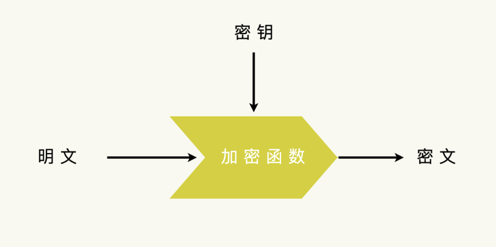
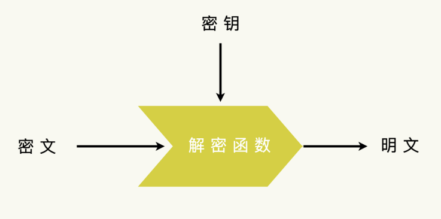
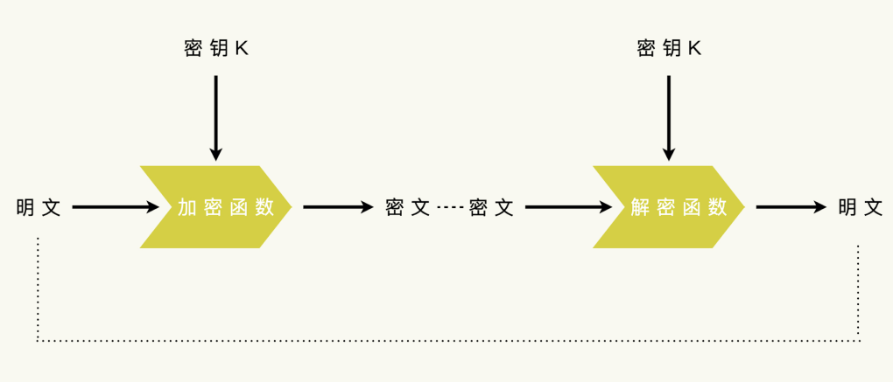
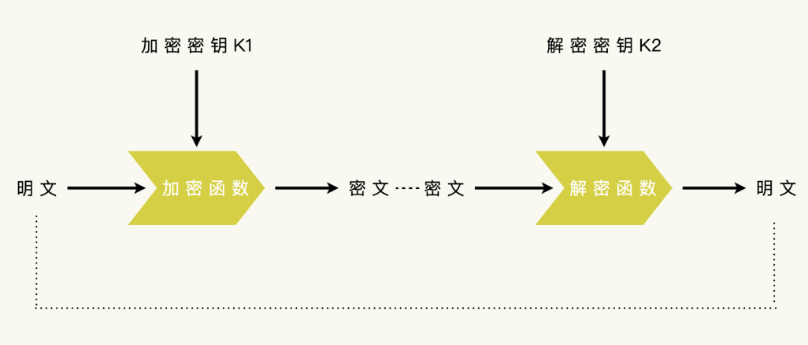
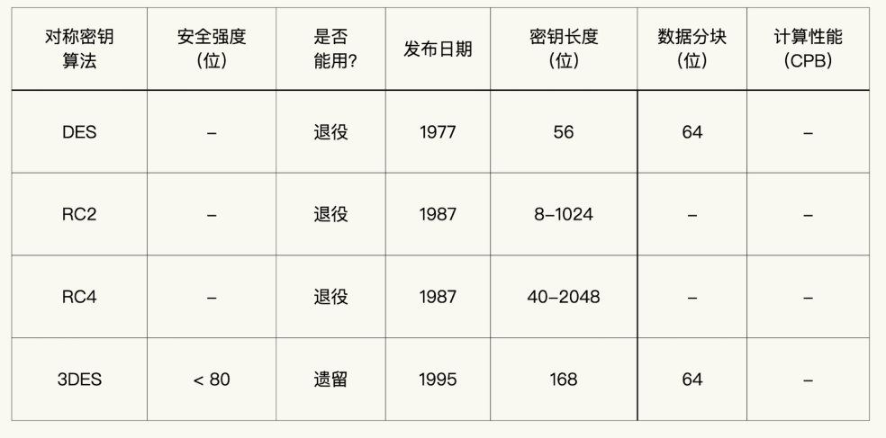
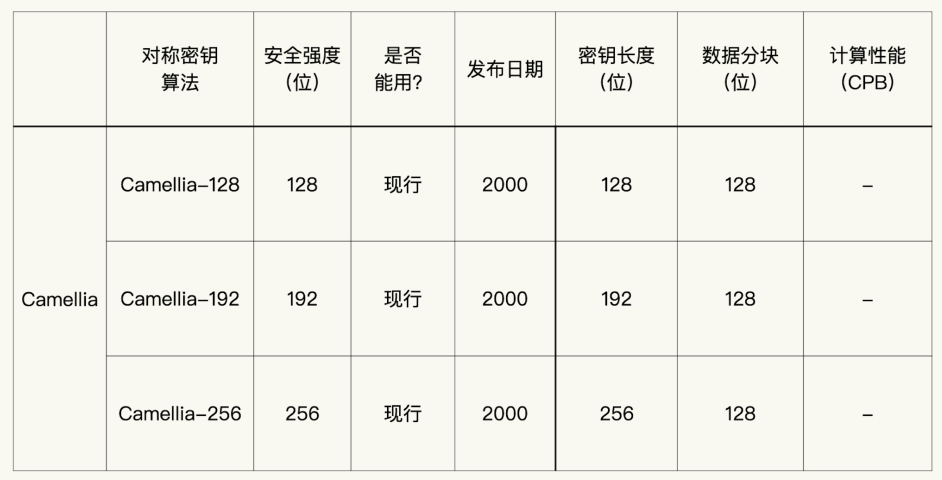
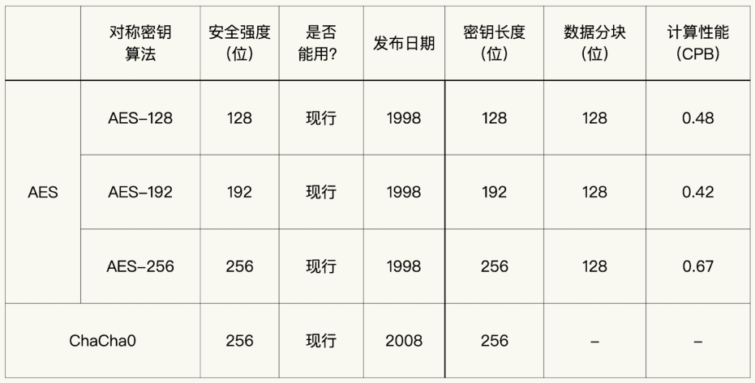
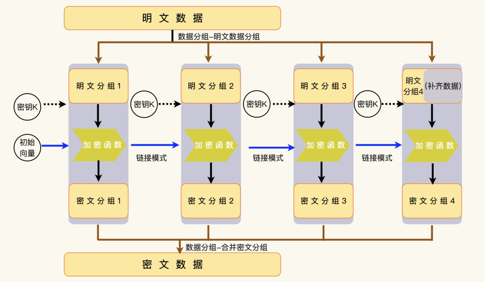
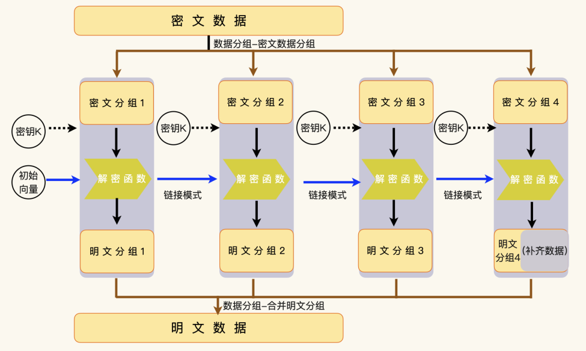

# 对称加密

在讨论对称加密技术之前，我们要先了解加密、解密和密钥这几个概念。

其实这几个概念还是很容易理解的。把信息或者数据伪装、隐藏起来，转换成难以解释的信息或者数据，这个过程叫做**加密**。和加密这个过程相反的过程，就叫做**解密**。

一般来说，加密产生的那个难以解释的信息或者数据，我们把它叫做密文（Ciphertext）。对应的，加密前的数据，我们通常把它叫做明文（Plaintext）。

密文信息通常看起来都是晦涩难懂、毫无逻辑的，所以我们一般会通过传输或者存储密文信息，来保护私密数据。当然，这建立在一个假设基础上：没有经过授权的人或者机器，很难通过密文计算出明文；经过授权的人或者机器，才能够通过密文计算出明文。

那经过授权的人或者机器，是怎样通过密文计算出明文的？对，就是使用密钥。  

在现代密码学里，密钥是在加密和解密运算里，决定运算结果的一段信息。因为，加密要使用密钥把明文信息转换为密文；解密要使用密钥把密文复原为明文。也就是说，加密运算需要两个输入：密钥和明文。  

解密运算也需要两个输入：密钥和密文。  

如果没有密钥，我们就没有办法执行解密运算，也就很难把密文转换成明文。同理，如果只有授权的人或者机器才知道密钥，那么没有授权的人也很难通过密文计算出明文。  

你可能会觉得，密钥太重要了！但现代密码学之前的加密，其实不是这样设计的。  历史上的加密，是没有密钥的。数据的保密性，依赖于算法的保密性。一旦算法被破解，数据也就被破解了。

到了现代密码学，加密数据的安全性就依赖于加密算法的质量和密钥的保密性这两个因素。密钥部分，是私有的部分，需要严格保密；算法部分，变成了公开的部分，要接受公开讨论、评测，接受各种分析和攻击。一个算法，如果在接受了公开的分析、评测和各种各样的攻击之后，还依然被认为是安全的，我们才能说，这个算法的安全性是真的经得起考验的。  

什么是密码分析？密码分析，指的是分析、评测一个密码学算法，有没有安全缺陷和适用场景的限制。如果一个算法，没有人对它展开分析、评测，或者缺少足够的分析，它的安全性很难获得信任。

所以，渐渐地，使用公开的算法是密码学领域的一个基本常识。一个现代密码学算法的安全性，都是基于密钥的保密，而不是算法保密要求。遗憾的是，仍然有很多保密算法的存在和使用。对于这样的使用，我们很难有信心相信它的安全性。  

## 什么是对称密钥

对称密钥，顾名思义，就是每一个参与者都持有相同的密钥，使用相同的密钥。  

非对称密钥，就是指每一个参与者都持有不同的密钥，使用不同的密钥。  

## 如何选择对称密钥算法

## 序列算法和分组算法

不知道你注意到没有，在上面的表格里，RC4 和 ChaCha20 没有数据分块，而 3DES 和 AES 有数据分块。这是因为 RC4 和 ChaCha20 是序列算法，3DES 和 AES 是分组算法。那么，问题来了，序列算法和分组算法有什么不一样的呢？  

为了能够处理任意大小的数据，并且输出结果长度固定，单向散列函数需要对数据进行分组，然后按数据组进行运算。在对称密钥算法里，因为输出结果的长度没有限制，对数据的处理方式，也就有了更多的想象空间。  

如果我们从数据是否分组这个角度考虑，就有两种处理方式。

- 进行数据分组，然后按数据组运算，这就是分组算法；
- 不进行数据分组，按照原始数据的大小进行运算，这就是序列算法。  

那么序列算法的基本思路呢，就是从对称密钥里推导出一段和明文数据相同长度的密钥序列，然后密钥序列和明文进行异或运算得到密文，和密文进行异或运算得到明文。  

序列算法的关键，是怎么从固定长度的对称密钥推导出参与运算的任意长度的密钥序列。一般来说，密钥序列的推导和异或运算都是快速的运算。所以，序列算法通常被认为是更高效的算法。  

由于不需要数据分组，序列算法的安全性主要取决于密钥序列的推导算法，而不用考虑数据分组带来的种种陷阱。对于应用程序而言，这是一个便于使用，不易出错的选择。  

分组算法的安全性，除了算法本身之外，还取决于数据分组的策略。应用程序需要同时指定分组算法和分组策略。对于不太了解密码技术的细节的程序员来说，这实在是一个不小的挑战。  

## 分组算法

分组算法要对输入数据进行分组，然后按数据分组来进行运算。一个典型的分组算法，一般要由三个部分组成，数据分组、分组运算和链接模式。  

我们先来看看数据分组是怎么一回事。

数据分组在加密时，会把明文的输入数据分割成加密函数能够处理的数据块。比如，AES算法能够处理的数据块大小是 128 位，那么，输入数据就要被分割成一个或者多个 128 位的小数据块。  

如果不能整分，就要把最后一个分组补齐成 128 位。这些分组数据的运算结果，组合起来就是密文数据。解密时，执行相反的操作，把补齐数据去掉，再把数据分组组合成完整的明文数据。  

理解了数据分组，我们再来看分组运算和链接模式。  

分组运算，意思就是把每一个明文数据分组通过加密函数，转换成密文数据分组。而链接模式，指的是如何把上一个分组运算和下一个分组运算联系起来。

有一点需要说，第一个分组运算并没有上一个分组运算可以使用，这时候，我们就需要引入一个初始化的数据，来承担“上一个分组运算”向下链接的功能。这个初始化的数据，我们一般称为初始化向量。初始化向量（IV）是一个随机或伪随机的初始值，用于第一个分组的加密。IV 的主要作用是确保相同的明文在不同加密过程中产生不同的密文，从而增加加密的随机性和不可预测性。

那你有没有想过，我们为什么要把上一个分组运算和下一个分组运算联系起来呢？其实，我们在前面讨论过单向散列函数的链接模式，我们说它是为了确保雪崩效应能够延续。

在分组运算里，链接模式也承担类似的功能：不同的明文数据，它的密文数据应该是完全不同的，即使明文数据里包含相同的数据分组。

## 什么影响算法的安全性

现在，我们已经梳理了一遍分组算法的运算过程了。这样，我们就能够在其中找到影响分组算法的关键因素。这些因素，也就是影响分组算法安全性的因素。

在数据分组里，把输入数据分割成固定大小的数据块这一部分，除了数据补齐之外，没有什么变数。所以，我们可以发现，数据补齐方案才是影响分组算法的关键部分。  

这样，我们就不难找出下面的五个因素：  

- 加密函数和解密函数；
- 密钥；
- 初始化向量；
- 链接模式；
- 数据补齐方案。  

## 链接模式

