# 前言

在我看来，汇编语言不单是一门程序设计语言，学习汇编语言指令、掌握汇编语言程序设计的方法和技巧固然重要，但更重要的是，它是面向硬件的语言，天生是为了控制硬件的。因此，一本好的汇编语言教材一定不是单纯地介绍汇编语言本身，它必须是以如何控制处理器和其他外部硬件为主线的，在这个过程中引入汇编指令和硬件原理方面的内容，最终使读者对计算机工作原理的认识达到熟悉其脉络的程度。

以上就是创作本书的初衷。现在看来，这个目标基本上算是达成了。同时，我还有一个意外的收获，那就是，很多读者认为这本书有助于学习操作系统，认为它对理解操作系统非常有帮助，这也算是无心插柳吧。

为什么一本讲汇编语言的书反而成了操作系统课程的前导教材呢？其实仔细想想也不难理解。对于一台计算机来说，处理器是硬件的核心，而操作系统是软件的灵魂。因此，编写操作系统的人和设计处理器的人拥有共同的客户。为了拉住他们共同的客户，取得客户欢心，编写操作系统的人会给设计处理器的人提意见，告诉他们如何改进处理器的设计以方便操作系统和应用软件的开发。处理器的很多指令是为操作系统设计的，它的一些工作模式也是为了给操作系统提供支持，这一点在64位处理器上尤其明显。

# 第1章 十六进制计数法

这部分较为基础，跳过......

# 第2章 计算机和汇编语言

汇编语言和处理器是紧密联系的，学习汇编语言的过程，实际上也是洞悉处理器内部构造和工作方式的过程。用汇编语言编程，必须和处理器内部的寄存器打交道，但很多人（包括我本人）在第一次接触汇编语言时，对这些东西感到很迷惑，不知道什么是寄存器，不理解为什么要使用寄存器。因此，了解处理器的内部构造及其工作方式很重要。

鉴于此，本章的目标是：

1. 从如何用电来表示数字开始，对电子计算机（尤其是处理器）的工作原理和演进过程进行介绍，重点了解什么是寄存器、内存和指令，以及指令集、字节等基本概念；
2. 在上述过程中，我们将了解到使用机器指令编程的缺点和复杂性，从而知道为什么要发明汇编语言，以及用汇编语言编程的好处。

顺便说一下，在写这本书之前，我写过另一本科普读物《穿越计算机的迷雾》，里面把计算机的原理讲清楚了，有兴趣的同学可以看看。

## 寄存器

一般的电路，它们的工作都是非常直接的。一旦我们拉起开关，切断电路，灯泡立马就不亮了，这表明电线上传送的是数字0；相反，一旦我们闭合开关，接通电路，灯泡立马就亮了，这表明电路上传送的是数字1。

后来，人们发明了一个装置，叫作触发器。如图2-5所示，一个特制的触发器有一个输入端D，以及一个输出端Q。触发器的特点是它可以把输入保存起来，这叫作锁存。如果你想用眼睛观察触发器锁存的内容，可以在输出端连接一个灯泡。

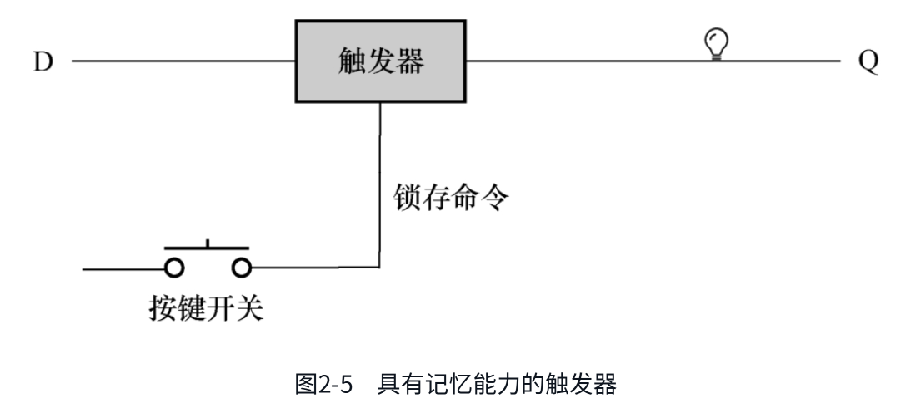

那么，触发器什么时候锁存呢？这是可以控制的。注意下面有一根导线和一个按键开关，按键开关和我们前边讲的那些开关不一样。按键开关有个特点：当你按下它时，它会接通电路；当你松手后，它又会弹起来断开电路。

这个按键开关用于决定是否锁存。平时，按键开关处于断开状态，触发器不会执行锁存动作，无论从输入端D来的是0还是1，都不会进入触发器内部，都不会被触发器内部的电路保存，更不会出现在输出端Q，即不影响输出端Q原来的状态。

但是，一旦我们按下按键开关，则触发器会立即执行一个锁存动作，不管输入端是0还是1，都会被触发器锁存起来，并立即出现在输出端Q。锁存之后，无论输入端D再怎么变化，都不会影响到锁存的内容，也不会影响输出端Q原来的输出，除非再次按下按键开关发送锁存命令。

一个触发器只能保存1比特。为了保存一个比较大的二进制数，如图2-6所示，可以使用若干个触发器，将它们组合在一起，这样就形成了一个新的器件，叫作寄存器(Register)，或者叫作锁存器。

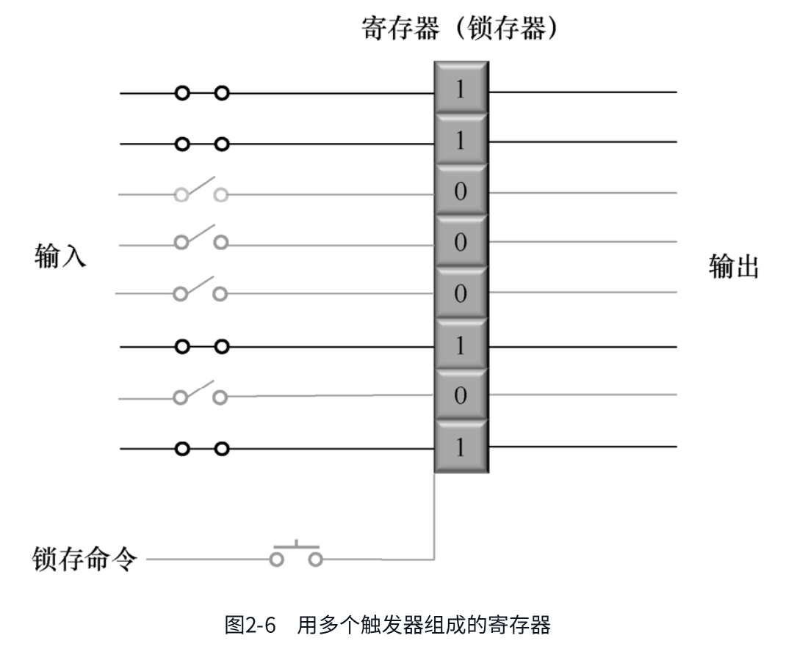

寄存器是一个多输入、多输出的器件，它的两边都连着一排导线，左边的导线用来提供输入，右边的导线用来提供输出；下面的按键开关用来向组成寄存器的所有触发器发送锁存命令。

在图2-6中，输入端是二进制数字11000101。当我们按下按键开关时，这个数字立即被锁存。一旦输入的数字或者说电平被锁存，那么，即使这些输入撤销了也没有关系，因为它们已经被锁存在了寄存器内部。与此同时，锁存的数据也会通过输出端送出去。

如果需要，寄存器可以随时锁存新的数字，以前锁存的数字会被新的数字冲掉。从这个意义上来说，任何数字都是临时被保存在这里的，不会长久，属于临时性寄存。这就是“寄存器”一词的由来。

## 带寄存器的加法机

人类喜欢简单的操作，他们会不停地改进设备。所以，如图2-7所示，这是前面那个加法电路的改进版本。

在这个新的加法电路里，我们加入了一个寄存器。为了方便，我们称之为寄存器R。加法电路的左侧是一排带有开关的导线，用于输入相加的数字；右边的一排导线用于输出计算结果。实际上，在机器内部，右边这排导线连接在寄存器的输出端上。因此，寄存器R当前锁存的内容可以通过灯泡观察到。

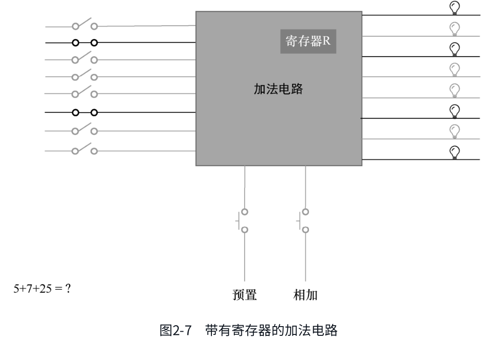

加法电路的另一个变化是，它只有一组输入。这好像是个问题，但实际上这样做是很方便的。在这个电路的下面有两个按键开关，分别是“预置”和“相加”，它们就是用来解决这个问题的。比如说，如果我们要计算5加7加25，该怎么办呢？操作过程是这样的。

首先，拨动左边的一排开关，准备好第一个要相加的数字5，然后按一下“预置”按钮，将这个数字保存到寄存器R。

接着，再次拨动左侧的那排开关，准备好另一个要相加的数字7，然后按一下“相加”按钮。此时，左边的数字7和寄存器R里原有的数字5相加，相加的结果12依然保存在寄存器R中。

因为还有一个数字25需要相加，于是我们再次拨动左侧的那排开关，准备好要相加的数字25，准备好之后，按一下“相加”按钮，此时，左边的数字25和寄存器R里原有的数字12相加，相加的结果37依然保存在寄存器R中。

如果还有更多的数字要加，那么，操作过程和上面一样，反正就是准备数字，然后按一下“相加”开关。

## 能做四则运算的机器

前边我们一直在使用加法机做加法，有些人觉得，只做加法的话，功能太简单了。于是，如图2-8所示，他们改进了这个机器，为它增加了减法、乘法和除法功能。现在，我们称之为四则运算电路。


在这个四则运算电路的下边，有几个按键开关。这几个按键开关用来控制运算器内部的操作，下面我们分别进行说明。

如果按一下“预置”开关，那么，将执行锁存操作，左侧这排开关生成的二进制数被锁存到寄存器R。

如果按一下开关“加”，那么，它所指定的操作是用寄存器R里原有的数字和左侧这排开关生成的数字相加，相加的结果位于寄存器R。

如果按一下开关“减”，那么，它所指定的操作是用寄存器R里原有的数字和左侧这排开关所生成的数字相减，相减的结果位于寄存器R。

如果按一下开关“乘”，那么，它所指定的操作是用寄存器R里原有的数字和左侧这排开关所生成的数字相乘，相乘的结果位于寄存器R。

如果按一下开关“除”，那么，它所指定的操作是用寄存器R里原有的数字和左侧这排开关生成的数字相除，相除的商位于寄存器R。

当然，你会觉得功能还是太少。但是你要知道，绝大多数问题都可以归结为基本的加减乘除运算。比如，3的2次方，可以用3乘以3来完成。其他数学问题也是如此。

这个机器用起来还是很方便的，可以做连续的加减乘除运算。这里有一个实际应用的例子，先给出或者说预置一个数字7，再加8，得到15，然后乘以3，得到结果45，最后除以5，得到9。

首先，我们先拨动左边的开关准备好第一个数字7，然后按一下“预置”按钮，将这个数字保存到寄存器R。

接着，再拨动左侧的开关，准备好另一个数字8，按一下“加”按钮，则寄存器中原有的数字7和左边的数字8相加，相加的结果15依然保存在寄存器R中。

接着，再拨动左侧的开关，准备好另一个数字3，按一下“乘”按钮，则寄存器中原来的数字15和左边的数字3相乘，相乘的结果是45，依然保存在寄存器R中。

最后，再拨动左侧的开关，准备好数字5，按一下“除”按钮，则寄存器中原来的数字45和左边的数字5相除，相除的结果9依然保存在寄存器R中。

寄存器的作用是参与运算，并临时保存运算结果。但是，如果只有一个寄存器，那么，在进行一些复杂的运算时，肯定是不够用的。比如这一道带括号的计算题：(207+9)÷(56-48)

它很简单，但又有点复杂，因为我们必须先计算207+9和56-48的结果，再将这两个计算结果相除。我们来试试看。

首先拨动左侧的开关以生成数字207，然后按一下“预置”按钮，将207锁存到寄存器R中。接着，我们再拨动左侧的开关，生成数字9，然后按一下“加”按钮，这将把寄存器R里的数字207和左侧输入的数字9相加，相加的结果216依然保存在寄存器R中。

现在的问题是，寄存器R被用来保存上一个计算结果，无法再用来计算56减去48。在这种情况下，我们只能把相加的结果216用脑子或者笔记下来，腾出寄存器R，用来计算56减48。

拨动左侧的开关以生成数字56，再按一下“预置”按钮，将56锁存到寄存器R中。接着，我们再拨动左侧的开关，生成数字48，然后按一下“减”按钮，这将把寄存器R里的数字56和左侧的数字48相减，相减的结果8依然保存在寄存器R中。现在，用笔或者你的脑子把结果8记下来。

最后是把前面已经得到的两个中间结果216和8相除。拨动左侧的开关以生成数字216，再按一下“预置”按钮，将216锁存到寄存器R中。接着，我们再拨动左侧的开关，生成数字8，然后按一下“除”按钮，这将把寄存器R里的数字216和左侧的数字8相除，相除的结果27依然保存在寄存器R中。

## 机器指令

从刚才的例子可以看出，因为只有一个寄存器，这使得运算器的功能受到限制，操作也很麻烦。

为此，如图2-9所示，我们可以在运算电路里多放几个寄存器，这样就能够倒腾得过来。为了方便说明问题，我们暂时再加入一个寄存器Z，这样我们就有了两个寄存器。

尽管只是增加了一个寄存器，但是这台机器的操作却复杂了很多。比如，可以将左边的数字传送或者预置到寄存器R中，也可以传送到寄存器Z中；可以将寄存器R中的数字和左边来的数字做加减乘除，也可以将寄存器Z中的数字和外来的数字做加减乘除；可以将寄存器R中的数字传送或者说复制到寄存器Z中，也可以将寄存器Z中的数字传送或者说复制到寄存器R中；可以用寄存器R中的数字和寄存器Z中的数字做加减乘除操作，而且可以选择运算的结果保存在哪一个寄存器。


我粗略地估计了一下，这里共有大约20个动作。对于以上所列举的每个动作或者说每个操作，都需要一个按键开关来触发，所以至少需要20个按键开关。这还只是两个寄存器，如果以后再增加寄存器或者别的功能，开关就更多了。这不是长久之计，我们得另想办法。

考虑一下，既然我们可以用一排开关来生成参与加减乘除的数字，也可以用另一排开关来共同组合出我们要执行的操作。

为此，我们在运算电路的下面安装5个铡刀开关。和往常一样，开关的闭合代表这根线上是1，开关的断开代表这根线上是0，于是可以组合出一个5位的二进制数字。不同的二进制数字具有不同的含义，代表不同的操作。当我们拨动这一排开关时，就是指定这台机器所要执行的操作，因此，我们把这些开关所代表的数字叫作指令(Instruction)。指令就是给这台机器下达的操作命令。表2-1给出了这5个开关可以组合出的指令，以及它们所指定的操作。


那么，什么时候开始执行由开关所形成的指令呢？旁边还有一个按键开关，名字叫“执行”。当我们按下这个开关时，这台机器就按照指令的指示进行相应的操作。

比如，我们将这组开关设置成“开、开、开、关、关”的状态，当按一下“执行”开关时，将执行把寄存器R中的内容复制并传送到寄存器Z中的动作。

那么，现在我们就来用这台新机器计算数学题(207+9)÷(56-48)，看看这个操作过程是怎样的。

首先，拨动左边的开关以生成数字207，接着，拨动下面的“指令”开关，将它们设置成00001，意思是将外数传送到寄存器R中。此时，按一下“执行”开关，这将把左边的207锁存到寄存器R中。

接下来，拨动左边的开关以生成数字9，接着，拨动下面的“指令”开关，将它们设置成00101，意思是，将寄存器R中的数字和外数相加。此时，按一下“执行”开关，这将把寄存器R中的数字207和左边的数字9相加，相加的结果216依然在寄存器R中。

接下来，拨动左边的开关以生成数字56，接着，拨动下面的“指令”开关，将它们设置成00010，意思是，将外数传送到寄存器Z。此时，按一下“执行”开关，这将把左边56锁存到寄存器Z中。

再往下看，我们拨动左边的开关以生成数字48，接着，拨动下面的“指令”开关，将它们设置成01010，意思是，将寄存器Z中的数字和外数相减。此时，按一下“执行”开关，这将把56和48相减，相减的结果8依然在寄存器Z中。

最后，我们拨动下面的“指令”开关，将它们设置成10000，意思是，将寄存器R里的数字和寄存器Z里的数字相除。此时，按一下“执行”开关，这将用寄存器R中的数字216除以寄存器Z中的数字8，相除的商27保存在寄存器R中。

## 内存

通过拨动开关来形成指令，然后让运算器执行指令，这很有创意。但是，随着机器功能的增加，手工操作越来越烦琐，这是肯定的。

考虑一下，当我们拨动开关来组合指令时，和生成一个二进制数没有区别，只不过这些数字实际上是指令，用来指定某个操作。那么，能不能把这些代表指令的二进制数保存到某个容器里，让机器自动按顺序一条一条地取出来执行呢？没有问题，这完全可以。

如图2-10所示，在左边的容器里就保存着一堆代表指令的二进制数，右边的运算器可以一条一条地取出并加以执行。这样的容器，就是我们今天所要讲的内存。内存是由大量的内存单元堆叠而成的，在这里，组成内存的每一个方块都是一个内存单元。

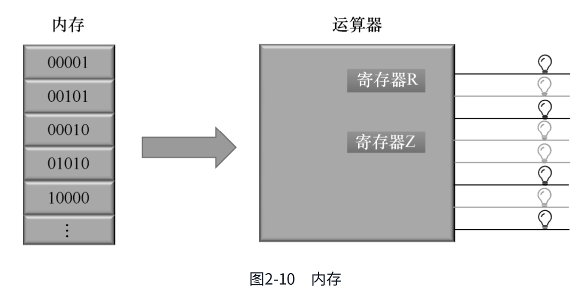

和图2-10不同，在主流计算机的内存里，每个内存单元的长度是8比特，可以保存一个8位的二进制数。比如在图2-11中，最下面的那个内存单元，就存储了一个8比特的二进制数10000101。

内存单元很多，我们如何区分它们呢？答案是，每个内存单元都有一个唯一的编号。第一个单元的编号是0，第二个单元的编号是1，第三个单元的编号是2，后面的单元也依次编号。注意，单元的编号是这个单元在内存里的位置，通常称为地址(Address)。

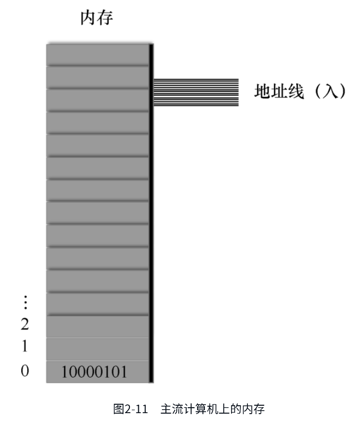

既然内存是由大量的内存单元组成的，那么，如何指定读写的是哪个单元呢？为此，内存使用一排电线，称为地址线，来指定单元的编号。当我们访问某个内存单元时，就通过这排地址线输入单元的编号。显然，地址线的数量决定了我们最多可以访问几个单元。

比如说，如果内存只有两根地址线，这两根线只能组合出4个二进制数，分别是00、01、10和11。这4个二进制数代表着4个地址，因此，只能访问到4个单元。如果用十进制数来表示单元的编号，这几个单元的编号分别是0、1、2和3。

再举个例子，如图2-12所示，如果有8根地址线，那么，这8根地址线可以组合出256个二进制数，分别是00000000、00000001、00000010、…、11111111。这256个二进制数代表着256个地址。所以，8根地址线只能访问256个内存单元。

内存单元的编号就是它的地址，习惯上，我们用十六进制标注在它的左侧。这里，第一个内存单元的地址是00H，最后一个内存单元的地址是FFH。注意，为了整齐划一，地址0被标注为00，地址1被标注为01。这是可以的，在一个数字的前面加0，不会改变它的大小。


推而广之，如果地址线的数量是N，那么，可以通过它访问的内存单元的数量是2的N次方，即$2^N$。

在计算机领域，字节的概念被频繁地使用。习惯上，字节是用来描述二进制序列的长度单位，8比特组成1字节。字节的英语单词是Byte，简写为B。比如，二进制数10001101的长度是1字节；二进制数1101000101111110的长度是2字节。

在主流的计算机上，内存单元的长度是8比特。换句话说，每个内存单元的长度都是1字节。

内存的容量可以用内存单元的数量来统计。因为每个内存单元的长度是1字节，所以经常用字节数来衡量。根据内存的大小，内存的容量是以字节(B)、千字节(KB)、兆字节(MB)、吉字节(GB)和太字节(TB)来标称的，它们之间的换算关系是：

- 1 KB=1024 B；
- 1 MB=1024 KB；
- 1 GB=1024 MB；
- 1 TB=1024 GB。

内存用来保存或者读出数据。为此，如图2-13所示，内存上还需要另一排导线，这排导线叫作数据线。要写入的数据通过数据线进入内存；读出来的数据也通过数据线送到外面。

可以往内存里写数据，也可以从内存里读出数据，读和写统称为“访问”。为了访问内存，还需要一个读写控制线，用来指明是读操作还是写操作。举个例子来说，读写控制线平时没有输入，为0，表示处于随时可以读取的状态；如果它为1，则表明执行的是写入操作。


在写入的时候，我们先在地址线上给出一个地址，在数据线上给出一个要写入的数字，通过读写控制线发出写命令，内存就会把数据线上的数字写入指定的地址。

在读出时，先在地址线上给出一个地址，然后通过读写控制线发出读命令，那么，就会从指定的地址读出数据并送到数据线上。

举个例子来说，假定如图2-13所示的内存有16根地址线，那么，它可以访问65536个内存单元，地址范围是0000H～FFFFH。如果发出的地址是二进制数0000000000000110，那么，由于它等于十六进制的6，所以将选中内存中地址为6的单元。

再假定这个内存有8根数据线，通过数据线输入的是二进制数10001101，并且读写控制线的状态是写入(1)。那么，数据线上的10001101会被写入这个地址为6的单元。

读的时候也是一样，如果地址是6，读写控制线的状态是读(0)，那么，内存单元里的数字就会被送到数据线上。

内存是存储器（Storage或Memory）的一种，而存储器的种类实际上是很多的，包括大家都知道的硬盘和U盘等，甚至寄存器就是存储器的一种。如图2-14所示，我们这里所讲的内存也叫内存条。这个概念是这么来的：首先，它是计算机内部最主要的存储器，所以叫作内存储器或者主存储器，简称内存或主存；其次，它一般被设计成扁平的条状电路板，所以叫内存条。如果你曾经打开过家里的台式计算机，应该见过它。

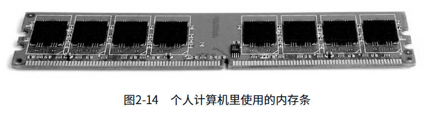

在计算机发展的早期，也就是二十世纪五十年代，受技术限制，制造内存是非常不容易的事，人们使用了能够想到的各种方法，包括磁芯存储器，它用磁场来记录比特0和比特1。具体的原理，请参阅《穿越计算机的迷雾》这本书。

二十世纪七十年代，随着集成电路技术的发展，内存的制造技术也提高了，出现了集成电路存储器。这个时候的内存体积大大缩小，容量大大提高，但以现在的眼光来看还是很小，通常只有几千字节。

到了现在，随着大规模和超大规模集成电路的使用，内存在容量、体积方面都发生了翻天覆地的变化，可以提供几吉字节甚至几十吉字节的存储空间。

## 自动计算

在引入了内存之后，人们对运算器也做了改进。如图2-15所示，经过改进之后的运算器通过地址线、数据线和读/写控制线与内存相连，而且它现在的最大变化是可自主工作，可自动地从内存里面按顺序取指令并执行指令。

为了跟踪每条需要执行的指令，运算器内部有一个指令指针寄存器，这个寄存器保存着指令的地址。刚开始的时候，它的内容是第一条要执行的指令的内存地址。


当运算器开始工作时，它先将指令指针寄存器的内容送到地址线上，这是要执行的第一条指令的地址。然后，运算器通过读/写控制线发出读内存的命令。之后，内存将该地址上的内容放到数据线上。因为现在是取指令阶段，所以，运算器收到数据后，把它当成指令进行译码，然后根据指令的内容做相应的操作，也就是执行指令。

与此同时，指令指针寄存器的内容被修改，修改为下一条指令的地址。问题是，处理器怎么知道下一条指令的地址呢？答案是，它可以根据当前这条指令的地址和长度来计算下一条指令的地址。它怎么知道当前这条指令的长度呢？不同的指令具有不同的功能，也具有固定的长度。最后，在当前指令执行完成后，接着重复以上过程。

来看一个具体的例子。如图2-16所示，内存里已经写入了很多指令，这些指令共同组成了完成(207+9)÷(56-48)这道算术题的步骤和过程，所以叫作“程序”。

第一条指令占用2字节的内存空间，第1字节01101001，被称为操作码，它指定了要进行什么操作。对于这个操作码来说，它指定了所要进行操作是将操作码后面的数字传送到寄存器R中。


操作码后面的数字是11001111，也就是十进制的207。所以，这条指令执行时将207传送到寄存器R中。显然，在这条指令中，被操作的数字，也就是操作数，是直接包含在指令中的，是指令的组成部分。因此，这样的操作数被称为立即数(Immediate)，意思是它是直接包含在指令中的，可以立即从指令中得到。

第二条指令也是2字节，操作码是01001100，指定的操作是将寄存器R中的内容和操作码后面的数字相加，结果依然在寄存器R中。操作码后面的数字00001001，也就是十进制的9。所以，这条指令执行时将寄存器R中的内容和指令中的立即数9相加，结果依然在寄存器R中。

第三条指令也是2字节，操作码是01101010，指定的操作是将操作码后面的数字传送到寄存器Z中。操作码后面的数字00111000，也就是十进制的56。所以，这条指令执行时将指令中立即数56传送到寄存器Z中。

第四条指令也是2字节，操作码是01000100，指定的操作是将寄存器Z中的内容和操作码后面的数字相减，结果依然在寄存器Z里。操作码后面的数字00110000，也就是十进制的48。所以，这条指令执行时将寄存器Z中的内容和指令中的立即数48相减，结果依然在寄存器Z中。

第五条指令只有1字节，操作码是11001010，指定的操作是将寄存器R中的内容和寄存器Z中内容相除，相除的结果依然在寄存器R里。

第六条指令也是2字节，操作码是01110000，指定的操作是将寄存器R中的内容传送到由操作码后面的操作数所指定的内存地址处。操作码后面的数字是00001100，也就是十进制的12。对于当前的操作码来说，这个操作数是一个内存地址。因此，这条指令是将寄存器R中的内容传送到地址为12的内存单元。

地址为12的内存单元是左侧标注为0C的内存单元，因为地址是采用十六进制的，十六进制数0C就是十进制数12。因此，这条指令在执行时，操作数12被当成地址，处理器通过地址线发送给内存，然后把寄存器R中的内容传送到这个地址上的内存单元。

通过和前面的第一条指令进行比较，很容易分清指令中的“立即数”是什么意思。指令执行和操作的对象是数。如果这个数已经在指令中给出了，不需要再次访问内存，那这个数就是立即数，比如第一条指令中的207；相反，如果指令中给出的是地址，真正的数还需要用这个地址访问内存才能得到，那它就不能称为立即数，比如这条指令中的12，它只是一个地址，并不是最终要操作的数字，最终要操作的数字还需要用这个地址再次访问内存才能得到。

运算器一旦开启，它就自动取指令和执行指令。在内存中，有些内容并不是指令。比如在这里，从内存地址0C开始，后面的内容都不是指令。但是，机器在工作时，你插不上手，不可能在它恰好执行到最后一条指令时让它停下来。

因此，最好的办法就是设计一条停机指令，让运算器执行这条指令后自动停止工作并保持停止前状态。在这里，我们的最后一条指令是停机指令，它只有1字节的长度，操作码是11110100。当运算器执行这条指令后，停止工作，我们可以从容地检查程序的执行结果。

## 处理器

以上，我们从加法机讲到全自动的运算器。运算器功能有限，经过一代又一代的反复改进后，它就变成我们现在所说的处理器(Processor)，一些老的图书和教材把它叫作中央处理单元或者干脆称为CPU。

处理器是一台电子计算机的核心，它会在振荡器脉冲的激励下，从内存中获取指令，并发起一系列由该指令所定义的操作。当这些操作结束后，它接着再取下一条指令。在通常情况下，这个过程是连续不断、循环往复的。大体上，如图2-17所示，处理器由总线接口部件、控制部件和指令执行部件组成。

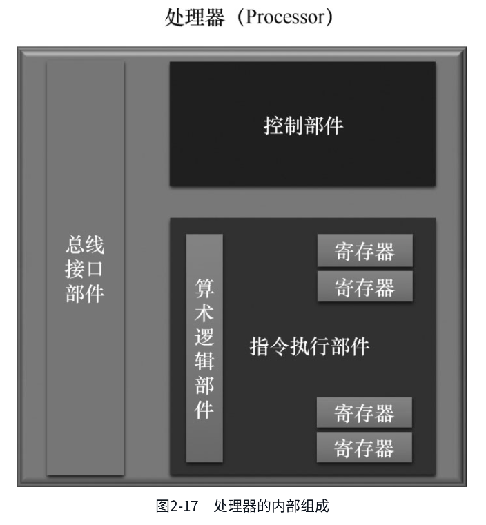

总线接口部件负责同外部的地址线和数据线进行连接，发送地址信号给内存或者其他外部设备，和内存或者其他外部设备交换（发送或者接受）数据，等等。

指令执行部件负责执行指令，它包含了很多寄存器，这些寄存器用于参与算术逻辑运算，并临时保存运算结果。指令执行部件的核心是算术逻辑部件(Arithmetic Logic Unit, ALU)，算术运算和逻辑运算在这里进行。

控制部件负责协调和控制整个处理器的运行状态，什么时候取指令，什么时候输出地址，什么时候发送数据，什么时候接收数据，什么时候执行指令，都由它负责协调。

1947年，美国贝尔实验室的肖克利和同事们一起发明了晶体管。1958年，也许是受够了在一大堆晶体管里连接那些杂乱无章的导线，另一个美国人杰克·基尔比发明了集成电路。接着，1971年，在为日本人设计计算器过程中，INTEL的弗德里科·法金灵机一动，他想，能不能把运算功能和控制功能集成到一起，设计一款可以自动取指令并执行指令的芯片呢？于是他发明了第一款处理器INTEL 4004，如图2-18所示。

紧接着，INTEL又推出了8088和划时代的产品8086。4004是4位的处理器，8008是8位的处理器，而8086是16位的处理器。


**8086是一款划时代的产品，应用非常广泛。虽然INTEL的处理器越来越先进，但它的x86系列一直保持对8086的兼容性。在本书的前半部分，我们主要针对8086进行讲解。**

那么，处理器的位数是什么意思呢？4位的处理器拥有4位的寄存器和算术逻辑部件；8位的处理器拥有8位的寄存器和算术逻辑部件；16位的处理器拥有16位的寄存器和算术逻辑部件；32位的处理器拥有32位的寄存器和算术逻辑部件；64位的处理器拥有64位的寄存器和算术逻辑部件。可以肯定的是，位数越多，寄存器就可以保存更大的数字，算术逻辑部件就可以在单次计算中使用更大的数字并产生更大的结果。

**在8086之后，INTEL又生产了80286和80386。80386又是一款划时代的产品，深刻地影响了后续的处理器设计。本书的后半部分是以80386为基础讲解的。**

在后来的岁月里，INTEL又推出了更多型号的处理器，这些处理器根据应用领域的不同，发展出多个分支来。图2-19中的这一款处理器名字叫i3-3220，左边是它的正面，右边是它的反面。这些密密麻麻的圆点是它的引脚，用来连接地址线、数据线和读/写控制线。

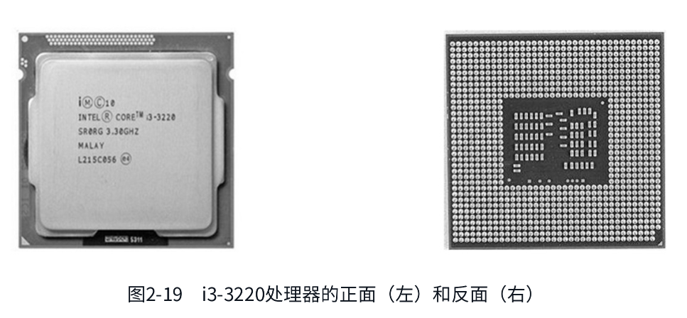

处理器的工作是自动取指令并执行指令。对于任何一款处理器来说，它可以识别哪些指令，是在设计和制造的时候就已经决定了的。**任何一款处理器，它可以识别的所有指令的集合，叫作这款处理器的指令集。**

几十年前，处理器的指令集很小，通常只有十几种或者几十种指令。随着技术的发展，处理器的功能大大增强了，指令集也扩展了。现在的处理器，指令集可以包含几百甚至上千种指令。

**对于任何一款处理器来说，它所包含的指令都可以分为以下几种：算术运算指令、逻辑运算指令、数据传送指令和处理器状态控制指令。**

算术运算指令和逻辑运算指令是最基本的，也最容易理解。数据传送指令在处理器内部的寄存器之间、处理器和内存之间、处理器和外围设备之间传送数据。这些外围设备包括我们常见的显示设备、存储设备（如硬盘）、打印机、鼠标、键盘等。通过和外部设备的数据交换，计算机的功能也变得丰富起来。比如，我们现在可以在显示器上显示文本和图形，于是产生了Windows和Linux这样的操作系统，可以使用键盘输入文字，进一步地，我们可以用计算机写文档、聊天、购物、玩游戏、看视频。

处理器状态控制指令用于控制处理器内部的工作模式和运行状态，如电源管理、程序的权限管理等。本书后面所要讲的保护模式，也是由这些指令来切换的。

## 汇编语言的诞生

我们说过，在内存里写入一些代表特定操作的二进制数（或者说指令），这个过程叫作编程(Programming)。为了给计算机编程，人们最早用的是开关和跳线。

如图2-20所示，(a)是用开关编程的机器；(b)是用跳线编程的机器。一排开关代表一个二进制数或者指令，每个开关代表这个二进制数或者指令的某比特，开关的断开与闭合代表着该比特是0还是1，跳线也是如此。


紧接着，为了方便，人们发明了纸带和纸带阅读机，图2-20(c)就是纸带的一个片段。纸带就是一卷长长的纸条，人们在纸带上打孔，有孔和无孔代表1和0。编写程序时，人们将指令的二进制形式打成孔，然后由纸带阅读机转换成二进制写入内存，最后由处理器执行。处理器执行的结果也可以在纸带上打孔来呈现。

图2-21显示了一个典型的场景：我们在Windows操作系统上的文本编辑器里用键盘输入文本，并且看起来好像在用二进制编程。如果这真的是在用二进制编程，那么，这将是非常抽象、非常痛苦的，难以理解，容易出错。

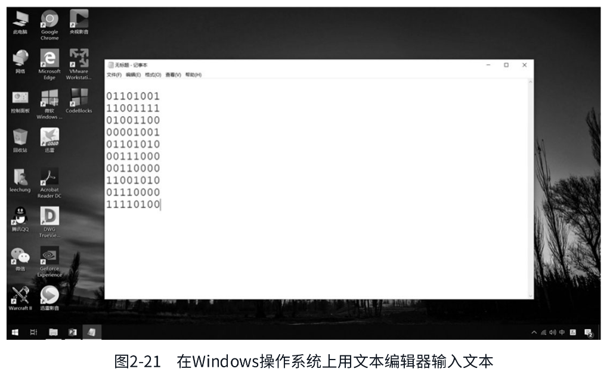

为了减轻程序员的负担，人们发明了汇编语言(Assembly Language)。汇编语言使用文本符号来代表处理器指令，由于和人类的自然语言比较接近，所以很容易看懂，也很容易书写。如图2-22所示，这是在Windows操作系统上用文本编辑器编写汇编语言程序。

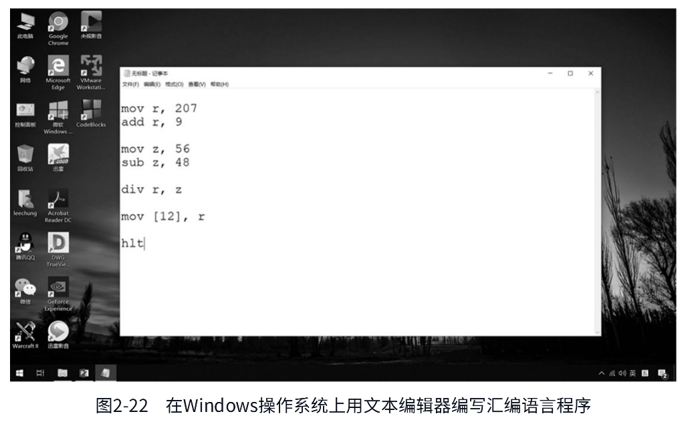

其中`mov r,207`意思是把指令中的立即数207传送到寄存器r中；`add r,9`意思是用寄存器r中的数字和指令中的立即数9相加，结果回送到寄存器r中；`mov z,56`意思是把指令中的立即数56传送到寄存器z中；`sub z,48`意思是用寄存器z中的数字和指令中的立即数48相减，结果回送到寄存器z中；`div r,z`意思是用寄存器r中的数字除以寄存器z中的数字，商回送到寄存器r；`mov [12],r`意思是，将寄存器r中的数字传送到地址为12的内存单元里去；`hlt`意思是停机。

用汇编语言书写的程序只是一些文本和符号，我们人类能看懂，但处理器是不可能看懂的。为此，需要把汇编语言程序转换为包含了处理器指令的程序。

如图2-23所示，这个转换过程是由一个汇编程序来进行的。汇编程序也是人类编写的程序。可以想到，世界上第一个汇编程序肯定是用处理器指令编写的。


汇编程序执行翻译过程，将汇编语言程序转换为包含了处理器指令的程序，也就是将文本符号转换为二进制的机器指令，转换后的结果是一个包含了处理器指令的程序，这个程序可以提交给处理器执行。

在后面的章节中，我们将看到这个从编写到翻译，再到执行的过程是怎样一步一步地进行的，当然，我们的重点依然是在汇编语言和指令上。

# 第3章 分段机制和逻辑地址

鉴于汇编语言和处理器之间的紧密关系，学习汇编语言的过程，实际上也是洞悉处理器内部构造和工作方式的过程。

在本章中，我们要借助一款早已淘汰的处理器INTEL 8086来了解x86汇编语言编程的基本环境。不要小看这款处理器，它是整个INTEL x86处理器家族的起点和基础。本章的目标是：

1. 了解INTEL 8086处理器的通用寄存器和段地址加偏移地址的内存访问方式；
2. 了解分段机制对程序重定位的好处；
3. 理解INTEL 8086处理器内存分段的本质，充分认识到这种分段机制的灵活性。

## 寄存器和字长

为什么处理器能够自动计算，这个问题已经在第2章里做了介绍。处理器的工作依赖其内部的寄存器。早期的处理器，它的寄存器只能保存4比特、8比特或16比特，分别叫作4位、8位和16位寄存器。现在的处理器，寄存器一般都是32位、64位甚至更多。

如图3-1所示，8位寄存器可以容纳8比特，或者说1字节。为了方便，我们还要为该字节的每一位编上号，编号是从右往左进行的，从0开始，分别是0、1、2、3、4、5、6、7。在这里，位0（第1位）是最低位，在最右边；位7（第8位）是最高位，在最左边。


为了更好地理解上面这些概念，图3-1假定8位寄存器里存放的是二进制数10001101，即十六进制的8D。这时，它的最低位和最高位都是1。

**在第2章里我们提到了处理器的位数，它是指寄存器和算术逻辑部件的数据宽度，这个宽度也叫作处理器的字长。**因此，8位处理器、16位处理器、32位处理器和64位处理器的字长也分别是8位、16位、32位和64位。

16位寄存器可以存放2字节，这称为1个字(word)，各个比特的编号分别是0～15，其中0～7是低字节，8～15是高字节。

32位寄存器可以存放4字节，这称为1个双字(double word)，各个数位的编号分别是0～31，其中，0～15是低字，16～31是高字。

尽管图中没有画出，但是64位寄存器可以容纳更多的比特，也就是8字节，或者4个字，简称四字(quad word)。位数越多，寄存器所能保存的数越大，这是显而易见的。

## 内存访问和字节序

如图3-2所示，和寄存器不同，内存用于保存更多的比特。对于用得最多的个人计算机来说，内存按字节来组织，单次访问的最小单位是1字节，这是最基本的存储单元。如图3-2所示，每个存储单元中，各位的编号分别是0～7。


内存中的每字节都对应着一个地址，如图3-2所示，第1字节的地址是0000H，第2字节的地址是0001H，第3字节的地址是0002H，其他依次类推。注意，图中采用的是十六进制表示法。作为一个例子，因为这个内存的容量是65536字节，所以最后一字节的地址是FFFFH。

为了访问内存，处理器需要给出一个地址。访问包括读和写，为此，处理器还要指明，本次访问是读还是写。如果是写，还要给出待写入的数据。

处理器在工作时，需要在内存和寄存器之间交换数据。尽管内存的最小组成单位是字节，但是，经过精心的设计和安排，它能够按字节、字、双字和四字进行访问。换句话说，仅通过单次访问就能处理8位、16位、32位或者64位的二进制数。注意，这里说的是单次访问，而不是一个一个地取出各字节，然后加以组合。

如图3-2所示，处理器发出字长控制信号，以指示本次访问的字长是8、16、32还是64。如果字长是8，而且给出的地址是0002H，那么，本次访问只会影响到内存的1字节；如果字长是16，给出的地址依然是0002H，那么实际访问的将是地址0002H处的一个字。对于INTEL处理器来说，如果访问内存中的一个字，那么，它规定高字节位于高地址部分，低字节位于低地址部分，这称为低端字节序(Little Endian)。因此，低8位在0002H中，高8位在0003H中。至于其他公司的处理器，则可能情况正好相反，称为高端字节序。

## 古老的INTEL 8086处理器

任何时候，一旦提到INTEL公司的处理器，就不能不说8086。8086是INTEL公司第一款16位处理器，诞生于1978年，所以说它很古老。但是，在INTEL公司的所有处理器中，它占有很重要的地位，是整个INTEL 32位架构处理器(IA-32)的开山鼻祖。

首先，最重要的一点是，它是一款非常成功的产品，设计先进，功能很强，卖得很好。

其次，8086的成功使得市场上出现了大量针对它开发的软件产品。这样，当INTEL公司要设计新的处理器时，它不得不考虑兼容性的问题。要使得老的软件也能在新的处理器上很好地运行，必须要具备指令集和工作模式上的兼容性和一致性。INTEL公司很清楚，如果新处理器和老处理器不兼容，那么，新处理器越多，它扔掉的拥趸也就越多，要不了多久，这公司就不用再开了。

### 8086的通用寄存器

如图3-3所示，8086处理器内部有8个16位的通用寄存器，都是由16比特组成的，并分别被命名为AX、BX、CX、DX、SI、DI、BP、SP。“通用”的意思是，它们之中的大部分都可以根据需要用于多种目的。

因为这8个寄存器都是16位的，所以通常用于进行16位的操作。比如，可以在这8个寄存器之间互相传送数据，它们之间也可以进行算术逻辑运算；也可以在它们和内存单元之间进行16位的数据传送或者算术逻辑运算。


同时，如图3-3所示，这8个寄存器中的前4个，即AX、BX、CX和DX，又各自可以拆分成两个8位的寄存器来使用，总共可以提供8个8位的寄存器AH、AL、BH、BL、CH、CL、DH和DL。这样一来，当需要在寄存器和寄存器之间，或者寄存器和内存单元之间进行8位的数据传送或者算术逻辑运算时，使用它们就很方便。

将一个16位的寄存器当成两个8位的寄存器来用时，对其中一个8位寄存器的操作不会影响到另一个8位寄存器。举个例子来说，当你操作寄存器AL时，不会影响到AH中的内容。

如图3-3所示，以寄存器AX为例，它可以分成两个独立的寄存器AH和AL。寄存器AX有16比特，但是，位0到位7这8比特属于寄存器AL；位8到位15这8比特属于寄存器AH。因此，我们说，寄存器AH是寄存器AX的高字节部分；寄存器AL是寄存器AX的低字节部分。同时，寄存器AX的内容也是由寄存器AH的内容和寄存器AL的内容组合而成的。

如果寄存器AH的内容是00111110(3EH)，寄存器AL的内容是00101111(2FH)，那么，寄存器AX的内容就是0011111000101111(3E2FH)。

接着，如果我们改变了寄存器AH的内容，将它修改成00000000(00H)，那么，这对寄存器AL没有任何影响，还是00101111(2FH)。但是，寄存器AX的内容也跟着改变，变成0000000000101111(002FH)。

最后，如果我们改变了寄存器AL的内容，将它修改成01011010(5AH)，那么，这对寄存器AH没有任何影响，还是00000000(00H)，但是寄存器AX的值也跟着改变，变成0000000001011010(005AH)。

### 程序的重定位难题

我们知道，处理器的设计者用某些数字来指示处理器所进行的操作，这些数字代表指令，或者叫机器指令，因为只有处理器才认得它们。指令是集中存放在内存里的，一条接着一条，处理器的工作是自动按顺序取出并加以执行。处理器内部有寄存器和算术逻辑部件，还有控制器部件，控制器部件“分析”一条条指令，然后确定在哪个时间点让哪些部件进行工作。

对于INTEL x86处理器来说，指令的长度不定，短的指令仅有1字节，而长的指令则有可能达到15字节。在内存中，指令和非指令的普通二进制数是一模一样的，在组成内存的电路中，都是一些高、低电平的组合。因为处理器是自动按顺序取指令并加以执行的，在指令中混杂了非指令的数据会导致处理器不能正常工作。为此，指令和数据要分开存放，分别位于内存中的不同区域，或者说各自形成一个段(Segment)，分别叫代码段和数据段。

注意，我们并没有改变内存的物理性质，并不是真的把它分成几块。段的划分是逻辑上的，从本质上来说，是如何看待和组织内存中的数据。

段在内存中的位置并不重要，因为处理器是可控的，我们可以让它从内存的任何位置开始取指令并加以执行。这里有一个例子，如图3-4所示，我们有一大堆数字，现在想把它们加起来求出总和。


假定我们有16个数要相加，这些数都是16位的二进制数，分别是0005H、00A0H、00FFH、…。为了让处理器把它们加起来，我们应该先在内存中定义一个数据段，将这些数字写进去。数据段可以起始于内存中的任何位置，既然如此，我们将它定在0100H处。这样一来，第一个要加的数位于地址0100H，第二个要加的数位于地址0102H，最后一个数的地址是011EH。

一旦定义了数据段，我们就知道了每个数的内存地址。然后，紧挨着数据段，我们从内存地址0120H处定义代码段。严格地说，数据段和代码段是不需要连续的，但这里把它们挨在一起更自然一些。为了区别数据段和代码段，我们使用了不同的底色。

代码段是从内存地址0120H处开始的，第一条指令是A1 00 01。其中，A1是操作码，意思是从指定的内存地址处取出一个字，传送到寄存器AX；后面的00 01是采用低端字节序存放的数字0100H，代表一个内存地址。所以这条指令的功能是将内存单元0100H里的字传送到寄存器AX。指令执行后，AX的内容为0005H。

第二条指令是03 06 02 01，其中，03 06是操作码，02 01是采用低端字节序存放的数字0102H，这条指令的功能是将AX中的内容和内存单元0102H里的字相加，结果在AX中。由于AX的内容为0005H，而内存地址0102H里的数是00A0H，这条指令执行后，AX的内容为00A5H。

第三条指令是03 06 04 01，其中，03 06是操作码，04 01是采用低端字节序存放的数字0104H，这条指令的功能是将AX中的内容和内存单元0104H里的字相加，结果在AX中。此时，由于AX里的内容是00A5H，内存地址0104H里的数是00FFH，本指令执行后，AX的内容为01A4H。

后面的指令没有列出，但和前2条指令相似，依次用AX的内容和下一个内存单元里的字相加，一直到最后，在AX中得到总的累加和。在这个例子中，我们没有考虑寄存器AX容纳不下结果的情况。当累加的总和超出了AX所能表示的数的范围（最大为FFFFH，即十进制的65535）时，就会产生进位，但这个进位被丢弃。

在内存中定义了数据段和代码段之后，我们就可以命令处理器从内存地址0120H处开始执行。当所有的指令执行完后，就能在寄存器AX中得到最后的结果。看起来没有什么问题，一切都很完美，不是吗？那本节标题中所说的难题又从何而来呢？

这里确实有一个难题。

在前面的例子中，所有在执行时需要访问内存单元的指令，使用的都是真实的内存地址。比如A1 00 01，这条指令的意思是从地址为0100H的内存单元里取出一个字，并传送到寄存器AX中。这里，0100H是一个真实的内存地址，又称物理地址。

整个程序（包括代码段和数据段）在内存中的位置，是由我们自己定的。我们把数据段定在0100H，把代码段定在0120H。

问题是，大多数时候，整个程序（包括代码段和数据段）在内存中的位置并不是我们能够决定的。请想一想你平时是怎么使用计算机的，你所用的程序，包括那些用来调整计算机性能的工具、小游戏、音乐和视频播放器等，都是从网上下载的，位于你的硬盘、U盘或光盘中。即使有些程序是你自己编写的，那又如何？当你双击它们的图标，使它们在Windows里启动之前，内存已经被塞了很多东西，就算你是刚刚打开计算机，Windows自己已经占用了很多内存空间，不然的话，你怎么可能在它上面操作呢？

在这种情况下，你所运行的程序，在内存中被加载的位置是完全随机的，哪里有空闲的地方，它就会被加载到哪里，并从那里开始被处理器执行。所以，前面那段程序不可能恰好如你所愿，被加载到内存地址0100H，它完全可能被加载到另一个不同的位置，如1000H。但是，同样是那个程序，一旦它在内存中的位置发生了改变，灾难就出现了。

如图3-5所示，因为程序现在是从内存地址1000H处被加载的，所以，数据段的起始地址为1000H。这就是说，第一个要加的数，其地址为1000H，第二个则为1002H，其他依次类推。代码段依然紧挨着数据段之后，起始地址相应地是1020H。


只要所有的指令都是连续存放的，代码段位于内存中的什么地方都可以正常执行。所以，处理器可以按你的要求，从内存地址1020H处连续执行，但结果完全不是你想要的。

请看第一条指令A1 00 01，它的意思是从内存地址0100H处取得一个字，将其传送到寄存器AX中。但是，由于程序刚刚改变了位置，它要取的那个数，现在实际上位于1000H，它取的是别人地盘里的数！

这能怪谁呢？发生这样的事情，是因为我们在指令中使用了绝对内存地址（物理地址），这样的程序是无法重定位的。为了让你写的程序在卖给别人之后，可以在内存中的任何地方正确执行，就只能在编写程序的时候使用相对地址或者逻辑地址，而不能使用真实的物理地址。当加载程序时，这些相对地址还要根据程序实际被加载的位置重新计算。

在任何时候，程序的重定位都是非常棘手的事情。当然，也有好几种解决的办法。在8086处理器上，这个问题特别容易解决，因为该处理器在访问内存时使用的是段地址和偏移地址，也就是逻辑地址，而不是物理地址。

### 逻辑地址

从传统的视角来看，内存的组织是线性的，是一个由大量内存单元组成的序列，就像长长的纸条。每个内存单元都有自己的物理地址，它是相对于内存起始处的绝对位置。但是请想象一下，如果我们把内存从逻辑上划分为若干部分，也就是分成段，会怎样呢？

如图3-6所示，根据需要，段可以开始于内存中的任何位置，比如图中的内存地址A532H处，这个起始地址就是段地址。

段的长度不是固定的。图3-6中的这个段包含了6个存储单元。在分段之前，这些单元在整个内存空间里的物理地址分别是A532H、A533H、A534H、A535H、A536H、A537H。但是，在分段之后，它们的地址可以只相对于自己所在的段。这样，它们相对于段开始处的距离分别为0、1、2、3、4、5，这叫作段内偏移，或者叫偏移地址。

**于是，当采用分段策略之后，一个内存单元的地址实际上就可以用“段:偏移”或者“段地址:偏移地址”来表示，这就是通常所说的逻辑地址。**比如，在图3-6中，段内第1个存储单元的地址为A532H:0000H，第3个存储单元的地址为A532H:0002H，而本段最后一个存储单元的地址是A532H:0005H。

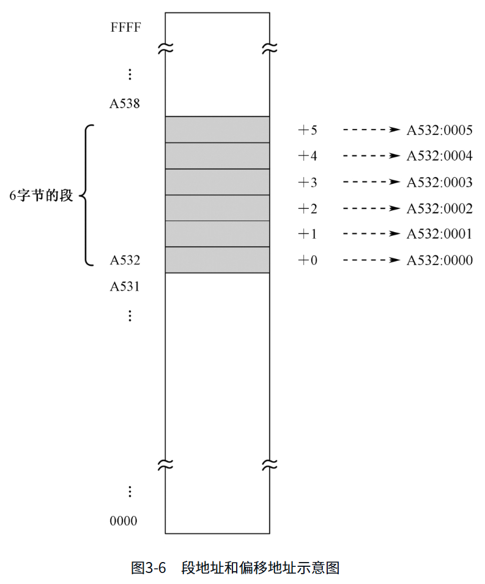

为了在硬件一级提供对“段地址:偏移地址”内存访问模式的支持，处理器至少要提供两个段寄存器，分别是代码段寄存器(Code Segment, CS)和数据段寄存器(Data Segment, DS)。

对代码段寄存器CS的改变将导致处理器从新的代码段开始执行。同样，在开始访问内存中的数据之前，也必须首先设置好数据段寄存器DS，使之指向数据段。

除此之外，**最重要的是，当处理器访问内存时，它把指令中指定的内存地址看成段内的偏移地址，而不是物理地址。**这样，一旦处理器遇到一条访问内存的指令，它将把DS中的数据段起始地址和指令中提供的段内偏移相加，来得到访问内存所需要的物理地址。（这需要编译时对指令中的内存地址进行处理）

如图3-7所示，代码段的段地址为1020H，数据段的段地址为1000H。在代码段中有一条指令A1 02 00，它的功能是将地址0002H处的一个字传送到寄存器AX中。在这里，处理器将0002H看成段内的偏移地址，段地址在DS中，应该在执行这条指令之前就已经用别的指令传送到DS中了。

当执行指令A1 02 00时，处理器将把DS中的内容和指令中指定的偏移地址0002H相加，得到1002H。这是一个物理地址，处理器用它来访问内存，就可以得到所需要的数00A0H。

如果下次执行这个程序时，代码段和数据段在内存中的位置发生了变化，只要把它们的段地址分别传送到CS和DS，它也能够正确执行。


### 8086的内存分段机制

前面讲了如何从逻辑地址转换到物理地址，以使程序的运行和它在内存中的位置无关。这种策略在很多处理器中得到了支持，包括8086处理器。但是，由于8086自身的局限性，它的做法还要复杂一些。

如图3-8所示，8086内部有8个16位的通用寄存器，分别是AX、BX、CX、DX、SI、DI、BP、SP。其中，前4个寄存器中的每个寄存器都还可以当成2个8位的寄存器来使用，分别是AH、AL、BH、BL、CH、CL、DH、DL。


在进行数据传送或者算术逻辑运算的时候，使用算术逻辑部件(ALU)。比如，将AX的内容和CX的内容相加，结果仍在AX中，那么，在相加的结果返回到AX之前，需要通过一个叫数据暂存器的寄存器中转。

处理器能够自动运行，这是控制器的功劳。为了加快指令执行速度，8086内部有一个6字节的指令预取队列，在处理器忙着执行那些不需要访问内存的指令时，指令预取部件可以趁机访问内存预取指令。这时，多达6字节的指令流可以排队等待解码和执行。

8086内部有4个段寄存器。其中，CS是代码段寄存器，DS是数据段寄存器，ES是附加段(Extra Segment)寄存器。附加段的意思是，它是额外赠送的礼物，当需要在程序中同时使用两个数据段时，DS指向一个，ES指向另一个。可以在指令中指定使用DS和ES中的哪一个，如果没有指定，则默认使用DS。SS是栈段(Stack Segment)寄存器，以后会讲到，而且非常重要。

**IP是指令指针(Instruction Pointer)寄存器，它只和CS一起使用，而且只有处理器才能直接改变它的内容。当一段代码开始执行时，CS保存代码段的段地址，IP则指向段内偏移。这样，由CS和IP共同形成逻辑地址，并由总线接口部件变换成物理地址来取得指令。然后，处理器会自动根据当前指令的长度来改变IP的值，使它指向下一条指令。**

当然，如果在指令的执行过程中需要访问内存单元，那么，处理器将用DS的值和指令中提供的偏移地址相加，来形成访问内存所需的物理地址。

8086的段寄存器和IP寄存器都是16位的，如果按照原先的方式，把段寄存器的内容和偏移地址直接相加来形成物理地址的话，也只能得到16位的物理地址。麻烦的是，8086却提供了20根地址线。换句话说，它提供的是20位的物理地址。

提供20根地址线的原因很简单，16位的物理地址只能访问64KB的内存，地址范围是0000H～FFFFH，共65536字节。这样的容量，即使在那个年代，也显得捉襟见肘。

所以，65536字节就是64KB，**而20位的物理地址则可以访问多达1MB的内存，地址范围从00000H到FFFFFH**。问题是，16位的段地址和16位的偏移地址相加，只能形成16位的物理地址，怎么得到这20位的物理地址呢？

有些内存地址的十六进制形式是以0结尾的，如00000H、00010H、00010H、00020H、A0000H、FFFF0H等。如果我们将这些地址末尾的0去掉，剩下的部分就可以放到段寄存器里了，将来恢复段的物理地址时，只需要添加一个0就可以了。

给定一个以0结尾的内存地址，如3C7F0H，将它末尾的0去掉，剩下一个16位的部分3C7FH，这相当于将段的物理地址除以16(10H)，也相当于将这个地址的二进制形式整体右移4位。

将3C7F0H除以16，得到一个十六进制的结果3C7FH，这很容易理解。至于右移4位，是这样的：3C7F0H的二进制形式为00111100011111110000，右移4位的意思是将所有比特同时向右移动4次。移动之后，最右边的4比特被挤掉，结果是一个16位的二进制数0011110001111111，换算成十六进制是3C7FH。

显然，在8086系统中，由于段寄存器长度的限制，段不能起始于任意位置，也不是所有内存地址都可以作为段地址，**段只能起始于那些能够被16整除的物理内存地址**。对8086处理器来说，将这样的内存地址除以16或者右移4位，得到的结果就是逻辑段地址，简称段地址。要访问一个段，需要将段地址传送到段寄存器。

反过来，在用段寄存器的内容访问内存时，只需要在其十六进制形式的内容后面加0，就可以还原到原先的20位物理地址，这相当于乘以16，或者左移4位。如果段地址是3C7FH，它的二进制形式为0011110001111111。左移4位的意思是将所有比特同时向左移动4次，右边空出来的位置用4个0填充。因此，结果是一个16位的二进制数00111100011111110000，换算成十六进制是3C7F0H，这就是段的物理地址。

**处理器访问内存时，光有段地址不行，还需要有偏移地址，它们共同组成了逻辑地址，而且处理器的总线接口部件负责把逻辑地址转换为物理地址。**8086处理器在形成物理地址时，先将段寄存器的内容乘以16或者左移4位，形成20位的段地址，然后再同16位的偏移地址相加，得到20位的物理地址。比如，对于逻辑地址F000H:052DH，处理器在形成物理地址时，将段地址F000H左移4位，变成F0000H，再加上偏移地址052DH，就形成了20位的物理地址F052DH。

这样，因为段寄存器是16位的，在段不重叠的情况下，最多可以将1MB的内存分成65536个段，段地址分别是0000H、0001H、0002H、0003H，…，FFFFH。在这种情况下，如图3-9所示，每个段正好16字节，偏移地址从0000H到000FH。

同样在不允许段之间重叠的情况下，每个段的最大长度是64KB，因为偏移地址也是16位的，从0000H到FFFFH。在这种情况下，1MB的内存，最多只能划分成16个段，每段长64KB，段地址分别是0000H、1000H、2000H、3000H，…，F000H。

以上所说的只是两种最典型的情况。在通常情况下，段地址的选择取决于内存中哪些区域是空闲的。举个例子来说，假如从物理地址00000H开始，一直到82251H处都被其他程序占用着，而后面一直到FFFFFH的地址空间都是自由的，那么，你可以从物理内存地址82251H之后的地方加载你的程序。


接着，你的任务是定义段地址并设置处理器的段寄存器，其中最重要的是段地址的选取。因为偏移地址总是要求从0000H开始，而82260H是第一个符合该条件的物理地址，它恰好对应着逻辑地址8226H:0000H，符合偏移地址的条件，所以完全可以将段地址定为8226H。

但是，举个例子来说，如果你从物理内存地址82255H处加载程序，由于它根本无法表示成一个偏移地址为0000H的逻辑地址，所以不符合要求，段不能从这里开始划分。这里面的区别在于，82260H可以被16(10H)整除，而82255H不能。通过这个例子可以看出，8086处理器的逻辑分段，起始地址都是16的倍数，这称为是按16字节对齐的。

**段的划分是自由的，它可以起始于任何16字节对齐的内存地址，也可以是任意长度，只要不超过64KB。**比如，段可以起始于物理地址82260H，段的长度可以是3字节（此时，该段所对应的逻辑地址范围是8226H:0000H～8226H:0002H，对应的物理地址范围是82260H～82262H）、2KB（此时，该段所对应的逻辑地址范围是8226H:0000H～8226H:07FFH，对应的物理地址范围是82260H～82A5FH），甚至最多可以达到64KB（此时，该段所对应的逻辑地址范围是8226H:0000H～8226H:FFFFH，对应的物理地址范围是82260H～9225FH）。

同时，正是由于段的划分非常自由，使得8086的内存访问也非常随意。同一个物理地址，或者同一片内存区域，根据需要，可以随意指定一个段来访问它，前提是那个物理地址位于该段的64KB范围内。**也就是说，同一个物理地址，实际上对应多个逻辑地址。**比如说，对于一个物理地址C0533H，它可以用逻辑地址C053H:0003H来表示，也可以用逻辑地址C000H:0533H来表示，还可以用逻辑地址C050H:0033H来表示，甚至用逻辑地址BFFFH:0543H来表示，等等。

如图3-10所示，对于上述的各种表示方法，实际上说明我们认为物理地址C0533H位于不同的段中，段地址分别为C053H、C050H、C000H和BFFFH。

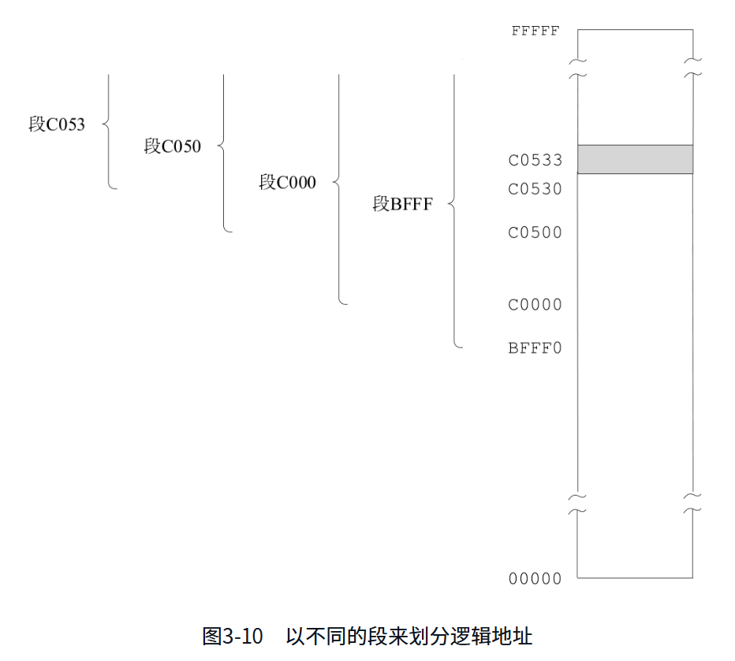

# 第4章 汇编语言和汇编软件

## 汇编语言程序

前面的章节里已经简单介绍过汇编语言及其产生的背景，所以我们知道，汇编语言提供了机器指令的人工可读形式，或者说助记形式。

另外，不同的处理器具有不同的指令集和指令的操作方式，并因此形成了不同的处理器架构，比如英特尔的x86架构和摩托罗拉68K架构。

因此，**针对不同的处理器架构，汇编语言将提供不同的助记形式。实际上，即使是针对同一种处理器架构，也可能会有人使用本质上一样，但风格不同的助记形式。比如说，针对英特尔x86架构的处理器，就有AT＆T和INTEL公司自己的风格。在本书中，我们将采用英特尔风格的汇编语言助记形式。**

下面来看一下英特尔风格的汇编语言助记形式有什么特点。首先假设下面这些十六进制数字就是存放在内存中的8086机器指令：

```
B8 3F 00 01 C3 01 C1
```

对于大多数人来说，他们很难想象上面那一排数字对应着下面几条8086指令：

```
将立即数 003FH 传送到寄存器 AX 中；
将寄存器 BX 的内容和寄存器 AX 的内容相加，结果在 BX 中；
将寄存器 CX 的内容和寄存器 AX 的内容相加，结果在 CX 中。
```

这就体现了使用汇编语言的好处。使用汇编语言，以上指令就可以写成：

```assembly
mov ax, 3FH
add bx, ax
add cx, ax
```

对于那些有点英语基础的人来说，理解这些汇编语言指令并不困难。比如这句

```assembly
mov ax, 3FH
```

首先，mov是move的简化形式，意思是“移动”或者“传送”。至于“ax”，很明显，指的就是寄存器AX。传送指令需要两个操作数，分别是目的操作数和源操作数，它们之间要用逗号隔开。在这里，AX是目的操作数，源操作数是3FH。**汇编语言对指令的大小写没有特别的要求。**所以，你完全可以这样写：

```assembly
MOV AX, 3FH
mov ax, 3fh
MOV ax, 3FH
mov AX, 3fh
```

在很多高级语言中，如果要指示一个数是十六进制数，通常不采用在后面加“H”的做法，而是为它添加一个“0x”前缀，如：

```assembly
mov ax, 0x3f
```

你可能想问一下，为什么会是这样，为什么会是“0x”？答案是不知道，不知道在什么时候，为什么就这样用了。这不得不让人怀疑，它肯定是一个非常随意的决定，并在以后形成了惯例。如果你知道确切的答案，不妨写封电子邮件告诉我。注意，为了方便，我们将在本书中采用这种形式。

在汇编语言中，使用十进制数是最自然的。因为3FH等于十进制数63，所以你可以直接这样写：

```assembly
mov ax, 63
```

当然，如果你喜欢，也可以使用二进制数来这样写：

```assembly
mov ax, 00111111B
```

一定要看清楚，在那串“0”和“1”的组合后面，跟着字母“B”，以表明它是一个二进制数。至于这句：

```assembly
add bx, ax
```

情况也是一样。add的意思是把一个数和另一个数相加。在这里，是把寄存器BX的内容和寄存器AX的内容相加。相加的结果在BX中，但AX的内容并不改变。

像上面那样，用汇编语言提供的符号书写的文本，叫作汇编语言源程序。为此，你需要一个字处理器软件，比如Windows记事本，来编辑这些内容。如图4-1所示，相信这些软件的使用都是你非常熟悉的。


有了汇编语言所提供的符号，这只是方便了你自己。**相反地，对人类来说通俗易懂的东西，处理器是无法识别的。所以，还需要将汇编语言源程序转换成机器指令，这个过程叫作编译(Compile)。**

**编译肯定需要依靠一个软件，称为编译器，或编译软件。**因为如果需要人类自己去做，还费这周折干嘛。另外，想想看，一个帮助人类生产软件的工具，自己居然也是一个软件，这很有意思。

从字处理器软件生成的是汇编语言源程序文件。编译软件的任务是读取这些文件，将那些符号转变成二进制形式的机器指令代码。它把这些机器指令代码存放到另一个文件中，叫作二进制文件或者可执行文件，比如Windows里以“.exe”为扩展名的文件，就是可执行文件。当需要用处理器执行的时候，再加载到内存里。

## NASM编译器

### NASM的下载和安装

因为汇编语言的助记形式取决于处理器架构及不同的风格，这就需要与之配套的汇编语言编译器。同时，就算是同一款编译器，由于需要运行在不同的平台（比如Windows和Linux）上，也会有不同的版本。

现存的汇编语言编译器有多种，用得比较多的有MASM、FASM、TASM、AS86、GASM等，每种汇编器都有自己的特色和局限性，特别是有些还需要付费才能使用。不同于前面所列举的这些，在本书中，我们用的是另一款叫作NASM的汇编语言编译器。

NASM的全称是Netwide Assembler，它是可免费使用的开源软件。下面是它的官方网站，从这里可以找到它的帮助和开发文档、源代码，以及DOS、Linux、MacOS、32位Windows、64位Windows下的安装包：

```
https://www.nasm.us/
```

需要说明的是，你应该下载与自己平台相适应的版本，而且最好是下载最新版本。如果你是一个Linux用户，应该下载Linux版本；如果是Windows用户，应该下载Windows版本，而且还要区分是32位还是64位。

如图4-2所示，这是在笔者的机器上下载并安装NASM的截图。笔者的机器使用64位的INTEL x86处理器，操作系统是64位的Windows 10，所以选择/2.15.05/win64目录下的安装程序，即下载并执行nasm-2.15.05-installer-x64.exe这个可安装包。

如图4-2所示，在出现的安装界面中，可供选择的组件包括NASM汇编（编译）器和反汇编器模块、完整的NASM手册和用于将NASM集成到Visual Studio 2008的配置文件。

安装好NASM之后，还需要将其添加到环境变量中去，这样就可以在任何目录下使用它来编译汇编语言程序，否则只能在NASM的安装目录中运行汇编（编译）器来编译你的汇编语言程序。以Windows平台为例，如图4-3所示，可以在桌面上右击“此电脑”，然后在“高级”选项中单击“环境变量”，并对“Path”进行编辑，将NASM的安装目录添加进来。

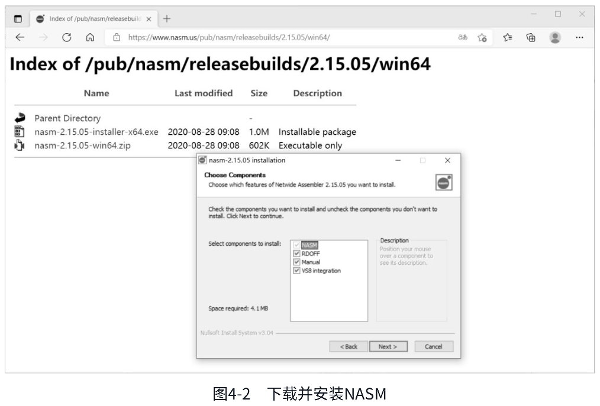

> 本地安装环境：C:\Program Files\NASM，相关项目存放地址：
>
> 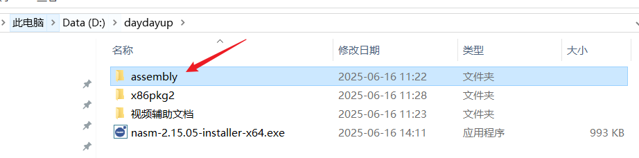

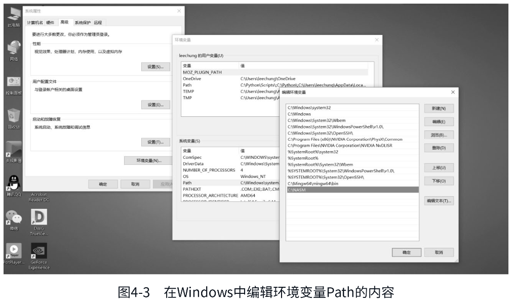

### 代码的书写和编译过程

因为NASM可以运行在不同的操作系统平台上，但这本书的讲解无法兼顾所有平台，所以只能以用户较多的Windows平台为例来介绍。对于其他操作系统平台，其实也都大同小异，可以自行参考相关的资料。

在Windows平台上，和你已经司空见惯的其他应用程序不同，NASM在运行之后并不会显示一个图形用户界面。相反地，它只能通过命令行使用。

比如，我们可以用Windows记事本编写一个汇编语言源程序并予以保存，假定保存在D盘的MyAsm目录下，文件名为exam.asm。作为惯例，汇编语言源程序文件的扩展名是“.asm”，不过，你当然可以使用其他扩展名。

一旦有了一个源程序，下一步就是将它的内容编译成机器代码。为此你需要打开一个命令行窗口。比如在Windows 10中，你需要从启动菜单中选择“Windows系统”→“命令提示符”，或者直接按Windows徽标键+R，在弹出的“运行”对话框中输入cmd并回车。

接着，切换到你的工作目录（汇编语言程序所在的目录）。如图4-4所示，我们刚才是把源文件exam.asm保存在D盘的MyAsm目录下的，那么，编译这个文件的方法很简单，就是切换到这个目录，然后在命令行提示符后输入“nasm -f bin exam.asm -o exam.bin”并按下Enter键。

如图4-4所示，在编译之后我们用DIR命令查看文件，发现多一个“exam.bin”，这就是编译器生成的文件，它包含了处理器可以识别和执行的机器指令。

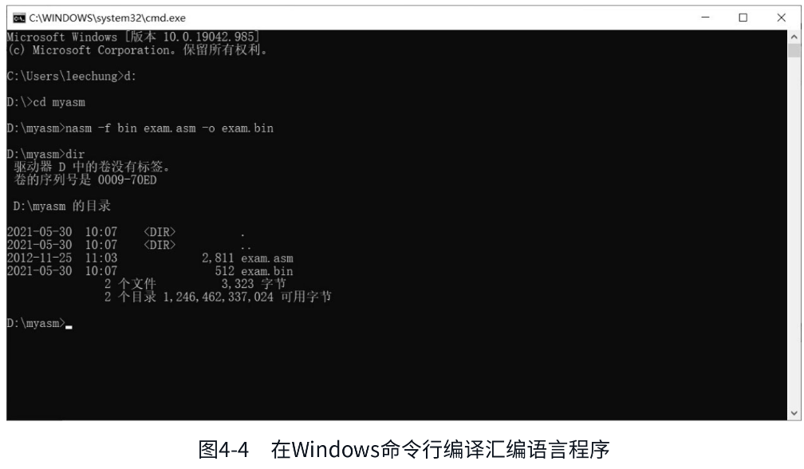

NASM需要一系列参数才能正常工作。-f 参数的作用是指定输出文件的格式(Format)。这样，-f bin 就是要求NASM生成的文件只包含“纯二进制”的内容。换句话说，除了处理器能够识别的机器代码，别的任何东西都不包含。这样一来，因为缺少操作系统所需要的加载和重定位信息，它就很难在Windows、DOS和Linux上作为一个普通的应用程序运行。不过，这正是本书所需要的。

紧接着，exam.asm 是源程序的文件名，它是将要被编译的对象。

-o 参数指定编译后输出(Output)的文件名。在这里，我们要求NASM生成输出文件 exam.bin。

用来编写汇编语言源程序，Windows记事本并不是一个好工具。同时，在命令行编译源程序也令很多人迷糊。毕竟，很多年轻的朋友都是用着Windows成长起来的，他们缺少在DOS和UNIX下工作的经历。

为了写这本书，我一直想找一个自己中意的汇编语言编辑软件。互联网是个大宝库，上面有很多这样的工具软件，但大多都包含了太多的功能，用起来自然也很复杂。我的愿望很简单，能够方便地书写汇编指令即可，同时还具有编译功能。毕竟我自己也不喜欢在命令行和图形用户界面之间来回切换。

在经历了一系列的失望之后，我决定自己写一个。在本书第一版中，这个小程序叫Nasmide，但很多读者反映在Windows 10下不能运行，于是2020年重新编写了两个版本，一个是32位版本，名字叫Nasmide32，专为32位Windows而设计；一个是64版本，名字叫Nasmide64，专为64位Windows而设计。可以在64位的Windows上运行32位和64位版本，但32位版本只能运行在32位Windows上。这两个版本的程序已在配书文件包中更新，不过遗憾的是，它们并非是用汇编语言书写的。

现在，你可以双击Nasmide32.exe或者Nasmide64.exe来运行它（方便起见，我们以后统称为Nasmide软件）。如图4-5所示，这是新版的Nasmide软件，它的界面分为三个部分。顶端是菜单，可以用来新建文件、打开文件、保存文件或者调用NASM来编译当前文档。

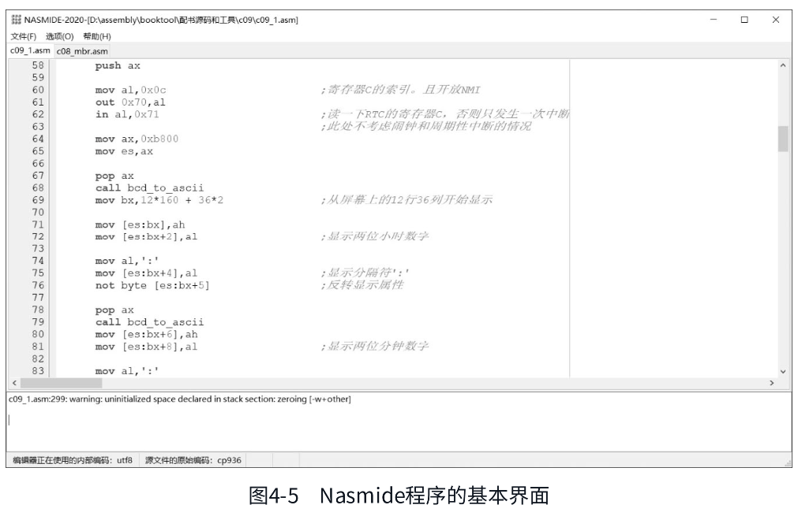

中间最大的空白区域是编辑区，用来书写汇编语言源代码。原来的版本只能编辑一个文件，新版可以同时编辑多个文件。

窗口底部那个窄的区域是消息显示区。在编译当前文档时，不管是编译成功，还是发现了文档中的错误，都会显示在这里。

基本上，你现在已经可以在Nasmide里书写汇编语句了。不过，在此之前你最好先做一件事情。**Nasmide只是一个文本编辑工具，它自己没有编译能力。不过不要紧，它可以在后台调用NASM来编译当前文档，前提是它必须知道NASM安装在什么地方。**

为此，你需要在菜单上选择“选项”→“编译器路径名设置”来打开“选项设置”窗口。如图4-6所示，你需要指定NASM汇编器所在的路径，这个路径就是你在前面安装NASM时，指定的安装路径，包括可执行文件名nasm.exe。

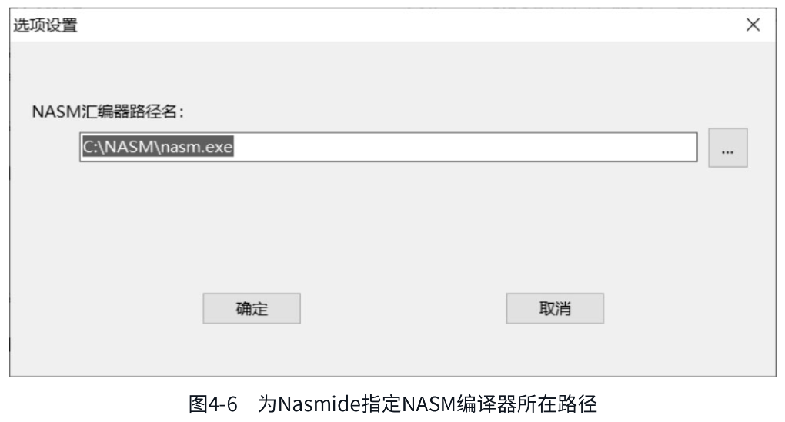

**不同于其他汇编语言编译器，NASM最让我喜欢的一个特点是允许在源程序中只包含指令**，如图4-7所示。用过微软公司MASM的人都知道，在真正开始书写汇编指令前，先要穿靴戴帽，在源程序中定义很多东西，比如代码段和数据段等，弄了半天，实际上连一条指令还没开始写呢。

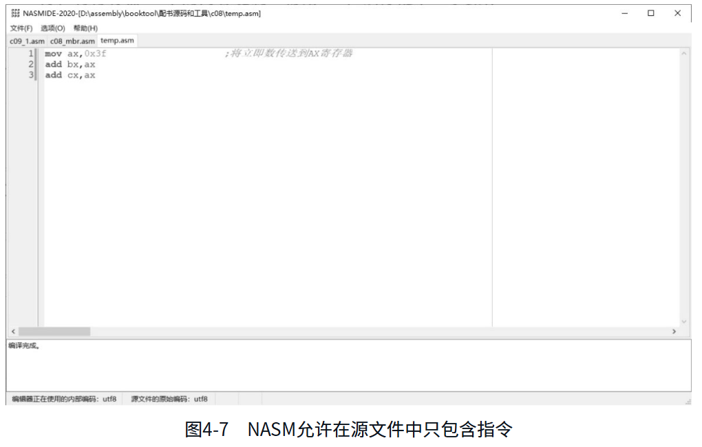

如图4-7所示，用Nasmide程序编辑源程序时，它会自动在每行内容的左边显示行号。对于初学者来说，一开始可能会误以为行号也会出现在源程序中。不要误会，行号并非源程序的一部分，当保存源程序的时候，也不会出现在文件内容中。

让Nasmide显示行号，这是一个聪明的决定。一方面，我在书中讲解源程序时，可以说第几行到第几行是做什么用的；另一方面，当编译源程序的时候，如果发现了错误，错误信息中也会说明是第几行有错。这样，因为Nasmide显示了行号，所以就很容易快速找到出错的那一行。

在汇编源程序中，可以为每行添加注释。注释的作用是说明某条指令或者某个符号的含义和作用。注释也是源程序的组成部分，但在编译的时候会被编译器忽略。如图4-7所示，为了告诉编译器注释是从哪里开始的，注释需要以英文字母的分号“；”开始。

当源程序书写完毕之后，就可以进行编译了，方法是在Nasmide中选择菜单“文件”→“编译源文件”。这时，Nasmide将会在后台调用NASM来完成整个编译过程，不需要你额外操心。如图4-7所示，即使只有三行的程序也能通过编译。编译完成后，会在窗口底部显示一条消息。

### 用HexView观察编译后的机器代码

编译成功完成之后，将生成对应的二进制文件。尽管我们强调源文件和编译之后的文件具有不同的内容，但如果能用工具看一看，相信印象更为深刻。在前面下载的配书源码和工具里，有一个名为HexView的小程序，可以实现这个愿望。HexView用于打开任意一个文件，以十六进制的形式从头到尾显示它每字节的内容。

双击启动HexView，然后选择菜单“文件”→“打开文件以显示”，在文件选择对话框里找到你在4.1节里编辑并保存的源程序文件。如图4-8所示，文件选择之后，HexView程序将以十六进制的形式显示刚刚选择的文件。

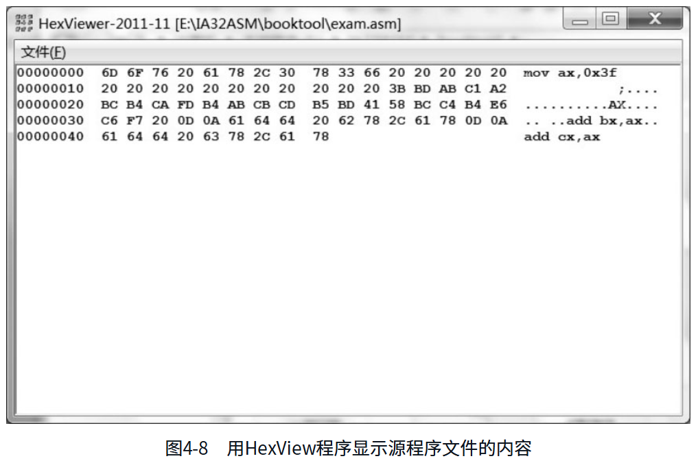

在HexView中，文件的内容以十六进制的形式显示在窗口中间，以16字节为一行，字节之间以空白分隔，所以看起来很稀疏。如果文件较大的话，则会分成很多行。

作为对照，每字节还会以字符的形式显示在窗口右侧，如果它确实可显示为一个字符的话。如果该字节并非一个可以显示的字符，则显示一个替代的字符“.”。因为源程序中还有汉字注释，所以，如果细心的话，从图中可以算出每个汉字的编码是2字节，比如“将”字的编码是0xBD 0xAB。由于HexView是以单字节的形式来显示每个字符的，所以无法显示汉字。

左边的数字，是每行第一字节相对于文件头部的距离（偏移），也是以十六进制数显示的。字母“m”是整个源程序文件内的第1个字符，因此，它的偏移量是00000000(H)，其他字符依次类推，最后一个字符“x”的偏移量是00000048(H)。

源程序很长，但是，编译之后的机器指令却很简短。如图4-9所示，编译之后的文件只有7字节，这才是处理器可以识别并执行的机器指令。

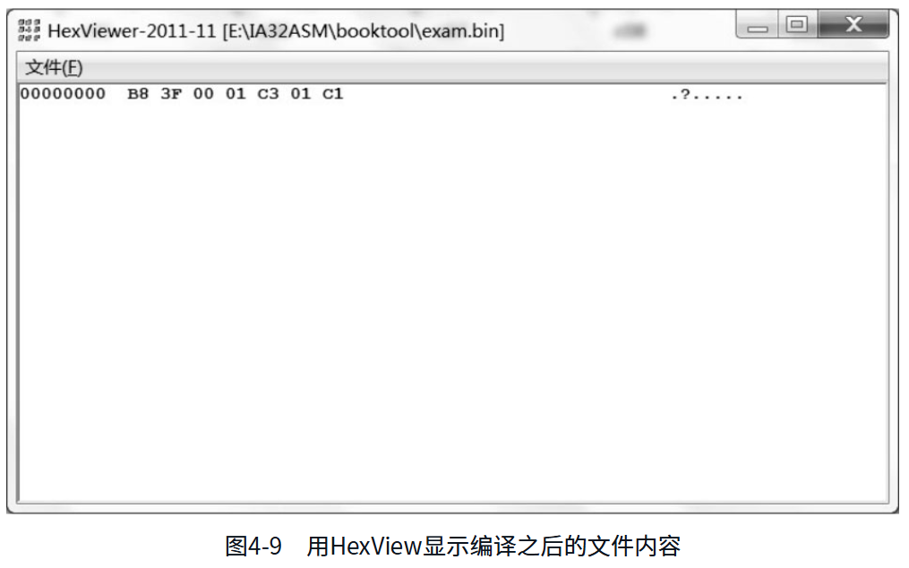

# 第5章 虚拟机的安装和使用

## 计算机的启动过程

### 如何将编译好的程序提交给处理器

对于绝大多数编译好的程序，要想得到处理器的光顾，让它执行一下，必须借助于操作系统。就拿Windows来说，它为你显示每个程序的图标，允许你双击来运行程序。在内部你看不见的层面上，它必须给将要运行的程序分配空闲的内存空间，并在适当的时候将程序提交给处理器执行。

**每种操作系统都对它所管理的程序提出了种种格式上的要求。**比如，它要求编译好的程序必须在文件的开始部分包含编译日期，是针对哪种操作系统编译的，程序的版本，第一条指令从哪里开始，数据段从哪里开始、有多长，代码段从哪里开始、有多长，等等，Windows甚至建议你在文件中包含至少一个用于显示的图标。如果你不按它的要求来，它也不会给你面子，并直截了当地弹出一个对话框，如图5-1所示，告诉你它不准备也没办法将你的程序提交给处理器。

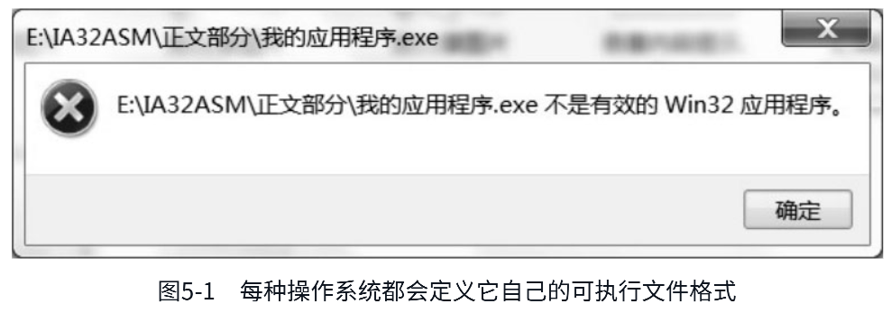

每种编译器都有能力针对不同的操作系统来生成不同格式的二进制文件，程序员所要做的，就是在源程序中加入一些相关的信息，比如指定每个段的开始和结束，并在编译时指定适当的参数。如果你对此感兴趣，可以阅读NASM文档。这是一个PDF文件，在安装NASM的时候，它也会被安装。

在特定的操作系统上开发软件肯定不是一件容易的事情。但换个角度考虑一下，操作系统也是一个需要在处理器上运行的软件，只不过比起一般的程序，操作系统体积更为庞大，功能更为复杂而已。**如果我们能绕过它，或者代替它，让计算机一开机的时候直接执行我们自己的软件，岂不更简单？**

好，这个主意完全可行。那就让我们慢慢开始吧。

### 计算机的加电和复位

在处理器众多的引脚中，有一个是RESET，用于接受复位信号。每当处理器加电，或者RESET引脚的电平由低变高时，处理器都会执行硬件初始化，以及一个可选的内部自测试(Build-in Self-Test, BIST)，然后将内部所有寄存器的内容初始化到预置的状态。

比如，对于INTEL 8086来说，复位将使代码段寄存器(CS)的内容为0xFFFF，其他所有寄存器的内容都为0x0000，包括指令指针寄存器(IP)。8086之后的处理器并未延续这种设计，但毫无疑问，无论怎么设计，都是有目的的。

**处理器的主要功能是取指令和执行指令，加电或者复位之后，它就会立刻尝试去做这样的工作。不过，在这个时候，内存中还没有任何有意义的指令和数据，它该怎么办呢？**

在揭开谜底之前，我们先来看看内存的特点。

为了节约成本，并提高容量和集成度，在内存中，每比特的存储都是靠一个极其微小的晶体管，外加一个同样极其微小的电容来完成的。可以想象，这样微小的电容，其泄漏电荷的速度当然也非常快。所以，个人计算机中使用的内存需要定期补充电荷，这称为刷新，这种存储器也称为动态随机访问存储器(Dynamic Random Access Memory,DRAM)。随机访问的意思是，访问任何一个内存单元的速度和它的位置（地址）无关。举个例子来说，从头至尾在一盘录音带上找某首歌曲，它越靠前，找到它所花的时间就越短。但内存就不一样，读写地址为0x00001的内存单元，和读写地址为0xFFFF0的内存单元，所需要的时间是一样的。

在内存刷新期间，处理器将无法访问它。这还不是最麻烦的，最麻烦的是，在它断电之后，所有保存的内容都会统统消失。所以，每当处理器加电之后，它无法从内存中取得任何指令。

### 基本输入输出系统

INTEL 8086可以访问1MB的内存空间，地址范围为0x00000到0xFFFFF。出于各方面的考虑，计算机系统的设计者将这1MB的内存空间从物理上分为几个部分。

8086有20根地址线，但并非全都用来访问DRAM，也就是内存条。事实上，这些地址线经过分配，大部分用于访问DRAM，剩余的部分给了只读存储器(Read Only Memory, ROM)和外围的板卡，如图5-2所示。

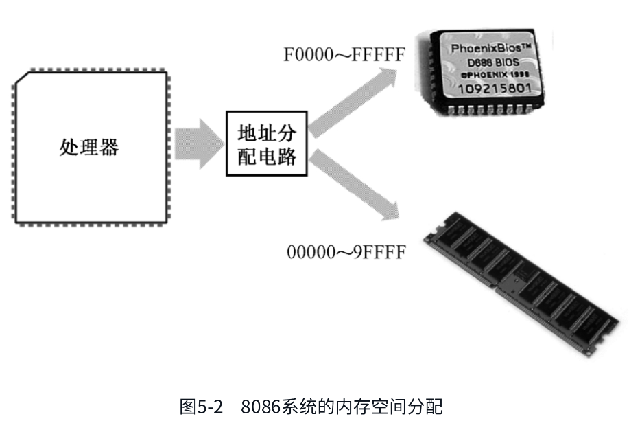

与DRAM不同，ROM不需要刷新，它的内容是预先写入的，即使掉电也不会消失，但也很难改变。这个特点很有用，比如，可以将一些程序指令固化在ROM中，使处理器在每次加电时都自动执行。处理器醒来后不能饿着，这是很重要的。

在以INTEL 8086为处理器的系统中，ROM占据着整个内存空间顶端的64KB，物理地址范围是0xF0000～0xFFFFF，里面固化了开机时要执行的指令；DRAM占据着较低端的640KB，地址范围是0x00000～0x9FFFF；中间还有一部分分给了其他外围设备，这个以后再说。**因为8086加电或者复位时，CS=0xFFFF，IP=0x0000，所以，它取的第一条指令位于物理地址0xFFFF0，正好位于ROM中，那里固化了开机时需要执行的指令。**

处理器取指令执行的自然顺序是从内存的低地址往高地址推进。如果从0xFFFF0开始执行，这个位置离1MB内存的顶端（物理地址0xFFFFF）只有16字节的长度，一旦IP寄存器的值超过0x000F，比如IP=0x0011，那么，它与CS一起形成的物理地址将因为溢出而变成0x00001，这将回绕到1MB内存的最底端。

**所以，ROM中位于物理地址0xFFFF0的地方，通常是一个跳转指令，它通过改变CS和IP的内容，使处理器从ROM中的较低地址处开始取指令执行。**在NASM汇编语言里，一个典型的跳转指令像这样：

```assembly
jmp 0xf000:0xe05b
```

在这里，“jmp”是跳转(jump)的简化形式；0xf000是要跳转到的段地址，用来改变CS寄存器的内容；0xe05b是目标代码段内的偏移地址，用来改变IP寄存器的内容。因此，目标位置的物理地址是0xfe05b。一旦执行这条指令，处理器将开始从指定的“段:偏移”处开始重新取指令执行。

到了本书第6章我们就能接触跳转指令了，现在，我们只需要知道，指令的执行并非总是按顺序的，有时候不得不根据某些条件来选择执行哪些指令，不执行哪些指令。这个时候，跳转指令是很有用的。

**这块ROM芯片中的内容包括很多部分，主要是进行硬件的诊断、检测和初始化。**所谓初始化，就是让硬件处于一个正常的、默认的工作状态。最后，**它还负责提供一套软件例程**，让人们在不必了解硬件细节的情况下从外围设备（比如键盘）获取输入数据，或者向外围设备（比如显示器）输出数据。设备当然是很多的，所以这块ROM芯片只针对那些最基本的、对于使用计算机而言最重要的设备，而它所提供的软件例程，也只包含最基本、最常规的功能。**正因为如此，这块芯片又叫基本输入输出系统(Base Input ＆ Output System, BIOS)ROM，简称ROM-BIOS**。在读者缺乏基础知识的情况下讲述ROM-BIOS的工作只会越讲越糊涂，所以这些知识将会分散在各个章节里予以讲解。

**ROM-BIOS的容量是有限的，当它完成自己的使命后，最后所要做的，就是从辅助存储设备读取指令数据，然后转到那里开始执行。**基本上，这相当于接力赛中的交接棒。

### 硬盘及其工作原理

历史上，有多种辅助存储设备，比如软盘、光盘、硬盘、U盘等，相对于内存，它们就是人们常说的“外存”，即外存储器（设备）。

软盘(Floppy Disk)的尺寸比烟盒稍大一点，但是比较薄，采用塑料作为基片，上面是一层磁性物质，可以用来记录二进制位。这种塑料介质比较柔软，所以称为软盘。

在数据记录原理上和软盘很相似的设备是硬盘(Hard Disk, HDD)，而且它们几乎是同一个时代的产物。但是，与软盘不同，硬盘是多盘片、密封、高转速的，采用铝合金作为基片，并在表面涂上磁性物质来记录二进制位。这就使得它的盘片具有较高的硬度，故称为硬盘。

如图5-3所示，这是一块被拆开密封盖的硬盘，中间是用于记录数据的铝合金盘片，固定在中心的轴上，由一个高速旋转的马达驱动。附着在盘片表面的扁平锥状物，就是用于在盘片上读写数据的磁头。

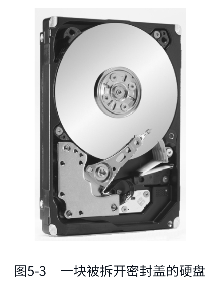

为了进一步搞清楚硬盘的内部构造，图5-4给出了更为详细的图示。

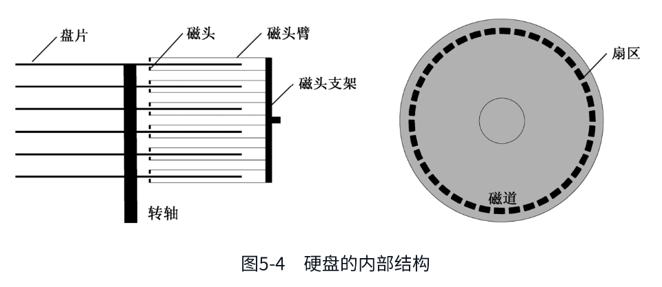

硬盘可以只有一个盘片（这称为单碟），也可能有好几个盘片。但无论如何，它们都串在同一个轴上，由电动机带动着一起高速旋转。一般来说，转速可以达到每分钟3600转或者7200转，有的能达到一万多转，这个参数就是我们常说的“转/分”(Round Per Minute, RPM)。

**每个盘片都有两个磁头(Head)，上面一个，下面一个，经常用磁头来指代盘面。磁头都有编号，第1个盘片，上面的磁头编号为0，下面的磁头编号为1；第2个盘片，上面的磁头编号为2，下面的磁头编号为3，依次类推。**

每个磁头不是单独移动的。相反，它们都通过磁头臂固定在同一个支架上，由步进电动机带动着一起在盘片的中心和边缘之间来回移动。也就是说，它们是同进退的。步进电动机由脉冲驱动，每次可以旋转一个固定的角度，即可以步进一次。

可以想象，当盘片高速旋转时，磁头每步进一次，都会从它所在的位置开始，绕着圆心“画”出一个看不见的圆圈，这就是**磁道(Track)**。磁道是数据记录的轨迹。因为所有磁头都是联动的，故每个盘面上的同一条磁道又可以形成一个虚拟的圆柱，称为**柱面(Cylinder)**。

**磁道，或者柱面，也要编号。编号从盘面最边缘的那条磁道开始，向着圆心的方向，从0开始编号**。

柱面是一个用来优化数据读写的概念。初看起来，用硬盘来记录数据时，应该先将一个盘面填满后，再填写另一个盘面。实际上，移动磁头是一个机械动作，看似很快，但对处理器来说，却很漫长，这就是寻道时间。为了加速数据在硬盘上的读写，最好的办法就是尽量不移动磁头。这样，当0面的磁道不足以容纳要写入的数据时，应当把剩余的部分写在1面的同一磁道上。如果还写不下，那就继续把剩余的部分写在2面的同一磁道上。换句话说，在硬盘上，数据的访问是以柱面来组织的。

实际上，磁道还不是硬盘数据读写的最小单位，磁道还要进一步划分为**扇区(Sector)**。磁道很窄，也看不见，但在想象中，它仍呈带状，占有一定的宽度。将它划分为许多段之后，每一部分都呈扇形，这就是扇区的由来。

每条磁道能够划分为几个扇区，取决于磁盘的制造者，但通常为63个。而且，每个扇区都有一个编号，与磁头和磁道不同，**扇区的编号是从1开始的。**

扇区与扇区之间以间隙（空白）间隔开来，**每个扇区以扇区头开始，然后是512字节的数据区。扇区头包含了每个扇区自己的信息，主要有本扇区的磁道号、磁头号和扇区号，用来定位。**现代的硬盘还会在扇区头部包括一个指示扇区是否健康的标志，以及用来替换该扇区的扇区地址。用于替换扇区的，是一些保留和隐藏的磁道。

### 一切从主引导扇区开始

尽管我们使用硬盘的历史很长，但它一直没能退出舞台，这主要是因为它总能通过不断提高自己的容量来打败那些竞争者。20世纪90年代初，40MB的硬盘算是常见的，能拥有200MB的硬盘很让人羡慕。进入21世纪之后，500GB的硬盘也不算稀罕，而且价钱也很便宜。现在，我们也可以花很少的钱买到几TB的硬盘。

前面说到，ROM-BIOS在完成自己的使命之前，最后要做的一件事是从外存储设备读取更多的指令来交给处理器执行。现实的情况是，对于ROM-BIOS来说，绝大多数时候，硬盘都是首选的外存储设备。

硬盘的第一个扇区是0面0道1扇区，或者说是0头0柱1扇区，这个扇区称为主引导扇区。**如果计算机的设置是从硬盘启动的，那么，ROM-BIOS将读取硬盘主引导扇区的内容，将它加载到内存地址0x0000:0x7c00**（也就是物理地址0x07C00），然后用一个jmp指令跳到那里接着执行：

```assembly
jmp 0x0000:0x7c00
```

为什么偏偏是0x7c00这个地方？还不太清楚。反正当初定下这个方案的家伙已经被人说了很多坏话，我也就不准备再多说什么了。

通常，主引导扇区的功能是继续从硬盘的其他部分读取更多的内容加以执行。像Windows这样的操作系统，就是采用这种接力的方法一步一步把自己运行起来的。

说到这里，我们可以想象，如果我们把自己编译好的程序写到主引导扇区里，不也能够让处理器执行吗？

对于这种想法，我有一个好消息和一个坏消息要告诉你。

好消息是，这是可以的，而且这几乎是在不依赖操作系统的情况下，让我们的程序可以执行的唯一方法。

不过，坏消息是，如果你改写了硬盘的主引导扇区，那么，Windows和Linux，以及任何你正在使用的操作系统都会瘫痪，无法启动了。

那么，我们该怎么办呢？答案是在你现有的计算机上，再虚拟出一台计算机来。

## 创建和使用虚拟机

### 别害怕，虚拟机是软件

对于第一次听说虚拟机(Virtual Machine, VM)的人来说，可能以为还要再花钱买一台计算机，这恐怕是他们最担心的。所谓虚拟机，就是在你的计算机上再虚拟出另一台计算机来。这台虚拟出来的计算机，和真正的计算机一样，可以启动，可以关闭，还可以安装操作系统、安装和运行各种各样的软件，或者访问网络。总之，你在真实的计算机上能做什么，在它里面一样可以那么做。使用虚拟机，你会发现，在Windows操作系统里，居然又可以拥有另一套Windows。然而本质上，它只是运行在物理计算机上的一个软件程序。

如图5-5所示，整个大的背景是Windows 7的桌面，它安装在一台真实的计算机上。图中的小窗口，正是虚拟机，运行的是Windows Server 2003。像这样，我们就得到了两台“计算机”，而且它们都可以操作。

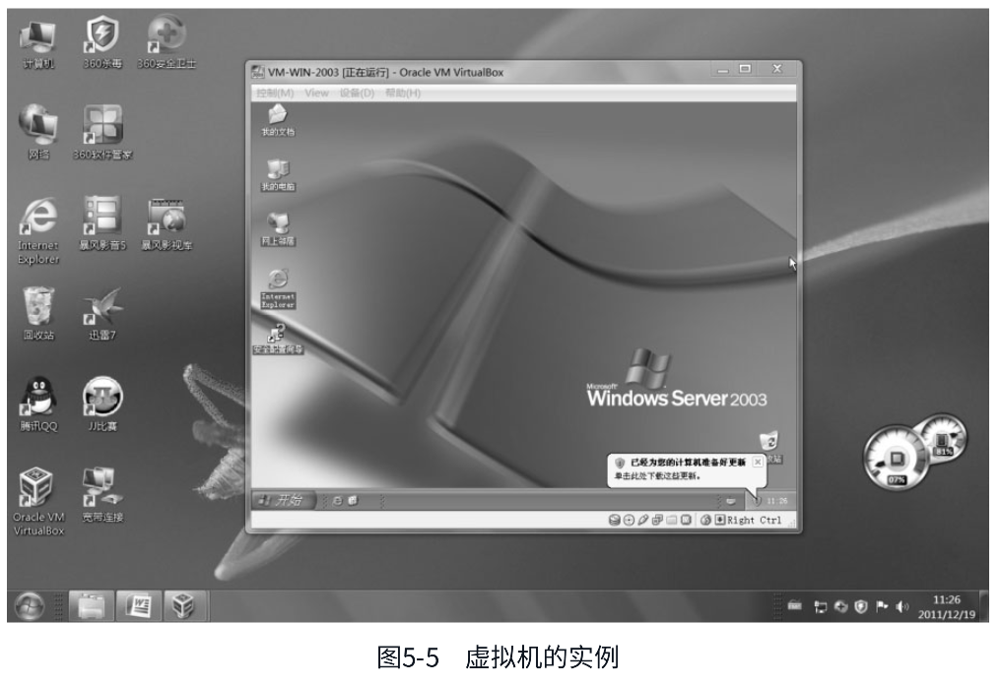

虚拟机仅仅是一个软件，运行在各种主流的操作系统上。它的处理能力，完全来自背后那台真实的计算机。

尤其重要的是，针对某种真实处理器所写的任何指令代码，通常都可以正确无误地在该处理器的虚拟机上执行。实际上，这也是虚拟机具有广泛应用价值的原因所在。

在过去的若干年里，虚拟机得到了广泛应用。为了研制防病毒软件、测试最新的操作系统或者软件产品，软件公司通常需要多台用于做实验的计算机。采用虚拟机，就可以避免反复重装软件系统的麻烦，当这些软件系统崩溃时，崩溃的只是虚拟机，而真实的物理计算机丝毫不受影响。

### 下载和安装Oracle VM VirtualBox

主流的虚拟机软件包括VMWare、Virtual PC和VirtualBox等，但只有VirtualBox是开源和免费的。要使用VirtualBox，首先必须从网上下载并安装它。这里是它的主页：

```
https://www.virtualbox.org/
```

通过这个主页，你可以找到最新的版本并下载它。为了方便，下面给出下载页面的链接：

```
https://www.virtualbox.org/wiki/Downloads
```

本书的配书文件包中提供了关于如何下载、安装和配置VirtualBox软件的文档，有WORD和PDF两种版本，请选择使用。注意，要选择最新的版本下载，而且，由于该软件针对不同的操作系统平台开发，因此，要下载适用于Windows的安装程序。

VirtualBox软件安装完毕之后，你需要创建或者说“虚拟”出一台计算机来，并设置该“计算机”的相关参数，包括为它配备一块硬盘。有关的方法和步骤在配书文件包的教程中已有介绍，**唯一的建议是选用本书为你准备的虚拟硬盘**。

和真实的计算机一样，虚拟机也需要一个或几个辅助存储器（磁盘、光盘、U盘等）才能工作。不过，为它配备的并非是真正的盘片，而是一个特殊的文件，故称为虚拟盘。这样，当一个软件程序在虚拟机里读写硬盘或者光盘时，虚拟机将把它转换成对文件的操作，而软件程序还以为自己真的是在读写物理盘片。这样的一块磁盘，在需要的时候随时创建，不需要时可以随时删除，这真是非常神奇的磁盘。

前面你已经从网上下载了与本书配套的源码和工具，那是个压缩文件。解压之后，在源代码和工具文件夹里有一个现成的虚拟硬盘文件，文件名是LEECHUNG.VHD，这是给你额外准备的，而且经过了测试，可以在你无法创建虚拟硬盘的时候派上用场。**不管是你自己创建虚拟硬盘，还是选用这个现成的，都应当使虚拟硬盘文件位于源代码所在的文件夹，将来往该虚拟硬盘写数据时比较方便。**

正如前面所说的，市面上有好几种流行的虚拟机软件，而每种虚拟机软件都企图制定自己的虚拟硬盘标准。因为虚拟硬盘实际是一个文件，所以，所谓虚拟硬盘标准，实际上就是该文件的格式。正是因为这样，虚拟硬盘类型说白了就是你准备采用哪家的虚拟硬盘文件格式。

通常来说，虚拟硬盘的格式体现在它的文件扩展名上，比如上面的LEECHUNG.VHD，采用的就是微软公司的VHD虚拟硬盘规范。VHD规范最早起源于Connectix公司的虚拟机软件Connectix Virtual PC，2003年，微软公司收购了它并改名为Microsoft Virtual PC。2006年，微软公司正式发布了VHD虚拟硬盘格式规范。在本书配套的源代码和工具包里，有该规范的文档。

VDI是VirtualBox自己的虚拟硬盘规范，VMDK是VMWare的虚拟硬盘规范。采用哪个公司、哪个虚拟机软件的虚拟硬盘格式，对于普通的应用来说，这没什么关系，它们都能很好地工作。但是，对于本书和本书配套的工具来说，你必须选择“VHD(Virtual Hard Disk)”。具体原因，我们将在下一节讲述。

事实上，即使是VHD，也分为两种类型：固定尺寸的和动态分配的。一个固定尺寸的VHD，它对应的文件尺寸和该虚拟硬盘的容量是相同的，或者说是一次性分配够了的。比如，一个2GB的VHD虚拟硬盘，它对应的文件大小也是2GB。注意，本书及本书配套的工具仅支持固定尺寸的VHD。

一旦完成了全部的准备工作，刚刚创建的虚拟机就会显示在VirtualBox控制台里，如图5-6所示，虚拟机的名字叫“LEARN-ASM”。基本上，你现在就可以单击控制台界面上的“开始(t)”来启动这台虚拟机。但是，别忙，你的虚拟硬盘里还没有东西呢。

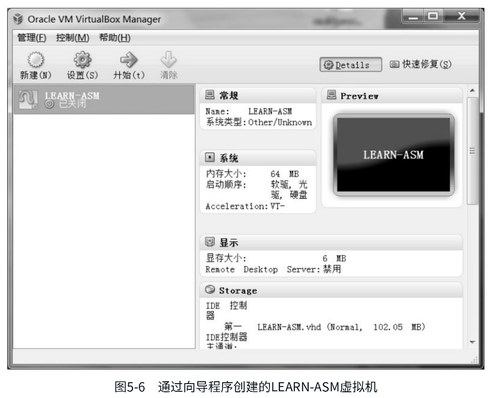

### 虚拟硬盘简介

坦白地说，之所以要采用固定尺寸的VHD虚拟硬盘，是因为它的简单性。我们知道，虚拟硬盘实际上是一个文件。固定尺寸的VHD虚拟硬盘是一个具有“.vhd”扩展名的文件，**它仅包括两个部分，前面是数据区，用来模拟实际的硬盘空间，后面跟着一个512字节的结尾（2004年前的规范里只有511字节）**。

要访问硬盘，运行中的程序必须至少向硬盘控制器提供4个参数，分别是磁头号、磁道号、扇区号，以及访问意图（是读还是写）。

**硬盘的读写是以扇区为最小单位的。**所以，无论什么时候，要从硬盘读数据，或者向硬盘写数据，至少得是1个扇区。

你可能想，我只有2字节的数据，不足以填满一个扇区，怎么办呢？

这是你自己的事。你可以用无意义的废数字来填充，凑够一个扇区的长度，然后写入。读取的时候也是这样，你需要自己跟踪和把握从扇区里读到的数据，哪些是你真正想要的。换句话说，硬盘只是机械和电子的组合，它不会关心你都写了些什么。

在VHD规范里，每个扇区是512字节。VHD文件一开始的512字节就对应着物理硬盘的0面0道1扇区。然后，VHD文件的第二个512字节，对应着0面0道2扇区，后面的依次类推，一直对应到0面0道n扇区。这里，n等于每磁道的扇区数。

再往后，因为硬盘的访问是按柱面进行的，所以，在VHD文件中，紧接着前面的数据块，下一个数据块对应的是1面0道1扇区，就这样一直往后排列，当把第一个柱面全部对应完后，再从第二个柱面开始对应。

如图5-7所示，为了标志一个文件是VHD格式的虚拟硬盘，并为使用它的虚拟机提供该硬盘的参数，在VHD文件的结尾，包含了512字节的格式信息。为了观察这些信息，我们使用了前面已经介绍过的配书工具HexView。

如图5-7所示，文件尾信息是以一个字符串“conectix”开始的。这个标志用来告诉试图打开它的虚拟机，这的确是一个合法的VHD文件。该标志称为VHD创建者标识，就是说，该公司(conectix)创建了VHD文件格式的最初标准。

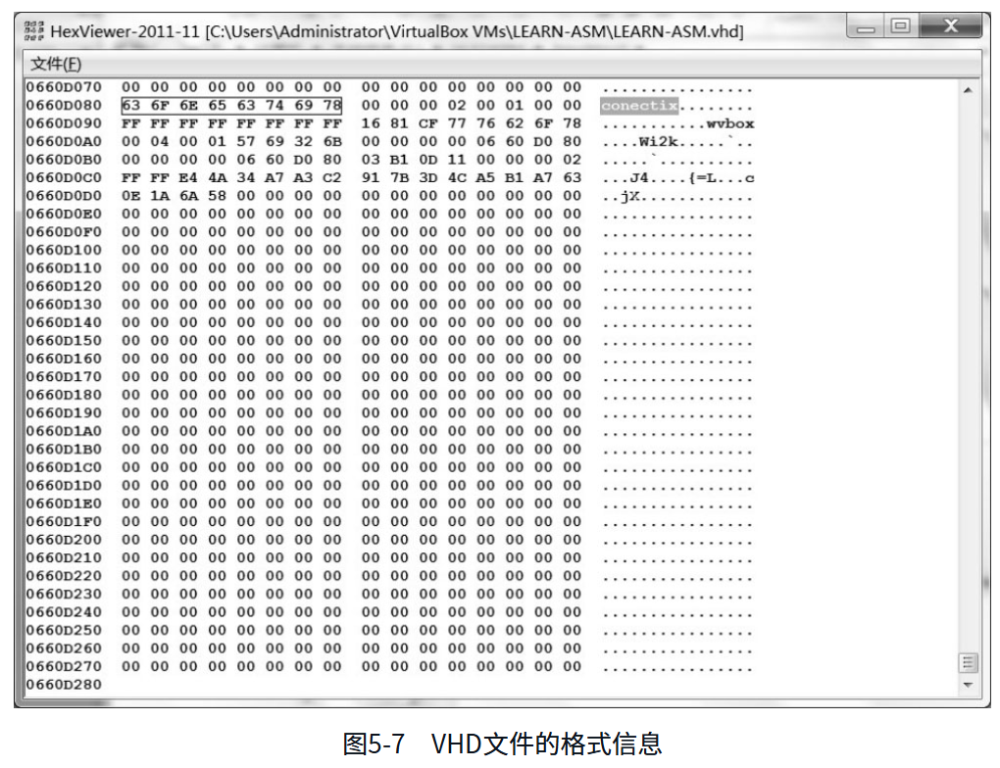

从这个标志开始，后面的数据包含了诸如文件的创建日期、VHD的版本、创建该文件的应用程序名称和版本、创建该文件的应用程序所属的操作系统、该虚拟硬盘的参数（磁头数、每面磁道数、每磁道扇区数）、VHD类型（固定尺寸还是动态增长）、虚拟硬盘容量等。

说到这里，也许你已经明白我为什么要在书中使用固定尺寸的VHD。是的，因为它简单。为了学习汇编语言，我们不得不在硬盘上直接写入程序。因为VHD格式简单，所以我只花了很少的时间就开发了一个虚拟硬盘写入程序，作为配书工具让大家使用，这就是下一节将要介绍的FixVhdWr。

至于为什么要使用VirtualBox虚拟机，是因为它支持VHD，而且是免费的。先前版本的VirtualBox可以识别VHD，但不支持创建新的VHD，尽管微软公司很早就公开了VHD规范。好消息是现在的VirtualBox也可以创建VHD了。

### 练习使用FixVhdWr工具向虚拟硬盘写数据

通常，VHD是由虚拟机VirtualBox使用的。应用程序像往常一样，直接针对硬盘进行操作，而在底层，虚拟机将这些硬件访问转化为对文件的读写。

**为了在处理器加电或者复位之后能够执行我们写的程序，势必要将这些程序写到硬盘的主引导扇区里，也就是0面0道1扇区，即使是在虚拟机工作环境中，也是这样。**

为了做到这一点，需要一个专门针对虚拟硬盘进行读写的工具。我自己写了一个，就在配书源代码和工具里。在本书第1版中，这个程序叫FixVhdWr，但是很多读者反映说用起来不方便，操作很麻烦，包括每次都要重新选取虚拟硬盘文件；每次都要选取数据文件，而且只能选取一个数据文件；不能记住上次的文件名；不能在同一界面里启动虚拟机。

综合大家的意见后，我重写了两个版本，一个是用于32位Windows的版本，名叫FixVhdWr32；一个是用于64位Windows的版本，名叫FixVhdWr64。32位版本的FixVhdWr32可以运行在32位或者64位Windows上，而64位版本的FixVhdWr64只能工作在64位Windows上，请注意根据你的实际情况选用。为方便起见，不管是32位版本，还是64位版本，我们以后统称为FixVhdWr。

如图5-8所示，这是FixVhdWr软件的界面。第一次运行这个软件时，你需要在界面顶部选择一个虚拟硬盘文件。FixVhdWr只针对固定尺寸的VHD，如果选择的是一个合法的VHD文件，它将读取该文件的结尾，并显示该虚拟硬盘的信息。

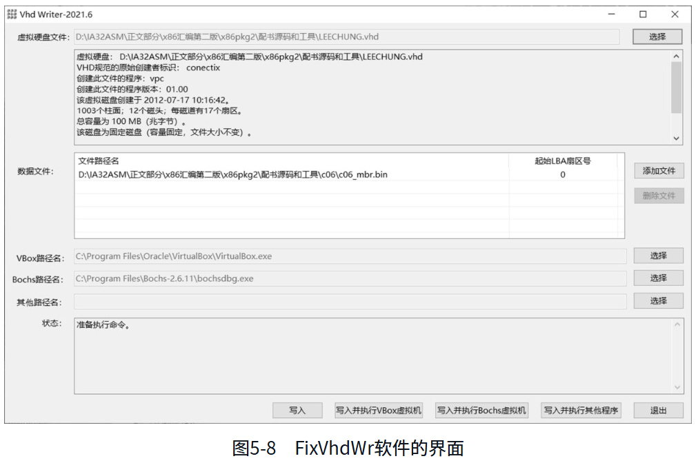

在软件界面的中间部分，你可以添加要写入虚拟硬盘的数据文件。在这个过程中，会弹出额外的界面，让你指定文件的位置和名称，以及写入时的起始逻辑扇区号，也就是所谓的起始LBA扇区号。那么，什么是LBA扇区号呢？

通常，一个扇区的尺寸是512字节，可以看成一个数据块。所以，从这个意义上来说，硬盘是一个典型的块(Block)设备。

**采用磁头、磁道和扇区这种模式来访问硬盘的方法称为CHS模式**，但不是很方便。想想看，如果有一大堆数据要写，还得注意磁头号、磁道号和扇区号不要超过界限。所以，后来引入了逻辑块地址(Logical Block Address, LBA)的概念。现在市场上销售的硬盘，无论哪个厂家生产的，都支持LBA模式。

LBA模式由硬盘控制器在硬件一级上提供支持，所以效率很高，兼容性很好。**LBA模式不考虑扇区的物理位置（磁头号、磁道号），而是把它们全部组织起来统一编号。在这种编址方式下，原先的物理扇区被组织成逻辑扇区，且都有唯一的逻辑扇区号。**

比如，某硬盘有6个磁头，每面有1000个磁道，每磁道有17个扇区。那么：

```
逻辑0扇区对应着0面0道1扇区；
逻辑1扇区对应着0面0道2扇区；
……
逻辑16扇区对应着0面0道17扇区；
逻辑17扇区对应着1面0道1扇区；
逻辑18扇区对应着1面0道2扇区；
……
逻辑33扇区对应着1面0道17扇区；
逻辑34扇区对应着2面0道1扇区；
逻辑35扇区对应着2面0道2扇区；
……
```

要注意到，扇区在编号时，是以柱面为单位的。即，先是0面0道，接着是1面0道，直到把所有盘面上的0磁道处理完，再接着处理下一个柱面。之所以这样做，是因为我们讲过，要加速硬盘的访问速度，最好不移动磁头。

因为这里总共有102000个扇区，故最后一个逻辑扇区的编号是101999，它对应着5面999道17扇区，这也是整个硬盘上最后一个物理扇区。

这里面的计算方法是：


这里，LBA是逻辑扇区号，C、H、S是想求得逻辑扇区号的那个物理扇区所在的磁道、磁头和扇区号。

采用LBA模式的好处是简化了程序的操作，使得程序员不用关心数据在硬盘上的具体位置。对于本书来说，VHD文件是按LBA方式组织的，一开始的512字节就是逻辑0扇区，然后是逻辑1扇区；最后一个逻辑扇区排在文件的最后（最后512字节除外，那是VHD文件的标识部分）。

改进后的FixVhdWr程序可以选择多个数据文件，这些数据文件最终都会从指定的起始逻辑扇区号开始写入虚拟硬盘。数据文件添加成功后，会显示在列表框中。如果需要在列表框中去掉某个数据文件，只需要单击选中它，再选择“删除文件”即可。

在软件界面的下部，你可以指定VirtualBox虚拟机软件和Bochs虚拟机软件的路径名，但前提是你已经安装了这两个虚拟机软件。VirtualBox虚拟机我们前面已经讲过，Bochs虚拟机用来调试我们编写的汇编程序，这个工具非常有趣，也非常重要，当程序不能正常工作时，通过调试可以快速地找到出现问题的位置和原因，这个软件的安装和使用方法我们马上就要讲到。

上面设置的一系列文件和参数会被保存在配置文件中，当你下次再启动FixVhdWr软件时，这些内容都会自动恢复，不需要你再次选择、添加和设置。

如图5-8所示，在界面的底部是一排按钮，“写入”按钮用来将数据文件按顺序写入虚拟硬盘。写入虚拟硬盘之后，通常还要在虚拟机中观察运行结果，或者对程序进行调试。为方便起见，“写入并执行VBox虚拟机”按钮用来执行数据文件的写入操作，然后启动VirtualBox虚拟机软件。“写入并执行Bochs虚拟机”按钮用来执行数据文件的写入操作，然后启动Bochs虚拟机软件。需要特别注意的是，VirtualBox和Bochs虚拟机软件所用的虚拟硬盘必须是FixVhdWr软件正在操作的虚拟硬盘。

# 第6章 编写主引导扇区代码

在学习汇编语言程序设计时，如果结合具体的实例来学习，把汇编技术融入一些具体问题的解决过程当中，将能获得很好的学习效果。

初学者在写第一个程序时，都有一种在屏幕上显示点什么的想法，这是很正常的，可以理解，因为屏幕是最直观的，能够看出程序的运行是否正常，是否符合设计时的预期。为此，本章将带你了解如何控制显卡在屏幕上显示字符。当然，这并不是主要目的，真正的目的在于用这个具体的实例，让你学习到以下知识：

1. NASM汇编语言源程序的一般组成部分，如标号、指令、伪指令和注释等；
2. 进一步学习mov指令和jmp指令的更多用法，以及加法指令add、除法指令div和异或指令xor的用法；
3. 处理器的工作是取指令、执行指令，包括数据访问。而这一切，都是通过分段机制来完成的。在本章中，通过编写程序、分析程序的执行过程，观察程序的执行结果，进一步加深对内存分段访问机制的感性认识和对处理器工作过程的理解。

## 本章代码清单

本章有配套的汇编语言源程序，并围绕这些源程序进行讲解，请对照阅读。

本章代码清单：6-1（主引导扇区程序）

源程序文件：c06_mbr.asm

## 欢迎来到主引导扇区

在前面的预备知识里我们已经知道，处理器加电或者复位之后，如果硬盘是首选的启动设备，那么，ROM-BIOS将试图读取硬盘的0面0道1扇区。传统上，这就是主引导扇区(Main Boot Sector,MBR)。

读取的主引导扇区数据有512字节，ROM-BIOS程序将它加载到逻辑地址0x0000:0x7c00处，也就是物理地址0x07c00处，然后判断它是否有效。

一个有效的主引导扇区，其最后2字节应当是0x55和0xAA。ROM-BIOS程序首先检测这两个标志，如果主引导扇区有效，则以一个段间转移指令 jmp 0x0000:0x7c00 跳到那里继续执行。

**一般来说，主引导扇区是由操作系统负责的。正常情况下，一段精心编写的主引导扇区代码将检测用来启动计算机的操作系统，并计算出它所在的硬盘位置。然后，它把操作系统的自举代码加载到内存，也用jmp指令跳转到那里继续执行，直到操作系统完全启动。**

在本章中，我们将试图写一段程序，把它编译之后写入硬盘的主引导扇区，然后让处理器执行。当然，仅仅执行还不够，还必须在屏幕上显示点什么，要不然的话，谁知道我们的程序是不是成功运行了呢？

通过本章的学习，我们可以对处理器如何执行指令、如何访问内存及如何进行算术逻辑运算有一个基本的认知。

## 注释

如本章代码清单6-1所展示的那样，在汇编语言源程序里，注释用于说明本程序的用途和编写时间等，可以单独成行，也可以放在每条指令的后面，解释本指令的目的和功能。注释不但有助于其他编程人员理解当前程序的编写思路和工作原理，而且也能帮助你自己在以后的某个时间重拾这些记忆。

注释必须以英文字母 “;” 开始。

在源程序编译阶段，编译器将忽略所有注释。因此，在编译之后，这些和生成机器代码无关的内容都统统消失了。

## 在屏幕上显示文字

### 显卡和显存

本程序首先要做的事是在屏幕上显示一行文字。当然，要想在屏幕上显示文字，就需要先了解文字是如何显示在屏幕上的。

为了显示文字，通常需要两种硬件，一是显示器，二是显卡。显卡的职责是为显示器提供内容，并控制显示器的显示模式和状态，显示器的职责是将那些内容以视觉可见的方式呈现在屏幕上。

一般来说，显卡都是独立生产、销售的部件，需要插在主板上才能工作。当然，像处理器、内存这样的东西，也位于主板上。每台计算机都有主板，它就在机箱内部，有时间你可以打开机箱来观察一下。

当然，显卡未必一定是独立的插卡。为了节省使用者的成本，有的显卡会直接做在主板上，这样的显卡也有个名字，叫集成显卡。

显卡控制显示器的最小单位是像素，一个像素对应着屏幕上的一个点。屏幕上通常有数十万乃至更多的像素，通过控制每个像素的明暗和颜色，我们就能让这大量的像素形成文字和美丽的图像。

不过，一个很容易想到的问题是，如何来控制这些像素呢？

答案是显卡都有自己的存储器，因为它位于显卡上，故称显示存储器(Video RAM, VRAM)，简称显存，要显示的内容都预先写入显存。和其他半导体存储器一样，显存并没有什么特殊的地方，也是一个按字节访问的存储器件。

对显示器来说，显示黑白图像是最简单的，因为只需要控制每个像素是亮，还是不亮。如果把不亮当成比特“0”，亮看成比特“1”，那就好办了。因为，只要将显存里的每个比特和显示器上的每个像素对应起来，就能实现这个目标。

如图6-1所示，显存的第1字节对应着屏幕左上角连续的8个像素；第2字节对应着屏幕上后续的8个像素，后面的依次类推。

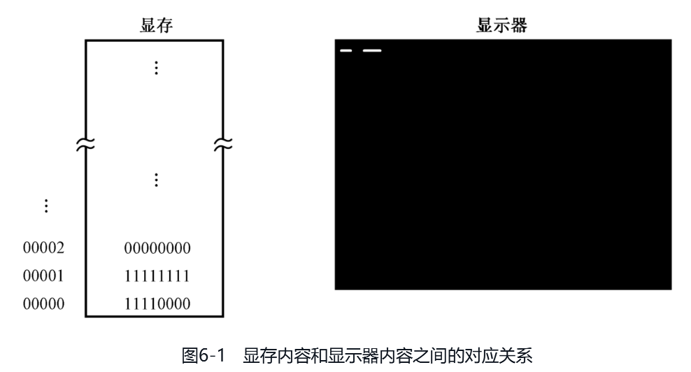

显卡的工作是周期性地从显存中提取这些比特，并把它们按顺序显示在屏幕上。如果是比特“0”，则像素保持原来的状态不变，因为屏幕本来就是黑的；如果是比特“1”，则点亮对应的像素。

继续观察图6-1，假设在显存中，第1字节的内容是11110000，第2字节的内容是11111111，其他所有的字节都是00000000。在这种情况下，屏幕左上角先是显示4个亮点，再显示4个黑点，然后再显示8个亮点。因为像素是紧挨在一起的，所以我们看到的先是一条白短线，隔着一定距离（4个像素）又是一条白长线。

黑色和白色只需要1比特就能表示，但要显示更多的颜色，1比特就不够了。现在最流行的，是用24比特，即3字节，来对应一个像素。因为$2^{24}$=16777216，所以在这种模式下，同屏可以显示16777216种颜色，这称为真彩色。

上面所讨论的，是人们常说的图形模式。图形模式是最容易理解的，同时对显示器来说也是最自然的模式。

现在是图形的时代，就连手机的屏幕都是五彩缤纷的。时光倒退到几十年前，在那个时代，真彩色还没有出现，显示器只能提供有限的色彩，处理器也不够强劲（以今天的眼光来看）。在这种情况下，人们不太可能认为图形显示技术有多么重要，因为他们不看高清电影，也没有数码相机，用计算机制作动画片更是不能想象的事。那个时候，人们的愿望很简单，只要能显示文字就行。

不管是显示图片，还是文字，对显示器来说没有什么不同，因为所有的内容都是由像素组成的，区别仅仅在于这些像素组成的是什么。有时候，人们会说，哦，显示的是一棵树；有时候，人们会说，哦，显示的是一个字母“H”。

问题是，操作显存里的比特，使得屏幕上能显示出字符的形状，是非常麻烦、非常烦琐的工作，因为你必须计算该字符所对应的比特位于显存里的什么位置。

为了方便，工程师们想出了一个办法。就像一个二进制数既可以是一个普通的数，也可以代表一条处理器指令一样，他们认为每个字符也可以表示成一个数。比如，数字0x4C就代表字符“L”，这个数被称为是字符“L”的ASCII代码，后面会讲到。

如图6-2所示，可以将字符的代码存放到显存里，第1个代码对应着屏幕左上角第1个字符，第2个代码对应着屏幕左上角第2个字符，后面的依次类推。剩下的工作是如何用代码来控制屏幕上的像素，使它们或明或暗以构成字符的轮廓，这是字符发生器和控制电路的事情。


传统上，这种专门用于显示字符的工作方式称为文本模式。文本模式和图形模式是显卡的两种基本工作模式，可以用指令访问显卡，设置它的显示模式。在不同的工作模式下，显卡对显存内容的解释是不同的。

为了给出要显示的字符，处理器需要访问显存，把字符的ASCII码写进去。但是，显存是位于显卡上的，访问显存需要和显卡这个外围设备打交道。同时，多一道手续自然是不好的，这当中最重要的考量是速度和效率。想想看，你让人传话给父母，和自己亲自往家里打电话，花费的时间是不一样的。为了实现一些快速的游戏动画效果，或者播放高码率的电影，不直接访问显存是办不到的。

为此，计算机系统的设计者们，这些敢想敢干的人，决定把显存映射到处理器可以直接访问的地址空间里，也就是内存空间里。

如图6-3所示，我们知道，8086可以访问1MB内存。其中，0x00000～9FFFF属于常规内存，由内存条提供；0xF0000～0xFFFFF由主板上的一个芯片提供，即ROM-BIOS。

这样一来，中间还有一个320KB的空洞，即0xA0000～0xEFFFF。传统上，这段地址空间由特定的外围设备来提供，其中就包括显卡。因为显示的功能对于现代计算机来说实在是太重要了。

由于历史的原因，所有在个人计算机上使用的显卡，在加电自检之后都会把自己初始化为80×25的文本模式。在这种模式下，屏幕上可以显示25行，每行80个字符，每屏总共2000个字符。

所以，如图6-3所示，一直以来，0xB8000～0xBFFFF这段物理地址空间，是留给显卡的，由显卡来提供，用来显示文本。除非显卡出了毛病，否则这段空间总是可以访问的。如果显卡出了毛病怎么办呢？很简单，计算机一定不会通过加电自检过程，这就是传说中的严重错误，计算机是无法启动的，更不要说加载并执行主引导扇区的内容了。

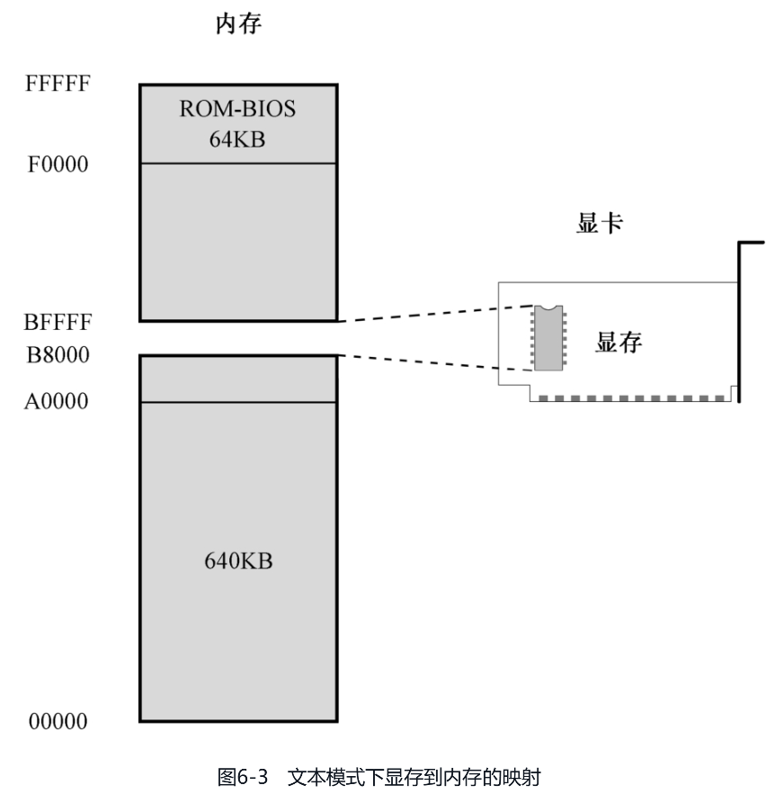

### 初始化段寄存器

和访问主内存一样，为了访问显存，也需要使用逻辑地址，也就是采用“段地址:偏移地址”的形式，这是处理器的要求。考虑到文本模式下显存的起始物理地址是0xB8000，这块内存可以看成段地址为0xB800，偏移地址从0x0000延伸到0xFFFF的区域，因此我们可以把段地址定为0xB800。

访问内存可以使用段寄存器DS，但这不是强制性的，也可以使用ES。因为DS还有别的用处，所以在这里我们使用ES来指向显存所在的段。

源程序第6、7行，首先把立即数0xB800传送到AX，然后再把AX的值传送到ES。这样一来，附加段寄存器ES就指向0xB800段（段基地址为0xB800）。

你可能会想，为什么不直接这样写：

```assembly
mov es, Oxb800
```

而要用寄存器AX来中转呢？

原因是不存在这样的指令，INTEL处理器不允许将一个立即数传送到段寄存器，它只允许这样的指令：

```assembly
mov 段寄存器, 通用寄存器
mov 段寄存器, 内存单元
```

没有人能够说清楚这里面的原因，INTEL公司似乎也从没有提到过这件事，尽管从理论上，这是可行的。我们只能想，也许INTEL是出于好心，避免我们无意中犯错，毕竟，段地址一旦改变，后面对内存的访问都会受到影响。理论上，麻烦一点的方法，可以保证你确实知道自己在做什么。

### 显存的访问和ASCII代码

一旦将显存映射到处理器的地址空间，我们就可以使用普通的传送指令(mov)来读写它，这无疑是非常方便的。现在，我们已经把0xB800作为段地址传送到附加段寄存器ES了，以后就用ES来读写显存。这样，段内偏移为0的位置就对应着屏幕左上角的字符。

在计算机中，每个用来显示在屏幕上的字符，都有一个二进制代码。这些代码和普通的二进制数字没有什么不同，唯一的区别在于，发送这些数字的硬件和接收这些数字的硬件把它们解释为字符，而不是指令或者用于计算的数字。

这就是说，在计算机中，所有东西都是无差别的数字，它们的意义只取决于生成者和使用者之间的约定。为了在终端和大型主机，以及主机和打印机、显示器之间交换信息，1967年，美国国家标准学会制定了美国信息交换标准代码(American Standard Code for Information Interchange, ASCII)，如表6-1所示。

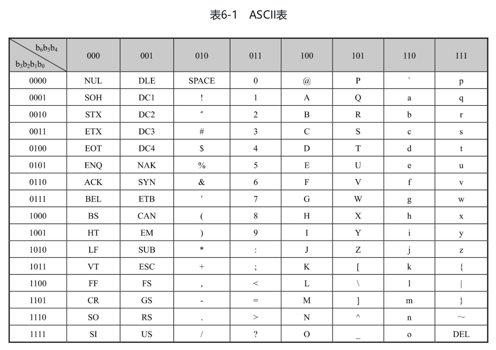

在不同设备之间，或者在同一设备的不同模块之间有一个信息传递标准是非常必要的。想想看，当你用手机向朋友发送短消息时，这些文字当然被编码成二进制数字。如果对方的手机使用了不同的编码，那么他将无法正确还原这些消息，而很可能显示为乱码。

值得注意的是，ASCII是7位代码，只用了一字节中的低7比特，最高位通常置0。这意味着，ASCII只包含128个字符的编码。所以，在表中，水平方向给出了代码的高3比特，而垂直方向给出了代码的低4比特。比如字符“*”，它的代码是二进制数的010 1010，即0x2A。

ASCII表中有相当一部分代码是不可打印和显示的，它们用于控制通信过程。比如，LF是换行；CR是回车；DEL和BS分别是删除和退格，在我们平时用的键盘上也是有的；BEL是振铃（使远方的终端响铃，以引起注意）；SOH是文头；EOT是文尾；ACK是确认。

在计算机发展的早期，还没有显示器和独立的键盘，计算机应用的典型场景是将电传打字机通过通信线路连接到IBM大型主机上，来使用主机提供的计算能力。电传打字机集成了键盘、打印和通信功能，可以向远程的主机发送操作命令，并接受主机的远程控制。在这个时候，ASCII中的控制字符是非常重要的，但现在已经没有什么用处了。

注意，一定要遵从约定。比如，你在处理器上编写程序算了一道数学题2+3，你也希望把结果5显示在屏幕上。这个时候，算出的结果是0000 0101，即0x05。但是，数字5和字符5是不同的，显卡在任何时候都认为你发送的是ASCII码。所以，你不应该发送0x05，而应该发送0x35。

屏幕上的每个字符对应着显存中连续2字节，前一个是字符的ASCII代码，后面是字符的显示属性，包括字符颜色（前景色）和底色（背景色）。如图6-4所示，字符“H”的ASCII代码是0x48，其显示属性是0x07；字符“e”的ASCII代码是0x65，其显示属性是0x07。


如图6-4所示，字符的显示属性（1字节）分为两部分，低4位定义的是前景色，高4位定义的是背景色。色彩主要由R、G、B这3位决定，毕竟我们知道，可以由红(R)、绿(G)、蓝(B)三原色来配出其他所有颜色。K是闪烁位，为0时不闪烁，为1时闪烁；I是亮度位，为0时正常亮度，为1时呈高亮。表6-2给出了背景色和前景色的所有可能值。


从表6-2来看，图6-4中的字符属性0x07可以解释为黑底白字，无闪烁，无加亮。

你可能觉得奇怪，当屏幕上一片漆黑，什么内容都没有的时候，显存里会是什么内容呢？

实际上，这个时候屏幕上显示的全是黑底白字的空格字符(Space)，它的ASCII代码是0x20，当你用大拇指按动键盘上最长的那个键时，就产生这个字符。空格只占用一个字符的位置，但没有图形轮廓，自然就无法在黑底上看到任何痕迹了。

### 显示字符

从源程序的第10行开始，到第35行，目的是显示一串字符“Label offset:”。为此，需要把每个字符的ASCII码顺序写到显存中。

为了方便，多数汇编语言编译器允许在指令中直接使用字符的字面值来代替数值形式的ASCII码，比如源程序第10行：`mov byte [es:0x00], 'L'` 这等效于  `mov byte [es:0x00], 0x4c`

尽管通过查表可以知道字符“L”的ASCII代码是0x4C，但毕竟费事。不过，要在指令中使用字符的字面值，这个字符必须用引号围起来，就像上面一样。在源程序的编译阶段，汇编语言编译器会将它转换成ASCII码的形式。

当前的mov指令是将立即数传送到内存单元，目的操作数是内存单元，源操作数是立即数（ASCII代码）。为了访问内存单元，需要给出段地址和偏移地址。在这条指令中，偏移地址为0x00，段地址在哪里呢？一般情况下，如果没有附加任何指示，段地址默认在段寄存器DS中。比如：`mov byte [0x00], 'L'`

当执行这条指令后，处理器把段寄存器DS的内容左移4位（相当于乘以十进制数16或者十六进制数0x10），加上这里的偏移地址0x00，就得到了物理地址。

但实际上，在我们的程序中，显存的段地址位于段寄存器ES中，我们希望使用段寄存器ES来访问内存。因此，这里使用了段超越前缀“es:”。这就是说，我们明确要求处理器在生成物理地址时，使用段寄存器ES，而不是默认情况下的段寄存器DS。

因为指令中给出的偏移地址是0x00，且段寄存器ES的值已经在前面被设为0xB800，故它指向段寄存器ES段中，偏移地址为0的内存单元，即0xB800:0x0000，也就是物理地址0xB8000，这个内存单元对应着屏幕左上角第一个字符的位置。

还需要注意的是，因为目的操作数给出的是一个内存地址，我们要用源操作数来修改这个地址里的内容，所以，目的操作数必须用方括号围起来，以表明它是一个地址，处理器应该用这个地址再次访问内存，将源操作数写进这个单元。实际上，这类似于高级语言里的指针。

最后，关键字“byte”用来修饰目的操作数，指出本次传送是以字节的方式进行的。在16位的处理器上，单次操作的数据宽度可以是8位，也可以是16位。到底是8位，还是16位，可以根据目的操作数或者源操作数来判断。遗憾的是，在这里，目的操作数是偏移地址0x00，它可以是字节单元，也可以是字单元，到底是哪一种，无法判断；而源操作数呢，是立即数0x4C，它既可以解释为8位的0x4C，也可以解释为16位的0x004C。在这种情况下，编译器将无法搞懂你的真实意图，只能报告错误，所以必须用“byte”或者“word”进行修饰（明确指示）。于是，一旦目的操作数被指明是“byte”的，那么，源操作数的宽度也就明确了。相反地，下面的指令就不需要任何修饰：

```assembly
mov [0x00], al	;按字节操作
mov ax, [0x02]	;按字操作
```

因为屏幕上的一个字符对应着内存中的2字节：ASCII代码和属性，所以，源程序第11行的功能是将属性值0x07传送到下一个内存单元，即偏移地址0x01处。这个属性可以解释为黑底白字，无闪烁，也无加亮，请参阅表6-2。

后面，从第12行开始，到第35行，用于向显存（或者叫显示缓冲区）填充剩余部分的字符。注意，在这个过程中，偏移地址一直是递增的。

### mov指令的格式

到目前为止，我们已经多次接触了mov指令。在处理器的整个指令集中，mov指令是用得最多的一条。

mov指令用于数据传送。既然是数据传送，那么，目的操作数的作用应该相当于一个“容器”，故必须是通用寄存器或者内存单元；源操作数呢，也可以是和目的操作数具有相同数据宽度的通用寄存器和内存单元，还可以是立即数。传送指令只影响目的操作数的内容，不改变源操作数的内容。比如：

```assembly
mov ah, bh
mov ax, dx
```

以上，第一条指令的目的操作数和源操作数都是8位寄存器，指令执行后，寄存器AH的内容和寄存器BH相同；第二条指令的目的操作数和源操作数都是16位寄存器，指令执行后，寄存器AX的内容和寄存器DX相同。但是，由于数据宽度不同，下面这条指令就是错误的：

```assembly
mov ax, bl
```

再来看下面两条指令：

```assembly
mov [0x02], bh
mov ax, [0x06]
```

以上，第一条指令是把寄存器BH中的内容传送到偏移地址为0x02的8位内存单元；第二条指令是把偏移地址为0x06的16位内存单元里的内容传送到寄存器AX中。由于这两条指令中都有寄存器操作数，故不需要用“byte”或者“word”来修饰。

传送指令的源操作数也可以是立即数。比如：

```assembly
mov ah, 0x05
mov word [0x1c], 0xf000
```

以上，第一条指令是把立即数0x05传送到寄存器AH中，指令执行后，寄存器AH中的内容为0x05；第二条指令是把立即数0xf000传送到偏移地址为0x1c的16位内存单元中。因为上一节所说的原因，这里要用word来修饰。

mov指令的目的操作数不允许为立即数，而且，目的操作数和源操作数不允许同时为内存单元。因此，下面两条指令都是不正确的：

```assembly
mov 0x1c, al
mov [0x01], [0x02]
```

以上，说第一条指令是错误的，这很好理解。想想看，你把寄存器AL中的内容传送给一个立即数，这是什么意思呢？于理不通。至于第二条指令为什么不正确，那是因为处理器不允许在两个内存单元之间直接进行传送操作。事实上，这条指令的功能可以用两条指令实现（假设传送的是一个字）：

```assembly
mov ax, [0x02]
mov [0x01], ax
```

就算处理器支持在两个内存单元之间直接传送数据，那么，它依然是在内部按上面的两个步骤进行操作的。而且，支持这种直接传送操作的指令还需要增加额外的电路。

不单是mov指令，其他指令都不支持在两个内存单元之间直接进行操作，包括加、减、乘、除和逻辑运算等指令。事情是明摆着的，既然增加了处理器的复杂性和用两条指令没什么区别，干脆就用两条指令好了。

## 显示标号的汇编地址

### 标号

处理器访问内存时，采用的是“段地址:偏移地址”的模式。对于任何一个内存段来说，段地址可以开始于任何16字节对齐的地方，偏移地址则总是从0x0000开始递增的。

为了支持这种内存访问模式，在源程序的编译阶段，编译器会把代码清单6-1整体上作为一个独立的段来处理，并从0开始计算和跟踪每条指令的地址。因为该地址是在编译期间计算的，故称为汇编地址。汇编地址是在源程序编译期间，编译器为每条指令确定的汇编位置(Assembly Position)，指示该指令相对于程序或者段起始处的距离，以字节计。当编译后的程序装入物理内存后，它又是该指令在内存段内的偏移地址。

如表6-3所示，在用我们的配书工具Nasmide书写并编译代码清单6-1后，除了生成一个以“.bin”为扩展名的二进制文件，还会生成一个以“.lst”为扩展名的列表文件。这张表列出的，就是本章代码清单6-1编译后生成的列表文件内容。


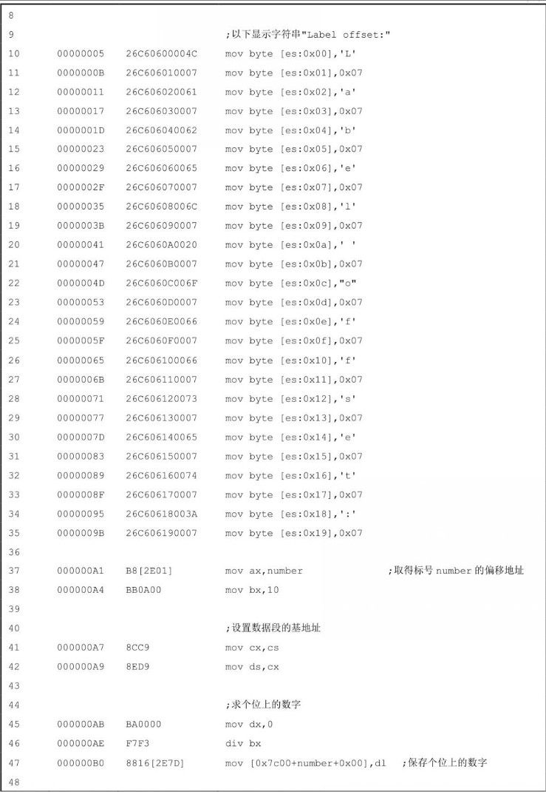


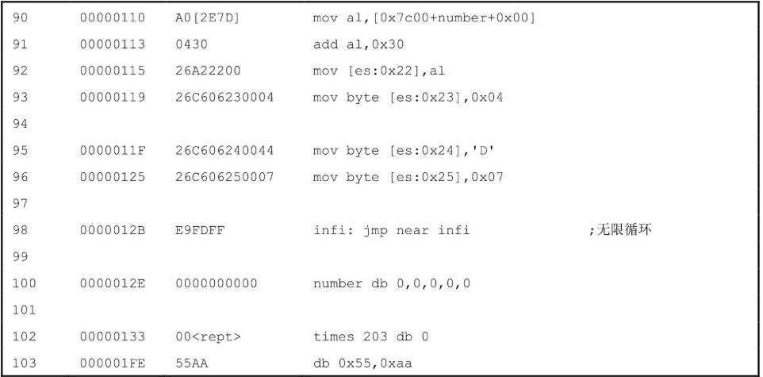

表6-3共分五栏，从左到右依次是行号、指令的汇编地址、指令编译后的机器代码、源程序代码和注释。可以看出，第一条指令mov ax，0xb800的汇编地址是0x00000000，对应的机器代码为B8 00B8；第二条指令mov es，ax的汇编地址是0x00000003，机器代码为8E C0。

从表6-3中可以看出，在编译阶段，每条指令都被计算并赋予了一个汇编地址，就像它们已经被加载到内存中的某个段里一样。实际上，如图6-5所示，当编译好的程序加载到物理内存后，它在段内的偏移地址和它在编译阶段的汇编地址是相同的。

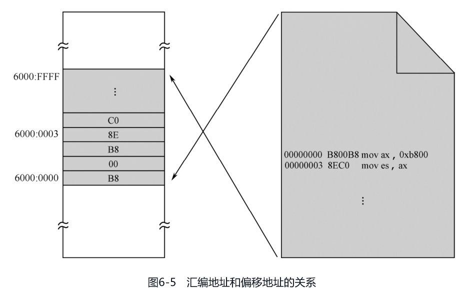

正如图6-5所示，编译后的程序是整体加载到内存中某个段的，交叉箭头用于指示它们之间的映射关系。之所以箭头是交叉的，是因为源程序的编译是从上往下的，而内存地址的增长是从下往上的（从低地址往高地址方向增长）。

在图6-5中，假定程序是从内存物理地址0x60000开始加载的。该物理地址也对应着逻辑地址0x6000:0x0000，因此我们可以说，该程序位于段0x6000内。

在编译阶段，源程序的第一条指令mov ax，0xb800的汇编地址是0x00000000，而它在整个程序装入内存后，在段内的偏移地址是0x0000，即逻辑地址0x6000:0000，两者的偏移地址是一致的。

再看源程序的第二条指令，是mov es，ax，它在编译阶段的汇编地址是0x00000003。在整个程序装入内存后，它在段内的偏移地址是0x0003，也没有变化。

这就很好地说明了汇编地址和偏移地址之间的对应关系。理解这一点，对后面的编程很重要。

在NASM汇编语言里，每条指令的前面都可以拥有一个标号，以代表和指示该指令的汇编地址。毕竟，由我们自己来计算和跟踪每条指令所在的汇编地址是极其困难的。这里有一个很好的例子，比如源程序第98行：

```
infi: jmp near infi
```

在这里，行首带冒号的是标号是“infi”。请看表6-3，这条指令的汇编地址是0x0000012B，故infi就代表数值0x0000012B，或者说是0x0000012B的符号化表示。

标号之后的冒号是可选的。所以下面的写法也是正确的：

```
infi jmp near infi
```

标号并不是必需的，只有在我们需要引用某条指令的汇编地址时，才使用标号。正是因为这样，本章源程序中的绝大多数指令都没有标号。

标号可以单独占用一行的位置，像这样：

```
infi:
	jmp near infi
```

这种写法和第98行相比，效果并没有什么不同，因为infi所在的那一行没有指令，它的地址就是下一行的地址，换句话说，和下一行的地址是相同的。

标号可以由字母、数字、“\_”、“$”、“#”、“@”、“～”、“.”、“?”组成，但必须以字母、“.” “_” 和 “?”中的任意一个打头。

注意，汇编器输出的.lst列表文件通常只是一个初步的编译结果，还需要后续的处理，所以这个文件并不能反映编译后的结果，与编译后的结果可能会有出入，在分析程序的结果时，不要完全依赖于这个文件，而要以实际的编译结果为准。

### 如何显示十进制数字

我们已经知道，标号代表并指示它所在位置处的汇编地址。现在，我们要编写指令，在屏幕上把这个地址的数值显示出来。为此，源程序的第37行用于获取标号所代表的汇编地址：

```
mov ax, number
```

标号“number”位于源程序的第100行，只不过后面没有跟着冒号“:”。你当然可以加上冒号，但这无关紧要。注意，传送到寄存器AX的值是在源程序编译时确定的，在编译阶段，编译器会将标号number转换成立即数。如表6-3所示，标号number处的汇编地址是0x012E，因此，这条语句其实就是（等效于）

```
mov ax, 0x012E
```

问题在于，如果不是借助于别的工具和手段，你不可能知道此处的汇编地址是0x012E。所以，在汇编语言中使用标号的好处是不必关心这些。

因此，当这条指令编译后，得到的机器指令为B8［2E01］，或者B8 2E 01。B8是操作码，后面是字操作数0x012E，只不过采用的是低端字节序。

十六进制数0x012E等于十进制数302，但是，通过前面对字符显示原理的介绍，我们应该清楚，直接把寄存器AX中的内容传送到显示缓冲区，是不可能在屏幕上出现“302”的。

解决这个问题的办法是将它的每个数位单独拆分出来，也就是分解它的每个数位。使用传统的数位分解方法，需要不停地除以10，每次的余数就是分解出来的数位。什么时候商为0，分解过程就结束了。

考虑到寄存器AX是16位的，可以表示的数从二进制的0000000000000000到1111111111111111，也就是十进制的0～65535，故它可以容纳最大5个数位的十进制数，从个位到万位，比如61238。那么，假如你并不知道它是多少，只知道它是一个5位数，如何通过分解得到它的每个数位呢？

首先，用61238除以10，商为6123，余8，本次相除的余数8就是个位数字；

然后，把上一次的商数6123作为被除数，再次除以10，商为612，余3，余数3就是十位数字；

接着，再用上一次的商数612除以10，商为61，余2，余数2就是百位数字；

同上，再用61除以10，商为6，余1，余数1就是千位数字；

最后，用6除以10，商为0，余6，余数6就是万位数字。

很显然，只要把AX的内容不停地除以10，只需要5次，把每次的余数反向组合到一起，就是原来的数字。同样，如果反向把每次的余数显示到屏幕上，应该就能看见这个十进制数是多少了。

不过，即使是得到了单个的数位，也还是不能在屏幕上显示，因为它们是数字，而非ASCII代码。比如，数字0x05和字符“5”是不同的，后者实际上是数字0x35。

观察表6-1，你会发现，字符“0”的ASCII代码是0x30，字符“1”的ASCII代码是0x31，字符“9”的ASCII代码是0x39。这就是说，把每次相除得到的余数加上0x30，在屏幕上显示就没问题了。

### 在程序中声明并初始化数据

可以用处理器提供的除法指令来分解一个数的各个数位，但是每次除法操作后得到的数位需要临时保存起来以备后用。使用寄存器不太现实，因为它的数量很少，且还要在后续的指令中使用。因此，最好的办法是在内存中专门留出一些空间来保存这些数位。

尽管我们的目的仅仅是分配一些空间，但是，要达到这个目的必须初始化一些初始数据来“占位”。这就好比排队买火车票，你可以派任何无关的人去帮你占个位置，真正轮到你买的时候，你再出现。源程序的第100行用于声明并初始化这些数据，而标号number则代表了这些数据的起始汇编地址。

要放在程序中的数据是用DB指令来声明(Declare)的，DB的意思是声明字节(Declare Byte)，所以，跟在它后面的操作数都占一字节的长度（位置）。注意，如果要声明超过一个以上的数据，各个操作数之间必须以逗号隔开。

除此之外，DW(Declare Word)用于声明字数据，DD(Declare Double Word)用于声明双字（两个字）数据，DQ(Declare Quad Word)用于声明四字数据。DB、DW、DD和DQ并不是处理器指令，它只是编译器提供的汇编指令，所以称作伪指令(Pseudo Instruction)。伪指令是汇编指令的一种，它没有对应的机器指令，所以它不是机器指令的助记符，仅仅在编译阶段由编译器执行，编译成功后，伪指令就消失了。所以在程序执行时，伪指令是得不到处理器光顾的。实际上，程序执行时，伪指令已不存在。

声明的数据可以是任何值，只要不超过伪指令所指示的大小。比如，用DB声明的数据，不能超过一字节所能表示的数的大小，即0xFF。我们在此声明了5字节，并将它们的值都初始化为0。

和指令不同，对于在程序中声明的数值，在编译阶段，编译器会在它们被声明的汇编地址处原样保留。有人会问，处理器不是可以访问任何内存位置吗，为啥还要用DB声明？处理器当然可以访问任何内存位置，但那个位置可能是其他程序的，伪指令DB用来保留只供自己访问的内存位置。

按照标准的做法，程序中用到的数据应当声明在一个独立的段，即数据段中。但是在这里，为方便起见，数据和指令代码是放在同一个段中的。不过，方便是方便了，但也带来了一个隐患：如果安排不当，处理器就有可能执行到那些非指令的数据上。尽管有些数碰巧和某些指令的机器码相同，也可以顺利执行，但毕竟不是我们想要的结果，违背了我们的初衷。

好在我们很小心，在本程序中把数据声明在所有指令之后，在这个地方，处理器的执行流程无法到达。

### 分解数的各个数位

源程序第41、42行，是把代码段寄存器CS的内容传送到通用寄存器CX，然后再从寄存器CX传送到数据段寄存器DS。在此之后，数据段和代码段都指向同一个段。之所以这么做，是因为我们刚才声明的数据是和指令代码混在一起的，可以认为是位于代码段中的。尽管在指令中访问这些数据可以使用段超越前缀“CS:”，但习惯上，通过数据段来访问它们更自然一些。

前面已经说过，要分解一个数的各个数位，需要做除法。8086处理器提供了除法指令div，它可以做两种类型的除法。

第一种类型是用16位的二进制数除以8位的二进制数。在这种情况下，被除数必须在寄存器AX中，必须事先传送到寄存器AX里。除数可以由8位的通用寄存器或者内存单元提供。指令执行后，商在寄存器AL中，余数在寄存器AH中。比如：

```
div cl
div byte [0x0023]
```

在前一条指令中，寄存器CL用来提供8位的除数。假如寄存器AX中的内容是0x0005，寄存器CL中的内容是0x02，指令执行后，寄存器CL中的内容不变，寄存器AL中的商是0x02，寄存器AH中的余数是0x01。

在后一条指令中，除数位于数据段内偏移地址为0x0023的内存单元里。这条指令执行时，处理器将数据段寄存器DS的内容左移4位，加上偏移地址0x0023以形成物理地址。然后，处理器再次访问内存，从那个物理地址处取得一字节，作为除数同寄存器AX做一次除法。

任何时候，只要是在指令中涉及内存地址的，都允许使用段超越前缀，比如：

```
div byte [cs:0x0023]
div byte [es:0x0023]
```

话又说回来了，在一个源程序中，通常不可能知道汇编地址的具体数值，只能使用标号。所以，指令中的地址部分更常见的形式是使用标号，比如：

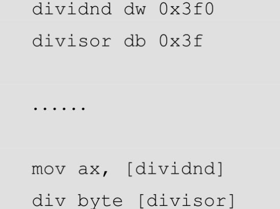

上面的程序很有意思，首先，声明了标号dividnd并初始化了一个字0x3f0作为被除数；然后，又声明了标号divisor并初始化一字节0x3f作为除数。

在后面的mov和div指令中，用标号dividnd和divisor来代替被除数和除数的汇编地址。在编译阶段，编译器用具体的数值取代括号中的标号dividnd和divisor。现在，假设dividnd和divisor所代表的汇编地址分别是0xf000和0xf002，那么，在编译阶段，编译器在生成这两条指令的机器码之前，会先将它们转换成以下的形式：

```
mov ax, [0xf000]
div byte [0xf002]
```

当第一条指令执行时，处理器用0xf000作为偏移地址，去访问数据段（段地址在段寄存器DS中），来取得内存中的一个字0x3F0，并把它传送到寄存器AX中。

当第二条指令执行时，处理器采用同样的方法取得内存中的一字节0x3F，用它来和寄存器AX中的内容做除法。当然，除法指令div的功能你是知道的。

说了这么多，其实是在强调标号和汇编地址的对应关系，以及如何在指令中使用符号化的偏移地址。

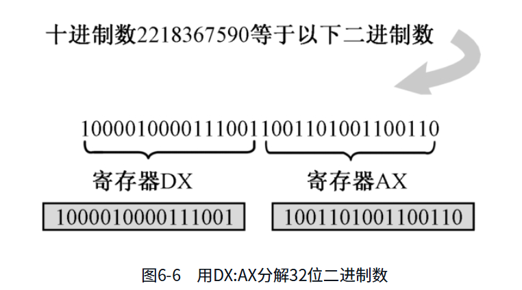

第二种类型是用32位的二进制数除以16位的二进制数。在这种情况下，因为16位的处理器无法直接提供32位的被除数，故要求被除数的高16位在寄存器DX中，低16位在寄存器AX中。

这里有一个例子，如图6-6所示，假如被除数是十进制数2218367590，那么，它对应着一个32位的二进制数10000100001110011001101001100110。在做除法之前，先要分成两段进行“切割”，以分别装入寄存器DX和寄存器AX。为了方便，我们通常用“DX:AX”来描述32位的被除数。

同时，除数可以由16位的通用寄存器或者内存单元提供，指令执行后，商在寄存器AX中，余数在寄存器DX中。比如下面的指令：

```
div cx
div word [0x0230]
```

源程序第45行把0传送到寄存器DX，这意味着，我们是想把DX:AX作为被除数，即被除数的高16位全是0。至于被除数的低16位，已经在第37行的代码中被置为标号number的汇编地址。

回到前面的第38行，该指令把10作为除数传送到通用寄存器BX中。

一切都准备好了，源程序第46行，div指令用DX:AX作为被除数，除以寄存器BX的内容，执行后得到的商在寄存器AX中，余数在寄存器DX中。因为除数是10，余数自然比10小，我们可以从寄存器DL中取得。

第1次相除得到的余数是个位上的数字，我们要将它保存到声明好的数据区中。所以，源程序第47行，我们又一次用到了传送指令，把寄存器DL中的余数传送到数据段。

可以看到，指令中没有使用段超越前缀，所以处理器在执行时，默认地使用段寄存器DS来访问内存。偏移地址是由标号number提供的，它是数据区的首地址，也可以说是数据区中第一个数据的地址。因此，number和number+0x00是一样的，没有区别。

因为我们访问的是number所指向的内存单元，故要用中括号围起来，表明这是一个地址。

令人不解的是，在第47行中，偏移地址并非理论上的number+0x00，而是0x7c00+number+0x00。这个0x7c00是从哪里来的呢？

标号number所代表的汇编地址，其数值是在源程序编译阶段确定的，而且是相对于整个程序的开头，从0开始计算的。请看一下表6-3的第37行，这个在编译阶段计算出来的值是0x012E。在运行的时候，如果该程序被加载到某个段内偏移地址为0的地方，这不会有什么问题，因为它们是一致的。

但是，事实上，如图6-7所示，这里显示的是整个0x0000段，其中深色部分为主引导扇区所处的位置。主引导扇区代码是被加载到0x0000:0x7C00处的，而非0x0000:0x0000。对于程序的执行来说，这不会有什么问题，因为主引导扇区的内容被加载到内存中并开始执行时，CS=0x0000，IP=0x7C00。

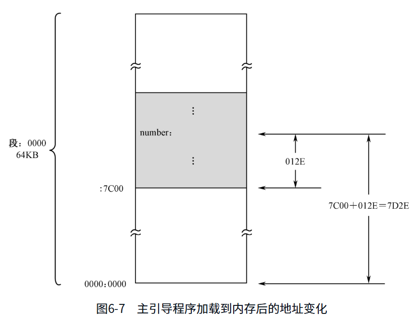

加载位置的改变不会对处理器执行指令造成任何困扰，但会给数据访问带来麻烦。要知道，当前数据段寄存器DS的内容是0x0000，因此，number的偏移地址实际上是0x012E+0x7C00=0x7D2E。当正在执行的指令仍然用0x012E来访问数据时，灾难就发生了。

所以，在编写主引导扇区程序时，我们就要考虑到这一点，必须把代码写成

```
mov [0x7c00+number+0x00], dl
```

指令中的目的操作数是在编译阶段确定的，因此，在编译阶段，编译器同样会首先将它转换成以下的形式，再进一步生成机器码：

```
mov [0x7d2e], dl
```

这样，如表6-3的第47行所示，在编译后，编译器就会将这条指令编译成88 16 2E 7D，其中前2字节是操作码，后2字节是低端字节序的0x7D2E。当这条指令执行时，处理器将段寄存器DS的内容（和寄存器CS一样，是0x0000）左移4位，再加上指令中提供的偏移地址0x7D2E，就得到了实际的物理地址(0x07D2E)。

关于这条指令的另外一个问题是，虽然目的操作数也是一个内存单元地址，但并没有用关键字“byte”来修饰。这是因为源操作数是寄存器DL，编译器可以据此推断这是一字节操作，不存在歧义。

现在已经得到并保存了个位上的数字，下一步是计算十位上的数字，方法是用上一次得到的商作为被除数，继续除以10。恰好，寄存器AX已经是被除数的低16位，现在只需要把寄存器DX的内容清零即可。

为此，代码清单6-1第50行，用了一个新的指令xor来将寄存器DX的内容清零。

xor，在数字逻辑里是异或(eXclusive OR)的意思，或者叫互斥或、互斥的或运算。在《穿越计算机的迷雾》一书中，已经花了大量的篇幅讲解数字逻辑。在数字逻辑里，如果0代表假，1代表真，那么

```
0 xor 0 = 0
0 xor 1 = 1
1 xor 0 = 1
1 xor 1 = 0
```

xor指令的目的操作数可以是通用寄存器和内存单元，源操作数可以是通用寄存器、内存单元和立即数（不允许两个操作数同时为内存单元）。而且，异或操作是在两个操作数相对应的比特之间单独进行的。

一般地，xor指令的两个操作数应当具有相同的数据宽度。因此，其指令格式可以总结为以下几种情况：

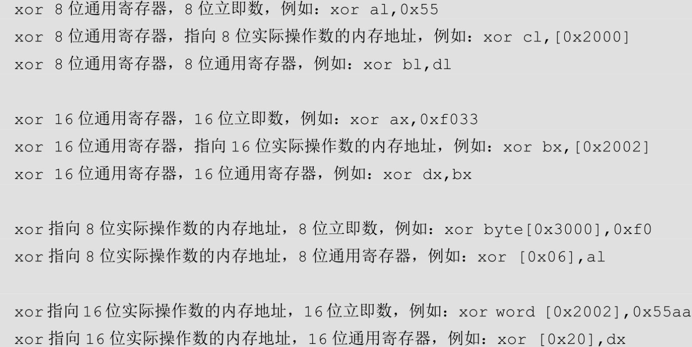

因为异或操作是在两个操作数相对应的比特之间单独进行的，故以下指令执行后，寄存器AX中的内容为0xF0F3。

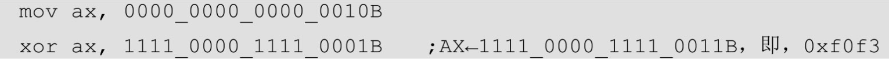

注意，这两条指令的源操作数都采用了二进制数的写法，NASM编译器允许使用下划线来分开它们，好处是可以更清楚地观察到那些我们感兴趣的比特。

回到当前程序中，因为指令xor dx，dx中的目的操作数和源操作数相同，那么，不管寄存器DX中的内容是什么，两个相同的数字异或，其结果必定为0，故这相当于将寄存器DX清零。

值得一提的是，尽管都可以用于将寄存器清零，但是编译后，mov dx，0的机器码是BA 00 00；而xor dx，dx的机器码则是31 D2，不但较短，而且，因为xor dx，dx的两个操作数都是通用寄存器，所以执行速度最快。

第二次相除的结果可以求得十位上的数字，源程序第52行用来将十位上的数字保存到从number开始的第2个存储单元里，即number+0x01。

从源程序第55行开始，一直到第67行，做的都是和前面相同的事情，即分解各位上的数字，并予以保存，这里不再赘述。

### 显示分解出来的各个数位

经过5次除法操作，可以将寄存器AX中的数分解成单独的数位，下面的任务是将这些数位显示出来，方法是从寄存器DS指向的数据段依次取出这些数位，并写入寄存器ES指向的附加段（显示缓冲区）。

在分解并保存各个数位的时候，顺序是“个、十、百、千、万”位，当在屏幕上显示时，却要反过来，先显示万位，再显示千位，等等，因为屏幕显示是从左往右进行的。所以，源程序第70行，先从数据段中偏移地址为number+0x04处取得万位上的数字，传送到寄存器AL。当然，因为程序是加载到0x0000:0x7C00处的，所以正确的偏移地址是0x7C00+number+0x04。

然后，源程序第71行，将寄存器AL中的内容加上0x30，以得到与该数字对应的ASCII代码。在这里，add是加法指令，用于将一个数与另一个数相加。

add指令需要两个操作数，目的操作数可以是8位或者16位的通用寄存器，或者指向8位或者16位实际操作数的内存地址；源操作数可以是相同数据宽度的8位或者16位通用寄存器、指向8位或者16位实际操作数的内存地址，或者立即数，但不允许两个操作数同时为内存单元。相加后，结果保存在目的操作数中。比如：

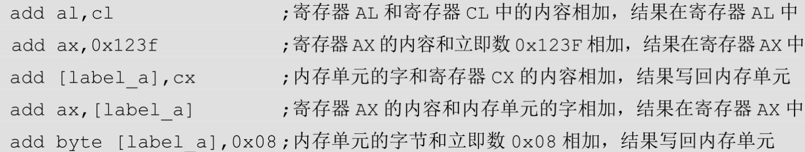

源程序第72行，将要显示的ASCII代码传送到显示缓冲区偏移地址为0x1A的位置，该位置紧接着前面的字符串“Label offset:”。显示缓冲区是由段寄存器ES指向的，因此使用了段超越前缀。

源程序第73行，将该字符的显示属性写入下一个内存位置0x1B。属性值0x04的意思是黑底红字，无闪烁，无加亮。

从源程序的第75行开始，到第93行，用于显示其他4个数位。

源程序第95、96行，用于以黑底白字显示字符“D”，意思是所显示的数字是十进制的。

## 使程序进入无限循环状态

数字显示完成后，原则上整个程序就结束了，但对处理器来说，它并不知道。对它来说，取指令、执行是永无止境的。程序有大小，执行无停息，它这么做的结果，就是会执行到后面非指令的数据上，然后……

问题在于我们现在的确无事可做。为避免发生问题，源程序第98行，安排了一个无限循环：

```
infi: jmp near infi
```

jmp是转移指令，用于使处理器脱离当前的执行序列，转移到指定的地方执行，关键字near表示目标位置依然在当前代码段内。上面这条指令唯一特殊的地方在于它不是转移到别处，而是转移到自己。也就是说，它将会不停地重复执行自己。不要觉得奇怪，这是允许的。

处理器取指令、执行指令是依赖于段寄存器CS和指令指针寄存器IP的，8086处理器取指令时，把寄存器CS的内容左移4位，加上寄存器IP的内容，形成20位的物理地址，取得指令，然后执行，同时把IP的内容加上当前指令的长度，以指向下一条指令的偏移地址。

但是，一旦处理器取到的是转移指令，情况就完全变了。

很容易想到，指令 jmp near infi 的意图是转移到标号infi所在的位置执行。可是，正如我们前面所说的，程序在内存中的加载位置是0x0000:0x7C00，所以，这条指令应当写成

```
jmp near 0x7c00+infi
```

实际上，不加还好，加上了0x7C00，就完全错了。

jmp指令有多种格式。最典型的，它的操作数可以是直接给出的段地址和偏移地址，这称为绝对地址。比如：

```
jmp 0x5000:0xf0c0
```

此时，要转移到的目标位置是非常明确的，即段地址为0x5000，段内偏移地址为0xf0c0。在这种情况下，指令的操作码为0xEA，故完整的机器指令是：

```
EA C0 F0 00 50
```

处理器执行时，发现操作码为0xEA，于是，将指令中给出的段地址传送到段寄存器CS；将偏移地址传送到指令指针寄存器IP，从而转移到目标位置处接着执行。

但是，在此处，jmp指令使用了关键字“near”，且操作数是以标号(infi)的形式给出的。这很容易让我们想到，这又是另一种形式的转移指令，转移的目标位置处在当前代码段内，指令中的操作数应当是目标位置的偏移地址。实际上，这是不正确的。

实际上，这是一个3字节指令，操作码是0xE9，后跟一个16位（2字节）的操作数。但是，该操作数并非目标位置的偏移地址，而是目标位置相对于当前指令处的偏移量（以字节为单位）。在编译阶段，编译器是这么做的：用标号（目标位置）处的汇编地址减去当前指令的下一条指令（每当处理器取得一条指令并开始执行的同时，指令指针寄存器也已经被调整以指向下一条指令了。）的汇编地址，就得到了jmp near infi指令的实际操作数。也不是编译器愿意费这个事，这是处理器的要求。这样看来，jmp near infi的机器指令格式和它的汇编指令格式完全不同，颇具迷惑性，所以一定要认清它的本质。这种转移是相对的，操作数是一个相对量，如果你人为地加上0x7C00，那反而不对了。

那么，编译器是如何区分这两种不同的转移方式呢？很简单，当它看到jmp之后是一个绝对地址，如0xF000:0x2000时，它就知道应当编译成使用操作码0xEA的直接绝对转移指令。相反地，如果它发现jmp之后是一个标号，那么，它就会编译成使用操作码为0xE9的相对转移指令。关键字“near”不是最主要的，它仅仅用于指示相对量是16位的。

在这里，目标位置就是当前指令自己的位置，假定它的汇编地址是x，下一条指令（不管实际上有没有）的汇编地址是x+3。用x减去x+3，即x-x-3，即0-3。打开Windows计算器程序，实际减一下看看，你会发现，用二进制的0减去二进制的11，结果是


由于是在不断地向左边借位的，除了最右边是01，左边都是无休止的“1”。

再切换到十六进制计算一下0x0减去0x3，结果是


同样由于是在不断地向左边借位的，除了最右边是D，左边都是无休止的F。

由于在指令中使用了near关键字，因此，以上无休止的结果将被截断，只保留右边16位，即0xFFFD。又因为x86处理器使用低端字节序，所以，jmp near infi指令编译后的机器代码为E9 FD FF。

你可能觉得疑惑：0xFFFD等于十进制数65533，而这条指令需要的操作数实际是-3，我们这样做的原理是什么呢？计算机又是怎么表示负数的呢？不要着急，下一章我们就要介绍负数，并回过头来重新认识这个问题。

在指令执行阶段，处理器用指令指针寄存器IP的内容（它已经指向下一条指令）加上该指令的操作数，就得到了要转移的实际偏移地址，同时寄存器CS的内容不变。因为改变了指令指针寄存器IP的内容，这直接导致处理器的指令执行流程转向目标位置。

就jmp near infi指令来说，假定它的段内偏移量是0x7D2B，当它执行时，转移到的目标位置依然是0x7D2B，而指令指针寄存器IP的内容是下一条指令的地址0x7D2E。用来取代IP的新值是IP+操作数，也就是0x7D2E+0xFFFD。用Windows计算器程序实际做一下，0x7D2E+0xFFFD的结果是0x17D2B，但处理器只使用16位的偏移地址，故只保留16位的结果0x7D2B。因此，传送到指令指针寄存器IP的内容依然是这条jmp指令自己的地址，这导致处理器再次执行当前指令。

jmp指令具有多种格式，我们现在所用的，只是其中的一种，叫作相对近转移。有关其他格式，以及这些格式之间的差异，我们将在后面的章节里结合具体的实例进行讲解。

## 完成并编译主引导扇区代码

### 主引导扇区有效标志

主引导扇区在系统启动过程中扮演着承上启下的角色，但并非唯一的选择。如果硬盘的主引导扇区不可用，系统还有其他选择，比如可以从光盘和U盘启动。

然而，如果不试试水的深浅就一个猛子扎下池塘，这并非明智之举。同样的，如果主引导扇区是无效的，上面并非一些处理器可以识别的指令，而处理器又不加鉴别地执行了它，其结果是陷入宕机状态，更不要提从其他设备启动了。

为此，计算机的设计者们决定，一个有效的主引导扇区，其最后2字节的数据必须是0x55和0xAA。否则，这个扇区里保存的就不是一些有意而为的数据。

定义这2字节很简单，伪指令db和dw就可以实现。源程序第103行就是db版本的实现，但没有标号。标号的作用是提供当前位置的汇编（偏移）地址，供其他指令引用，如果没有任何指令引用这个地址，标号可以省略。这是单独的2字节，所以0x55在前，0xAA在后，即使编译之后也是这个顺序。

但是，如果采用dw版本，应该这样写：

```
dw 0xaa55
```

因为，在INTEL处理器上，将一个字写入内存时，是采用低端字节序的，低字节0x55置入低地址端（在前），高字节0xAA置入高地址端（在后）。

麻烦在于，如何使这2字节正好位于512字节的最后。前面的代码有多少字节我们不知道，那是由NASM编译器计算和跟踪的。

我们当然有非常好的办法，但还不宜在这里说明。但是，经过计算和尝试，我们知道，在前面的内容和结尾的0xAA55之间，有203字节的空洞。因此，源程序的第102行，用于声明203个为0的数值来填补。

为了方便，伪指令times可用于重复它后面的指令若干次。比如

```
times 20 mov ax, bx
```

将在编译时重复生成mov ax，bx指令20次，即重复该指令的机器码(89 D8)20次。因此

```
times 203 db 0
```

### 代码的保存和编译

本章的代码是现成的，配书源代码解压缩之后，可以在文件夹“c06”里找到，文件名为c06_mbr.asm。打开该文件，将其编译成c06_mbr.bin。

该文件的大小为512字节，可以用配书工具HexView来查看其内容，如图6-8所示。

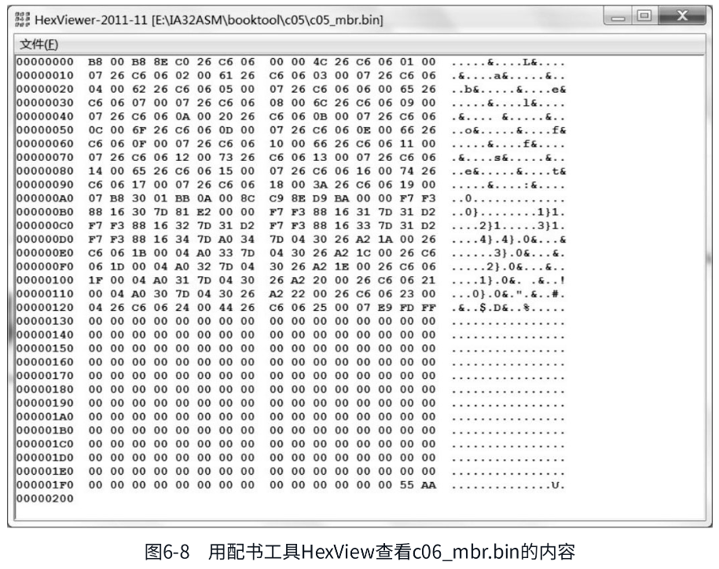

显而易见，在编译之后，源程序中的标号、注释、伪指令统统消失了，只剩下纯粹的机器指令和数据。那些需要在编译阶段决定的内容，也都有了确切的值。

## 加载和运行主引导扇区代码

### 把编译后的指令写入主引导扇区

在第5章，我们已经安装了VirtualBox虚拟机软件，并在它里面创建了一台名为LEARNASM的虚拟计算机。除此之外，还为它创建了一块虚拟硬盘。

虚拟硬盘其实是一个扩展名为“.vhd”的文件，具体的文件名和创建位置只有你自己知道。但是，无论如何，你现在都可以将我们刚刚编译好的代码写入这个虚拟硬盘的主引导扇区里。

首先，启动配书工具FixVhdWr，然后选择虚拟硬盘文件。如果以前已经选择过，则不必再次选择，FixVhdWr软件会自动打开它。注意，要写入的那个虚拟硬盘，必须是VirtualBox虚拟机使用的硬盘。否则的话，虚拟机怎么可能执行到你写入的程序呢！

接着，要在数据文件选择区域添加刚才编译好的二进制文件c06_mbr.bin，然后根据实际需求单击界面底部的功能按钮，包括“写入”“写入并执行VBox虚拟机”等。

最后要交代一句，千万不要在虚拟计算机LEARN-ASM运行的时候进行数据写入操作，因为虚拟硬盘文件正被VirtualBox以独占的方式使用。否则的话，会导致数据写入失败。

### 启动虚拟机观察运行结果

在Virtual Box软件的主界面上，选择“LEARN-ASM”计算机，然后单击“运行”按钮。如果一切顺利的话，程序的运行效果如图6-9所示。

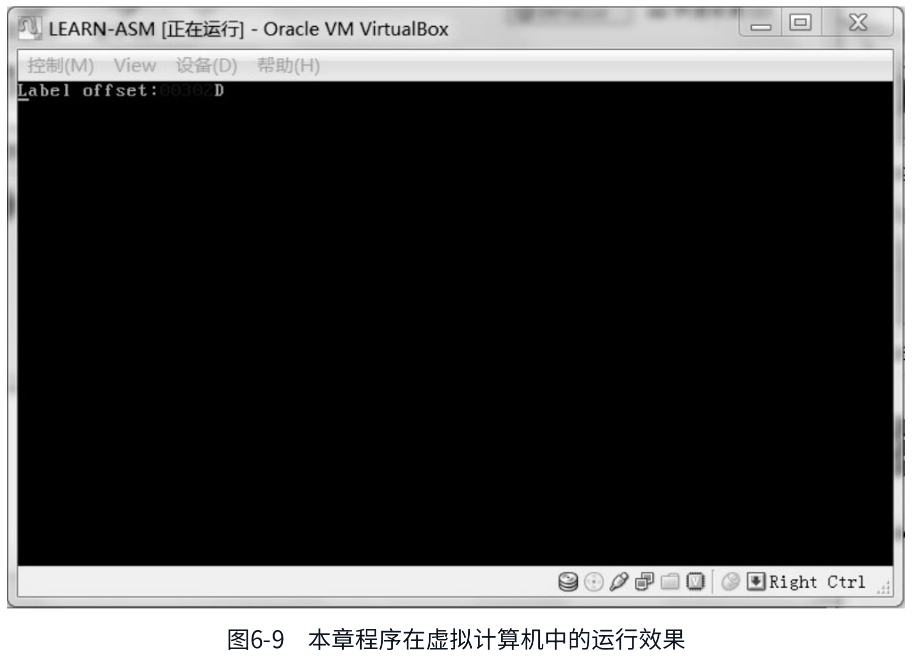

## 程序的调试技术

### 开源的Bochs虚拟机软件

程序员的工作就像在历险，困难重重，途中不可避免地要遇上暗礁。有时候，少了一个字符，或者多了一个字符，或者拼错了字符，程序就无法成功编译；有时候，尽管能够编译，但程序中存在逻辑错误，要么少写了语句，要么算法不对，运行的时候也得不到正确结果。

有时候，错误的原因很简单，就是因为马虎和误操作，但很难知道问题出在哪里。等到你终于发现的时候，一天，甚至几天的时间已经花掉了。在这种情况下，没有调试工具来找到程序中隐藏的错误是不行的。有时候，即使有调试工具的帮助，也会令人筋疲力尽，不过有总比没有好。在现实的世界里，不管是经验老到的程序设计师，还是刚入门的新手，没有谁敢说自己的程序是不需要调试的。

调试工具并不是智能到可以自动发现程序中的错误，这是不可能的。但是，它可以单步执行你的程序（每执行一条指令后就停下来），或者允许你在程序中设置断点，当它执行到断点位置时就停下来。这时，它可以显示处理器各个寄存器的内容，或者内存单元里的内容。因此，你可以根据机器的状态来判断程序的执行结果是否达到了预期。通过这种方式，你可以逐步逼近出现问题的地方，直到最终发现问题的所在。市面上有多种流行的程序调试工具软件，但它们通常都像你用的其他软件一样工作在操作系统之上。

麻烦的是，本书中的程序全都只能运行在没有操作系统的祼机下。这意味着，所有流行的调试工具都不可用。不过，好消息是，一款叫作Bochs的软件可以帮助你。

Bochs是开源软件，是你唯一可选择的调试器，开源意味着你不用花钱购买就可以使用它。它用软件来模拟处理器取指令和执行指令的过程，以及整个计算机硬件。当它开始运行时，就直接模拟计算机的加电启动过程。正是因为如此，它才有可能做一些调试工作。

很重要的一点是，它本身就是一个虚拟机，类似于VirtualBox。因此，它也就很容易让你单步跟踪硬盘的启动过程，查看寄存器的内容和机器状态。在本书中，我们的程序都是直接从BIOS那里接管处理器的控制权，因此，Bochs的这个特点正好能够用来完成调试工作。不像本书中使用的其他工具，Bochs的使用方法在网上很容易搜索到。

要使用Bochs，首先要从它的官网下载安装程序。下载地址是：

```
http://sourceforge.net/projects/bochs/files/bochs/
```

在本书的配书文件包中，有一个关于如何下载、安装和配置Bochs的帮助文档，有WORD和PDF两种格式可以选用。请按照帮助文档的说明，安装和配置好Bochs。

一般来说，你会选择VirtualBox虚拟机来观察运行结果，而在调试程序时使用Bochs。因此，最好是它们共用同一个虚拟硬盘文件（VHD文件）。通过阅读帮助文档，你应该已经知道如何做到这一点，这里不再赘述。

### Bochs下的程序调试入门

Bochs虚拟机启动后，首先在当前的工作文件夹下寻找并读入配置文件bochsrc.bxrc，然后按它的参数调整当前虚拟机的各种“软硬件”配置和工作参数。

就像一台真正的计算机一样，Bochs的“处理器”在加电之后，要开始取指令并执行指令。但是，与真正的处理器不同，如图6-10所示，Bochs在执行它启动之后的第一条指令时，会停下来，等待你的调试命令。

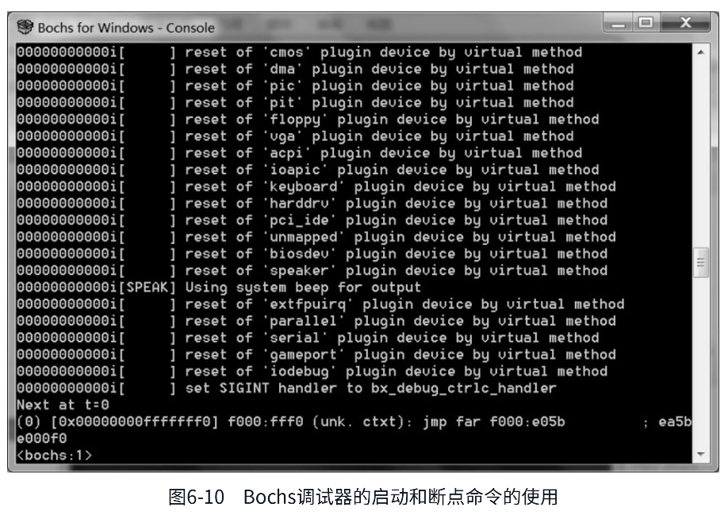

如图6-10所示，命令窗口的底部显示了当前正在等待执行的那条指令，即“jmp far f000:e05b”。在这条指令中，关键字“far”是不必要的，而且在Bochs中，数值默认是十六进制的。因此，该指令就是

```
jmp 0xf000:0xe05b
```

很显然，转移的目标位置是ROM-BIOS。

在那一行的左侧，显示了该指令所在的物理内存地址，该地址是用方括号围起来的。你可能会想，它怎么会是0x00000000FFFFFFF0呢？

8086有20根地址线，加电启动之后，代码段寄存器CS的内容为0xFFFF，指令指针寄存器IP的内容为0x0000，因此，第一条指令的物理地址是20位的0xFFFF0。但是，8086处理器已经成为历史，它之后的处理器都能够兼容8086的功能，但却拥有超过32根的地址线。在当前的这个Bochs虚拟机上，地址线的数量超过了32根。因此，Bochs在这里用64位的宽度来显示物理地址。但是，它的值应该是0x00000000000FFFF0，不是吗？

事情是这样的，和8086不同，现代处理器在加电启动时，代码段寄存器CS的内容为0xF000，指令指针寄存器IP的内容为0xFFF0，这就使得处理器地址线的低20位同样是0xFFFF0。这还不算完，在刚刚启动时，处理器将其余（高位部分）的地址线强制为高电平。因为当前Bochs虚拟机的地址线是32根，所以，初始发出的物理内存地址就是0x00000000FFFFFFF0了。

之所以这样做，是因为处理器的设计者希望把ROM-BIOS放到4GB（32根地址线可提供的寻址范围是$2^{32}$=4GB）可寻址内存范围的最高端，这样，4GB以下，连同传统的低端1MB都是连续的RAM区，连续的、不间断的RAM能为操作系统管理内存带来方便。

问题在于，计算机制造商会考虑很多现实问题。老的硬件和软件依赖于低端1MB的ROMBIOS来工作，这涉及兼容性。最终，这两个地址区段都指向同一块ROM芯片。

在物理地址的后边，是逻辑地址，即代码段寄存器CS和指令指针寄存器IP的内容，是以十六进制显示的，等效于0xf000:0xfff0。在这一行的右边，Bochs还以注释的形式显示了指令的机器代码，即EA 5B E0 00 F0。

现在的情况是，Bochs还没有执行该指令，它需要你的指示。此时，你可以单步执行指令。单步执行的意思是，每次只执行一条指令，执行完毕后再次停下来等待你的命令。

单步执行命令是“s”(step)。如图6-11所示，输入“s”命令后回车，Bochs执行刚才那条指令，然后停下来，同时显示下一条即将执行的指令。

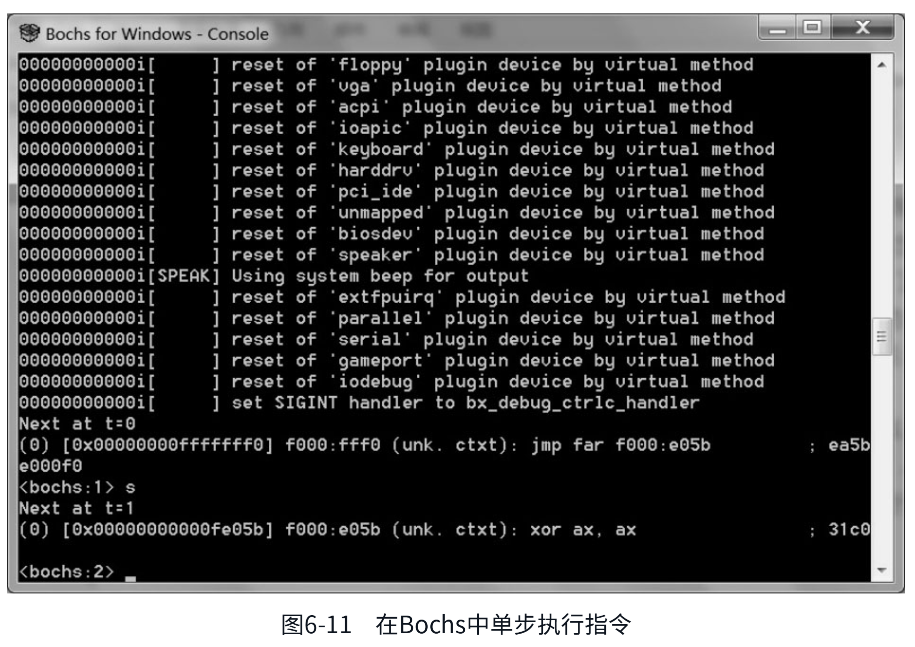

如图6-11所示，指令执行后，下一条等待执行的指令为xor ax，ax，对应的机器指令码为31 C0，所在的物理内存地址是0x00000000000FE05B。注意，物理地址变了。

现代的x86处理器在加电后，所有高端的地址线都被强制为高电平，直至遇到并执行了第一个段间转移指令。段间转移指令是在两个代码段之间实施控制转移，也就是同时改变代码段寄存器CS和指令指针寄存器IP的jmp指令，像jmp 0xf 000:0xe05b就是一个典型的例子。因此，当该指令执行后，处理器发出的物理地址就仅仅取决于代码段寄存器CS和指令指针寄存器IP了。

接下来，你可以继续单步执行。但是，老在BIOS中转悠也没什么意思。要知道，你调试的程序位于主引导扇区中，依靠单步执行得什么时候才能执行到主引导扇区代码！

不用担心，Bochs提供了断点指令“b”(break)。所谓断点，就是事先设置一个（物理）内存地址，当处理器执行到这个地址时，就自动停下来。因为计算机启动后，总是把主引导程序加载到物理内存地址0x7c00处，所以，可以将这个地址设为断点。

如图6-12所示，输入“b 0x7c00”。意思是，在处理器执行到地址0x7c00处的那条指令时，就停下来。然后，再输入命令“c”。

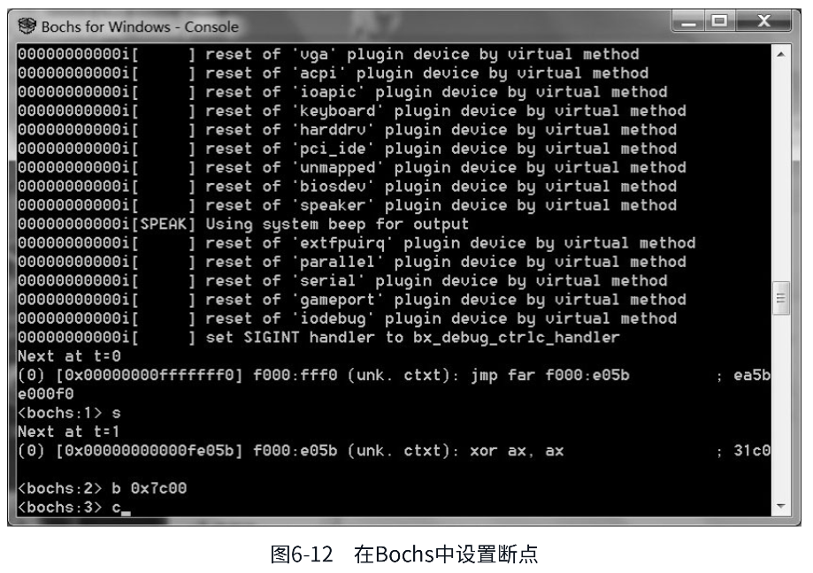

命令“c”(continue)是持续执行的意思，该命令要求处理器不间断地持续执行指令。但是，如果设置了断点，它就会在断点处停下来。因此，如图6-13所示，当“c”命令执行后，它会在执行到物理内存地址0x7c00时停下来。

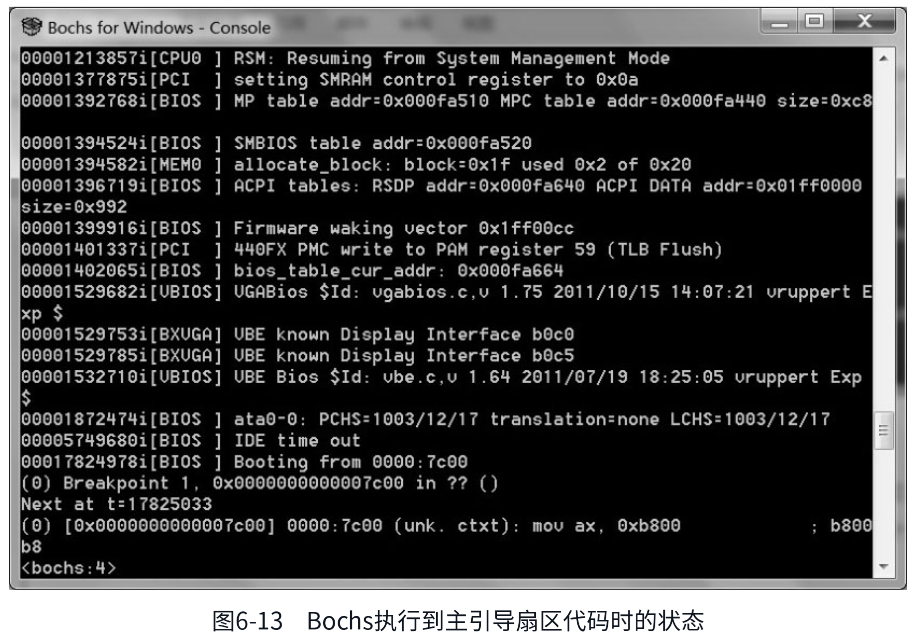

如图6-13所示，当前等待执行的指令是mov ax，0xb800，这就是本章源代码的第一条指令；该指令的物理地址是0x0000000000007C00，指令的机器代码为B8 00 B8。

如图6-14所示，此时，可以输入命令“r”(register)来显示通用寄存器的内容。

我知道，对于图中的内容，你一定会摇摇头表示看不懂，这其实很正常。我们此时正在介绍8086处理器，如图6-15所示，它有8个16位的通用寄存器AX、BX、CX、DX、SI、DI、BP和SP。其中，前4个寄存器还可以各自分成两个独立的8位寄存器来用，即AH、AL、BH、BL、CH、CL、DH和DL；后4个寄存器只能作为16位寄存器整体使用。除此之外，从图中可以看出，它的指令指针寄存器IP也是16位的。

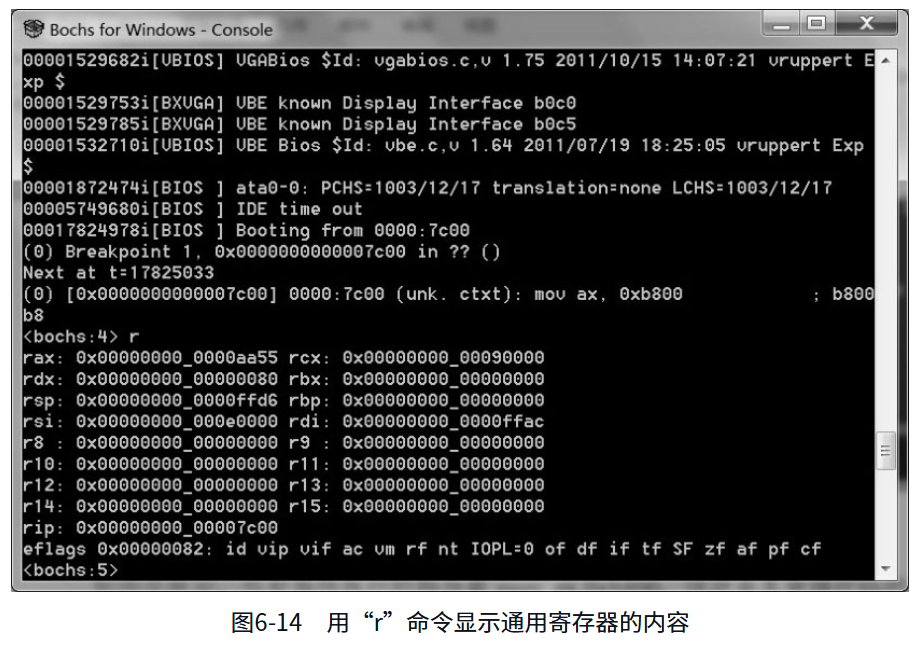

正如你已经知道的，8086已经成为历史，现在我们所使用的处理器，都是32位或者64位的。32位x86处理器对寄存器做了扩展，使之达到32位，以处理32位的数据。如图6-15所示，这8个32位寄存器分别是EAX、EBX、ECX、EDX、ESI、EDI、EBP和ESP，它们可以在程序中直接作为32位寄存器使用。同时，指令指针寄存器IP也做了扩展，达到32位，即EIP。为了保持同8086的兼容性，这些寄存器的低16位依然保持以前的用法，这使得以前的程序可以在32位处理器上正常运行。

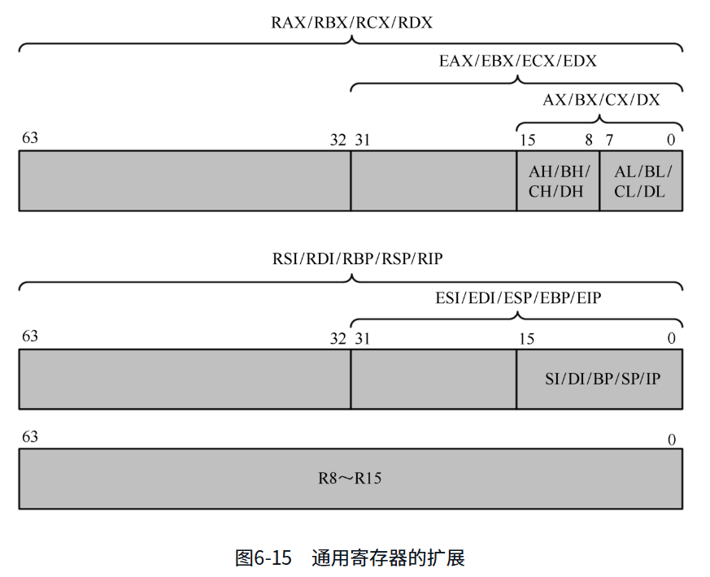

在64位处理器上，这些寄存器再次被扩展，达到了64位，即RAX、RBX、RCX、RDX、RSI、RDI、RBP、RSP和RIP。同时，它们的低32位（包括低16位）依然保持从前的用法。

除此之外，64位的x86处理器还新增了8个64位的通用寄存器R8、R9、R10、R11、R12、R13、R14和R15。

屏幕的底部还显示了标志寄存器EFLAGS的状态。有关标志寄存器的内容将在后面的章节里具体阐述，这里先不用管它。有关32位处理器的内容，将在本书的后半部分讲解。

注意，尽管Bochs把所有寄存器都显示为64位的宽度，如RAX，但这并不表明你的处理器就一定是64位的。它的目的很简单，仅仅是希望用同一种最宽的格式来应付所有不同的处理器。

这样一说你就应该很清楚了，如图6-14所示，RAX的内容是0x000000000000aa55，这就意味着，RAX的高48位是全0，低16位（即AX）是0xAA55。

同样在这幅图中，RIP的内容是0x0000000000007c00，它表明寄存器RIP的高48位是全0，低16位（即IP）是0x7C00。

我们调试到哪一步了？

如图6-14所示，当前正在等待执行指令是mov ax，0xb800。现在，我们用“s”命令单步执行该指令。如图6-16所示，单步执行之后，下一条等待执行的指令是mov es，ax，该指令的物理内存地址是0x0000000000007C03。

因为刚才那条指令是将立即数0xB800传送到寄存器AX，那么，我们现在可以用“r”命令来看看寄存器AX的内容是否真的发生了改变。如图6-16所示，寄存器AX的内容是0xB800，确实符合我们的预期。

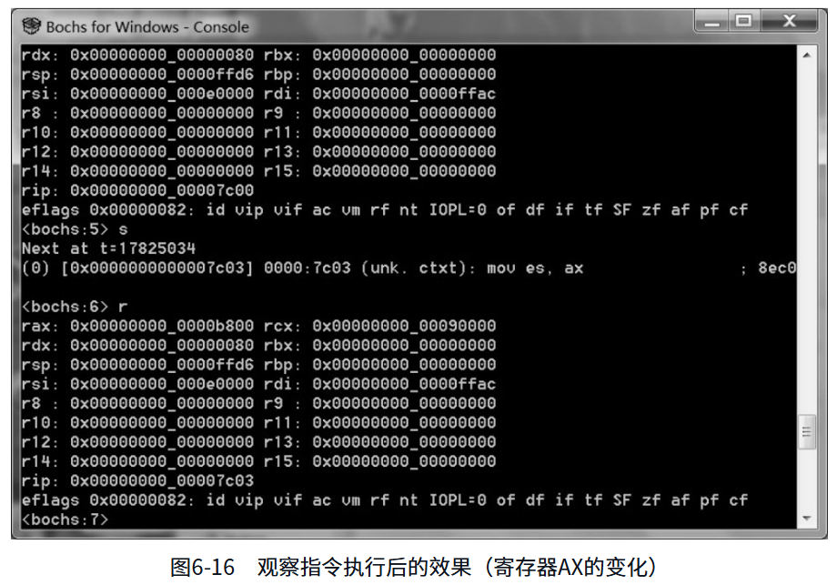

接下来，继续用单步指令“s”来执行mov es，ax指令。如图6-17所示，该指令执行后，下一条即将执行的指令是

```
mov byte ptr es:0x0, 0x4c
```

Bochs的汇编指令格式和NASM相比，在某些方面是不同的。实际上，这条指令就是本章程序中的

```
mov byte [es:0x00], 'L
```

因为字面值’L’早在程序编译时就被转换成了立即数0x4c，所以，严格地说，这条指令在NASM中的格式是

```
mov byte [es:0x0], 0x4c
```

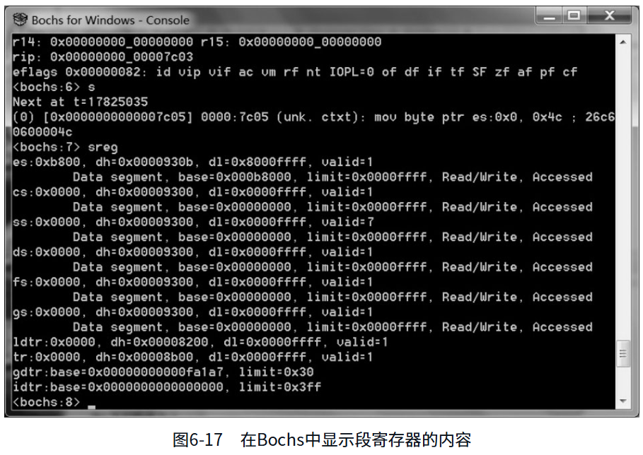

无论如何，这条指令还没有执行，刚才执行的是mov es，ax指令。此时，段寄存器ES中的内容应当是0xB800。

为了验证这一点，应当要求Bochs显示段寄存器的内容。为此，需要使用“sreg”(segment register)命令。如图6-17所示，当输入“sreg”命令后，Bochs显示了一大堆东西。

在32位和64位处理器中，除了段寄存器CS、SS、DS和ES，还新增了两个段寄存器FS和GS，这一点首先要明白。

然后，在32位和64位处理器中，以上6个段寄存器都依然是16位的，但都额外增加了一个不可访问的部分，叫作段描述符高速缓存器。段描述符高速缓存器由处理器内部使用，不能在程序中访问，里面存放了段的起始地址、段的扩展范围，以及段的各种属性，比如它是代码段还是数据段，是否可以写入，是否被访问过，等等。这些知识，将在本书的后半部分详细讲解。

如图6-17所示，Bochs首先显示了段寄存器ES中的内容，是0xb800，这符合我们的预期。同时，它还显示了段寄存器ES描述符高速缓存器的内容，因为还没有讲到，所以暂时不用管它。

接下来，如图6-18所示，我们连续单步执行两次。对照本章的源程序，这实际上是执行了以下两条指令：

```
mov byte [es:0x00], 'L'
mov byte [es:0x01], 0x07
```

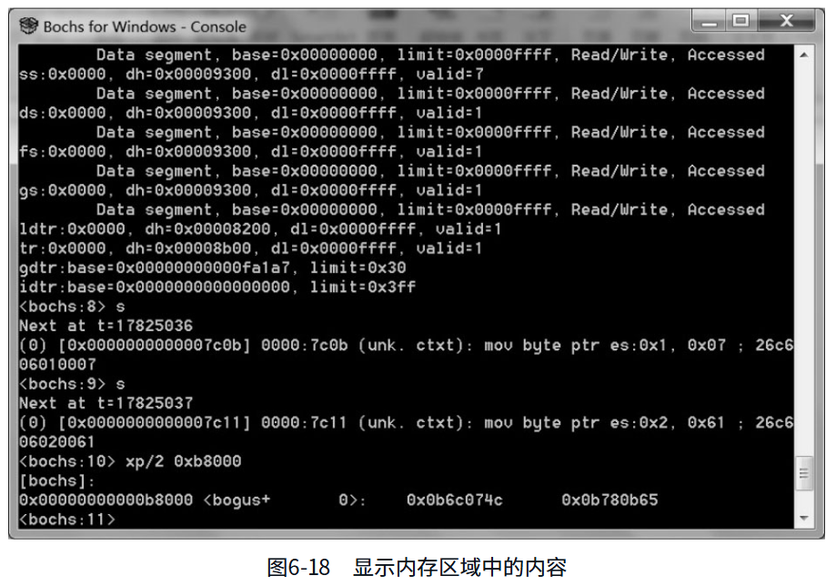

我们知道，这是在写文本模式下的显示缓冲区。因此，从物理内存地址0xB8000处开始的2字节必然是0x4C和0x07。

为了验证这一点，需要显示内存中的内容，这可以使用命令“xp”(eXamine memory at Physical address)，即显示指定物理内存地址处的内容。命令xp每次只显示一个双字。要显示多个双字，需要用“/”附加一个数量。然后，还应当指定一个物理内存地址。

如图6-18所示，在这里，我们要求从物理内存地址0xB8000开始，显示2个双字。很快，Bochs做出了回应，显示了两个双字0x0b6c074c和0x0b780b65。

如图6-19所示，双字数据在内存中的存放是按低端字节序的。因此，0x0b6c074c这个双字数据，在内存中对应着从物理地址0xB8000开始的4字节0x4C、0x07、0x6C和0x0B。

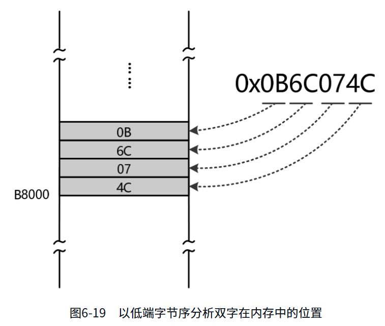

至此，基本的程序调试技术就讲完了，你可以使用“q”(quit)命令退出Bochs调试过程。

# 第7章 相同的功能，不同的代码

## 跳过非指令的数据区

如代码清单7-1所示，从源程序第8行到第10行，声明了非指令的数据。一般来说，所有处理器指令都应当顺序存放，在它们中间不允许夹杂非指令的普通数据，因为它们不能作为指令执行。但是，如果有办法让处理器执行不到这些非指令的内容，则另当别论。为此，在这些数据之前，源程序的第6行，是一条转移指令：`jmp near start`

在这里，该指令用来使处理器的执行流程越过这些不可执行的数据，转移到后面标号start处的代码接着执行。

正如我们在上一章里讲到的，像jmp near start这种指令，机器指令的操作码是0xE9，操作数是一个16位的相对偏移量，这叫作相对近转移，后面我们还要继续讨论这个话题。

## 在数据声明中使用字面值

在第6章中，显示字符串“Label offset:”的方法是将每个字符的ASCII码包含在每条指令中，即它们是作为每条指令的操作数出现的。这种方法很原始，也很笨拙。而且，如果要改变显示的内容，则必须重新编写指令，很不方便。

在本章中，我们将要改变这种做法，使得显示字符串的手段更灵活，具体做法是专门定义一个存放字符串的数据区，当要显示它们的时候，再用指令取出来，一个一个地传送到显示缓冲区。这样一来，负责在屏幕上显示的指令就和要显示的内容无关了。

源程序的第8、9行，这两行的目的是声明要显示的内容。在NASM里，“\”是续行符，当一行写不下时，可以在行尾使用这个符号，以表明下一行与当前行应该合并为一行。

和上一章相同，在用伪指令db声明字符的ASCII码数据时也可以使用字面值。在编译阶段，编译器将把“L”“a”等转换成与它们等价的ASCII代码。

除了ASCII码，这里还声明了每个字符的显示属性值0x07，都是已经讲过的知识，相信很好理解。

## 段地址的初始化

汇编语言源程序的编译符合一种假设，即编译后的代码将从某个内存段中偏移地址为0的地方开始加载。这样一来，如果有一个标号“label_a”，它在编译时计算的汇编地址是0x05，那么，当程序被加载到内存后，它在段内的偏移地址仍然是0x05，任何使用这个标号来访问内存的指令都不会产生问题。

但是，如果程序加载时，不是从段内偏移地址为0的地方开始的，而是0x7c00，那么，label_a的实际偏移地址就是0x7c05。这时，所有访问label_a的指令仍然会访问偏移地址0x05，因为这是在编译时就决定了的。实际上，这样的问题在上一章就遇到过。在那里，因为我们已经知道程序将来的加载位置是0x0000:0x7c00，所以才有了这样古怪的写法：`mov [0x7c00+number+0x00], dl`

不得不说，0x7c00就是理论和现实之间的差距。

在主引导程序中，访问内存的指令很多，如果都要加上0x7c00无疑是很麻烦的，这个我们已经看到了。其实，产生这个问题的根源，就是因为程序在加载时，没有从段内偏移地址为0的地方开始。

好在INTEL处理器的分段策略还是很灵活的，逻辑地址0x0000:0x7c00对应的物理地址是0x07c00，该地址又是段0x07C0的起始地址。因此，这个物理地址其实还对应着另一个逻辑地址0x07c0:0000，如图7-1所示。

看到了吧？我们可以把这512字节的区域看成一个单独的段，段的基地址是0x07C0，段长512字节。注意，该段的最大长度可以为64千字节，但是在这里，我们实际上仅使用512个字节。尽管BIOS将主引导扇区加载到物理地址0x07C00处，但我们却可以认为它是从0x07C0:0x0000处开始加载的。


在这种情况下，如果执行指令：`mov [0x05], dl`

那么，处理器将把数据段寄存器DS的内容(0x07C0)左移4位，加上指令中指定的偏移地址(0x05)，形成物理内存地址0x07C05，并将寄存器DL中的内容传送到该处。

所以，源程序第13、14行，通过传送指令将数据段寄存器DS的内容设置为0x07c0。和以前一样，源程序第16、17行，使附加段寄存器ES指向显示缓冲区所在的段0xb800。

## 段之间的批量数据传送

在本章中，要在屏幕上显示的内容，连同它们的显示属性值都集中声明在一起。想显示它们？那就要将它们“搬”到0xB800段。有多种方法可以做到这一点，但8086处理器提供了最好的方法，那就是使用movsb或者movsw指令。

这两个指令通常用于把数据从内存中的一个地方批量地传送（复制）到另一个地方，处理器把它们看成数据串。但是，movsb的传送是以字节为单位的，而movsw的传送是以字为单位的。

movsb和movsw指令执行时，原始数据串的段地址由DS指定，偏移地址由SI指定，简写为DS:SI；要传送到的目的地址由ES:DI指定；传送的字节数(movsb)或者字数(movsw)由CX指定。除此之外，还要指定是正向传送还是反向传送，正向传送是指传送操作的方向是从内存区域的低地址端到高地址端；反向传送则正好相反。正向传送时，每传送一字节(movsb)或者一个字(movsw)，SI和DI加1或者加2；反向传送时，每传送一字节(movsb)或者一个字(movsw)时，SI和DI减去1或者减去2。不管是正向传送还是反向传送，也不管每次传送的是字节还是字，每传送一次，CX的内容自动减1，因为CX用来指定传送的次数。

如图7-2所示，在8086处理器里，有一个特殊的寄存器，叫作FLAGS，翻译过来叫标志寄存器，用来存放各种标志信息。作为一个例子，它的位6是ZF(Zero Flag)，即零标志。当处理器执行一条算术或者逻辑运算指令后，算术逻辑部件送出的结果除了送到指定位置（目的操作数指定的位置），还送到一个或非门。学过逻辑电路课程或看过《穿越计算机的迷雾》这本书的人都知道，或非门的输入全为0时，输出为1；输入不全为0或全部为1时，输出为0。或非门的输出送到一个触发器，这就是标志寄存器的ZF位。这就是说，如果计算结果为0，这一位被置成1，表示计算结果为0是“真”的；否则清除此位(0)。


除此之外，它也允许通过指令设置一些标志来改变处理器的运行状态。比如，位10是方向标志DF(Direction Flag)，通过将这一位清0或者置1，就能控制movsb和movsw的传送方向。

源程序第19行是方向标志清0指令cld。这是个无操作数指令，与其相反的是置方向标志指令std。cld指令将DF标志清0，以指示传送是正方向的。和cld功能相反的是std指令，它将DF标志置位(1)。此时，传送的方向是从高地址到低地址。

源程序第20行，设置寄存器SI的内容到源串的首地址，也就是标号mytext处的汇编地址。

源程序第21行，设置目的地的首地址到寄存器DI。屏幕上第一个字符的位置对应着0xB800段的开始处，所以设置DI的内容为0。

第22行，设置要批量传送的字节数到寄存器CX。因为数据串是在两个标号number和mytext之间声明的，而且标号代表的是汇编地址，所以，汇编语言允许将它们相减并除以2来得到这个数值。需要说明的是，这个计算过程是在编译阶段进行的，而不是在指令执行的时候。除以2的原因是movsw每次传送一个字。

第23行，是movsw指令，操作码是0xA5，该指令没有操作数。使用movsw而不是movsb的原因是按字操作比按字节操作要快。

单纯的movsb和movsw只能执行一次，如果希望处理器自动地反复执行，需要加上指令前缀rep(repeat)，意思是CX不为零则重复。rep movsw的操作码是0xF3 0xA5，它将重复执行movsw直到CX的内容为零。

## 使用循环分解数位

为了显示标号number所代表的汇编地址，源程序第26行用于将它的数值传送到寄存器AX，这个和以前是一样的。

我们在程序中声明标号number并初始化5字节的目的主要是保存数位，标号number代表一个数值，这个数值是它在程序中的汇编地址（汇编位置），我们要显示这个数值。所以，源程序的第26行，我们获得标号number代表的汇编地址。

同时，我们还需要访问在标号number处定义的5字节，用来保存数位，而标号number所代表的汇编地址又是它在程序运行时的偏移地址（段内偏移量）。为此，源程序第29行，通过将AX的内容传送到BX，来使BX指向该处的偏移地址。实际上，这等效于：`mov bx, number`

只不过用寄存器传递来得更快，更方便。

第29～37行依旧做的是分解数位的事，但用了和以往不同的方法。简单地说，就是循环。循环依靠的是循环指令loop，该指令出现在源程序的第37行：`loop digit`

loop指令的功能是重复执行一段相同的代码，处理器在执行它的时候会顺序做两件事：

```
将寄存器CX的内容减1；
如果寄存器CX的内容不为零，转移到指定的位置处执行，否则顺序执行后面的指令。
```

和源程序第6行的jmp near start一样，loop digit指令也是颇具迷惑性的指令，它的机器指令操作码是0xE2，后面跟着一字节的操作数，而且也是相对于标号处的偏移量，是在编译阶段，编译器用标号digit所在位置的汇编地址减去loop指令的下一条指令的汇编地址得到的。

为了使loop指令能正常工作，需要一些准备。源程序第30行，将循环次数传送到寄存器CX。因为分解AX中的数需要循环5次，故传送的值是5。

源程序第31行，将除数10传送到寄存器SI。

源程序第33～37行是循环体，每次循环都会执行这些代码，主要是做除法并保存每次得到的余数。每次除法之前都要先将DX清零以得到被除数的高16位，这是源程序第33行所做的事情。

做完除法之后，第35行，将DL中得到的余数传送到由BX所指示的内存单元中去。这是我们第一次接触到偏移地址来自寄存器的情况，而在此之前，我们仅仅是使用类似于下面的指令：

```
mov [0x05], dl
mov [number], al
mov [number+0x02], cl
```

尽管方式不同，但mov［bx］，dl做相同的事情，那就是把寄存器DL中的内容，传送到以寄存器DS的内容为段地址，以寄存器BX的内容为偏移地址的内存单元中去。注意，指令中的中括号是必需的，否则就是传送到寄存器BX中，而不是寄存器BX的内容所指示的内存单元了。

在8086处理器上，如果要用寄存器来提供偏移地址，只能使用寄存器BX、SI、DI、BP，不能使用其他寄存器。所以，以下指令都是非法的：

```
mov [ax], dl
mov [dx], bx
```

原因很简单，寄存器BX最初的功能之一就是用来提供数据访问的基地址，所以又叫基址寄存器(Base Address Register)。之所以不能用寄存器SP、IP、AX、CX、DX，这是一种硬性规定，说不上有什么特别的理由。而且，在设计8086处理器时，每个寄存器都有自己的特殊用途，比如寄存器AX是累加器(Accumulator)，与它有关的指令还会做指令长度上的优化（较短）；寄存器CX是计数器(Counter)；寄存器DX是数据(Data)寄存器，除了作为通用寄存器使用，还专门用于和外部设备之间进行数据传送；寄存器SI是源索引(Source Index)寄存器；DI是目标索引(Destination Index)寄存器，用于数据传送操作，我们已经在movsb和movsw指令的用法中领略过了。

注意，可以在任何带有内存操作数的指令中使用寄存器BX、SI或者DI提供偏移地址。

做完一次除法，并保存了数位之后，源程序第36行，用于将寄存器BX中的内容加1，以指向下一个内存单元。inc是加1指令，操作数可以是8位或者16位的寄存器，也可以是字节或者字内存单元。从功能上讲，它和：`add bx, 1` 是一样的，但前者的机器码更短，速度更快。下面是两个例子：

```
inc al
inc byte [bx]
inc word [label_a]
```

以上，第一条指令执行时，处理器将寄存器AL中的内容加1；第二条指令执行时，将寄存器BX所指向的内存单元的内容加1。就是说，处理器用段寄存器DS的内容左移4位，加上寄存器BX的内容，形成20位物理地址。然后，将该地址处的内容（字节）加1。

第三条指令和第二条指令做相同的事情，但是偏移地址是用标号给出的。关键字“word”表明它操作的是内存中的一个字，段地址在段寄存器DS中，偏移地址等于标号label_a在编译阶段的汇编地址。

和inc指令相对的是dec指令，用于将目标操作数的内容减1，它们的指令格式相同，不再赘述。

源程序第37行，正是loop指令。就像我们刚才说的，它将寄存器CX的内容减1，并判断是否为0。如果不为0，则跳转到标号digit所在的位置处执行。

很显然，在指令的地址部分使用寄存器，而不是数值或者标号（其实标号是数值的等价形式，在编译后也是数值）有一个明显的好处，那就是可以在循环体里方便地改变偏移地址，如果使用数值就做不到这一点。

## 计算机中的负数

### 无符号数和有符号数

为了在讲解后面的内容时能够顺利一些，现在我们离开源程序，来介绍一些题外的知识。

从本书的开篇到现在，我们一直没有提到负数，就好像世界上根本没有负数一样。计算机当然要处理负数，要不然它将没有多少实用价值。

在计算机中使用负数，这是一个容易令人产生迷惑的话题。不信？现在就开始了。

尽管我们从来没有考虑过数的正负问题，但是，事实上，我们在编写程序的时候，既可以使用正数，也可以使用负数。如图7-3所示，我们创建了一个源文件exam.asm，并在这个文件中用伪指令db声明了一些正数和一些负数。


图7-4显示了编译后的结果。用伪指令db声明的数据都只有一字节的长度，所以很容易在这两幅图的各个数之间建立对应关系。

前面的正数都很好理解，十进制数128对应的二进制数是10000000，对应的十六进制数是0x80；十进制数0对应的二进制数是00000000，对应的十六进制数是0x00。为什么我们对此不感到新鲜？因为这显得非常自然，从本书一开始到现在，我们就是这样工作的。

真正的麻烦在于后面的负数，比如-1，它在编译的时候，编译器会怎么做呢？


它很笨，但也很聪明。因为-1其实等于0-1，它就知道可以做一次减法。当然，这个减法，不是你已经熟悉的十进制减法，这没有用，你得做二进制的减法，也就是用二进制数0减去二进制数1，结果是


注意左边的省略号，这是因为在相减的过程中，不停地向左边借位的结果。因此，可以说，这个数字是很长的，取决于你什么时候停止借位。

再比如十进制数-2，可以用0-2来得到，在二进制的世界里，该减法是二进制数0减去二进制数10，结果是


同样，相减的过程要向左借位，所以这个数字相当长。但是，最右边那一位是0。

在计算机中，数字保存在寄存器里，而在16位处理器里，寄存器通常是8位和16位的。因此，以上相减的结果，只能保留最右边的8位或者16位。举个例子，十进制数-1在寄存器AL中的二进制形式是

```
1111 1111
```

即0xFF；十进制数-2在寄存器AL中的二进制形式是

```
1111 1110
```

即0xFE。如果是16位的寄存器，则相应地，要保留相减结果的最右边16位。因此，十进制数-1在寄存器AX中的二进制形式是

```
1111 1111 1111 1111
```

即0xFFFF；十进制数-2在寄存器AX中的二进制形式是

```
1111 1111 1111 1110
```

即0xFFFE。

当然，数据还可以保存在内存中，或者编译后的二进制文件中。在二进制文件中，数据是用伪指令db或dw等定义的。但是，数据的表示形式和它们在寄存器中的形式相同，以下代码片段很清楚地说明了这一点。

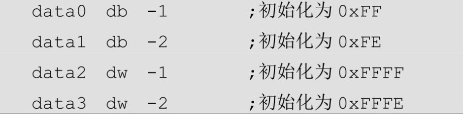

这是很令人吃惊的。因为我们知道，0xFF等于十进制数255，但现在它又是十进制数-1，哪一个才是正确的呢？我们应该以哪一个为准呢？

好吧，假设这勉强能接受的话，那么，对照一下图7-3和图7-4，你会发现，0x80既是十进制数128，又是十进制数-128，到底哪一个是正确的呢？

这真是令人头疼的问题，不单是对我们，对几十年前那些计算机工程师们来说也是如此。

一个良好的解决方案是，将计算机中的数分成两大类：无符号数和有符号数。无符号数的意思是我们不关心这些数的符号，因此也就无所谓正负，反正它们就是数而已，就像小学生一样，眼中只有自然数。在8位的字节运算中，无符号数的范围是00000000～11111111，即十进制的0～255；在16位的字运算中，无符号数的范围是0000000000000000～1111111111111111，即十进制的0～65535；在将来要讲到的32位运算中，无符号数的范围是000000000000000000000000～11111111111111111111111111111111，即十进制的0～4294967295。很显然，我们以前使用的一直是无符号数。

相反地，有符号数是分正负的，而且规定，数的正负要通过它的最高位来辨别。如果最高位是0，它就是正数；如果是1，就是负数。如此一来，在8位的字节运算环境中，正数的范围是00000000～01111111，即十进制的0～127；负数的范围是10000000～11111111，即十进制的-128～-1。

正的有符号数，和与它同值的无符号数相同，这没什么好说的，毕竟它们形式上相同，按相同的方式处理最为方便。但是，负数就不同了，在这里，10000000～11111111这些负数，都是用0减去它们相对应的正数得到的。想知道它们各自对应的正数是谁吗？很简单，因为“负数的负数”是正数，所以只需要用0减去这个负数就行。所以，你可以试试看，因为


所以，10000000～11111111这个范围内的有符号数，对应着十进制数-128～-1。

顺便说一下，在8086处理器中，有一条指令专门做这件事，它就是neg。neg指令带有一个操作数，可以是8位或者16位的寄存器，或者内存单元。如

```
neg al
neg dx
neg word [label_a]
```

它的功能很简单，用0减去指令中指定的操作数。例如，如果寄存器AL中的内容是00001000（十进制数8），执行neg al后，寄存器AL中的内容变为11111000（十进制数-8）；如果寄存器AL中的内容为11000100（十进制数-60），执行neg al后，寄存器AL中的内容为00111100（十进制数60）。

相应地，在16位的字运算环境中，正数的范围是0000000000000000～0111111111111111，即十进制的0～32767，负数的范围是1000000000000000～1111111111111111，即十进制的-32768～-1。

不要给计算机和编译器添麻烦。既然你已经知道一字节可以容纳的数据范围是十进制的-128～127，就不要这样写：

```
mov al, -200
```

寄存器AL只有8位，因此，编译后，-200将被截断，机器码为B038。你可以这样写：

```
mov ax, -200
```

这时，编译后的机器码为B8 38 FF。

同样的规则也适用于伪指令db和dw。举例（以下均为十进制数）：


32位有符号数是16位和8位有符号数的超集，16位有符号数又是8位有符号数的超集，它们互相之间有重叠的部分。正数还好说，十进制数15，在8位运算环境中是00001111，在16位运算环境中是0000000000001111，没有什么区别。但是，同一个负数，其表现形式略有差别。比如十进制数-3，它在8位运算中是11111101，即0xFD；在16位运算中，则是1111111111111101，即0xFFFD。这种差别的来源很简单，我们已经讲过了，在计算机中，-3是用0减去3得到的，在8位运算中只能保留结果的低8位，即11111101(0xFD)；在16位运算中只能保留结果的低16位，即1111111111111101(0xFFFD)。

很显然，一个8位的有符号数，要想用16位的形式来表示，只需将其最高位，也就是用来辨别符号的那一位（几乎所有的书上都称之为符号位，实际上这并不严谨），扩展到高8位即可。为了方便，处理器专门设计了两条指令来做这件事：cbw(Convert Byte to Word)和cwd(Convert Word to Double-word)。

cbw没有操作数，操作码为98。它的功能是，将寄存器AL中的有符号数扩展到整个寄存器AX。举个例子，如果寄存器AL中的内容为01001111，那么执行该指令后，寄存器AX中的内容为0000000001001111；如果寄存器AL中的内容为10001101，执行该指令后，寄存器AX中的内容为1111111110001101。

cwd也没有操作数，操作码为99。它的功能是，将寄存器AX中的有符号数扩展到DX:AX。举个例子，如果寄存器AX中的内容为0100111101111001，那么执行该指令后，寄存器DX中的内容为0000000000000000，寄存器AX中的内容不变；如果寄存器AX中的内容为1000110110001011，那么执行该指令后，寄存器DX中的内容为1111111111111111，寄存器AX中的内容同样不变。

尽管有符号数的最高位通常称为符号位，但并不意味着它仅仅用来表示正负号。事实上，通过上面的讲述和实例可以看出，它既是数的一部分，和其他比特一起共同表示数的大小，同时又用来判断数的正负。

### 处理器视角中的数据类型

无符号数和有符号数的划分并没有从根本上打消我们的疑虑，即假如寄存器AX中的内容是0xB23C，那么，它到底是无符号数45628呢，还是应当将其看成-19908？

答案是，这是你自己的事，取决于你怎么看待它。对于处理器的多数指令来说，执行的结果和操作数的类型没有关系。换句话说，无论你是从无符号数的角度来看，还是从有符号数的角度来看，指令的执行结果都是正确无误的。比如：`mov ah, al` 这条指令显然根本不考虑操作数的类型。再比如

```
mov ah, 0xf0
inc ah
```

在这里，0xf0的二进制形式是11110000，它既可以解释为无符号数240（十进制），也可以解释为有符号数-16，毕竟它的符号位是1。无论如何，inc是加一指令，这条指令执行后，寄存器AH中的内容是二进制数11110001，既是无符号数241，也是有符号数-15。

再考虑加法运算。比如

```
mov ax, 0x8c03
add ax, 0x05
```

0x8c03的二进制形式是1000110000000011，既可以看作无符号数35843（十进制），也可以看成有符号数-29693（十进制）。在运算过程中，数的视角要统一，如果把0x8c03看成无符号数，那么0x05也是无符号数；如果0x8c03是有符号数，那么0x05也是有符号数。

关键是运算后的结果。很幸运的是，add指令同样适用于无符号数和有符号数。所以，这两条指令执行后，寄存器AX中的内容是0x8c08，分别可以看成无符号数35848和有符号数-29688。

再来考虑一下减法。考虑一下，如果要计算10-3，这其实可以看成10+(-3)。因此，使用以下三条指令就可以完成减法运算：

```
mov ah, 10
mov al, -3
add ah, al
```

因此，很多处理器内部不构造减法电路，而是使用加法电路来做减法。

尽管如此，为了方便起见，处理器还是提供了减法指令sub，该指令和加法指令add相似，目的操作数可以是8位或者16位通用寄存器，也可以是8位或者16位的内存单元；源操作数可以是通用寄存器，也可以是内存单元或者立即数（不允许两个操作数同时为内存单元）。比如

```
sub ah, al
sub dx, ax
sub [label_a], ch
```

因为处理器没有减法运算电路，所以，举例来说，sub ah，al指令实际上等效于下面两条指令：

```
neg al
add ah, al
```

可以这么说，几乎所有的处理器指令既能操作无符号数，又能操作有符号数。但是，有几条指令除外，比如除法指令和乘法指令。

我们已经学过除法指令div。严格地说，它应该叫作无符号除法指令(Unsigned Divide)，因为这条指令只能工作于无符号数。换句话说，只有从无符号数的角度来解释它的执行结果才能说得通。举个例子：

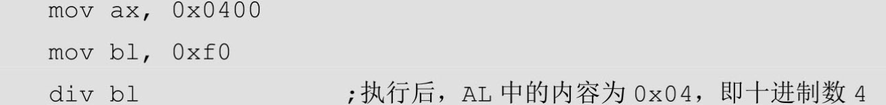

从无符号数的角度来看，0x0400等于十进制数1024，0xf0等于十进制数240。相除后，寄存器AL中的商为0x04，即十进制数4，完全正确。

但是，从有符号数的角度来看，0x0400等于十进制数1024，0xf0等于十进制数-16。理论上，相除后，寄存器AL中结果应当是0xc0。因其最高位是“1”，故为负数，即十进制数为-64。

为了解决这个问题，处理器专门提供了一个有符号数除法指令idiv(Signed Divide)。idiv的指令格式和div相同，除了它是专门用于计算有符号数的。如果你决定要进行有符号数的计算，必须采用如下代码：


在用idiv指令做除法时，需要小心。比如用0xf0c0除以0x10，也就是十进制数的除法-3904÷16。你的做法可能会是这样的：

```
mov ax, 0xf0c0
mov bl, 0x10
idiv bl
```

以上的代码是16位二进制数除法，结果在寄存器AL中。除法的结果应当是十进制数-244，遗憾的是，这样的结果超出了寄存器AL所能表示的范围，必然因为溢出而不正确。为此，你可能会用32位的除法来代替以前的做法：

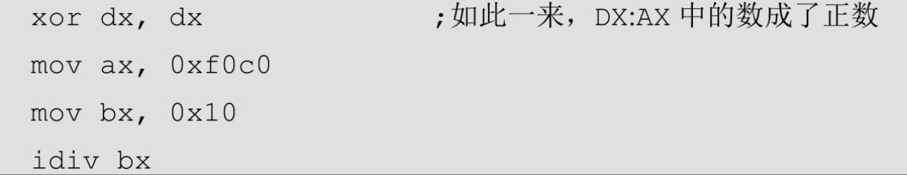

很遗憾，这依然是错的。十进制数-3904的16位二进制形式和32位二进制形式是不同的。前者是0xf0c0，后者是0xfffff0c0。还记得cwd吗？你应该用这条指令把寄存器AX中数的符号扩展到DX。所以，完全正确的写法是这样的：

```
mov ax, 0xf0c0
cwd
mov bx, 0x10
idiv bx
```

以上指令全部执行后，寄存器AX中的内容为0xff0c，即十进制数-244。

主动权在你自己手上，在写程序的时候，你要做什么，什么目的，你自己最清楚。如果是无符号数计算，必须使用div指令；如果你是在做有符号数计算，就应当使用idiv指令。

## 数位的显示

一旦各个数位都分解出来了，下面的工作就是在屏幕上显示它们。源程序第40行，将保存有各个数位的数据区首地址传送到基址寄存器BX。

一共有5个数字要显示，它们在当前数据段内的起始偏移地址就是number的汇编地址，且已传送到寄存器BX。为了依次得到这5个数字，程序中使用的指令是：`mov al, [bx + si]`

在这里，我们的意图是，寄存器BX的内容是基地址，保持不变，当寄存器SI的内容从0逐次增加到4，或者反过来，从4递减到0时，就可以通过BX+SI来连续访问这5个数字。在这里，寄存器SI的作用相当于索引，因此它被称为索引寄存器(Index Register)，或者叫变址寄存器。另一个常用的变址寄存器是DI。

注意，INTEL8086处理器只允许以下几种基址寄存器和变址寄存器的组合：

```
[bx + si]
[bx + di]
[bp + si]
[bp + di]
```

这些组合可以用于任何带有内存操作数的指令中。其他任何组合，比如［bx+ax］、［cx+dx］、［ax+cx］等，都是非法的。

因此，源程序第41行，把初始的索引值4传送到寄存器SI，这是由于要先显示万位上的数字。

源程序第43行，从指定的内存单元取出一字节，传送到寄存器AL，偏移地址是BX+SI。但是，它们之间的运算并非是在编译阶段进行的，而是在指令实际执行的时候，由处理器完成的。

源程序第44行，将寄存器AL中的数字加上0x30，以得到它对应的ASCII码。

源程序第45行，将数字0x04传送到寄存器AH。0x04是显示属性，即前面讲过的黑底红字，无加亮，无闪烁。到此，寄存器AX中是一个完整的字，前8位显示属性值，后8位是字符的ASCII码。

源程序第46行，将寄存器AX中的内容传送到由段寄存器ES所指向的显示缓冲区中，偏移地址由寄存器DI指定。还记得吗，在前面使用movsw传送字符串“Label offset:”到显示缓冲区时，也使用了寄存器DI，当时寄存器DI是指向显示缓冲区首地址的(0)，而且每传送一次就自动加2。传送结束后，寄存器DI正好指向字符“:”的下一个存储单元。之后，寄存器DI一直没用过，还保持着原先的内容。

注意，如图7-5所示，数据的传送是按低端字节序的，寄存器的低字节传送到显示缓冲区的低地址部分（字节），寄存器的高字节传送到显示缓冲区的高地址部分（字节）。

源程序第47行，将寄存器DI的内容加上2，以指向显示缓冲区的下一个字单元。

源程序第48行，将寄存器SI的内容减1，使得下一次的BX+SI指向千位数字。dec是减1指令，和inc指令一样，后面跟一个操作数，可以是8位或16位的通用寄存器或者内存单元。

源程序第49行，指令jns show的意思是，如果未设置符号位，则转移到标号“show”所在的位置处执行。如图7-2所示，INTEL处理器的标志寄存器里有符号位SF(Sign Flag)，很多算术逻辑运算都会影响到该位，比如这里的dec指令。如果计算结果的最高位是比特“0”，处理器把SF位置“0”，否则SF位置“1”。

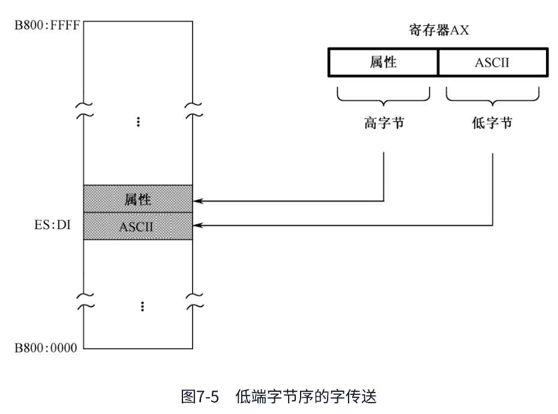

处理器的任务是忠实地执行指令，多数时候，它不会知道你的意图，也不会知道你进行的是有符号数运算，还是无符号数运算。如果运算结果的最高位是“1”，它唯一能做的，就是将SF标志置“1”，以示提醒，剩下的事，你自己看着办，它已经尽力了。

由于寄存器SI的初始值为4，故第一次执行dec si后，SI的内容为3，即二进制数0000000000000011，符号位是比特“0”，处理器将标志寄存器的SF位清“0”。于是，当执行jns show时，符合条件，于是转移到标号“show”所在的位置处执行，等于是开始显示下一个数位。

当显示完最后一个数位后，寄存器SI的内容是0。执行dec si指令后，由于产生了借位，实际的运算结果是0xffff（寄存器SI只能容纳16比特），因其最高位是“1”，故处理器将标志位寄存器SF置“1”，表明当前寄存器SI中的结果可以理解为一个负数(-1)。于是，执行jns show时，条件不满足，接着执行后面第51行的指令。

jns是条件转移指令，处理器在执行它的时候要参考标志寄存器的SF位。除了只是在符合条件的时候才转移之外，它和jmp指令很相似，它也是相对转移指令，编译后的机器指令操作数也是一个相对偏移量，是用标号处的汇编地址减去当前指令的下一条指令的汇编地址得到的。

## 其他标志位和条件转移指令

在处理器内进行的很多算术逻辑运算，都会影响到标志寄存器的某些位。比如我们已经学过的加法指令add、逻辑运算指令xor等。在下面的讲述中，请自行参考图7-2。

### 奇偶标志位PF

当运算结果出来后，如果最低8位中，有偶数个为1的比特，则PF=1；否则PF=0。例如：

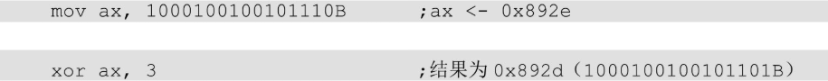

顺序执行以上两条指令后，因为结果是1000100100101101B，低8位是00101101B，有偶数个1，所以PF=1。

再如：

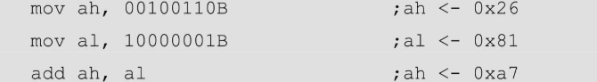

以上，因为最后ah的内容是0xa7(10100111B)，包含奇数个1，故PF=0。

### 进位标志CF

当处理器进行算术操作时，如果最高位有向前进位或借位的情况发生，则CF=1；否则CF=0。比如：


这里，寄存器AL自己和自己做加法运算，并因为最高位是1而产生进位。结果是，进位被丢弃，寄存器AL中的最终结果为零。进位的产生，使得CF=1。同时，ZF=1，PF=1。

下面是因有借位而使得CF为1的例子：

```
mov ax, 0
sub ax, 1
```

CF标志始终忠实地记录进位或者借位是否发生，但少数指令除外（如inc和dec）。

### 溢出标志OF

对于无符号数运算来说，进位标志CF通常意味着得到了错误的计算结果，因为目的操作数没能容纳那个进位。这里有一个例子：

```
mov ah, 0xff
add ah, 2		;ah ← 0x01
```

执行以上两条指令后，进位标志CF为1，这是肯定的了，因为最高位有进位。从无符号数的角度来看，是255+2，结果应当是257。但是你看，因为寄存器AH只有8位，所以进位丢失，得到的结果是1，这明显是错的。

但是，如果上面进行的是有符号数运算，那么，这实际上是在计算-1+2（十进制），AH中的最终结果是1，这是正确的。

很显然，同样的运算，从无符号数和有符号数的视角来看，是不同的。但是，在所有的情况下，处理器都不可能知道你的意图，不知道你进行的是有符号数运算，还是无符号数运算。为此，它提供了溢出标志OF，该标志的意思是，假定你进行的是有符号数运算，如果运算结果是正确的，那么OF=0，否则OF=1。比如上面的例子，因为从有符号数的角度来看，是-1和2相加，结果为1，未溢出，故OF=0。简单地说，OF标志用于指示两个有符号数的运算结果是否错误。

再看一个例子：

```
mov ah, 0x70
add ah, ah
```

首先，本次相加，用二进制数来说就是01110000+01110000=11100000，最高位没有进位，故CF=0。

其次，从无符号数的角度来看（十进制），即112+112=224，并未超出一字节所能容纳的数值上限255，结果是正确的。

但是，从有符号数运算的角度来看（十进制），即112+112=-32，两正数相加，结果为负，明显是错的，在这种情况下，OF=1。错误的原因是，两个正数112和112相加，理论上的计算结果224超出了寄存器AH所能容纳的有符号数的范围-128～127，所以破坏了符号位，使得结果变成了负数(-32)。

既然如此，可以使用16位寄存器AX，毕竟它能容纳的数据范围更大一些：

```
mov ax, 0x70
add ax, ax
```

这次，无论它是有符号数运算，还是无符号数运算，结果都是正确的。故CF=0，OF=0。

因为在任何时候，处理器都不可能知道你的意图，不知道你进行的是有符号数运算，还是无符号数运算。因此，它所能做的，就是假定进行的是有符号数运算，并根据结果提供OF标志，至于如何处理，是你自己的事。比如说，如果你进行的是无符号数运算，那么，你可以不用理会该标志。

### 现有指令对标志位的影响

由于刚刚接触标志位，现将前面学过的指令对标志位的影响一一列举如下。在往后的学习中，但凡遇到新的指令，除了讲解指令的功能和用法，也会说明其对标志位的影响。

注意，可以在Bochs中查看标志位的状态，具体方法请参见7.12.3节。

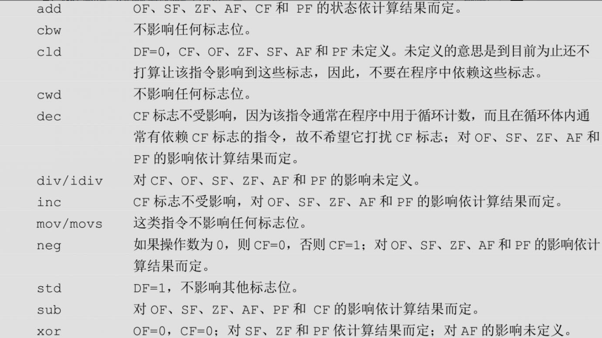

### 条件转移指令

“jcc”不是一条指令，而是一个指令族（簇），功能是根据某些条件进行转移，比如前面讲过的jns，意思是如果SF≠1（那就是SF=0了），则转移。方便起见，处理器一般提供相反的指令，如js，意思是如果SF=1，则转移。爱上网的朋友容易把它理解成“奸商”。

在汇编语言源代码里，条件转移指令的操作数是标号。编译成机器码后，操作数是一个立即数，是相对于目标指令的偏移量。在16位处理器上，偏移量可以是8位（短转移）或者16位（相对近转移）。

相似的，jz的意思是结果为零（ZF标志为1）则转移；jnz的意思是结果不为零（ZF标志为0）则转移。

jo的意思是结果溢出（OF标志为1）则转移，jno的意思是结果未溢出（OF标志为0）则转移。

jc的意思是有进位（CF标志为1）则转移，jnc的意思是没有进位（CF标志为0）则转移。

jp的意思是如果PF标志为1则转移，jnp的意思是如果PF标志不为1（为0）则转移。爱上网的朋友注意了，jp可不是“极品”的意思。

转移指令必须出现在影响标志的指令之后，比如：

```
dec si
jns show
```

经验证明，像这种水到渠成的情况是很少的，多数时候，你会遇到一些和标志位关系不太明显的问题，比如，当寄存器AX里的内容为0x30的时候转移，或者当寄存器AX里的内容小于0xf0的时候转移，再或者，当寄存器AX里的内容大于寄存器BX里的内容时转移，这该怎么办呢？

好在处理器提供了比较指令cmp，它需要两个操作数，目的操作数可以是8位或者16位通用寄存器，也可以是8位或者16位内存单元；源操作数可以是与目的操作数宽度一致的通用寄存器、内存单元或者立即数，但两个操作数同时为内存单元的情况除外。比如：

```
cmp al, 0x08
cmp dx, bx
cmp [label_a], cx
```

cmp指令在功能上和sub指令相同，唯一不同之处在于，cmp指令仅仅根据计算的结果设置相应的标志位，而不保留计算结果，因此也就不会改变两个操作数的原有内容。cmp指令将会影响到CF、OF、SF、ZF、AF和PF标志位。

比较是拿目的操作数和源操作数比，重点关心的是目的操作数。拿指令cmp ax，bx来说，我们关心的是寄存器AX中的内容是否等于寄存器BX中的内容，寄存器AX中的内容是否大于寄存器BX中的内容，寄存器AX中的内容是否小于寄存器BX中的内容，等等，寄存器AX是被测量的对象，寄存器BX是测量的基准。比较的结果如表7-1所示。

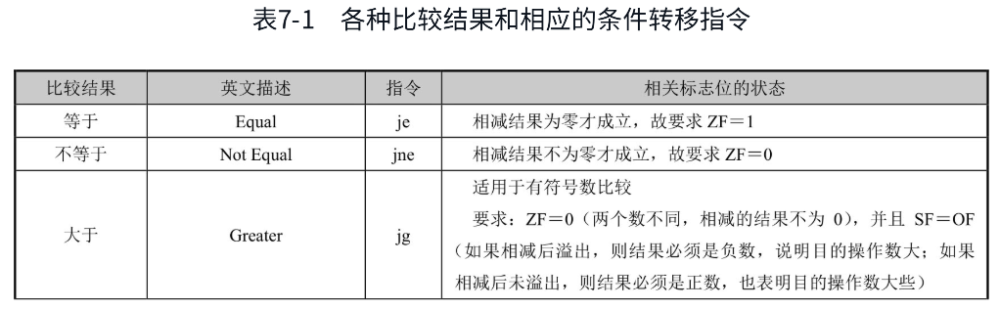


非常显而易见的是，如果你英语基础比较好，认识上面那些单词的话，这些指令都可以在短时间内轻松记住。英语基础不太好的人也不要灰心，事实上，根本不需要记住这些指令和它们的测试条件，因为我们平时很少用得了这么多。需要的时候再回过头来查查，这是个好办法，时间一长，自然就记住了。

最后一个要讲述的条件转移指令是jcxz(jump if CX is zero)，意思是当寄存器CX的内容为零时则转移。执行这条指令时，处理器先测试寄存器CX是否为零。例如：

```
jcxz show
```

这里，“show”是程序中的一个标号。执行这条指令时，如果寄存器CX的内容为零，则转移；否则不转移，继续往下执行。

### NASM编译器的 \$和\$\$ 标记

源程序第51行，用于在显示了各个数位之后，再显示一个字符“D”。目的地址是由ES:DI给出的，源操作数是立即数0x0744，其中，高字节0x07是黑底白字的显示属性，低字节0x44是字符“D”的ASCII码。字的写入是按低端字节序的，请自行参照图7-5。整个程序到此结束。为了使处理器还有事做，源程序第53行，是一个无限循环。NASM编译器提供了一个标记“\$”，该标记等同于标号，你可以把它看成一个隐藏在当前行行首的标号。因此，jmp near ​\$的意思是，转移到当前指令继续执行，它和

```
infi: jmp near infi
```

是一样的，没有区别，但不需要使用标号，更不必为给标号起一个有意义的名字而伤脑筋。

和第6章一样，为了得到不多不少正好512字节的编译结果，同时最后2字节还必须是0x55和0xAA，需要在最后一条指令的后面填充一些无用的数据。

源程序第55行，用于重复伪指令“db 0”若干次，重复的次数是由510-(\$-​\$\$)得到的。除去0x55和0xAA后，剩余的主引导扇区内容是510字节；\$是当前位置的汇编地址；​\$\$是NASM编译器提供的另一个标记，代表当前汇编节（段）的起始汇编地址。当前程序没有定义节或段，就默认地自成一个汇编段，而且起始的汇编地址是0（程序起始处）。这样，用当前汇编地址减去程序开头的汇编地址(0)，就是程序实体的大小。再用510减去程序实体的大小，就是需要填充的字节数。

就像处理器把内存划分成逻辑上的分段一样，源程序也应当按段来组织，划分成独立的代码段、数据段等。从本书第8章开始，将引入这方面的内容。

## 观察运行结果

编译本章的源程序，并用FixVhdWr将编译后的二进制文件写入虚拟硬盘的主引导扇区，然后启动VirtualBox，观察运行后的结果。在你的程序无错的情况下，显示的效果应当如图7-6所示。

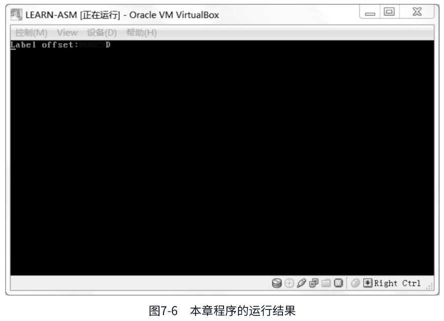

## 本章程序的调试

### 调试命令“n”的使用

要调试本章的程序，可以利用上一章里介绍的方法，其中非常重要的一个调试命令是单步执行命令“s”。

单步执行有一个缺点，就是会陷入同一条指令的多次重复执行里，比如rep movsw指令。如图7-7所示，由于是在两个内存区域之间复制字符，rep movsw指令要执行很多次，每当输入“s”命令后，执行的依然是movsw指令，直到寄存器CX的内容为零，复制过程结束后，才开始单步执行下一条指令。注意，在图中，Bochs使用了rep movsw指令的另一种形式 `rep movsw word ptr es:[di], word ptr ds:[si]`，它们其实是一回事。

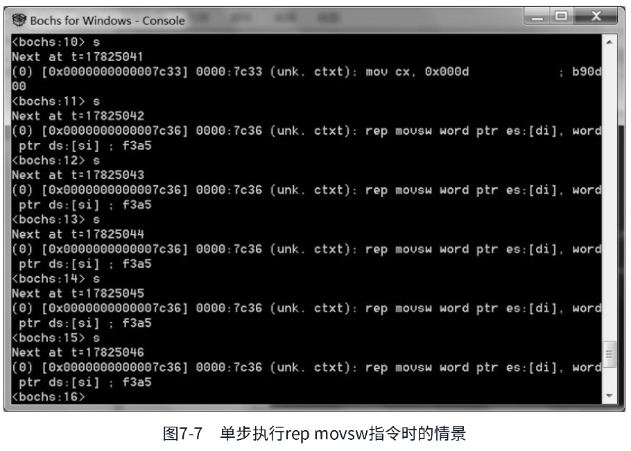

除了rep movsw指令，本章中的loop指令也会使单步执行陷入循环体中，直到循环条件不成立，退出循环时，才开始单步执行循环体外的下一条指令。如图7-8所示，当单步执行循环指令loop.-9时（本指令的物理内存地址是0x0000000000007C4A），下一条指令马上变成循环体内的第一条指令（xor dx，dx，物理内存地址为0x0000000000007C43）。只有当寄存器CX的内容为零时，才开始单步执行循环体外的下一条指令。

在图中，loop指令的目标地址是用标号“.-9”表示的，但实际上这条loop指令就是本章程序中的 `loop digit` 

但是，程序在编译后，所有标号都消失了。当Bochs重现这些程序时，不可能知道这里原先是一个标号“digit”。因此，它用loop指令的操作数作为标号。我们知道，loop指令的操作数是一个相对量，是用目标处的汇编（偏移）地址减去loop指令的下一条指令的汇编（偏移）地址得到的。在loop指令执行时，用指令指针寄存器IP的内容（此时IP指向loop指令的下一条指令）加上操作数-9，得到目标位置的偏移地址。

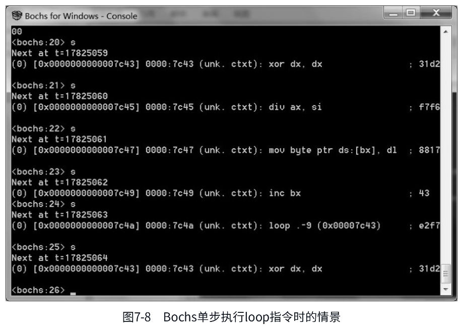

可以想象，如果循环的次数很多（有时候，循环成千上万次是很正常的），则我们就无法调试循环体后面的程序。在这种情况下，你应当在执行rep movsb、repmovsw和loop指令的时候，使用调试命令“n”。此时，Bochs将自动完成循环过程，并在循环体外的下一条指令前停住。

### 调试命令“u”的使用

之所以能够使用调试命令“n”来越过循环体，是因为Bochs知道控制循环次数的是寄存器CX，它可以自动监视整个循环过程。

但是，“n”命令对于下面的循环结构无效：

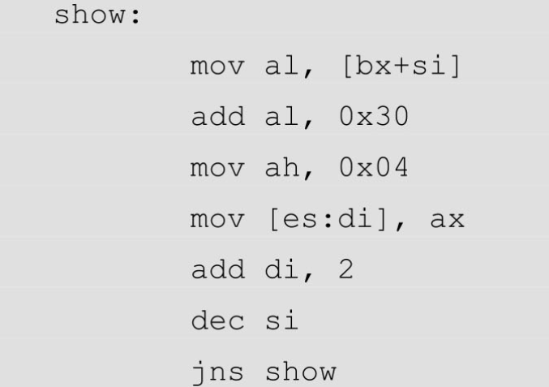

原因很简单，条件转移指令（在这里是jns）不是循环指令，转移到的目标位置一般位于前方（源程序的下面），而不是像这里一样位于后方（上面）。由于是转移到上面重新执行先前已经执行过的指令，于是恰巧组成了一个特殊的循环。

因此，如图7-9所示，当用“n”命令执行jns show（在图中显示的是jns.-15）后，下一条指令又变成物理地址为0x0000000000007c52处的指令mov al，byte ptr ds:［bx+si］（即mov al，［bx+si］），因为SF标志为“0”。

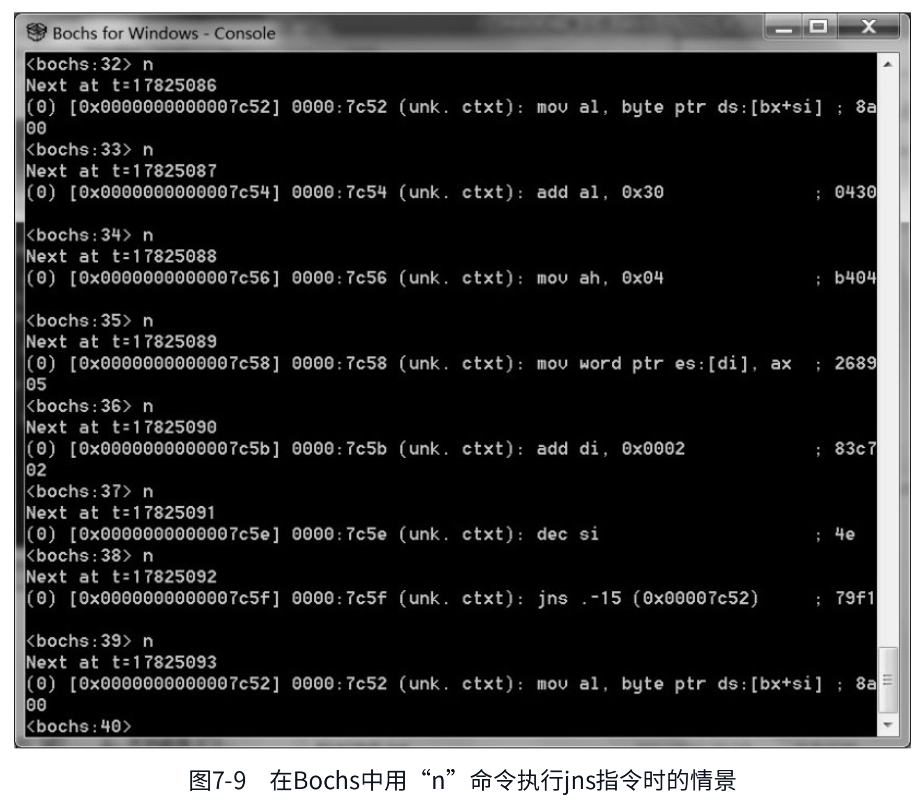

如何越过条件转移指令构造的特殊循环体，往后调试执行呢？要解决这个问题，只需要知道循环体后面那条指令的物理地址即可，这可以使用反汇编命令“u”。

反汇编的意思是根据机器指令代码生成可读的汇编语言指令，正好与汇编过程相反。“u”命令可以使用两个参数，第一个参数是跟在“/”后面的数字，指定反汇编出多少条指令；第二个参数用于指定一个内存地址，Bochs从这里开始反汇编操作。

如图7-10所示，在jns.-5指令执行前，用“u”命令反汇编。该命令指示从指令jns.-15所在的地址处(0x0000000000007c5f)开始反汇编，而且只需得到2条指令即可。注意，如果是从当前地址处开始反汇编，则地址参数可以省略。在这里，只需使用“u/2”即可。

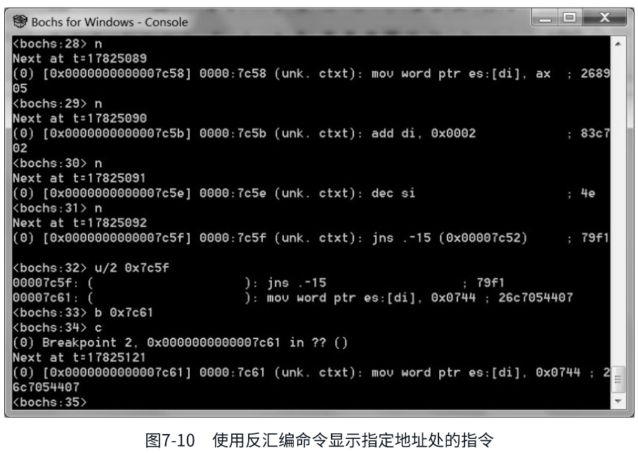

命令下达后，Bochs迅速做出回应，给出了两条指令，并显示了各自所在的物理地址。很显然，条件转移指令jns之后的那条指令是mov word ptr es:［di］，0x0744，也就是本章程序中的mov word ［es:di］，0x0744，其物理地址是0x7c61。

依然如图7-10所示，为了越过这个特殊的循环结构，首先使用“b”命令把0x7c61设为断点，然后执行“c”命令来连续执行程序，直至发现已经处于断点位置。

### 用调试命令“info”查看标志位

为了查看标志寄存器FLAGS的状态（各个标志位），可以在Bochs中使用命令“info”。使用该命令可以显示多种类型的处理器信息，显示标志寄存器的状态只是其功能之一。

为了显示标志寄存器的状态，可以使用“eflags”参数，即“info eflags”。INTEL8086的标志寄存器是16位的，称作FLAGS；在32位处理器上，该标志寄存器做了扩展，达到了32位，称作EFLAGS。因此，在Bochs中，应当输入“info eflags”，而不是“info flags”。

要查看标志寄存器的状态，应当在调试本章程序的过程中进行。如图7-11所示，我们在执行第33行的xor dx，dx指令之前，查看一下标志寄存器的状态。

如图7-11所示，当命令输入之后，Bochs显示一行古怪的文字作为回应，请允许我来解释一下这些东西都是什么。

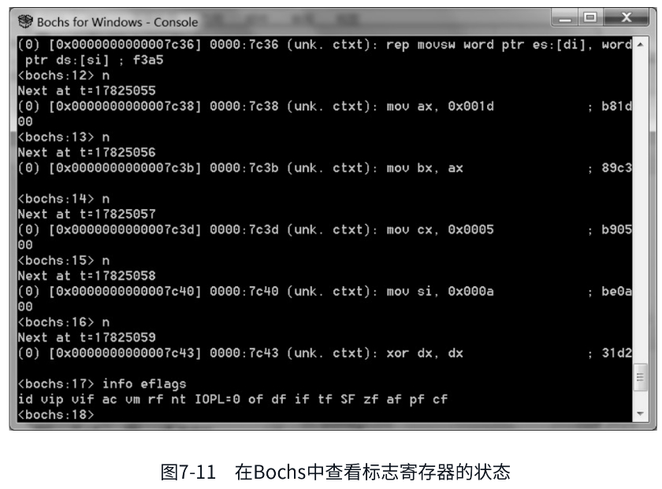

首先，像“id、vip、vif、ac、vm、rf、nt、IOPL”这些标志，是32位处理器才有的，现在不用管它们。

然后，“of”是溢出标志；“df”是方向标志；“if”和“tf”是和中断有关的标志，第10章才能讲到；“sf”是符号标志；“zf”是零标志；“af”是辅助进位标志；“pf”是奇偶标志；“cf”是进位标志。

问题是，光显示标志的名称，怎么知道某个标志位是“0”还是“1”呢？很简单，如果显示的标志名称是小写的，那么，说明该标志为“0”；否则，该标志的状态为“1”。如图7-11所示，符号标志是大写的“SF”，因此，该标志当前的状态是“1”。

注意，我们现在关注的是当xor指令执行后，标志寄存器的变化情况。接下来，我们单步执行xor dx，dx指令，然后再显示一次标志寄存器的内容。

如图7-12所示，该指令执行后，符号标志的名称变成小写，零标志和奇偶标志的名称变为大写。请你想一想，这是为什么？

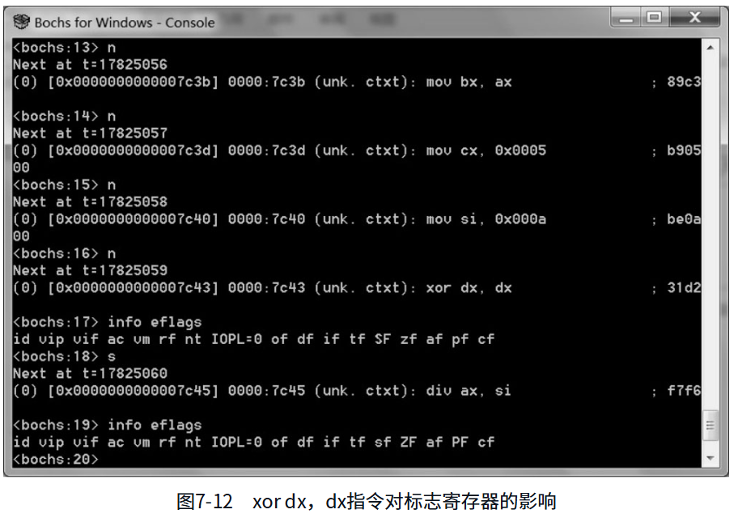

# 第8章 比高斯更快的计算

## 从1加到100的故事

伟大的数学家高斯在9岁那年，用很短的时间完成了从1到100的累加。那原本是老师给学生们出的难题，希望他们能老老实实地待在教室里。

高斯的方法很简单，他发现这是50个101的求和：100+1、99+2、98+3、…、50+51，于是他很快算出结果是101×50=5050。从1加到100，高斯发现了其中的规律，当然很快就能算出结果。但是计算机很蠢，它不懂什么规律，只能从1老老实实地加到100。不过，它的强项就是速度，而且不怕麻烦，当高斯还在审题的时候，它就累加出结果了。

计算累加和对计算机来说是小菜一碟，而这也不是本章的目的。本章的目标是：

1. 通过计算1到100的累加和，学习一种重要的数据结构—栈，了解处理器为访问栈提供了怎样的支持；
2. 总结INTEL8086处理器的寻址方式；
3. 学习几个新的处理器指令，它们是or、and、push和pop；
4. 学习在Bochs中调试程序时查看栈的方法。

## 代码清单8-1

本章有配套的汇编语言源程序，并围绕这些源程序进行讲解，请对照阅读。

本章代码清单：8-1（主引导扇区程序）

源程序文件：c08_mbr.asm

## 显示字符串

源程序第8行，声明并初始化了一串字符（字符串），它的最终用途是要显示在屏幕上。我们可以直接用单引号把一串字符围起来：

```
message db '1+2+3+...+100='
```

NASM支持这样的做法，同前一章相比，以这种方法声明字符串显得更方便、更直接。在编译阶段，编译器将把它们拆开，以形成一个个单独的字节。

为了跳过没有指令的数据区，源程序第6行是jmp near start指令。

源程序第11～15行用于初始化数据段寄存器DS和附加段寄存器ES。

源程序第18～28行同样用于显示字符串，但采用了不同的方法，首先是用索引寄存器SI指向DS段内待显示字符串的首地址，即标号“message”所代表的汇编地址。然后，再用另一个索引寄存器DI指向ES段内的偏移地址0处，ES指向显示缓冲区，逻辑段地址为0xB800。

字符串的显示需要依赖循环。本次采用的是循环指令loop。loop指令的工作又依赖于寄存器CX，所以，源程序第20行，用于在编译阶段计算一个循环次数，该循环次数等于字符串的长度（字符个数）。

循环体是从源程序第22行开始的。首先从数据段中，逻辑地址为DS:SI的地方取得第一个字符，将其传送到逻辑地址ES:DI，后者指向显示缓冲区。

紧接着，源程序第24行，将DI的内容加1，以指向该字符在显示缓冲区内的属性字节；第25行，在该位置写入属性值0x07，即黑底白字。

源程序第26、27行，分别将寄存器SI和DI的内容加1，以指向源位置和目标位置的下一个单元。

源程序第28行，执行循环。loop指令在执行时先将CX的内容减1，然后，处理器根据CX是否为零来决定是否开始下一轮循环。当CX为0的时候，说明所有的字符已经显示完毕。

## 计算1到100的累加和

接下来就是计算1到100的累加和了。处理器还没有智能到可以理解题意的程度，具体的计算方法和计算步骤只能由人来给出。

要计算1到100的累加和，可以采取这样的办法：先将寄存器AX清零，再用AX的内容和1相加，结果在AX中；接着，再用AX的内容和2相加，结果依旧在AX中……就这样一直加到100。

为此，源程序第31行，用xor指令将寄存器AX清零；源程序第32行，将第一个被累加的数“1”传送到寄存器CX。

源程序第34行就开始累加了，每次相加之后，源程序第35行，将CX的内容加1，以得到下一个将要累加的数。

源程序第36行，将CX的内容同100进行比较，看是不是已经累加到100了。如果小于或等于100，则继续重复累加过程，如果大于100，就不再累加，直接往下执行。

最后，寄存器AX中将得到最终的累加和。需要特别说明的是，AX可以容纳的无符号数最大是65535，再大就不行了。由于我们已经知道最终的结果是5050，所以很放心地使用了寄存器AX。要是你从1加到1000，就得考虑使用两个寄存器来计算了。

## 累加和各个数位的分解与显示

### 栈和栈段的初始化

得到了累加和之后，下面的工作是将它的各个数位分解出来，并准备在屏幕上显示，好让我们知道这个数到底是多少。

和前两章不同，分解出来的各个数位并不保存在数据段中，而保存在一个叫作栈的地方。

栈(Stack)是一种特殊的数据存储结构，数据的存取只能从一端进行。这样，最先进去的数据只能最后出来，最后进去的数据倒是最先出来，这称为后进先出(Last In First Out, LIFO)。如图8-1所示，可以把栈看成一个一端开口的塑料瓶，1号球最先放进去，3号球最后放进去，只能在3号球和2号球分别取出后，才能把1号球取出来。

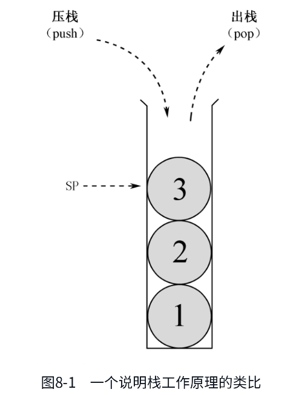

听起来像在讲如何往盒子里放东西，或者从盒子里取东西。实际上，我们还是在讲内存，只不过是另一种特殊的读写方式而已。

和代码段、数据段和附加段一样，栈也被定义成一个内存段，叫栈段(Stack Segment)，由段寄存器SS指向。

针对栈的操作有两种，分别是将数据推进栈(push)和从栈中弹出数据(pop)。简单地说，就是压栈和出栈。压栈和出栈只能在一端进行，所以需要用栈指针寄存器SP(Stack Pointer)来指示下一个数据应当压入栈内的什么位置，或者数据从哪里出栈。

定义栈需要两个连续的步骤，即初始化段寄存器SS和栈指针SP的内容。源程序第40～42行用于将栈段的段地址设置为0x0000，栈指针的内容设置为0x0000。

到目前为止，我们已经定义了3个段，图8-2是当前的内存布局。总的内存容量是1MB，物理地址的范围是0x00000～0xFFFFF，其中，假定数据段的长度是64KB（实际上它的长度无关紧要），占据了物理地址0x07C00～0x17BFF，对应的逻辑地址范围是0x07C0:0x0000～0x07C0:0xFFFF；代码段和栈段是同一个段，占据着物理地址0x00000～0x0FFFF，对应的逻辑地址范围是0x0000:0x0000～0x0000:0xFFFF。

虽然代码段和栈段在本质上指向同一块内存区域，但是不要担心，主引导程序只占据着中间的一小部分，我们有办法让它们互不干扰。

### 分解各个数位并压栈

数位的分解还是得靠做除法。源程序第44行用于把除数10传送到寄存器BX。

以往分解寄存器AX中的数时，固定是分解5次，得到5个数位。但这也存在一个缺点，如果AX中的数很小时，在屏幕上显示的数左边都是“0”，这当然是很别扭的。为此，本章的源程序做了改善，每次除法结束后，都做一次判断，如果商为0的话，分解过程可以提前结束。

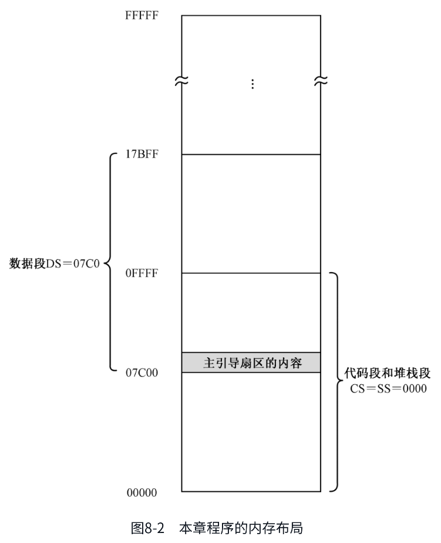

但是，由于每次得到的数位是压入栈的，将来还要反序从栈中弹出，为此，必须记住实际上到底有多少个数位。源程序第45行，将寄存器CX清零，并在后面的代码中用于累计有多少个数位。

源程序第47～53行也是一个循环体，每执行一次，分解出一个数位。每次分解时，CX加1，表明数位又多了一个，这是源程序第47行所做的事。

源程序第48、49行，将DX清零，并和AX一起形成32位的被除数。

分解出的数位将来要显示在屏幕上，为了方便，源程序第50行，直接将DL中的余数“加上”0x30，以得到该数字所对应的ASCII码。

注意上一段话中的引号。这并不是真正的加法，or并不是相加的指令，但由于此处的特殊情况，使得or指令的执行结果和相加是一样的。

与xor一样，or也是逻辑运算指令。不同之处在于，or执行的是逻辑“或”。数字逻辑中的“或”用于表示两个命题并列的情况。如果0代表假，1代表真，那么：

```
0 or 0 = 0
0 or 1 = 1
1 or 0 = 1
1 or 1 = 1
```

在处理器内部，or指令的目的操作数可以是8位或者16位的通用寄存器，或者包含8/16位实际操作数的内存单元，源操作数可以是与目的操作数数据宽度相同的通用寄存器、内存单元或者立即数。比如：

```
or al, cl
or ax, dx
or [label_a], bx
or byte [bx], 0x55
```

和其他指令一样，or指令不允许目的操作数和源操作数都是内存单元的情况出现。当or指令执行时，两个操作数相对应的比特之间分别进行各自的逻辑“或”运算，结果位于目的操作数中。举个例子，以下指令执行后，寄存器AL中的内容是0xff。

```
mov al, 0x55
or al, 0xaa
```

再来看源程序第50行，因为每次是除以10，所以在寄存器DL中得到的余数，其高4位必定为0。又由于0x30的低4位是0，高4位是3，所以，DL中的内容和0x30执行逻辑“或”后，相当于是将DL中的内容和0x30相加。这是用逻辑“或”指令做加法的一个特例。

or指令对标志寄存器的影响是：OF和CF位被清零，SF、ZF、PF位的状态依计算结果而定，AF位的状态未定义。

与or相对应的是逻辑与“and”。如果0代表假，1代表真，那么

```
0 and 0 = 0
0 and 1 = 0
1 and 0 = 0
1 and 1 = 1
```

相应的，处理器设计了and指令。在16位处理器上，and指令的两个操作数都应当是字节或者字。其中，目的操作数可以是通用寄存器和内存单元；源操作数可以是通用寄存器、内存单元或者立即数，但不允许两个操作数同时为内存单元，而且它们在数据宽度上应当一致。比如：

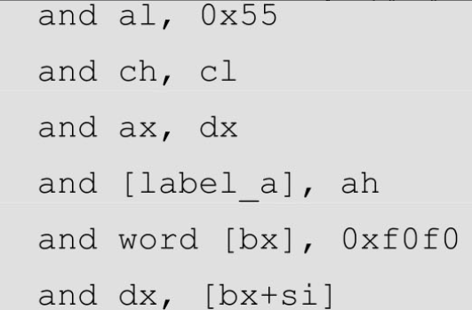

注意，“label_a”是一个标号，下同。

当这些指令执行时，两个操作数对应的各个比特位分别进行逻辑“与”，结果保存在目的操作数中。因此，下面的这些指令执行后，寄存器AX中的结果是二进制数1000000000000100，即0x8004：

```
mov ax, 1001_0111_0000_0100B
and ax, 1000_0000_1111_0111B
```

and指令执行后，OF和CF位被清零，SF、ZF、PF位的状态依计算结果而定，AF位的状态未定义。按要求，各个数位的ASCII码是压入栈中的。源程序第51行，push指令的作用是将寄存器DX的内容压入栈中。在16位的处理器上，push指令的操作数可以是16位的寄存器或者内存单元。例如：

```
push ax
push word [label_a]
```

你可能觉得奇怪，push指令只接受16位的操作数，为什么要对内存操作数使用关键字“word”。事实上，8086处理器只能压入一个字；但其后的32位和64位处理器允许压入字、双字或者四字，因此，关键字是必不可少的。

就8086处理器来说，因为压入栈的内容必须是字，所以，下面的指令都是非法的：

```
push al
push byte [label_a]
```

处理器在执行push指令时，首先将栈指针寄存器SP的内容减去操作数的字长（以字节为单位的长度，在16位处理器上是2），然后，把要压入栈的数据存放到逻辑地址SS:SP所指向的内存位置（和其他段的读写一样，把栈段寄存器SS的内容左移4位，加上栈指针寄存器SP提供的偏移地址）。

如图8-3所示，代码段和栈段是同一个段，所以段寄存器CS和SS的内容都是0x0000。而且，栈指针寄存器SP的内容在源程序第42行被置为0。所以，当push指令第一次执行时，SP的内容减2，即0x0000-0x0002=0xFFFE，借位被忽略。于是，被压入栈的数据，在内存中的位置实际上是0x0000:0xFFFE。push指令的操作数是字，而且INTEL处理器是使用低端字节序的，故低字节在低地址部分，高字节在高地址部分，正好占据了栈段的最高两个字节位置。

这只是第一次压栈操作时的情况。以后每次压栈时，SP都要依次减2。很明显，不同于代码段，代码段在处理器上执行时，是由低地址端向高地址端推进的，而压栈操作则正好相反，是从高地址端向低地址端推进的。

push指令不影响任何标志位。

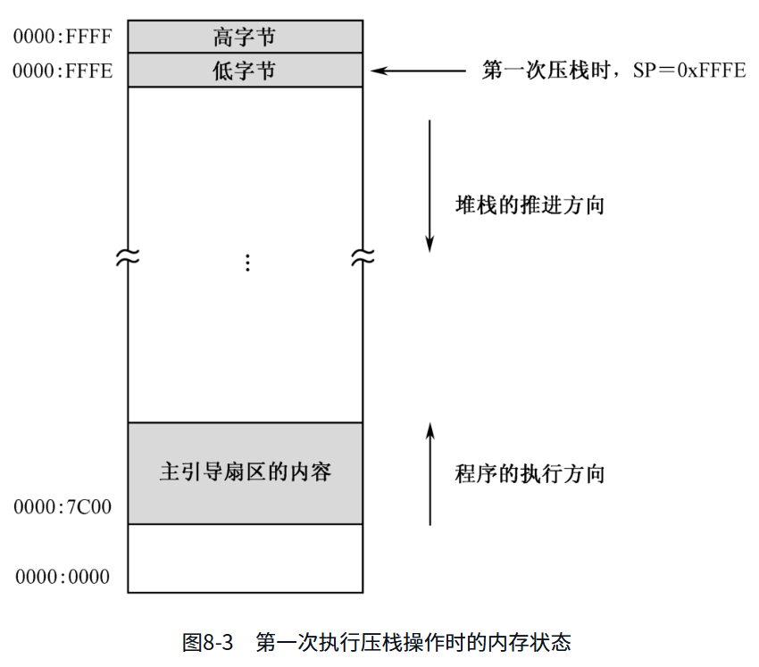

源程序第52、53行，判断本次除法结束后，商是否为零。如果不为零，则再循环一次；如果为零，则表明不需要再继续分解了。

### 出栈并显示各个数位

压栈的次数（数位的个数）取决于寄存器AX中的数有多大，位于寄存器CX中。数位是按“个位”“十位”“百位”“千位”“万位”的顺序依次压栈的（实际情况取决于数的大小），出栈正好相反。所以，可以将它们按顺序弹出栈并显示在屏幕上。

源程序第57行，pop dx指令的功能是将逻辑地址SS:SP处的一个字弹出到寄存器DX，然后将SP的内容加上操作数的字长(2)。

和push指令一样，pop指令的操作数可以是16位的寄存器或者内存单元。例如：

```
pop ax
pop word [label_a]
```

pop指令执行时，处理器将栈段寄存器SS的内容左移4位，再加上栈指针寄存器SP的内容，形成20位的物理地址访问内存，取得所需的数据。然后，将SP的内容加操作数的字长，以指向下一个栈位置。

pop指令不影响任何标志位。

源程序第58行将弹出的数据写入显示缓冲区。索引寄存器DI的内容是在前面显示字符串时用过的，期间一直没有改变过，它现在指向显示缓冲区中字符串之后的位置。接

着，源程序第59～61行，将字符显示属性写入字符之后的单元，并再次递增DI以指向显示缓冲区中下一个字符的位置。

源程序第62行，每次执行loop指令时，处理器都是先将寄存器CX减1。当所有的数位都弹出和显示以后，CX必定为零，这将导致退出循环。

当处理器最后一次执行出栈操作后，栈指针寄存器SP的内容将恢复到最开始设置时的状态，即它的内容重新为零。

### 进一步认识栈

学习栈的知识，最好是先有一些感性认识，本章就是这么做的。现在，感性认识已经有了，剩下的，就是总结一下，做几点说明。

第一，push指令的操作数可以是16位寄存器或者16位内存单元，push指令执行后，压入栈中的仅仅是该寄存器或者内存单元里的数值，与该寄存器或内存单元不再相干。如果不理解这一点，就容易错误地以为压入了某个寄存器的值，比如AX之后，将来还要再弹回AX才行，这是不对的。所以，下面的指令是合法而且正确的：

```
push cs
pop ds
```

这两条指令的意思是，将代码段寄存器的内容压栈，并弹出到数据段寄存器DS。如此一来，代码段和数据段将属于同一个内存段。实际上，这两条指令的执行结果和以下指令的执行结果相同：

```
mov ax, cs
mov ds, ax
```

第二，栈在本质上也只是普通的内存区域，之所以要用push和pop指令来访问，是因为你把它看成栈而已。实际上，如果你把它看成普通的数据段而忘掉它是一个栈，那么它将不再神秘。

引入栈和push、pop指令只是为了方便程序开发。临时保存一个数值到栈中，使用push指令是最简洁、最省事的，但如果你不怕麻烦，可以不使用它。所以，下面的代码可以用来取代push ax指令：

```
sub sp, 2
mov bx, sp
mov [ss:bx], ax
```

同样，pop ax指令的执行结果和下面的代码相同：

```
mov bx, sp
mov ax, [ss:bx]
add sp, 2
```

你可能还有另一种想法，即，我连栈段都不用，SP也省了，我自己把临时数据都保存在数据段中。好吧，如果是这样的话，你必须在数据段中开辟一些空间，并亲自维护一个指针来跟踪这些数据的存入和取出。当程序变得越来越复杂时，这些维护工作同样让你焦头烂额。

因此，显而易见的是，push和pop指令更方便，毕竟与栈访问有关的一切都是由处理器自动维护的。而且，总有一天你会发现，有些工作不使用栈来进行的话，是非常困难的。

第三，要注意保持栈平衡。如果在做某件事的时候要使用栈，那么，栈指针寄存器SP在做这件事之前的值，应当和这件事做完后的值相同。就是说，push指令和pop指令的数量应当是相同的。栈是反复使用的内存区域，如果使用不当，将会出现问题，下面就是一个例子：

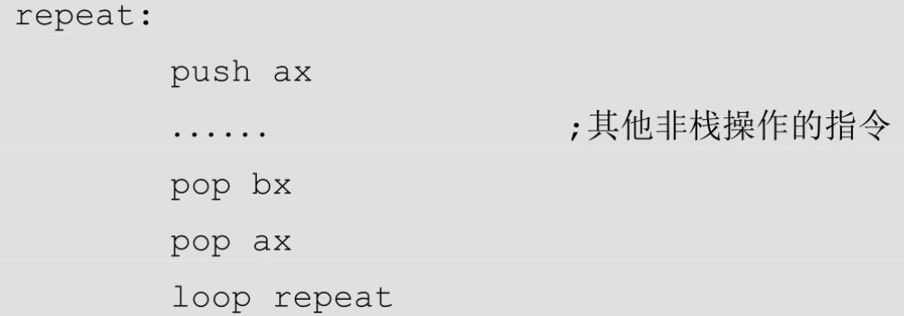

以上的循环是干什么用的，这个不重要。因为每次循环时，都要用到寄存器AX和BX的原始内容，所以，循环体的开头要压栈保存它们，在循环体的末尾要出栈恢复它们。但是你看到了，由于一时疏忽，只压入了寄存器AX，而在出栈时，却多弹了一个数值到BX中。在这种情况下，栈是不平衡的，程序的运行结果当然也不会正确。

第四，在编写程序前，必须充分估计所需要的栈空间，以防止破坏有用的数据。特别是在栈段和其他段属于同一个段的时候。如图8-3所示，栈段和代码段属于同一个内存段，段地址都是0x0000，段的长度都是64KB。主引导程序的长度是512(0x200)字节，从偏移地址0x7c00延伸到0x7e00。栈是向下增长的，它们之间有0xffff-0x7e00+1=0x8200字节的空档。通常来说，我们的程序是安全的，因为不可能压入这么多的数据。但是，不能掉以轻心，栈定义得过小，而且程序编写不当，导致栈破坏了有用数据的情况也时有发生。

第五，尽管不能完全阻止程序中的错误，但是，通过将栈定义到一个单独的64KB段，可以使错误仅局限于栈，而不破坏其他段的有用数据。假如栈的段地址是0x0000，大小是64KB，那么，无论SP怎样变化，压栈和出栈操作始终会在该段内进行，而不会影响到其他无关的内存区域。这样，无论任何时候，即使是push指令位于一个无限循环中，栈指针寄存器SP的内容也永远只会在0x0000～0xFFFF之间来回滚动，不会影响到其他内存段。

## 程序的编译和运行

### 观察程序的运行结果

编译源程序8-1，然后将生成的二进制文件c08_mbr.bin写入虚拟硬盘的主引导扇区，启动虚拟机观察程序运行结果。如果程序无误，结果应当如图8-4所示。

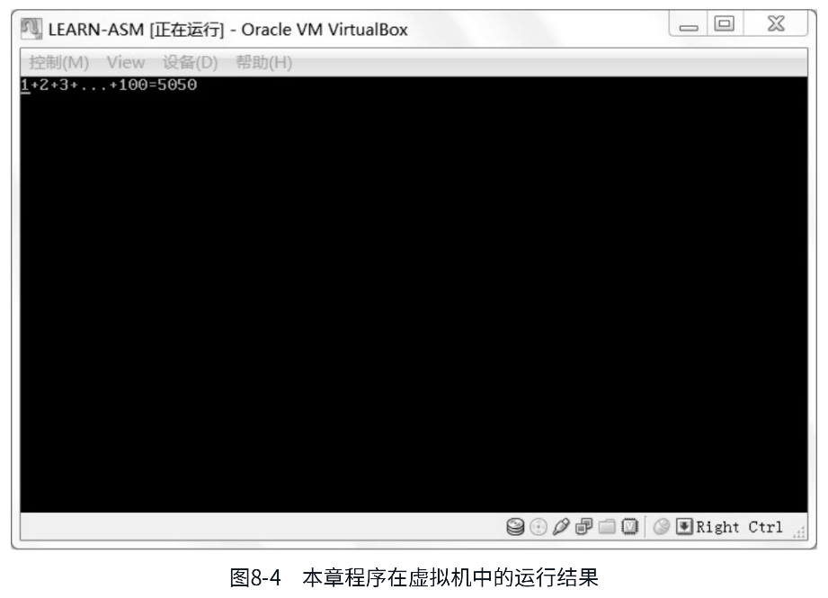

### 在调试过程中查看栈中内容

很多程序错误与栈的不当使用有关。因此，在调试程序的过程中，不可避免地要查看栈的状态，从中发现一些导致程序出错的蛛丝马迹。

在Bochs中查看栈的命令是“print-stack”，它可以带一个参数，用于指定显示多少数据。如果不使用参数，则默认显示当前栈中的16个字。

如图8-5所示，当单步执行了“push dx”指令后，我们立即用“print-stack”命令来查看当前栈。当前栈是由段寄存器SS指示的，栈顶是由栈指针寄存器SP指示的。

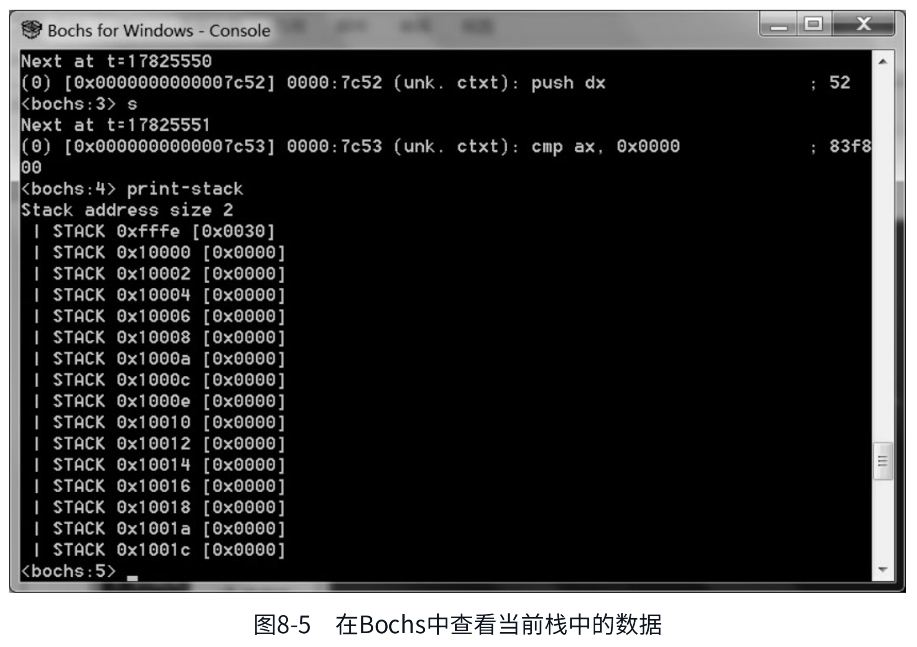

Bochs并不知道栈的实际大小，因此，它只是显示栈顶（由SP指示）以下的16个字。如图8-5所示，栈顶数据是0x0030，其物理内存地址是0xFFFE，这是刚压入的寄存器DX的内容。

栈是从高地址向低地址推进的，当前栈段的物理地址范围是0x00000～0x0FFFF，而且实际上我们只使用0x07E00～0x0FFFF之间的区域，但Bochs并不知道这些。

## 8086处理器的寻址方式

处理器的一生，是忙碌的一生，只要它工作着，就必定是在取指令和执行指令。它就像勤劳的牛，吃的是电，挤出来的还是电，不过是另一种形式的电。

多数指令操作的是数值。比如：

```
mov ax, 0x55aa
```

这条指令执行时，把0x55aa传送到寄存器AX。再如：

```
add dx, cx
```

这是把寄存器DX中的数据和寄存器CX中的数据相加，并把结果保留在DX中，同时保持CX中原有的内容不变。

所以，如果你问处理器整天忙什么，它一定会说：“还能有什么，就是和数打交道！”

既然操作和处理的是数值，那么，必定涉及数值从哪里来，处理后送到哪里去，这称为寻址方式(Addressing Mode)。简单地说，寻址方式就是如何找到要操作的数据，以及如何找到存放操作结果的地方。

实际上，大多数的寻址方式我们都已经使用过，现在所做的只是一个完整的总结。当然，这里的讲解仅限于16位的处理器。

### 寄存器寻址

最简单的寻址方式是寄存器寻址。就是说，指令执行时，操作的数位于寄存器中，可以从寄存器里取得。这种寻址方式的例子还是很多的，比如：

```
mov ax, cx
add bx, 0xf000
inc dx
```

以上，第一条指令的两个操作数都是寄存器，是典型的寄存器寻址；第二条指令的目的操作数是寄存器，因此，该操作数也是寄存器寻址；第三条指令就更不用说了。

### 立即寻址

立即寻址又叫立即数寻址。也就是说，指令的操作数是一个立即数。比如：

```
add bx, 0xf000
mov dx, label_a
```

以上，第一条指令的目的操作数采用了寄存器寻址方式，用于提供被加数；第二个操作数（源操作数）用于给出加数0xf000。这是一个直接给出的数值，是立即在指令中给出的，最终参与加法运算的就是它，不需要通过其他方式寻找，故称为立即数。这也是一种寻址方式，称为立即寻址。

在第二条指令中，目的操作数也采用的是寄存器寻址方式。尽管源操作数是一个标号，但是，标号是数值的等价形式，代表了它所在位置的汇编地址。因此，在编译阶段，它会被转化为一个立即数。因此，该指令的源操作数也采用了立即寻址方式。

### 内存寻址

寄存器寻址的操作数位于寄存器中，立即寻址的操作数位于指令中，是指令的一部分。传统上，这是两种速度较快的寻址方式。但是，它们也有局限性。一方面，我们不可能总是知道要操作的数是多少，因此也就不可能总是在指令中使用立即数；另一方面，寄存器的数量有限，不可能总指望在寄存器之间来回倒腾。

考虑到内存容量巨大，所以，在指令中使用内存地址，来操作内存中的数据，是最理想不过了。正是因为内存访问如此重要，处理器才拥有好几种内存寻址方式。

我们知道，8086处理器访问内存时，采用的是段地址左移4位，然后加上偏移地址，来形成20位物理地址的模式，段地址由4个段寄存器之一来提供，偏移地址要由指令来提供。

因此，所谓的内存寻址方式，就是如何在指令中指定操作数的偏移地址，供处理器访问内存时使用，这个偏移地址也叫有效地址(Effective Address, EA)。换句话说，内存寻址方式就是在指令中指定偏移地址（有效地址）如何计算。

1、直接寻址

在这种寻址方式中，偏移地址或者说有效地址是直接给出的，是一个用标号或者数字直接给出的具体数值。比如：

```
mov ax, [0x5c0f]
add word [0x0230], 0x5000
xor byte [es:label_b], 0x05
```

但凡是表示内存地址的，都必须用中括号括起来。

以上，在第一条指令中，源操作数使用的是直接寻址方式，当这条指令执行时，处理器将数据段寄存器DS的内容左移4位，加上这里的0x5c0f，形成20位物理地址。接着，从该物理地址处取得一个字，传送到寄存器AX中。

在第二条指令中，目的操作数采用的是直接寻址方式。当这条指令执行时，处理器用同样的方法，访问由段寄存器DS指向的数据段，并把指令中的立即数加到该段中偏移地址为0x0230的字单元里。

尽管在第三条指令中，目的操作数使用了标号和段超越前缀，但它依然属于直接寻址方式。原因很简单，标号是数值的等价形式，在指令编译阶段，会被转换成数值；而段超越前缀仅仅用来改变默认的数据段。

2、基址寻址

很多时候，我们会有一大堆的数据要处理，而且它们通常都是挨在一起顺序存放的。比如：

```
buffer dw 0x20, 0x100, 0x0f, 0x300, 0xff00
```

假如要将这些数据统统加1，那么，使用直接寻址的指令序列肯定是这样的：

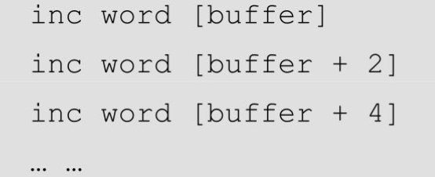

这样做好吗？当然，程序本身是没有问题的。但是，考虑到它的效率和代码的简洁性，特别是这些工作用循环来完成会更好，可以使用基址寻址。所谓基址寻址，就是先指定一个基准位置，数据的偏移地址（有效地址）取决于它到基准位置的位移或者说距离(Displacement)。

要使用基址寻址的话，必须在指令的地址部分使用基址寄存器BX或者BP来提供一个基准地址。比如：

```
mov [bx], dx
add byte [bx], 0x55
```

以上，第一条指令中的目的操作数采用了基址寻址。在指令执行时，处理器将数据段寄存器DS的内容左移4位，加上基址寄存器BX中的内容，形成20位的物理地址。然后，把寄存器DX中的内容传送到该地址处的字单元里。

第二条指令中的目的操作数也采用的是基址寻址。指令执行时，将数据段寄存器DS的内容左移4位，加上寄存器BX中的内容，形成20位的物理地址。然后，将指令中的立即数0x55加到该地址处的字节单元里。

基址寻址的动机是采用“基地址+位移”的方式计算有效地址，对于前面那个将所有数据加一的例子，如果采用基址寻址，则它会是这样的：

```
mov bx, buffer
inc word [bx]
inc word [bx + 2]
inc word [bx + 4]
......
```

就以上示例而言，看不出基址寻址有什么好处和优势，但是不要着急，后面我们将展示它的威力。

在基址寻址方式中，基址寄存器也可以是BP。比如：

```
mov ax, [bp]
```

这条指令的源操作数采用了基址寻址方式。但是，与前面的指令相比，它稍微有些特殊。原因在于，它采用是基址寄存器BP，在形成20位的物理地址时，默认的段寄存器是SS。也就是说，它经常用于访问栈。这条指令执行时，处理器将栈段寄存器SS的内容左移4位，加上寄存器BP的内容，形成20位的物理地址，并将该地址处的一个字传送到寄存器AX中。

我们知道，栈是后进先出的数据结构，访问栈的一般方法是使用push和pop指令。比如我们用以下的指令压入两个数据：

```
mov ax, 0x5000
push ax
mov ax, 0x7000
push ax
```

很显然，如果要用pop指令弹出数据，就必须先弹出0x7000，才能弹出0x5000，除非你改变了栈指针SP的内容，否则这个顺序是不可能改变的。

但是，有时候我们希望，而且必须得越过这种限制，去访问栈中的内容，还不能破坏栈的状态，特别是栈指针寄存器SP的内容，使得push和pop操作能正常进行。一个典型的例子是高级语言里的函数调用，所有的参数都位于栈中。为了能访问到那些被压在栈底的参数，这时，BP就能派上用场：

```
mov ax, 0x5000
push ax
mov bp, sp
mov ax, 0x7000
push ax
mov dx, [bp]	;dx中的内容为0x5000
```

以上，在压入0x5000之后，立即将栈指针SP保存到BP。后面，尽管栈顶的数据0x7000没有出栈，但依然可以用BP取出压在栈下面的0x5000。如此一来，正常的push和pop操作照样进行，同时，还能访问到栈中的参数。

同样的，可以为基址寄存器BP加上一个位移。比如：

```
mov dx, [bp - 2]
```

处理器在执行时，将段寄存器SS的内容左移4位，加上BP减去2以形成物理地址，这里的2就是位移。这样一来，在保持基址寄存器BP内容不变的情况下，就可以访问栈中的任何元素。这里，位移仅用于在指令执行时形成有效地址，不会改变寄存器BP的原有内容。

在基址寻址方式中，基地址原则上是固定不变的。换句话说，通常不改变BX和BP，而是在BX和BP的基础上加一个位移。但是，有时候为了方便，可以通过增加BX和BP的方式来访问数据，这可以看成在操作的过程中动态设置新的基地址。以下代码是用循环来完成前面那个加1任务：

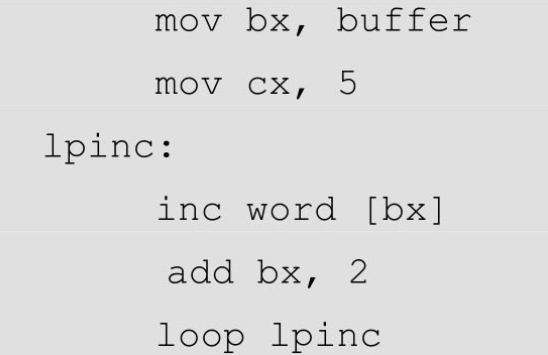

在这段代码中，我们令寄存器BX指向所有数据的起始位置，这是基准地址。但是在循环的过程中我们不断设置新的基准地址，并通过新的基准地址来访问后面的每一个字。

3、变址寻址

变址寻址类似于基址寻址，唯一不同之处在于这种寻址方式使用的是变址寄存器（或称索引寄存器）SI和DI。例如：

```
mov [si], dx
add ax, [di]
xor word [si], 0x8000
```

和基址寻址一样，当带有这种操作数的指令执行时，除非使用了段超越前缀，处理器会访问由段寄存器DS指向的数据段，偏移地址由寄存器SI或者DI提供。

同样的，变址寻址方式也允许带一个偏移量：

```
mov [si + 0x100], al
and byte [di + label_a], 0x80
```

以上第二条指令中，尽管使用的是标号，但本质上属于一个编译阶段确定的数值。

4、基址变址寻址

让处理器支持多种寻址方式会增加硬件上的复杂性，但可以增强它的数据处理能力，这么做是值得的。说到数据处理，下面是一个稍微复杂一些的任务：


以上声明了标号“string”并初始化了26字节的数据。现在，你的任务是，将这26字节的数据在原地反向排列。

这个问题不难，所以你可能很快想到使用栈，先将这26个数据压栈，再反向出栈，因为栈是后进先出的，正好符合要求。代码是这样的（代码段、栈段初始化的代码统统省略）：

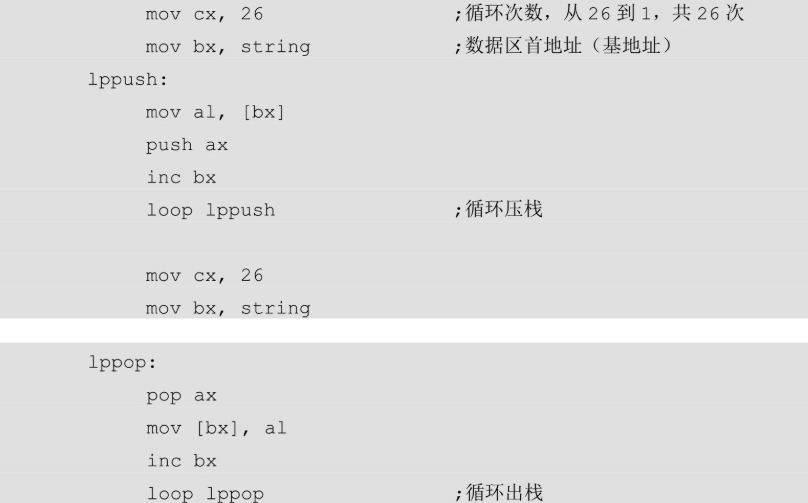

这的确是个好办法。不过，8086处理器也支持一种基址加变址的寻址方式，简称基址变址寻址，可能用起来更方便。

使用基址变址的操作数可以使用一个基址寄存器（BX或者BP），外加一个变址寄存器（SI或者DI）。在这种寻址方式下，基址寄存器BX或者BP是固定不变的，是真正作为基地址来使用的；变址寄存器SI或者DI是可变的，用来提供位移。它的基本形式是这样的：

```
mov ax, [bx + si]
add word [bx + di], 0x3000
```

以上，第一条指令的源操作数采用了基址变址寻址。当处理器执行这条指令时，把数据段寄存器DS的内容左移4位，加上基址寄存器BX的内容，再加上变址寄存器SI的内容，共同形成20位的物理地址。然后，从该地址处取得一个字，传送到寄存器AX中。

第二条指令与第一条指令类似，只不过是加法指令，它的目的操作数采用了基址变址寻址，源操作数采用的是立即寻址。这条指令执行时，处理器访问由段寄存器DS指向的数据段，加上由BX和DI相加形成的偏移地址，共同形成20位的物理地址，然后将立即数0x3000加到该地址处的字单元里。

采用基址变址寻址方式的排序代码如下：

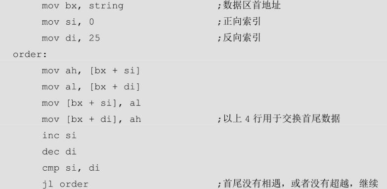

和前面使用栈的代码相比，指令的数量没有明显减少，这说明任务还不够复杂，也许只能这么解释了。但是，它同样很方便，很有效，不是吗？

同样的，基址变址寻址允许在基址寄存器和变址寄存器的基础上再带一个位移，但它必须是一个数值。比如：

```
mov [bx + si + 0x100], al
and byte [bx + di + label_a], 0x80
```

# 第9章 硬盘和显卡的访问与控制

