# 第10章 中断和动态时钟显示

在享受计算机给我们带来的便利和乐趣的同时，我仍然会时不时地说它的坏话。人们都说处理器是整个计算机的大脑，可是，处理器是一个非常精确的速度很快的“傻子”。

在计算机上执行的程序通常需要一些输入，输入可能来自键盘、鼠标、硬盘、话筒、数码相机等，同时，处理后还需要输出，要送到输出设备，如显示器、硬盘、打印机、网络设备等。

一个程序只做自己的事，当它等待输入，或者等待输出时，它面对的是比处理器慢得多的外部设备。典型的情况下，硬盘的工作速度比处理器至少慢几千万甚至几亿倍，像打印机这类设备就更不用说了。

以读硬盘为例，如果程序需要从硬盘上读它需要的数据，那么，按照执行流程，它必须向硬盘接口发送读命令，然后等待硬盘发出一个数据已经准备好的信号，程序在接到这个信号后继续往下执行，来操作这些数据。从发出读硬盘的命令，到硬盘准备好数据，这个过程虽然短暂，但对于处理器来说却是一段漫长的等待时间。在等待的这段时间，处理器唯一能做的，就是不停地观察外部设备的状态变化。

计算机革命的早期，硬件资源极其昂贵和稀少。据说20世纪60年代，一台计算机的价格抵得上300辆野马跑车，月租金超过1万美元。这么昂贵的东西，不好好利用它就是一种罪过。显然，还是以从硬盘上读数据为例，在硬盘准备数据的这段时间里，处理器应该去做别的事情，去执行别的程序。硬盘准备好数据后，向处理器发送一个信号，然后处理器再回到原来的程序继续往下执行。

随着处理器性能的增强，人们希望它能执行多个程序。即使只有一个处理器，在同一时间只能执行一个程序，但是，因为它的性能很强，速度很快，也可以轮流执行多个程序，而且因为它速度很快，给人的感觉是在同时执行多个程序。举个例子来说，你平时可以一边玩游戏，一边和朋友们在网上聊天，可能还同时看着电影听着音乐。

为了分享计算能力，处理器应当能够为多用户多任务提供硬件一级的支持。在单处理器的系统中，允许同时有多个程序在内存中等待处理器的执行。

如何把多个程序调入内存，是操作系统的事情，这个可以先放一放。现在的问题是，当一个程序执行时，它是不会知道还有别的程序正眼巴巴地等着执行的。在这种情况下，就需要打断处理器当前的执行流程，去执行另外一些程序。执行完之后，还可以返回到原来的程序继续执行。这就好比你正在用手机听歌，突然来电话了，处理器（当然，手机也是有处理器的）必须中断歌曲的播放，来处理这件更为重要的事件。

为了在需要的时候打断处理器当前的执行流程，去做另外的事情，执行别的代码，或者去执行另一个程序，中断(Interrupt)这种工作机制就应运而生了。

自从中断这种工作机制产生之后，它就一直是各种处理器必须具备的。中断是怎么发生的，处理器又是怎么处理中断的，在这个过程中，我们又能做些什么，这都是本章将要告诉你的。总体来说，本章的任务是：

1. 了解中断的原理和分类，用两个具体的实例来学习如何在中断机制下工作，包括如何使用BIOS中断工作；
2. 学会在Bochs中观察中断向量表和中断标志位IF的变化；
3. 学习一些新的x86处理器指令，包括into、int3、intn、iret、cli、sti、hlt、not和test等。

## 外部硬件中断

顾名思义，外部硬件中断，就是从处理器外面来的中断信号。当外部设备发生错误，或者有数据要传送（比如，从网络中接收到一个针对当前主机的数据包），或者处理器交给它的事情处理完了（比如，打印已经完成），又或者一个定时器到达指定的时间间隔时，它们都会拍一下处理器的肩膀，告诉它应当先把手头上的事情放一放，来临时处理一下。

如图10-1所示，外部硬件中断是通过两个信号线引入处理器内部的。从很早的时候起，也就是8086处理器的时代，这两根线的名字就叫NMI和INTR。

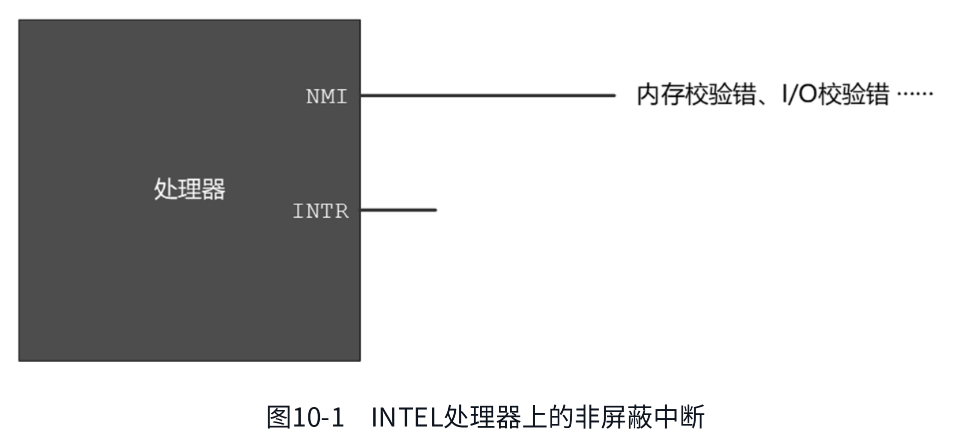

在某些具有怀疑精神的人眼里，用两根信号线来接受外部设备的中断信号可能是多余的，也许只需要一根就可以了。这似乎有些道理，但是，中断的原因很多，有些中断信号不是那么紧急，不用着急处理，或者，在处理器忙的时候，干脆就拒绝处理。但是，有些中断在任何时候都必须及时处理，因为事关整个系统的安全性。比如，在使用不间断电源的系统中，当电池电量很低的时候，不间断电源系统会发出一个中断，通知处理器快掉电了。再比如，内存访问电路发现了一个校验错误，这意味着，从内存读取的数据是错误的，处理器再努力工作也是没有意义的。在所有这些情况下，处理器必须针对这些中断采取必要的措施，隐瞒真相必然会对用户造成不可挽回的损失。

在这种情况下，处理器的设计者希望通过两个引脚来区别对待不同的中断信号。对于那些不紧急，不用着急处理的中断信号，应该从INTR引脚输入。在处理器内部，根据需要，可以屏蔽掉从这个引脚来的中断信号，不对它们进行处理。因此，从INTR输入的中断信号叫作可屏蔽中断。

相反地，所有严重事件都必须无条件地加以处理，由这类事件引发的中断信号应当通过NMI引脚送入处理器，这些严重的事件包括不间断电源的后备电池即将耗尽、内存校验错误、I/O检验错误，等等。在处理器内部，对于从NMI引脚来的中断信号不会作屏蔽和过滤，而是必须进行处理。因为这个原因，从NMI引脚来的中断信号称为非屏蔽中断(Non Maskable Interrupt, NMI)。

### 非屏蔽中断

尽管非屏蔽中断在处理器内部是不可屏蔽的（这也是“非屏蔽中断”这个名称的由来），但是，在处理器外部却有一个开关来控制非屏蔽中断信号能否进入处理器，这一点在后面还要详细说明，现在先不用管它。

INTEL处理器规定，NMI中断信号由0跳变到1后，至少要维持4个以上的时钟周期才算是有效的，才能被识别。

当一个中断发生时，处理器将会通过中断引脚NMI和INTR得到通知。除此之外，它还应当知道发生了什么事，以便采取适当的处理措施。每种类型的中断都被统一编号，这称为中断类型号、中断向量或者中断号。但是，由于不可屏蔽中断的特殊性—几乎所有触发NMI的事件对处理器来说都是致命的，甚至是不可纠正的。在这种情况下，努力去搞清楚发生了什么，通常没有太大的意义，这样的事最好留到关机之后，让专业维修人员来做。

也正是这个原因，在实模式下，NMI被赋予了统一的中断号2，不再进行细分。一旦发生2号中断，处理器和软件系统通常会放弃继续正常工作的“念头”，也不会试图纠正已经发生的问题和错误，很可能只是由软件系统给出一个提示信息。

### 可屏蔽中断

前面说过，可屏蔽中断是通过INTR引脚进入处理器内部的。像NMI一样，不可能为每一个中断源都提供一个引脚，但与NMI不同的是，需要区分中断的类型和来源。在这种情况下，需要一个代理，来接受外部设备发出的中断信号。还有，多个设备同时发出中断请求的概率也是很高的，所以该代理的任务还包括对它们进行仲裁，以决定让它们中的哪一个优先向处理器提出服务请求。

如图10-2所示，在个人计算机中，最早使用的中断代理就是8259芯片，它就是通常所说的中断控制器，从8086处理器开始，它就一直提供着这种服务。即使是现在，在绝大多数单处理器的计算机中，也依然有它的存在。

INTEL处理器允许256个中断，中断号的范围是0～255，8259负责提供其中的15个，但中断号并不固定。之所以不固定，是因为当初设计的时候，允许软件根据自己的需要灵活设置中断号，以防止发生冲突。该中断控制器芯片有自己的端口号，可以像访问其他外部设备一样用in和out指令来改变它的状态，包括各引脚的中断号。正是因为这样，它又叫可编程中断控制器(Programmable Interrupt Controller, PIC)。

不知道是怎么想的，反正每片8259只有8个中断输入引脚，而在个人计算机上使用它，需要两块。如图10-2所示，第一块8259芯片的代理输出INT直接送到处理器的INTR引脚，这是主片(Master)；第二块8259芯片的INT输出送到第一块的引脚2上，是从片(Slave)，两块芯片之间形成级联(Cascade)关系。

如此一来，两块8259芯片可以向处理器提供15个中断信号。当时，接在8259上的15个设备都是相当重要的，如PS/2键盘和鼠标、串行口、并行口、软磁盘驱动器、IDE硬盘等。现在，这些设备很多都已淘汰或者正在淘汰中，根据需要，这些中断引脚可以被其他设备使用。

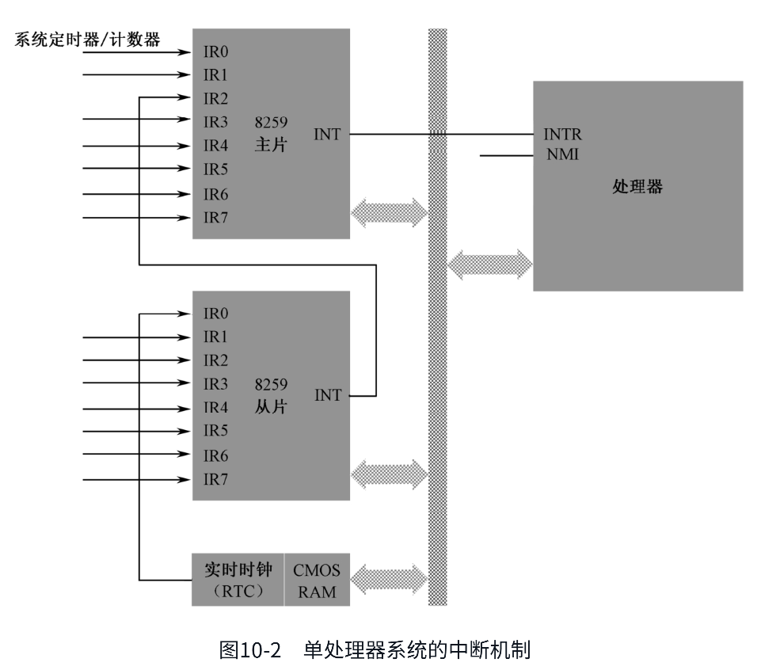

如图10-2所示，8259主片的引脚0(IR0)接的是系统定时器/计数器芯片；从片的引脚0(IR0)接的是实时时钟芯片RTC，该芯片是本章的主角，很快就会讲到。总之，这两块芯片的固定连接即使是在硬件更新换代非常频繁的今天，也依然没有改变。

在8259芯片内部，有中断屏蔽寄存器(Interrupt Mask Register, IMR)，这是个8位寄存器，对应着该芯片的8个中断输入引脚，对应的位是0还是1，决定了从该引脚来的中断信号是否能够通过8259送往处理器（0表示允许，1表示阻断，这可能出乎你的意料）。当外部设备通过某个引脚送来一个中断请求信号时，如果它没有被IMR阻断，那么，它可以被送往处理器。注意，8259芯片是可编程的，主片的端口号是0x20和0x21，从片的端口号是0xa0和0xa1，可以通过这些端口访问8259芯片，设置它的工作方式，包括IMR的内容。

中断能否被处理，除了要看8259芯片的脸色，最终的决定权在处理器手中。回到前面第7章，参阅图7-2，你会发现，在处理器内部，标志寄存器有一个标志位IF，这就是中断标志(Interrupt Flag)。当IF为0时，所有从处理器INTR引脚来的中断信号都被忽略掉；当其为1时，处理器可以接受和响应中断。

IF标志位可以通过两条指令cli和sti来改变。这两条指令都没有操作数，cli(CLear Interrupt flag)用于清除IF标志位；sti(SeT Interrupt flag)用于置位IF标志。

中断信号的来源，或者说，产生中断的设备，称为中断源。在计算机内部，中断发生得非常频繁，当一个中断正在处理时，其他中断也会陆续到来，甚至会有多个中断同时发生的情况，这都无法预料。不过不用担心，8259芯片会记住它们，并按一定的策略决定先为谁服务。总体上来说，中断的优先级和引脚是相关的，主片的IR0引脚优先级最高，IR7引脚优先级最低，从片也是如此。当然，还要考虑到从片是级联在主片的IR2引脚上的。

最后，当一个中断事件正在处理时，如果来了一个优先级更高的中断事件时，允许暂时中止当前的中断处理，先为优先级较高的中断事件服务，这称为中断嵌套。

### 实模式下的中断向量表

所谓中断处理，归根结底就是处理器要执行一段与该中断有关的程序（指令）。处理器可以识别256个中断，那么理论上就需要256段程序。这些程序的位置并不重要，重要的是，在实模式下，处理器要求将它们的入口点集中存放到内存中从物理地址0x00000开始到0x003ff结束，共1KB的空间内，这就是所谓的中断向量表(Interrupt Vector Table, IVT)。

如图10-3所示，每个中断在中断向量表中占2个字，分别是中断处理程序的偏移地址和逻辑段地址。中断0的入口点位于物理地址0x00000处，也就是逻辑地址0x0000:0x0000；中断1的入口点位于物理地址0x00004处，即逻辑地址0x0000:0x0004；其他中断依次类推，总之是按顺序的。

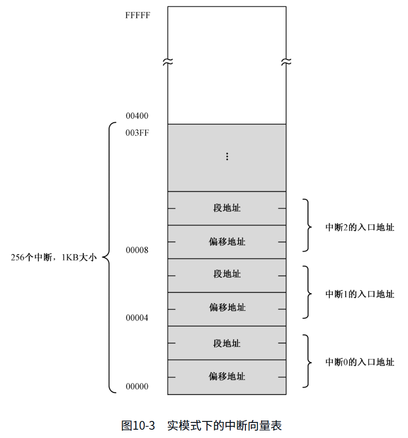

当中断发生时，如果从外部硬件到处理器之间的道路都是畅通的，那么，处理器在执行完当前的指令后，会立即着手为硬件服务。它首先会响应中断，告诉8259芯片准备着手处理该中断。接着，它还会要求8259芯片把中断号送过来。

在8259芯片那里，每个中断输入引脚都赋予了一个中断号。而且，这些中断号是可以改变的，可以对8259编程来灵活设置，但不能单独进行，只能以芯片为单位进行。比如，可以指定主片的中断号从0x28开始，那么它每个引脚IR0～IR7所对应的中断号分别是0x28～0x2f。

中断信号来自哪个引脚，8259芯片是最清楚的，所以它会把对应的中断号告诉处理器，处理器拿着这个中断号，要按顺序做以下几件事。

①保护断点的现场。首先要将标志寄存器FLAGS压栈，然后清除它的IF位和TF位。TF是陷阱标志，这个以后再讲。接着，再将当前的代码段寄存器CS和指令指针寄存器IP压栈。

②执行中断处理程序。由于处理器已经拿到了中断号，它将该号码乘以4（毕竟每个中断在中断向量表中占4字节），就得到了该中断入口点在中断向量表中的偏移地址。接着，从表中依次取出中断程序的偏移地址和段地址，并分别传送到IP和CS，处理器就开始执行中断处理程序了。

注意，由于IF标志被清除，在中断处理过程中，处理器将不再响应硬件中断。如果希望更高优先级的中断嵌套，可以在编写中断处理程序时，适时用sti指令开放中断。

③返回到断点接着执行。所有中断处理程序的最后一条指令必须是中断返回指令iret。这将导致处理器依次从栈中弹出（恢复）IP、CS和FLAGS的原始内容，于是转到主程序接着执行。

iret同样没有操作数，执行这条指令时，处理器依次从栈中弹出数值到IP、CS和标志寄存器。如果没有这条指令，处理器将无法返回到被中断的位置。

顺便提醒一句，由于中断处理过程返回时，已经恢复了FLAGS的原始内容，所以IF标志位也自动恢复。也就是说，可以接受新的中断。

和可屏蔽中断不同，NMI发生时，处理器不会从外部获得中断号，它自动生成中断号码2，其他处理过程和可屏蔽中断相同。

中断随时可能发生，中断向量表的建立和初始化工作是由BIOS在计算机启动时负责完成的。BIOS为每个中断号填写入口地址，因为它不知道多数中断处理程序的位置，所以，一律将它们指向一个相同的入口地址，在那里，只有一条指令：iret。也就是说，当这些中断发生时，只做一件事，那就是立即返回。当计算机启动后，操作系统和用户程序再根据自己的需要，来修改某些中断的入口地址，使它指向自己的代码。马上你就会看到，我们在本章也是这样做的。

### 实时时钟、CMOS RAM和BCD编码

也许你曾经觉得奇怪，为什么计算机能够准确地显示日期和时间？原因很简单，如图10-2所示，在外围设备控制器芯片ICH内部，集成了实时时钟电路(Real Time Clock,RTC)和两小块由互补金属氧化物(CMOS)材料组成的静态存储器(CMOS RAM)。实时时钟电路负责计时，而日期和时间的数值则存储在这块存储器中。

实时时钟是全天候跳动的，即使是在你关闭了计算机的电源之后，原因在于它由主板上的一个小电池提供能量。它为整台计算机提供一个基准时间，为所有需要时间的软件和硬件服务。不像8259芯片，有关RTC CMOS的资料相当少见，很不容易完整地找到，而8259的内容则铺天盖地，到处都是。所以，本章只是简要地介绍8259，而尽量多说一些和RTC有关的知识。

早期的计算机没有ICH芯片，各个接口单元都是分立的，单独地焊在主板上，并彼此连接。早期的RTC芯片是摩托罗拉(Motorola)MS146818B，现在直接集成在ICH内，并且在信号上与其兼容。除了日期和时间的保存功能，RTC芯片也可以提供闹钟和周期性的中断功能。

日期和时间信息是保存在CMOS RAM中的，通常有128字节，而日期和时间信息只占了一小部分容量，其他空间则用于保存整机的配置信息，比如各种硬件的类型和工作参数、开机密码和辅助存储设备的启动顺序等。这些参数的修改通常在BIOS SETUP开机程序中进行。要进入该程序，一般需要在开机时按DEL、ESC、F1、F2或者F10键。具体按哪个键，视计算机的厂家和品牌而定。

RTC芯片由一个振荡频率为32.768kHz的石英晶体振荡器（晶振）驱动，经分频后，用于对CMOS RAM进行每秒一次的时间刷新。

如表10-1所示，常规的日期和时间信息占据了CMOS RAM开始部分的10字节，有年、月、日和时、分、秒，报警的时、分、秒用于产生到时间报警中断，如果它们的内容为0xC0～0xFF，则表示不使用报警功能。

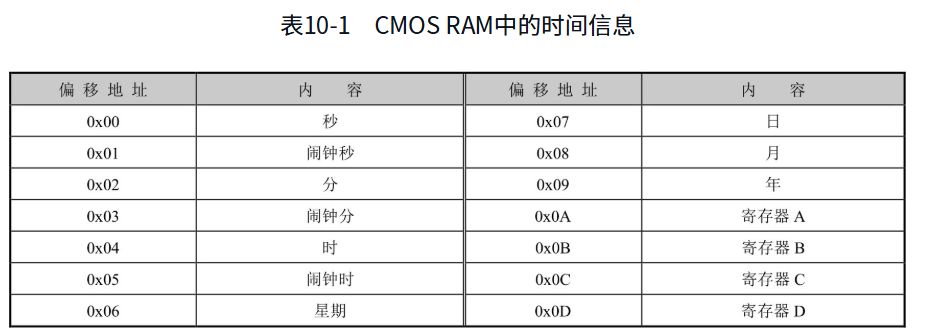

CMOS RAM的访问，需要通过两个端口来进行。0x70或者0x74是索引端口，用来指定CMOS RAM内的单元；0x71或者0x75是数据端口，用来读写相应单元里的内容。举个例子，以下代码用于读取今天是星期几：

```
mov al, 0x06
out 0x70, al
in al, 0x71
```

不得不说的是，尽管处理器始终会无条件地处理从NMI引脚来的非屏蔽中断，但是，非屏蔽中断能否到达处理器的NMI引脚，却是受控制的。

如图10-4所示，从很早的时候开始，端口0x70的最高位(bit 7)是控制NMI中断的开关。当它为0时，允许NMI中断到达处理器，为1时，则阻断所有的NMI信号，其他7个比特，即0～6位，则实际上用于指定CMOS RAM单元的索引号，这种规定直到现在也没有改变。为了方便记忆，你可以形象化地认为，如果0x70号端口的位7是1，则图中的开关被“顶开”，断开了NMI引脚的输入；如果这一位是0，则开关“落下”，接通NMI引脚的输入。

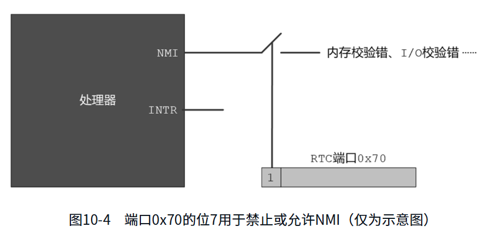

通常来说，在往端口0x70写入索引时，应当先读取0x70原先的内容，然后将它用于随后的写索引操作中。但是，该端口是只写的，不能用于读出。在早期的系统中，计算机的制造成本很高，为了最大化地利用硬件资源，导致出现很多稀奇古怪的做法，这就是一个活生生的例子。

为了解决这个问题，同时也为了兼容以前的老式硬件，ICH芯片允许通过切换访问模式来临时取得那些只写寄存器的内容，但这涉及更高层次的知识，已经超出了当前的话题范畴。现在，我们只想把问题搞得简单些，这么说吧，NMI中断应当始终是允许的，在访问RTC时，我们直接关闭NMI，访问结束后，再打开NMI，而不管它以前到底是什么样子。

在早期，CMOS RAM只有64字节，而最新的ICH芯片内则可能集成了256字节，新增的128字节称为扩展的CMOS RAM。当然，在此之前，要先确保ICH内确实存在扩展的CMOS RAM。

CMOS RAM中保存的日期和时间通常是以二进制编码的十进制数(Binary Coded Decimal, BCD)，这是默认状态，如果需要，也可以设置成按正常的二进制数来表示。要想说明什么是BCD编码，最好的办法是举个例子。比如十进制数25，其二进制形式是00011001。但是，如果采用BCD编码的话，则一字节的高4位和低4位分别独立地表示一个0到9之间的数字。因此，十进制数25对应的BCD编码是00100101。由此可以看出，因为十进制数里只有0～9，故用BCD编码的数，高4位和低4位都不允许大于1001，否则就是无效的。

单元0x0A～0x0D不是普通的存储单元，而是4个寄存器，而且用A、B、C和D命名，这4个寄存器也是通过0x70和0x71这两个端口访问的，用于设置实时时钟电路的参数和工作状态。

### 实时时钟RTC的中断信号

实时时钟RTC电路可以产生三种中断信号，分别是：周期性中断(Periodic Interrupt,PF)、更新周期结束中断(Update-ended Interrupt, UI)和闹钟中断(Alarm Interrupt,AI)。

周期性中断，顾名思义，就是每隔一段时间重复发生一次。这个速度是可以调节的，最慢可以500ms发生一次，最快可以30.517μs发生一次。那么，如何调节这个速率呢？

首先，在计算机里，振荡器是很重要的，实时时钟电路RTC是由振荡器来驱动的，有三种频率可供选择，分别是4.194304MHz、1.048576MHz和32.768kHz。所以，我们需要先进行时基选择，选择这三种外部频率中的一个。

时基选择之后，还需要用分频器来分频，将它们变成较低的频率，分频之后得到的频率就是周期性中断发生的间隔时间，或者说每隔多久发生一次周期性中断。

我们说过，在CMOS RAM里有4个寄存器，寄存器A用来控制时基选择和周期性中断发生的速率，其各位的含义和用途如表10-2所示。从表中可知，寄存器A的位6～位4用来选择外部时钟频率，而位3～位0则用来选择周期性中断信号发生的速率。

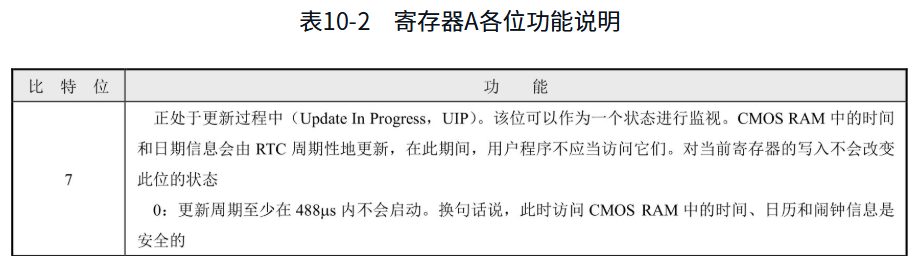

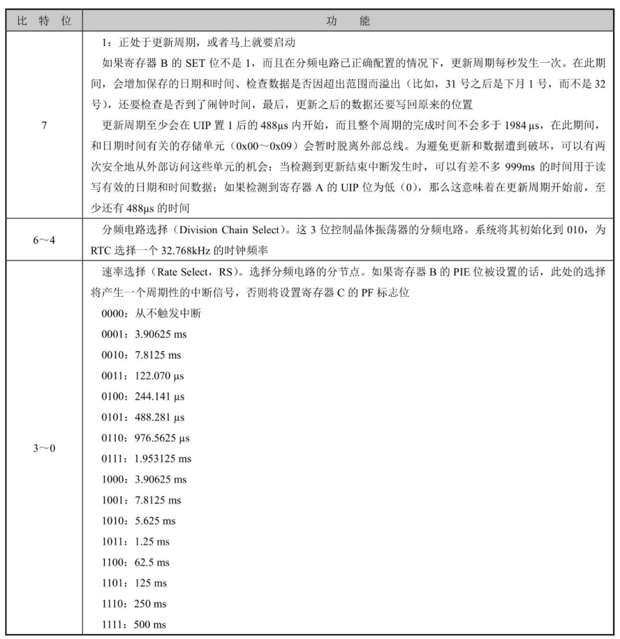

如表10-3所示，周期性中断是否允许发生，是由寄存器B的位6控制。这一位是周期性中断允许位(Periodic Interrupt Enable, PIE)。如果此位是0，表示不允许周期性中断；如果是1，表示允许发生周期性中断信号。

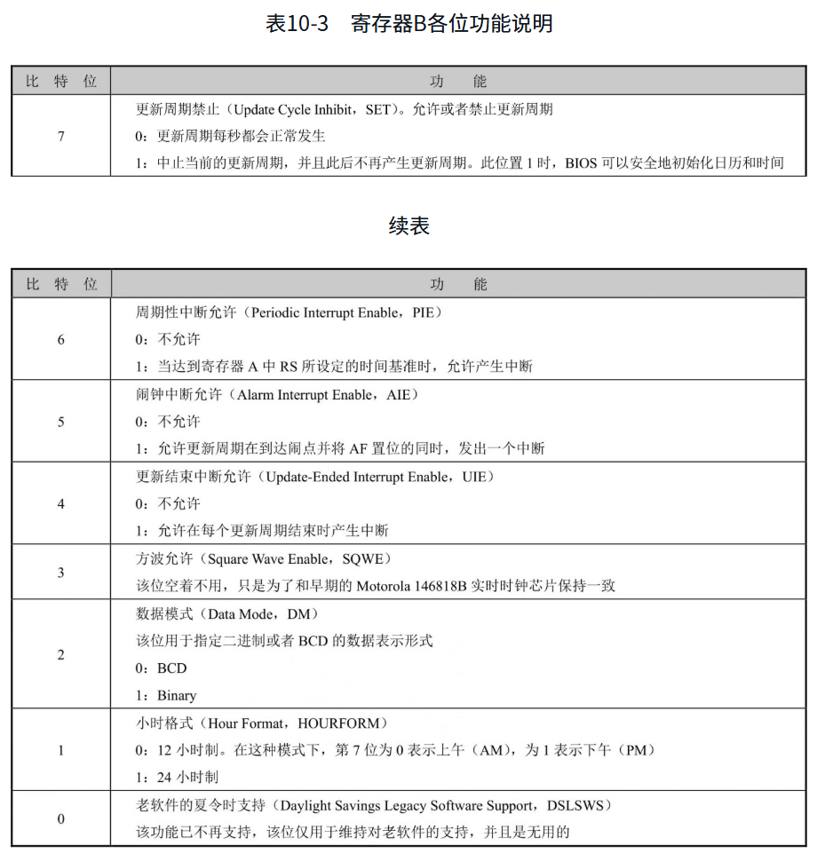

如前所述，如果寄存器B的PIE位是1，允许周期性中断，且可以通过寄存器A选择周期性中断信号发生的速率。但如果选择的是0000，则寄存器B的PIE位被自动置0。

再来看更新周期结束中断。每隔一秒，实时时钟电路将更新CMOS RAM里面的时间和日期。更新操作包括很多步骤，主要是读取并增加日期和时间、检查数据是否因超出范围而溢出（比如，31号之后是下月1号，而不是32号），还要检查是否到了闹钟时间，设置相关寄存器的状态，最后，更新之后的数据还要写回原来的位置，这些步骤和这个过程叫作更新周期。

在每个更新周期结束时，如果允许的话，实时时钟电路可以发出一个中断信号，表示本次更新周期已经结束，这就叫更新周期结束中断。

更新周期是否会进行，是由寄存器B的最高位，也就是位7来控制的。这一位叫作SET，用来允许或者禁止更新周期，有关其功能的描述已经在表10-2中说得很清楚了。

实时时钟电路RTC可以产生的第三种中断信号是闹钟中断，类似于我们日常用的闹钟，当实时时钟到达指定的闹点时，如果允许的话，将产生闹钟中断信号。

闹钟中断信号是否会产生，是由寄存器B的位5来控制的，这一位叫作闹钟中断允许(Alarm Interrupt Enable, AIE)位。如果此位是0，意味着不产生闹钟中断；如果此位是1，意味着允许产生闹钟中断信号。

实时时钟芯片的中断信号通过一根线连接到8259A从片的第一个引脚IR0。在计算机启动后，BIOS程序将它的中断号初始化为0x70。问题在于，有三个中断信号，但是只有一根中断信号线和一个中断号0x70。当中断发生时，如何知道发生的是哪一种中断呢？

如表10-4所示，要想知道中断是否发生，以及发生的是什么中断，可以通过读寄存器C来做出判断。

寄存器C的位7是中断请求标志(Interrupt Request Flag, IRQF)，如果有中断发生，则位7是1，否则是0。如果位7是1，有中断发生，则还需要判断位4、位5和位6来检查是哪种中断。对寄存器C的读操作将导致此位清零。

寄存器C的位6是周期性中断标志(Periodic Interrupt Flag, PF)，如果此位是1，意味着发生了周期性中断；0意味着不是周期性中断。对寄存器C的读操作将导致此位清零。

寄存器C的位5是闹钟标志(Alarm Flag, AF)，如果此位是1，意味着发生了闹钟中断；0意味着不是闹钟中断。对寄存器C的读操作将导致此位清零。

寄存器C的位4是更新结束标志(Update-ended Flag, UF)。如果此位是1，意味着发生了更新周期结束中断；0意味着不是更新周期结束中断。对寄存器C的读操作将导致此位清零。

寄存器C的低4位，即位0到位3是保留的，始终为0。注意，寄存器C是只读的，不能写入。寄存器C对读操作是敏感的，读操作将导致所有比特清零。

寄存器C和D是标志寄存器，这些标志反映了RTC的工作状态，寄存器C是只读的，寄存器D则可读可写，它们也都是8位寄存器，其各位的含义如表10-4和表10-5所示。特别是寄存器C，因为RTC可以产生中断，当中断产生时，可以通过该寄存器来识别中断的原因，比如，是周期性的中断，还是闹钟中断。

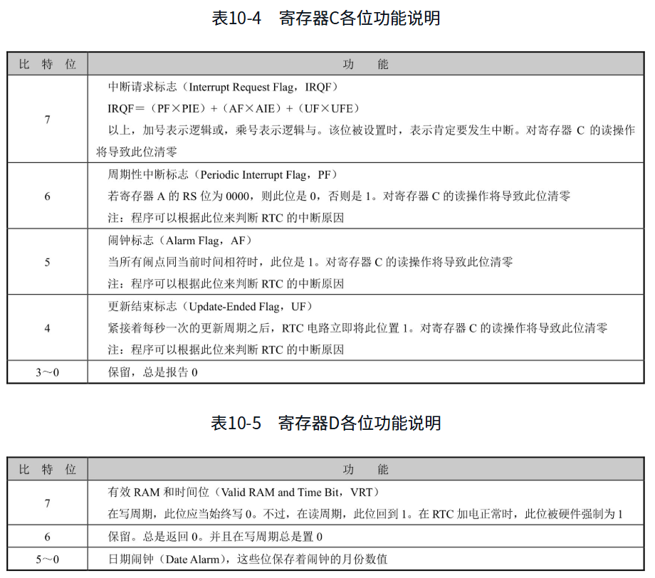

讲了这么多8259和RTC有关的内容，现在，我们想让RTC芯片定期发出一个中断，当这个中断发生的时候，还能执行我们自己编写的代码，来访问CMOS RAM，在屏幕上显示一个动态走动的时钟。

### 代码清单10-1

本章有配套的汇编语言源程序，并围绕这些源程序进行讲解，请对照阅读。

本章代码清单：10-1（被加载的用户程序），源程序文件：c10_1.asm

### 初始化8259、RTC和中断向量表

本章提供的代码清单中，没有加载器程序。这是因为可以利用上一章提供的加载器来加载用户程序，只要符合规则，加载器是通用的。

用户程序的入口点在代码清单10-1的第119行，从这一行开始，到第124行，用于初始化各个段寄存器的内容。下面开始在中断向量表中安装实时时钟中断的入口点。既然本章的主题是中断，那么就很有必要强调一件事：当处理器执行任何一条改变栈段寄存器SS的指令时，它会在这条指令和下一条指令执行完期间禁止中断。

栈无疑是很重要的，不能被破坏。要想改变代码段和数据段，只需要改变段寄存器就可以了。但栈段不同，因为它除了有段寄存器，还有栈指针。因此，绝大多数时候，对栈的改变是分两步进行的：先改变段寄存器SS的内容，接着又修改栈指针寄存器SP的内容。

想象一下，如果刚刚修改了段寄存器SS，在还没来得及修改SP的情况下，就发生了中断，会出现什么后果，而且要知道，中断是需要依靠栈来工作的。

因此，处理器在设计的时候就规定，当遇到修改段寄存器SS的指令时，在这条指令和下一条指令执行完毕期间，禁止中断，以此来保护栈。换句话说，你应该在修改段寄存器SS的指令之后，紧跟着一条修改栈指针SP的指令。

就代码清单10-1来说，在第121、122行执行期间，处理器禁止中断。再比如以下指令：

```
push cs
pop ss
mov sp, 0
```

在后面两行指令执行期间，处理器禁止中断。

RTC芯片的中断信号，通向中断控制器8259从片的第1个中断引脚IR0。在计算机启动期间，BIOS会初始化中断控制器，将主片的中断号设为从0x08开始，将从片的中断号设为从0x70开始。所以，计算机启动后，RTC芯片的中断号默认是0x70。尽管我们可以通过对8259编程来改变它，但是没有必要。


### 检测点10.2


### 使处理器进入低功耗状态

RTC更新周期结束中断的处理过程可以看成另一个程序，是独立的处理过程，是额外的执行流程，它随时都会发生，但和主程序互不相干。关于它的执行过程，马上就要讲到，现在继续来看主程序。

在为中断过程做了初始化工作之后，主程序还是要继续执行的。代码清单10-1第163～167行，用于显示中断处理程序已安装成功的消息。

接着，第169～171行，使段寄存器DS指向显示缓冲区，并在屏幕上的第12行33列显示一个字符“@”，该位置差不多是整个屏幕的中心。表达式12×160+33×2是在指令编译阶段计算的，是该字符在显存中的位置。每个字符在显存中占2字节的位置，每行80个字符。

在此之后，主程序就无事可做了。第174行，hlt指令使处理器停止执行指令，并处于停机状态，这将降低处理器的功耗。处于停机状态的处理器可以被外部中断唤醒并恢复执行，而且会继续执行hlt后面的指令。

所以，第174～176行用于形成一个循环，先是停机，接着某个外部中断使处理器恢复执行。一旦处理器的执行点来到hlt指令之后，则立即使它继续处于停机状态。

第175行，使用not指令将字符@的显示属性反转。not是按位取反指令，其格式为

```
not r/m8
not r/m16
```

not指令执行时，会将操作数的每一位反转，原来的0变成1，原来的1变成0。比如：

```
mov al, 0x1f
not al		;执行后，AL的内容为0xe0
```

从显示效果上看，循环将显示属性反转将取得一个动画效果，可以很清楚地看到处理器每次从停机状态被唤醒的过程。not指令不影响任何标志位。

相对于jmp \$指令，使用hlt指令会大大降低处理器的占用率。Windows 7操作系统有一个叫作CPU仪表盘的小工具，当使用jmp ​\$指令时，你会看到处理器占用率是100%；而在一个循环中使用hlt指令时，该占用率马上降到10%左右，这还是在虚拟机环境下，毕竟宿主操作系统还要占用处理器时间。

### 实时时钟中断的处理过程

主程序就是这样了，停机，执行，接着停机。与此同时，中断也在不停地发生着，处理器还要抽出空来执行中断处理过程，下面就来看看RTC的更新周期结束中断处理，该中断处理过程从代码清单10-1的第27行开始。

第28～32行，先保护好那些在中断处理过程中会用到的寄存器，将它们压栈保存。这一点特别重要，中断处理过程必须无痕地执行，你不知道中断会在什么时候发生，也不知道中断发生时，哪一个程序正在执行，所以，必须保证中断返回时，能还原中断前的状态。

第34～40行，用于读RTC寄存器A，根据UIP位的状态来决定是等待更新周期结束，还是继续往下执行。UIP位为0表示现在访问CMOS RAM中的日期和时间是安全的。注意第36行，用于把寄存器AL的最高位置1，从而阻断NMI。当然，这是不必要的，当NMI发生时，整个计算机都应当停止工作，也不在乎中断处理过程能否正常执行。

第38行从数据端口读取寄存器A的内容；第39行，test指令用于测试寄存器AL的第7位是否为1。

“test”的意思是“测试”。顾名思义，可以用这条指令来测试某个寄存器，或者内存单元里的内容是否带有某个特征。

test指令在功能上和and指令是一样的，都是将两个操作数按位进行逻辑“与”，并根据结果设置相应的标志位。但是，test指令执行后，运算结果被丢弃（不改变或破坏两个操作数的内容）。

test指令需要两个操作数，在16位处理器上，其指令格式为

```
test r/m8, imm8
test r/m16, imm16
test r/m8, r8
test r/m16, r16
```

和and指令一样，test指令执行后，OF=CF=0；对ZF、SF和PF的影响视测试结果而定；对AF的影响未定义。对于test指令的应用，这里有一个例子，比如，我们想测试AL寄存器的第3位是“0”还是“1”，可以这样编写代码：

```
test al, 0x04
```

0x04的二进制形式为00000100，它的第3位是“1”，表明我们关注的是这一位。不管寄存器AL中的内容是什么，只要它的第3位是“0”，这条指令执行后，结果一定是00000000，标志位ZF=1；相反，如果寄存器AL的第3位是“1”，那么结果一定是00001000，ZF=0。于是，根据ZF标志位的情况，就可以判定寄存器AL中的第3位是“0”还是“1”。

第40行，如果UIP位是0，那么测试的结果是ZF=1，继续往下执行第42行；否则，说明UIP位是1，需要返回到第34行继续等待RTC更新周期结束。

如图10-5所示，我们来看一下更新周期的时间线。更新周期的间隔时间是1s，在更新周期即将开始的时候，RTC首先将寄存器A的最高位UIP置1，经过至少488μs之后，更新周期就开始了。

更新周期要做一系列工作，但总时间不会超过1984微秒。更新周期结束后，将寄存器A的最高位UIP清零。并且，如果允许的话，立即发出一个更新周期结束中断信号。从此以后，到下一次更新周期开始，至少有999毫秒的时间。对于处理器这种高速设备来说，这一段时间是非常漫长的。

正常情况下，访问CMOS RAM中的日期和时间，必须等待RTC更新周期结束，所以上面的判断过程是必需的，而这些代码也适用于正常的访问过程。但是，当前中断处理过程是针对更新周期结束中断的，而当此中断发生时，本身就说明对CMOS RAM的访问是安全的，毕竟留给我们的时间是999毫秒，这段时间非常充裕，这段时间能执行千万条指令。所以，在这种特定的情况下，上面的判断过程是不必要的。当然，加上倒也无所谓。


第42～58行，分别访问CMOS RAM的0、2、4号单元，从中读取当前的秒、分、时数据，按顺序压栈等待后续操作。

第60～62行，读一下RTC的寄存器C，使得所有中断标志复位。这等于是告诉RTC，中断已经得到处理，可以继续下一次中断。否则的话，RTC看到中断未被处理，将不再产生中断信号。RTC产生中断的原因有多种，可以在程序中通过读寄存器C来判断具体的原因。不过这里不需要，因为除了更新周期结束中断，其他中断都被关闭了。

现在，终于可以在屏幕上显示时间信息了。

第64、65行，临时将段寄存器ES指向显示缓冲区。

第67、68行，首先从栈中弹出小时数，调用过程bcd_to_ascii来将用BCD码表示的“小时”转换成ASCII。该过程是在第105行定义的，调用该过程时，寄存器AL中的高4位和低4位分别是“小时”的十位数字和个位数字。

第108行，将寄存器AL中的内容复制一份给AH，以方便下一步操作。

第109、110行，将寄存器AL中的高4位清零，只留下“小时”的个位数字。接着，将它加上0x30，就得到该数字对应的ASCII码。

十位上的数字在寄存器AH的高4位。第112行，用右移4位的方法，将它“拉”到低4位，高4位在移动的过程中自动清零。

接着，第113、114行，用同样的办法来得到十位数字的ASCII码。此时，寄存器AH中是十位数字的ASCII码，AL中是个位数字的ASCII码，它们将作为结果返回给调用者。

最后，第116行用于返回调用者。

接着回到第69行，为了连续在屏幕上显示内容，最好是采用基址寻址来访问显存。这一行用于指定显示的内容位于显存的什么位置。实际上，这里指定的是第12行36列。同以前一样，每个字符在显存中占2字节，每行80个字符，所以这里使用了表达式12×160+36×2，该表达式的值是在编译阶段计算的。

第71、72行，分别将“小时”的两个数位写到显存中，段地址在ES中，偏移地址分别是由寄存器BX和BX+2提供的。这里没有写入显示属性，这是因为我们希望采用默认的显示属性（屏幕是黑的，默认的显示属性是0x07，即黑底白字）。

第74、75行，用于在下一个屏幕位置显示冒号“:”，这是在显示时间时都会采用的分隔符。当然，通过寄存器AL中转是多余的，这两句可以直接写成

```
mov byte [es:bx + 4], ':'
```

遗憾的是，等我发现这个问题时，本章已经快要写完了，重新排版实在太费工夫。其实，这不算是个问题，无伤大雅，难道不是吗？

为了验证RTC更新结束中断是每秒发生一次的，第76行，将冒号的显示属性（颜色）用not指令反转。就像手掌的两面一样，每次发生中断时，冒号的颜色将和上一次相反，但永远在两个属性之间来回变化。到程序运行的时候你就会发现，变化的频率是每秒一次。

剩下的指令都很好理解，因为它们的工作是按相同的方法显示分钟数和秒数。第78～90行，依次从栈中弹出分钟和秒的数值，并转换成ASCII码，然后显示在屏幕上，中间用冒号间隔。

在8259芯片内部，有一个中断服务寄存器(Interrupt Service Register, ISR)，这是一个8位寄存器，每一位都对应着一个中断输入引脚。当中断处理过程开始时，8259芯片会将相应的位置1，表明正在服务从该引脚来的中断。

一旦响应了中断，8259中断控制器无法知道该中断什么时候才能处理结束。同时，如果不清除相应的位，下次从同一个引脚出现的中断将得不到处理。在这种情况下，需要程序在中断处理过程的结尾，显式地对8259芯片编程来清除该标志，方法是向8259芯片发送中断结束命令(End Of Interrupt, EOI)。

中断结束命令的代码是0x20。代码清单10-1第92～94行就用来做这件事。需要注意的是，如果外部中断是8259主片处理的，那么，EOI命令仅发送给主片即可，端口号是0x20；如果外部中断是由从片处理的，就像本章的例子，那么，EOI命令既要发往从片（端口号0xa0），也要发往主片。

最后，第96～102行，从栈中恢复早先被压入的内容到它们原始的寄存器，并用中断返回指令iret回到中断之前的地方继续执行。iret的意思是Interrupt Return。

### 代码清单10-1的编译和运行

本章的代码不包括加载器，也就是负责加载用户程序的主引导扇区代码，因为第9章已经提供了一个加载器，它同样可以加载本章的用户程序。

在完全理解了代码清单10-1的基础上，可以自行编辑和编译它，生成二进制文件。然后，使用FixVhdWr工具将其写入虚拟硬盘。和第9章一样，写入时的起始逻辑扇区号是100，毕竟加载器每次要从这个地方读取和加载用户程序。

一旦所有工作都准备停当，即可启动虚拟机来观察运行结果。通常情况下，运行结果会如图10-6所示。

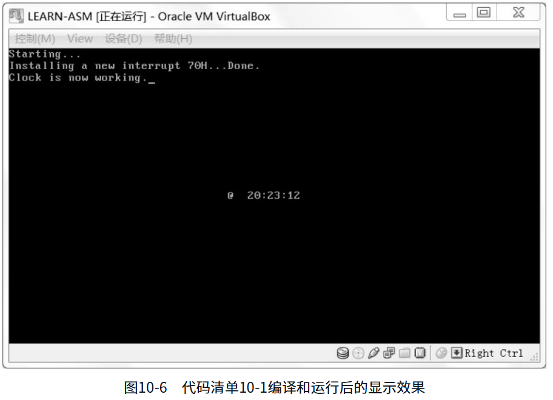

在你欣赏程序的运行结果时，你一定会发现时间每秒更新一次，这从冒号的显示属性每秒反转一次可以看出来。与此不同的是，字符“@”却以很快的速度在闪烁。这意味着，把处理器从停机状态唤醒的不单是实时时钟的更新周期结束中断，还有其他硬件中断，只不过我们不知道是谁而已。

## 内部中断

和硬件中断不同，内部中断发生在处理器内部，是在执行指令的过程中出现了问题或者故障引起的。比如，当处理器检测到div或者idiv指令的除数为0时，或者除法的结果溢出时，将产生中断0（0号中断），这就是除法错中断。

再比如，当处理器遇到非法指令时，将产生中断6。非法指令是指指令的操作码没有定义，或者指令超过了规定的长度。操作码没有定义通常意味着那不是一条指令，而是普通的数。

内部中断不受标志寄存器IF位的影响，也不需要中断识别总线周期，它们的中断类型是固定的，可以立即转入相应的处理过程。

## 软中断

在编写程序的时候，我们可以随时用指令来产生中断，这种类型的中断叫作软中断。软中断也不需要中断识别总线周期，中断号在指令中给出。

产生软中断的指令包括以下几种：

```
int3
int imm8
into
```

int3是断点中断指令，机器指令码为0xCC。这条指令在调试程序的时候很有用，当程序运行不正常时，多数时候希望在某个地方设置一个检查点，也称断点，来查看寄存器、内存单元或者标志寄存器的内容，这条指令就是为这个目的而设的。

指令都是连续存放的，因此，所谓的断点，就是某条指令的起始地址。int3是单字节指令，这是有意设计的。当需要设置断点时，可以将断点处那条指令的第一字节改成0xcc，原字节予以保存。当处理器执行到int3时，即发生3号中断，转去执行相应的中断处理程序。中断处理程序的执行也要用到各个寄存器，这会破坏它们的内容，但push指令不会。我们可以在该程序内先压栈所有相关寄存器和内存单元，然后分别取出予以显示，它们就是中断前的现场内容。最后，再恢复那条指令的第一字节，并修改位于栈中的返回地址，执行iret指令。

int指令的机器码为2字节，第一字节是操作码0xCD，第2字节给出了中断号。举几个例子：

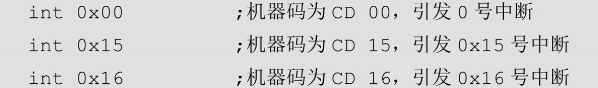

注意，int3和int 3是不同的指令，它们的机器码不同，前者是0xCC，后者是0xCD 0x03，但它们都会产生3号中断。换句话说，它们的中断处理过程是相同的。

into是溢出中断指令，机器码为0xCE，也是单字节指令。当处理器执行这条指令时，如果标志寄存器的OF位是1，那么，将产生4号中断。否则，这条指令什么也不做。

### BIOS中断

可以为所有的中断类型自定义中断处理过程，包括内部中断、硬件中断和软中断。特别是考虑到处理器允许256种中断类型，而且大部分都没有被硬件和处理器内部中断占用。

编写自己的中断处理程序有相当大的优越之处。不像jmp和call指令，int指令不需要知道目标程序的入口地址。远转移指令jmp和远调用指令call必须直接或者间接给出目标位置的段地址和偏移地址，如果所有这一切都是自己安排的，倒也不成问题，但如果想调用别人的代码，比如操作系统的功能，这就很麻烦了。举个例子来说，假如你想读硬盘上的一个文件，因为操作系统有这样的功能，所以就不必在自己的程序中再写一套代码，直接调用操作系统例程就可以了。

但是，操作系统通常不会给出或者公布硬盘读写例程的段地址和偏移地址，因为操作系统也是经常修改的，经常发布新的版本。这样一来，例程的入口地址也会跟着变化。而且，也不能保证每次启动计算机之后，操作系统总待在同一个内存位置。

因为有了软中断，这是个利好条件。每次操作系统加载完自己之后，以中断处理程序的形式提供硬盘读写功能，并把该例程的地址填写到中断向量表中。这样，无论在什么时候，用户程序需要该功能时，直接发出一个软中断即可，不需要知道具体的地址。

最有名的软中断是BIOS中断，之所以称为BIOS中断，是因为这些中断功能是在计算机加电之后，BIOS程序执行期间建立起来的。换句话说，这些中断功能在加载和执行主引导扇区之前，就已经可以使用了。

BIOS中断，又称BIOS功能调用，主要是为了方便地使用最基本的硬件访问功能。不同的硬件使用不同的中断号，比如，使用键盘服务时，中断号是0x16，即

```
int 0x16
```

通常，为了区分针对同一硬件的不同功能，使用寄存器AH来指定具体的功能编号。举例来说，以下指令用于从键盘读取一个按键：

```
mov ah, 0x00	;从键盘读字符
int 0x16		;键盘服务。返回时，字符代码在寄存器AL中
```

在这里，当寄存器AH的内容是0x00时，执行int 0x16后，中断服务例程会监视键盘动作。当它返回时，会在寄存器AL中存放按键的ASCII码。

BIOS中断很多，它们是在BIOS执行期间安装的，当主引导程序开始执行时，就可以在程序中使用了。本准备给出一张BIOS功能调用列表，但是考虑到现在网络技术很发达，上网很方便，大家可以自行从互联网上寻找相关的BIOS功能调用资料，然后在自己的程序中做实验。

你可能觉得奇怪，BIOS是怎么建立起这套功能调用中断的？它又是怎么知道如何访问硬件的？毕竟，即使是它，要访问硬件也得通过端口一级的途径。

答案是，BIOS可能会为一些简单的外围设备提供初始化代码和功能调用代码，并填写中断向量表，但也有一些BIOS中断是由外部设备接口自己建立的。

首先，每个外部设备接口，包括各种板卡，如网卡、显卡、键盘接口电路、硬件控制器等，都有自己的只读存储器(Read Only Memory, ROM)，类似于BIOS芯片，在这些ROM中有它自己的功能调用例程，以及本设备的初始化代码。按照规范，前两个单元的内容是0x55和0xAA，第三个单元是本ROM中以512字节为单位的代码长度；从第四个单元开始，就是实际的ROM代码。

其次，我们知道，从内存物理地址A0000开始，到FFFFF结束，有相当一部分空间是留给外围设备的。如果设备存在，那么，它自带的ROM会映射到分配给它的地址范围内。

在计算机启动期间，BIOS程序会以2KB为单位搜索内存地址C0000～E0000之间的区域。当它发现某个区域的头2字节是0x55和0xAA时，那意味着该区域有ROM代码存在，是有效的。接着，它对该区域做累加和检查，看结果是否和第三个单元相符。如果相符，就从第四个单元进入。这时，处理器执行的是硬件自带的程序指令，这些指令初始化外部设备的相关寄存器和工作状态，最后，填写相关的中断向量表，使它们指向自带的中断处理过程。

### 代码清单10-2

本章有配套的汇编语言源程序，并围绕这些源程序进行讲解，请对照阅读。

本章代码清单：10-2（被加载的用户程序/BIOS中断演示程序），源程序文件：c10_2.asm

### 从键盘读字符并显示

代码清单10-2在框架上和前面的用户程序是一致的，差别在于代码段的功能上。

代码清单10-2第28～32行用于初始化各个段寄存器，这和以前的做法是相同的。

第34～42行用于在屏幕上显示字符串，采用的是循环的方法。循环用的是loop指令，为此，第34行用于计算字符串的长度，并传送到寄存器CX中，以控制循环的次数。第35行用于取得字符串的首地址。

向屏幕上写字符使用的是BIOS中断，具体说就是中断0x10的0x0e号功能，该功能用于在屏幕上的光标位置处写一个字符，并推进光标位置。第38～40行分别按规范的要求准备各个参数，执行软中断。

第41、42行将递增寄存器BX中的偏移地址，以指向下一个字符在数据段中的位置。然后，loop指令将寄存器CX的内容减1，并在其不为零的情况下返回到循环体开始处，继续显示下一个字符。

剩下的工作内容既复杂，又简单。复杂是指，从键盘读取你按下的那个键，并把它显示在屏幕上，需要访问硬件，写一大堆指令。简单是指，因为有了BIOS功能调用，这只需几条语句就能完成。

第45、46行使用软中断0x16从键盘读字符，需要在寄存器AH中指定0x00号功能。该中断返回后，寄存器AL中为字符的ASCII码。

第48～50行又一次使用了int 0x10的0x0e号功能，把从键盘取得的字符显示在屏幕上。

第52行，执行一个无条件转移指令，重新从键盘读取新的字符并予以显示。

### 代码清单10-2的编译和运行

将代码清单10-2编辑并编译后，用FixVhdWr程序将生成的二进制文件写入虚拟硬盘，起始的逻辑扇区号同样为100。

如图10-7所示，启动虚拟机后，会看到一段欢迎的话。现在，你可以按下任何按键，它们将原样显示在“→”之后。慢慢试验，细细体会，你会发现某些按键的特点。比如，回车键(Enter)仅仅是将光标移到行首，退格键(Backspace)仅仅是将光标退后，并不破坏该位置上的字符。

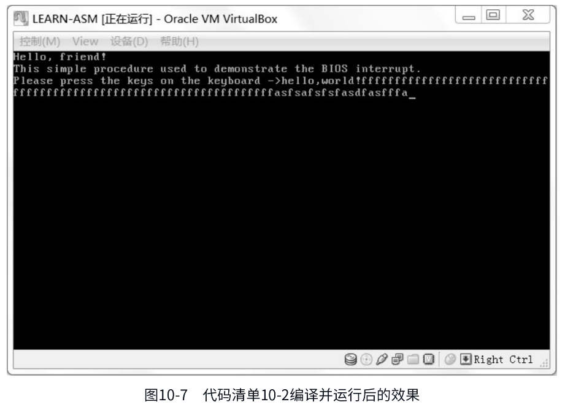

# 第11章 32位X86处理器编程架构


# 第12章 进入保护模式


# 第13章 操作数和有效地址的尺寸


# 第14章 存储器的保护


# 第15章 程序的动态加载和执行

# 第16章 任务和特权级保护

# 第17章 协同式任务切换

# 第18章 中断和异常的处理与抢占式多任务

# 第19章 分页机制和动态页面分配

# 第20章 平坦内存模型和软件任务切换