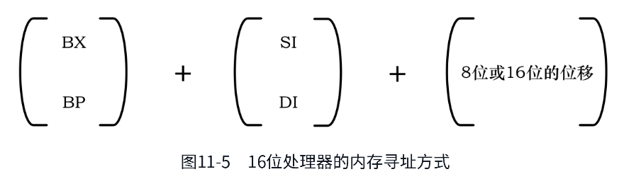

# 第10章 中断和动态时钟显示

在享受计算机给我们带来的便利和乐趣的同时，我仍然会时不时地说它的坏话。人们都说处理器是整个计算机的大脑，可是，处理器是一个非常精确的速度很快的“傻子”。

在计算机上执行的程序通常需要一些输入，输入可能来自键盘、鼠标、硬盘、话筒、数码相机等，同时，处理后还需要输出，要送到输出设备，如显示器、硬盘、打印机、网络设备等。

一个程序只做自己的事，当它等待输入，或者等待输出时，它面对的是比处理器慢得多的外部设备。典型的情况下，硬盘的工作速度比处理器至少慢几千万甚至几亿倍，像打印机这类设备就更不用说了。

以读硬盘为例，如果程序需要从硬盘上读它需要的数据，那么，按照执行流程，它必须向硬盘接口发送读命令，然后等待硬盘发出一个数据已经准备好的信号，程序在接到这个信号后继续往下执行，来操作这些数据。从发出读硬盘的命令，到硬盘准备好数据，这个过程虽然短暂，但对于处理器来说却是一段漫长的等待时间。在等待的这段时间，处理器唯一能做的，就是不停地观察外部设备的状态变化。

计算机革命的早期，硬件资源极其昂贵和稀少。据说20世纪60年代，一台计算机的价格抵得上300辆野马跑车，月租金超过1万美元。这么昂贵的东西，不好好利用它就是一种罪过。显然，还是以从硬盘上读数据为例，在硬盘准备数据的这段时间里，处理器应该去做别的事情，去执行别的程序。硬盘准备好数据后，向处理器发送一个信号，然后处理器再回到原来的程序继续往下执行。

随着处理器性能的增强，人们希望它能执行多个程序。即使只有一个处理器，在同一时间只能执行一个程序，但是，因为它的性能很强，速度很快，也可以轮流执行多个程序，而且因为它速度很快，给人的感觉是在同时执行多个程序。举个例子来说，你平时可以一边玩游戏，一边和朋友们在网上聊天，可能还同时看着电影听着音乐。

为了分享计算能力，处理器应当能够为多用户多任务提供硬件一级的支持。在单处理器的系统中，允许同时有多个程序在内存中等待处理器的执行。

如何把多个程序调入内存，是操作系统的事情，这个可以先放一放。现在的问题是，当一个程序执行时，它是不会知道还有别的程序正眼巴巴地等着执行的。在这种情况下，就需要打断处理器当前的执行流程，去执行另外一些程序。执行完之后，还可以返回到原来的程序继续执行。这就好比你正在用手机听歌，突然来电话了，处理器（当然，手机也是有处理器的）必须中断歌曲的播放，来处理这件更为重要的事件。

为了在需要的时候打断处理器当前的执行流程，去做另外的事情，执行别的代码，或者去执行另一个程序，中断(Interrupt)这种工作机制就应运而生了。

自从中断这种工作机制产生之后，它就一直是各种处理器必须具备的。中断是怎么发生的，处理器又是怎么处理中断的，在这个过程中，我们又能做些什么，这都是本章将要告诉你的。总体来说，本章的任务是：

1. 了解中断的原理和分类，用两个具体的实例来学习如何在中断机制下工作，包括如何使用BIOS中断工作；
2. 学会在Bochs中观察中断向量表和中断标志位IF的变化；
3. 学习一些新的x86处理器指令，包括into、int3、intn、iret、cli、sti、hlt、not和test等。

## 外部硬件中断

顾名思义，外部硬件中断，就是从处理器外面来的中断信号。当外部设备发生错误，或者有数据要传送（比如，从网络中接收到一个针对当前主机的数据包），或者处理器交给它的事情处理完了（比如，打印已经完成），又或者一个定时器到达指定的时间间隔时，它们都会拍一下处理器的肩膀，告诉它应当先把手头上的事情放一放，来临时处理一下。

如图10-1所示，外部硬件中断是通过两个信号线引入处理器内部的。从很早的时候起，也就是8086处理器的时代，这两根线的名字就叫NMI和INTR。


在某些具有怀疑精神的人眼里，用两根信号线来接受外部设备的中断信号可能是多余的，也许只需要一根就可以了。这似乎有些道理，但是，中断的原因很多，有些中断信号不是那么紧急，不用着急处理，或者，在处理器忙的时候，干脆就拒绝处理。但是，有些中断在任何时候都必须及时处理，因为事关整个系统的安全性。比如，在使用不间断电源的系统中，当电池电量很低的时候，不间断电源系统会发出一个中断，通知处理器快掉电了。再比如，内存访问电路发现了一个校验错误，这意味着，从内存读取的数据是错误的，处理器再努力工作也是没有意义的。在所有这些情况下，处理器必须针对这些中断采取必要的措施，隐瞒真相必然会对用户造成不可挽回的损失。

在这种情况下，处理器的设计者希望通过两个引脚来区别对待不同的中断信号。对于那些不紧急，不用着急处理的中断信号，应该从INTR引脚输入。在处理器内部，根据需要，可以屏蔽掉从这个引脚来的中断信号，不对它们进行处理。因此，从INTR输入的中断信号叫作可屏蔽中断。

相反地，所有严重事件都必须无条件地加以处理，由这类事件引发的中断信号应当通过NMI引脚送入处理器，这些严重的事件包括不间断电源的后备电池即将耗尽、内存校验错误、I/O检验错误，等等。在处理器内部，对于从NMI引脚来的中断信号不会作屏蔽和过滤，而是必须进行处理。因为这个原因，从NMI引脚来的中断信号称为非屏蔽中断(Non Maskable Interrupt, NMI)。

### 非屏蔽中断

尽管非屏蔽中断在处理器内部是不可屏蔽的（这也是“非屏蔽中断”这个名称的由来），但是，在处理器外部却有一个开关来控制非屏蔽中断信号能否进入处理器，这一点在后面还要详细说明，现在先不用管它。

INTEL处理器规定，NMI中断信号由0跳变到1后，至少要维持4个以上的时钟周期才算是有效的，才能被识别。

当一个中断发生时，处理器将会通过中断引脚NMI和INTR得到通知。除此之外，它还应当知道发生了什么事，以便采取适当的处理措施。每种类型的中断都被统一编号，这称为中断类型号、中断向量或者中断号。但是，由于不可屏蔽中断的特殊性—几乎所有触发NMI的事件对处理器来说都是致命的，甚至是不可纠正的。在这种情况下，努力去搞清楚发生了什么，通常没有太大的意义，这样的事最好留到关机之后，让专业维修人员来做。

也正是这个原因，在实模式下，NMI被赋予了统一的中断号2，不再进行细分。一旦发生2号中断，处理器和软件系统通常会放弃继续正常工作的“念头”，也不会试图纠正已经发生的问题和错误，很可能只是由软件系统给出一个提示信息。

### 可屏蔽中断

前面说过，可屏蔽中断是通过INTR引脚进入处理器内部的。像NMI一样，不可能为每一个中断源都提供一个引脚，但与NMI不同的是，需要区分中断的类型和来源。在这种情况下，需要一个代理，来接受外部设备发出的中断信号。还有，多个设备同时发出中断请求的概率也是很高的，所以该代理的任务还包括对它们进行仲裁，以决定让它们中的哪一个优先向处理器提出服务请求。

如图10-2所示，在个人计算机中，最早使用的中断代理就是8259芯片，它就是通常所说的中断控制器，从8086处理器开始，它就一直提供着这种服务。即使是现在，在绝大多数单处理器的计算机中，也依然有它的存在。

INTEL处理器允许256个中断，中断号的范围是0～255，8259负责提供其中的15个，但中断号并不固定。之所以不固定，是因为当初设计的时候，允许软件根据自己的需要灵活设置中断号，以防止发生冲突。该中断控制器芯片有自己的端口号，可以像访问其他外部设备一样用in和out指令来改变它的状态，包括各引脚的中断号。正是因为这样，它又叫可编程中断控制器(Programmable Interrupt Controller, PIC)。

不知道是怎么想的，反正每片8259只有8个中断输入引脚，而在个人计算机上使用它，需要两块。如图10-2所示，第一块8259芯片的代理输出INT直接送到处理器的INTR引脚，这是主片(Master)；第二块8259芯片的INT输出送到第一块的引脚2上，是从片(Slave)，两块芯片之间形成级联(Cascade)关系。

如此一来，两块8259芯片可以向处理器提供15个中断信号。当时，接在8259上的15个设备都是相当重要的，如PS/2键盘和鼠标、串行口、并行口、软磁盘驱动器、IDE硬盘等。现在，这些设备很多都已淘汰或者正在淘汰中，根据需要，这些中断引脚可以被其他设备使用。


如图10-2所示，8259主片的引脚0(IR0)接的是系统定时器/计数器芯片；从片的引脚0(IR0)接的是实时时钟芯片RTC，该芯片是本章的主角，很快就会讲到。总之，这两块芯片的固定连接即使是在硬件更新换代非常频繁的今天，也依然没有改变。

在8259芯片内部，有中断屏蔽寄存器(Interrupt Mask Register, IMR)，这是个8位寄存器，对应着该芯片的8个中断输入引脚，对应的位是0还是1，决定了从该引脚来的中断信号是否能够通过8259送往处理器（0表示允许，1表示阻断，这可能出乎你的意料）。当外部设备通过某个引脚送来一个中断请求信号时，如果它没有被IMR阻断，那么，它可以被送往处理器。注意，8259芯片是可编程的，主片的端口号是0x20和0x21，从片的端口号是0xa0和0xa1，可以通过这些端口访问8259芯片，设置它的工作方式，包括IMR的内容。

中断能否被处理，除了要看8259芯片的脸色，最终的决定权在处理器手中。回到前面第7章，参阅图7-2，你会发现，在处理器内部，标志寄存器有一个标志位IF，这就是中断标志(Interrupt Flag)。当IF为0时，所有从处理器INTR引脚来的中断信号都被忽略掉；当其为1时，处理器可以接受和响应中断。

IF标志位可以通过两条指令cli和sti来改变。这两条指令都没有操作数，cli(CLear Interrupt flag)用于清除IF标志位；sti(SeT Interrupt flag)用于置位IF标志。

中断信号的来源，或者说，产生中断的设备，称为中断源。在计算机内部，中断发生得非常频繁，当一个中断正在处理时，其他中断也会陆续到来，甚至会有多个中断同时发生的情况，这都无法预料。不过不用担心，8259芯片会记住它们，并按一定的策略决定先为谁服务。总体上来说，中断的优先级和引脚是相关的，主片的IR0引脚优先级最高，IR7引脚优先级最低，从片也是如此。当然，还要考虑到从片是级联在主片的IR2引脚上的。

最后，当一个中断事件正在处理时，如果来了一个优先级更高的中断事件时，允许暂时中止当前的中断处理，先为优先级较高的中断事件服务，这称为中断嵌套。

### 实模式下的中断向量表

所谓中断处理，归根结底就是处理器要执行一段与该中断有关的程序（指令）。处理器可以识别256个中断，那么理论上就需要256段程序。这些程序的位置并不重要，重要的是，在实模式下，处理器要求将它们的入口点集中存放到内存中从物理地址0x00000开始到0x003ff结束，共1KB的空间内，这就是所谓的中断向量表(Interrupt Vector Table, IVT)。

如图10-3所示，每个中断在中断向量表中占2个字，分别是中断处理程序的偏移地址和逻辑段地址。中断0的入口点位于物理地址0x00000处，也就是逻辑地址0x0000:0x0000；中断1的入口点位于物理地址0x00004处，即逻辑地址0x0000:0x0004；其他中断依次类推，总之是按顺序的。


当中断发生时，如果从外部硬件到处理器之间的道路都是畅通的，那么，处理器在执行完当前的指令后，会立即着手为硬件服务。它首先会响应中断，告诉8259芯片准备着手处理该中断。接着，它还会要求8259芯片把中断号送过来。

在8259芯片那里，每个中断输入引脚都赋予了一个中断号。而且，这些中断号是可以改变的，可以对8259编程来灵活设置，但不能单独进行，只能以芯片为单位进行。比如，可以指定主片的中断号从0x28开始，那么它每个引脚IR0～IR7所对应的中断号分别是0x28～0x2f。

中断信号来自哪个引脚，8259芯片是最清楚的，所以它会把对应的中断号告诉处理器，处理器拿着这个中断号，要按顺序做以下几件事。

①保护断点的现场。首先要将标志寄存器FLAGS压栈，然后清除它的IF位和TF位。TF是陷阱标志，这个以后再讲。接着，再将当前的代码段寄存器CS和指令指针寄存器IP压栈。

②执行中断处理程序。由于处理器已经拿到了中断号，它将该号码乘以4（毕竟每个中断在中断向量表中占4字节），就得到了该中断入口点在中断向量表中的偏移地址。接着，从表中依次取出中断程序的偏移地址和段地址，并分别传送到IP和CS，处理器就开始执行中断处理程序了。

注意，由于IF标志被清除，在中断处理过程中，处理器将不再响应硬件中断。如果希望更高优先级的中断嵌套，可以在编写中断处理程序时，适时用sti指令开放中断。

③返回到断点接着执行。所有中断处理程序的最后一条指令必须是中断返回指令iret。这将导致处理器依次从栈中弹出（恢复）IP、CS和FLAGS的原始内容，于是转到主程序接着执行。

iret同样没有操作数，执行这条指令时，处理器依次从栈中弹出数值到IP、CS和标志寄存器。如果没有这条指令，处理器将无法返回到被中断的位置。

顺便提醒一句，由于中断处理过程返回时，已经恢复了FLAGS的原始内容，所以IF标志位也自动恢复。也就是说，可以接受新的中断。

和可屏蔽中断不同，NMI发生时，处理器不会从外部获得中断号，它自动生成中断号码2，其他处理过程和可屏蔽中断相同。

中断随时可能发生，中断向量表的建立和初始化工作是由BIOS在计算机启动时负责完成的。BIOS为每个中断号填写入口地址，因为它不知道多数中断处理程序的位置，所以，一律将它们指向一个相同的入口地址，在那里，只有一条指令：iret。也就是说，当这些中断发生时，只做一件事，那就是立即返回。当计算机启动后，操作系统和用户程序再根据自己的需要，来修改某些中断的入口地址，使它指向自己的代码。马上你就会看到，我们在本章也是这样做的。

### 实时时钟、CMOS RAM和BCD编码

也许你曾经觉得奇怪，为什么计算机能够准确地显示日期和时间？原因很简单，如图10-2所示，在外围设备控制器芯片ICH内部，集成了实时时钟电路(Real Time Clock,RTC)和两小块由互补金属氧化物(CMOS)材料组成的静态存储器(CMOS RAM)。实时时钟电路负责计时，而日期和时间的数值则存储在这块存储器中。

实时时钟是全天候跳动的，即使是在你关闭了计算机的电源之后，原因在于它由主板上的一个小电池提供能量。它为整台计算机提供一个基准时间，为所有需要时间的软件和硬件服务。不像8259芯片，有关RTC CMOS的资料相当少见，很不容易完整地找到，而8259的内容则铺天盖地，到处都是。所以，本章只是简要地介绍8259，而尽量多说一些和RTC有关的知识。

早期的计算机没有ICH芯片，各个接口单元都是分立的，单独地焊在主板上，并彼此连接。早期的RTC芯片是摩托罗拉(Motorola)MS146818B，现在直接集成在ICH内，并且在信号上与其兼容。除了日期和时间的保存功能，RTC芯片也可以提供闹钟和周期性的中断功能。

日期和时间信息是保存在CMOS RAM中的，通常有128字节，而日期和时间信息只占了一小部分容量，其他空间则用于保存整机的配置信息，比如各种硬件的类型和工作参数、开机密码和辅助存储设备的启动顺序等。这些参数的修改通常在BIOS SETUP开机程序中进行。要进入该程序，一般需要在开机时按DEL、ESC、F1、F2或者F10键。具体按哪个键，视计算机的厂家和品牌而定。

RTC芯片由一个振荡频率为32.768kHz的石英晶体振荡器（晶振）驱动，经分频后，用于对CMOS RAM进行每秒一次的时间刷新。

如表10-1所示，常规的日期和时间信息占据了CMOS RAM开始部分的10字节，有年、月、日和时、分、秒，报警的时、分、秒用于产生到时间报警中断，如果它们的内容为0xC0～0xFF，则表示不使用报警功能。


CMOS RAM的访问，需要通过两个端口来进行。0x70或者0x74是索引端口，用来指定CMOS RAM内的单元；0x71或者0x75是数据端口，用来读写相应单元里的内容。举个例子，以下代码用于读取今天是星期几：

```
mov al, 0x06
out 0x70, al
in al, 0x71
```

不得不说的是，尽管处理器始终会无条件地处理从NMI引脚来的非屏蔽中断，但是，非屏蔽中断能否到达处理器的NMI引脚，却是受控制的。

如图10-4所示，从很早的时候开始，端口0x70的最高位(bit 7)是控制NMI中断的开关。当它为0时，允许NMI中断到达处理器，为1时，则阻断所有的NMI信号，其他7个比特，即0～6位，则实际上用于指定CMOS RAM单元的索引号，这种规定直到现在也没有改变。为了方便记忆，你可以形象化地认为，如果0x70号端口的位7是1，则图中的开关被“顶开”，断开了NMI引脚的输入；如果这一位是0，则开关“落下”，接通NMI引脚的输入。


通常来说，在往端口0x70写入索引时，应当先读取0x70原先的内容，然后将它用于随后的写索引操作中。但是，该端口是只写的，不能用于读出。在早期的系统中，计算机的制造成本很高，为了最大化地利用硬件资源，导致出现很多稀奇古怪的做法，这就是一个活生生的例子。

为了解决这个问题，同时也为了兼容以前的老式硬件，ICH芯片允许通过切换访问模式来临时取得那些只写寄存器的内容，但这涉及更高层次的知识，已经超出了当前的话题范畴。现在，我们只想把问题搞得简单些，这么说吧，NMI中断应当始终是允许的，在访问RTC时，我们直接关闭NMI，访问结束后，再打开NMI，而不管它以前到底是什么样子。

在早期，CMOS RAM只有64字节，而最新的ICH芯片内则可能集成了256字节，新增的128字节称为扩展的CMOS RAM。当然，在此之前，要先确保ICH内确实存在扩展的CMOS RAM。

CMOS RAM中保存的日期和时间通常是以二进制编码的十进制数(Binary Coded Decimal, BCD)，这是默认状态，如果需要，也可以设置成按正常的二进制数来表示。要想说明什么是BCD编码，最好的办法是举个例子。比如十进制数25，其二进制形式是00011001。但是，如果采用BCD编码的话，则一字节的高4位和低4位分别独立地表示一个0到9之间的数字。因此，十进制数25对应的BCD编码是00100101。由此可以看出，因为十进制数里只有0～9，故用BCD编码的数，高4位和低4位都不允许大于1001，否则就是无效的。

单元0x0A～0x0D不是普通的存储单元，而是4个寄存器，而且用A、B、C和D命名，这4个寄存器也是通过0x70和0x71这两个端口访问的，用于设置实时时钟电路的参数和工作状态。

### 实时时钟RTC的中断信号

实时时钟RTC电路可以产生三种中断信号，分别是：周期性中断(Periodic Interrupt,PF)、更新周期结束中断(Update-ended Interrupt, UI)和闹钟中断(Alarm Interrupt,AI)。

周期性中断，顾名思义，就是每隔一段时间重复发生一次。这个速度是可以调节的，最慢可以500ms发生一次，最快可以30.517μs发生一次。那么，如何调节这个速率呢？

首先，在计算机里，振荡器是很重要的，实时时钟电路RTC是由振荡器来驱动的，有三种频率可供选择，分别是4.194304MHz、1.048576MHz和32.768kHz。所以，我们需要先进行时基选择，选择这三种外部频率中的一个。

时基选择之后，还需要用分频器来分频，将它们变成较低的频率，分频之后得到的频率就是周期性中断发生的间隔时间，或者说每隔多久发生一次周期性中断。

我们说过，在CMOS RAM里有4个寄存器，寄存器A用来控制时基选择和周期性中断发生的速率，其各位的含义和用途如表10-2所示。从表中可知，寄存器A的位6～位4用来选择外部时钟频率，而位3～位0则用来选择周期性中断信号发生的速率。


如表10-3所示，周期性中断是否允许发生，是由寄存器B的位6控制。这一位是周期性中断允许位(Periodic Interrupt Enable, PIE)。如果此位是0，表示不允许周期性中断；如果是1，表示允许发生周期性中断信号。


如前所述，如果寄存器B的PIE位是1，允许周期性中断，且可以通过寄存器A选择周期性中断信号发生的速率。但如果选择的是0000，则寄存器B的PIE位被自动置0。

再来看更新周期结束中断。每隔一秒，实时时钟电路将更新CMOS RAM里面的时间和日期。更新操作包括很多步骤，主要是读取并增加日期和时间、检查数据是否因超出范围而溢出（比如，31号之后是下月1号，而不是32号），还要检查是否到了闹钟时间，设置相关寄存器的状态，最后，更新之后的数据还要写回原来的位置，这些步骤和这个过程叫作更新周期。

在每个更新周期结束时，如果允许的话，实时时钟电路可以发出一个中断信号，表示本次更新周期已经结束，这就叫更新周期结束中断。

更新周期是否会进行，是由寄存器B的最高位，也就是位7来控制的。这一位叫作SET，用来允许或者禁止更新周期，有关其功能的描述已经在表10-2中说得很清楚了。

实时时钟电路RTC可以产生的第三种中断信号是闹钟中断，类似于我们日常用的闹钟，当实时时钟到达指定的闹点时，如果允许的话，将产生闹钟中断信号。

闹钟中断信号是否会产生，是由寄存器B的位5来控制的，这一位叫作闹钟中断允许(Alarm Interrupt Enable, AIE)位。如果此位是0，意味着不产生闹钟中断；如果此位是1，意味着允许产生闹钟中断信号。

实时时钟芯片的中断信号通过一根线连接到8259A从片的第一个引脚IR0。在计算机启动后，BIOS程序将它的中断号初始化为0x70。问题在于，有三个中断信号，但是只有一根中断信号线和一个中断号0x70。当中断发生时，如何知道发生的是哪一种中断呢？

如表10-4所示，要想知道中断是否发生，以及发生的是什么中断，可以通过读寄存器C来做出判断。

寄存器C的位7是中断请求标志(Interrupt Request Flag, IRQF)，如果有中断发生，则位7是1，否则是0。如果位7是1，有中断发生，则还需要判断位4、位5和位6来检查是哪种中断。对寄存器C的读操作将导致此位清零。

寄存器C的位6是周期性中断标志(Periodic Interrupt Flag, PF)，如果此位是1，意味着发生了周期性中断；0意味着不是周期性中断。对寄存器C的读操作将导致此位清零。

寄存器C的位5是闹钟标志(Alarm Flag, AF)，如果此位是1，意味着发生了闹钟中断；0意味着不是闹钟中断。对寄存器C的读操作将导致此位清零。

寄存器C的位4是更新结束标志(Update-ended Flag, UF)。如果此位是1，意味着发生了更新周期结束中断；0意味着不是更新周期结束中断。对寄存器C的读操作将导致此位清零。

寄存器C的低4位，即位0到位3是保留的，始终为0。注意，寄存器C是只读的，不能写入。寄存器C对读操作是敏感的，读操作将导致所有比特清零。

寄存器C和D是标志寄存器，这些标志反映了RTC的工作状态，寄存器C是只读的，寄存器D则可读可写，它们也都是8位寄存器，其各位的含义如表10-4和表10-5所示。特别是寄存器C，因为RTC可以产生中断，当中断产生时，可以通过该寄存器来识别中断的原因，比如，是周期性的中断，还是闹钟中断。


讲了这么多8259和RTC有关的内容，现在，我们想让RTC芯片定期发出一个中断，当这个中断发生的时候，还能执行我们自己编写的代码，来访问CMOS RAM，在屏幕上显示一个动态走动的时钟。

### 代码清单10-1

本章有配套的汇编语言源程序，并围绕这些源程序进行讲解，请对照阅读。

本章代码清单：10-1（被加载的用户程序），源程序文件：c10_1.asm

### 初始化8259、RTC和中断向量表

本章提供的代码清单中，没有加载器程序。这是因为可以利用上一章提供的加载器来加载用户程序，只要符合规则，加载器是通用的。

用户程序的入口点在代码清单10-1的第119行，从这一行开始，到第124行，用于初始化各个段寄存器的内容。下面开始在中断向量表中安装实时时钟中断的入口点。既然本章的主题是中断，那么就很有必要强调一件事：当处理器执行任何一条改变栈段寄存器SS的指令时，它会在这条指令和下一条指令执行完期间禁止中断。

栈无疑是很重要的，不能被破坏。要想改变代码段和数据段，只需要改变段寄存器就可以了。但栈段不同，因为它除了有段寄存器，还有栈指针。因此，绝大多数时候，对栈的改变是分两步进行的：先改变段寄存器SS的内容，接着又修改栈指针寄存器SP的内容。

想象一下，如果刚刚修改了段寄存器SS，在还没来得及修改SP的情况下，就发生了中断，会出现什么后果，而且要知道，中断是需要依靠栈来工作的。

因此，处理器在设计的时候就规定，当遇到修改段寄存器SS的指令时，在这条指令和下一条指令执行完毕期间，禁止中断，以此来保护栈。换句话说，你应该在修改段寄存器SS的指令之后，紧跟着一条修改栈指针SP的指令。

就代码清单10-1来说，在第121、122行执行期间，处理器禁止中断。再比如以下指令：

```
push cs
pop ss
mov sp, 0
```

在后面两行指令执行期间，处理器禁止中断。

RTC芯片的中断信号，通向中断控制器8259从片的第1个中断引脚IR0。在计算机启动期间，BIOS会初始化中断控制器，将主片的中断号设为从0x08开始，将从片的中断号设为从0x70开始。所以，计算机启动后，RTC芯片的中断号默认是0x70。尽管我们可以通过对8259编程来改变它，但是没有必要。


### 检测点10.2


### 使处理器进入低功耗状态

RTC更新周期结束中断的处理过程可以看成另一个程序，是独立的处理过程，是额外的执行流程，它随时都会发生，但和主程序互不相干。关于它的执行过程，马上就要讲到，现在继续来看主程序。

在为中断过程做了初始化工作之后，主程序还是要继续执行的。代码清单10-1第163～167行，用于显示中断处理程序已安装成功的消息。

接着，第169～171行，使段寄存器DS指向显示缓冲区，并在屏幕上的第12行33列显示一个字符“@”，该位置差不多是整个屏幕的中心。表达式12×160+33×2是在指令编译阶段计算的，是该字符在显存中的位置。每个字符在显存中占2字节的位置，每行80个字符。

在此之后，主程序就无事可做了。第174行，hlt指令使处理器停止执行指令，并处于停机状态，这将降低处理器的功耗。处于停机状态的处理器可以被外部中断唤醒并恢复执行，而且会继续执行hlt后面的指令。

所以，第174～176行用于形成一个循环，先是停机，接着某个外部中断使处理器恢复执行。一旦处理器的执行点来到hlt指令之后，则立即使它继续处于停机状态。

第175行，使用not指令将字符@的显示属性反转。not是按位取反指令，其格式为

```
not r/m8
not r/m16
```

not指令执行时，会将操作数的每一位反转，原来的0变成1，原来的1变成0。比如：

```
mov al, 0x1f
not al		;执行后，AL的内容为0xe0
```

从显示效果上看，循环将显示属性反转将取得一个动画效果，可以很清楚地看到处理器每次从停机状态被唤醒的过程。not指令不影响任何标志位。

相对于jmp \$指令，使用hlt指令会大大降低处理器的占用率。Windows 7操作系统有一个叫作CPU仪表盘的小工具，当使用jmp ​\$指令时，你会看到处理器占用率是100%；而在一个循环中使用hlt指令时，该占用率马上降到10%左右，这还是在虚拟机环境下，毕竟宿主操作系统还要占用处理器时间。

### 实时时钟中断的处理过程

主程序就是这样了，停机，执行，接着停机。与此同时，中断也在不停地发生着，处理器还要抽出空来执行中断处理过程，下面就来看看RTC的更新周期结束中断处理，该中断处理过程从代码清单10-1的第27行开始。

第28～32行，先保护好那些在中断处理过程中会用到的寄存器，将它们压栈保存。这一点特别重要，中断处理过程必须无痕地执行，你不知道中断会在什么时候发生，也不知道中断发生时，哪一个程序正在执行，所以，必须保证中断返回时，能还原中断前的状态。

第34～40行，用于读RTC寄存器A，根据UIP位的状态来决定是等待更新周期结束，还是继续往下执行。UIP位为0表示现在访问CMOS RAM中的日期和时间是安全的。注意第36行，用于把寄存器AL的最高位置1，从而阻断NMI。当然，这是不必要的，当NMI发生时，整个计算机都应当停止工作，也不在乎中断处理过程能否正常执行。

第38行从数据端口读取寄存器A的内容；第39行，test指令用于测试寄存器AL的第7位是否为1。

“test”的意思是“测试”。顾名思义，可以用这条指令来测试某个寄存器，或者内存单元里的内容是否带有某个特征。

test指令在功能上和and指令是一样的，都是将两个操作数按位进行逻辑“与”，并根据结果设置相应的标志位。但是，test指令执行后，运算结果被丢弃（不改变或破坏两个操作数的内容）。

test指令需要两个操作数，在16位处理器上，其指令格式为

```
test r/m8, imm8
test r/m16, imm16
test r/m8, r8
test r/m16, r16
```

和and指令一样，test指令执行后，OF=CF=0；对ZF、SF和PF的影响视测试结果而定；对AF的影响未定义。对于test指令的应用，这里有一个例子，比如，我们想测试AL寄存器的第3位是“0”还是“1”，可以这样编写代码：

```
test al, 0x04
```

0x04的二进制形式为00000100，它的第3位是“1”，表明我们关注的是这一位。不管寄存器AL中的内容是什么，只要它的第3位是“0”，这条指令执行后，结果一定是00000000，标志位ZF=1；相反，如果寄存器AL的第3位是“1”，那么结果一定是00001000，ZF=0。于是，根据ZF标志位的情况，就可以判定寄存器AL中的第3位是“0”还是“1”。

第40行，如果UIP位是0，那么测试的结果是ZF=1，继续往下执行第42行；否则，说明UIP位是1，需要返回到第34行继续等待RTC更新周期结束。

如图10-5所示，我们来看一下更新周期的时间线。更新周期的间隔时间是1s，在更新周期即将开始的时候，RTC首先将寄存器A的最高位UIP置1，经过至少488μs之后，更新周期就开始了。

更新周期要做一系列工作，但总时间不会超过1984微秒。更新周期结束后，将寄存器A的最高位UIP清零。并且，如果允许的话，立即发出一个更新周期结束中断信号。从此以后，到下一次更新周期开始，至少有999毫秒的时间。对于处理器这种高速设备来说，这一段时间是非常漫长的。

正常情况下，访问CMOS RAM中的日期和时间，必须等待RTC更新周期结束，所以上面的判断过程是必需的，而这些代码也适用于正常的访问过程。但是，当前中断处理过程是针对更新周期结束中断的，而当此中断发生时，本身就说明对CMOS RAM的访问是安全的，毕竟留给我们的时间是999毫秒，这段时间非常充裕，这段时间能执行千万条指令。所以，在这种特定的情况下，上面的判断过程是不必要的。当然，加上倒也无所谓。


第42～58行，分别访问CMOS RAM的0、2、4号单元，从中读取当前的秒、分、时数据，按顺序压栈等待后续操作。

第60～62行，读一下RTC的寄存器C，使得所有中断标志复位。这等于是告诉RTC，中断已经得到处理，可以继续下一次中断。否则的话，RTC看到中断未被处理，将不再产生中断信号。RTC产生中断的原因有多种，可以在程序中通过读寄存器C来判断具体的原因。不过这里不需要，因为除了更新周期结束中断，其他中断都被关闭了。

现在，终于可以在屏幕上显示时间信息了。

第64、65行，临时将段寄存器ES指向显示缓冲区。

第67、68行，首先从栈中弹出小时数，调用过程bcd_to_ascii来将用BCD码表示的“小时”转换成ASCII。该过程是在第105行定义的，调用该过程时，寄存器AL中的高4位和低4位分别是“小时”的十位数字和个位数字。

第108行，将寄存器AL中的内容复制一份给AH，以方便下一步操作。

第109、110行，将寄存器AL中的高4位清零，只留下“小时”的个位数字。接着，将它加上0x30，就得到该数字对应的ASCII码。

十位上的数字在寄存器AH的高4位。第112行，用右移4位的方法，将它“拉”到低4位，高4位在移动的过程中自动清零。

接着，第113、114行，用同样的办法来得到十位数字的ASCII码。此时，寄存器AH中是十位数字的ASCII码，AL中是个位数字的ASCII码，它们将作为结果返回给调用者。

最后，第116行用于返回调用者。

接着回到第69行，为了连续在屏幕上显示内容，最好是采用基址寻址来访问显存。这一行用于指定显示的内容位于显存的什么位置。实际上，这里指定的是第12行36列。同以前一样，每个字符在显存中占2字节，每行80个字符，所以这里使用了表达式12×160+36×2，该表达式的值是在编译阶段计算的。

第71、72行，分别将“小时”的两个数位写到显存中，段地址在ES中，偏移地址分别是由寄存器BX和BX+2提供的。这里没有写入显示属性，这是因为我们希望采用默认的显示属性（屏幕是黑的，默认的显示属性是0x07，即黑底白字）。

第74、75行，用于在下一个屏幕位置显示冒号“:”，这是在显示时间时都会采用的分隔符。当然，通过寄存器AL中转是多余的，这两句可以直接写成

```
mov byte [es:bx + 4], ':'
```

遗憾的是，等我发现这个问题时，本章已经快要写完了，重新排版实在太费工夫。其实，这不算是个问题，无伤大雅，难道不是吗？

为了验证RTC更新结束中断是每秒发生一次的，第76行，将冒号的显示属性（颜色）用not指令反转。就像手掌的两面一样，每次发生中断时，冒号的颜色将和上一次相反，但永远在两个属性之间来回变化。到程序运行的时候你就会发现，变化的频率是每秒一次。

剩下的指令都很好理解，因为它们的工作是按相同的方法显示分钟数和秒数。第78～90行，依次从栈中弹出分钟和秒的数值，并转换成ASCII码，然后显示在屏幕上，中间用冒号间隔。

在8259芯片内部，有一个中断服务寄存器(Interrupt Service Register, ISR)，这是一个8位寄存器，每一位都对应着一个中断输入引脚。当中断处理过程开始时，8259芯片会将相应的位置1，表明正在服务从该引脚来的中断。

一旦响应了中断，8259中断控制器无法知道该中断什么时候才能处理结束。同时，如果不清除相应的位，下次从同一个引脚出现的中断将得不到处理。在这种情况下，需要程序在中断处理过程的结尾，显式地对8259芯片编程来清除该标志，方法是向8259芯片发送中断结束命令(End Of Interrupt, EOI)。

中断结束命令的代码是0x20。代码清单10-1第92～94行就用来做这件事。需要注意的是，如果外部中断是8259主片处理的，那么，EOI命令仅发送给主片即可，端口号是0x20；如果外部中断是由从片处理的，就像本章的例子，那么，EOI命令既要发往从片（端口号0xa0），也要发往主片。

最后，第96～102行，从栈中恢复早先被压入的内容到它们原始的寄存器，并用中断返回指令iret回到中断之前的地方继续执行。iret的意思是Interrupt Return。

### 代码清单10-1的编译和运行

本章的代码不包括加载器，也就是负责加载用户程序的主引导扇区代码，因为第9章已经提供了一个加载器，它同样可以加载本章的用户程序。

在完全理解了代码清单10-1的基础上，可以自行编辑和编译它，生成二进制文件。然后，使用FixVhdWr工具将其写入虚拟硬盘。和第9章一样，写入时的起始逻辑扇区号是100，毕竟加载器每次要从这个地方读取和加载用户程序。

一旦所有工作都准备停当，即可启动虚拟机来观察运行结果。通常情况下，运行结果会如图10-6所示。


在你欣赏程序的运行结果时，你一定会发现时间每秒更新一次，这从冒号的显示属性每秒反转一次可以看出来。与此不同的是，字符“@”却以很快的速度在闪烁。这意味着，把处理器从停机状态唤醒的不单是实时时钟的更新周期结束中断，还有其他硬件中断，只不过我们不知道是谁而已。

## 内部中断

和硬件中断不同，内部中断发生在处理器内部，是在执行指令的过程中出现了问题或者故障引起的。比如，当处理器检测到div或者idiv指令的除数为0时，或者除法的结果溢出时，将产生中断0（0号中断），这就是除法错中断。

再比如，当处理器遇到非法指令时，将产生中断6。非法指令是指指令的操作码没有定义，或者指令超过了规定的长度。操作码没有定义通常意味着那不是一条指令，而是普通的数。

内部中断不受标志寄存器IF位的影响，也不需要中断识别总线周期，它们的中断类型是固定的，可以立即转入相应的处理过程。

## 软中断

在编写程序的时候，我们可以随时用指令来产生中断，这种类型的中断叫作软中断。软中断也不需要中断识别总线周期，中断号在指令中给出。

产生软中断的指令包括以下几种：

```
int3
int imm8
into
```

int3是断点中断指令，机器指令码为0xCC。这条指令在调试程序的时候很有用，当程序运行不正常时，多数时候希望在某个地方设置一个检查点，也称断点，来查看寄存器、内存单元或者标志寄存器的内容，这条指令就是为这个目的而设的。

指令都是连续存放的，因此，所谓的断点，就是某条指令的起始地址。int3是单字节指令，这是有意设计的。当需要设置断点时，可以将断点处那条指令的第一字节改成0xcc，原字节予以保存。当处理器执行到int3时，即发生3号中断，转去执行相应的中断处理程序。中断处理程序的执行也要用到各个寄存器，这会破坏它们的内容，但push指令不会。我们可以在该程序内先压栈所有相关寄存器和内存单元，然后分别取出予以显示，它们就是中断前的现场内容。最后，再恢复那条指令的第一字节，并修改位于栈中的返回地址，执行iret指令。

int指令的机器码为2字节，第一字节是操作码0xCD，第2字节给出了中断号。举几个例子：


注意，int3和int 3是不同的指令，它们的机器码不同，前者是0xCC，后者是0xCD 0x03，但它们都会产生3号中断。换句话说，它们的中断处理过程是相同的。

into是溢出中断指令，机器码为0xCE，也是单字节指令。当处理器执行这条指令时，如果标志寄存器的OF位是1，那么，将产生4号中断。否则，这条指令什么也不做。

### BIOS中断

可以为所有的中断类型自定义中断处理过程，包括内部中断、硬件中断和软中断。特别是考虑到处理器允许256种中断类型，而且大部分都没有被硬件和处理器内部中断占用。

编写自己的中断处理程序有相当大的优越之处。不像jmp和call指令，int指令不需要知道目标程序的入口地址。远转移指令jmp和远调用指令call必须直接或者间接给出目标位置的段地址和偏移地址，如果所有这一切都是自己安排的，倒也不成问题，但如果想调用别人的代码，比如操作系统的功能，这就很麻烦了。举个例子来说，假如你想读硬盘上的一个文件，因为操作系统有这样的功能，所以就不必在自己的程序中再写一套代码，直接调用操作系统例程就可以了。

但是，操作系统通常不会给出或者公布硬盘读写例程的段地址和偏移地址，因为操作系统也是经常修改的，经常发布新的版本。这样一来，例程的入口地址也会跟着变化。而且，也不能保证每次启动计算机之后，操作系统总待在同一个内存位置。

因为有了软中断，这是个利好条件。每次操作系统加载完自己之后，以中断处理程序的形式提供硬盘读写功能，并把该例程的地址填写到中断向量表中。这样，无论在什么时候，用户程序需要该功能时，直接发出一个软中断即可，不需要知道具体的地址。

最有名的软中断是BIOS中断，之所以称为BIOS中断，是因为这些中断功能是在计算机加电之后，BIOS程序执行期间建立起来的。换句话说，这些中断功能在加载和执行主引导扇区之前，就已经可以使用了。

BIOS中断，又称BIOS功能调用，主要是为了方便地使用最基本的硬件访问功能。不同的硬件使用不同的中断号，比如，使用键盘服务时，中断号是0x16，即

```
int 0x16
```

通常，为了区分针对同一硬件的不同功能，使用寄存器AH来指定具体的功能编号。举例来说，以下指令用于从键盘读取一个按键：

```
mov ah, 0x00	;从键盘读字符
int 0x16		;键盘服务。返回时，字符代码在寄存器AL中
```

在这里，当寄存器AH的内容是0x00时，执行int 0x16后，中断服务例程会监视键盘动作。当它返回时，会在寄存器AL中存放按键的ASCII码。

BIOS中断很多，它们是在BIOS执行期间安装的，当主引导程序开始执行时，就可以在程序中使用了。本准备给出一张BIOS功能调用列表，但是考虑到现在网络技术很发达，上网很方便，大家可以自行从互联网上寻找相关的BIOS功能调用资料，然后在自己的程序中做实验。

你可能觉得奇怪，BIOS是怎么建立起这套功能调用中断的？它又是怎么知道如何访问硬件的？毕竟，即使是它，要访问硬件也得通过端口一级的途径。

答案是，BIOS可能会为一些简单的外围设备提供初始化代码和功能调用代码，并填写中断向量表，但也有一些BIOS中断是由外部设备接口自己建立的。

首先，每个外部设备接口，包括各种板卡，如网卡、显卡、键盘接口电路、硬件控制器等，都有自己的只读存储器(Read Only Memory, ROM)，类似于BIOS芯片，在这些ROM中有它自己的功能调用例程，以及本设备的初始化代码。按照规范，前两个单元的内容是0x55和0xAA，第三个单元是本ROM中以512字节为单位的代码长度；从第四个单元开始，就是实际的ROM代码。

其次，我们知道，从内存物理地址A0000开始，到FFFFF结束，有相当一部分空间是留给外围设备的。如果设备存在，那么，它自带的ROM会映射到分配给它的地址范围内。

在计算机启动期间，BIOS程序会以2KB为单位搜索内存地址C0000～E0000之间的区域。当它发现某个区域的头2字节是0x55和0xAA时，那意味着该区域有ROM代码存在，是有效的。接着，它对该区域做累加和检查，看结果是否和第三个单元相符。如果相符，就从第四个单元进入。这时，处理器执行的是硬件自带的程序指令，这些指令初始化外部设备的相关寄存器和工作状态，最后，填写相关的中断向量表，使它们指向自带的中断处理过程。

### 代码清单10-2

本章有配套的汇编语言源程序，并围绕这些源程序进行讲解，请对照阅读。

本章代码清单：10-2（被加载的用户程序/BIOS中断演示程序），源程序文件：c10_2.asm

### 从键盘读字符并显示

代码清单10-2在框架上和前面的用户程序是一致的，差别在于代码段的功能上。

代码清单10-2第28～32行用于初始化各个段寄存器，这和以前的做法是相同的。

第34～42行用于在屏幕上显示字符串，采用的是循环的方法。循环用的是loop指令，为此，第34行用于计算字符串的长度，并传送到寄存器CX中，以控制循环的次数。第35行用于取得字符串的首地址。

向屏幕上写字符使用的是BIOS中断，具体说就是中断0x10的0x0e号功能，该功能用于在屏幕上的光标位置处写一个字符，并推进光标位置。第38～40行分别按规范的要求准备各个参数，执行软中断。

第41、42行将递增寄存器BX中的偏移地址，以指向下一个字符在数据段中的位置。然后，loop指令将寄存器CX的内容减1，并在其不为零的情况下返回到循环体开始处，继续显示下一个字符。

剩下的工作内容既复杂，又简单。复杂是指，从键盘读取你按下的那个键，并把它显示在屏幕上，需要访问硬件，写一大堆指令。简单是指，因为有了BIOS功能调用，这只需几条语句就能完成。

第45、46行使用软中断0x16从键盘读字符，需要在寄存器AH中指定0x00号功能。该中断返回后，寄存器AL中为字符的ASCII码。

第48～50行又一次使用了int 0x10的0x0e号功能，把从键盘取得的字符显示在屏幕上。

第52行，执行一个无条件转移指令，重新从键盘读取新的字符并予以显示。

### 代码清单10-2的编译和运行

将代码清单10-2编辑并编译后，用FixVhdWr程序将生成的二进制文件写入虚拟硬盘，起始的逻辑扇区号同样为100。

如图10-7所示，启动虚拟机后，会看到一段欢迎的话。现在，你可以按下任何按键，它们将原样显示在“→”之后。慢慢试验，细细体会，你会发现某些按键的特点。比如，回车键(Enter)仅仅是将光标移到行首，退格键(Backspace)仅仅是将光标退后，并不破坏该位置上的字符。


# 第11章 32位X86处理器编程架构

所谓处理器架构，或者处理器编程架构，是指一整套的硬件结构，以及与之相适应的工作状态，这其中的灵魂部分就是一种设计理念，决定了处理器的应用环境和工作模式，也决定了软件开发人员如何在这种模式下解决实际问题。架构内的资源对程序员来说是可见的、可访问的，受程序的控制以改变处理器的运行状态；非架构的资源取决于具体的硬件实现。

处理器架构实际上是不断扩展的，新处理器必须延续旧的设计思路，并保持兼容性和一致性；同时还会有所扩充和增强。

INTEL 32位处理器架构简称IA-32(INTEL Architecture, 32-bit)，是以1978年的8086处理器为基础发展起来的。在那个时候，他们只是想造一款特别牛的处理器，也没考虑到架构。尽管那帮人是专家，但和我们一样不是千里眼，这是很正常的。

正如我们已经知道的，8086有20根地址线，可以寻址1MB内存。但是，它内部的寄存器是16位的，无法在程序中访问整个1MB内存。所以，它也是第一款支持内存分段模型的处理器。还有，8086处理器只有一种工作模式，即实模式。当然，在那时，还没有实模式这一说。

由于8086处理器的成功，推动着INTEL公司不断地研发更新的处理器，32位的时代就这样到来了。到目前为止，到底有多少种类型，我也说不清楚。尽管8086是16位的处理器，但它也是32位架构内的一部分。原因在于，32位的处理器架构是从8086那里发展来的，是基于8086的，具有延续性和兼容性。

32位的处理器有32根数据线，以及至少32根地址线。因此，它至少可以访问232，即4GB的内存，而且每次可以读写连续的4字节，这称为双字(Double Word)。当然，如果你希望像8086处理器那样，按字节或者字来访问内存，也是允许的。

我总说，处理器虽小，功能却异常复杂。要想把32位处理器的所有功能都解释清楚，不是一件简单的事情。它不单是地址线和数据线的扩展，实际上还有更多的部分，包括高速缓存、流水线、浮点处理部件、多处理器（核）管理、多媒体扩展、乱序执行、分支预测、虚拟化、温度和电源管理等。在这本书里，我的一个基本原则是，如果你不能讲清楚，干脆就不要提它。因此，我只讲那些现在用得上的东西。

## IA-32架构的基本执行环境

### 寄存器的扩展

在16位处理器内，有8个通用寄存器AX、BX、CX、DX、SI、DI、BP和SP，其中，前4个还可以拆分成两个独立的8位寄存器来用，即AH、AL、BH、BL、CH、CL、DH和DL。如图11-1所示，32位处理器在16位处理器的基础上，扩展了这8个通用寄存器的长度，使之达到32位。


为了在汇编语言程序中使用经过扩展(Extend)的寄存器，需要给它们命名，它们的名字分别是EAX、EBX、ECX、EDX、ESI、EDI、ESP和EBP。可以在程序中使用这些寄存器，即使是在实模式下：

```
mov eax, 0xf0000005
mov ecx, eax
add edx, ecx
```

但是，就像以上指令所示的那样，指令的源操作数和目的操作数必须具有相同的长度，个别特殊用途的指令除外。因此，像这样的搭配是不允许的，在程序编译时，编译器会报告错误：

```
mov eax, cx		;错误的汇编语言指令
```

如果目的操作数是32位寄存器，源操作数是立即数，那么，立即数被视为32位的：

```
mov eax, 0xf5		;EAX ← 0x000000f5
```

32位通用寄存器的高16位是不可独立使用的，但低16位保持同16位处理器的兼容性。因此，在任何时候它们都可以像往常一样使用：

```
mov ah, 0x02
mov al, 0x03
add ax, si
```

可以在32位处理器上按照8086的实模式来运行，执行16位处理器上的软件。但是，它并不是16位处理器的简单增强。事实上，32位处理器有自己的32位工作模式，在本书中，32位模式特指32位保护模式。在这种模式下，可以完全、充分地发挥处理器的性能。同时，在这种模式下，处理器可以使用它全部的32根地址线，能够访问4GB内存。

如图11-2所示，在32位模式下，为了生成32位物理地址，处理器需要使用32位的指令指针寄存器。为此，32位处理器扩展了IP，使之达到32位，即EIP。当它工作在16位模式下时，依然使用16位的IP；工作在32位模式下时，使用的是全部的32位EIP。和往常一样，即使是在32位模式下，EIP寄存器也只由处理器内部使用，程序中是无法直接访问的。对IP和EIP的修改通常是用某些指令隐式进行的，此指令包括jmp、call、ret和iret等。


另外，在16位处理器中，标志寄存器FLAGS是16位的，在32位处理器中，扩展到了32位，低16位和原先保持一致。关于EFLAGS中的各个标志位，将在后面的章节中逐一介绍。

在32位模式下，对内存的访问从理论上来说不需要再分段，因为它有32根地址线，可以自由访问任何一个内存位置。但是，IA-32架构的处理器是基于分段模型的，因此，32位处理器依然需要以段为单位访问内存，即使它工作在32位模式下。

不过，它也提供了一种变通的方案，即只分一个段，段的基地址是0x00000000，段的长度（大小）是4GB。在这种情况下，可以视为不分段，即平坦模型(Flat Mode)。

每个程序都有属于自己的内存空间。在16位模式下，一个程序可以自由地访问不属于它的内存位置，甚至可以对那些地方的内容进行修改。这当然是不安全的，也不合法，但却没有任何机制来限制这种行为。在32位模式下，处理器要求在加载程序时，先定义该程序所拥有的段，然后才允许使用这些段。定义段时，除基地址（起始地址）外，还附加了段界限、特权级别、类型等属性。当程序访问一个段时，处理器将用固件实施各种检查工作，以防止对内存的违规访问。

如图11-2所示，在32位模式下，传统的段寄存器，如CS、SS、DS、ES，保存的不再是16位逻辑段地址，而是段的选择子，即用于选择所要访问的段，因此，这一部分也叫作段选择器。除段选择器外，每个段寄存器还包括一个不可见部分，称为描述符高速缓存器，里面有段的基地址和各种访问属性。这部分内容程序不可访问，由处理器自动使用。

有关32位模式下的段和段的访问方法，将在后面的章节中予以详述，你在看这段文字的时候，也许有迷迷糊糊的感觉，没关系，这是正常的，到后面你就会感觉豁然开朗了。

最后，32位处理器增加了两个额外的段寄存器FS和GS。对于某些复杂的程序来说，多出两个段寄存器可能会令它们感到高兴。

### 基本的工作模式

8086具有16位的段寄存器、指令指针寄存器和通用寄存器(CS、SS、DS、ES、IP、AX、BX、CX、DX、SI、DI、BP、SP)，因此，我们称它为16位的处理器。尽管它可以访问1MB的内存，但是只能分段进行，而且由于只能使用16位的段内偏移量，故段的长度最大只能是64KB。8086只有一种工作模式，即实模式。当然，这个名称是后来才提出来的。

1982年的时候，INTEL公司推出了80286处理器。这也是一款16位的处理器，大部分的寄存器都和8086处理器一样。因此，80286和8086一样，因为段寄存器是16位的，而且只能使用16位的偏移地址，在实模式下只能使用64KB的段；尽管它有24根地址线，理论上可以访问224，即16MB的内存，但依然只能分成多个段来进行。

但是，80286和8086不一样的地方在于，它第一次提出了保护模式的概念。在保护模式下，段寄存器中保存的不再是逻辑段地址，而是段选择子，真正的段地址位于段寄存器的描述符高速缓存中，是24位的。因此，运行在保护模式下的80286处理器可以访问全部16MB内存。

80286处理器访问内存时，不再需要将段地址左移，因为在段寄存器的描述符高速缓存器中有24位的段物理基地址。这样一来，段可以位于16MB内存空间中的任何位置，而不再限于低端1MB范围内，也不必非得是位于16字节对齐的地方。不过，由于80286的通用寄存器是16位的，只能提供16位的偏移地址，因此，和8086一样，即使是运行在保护模式下，段的长度依然不能超过64KB。对段长度的限制妨碍了80286处理器的应用，这就是16位保护模式很少为人所知的原因。

实模式等同于8086模式，在本书中，实模式和16位保护模式统称16位模式。在16位模式下，数据的大小是8位或者16位的；控制转移和内存访问时，偏移量也是16位的。

1985年的80386处理器是INTEL公司的第一款32位产品，而且获得了极大成功，是后续所有32位产品的基础。本书中的绝大多数例子可以在80386上运行。和8086、80286不同，80386处理器的寄存器是32位的，而且拥有32根地址线，可以访问$2^{32}$，即4GB的内存。

80386，以及所有后续的32位处理器，都兼容实模式，可以运行实模式下的8086程序。而且，在刚加电时，这些处理器都自动处于实模式下，此时，它相当于一个非常快速的8086处理器。只有在进行一番设置之后，才能运行在保护模式下。

在保护模式下，所有的32位处理器都可以访问多达4GB的内存，它们可以工作在分段模型下，每个段的基地址是32位的，段内偏移量也是32位的，因此，段的长度不受限制。在最典型的情况下，可以将整个4GB内存定义成一个段来处理，这就是所谓的平坦模式。在平坦模式下，可以执行4GB范围内的控制转移，也可以使用32位的偏移量来访问4GB范围内的任何位置。

除了保护模式，32位处理器还提供虚拟8086模式（V86模式），在这种模式下，IA-32处理器被模拟成多个8086处理器并行工作。V86模式是保护模式的一种，可以在保护模式下执行多个8086程序。传统上，要执行8086程序，处理器必须工作在实模式下。在这种情况下，为32位保护模式写的程序就不能运行。但是，V86模式提供了让它们在一起同时运行的条件。

V86模式曾经很有用，因为在那个时候，8086程序很多，而32位应用程序很少，这个过渡期是必需的。现在，这种工作模式已经基本无用了。

在本书中，32位模式特指IA-32处理器上的32位保护模式。不存在所谓的32位实模式，实模式的概念实质上就是8086模式。

### 线性地址和分页

为IA-32处理器编程，访问内存时，需要在程序中给出段地址和偏移量，因为分段是IA-32架构的基本特征之一。传统上，段地址和偏移地址称为逻辑地址，偏移地址叫作有效地址(Effective Address, EA)，在指令中给出有效地址的方式叫作寻址方式(Addressing Mode)。比如：

```
inc word [bx + si + 0x06]
```

在这里，指令中使用的是基址加变址的方式来寻找最终的操作数，有效地址就是BX的内容加上SI的内容再加上0x06来得到的。

段的管理是由处理器的段部件负责进行的，段部件将段地址和偏移地址相加，得到访问内存的地址。一般来说，段部件产生的地址就是物理地址。

IA-32处理器支持多任务。在多任务环境下，任务的创建需要分配内存空间；当任务终止后，还要回收它所占用的内存空间。在分段模型下，内存的分配是不定长的，程序大时，就分配一大块内存；程序小时，就分配一小块。时间长了，内存空间就会碎片化，就有可能出现一种情况：内存空间是有的，但都是小块，无法分配给某个任务。为了解决这个问题，IA-32处理器支持分页功能，分页功能将物理内存空间划分成逻辑上的页。页的大小一般为4KB，通过使用页，可以简化内存管理。

如图11-3所示，当页功能开启时，段部件产生的地址就不再是物理地址了，而是线性地址(Linear Address)，线性地址还要经页部件转换后，才是物理地址。


线性地址的概念用来描述任务的地址空间。如图11-3所示，IA-32处理器上的每个任务都拥有4GB的虚拟内存空间，这是一段长4GB的平坦空间，就像一段平直的线段，因此叫线性地址空间。相应的，由段部件产生的地址，就对应着这条线段上的每个点，这就是线性地址。

IA-32架构下的任务、分段、分页等内容，是本书的重点，要在后半部分详细论述。

## 现代处理器的结构和特点

### 流水线

处理器的每一次更新换代，都会增加若干新特性，这是很自然的。同时我们也会发现，老软件在新的处理器上跑得更快。这里面的原因很简单，处理器的设计者总是在想尽办法加快指令的执行速度。

早在8086时代，处理器就已经有了指令预取队列。当指令执行时，如果总线是空闲的（没有访问内存的操作），就可以在指令执行的同时预取指令并提前译码，这种做法是有效的，能大大加快程序的执行速度。

处理器可以做很多事情，换言之，能够执行各种不同的指令，完成不同的功能，但这些事情大都不会在一个时钟周期内完成。执行一条指令需要从内存中取指令、译码、访问操作数和结果，并进行移位、加法、减法、乘法及其他任何需要的操作。

为了提高处理器的执行效率和速度，可以把一条指令的执行过程分解成若干个细小的步骤，并分配给相应的单元来完成。各个单元的执行是独立的、并行的。如此一来，各个步骤的执行在时间上就会重叠起来，这种执行指令的方法就是流水线(Pipe-Line)技术。

比如，一条指令的执行过程分为取指令、译码和执行三个步骤，而且假定每个步骤都要花1个时钟周期，那么，如图11-4所示，如果采用顺序执行，则执行三条指令就要花9个时钟周期，每3个时钟周期才能得到一条指令的执行结果；如果采用3级流水线，则执行这三条指令只需5个时钟周期，每隔一个时钟周期就能得到一条指令的执行结果。


一个简单的流水线其实不过如此，但是，它仍有很大的改进空间。原因很简单，指令的执行过程仍然可以继续细分。一般来说，流水线的效率受执行时间最长的那一级的限制，要缩短各级的执行时间，就必须让每一级的任务减少，与此同时，就需要把一些复杂的任务再进行分解。比如，2000年之后推出的Pentium 4处理器采用了NetBurst微结构，它进一步分解指令的执行过程，采用了31级超深流水线。

### 高速缓存

影响处理器速度的因素还有存储器。从处理器内部向外看，它们分别是寄存器、内存和硬盘。当然，现在有的计算机已经用上了固态磁盘。

寄存器的速度是最快的，原因在于它使用了触发器，这是一种利用反馈原理制作的存储电路，在《穿越计算机的迷雾》那本书里，介绍得很清楚。触发器的工作速度是纳秒(ns)级别的，当然也可以用来作为内存的基本单元，即静态存储器(SRAM)，缺点是成本太高，价格也不菲。所以，制作内存芯片的材料一般是电容和单个的晶体管，由于电容需要定时刷新，使得它的访问速度变得很慢，通常是几十纳秒。因此，它也获得了一个恰当的名字：动态存储器(DRAM)，我们所用的内存芯片，大部分都是DRAM。最后，硬盘是机电设备，是机械和电子的混合体，它的速度最慢，通常在毫秒级(ms)。

在这种情况下，因为需要等待内存和硬盘这样的慢速设备，处理器便无法全速运行。为了缓解这一矛盾，高速缓存(Cache)技术应运而生。高速缓存是处理器与内存(DRAM)之间的一个静态存储器，容量较小，但速度可以与处理器匹配。

高速缓存的用处源于程序在运行时所具有的局部性规律。首先，程序常常访问最近刚刚访问过的指令和数据，或者与它们相邻的指令和数据。比如，程序往往是序列化地从内存中取指令执行的，循环操作往往是执行一段固定的指令。当访问数据时，要访问的数据通常都被安排在一起；其次，一旦访问了某个数据，那么，不久之后，它可能会被再次访问。

利用程序运行时的局部性原理，可以把处理器正在访问和即将访问的指令和数据块从内存调入高速缓存中。于是，每当处理器要访问内存时，首先检索高速缓存。如果要访问的内容已经在高速缓存中，那么，很好，可以用极快的速度直接从高速缓存中取得，这称为命中(Hit)；否则，称为不中(miss)。在不中的情况下，处理器在取得需要的内容之前必须重新装载高速缓存，而不只是直接到内存中去取那个内容。高速缓存的装载是以块为单位的，包括那个所需数据的邻近内容。为此，需要额外的时间来等待块从内存载入高速缓存，在该过程中所损失的时间称为不中惩罚(miss penalty)。

高速缓存的复杂性在于，每一款处理器可能都有不同的实现。在一些复杂的处理器内部，会存在多级Cache，分别应用于各个独立的执行部件。

### 乱序执行

为了实现流水线技术，需要将指令拆分成更小的可独立执行部分，即拆分成微操作(micro-operations)，简写为μops。

有些指令非常简单，因此只需要一个微操作。如：`add eax, ebx`

再比如：`add eax, [mem]`

可以拆分成两个微操作，一个用于从内存中读取数据并保存到临时寄存器，另一个用于将EAX寄存器和临时寄存器中的数值相加。

再举个例子，这条指令：`add [mem], eax`

可以拆分成三个微操作，一个从内存中读数据，一个执行相加的动作，还有一个用于将相加的结果写回到内存中。

一旦将指令拆分成微操作，处理器就可以在必要的时候乱序执行(Out-Of-Order Execution)程序。考虑以下例子：

```
mov eax, [mem1]
shl eax, 5
add eax, [mem2]
mov [mem3], eax
```

这里，指令 `add eax, [mem2]` 可以拆分为两个微操作。如此一来，在执行逻辑左移指令的同时，处理器可以提前从内存中读取mem2的内容。典型的，如果数据不在高速缓存中（不中），那么处理器在获取mem1的内容之后，会立即开始获取mem2的内容，与此同时，shl指令的执行早就开始了。

将指令拆分成微操作，也可以使得栈的操作更有效率。考虑以下代码片段：

```
push eax
call func
```

这里，push eax指令可以拆分成两个微操作，即可以表述为以下的等价形式：

```
sub esp, 4
mov [esp], eax
```

这就带来了一个好处，即使寄存器EAX的内容还没有准备好，微操作sub esp，4也可以执行。call指令执行时需要在当前栈中保存返回地址，在以前，该操作只能等待push eax指令执行结束，因为它需要ESP的新值。感谢微操作，现在，call指令在微操作sub esp，4执行结束时就可以无延迟地立即开始执行。

### 寄存器重命名

考虑以下例子：

```
mov eax, [mem1]
shl eax, 3
mov [mem2], eax
mov eax, [mem3]
add eax, 2
mov [mem4], eax
```

以上代码片段做了两件事，但互不相干：将mem1里的内容左移3次（乘以8），并将mem3里的内容加2。如果我们为最后三条指令使用不同的寄存器，那么将更明显地看出这两件事的无关性。并且，处理器实际上也是这样做的。处理器为最后三条指令使用了另一个不同的临时寄存器，因此，左移（乘法）和加法可以并行地处理。

IA-32架构的处理器只有8个32位通用寄存器，但通常都会被我们全部派上用场（甚至还觉得不够）。因此，我们不能奢望在每个计算当中都使用新的寄存器。不过，在处理器内部，却有大量的临时寄存器可用，处理器可以重命名这些寄存器以代表一个逻辑寄存器，比如EAX。

寄存器重命名以一种完全自动和非常简单的方式工作。每当指令写逻辑寄存器时，处理器就为那个逻辑寄存器分配一个新的临时寄存器。再来看一个例子：

```
mov eax, [mem1]
mov ebx, [mem2]
add ebx, eax
shl eax, 3
mov [mem3], eax
mov [mem4], ebx
```

假定现在mem1的内容在高速缓存里，可以立即取得，但mem2的内容不在高速缓存中。这意味着，左移操作可以在加法之前开始（使用临时寄存器代替EAX）。为左移的结果使用一个新的临时寄存器，其好处是寄存器EAX中仍然是以前的内容，它将一直保持这个值，直到寄存器EBX中的内容就绪，然后同它一起做加法运算。如果没有寄存器重命名机制，左移操作将不得不等待从内存中读取mem2的内容到寄存器EBX及加法操作完成。

在所有的操作都完成之后，那个代表寄存器EAX最终结果的临时寄存器的内容被写入真实的寄存器EAX中，该处理过程称为引退(Retirement)。

所有通用寄存器、栈指针、标志、浮点寄存器，甚至段寄存器都有可能被重命名。

### 分支目标预测

流水线并不是百分之百完美的解决方案。实际上，有很多潜在的因素会使得流水线不能达到最佳的效率。一个典型的情况是，如果遇到一条转移指令，则后面那些已经进入流水线的指令就都无效了。换句话说，我们必须清空(Flush)流水线，从要转移到的目标位置处重新取指令放入流水线。

在现代处理器中，流水线操作分为很多步骤，包括取指令、译码、寄存器分配和重命名、微操作排序、执行和引退。指令的流水线处理方式允许处理器同时做很多事情。在一条指令执行时，下一条指令正在获取和译码。

流水线的最大问题是代码中经常存在分支。举个例子，一个条件转移允许指令流前往任意两个方向。如果这里只有一个流水线，那么，直到那个分支开始执行，在此之前，处理器将不知道应该用哪个分支填充流水线。流水线越长，处理器在用错误的分支填充流水线时，浪费的时间越多。

随着复杂架构下的流水线变得越来越长，程序分支带来的问题开始变得很大。让处理器的设计者不能接受，毕竟不中处罚的代价越来越高。

为了解决这个问题，在1996年的Pentium Pro处理器上，引入了分支预测技术(Branch Prediction)。分支预测的核心问题是，转移会发生还是不会发生。换句话说，条件转移指令的条件会不会成立。举个例子来说：

```
jne branch5
```

在这条指令还没有执行的时候，处理器就必须提前预测相等的条件在这条指令执行的时候是否成立。这当然是很困难的，几乎不可能。想想看，如果能够提前知道结果，还执行这些指令干嘛。

但是，从统计学的角度来看，有些事情一旦出现，下一次还会出现的概率较大。一个典型的例子就是循环，比如下面的程序片段：


当jnz指令第一次执行时，转移一定会发生。那么，处理器就可以预测，下一次它还会转移到标号lops处，而不是顺序往下执行。事实上，这个预测通常是很准的。

在处理器内部，有一个小容量的高速缓存器，叫分支目标缓存器(Branch Target Buffer, BTB)。当处理器执行了一条分支语句后，它会在BTB中记录当前指令的地址、分支目标的地址，以及本次分支预测的结果。下一次，在那条转移指令实际执行前，处理器会查找BTB，看有没有最近的转移记录。如果能找到对应的条目，则推测执行和上一次相同的分支，把该分支的指令送入流水线。

当该指令实际执行时，如果预测是失败的，那么，清空流水线，同时刷新BTB中的记录。这个代价较大。

## 32位处理器的寻址方式

在16位处理器上，指令中的操作数可以来自8位或者16位的寄存器、位于内存里的8位或者16位数据，以及8位或16位的立即数。

如果指令的操作数需要通过访问内存才能取得，则必须在指令中提供它的有效地址，有效地址就是我们通常所说的段内偏移量，对于16位处理器来说，它的长度是16位的。通过有效地址，可以间接取得8位或者16位的实际操作数。指定有效地址可以使用基址寄存器BX、BP，变址（索引）寄存器SI和DI，同时还可以加上一个8位或16位的位移。比如：

```
mov ax, [bx]
mov ax, [bx + di]
mov al, [bx + si + 0x02]
```

以上第1条指令，寄存器BX中的内容是指向16位实际操作数的16位地址；第2条指令，寄存器BX和DI的内容相加，形成指向16位实际操作数的16位地址；第3条指令，寄存器BX、SI和8位位移共同形成指向8位实际操作数的16位地址。如

图11-5所示，这是16位处理器的内存寻址方式示意图。从图中可以看出，允许使用基址寄存器BX或者BP，同变址寄存器SI或者DI结合，再加上8位或者16位的位移来寻址内存操作数。

32位处理器兼容16位处理器的寻址方式，可以运行传统的16位代码。但是，由于32位的处理器都拥有32位的寄存器和算术逻辑部件，而且同内存芯片之间的数据通路至少是32位的，因此，所有需要从寄存器或者内存地址处取得操作数的指令都被扩充，以适应32位的算术逻辑操作，比如mov和add指令现在也可以操作32位数据：

```
mov eax, 0xf05b 	;源操作数是32位的（0x0000f05b）
add eax, edx
```



同时，32位处理器也有自己独立的内存寻址方式。如图11-6所示，指定有效地址可以使用全部的32位通用寄存器作为基址寄存器。同时，还可以再加上一个除ESP外的32位通用寄存器作为变址寄存器。变址寄存器还允许乘以1、2、4或者8作为比例因子。最后，还允许加上一个8位或者32位的位移。


以下是几个例子：


值得说明的是，16位处理器的内存寻址方式不允许在指令中使用栈指针寄存器SP。因此，像这条指令就是不正确的：

```
mov ax, [sp]
```

但是，在32位处理器上，允许在内存操作数中使用栈指针寄存器ESP。因此，下面的指令形式是合法的：

```
mov eax, [esp]
```

# 第12章 进入保护模式

一般来说，操作系统负责整个计算机软、硬件的管理，它做任何事情都是可以的。但是，用户程序却应当有所限制，只允许它访问属于自己的数据，即使是转移，也只允许在自己的各个代码段之间进行。

问题在于，在实模式下，用户程序对内存的访问非常自由，没有任何限制，随随便便就可以修改任何一个内存单元。比如以下代码片段，这个程序首先将段地址设置到0xb800，传统上，这是文本模式下的显存。所以，它通过指令向显存写入一个字符H。然后，它又将段地址切换到0x8000，向这个段内偏移地址为6的地方写入一字节0xc7。紧接着，又将段地址切换到0，向段内偏移地址为0x30的地方写入一字节0。事实上我们知道，段地址为0的这1KB内存是中断向量表，它这样做实际上是破坏了中断向量表的内容，但是它这样做是不受限制的，没有人可以阻止。最后，它又向端口0x60发送一字节的数据，用来控制设备。


通过这一段程序可以看出，在实模式下，程序是可以“为所欲为”的。它想访问内存的哪一部分，都可以很轻松地通过设置段地址和偏移地址来办到。

很显然，即使某个内存位置不属于当前程序，它照样可以切换到那里，并随意修改其中的内容。最恐怖的是，如果那个地方是操作系统或其他用户程序的“地盘”，那将带来不可预料的后果。通过这个例子，你就知道为什么很多人能通过修改内存中的数据来提升游戏人物的法力和生命值，并获得各种道具。

在多用户、多任务时代，内存中会有多个用户（应用）程序在同时运行。为了使它们彼此隔离，防止因某个程序的编写错误或者崩溃而影响到操作系统和其他用户程序，使用保护模式是非常有必要的。

本章学习目标：

1. 了解x86处理器的保护模式需要先定义全局描述符表GDT，认识段描述符的各个组成部分，以及它们的含义和作用；
2. 认识32位处理器的全局描述符表寄存器GDTR、段寄存器（由段选择器和描述符高速缓存器组成）、控制寄存器CR0和段选择子；
3. 了解进入32位保护模式的方法和步骤；
4. 学习保护模式下的一些程序调试技术，如查看全局描述符表GDT、段寄存器和控制寄存器等；
5. 学习一条x86处理器的新指令lgdt。

## 代码清单12-1

本章有配套的汇编语言源程序，并围绕这些源程序进行讲解，请对照阅读。

代码清单12-1（主引导扇区程序），对应于源程序文件：c12_mbr.asm

## 全局描述符表

我们知道，为了让程序在内存中能自由浮动而又不影响它的正常执行，处理器将内存划分成逻辑上的段，并在指令中使用段内偏移。在保护模式下，对内存的访问仍然使用段地址和偏移地址，但是，在每个段能够访问之前，必须先进行登记。

这种情况就像开公司做生意，在实模式下，开公司不需要登记，卖什么都没有人管，随时都可以开张。但在保护模式下就不行了，开公司之前必须先登记，登记的信息包括住址（段的起始地址）、经营项目（段的界限等各种访问属性）。这样，每当你做的买卖和你的注册项目不符时，就会被阻止。对段的访问也是一样，当你访问的偏移地址超出段的界限时，处理器就会阻止这种访问，并产生一个叫作内部异常的中断。

和一个段有关的信息需要8字节来描述，所以称为段描述符(Segment Descriptor)，每个段都需要一个描述符。为了存放这些描述符，需要在内存中开辟出一段空间。在这段空间里，所有的描述符都是挨在一起集中存放的，这就构成了一个描述符表。

最主要的描述符表是全局描述符表(Global Descriptor Table, GDT)，所谓全局，意味着该表是为整个软硬件系统服务的。在进入保护模式前，必须要定义全局描述符表。

如图12-1所示，为了跟踪全局描述符表，处理器内部有一个48位的寄存器，称为全局描述符表寄存器(GDTR)。该寄存器分为两部分，分别是32位的线性地址和16位的边界。32位的处理器具有32根地址线，可以访问的地址范围是0x00000000到0xFFFFFFFF，共$2^{32}$字节的内存，即4GB内存。所以，GDTR的32位线性基地址部分保存的是全局描述符表在内存中的起始线性地址，16位边界部分保存的是全局描述符表的边界（界限），其在数值上等于表的大小（总字节数）减一。


换句话说，全局描述符表的界限值就是表内最后1字节的偏移量。第1字节的偏移量是0，最后1字节的偏移量是表大小减一。如果界限值为0，表示表的大小是1字节。

因为GDT的界限是16位的，所以，该表最大是216字节，也就是65536字节(64KB)。又因为一个描述符占8字节，故最多可以定义8192个描述符。实际上，不一定非得这么多，到底有多少，视需要而定，但最多不能超过8192个。

理论上，全局描述符表可以位于内存中的任何地方。但是，如图12-2所示，由于在进入保护模式之后，处理器要立即按新的内存访问模式工作，所以，必须在进入保护模式之前定义GDT。但是，由于在实模式下只能访问1MB的内存，故GDT通常都定义在1MB以下的内存范围中。当然，允许在进入保护模式之后换个位置重新定义GDT。


## 存储器的段描述符

和往常一样，在程序的开始部分要初始化各个段寄存器。代码清单12-1第7～9行用于初始化栈，使栈段的逻辑段地址和代码段相同，并使栈指针寄存器SP指向0x7c00。这是个分界线，从这里，代码向上扩展，而栈向下扩展。

要进入保护模式，必须先定义全局描述符表GDT并在其中安装段描述符。但是，把GDT定义在哪里呢？这个位置可以随意选择。

为了方便我们根据自己的喜好来指定GDT的起始位置，代码清单12-1第71行，声明了标号gdt_base并用伪指令dd开辟了一个双字的位置，用来填写GDT的起始物理地址。尽管这个位置是可以随意指定的，但我们还是在程序中指定了一个默认的位置：0x00007e00，如果不喜欢这个位置，你可以修改它。

在主引导程序中将GDT的位置设置为0x00007e00是有意的，如图12-3所示，在实模式下，主引导程序的加载位置是0x0000:0x7c00，也就是物理地址0x07c00。因为现在的地址是32位的，所以它现在对应着物理地址0x00007c00。主引导扇区程序共512(0x200)字节，所以，我们决定把GDT设在主引导程序之后，也就是物理地址0x00007e00处。因为GDT最大可以为64KB，所以，理论上，它的尺寸可以扩展到物理地址0x00017dff处。

相应的，因为栈指针寄存器SP被初始化为0x7c00，和CS一样，栈段寄存器SS被初始化为0x0000，而且栈是向下扩展的，所以，从0x00007c00往下的区域是实际上可用的栈区域。只不过，该区域包含了很多BIOS数据，包括实模式下的中断向量表，所以一定要小心。这是没有办法的事，在实模式下，处理器不会为此负责，只能靠你自己。


实模式和保护模式在内存访问上是有区别的，在保护模式下，你不能说访问哪个段就访问哪个段，在访问之前，必须先在GDT内定义这个段的描述符。也许你觉得多此一举，“想访问哪段内存，我就在GDT中定义一个描述符，这和直接访问有什么区别？反正也能随心所欲，只不过多了一道手续，这又谈何限制和保护呢？”

实际上并非如此。如果整个计算机系统中只有一个程序在工作，那当然是正确的，没什么可说的。问题在于，应用程序是在操作系统的支持下运行的，而且会有很多程序共同在操作系统上运行。想想你平时玩的电子游戏、音视频播放器、文字处理软件，以及各种各样的其他程序，它们都依靠Windows的支撑才能运行。所以，描述符不是由用户程序自己建立的，而是在加载时，由操作系统根据你的程序结构而建立的，而用户程序通常是无法建立和修改GDT的，也就只能老老实实地在操作系统为它划定的地盘上工作。在这种情况下，操作系统为你的程序建立了几个段，你就只能在这些段内工作，超出这个范围，或者未按预定的方法访问这些段，都将被处理器阻止。

一旦确定了GDT在内存中的起始位置，下一步的工作就是确定要访问的段，并在GDT中为这些段创建各自的描述符。

如图12-4所示，每个描述符在GDT中占8字节，也就是2个双字，或者说是64位。图中，下面是低32位（低双字），上面是高32位（高双字）。


很明显，描述符中指定了32位的段起始地址，以及20位的段边界。在实模式下，段地址并非真实的物理地址，在计算物理地址时，还要左移4位（乘以16）。和实模式不同，在32位保护模式下，段地址是32位的线性地址，如果未开启分页功能，该线性地址就是物理地址。页功能将在后面的章节里专门讲解，而且开启页功能需要做很多准备工作。目前，如果没有特别说明，线性地址就是物理地址。

描述符中的段基地址和段界限不是连续的，把它们分成几段似乎不科学。但这也是没有办法的事，这是从80286处理器上带来的后遗症。80286也是16位的处理器，也有保护模式，但属于16位的保护模式。而且，其地址是24位的，允许访问最多16MB的内存。尽管80286的16位保护模式从来也没形成气候，但是，32位处理器为了保持同80286的兼容，只能在旧描述符的格式上进行扩充，这是不得已的做法。

段基地址可以是0～4GB范围内的任意地址，不过，还是建议应当选取那些16字节对齐的地址。尽管对于INTEL处理器来说，允许不对齐的地址，但是，对齐能够使程序在访问代码和数据时的性能最大化。这一点，对于那些学过计算机原理，特别是了解内存芯片组织的人来说，是最清楚不过的。

20位的段界限用来指定段的边界，实际上也决定了段的大小。因为访问内存的方法是用段基地址加上偏移量，所以，这里有两种决定段大小的方法。一种是规定偏移量从0开始，那么偏移量的最大值就是段边界。这种方法适用于任何类型的段，包括代码段、数据段和栈段。另一种决定段大小的方法则正好相反，段内偏移量是从最大值开始往下递减的，而且这种方法是为栈段设计的。访问栈段时，取决于段描述符中的B位（马上就要讲到），可能使用SP，也可能使用ESP。如果是使用SP，段内偏移量的最大值是0xFFFF；如果是使用ESP，段内偏移量的最大值是0xFFFFFFFF。无论如何，对于这种段，描述符中的段界限就是段内不可使用的最小偏移量。

G位是粒度(Granularity)位，用于解释段界限的含义。当G位是“0”时，段界限以字节为单位。此时，段的扩展范围是从1字节到1兆字节(1B～1MB)，因为描述符中的界限值是20位的。相反，如果该位是“1”，那么，段界限是以4KB为单位的。这样，段的扩展范围（段的大小）是从4KB到4GB。

S位用于指定描述符的类型(Descriptor Type)。当该位是“0”时，表示是一个系统段；为“1”时，表示是一个代码段或者数据段（栈段也是特殊的数据段）。系统段将在以后介绍。

DPL表示描述符的特权级(Descriptor Privilege Level, DPL)。共有4种处理器支持的特权级别，分别是0、1、2、3，其中0是最高特权级别，3是最低特权级别。

特权级是一个数字，可以赋给一个程序，用来决定该程序能够执行哪些指令，或者能够访问哪些系统资源；也可以赋给系统资源，用来决定哪些程序可以访问它们。

刚进入保护模式时执行的代码具有最高特权级0（可以看成从实模式那里继承来的），这些代码通常都是操作系统代码，因此它的特权级别最高。每当操作系统加载一个用户程序时，它通常都会指定一个稍低的特权级，比如3特权级。不同特权级别的程序是互相隔离的，其互访是严格限制的，而且有些处理器指令（特权指令）只能由0特权级的程序来执行，为的就是安全。

在这里，描述符的特权级用于指定要访问该段所必须具有的最低特权级。如果这里的数值是2，那么，只有特权级别为0、1和2的程序才能访问该段，而特权级为3的程序访问该段时，处理器会予以阻止。特权级将在以后专门讲解，谁也不希望自己的特权级最低，何况现在有随便决定段特权级别的权力和自由。那么，好吧，我们现在一律将特权级设定为最高的0。

P是段存在位(Segment Present)。P位用于指示描述符所对应的段是否存在。一般来说，描述符所指示的段都位于内存中。但是，当内存空间紧张时，有可能只是建立了描述符，对应的内存空间并不存在，这时，就应当把描述符的P位清零，表示段并不存在。另外，同样是在内存空间紧张的情况下，会把很少用到的段换出到硬盘中，腾出空间给当前急需内存的程序使用（当前正在执行的），这时，同样要把段描述符的P位清零。当再次轮到它执行时，再装入内存，然后将P位置1。

P位是由处理器负责检查的。每当通过描述符访问内存中的段时，如果P位是“0”，处理器就会产生一个异常中断。通常，该中断处理过程是由操作系统提供的，该处理过程的任务是负责将该段从硬盘换回内存，并将P位置1。在多用户、多任务的系统中，这是一种常用的虚拟内存调度策略。当内存很小而运行的程序很多时，如果计算机的运行速度变慢，并伴随着繁忙的硬盘操作，说明这种情况正在发生。

D/B位是“默认操作尺寸”(Default Operation Size)或者“默认的栈指针尺寸”(Default Stack Pointer Size)，又或者“上部边界”(Upper Bound)标志。

设立该标志位，主要是为了能够在32位处理器上兼容运行16位保护模式的程序。尽管这种程序现在已经非常罕见了，但它毕竟存在过。兼容，这是INTEL公司能够兴旺发达的重要因素。

该标志位对不同的段有不同的效果。对于代码段，此位称作“D”位，用于指示指令中默认的有效地址和操作数尺寸。D=0表示指令中的有效地址或者操作数是16位的；D=1，指示32位的有效地址或者操作数。

举个例子，如果代码段描述符的D位是0，那么，当处理器在这个段上执行时，将使用16位的指令指针寄存器IP来取指令，访问内存时，强制使用16位的有效地址；否则，使用32位的EIP，访问内存时，使用32位的有效地址。

对于栈段和向下扩展的数据段来说，该位被叫作“B”位，用于指定在进行隐式的栈操作时，是使用寄存器SP还是寄存器ESP，隐式的栈操作指令包括push、pop和call等。如果该位是“0”，在访问那个段时，使用寄存器SP，否则就是使用寄存器ESP。

对于向下扩展的段来说，如果B位是0，段的下部边界由前面所说的段界限确定，段的上部边界是0xFFFF；如果B位是1，段的下部边界也由前面所说的段界限确定，段的上部边界是0xFFFFFFFF。

对于本书来说，它应当为“1”。本书不过多涉及16位保护模式，它已经非常罕见了。L位是64位代码段标志(64-bit Code Segment)，保留此位给64位处理器使用。目前，我们将此位置“0”即可。

TYPE字段共4位，用于指示描述符的子类型，或者说是类别。如表12-1所示，对于数据段来说，这4位分别是X、E、W、A位；而对于代码段来说，这4位则分别是X、C、R、A位。


在表12-1中，X表示是否可以执行(eXecutable)。数据段总是不可执行的，X=0；代码段总是可以执行的，X=1。

对于数据段来说，E位指示段的扩展方向。E=0是向上扩展的，也就是向高地址方向扩展的，是普通的数据段；E=1是向下扩展的，也就是向低地址方向扩展的，通常是栈段。

在这里有一点需要特别说明，段的扩展方向和栈的推进方向不是一回事。栈始终是从高地址方向往低地址方向推进的，这一点没有改变。但是，可以使用向上扩展的段作为栈段，也可以使用向下扩展的段作为栈段。段的扩展方向仅仅用来决定段界限的含义，同时也决定了段内偏移量的范围。有关这部分内容，我们将会在后面进一步详细阐述。

W位指示段的读写属性，或者说段是否可写，W=0的段是不允许写入的，否则会引发处理器异常中断；W=1的段是可以正常写入的。

对于代码段来说，C位指示段是否为特权级依从的(Conforming)。C=0表示非依从的代码段，这样的代码段可以从与它特权级相同的代码段调用，或者通过门调用；C=1表示允许从低特权级的程序转移到该段执行。关于特权级和特权级检查的知识将在第16章介绍。R位指示代码段是否允许读出。代码段总是可以执行的，但是，为了防止程序被破坏，它是不能写入的。至于是否有读出的可能，由R位指定。R=0表示不能读出，如果企图去读一个R=0的代码段，会引发处理器异常中断；如果R=1，则代码段是可以读出的，即可以把这个段的内容当成ROM一样使用。

也许有人会问，既然代码段是不可读的，那处理器怎么从里面取指令执行呢？事实上，这里的R属性并不是用来限制处理器的，而是用来限制程序和指令的行为的。一个典型的例子是使用段超越前缀“CS:”来访问代码段中的内容。

数据段和代码段的A位是已访问(Accessed)位，用于指示它所指向的段最近是否被访问过。在描述符创建的时候，应该清零。之后，每当该段被访问时，处理器自动将该位置“1”。对该位的清零是由软件（操作系统）负责的，通过定期监视该位的状态，就可以统计出该段的使用频率。当内存空间紧张时，可以把不经常使用的段退避到硬盘上，从而实现虚拟内存管理。

AVL是软件可以使用的位(Available)，通常由操作系统来用，处理器并不使用它。如果你把它理解成“好吧，该安排的都安排了，最后多出这么一位，不知道干什么用好，就给软件用吧”，我也不反对，也许INTEL公司也不会说些什么。

## 安装存储器的段描述符并加载GDTR

现在开始安装各个描述符，让我们回到代码清单12-1。

不要忘了，我们现在还处于实模式下。因此，在GDT中安装描述符，必须将GDT的线性地址（物理地址）转换成逻辑段地址和偏移地址。

前面说过，我们在标号gdt_base处开辟了一个双字来保存GDT的线性地址。代码清单的第12行，将GDT线性基地址的低16位传送到寄存器AX中。和从前一样，这里使用了段超越前缀“cs:”，表明是访问代码段中的数据。此时，代码段的逻辑段地址为0，主引导程序就位于这个段中且偏移地址是0x7c00。标号gdt_base代表的数值是它相对于主引导程序起始处的位移量，故这个数据的有效地址是0x7c00+gdt_base。

同样的，第13行将GDT线性基地址的高16位传送到寄存器DX。

第14～15行将取得的线性基地址转换成逻辑地址，也就是将GDT所在的内存位置当成一个段来进行操作。方法是将DX:AX除以16，得到的商是逻辑段地址，余数是偏移地址。接着，第17～18行将寄存器AX中的逻辑段地址传送到数据段寄存器DS中，将偏移地址传送到寄存器BX中。

处理器规定，GDT中的第一个描述符必须是空描述符，或者叫“哑描述符”、NULL描述符，相信后者对于有C语言经历的读者来说更容易接受。

在后面我们将使用描述符选择子（简称选择子）来选择一个段描述符，并加载到段寄存器。描述符选择子包含了描述符在描述符表中的序号（索引号），如果选择的是GDT中的第一个描述符（0号描述符），则选择子为0。但是，一个未初始化的选择子往往也是0，使用这样的描述符将默认选择GDT中的0号描述符，但未必是我们的本意。因此，处理器要求将第一个描述符定义成空描述符。

为此，第21、22行将两个全0的双字分别写入偏移地址为BX和BX+4的地方。

进入保护模式之后我们希望在屏幕上显示一行文本，表明我们“到此一游”。显示文本需要访问显存，要访问显存就必须将它定义成一个段，并创建一个描述符。第25、26行，用于安装一个数据段的描述符。

如图12-5所示，这是描述符各字节在内存中的映像。INTEL处理器是低端字节序的，所以低双字在低地址端，高双字在高地址端；低字在低地址端，高字在高地址端；低字节在低地址端，高字节在高地址端。

同时，对照图12-4，很明显，这个段具有以下性质：


好了，现在所有的描述符都已经安装完毕，接下来的工作是加载描述符表的线性基地址和界限到寄存器GDTR，这要使用lgdt指令，该指令的格式为


lgdt指令从指定的内存地址处加载6字节的数据到寄存器GDTR，其中包括32位的GDT线性地址及16位的界限值。该指令在实模式和保护模式下都可以执行，但是在实模式下使用16位的有效地址m访问内存；在32位保护模式下使用32位的有效地址m访问内存。

在这6字节的内存区域中，要求前（低）16位是GDT的界限值，后（高）32位是GDT的基地址。在初始状态下（计算机启动之后），寄存器GDTR的基地址被初始化为0x00000000；界限值为0xFFFF。

该指令不影响任何标志位。

为此，代码清单12-1第29行，将GDT的界限值15写入标号gdt_size所在的内存单元。与访问标号gdt_base处的数据一样，标号gdt_size处的这个字，其有效地址为gdt_size+0x7c00。

这里共有2个描述符（包括空描述符），每个描述符占8字节，一共是16字节。GDT的界限值是表的总字节数减去1，所以是15。

接着，第31行，把从标号gdt_size开始的6字节加载到寄存器GDTR：

```
lgdt [cs: gdt_size+0x7c00]
```

因为gdt_size和gdt_base是连续声明的，紧挨在一起，所以，从gdt_size处读取6字节，就包括了gdt_base。注意，到目前为止，我们依然工作在实模式下，而且不要忘了，指令中的偏移地址都要加上0x7c00，这和前面访问gdt_base是一样的道理。

可以在Bochs中查看全局描述符表GDT的内容，具体方法参见本章12.7.5节。

## 关于第21条地址线A20的问题

在即将进入保护模式之前，这里还涉及一个历史遗留问题，那就是处理器的第21根地址线，编号A20。“A”是Address的首字符，就是地址，A0是第一根地址线，A31是第32根地址线，所以，A20就是第21根地址线。在8086处理器上运行程序不存在A20问题，因为它只有20根地址线。

实模式下的程序只能寻址1MB内存，那是因为它依赖16位的段地址左移4位，加上16位的偏移地址来访问内存。当逻辑段地址达到最大值0xFFFF时，再加1，就会因进位而绕回到0x0000，因为段寄存器只能保留16位的结果。至于段内偏移地址，也是如此。

这个问题可以从另一个角度来解释得更清楚一点。无论如何，从8086处理器外部来看，每次当物理地址达到最高端0xFFFFF时，再加1，结果为0x100000。但因为它只能维持20位的地址，故进位自然丢失，地址又绕回最低地址端0x00000。程序员，你是知道的，他们喜欢钻研，更喜欢利用硬件的某些特性来展示自己的技术，很难说在当年有多少程序在依赖这个回绕特性工作着。

到了80286时代，处理器有24条地址线，地址回绕好像不灵了，因为比0x0FFFFF大的数是0x100000，80286处理器可以维持24位的地址数据，进位不会被丢弃。那个时代，正是商业机器公司IBM生意火红的时候，主导着个人计算机市场。为了能在80286处理器上运行8086程序而不会因地址线而产生问题，它们决定在主板上动一动手脚。

其实问题的解决办法很简单，只需要强制第21根地址线恒为“0”就可以了。这样，0x0FFFFF加1的进位被强制为“0”，结果是0x000000；再加1，是0x000001……永远和实模式一样。

于是，如图12-6所示，IBM公司使用一个与门来控制第21根地址线A20，并把这个与门的控制阀门放在键盘控制器内，端口号是0x60。向该端口写入数据时，如果第1位是“1”，那么，键盘控制器通向与门的输出就为“1”，与门的输出就取决于处理器A20是“0”还是“1”。


不过，这种做法非常烦琐，因为要访问键盘控制器，需要先判断状态，要等待键盘控制器不忙，至少需要十几个步骤，需要的指令数量比本章的代码清单12-1还多。

这种做法持续了若干年，直到80486处理器推出后，才有了更快速的办法。相信在此期间，INTEL公司和IBM公司都听到了不少的抱怨，为什么进入保护模式这么麻烦，一定要改改。从80486处理器开始，处理器本身就有了A20M#引脚，意思是A20屏蔽(A20Mask)，它是低电平有效的。

如图12-7所示，输入输出控制器集中芯片ICH的处理器接口部分，有一个用于兼容老式设备的端口0x92，第7～2位保留未用，第0位叫作INIT_NOW，意思是“现在初始化”，用于初始化处理器，当它从0过渡到1时，ICH芯片会使处理器INIT#引脚的电平变低（有效），并保持至少16个PCI时钟周期。通俗地说，向这个端口写1，将会使处理器复位，导致计算机重新启动。


端口0x92的位1用于控制A20，叫作替代的A20门控制(Alternate A20 Gate,ALT_A20_GATE)，它和来自键盘控制器的A20控制线一起，通过或门连接到处理器的A20M#引脚。和使用键盘控制器的端口不同，通过0x92端口显得非常迅速，也非常方便快捷，因此称为Fast A20。

当INIT_NOW从0过渡到1时，ALT_A20_GATE将被置“1”。这就是说，计算机启动时，第21根地址线是自动启用的。A20M#信号仅用于单处理器系统，多核处理器一般不用。特别是考虑到传统的键盘控制器正逐渐被USB键盘代替，这些老式设备也许很快就会消失。

接着来看代码清单12-1。

端口0x92是可读写的，第33～35行，先从该端口读出原数据，接着，将第2位（位1）置“1”，然后再写入该端口，这样就打开了A20。

## 保护模式下的内存访问

一路披荆斩棘之后，你已经到达实模式和保护模式的分界线了。同时，你会发现，控制这两种模式切换的开关原是在一个叫CR0的寄存器。

CR0是处理器内部的控制寄存器(Control Register, CR)。之所以有个“0”后缀，是因为还有CR1、CR2、CR3和CR4控制寄存器，甚至还有CR8。

CR0是32位的寄存器，包含了一系列用于控制处理器操作模式和运行状态的标志位。如图12-8所示，它的第1位（位0）是保护模式允许位(Protection Enable, PE)，是开启保护模式大门的门把手，如果把该位置“1”，则处理器进入保护模式，按保护模式的规则开始运行。你可能会问，为什么只标识了一个PE位，还把图画那么大。很简单，随着讲解的深入，我们还要接触其他标志位，把图的比例画得一致更好一些。


保护模式下的中断机制和实模式不同，因此，原有的中断向量表不再适用，而且，必须要知道的是，在保护模式下，BIOS中断都不能再用，因为它们是16位的代码。在重新设置保护模式下的中断环境之前，必须关中断，这就是第37行的用意。

第39行，将CR0寄存器中的原有内容传送到寄存器EAX，准备修改它；第40行，将它的第1位（位0）置“1”，其他各位保持原来的状态不变；第41行，将修改之后的内容重新写回CR0，这直接导致处理器的运行变成保护模式。

可以在Bochs调试窗口中察看各个控制寄存器的内容，具体方法参见本章12.7.6节。你可以在mov cr0，eax指令执行前和执行后各查看一次，重点关注CR0寄存器PE位的前后变化。

我们知道，在实模式下，处理器访问内存的方式是将段寄存器的内容左移4位，再加上偏移地址，以形成20位的物理地址。

8086处理器的段寄存器是16位的，共有4个：CS、DS、ES和SS。而在32位处理器内，在原先的基础上又增加了两个段寄存器FS和GS。

如图12-9所示，在32位处理器上，这6个段寄存器还各自包括一个不可见的部分，叫作描述符高速缓存器，用来存放段的线性基地址、段界限和段属性。既然不可见，那就是处理器不希望我们访问它。事实上，我们也没有任何办法来访问这些不可见的部分，它是由处理器内部使用的。


在实模式下，段寄存器的使用和8086相同，所以使得8086的程序可以继续在32位处理器上运行。在实模式下，访问内存用的是逻辑地址，即将段地址乘以16，再加上偏移地址。下面是一个例子：


以上，首先将段寄存器DS的内容置为0x2000，这是逻辑段地址。接着，向该段内偏移地址为0x00c0的地方写入1字节（在寄存器AL中），写入时，处理器将DS的内容左移4位，加上偏移地址，实际写入的物理地址是0x200c0。

在8086处理器上，这是正确的。但是，在32位处理器上，即使是在实模式下，这个过程也稍有不同。首先，每当引用一个段时，处理器自动将段地址左移4位，并传送到描述符高速缓存器。此后，就一直使用描述符高速缓存器的内容作为段的线性基地址。所谓引用一个段，就是执行将段地址传送到段寄存器的指令。如

```
jmp 0xf000:0x5000
```

以上是引用代码段的一个例子，因为代码段的修改通常是用转移和调用指令进行的。如果是引用数据段，则一般采用以下形式：

```
mov ax, 0x2000
mov ds, ax
```

这两条指令执行后，只要不改变段寄存器DS的内容，以后每次内存访问都直接使用DS描述符高速缓存器中的内容。但是，在实模式下只能向段寄存器传送16位的逻辑段地址（即，处理器不把它看成描述符选择子），故，处理器仍然只能访问1MB内存。也就是说，在实模式下，段寄存器描述符高速缓存器的内容仅低20位有效，高12位全部是零。

如图12-9所示，在保护模式下，段寄存器CS、DS、ES、FS、GS和SS用作段选择器。在保护模式下，尽管访问内存时也需要指定一个段，但传送到段寄存器的内容不是逻辑段地址，而是段描述符在描述符表中的索引号。

如图12-10所示，在保护模式下访问一个段时，传送到段寄存器的是段选择子。它由三部分组成，第一部分是描述符的索引号，用来在描述符表中选择一个段描述符。TI是描述符表指示器(Table Indicator)，TI=0时，表示描述符在GDT中；TI=1时，描述符在LDT中。LDT的知识将在后面进行介绍，它也是一个描述符表，和GDT类似。RPL是请求特权级，表示给出当前选择子的那个程序的特权级别，正是该程序要求访问这个内存段。每个程序都有特权级别，也将在后面慢慢介绍，现在只需要将这两位置成“00”即可。


为了说明保护模式下的内存访问，让我们回到代码清单12-1。前面已经创建了全局描述符表(GDT)，而且在表中定义了1个段描述符。因为表内描述符的编号是从0开始的，所以它的索引号（或者叫编号、槽位号）是1。

代码清单12-1第45、46行，将描述符选择子0x0008（二进制数0000_0000_00001_0_00）传送到段选择器DS中。从选择子的二进制形式可以看出，指定的描述符索引号是1，指定的描述符表是GDT，请求特权级RPL是00。

GDT的线性基地址在GDTR中，又因为每个描述符占8字节，因此，描述符在表内的偏移地址是索引号乘以8。如图12-11所示，当处理器在执行任何改变段选择器的指令时（比如pop、mov、jmp far、call far、iret、retf），就将指令中提供的索引号乘以8作为偏移地址，同GDTR中提供的线性基地址相加，以访问GDT。如果没有发现什么问题（比如超出了GDT的界限），就自动将找到的描述符加载到不可见的描述符高速缓存部分。


加载的部分包括段的线性基地址、段界限和段的访问属性。在当前的例子中，线性基地址是0x000b8000，段界限是0x0ffff，段的属性是向上扩展，可读写的数据段，粒度为字节。

此后，每当有访问内存的指令时，就不再访问GDT中的描述符，直接用当前段寄存器描述符高速缓存器提供线性基地址。因此，第49行，因为指令中没有段超越前缀，故默认使用数据段寄存器DS。如图12-12所示，执行这条指令时，处理器用DS描述符高速缓存中的线性基地址加上指令中给出的偏移量0x00，形成32位物理地址0x000b8000，并将字符“P”的ASCII码写入该处。

不单是访问数据段，即使在处理器取指令执行时，也采用了相同的方法。如图12-13所示，在32位保护模式下，处理器使用的指令指针寄存器是EIP。假设已经从描述符表中选择了一个段描述符，CS描述符高速缓存器已经装载了正确的32位线性基地址，那么，当处理器取指令时，会自动用描述符高速缓存器中的32位线性基地址加上指令指针寄存器EIP中的32位偏移量，形成32位物理地址，从内存中取得指令并加以执行。同时，EIP的内容自动增加以指向下一条指令。当前指令执行完毕之后，处理器接着按上述方式取下一条指令加以执行。


尽管我们一直强调，保护模式下的段访问机制和实模式不同，而且我们在进入保护模式之后立即用新的机制访问显存并写入字符，但并没有重新设置段寄存器CS。不过我们发现，处理器照样能够往下执行，照样从先前的代码段取指令并执行指令，似乎并不需要使用新的段访问机制也能工作，这是怎么回事呢？

我们刚才说过，在32位处理器上，即使是在实模式下，在执行访问内存的指令时（包括取指令时）也并非是将逻辑段地址左移4位，加上指令中提供的有效地址。相反，它同样是用段描述符高速缓存器中的32位线性基地址加上指令中提供的有效地址。至于说段描述符高速缓存器中的基地址是怎么来的，那是在我们访问内存之前，通常要执行一条将逻辑段地址代入段寄存器的指令。此时，处理器将逻辑段地址左移4次，形成20位地址，左侧补0，补足32位后再传送到段描述符高速缓存器。此后，就直接使用这个32位的段地址访问内存（包括取指令）。

因此，在进入保护模式之前，处理器就已经在使用CS描述符高速缓存器里的基地址从代码段取指令并执行指令。在进入主引导程序后，段寄存器CS的内容已经被设置为0，可以想见，在当初设置CS的时候，处理器用逻辑段地址0左移4次，再零扩展到32位，传送到CS描述符高速缓存器。此后，处理器就直接用CS描述符高速缓存器中的基地址取指令、执行指令，除非是执行一条改变CS内容的指令。

在整个主引导程序中，我们没有执行任何改变CS的指令（即使是在进入保护模式后，也没有执行这样的指令）。所以，进入保护模式后，处理器依然是用CS描述符高速缓存器里的32位基地址来取指令和执行指令。当然，你必须清楚，一旦进入保护模式，如果要修改CS的内容，就不能是逻辑段地址了，而必须是代码段描述符选择子。

实模式属于16位的工作模式，默认的数据操作尺寸是16位的，而且使用16位的有效地址访问内存。在32位处理器出现之前，80286处理器也支持保护模式，但由于这款处理器也是16位处理器，所以它的保护模式属于16位保护模式。

实模式和16位保护模式都是16位的工作模式，在这两种工作模式下，指令的格式和寻址方式相同，执行相同的操作，默认的数据操作尺寸都是16位的，使用16位有效地址访问内存。唯一不同的地方在于，实地址模式下传送到段寄存器的是逻辑段地址，而16位保护模式下传送到段寄存器的是段选择子。

在我们的主引导程序中，进入保护模式后，因为没有刷新CS描述符高速缓存器，所以处理器直接从实模式进入16位保护模式。之所以会这样，其实和CS描述符高速缓存器中的D位有关。我们知道，段描述符中的D位决定了段的默认操作尺寸，D=0表明默认操作尺寸是16位的。如果是在保护模式下，D=0就是16位保护模式；D=1表明默认操作尺寸是32位的。

在开机之后，CS描述符高速缓存器中的D位就是0，处理器按16位进行操作。进入保护模式之后，如果用一个D位是1的描述符来刷新CS描述符高速缓存器，则处理器进入32位保护模式工作。

但实际的情况是，进入保护模式后，我们没有刷新CS描述符高速缓存器，所以CS描述符高速缓存器中的D位依然是0，处理器工作在16位保护模式下。

我们刚才说了，进入保护模式后，虽然没有刷新CS及其描述符高速缓存器，但它残留的内容依然可用于取指令和执行指令。另外，实模式和16位保护模式都是16位工作模式，机器指令的格式相同，这就保证了处理器能够在进入保护模式后，继续执行后面的16位代码。

但是，在后续的代码中，要在屏幕上显示字符，就必须切换到显示缓冲区所在的段。因为是在保护模式下，就不能用逻辑段地址来刷新DS，而必须使用段选择子。

## 程序的运行和调试

### 运行程序并观察结果

编译代码清单12-1，生成二进制文件c12_mbr.bin。先用FixVhdWr工具将此文件写入虚拟硬盘的主引导扇区，然后启动虚拟机，如果没有问题的话，显示的结果应当如图12-14所示。


### 处理器刚加电时的段寄存器状态

在x86处理器加电后，它的固件会对自身进行初始化，还可以选择执行一个内置的自测试(Build-In Self-Test, BIST)。如果执行了BIST，那么，当测试通过后，寄存器EAX被清零，否则，EAX的内容为非零。如果不执行BIST，那么，寄存器EAX的内容默认也是0。在这些工作完成后，才开始取指令和执行指令。

不管怎样，当处理器初始化完成后，它内部的各个寄存器，包括通用寄存器、段寄存器、控制寄存器、指令指针寄存器EIP、栈指针寄存器ESP，以及我们尚未接触过的其他寄存器，都会有一个预置的值。至于它们的初始值是什么，可以查阅相关资料，比如INTEL公司的手册Intel® 64 and IA-32 Architectures Software Developer's Manual，它和本书一起，是你案头必备的资料（网上有大量的下载链接）。当然，如果不想查阅手册，Bochs也能帮上你的忙。

Bochs用软件来模拟处理器的工作，所以它有这个能力。要想知道处理器加电后，各个寄存器都预置了什么内容，可以选择在它执行第一条指令之前，使用调试命令来显示它们。比如，可以用“r”命令显示各个通用寄存器的初始内容。当然，我们现在只想知道各个段寄存器中都有些什么。

如图12-15所示，在处理器开始执行它本次加电以来的第一条指令前，可以用“sreg”命令查看各个段寄存器此时的状态。显然，段寄存器CS的内容是0xF000，而其他段寄存器都是0。


图中还显示了段寄存器描述符高速缓存器的内容，这些内容也是加电之后预置的。首先，“dh”是段描述符的高32位；“dl”是段描述符的低32位。因为是加电预置的内容，并非来自描述符表，所以，“dh”和“dl”的内容是Bochs根据段寄存器描述符高速缓存器的内容构造的。

与此同时，Bochs还根据各个段寄存器描述符高速缓存器的内容，给出了摘要信息。其中，“Data segment”表示该段是数据段；“base”指示段的基地址；“limit”指示段的界限；“Read/Write”表示段可读可写；“Accessed”指示段曾经被访问过。

8086处理器访问内存时，是把16位段寄存器的内容左移4位，加上16位偏移地址，比如

```
mov ax, [0x06]
```

在32位处理器上，每次向段寄存器传送逻辑段地址时，处理器即在段寄存器描述符高速缓存器中存放一个左移后的20位基地址。一个典型的例子是

```
mov ds, ax
```

因此，即使在实模式下，处理器也是用段寄存器描述符高速缓存器的32位基地址加上16位偏移地址访问内存，只不过基地址的高12位通常是0。当然，也有一个例外，那就是在处理器刚加电时，CS段描述符高速缓存器中的基地址被预置为0xFFFF0000，这使得处理器取第一条指令时，地址线的高位部分被强制为“1”。又因为加电后，EIP的预置内容是0x0000FFF0，故，处理器第一次取指令时发出的地址是0xFFFFFFF0。之所以这样做，是因为处理器的设计者希望把ROM-BIOS放到4GB可寻址内存范围的最高端，这样，4GB以下，连同传统的低端1MB都是连续的RAM区，连续的、不间断的RAM能为操作系统管理内存带来方便。

问题在于，计算机制造商们会考虑很多现实问题。老的硬件和软件依赖于低端1MB的ROM-BIOS来工作，这涉及兼容性。最终，这两个地址区段都指向同一块ROM芯片。

从图12-16中可以看到，即将执行的第一条指令是jmp far f000:e05b(jmp 0xf000:0xe05b)，这是处理器加电后，第一次发出地址时将会取到的指令。当这条指令执行后，处理器用0xF000的值左移4位，存放到段寄存器描述符高速缓存器。于是，处理器地址线的高位部分不再为“1”，这又转到低地址端的BIOS执行了。如图12-16所示，当执行远转移指令后，CS描述符高速缓存器中的基地址变为0x000F0000，下一条指令xor ax，ax的物理地址是0x000FE05B。


图中还显示了全局描述符表寄存器GDTR的内容。很显然，GDT的基地址是0，表界限是0xFFFF，这是处理器加电后的默认值。

注意，在进入主引导程序时，这些段寄存器的内容（包括GDTR）和处理器刚加电时不再相同。原因很简单，BIOS的加电自检程序在执行期间要进入保护模式进行测试，这将改变相关段寄存器的内容。

### 设置PE位后的段寄存器状态

一旦设置了控制寄存器CR0的PE位，处理器就进入了保护模式。但是，除非我们主动刷新段寄存器的内容，否则，段寄存器依然保持实模式下的内容不变。这就是说，设置了PE位之后，刚进入保护模式时的段寄存器内容，就是实模式下的段寄存器内容。

如图12-17所示，我们在执行mov cr0，eax指令之后立即显示各个段寄存器的内容。实际上，尽管进入了保护模式，但显示的依然是实模式的内容。


从图12-17中可以看出，代码段寄存器CS描述符高速缓存器的dh为0x00009300，即，G=0，D=0，L=0，P=1，DPL=00，S=1，TYPE=0011。通俗地说，这是一个粒度为字节的数据段。在实模式下，这些属性信息多数是没有作用的，定义成数据段也无所谓。

一旦设置了CR0寄存器的PE位，进入了保护模式，那么，理论上，这些属性信息就变得有用了，有意义了，但有些内容有效，有些内容无效。比如，它应当是一个代码段，而不是数据段。

尽管如此，这对处理器继续取指令和执行指令没有影响。原因是，在保护模式下，对描述符有效与否的检查，通常只在加载段寄存器（选择器），并刷新描述符高速缓存器的时候进行。对代码段来说，典型的例子是远转移或者远过程调用，比如

```
jmp 0x0008:0x0002
```

而对于数据段来说，典型的例子是加载段选择子，比如

```
mov ds, ax
```

当这类指令执行时，处理器用指令中给出的选择子找到描述符，如果描述符有效，就将选择子加载到段寄存器（选择器），并把描述符加载到描述符高速缓存器。因此，一个不合格的、无效的描述符不可能被加载到段寄存器的描述符高速缓存器。不过，当前这个情况比较特殊，因为它是进入保护模式前遗留下来的。

另外，我们前面说过，处理器是直接用描述符高速缓存器中的线性基地址来访问内存的。进入保护模式后，CS描述符高速缓存器中的D位是0，所以是工作在16位保护模式下。只要处理器执行的是16位代码，就不会有问题。

### 加载段寄存器DS之后的状态

x86处理器的保护模式分为两种：16位保护模式和32位保护模式。处理器加电、设置CR0寄存器的PE位后，CS描述符高速缓存器中的D位是0，处理器根据此位将自己的状态设置为16位保护模式。同时，CS描述符高速缓存器中的基地址依然可用于读取和执行后续的指令。

16位保护模式和实模式相比，在指令格式和寻址方式上是相同的。因此，如果进入保护模式后的指令是16位指令，从理论上来说不会有什么问题。

和代码段不同，我们希望采用全新的方式来访问数据段，即使用我们定义的段描述符来访问显存，在屏幕上显示字符。

为此，我们用段选择子0x0008来加载段寄存器DS。这导致处理器用这个选择子从全局描述符表GDT中取出对应的描述符，并刷新DS描述符高速缓存器。

如图12-18所示，这两条传送指令执行后，我们又一次显示了段寄存器的状态。从图中可以看出，段寄存器DS及其描述符高速缓存器的内容都已更新为有效内容，DS的内容是0x0008，这是段选择子；dh和dl则显示了描述符的内容。


### 查看全局描述符表GDT

可以查看全局描述符表的内容，但前提是必须加载了全局描述符表寄存器GDTR才行，因为Bochs要先访问GDTR取得GDT的基地址和界限信息。

如图12-19所示，在保证已经执行了lgdt指令的前提下，我们可输入“info gdt”命令，来显示GDTR的内容。

如图12-19所示，在显示的信息中，第一行告诉我们GDT的线性地址基地址(0x7e00)及界限值(15)，从第二行开始，Bochs给出了每个描述符的索引和相关信息。第一个表项的索引号是0，它是空描述符；第二个表项的索引号是0x0008，在中括号里给出了。在这一行里，“Data segment”表明这是数据段的描述符；“base”表示段的32位基地址；“limit”表示段界限值；“Read/Write”表示段是可读可写的；“Accessed”表示段被访问过。


### 查看控制寄存器的内容

本章在进入保护模式前，需要设置控制寄存器CR0的PE位。在往后的学习过程中，有可能要查看控制寄存器的状态，这里简单做一下介绍。

如图12-20所示，可以用命令“creg”(control register)来查看控制寄存器的内容。32位处理器有多个控制寄存器，不单是CR0。所以，它会显示所有控制寄存器的内容。


如图12-20所示，CR0的内容是0x60000011，为了方便起见，Bochs以大小写的形式给出了各个控制位的状态，小写表示该位是“0”，大写表示该位是“1”，即处于置位状态。显然，图中显示了大写的“PE”，表明此位是“1”，处理器工作在保护模式下。如果在执行mov cr0，eax指令前显示CR0的内容，则必定显示小写的“pe”，意味着该位是0，处理器未进入保护模式。至于其他控制寄存器，以及CR0其他各控制位的含义，我们将在后面慢慢接触，这里不用理会。

# 第13章 操作数和有效地址的尺寸


# 第14章 存储器的保护


# 第15章 程序的动态加载和执行

# 第16章 任务和特权级保护

# 第17章 协同式任务切换

# 第18章 中断和异常的处理与抢占式多任务

# 第19章 分页机制和动态页面分配

# 第20章 平坦内存模型和软件任务切换