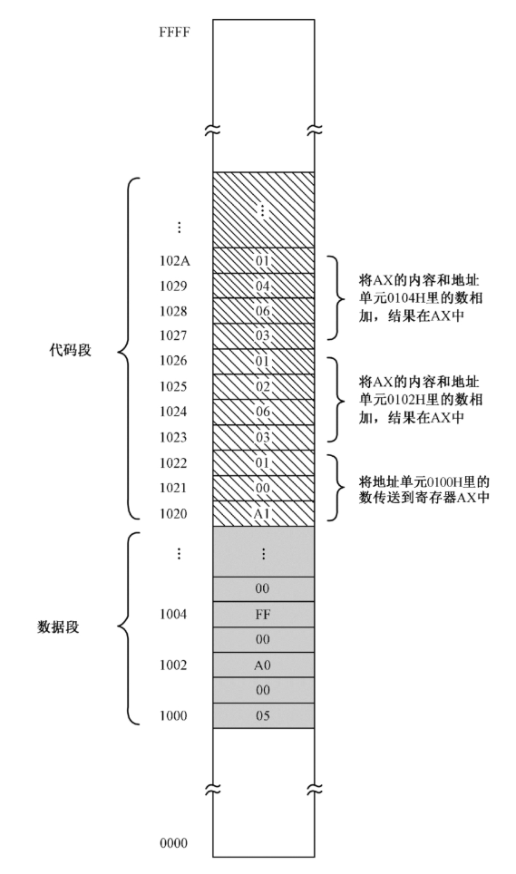
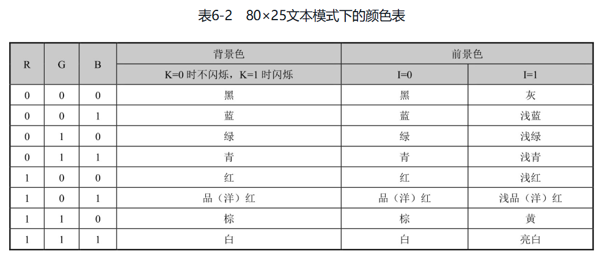

# 前言

在我看来，汇编语言不单是一门程序设计语言，学习汇编语言指令、掌握汇编语言程序设计的方法和技巧固然重要，但更重要的是，它是面向硬件的语言，天生是为了控制硬件的。因此，一本好的汇编语言教材一定不是单纯地介绍汇编语言本身，它必须是以如何控制处理器和其他外部硬件为主线的，在这个过程中引入汇编指令和硬件原理方面的内容，最终使读者对计算机工作原理的认识达到熟悉其脉络的程度。

以上就是创作本书的初衷。现在看来，这个目标基本上算是达成了。同时，我还有一个意外的收获，那就是，很多读者认为这本书有助于学习操作系统，认为它对理解操作系统非常有帮助，这也算是无心插柳吧。

为什么一本讲汇编语言的书反而成了操作系统课程的前导教材呢？其实仔细想想也不难理解。对于一台计算机来说，处理器是硬件的核心，而操作系统是软件的灵魂。因此，编写操作系统的人和设计处理器的人拥有共同的客户。为了拉住他们共同的客户，取得客户欢心，编写操作系统的人会给设计处理器的人提意见，告诉他们如何改进处理器的设计以方便操作系统和应用软件的开发。处理器的很多指令是为操作系统设计的，它的一些工作模式也是为了给操作系统提供支持，这一点在64位处理器上尤其明显。

# 第2章 计算机和汇编语言

汇编语言和处理器是紧密联系的，学习汇编语言的过程，实际上也是洞悉处理器内部构造和工作方式的过程。用汇编语言编程，必须和处理器内部的寄存器打交道，但很多人（包括我本人）在第一次接触汇编语言时，对这些东西感到很迷惑，不知道什么是寄存器，不理解为什么要使用寄存器。因此，了解处理器的内部构造及其工作方式很重要。

## 寄存器

一般的电路，它们的工作都是非常直接的。一旦我们拉起开关，切断电路，灯泡立马就不亮了，这表明电线上传送的是数字0；相反，一旦我们闭合开关，接通电路，灯泡立马就亮了，这表明电路上传送的是数字1。

后来，人们发明了一个装置，叫作触发器。如图2-5所示，一个特制的触发器有一个输入端D，以及一个输出端Q。触发器的特点是它可以把输入保存起来，这叫作锁存。如果你想用眼睛观察触发器锁存的内容，可以在输出端连接一个灯泡。


那么，触发器什么时候锁存呢？这是可以控制的。注意下面有一根导线和一个按键开关，按键开关和我们前边讲的那些开关不一样。按键开关有个特点：当你按下它时，它会接通电路；当你松手后，它又会弹起来断开电路。

这个按键开关用于决定是否锁存。平时，按键开关处于断开状态，触发器不会执行锁存动作，无论从输入端D来的是0还是1，都不会进入触发器内部，都不会被触发器内部的电路保存，更不会出现在输出端Q，即不影响输出端Q原来的状态。

但是，一旦我们按下按键开关，则触发器会立即执行一个锁存动作，不管输入端是0还是1，都会被触发器锁存起来，并立即出现在输出端Q。锁存之后，无论输入端D再怎么变化，都不会影响到锁存的内容，也不会影响输出端Q原来的输出，除非再次按下按键开关发送锁存命令。

一个触发器只能保存1比特。为了保存一个比较大的二进制数，如图2-6所示，可以使用若干个触发器，将它们组合在一起，这样就形成了一个新的器件，叫作寄存器(Register)，或者叫作锁存器。


寄存器是一个多输入、多输出的器件，它的两边都连着一排导线，左边的导线用来提供输入，右边的导线用来提供输出；下面的按键开关用来向组成寄存器的所有触发器发送锁存命令。

在图2-6中，输入端是二进制数字11000101。当我们按下按键开关时，这个数字立即被锁存。一旦输入的数字或者说电平被锁存，那么，即使这些输入撤销了也没有关系，因为它们已经被锁存在了寄存器内部。与此同时，锁存的数据也会通过输出端送出去。

如果需要，寄存器可以随时锁存新的数字，以前锁存的数字会被新的数字冲掉。从这个意义上来说，任何数字都是临时被保存在这里的，不会长久，属于临时性寄存。这就是“寄存器”一词的由来。

## 带寄存器的加法机

人类喜欢简单的操作，他们会不停地改进设备。所以，如图2-7所示，这是前面那个加法电路的改进版本。

在这个新的加法电路里，我们加入了一个寄存器。为了方便，我们称之为寄存器R。加法电路的左侧是一排带有开关的导线，用于输入相加的数字；右边的一排导线用于输出计算结果。实际上，在机器内部，右边这排导线连接在寄存器的输出端上。因此，寄存器R当前锁存的内容可以通过灯泡观察到。


加法电路的另一个变化是，它只有一组输入。这好像是个问题，但实际上这样做是很方便的。在这个电路的下面有两个按键开关，分别是“预置”和“相加”，它们就是用来解决这个问题的。比如说，如果我们要计算5加7加25，该怎么办呢？操作过程是这样的。

首先，拨动左边的一排开关，准备好第一个要相加的数字5，然后按一下“预置”按钮，将这个数字保存到寄存器R。

接着，再次拨动左侧的那排开关，准备好另一个要相加的数字7，然后按一下“相加”按钮。此时，左边的数字7和寄存器R里原有的数字5相加，相加的结果12依然保存在寄存器R中。

因为还有一个数字25需要相加，于是我们再次拨动左侧的那排开关，准备好要相加的数字25，准备好之后，按一下“相加”按钮，此时，左边的数字25和寄存器R里原有的数字12相加，相加的结果37依然保存在寄存器R中。

如果还有更多的数字要加，那么，操作过程和上面一样，反正就是准备数字，然后按一下“相加”开关。

## 能做四则运算的机器

前边我们一直在使用加法机做加法，有些人觉得，只做加法的话，功能太简单了。于是，如图2-8所示，他们改进了这个机器，为它增加了减法、乘法和除法功能。现在，我们称之为四则运算电路。


在这个四则运算电路的下边，有几个按键开关。这几个按键开关用来控制运算器内部的操作，下面我们分别进行说明。

如果按一下“预置”开关，那么，将执行锁存操作，左侧这排开关生成的二进制数被锁存到寄存器R。

如果按一下开关“加”，那么，它所指定的操作是用寄存器R里原有的数字和左侧这排开关生成的数字相加，相加的结果位于寄存器R。

如果按一下开关“减”，那么，它所指定的操作是用寄存器R里原有的数字和左侧这排开关所生成的数字相减，相减的结果位于寄存器R。

如果按一下开关“乘”，那么，它所指定的操作是用寄存器R里原有的数字和左侧这排开关所生成的数字相乘，相乘的结果位于寄存器R。

如果按一下开关“除”，那么，它所指定的操作是用寄存器R里原有的数字和左侧这排开关生成的数字相除，相除的商位于寄存器R。

当然，你会觉得功能还是太少。但是你要知道，绝大多数问题都可以归结为基本的加减乘除运算。比如，3的2次方，可以用3乘以3来完成。其他数学问题也是如此。

这个机器用起来还是很方便的，可以做连续的加减乘除运算。这里有一个实际应用的例子，先给出或者说预置一个数字7，再加8，得到15，然后乘以3，得到结果45，最后除以5，得到9。

首先，我们先拨动左边的开关准备好第一个数字7，然后按一下“预置”按钮，将这个数字保存到寄存器R。

接着，再拨动左侧的开关，准备好另一个数字8，按一下“加”按钮，则寄存器中原有的数字7和左边的数字8相加，相加的结果15依然保存在寄存器R中。

接着，再拨动左侧的开关，准备好另一个数字3，按一下“乘”按钮，则寄存器中原来的数字15和左边的数字3相乘，相乘的结果是45，依然保存在寄存器R中。

最后，再拨动左侧的开关，准备好数字5，按一下“除”按钮，则寄存器中原来的数字45和左边的数字5相除，相除的结果9依然保存在寄存器R中。

寄存器的作用是参与运算，并临时保存运算结果。但是，如果只有一个寄存器，那么，在进行一些复杂的运算时，肯定是不够用的。比如这一道带括号的计算题：(207+9)÷(56-48)

它很简单，但又有点复杂，因为我们必须先计算207+9和56-48的结果，再将这两个计算结果相除。我们来试试看。

首先拨动左侧的开关以生成数字207，然后按一下“预置”按钮，将207锁存到寄存器R中。接着，我们再拨动左侧的开关，生成数字9，然后按一下“加”按钮，这将把寄存器R里的数字207和左侧输入的数字9相加，相加的结果216依然保存在寄存器R中。

现在的问题是，寄存器R被用来保存上一个计算结果，无法再用来计算56减去48。在这种情况下，我们只能把相加的结果216用脑子或者笔记下来，腾出寄存器R，用来计算56减48。

拨动左侧的开关以生成数字56，再按一下“预置”按钮，将56锁存到寄存器R中。接着，我们再拨动左侧的开关，生成数字48，然后按一下“减”按钮，这将把寄存器R里的数字56和左侧的数字48相减，相减的结果8依然保存在寄存器R中。现在，用笔或者你的脑子把结果8记下来。

最后是把前面已经得到的两个中间结果216和8相除。拨动左侧的开关以生成数字216，再按一下“预置”按钮，将216锁存到寄存器R中。接着，我们再拨动左侧的开关，生成数字8，然后按一下“除”按钮，这将把寄存器R里的数字216和左侧的数字8相除，相除的结果27依然保存在寄存器R中。

## 机器指令

从刚才的例子可以看出，因为只有一个寄存器，这使得运算器的功能受到限制，操作也很麻烦。

为此，如图2-9所示，我们可以在运算电路里多放几个寄存器，这样就能够倒腾得过来。为了方便说明问题，我们暂时再加入一个寄存器Z，这样我们就有了两个寄存器。

尽管只是增加了一个寄存器，但是这台机器的操作却复杂了很多。比如，可以将左边的数字传送或者预置到寄存器R中，也可以传送到寄存器Z中；可以将寄存器R中的数字和左边来的数字做加减乘除，也可以将寄存器Z中的数字和外来的数字做加减乘除；可以将寄存器R中的数字传送或者说复制到寄存器Z中，也可以将寄存器Z中的数字传送或者说复制到寄存器R中；可以用寄存器R中的数字和寄存器Z中的数字做加减乘除操作，而且可以选择运算的结果保存在哪一个寄存器。


我粗略地估计了一下，这里共有大约20个动作。对于以上所列举的每个动作或者说每个操作，都需要一个按键开关来触发，所以至少需要20个按键开关。这还只是两个寄存器，如果以后再增加寄存器或者别的功能，开关就更多了。这不是长久之计，我们得另想办法。

考虑一下，既然我们可以用一排开关来生成参与加减乘除的数字，也可以用另一排开关来共同组合出我们要执行的操作。

为此，我们在运算电路的下面安装5个铡刀开关。和往常一样，开关的闭合代表这根线上是1，开关的断开代表这根线上是0，于是可以组合出一个5位的二进制数字。不同的二进制数字具有不同的含义，代表不同的操作。当我们拨动这一排开关时，就是指定这台机器所要执行的操作，因此，我们把这些开关所代表的数字叫作指令(Instruction)。指令就是给这台机器下达的操作命令。表2-1给出了这5个开关可以组合出的指令，以及它们所指定的操作。


那么，什么时候开始执行由开关所形成的指令呢？旁边还有一个按键开关，名字叫“执行”。当我们按下这个开关时，这台机器就按照指令的指示进行相应的操作。

比如，我们将这组开关设置成“开、开、开、关、关”的状态，当按一下“执行”开关时，将执行把寄存器R中的内容复制并传送到寄存器Z中的动作。

那么，现在我们就来用这台新机器计算数学题(207+9)÷(56-48)，看看这个操作过程是怎样的。

首先，拨动左边的开关以生成数字207，接着，拨动下面的“指令”开关，将它们设置成00001，意思是将外数传送到寄存器R中。此时，按一下“执行”开关，这将把左边的207锁存到寄存器R中。

接下来，拨动左边的开关以生成数字9，接着，拨动下面的“指令”开关，将它们设置成00101，意思是，将寄存器R中的数字和外数相加。此时，按一下“执行”开关，这将把寄存器R中的数字207和左边的数字9相加，相加的结果216依然在寄存器R中。

接下来，拨动左边的开关以生成数字56，接着，拨动下面的“指令”开关，将它们设置成00010，意思是，将外数传送到寄存器Z。此时，按一下“执行”开关，这将把左边56锁存到寄存器Z中。

再往下看，我们拨动左边的开关以生成数字48，接着，拨动下面的“指令”开关，将它们设置成01010，意思是，将寄存器Z中的数字和外数相减。此时，按一下“执行”开关，这将把56和48相减，相减的结果8依然在寄存器Z中。

最后，我们拨动下面的“指令”开关，将它们设置成10000，意思是，将寄存器R里的数字和寄存器Z里的数字相除。此时，按一下“执行”开关，这将用寄存器R中的数字216除以寄存器Z中的数字8，相除的商27保存在寄存器R中。

## 内存

通过拨动开关来形成指令，然后让运算器执行指令，这很有创意。但是，随着机器功能的增加，手工操作越来越烦琐，这是肯定的。

考虑一下，当我们拨动开关来组合指令时，和生成一个二进制数没有区别，只不过这些数字实际上是指令，用来指定某个操作。那么，能不能把这些代表指令的二进制数保存到某个容器里，让机器自动按顺序一条一条地取出来执行呢？没有问题，这完全可以。

如图2-10所示，在左边的容器里就保存着一堆代表指令的二进制数，右边的运算器可以一条一条地取出并加以执行。这样的容器，就是我们今天所要讲的内存。内存是由大量的内存单元堆叠而成的，在这里，组成内存的每一个方块都是一个内存单元。


和图2-10不同，在主流计算机的内存里，每个内存单元的长度是8比特，可以保存一个8位的二进制数。比如在图2-11中，最下面的那个内存单元，就存储了一个8比特的二进制数10000101。

内存单元很多，我们如何区分它们呢？答案是，每个内存单元都有一个唯一的编号。第一个单元的编号是0，第二个单元的编号是1，第三个单元的编号是2，后面的单元也依次编号。注意，单元的编号是这个单元在内存里的位置，通常称为地址(Address)。


既然内存是由大量的内存单元组成的，那么，如何指定读写的是哪个单元呢？为此，内存使用一排电线，称为地址线，来指定单元的编号。当我们访问某个内存单元时，就通过这排地址线输入单元的编号。显然，地址线的数量决定了我们最多可以访问几个单元。

比如说，如果内存只有两根地址线，这两根线只能组合出4个二进制数，分别是00、01、10和11。这4个二进制数代表着4个地址，因此，只能访问到4个单元。如果用十进制数来表示单元的编号，这几个单元的编号分别是0、1、2和3。

再举个例子，如图2-12所示，如果有8根地址线，那么，这8根地址线可以组合出256个二进制数，分别是00000000、00000001、00000010、…、11111111。这256个二进制数代表着256个地址。所以，8根地址线只能访问256个内存单元。

内存单元的编号就是它的地址，习惯上，我们用十六进制标注在它的左侧。这里，第一个内存单元的地址是00H，最后一个内存单元的地址是FFH。注意，为了整齐划一，地址0被标注为00，地址1被标注为01。这是可以的，在一个数字的前面加0，不会改变它的大小。


推而广之，如果地址线的数量是N，那么，可以通过它访问的内存单元的数量是2的N次方，即$2^N$。

在计算机领域，字节的概念被频繁地使用。习惯上，字节是用来描述二进制序列的长度单位，8比特组成1字节。字节的英语单词是Byte，简写为B。比如，二进制数10001101的长度是1字节；二进制数1101000101111110的长度是2字节。

在主流的计算机上，内存单元的长度是8比特。换句话说，每个内存单元的长度都是1字节。

内存的容量可以用内存单元的数量来统计。因为每个内存单元的长度是1字节，所以经常用字节数来衡量。根据内存的大小，内存的容量是以字节(B)、千字节(KB)、兆字节(MB)、吉字节(GB)和太字节(TB)来标称的，它们之间的换算关系是：

- 1 KB=1024 B；
- 1 MB=1024 KB；
- 1 GB=1024 MB；
- 1 TB=1024 GB。

内存用来保存或者读出数据。为此，如图2-13所示，内存上还需要另一排导线，这排导线叫作数据线。要写入的数据通过数据线进入内存；读出来的数据也通过数据线送到外面。

可以往内存里写数据，也可以从内存里读出数据，读和写统称为“访问”。为了访问内存，还需要一个读写控制线，用来指明是读操作还是写操作。举个例子来说，读写控制线平时没有输入，为0，表示处于随时可以读取的状态；如果它为1，则表明执行的是写入操作。


在写入的时候，我们先在地址线上给出一个地址，在数据线上给出一个要写入的数字，通过读写控制线发出写命令，内存就会把数据线上的数字写入指定的地址。

在读出时，先在地址线上给出一个地址，然后通过读写控制线发出读命令，那么，就会从指定的地址读出数据并送到数据线上。

举个例子来说，假定如图2-13所示的内存有16根地址线，那么，它可以访问65536个内存单元，地址范围是0000H～FFFFH。如果发出的地址是二进制数0000000000000110，那么，由于它等于十六进制的6，所以将选中内存中地址为6的单元。

再假定这个内存有8根数据线，通过数据线输入的是二进制数10001101，并且读写控制线的状态是写入(1)。那么，数据线上的10001101会被写入这个地址为6的单元。

读的时候也是一样，如果地址是6，读写控制线的状态是读(0)，那么，内存单元里的数字就会被送到数据线上。

内存是存储器（Storage或Memory）的一种，而存储器的种类实际上是很多的，包括大家都知道的硬盘和U盘等，甚至寄存器就是存储器的一种。如图2-14所示，我们这里所讲的内存也叫内存条。这个概念是这么来的：首先，它是计算机内部最主要的存储器，所以叫作内存储器或者主存储器，简称内存或主存；其次，它一般被设计成扁平的条状电路板，所以叫内存条。如果你曾经打开过家里的台式计算机，应该见过它。


在计算机发展的早期，也就是二十世纪五十年代，受技术限制，制造内存是非常不容易的事，人们使用了能够想到的各种方法，包括磁芯存储器，它用磁场来记录比特0和比特1。具体的原理，请参阅《穿越计算机的迷雾》这本书。

二十世纪七十年代，随着集成电路技术的发展，内存的制造技术也提高了，出现了集成电路存储器。这个时候的内存体积大大缩小，容量大大提高，但以现在的眼光来看还是很小，通常只有几千字节。

到了现在，随着大规模和超大规模集成电路的使用，内存在容量、体积方面都发生了翻天覆地的变化，可以提供几吉字节甚至几十吉字节的存储空间。

## 自动计算

在引入了内存之后，人们对运算器也做了改进。如图2-15所示，经过改进之后的运算器通过地址线、数据线和读/写控制线与内存相连，而且它现在的最大变化是可自主工作，可自动地从内存里面按顺序取指令并执行指令。

为了跟踪每条需要执行的指令，运算器内部有一个指令指针寄存器，这个寄存器保存着指令的地址。刚开始的时候，它的内容是第一条要执行的指令的内存地址。


当运算器开始工作时，它先将指令指针寄存器的内容送到地址线上，这是要执行的第一条指令的地址。然后，运算器通过读/写控制线发出读内存的命令。之后，内存将该地址上的内容放到数据线上。因为现在是取指令阶段，所以，运算器收到数据后，把它当成指令进行译码，然后根据指令的内容做相应的操作，也就是执行指令。

与此同时，指令指针寄存器的内容被修改，修改为下一条指令的地址。问题是，处理器怎么知道下一条指令的地址呢？答案是，它可以根据当前这条指令的地址和长度来计算下一条指令的地址。它怎么知道当前这条指令的长度呢？不同的指令具有不同的功能，也具有固定的长度。最后，在当前指令执行完成后，接着重复以上过程。

来看一个具体的例子。如图2-16所示，内存里已经写入了很多指令，这些指令共同组成了完成(207+9)÷(56-48)这道算术题的步骤和过程，所以叫作“程序”。

第一条指令占用2字节的内存空间，第1字节01101001，被称为操作码，它指定了要进行什么操作。对于这个操作码来说，它指定了所要进行操作是将操作码后面的数字传送到寄存器R中。


操作码后面的数字是11001111，也就是十进制的207。所以，这条指令执行时将207传送到寄存器R中。显然，在这条指令中，被操作的数字，也就是操作数，是直接包含在指令中的，是指令的组成部分。因此，这样的操作数被称为立即数(Immediate)，意思是它是直接包含在指令中的，可以立即从指令中得到。

第二条指令也是2字节，操作码是01001100，指定的操作是将寄存器R中的内容和操作码后面的数字相加，结果依然在寄存器R中。操作码后面的数字00001001，也就是十进制的9。所以，这条指令执行时将寄存器R中的内容和指令中的立即数9相加，结果依然在寄存器R中。

第三条指令也是2字节，操作码是01101010，指定的操作是将操作码后面的数字传送到寄存器Z中。操作码后面的数字00111000，也就是十进制的56。所以，这条指令执行时将指令中立即数56传送到寄存器Z中。

第四条指令也是2字节，操作码是01000100，指定的操作是将寄存器Z中的内容和操作码后面的数字相减，结果依然在寄存器Z里。操作码后面的数字00110000，也就是十进制的48。所以，这条指令执行时将寄存器Z中的内容和指令中的立即数48相减，结果依然在寄存器Z中。

第五条指令只有1字节，操作码是11001010，指定的操作是将寄存器R中的内容和寄存器Z中内容相除，相除的结果依然在寄存器R里。

第六条指令也是2字节，操作码是01110000，指定的操作是将寄存器R中的内容传送到由操作码后面的操作数所指定的内存地址处。操作码后面的数字是00001100，也就是十进制的12。对于当前的操作码来说，这个操作数是一个内存地址。因此，这条指令是将寄存器R中的内容传送到地址为12的内存单元。

地址为12的内存单元是左侧标注为0C的内存单元，因为地址是采用十六进制的，十六进制数0C就是十进制数12。因此，这条指令在执行时，操作数12被当成地址，处理器通过地址线发送给内存，然后把寄存器R中的内容传送到这个地址上的内存单元。

通过和前面的第一条指令进行比较，很容易分清指令中的“立即数”是什么意思。指令执行和操作的对象是数。如果这个数已经在指令中给出了，不需要再次访问内存，那这个数就是立即数，比如第一条指令中的207；相反，如果指令中给出的是地址，真正的数还需要用这个地址访问内存才能得到，那它就不能称为立即数，比如这条指令中的12，它只是一个地址，并不是最终要操作的数字，最终要操作的数字还需要用这个地址再次访问内存才能得到。

运算器一旦开启，它就自动取指令和执行指令。在内存中，有些内容并不是指令。比如在这里，从内存地址0C开始，后面的内容都不是指令。但是，机器在工作时，你插不上手，不可能在它恰好执行到最后一条指令时让它停下来。

因此，最好的办法就是设计一条停机指令，让运算器执行这条指令后自动停止工作并保持停止前状态。在这里，我们的最后一条指令是停机指令，它只有1字节的长度，操作码是11110100。当运算器执行这条指令后，停止工作，我们可以从容地检查程序的执行结果。

## 处理器

以上，我们从加法机讲到全自动的运算器。运算器功能有限，经过一代又一代的反复改进后，它就变成我们现在所说的处理器(Processor)，一些老的图书和教材把它叫作中央处理单元或者干脆称为CPU。

处理器是一台电子计算机的核心，它会在振荡器脉冲的激励下，从内存中获取指令，并发起一系列由该指令所定义的操作。当这些操作结束后，它接着再取下一条指令。在通常情况下，这个过程是连续不断、循环往复的。大体上，如图2-17所示，处理器由总线接口部件、控制部件和指令执行部件组成。


总线接口部件负责同外部的地址线和数据线进行连接，发送地址信号给内存或者其他外部设备，和内存或者其他外部设备交换（发送或者接受）数据，等等。

指令执行部件负责执行指令，它包含了很多寄存器，这些寄存器用于参与算术逻辑运算，并临时保存运算结果。指令执行部件的核心是算术逻辑部件(Arithmetic Logic Unit, ALU)，算术运算和逻辑运算在这里进行。

控制部件负责协调和控制整个处理器的运行状态，什么时候取指令，什么时候输出地址，什么时候发送数据，什么时候接收数据，什么时候执行指令，都由它负责协调。

1947年，美国贝尔实验室的肖克利和同事们一起发明了晶体管。1958年，也许是受够了在一大堆晶体管里连接那些杂乱无章的导线，另一个美国人杰克·基尔比发明了集成电路。接着，1971年，在为日本人设计计算器过程中，INTEL的弗德里科·法金灵机一动，他想，能不能把运算功能和控制功能集成到一起，设计一款可以自动取指令并执行指令的芯片呢？于是他发明了第一款处理器INTEL 4004，如图2-18所示。

紧接着，INTEL又推出了8088和划时代的产品8086。4004是4位的处理器，8008是8位的处理器，而8086是16位的处理器。


8086是一款划时代的产品，应用非常广泛。虽然INTEL的处理器越来越先进，但它的x86系列一直保持对8086的兼容性。在本书的前半部分，我们主要针对8086进行讲解。

那么，处理器的位数是什么意思呢？4位的处理器拥有4位的寄存器和算术逻辑部件；8位的处理器拥有8位的寄存器和算术逻辑部件；16位的处理器拥有16位的寄存器和算术逻辑部件；32位的处理器拥有32位的寄存器和算术逻辑部件；64位的处理器拥有64位的寄存器和算术逻辑部件。可以肯定的是，位数越多，寄存器就可以保存更大的数字，算术逻辑部件就可以在单次计算中使用更大的数字并产生更大的结果。

在8086之后，INTEL又生产了80286和80386。80386又是一款划时代的产品，深刻地影响了后续的处理器设计。本书的后半部分是以80386为基础讲解的。

在后来的岁月里，INTEL又推出了更多型号的处理器，这些处理器根据应用领域的不同，发展出多个分支来。图2-19中的这一款处理器名字叫i3-3220，左边是它的正面，右边是它的反面。这些密密麻麻的圆点是它的引脚，用来连接地址线、数据线和读/写控制线。


处理器的工作是自动取指令并执行指令。对于任何一款处理器来说，它可以识别哪些指令，是在设计和制造的时候就已经决定了的。**任何一款处理器，它可以识别的所有指令的集合，叫作这款处理器的指令集。**

几十年前，处理器的指令集很小，通常只有十几种或者几十种指令。随着技术的发展，处理器的功能大大增强了，指令集也扩展了。现在的处理器，指令集可以包含几百甚至上千种指令。

**对于任何一款处理器来说，它所包含的指令都可以分为以下几种：算术运算指令、逻辑运算指令、数据传送指令和处理器状态控制指令。**

算术运算指令和逻辑运算指令是最基本的，也最容易理解。数据传送指令在处理器内部的寄存器之间、处理器和内存之间、处理器和外围设备之间传送数据。这些外围设备包括我们常见的显示设备、存储设备（如硬盘）、打印机、鼠标、键盘等。通过和外部设备的数据交换，计算机的功能也变得丰富起来。比如，我们现在可以在显示器上显示文本和图形，于是产生了Windows和Linux这样的操作系统，可以使用键盘输入文字，进一步地，我们可以用计算机写文档、聊天、购物、玩游戏、看视频。

处理器状态控制指令用于控制处理器内部的工作模式和运行状态，如电源管理、程序的权限管理等。本书后面所要讲的保护模式，也是由这些指令来切换的。

## 汇编语言的诞生

我们说过，在内存里写入一些代表特定操作的二进制数（或者说指令），这个过程叫作编程(Programming)。为了给计算机编程，人们最早用的是开关和跳线。

如图2-20所示，(a)是用开关编程的机器；(b)是用跳线编程的机器。一排开关代表一个二进制数或者指令，每个开关代表这个二进制数或者指令的某比特，开关的断开与闭合代表着该比特是0还是1，跳线也是如此。


紧接着，为了方便，人们发明了纸带和纸带阅读机，图2-20(c)就是纸带的一个片段。纸带就是一卷长长的纸条，人们在纸带上打孔，有孔和无孔代表1和0。编写程序时，人们将指令的二进制形式打成孔，然后由纸带阅读机转换成二进制写入内存，最后由处理器执行。处理器执行的结果也可以在纸带上打孔来呈现。

图2-21显示了一个典型的场景：我们在Windows操作系统上的文本编辑器里用键盘输入文本，并且看起来好像在用二进制编程。如果这真的是在用二进制编程，那么，这将是非常抽象、非常痛苦的，难以理解，容易出错。


为了减轻程序员的负担，人们发明了汇编语言(Assembly Language)。汇编语言使用文本符号来代表处理器指令，由于和人类的自然语言比较接近，所以很容易看懂，也很容易书写。如图2-22所示，这是在Windows操作系统上用文本编辑器编写汇编语言程序。


其中`mov r,207`意思是把指令中的立即数207传送到寄存器r中；`add r,9`意思是用寄存器r中的数字和指令中的立即数9相加，结果回送到寄存器r中；`mov z,56`意思是把指令中的立即数56传送到寄存器z中；`sub z,48`意思是用寄存器z中的数字和指令中的立即数48相减，结果回送到寄存器z中；`div r,z`意思是用寄存器r中的数字除以寄存器z中的数字，商回送到寄存器r；`mov [12],r`意思是，将寄存器r中的数字传送到地址为12的内存单元里去；`hlt`意思是停机。

用汇编语言书写的程序只是一些文本和符号，我们人类能看懂，但处理器是不可能看懂的。为此，需要把汇编语言程序转换为包含了处理器指令的程序。

如图2-23所示，这个转换过程是由一个汇编程序来进行的。汇编程序也是人类编写的程序。可以想到，世界上第一个汇编程序肯定是用处理器指令编写的。


汇编程序执行翻译过程，将汇编语言程序转换为包含了处理器指令的程序，也就是将文本符号转换为二进制的机器指令，转换后的结果是一个包含了处理器指令的程序，这个程序可以提交给处理器执行。

在后面的章节中，我们将看到这个从编写到翻译，再到执行的过程是怎样一步一步地进行的，当然，我们的重点依然是在汇编语言和指令上。

# 第3章 分段机制和逻辑地址

鉴于汇编语言和处理器之间的紧密关系，学习汇编语言的过程，实际上也是洞悉处理器内部构造和工作方式的过程。

在本章中，我们要借助一款早已淘汰的处理器INTEL 8086来了解x86汇编语言编程的基本环境。不要小看这款处理器，它是整个INTEL x86处理器家族的起点和基础。

## 寄存器和字长

为什么处理器能够自动计算，这个问题已经在第2章里做了介绍。处理器的工作依赖其内部的寄存器。早期的处理器，它的寄存器只能保存4比特、8比特或16比特，分别叫作4位、8位和16位寄存器。现在的处理器，寄存器一般都是32位、64位甚至更多。

如图3-1所示，8位寄存器可以容纳8比特，或者说1字节。为了方便，我们还要为该字节的每一位编上号，编号是从右往左进行的，从0开始，分别是0、1、2、3、4、5、6、7。在这里，位0（第1位）是最低位，在最右边；位7（第8位）是最高位，在最左边。


为了更好地理解上面这些概念，图3-1假定8位寄存器里存放的是二进制数10001101，即十六进制的8D。这时，它的最低位和最高位都是1。

在第2章里我们提到了处理器的位数，它是指寄存器和算术逻辑部件的数据宽度，这个宽度也叫作处理器的字长。因此，8位处理器、16位处理器、32位处理器和64位处理器的字长也分别是8位、16位、32位和64位。

16位寄存器可以存放2字节，这称为1个字(word)，各个比特的编号分别是0～15，其中0～7是低字节，8～15是高字节。

32位寄存器可以存放4字节，这称为1个双字(double word)，各个数位的编号分别是0～31，其中，0～15是低字，16～31是高字。

尽管图中没有画出，但是64位寄存器可以容纳更多的比特，也就是8字节，或者4个字，简称四字(quad word)。位数越多，寄存器所能保存的数越大，这是显而易见的。

## 内存访问和字节序

如图3-2所示，和寄存器不同，内存用于保存更多的比特。对于用得最多的个人计算机来说，内存按字节来组织，单次访问的最小单位是1字节，这是最基本的存储单元。如图3-2所示，每个存储单元中，各位的编号分别是0～7。


内存中的每字节都对应着一个地址，如图3-2所示，第1字节的地址是0000H，第2字节的地址是0001H，第3字节的地址是0002H，其他依次类推。注意，图中采用的是十六进制表示法。作为一个例子，因为这个内存的容量是65536字节，所以最后一字节的地址是FFFFH。

为了访问内存，处理器需要给出一个地址。访问包括读和写，为此，处理器还要指明，本次访问是读还是写。如果是写，还要给出待写入的数据。

处理器在工作时，需要在内存和寄存器之间交换数据。尽管内存的最小组成单位是字节，但是，经过精心的设计和安排，它能够按字节、字、双字和四字进行访问。换句话说，仅通过单次访问就能处理8位、16位、32位或者64位的二进制数。注意，这里说的是单次访问，而不是一个一个地取出各字节，然后加以组合。

如图3-2所示，处理器发出字长控制信号，以指示本次访问的字长是8、16、32还是64。如果字长是8，而且给出的地址是0002H，那么，本次访问只会影响到内存的1字节；如果字长是16，给出的地址依然是0002H，那么实际访问的将是地址0002H处的一个字。对于INTEL处理器来说，如果访问内存中的一个字，那么，它规定高字节位于高地址部分，低字节位于低地址部分，这称为低端字节序(Little Endian)。因此，低8位在0002H中，高8位在0003H中。至于其他公司的处理器，则可能情况正好相反，称为高端字节序。

## 古老的INTEL 8086处理器

任何时候，一旦提到INTEL公司的处理器，就不能不说8086。8086是INTEL公司第一款16位处理器，诞生于1978年，所以说它很古老。但是，在INTEL公司的所有处理器中，它占有很重要的地位，是整个INTEL 32位架构处理器(IA-32)的开山鼻祖。

首先，最重要的一点是，它是一款非常成功的产品，设计先进，功能很强，卖得很好。

其次，8086的成功使得市场上出现了大量针对它开发的软件产品。这样，当INTEL公司要设计新的处理器时，它不得不考虑兼容性的问题。要使得老的软件也能在新的处理器上很好地运行，必须要具备指令集和工作模式上的兼容性和一致性。INTEL公司很清楚，如果新处理器和老处理器不兼容，那么，新处理器越多，它扔掉的拥趸也就越多，要不了多久，这公司就不用再开了。

### 8086的通用寄存器

如图3-3所示，8086处理器内部有8个16位的通用寄存器，都是由16比特组成的，并分别被命名为AX、BX、CX、DX、SI、DI、BP、SP。“通用”的意思是，它们之中的大部分都可以根据需要用于多种目的。

因为这8个寄存器都是16位的，所以通常用于进行16位的操作。比如，可以在这8个寄存器之间互相传送数据，它们之间也可以进行算术逻辑运算；也可以在它们和内存单元之间进行16位的数据传送或者算术逻辑运算。


同时，如图3-3所示，这8个寄存器中的前4个，即AX、BX、CX和DX，又各自可以拆分成两个8位的寄存器来使用，总共可以提供8个8位的寄存器AH、AL、BH、BL、CH、CL、DH和DL。这样一来，当需要在寄存器和寄存器之间，或者寄存器和内存单元之间进行8位的数据传送或者算术逻辑运算时，使用它们就很方便。

将一个16位的寄存器当成两个8位的寄存器来用时，对其中一个8位寄存器的操作不会影响到另一个8位寄存器。举个例子来说，当你操作寄存器AL时，不会影响到AH中的内容。

如图3-3所示，以寄存器AX为例，它可以分成两个独立的寄存器AH和AL。寄存器AX有16比特，但是，位0到位7这8比特属于寄存器AL；位8到位15这8比特属于寄存器AH。因此，我们说，寄存器AH是寄存器AX的高字节部分；寄存器AL是寄存器AX的低字节部分。同时，寄存器AX的内容也是由寄存器AH的内容和寄存器AL的内容组合而成的。

如果寄存器AH的内容是00111110(3EH)，寄存器AL的内容是00101111(2FH)，那么，寄存器AX的内容就是0011111000101111(3E2FH)。

接着，如果我们改变了寄存器AH的内容，将它修改成00000000(00H)，那么，这对寄存器AL没有任何影响，还是00101111(2FH)。但是，寄存器AX的内容也跟着改变，变成0000000000101111(002FH)。

最后，如果我们改变了寄存器AL的内容，将它修改成01011010(5AH)，那么，这对寄存器AH没有任何影响，还是00000000(00H)，但是寄存器AX的值也跟着改变，变成0000000001011010(005AH)。

### 程序的重定位难题

我们知道，处理器的设计者用某些数字来指示处理器所进行的操作，这些数字代表指令，或者叫机器指令，因为只有处理器才认得它们。指令是集中存放在内存里的，一条接着一条，处理器的工作是自动按顺序取出并加以执行。处理器内部有寄存器和算术逻辑部件，还有控制器部件，控制器部件“分析”一条条指令，然后确定在哪个时间点让哪些部件进行工作。

对于INTEL x86处理器来说，指令的长度不定，短的指令仅有1字节，而长的指令则有可能达到15字节。在内存中，指令和非指令的普通二进制数是一模一样的，在组成内存的电路中，都是一些高、低电平的组合。因为处理器是自动按顺序取指令并加以执行的，在指令中混杂了非指令的数据会导致处理器不能正常工作。为此，指令和数据要分开存放，分别位于内存中的不同区域，或者说各自形成一个段(Segment)，分别叫代码段和数据段。

注意，我们并没有改变内存的物理性质，并不是真的把它分成几块。段的划分是逻辑上的，从本质上来说，是如何看待和组织内存中的数据。

段在内存中的位置并不重要，因为处理器是可控的，我们可以让它从内存的任何位置开始取指令并加以执行。这里有一个例子，如图3-4所示，我们有一大堆数字，现在想把它们加起来求出总和。


假定我们有16个数要相加，这些数都是16位的二进制数，分别是0005H、00A0H、00FFH、…。为了让处理器把它们加起来，我们应该先在内存中定义一个数据段，将这些数字写进去。数据段可以起始于内存中的任何位置，既然如此，我们将它定在0100H处。这样一来，第一个要加的数位于地址0100H，第二个要加的数位于地址0102H，最后一个数的地址是011EH。

一旦定义了数据段，我们就知道了每个数的内存地址。然后，紧挨着数据段，我们从内存地址0120H处定义代码段。严格地说，数据段和代码段是不需要连续的，但这里把它们挨在一起更自然一些。为了区别数据段和代码段，我们使用了不同的底色。

代码段是从内存地址0120H处开始的，第一条指令是A1 00 01。其中，A1是操作码，意思是从指定的内存地址处取出一个字，传送到寄存器AX；后面的00 01是采用低端字节序存放的数字0100H，代表一个内存地址。所以这条指令的功能是将内存单元0100H里的字传送到寄存器AX。指令执行后，AX的内容为0005H。

第二条指令是03 06 02 01，其中，03 06是操作码，02 01是采用低端字节序存放的数字0102H，这条指令的功能是将AX中的内容和内存单元0102H里的字相加，结果在AX中。由于AX的内容为0005H，而内存地址0102H里的数是00A0H，这条指令执行后，AX的内容为00A5H。

第三条指令是03 06 04 01，其中，03 06是操作码，04 01是采用低端字节序存放的数字0104H，这条指令的功能是将AX中的内容和内存单元0104H里的字相加，结果在AX中。此时，由于AX里的内容是00A5H，内存地址0104H里的数是00FFH，本指令执行后，AX的内容为01A4H。

后面的指令没有列出，但和前2条指令相似，依次用AX的内容和下一个内存单元里的字相加，一直到最后，在AX中得到总的累加和。在这个例子中，我们没有考虑寄存器AX容纳不下结果的情况。当累加的总和超出了AX所能表示的数的范围（最大为FFFFH，即十进制的65535）时，就会产生进位，但这个进位被丢弃。

在内存中定义了数据段和代码段之后，我们就可以命令处理器从内存地址0120H处开始执行。当所有的指令执行完后，就能在寄存器AX中得到最后的结果。看起来没有什么问题，一切都很完美，不是吗？那本节标题中所说的难题又从何而来呢？

这里确实有一个难题。

在前面的例子中，所有在执行时需要访问内存单元的指令，使用的都是真实的内存地址。比如A1 00 01，这条指令的意思是从地址为0100H的内存单元里取出一个字，并传送到寄存器AX中。这里，0100H是一个真实的内存地址，又称物理地址。

整个程序（包括代码段和数据段）在内存中的位置，是由我们自己定的。我们把数据段定在0100H，把代码段定在0120H。

问题是，大多数时候，整个程序（包括代码段和数据段）在内存中的位置并不是我们能够决定的。请想一想你平时是怎么使用计算机的，你所用的程序，包括那些用来调整计算机性能的工具、小游戏、音乐和视频播放器等，都是从网上下载的，位于你的硬盘、U盘或光盘中。即使有些程序是你自己编写的，那又如何？当你双击它们的图标，使它们在Windows里启动之前，内存已经被塞了很多东西，就算你是刚刚打开计算机，Windows自己已经占用了很多内存空间，不然的话，你怎么可能在它上面操作呢？

在这种情况下，你所运行的程序，在内存中被加载的位置是完全随机的，哪里有空闲的地方，它就会被加载到哪里，并从那里开始被处理器执行。所以，前面那段程序不可能恰好如你所愿，被加载到内存地址0100H，它完全可能被加载到另一个不同的位置，如1000H。但是，同样是那个程序，一旦它在内存中的位置发生了改变，灾难就出现了。

如图3-5所示，因为程序现在是从内存地址1000H处被加载的，所以，数据段的起始地址为1000H。这就是说，第一个要加的数，其地址为1000H，第二个则为1002H，其他依次类推。代码段依然紧挨着数据段之后，起始地址相应地是1020H。



只要所有的指令都是连续存放的，代码段位于内存中的什么地方都可以正常执行。所以，处理器可以按你的要求，从内存地址1020H处连续执行，但结果完全不是你想要的。

请看第一条指令A1 00 01，它的意思是从内存地址0100H处取得一个字，将其传送到寄存器AX中。但是，由于程序刚刚改变了位置，它要取的那个数，现在实际上位于1000H，它取的是别人地盘里的数！

这能怪谁呢？发生这样的事情，是因为我们在指令中使用了绝对内存地址（物理地址），这样的程序是无法重定位的。为了让你写的程序在卖给别人之后，可以在内存中的任何地方正确执行，就只能在编写程序的时候使用相对地址或者逻辑地址，而不能使用真实的物理地址。当加载程序时，这些相对地址还要根据程序实际被加载的位置重新计算。

在任何时候，程序的重定位都是非常棘手的事情。当然，也有好几种解决的办法。在8086处理器上，这个问题特别容易解决，因为该处理器在访问内存时使用的是段地址和偏移地址，也就是逻辑地址，而不是物理地址。

### 逻辑地址

从传统的视角来看，内存的组织是线性的，是一个由大量内存单元组成的序列，就像长长的纸条。每个内存单元都有自己的物理地址，它是相对于内存起始处的绝对位置。但是请想象一下，如果我们把内存从逻辑上划分为若干部分，也就是分成段，会怎样呢？

如图3-6所示，根据需要，段可以开始于内存中的任何位置，比如图中的内存地址A532H处，这个起始地址就是段地址。

段的长度不是固定的。图3-6中的这个段包含了6个存储单元。在分段之前，这些单元在整个内存空间里的物理地址分别是A532H、A533H、A534H、A535H、A536H、A537H。但是，在分段之后，它们的地址可以只相对于自己所在的段。这样，它们相对于段开始处的距离分别为0、1、2、3、4、5，这叫作段内偏移，或者叫偏移地址。

**于是，当采用分段策略之后，一个内存单元的地址实际上就可以用“段:偏移”或者“段地址:偏移地址”来表示，这就是通常所说的逻辑地址。**比如，在图3-6中，段内第1个存储单元的地址为A532H:0000H，第3个存储单元的地址为A532H:0002H，而本段最后一个存储单元的地址是A532H:0005H。


为了在硬件一级提供对“段地址:偏移地址”内存访问模式的支持，处理器至少要提供两个段寄存器，分别是代码段寄存器(Code Segment, CS)和数据段寄存器(Data Segment, DS)。

对代码段寄存器CS的改变将导致处理器从新的代码段开始执行。同样，在开始访问内存中的数据之前，也必须首先设置好数据段寄存器DS，使之指向数据段。

除此之外，**最重要的是，当处理器访问内存时，它把指令中指定的内存地址看成段内的偏移地址，而不是物理地址。**这样，一旦处理器遇到一条访问内存的指令，它将把DS中的数据段起始地址和指令中提供的段内偏移相加，来得到访问内存所需要的物理地址。

如图3-7所示，代码段的段地址为1020H，数据段的段地址为1000H。在代码段中有一条指令A1 02 00，它的功能是将地址0002H处的一个字传送到寄存器AX中。在这里，处理器将0002H看成段内的偏移地址，段地址在DS中，应该在执行这条指令之前就已经用别的指令传送到DS中了。

当执行指令A1 02 00时，处理器将把DS中的内容和指令中指定的偏移地址0002H相加，得到1002H。这是一个物理地址，处理器用它来访问内存，就可以得到所需要的数00A0H。

如果下次执行这个程序时，代码段和数据段在内存中的位置发生了变化，只要把它们的段地址分别传送到CS和DS，它也能够正确执行。


### 8086的内存分段机制

前面讲了如何从逻辑地址转换到物理地址，以使程序的运行和它在内存中的位置无关。这种策略在很多处理器中得到了支持，包括8086处理器。但是，由于8086自身的局限性，它的做法还要复杂一些。

如图3-8所示，8086内部有8个16位的通用寄存器，分别是AX、BX、CX、DX、SI、DI、BP、SP。其中，前4个寄存器中的每个寄存器都还可以当成2个8位的寄存器来使用，分别是AH、AL、BH、BL、CH、CL、DH、DL。


在进行数据传送或者算术逻辑运算的时候，使用算术逻辑部件(ALU)。比如，将AX的内容和CX的内容相加，结果仍在AX中，那么，在相加的结果返回到AX之前，需要通过一个叫数据暂存器的寄存器中转。

处理器能够自动运行，这是控制器的功劳。为了加快指令执行速度，8086内部有一个6字节的指令预取队列，在处理器忙着执行那些不需要访问内存的指令时，指令预取部件可以趁机访问内存预取指令。这时，多达6字节的指令流可以排队等待解码和执行。

8086内部有4个段寄存器。其中，CS是代码段寄存器，DS是数据段寄存器，ES是附加段(Extra Segment)寄存器。附加段的意思是，它是额外赠送的礼物，当需要在程序中同时使用两个数据段时，DS指向一个，ES指向另一个。可以在指令中指定使用DS和ES中的哪一个，如果没有指定，则默认使用DS。SS是栈段(Stack Segment)寄存器，以后会讲到，而且非常重要。

**IP是指令指针(Instruction Pointer)寄存器，它只和CS一起使用，而且只有处理器才能直接改变它的内容。当一段代码开始执行时，CS保存代码段的段地址，IP则指向段内偏移。这样，由CS和IP共同形成逻辑地址，并由总线接口部件变换成物理地址来取得指令。然后，处理器会自动根据当前指令的长度来改变IP的值，使它指向下一条指令。**

当然，如果在指令的执行过程中需要访问内存单元，那么，处理器将用DS的值和指令中提供的偏移地址相加，来形成访问内存所需的物理地址。

8086的段寄存器和IP寄存器都是16位的，如果按照原先的方式，把段寄存器的内容和偏移地址直接相加来形成物理地址的话，也只能得到16位的物理地址。麻烦的是，8086却提供了20根地址线。换句话说，它提供的是20位的物理地址。

提供20根地址线的原因很简单，16位的物理地址只能访问64KB的内存，地址范围是0000H～FFFFH，共65536字节。这样的容量，即使在那个年代，也显得捉襟见肘。

所以，65536字节就是64KB，而20位的物理地址则可以访问多达1MB的内存，地址范围从00000H到FFFFFH。问题是，16位的段地址和16位的偏移地址相加，只能形成16位的物理地址，怎么得到这20位的物理地址呢？

有些内存地址的十六进制形式是以0结尾的，如00000H、00010H、00010H、00020H、A0000H、FFFF0H等。如果我们将这些地址末尾的0去掉，剩下的部分就可以放到段寄存器里了，将来恢复段的物理地址时，只需要添加一个0就可以了。

给定一个以0结尾的内存地址，如3C7F0H，将它末尾的0去掉，剩下一个16位的部分3C7FH，这相当于将段的物理地址除以16(10H)，也相当于将这个地址的二进制形式整体右移4位。

将3C7F0H除以16，得到一个十六进制的结果3C7FH，这很容易理解。至于右移4位，是这样的：3C7F0H的二进制形式为00111100011111110000，右移4位的意思是将所有比特同时向右移动4次。移动之后，最右边的4比特被挤掉，结果是一个16位的二进制数0011110001111111，换算成十六进制是3C7FH。

显然，在8086系统中，由于段寄存器长度的限制，段不能起始于任意位置，也不是所有内存地址都可以作为段地址，段只能起始于那些能够被16整除的物理内存地址。对8086处理器来说，将这样的内存地址除以16或者右移4位，得到的结果就是逻辑段地址，简称段地址。要访问一个段，需要将段地址传送到段寄存器。

反过来，在用段寄存器的内容访问内存时，只需要在其十六进制形式的内容后面加0，就可以还原到原先的20位物理地址，这相当于乘以16，或者左移4位。如果段地址是3C7FH，它的二进制形式为0011110001111111。左移4位的意思是将所有比特同时向左移动4次，右边空出来的位置用4个0填充。因此，结果是一个16位的二进制数00111100011111110000，换算成十六进制是3C7F0H，这就是段的物理地址。

**处理器访问内存时，光有段地址不行，还需要有偏移地址，它们共同组成了逻辑地址，而且处理器的总线接口部件负责把逻辑地址转换为物理地址。**8086处理器在形成物理地址时，先将段寄存器的内容乘以16或者左移4位，形成20位的段地址，然后再同16位的偏移地址相加，得到20位的物理地址。比如，对于逻辑地址F000H:052DH，处理器在形成物理地址时，将段地址F000H左移4位，变成F0000H，再加上偏移地址052DH，就形成了20位的物理地址F052DH。

这样，因为段寄存器是16位的，在段不重叠的情况下，最多可以将1MB的内存分成65536个段，段地址分别是0000H、0001H、0002H、0003H，…，FFFFH。在这种情况下，如图3-9所示，每个段正好16字节，偏移地址从0000H到000FH。

同样在不允许段之间重叠的情况下，每个段的最大长度是64KB，因为偏移地址也是16位的，从0000H到FFFFH。在这种情况下，1MB的内存，最多只能划分成16个段，每段长64KB，段地址分别是0000H、1000H、2000H、3000H，…，F000H。

以上所说的只是两种最典型的情况。在通常情况下，段地址的选择取决于内存中哪些区域是空闲的。举个例子来说，假如从物理地址00000H开始，一直到82251H处都被其他程序占用着，而后面一直到FFFFFH的地址空间都是自由的，那么，你可以从物理内存地址82251H之后的地方加载你的程序。


接着，你的任务是定义段地址并设置处理器的段寄存器，其中最重要的是段地址的选取。因为偏移地址总是要求从0000H开始，而82260H是第一个符合该条件的物理地址，它恰好对应着逻辑地址8226H:0000H，符合偏移地址的条件，所以完全可以将段地址定为8226H。

但是，举个例子来说，如果你从物理内存地址82255H处加载程序，由于它根本无法表示成一个偏移地址为0000H的逻辑地址，所以不符合要求，段不能从这里开始划分。这里面的区别在于，82260H可以被16(10H)整除，而82255H不能。通过这个例子可以看出，8086处理器的逻辑分段，起始地址都是16的倍数，这称为是按16字节对齐的。

段的划分是自由的，它可以起始于任何16字节对齐的内存地址，也可以是任意长度，只要不超过64KB。比如，段可以起始于物理地址82260H，段的长度可以是3字节（此时，该段所对应的逻辑地址范围是8226H:0000H～8226H:0002H，对应的物理地址范围是82260H～82262H）、2KB（此时，该段所对应的逻辑地址范围是8226H:0000H～8226H:07FFH，对应的物理地址范围是82260H～82A5FH），甚至最多可以达到64KB（此时，该段所对应的逻辑地址范围是8226H:0000H～8226H:FFFFH，对应的物理地址范围是82260H～9225FH）。

同时，正是由于段的划分非常自由，使得8086的内存访问也非常随意。同一个物理地址，或者同一片内存区域，根据需要，可以随意指定一个段来访问它，前提是那个物理地址位于该段的64KB范围内。也就是说，同一个物理地址，实际上对应多个逻辑地址。比如说，对于一个物理地址C0533H，它可以用逻辑地址C053H:0003H来表示，也可以用逻辑地址C000H:0533H来表示，还可以用逻辑地址C050H:0033H来表示，甚至用逻辑地址BFFFH:0543H来表示，等等。

如图3-10所示，对于上述的各种表示方法，实际上说明我们认为物理地址C0533H位于不同的段中，段地址分别为C053H、C050H、C000H和BFFFH。


# 第4章 汇编语言和汇编软件

## 汇编语言程序

前面的章节里已经简单介绍过汇编语言及其产生的背景，所以我们知道，汇编语言提供了机器指令的人工可读形式，或者说助记形式，而且与机器指令是一一对应的。

另外，不同的处理器具有不同的指令集和指令的操作方式，并因此形成了不同的处理器架构，比如英特尔的x86架构和摩托罗拉68K架构。

因此，针对不同的处理器架构，汇编语言将提供不同的助记形式。实际上，即使是针对同一种处理器架构，也可能会有人使用本质上一样，但风格不同的助记形式。比如说，针对英特尔x86架构的处理器，就有AT＆T和INTEL公司自己的风格。在本书中，我们将采用英特尔风格的汇编语言助记形式。

下面来看一下英特尔风格的汇编语言助记形式有什么特点。首先假设下面这些十六进制数字就是存放在内存中的8086机器指令：

```
B8 3F 00 01 C3 01 C1
```

对于大多数人来说，他们很难想象上面那一排数字对应着下面几条8086指令：

```
将立即数 003FH 传送到寄存器 AX 中；
将寄存器 BX 的内容和寄存器 AX 的内容相加，结果在 BX 中；
将寄存器 CX 的内容和寄存器 AX 的内容相加，结果在 CX 中。
```

这就体现了使用汇编语言的好处。使用汇编语言，以上指令就可以写成：

```
mov ax, 3FH
add bx, ax
add cx, ax
```

对于那些有点英语基础的人来说，理解这些汇编语言指令并不困难。比如这句

```
mov ax, 3FH
```

首先，mov是move的简化形式，意思是“移动”或者“传送”。至于“ax”，很明显，指的就是寄存器AX。传送指令需要两个操作数，分别是目的操作数和源操作数，它们之间要用逗号隔开。在这里，AX是目的操作数，源操作数是3FH。汇编语言对指令的大小写没有特别的要求。所以，你完全可以这样写：

```
MOV AX, 3FH
mov ax, 3fh
MOV ax, 3FH
mov AX, 3fh
```

在很多高级语言中，如果要指示一个数是十六进制数，通常不采用在后面加“H”的做法，而是为它添加一个“0x”前缀，如

```
mov ax, 0x3f
```

你可能想问一下，为什么会是这样，为什么会是“0x”？答案是不知道，不知道在什么时候，为什么就这样用了。这不得不让人怀疑，它肯定是一个非常随意的决定，并在以后形成了惯例。如果你知道确切的答案，不妨写封电子邮件告诉我。注意，为了方便，我们将在本书中采用这种形式。

在汇编语言中，使用十进制数是最自然的。因为3FH等于十进制数63，所以你可以直接这样写：

```
mov ax, 63
```

当然，如果你喜欢，也可以使用二进制数来这样写：

```
mov ax, 00111111B
```

一定要看清楚，在那串“0”和“1”的组合后面，跟着字母“B”，以表明它是一个二进制数。至于这句：

```
add bx, ax
```

情况也是一样。add的意思是把一个数和另一个数相加。在这里，是把寄存器BX的内容和寄存器AX的内容相加。相加的结果在BX中，但AX的内容并不改变。

像上面那样，用汇编语言提供的符号书写的文本，叫作汇编语言源程序。为此，你需要一个字处理器软件，比如Windows记事本，来编辑这些内容。如图4-1所示，相信这些软件的使用都是你非常熟悉的。


有了汇编语言所提供的符号，这只是方便了你自己。相反地，对人类来说通俗易懂的东西，处理器是无法识别的。所以，还需要将汇编语言源程序转换成机器指令，这个过程叫作编译(Compile)。在编译的时候，汇编语言编译器的作用是将mov、add、ax、bx等这些符号组合起来，转换成类似于数值的机器指令，这个过程叫作汇编，这就是汇编语言的由来，也有人称之为组合语言。

编译肯定还需要依靠一个软件，称为编译器，或编译软件。因为如果需要人类自己去做，还费这周折干嘛。另外，想想看，一个帮助人类生产软件的工具，自己居然也是一个软件，这很有意思。

从字处理器软件生成的是汇编语言源程序文件。编译软件的任务是读取这些文件，将那些符号转变成二进制形式的机器指令代码。它把这些机器指令代码存放到另一个文件中，叫作二进制文件或者可执行文件，比如Windows里以“.exe”为扩展名的文件，就是可执行文件。当需要用处理器执行的时候，再加载到内存里。

## NASM编译器

### NASM的下载和安装

因为汇编语言的助记形式取决于处理器架构及不同的风格，这就需要与之配套的汇编语言编译器。同时，就算是同一款编译器，由于需要运行在不同的平台（比如Windows和Linux）上，也会有不同的版本。

现存的汇编语言编译器有多种，用得比较多的有MASM、FASM、TASM、AS86、GASM等，每种汇编器都有自己的特色和局限性，特别是有些还需要付费才能使用。不同于前面所列举的这些，在本书中，我们用的是另一款叫作NASM的汇编语言编译器。

NASM的全称是Netwide Assembler，它是可免费使用的开源软件。下面是它的官方网站，从这里可以找到它的帮助和开发文档、源代码，以及DOS、Linux、MacOS、32位Windows、64位Windows下的安装包：

```
https://www.nasm.us/
```

需要说明的是，你应该下载与自己平台相适应的版本，而且最好是下载最新版本。如果你是一个Linux用户，应该下载Linux版本；如果是Windows用户，应该下载Windows版本，而且还要区分是32位还是64位。

如图4-2所示，这是在笔者的机器上下载并安装NASM的截图。笔者的机器使用64位的INTEL x86处理器，操作系统是64位的Windows 10，所以选择/2.15.05/win64目录下的安装程序，即下载并执行nasm-2.15.05-installer-x64.exe这个可安装包。

如图4-2所示，在出现的安装界面中，可供选择的组件包括NASM汇编（编译）器和反汇编器模块、完整的NASM手册和用于将NASM集成到Visual Studio 2008的配置文件。

安装好NASM之后，还需要将其添加到系统默认的搜索路径中去，这样就可以在任何目录下使用它来编译汇编语言程序，否则只能在NASM的安装目录中运行汇编（编译）器来编译你的汇编语言程序。以Windows平台为例，如图4-3所示，可以在桌面上右击“此电脑”，然后在“高级”选项中单击“环境变量”，并对“Path”进行编辑，将NASM的安装目录添加进来。


# 第5章 虚拟机的安装和使用

## 计算机的启动过程


## 创建和使用虚拟机


# 第6章 编写主引导扇区代码

在学习汇编语言程序设计时，如果结合具体的实例来学习，把汇编技术融入一些具体问题的解决过程当中，将能获得很好的学习效果。

初学者在写第一个程序时，都有一种在屏幕上显示点什么的想法，这是很正常的，可以理解，因为屏幕是最直观的，能够看出程序的运行是否正常，是否符合设计时的预期。为此，本章将带你了解如何控制显卡在屏幕上显示字符。当然，这并不是主要目的，真正的目的在于用这个具体的实例，让你学习到以下知识：

1. NASM汇编语言源程序的一般组成部分，如标号、指令、伪指令和注释等；
2. 进一步学习mov指令和jmp指令的更多用法，以及加法指令add、除法指令div和异或指令xor的用法；
3. 处理器的工作是取指令、执行指令，包括数据访问。而这一切，都是通过分段机制来完成的。在本章中，通过编写程序、分析程序的执行过程，观察程序的执行结果，进一步加深对内存分段访问机制的感性认识和对处理器工作过程的理解。

## 本章代码清单

本章有配套的汇编语言源程序，并围绕这些源程序进行讲解，请对照阅读。

本章代码清单：6-1（主引导扇区程序）

源程序文件：c06_mbr.asm

## 欢迎来到主引导扇区

在前面的预备知识里我们已经知道，处理器加电或者复位之后，如果硬盘是首选的启动设备，那么，ROM-BIOS将试图读取硬盘的0面0道1扇区。传统上，这就是主引导扇区(Main Boot Sector,MBR)。

读取的主引导扇区数据有512字节，ROM-BIOS程序将它加载到逻辑地址0x0000:0x7c00处，也就是物理地址0x07c00处，然后判断它是否有效。

一个有效的主引导扇区，其最后2字节应当是0x55和0xAA。ROM-BIOS程序首先检测这两个标志，如果主引导扇区有效，则以一个段间转移指令jmp 0x0000:0x7c00跳到那里继续执行。

一般来说，主引导扇区是由操作系统负责的。正常情况下，一段精心编写的主引导扇区代码将检测用来启动计算机的操作系统，并计算出它所在的硬盘位置。然后，它把操作系统的自举代码加载到内存，也用jmp指令跳转到那里继续执行，直到操作系统完全启动。

在本章中，我们将试图写一段程序，把它编译之后写入硬盘的主引导扇区，然后让处理器执行。当然，仅仅执行还不够，还必须在屏幕上显示点什么，要不然的话，谁知道我们的程序是不是成功运行了呢？

通过本章的学习，我们可以对处理器如何执行指令、如何访问内存及如何进行算术逻辑运算有一个基本的认知。

## 注释

如本章代码清单6-1所展示的那样，在汇编语言源程序里，注释用于说明本程序的用途和编写时间等，可以单独成行，也可以放在每条指令的后面，解释本指令的目的和功能。注释不但有助于其他编程人员理解当前程序的编写思路和工作原理，而且也能帮助你自己在以后的某个时间重拾这些记忆。

注释必须以英文字母“；”开始。

在源程序编译阶段，编译器将忽略所有注释。因此，在编译之后，这些和生成机器代码无关的内容都统统消失了。

## 在屏幕上显示文字

### 显卡和显存

本程序首先要做的事是在屏幕上显示一行文字。当然，要想在屏幕上显示文字，就需要先了解文字是如何显示在屏幕上的。

为了显示文字，通常需要两种硬件，一是显示器，二是显卡。显卡的职责是为显示器提供内容，并控制显示器的显示模式和状态，显示器的职责是将那些内容以视觉可见的方式呈现在屏幕上。

一般来说，显卡都是独立生产、销售的部件，需要插在主板上才能工作。当然，像处理器、内存这样的东西，也位于主板上。每台计算机都有主板，它就在机箱内部，有时间你可以打开机箱来观察一下。

当然，显卡未必一定是独立的插卡。为了节省使用者的成本，有的显卡会直接做在主板上，这样的显卡也有个名字，叫集成显卡。

显卡控制显示器的最小单位是像素，一个像素对应着屏幕上的一个点。屏幕上通常有数十万乃至更多的像素，通过控制每个像素的明暗和颜色，我们就能让这大量的像素形成文字和美丽的图像。

不过，一个很容易想到的问题是，如何来控制这些像素呢？

答案是显卡都有自己的存储器，因为它位于显卡上，故称显示存储器(Video RAM, VRAM)，简称显存，要显示的内容都预先写入显存。和其他半导体存储器一样，显存并没有什么特殊的地方，也是一个按字节访问的存储器件。

对显示器来说，显示黑白图像是最简单的，因为只需要控制每个像素是亮，还是不亮。如果把不亮当成比特“0”，亮看成比特“1”，那就好办了。因为，只要将显存里的每个比特和显示器上的每个像素对应起来，就能实现这个目标。

如图6-1所示，显存的第1字节对应着屏幕左上角连续的8个像素；第2字节对应着屏幕上后续的8个像素，后面的依次类推。


显卡的工作是周期性地从显存中提取这些比特，并把它们按顺序显示在屏幕上。如果是比特“0”，则像素保持原来的状态不变，因为屏幕本来就是黑的；如果是比特“1”，则点亮对应的像素。

继续观察图6-1，假设在显存中，第1字节的内容是11110000，第2字节的内容是11111111，其他所有的字节都是00000000。在这种情况下，屏幕左上角先是显示4个亮点，再显示4个黑点，然后再显示8个亮点。因为像素是紧挨在一起的，所以我们看到的先是一条白短线，隔着一定距离（4个像素）又是一条白长线。

黑色和白色只需要1比特就能表示，但要显示更多的颜色，1比特就不够了。现在最流行的，是用24比特，即3字节，来对应一个像素。因为$2^{24}$=16777216，所以在这种模式下，同屏可以显示16777216种颜色，这称为真彩色。有关颜色的显示和它们与字长的关系，在《穿越计算机的迷雾》一书中有详细的介绍，这里不再赘述。

上面所讨论的，是人们常说的图形模式。图形模式是最容易理解的，同时对显示器来说也是最自然的模式。

现在是图形的时代，就连手机的屏幕都是五彩缤纷的。时光倒退到几十年前，在那个时代，真彩色还没有出现，显示器只能提供有限的色彩，处理器也不够强劲（以今天的眼光来看）。在这种情况下，人们不太可能认为图形显示技术有多么重要，因为他们不看高清电影，也没有数码相机，用计算机制作动画片更是不能想象的事。那个时候，人们的愿望很简单，只要能显示文字就行。

不管是显示图片，还是文字，对显示器来说没有什么不同，因为所有的内容都是由像素组成的，区别仅仅在于这些像素组成的是什么。有时候，人们会说，哦，显示的是一棵树；有时候，人们会说，哦，显示的是一个字母“H”。

问题是，操作显存里的比特，使得屏幕上能显示出字符的形状，是非常麻烦、非常烦琐的工作，因为你必须计算该字符所对应的比特位于显存里的什么位置。

为了方便，工程师们想出了一个办法。就像一个二进制数既可以是一个普通的数，也可以代表一条处理器指令一样，他们认为每个字符也可以表示成一个数。比如，数字0x4C就代表字符“L”，这个数被称为是字符“L”的ASCII代码，后面会讲到。

如图6-2所示，可以将字符的代码存放到显存里，第1个代码对应着屏幕左上角第1个字符，第2个代码对应着屏幕左上角第2个字符，后面的依次类推。剩下的工作是如何用代码来控制屏幕上的像素，使它们或明或暗以构成字符的轮廓，这是字符发生器和控制电路的事情。


传统上，这种专门用于显示字符的工作方式称为文本模式。文本模式和图形模式是显卡的两种基本工作模式，可以用指令访问显卡，设置它的显示模式。在不同的工作模式下，显卡对显存内容的解释是不同的。

为了给出要显示的字符，处理器需要访问显存，把字符的ASCII码写进去。但是，显存是位于显卡上的，访问显存需要和显卡这个外围设备打交道。同时，多一道手续自然是不好的，这当中最重要的考量是速度和效率。想想看，你让人传话给父母，和自己亲自往家里打电话，花费的时间是不一样的。为了实现一些快速的游戏动画效果，或者播放高码率的电影，不直接访问显存是办不到的。

为此，计算机系统的设计者们，这些敢想敢干的人，决定把显存映射到处理器可以直接访问的地址空间里，也就是内存空间里。

如图6-3所示，我们知道，8086可以访问1MB内存。其中，0x00000～9FFFF属于常规内存，由内存条提供；0xF0000～0xFFFFF由主板上的一个芯片提供，即ROM-BIOS。

这样一来，中间还有一个320KB的空洞，即0xA0000～0xEFFFF。传统上，这段地址空间由特定的外围设备来提供，其中就包括显卡。因为显示的功能对于现代计算机来说实在是太重要了。

由于历史的原因，所有在个人计算机上使用的显卡，在加电自检之后都会把自己初始化为80×25的文本模式。在这种模式下，屏幕上可以显示25行，每行80个字符，每屏总共2000个字符。

所以，如图6-3所示，一直以来，0xB8000～0xBFFFF这段物理地址空间，是留给显卡的，由显卡来提供，用来显示文本。除非显卡出了毛病，否则这段空间总是可以访问的。如果显卡出了毛病怎么办呢？很简单，计算机一定不会通过加电自检过程，这就是传说中的严重错误，计算机是无法启动的，更不要说加载并执行主引导扇区的内容了。


### 初始化段寄存器

和访问主内存一样，为了访问显存，也需要使用逻辑地址，也就是采用“段地址:偏移地址”的形式，这是处理器的要求。考虑到文本模式下显存的起始物理地址是0xB8000，这块内存可以看成段地址为0xB800，偏移地址从0x0000延伸到0xFFFF的区域，因此我们可以把段地址定为0xB800。

访问内存可以使用段寄存器DS，但这不是强制性的，也可以使用ES。因为DS还有别的用处，所以在这里我们使用ES来指向显存所在的段。

源程序第6、7行，首先把立即数0xB800传送到AX，然后再把AX的值传送到ES。这样一来，附加段寄存器ES就指向0xB800段（段基地址为0xB800）。

你可能会想，为什么不直接这样写：

```
mov es, Oxb800
```

而要用寄存器AX来中转呢？

原因是不存在这样的指令，INTEL处理器不允许将一个立即数传送到段寄存器，它只允许这样的指令：


### 显存的访问和ASCII代码

一旦将显存映射到处理器的地址空间，我们就可以使用普通的传送指令(mov)来读写它，这无疑是非常方便的。现在，我们已经把0xB800作为段地址传送到附加段寄存器ES了，以后就用ES来读写显存。这样，段内偏移为0的位置就对应着屏幕左上角的字符。

在计算机中，每个用来显示在屏幕上的字符，都有一个二进制代码。这些代码和普通的二进制数字没有什么不同，唯一的区别在于，发送这些数字的硬件和接收这些数字的硬件把它们解释为字符，而不是指令或者用于计算的数字。

这就是说，在计算机中，所有东西都是无差别的数字，它们的意义只取决于生成者和使用者之间的约定。为了在终端和大型主机，以及主机和打印机、显示器之间交换信息，1967年，美国国家标准学会制定了美国信息交换标准代码(American Standard Code for Information Interchange, ASCII)，如表6-1所示。


在不同设备之间，或者在同一设备的不同模块之间有一个信息传递标准是非常必要的。想想看，当你用手机向朋友发送短消息时，这些文字当然被编码成二进制数字。如果对方的手机使用了不同的编码，那么他将无法正确还原这些消息，而很可能显示为乱码。

值得注意的是，ASCII是7位代码，只用了一字节中的低7比特，最高位通常置0。这意味着，ASCII只包含128个字符的编码。所以，在表中，水平方向给出了代码的高3比特，而垂直方向给出了代码的低4比特。比如字符“*”，它的代码是二进制数的010 1010，即0x2A。

ASCII表中有相当一部分代码是不可打印和显示的，它们用于控制通信过程。比如，LF是换行；CR是回车；DEL和BS分别是删除和退格，在我们平时用的键盘上也是有的；BEL是振铃（使远方的终端响铃，以引起注意）；SOH是文头；EOT是文尾；ACK是确认。

在计算机发展的早期，还没有显示器和独立的键盘，计算机应用的典型场景是将电传打字机通过通信线路连接到IBM大型主机上，来使用主机提供的计算能力。电传打字机集成了键盘、打印和通信功能，可以向远程的主机发送操作命令，并接受主机的远程控制。在这个时候，ASCII中的控制字符是非常重要的，但现在已经没有什么用处了。

注意，一定要遵从约定。比如，你在处理器上编写程序算了一道数学题2+3，你也希望把结果5显示在屏幕上。这个时候，算出的结果是0000 0101，即0x05。但是，数字5和字符5是不同的，显卡在任何时候都认为你发送的是ASCII码。所以，你不应该发送0x05，而应该发送0x35。

屏幕上的每个字符对应着显存中连续2字节，前一个是字符的ASCII代码，后面是字符的显示属性，包括字符颜色（前景色）和底色（背景色）。如图6-4所示，字符“H”的ASCII代码是0x48，其显示属性是0x07；字符“e”的ASCII代码是0x65，其显示属性是0x07。


如图6-4所示，字符的显示属性（1字节）分为两部分，低4位定义的是前景色，高4位定义的是背景色。色彩主要由R、G、B这3位决定，毕竟我们知道，可以由红(R)、绿(G)、蓝(B)三原色来配出其他所有颜色。K是闪烁位，为0时不闪烁，为1时闪烁；I是亮度位，为0时正常亮度，为1时呈高亮。表6-2给出了背景色和前景色的所有可能值。



从表6-2来看，图6-4中的字符属性0x07可以解释为黑底白字，无闪烁，无加亮。

你可能觉得奇怪，当屏幕上一片漆黑，什么内容都没有的时候，显存里会是什么内容呢？

实际上，这个时候屏幕上显示的全是黑底白字的空格字符(Space)，它的ASCII代码是0x20，当你用大拇指按动键盘上最长的那个键时，就产生这个字符。空格只占用一个字符的位置，但没有图形轮廓，自然就无法在黑底上看到任何痕迹了。

### 显示字符

从源程序的第10行开始，到第35行，目的是显示一串字符“Label offset:”。为此，需要把每个字符的ASCII码顺序写到显存中。

为了方便，多数汇编语言编译器允许在指令中直接使用字符的字面值来代替数值形式的ASCII码，比如源程序第10行：`mov byte [es:0x00], 'L'` 这等效于  `mov byte [es:0x00], 0x4c`

尽管通过查表可以知道字符“L”的ASCII代码是0x4C，但毕竟费事。不过，要在指令中使用字符的字面值，这个字符必须用引号围起来，就像上面一样。在源程序的编译阶段，汇编语言编译器会将它转换成ASCII码的形式。

当前的mov指令是将立即数传送到内存单元，目的操作数是内存单元，源操作数是立即数（ASCII代码）。为了访问内存单元，需要给出段地址和偏移地址。在这条指令中，偏移地址为0x00，段地址在哪里呢？一般情况下，如果没有附加任何指示，段地址默认在段寄存器DS中。比如：`mov byte [0x00], 'L'`

当执行这条指令后，处理器把段寄存器DS的内容左移4位（相当于乘以十进制数16或者十六进制数0x10），加上这里的偏移地址0x00，就得到了物理地址。

但实际上，在我们的程序中，显存的段地址位于段寄存器ES中，我们希望使用段寄存器ES来访问内存。因此，这里使用了段超越前缀“es:”。这就是说，我们明确要求处理器在生成物理地址时，使用段寄存器ES，而不是默认情况下的段寄存器DS。

因为指令中给出的偏移地址是0x00，且段寄存器ES的值已经在前面被设为0xB800，故它指向段寄存器ES段中，偏移地址为0的内存单元，即0xB800:0x0000，也就是物理地址0xB8000，这个内存单元对应着屏幕左上角第一个字符的位置。

还需要注意的是，因为目的操作数给出的是一个内存地址，我们要用源操作数来修改这个地址里的内容，所以，目的操作数必须用方括号围起来，以表明它是一个地址，处理器应该用这个地址再次访问内存，将源操作数写进这个单元。实际上，这类似于高级语言里的指针。

最后，关键字“byte”用来修饰目的操作数，指出本次传送是以字节的方式进行的。在16位的处理器上，单次操作的数据宽度可以是8位，也可以是16位。到底是8位，还是16位，可以根据目的操作数或者源操作数来判断。遗憾的是，在这里，目的操作数是偏移地址0x00，它可以是字节单元，也可以是字单元，到底是哪一种，无法判断；而源操作数呢，是立即数0x4C，它既可以解释为8位的0x4C，也可以解释为16位的0x004C。在这种情况下，编译器将无法搞懂你的真实意图，只能报告错误，所以必须用“byte”或者“word”进行修饰（明确指示）。于是，一旦目的操作数被指明是“byte”的，那么，源操作数的宽度也就明确了。相反地，下面的指令就不需要任何修饰：

```
mov [0x00], al	;按字节操作
mov ax, [0x02]	;按字操作
```

因为屏幕上的一个字符对应着内存中的2字节：ASCII代码和属性，所以，源程序第11行的功能是将属性值0x07传送到下一个内存单元，即偏移地址0x01处。这个属性可以解释为黑底白字，无闪烁，也无加亮，请参阅表6-2。

后面，从第12行开始，到第35行，用于向显存（或者叫显示缓冲区）填充剩余部分的字符。注意，在这个过程中，偏移地址一直是递增的。

### mov指令的格式

到目前为止，我们已经多次接触了mov指令。在处理器的整个指令集中，mov指令是用得最多的一条。

mov指令用于数据传送。既然是数据传送，那么，目的操作数的作用应该相当于一个“容器”，故必须是通用寄存器或者内存单元；源操作数呢，也可以是和目的操作数具有相同数据宽度的通用寄存器和内存单元，还可以是立即数。传送指令只影响目的操作数的内容，不改变源操作数的内容。比如：

```
mov ah, bh
mov ax, dx
```

以上，第一条指令的目的操作数和源操作数都是8位寄存器，指令执行后，寄存器AH的内容和寄存器BH相同；第二条指令的目的操作数和源操作数都是16位寄存器，指令执行后，寄存器AX的内容和寄存器DX相同。但是，由于数据宽度不同，下面这条指令就是错误的：

```
mov ax, bl
```

再来看下面两条指令：

```
mov [0x02], bh
mov ax, [0x06]
```

以上，第一条指令是把寄存器BH中的内容传送到偏移地址为0x02的8位内存单元；第二条指令是把偏移地址为0x06的16位内存单元里的内容传送到寄存器AX中。由于这两条指令中都有寄存器操作数，故不需要用“byte”或者“word”来修饰。

传送指令的源操作数也可以是立即数。比如：

```
mov ah, 0x05
mov word [0x1c], 0xf000
```

以上，第一条指令是把立即数0x05传送到寄存器AH中，指令执行后，寄存器AH中的内容为0x05；第二条指令是把立即数0xf000传送到偏移地址为0x1c的16位内存单元中。因为上一节所说的原因，这里要用word来修饰。

mov指令的目的操作数不允许为立即数，而且，目的操作数和源操作数不允许同时为内存单元。因此，下面两条指令都是不正确的：

```
mov 0x1c, al
mov [0x01], [0x02]
```

以上，说第一条指令是错误的，这很好理解。想想看，你把寄存器AL中的内容传送给一个立即数，这是什么意思呢？于理不通。至于第二条指令为什么不正确，那是因为处理器不允许在两个内存单元之间直接进行传送操作。事实上，这条指令的功能可以用两条指令实现（假设传送的是一个字）：

```
mov ax, [0x02]
mov [0x01], ax
```

就算处理器支持在两个内存单元之间直接传送数据，那么，它依然是在内部按上面的两个步骤进行操作的。而且，支持这种直接传送操作的指令还需要增加额外的电路。

不单是mov指令，其他指令都不支持在两个内存单元之间直接进行操作，包括加、减、乘、除和逻辑运算等指令。事情是明摆着的，既然增加了处理器的复杂性和用两条指令没什么区别，干脆就用两条指令好了。

## 显示标号的汇编地址

### 标号

处理器访问内存时，采用的是“段地址:偏移地址”的模式。对于任何一个内存段来说，段地址可以开始于任何16字节对齐的地方，偏移地址则总是从0x0000开始递增的。

为了支持这种内存访问模式，在源程序的编译阶段，编译器会把代码清单6-1整体上作为一个独立的段来处理，并从0开始计算和跟踪每条指令的地址。因为该地址是在编译期间计算的，故称为汇编地址。汇编地址是在源程序编译期间，编译器为每条指令确定的汇编位置(Assembly Position)，指示该指令相对于程序或者段起始处的距离，以字节计。当编译后的程序装入物理内存后，它又是该指令在内存段内的偏移地址。

如表6-3所示，在用我们的配书工具Nasmide书写并编译代码清单6-1后，除了生成一个以“.bin”为扩展名的二进制文件，还会生成一个以“.lst”为扩展名的列表文件。这张表列出的，就是本章代码清单6-1编译后生成的列表文件内容。


表6-3共分五栏，从左到右依次是行号、指令的汇编地址、指令编译后的机器代码、源程序代码和注释。可以看出，第一条指令mov ax，0xb800的汇编地址是0x00000000，对应的机器代码为B8 00B8；第二条指令mov es，ax的汇编地址是0x00000003，机器代码为8E C0。

从表6-3中可以看出，在编译阶段，每条指令都被计算并赋予了一个汇编地址，就像它们已经被加载到内存中的某个段里一样。实际上，如图6-5所示，当编译好的程序加载到物理内存后，它在段内的偏移地址和它在编译阶段的汇编地址是相同的。


正如图6-5所示，编译后的程序是整体加载到内存中某个段的，交叉箭头用于指示它们之间的映射关系。之所以箭头是交叉的，是因为源程序的编译是从上往下的，而内存地址的增长是从下往上的（从低地址往高地址方向增长）。

在图6-5中，假定程序是从内存物理地址0x60000开始加载的。该物理地址也对应着逻辑地址0x6000:0x0000，因此我们可以说，该程序位于段0x6000内。

在编译阶段，源程序的第一条指令mov ax，0xb800的汇编地址是0x00000000，而它在整个程序装入内存后，在段内的偏移地址是0x0000，即逻辑地址0x6000:0000，两者的偏移地址是一致的。

再看源程序的第二条指令，是mov es，ax，它在编译阶段的汇编地址是0x00000003。在整个程序装入内存后，它在段内的偏移地址是0x0003，也没有变化。

这就很好地说明了汇编地址和偏移地址之间的对应关系。理解这一点，对后面的编程很重要。

在NASM汇编语言里，每条指令的前面都可以拥有一个标号，以代表和指示该指令的汇编地址。毕竟，由我们自己来计算和跟踪每条指令所在的汇编地址是极其困难的。这里有一个很好的例子，比如源程序第98行：

```
infi: jmp near infi
```

在这里，行首带冒号的是标号是“infi”。请看表6-3，这条指令的汇编地址是0x0000012B，故infi就代表数值0x0000012B，或者说是0x0000012B的符号化表示。

标号之后的冒号是可选的。所以下面的写法也是正确的：

```
infi jmp near infi
```

标号并不是必需的，只有在我们需要引用某条指令的汇编地址时，才使用标号。正是因为这样，本章源程序中的绝大多数指令都没有标号。

标号可以单独占用一行的位置，像这样：

```
infi:
	jmp near infi
```

这种写法和第98行相比，效果并没有什么不同，因为infi所在的那一行没有指令，它的地址就是下一行的地址，换句话说，和下一行的地址是相同的。

标号可以由字母、数字、“\_”、“$”、“#”、“@”、“～”、“.”、“?”组成，但必须以字母、“.” “_” 和 “?”中的任意一个打头。

注意，汇编器输出的.lst列表文件通常只是一个初步的编译结果，还需要后续的处理，所以这个文件并不能反映编译后的结果，与编译后的结果可能会有出入，在分析程序的结果时，不要完全依赖于这个文件，而要以实际的编译结果为准。

### 如何显示十进制数字

我们已经知道，标号代表并指示它所在位置处的汇编地址。现在，我们要编写指令，在屏幕上把这个地址的数值显示出来。为此，源程序的第37行用于获取标号所代表的汇编地址：

```
mov ax, number
```

标号“number”位于源程序的第100行，只不过后面没有跟着冒号“:”。你当然可以加上冒号，但这无关紧要。注意，传送到寄存器AX的值是在源程序编译时确定的，在编译阶段，编译器会将标号number转换成立即数。如表6-3所示，标号number处的汇编地址是0x012E，因此，这条语句其实就是（等效于）

```
mov ax, 0x012E
```

问题在于，如果不是借助于别的工具和手段，你不可能知道此处的汇编地址是0x012E。所以，在汇编语言中使用标号的好处是不必关心这些。

因此，当这条指令编译后，得到的机器指令为B8［2E01］，或者B8 2E 01。B8是操作码，后面是字操作数0x012E，只不过采用的是低端字节序。

十六进制数0x012E等于十进制数302，但是，通过前面对字符显示原理的介绍，我们应该清楚，直接把寄存器AX中的内容传送到显示缓冲区，是不可能在屏幕上出现“302”的。

解决这个问题的办法是将它的每个数位单独拆分出来，也就是分解它的每个数位。使用传统的数位分解方法，需要不停地除以10，每次的余数就是分解出来的数位。什么时候商为0，分解过程就结束了。

考虑到寄存器AX是16位的，可以表示的数从二进制的0000000000000000到1111111111111111，也就是十进制的0～65535，故它可以容纳最大5个数位的十进制数，从个位到万位，比如61238。那么，假如你并不知道它是多少，只知道它是一个5位数，如何通过分解得到它的每个数位呢？


# 第7章 相同的功能，不同的代码

## 跳过非指令的数据区

如代码清单7-1所示，从源程序第8行到第10行，声明了非指令的数据。一般来说，所有处理器指令都应当顺序存放，在它们中间不允许夹杂非指令的普通数据，因为它们不能作为指令执行。但是，如果有办法让处理器执行不到这些非指令的内容，则另当别论。为此，在这些数据之前，源程序的第6行，是一条转移指令：`jmp near start`

在这里，该指令用来使处理器的执行流程越过这些不可执行的数据，转移到后面标号start处的代码接着执行。

正如我们在上一章里讲到的，像jmp near start这种指令，机器指令的操作码是0xE9，操作数是一个16位的相对偏移量，这叫作相对近转移，后面我们还要继续讨论这个话题。

## 在数据声明中使用字面值

在第6章中，显示字符串“Label offset:”的方法是将每个字符的ASCII码包含在每条指令中，即它们是作为每条指令的操作数出现的。这种方法很原始，也很笨拙。而且，如果要改变显示的内容，则必须重新编写指令，很不方便。

在本章中，我们将要改变这种做法，使得显示字符串的手段更灵活，具体做法是专门定义一个存放字符串的数据区，当要显示它们的时候，再用指令取出来，一个一个地传送到显示缓冲区。这样一来，负责在屏幕上显示的指令就和要显示的内容无关了。

源程序的第8、9行，这两行的目的是声明要显示的内容。在NASM里，“\”是续行符，当一行写不下时，可以在行尾使用这个符号，以表明下一行与当前行应该合并为一行。

和上一章相同，在用伪指令db声明字符的ASCII码数据时也可以使用字面值。在编译阶段，编译器将把“L”“a”等转换成与它们等价的ASCII代码。

除了ASCII码，这里还声明了每个字符的显示属性值0x07，都是已经讲过的知识，相信很好理解。

## 段地址的初始化

汇编语言源程序的编译符合一种假设，即编译后的代码将从某个内存段中偏移地址为0的地方开始加载。这样一来，如果有一个标号“label_a”，它在编译时计算的汇编地址是0x05，那么，当程序被加载到内存后，它在段内的偏移地址仍然是0x05，任何使用这个标号来访问内存的指令都不会产生问题。

但是，如果程序加载时，不是从段内偏移地址为0的地方开始的，而是0x7c00，那么，label_a的实际偏移地址就是0x7c05。这时，所有访问label_a的指令仍然会访问偏移地址0x05，因为这是在编译时就决定了的。实际上，这样的问题在上一章就遇到过。在那里，因为我们已经知道程序将来的加载位置是0x0000:0x7c00，所以才有了这样古怪的写法：`mov [0x7c00+number+0x00], dl`

不得不说，0x7c00就是理论和现实之间的差距。

在主引导程序中，访问内存的指令很多，如果都要加上0x7c00无疑是很麻烦的，这个我们已经看到了。其实，产生这个问题的根源，就是因为程序在加载时，没有从段内偏移地址为0的地方开始。

好在INTEL处理器的分段策略还是很灵活的，逻辑地址0x0000:0x7c00对应的物理地址是0x07c00，该地址又是段0x07C0的起始地址。因此，这个物理地址其实还对应着另一个逻辑地址0x07c0:0000，如图7-1所示。

看到了吧？我们可以把这512字节的区域看成一个单独的段，段的基地址是0x07C0，段长512字节。注意，该段的最大长度可以为64千字节，但是在这里，我们实际上仅使用512个字节。尽管BIOS将主引导扇区加载到物理地址0x07C00处，但我们却可以认为它是从0x07C0:0x0000处开始加载的。


在这种情况下，如果执行指令：`mov [0x05], dl`

那么，处理器将把数据段寄存器DS的内容(0x07C0)左移4位，加上指令中指定的偏移地址(0x05)，形成物理内存地址0x07C05，并将寄存器DL中的内容传送到该处。

所以，源程序第13、14行，通过传送指令将数据段寄存器DS的内容设置为0x07c0。和以前一样，源程序第16、17行，使附加段寄存器ES指向显示缓冲区所在的段0xb800。

## 段之间的批量数据传送

在本章中，要在屏幕上显示的内容，连同它们的显示属性值都集中声明在一起。想显示它们？那就要将它们“搬”到0xB800段。有多种方法可以做到这一点，但8086处理器提供了最好的方法，那就是使用movsb或者movsw指令。

这两个指令通常用于把数据从内存中的一个地方批量地传送（复制）到另一个地方，处理器把它们看成数据串。但是，movsb的传送是以字节为单位的，而movsw的传送是以字为单位的。

movsb和movsw指令执行时，原始数据串的段地址由DS指定，偏移地址由SI指定，简写为DS:SI；要传送到的目的地址由ES:DI指定；传送的字节数(movsb)或者字数(movsw)由CX指定。除此之外，还要指定是正向传送还是反向传送，正向传送是指传送操作的方向是从内存区域的低地址端到高地址端；反向传送则正好相反。正向传送时，每传送一字节(movsb)或者一个字(movsw)，SI和DI加1或者加2；反向传送时，每传送一字节(movsb)或者一个字(movsw)时，SI和DI减去1或者减去2。不管是正向传送还是反向传送，也不管每次传送的是字节还是字，每传送一次，CX的内容自动减1，因为CX用来指定传送的次数。

如图7-2所示，在8086处理器里，有一个特殊的寄存器，叫作FLAGS，翻译过来叫标志寄存器，用来存放各种标志信息。作为一个例子，它的位6是ZF(Zero Flag)，即零标志。当处理器执行一条算术或者逻辑运算指令后，算术逻辑部件送出的结果除了送到指定位置（目的操作数指定的位置），还送到一个或非门。学过逻辑电路课程或看过《穿越计算机的迷雾》这本书的人都知道，或非门的输入全为0时，输出为1；输入不全为0或全部为1时，输出为0。或非门的输出送到一个触发器，这就是标志寄存器的ZF位。这就是说，如果计算结果为0，这一位被置成1，表示计算结果为0是“真”的；否则清除此位(0)。


除此之外，它也允许通过指令设置一些标志来改变处理器的运行状态。比如，位10是方向标志DF(Direction Flag)，通过将这一位清0或者置1，就能控制movsb和movsw的传送方向。

源程序第19行是方向标志清0指令cld。这是个无操作数指令，与其相反的是置方向标志指令std。cld指令将DF标志清0，以指示传送是正方向的。和cld功能相反的是std指令，它将DF标志置位(1)。此时，传送的方向是从高地址到低地址。

源程序第20行，设置寄存器SI的内容到源串的首地址，也就是标号mytext处的汇编地址。

源程序第21行，设置目的地的首地址到寄存器DI。屏幕上第一个字符的位置对应着0xB800段的开始处，所以设置DI的内容为0。

第22行，设置要批量传送的字节数到寄存器CX。因为数据串是在两个标号number和mytext之间声明的，而且标号代表的是汇编地址，所以，汇编语言允许将它们相减并除以2来得到这个数值。需要说明的是，这个计算过程是在编译阶段进行的，而不是在指令执行的时候。除以2的原因是movsw每次传送一个字。

第23行，是movsw指令，操作码是0xA5，该指令没有操作数。使用movsw而不是movsb的原因是按字操作比按字节操作要快。

单纯的movsb和movsw只能执行一次，如果希望处理器自动地反复执行，需要加上指令前缀rep(repeat)，意思是CX不为零则重复。rep movsw的操作码是0xF3 0xA5，它将重复执行movsw直到CX的内容为零。

## 使用循环分解数位

为了显示标号number所代表的汇编地址，源程序第26行用于将它的数值传送到寄存器AX，这个和以前是一样的。

我们在程序中声明标号number并初始化5字节的目的主要是保存数位，标号number代表一个数值，这个数值是它在程序中的汇编地址（汇编位置），我们要显示这个数值。所以，源程序的第26行，我们获得标号number代表的汇编地址。

同时，我们还需要访问在标号number处定义的5字节，用来保存数位，而标号number所代表的汇编地址又是它在程序运行时的偏移地址（段内偏移量）。为此，源程序第29行，通过将AX的内容传送到BX，来使BX指向该处的偏移地址。实际上，这等效于：`mov bx, number`

只不过用寄存器传递来得更快，更方便。

第29～37行依旧做的是分解数位的事，但用了和以往不同的方法。简单地说，就是循环。循环依靠的是循环指令loop，该指令出现在源程序的第37行：`loop digit`

loop指令的功能是重复执行一段相同的代码，处理器在执行它的时候会顺序做两件事：

```
将寄存器CX的内容减1；
如果寄存器CX的内容不为零，转移到指定的位置处执行，否则顺序执行后面的指令。
```

和源程序第6行的jmp near start一样，loop digit指令也是颇具迷惑性的指令，它的机器指令操作码是0xE2，后面跟着一字节的操作数，而且也是相对于标号处的偏移量，是在编译阶段，编译器用标号digit所在位置的汇编地址减去loop指令的下一条指令的汇编地址得到的。

为了使loop指令能正常工作，需要一些准备。源程序第30行，将循环次数传送到寄存器CX。因为分解AX中的数需要循环5次，故传送的值是5。

源程序第31行，将除数10传送到寄存器SI。

源程序第33～37行是循环体，每次循环都会执行这些代码，主要是做除法并保存每次得到的余数。每次除法之前都要先将DX清零以得到被除数的高16位，这是源程序第33行所做的事情。

做完除法之后，第35行，将DL中得到的余数传送到由BX所指示的内存单元中去。这是我们第一次接触到偏移地址来自寄存器的情况，而在此之前，我们仅仅是使用类似于下面的指令：

```
mov [0x05], dl
mov [number], al
mov [number+0x02], cl
```

尽管方式不同，但mov［bx］，dl做相同的事情，那就是把寄存器DL中的内容，传送到以寄存器DS的内容为段地址，以寄存器BX的内容为偏移地址的内存单元中去。注意，指令中的中括号是必需的，否则就是传送到寄存器BX中，而不是寄存器BX的内容所指示的内存单元了。

在8086处理器上，如果要用寄存器来提供偏移地址，只能使用寄存器BX、SI、DI、BP，不能使用其他寄存器。所以，以下指令都是非法的：

```
mov [ax], dl
mov [dx], bx
```

原因很简单，寄存器BX最初的功能之一就是用来提供数据访问的基地址，所以又叫基址寄存器(Base Address Register)。之所以不能用寄存器SP、IP、AX、CX、DX，这是一种硬性规定，说不上有什么特别的理由。而且，在设计8086处理器时，每个寄存器都有自己的特殊用途，比如寄存器AX是累加器(Accumulator)，与它有关的指令还会做指令长度上的优化（较短）；寄存器CX是计数器(Counter)；寄存器DX是数据(Data)寄存器，除了作为通用寄存器使用，还专门用于和外部设备之间进行数据传送；寄存器SI是源索引(Source Index)寄存器；DI是目标索引(Destination Index)寄存器，用于数据传送操作，我们已经在movsb和movsw指令的用法中领略过了。

注意，可以在任何带有内存操作数的指令中使用寄存器BX、SI或者DI提供偏移地址。

做完一次除法，并保存了数位之后，源程序第36行，用于将寄存器BX中的内容加1，以指向下一个内存单元。inc是加1指令，操作数可以是8位或者16位的寄存器，也可以是字节或者字内存单元。从功能上讲，它和：`add bx, 1` 是一样的，但前者的机器码更短，速度更快。下面是两个例子：

```
inc al
inc byte [bx]
inc word [label_a]
```

以上，第一条指令执行时，处理器将寄存器AL中的内容加1；第二条指令执行时，将寄存器BX所指向的内存单元的内容加1。就是说，处理器用段寄存器DS的内容左移4位，加上寄存器BX的内容，形成20位物理地址。然后，将该地址处的内容（字节）加1。

第三条指令和第二条指令做相同的事情，但是偏移地址是用标号给出的。关键字“word”表明它操作的是内存中的一个字，段地址在段寄存器DS中，偏移地址等于标号label_a在编译阶段的汇编地址。

和inc指令相对的是dec指令，用于将目标操作数的内容减1，它们的指令格式相同，不再赘述。

源程序第37行，正是loop指令。就像我们刚才说的，它将寄存器CX的内容减1，并判断是否为0。如果不为0，则跳转到标号digit所在的位置处执行。

很显然，在指令的地址部分使用寄存器，而不是数值或者标号（其实标号是数值的等价形式，在编译后也是数值）有一个明显的好处，那就是可以在循环体里方便地改变偏移地址，如果使用数值就做不到这一点。

## 计算机中的负数

### 无符号数和有符号数

为了在讲解后面的内容时能够顺利一些，现在我们离开源程序，来介绍一些题外的知识。

从本书的开篇到现在，我们一直没有提到负数，就好像世界上根本没有负数一样。计算机当然要处理负数，要不然它将没有多少实用价值。

在计算机中使用负数，这是一个容易令人产生迷惑的话题。不信？现在就开始了。

尽管我们从来没有考虑过数的正负问题，但是，事实上，我们在编写程序的时候，既可以使用正数，也可以使用负数。如图7-3所示，我们创建了一个源文件exam.asm，并在这个文件中用伪指令db声明了一些正数和一些负数。


图7-4显示了编译后的结果。用伪指令db声明的数据都只有一字节的长度，所以很容易在这两幅图的各个数之间建立对应关系。

前面的正数都很好理解，十进制数128对应的二进制数是10000000，对应的十六进制数是0x80；十进制数0对应的二进制数是00000000，对应的十六进制数是0x00。为什么我们对此不感到新鲜？因为这显得非常自然，从本书一开始到现在，我们就是这样工作的。

真正的麻烦在于后面的负数，比如-1，它在编译的时候，编译器会怎么做呢？


它很笨，但也很聪明。因为-1其实等于0-1，它就知道可以做一次减法。当然，这个减法，不是你已经熟悉的十进制减法，这没有用，你得做二进制的减法，也就是用二进制数0减去二进制数1，结果是


注意左边的省略号，这是因为在相减的过程中，不停地向左边借位的结果。因此，可以说，这个数字是很长的，取决于你什么时候停止借位。

再比如十进制数-2，可以用0-2来得到，在二进制的世界里，该减法是二进制数0减去二进制数10，结果是


同样，相减的过程要向左借位，所以这个数字相当长。但是，最右边那一位是0。

在计算机中，数字保存在寄存器里，而在16位处理器里，寄存器通常是8位和16位的。因此，以上相减的结果，只能保留最右边的8位或者16位。举个例子，十进制数-1在寄存器AL中的二进制形式是

```
1111 1111
```

即0xFF；十进制数-2在寄存器AL中的二进制形式是

```
1111 1110
```

即0xFE。如果是16位的寄存器，则相应地，要保留相减结果的最右边16位。因此，十进制数-1在寄存器AX中的二进制形式是

```
1111 1111 1111 1111
```

即0xFFFF；十进制数-2在寄存器AX中的二进制形式是

```
1111 1111 1111 1110
```

即0xFFFE。

当然，数据还可以保存在内存中，或者编译后的二进制文件中。在二进制文件中，数据是用伪指令db或dw等定义的。但是，数据的表示形式和它们在寄存器中的形式相同，以下代码片段很清楚地说明了这一点。


这是很令人吃惊的。因为我们知道，0xFF等于十进制数255，但现在它又是十进制数-1，哪一个才是正确的呢？我们应该以哪一个为准呢？

好吧，假设这勉强能接受的话，那么，对照一下图7-3和图7-4，你会发现，0x80既是十进制数128，又是十进制数-128，到底哪一个是正确的呢？

这真是令人头疼的问题，不单是对我们，对几十年前那些计算机工程师们来说也是如此。

一个良好的解决方案是，将计算机中的数分成两大类：无符号数和有符号数。无符号数的意思是我们不关心这些数的符号，因此也就无所谓正负，反正它们就是数而已，就像小学生一样，眼中只有自然数。在8位的字节运算中，无符号数的范围是00000000～11111111，即十进制的0～255；在16位的字运算中，无符号数的范围是0000000000000000～1111111111111111，即十进制的0～65535；在将来要讲到的32位运算中，无符号数的范围是000000000000000000000000～11111111111111111111111111111111，即十进制的0～4294967295。很显然，我们以前使用的一直是无符号数。

相反地，有符号数是分正负的，而且规定，数的正负要通过它的最高位来辨别。如果最高位是0，它就是正数；如果是1，就是负数。如此一来，在8位的字节运算环境中，正数的范围是00000000～01111111，即十进制的0～127；负数的范围是10000000～11111111，即十进制的-128～-1。

正的有符号数，和与它同值的无符号数相同，这没什么好说的，毕竟它们形式上相同，按相同的方式处理最为方便。但是，负数就不同了，在这里，10000000～11111111这些负数，都是用0减去它们相对应的正数得到的。想知道它们各自对应的正数是谁吗？很简单，因为“负数的负数”是正数，所以只需要用0减去这个负数就行。所以，你可以试试看，因为


所以，10000000～11111111这个范围内的有符号数，对应着十进制数-128～-1。

顺便说一下，在8086处理器中，有一条指令专门做这件事，它就是neg。neg指令带有一个操作数，可以是8位或者16位的寄存器，或者内存单元。如

```
neg al
neg dx
neg word [label_a]
```

它的功能很简单，用0减去指令中指定的操作数。例如，如果寄存器AL中的内容是00001000（十进制数8），执行neg al后，寄存器AL中的内容变为11111000（十进制数-8）；如果寄存器AL中的内容为11000100（十进制数-60），执行neg al后，寄存器AL中的内容为00111100（十进制数60）。

相应地，在16位的字运算环境中，正数的范围是0000000000000000～0111111111111111，即十进制的0～32767，负数的范围是1000000000000000～1111111111111111，即十进制的-32768～-1。

不要给计算机和编译器添麻烦。既然你已经知道一字节可以容纳的数据范围是十进制的-128～127，就不要这样写：

```
mov al, -200
```

寄存器AL只有8位，因此，编译后，-200将被截断，机器码为B038。你可以这样写：

```
mov ax, -200
```

这时，编译后的机器码为B8 38 FF。

同样的规则也适用于伪指令db和dw。举例（以下均为十进制数）：


32位有符号数是16位和8位有符号数的超集，16位有符号数又是8位有符号数的超集，它们互相之间有重叠的部分。正数还好说，十进制数15，在8位运算环境中是00001111，在16位运算环境中是0000000000001111，没有什么区别。但是，同一个负数，其表现形式略有差别。比如十进制数-3，它在8位运算中是11111101，即0xFD；在16位运算中，则是1111111111111101，即0xFFFD。这种差别的来源很简单，我们已经讲过了，在计算机中，-3是用0减去3得到的，在8位运算中只能保留结果的低8位，即11111101(0xFD)；在16位运算中只能保留结果的低16位，即1111111111111101(0xFFFD)。

很显然，一个8位的有符号数，要想用16位的形式来表示，只需将其最高位，也就是用来辨别符号的那一位（几乎所有的书上都称之为符号位，实际上这并不严谨），扩展到高8位即可。为了方便，处理器专门设计了两条指令来做这件事：cbw(Convert Byte to Word)和cwd(Convert Word to Double-word)。

cbw没有操作数，操作码为98。它的功能是，将寄存器AL中的有符号数扩展到整个寄存器AX。举个例子，如果寄存器AL中的内容为01001111，那么执行该指令后，寄存器AX中的内容为0000000001001111；如果寄存器AL中的内容为10001101，执行该指令后，寄存器AX中的内容为1111111110001101。

cwd也没有操作数，操作码为99。它的功能是，将寄存器AX中的有符号数扩展到DX:AX。举个例子，如果寄存器AX中的内容为0100111101111001，那么执行该指令后，寄存器DX中的内容为0000000000000000，寄存器AX中的内容不变；如果寄存器AX中的内容为1000110110001011，那么执行该指令后，寄存器DX中的内容为1111111111111111，寄存器AX中的内容同样不变。

尽管有符号数的最高位通常称为符号位，但并不意味着它仅仅用来表示正负号。事实上，通过上面的讲述和实例可以看出，它既是数的一部分，和其他比特一起共同表示数的大小，同时又用来判断数的正负。

### 处理器视角中的数据类型

无符号数和有符号数的划分并没有从根本上打消我们的疑虑，即假如寄存器AX中的内容是0xB23C，那么，它到底是无符号数45628呢，还是应当将其看成-19908？

答案是，这是你自己的事，取决于你怎么看待它。对于处理器的多数指令来说，执行的结果和操作数的类型没有关系。换句话说，无论你是从无符号数的角度来看，还是从有符号数的角度来看，指令的执行结果都是正确无误的。比如：`mov ah, al` 这条指令显然根本不考虑操作数的类型。再比如

```
mov ah, 0xf0
inc ah
```

在这里，0xf0的二进制形式是11110000，它既可以解释为无符号数240（十进制），也可以解释为有符号数-16，毕竟它的符号位是1。无论如何，inc是加一指令，这条指令执行后，寄存器AH中的内容是二进制数11110001，既是无符号数241，也是有符号数-15。

再考虑加法运算。比如

```
mov ax, 0x8c03
add ax, 0x05
```

0x8c03的二进制形式是1000110000000011，既可以看作无符号数35843（十进制），也可以看成有符号数-29693（十进制）。在运算过程中，数的视角要统一，如果把0x8c03看成无符号数，那么0x05也是无符号数；如果0x8c03是有符号数，那么0x05也是有符号数。

关键是运算后的结果。很幸运的是，add指令同样适用于无符号数和有符号数。所以，这两条指令执行后，寄存器AX中的内容是0x8c08，分别可以看成无符号数35848和有符号数-29688。

再来考虑一下减法。考虑一下，如果要计算10-3，这其实可以看成10+(-3)。因此，使用以下三条指令就可以完成减法运算：

```
mov ah, 10
mov al, -3
add ah, al
```

因此，很多处理器内部不构造减法电路，而是使用加法电路来做减法。

尽管如此，为了方便起见，处理器还是提供了减法指令sub，该指令和加法指令add相似，目的操作数可以是8位或者16位通用寄存器，也可以是8位或者16位的内存单元；源操作数可以是通用寄存器，也可以是内存单元或者立即数（不允许两个操作数同时为内存单元）。比如

```
sub ah, al
sub dx, ax
sub [label_a], ch
```

因为处理器没有减法运算电路，所以，举例来说，sub ah，al指令实际上等效于下面两条指令：

```
neg al
add ah, al
```

可以这么说，几乎所有的处理器指令既能操作无符号数，又能操作有符号数。但是，有几条指令除外，比如除法指令和乘法指令。

我们已经学过除法指令div。严格地说，它应该叫作无符号除法指令(Unsigned Divide)，因为这条指令只能工作于无符号数。换句话说，只有从无符号数的角度来解释它的执行结果才能说得通。举个例子：


从无符号数的角度来看，0x0400等于十进制数1024，0xf0等于十进制数240。相除后，寄存器AL中的商为0x04，即十进制数4，完全正确。

但是，从有符号数的角度来看，0x0400等于十进制数1024，0xf0等于十进制数-16。理论上，相除后，寄存器AL中结果应当是0xc0。因其最高位是“1”，故为负数，即十进制数为-64。

为了解决这个问题，处理器专门提供了一个有符号数除法指令idiv(Signed Divide)。idiv的指令格式和div相同，除了它是专门用于计算有符号数的。如果你决定要进行有符号数的计算，必须采用如下代码：


在用idiv指令做除法时，需要小心。比如用0xf0c0除以0x10，也就是十进制数的除法-3904÷16。你的做法可能会是这样的：

```
mov ax, 0xf0c0
mov bl, 0x10
idiv bl
```

以上的代码是16位二进制数除法，结果在寄存器AL中。除法的结果应当是十进制数-244，遗憾的是，这样的结果超出了寄存器AL所能表示的范围，必然因为溢出而不正确。为此，你可能会用32位的除法来代替以前的做法：


很遗憾，这依然是错的。十进制数-3904的16位二进制形式和32位二进制形式是不同的。前者是0xf0c0，后者是0xfffff0c0。还记得cwd吗？你应该用这条指令把寄存器AX中数的符号扩展到DX。所以，完全正确的写法是这样的：

```
mov ax, 0xf0c0
cwd
mov bx, 0x10
idiv bx
```

以上指令全部执行后，寄存器AX中的内容为0xff0c，即十进制数-244。

主动权在你自己手上，在写程序的时候，你要做什么，什么目的，你自己最清楚。如果是无符号数计算，必须使用div指令；如果你是在做有符号数计算，就应当使用idiv指令。

## 数位的显示


# 第8章 比高斯更快的计算

# 第9章 硬盘和显卡的访问与控制

# 第10章 中断和动态时钟显示

# 第11章 32位X86处理器编程架构

# 第12章 进入保护模式

# 第13章 操作数和有效地址的尺寸

# 第14章 存储器的保护

# 第15章 程序的动态加载和执行

# 第16章 任务和特权级保护

# 第17章 协同式任务切换

# 第18章 中断和异常的处理与抢占式多任务

# 第19章 分页机制和动态页面分配

# 第20章 平坦内存模型和软件任务切换