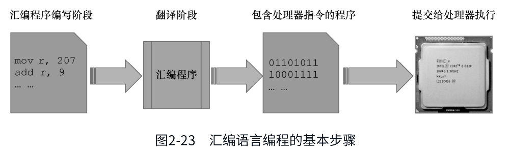

# 前言

在我看来，汇编语言不单是一门程序设计语言，学习汇编语言指令、掌握汇编语言程序设计的方法和技巧固然重要，但更重要的是，它是面向硬件的语言，天生是为了控制硬件的。因此，一本好的汇编语言教材一定不是单纯地介绍汇编语言本身，它必须是以如何控制处理器和其他外部硬件为主线的，在这个过程中引入汇编指令和硬件原理方面的内容，最终使读者对计算机工作原理的认识达到熟悉其脉络的程度。

以上就是创作本书的初衷。现在看来，这个目标基本上算是达成了。同时，我还有一个意外的收获，那就是，很多读者认为这本书有助于学习操作系统，认为它对理解操作系统非常有帮助，这也算是无心插柳吧。

为什么一本讲汇编语言的书反而成了操作系统课程的前导教材呢？其实仔细想想也不难理解。对于一台计算机来说，处理器是硬件的核心，而操作系统是软件的灵魂。因此，编写操作系统的人和设计处理器的人拥有共同的客户。为了拉住他们共同的客户，取得客户欢心，编写操作系统的人会给设计处理器的人提意见，告诉他们如何改进处理器的设计以方便操作系统和应用软件的开发。处理器的很多指令是为操作系统设计的，它的一些工作模式也是为了给操作系统提供支持，这一点在64位处理器上尤其明显。

# 第2章 计算机和汇编语言

汇编语言和处理器是紧密联系的，学习汇编语言的过程，实际上也是洞悉处理器内部构造和工作方式的过程。用汇编语言编程，必须和处理器内部的寄存器打交道，但很多人（包括我本人）在第一次接触汇编语言时，对这些东西感到很迷惑，不知道什么是寄存器，不理解为什么要使用寄存器。因此，了解处理器的内部构造及其工作方式很重要。

## 寄存器

一般的电路，它们的工作都是非常直接的。一旦我们拉起开关，切断电路，灯泡立马就不亮了，这表明电线上传送的是数字0；相反，一旦我们闭合开关，接通电路，灯泡立马就亮了，这表明电路上传送的是数字1。

后来，人们发明了一个装置，叫作触发器。如图2-5所示，一个特制的触发器有一个输入端D，以及一个输出端Q。触发器的特点是它可以把输入保存起来，这叫作锁存。如果你想用眼睛观察触发器锁存的内容，可以在输出端连接一个灯泡。

那么，触发器什么时候锁存呢？这是可以控制的。注意下面有一根导线和一个按键开关，按键开关和我们前边讲的那些开关不一样。按键开关有个特点：当你按下它时，它会接通电路；当你松手后，它又会弹起来断开电路。

这个按键开关用于决定是否锁存。平时，按键开关处于断开状态，触发器不会执行锁存动作，无论从输入端D来的是0还是1，都不会进入触发器内部，都不会被触发器内部的电路保存，更不会出现在输出端Q，即不影响输出端Q原来的状态。

但是，一旦我们按下按键开关，则触发器会立即执行一个锁存动作，不管输入端是0还是1，都会被触发器锁存起来，并立即出现在输出端Q。锁存之后，无论输入端D再怎么变化，都不会影响到锁存的内容，也不会影响输出端Q原来的输出，除非再次按下按键开关发送锁存命令。

一个触发器只能保存1比特。为了保存一个比较大的二进制数，如图2-6所示，可以使用若干个触发器，将它们组合在一起，这样就形成了一个新的器件，叫作寄存器(Register)，或者叫作锁存器。

寄存器是一个多输入、多输出的器件，它的两边都连着一排导线，左边的导线用来提供输入，右边的导线用来提供输出；下面的按键开关用来向组成寄存器的所有触发器发送锁存命令。

在图2-6中，输入端是二进制数字11000101。当我们按下按键开关时，这个数字立即被锁存。一旦输入的数字或者说电平被锁存，那么，即使这些输入撤销了也没有关系，因为它们已经被锁存在了寄存器内部。与此同时，锁存的数据也会通过输出端送出去。

如果需要，寄存器可以随时锁存新的数字，以前锁存的数字会被新的数字冲掉。从这个意义上来说，任何数字都是临时被保存在这里的，不会长久，属于临时性寄存。这就是“寄存器”一词的由来。

## 带寄存器的加法机

人类喜欢简单的操作，他们会不停地改进设备。所以，如图2-7所示，这是前面那个加法电路的改进版本。

在这个新的加法电路里，我们加入了一个寄存器。为了方便，我们称之为寄存器R。加法电路的左侧是一排带有开关的导线，用于输入相加的数字；右边的一排导线用于输出计算结果。实际上，在机器内部，右边这排导线连接在寄存器的输出端上。因此，寄存器R当前锁存的内容可以通过灯泡观察到。

加法电路的另一个变化是，它只有一组输入。这好像是个问题，但实际上这样做是很方便的。在这个电路的下面有两个按键开关，分别是“预置”和“相加”，它们就是用来解决这个问题的。比如说，如果我们要计算5加7加25，该怎么办呢？操作过程是这样的。

首先，拨动左边的一排开关，准备好第一个要相加的数字5，然后按一下“预置”按钮，将这个数字保存到寄存器R。

接着，再次拨动左侧的那排开关，准备好另一个要相加的数字7，然后按一下“相加”按钮。此时，左边的数字7和寄存器R里原有的数字5相加，相加的结果12依然保存在寄存器R中。

因为还有一个数字25需要相加，于是我们再次拨动左侧的那排开关，准备好要相加的数字25，准备好之后，按一下“相加”按钮，此时，左边的数字25和寄存器R里原有的数字12相加，相加的结果37依然保存在寄存器R中。

如果还有更多的数字要加，那么，操作过程和上面一样，反正就是准备数字，然后按一下“相加”开关。

## 能做四则运算的机器

前边我们一直在使用加法机做加法，有些人觉得，只做加法的话，功能太简单了。于是，如图2-8所示，他们改进了这个机器，为它增加了减法、乘法和除法功能。现在，我们称之为四则运算电路。

在这个四则运算电路的下边，有几个按键开关。这几个按键开关用来控制运算器内部的操作，下面我们分别进行说明。

如果按一下“预置”开关，那么，将执行锁存操作，左侧这排开关生成的二进制数被锁存到寄存器R。

如果按一下开关“加”，那么，它所指定的操作是用寄存器R里原有的数字和左侧这排开关生成的数字相加，相加的结果位于寄存器R。

如果按一下开关“减”，那么，它所指定的操作是用寄存器R里原有的数字和左侧这排开关所生成的数字相减，相减的结果位于寄存器R。

如果按一下开关“乘”，那么，它所指定的操作是用寄存器R里原有的数字和左侧这排开关所生成的数字相乘，相乘的结果位于寄存器R。

如果按一下开关“除”，那么，它所指定的操作是用寄存器R里原有的数字和左侧这排开关生成的数字相除，相除的商位于寄存器R。

当然，你会觉得功能还是太少。但是你要知道，绝大多数问题都可以归结为基本的加减乘除运算。比如，3的2次方，可以用3乘以3来完成。其他数学问题也是如此。

这个机器用起来还是很方便的，可以做连续的加减乘除运算。这里有一个实际应用的例子，先给出或者说预置一个数字7，再加8，得到15，然后乘以3，得到结果45，最后除以5，得到9。

首先，我们先拨动左边的开关准备好第一个数字7，然后按一下“预置”按钮，将这个数字保存到寄存器R。

接着，再拨动左侧的开关，准备好另一个数字8，按一下“加”按钮，则寄存器中原有的数字7和左边的数字8相加，相加的结果15依然保存在寄存器R中。

接着，再拨动左侧的开关，准备好另一个数字3，按一下“乘”按钮，则寄存器中原来的数字15和左边的数字3相乘，相乘的结果是45，依然保存在寄存器R中。

最后，再拨动左侧的开关，准备好数字5，按一下“除”按钮，则寄存器中原来的数字45和左边的数字5相除，相除的结果9依然保存在寄存器R中。

寄存器的作用是参与运算，并临时保存运算结果。但是，如果只有一个寄存器，那么，在进行一些复杂的运算时，肯定是不够用的。比如这一道带括号的计算题：(207+9)÷(56-48)

它很简单，但又有点复杂，因为我们必须先计算207+9和56-48的结果，再将这两个计算结果相除。我们来试试看。

首先拨动左侧的开关以生成数字207，然后按一下“预置”按钮，将207锁存到寄存器R中。接着，我们再拨动左侧的开关，生成数字9，然后按一下“加”按钮，这将把寄存器R里的数字207和左侧输入的数字9相加，相加的结果216依然保存在寄存器R中。

现在的问题是，寄存器R被用来保存上一个计算结果，无法再用来计算56减去48。在这种情况下，我们只能把相加的结果216用脑子或者笔记下来，腾出寄存器R，用来计算56减48。

拨动左侧的开关以生成数字56，再按一下“预置”按钮，将56锁存到寄存器R中。接着，我们再拨动左侧的开关，生成数字48，然后按一下“减”按钮，这将把寄存器R里的数字56和左侧的数字48相减，相减的结果8依然保存在寄存器R中。现在，用笔或者你的脑子把结果8记下来。

最后是把前面已经得到的两个中间结果216和8相除。拨动左侧的开关以生成数字216，再按一下“预置”按钮，将216锁存到寄存器R中。接着，我们再拨动左侧的开关，生成数字8，然后按一下“除”按钮，这将把寄存器R里的数字216和左侧的数字8相除，相除的结果27依然保存在寄存器R中。

## 机器指令

从刚才的例子可以看出，因为只有一个寄存器，这使得运算器的功能受到限制，操作也很麻烦。

为此，如图2-9所示，我们可以在运算电路里多放几个寄存器，这样就能够倒腾得过来。为了方便说明问题，我们暂时再加入一个寄存器Z，这样我们就有了两个寄存器。

尽管只是增加了一个寄存器，但是这台机器的操作却复杂了很多。比如，可以将左边的数字传送或者预置到寄存器R中，也可以传送到寄存器Z中；可以将寄存器R中的数字和左边来的数字做加减乘除，也可以将寄存器Z中的数字和外来的数字做加减乘除；可以将寄存器R中的数字传送或者说复制到寄存器Z中，也可以将寄存器Z中的数字传送或者说复制到寄存器R中；可以用寄存器R中的数字和寄存器Z中的数字做加减乘除操作，而且可以选择运算的结果保存在哪一个寄存器。

我粗略地估计了一下，这里共有大约20个动作。对于以上所列举的每个动作或者说每个操作，都需要一个按键开关来触发，所以至少需要20个按键开关。这还只是两个寄存器，如果以后再增加寄存器或者别的功能，开关就更多了。这不是长久之计，我们得另想办法。

考虑一下，既然我们可以用一排开关来生成参与加减乘除的数字，也可以用另一排开关来共同组合出我们要执行的操作。

为此，我们在运算电路的下面安装5个铡刀开关。和往常一样，开关的闭合代表这根线上是1，开关的断开代表这根线上是0，于是可以组合出一个5位的二进制数字。不同的二进制数字具有不同的含义，代表不同的操作。当我们拨动这一排开关时，就是指定这台机器所要执行的操作，因此，我们把这些开关所代表的数字叫作指令(Instruction)。指令就是给这台机器下达的操作命令。表2-1给出了这5个开关可以组合出的指令，以及它们所指定的操作。

那么，什么时候开始执行由开关所形成的指令呢？旁边还有一个按键开关，名字叫“执行”。当我们按下这个开关时，这台机器就按照指令的指示进行相应的操作。

比如，我们将这组开关设置成“开、开、开、关、关”的状态，当按一下“执行”开关时，将执行把寄存器R中的内容复制并传送到寄存器Z中的动作。

那么，现在我们就来用这台新机器计算数学题(207+9)÷(56-48)，看看这个操作过程是怎样的。

首先，拨动左边的开关以生成数字207，接着，拨动下面的“指令”开关，将它们设置成00001，意思是将外数传送到寄存器R中。此时，按一下“执行”开关，这将把左边的207锁存到寄存器R中。

接下来，拨动左边的开关以生成数字9，接着，拨动下面的“指令”开关，将它们设置成00101，意思是，将寄存器R中的数字和外数相加。此时，按一下“执行”开关，这将把寄存器R中的数字207和左边的数字9相加，相加的结果216依然在寄存器R中。

接下来，拨动左边的开关以生成数字56，接着，拨动下面的“指令”开关，将它们设置成00010，意思是，将外数传送到寄存器Z。此时，按一下“执行”开关，这将把左边56锁存到寄存器Z中。

再往下看，我们拨动左边的开关以生成数字48，接着，拨动下面的“指令”开关，将它们设置成01010，意思是，将寄存器Z中的数字和外数相减。此时，按一下“执行”开关，这将把56和48相减，相减的结果8依然在寄存器Z中。

最后，我们拨动下面的“指令”开关，将它们设置成10000，意思是，将寄存器R里的数字和寄存器Z里的数字相除。此时，按一下“执行”开关，这将用寄存器R中的数字216除以寄存器Z中的数字8，相除的商27保存在寄存器R中。

## 内存

通过拨动开关来形成指令，然后让运算器执行指令，这很有创意。但是，随着机器功能的增加，手工操作越来越烦琐，这是肯定的。

考虑一下，当我们拨动开关来组合指令时，和生成一个二进制数没有区别，只不过这些数字实际上是指令，用来指定某个操作。那么，能不能把这些代表指令的二进制数保存到某个容器里，让机器自动按顺序一条一条地取出来执行呢？没有问题，这完全可以。

如图2-10所示，在左边的容器里就保存着一堆代表指令的二进制数，右边的运算器可以一条一条地取出并加以执行。这样的容器，就是我们今天所要讲的内存。内存是由大量的内存单元堆叠而成的，在这里，组成内存的每一个方块都是一个内存单元。

和图2-10不同，在主流计算机的内存里，每个内存单元的长度是8比特，可以保存一个8位的二进制数。比如在图2-11中，最下面的那个内存单元，就存储了一个8比特的二进制数10000101。

内存单元很多，我们如何区分它们呢？答案是，每个内存单元都有一个唯一的编号。第一个单元的编号是0，第二个单元的编号是1，第三个单元的编号是2，后面的单元也依次编号。注意，单元的编号是这个单元在内存里的位置，通常称为地址(Address)。

既然内存是由大量的内存单元组成的，那么，如何指定读写的是哪个单元呢？为此，内存使用一排电线，称为地址线，来指定单元的编号。当我们访问某个内存单元时，就通过这排地址线输入单元的编号。显然，地址线的数量决定了我们最多可以访问几个单元。

比如说，如果内存只有两根地址线，这两根线只能组合出4个二进制数，分别是00、01、10和11。这4个二进制数代表着4个地址，因此，只能访问到4个单元。如果用十进制数来表示单元的编号，这几个单元的编号分别是0、1、2和3。

再举个例子，如图2-12所示，如果有8根地址线，那么，这8根地址线可以组合出256个二进制数，分别是00000000、00000001、00000010、…、11111111。这256个二进制数代表着256个地址。所以，8根地址线只能访问256个内存单元。

内存单元的编号就是它的地址，习惯上，我们用十六进制标注在它的左侧。这里，第一个内存单元的地址是00H，最后一个内存单元的地址是FFH。注意，为了整齐划一，地址0被标注为00，地址1被标注为01。这是可以的，在一个数字的前面加0，不会改变它的大小。

推而广之，如果地址线的数量是N，那么，可以通过它访问的内存单元的数量是2的N次方，即$2^N$。

在计算机领域，字节的概念被频繁地使用。习惯上，字节是用来描述二进制序列的长度单位，8比特组成1字节。字节的英语单词是Byte，简写为B。比如，二进制数10001101的长度是1字节；二进制数1101000101111110的长度是2字节。

在主流的计算机上，内存单元的长度是8比特。换句话说，每个内存单元的长度都是1字节。

内存的容量可以用内存单元的数量来统计。因为每个内存单元的长度是1字节，所以经常用字节数来衡量。根据内存的大小，内存的容量是以字节(B)、千字节(KB)、兆字节(MB)、吉字节(GB)和太字节(TB)来标称的，它们之间的换算关系是：

- 1 KB=1024 B；
- 1 MB=1024 KB；
- 1 GB=1024 MB；
- 1 TB=1024 GB。

内存用来保存或者读出数据。为此，如图2-13所示，内存上还需要另一排导线，这排导线叫作数据线。要写入的数据通过数据线进入内存；读出来的数据也通过数据线送到外面。

可以往内存里写数据，也可以从内存里读出数据，读和写统称为“访问”。为了访问内存，还需要一个读写控制线，用来指明是读操作还是写操作。举个例子来说，读写控制线平时没有输入，为0，表示处于随时可以读取的状态；如果它为1，则表明执行的是写入操作。

在写入的时候，我们先在地址线上给出一个地址，在数据线上给出一个要写入的数字，通过读写控制线发出写命令，内存就会把数据线上的数字写入指定的地址。

在读出时，先在地址线上给出一个地址，然后通过读写控制线发出读命令，那么，就会从指定的地址读出数据并送到数据线上。

举个例子来说，假定如图2-13所示的内存有16根地址线，那么，它可以访问65536个内存单元，地址范围是0000H～FFFFH。如果发出的地址是二进制数0000000000000110，那么，由于它等于十六进制的6，所以将选中内存中地址为6的单元。

再假定这个内存有8根数据线，通过数据线输入的是二进制数10001101，并且读写控制线的状态是写入(1)。那么，数据线上的10001101会被写入这个地址为6的单元。

读的时候也是一样，如果地址是6，读写控制线的状态是读(0)，那么，内存单元里的数字就会被送到数据线上。

内存是存储器（Storage或Memory）的一种，而存储器的种类实际上是很多的，包括大家都知道的硬盘和U盘等，甚至寄存器就是存储器的一种。如图2-14所示，我们这里所讲的内存也叫内存条。这个概念是这么来的：首先，它是计算机内部最主要的存储器，所以叫作内存储器或者主存储器，简称内存或主存；其次，它一般被设计成扁平的条状电路板，所以叫内存条。如果你曾经打开过家里的台式计算机，应该见过它。

在计算机发展的早期，也就是二十世纪五十年代，受技术限制，制造内存是非常不容易的事，人们使用了能够想到的各种方法，包括磁芯存储器，它用磁场来记录比特0和比特1。具体的原理，请参阅《穿越计算机的迷雾》这本书。

二十世纪七十年代，随着集成电路技术的发展，内存的制造技术也提高了，出现了集成电路存储器。这个时候的内存体积大大缩小，容量大大提高，但以现在的眼光来看还是很小，通常只有几千字节。

到了现在，随着大规模和超大规模集成电路的使用，内存在容量、体积方面都发生了翻天覆地的变化，可以提供几吉字节甚至几十吉字节的存储空间。

## 自动计算

在引入了内存之后，人们对运算器也做了改进。如图2-15所示，经过改进之后的运算器通过地址线、数据线和读/写控制线与内存相连，而且它现在的最大变化是可自主工作，可自动地从内存里面按顺序取指令并执行指令。

为了跟踪每条需要执行的指令，运算器内部有一个指令指针寄存器，这个寄存器保存着指令的地址。刚开始的时候，它的内容是第一条要执行的指令的内存地址。

当运算器开始工作时，它先将指令指针寄存器的内容送到地址线上，这是要执行的第一条指令的地址。然后，运算器通过读/写控制线发出读内存的命令。之后，内存将该地址上的内容放到数据线上。因为现在是取指令阶段，所以，运算器收到数据后，把它当成指令进行译码，然后根据指令的内容做相应的操作，也就是执行指令。

与此同时，指令指针寄存器的内容被修改，修改为下一条指令的地址。问题是，处理器怎么知道下一条指令的地址呢？答案是，它可以根据当前这条指令的地址和长度来计算下一条指令的地址。它怎么知道当前这条指令的长度呢？不同的指令具有不同的功能，也具有固定的长度。最后，在当前指令执行完成后，接着重复以上过程。

来看一个具体的例子。如图2-16所示，内存里已经写入了很多指令，这些指令共同组成了完成(207+9)÷(56-48)这道算术题的步骤和过程，所以叫作“程序”。

第一条指令占用2字节的内存空间，第1字节01101001，被称为操作码，它指定了要进行什么操作。对于这个操作码来说，它指定了所要进行操作是将操作码后面的数字传送到寄存器R中。

操作码后面的数字是11001111，也就是十进制的207。所以，这条指令执行时将207传送到寄存器R中。显然，在这条指令中，被操作的数字，也就是操作数，是直接包含在指令中的，是指令的组成部分。因此，这样的操作数被称为立即数(Immediate)，意思是它是直接包含在指令中的，可以立即从指令中得到。

第二条指令也是2字节，操作码是01001100，指定的操作是将寄存器R中的内容和操作码后面的数字相加，结果依然在寄存器R中。操作码后面的数字00001001，也就是十进制的9。所以，这条指令执行时将寄存器R中的内容和指令中的立即数9相加，结果依然在寄存器R中。

第三条指令也是2字节，操作码是01101010，指定的操作是将操作码后面的数字传送到寄存器Z中。操作码后面的数字00111000，也就是十进制的56。所以，这条指令执行时将指令中立即数56传送到寄存器Z中。

第四条指令也是2字节，操作码是01000100，指定的操作是将寄存器Z中的内容和操作码后面的数字相减，结果依然在寄存器Z里。操作码后面的数字00110000，也就是十进制的48。所以，这条指令执行时将寄存器Z中的内容和指令中的立即数48相减，结果依然在寄存器Z中。

第五条指令只有1字节，操作码是11001010，指定的操作是将寄存器R中的内容和寄存器Z中内容相除，相除的结果依然在寄存器R里。

第六条指令也是2字节，操作码是01110000，指定的操作是将寄存器R中的内容传送到由操作码后面的操作数所指定的内存地址处。操作码后面的数字是00001100，也就是十进制的12。对于当前的操作码来说，这个操作数是一个内存地址。因此，这条指令是将寄存器R中的内容传送到地址为12的内存单元。

地址为12的内存单元是左侧标注为0C的内存单元，因为地址是采用十六进制的，十六进制数0C就是十进制数12。因此，这条指令在执行时，操作数12被当成地址，处理器通过地址线发送给内存，然后把寄存器R中的内容传送到这个地址上的内存单元。

通过和前面的第一条指令进行比较，很容易分清指令中的“立即数”是什么意思。指令执行和操作的对象是数。如果这个数已经在指令中给出了，不需要再次访问内存，那这个数就是立即数，比如第一条指令中的207；相反，如果指令中给出的是地址，真正的数还需要用这个地址访问内存才能得到，那它就不能称为立即数，比如这条指令中的12，它只是一个地址，并不是最终要操作的数字，最终要操作的数字还需要用这个地址再次访问内存才能得到。

运算器一旦开启，它就自动取指令和执行指令。在内存中，有些内容并不是指令。比如在这里，从内存地址0C开始，后面的内容都不是指令。但是，机器在工作时，你插不上手，不可能在它恰好执行到最后一条指令时让它停下来。

因此，最好的办法就是设计一条停机指令，让运算器执行这条指令后自动停止工作并保持停止前状态。在这里，我们的最后一条指令是停机指令，它只有1字节的长度，操作码是11110100。当运算器执行这条指令后，停止工作，我们可以从容地检查程序的执行结果。

## 处理器

以上，我们从加法机讲到全自动的运算器。运算器功能有限，经过一代又一代的反复改进后，它就变成我们现在所说的处理器(Processor)，一些老的图书和教材把它叫作中央处理单元或者干脆称为CPU。

处理器是一台电子计算机的核心，它会在振荡器脉冲的激励下，从内存中获取指令，并发起一系列由该指令所定义的操作。当这些操作结束后，它接着再取下一条指令。在通常情况下，这个过程是连续不断、循环往复的。大体上，如图2-17所示，处理器由总线接口部件、控制部件和指令执行部件组成。

总线接口部件负责同外部的地址线和数据线进行连接，发送地址信号给内存或者其他外部设备，和内存或者其他外部设备交换（发送或者接受）数据，等等。

指令执行部件负责执行指令，它包含了很多寄存器，这些寄存器用于参与算术逻辑运算，并临时保存运算结果。指令执行部件的核心是算术逻辑部件(Arithmetic Logic Unit, ALU)，算术运算和逻辑运算在这里进行。

控制部件负责协调和控制整个处理器的运行状态，什么时候取指令，什么时候输出地址，什么时候发送数据，什么时候接收数据，什么时候执行指令，都由它负责协调。

1947年，美国贝尔实验室的肖克利和同事们一起发明了晶体管。1958年，也许是受够了在一大堆晶体管里连接那些杂乱无章的导线，另一个美国人杰克·基尔比发明了集成电路。接着，1971年，在为日本人设计计算器过程中，INTEL的弗德里科·法金灵机一动，他想，能不能把运算功能和控制功能集成到一起，设计一款可以自动取指令并执行指令的芯片呢？于是他发明了第一款处理器INTEL 4004，如图2-18所示。

紧接着，INTEL又推出了8088和划时代的产品8086。4004是4位的处理器，8008是8位的处理器，而8086是16位的处理器。

8086是一款划时代的产品，应用非常广泛。虽然INTEL的处理器越来越先进，但它的x86系列一直保持对8086的兼容性。在本书的前半部分，我们主要针对8086进行讲解。

那么，处理器的位数是什么意思呢？4位的处理器拥有4位的寄存器和算术逻辑部件；8位的处理器拥有8位的寄存器和算术逻辑部件；16位的处理器拥有16位的寄存器和算术逻辑部件；32位的处理器拥有32位的寄存器和算术逻辑部件；64位的处理器拥有64位的寄存器和算术逻辑部件。可以肯定的是，位数越多，寄存器就可以保存更大的数字，算术逻辑部件就可以在单次计算中使用更大的数字并产生更大的结果。

在8086之后，INTEL又生产了80286和80386。80386又是一款划时代的产品，深刻地影响了后续的处理器设计。本书的后半部分是以80386为基础讲解的。

在后来的岁月里，INTEL又推出了更多型号的处理器，这些处理器根据应用领域的不同，发展出多个分支来。图2-19中的这一款处理器名字叫i3-3220，左边是它的正面，右边是它的反面。这些密密麻麻的圆点是它的引脚，用来连接地址线、数据线和读/写控制线。

处理器的工作是自动取指令并执行指令。对于任何一款处理器来说，它可以识别哪些指令，是在设计和制造的时候就已经决定了的。**任何一款处理器，它可以识别的所有指令的集合，叫作这款处理器的指令集。**

几十年前，处理器的指令集很小，通常只有十几种或者几十种指令。随着技术的发展，处理器的功能大大增强了，指令集也扩展了。现在的处理器，指令集可以包含几百甚至上千种指令。

**对于任何一款处理器来说，它所包含的指令都可以分为以下几种：算术运算指令、逻辑运算指令、数据传送指令和处理器状态控制指令。**

算术运算指令和逻辑运算指令是最基本的，也最容易理解。数据传送指令在处理器内部的寄存器之间、处理器和内存之间、处理器和外围设备之间传送数据。这些外围设备包括我们常见的显示设备、存储设备（如硬盘）、打印机、鼠标、键盘等。通过和外部设备的数据交换，计算机的功能也变得丰富起来。比如，我们现在可以在显示器上显示文本和图形，于是产生了Windows和Linux这样的操作系统，可以使用键盘输入文字，进一步地，我们可以用计算机写文档、聊天、购物、玩游戏、看视频。

处理器状态控制指令用于控制处理器内部的工作模式和运行状态，如电源管理、程序的权限管理等。本书后面所要讲的保护模式，也是由这些指令来切换的。

## 汇编语言的诞生

我们说过，在内存里写入一些代表特定操作的二进制数（或者说指令），这个过程叫作编程(Programming)。为了给计算机编程，人们最早用的是开关和跳线。

如图2-20所示，(a)是用开关编程的机器；(b)是用跳线编程的机器。一排开关代表一个二进制数或者指令，每个开关代表这个二进制数或者指令的某比特，开关的断开与闭合代表着该比特是0还是1，跳线也是如此。

紧接着，为了方便，人们发明了纸带和纸带阅读机，图2-20(c)就是纸带的一个片段。纸带就是一卷长长的纸条，人们在纸带上打孔，有孔和无孔代表1和0。编写程序时，人们将指令的二进制形式打成孔，然后由纸带阅读机转换成二进制写入内存，最后由处理器执行。处理器执行的结果也可以在纸带上打孔来呈现。

图2-21显示了一个典型的场景：我们在Windows操作系统上的文本编辑器里用键盘输入文本，并且看起来好像在用二进制编程。如果这真的是在用二进制编程，那么，这将是非常抽象、非常痛苦的，难以理解，容易出错。

为了减轻程序员的负担，人们发明了汇编语言(Assembly Language)。汇编语言使用文本符号来代表处理器指令，由于和人类的自然语言比较接近，所以很容易看懂，也很容易书写。如图2-22所示，这是在Windows操作系统上用文本编辑器编写汇编语言程序。

其中`mov r,207`意思是把指令中的立即数207传送到寄存器r中；`add r,9`意思是用寄存器r中的数字和指令中的立即数9相加，结果回送到寄存器r中；`mov z,56`意思是把指令中的立即数56传送到寄存器z中；`sub z,48`意思是用寄存器z中的数字和指令中的立即数48相减，结果回送到寄存器z中；`div r,z`意思是用寄存器r中的数字除以寄存器z中的数字，商回送到寄存器r；`mov [12],r`意思是，将寄存器r中的数字传送到地址为12的内存单元里去；`hlt`意思是停机。

用汇编语言书写的程序只是一些文本和符号，我们人类能看懂，但处理器是不可能看懂的。为此，需要把汇编语言程序转换为包含了处理器指令的程序。

如图2-23所示，这个转换过程是由一个汇编程序来进行的。汇编程序也是人类编写的程序。可以想到，世界上第一个汇编程序肯定是用处理器指令编写的。

汇编程序执行翻译过程，将汇编语言程序转换为包含了处理器指令的程序，也就是将文本符号转换为二进制的机器指令，转换后的结果是一个包含了处理器指令的程序，这个程序可以提交给处理器执行。

在后面的章节中，我们将看到这个从编写到翻译，再到执行的过程是怎样一步一步地进行的，当然，我们的重点依然是在汇编语言和指令上。

# 第3章 分段机制和逻辑地址

鉴于汇编语言和处理器之间的紧密关系，学习汇编语言的过程，实际上也是洞悉处理器内部构造和工作方式的过程。

在本章中，我们要借助一款早已淘汰的处理器INTEL 8086来了解x86汇编语言编程的基本环境。不要小看这款处理器，它是整个INTEL x86处理器家族的起点和基础。

## 寄存器和字长

为什么处理器能够自动计算，这个问题已经在第2章里做了介绍。处理器的工作依赖其内部的寄存器。早期的处理器，它的寄存器只能保存4比特、8比特或16比特，分别叫作4位、8位和16位寄存器。现在的处理器，寄存器一般都是32位、64位甚至更多。

如图3-1所示，8位寄存器可以容纳8比特，或者说1字节。为了方便，我们还要为该字节的每一位编上号，编号是从右往左进行的，从0开始，分别是0、1、2、3、4、5、6、7。在这里，位0（第1位）是最低位，在最右边；位7（第8位）是最高位，在最左边。

为了更好地理解上面这些概念，图3-1假定8位寄存器里存放的是二进制数10001101，即十六进制的8D。这时，它的最低位和最高位都是1。

在第2章里我们提到了处理器的位数，它是指寄存器和算术逻辑部件的数据宽度，这个宽度也叫作处理器的字长。因此，8位处理器、16位处理器、32位处理器和64位处理器的字长也分别是8位、16位、32位和64位。

16位寄存器可以存放2字节，这称为1个字(word)，各个比特的编号分别是0～15，其中0～7是低字节，8～15是高字节。

32位寄存器可以存放4字节，这称为1个双字(double word)，各个数位的编号分别是0～31，其中，0～15是低字，16～31是高字。

尽管图中没有画出，但是64位寄存器可以容纳更多的比特，也就是8字节，或者4个字，简称四字(quad word)。位数越多，寄存器所能保存的数越大，这是显而易见的。

## 内存访问和字节序

如图3-2所示，和寄存器不同，内存用于保存更多的比特。对于用得最多的个人计算机来说，内存按字节来组织，单次访问的最小单位是1字节，这是最基本的存储单元。如图3-2所示，每个存储单元中，各位的编号分别是0～7。

内存中的每字节都对应着一个地址，如图3-2所示，第1字节的地址是0000H，第2字节的地址是0001H，第3字节的地址是0002H，其他依次类推。注意，图中采用的是十六进制表示法。作为一个例子，因为这个内存的容量是65536字节，所以最后一字节的地址是FFFFH。

为了访问内存，处理器需要给出一个地址。访问包括读和写，为此，处理器还要指明，本次访问是读还是写。如果是写，还要给出待写入的数据。

处理器在工作时，需要在内存和寄存器之间交换数据。尽管内存的最小组成单位是字节，但是，经过精心的设计和安排，它能够按字节、字、双字和四字进行访问。换句话说，仅通过单次访问就能处理8位、16位、32位或者64位的二进制数。注意，这里说的是单次访问，而不是一个一个地取出各字节，然后加以组合。

如图3-2所示，处理器发出字长控制信号，以指示本次访问的字长是8、16、32还是64。如果字长是8，而且给出的地址是0002H，那么，本次访问只会影响到内存的1字节；如果字长是16，给出的地址依然是0002H，那么实际访问的将是地址0002H处的一个字。对于INTEL处理器来说，如果访问内存中的一个字，那么，它规定高字节位于高地址部分，低字节位于低地址部分，这称为低端字节序(Little Endian)。因此，低8位在0002H中，高8位在0003H中。至于其他公司的处理器，则可能情况正好相反，称为高端字节序。

## 古老的INTEL 8086处理器

任何时候，一旦提到INTEL公司的处理器，就不能不说8086。8086是INTEL公司第一款16位处理器，诞生于1978年，所以说它很古老。但是，在INTEL公司的所有处理器中，它占有很重要的地位，是整个INTEL 32位架构处理器(IA-32)的开山鼻祖。

首先，最重要的一点是，它是一款非常成功的产品，设计先进，功能很强，卖得很好。

其次，8086的成功使得市场上出现了大量针对它开发的软件产品。这样，当INTEL公司要设计新的处理器时，它不得不考虑兼容性的问题。要使得老的软件也能在新的处理器上很好地运行，必须要具备指令集和工作模式上的兼容性和一致性。INTEL公司很清楚，如果新处理器和老处理器不兼容，那么，新处理器越多，它扔掉的拥趸也就越多，要不了多久，这公司就不用再开了。

所以，当我们讲述处理器的时候，必须要从8086开始；另外，要学习汇编语言，针对8086的汇编技术也是必不可少的。

### 8086的通用寄存器

如图3-3所示，8086处理器内部有8个16位的通用寄存器，都是由16比特组成的，并分别被命名为AX、BX、CX、DX、SI、DI、BP、SP。“通用”的意思是，它们之中的大部分都可以根据需要用于多种目的。

因为这8个寄存器都是16位的，所以通常用于进行16位的操作。比如，可以在这8个寄存器之间互相传送数据，它们之间也可以进行算术逻辑运算；也可以在它们和内存单元之间进行16位的数据传送或者算术逻辑运算。

同时，如图3-3所示，这8个寄存器中的前4个，即AX、BX、CX和DX，又各自可以拆分成两个8位的寄存器来使用，总共可以提供8个8位的寄存器AH、AL、BH、BL、CH、CL、DH和DL。这样一来，当需要在寄存器和寄存器之间，或者寄存器和内存单元之间进行8位的数据传送或者算术逻辑运算时，使用它们就很方便。

将一个16位的寄存器当成两个8位的寄存器来用时，对其中一个8位寄存器的操作不会影响到另一个8位寄存器。举个例子来说，当你操作寄存器AL时，不会影响到AH中的内容。

如图3-3所示，以寄存器AX为例，它可以分成两个独立的寄存器AH和AL。寄存器AX有16比特，但是，位0到位7这8比特属于寄存器AL；位8到位15这8比特属于寄存器AH。因此，我们说，寄存器AH是寄存器AX的高字节部分；寄存器AL是寄存器AX的低字节部分。同时，寄存器AX的内容也是由寄存器AH的内容和寄存器AL的内容组合而成的。

如果寄存器AH的内容是00111110(3EH)，寄存器AL的内容是00101111(2FH)，那么，寄存器AX的内容就是0011111000101111(3E2FH)。

接着，如果我们改变了寄存器AH的内容，将它修改成00000000(00H)，那么，这对寄存器AL没有任何影响，还是00101111(2FH)。但是，寄存器AX的内容也跟着改变，变成0000000000101111(002FH)。

最后，如果我们改变了寄存器AL的内容，将它修改成01011010(5AH)，那么，这对寄存器AH没有任何影响，还是00000000(00H)，但是寄存器AX的值也跟着改变，变成0000000001011010(005AH)。

### 程序的重定位难题

我们知道，处理器的设计者用某些数字来指示处理器所进行的操作，这些数字代表指令，或者叫机器指令，因为只有处理器才认得它们。指令是集中存放在内存里的，一条接着一条，处理器的工作是自动按顺序取出并加以执行。处理器内部有寄存器和算术逻辑部件，还有控制器部件，控制器部件“分析”一条条指令，然后确定在哪个时间点让哪些部件进行工作。

对于INTEL x86处理器来说，指令的长度不定，短的指令仅有1字节，而长的指令则有可能达到15字节。在内存中，指令和非指令的普通二进制数是一模一样的，在组成内存的电路中，都是一些高、低电平的组合。因为处理器是自动按顺序取指令并加以执行的，在指令中混杂了非指令的数据会导致处理器不能正常工作。为此，指令和数据要分开存放，分别位于内存中的不同区域，或者说各自形成一个段(Segment)，分别叫代码段和数据段。

注意，我们并没有改变内存的物理性质，并不是真的把它分成几块。段的划分是逻辑上的，从本质上来说，是如何看待和组织内存中的数据。

段在内存中的位置并不重要，因为处理器是可控的，我们可以让它从内存的任何位置开始取指令并加以执行。这里有一个例子，如图3-4所示，我们有一大堆数字，现在想把它们加起来求出总和。

假定我们有16个数要相加，这些数都是16位的二进制数，分别是0005H、00A0H、00FFH、…。为了让处理器把它们加起来，我们应该先在内存中定义一个数据段，将这些数字写进去。数据段可以起始于内存中的任何位置，既然如此，我们将它定在0100H处。这样一来，第一个要加的数位于地址0100H，第二个要加的数位于地址0102H，最后一个数的地址是011EH。

一旦定义了数据段，我们就知道了每个数的内存地址。然后，紧挨着数据段，我们从内存地址0120H处定义代码段。严格地说，数据段和代码段是不需要连续的，但这里把它们挨在一起更自然一些。为了区别数据段和代码段，我们使用了不同的底色。

代码段是从内存地址0120H处开始的，第一条指令是A1 00 01。其中，A1是操作码，意思是从指定的内存地址处取出一个字，传送到寄存器AX；后面的00 01是采用低端字节序存放的数字0100H，代表一个内存地址。所以这条指令的功能是将内存单元0100H里的字传送到寄存器AX。指令执行后，AX的内容为0005H。

第二条指令是03 06 02 01，其中，03 06是操作码，02 01是采用低端字节序存放的数字0102H，这条指令的功能是将AX中的内容和内存单元0102H里的字相加，结果在AX中。由于AX的内容为0005H，而内存地址0102H里的数是00A0H，这条指令执行后，AX的内容为00A5H。

第三条指令是03 06 04 01，其中，03 06是操作码，04 01是采用低端字节序存放的数字0104H，这条指令的功能是将AX中的内容和内存单元0104H里的字相加，结果在AX中。此时，由于AX里的内容是00A5H，内存地址0104H里的数是00FFH，本指令执行后，AX的内容为01A4H。

后面的指令没有列出，但和前2条指令相似，依次用AX的内容和下一个内存单元里的字相加，一直到最后，在AX中得到总的累加和。在这个例子中，我们没有考虑寄存器AX容纳不下结果的情况。当累加的总和超出了AX所能表示的数的范围（最大为FFFFH，即十进制的65535）时，就会产生进位，但这个进位被丢弃。

在内存中定义了数据段和代码段之后，我们就可以命令处理器从内存地址0120H处开始执行。当所有的指令执行完后，就能在寄存器AX中得到最后的结果。看起来没有什么问题，一切都很完美，不是吗？那本节标题中所说的难题又从何而来呢？

这里确实有一个难题。

在前面的例子中，所有在执行时需要访问内存单元的指令，使用的都是真实的内存地址。比如A1 00 01，这条指令的意思是从地址为0100H的内存单元里取出一个字，并传送到寄存器AX中。这里，0100H是一个真实的内存地址，又称物理地址。

整个程序（包括代码段和数据段）在内存中的位置，是由我们自己定的。我们把数据段定在0100H，把代码段定在0120H。

问题是，大多数时候，整个程序（包括代码段和数据段）在内存中的位置并不是我们能够决定的。请想一想你平时是怎么使用计算机的，你所用的程序，包括那些用来调整计算机性能的工具、小游戏、音乐和视频播放器等，都是从网上下载的，位于你的硬盘、U盘或光盘中。即使有些程序是你自己编写的，那又如何？当你双击它们的图标，使它们在Windows里启动之前，内存已经被塞了很多东西，就算你是刚刚打开计算机，Windows自己已经占用了很多内存空间，不然的话，你怎么可能在它上面操作呢？

在这种情况下，你所运行的程序，在内存中被加载的位置是完全随机的，哪里有空闲的地方，它就会被加载到哪里，并从那里开始被处理器执行。所以，前面那段程序不可能恰好如你所愿，被加载到内存地址0100H，它完全可能被加载到另一个不同的位置，如1000H。但是，同样是那个程序，一旦它在内存中的位置发生了改变，灾难就出现了。

如图3-5所示，因为程序现在是从内存地址1000H处被加载的，所以，数据段的起始地址为1000H。这就是说，第一个要加的数，其地址为1000H，第二个则为1002H，其他依次类推。代码段依然紧挨着数据段之后，起始地址相应地是1020H。

只要所有的指令都是连续存放的，代码段位于内存中的什么地方都可以正常执行。所以，处理器可以按你的要求，从内存地址1020H处连续执行，但结果完全不是你想要的。

请看第一条指令A1 00 01，它的意思是从内存地址0100H处取得一个字，将其传送到寄存器AX中。但是，由于程序刚刚改变了位置，它要取的那个数，现在实际上位于1000H，它取的是别人地盘里的数！

这能怪谁呢？发生这样的事情，是因为我们在指令中使用了绝对内存地址（物理地址），这样的程序是无法重定位的。为了让你写的程序在卖给别人之后，可以在内存中的任何地方正确执行，就只能在编写程序的时候使用相对地址或者逻辑地址，而不能使用真实的物理地址。当加载程序时，这些相对地址还要根据程序实际被加载的位置重新计算。

在任何时候，程序的重定位都是非常棘手的事情。当然，也有好几种解决的办法。在8086处理器上，这个问题特别容易解决，因为该处理器在访问内存时使用的是段地址和偏移地址，也就是逻辑地址，而不是物理地址。

### 逻辑地址

从传统的视角来看，内存的组织是线性的，是一个由大量内存单元组成的序列，就像长长的纸条。每个内存单元都有自己的物理地址，它是相对于内存起始处的绝对位置。但是请想象一下，如果我们把内存从逻辑上划分为若干部分，也就是分成段，会怎样呢？

如图3-6所示，根据需要，段可以开始于内存中的任何位置，比如图中的内存地址A532H处，这个起始地址就是段地址。

段的长度不是固定的。图3-6中的这个段包含了6个存储单元。在分段之前，这些单元在整个内存空间里的物理地址分别是A532H、A533H、A534H、A535H、A536H、A537H。但是，在分段之后，它们的地址可以只相对于自己所在的段。这样，它们相对于段开始处的距离分别为0、1、2、3、4、5，这叫作段内偏移，或者叫偏移地址。

于是，当采用分段策略之后，一个内存单元的地址实际上就可以用“段:偏移”或者“段地址:偏移地址”来表示，这就是通常所说的逻辑地址。比如，在图3-6中，段内第1个存储单元的地址为A532H:0000H，第3个存储单元的地址为A532H:0002H，而本段最后一个存储单元的地址是A532H:0005H。

为了在硬件一级提供对“段地址:偏移地址”内存访问模式的支持，处理器至少要提供两个段寄存器，分别是代码段寄存器(Code Segment, CS)和数据段寄存器(Data Segment, DS)。

对代码段寄存器CS的改变将导致处理器从新的代码段开始执行。同样，在开始访问内存中的数据之前，也必须首先设置好数据段寄存器DS，使之指向数据段。

除此之外，最重要的是，当处理器访问内存时，它把指令中指定的内存地址看成段内的偏移地址，而不是物理地址。这样，一旦处理器遇到一条访问内存的指令，它将把DS中的数据段起始地址和指令中提供的段内偏移相加，来得到访问内存所需要的物理地址。

如图3-7所示，代码段的段地址为1020H，数据段的段地址为1000H。在代码段中有一条指令A1 02 00，它的功能是将地址0002H处的一个字传送到寄存器AX中。在这里，处理器将0002H看成段内的偏移地址，段地址在DS中，应该在执行这条指令之前就已经用别的指令传送到DS中了。

当执行指令A1 02 00时，处理器将把DS中的内容和指令中指定的偏移地址0002H相加，得到1002H。这是一个物理地址，处理器用它来访问内存，就可以得到所需要的数00A0H。

如果下次执行这个程序时，代码段和数据段在内存中的位置发生了变化，只要把它们的段地址分别传送到CS和DS，它也能够正确执行。

### 8086的内存分段机制

前面讲了如何从逻辑地址转换到物理地址，以使程序的运行和它在内存中的位置无关。这种策略在很多处理器中得到了支持，包括8086处理器。但是，由于8086自身的局限性，它的做法还要复杂一些。

如图3-8所示，8086内部有8个16位的通用寄存器，分别是AX、BX、CX、DX、SI、DI、BP、SP。其中，前4个寄存器中的每个寄存器都还可以当成2个8位的寄存器来使用，分别是AH、AL、BH、BL、CH、CL、DH、DL。

在进行数据传送或者算术逻辑运算的时候，使用算术逻辑部件(ALU)。比如，将AX的内容和CX的内容相加，结果仍在AX中，那么，在相加的结果返回到AX之前，需要通过一个叫数据暂存器的寄存器中转。

处理器能够自动运行，这是控制器的功劳。为了加快指令执行速度，8086内部有一个6字节的指令预取队列，在处理器忙着执行那些不需要访问内存的指令时，指令预取部件可以趁机访问内存预取指令。这时，多达6字节的指令流可以排队等待解码和执行。

8086内部有4个段寄存器。其中，CS是代码段寄存器，DS是数据段寄存器，ES是附加段(Extra Segment)寄存器。附加段的意思是，它是额外赠送的礼物，当需要在程序中同时使用两个数据段时，DS指向一个，ES指向另一个。可以在指令中指定使用DS和ES中的哪一个，如果没有指定，则默认使用DS。SS是栈段(Stack Segment)寄存器，以后会讲到，而且非常重要。

IP是指令指针(Instruction Pointer)寄存器，它只和CS一起使用，而且只有处理器才能直接改变它的内容。当一段代码开始执行时，CS保存代码段的段地址，IP则指向段内偏移。这样，由CS和IP共同形成逻辑地址，并由总线接口部件变换成物理地址来取得指令。然后，处理器会自动根据当前指令的长度来改变IP的值，使它指向下一条指令。

当然，如果在指令的执行过程中需要访问内存单元，那么，处理器将用DS的值和指令中提供的偏移地址相加，来形成访问内存所需的物理地址。

8086的段寄存器和IP寄存器都是16位的，如果按照原先的方式，把段寄存器的内容和偏移地址直接相加来形成物理地址的话，也只能得到16位的物理地址。麻烦的是，8086却提供了20根地址线。换句话说，它提供的是20位的物理地址。

提供20根地址线的原因很简单，16位的物理地址只能访问64KB的内存，地址范围是0000H～FFFFH，共65536字节。这样的容量，即使在那个年代，也显得捉襟见肘。

所以，65536字节就是64KB，而20位的物理地址则可以访问多达1MB的内存，地址范围从00000H到FFFFFH。问题是，16位的段地址和16位的偏移地址相加，只能形成16位的物理地址，怎么得到这20位的物理地址呢？

有些内存地址的十六进制形式是以0结尾的，如00000H、00010H、00010H、00020H、A0000H、FFFF0H等。如果我们将这些地址末尾的0去掉，剩下的部分就可以放到段寄存器里了，将来恢复段的物理地址时，只需要添加一个0就可以了。

给定一个以0结尾的内存地址，如3C7F0H，将它末尾的0去掉，剩下一个16位的部分3C7FH，这相当于将段的物理地址除以16(10H)，也相当于将这个地址的二进制形式整体右移4位。

将3C7F0H除以16，得到一个十六进制的结果3C7FH，这很容易理解。至于右移4位，是这样的：3C7F0H的二进制形式为00111100011111110000，右移4位的意思是将所有比特同时向右移动4次。移动之后，最右边的4比特被挤掉，结果是一个16位的二进制数0011110001111111，换算成十六进制是3C7FH。

显然，在8086系统中，由于段寄存器长度的限制，段不能起始于任意位置，也不是所有内存地址都可以作为段地址，段只能起始于那些能够被16整除的物理内存地址。对8086处理器来说，将这样的内存地址除以16或者右移4位，得到的结果就是逻辑段地址，简称段地址。要访问一个段，需要将段地址传送到段寄存器。

反过来，在用段寄存器的内容访问内存时，只需要在其十六进制形式的内容后面加0，就可以还原到原先的20位物理地址，这相当于乘以16，或者左移4位。如果段地址是3C7FH，它的二进制形式为0011110001111111。左移4位的意思是将所有比特同时向左移动4次，右边空出来的位置用4个0填充。因此，结果是一个16位的二进制数00111100011111110000，换算成十六进制是3C7F0H，这就是段的物理地址。

处理器访问内存时，光有段地址不行，还需要有偏移地址，它们共同组成了逻辑地址，而且处理器的总线接口部件负责把逻辑地址转换为物理地址。8086处理器在形成物理地址时，先将段寄存器的内容乘以16或者左移4位，形成20位的段地址，然后再同16位的偏移地址相加，得到20位的物理地址。比如，对于逻辑地址F000H:052DH，处理器在形成物理地址时，将段地址F000H左移4位，变成F0000H，再加上偏移地址052DH，就形成了20位的物理地址F052DH。

这样，因为段寄存器是16位的，在段不重叠的情况下，最多可以将1MB的内存分成65536个段，段地址分别是0000H、0001H、0002H、0003H，…，FFFFH。在这种情况下，如图3-9所示，每个段正好16字节，偏移地址从0000H到000FH。

同样在不允许段之间重叠的情况下，每个段的最大长度是64KB，因为偏移地址也是16位的，从0000H到FFFFH。在这种情况下，1MB的内存，最多只能划分成16个段，每段长64KB，段地址分别是0000H、1000H、2000H、3000H，…，F000H。

以上所说的只是两种最典型的情况。在通常情况下，段地址的选择取决于内存中哪些区域是空闲的。举个例子来说，假如从物理地址00000H开始，一直到82251H处都被其他程序占用着，而后面一直到FFFFFH的地址空间都是自由的，那么，你可以从物理内存地址82251H之后的地方加载你的程序。

接着，你的任务是定义段地址并设置处理器的段寄存器，其中最重要的是段地址的选取。因为偏移地址总是要求从0000H开始，而82260H是第一个符合该条件的物理地址，它恰好对应着逻辑地址8226H:0000H，符合偏移地址的条件，所以完全可以将段地址定为8226H。

但是，举个例子来说，如果你从物理内存地址82255H处加载程序，由于它根本无法表示成一个偏移地址为0000H的逻辑地址，所以不符合要求，段不能从这里开始划分。这里面的区别在于，82260H可以被16(10H)整除，而82255H不能。通过这个例子可以看出，8086处理器的逻辑分段，起始地址都是16的倍数，这称为是按16字节对齐的。

段的划分是自由的，它可以起始于任何16字节对齐的内存地址，也可以是任意长度，只要不超过64KB。比如，段可以起始于物理地址82260H，段的长度可以是3字节（此时，该段所对应的逻辑地址范围是8226H:0000H～8226H:0002H，对应的物理地址范围是82260H～82262H）、2KB（此时，该段所对应的逻辑地址范围是8226H:0000H～8226H:07FFH，对应的物理地址范围是82260H～82A5FH），甚至最多可以达到64KB（此时，该段所对应的逻辑地址范围是8226H:0000H～8226H:FFFFH，对应的物理地址范围是82260H～9225FH）。

同时，正是由于段的划分非常自由，使得8086的内存访问也非常随意。同一个物理地址，或者同一片内存区域，根据需要，可以随意指定一个段来访问它，前提是那个物理地址位于该段的64KB范围内。也就是说，同一个物理地址，实际上对应多个逻辑地址。比如说，对于一个物理地址C0533H，它可以用逻辑地址C053H:0003H来表示，也可以用逻辑地址C000H:0530H来表示，还可以用逻辑地址C050H:0030H来表示，甚至用逻辑地址BFFFH:0540H来表示，等等。

如图3-10所示，对于上述的各种表示方法，实际上说明我们认为物理地址C0533H位于不同的段中，段地址分别为C053H、C050H、C000H和BFFFH。

# 第4章 汇编语言和汇编软件

## 汇编语言程序

## NASM编译器

# 第5章 虚拟机的安装和使用

## 计算机的启动过程

## 创建和使用虚拟机

# 第6章 编写主引导扇区代码

# 第7章 相同的功能，不同的代码

# 第8章 比高斯更快的计算

# 第9章 硬盘和显卡的访问与控制

# 第10章 中断和动态时钟显示

# 第11章 32位X86处理器编程架构

# 第12章 进入保护模式

# 第13章 操作数和有效地址的尺寸

# 第14章 存储器的保护

# 第15章 程序的动态加载和执行

# 第16章 任务和特权级保护

# 第17章 协同式任务切换

# 第18章 中断和异常的处理与抢占式多任务

# 第19章 分页机制和动态页面分配

# 第20章 平坦内存模型和软件任务切换