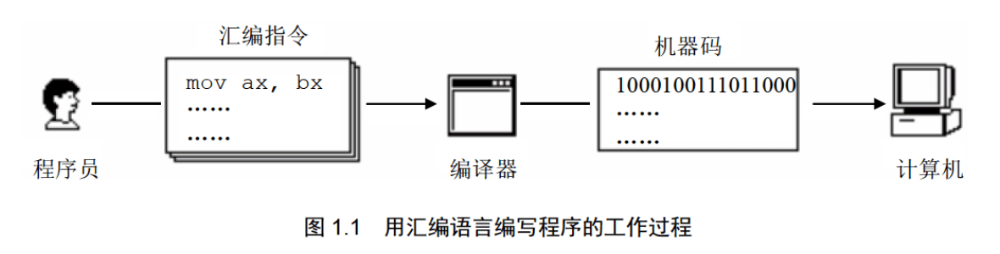
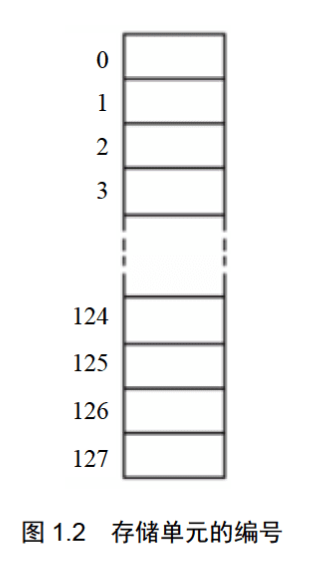
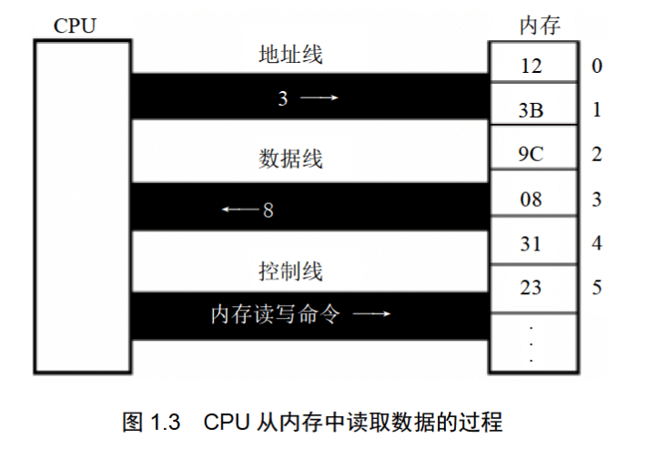
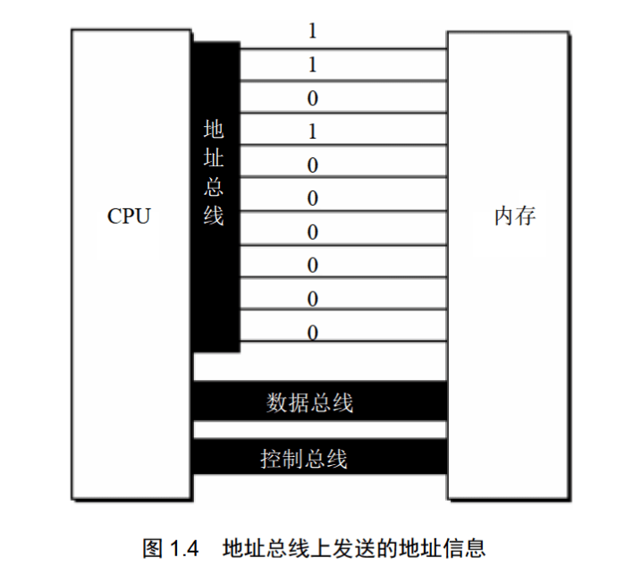
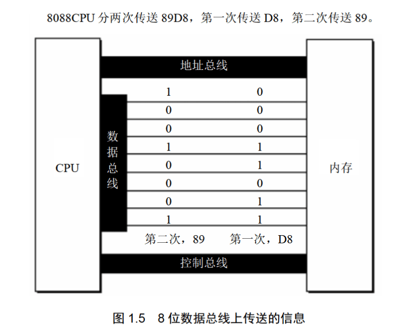
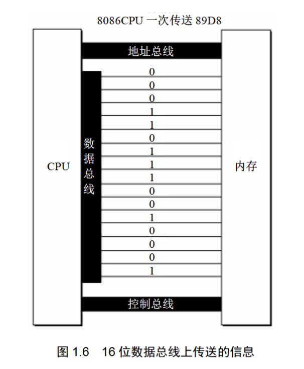
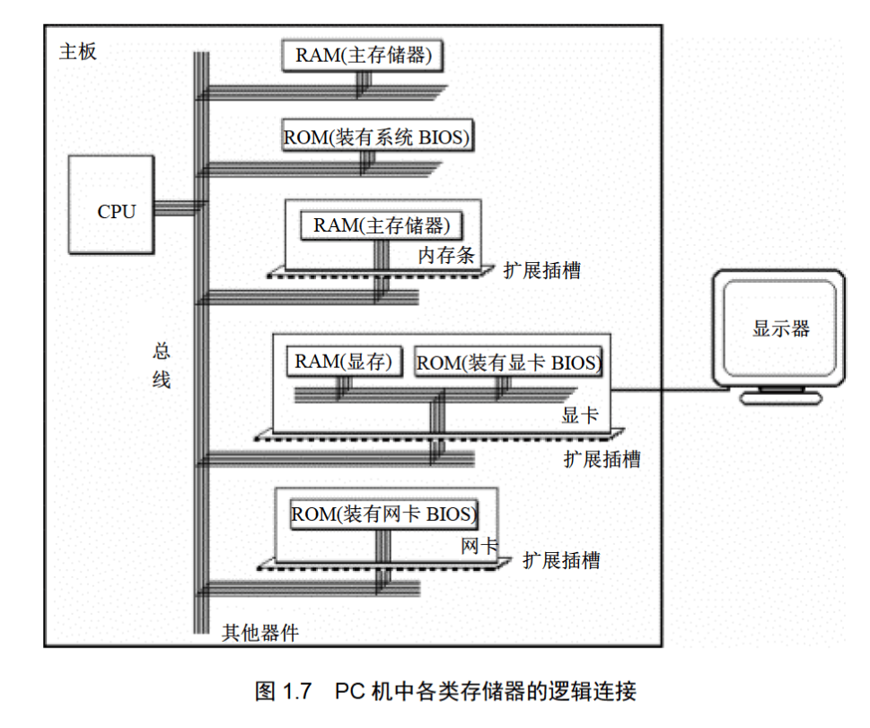
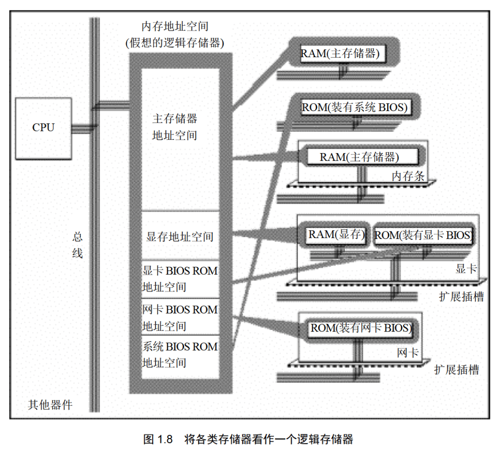
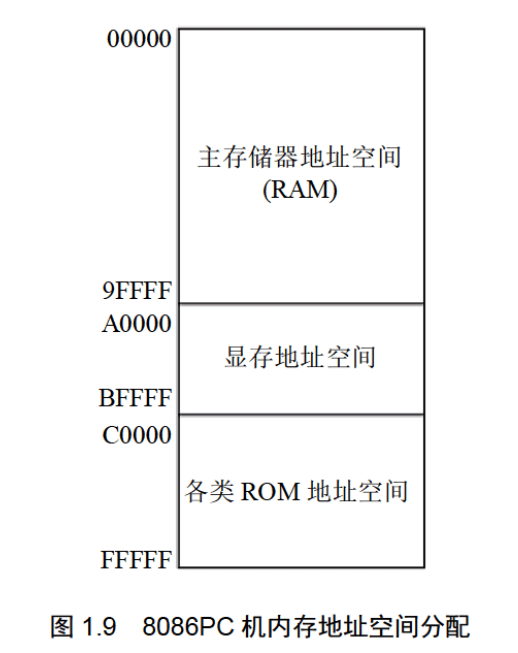

# 第1章 基础知识  

汇编语言是直接在硬件之上工作的编程语言，我们首先要了解硬件系统的结构，才能有效地应用汇编语言对其编程。在本章中，我们对硬件系统结构的问题进行一部分的探讨，以使后续的课程可在一个好的基础上进行。当课程进行到需要补充新的基础知识(关于编程结构或其他的)的时候，再对相关的基础知识进行介绍和探讨。我们的原则是，以后用到的知识，以后再说。

在汇编课程中我们不对硬件系统进行全面和深入的研究，这不在课程的范围之内。关于 PC 机及 CPU 物理结构和编程结构的全面研究，在《微机原理与接口》中进行；对于计算机一般的结构、功能、性能的研究在一门称为《组成原理》的理论层次更高的课程中进行。汇编课程的研究重点放在如何利用硬件系统的编程结构和指令集有效灵活地控制系统进行工作。  


## 1.1 机器语言

说到汇编语言的产生，首先要讲一下机器语言。机器语言是机器指令的集合。机器指令展开来讲就是一台机器可以正确执行的命令。电子计算机的机器指令是一列二进制数字。计算机将之转变为一列高低电平，以使计算机的电子器件受到驱动，进行运算。

上面所说的计算机指的是可以执行机器指令，进行运算的机器。这是早期计算机的概念。现在，在我们常用的 PC 机中，有一个芯片来完成上面所说的计算机的功能。这个芯片就是我们常说的 CPU(Central Processing Unit，中央处理单元)，CPU 是一种微处理器。以后我们提到的计算机是指由 CPU 和其他受 CPU 直接或间接控制的芯片、器件、设备组成的计算机系统，比如我们最常见的 PC 机。

每一种微处理器，由于硬件设计和内部结构的不同，就需要用不同的电平脉冲来控制，使它工作。所以每一种微处理器都有自己的机器指令集，也就是机器语言。

早期的程序设计均使用机器语言。程序员们将用 0、1 数字编成的程序代码打在纸带或卡片上，1 打孔，0 不打孔，再将程序通过纸带机或卡片机输入计算机，进行运算。

应用 8086CPU 完成运算 `s=768+12288-1280`，机器码如下 ：

```
101110000000000000000011
000001010000000000110000
001011010000000000000101
```

假如将程序错写成以下这样，请你找出错误。  

```
101100000000000000000011
000001010000000000110000
000101101000000000000101
```

书写和阅读机器码程序不是一件简单的工作，要记住所有抽象的二进制码。上面只是一个非常简单的小程序，就暴露了机器码的晦涩难懂和不易查错。写如此小的一个程序尚且如此，实际上一个有用的程序至少要有几十行机器码，那么，情况将怎么样呢?

在显示器上输出“welcome to masm”，机器码如下：  

```
00011110
101110000000000000000000
01010000
101110001100011000001111
1000111011011000
1011010000000110
1011000000000000
1011011100000111
101110010000000000000000
1011011000011000
1011001001001111
1100110100010000
1011010000000010
1011011100000000
1011011000000000
1011001000000000
1100110100010000
1011010000001001
10001101000101100010101000000000
1100110100100001
1011010000001010
10001101000101100011000100000000
1100110100100001
1011010000000110
1011000000010100
1011011100011001
1011010100001011
1011000100010011
1011011000001101
1011001000111100
1100110100010000
1011010000000010
1011011100000000
1011000000001100
1011001000010100
1100110100010000
1011010000001001
10001101000101100000000000000000
1100110100100001
11001011
```

看到这样的程序，你有什么感想？如果程序里有一个“1”被误写为“0”，又如何去查找呢?  


## 1.2 汇编语言的产生

早期的程序员们很快就发现了使用机器语言带来的麻烦，它是如此难于辨别和记忆，给整个产业的发展带来了障碍。于是汇编语言产生了。

汇编语言的主体是汇编指令。汇编指令和机器指令的差别在于指令的表示方法上。汇编指令是机器指令便于记忆的书写格式。

例如：机器指令 1000100111011000 表示把寄存器 BX 的内容送到 AX 中。汇编指令则写成 `mov ax,bx`。这样的写法与人类语言接近，便于阅读和记忆。  

- 操作：寄存器 BX 的内容送到 AX 中
- 机器指令：1000100111011000
- 汇编指令：mov ax,bx  

(寄存器，简单地讲是 CPU 中可以存储数据的器件，一个 CPU 中有多个寄存器。AX 是其中一个寄存器的代号，BX 是另一个寄存器的代号。更详细的内容我们在以后的课程中将会讲到。)

此后，程序员们就用汇编指令编写源程序。可是，计算机能读懂的只有机器指令，那么如何让计算机执行程序员用汇编指令编写的程序呢？这时，就需要有一个能够将汇编指令转换成机器指令的翻译程序，这样的程序我们称其为编译器。程序员用汇编语言写出源程序，再用汇编编译器将其编译为机器码，由计算机最终执行。图1.1描述了这个工作过程。  




## 1.3 汇编语言的组成

汇编语言发展至今，有以下3类指令组成。

1. 汇编指令：机器码的助记符，有对应的机器码。
2. 伪指令：没有对应的机器码，由编译器执行，计算机并不执行。
3. 其他符号：如 +、一、*、/ 等，由编译器识别，没有对应的机器码。

汇编语言的核心是汇编指令，它决定了汇编语言的特性。  


## 1.4 存储器

CPU 是计算机的核心部件，它控制整个计算机的运作并进行运算。要想让一个 CPU 工作，就必须向它提供指令和数据。指令和数据在存储器中存放，也就是我们平时所说的内存。在一台 PC 机中内存的作用仅次于 CPU。离开了内存，性能再好的 CPU 也无法工作。这就像再聪明的大脑，没有了记忆也无法进行思考。磁盘不同于内存，磁盘上的数据或程序如果不读到内存中，就无法被 CPU 使用。要灵活地利用汇编语言编程，我们首先要了解 CPU 是如何从内存中读取信息，以及向内存中写入信息的。  


## 1.5 指令和数据

指令和数据是应用上的概念。在内存或磁盘上，指令和数据没有任何区别，都是二进制信息。CPU 在工作的时候把有的信息看作指令，有的信息看作数据，为同样的信息赋予了不同的意义。就像围棋的棋子，在棋盒里的时候没有任何区别，在对弈的时候就有了不同的意义。

例如，内存中的二进制信息 1000100111011000，计算机可以把它看作大小为 89D8H 的数据来处理，也可以将其看作指令 `mov ax,bx` 来执行。  

```
1000100111011000 -> 89D8H(数据)
1000100111011000 -> mov ax,bx(程序)
```


## 1.6 存储单元

存储器被划分成若干个存储单元，每个存储单元从 0 开始顺序编号，例如一个存储器有 128 个存储单元，编号从
0～127，如图 1.2 所示。



那么一个存储单元能存储多少信息呢？我们知道电子计算机的最小信息单位是 bit (音译为比特)，也就是一个二进制
位。8个 bit 组成一个 Byte，也就是通常讲的一个字节。微型机存储器的存储单元可以存储一个 Byte，即 8 个二进制位。一个存储器有 128 个存储单元，它可以存储 128 个 Byte。  

微机存储器的容量是以字节为最小单位来计算的。对于拥有 128 个存储单元的存储器，我们可以说，它的容量是
128 个字节。  

对于大容量的存储器一般还用以下单位来计量容量 (以下用B来代表 Byte):  

```
1KB=1024B 1MB=1024KB 1GB=1024MB 1TB=1024GB
```

磁盘的容量单位同内存的一样，实际上以上单位是微机中常用的计量单位。  


## 1.7 CPU对存储器的读写

以上讲到，存储器被划分成多个存储单元，存储单元从零开始顺序编号。这些编号可以看作存储单元在存储器中的地址。就像一条街，每个房子都有门牌号码。

CPU 要从内存中读数据，首先要指定存储单元的地址。也就是说它要先确定它要读取哪一个存储单元中的数据。就像在一条街上找人，先要确定他住在哪个房子里。

另外，在一台微机中，不只有存储器这一种器件。CPU 在读写数据时还要指明，它要对哪一个器件进行操作，进行哪种操作，是从中读出数据，还是向里面写入数据。

可见，CPU要想进行数据的读写，必须和外部器件(标准的说法是芯片)进行下面3类信息的交互。  

- 存储单元的地址(地址信息)；
- 器件的选择，读或写的命令(控制信息)；
- 读或写的数据(数据信息)  。

那么 CPU 是通过什么将地址、数据和控制信息传到存储器芯片中的呢？电子计算机能处理、传输的信息都是电信号，电信号当然要用导线传送。在计算机中专门有连接 CPU 和其他芯片的导线，通常称为总线。总线从物理上来讲，就是一根根导线的集合。根据传送信息的不同，总线从逻辑上又分为3类，地址总线、控制总线和数据总线。

CPU 从3号单元中读取数据的过程(见图1.3)如下。  



1. CPU 通过地址线将地址信息 3 发出。
2. CPU 通过控制线发出内存读命令，选中存储器芯片，并通知它，将要从中读取数据。  
3. 存储器将 3 号单元中的数据 8 通过数据线送入CPU。


写操作与读操作的步骤相似。如向 3 号单元写入数据 26。

1. CPU通过地址线将地址信息 3 发出。
2. CPU 通过控制线发出内存写命令，选中存储器芯片，并通知它，要向其中写入数据。
3. CPU 通过数据线将数据 26 送入内存的 3 号单元中。

从上面我们知道了 CPU 是如何进行数据读写的。可是，如何命令计算机进行数据的读写呢?

要让一个计算机或微处理器工作，应向它输入能够驱动它进行工作的电平信息(机器码)。对于 8086CPU，下面的机器码，能够完成从 3 号单元读数据。  

机器码：	101000010000001100000000
含义：		从 3 号单元读取数据送入寄存器 AX


CPU 接收这条机器码后将完成我们上面所述的读写工作。机器码难于记忆，用汇编指令来表示，情况如下。

机器码： 					10100001 00000011 00000000
对应的汇编指令：	    MOV AX,[3]
含义： 						传送 3 号单元的内容入 AX  


## 1.8 地址总线

现在我们知道，CPU 是通过地址总线来指定存储器单元的。可见地址总线上能传送多少个不同的信息，CPU 就可以对多少个存储单元进行寻址。

现假设，一个 CPU 有 10 根地址总线，让我们来看一下它的寻址情况。我们知道，在电子计算机中，一根导线可以传送的稳定状态只有两种，高电平或是低电平。用二进制表示就是 1 或 0，10 根导线可以传送 10 位二进制数据。而10位二进制数可以表示多少个不同的数据呢？2 的 10 次方个。最小数为 0，最大数为 1023。

图1.4展示了一个具有 10 根地址线的 CPU 向内存发出地址信息 11 时 10 根地址线上传送的二进制信息。考虑一下，访问地址为 12、13、14 等的内存单元时，地址总线上传送的内容是什么?

一个 CPU 有 N 根地址线，则可以说这个 CPU 的地址总线的宽度为 N。这样的 CPU 最多可以寻找 2 的 N 次方个内存单元。  




## 1.9 数据总线

CPU 与内存或其他器件之间的数据传送是通过数据总线来进行的。数据总线的宽度决定了 CPU 和外界的数据传送速度。8 根数据总线一次可传送一个 8 位二进制数据(即一个字节)。16 根数据总线一次可传送两个字节。

8088CPU 的数据总线宽度为8，8086CPU 的数据总线宽度为16。我们来分别看一下它们向内存中写入数据 89D8H时，是如何通过数据总线传送数据的。图1.5展示了 8088CPU 数据总线上的数据传送情况；图1.6展示了 8086CPU 数据总线上的数据传送情况。  





8086 有 16 根数据线，可一次传送 16 位数据，所以可一次传送数据 89D8H；而 8088 只有 8 根数据线，一次只能传 8 位数据，所以向内存写入数据 89D8H 时需要进行两次数据传送。  


## 1.10 控制总线

CPU 对外部器件的控制是通过控制总线来进行的。在这里控制总线是个总称，控制总线是一些不同控制线的集合。有多少根控制总线，就意味着 CPU 提供了对外部器件的多少种控制。所以，控制总线的宽度决定了 CPU 对外部器件的控制能力。

前面所讲的内存读或写命令是由几根控制线综合发出的，其中有一根称为“读信号输出”的控制线负责由 CPU 向外传送读信号，CPU 向该控制线上输出低电平表示将要读取数据；有一根称为“写信号输出”的控制线则负责传送写信号。  


## 1.11 内存地址空间(概述)

什么是内存地址空间呢？举例来讲，一个 CPU 的地址总线宽度为 10，那么可以寻址 1024 个内存单元，这 1024 个可寻到的内存单元就构成这个 CPU 的内存地址空间。后面进行深入讨论。首先需要介绍两部分基本知识，主板和接口卡。


## 1.12 主 板

在每一台 PC 机中，都有一个主板，主板上有核心器件和一些主要器件，这些器件通过总线(地址总线、数据总线、控制总线)相连。这些器件有 CPU、存储器、外围芯片组、扩展插槽等。扩展插槽上一般插有 RAM 内存条和各类接口卡。  


## 1.13 接口卡

计算机系统中，所有可用程序控制其工作的设备，必须受到 CPU 的控制。CPU 对外部设备都不能直接控制，如显示器、音箱、打印机等。直接控制这些设备进行工作的是插在扩展插槽上的接口卡。扩展插槽通过总线和 CPU 相连，所以接口卡也通过总线同 CPU 相连。CPU 可以直接控制这些接口卡，从而实现 CPU 对外设的间接控制。简单地讲，就是 CPU 通过总线向接口卡发送命令，接口卡根据 CPU 的命令控制外设进行工作。  


## 1.14 各类存储器芯片

一台 PC 机中，装有多个存储器芯片，这些存储器芯片从物理连接上看是独立的、不同的器件。从读写属性上看分为两类：随机存储器(RAM)和只读存储器(ROM)。随机存储器可读可写，但必须带电存储，关机后存储的内容丢失；只读存储器只能读取不能写入，关机后其中的内容不丢失。这些存储器从功能和连接上又可分为以下几类。

● 随机存储器
用于存放供 CPU 使用的绝大部分程序和数据，主随机存储器一般由两个位置上
的RAM组成，装在主板上的RAM和插在扩展插槽上的RAM。
● 装有BIOS(Basic Input/Output System,基本输入/输出系统)的ROM
BIOS 是由主板和各类接口卡(如显卡、网卡等)厂商提供的软件系统，可以通过
它利用该硬件设备进行最基本的输入输出。在主板和某些接口卡上插有存储相应
BIOS 的 ROM。例如，主板上的 ROM 中存储着主板的 BIOS(通常称为系统
BIOS);显卡上的 ROM 中存储着显卡的 BIOS;如果网卡上装有 ROM,那其中
就可以存储网卡的 BIOS。
● 接口卡上的RAM
某些接口卡需要对大批量输入、输出数据进行暂时存储，在其上装有 RAM。最
典型的是显示卡上的 RAM,一般称为显存。显示卡随时将显存中的数据向显示
器上输出。换句话说，我们将需要显示的内容写入显存，就会出现在显示器上。

图1.7展示了PC系统中各类存储器的逻辑连接情况。  



## 1.15 内存地址空间

上述的那些存储器，在物理上是独立的器件，但是在以下两点上相同。
● 都和CPU的总线相连。
● CPU对它们进行读或写的时候都通过控制线发出内存读写命令。

这也就是说，CPU 在操控它们的时候，把它们都当作内存来对待，把它们总的看作
一个由若干存储单元组成的逻辑存储器，这个逻辑存储器就是我们所说的内存地址空间。
在汇编这门课中，我们所面对的是内存地址空间。

图1.8展示了CPU将系统中各类存储器看作一个逻辑存储器的情况。  



在图 1.8 中，所有的物理存储器被看作一个由若干存储单元组成的逻辑存储器，每个
物理存储器在这个逻辑存储器中占有一个地址段，即一段地址空间。CPU 在这段地址空
间中读写数据，实际上就是在相对应的物理存储器中读写数据。  

假设，图1.8中的内存地址空间的地址段分配如下。
地址0~7FFFH的32KB空间为主随机存储器的地址空间；
地址 8000H~9FFFH的8KB空间为显存地址空间；
地址 A000H~FFFFH的24KB空间为各个ROM的地址空间。

这样，CPU 向内存地址为 1000H 的内存单元中写入数据，这个数据就被写入主随机
存储器中；CPU 向内存地址为 8000H 的内存单元中写入数据，这个数据就被写入显存
中，然后会被显卡输出到显示器上；CPU 向内存地址为 C000H 的内存单元中写入数据的
操作是没有结果的，C000H单元中的内容不会被改变，C000H单元实际上就是ROM存储
器中的一个单元  

内存地址空间的大小受CPU地址总线宽度的限制。8086CPU的地址总线宽度为20,可以传送 2^20个不同的地址信息(大小从 0至 2^20-1)。即可以定位 220个内存单元，则8086PC的内存地址空间大小为1MB。同理，80386CPU的地址总线宽度为32,则内存地址空间最大为4GB。

我们在基于一个计算机硬件系统编程的时候，必须知道这个系统中的内存地址空间分
配情况。因为当我们想在某类存储器中读写数据的时候，必须知道它的第一个单元的地址
和最后一个单元的地址，才能保证读写操作是在预期的存储器中进行。比如，我们希望向
显示器输出一段信息，那么必须将这段信息写到显存中，显卡才能将它输出到显示器上。
要向显存中写入数据，必须知道显存在内存地址空间中的地址。

不同的计算机系统的内存地址空间的分配情况是不同的，图1.9展示了 8086PC 机内存地址空间分配的基本情况  



图1.9告诉我们，从地址0~9FFFF 的内存单元中读取数据，实际上就是在读取主随机 存储器中的数据；向地址 A0000~BFFFF 的内存单元中写数据，就是向显存中写入数据，
这些数据会被显示卡输出到显示器上；我们向地址 C0000~FFFFF 的内存单元中写入数据
的操作是无效的，因为这等于改写只读存储器中的内容  

> 内存地址空间
> 最终运行程序的是CPU,我们用汇编语言编程的时候，必须要从CPU的角度考虑问题。对CPU来
> 讲，系统中的所有存储器中的存储单元都处于一个统一的逻辑存储器中，它的容量受CPU寻址能力的限
> 制。这个逻辑存储器即是我们所说的内存地址空间。
> 对于初学者，这个概念比较抽象，我们在后续的课程中将通过一些编程实践，来增加感性认识。  


