# 第2章 寄存器

一个典型的 CPU(此处讨论的不是某一具体的CPU)由运算器、控制器、寄存器(CPU工作原理)等器件构成，这些器件靠内部总线相连。前一章所说的总线，相对于CPU内部来说是外部总线。内部总线实现CPU内部各个器件之间的联系，外部总线实现CPU和主板上其他器件的联系。简单地说，在CPU中：

- 运算器进行信息处理；
- 寄存器进行信息存储；
- 控制器控制各种器件进行工作；
- 内部总线连接各种器件，在它们之间进行数据的传送。

对于一个汇编程序员来说，CPU 中的主要部件是寄存器。寄存器是CPU 中程序员可以用指令读写的部件。程序员通过改变各种寄存器中的内容来实现对CPU的控制。

不同的CPU,寄存器的个数、结构是不相同的。8086CPU有14个寄存器，每个寄存器有一个名称。这些寄存器是：AX、BX、CX、DX、SI、DI、SP、BP、IP、CS、SS、DS、ES、PSW。我们不对这些寄存器进行一次性的介绍，在课程的进行中，需要用到哪些寄存器，再介绍哪些寄存器。  

## 2.1 通用寄存器

8086CPU的所有寄存器都是16 位的，可以存放两个字节。AX、BX、CX、DX 这4个寄存器通常用来存放一般性的数据，被称为通用寄存器。

以 AX为例，寄存器的逻辑结构如图2.1所示。  

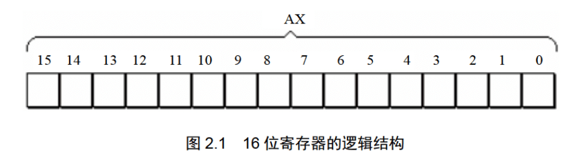

一个16位寄存器可以存储一个16位的数据，数据在寄存器中的存放情况如图2.2所示。

想一想，一个16位寄存器所能存储的数据的最大值为多少?

8086CPU 的上一代 CPU 中的寄存器都是 8 位的，为了保证兼容，使原来基于上代CPU编写的程序稍加修改就可以运行在 8086之上，8086CPU的 AX、BX、CX、DX这4个寄存器都可分为两个可独立使用的8位寄存器来用：  

- X可分为AH和 AL;
- BX可分为BH和 BL;
- CX可分为CH和CL;
- DX可分为DH和 DL。  

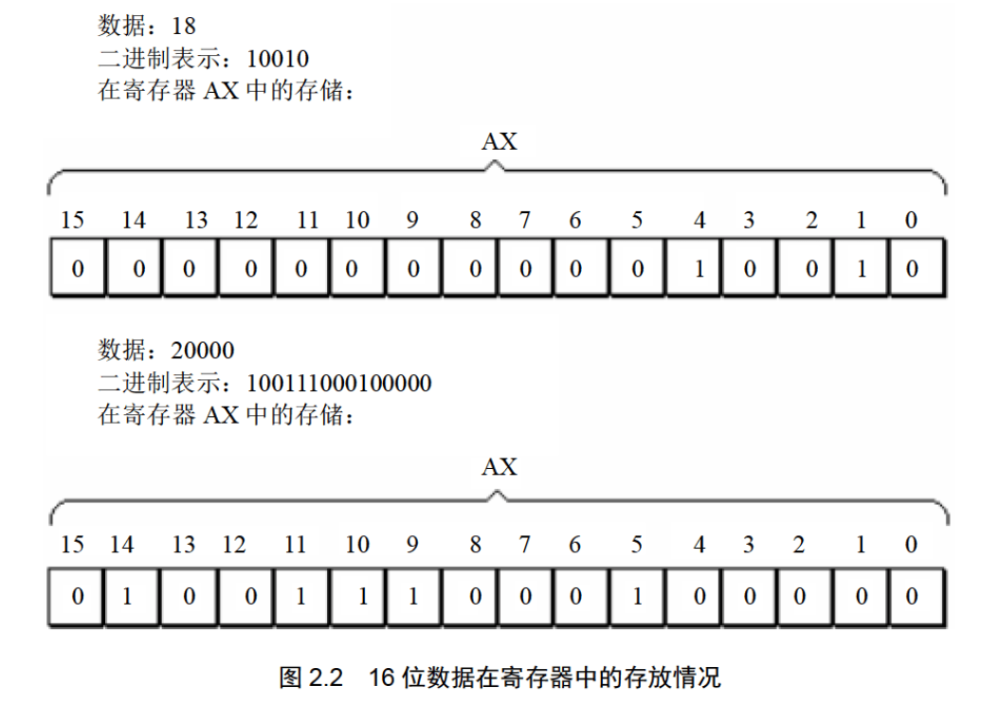

以 AX为例，8086CPU的16位寄存器分为两个8位寄存器的情况如图2.3所示。  

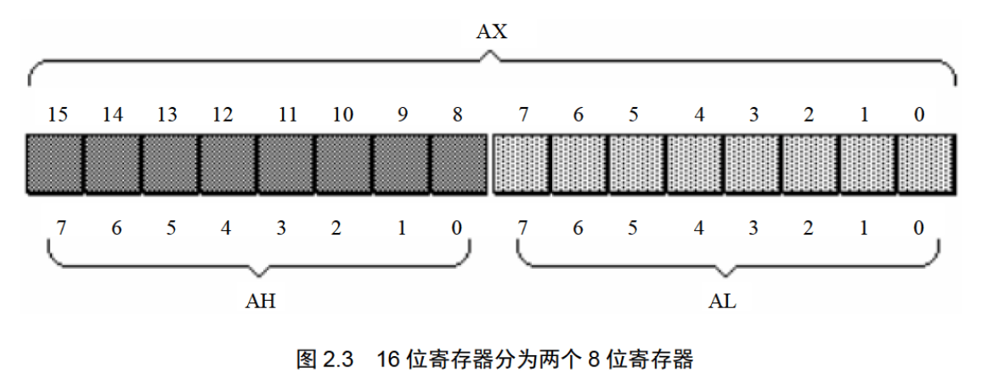

AX的低 8位(0位~7位)构成了AL 寄存器，高8位(8位~15位)构成了AH 寄存器。AH和AL 寄存器是可以独立使用的8位寄存器。图2.4展示了16位寄存器及它所分成的两个8位寄存器的数据存储的情况。

想一想，一个8位寄存器所能存储的数据的最大值为多少?  

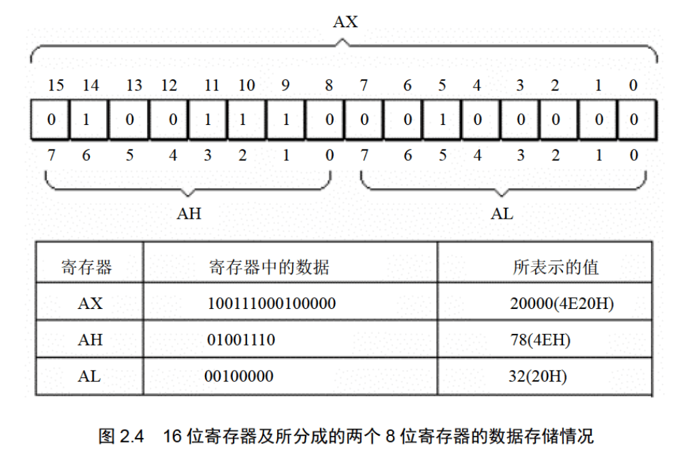

## 2.2 字在寄存器中的存储

出于对兼容性的考虑，8086CPU可以一次性处理以下两种尺寸的数据。
● 字节：记为 byte,一个字节由8个bit组成，可以存在8位寄存器中。
● 字：记为 word,一个字由两个字节组成，这两个字节分别称为这个字的高位字
节和低位字节，如图2.5所示。  

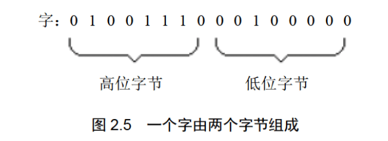

一个字可以存在一个16 位寄存器中，这个字的高位字节和低位字节自然就存在这个
寄存器的高8位寄存器和低8位寄存器中。如图 2.4 所示，一个字型数据 20000,存在
AX寄存器中，在 AH中存储了它的高8位，在AL中存储了它的低8位。AH和 AL中的
数据，既可以看成是一个字型数据的高8位和低 8位，这个字型数据的大小是20000;又
可以看成是两个独立的字节型数据，它们的大小分别是78 和32。  

关于数制的讨论
任何数据，到了计算机中都是以二进制的形式存放的。为了描述不同的问题，又经常将它们用其他
的进制来表示。比如图2.4 中寄存器 AX 中的数据是0100111000100000,这就是 AX中的信息本身，可
以用不同的逻辑意义来看待它。可以将它看作一个数值，大小是20000。  

当然，二进制数 0100111000100000本身也可表示一个数值的大小，但人类习惯的是十进制，用十进
制20000表示可以使我们直观地感受到这个数值的大小。
十六进制数的一位相当于二进制数的四位，如 0100111000100000 可表示成：4(0100)、E(1110)、
2(0010)、0(0000)四位十六进制数。
一个内存单元可存放8位数据，CPU 中的寄存器又可存放n个8位的数据。也就是说，计算机中的
数据大多是由1~N个8位数据构成的。很多时候，需要直观地看出组成数据的各个字节数据的值，用十
六进制来表示数据可以直观地看出这个数据是由哪些8位数据构成的。比如 20000写成4E20就可以直观
地看出，这个数据是由4E和20两个8位数据构成的，如果 AX中存放 4E20,则AH里是4E,AL里
是20。这种表示方法便于许多问题的直观分析。在以后的课程中，我们多用十六进制来表示一个数据。
在以后的课程中，为了区分不同的进制，在十六进制表示的数据的后面加 H,在二进制表示的数据
后面加 B,十进制表示的数据后面什么也不加。如：可用3种不同的进制表示图2.4中AX里的数据，十
进制：20000,十六进制：4E20H,二进制：0100111000100000B。  


## 2.3 几条汇编指令

通过汇编指令控制CPU进行工作，看一下表2.1中的几条指令  

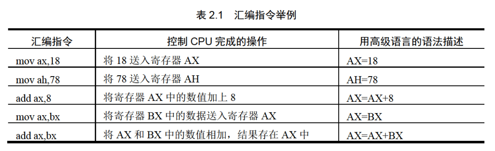

注意，为了使具有高级语言基础的读者更好地理解指令的含义，有时会用文字描述和高
级语言描述这两种方式来描述一条汇编指令的含义。在写一条汇编指令或一个寄存器的名
称时不区分大小写。如：mov ax,18和MOV AX,18的含义相同；bx和 BX的含义相同。
接下来看一下 CPU 执行表 2.2 中所列的程序段中的每条指令后，对寄存器中的数据
进行的改变  


问题2.1
指令执行后AX中的数据为多少?思考后看分析。
分析：
程序段中的最后一条指令 add ax,bx,在执行前ax和bx中的数据都为8226H,相加后
所得的值为：1044CH,但是 ax为16 位寄存器，只能存放 4位十六进制的数据，所以最
高位的1不能在ax 中保存，ax 中的数据为：044CH。
表2.3中所列的一段程序的执行情况。  

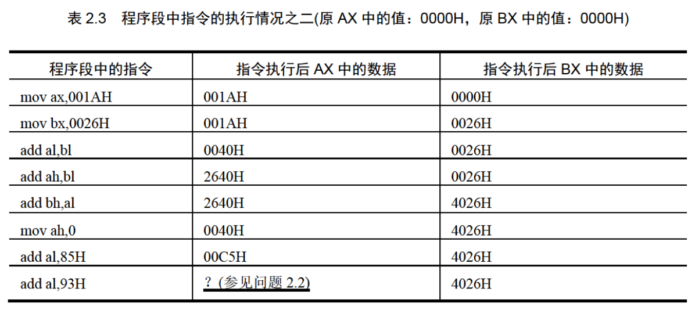

问题2.2
指令执行后AX中的数据为多少?思考后看分析。
分析：
程序段中的最后一条指令 add al,93H,在执行前，al中的数据为C5H,相加后所得的
值为：158H,但是 al为 8位寄存器，只能存放两位十六进制的数据，所以最高位的1丢
失，ax 中的数据为：0058H。(这里的丢失，指的是进位值不能在 8 位寄存器中保存，但
是CPU并不真的丢弃这个进位值，关于这个问题，我们将在后面的课程中讨论。)
注意，此时 al是作为一个独立的8位寄存器来使用的，和 ah没有关系，CPU 在执行 这条指令时认为 ah和 al是两个不相关的寄存器。不要错误地认为，诸如 add al,93H 的指
令产生的进位会存储在ah中，add al,93H进行的是8位运算。
如果执行 add ax,93H,低 8位的进位会存储在 ah 中，CPU在执行这条指令时认为只
有一个16 位寄存器 ax,进行的是16 位运算。指令 add ax,93H 执行后，ax 中的值为：
0158H。此时，使用的寄存器是16位寄存器 ax, add ax,93H相当于将 ax 中的16 位数据
00c5H和另一个16位数据0093H相加，结果是16位的0158H。
在进行数据传送或运算时，要注意指令的两个操作对象的位数应当是一致的，例如：  

```
mov ax,bx
mov bx,cx
mov ax,18H
mov al,18H
add ax,bx
add ax,20000
```

等都是正确的指令，而：  

```
mov ax,bl (在8位寄存器和16位寄存器之间传送数据)
mov bh,ax (在16位寄存器和8位寄存器之间传送数据)
mov al,20000 (8位寄存器最大可存放值为255的数据)
add al,100H (将一个高于8位的数据加到一个8位寄存器中)
```

等都是错误的指令，错误的原因都是指令的两个操作对象的位数不一致  


## 2.4 物理地址

我们知道，CPU 访问内存单元时，要给出内存单元的地址。所有的内存单元构成的
存储空间是一个一维的线性空间，每一个内存单元在这个空间中都有唯一的地址，我们将
这个唯一的地址称为物理地址。
CPU 通过地址总线送入存储器的，必须是一个内存单元的物理地址。在CPU向地址
总线上发出物理地址之前，必须要在内部先形成这个物理地址。不同的CPU可以有不同的
形成物理地址的方式。我们现在讨论 8086CPU是如何在内部形成内存单元的物理地址的。  


## 2.5 16位结构的CPU

我们说 8086CPU的上一代CPU(8080、8085)等是 8位机，而 8086是16位机，也可
以说8086是16位结构的CPU。那么什么是16位结构的CPU呢?
概括地讲，16 位结构(16 位机、字长为16 位等常见说法，与16 位结构的含义相同)
描述了一个CPU具有下面几方面的结构特性。
● 运算器一次最多可以处理16位的数据；
● 寄存器的最大宽度为16位；
● 寄存器和运算器之间的通路为16位。
8086是16 位结构的CPU,这也就是说，在8086 内部，能够一次性处理、传输、暂
时存储的信息的最大长度是16 位的。内存单元的地址在送上地址总线之前，必须在CPU
中处理、传输、暂时存放，对于16位CPU,能一次性处理、传输、暂时存储16位的地址。  


## 2.6 8086CPU给出物理地址的方法

8086CPU有20位地址总线，可以传送20位地址，达到1MB寻址能力。8086CPU又
是16 位结构，在内部一次性处理、传输、暂时存储的地址为16位。从 8086CPU的内部
结构来看，如果将地址从内部简单地发出，那么它只能送出 16 位的地址，表现出的寻址
能力只有64KB。
8086CPU采用一种在内部用两个16位地址合成的方法来形成一个20位的物理地址。
8086CPU相关部件的逻辑结构如图2.6所示。  

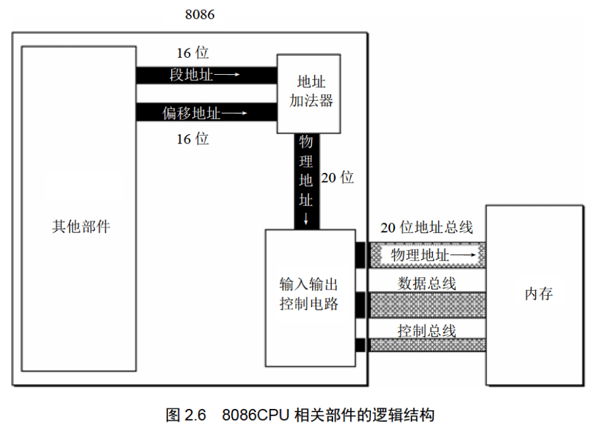

如图2.6所示，当 8086CPU要读写内存时：
(1)CPU中的相关部件提供两个16位的地址，一个称为段地址，另一个称为偏移地址；
(2)段地址和偏移地址通过内部总线送入一个称为地址加法器的部件；
(3)地址加法器将两个16位地址合成为一个20位的物理地址；
(4)地址加法器通过内部总线将20位物理地址送入输入输出控制电路；
(5)输入输出控制电路将20位物理地址送上地址总线；
(6)20位物理地址被地址总线传送到存储器。
地址加法器采用物理地址=段地址×16+偏移地址的方法用段地址和偏移地址合成物理
地址。例如，8086CPU要访问地址为123C8H的内存单元，此时，地址加法器的工作过程
如图2.7所示(图中数据皆为十六进制表示)。  

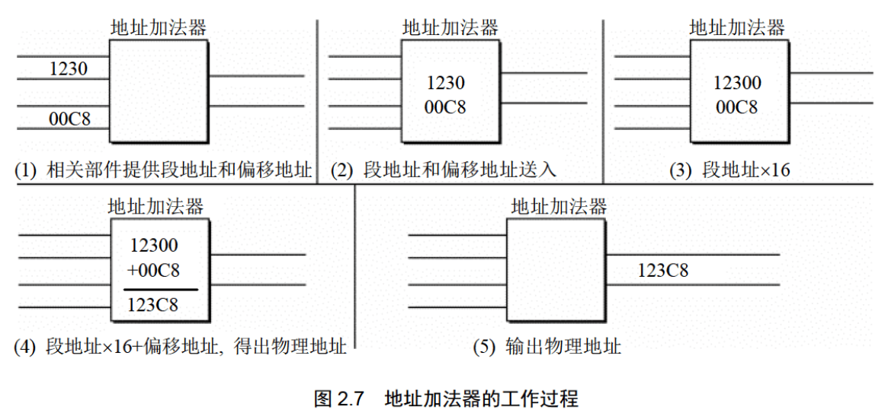

由段地址×16 引发的讨论
“段地址×16”有一个更为常用的说法是左移 4位。计算机中的所有信息都是以二进制的形式存储
的，段地址当然也不例外。机器只能处理二进制信息，“左移4位”中的位，指的是二进制位。
我们看一个例子，一个数据为2H,二进制形式为10B,对其进行左移运算：  

```
左移位数 二进制 十六进制 十进制
0 10B 2H 2
1 100B 4H 4
2 1000B 8H 8
3 10000B 10H 16
4 100000B 20H 32
```

观察上面移位次数和各种形式数据的关系，我们可以发现：
(1)一个数据的二进制形式左移1位，相当于该数据乘以2;
(2)一个数据的二进制形式左移N位，相当于该数据乘以2的N次方；
(3)地址加法器如何完成段地址×16的运算?就是将以二进制形式存放的段地址左移4位。
进一步思考，我们可看出：一个数据的十六进制形式左移1位，相当于乘以16;一个数据的十进制
形式左移1位，相当于乘以10;一个X进制的数据左移1位，相当于乘以X。  


## 2.7 “段地址×16+偏移地址=物理地址”的本质含义

注意，这里讨论的是 8086CPU 段地址和偏移地址的本质含义，而不是为了解决具体
的问题而在本质含义之上引申出来的更高级的逻辑意义。不管以多少种不同的逻辑意义去
看待“段地址×16+偏移地址=物理地址”的寻址模式，一定要清楚地知道它的本质含义，
这样才能更灵活地利用它来分析、解决问题。如果只拘泥于某一种引申出来的逻辑含义，
而模糊本质含义的话，将从意识上限制对这种寻址功能的灵活应用。
“段地址×16+偏移地址=物理地址”的本质含义是：CPU 在访问内存时，用一个基础
地址(段地址×16)和一个相对于基础地址的偏移地址相加，给出内存单元的物理地址。
更一般地说，8086CPU 的这种寻址功能是“基础地址+偏移地址=物理地址”寻址模
式的一种具体实现方案。8086CPU中，段地址×16可看作是基础地址。
下面，我们用两个与CPU无关的例子做进一步的比喻说明。
第一个比喻说明“基础地址+偏移地址=物理地址”的思想。
比如说，学校、体育馆、图书馆同在一条笔直的单行路上(参考图 2.8),学校位于路
的起点(从路的起点到学校距离是0米)。  

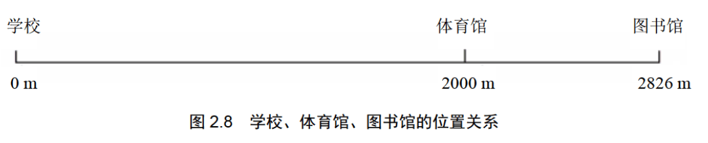

你要去图书馆，问我那里的地址，我可以用两种方式告诉你图书馆的地址：
(1)从学校走2826m到图书馆。这2826m可以认为是图书馆的物理地址。
(2)从学校走2000m到体育馆，从体育馆再走826m到图书馆。第一个距离2000m,
是相对于起点的基础地址，第二个距离826m是相对于基础地址的偏移地址(以基础地址为
起点的地址)。
第一种方式是直接给出物理地址 2826m,而第二种方式是用基础地址和偏移地址相加
来得到物理地址的。
第二个比喻进一步说明“段地址×16+偏移地址=物理地址”的思想。
我们为上面的例子加一些限制条件，比如，只能通过纸条来互相通信，你问我图书馆
的地址我只能将它写在纸上告诉你。显然，我必须有一张可以容纳4位数据的纸条，才能
写下2826这个数据。  

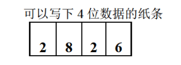

可不巧的是，我没有能容纳4位数据的纸条，仅有两张可以容纳3位数据的纸条。这
样我只能以这种方式告诉你 2826这个数据  

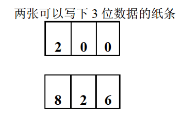

在第一张纸上写上 200(段地址),在第二张纸上写上 826(偏移地址)。假设我们事前对
这种情况又有过相关的约定：你得到这两张纸后，做这样的运算：200(段地址)×10+826(偏
移地址)=2826(物理地址)。
8086CPU就是这样一个只能提供两张3位数据纸条的CPU。  


## 2.8 段的概念

我们注意到，“段地址”这个名称中包含着“段”的概念。这种说法可能对一些学习
者产生了误导，使人误以为内存被划分成了一个一个的段，每一个段有一个段地址。如果  我们在一开始形成了这种认识，将影响以后对汇编语言的深入理解和灵活应用。
其实，内存并没有分段，段的划分来自于 CPU,由于 8086CPU用“基础地址(段地
址×16)+偏移地址=物理地址”的方式给出内存单元的物理地址，使得我们可以用分段的方
式来管理内存。如图 2.9 所示，我们可以认为：地址 10000H~100FFH 的内存单元组成一
个段，该段的起始地址(基础地址)为10000H,段地址为1000H,大小为100H;我们也可
以认为地址 10000H~1007FH、10080H~100FFH 的内存单元组成两个段，它们的起始地址
(基础地址)为：10000H和10080H,段地址为：1000H和1008H,大小都为80H。  

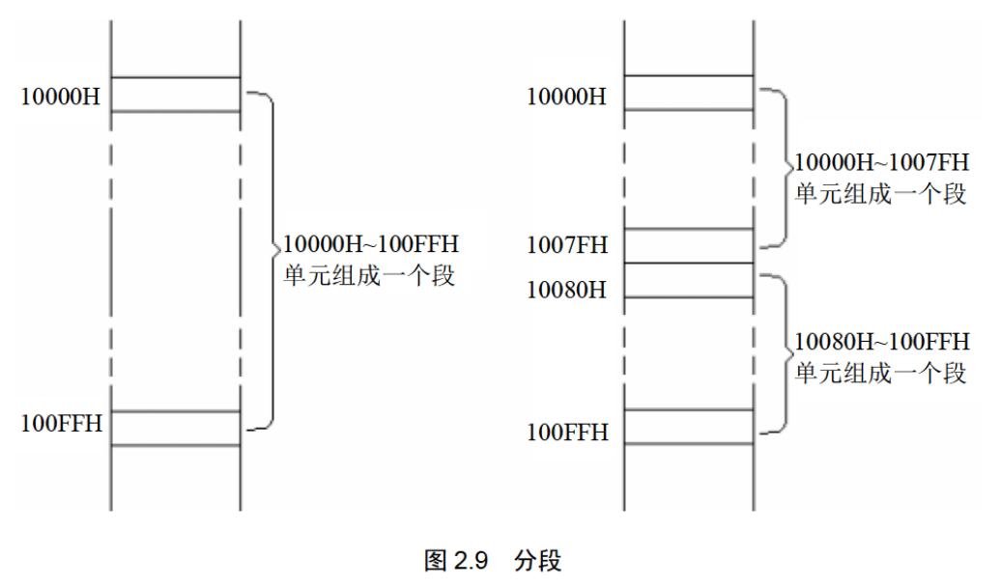

以后，在编程时可以根据需要，将若干地址连续的内存单元看作一个段，用段地
址×16 定位段的起始地址(基础地址),用偏移地址定位段中的内存单元。有两点需要注
意：段地址×16 必然是16的倍数，所以一个段的起始地址也一定是16的倍数；偏移地址
为16位，16位地址的寻址能力为64KB,所以一个段的长度最大为64KB。  

内存单元地址小结
CPU访问内存单元时，必须向内存提供内存单元的物理地址。8086CPU在内部用段地址和偏移地址
移位相加的方法形成最终的物理地址。
思考下面的两个问题。
(1)观察下面的地址，你有什么发现?  

```
物理地址
21F60H
段地址
2000H
2100H
21F0H
21F6H
IF00H
偏移地址
1F60H
0F60H
0060H
0000H
2F60H
```

结论：CPU可以用不同的段地址和偏移地址形成同一个物理地址。
比如CPU要访问21F60H单元，则它给出的段地址 SA和偏移地址 EA满足SA×16+EA=21F60H即可。
(2)如果给定一个段地址，仅通过变化偏移地址来进行寻址，最多可定位多少个内存单元?
结论：偏移地址16位，变化范围为0-FFFFH,仅用偏移地址来寻址最多可寻64KB个内存单元。
比如给定段地址1000H,用偏移地址寻址，CPU的寻址范围为：10000H~1FFFFH。
在8086PC机中，存储单元的地址用两个元素来描述，即段地址和偏移地址。
“数据在21F60H内存单元中。”这句话对于8086PC机一般不这样讲，取而代之的是两种类似的说
法：①数据存在内存 2000:1F60 单元中；②数据存在内存的2000H段中的1F60H 单元中。这两种描述都
表示“数据在内存21F60H单元中”。
可以根据需要，将地址连续、起始地址为16的倍数的一组内存单元定义为一个段。  


## 2.9 段寄存器

我们前面讲到，8086CPU 在访问内存时要由相关部件提供内存单元的段地址和偏移
地址，送入地址加法器合成物理地址。这里，需要看一下，是什么部件提供段地址。段地
址在 8086CPU 的段寄存器中存放。8086CPU 有 4 个段寄存器：CS、DS、SS、ES。当
8086CPU要访问内存时由这4个段寄存器提供内存单元的段地址。本章中只看一下  

## 2.10 CS和IP

CS和 IP是8086CPU中两个最关键的寄存器，它们指示了CPU当前要读取指令的地
址。CS为代码段寄存器，IP为指令指针寄存器，从名称上我们可以看出它们和指令的关系。
在 8086PC机中，任意时刻，设CS 中的内容为M,IP中的内容为N,8086CPU将从
内存M×16+N单元开始，读取一条指令并执行。
也可以这样表述：8086机中，任意时刻，CPU将CS:IP指向的内容当作指令执行。
图2.10展示了8086CPU读取、执行指令的工作原理(图中只包括了和所要说明的问题  密切相关的部件，图中数字都为十六进制)。  

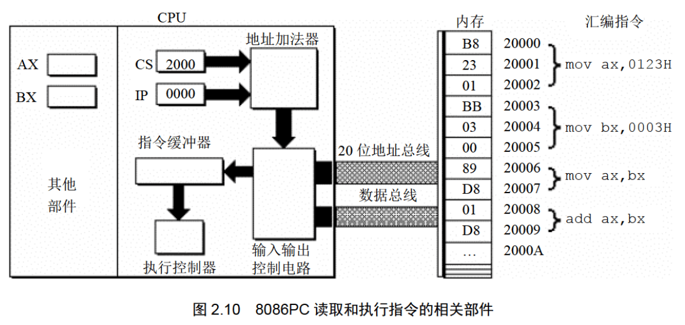

图2.10说明如下。
(1)8086CPU当前状态：CS 中的内容为2000H,IP中的内容为0000H;
(2)内存20000H~20009H单元存放着可执行的机器码；
(3)内存20000H~20009H单元中存放的机器码对应的汇编指令如下。
地址：20000H~20002H,内容：B8 23 01,长度：3Byte,对应汇编指令：mov ax,0123H
地址：20003H~20005H,内容：BB 03 00,长度：3Byte,对应汇编指令：mov bx,0003H
地址：20006H~20007H,内容：89 D8,长度：2Byte,对应汇编指令：mov ax,bx
地址：20008H~20009H,内容：01 D8,长度：2Byte,对应汇编指令：add ax,bx
下面的一组图(图 2.11~图 2.19),以图 2.10描述的情况为初始状态，展示了8086CPU
读取、执行一条指令的过程。注意每幅图中发生的变化(下面对 8086CPU 的描述，是在逻
辑结构、宏观过程的层面上进行的，目的是使读者对 CPU 工作原理有一个清晰、直观的
认识，为汇编语言的学习打下基础。其中隐蔽了CPU的物理结构以及具体的工作细节)。  

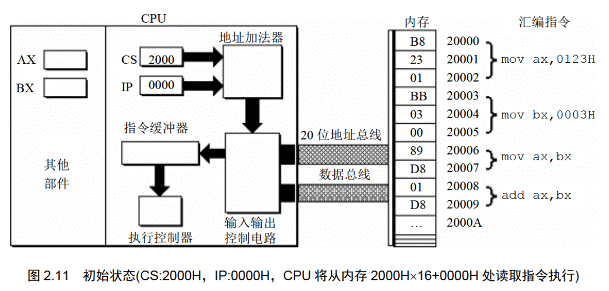

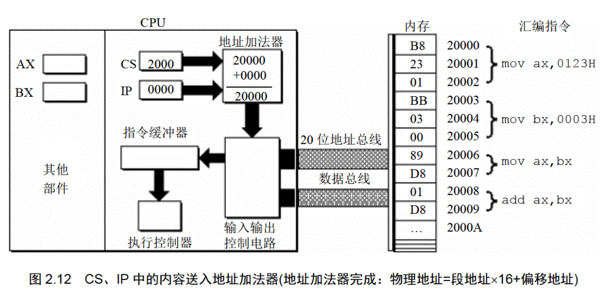


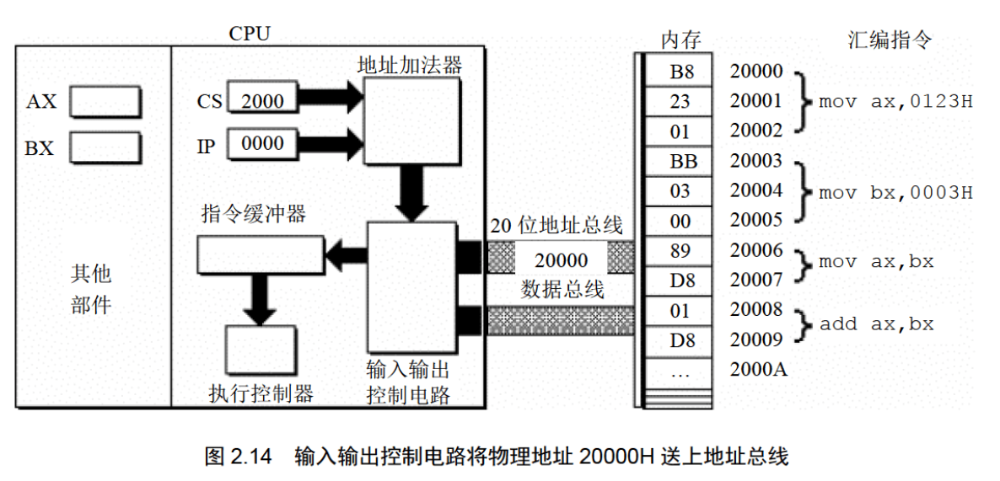

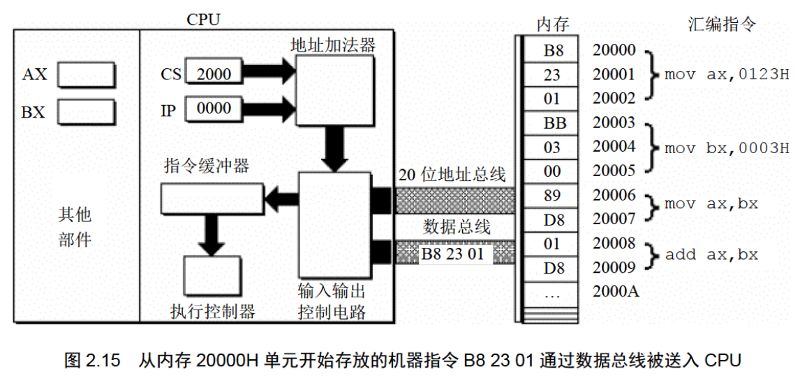


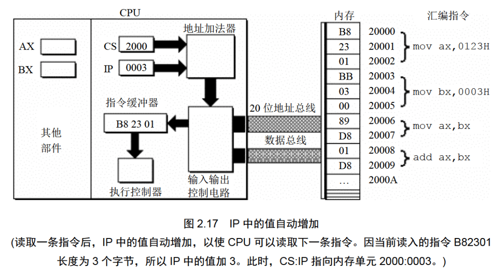


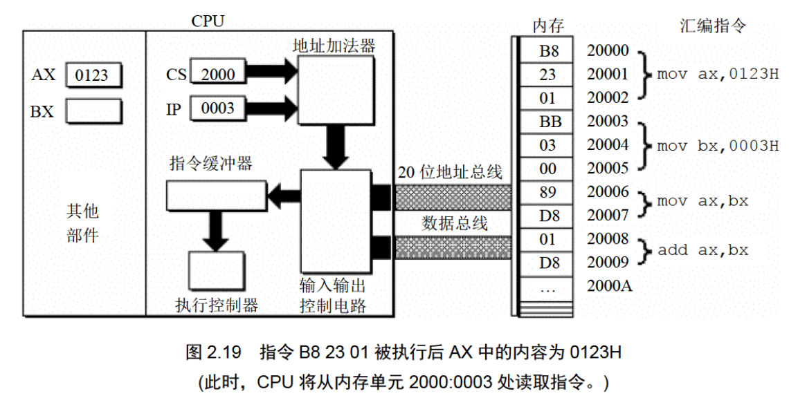

下面的一组图(图2.20~图2.26),以图2.19的情况为初始状态，展示了 8086CPU继续读
取、执行3条指令的过程。注意IP的变化(下面的描述中，隐蔽了读取每条指令的细节)。  


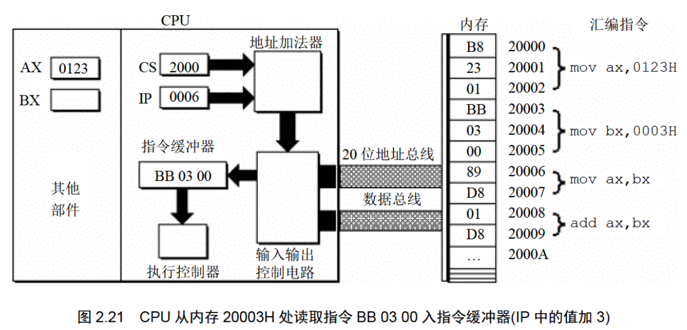

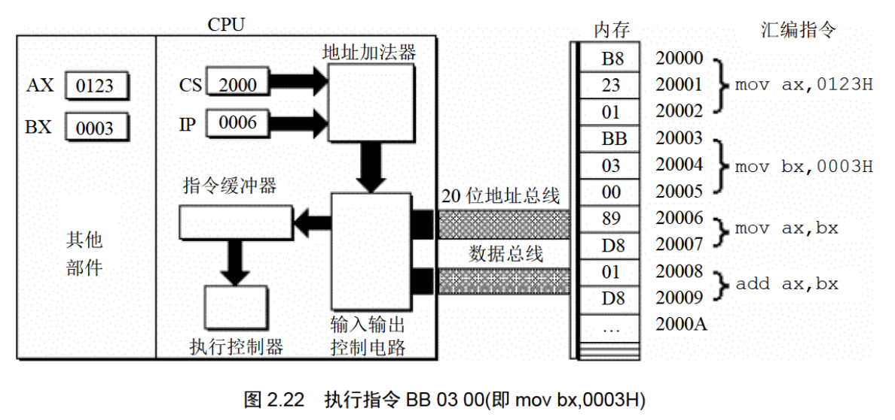


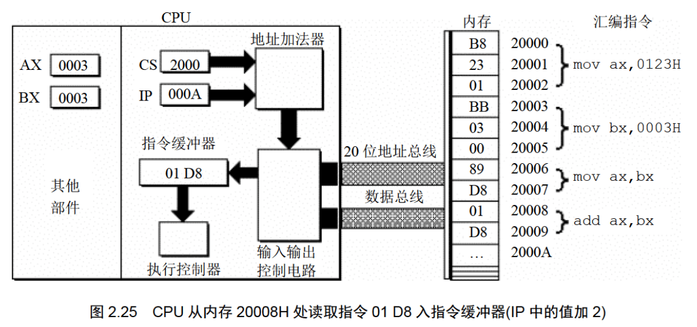

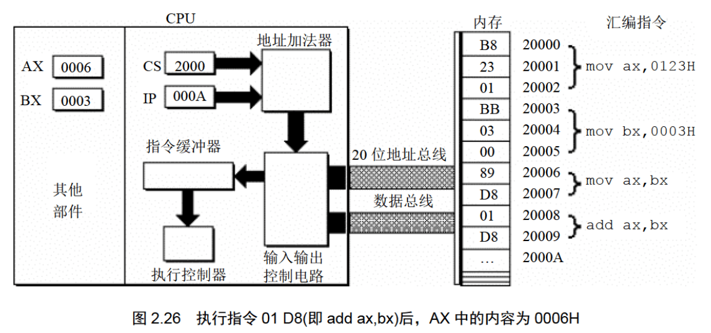

通过上面的过程展示，8086CPU的工作过程可以简要描述如下。  

(1)从CS:IP指向的内存单元读取指令，读取的指令进入指令缓冲器；
(2) IP=IP+所读取指令的长度，从而指向下一条指令；
(3)执行指令。转到步骤(1),重复这个过程。
在 8086CPU 加电启动或复位后(即 CPU 刚开始工作时)CS 和 IP 被设置为
CS=FFFFH,IP=0000H,即在 8086PC机刚启动时，CPU从内存 FFFFOH单元中读取指令
执行，FFFFOH单元中的指令是8086PC机开机后执行的第一条指令。
现在，我们更清楚了CS和 IP的重要性，它们的内容提供了CPU要执行指令的地址。
我们在第1 章中讲过，在内存中，指令和数据没有任何区别，都是二进制信息，CPU
在工作的时候把有的信息看作指令，有的信息看作数据。现在，如果提出一个问题：CPU
根据什么将内存中的信息看作指令?如何回答?我们可以说，CPU将CS:IP指向的内存单
元中的内容看作指令，因为，在任何时候，CPU将CS、IP 中的内容当作指令的段地址和
偏移地址，用它们合成指令的物理地址，到内存中读取指令码，执行。如果说，内存中的
一段信息曾被CPU执行过的话，那么,它所在的内存单元必然被CS:IP指向过。  


## 2.11 修改CS、IP的指令

在 CPU 中，程序员能够用指令读写的部件只有寄存器，程序员可以通过改变寄存器
中的内容实现对CPU 的控制。CPU 从何处执行指令是由CS、IP 中的内容决定的，程序
员可以通过改变CS、IP中的内容来控制CPU执行目标指令。
我们如何改变 CS、IP的值呢?显然，8086CPU必须提供相应的指令。我们如何修改
AX中的值?可以用mov 指令，如 mov ax,123 将ax 中的值设为123,显然，我们也可以
用同样的方法设置其他寄存器的值，如 mov bx,123,mov cx,123,mov dx,123等。其实，
8086CPU大部分寄存器的值，都可以用mov指令来改变，mov指令被称为传送指令。
但是，mov指令不能用于设置CS、IP的值，原因很简单，因为8086CPU没有提供这
样的功能。8086CPU为CS、IP 提供了另外的指令来改变它们的值。能够改变 CS、IP的
内容的指令被统称为转移指令(我们以后会深入研究)。我们现在介绍一个最简单的可以修
改CS、IP的指令：jmp指令。
若想同时修改 CS、IP的内容，可用形如“jmp段地址：偏移地址”的指令完成，如
jmp 2AE3:3,执行后：CS=2AE3H,IP=0003H,CPU将从2AE33H处读取指令。
jmp 3:0B16,执行后：CS=0003H,IP=0B16H,CPU将从00B46H处读取指令。
“jmp 段地址：偏移地址”指令的功能为：用指令中给出的段地址修改 CS,偏移地址
修改IP。
若想仅修改 IP的内容，可用形如“jmp 某一合法寄存器”的指令完成，如  jmp ax,指令执行前：ax=1000H,CS=2000H,IP=0003H
指令执行后：ax=1000H,CS=2000H,IP=1000H
jmp bx,指令执行前：bx=0B16H,CS=2000H,IP=0003H
指令执行后：bx=0B16H,CS=2000H,IP=0B16H
“jmp 某一合法寄存器”指令的功能为：用寄存器中的值修改IP。
jmp ax,在含义上好似：mov IP,ax。
注意，我们在适当的时候，会用已知的汇编指令的语法来描述新学的汇编指令的功
能。采用一种“用汇编解释汇编”的方法来使读者更好地理解汇编指令的功能，这样做有
助于读者进行知识的相互融会。要强调的是，我们是用“已知的汇编指令的语法”进行描
述，并不是用“已知的汇编指令”来描述，比如，我们用mov IP,ax来描述 jmp ax,并不
是说真有mov IP,ax这样的指令，而是用mov指令的语法来说明jmp指令的功能。我们可
以用同样的方法描述 jmp 3:01B6 的功能：jmp 3:01B6 在含义上好似 mov CS,3 mov
IP,01B6。  

问题2.3
内存中存放的机器码和对应的汇编指令情况如图 2.27 所示，设 CPU 初始状态：
CS=2000H,IP=0000H,请写出指令执行序列。思考后看分析。  

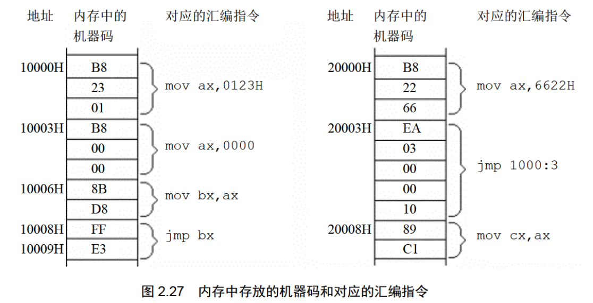

分析：
CPU对图2.27中的指令的执行过程如下。
(1)当前CS=2000H,IP=0000H,则CPU从内存2000H×16+0=20000H处读取指令，
读入的指令是：B8 22 66(mov ax,6622H),读入后IP=IP+3=0003H;
(2)指令执行后，CS=2000H,IP=0003H,则CPU 从内存2000H×16+0003H=20003H  处读取指令，读入的指令是：EA 03 00 00 10(jmp 1000:0003),读入后IP=IP+5=0008H;
(3)指令执行后，CS=1000H,IP=0003H,则CPU 从内存1000H×16+0003H=10003H
处读取指令，读入的指令是：B8 00 00(mov ax,0000),读入后IP=IP+3=0006H;
(4)指令执行后，CS=1000H,IP=0006H,则CPU 从内存1000H×16+0006H=10006H
处读取指令，读入的指令是：8B D8(mov bx,ax),读入后IP=IP+2=0008H;
(5)指令执行后，CS=1000H,IP=0008H,则CPU从内存1000H×16+0008H=10008H
处读取指令，读入的指令是：FF E3(jmp bx),读入后IP=IP+2=000AH;
(6)指令执行后，CS=1000H,IP=0000H,CPU从内存10000H处读取指令……
经分析后，可知指令执行序列为：
(1) mov ax,6622H
(2) jmp 1000:3
(3) mov ax,0000
(4) mov bx,ax
(5) jmp bx
(6) mov ax,0123H
(7)转到第3步执行  


## 2.12 代码段

前面讲过，对于 8086PC 机，在编程时，可以根据需要，将一组内存单元定义为一个
段。我们可以将长度为 N(N≤64KB)的一组代码，存在一组地址连续、起始地址为 16 的
倍数的内存单元中，我们可以认为，这段内存是用来存放代码的，从而定义了一个代码
段。比如，将：
mov ax,0000
add ax,0123H
mov bx,ax
jmp bx
(B8 00 00)
(05 23 01)
(8B D8)
(FF E3)
这段长度为10 个字节的指令，存放在 123B0H~123B9H 的一组内存单元中，我们就
可以认为，123BOH~123B9H 这段内存是用来存放代码的，是一个代码段，它的段地址为
123BH,长度为10个字节。
如何使得代码段中的指令被执行呢?将一段内存当作代码段，仅仅是我们在编程时的
一种安排，CPU 并不会由于这种安排，就自动地将我们定义的代码段中的指令当作指令
来执行。CPU 只认被CS:IP指向的内存单元中的内容为指令。所以，要让 CPU 执行我们
放在代码段中的指令，必须要将CS:IP 指向所定义的代码段中的第一条指令的首地址。对
于上面的例子，我们将一段代码存放在 123BOH~123B9H 内存单元中，将其定义为代码
段，如果要让这段代码得到执行，可设CS=123BH、IP=0000H。  

2.9～2.12 小 结
(1)段地址在8086CPU的段寄存器中存放。当8086CPU要访问内存时，由段寄存器提供内存单元的
段地址。8086CPU有4个段寄存器，其中CS用来存放指令的段地址。
(2)CS存放指令的段地址，IP存放指令的偏移地址。
8086机中，任意时刻，CPU将CS:IP指向的内容当作指令执行。
(3)8086CPU的工作过程：
①从CS:IP指向的内存单元读取指令，读取的指令进入指令缓冲器；
② IP指向下一条指令；
③执行指令。(转到步骤①,重复这个过程。)
(4)8086CPU提供转移指令修改CS、IP的内容。  