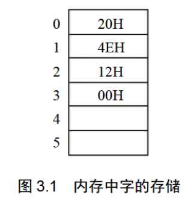
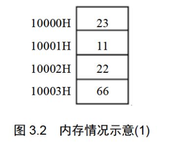
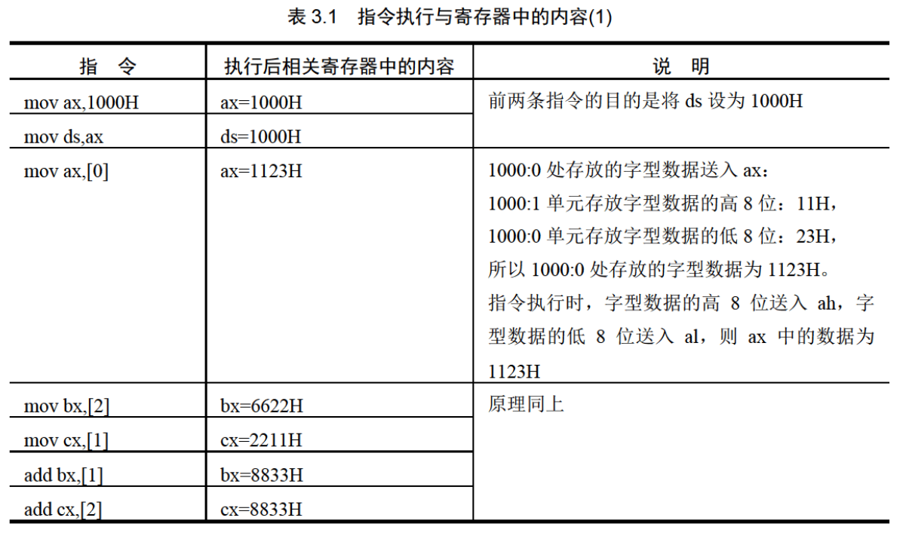

# 第3章 寄存器(内存访问)

第2章中，我们主要从CPU 如何执行指令的角度讲解了 8086CPU的逻辑结构、形成
物理地址的方法、相关的寄存器以及一些指令。读者应在通过了前一章所有的检测点，并
完成了实验任务之后，再开始学习当前的课程。这一章中，我们从访问内存的角度继续学
习几个寄存器  

## 3.1 内存中字的存储

CPU中，用16位寄存器来存储一个字。高8位存放高位字
节，低 8 位存放低位字节。在内存中存储时，由于内存单元是
字节单元(一个单元存放一个字节),则一个字要用两个地址连续
的内存单元来存放，这个字的低位字节存放在低地址单元中，
高位字节存放在高地址单元中。比如我们从 0 地址开始存放  20000,这种情况如图3.1所示。  



在图 3.1 中，我们用 0、1 两个内存单元存放数 据
20000(4E20H)。0、1 两个内存单元用来存储一个字，这两个单 元可以看作一个起始地址为0的字单元(存放一个字的内存单元，由0、1两个字节单元组成)。对于这个字单元来说，0 号单元是低地址单元，1 号单元是高地址单元，则字型数据4E20H 的低位字节存放在0号单元中，高位字节存放在1号单元中。同理，将2、3 号单元看作一个字单元，它的起始地址为 2。在这个字单元中存放数据 18(0012H),则在 2号单元中存放低位字节12H,在3号单元中存放高位字节 00H。  

我们提出字单元的概念：字单元，即存放一个字型数据(16 位)的内存单元，由两个地
址连续的内存单元组成。高地址内存单元中存放字型数据的高位字节，低地址内存单元中
存放字型数据的低位字节。
在以后的课程中，我们将起始地址为N的字单元简称为N地址字单元。比如一个字
单元由 2、3 两个内存单元组成，则这个字单元的起始地址为2,我们可以说这是 2 地址
字单元。  

问题3.1
对于图3.1:
(1)0地址单元中存放的字节型数据是多少?
(2)0地址字单元中存放的字型数据是多少  ？

(3)2地址单元中存放的字节型数据是多少?
(4)2地址字单元中存放的字型数据是多少?
(5)1地址字单元中存放的字型数据是多少?
思考后看分析。
分析：
(1)0地址单元中存放的字节型数据：20H;
(2)0地址字单元中存放的字型数据：4E20H;
(3)2地址单元中存放的字节型数据：12H;
(4)2地址字单元中存放的字型数据：0012H;
(5)1地址字单元，即起始地址为1的字单元，它由1 号单元和2号单元组成，用这
两个单元存储一个字型数据，高位放在 2 号单元中，即：12H,低位放在 1 号单元中，
即：4EH,它们组成字型数据是124EH,大小为：4686。
从上面的问题中我们看到，任何两个地址连续的内存单元，N 号单元和 N+1 号单
元，可以将它们看成两个内存单元，也可看成一个地址为N的字单元中的高位字节单元
和低位字节单元。  


## 3.2 DS和[address]

PU要读写一个内存单元的时候，必须先给出这个内存单元的地址，在 8086PC 中，
内存地址由段地址和偏移地址组成。8086CPU中有一个 DS 寄存器，通常用来存放要访问
数据的段地址。比如我们要读取10000H单元的内容，可以用如下的程序段进行。
mov bx,1000H
mov ds,bx
mov al,[0]
上面的3条指令将10000H(1000:0)中的数据读到 al中。
下面详细说明指令的含义。
mov al,[0]
前面我们使用 mov 指令，可完成两种传送：①将数据直接送入寄存器；②将一个寄
存器中的内容送入另一个寄存器。
也可以使用 mov 指令将一个内存单元中的内容送入一个寄存器中。从哪一个内存单
元送到哪一个寄存器中呢?在指令中必须指明。寄存器用寄存器名来指明，内存单元则需
用内存单元的地址来指明。显然，此时 mov 指令的格式应该是：mov 寄存器名，内存单
元地址。
“[…]”表示一个内存单元，“[…]”中的0表示内存单元的偏移地址。我们知道  只有偏移地址是不能定位一个内存单元的，那么内存单元的段地址是多少呢?指令执行
时，8086CPU自动取 ds 中的数据为内存单元的段地址。
再来看一下，如何用mov 指令从10000H 中读取数据。10000H用段地址和偏移地址
表示为1000:0,我们先将段地址1000H 放入ds,然后用mov al,[0]完成传送。mov指令中
的[]说明操作对象是一个内存单元，[]中的0说明这个内存单元的偏移地址是0,它的段地
址默认放在ds 中，指令执行时，8086CPU会自动从ds 中取出。
mov bx,1000H
mov ds,bx
若要用mov al,[0]完成数据从1000:0单元到 al的传送，这条指令执行时，ds 中的内容
应为段地址1000H,所以在这条指令之前应该将1000H送入 ds。
如何把一个数据送入寄存器呢?我们以前用类似“mov ax,1”这样的指令来完成，从
理论上讲，我们可以用相似的方式：mov ds,1000H,来将 1000H 送入 ds。可是，现实并
非如此，8086CPU 不支持将数据直接送入段寄存器的操作，ds 是一个段寄存器，所以
mov ds,1000H这条指令是非法的。那么如何将1000H送入 ds 呢?只好用一个寄存器来进
行中转，即先将1000H 送入一个一般的寄存器，如 bx,再将 bx 中的内容送入 ds。
为什么 8086CPU不支持将数据直接送入段寄存器的操作?这属于 8086CPU硬件设计
的问题，我们只要知道这一点就行了。  

问题3.2
写几条指令，将 al中的数据送入内存单元10000H中，思考后看分析。
分析：
怎样将数据从寄存器送入内存单元?从内存单元到寄存器的格式是：“mov 寄存器名，
内存单元地址”,从寄存器到内存单元则是：“mov 内存单元地址，寄存器名”。10000H
可表示为1000:0,用ds 存放段地址1000H,偏移地址是0,则mov [0],al 可完成从 al到
10000H的数据传送。完整的几条指令是：
mov bx,1000H
mov ds,bx
mov [0],al  


## 3.3 字的传送

前面我们用 mov 指令在寄存器和内存之间进行字节型数据的传送。因为8086CPU是
16 位结构，有16 根数据线，所以，可以一次性传送16 位的数据，也就是说可以一次性
传送一个字。只要在 mov 指令中给出 16 位的寄存器就可以进行 16位数据的传送了。
比如：  


```
mov bx,1000H
mov ds,bx
mov ax,[0] ;1000:0处的字型数据送入 ax
mov [0],cx ;cx中的16位数据送到1000:0处
```

问题3.3
内存中的情况如图3.2所示，写出下面的指令执行后寄存器 ax,bx,cx 中的值



```
mov ax,1000H
mov ds,ax
mov ax,[0]
mov bx,[2]
mov cx,[1]
add bx,[1]
add cx,[2]
```

思考后看分析。
分析：
进行单步跟踪，看一下每条指令执行后相关寄存器中的值，见表3.1。  



问题3.4
内存中的情况如图3.3所示，写出下面的指令执行后内存中的值，思考后看分析  


## 3.4 mov、add、sub指令


## 3.5 数据段


## 3.6 栈


## 3.7 CPU提供的栈机制


## 3.8 栈顶超界的问题


## 3.9 push、pop指令


## 3.10 栈段