# 第4章 第一个程序

终于可以编写第1个完整的程序了，我们以前都是在 Debug 中写一些指令，在 Debug 中执行。现在我们将开始编写完整的汇编语言程序，用编译和连接程序将它们编译连接成为可执行文件(如 `*.exe` 文件)，在操作系统中运行。这一章中，我们将编写第一个这样的程序。

为了能够透彻地理解一个完整的程序(尽管它看上去十分简单)，我们将经历一个漫长的过程。  


## 4.1 一个源程序从写出到执行的过程

图4.1描述了一个汇编语言程序从写出到最终执行的简要过程。具体说明如下。

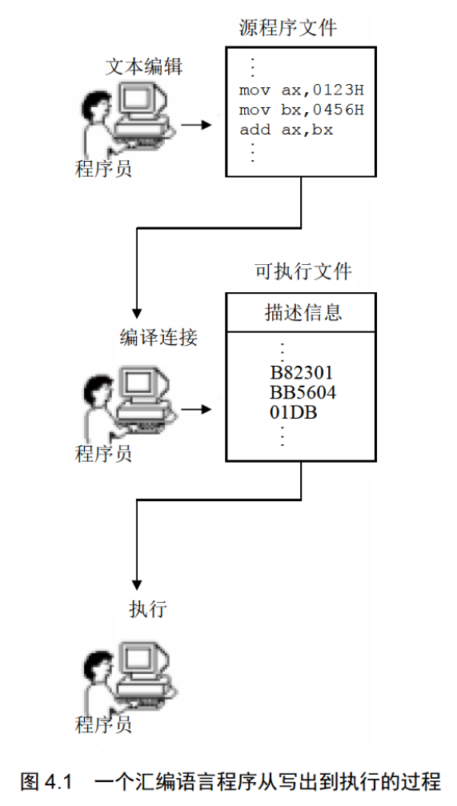

**第一步：编写汇编源程序。**

使用文本编辑器(如 Edit、记事本等)，用汇编语言编写汇编源程序。这一步工作的结果是产生了一个存储源程序的文本文件。  

**第二步：对源程序进行编译连接。**

使用汇编语言编译程序对源程序文件中的源程序进行编译，产生目标文件；再用连接程序对目标文件进行连接，生成可在操作系统中直接运行的可执行文件。  

可执行文件包含两部分内容：

- 程序(从源程序中的汇编指令翻译过来的机器码)和数据(源程序中定义的数据)  
- 相关的描述信息(比如，程序有多大、要占用多少内存空间等)  

这一步工作的结果：产生了一个可在操作系统中运行的可执行文件。  

**第三步：执行可执行文件中的程序。**  

在操作系统中，执行可执行文件中的程序。操作系统依照可执行文件中的描述信息，将可执行文件中的机器码和数据加载入内存，并进行相关的初始化(比如设置 CS:IP 指向第一条要执行的指令)，然后由 CPU 执行程序。

下面我们将通过学习一个简单的程序来经历图4.1中所描述的过程。  


## 4.2 源程序

下面就是一段简单的汇编语言源程序。  

程序 4.1

```assembly
assume cs:codesg

codesg segment

    mov ax,0123H
    mov bx,0456H
    add ax,bx
    add ax, ax
    
    mov ax,4c00H
    int 21H
    
codesg ends

end
```

下面对程序进行说明。

### 1.伪指令

在汇编语言源程序中，包含两种指令，一种是汇编指令，一种是伪指令。汇编指令是有对应的机器码的指令，可以被编译为机器指令，最终为CPU 所执行。而伪指令没有对应的机器指令，最终不被 CPU 所执行。那么谁来执行伪指令呢?伪指令是由编译器来执行的指令，编译器根据伪指令来进行相关的编译工作。

你现在能看出来程序 4.1 中哪些指令是伪指令吗?

程序 4.1中出现了3种伪指令  

(1) 

```
XXX segment
......
XXX ends
```

segment 和 ends 是一对成对使用的伪指令，这是在写可被编译器编译的汇编程序时，必须要用到的一对伪指令。segment 和 ends 的功能是定义一个段，segment 说明一个段开始，ends 说明一个段结束。一个段必须有一个名称来标识，使用格式为：

```assembly
段名 segment
......
段名 ends
```

比如，程序 4.1 中的：

```assembly
codesg segment ;定义一个段，段的名称为“codesg”，这个段从此开始
......
codesg ends ;名称为“codesg”的段到此结束
```

一个汇编程序是由多个段组成的，这些段被用来存放代码、数据或当作栈空间来使用。我们在前面的课程中所讲解的段的概念，在汇编源程序中得到了应用与体现，一个源程序中所有将被计算机所处理的信息：指令、数据、栈，被划分到了不同的段中。

一个有意义的汇编程序中至少要有一个段，这个段用来存放代码。

我们可以看到，程序4.1中，在 codesg segment 和 codesg ends 之间写的汇编指令是这个段中存放的内容，这是一个代码段(其中还有我们不认识的指令，后面会进行讲解)。

(2) end

end 是一个汇编程序的结束标记，编译器在编译汇编程序的过程中，如果碰到了伪指令end，就结束对源程序的编译。所以，在我们写程序的时候，如果程序写完了，要在结尾处加上伪指令end。否则，编译器在编译程序时，无法知道程序在何处结束。

注意，不要搞混了 end 和ends，ends 是和 segment 成对使用的，标记一个段的结束，ends 的含义可理解为“end segment”。我们这里讲的 end 的作用是标记整个程序的结束。

(3) assume

这条伪指令的含义为“假设”。它假设某一段寄存器和程序中的某一个用 `segment...ends` 定义的段相关联。通过 `assume` 说明这种关联，在需要的情况下，编译程序可以将段寄存器和某一个具体的段相联系。`assume` 并不是一条非要深入理解不可的伪指令，以后我们编程时，记着用 `assume` 将有特定用途的段和相关的段寄存器关联起来即可。

比如，在程序 4.1中，我们用 `codesg segment ... codesg ends` 定义了一个名为 codseg 的段，在这个段中存放代码，所以这个段是一个代码段。在程序的开头，用 `assume cs:codesg` 将用作代码段的段 `codesg` 和 CPU 中的段寄存器 `cs` 联系起来。


### 2.源程序中的“程序”

用汇编语言写的源程序，包括伪指令和汇编指令，我们编程的最终目的是让计算机完成一定的任务。源程序中的汇编指令组成了最终由计算机执行的程序，而源程序中的伪指令是由编译器来处理的，它们并不实现我们编程的最终目的。这里所说的程序就是指源程序中最终由计算机执行、处理的指令或数据。

注意，以后可以将源程序文件中的所有内容称为源程序，将源程序中最终由计算机执行、处理的指令或数据，称为程序。程序最先以汇编指令的形式存在源程序中，经编译、连接后转变为机器码，存储在可执行文件中。这个过程如图4.2 所示。  

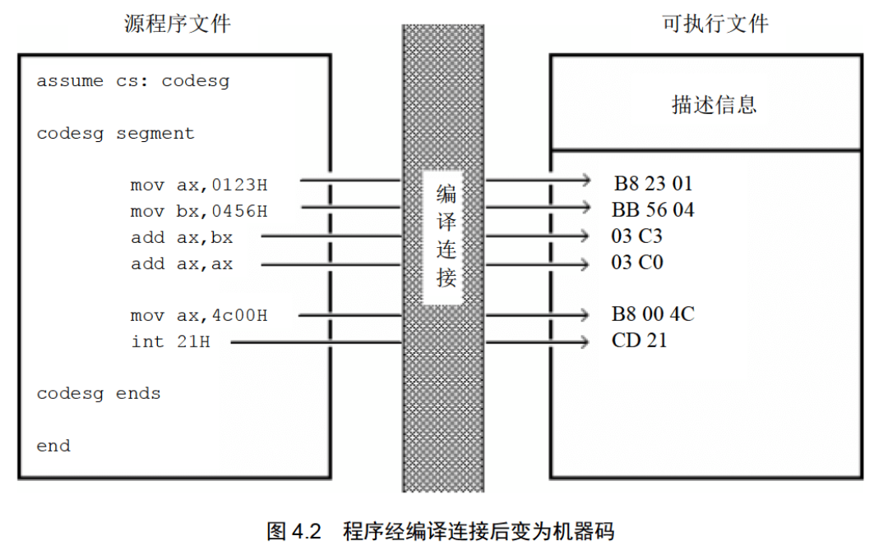

### 3.标号

汇编源程序中，除了汇编指令和伪指令外，还有一些标号，比如“codesg”。一个标号指代了一个地址。比如 codesg 在segment 的前面，作为一个段的名称，这个段的名称最终将被编译、连接程序处理为一个段的段地址。

### 4.程序的结构

我们现在讨论一下汇编程序的结构。在前 3 章中，我们都是通过直接在 Debug 中写入汇编指令来写汇编程序，对于十分简短的程序这样做的确方便。可对于大一些的程序，就不能如此了。我们需要写出能让编译器进行编译的源程序，这样的源程序应该具备起码的结构。

源程序是由一些段构成的。我们可以在这些段中存放代码、数据，或将某个段当作栈空间。我们现在来一步步地完成一个小程序，从这个过程中体会一下汇编程序中的基本要素和汇编程序的简单框架。  

任务：编程运算 2^3。源程序应该怎样来写呢?

(1) 我们要定义一个段，名称为 abc。

```assembly
abc segment
abc ends
```

(2) 在这个段中写入汇编指令，来实现我们的任务。

```assembly
abc segment
    mov ax,2
    add ax,ax
    add ax,ax
abc ends
```

(3) 然后，要指出程序在何处结束。

```assembly
abc segment
    mov ax,2
    add ax, ax
    add ax, ax
abc ends

end
```

(4) abc 被当作代码段来用，所以，应该将 abc 和 cs 联系起来。(当然，对于这个程序，也不是非这样做不可。)

```assembly
assume cs:abc

abc segment
    mov ax,2
    add ax, ax
    add ax, ax
abc ends

end
```


最终写成的程序如程序 4.2 所示。  

程序 4.2

```assembly
assume cs:abc

abc segment
    mov ax,2
    add ax, ax
    add ax, ax
abc ends

end
```

### 5.程序返回

我们的程序最先以汇编指令的形式存在源程序中，经编译、连接后转变为机器码，存储在可执行文件中，那么，它怎样得到运行呢?

下面，我们在 DOS(一个单任务操作系统) 的基础上，简单地讨论一下这个问题。

一个程序 P2 在可执行文件中，则必须有一个正在运行的程序 P1，将 P2 从可执行文件中加载入内存后，将 CPU 的控制权交给 P2，P2 才能得以运行。P2 开始运行后，P1 暂停运行。

而当 P2 运行完毕后，应该将 CPU 的控制权交还给使它得以运行的程序 P1，此后，P1 继续运行。

现在，我们知道，一个程序结束后，将 CPU 的控制权交还给使它得以运行的程序，我们称这个过程为：程序返回。那么，如何返回呢？应该在程序的末尾添加返回的程序段。

我们回过头来，看一下程序 4.1 中的两条指令：

```assembly
mov ax,4c00H
int 21H
```

这两条指令所实现的功能就是程序返回。

在目前阶段，我们不必去理解 `int 21H` 指令的含义，和为什么要在这条指令的前面加上指令 `mov ax,4c00H`。我们只要知道，在程序的末尾使用这两条指令就可以实现程序返回。

到目前为止，我们好像已经遇到了几个和结束相关的内容：段结束、程序结束、程序返回。表4.1展示了它们的区别。

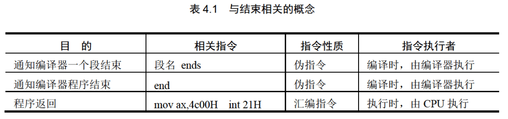

###  6.语法错误和逻辑错误

可见，程序 4.2 在运行时会引发一些问题，因为程序没有返回。当然，这个错误在编译的时候是不能表现出来的，也就是说，程序 4.2 对于编译器来说是正确的程序。

一般说来，程序在编译时被编译器发现的错误是语法错误，比如将程序 4.2 写成如下这样就会发生语法错误：

```assembly
aume cs:abc

abc segment
    mov ax,2
    add ax,ax
    add ax, ax
    
end
```

显然，程序中有编译器不能识别的 `aume`，而且编译器在编译的过程中也无法知道 abc 段到何处结束。

在源程序编译后，在运行时发生的错误是逻辑错误。语法错误容易发现，也容易解决，而逻辑错误通常不容易被发现。不过，程序 4.2 中的错误却显而易见，我们将它改正过来：

```assembly
assume cs:abc

abc segment
    mov ax,2
    add ax, ax
    add ax,ax
    
    mov ax,4c00H
    int 21H
abc ends

end
```


## 4.3 编辑源程序 

可以用任意的文本编辑器来编辑源程序，只要最终将其存储为纯文本文件即可。  


## 4.4 编译

在 4.3 节中，完成对源程序的编辑后，得到一个源程序文件 `c:\1.asm`。可以对其进行编译，生成包含机器代码的目标文件。

在编译一个源程序之前首先要找到一个相应的编译器。在我们的课程中，采用微软的 masm5.0 汇编编译器，文件名为`masm.exe`。假设汇编编译器在 `c:\masm` 目录下。可以按照下面的过程来进行源程序的编译，以 `c:\1 .asm` 为例。

(1) 进入 DOS 方式，进入`c:\masm`目录，运行 `masm.exe`，如图4.5所示。

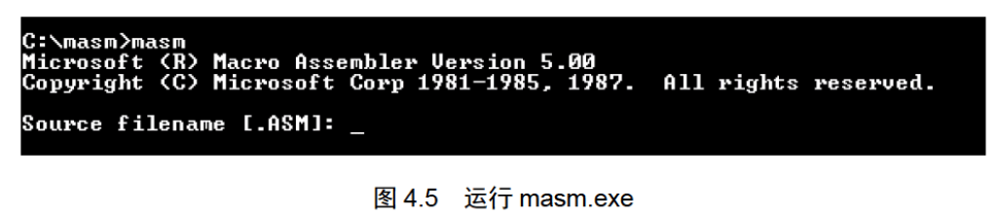

图 4.5中，运行 `masm` 后，首先显示出一些版本信息，然后提示输入将要被编译的源程序文件的名称。注意，“[.ASM]” 提示我们，默认的文件扩展名是 `asm`，比如，要编译的源程序文件名是“p1.asm”，只要在这里输入“p1”即可。可如果源程序文件不是以 `asm` 为扩展名的话，就要输入它的全名。比如源程序文件名为“p1.txt”，就要输入全名。

在输入源程序文件名的时候一定要指明它所在的路径。如果文件就在当前路径下，只输入文件名就可以，可如果文件在其他的目录中，则要输入路径，比如，要编译的文件 `p1.txt` 在 “c:\windows\desktop” 下，则要输入“c:\windows\desktop\p1.txt”。  

这里，我们要编译的文件是C盘根目录下的 `1.asm`，所以此处输入 “c:\1.asm”。

(2) 输入要编译的源程序文件名后，按Enter键，屏幕显示如图4.6所示。

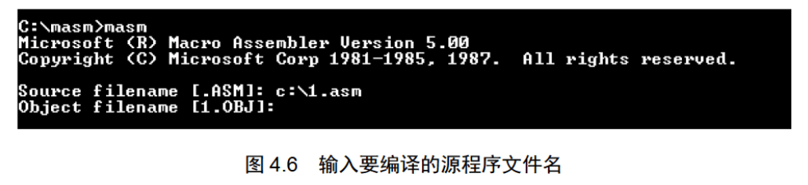

图 4.6 中，在输入源程序文件名后，程序继续提示我们输入要编译出的目标文件的名称，目标文件是我们对一个源程序进行编译要得到的最终结果。注意屏幕上的显示：“[1.OBJ]”，因为我们已经输入了源程序文件名为 `1.asm`，则编译程序默认要输出的目标文件名为`1.obj`，所以可以不必再另行指定文件名。直接按 Enter 键，编译程序将在当前的目录下，生成 `1.obj` 文件。

这里，也可以指定生成的目标文件所在的目录，比如，想让编译程序在 “c:\windows\desktop” 下生成目标文件 `1.obj`，则可输入 “c:\windows\desktop\1”。

我们直接按 Enter 键，使用编译程序设定的目标文件名。

(3) 确定了目标文件的名称后，屏幕显示如图4.7所示。

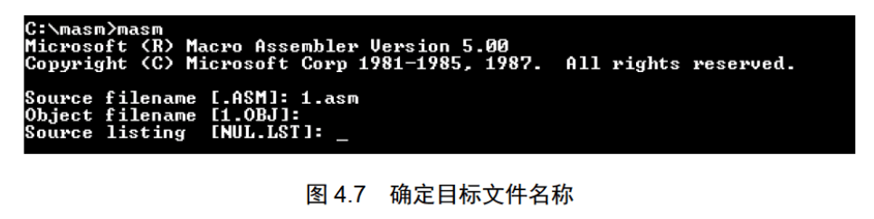

图 4.7 中，编译程序提示输入列表文件的名称，这个文件是编译器将源程序编译为目标文件的过程中产生的中间结果。可以让编译器不生成这个文件，直接按 Enter 键即可。

(4) 忽略了列表文件的生成后，屏幕显示如图4.8所示。

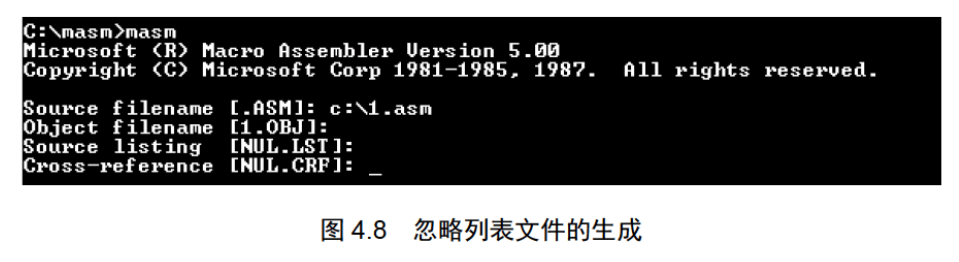

图 4.8 中，编译程序提示输入交叉引用文件的名称，这个文件同列表文件一样，是编译器将源程序编译为目标文件过程中产生的中间结果。可以让编译器不生成这个文件，直接按 Enter 键即可。

(5) 忽略了交叉引用文件的生成后，屏幕显示如图 4.9所示。

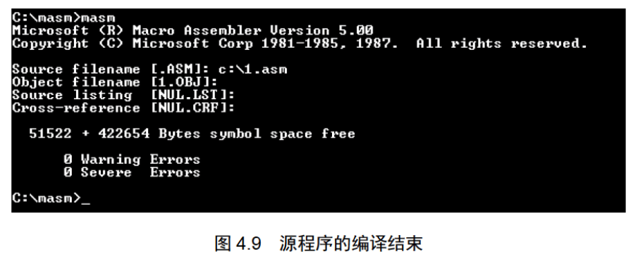

图 4.9 中，对源程序的编译结束，编译器输出的最后两行告诉我们这个源程序没有警告错误和必须要改正的错误。

上面我们通过对C盘根目录下的 `1.asm` 进行编译的过程，展示了使用汇编编译器对源程序进行编译的方法。按照上面的过程进行了编译之后，在编译器 `masm.exe` 运行的目录 `c:\masm` 下(即当前路径下)，将出现一个新的文件：`1.obj`，这是对源程序 `1.asm` 进行编译所得到的结果。当然，如果编译的过程中出现错误，那么将得不到目标文件。一般来说，有两类错误使我们得不到所期望的目标文件：

- 程序中有“Severe Errors”;
- 找不到所给出的源程序文件。

注意，在编译的过程中，我们提供了一个输入，即源程序文件。最多可以得到3个输出：目标文件(`.obj`)、列表文件(`.lst`)、交叉引用文件(`.crf`)，这3个输出文件中，目标文件是我们最终要得到的结果，而另外两个只是中间结果，可以让编译器忽略对它们的生成。在汇编课程中，我们不讨论这两类文件。


## 4.5 连接

在对源程序进行编译得到目标文件后，我们需要对目标文件进行连接，从而得到可执行文件。接续上一节的过程，我们已经对 `c:\l.asm` 进行编译得到 `c:\masm\l.obj`，现在再将 `c:\masm\1.obj` 连接为 `c:\masm\l.exe`。

我们使用微软的 Overlay Linker3.60 连接器，文件名为 `link.exe`，假设连接器在 `c:\masm` 目录下。可以按照下面的过程来进行程序的连接，以 `c:\masm\l.obj` 为例。

(1) 进入 DOS 方式，进入 `c:\masm` 目录，运行 `link.exe`，如图 4.10 所示。

图 4.10 中，运行 `link` 后，首先显示出一些版本信息，然后提示输入将要被连接的目标文件的名称。注意，“[.OBJ]” 提示我们默认的文件扩展名是 `obj`，比如要连接的目标文件名是“p1.obj”，只要在这里输入“p1”即可。可如果文件不是以 `obj` 为扩展名，就要输入它的全名。比如目标文件名为“p1.bin”，就要输入全名。  

在输入目标文件名的时候，要注意指明它所在的路径。这里要连接的文件是当前目录下的`1.obj`，所以此处输入“1”。  


(2) 输入要连接的目标文件名后，按 Enter 键，屏幕显示如图 4.11 所示。

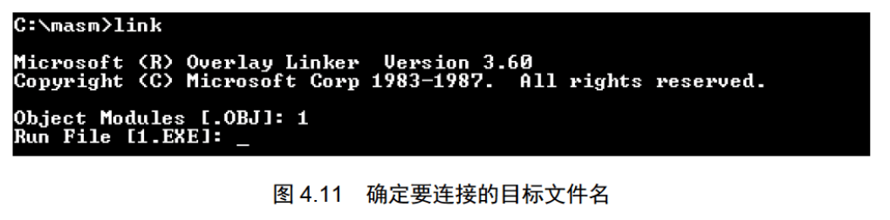

图 4.11 中，在输入目标文件名后，程序继续提示我们输入要生成的可执行文件的名称，可执行文件是我们对一个程序进行连接要得到的最终结果。注意屏幕上的显示：“[1.EXE]”，因为已经确定了目标文件名为 `1.obj`，则程序默认要输出的可执行文件名为`1.EXE`，所以可以不必再另行指定文件名。直接按 Enter 键，编译程序将在当前的目录下，生成 `1.EXE` 文件。

这里，也可以指定生成的可执行文件所在的目录，比如，想让连接程序在 “c:\windows\desktop” 下生成可执行文件`1.EXE`，则可输入 “c:\windows\desktop\1” 。

我们直接按 Enter 键，使用连接程序设定的可执行文件名。

(3) 确定了可执行文件的名称后，屏幕显示如图 4.12 所示。

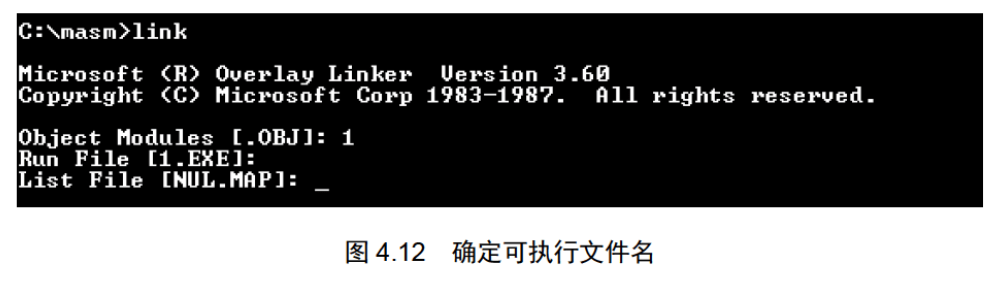

图 4.12 中，连接程序提示输入映像文件的名称，这个文件是连接程序将目标文件连接为可执行文件过程中产生的中间结果，可以让连接程序不生成这个文件，直接按 Enter 键即可。

(4) 忽略了映像文件的生成后，屏幕显示如图 4.13 所示。

图 4.13 中，连接程序提示输入库文件的名称。库文件里面包含了一些可以调用的子程序，如果程序中调用了某一个库文件中的子程序，就需要在连接的时候，将这个库文件和目标文件连接到一起，生成可执行文件。但是，这个程序中没有调用任何子程序，所以，这里忽略库文件名的输入，直接按 Enter 键即可。  

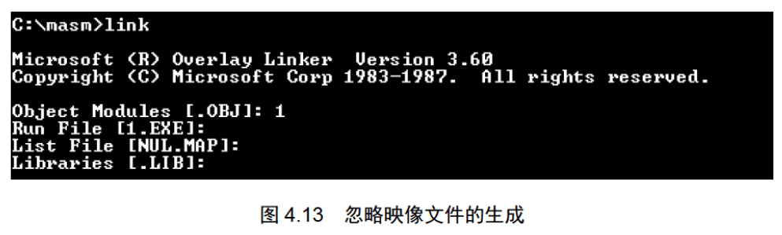

(5) 忽略了库文件的连接后，屏幕显示如图 4.14 所示。

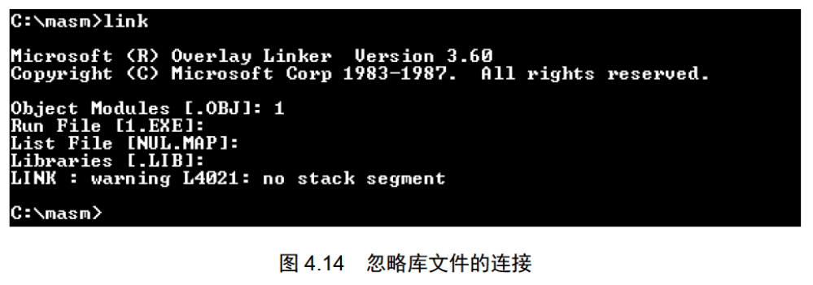

图 4.14 中，对目标文件的连接结束，连接程序输出的最后一行告诉我们，这个程序中有一个警告错误：“没有栈段”，这里我们不理会这个错误。上面我们通过对当前路径下的 `1.obj` 进行连接的过程，展示了使用连接器对目标文件进行连接的方法。按照上面的过程进行了连接之后，在连接器 `link.exe` 运行的目录 `c:\masm` 下(即当前路径下)，将出现一个新的文件：`1.exe`，这是对目标文件 `1.obj` 进行连接所得到的结果。当然，如果连接过程中出现错误，那么将得不到可执行文件。

连接的作用是什么呢？

对于连接，我们也不想过多地讨论。实际上，在汇编课程中，我们将会接触到许多知识、概念，对于这些我们并不是都有深入讨论的必要。

这里再次强调一下，我们学习汇编的主要目的，就是通过用汇编语言进行编程而深入地理解计算机底层的基本工作机理，达到可以随心所欲地控制计算机的目的。基于这种考虑，我们的编程活动，大都是直接对硬件进行的。我们希望直接对硬件编程，却并不希望用机器码编程。我们用汇编语言编程，就要用到编辑器(Edit)、编译器(masm)、连接器(link)、调试工具(Debug)等所有工具，而这些工具都是在操作系统之上运行的程序，所以我们的学习过程必须在操作系统的环境中进行。我们在一个操作系统环境中，使用了许多工具，这势必要牵扯到操作系统、编译原理等方面的知识和原理。我们只是利用这些环境、工具来方便我们的学习，而不希望这些东西分散了我们的注意力。所以，对于涉及而又不在我们学习的主要内容之中的东西，我们只做简单的解释。

好了，我们简单地讲连接的作用，连接的作用有以下几个。

- 当源程序很大时，可以将它分为多个源程序文件来编译，每个源程序编译成为目标文件后，再用连接程序将它们连接到一起，生成一个可执行文件；
- 程序中调用了某个库文件中的子程序，需要将这个库文件和该程序生成的目标文件连接到一起，生成一个可执行文件；
- 一个源程序编译后，得到了存有机器码的目标文件，目标文件中的有些内容还不能直接用来生成可执行文件，连接程序将这些内容处理为最终的可执行信息。所以，在只有一个源程序文件，而又不需要调用某个库中的子程序的情况下，也必须用连接程序对目标文件进行处理，生成可执行文件。

注意，对于连接的过程，可执行文件是我们要得到的最终结果。


## 4.6 以简化的方式进行编译和连接

在前面的内容里，介绍了如何使用 `masm` 和 `link` 进行编译和连接。可以看出，我们编译、连接的最终目的是用源程序文件生成可执行文件。在这个过程中所产生的中间文件都可以忽略。我们可以用一种较为简捷的方式进行编译、连接。简捷的编译过程如图 4.15 所示。  

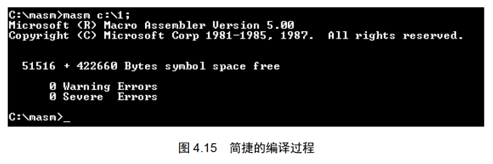

注意图 4.15 中的命令行“masm c:\1;”，在 `masm` 后面加上被编译的源程序文件的路径、文件名，在命令行的结尾再加上分号，按 Enter 键后，编译器就对 `c:\l.asm` 进行编译，在当前路径下生成目标文件`1.obj`，并在编译的过程中自动忽略中间文件的生成。图4.16展示了简捷的连接过程。  

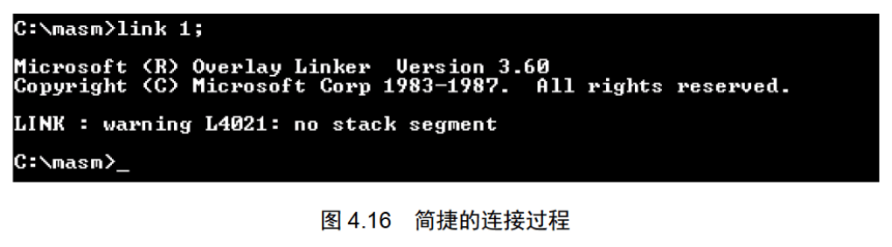

注意图 4.16 中的命令行“link 1;”，在 `link` 后面加上被连接的目标文件的路径、文件名，在命令行的结尾再加上分号，按 Enter 键后，连接程序就对当前路径下的 `1.obj` 进行处理，在当前路径下生成可执行文件 `1.exe`，并在过程中自动忽略中间文件的生成。


## 4.7 1.exe的执行

现在，终于将我们的第一个汇编程序加工成了一个可在操作系统下执行的程序文件，我们现在执行一下，图 4.17 展示了`1.exe`的执行情况  

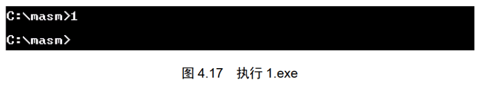

奇怪吗？程序运行后，竟然没有任何结果，就和没有运行一样。那么程序到底运行了吗?

程序当然是运行了，只是从屏幕上不可能看到任何运行结果，因为，我们的程序根本没有向显示器输出任何信息。程序只是做了一些将数据送入寄存器和加法的操作，而这些事情，我们不可能从显示屏上看出来。程序执行完成后，返回，屏幕上再次出现操作系统的提示符(图4.17中第2行)。

当然，我们不能总是写这样的看不到任何结果的程序，随着课程的进行，我们将会向显示器上输出信息，不过那将是几章以后的事情了，请耐心等待。  


## 4.8 谁将可执行文件中的程序装载进入内存并使它运行？

我们在前面讲过，在 DOS 中，可执行文件中的程序 P1 若要运行，必须有一个正在运行的程序 P2，将 P1 从可执行文件中加载入内存，将 CPU 的控制权交给它，P1 才能得以运行；当 P1 运行完毕后，应该将 CPU 的控制权交还给使它得以运行的程序 P2。

按照上面的原理，再来看一下 4.7 节中 1.exe 的执行过程(思考相关的问题)。

1. 在提示符 “c:\masm” 后面输入可执行文件的名字“1”，按 Enter 键。这时，请思考问题 4.1。
2.  `1.exe` 中的程序运行。
3. 运行结束，返回，再次显示提示符 “c:\masm”。请思考问题 4.2。  

**问题 4.1**
此时，有一个正在运行的程序将 `1.exe` 中的程序加载入内存，这个正在运行的程序是什么？它将程序加载入内存后，如何使程序得以运行?  

**问题 4.2**
程序运行结束后，返回到哪里?

如果你对 DOS 有比较深入的了解，那么，很容易回答问题 4.1、问题 4.2 中所提出的问题。如果没有这种了解，可以先阅读下面的内容。  

> 操作系统的外壳
>
> 操作系统是由多个功能模块组成的庞大、复杂的软件系统。任何通用的操作系统，都要提供一个称为 shell(外壳)的程序，用户(操作人员)使用这个程序来操作计算机系统进行工作。
>
> DOS 中有一个程序 command.com，这个程序在 DOS 中称为命令解释器，也就是DOS系统的 shell。
>
> DOS 启动时，先完成其他重要的初始化工作，然后运行 command.com，command.com 运行后，执行
> 完其他的相关任务后，在屏幕上显示出由当前盘符和当前路径组成的提示符，比如：“c:\” 或
>  “c:\windows”等，然后等待用户的输入。
>
> 用户可以输入所要执行的命令，比如 cd、dir、type 等，这些命令由 command 执行，command 执行完这些命令后，再次显示由当前盘符和当前路径组成的提示符，等待用户的输入。
>
> 如果用户要执行一个程序，则输入该程序的可执行文件的名称，command 首先根据文件名找到可执行文件，然后将这个可执行文件中的程序加载入内存，设置 CS:IP 指向程序的入口。此后，command 暂停运行，CPU 运行程序。程序运行结束后，返回到 command 中，command 再次显示由当前盘符和当前路径组成的提示符，等待用户的输入。
>
> 在 DOS 中，command 处理各种输入：命令或要执行的程序的文件名。我们就是通过 command 来进行工作的。  

现在回答问题 4.1 和 4.2 中所提出的问题。

1. 在 DOS 中直接执行 `1.exe` 时，是正在运行的 command，将 `1.exe` 中的程序加载入内存；
2. command 设置 CPU 的 CS:IP 指向程序的第一条指令(即程序的入口)，从而使程序得以运行；
3. 程序运行结束后，返回到 command 中，CPU 继续运行 command。  

**汇编程序从写出到执行的过程**

到此，完成了一个汇编程序从写出到执行的全部过程。我们经历了这样一个历程：

```
编程 → 1.asm → 编译 → 1.obj → 连接 → 1.exe → 加载 → 内存中的程序 → 运行
(Edit)        (masm)         (link)         (command)            (CPU)  
```


## 4.9 程序执行过程的跟踪

可以用 Debug 来跟踪一个程序的运行过程，这通常是必须要做的工作。我们写的程序在逻辑上不一定总是正确，对于简单的错误，仔细检查一下源程序就可以发现；而对于隐藏较深的错误，就必须对程序的执行过程进行跟踪分析才容易发现。

下面以在前面的内容中生成的可执行文件 `1.exe` 为例，讲解如何用 Debug 对程序的执行过程进行跟踪。

现在我们知道，在 DOS 中运行一个程序的时候，是由 command 将程序从可执行文件中加载入内存，并使其得以执行。但是，这样我们不能逐条指令地看到程序的执行过程，因为 command 的程序加载，设置 `CS:IP` 指向程序的入口的操作是连续完成的，而当 `CS:IP` 一指向程序的入口，command 就放弃了 CPU 的控制权，CPU 立即开始运行程序，直至程序结束。

为了观察程序的运行过程，可以使用 Debug。Debug 可以将程序加载入内存，设置 `CS:IP` 指向程序的入口，但 Debug 并不放弃对 CPU 的控制，这样，我们就可以使用 Debug 的相关命令来单步执行程序，查看每一条指令的执行结果。

具体方法如图 4.18 所示。  


在提示符后输入“debug 1.exe”，按 Enter 键，Debug 将程序从 `1.exe` 中加载入内存，进行相关的初始化后设置 `CS:IP` 指向程序的入口。

接下来可以用 R 命令看一下各个寄存器的设置情况，如图 4.19 所示。  

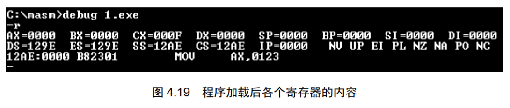

可以看到，Debug 将程序从可执行文件加载入内存后，`cx` 中存放的是程序的长度。`1.exe` 中程序的机器码共有15个字节。则 `1.exe` 加载后，`cx` 中的内容为 000FH。

现在程序已从 `1.exe` 中装入内存，接下来查看一下它的内容，可是我们查看哪里的内容呢？程序被装入内存的什么地方？我们如何得知？

这里，需要讲解一下在 DOS 系统中 `.EXE` 文件中的程序的加载过程。图 4.20 针对我们的问题，简要地展示了这个过程。

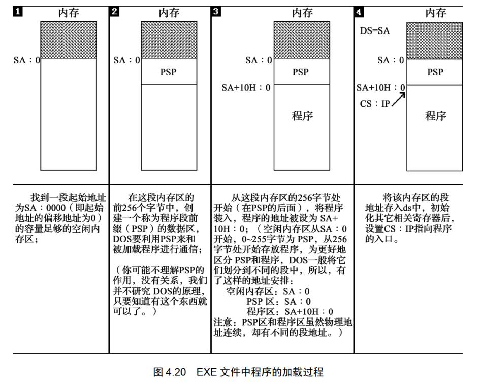

注意，有一步称为重定位的工作在图 4.20 中没有讲解，因为这个问题和操作系统的关系较大，我们不作讨论。

那么，我们的程序被装入内存的什么地方？我们如何得知？从图 4.20 中我们知道以下的信息。

1. 程序加载后，`ds` 中存放着程序所在内存区的段地址，这个内存区的偏移地址为 `0`，则程序所在的内存区的地址为 `ds:0`；
2. 这个内存区的前 256 个字节中存放的是 PSP，DOS 用来和程序进行通信。从 256 字节处向后的空间存放的是程序。

所以，从 `ds` 中可以得到 PSP 的段地址 SA，PSP 的偏移地址为 0，则物理地址为`SA×16+0`。因为 PSP 占`256(100H)`字节，所以程序的物理地址是：`SA×16+0+256=SA×16+16×16+0=(SA+16)×16+0`。可用段地址和偏移地址表示为：`SA+10H:0`。  

现在，我们看一下图 4.19 中 DS 的值，`DS=129E`，则 PSP 的地址为 `129E:0`，程序的地址为`12AE:0`(即`129E+10:0`)。

图 4.19 中，`CS=12AE`，`IP=0000`，`CS:IP` 指向程序的第一条指令。注意，源程序中的指令是 `mov ax,0123H`，在 Debug 中记为`mov ax,0123`，这是因为 Debug 默认所有数据都用十六进制表示。

可以用 U 命令看一下其他指令，如图 4.21 所示。  


可以看到，从`12AE:0000~12AE:000E` 都是程序的机器码。

现在，我们可以开始跟踪了，用 T 命令单步执行程序中的每一条指令，并观察每条指令的执行结果，到了 `int 21`，我们要用 P 命令执行，如图 4.22 所示。  

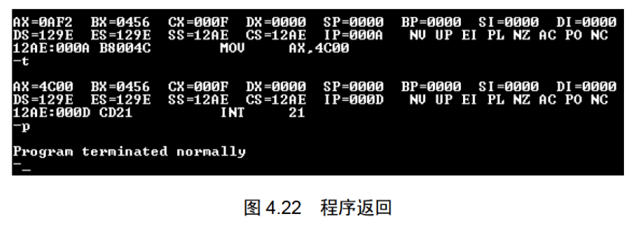

图 4.22 中，`int 21` 执行后，显示出 “Program terminated normally”，返回到 Debug 中。表示程序正常结束。注意，要使用 P 命令执行 `int 21`。这里不必考虑是为什么，只要记住这一点就可以了。

需要注意的是，在 DOS 中运行程序时，是 command 将程序加载入内存，所以程序运行结束后返回到 command 中，而在这里是 Debug 将程序加载入内存，所以程序运行结束后要返回到 Debug 中。

使用 Q 命令退出 Debug，将返回到 command 中，因为 Debug 是由 command 加载运行的。在 DOS 中用 “debug 1.exe” 运行 Debug 对 `1.exe` 进行跟踪时，程序加载的顺序是：command 加载 Debug，Debug 加载 1.exe。返回的顺序是：从 `1.exe` 中的程序返回到 Debug，从 Debug 返回到 command。  
