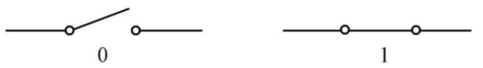
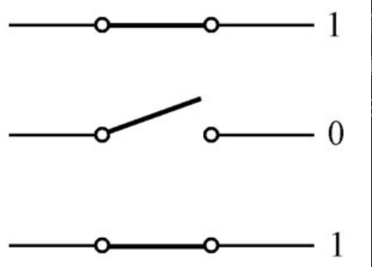
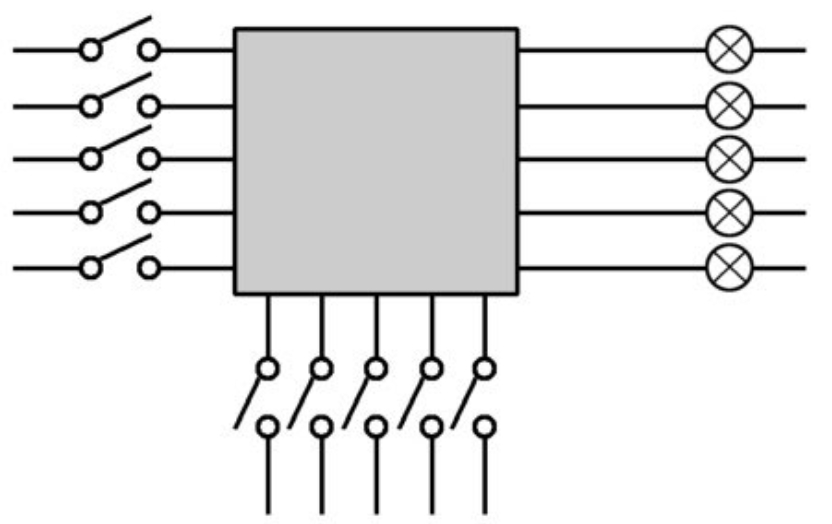

## 2.4 用开关来表示二进制数字

你发现因为二进制数只有0和1两个符号，所以马上想到这可以用开关来实现：当开关断开时，电流被切断，这代表0；当开关接通时，电路中有电流通过，这代表1，如图所示。



因为在大多数情况下，一个真正的二进制数不仅仅只有一个0或者一个1，它可能包含了很多比特，是一连串的0或1，所以要表示一个真正的二进制数，比如101（也就是十进制的5），就需要一排开关，每一个开关对应一个比特



在前面的设计过程中，由于忙着解决如何将数送到运算部件里去，我们还没有认真研究过另外一个重要问题，那就是当运算结果出来之后我们怎样知道它是不是正确，是否是我们真正想要的。

因为运算部件是以二进制的方式工作的，它送出来的运算结果自然也是用一排导线表示的二进制数。这样，我们可以把小灯泡接在每一根输出上，以此来显示这些输出的比特到底是0还是1



# 第3章 怎样才能让机器做加法

## 3.1 我们是怎样用十进制做加法的

在实际做加法的时候，要将被加数和加数从右边对齐，而开始计算的时候，也同样是从最右边的那一列开始。


首先是5+7。按照口诀“5加7等于2，进1”的指示，得到结果“2”，并向左产生一个进位。为了防止过后把这个进位忘了，上学的时候老师会告诉我们一个小小的技巧，在左边一列的下面写一个小小的“1”，表明这里有个进位。

现在左边只剩下“1”了，因为这一列只有它自己，所以通常是直接拽下来，作为结果的一部分。但是别忘了，这一列上还趴着一个进位，正眼巴巴地等着被“加”一下。所以，我们还要再使用口诀“1加1等于2”来得到这一列的结果“2”。至此，我们已经完成了这道加法题，结果是22。

## 3.2 用二进制做加法其实更简单

相比之下，二进制加法的口诀会比较简洁，因为它只有两个基本数字：0和1。所以，口诀的前三句是

```
0加0等于0
0加1等于1
1加0等于1
```

不要被表面现象所迷惑，尽管十进制里也有0和1这两个数字，但前面这三条不是十进制加法，尽管站在十进制的角度来看它们毫无疑问也是正确的。

0和1可以有4种相加的组合形式，前面已经有了3种，还剩下最后一种，即“1”和“1”相加。现在，二进制加法和十进制加法的相似性已经到此结束，在二进制里，1+1=10，但加法口诀的规则是必须表示成进位的形式：

```
1加1等于0，进1
```

比如110 + 11如图


## 3.3 使用全加器来构造加法机


# 第4章 电子计算机发明的前夜


