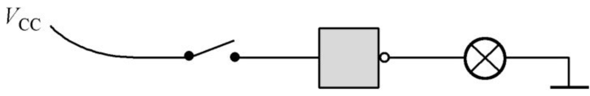

# 第3章 怎样才能让机器做加法

## 3.1 我们是怎样用十进制做加法的

在实际做加法的时候，要将被加数和加数从右边对齐，而开始计算的时候，也同样是从最右边的那一列开始。


首先是5+7。按照口诀“5加7等于2，进1”的指示，得到结果“2”，并向左产生一个进位。为了防止过后把这个进位忘了，上学的时候老师会告诉我们一个小小的技巧，在左边一列的下面写一个小小的“1”，表明这里有个进位。

现在左边只剩下“1”了，因为这一列只有它自己，所以通常是直接拽下来，作为结果的一部分。但是别忘了，这一列上还趴着一个进位，正眼巴巴地等着被“加”一下。所以，我们还要再使用口诀“1加1等于2”来得到这一列的结果“2”。至此，我们已经完成了这道加法题，结果是22。

## 3.2 用二进制做加法其实更简单

相比之下，二进制加法的口诀会比较简洁，因为它只有两个基本数字：0和1。所以，口诀的前三句是

```
0加0等于0
0加1等于1
1加0等于1
```

不要被表面现象所迷惑，尽管十进制里也有0和1这两个数字，但前面这三条不是十进制加法，尽管站在十进制的角度来看它们毫无疑问也是正确的。

0和1可以有4种相加的组合形式，前面已经有了3种，还剩下最后一种，即“1”和“1”相加。现在，二进制加法和十进制加法的相似性已经到此结束，在二进制里，1+1=10，但加法口诀的规则是必须表示成进位的形式：

```
1加1等于0，进1
```

比如110 + 11如图


## 3.3 使用全加器来构造加法机


两个二进制数相加、要和十进制加法一样对齐


不考虑其他列的进位时两个比特相加的4种可能


存在其他列的进位时两个比特相加的4种可能

既然加法都是按列进行的，而且每一列的计算过程都一样，那么完全可以设计一个电路来完成每一列的相加过程，如图所示。


<center><i><font size="2">全加器</font></i></center>

在图中，A和B分别是来自被加数和加数的一个比特，它们正好在同一列上；$C_i$是来自右边一列的进位；$C_o$是本列产生的进位；S是本列的“和”。为了表明这个电路的用途，我们在图的中间加了一个符号“∑”。在数学中，这个符号用来表示“加”，它的读音是“西格马”。

既然是一个电路，它肯定有一个名字。是的，它叫全加器。这不是一个很容易理解的名字，特别是这个“全”字。而且，既然有全加器，是不是还应该有“半加器”？你别说，还真有半加器这东西。但是，半加器仅仅是把来自被加数和加数的两个比特加起来，产生一个“和”以及一个进位，并不考虑从其他列来的进位。换句话说，它只是用电路来实现二进制加法口诀。全加器则不然，它真正实现了二进制加法中每一列的加法过程，所以它才叫做“全加器”。

有了全加器，解决了二进制加法过程中每一列的计算问题，那么，我们可以搞一大堆全加器，根据被加数和加数的比特数，把它们串联起来组成一个完整的加法电路，下图显示了这一过程。


<center><i><font size="2">由3个全加器组成的3比特加法机（结果是4比特）</font></i></center>

图中，参与相加的两个二进制数分别是a2a1a0和b2b1b0，组成它们的每一个比特都可以用开关的闭合与断开来得到。

可以看出，第一个（左下角那个）全加器的进位输入端没有使用，意思是“没有进位输入”，或者“从后面来的进位是0”。其余的全加器，它们的进位输入端都和前一个全加器的进位输出端相连，意思是“前面的，你产生进位了吗？如果有，我得加上它”。S2S1S0是两个二进制数相加后的最终结果。S3是最后一个全加器产生的进位，由于这是最后一个全加器，所以它的进位也是最终结果的一部分。

要造一台机器来计算加法，全加器无疑是最基础的零部件了。但是，这个全加器到底应当如何构造呢？看起来，我们已经离目标不远了，应该很快就能揭开最终的谜底。

事实上，还差得远呢。要想知道全加器的内部都是些什么，它是如何把3个比特加起来的，我们还必须回到过去，了解电与磁的历史，以及先哲们创立的逻辑学，看能不能从中得到一些启发。

# 继电器

继电器，从名称上说，它是给线路续电的。也就是说，当线路上电流很小的时候，适时地给它补充上。这种东西的原理如图所示。


这是一个简化的示意图，省去了支架之类的东西，为的是你能看得更清楚。它的主体是一个电磁铁，不过衔铁臂的下面多了一个金属触点。现在，分别从衔铁臂和金属触点上引出两根线，并串接一个电源，把这两根线作为另外一条电报线路架设到其他地方。**注意，电源并不是继电器的组成部分。**

今天，制定电子行业标准的部门为我们着想，给我们推荐一个简单的图形，让我们轻而易举就能画出一个继电器来，如图4.4所示。


<center><i><font size="2">图4.4 两种继电器的符号</font></i></center>

图中的方框代表电磁铁，而在右边，紧挨着它的是一个衔铁开关。同时，图中也表明了继电器实际上可以按工作状态分为两种：左边那种平时处于断开状态，只有在电磁铁加电的时候才吸合接通；右边那种则正好相反。


# 数字逻辑与逻辑电路

要用电流的通断来控制电路的开关需要使用继电器，而继电器这种东西我们已经认识了。最简单的电流开关如图5.4所示，它仅仅使用一只继电器，当有适当的电压加在A端时，有电流通过继电器而使它吸合，从而使得F端接通。


<center><i><font size="2">图5.4 继电器的作用是间接地控制另一个电路的通断</font></i></center>

看得出，这本来就是一个继电器，相当于一个间接的开关，A端有输入，则F端接通。

继电器仅仅是一个间接的开关，它唯一的作用就是使另一条线路接通，或者断开，就这么简单，用行家们的话说，属于无源器件。但是，有时候我们的想法会有些古怪，希望一个开关能“自行”产生输出，而不是仅仅把一个电路断开或者接通。要实现这个目的，就必须为这个开关配备电源（图5.5）。


<center><i><font size="2">图5.5 一个自带电源的继电器</font></i></center>

注意，电源现在是这个特殊电路的一部分。这样一来，它就不再像一个单纯的开关，更像在输出什么—当然是电能。所以，如果我们把A端看成输入，那么F端则名正言顺地是一个输出，而且F和A之间符合下面的关系：

```
F = A
```

除此之外，利用继电器还可以方便地实现另一种截然相反的功能。如图5.6所示，这次采用的是另一种继电器，平时它处于吸合状态，所以F端可以对外产生输出；当A端加上电压、继电器吸合的时候，F端的输出就消失了。所以，在这个电路里，输出F总是与输入A处于相反的状态。


<center><i><font size="2">图5.6 一个自带电源的常闭触点继电器属于非门</font></i></center>

因为这个原因，它也获得了一个非常专业的称呼，叫做“非门”。不管你怎么想，都应该愉快地接受，几十年来就一直叫这个名。

对于非门的应用，一个最简单的例子是用开关为非门提供输入，并用后者的输出控制灯泡的亮灭，如图5.7所示。


<center><i><font size="2">图5.7 一个应用非门的例子</font></i></center>

在这个例子中，非门的输入A是由电路左边的开关产生的，而输出F的状态总是和A相反，这可以通过灯泡的亮灭得到验证。

对于任何电器来说，它内部的每个部分都用同一个电源供电，门电路也不例外。在这个例子中，非门的输入和非门本身都使用同一个电源（图5.8）。


<center><i><font size="2">图5.8 在一个完整的电路中，各个组成部分共用电源是通常的做法</font></i></center>

为了不让电子工程师们笑话，还可以把它变得更简单。通常情况下，电源是不用画出来的，只用一些符号，比如“VCC”是指电源正极，表示那根电线要接到电源正极，而电路中所有的地线都应当汇集起来连到电源负极（注意，在这里，输入A是由开关提供的，尽管它来自VCC。当开关闭合时，A等于1；反之则A等于0），如图5.11所示。


<center><i><font size="2">图5.11 在电路图中，电源通常用VCC和接地来代替</font></i></center>

考虑到逻辑电路专家们的情绪，非门可以用简单的符号来表示（图5.13）。


<center><i><font size="2">图5.13 非门的符号</font></i></center>

非门的符号掩盖了它需要电源这一事实，但这是所有熟悉它的人都心照不宣的。最后，非门实现了逻辑否定，即逻辑非：


# 第7章 触发器

## 7.2 反馈和振荡器

拿一个继电器、一只灯泡和一个开关，用电线把它们按照图7.2那样连接起来。


<center><i><font size="2">图7.2 用开关和继电器控制另一个电路的通断</font></i></center>

很明显，这里所用的是一个常闭触点式的继电器，内部的衔铁开关通常处于接通状态。当左边的开关断开时，右边的灯泡是亮的；反之，当开关接通时，继电器的磁力把衔铁拉开，灯泡就——用我们平时的话说——灭火了。

在这里，整个电路可以共用同一个电源，而不是图7.2所示的两个，但本质上是没有区别的。


<center><i><font size="2">图7.3 继电器电路的另一种简化形式</font></i></center>

很明显，该电路的工作就是将输出变得与输入相反。如果你不太健忘的话，会发现这东西似曾相识。是的，常闭触点的继电器就是一个非门。所以，图7.3可以进一步简化成图7.4。



<center><i><font size="2">图7.4 带电源的常闭触点继电器（即一个非门）</font></i></center>

还是图7.3，我们把它的输入连同那个开关统统去掉，直接用它的输出作为输入，如图7.5所示。


<center><i><font size="2">图7.5 继电器的输入和输出共用一个电源时的不同情况</font></i></center>

这回，你猜怎么着？因为继电器的衔铁平时是闭合的，当它一通电，会立即使灯泡点亮。不过，这个输出又是继电器的输入，所以在灯泡亮的同时，电磁铁产生磁力，马上又把衔铁开关拉开，于是灯又灭了。

灯灭了不要紧，最要命的是电磁铁同时也失去了磁性，于是衔铁开关又恢复原状，将电路接通，灯又亮了。

可以肯定，只要电源还有电，这个经过如此特殊连接的电路将一直工作在一会儿有输出、一会儿没有输出的状态，而那只灯泡也将一亮一灭，就这样没完没了地进行下去。


<center><i><font size="2">图7.6 把非门的输出和输入相连构成一个振荡器</font></i></center>

把一个非门的输出取出一部分来，同时又作为它的输入，这样就形成了一个反馈。不光是在这里，就是在生活中，反馈的意思也是当别人对你有所表示的时候，你也要反过来对人家有所表示，这叫做礼尚往来。如果大家每个人都总是这样客气，大同社会也就指日可待。

一个非门，再加上反馈之后，就能产生一连串交替变化的输出，使得与之相连的灯泡一亮一灭。作为一种类比，像这种东西，在电子技术领域里叫做振荡器。

发明者往往有将他的成果用到极致的愿望，要是笛卡儿还活着，他一定想看看振荡器的输出在他的坐标系里是什么样子，我觉得我们应该替他做这件事。

一开始，非门是有输出的。我们用一条直线来表示，并且把它画在纸上靠上的位置。我们省略了坐标轴，因为输出的电压具体有多少伏并不重要，持续的时间（线条的长短）也不重要。不过很快，由于反馈的关系，非门失去了输出，这意味着输出为零。于是可以在刚才那条横线的下面，也就是我们自认为是零的地方，再画一条横线，表示当前没有输出，或者说输出是零伏，并且也用线条的长度代表持续时间。再往后，这个振荡器一直在工作，而它的输出也必然如图7.7那样交替变化下去。


<center><i><font size="2">图7.7 非门振荡器的输出是高低交替的</font></i></center>

老实说，这不是一个真实的振荡器输出图像。首先，由于继电器内部的开关是机械的，而所有的机械开关都有一个通病：在接通和断开的瞬间会发生抖动，或者说震颤，所以它的波形一开始像锯齿，但极其短暂，然后才稳定成一条直线。所有的机械开关都会存在这种问题，但是我们在这里可以无视它的存在，它对我们当前所讨论的主题没有影响，你自己知道就行啦。

其次，像你每次打开或者关闭水龙头一样，电路在接通或者断开的瞬间，电压或电流不会马上就达到最大值，总是有一个由小到大或者由大到小的过程。要是你家比较怀旧，还在用那种需要拧一拧才能出水的老式水龙头，这种现象就特别明显。对于电路来说，造成这种现象的原因是多方面的，而且这个变化过程通常也极其短暂。由于现代科技的进步，这个变化过程可以缩短到几纳秒（把1秒除以1000000000就得到了纳秒），或者更短暂。为了表示这个变化过程，需要在两种输出线条之间添加“坡度”，即一条非常陡峭的斜线。但是，由于这个过渡太快太陡了，看起来人们更喜欢为了图方便而直接把它画成一条直来直去的竖线，如图7.8的左侧所示。


<center><i><font size="2">图7.8 振荡器脉冲的上升沿和下降沿</font></i></center>

这是一种非常有规律的、周期性变化的波形，属于有棱有角的方形，因此在电学里叫做“方波”。它既像我们国家的万里长城，又像一条毛毛虫一拱一拱地在地上爬，同时，它也类似于我们人体那有规律地跳动着的脉搏，一个接着一个。也许正是因为这个原因，我们现在讲的这个振荡器，它所产生的方波总是被称为“脉冲”。对于人类来说，脉搏的跳动表明我们还活着；而对于计算机来说，脉冲的意义也同样如此。很快你就能从本书里了解到，如果没有脉冲，计算机就完了。


## 7.3 电子管时代

阴极射线管：1878年，英国科学家克鲁克斯发明了阴极射线管。阴极射线管是一个真空玻璃管，管内二侧安装了阴极和阳极，接上几万伏的高压电后，阴极会发射出一种“射线”，这种射线走直线，但在电场和磁场里会偏转方向，能在玻璃壳上产生荧光。英国人JJ汤姆森系统地研究了这种射线，1897年，他提出阴极射线是一种带电粒子，并取名为“电子”。

爱迪生效应:1883年，爱迪生在改良灯泡的灯丝时，尝试在灯泡中封入一个铜丝，竟然发现灯泡通电后，这根铜丝与灯丝间有微弱的电流。尽管这种现象当时没有任何实用价值，但爱迪生为其申请了专利，并称为“爱迪生效应”。
现在我们知道，这个电流的产生，是因为灯丝被加热到红炽状态后，灯丝上面会有非常活跃的电子，会脱离灯丝飞出去。正好灯丝上面有铜线，电子就飞到了铜线上面，因为有了电子的移动，自然就形成了电流(这个现象的专业名词应该是:零场热电子发射)


爱迪生搞了个专利之后就没再继续研究了。1904年，英国物理学家弗莱明他发现了，如果在那个铜线上面加上正电，也就是在上图中电流表的位置加个电源，此时电流会大大增加。这是因为加上电源之后，上面的铜丝带正电，而电子带负电，异性相吸，铜丝对电子有吸引力，就被吸过去了。而如果加上负电，同性排斥电子被排斥，到不了铜线，电流就没有了。这就是单向导电性，也就是二极管，世界上第一支二极管就这么出来了，这也使得了爱迪生效应有了真正的应用。


电子二极管:这是世界上第一只电子管也是后来人们所说的“真空二极管”，它是将玻璃瓶内部抽真空，以利于游离电子的流动，也可有效降低灯丝的氧化损耗。现在看来，从爱迪生效应到二极管只需在把铜丝做成极片再加上正电压就行好像很简单。但当时，一些理论未发展起来，也缺少应用需求。后来，交流电的应用，以及无线电的发明，需要用到“整流”和“检波”，二极管就应运而生了。


它的发明标志着人类进入了无线电时代。到1920年，真空管技术已经能成熟地连接到无线电接收机，使无线电广播成为可能。


### 电子二极管结构


=======================

1904年的11月16日是电学史上一个很重要的日子，在那天，一个名叫弗莱明的英国人发明了一种新鲜玩意儿。这东西说起来真是很简单，其实就是一个灯泡，也就是说，它是一个已经被抽成真空的玻璃瓶，里面装有灯丝，通上电可以灼热发光。（要让灯丝通电后升温发光，须将灯泡抽成真空，防止灯丝在高温下氧化，这可算是最简单的真空器件了）

当然，它肯定不会仅仅是一只普通的灯泡，要不然称它为一种发明实在说不过去，因为远在大洋彼岸的爱迪生该不高兴了。在这个玻璃瓶里，有一根导线安装在离灯丝不远的地方（但不是挨在一起），隔着一定的距离，再安装上另一根导线，就像图7.9所示的那样。


<center><i><font size="2">图7.9 整个20世纪的电学成就始于这个简单的发明</font></i></center>

这个装置没有什么特别之处，除了里面多加两根电线、显得有些古怪之外，它和一只真正的灯泡没有什么区别。

这个世界真的是很奇妙，平平常常的事物往往隐藏着玄机，取决于你是否有心。现在，我们再拿一只灯泡——这回是真正的灯泡，也就是我们平时经常使用的那种。然后，再用一个电源按照图7.10所示那样连接起来。


<center><i><font size="2">图7.10 这是一个具有单向导电性的发明</font></i></center>

通常情况下，右边那只灯泡是不会亮的，这符合我们从生活中得来的常识，因为两根电线是分开的，即使它们被一个抽成真空的瓶子罩着，那又怎么样？隔着那么远，这相当于断路，电流是无法通过这段空间的。

不要这么肯定，我们就是因为喜欢想当然地下结论，才经常犯错误，以至于功劳都被那些有心人抢去了。实际上，要是给灯丝通上电，让它灼热发光，这回，在真空中，两个隔着一定距离的导线竟然有电流通过，右边那只灯泡居然亮了。这真是太奇怪了，以至于有个富于想象力的作家把这种现象称为“真空驯电子”，很贴切，也很形象，只是经常让我想起耍猴儿。

世界真奇妙，只是不知道。这已经足以让人目瞪口呆的了，但是更令人惊讶的是——这也是它特别有用的原因——如果把电源的正、负极对调一下，让离灯丝很近的那根导线接正极，另一根接负极，这回，电流却消失了。

这事儿肯定和灼热的灯丝有关，因为只有在它通电烧热的时候才会发生这样的事，但不一定是非常直接的关系。毕竟，在灯丝和接电源负极的那根导线之间还有一点点距离。

这在当时，具体的原因弗莱明也不清楚。现在我们已经知道，要是在两根金属之间加上电压，被灯丝烤得灼热的金属可以在真空里发射电子。或者换一种比喻，因为导线离灯丝很近，会被灯丝加热到很高的温度。**这也是第一次以无可辩驳的事实证明了，电子其实是从负极（阴极）出来，流回正极（阳极），而不是长期以来一直认为的那样，从电源的正极出来，流回负极。**

弗莱明用来做实验的装置和我们现在所描述的不太一样，其中最大的区别就在于他的玻璃管里没有那根靠近灯丝的导线，而是直接用灯丝来代替那根靠近它的金属，但原理和实际效果一样。

这个装置对电源的接法很挑剔，用术语来说就是具有单向导电性。它还有一个专业名称，叫做电子二极管，毕竟，它真正有用的只是那两根被分隔开的电极，而灯丝则不算在内。为了便于说明，我们把靠近灯丝的那块金属叫做阴极，因为它通常要接在电源的负极上，主要的作用是发射电子；另一块金属叫做阳极，通常接在电源的正极上，用来把电子从阴极吸引过去。还有两个引脚是用来给灯丝供电的，不是真正对我们有用的那一部分。如图7.11所示，那是它的专用符号。注意观察那个图，阴极被画成一个半圆。这不是为了显得美观而特意这样画的，而是当人们了解了电子二极管的工作原理之后，为了使阴极能更有效地被灯丝加热，把它做成了一个筒形，像小桶一样把灯丝罩在里面。而且，在这个小桶的底部，涂了一层氧化物，比如氧化铜，这是因为氧化物在加热之后，发射电子的本领更高。

弗莱明发明了电子二极管，这个不假。问题是怎么就那么巧，他偏偏就拿了一只灯泡，在里面装了导体，有了这项发明，弄得好像先知先觉，就是冲着这个结果来的。


<center><i><font size="2">图7.11 电子二极管的符号</font></i></center>

按照通常的说法，弗莱明能搞出这个东西，最初的灵感来源于爱迪生，是后者在发明灯泡的过程中曾经发现过这种现象，作为一名科学家，爱迪生本能地意识到这是很不寻常的，值得进一步认真研究。但是很不幸，这个大忙人当时已经被灯丝的事情搞得晕头转向，根本没有时间深究这种现象。他所做的，只是把当时的情况记下来，然后接着干手头上的活儿。大家都为爱迪生感到惋惜，这是可以理解的，但是不必要。他当时那么忙，实在是抽不出精力来顾及这件事情。

那个时代是电学大发展的前夜，知识不足，热情有余，人们乐于尝试，仿佛有使不完的劲儿——用现在比较流行的话说，他们搞起科学研究来非常“生猛”。如果有一天早上发现牛粪上长了一棵牵牛花儿，他们会兴致勃勃地尝试所有的植物，折腾它们，看看是不是会有别的事情发生。就这样，在大致明白了电子二极管的原理之后，他们开始往里面加入一些别的东西——通常都是金属——看看除了爆炸之外，是不是会发生另外一些有意思的事。

在这方面干得最起劲儿的人是福雷斯特，一个美国人。世人对他小时候的评价不怎么高，说他很孤僻，甚至“有点儿精神分裂”。这可能是因为家庭方面的原因，他们在当地不是特别受欢迎。不过，他一个人倒是玩得挺开心，据说最大的特点是喜欢动手摆弄各种机械。

由于刚刚发明了电子二极管，弗莱明很高兴，这是可以理解的。不过也有人不高兴，甚至可以说是非常失落，这个人就是福雷斯特。

这个福雷斯特野心勃勃，据说一开始和弗莱明一样，受了爱迪生做那个实验的启发，想搞出点儿发明，不料还没等他搞出什么名堂，那边已经传来了弗莱明发明电子二极管的消息。福雷斯特经济条件不是很好，又一心想做出点儿发明，取得一些成就，在这种情况下，他的心情可想而知。

失望的福雷斯特开始摆弄电子二极管，希望能为它做些完善的工作。很自然地，人们会想到，既然电子是从阴极通过真空流向阳极，那么，能不能控制它的流量，同时，也许能够看到一些古怪的事情发生。总之，不试试，谁知道呢？

为了控制电子从阴极到阳极之间的流动，他在原有的电子二极管里，也就是阴极和阳极之间，又加入一根金属丝，后来又改成金属网。之所以做成网状，是因为既能够让电子们容易通过，又可以对它们施加控制，很像我们平时看到的栅栏，所以称之为控制栅极，简称栅极，如图7.12所示。


<center><i><font size="2">图7.12 电子三极管的符号</font></i></center>

历史证明，福雷斯特笑到了最后，他的锲而不舍最终给自己带来了好运气，也使他名留史册。在这个装置上，他给阴极和阳极供电，就像电子二极管那样。同时，也给阴极和栅极供电，如图7.13所示。


<center><i><font size="2">图7.13 电子三极管的原理示意</font></i></center>

和他预料的一样，福雷斯特发现，通过改变栅极上电压的大小和极性，可以改变阳极上电流的强弱，甚至切断它，这叫做截止。

这的确很有意思，但差不多是在意料之中，似乎没有什么新意。不过，令人意想不到的是，只要栅极上的电流发生一点点变化，阳极上的电流就会大幅度地跟着改变。比如上图，细微地调整栅级电源，就会明显地改变灯泡的亮度。

这意味着，因为比电子二极管多长了一条腿，电子三极管具有放大作用。所以，这在电学史上是个很重要的事件，值得整个科学界集体庆祝一下，举行仪式，开怀畅饮，不醉不归。要知道，如果没有这个开端，恐怕我们现在还听不上音响，看不成电视，觉得每天下班回到家听一听爱迪生发明的唱片已经是最大的享受，吃完饭百无聊赖，坐在床上哄孩子们睡觉都能把自己哄睡着。

注意，电子三极管的放大效果不是无端地凭空产生的，这个放大后的能量来自于电源，它只是一个转换器。

这个发现的意义非同寻常，而福雷斯特发明的电子三极管也很快风靡全世界，派上了大用场。首先，贝尔和爱迪生他们肯定非常喜欢，因为他们正为电话的信号太弱而发愁，有了电子三极管，无论多微弱的声音信号，都可以变得十分洪亮。要是一只电子三极管放大的倍数不够，还可以多加几只进行接力放大，这都不是问题。

除了有线的东西需要电子管，无线的东西也搭上了顺风车。利用它的放大作用，再加上适当的反馈，就可以形成一个振荡器，能够产生固定频率的振荡电流。如果它的振荡频率足够高，就能向很远的地方发射无线电波，而且它的优势是可以获得极高的振荡频率，因为电子管的开关速度很快。

这是真正纯正优美的振荡，不但辐射电磁波的效率高了，而且只在固定的频率上工作，除非接收器希望接收这个频率上的信号，它不会对其他频率的接收器产生干扰，尽管天空中的无线电波越来越多，大家却都能相安无事。事实上，也就是从这个时候开始，利用电磁波进行语音和电报通信的时代开始了。

从电子管发明的那一刻到现在，全世界生产的电子三极管数都数不过来。人们称赞福雷斯特，说他“推动了无线电技术的迅猛发展，引发了一场革命并奠定了近代电子工业的基础”。福雷斯特一直活到1961年，一生中共拥有300多项发明专利，被人们尊称为“无线电之父”。但正如有些人所感叹的那样，很少有像他那样是这么多发明的父亲。


# 第9章

## 9.1 纯电子化的计算时代

我曾经看到过一些文章，说最早的计算机是电子管的。这倒没错，事实的确如此。不过，在他们的字里行间，我读到的意思是，因为要发明电子计算机，所以才有了电子管。老实说，这是真正的奇谈怪论。

世界上第一只电子二极管发明于1904年，第三年，也就是1906年，福雷斯特才发明了电子三极管。电子二极管和三极管的发明不是因为要制造计算机，相反，它们被广泛地应用于电话、电报和无线电通信。原因很简单，因为现代的电子计算机还没有走过理论准备阶段。那些将要在日后大出风头的计算机先驱们，此时还都是一些毛头小子，过着和他们同龄人一样的生活。尽管1918年埃克尔斯和乔丹发明了世界上第一个触发器装置，但他们尚不知道这东西有什么用处。

直到1936年，情况也没有什么太大的改观，唯一的例外是香农发表了他的论文《继电器和开关电路的符号化分析》。在这篇论文里，他打通了进入数字王国的第一道关口，那就是，如何根据我们想要得到的结果来构造一个开关电路。

香农的工作是基础性的，特别是对于制造现代的电子计算机。具有讽刺性的是，数字电路的第一个应用并不是电子计算机，而是被用做电话交换。事实上，这也正是香农先生本来的目标。

我们知道，每一部电话都应该和其他任何一部电话相连，这是保证它们互相能够通话的必要条件。但是，你不可能真的把全国乃至全球的电话都在物理上一对一地连起来，这样做的成本高到无法实现。解决之道是铺设公共的主干线路，每部电话只在必要的时候才会和主干线路接通。

最早的时候，使一些电话互相连通而另一些电话断开的工作是由人工完成的，这些负责接线的人称为接线员。接线员通常都是女性，因为她们有耐心，记性好。这样，当吕桂花想和在外地工作的丈夫牛三斤通话时，视距离远近，可能需要经过多次转接才行。

电话接线的岗位能提供大量的就业机会，但科学家们却不管这些，他们心里想的仅仅是“我能让打电话的麻烦程度降到最低吗”。这样，当开关电路的理论建立起来之后，第一个受益的就是电话交换。当一部电话拨出号码之后，交换电路就会产生一个输出，使某个继电器吸合，从而将两部电话接通；当用户煲完了电话粥，挂机之后，继电器断开，让出干线供其他用户使用。本质上，我们现在的电话交换机也是这么工作的。

数学和逻辑电路的发展吸引了一批年轻的科学家，使他们看到了从事计算机研究的前途，并愿意把自己一生的时光倾注在这个领域里。传统上，所有的计算机都是机械的，比如算盘和齿轮。机械的东西并不是不好，你看起重机和挖掘机都很能干，在掘地负重方面是无可替代的，但是要用机械的办法来造计算机、搞数学计算，就显得很笨拙：精度不高、速度慢、操作起来麻烦。


