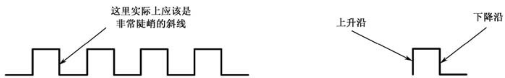

# 第3章 怎样才能让机器做加法

## 3.1 我们是怎样用十进制做加法的

在实际做加法的时候，要将被加数和加数从右边对齐，而开始计算的时候，也同样是从最右边的那一列开始。


首先是5+7。按照口诀“5加7等于2，进1”的指示，得到结果“2”，并向左产生一个进位。为了防止过后把这个进位忘了，上学的时候老师会告诉我们一个小小的技巧，在左边一列的下面写一个小小的“1”，表明这里有个进位。

现在左边只剩下“1”了，因为这一列只有它自己，所以通常是直接拽下来，作为结果的一部分。但是别忘了，这一列上还趴着一个进位，正眼巴巴地等着被“加”一下。所以，我们还要再使用口诀“1加1等于2”来得到这一列的结果“2”。至此，我们已经完成了这道加法题，结果是22。

## 3.2 用二进制做加法其实更简单

相比之下，二进制加法的口诀会比较简洁，因为它只有两个基本数字：0和1。所以，口诀的前三句是

```
0加0等于0
0加1等于1
1加0等于1
```

不要被表面现象所迷惑，尽管十进制里也有0和1这两个数字，但前面这三条不是十进制加法，尽管站在十进制的角度来看它们毫无疑问也是正确的。

0和1可以有4种相加的组合形式，前面已经有了3种，还剩下最后一种，即“1”和“1”相加。现在，二进制加法和十进制加法的相似性已经到此结束，在二进制里，1+1=10，但加法口诀的规则是必须表示成进位的形式：

```
1加1等于0，进1
```

比如110 + 11如图


## 3.3 使用全加器来构造加法机


两个二进制数相加、要和十进制加法一样对齐


不考虑其他列的进位时两个比特相加的4种可能


存在其他列的进位时两个比特相加的4种可能

既然加法都是按列进行的，而且每一列的计算过程都一样，那么完全可以设计一个电路来完成每一列的相加过程，如图所示。


<center><i><font size="2">全加器</font></i></center>

在图中，A和B分别是来自被加数和加数的一个比特，它们正好在同一列上；$C_i$是来自右边一列的进位；$C_o$是本列产生的进位；S是本列的“和”。为了表明这个电路的用途，我们在图的中间加了一个符号“∑”。在数学中，这个符号用来表示“加”，它的读音是“西格马”。

既然是一个电路，它肯定有一个名字。是的，它叫全加器。这不是一个很容易理解的名字，特别是这个“全”字。而且，既然有全加器，是不是还应该有“半加器”？你别说，还真有半加器这东西。但是，半加器仅仅是把来自被加数和加数的两个比特加起来，产生一个“和”以及一个进位，并不考虑从其他列来的进位。换句话说，它只是用电路来实现二进制加法口诀。全加器则不然，它真正实现了二进制加法中每一列的加法过程，所以它才叫做“全加器”。

有了全加器，解决了二进制加法过程中每一列的计算问题，那么，我们可以搞一大堆全加器，根据被加数和加数的比特数，把它们串联起来组成一个完整的加法电路，下图显示了这一过程。


<center><i><font size="2">由3个全加器组成的3比特加法机（结果是4比特）</font></i></center>

图中，参与相加的两个二进制数分别是a2a1a0和b2b1b0，组成它们的每一个比特都可以用开关的闭合与断开来得到。

可以看出，第一个（左下角那个）全加器的进位输入端没有使用，意思是“没有进位输入”，或者“从后面来的进位是0”。其余的全加器，它们的进位输入端都和前一个全加器的进位输出端相连，意思是“前面的，你产生进位了吗？如果有，我得加上它”。S2S1S0是两个二进制数相加后的最终结果。S3是最后一个全加器产生的进位，由于这是最后一个全加器，所以它的进位也是最终结果的一部分。

要造一台机器来计算加法，全加器无疑是最基础的零部件了。但是，这个全加器到底应当如何构造呢？看起来，我们已经离目标不远了，应该很快就能揭开最终的谜底。

事实上，还差得远呢。要想知道全加器的内部都是些什么，它是如何把3个比特加起来的，我们还必须回到过去，了解电与磁的历史，以及先哲们创立的逻辑学，看能不能从中得到一些启发。

# 继电器

继电器，从名称上说，它是给线路续电的。也就是说，当线路上电流很小的时候，适时地给它补充上。这种东西的原理如图所示。


这是一个简化的示意图，省去了支架之类的东西，为的是你能看得更清楚。它的主体是一个电磁铁，不过衔铁臂的下面多了一个金属触点。现在，分别从衔铁臂和金属触点上引出两根线，并串接一个电源，把这两根线作为另外一条电报线路架设到其他地方。**注意，电源并不是继电器的组成部分。**

今天，制定电子行业标准的部门为我们着想，给我们推荐一个简单的图形，让我们轻而易举就能画出一个继电器来，如图4.4所示。


<center><i><font size="2">图4.4 两种继电器的符号</font></i></center>

图中的方框代表电磁铁，而在右边，紧挨着它的是一个衔铁开关。同时，图中也表明了继电器实际上可以按工作状态分为两种：左边那种平时处于断开状态，只有在电磁铁加电的时候才吸合接通；右边那种则正好相反。


# 数字逻辑与逻辑电路

要用电流的通断来控制电路的开关需要使用继电器，而继电器这种东西我们已经认识了。最简单的电流开关如图5.4所示，它仅仅使用一只继电器，当有适当的电压加在A端时，有电流通过继电器而使它吸合，从而使得F端接通。


<center><i><font size="2">图5.4 继电器的作用是间接地控制另一个电路的通断</font></i></center>

**继电器仅仅是一个间接的开关，它唯一的作用就是使另一条线路接通，或者断开，就这么简单，用行家们的话说，属于无源器件。**但是，有时候我们的想法会有些古怪，希望一个开关能“自行”产生输出，而不是仅仅把一个电路断开或者接通。要实现这个目的，就必须为这个开关配备电源（图5.5）。


<center><i><font size="2">图5.5 一个自带电源的继电器</font></i></center>

注意，电源现在是这个特殊电路的一部分。这样一来，它就不再像一个单纯的开关，更像在输出什么—当然是电能。所以，如果我们把A端看成输入，那么F端则名正言顺地是一个输出，而且F和A之间符合下面的关系：

```
F = A
```

除此之外，利用继电器还可以方便地实现另一种截然相反的功能。如图5.6所示，这次采用的是另一种继电器，平时它处于吸合状态，所以F端可以对外产生输出；当A端加上电压、继电器吸合的时候，F端的输出就消失了。所以，在这个电路里，输出F总是与输入A处于相反的状态。


<center><i><font size="2">图5.6 一个自带电源的常闭触点继电器属于非门</font></i></center>

因为这个原因，它也获得了一个非常专业的称呼，叫做“非门”。不管你怎么想，都应该愉快地接受，几十年来就一直叫这个名。

对于非门的应用，一个最简单的例子是用开关为非门提供输入，并用后者的输出控制灯泡的亮灭，如图5.7所示。


<center><i><font size="2">图5.7 一个应用非门的例子</font></i></center>

在这个例子中，非门的输入A是由电路左边的开关产生的，而输出F的状态总是和A相反，这可以通过灯泡的亮灭得到验证。

对于任何电器来说，它内部的每个部分都用同一个电源供电，门电路也不例外。在这个例子中，非门的输入和非门本身都使用同一个电源（图5.8）。


<center><i><font size="2">图5.8 在一个完整的电路中，各个组成部分共用电源是通常的做法</font></i></center>

为了不让电子工程师们笑话，还可以把它变得更简单。通常情况下，电源是不用画出来的，只用一些符号，比如“VCC”是指电源正极，表示那根电线要接到电源正极，而电路中所有的地线都应当汇集起来连到电源负极（注意，在这里，输入A是由开关提供的，尽管它来自VCC。当开关闭合时，A等于1；反之则A等于0），如图5.11所示。


<center><i><font size="2">图5.11 在电路图中，电源通常用VCC和接地来代替</font></i></center>

考虑到逻辑电路专家们的情绪，非门可以用简单的符号来表示（图5.13）。


<center><i><font size="2">图5.13 非门的符号</font></i></center>

非门的符号掩盖了它需要电源这一事实，但这是所有熟悉它的人都心照不宣的。最后，非门实现了逻辑否定，即逻辑非：


# 第7章 触发器

## 7.2 反馈和振荡器

拿一个继电器、一只灯泡和一个开关，用电线把它们按照图7.2那样连接起来。


<center><i><font size="2">图7.2 用开关和继电器控制另一个电路的通断</font></i></center>

很明显，这里所用的是一个常闭触点式的继电器，内部的衔铁开关通常处于接通状态。当左边的开关断开时，右边的灯泡是亮的；反之，当开关接通时，继电器的磁力把衔铁拉开，灯泡就——用我们平时的话说——灭火了。

在这里，整个电路可以共用同一个电源，而不是图7.2所示的两个，但本质上是没有区别的。


<center><i><font size="2">图7.3 继电器电路的另一种简化形式</font></i></center>

很明显，该电路的工作就是将输出变得与输入相反。如果你不太健忘的话，会发现这东西似曾相识。是的，常闭触点的继电器就是一个非门。所以，图7.3可以进一步简化成图7.4。


<center><i><font size="2">图7.4 带电源的常闭触点继电器（即一个非门）</font></i></center>

还是图7.3，我们把它的输入连同那个开关统统去掉，直接用它的输出作为输入，如图7.5所示。


<center><i><font size="2">图7.5 继电器的输入和输出共用一个电源时的不同情况</font></i></center>

这回，你猜怎么着？因为继电器的衔铁平时是闭合的，当它一通电，会立即使灯泡点亮。不过，这个输出又是继电器的输入，所以在灯泡亮的同时，电磁铁产生磁力，马上又把衔铁开关拉开，于是灯又灭了。

灯灭了不要紧，最要命的是电磁铁同时也失去了磁性，于是衔铁开关又恢复原状，将电路接通，灯又亮了。

可以肯定，只要电源还有电，这个经过如此特殊连接的电路将一直工作在一会儿有输出、一会儿没有输出的状态，而那只灯泡也将一亮一灭，就这样没完没了地进行下去。


<center><i><font size="2">图7.6 把非门的输出和输入相连构成一个振荡器</font></i></center>

把一个非门的输出取出一部分来，同时又作为它的输入，这样就形成了一个反馈。不光是在这里，就是在生活中，反馈的意思也是当别人对你有所表示的时候，你也要反过来对人家有所表示，这叫做礼尚往来。如果大家每个人都总是这样客气，大同社会也就指日可待。

一个非门，再加上反馈之后，就能产生一连串交替变化的输出，使得与之相连的灯泡一亮一灭。这在电子技术领域里叫做振荡器。

发明者往往有将他的成果用到极致的愿望，要是笛卡儿还活着，他一定想看看振荡器的输出在他的坐标系里是什么样子，我觉得我们应该替他做这件事。

一开始，非门是有输出的，我们用一条直线来表示，并且把它画在纸上靠上的位置。我们省略了坐标轴，因为输出的电压具体有多少伏并不重要，持续的时间（线条的长短）也不重要。不过很快，由于反馈的关系，非门失去了输出，这意味着输出为零。于是可以在刚才那条横线的下面，也就是我们自认为是零的地方，再画一条横线，表示当前没有输出，或者说输出是零伏，并且也用线条的长度代表持续时间。再往后，这个振荡器一直在工作，而它的输出也必然如图7.7那样交替变化下去。


<center><i><font size="2">图7.7 非门振荡器的输出是高低交替的</font></i></center>

老实说，这不是一个真实的振荡器输出图像。首先，由于继电器内部的开关是机械的，而所有的机械开关都有一个通病：在接通和断开的瞬间会发生抖动，或者说震颤，所以它的波形一开始像锯齿，但极其短暂，然后才稳定成一条直线。所有的机械开关都会存在这种问题，但是我们在这里可以无视它的存在，它对我们当前所讨论的主题没有影响，你自己知道就行啦。

其次，像你每次打开或者关闭水龙头一样，电路在接通或者断开的瞬间，电压或电流不会马上就达到最大值，总是有一个由小到大或者由大到小的过程。要是你家比较怀旧，还在用那种需要拧一拧才能出水的老式水龙头，这种现象就特别明显。对于电路来说，造成这种现象的原因是多方面的，而且这个变化过程通常也极其短暂。由于现代科技的进步，这个变化过程可以缩短到几纳秒（把1秒除以1000000000就得到了纳秒），或者更短暂。为了表示这个变化过程，需要在两种输出线条之间添加“坡度”，即一条非常陡峭的斜线。但是，由于这个过渡太快太陡了，看起来人们更喜欢为了图方便而直接把它画成一条直来直去的竖线，如图7.8的左侧所示。



<center><i><font size="2">图7.8 振荡器脉冲的上升沿和下降沿</font></i></center>

这是一种非常有规律的、周期性变化的波形，属于有棱有角的方形，因此在电学里叫做“方波”。它既像我们国家的万里长城，又像一条毛毛虫一拱一拱地在地上爬，同时，它也类似于我们人体那有规律地跳动着的脉搏，一个接着一个。也许正是因为这个原因，我们现在讲的这个振荡器，它所产生的方波总是被称为“脉冲”。对于人类来说，脉搏的跳动表明我们还活着；而对于计算机来说，脉冲的意义也同样如此。很快你就能从本书里了解到，如果没有脉冲，计算机就完了。


## 7.3 电子管时代

1904年的11月16日是电学史上一个很重要的日子，在那天，一个名叫弗莱明的英国人发明了一种新鲜玩意儿。这东西说起来真是很简单，其实就是一个灯泡，也就是说，它是一个已经被抽成真空的玻璃瓶，里面装有灯丝，通上电可以灼热发光。（要让灯丝通电后升温发光，须将灯泡抽成真空，防止灯丝在高温下氧化，这可算是最简单的真空器件了）

当然，它肯定不会仅仅是一只普通的灯泡，要不然称它为一种发明实在说不过去，因为远在大洋彼岸的爱迪生该不高兴了。在这个玻璃瓶里，有一根导线安装在离灯丝不远的地方（但不是挨在一起），隔着一定的距离，再安装上另一根导线，就像图7.9所示的那样。


<center><i><font size="2">图7.9 整个20世纪的电学成就始于这个简单的发明</font></i></center>

这个装置没有什么特别之处，除了里面多加两根电线、显得有些古怪之外，它和一只真正的灯泡没有什么区别。

这个世界真的是很奇妙，平平常常的事物往往隐藏着玄机，取决于你是否有心。现在，我们再拿一只灯泡——这回是真正的灯泡，也就是我们平时经常使用的那种。然后，再用一个电源按照图7.10所示那样连接起来。


<center><i><font size="2">图7.10 这是一个具有单向导电性的发明</font></i></center>

通常情况下，右边那只灯泡是不会亮的，这符合我们从生活中得来的常识，因为两根电线是分开的，即使它们被一个抽成真空的瓶子罩着，那又怎么样？隔着那么远，这相当于断路，电流是无法通过这段空间的。

不要这么肯定，我们就是因为喜欢想当然地下结论，才经常犯错误，以至于功劳都被那些有心人抢去了。实际上，要是给灯丝通上电，让它灼热发光，这回，在真空中，两个隔着一定距离的导线竟然有电流通过，右边那只灯泡居然亮了。这真是太奇怪了，以至于有个富于想象力的作家把这种现象称为“真空驯电子”，很贴切，也很形象，只是经常让我想起耍猴儿。

世界真奇妙，只是不知道。这已经足以让人目瞪口呆的了，但是更令人惊讶的是——这也是它特别有用的原因——如果把电源的正、负极对调一下，让离灯丝很近的那根导线接正极，另一根接负极，这回，电流却消失了。

这在当时，具体的原因弗莱明也不清楚。现在我们已经知道，要是在两根金属之间加上电压，被灯丝烤得灼热的金属可以在真空里发射电子。**这也是第一次以无可辩驳的事实证明了，电子其实是从负极（阴极）出来，流回正极（阳极），而不是长期以来一直认为的那样，从电源的正极出来，流回负极。**

弗莱明用来做实验的装置和我们现在所描述的不太一样，其中最大的区别就在于他的玻璃管里没有那根靠近灯丝的导线，而是直接用灯丝来代替那根靠近它的金属，但原理和实际效果一样。

**这个装置对电源的接法很挑剔，用术语来说就是具有单向导电性。它还有一个专业名称，叫做电子二极管，毕竟，它真正有用的只是那两根被分隔开的电极，而灯丝则不算在内。**为了便于说明，我们把靠近灯丝的那块金属叫做阴极，因为它通常要接在电源的负极上，主要的作用是发射电子；另一块金属叫做阳极，通常接在电源的正极上，用来把电子从阴极吸引过去。还有两个引脚是用来给灯丝供电的，不是真正对我们有用的那一部分。如图7.11所示，那是它的专用符号。注意观察那个图，阴极被画成一个半圆，这不是为了显得美观而特意这样画的，而是当人们了解了电子二极管的工作原理之后，为了使阴极能更有效地被灯丝加热，把它做成了一个筒形，像小桶一样把灯丝罩在里面。而且，在这个小桶的底部，涂了一层氧化物，比如氧化铜，这是因为氧化物在加热之后，发射电子的本领更高。

弗莱明发明了电子二极管，这个不假。问题是怎么就那么巧，他偏偏就拿了一只灯泡，在里面装了导体，有了这项发明，弄得好像先知先觉，就是冲着这个结果来的。


<center><i><font size="2">图7.11 电子二极管的符号</font></i></center>

按照通常的说法，弗莱明能搞出这个东西，最初的灵感来源于爱迪生，是后者在发明灯泡的过程中曾经发现过这种现象，作为一名科学家，爱迪生本能地意识到这是很不寻常的，值得进一步认真研究。但是很不幸，这个大忙人当时已经被灯丝的事情搞得晕头转向，根本没有时间深究这种现象。他所做的，只是把当时的情况记下来，然后接着干手头上的活儿。大家都为爱迪生感到惋惜，这是可以理解的，但是不必要。他当时那么忙，实在是抽不出精力来顾及这件事情。

那个时代是电学大发展的前夜，知识不足，热情有余，人们乐于尝试，仿佛有使不完的劲儿——用现在比较流行的话说，他们搞起科学研究来非常“生猛”。如果有一天早上发现牛粪上长了一棵牵牛花儿，他们会兴致勃勃地尝试所有的植物，折腾它们，看看是不是会有别的事情发生。就这样，在大致明白了电子二极管的原理之后，他们开始往里面加入一些别的东西——通常都是金属——看看除了爆炸之外，是不是会发生另外一些有意思的事。

在这方面干得最起劲儿的人是福雷斯特，一个美国人。世人对他小时候的评价不怎么高，说他很孤僻，甚至“有点儿精神分裂”。这可能是因为家庭方面的原因，他们在当地不是特别受欢迎。不过，他一个人倒是玩得挺开心，据说最大的特点是喜欢动手摆弄各种机械。

由于刚刚发明了电子二极管，弗莱明很高兴，这是可以理解的。不过也有人不高兴，甚至可以说是非常失落，这个人就是福雷斯特。

这个福雷斯特野心勃勃，据说一开始和弗莱明一样，受了爱迪生做那个实验的启发，想搞出点儿发明，不料还没等他搞出什么名堂，那边已经传来了弗莱明发明电子二极管的消息。福雷斯特经济条件不是很好，又一心想做出点儿发明，取得一些成就，在这种情况下，他的心情可想而知。

失望的福雷斯特开始摆弄电子二极管，希望能为它做些完善的工作。很自然地，人们会想到，既然电子是从阴极通过真空流向阳极，那么，能不能控制它的流量，同时，也许能够看到一些古怪的事情发生。总之，不试试，谁知道呢？

为了控制电子从阴极到阳极之间的流动，他在原有的电子二极管里，也就是阴极和阳极之间，又加入一根金属丝，后来又改成金属网。之所以做成网状，是因为既能够让电子们容易通过，又可以对它们施加控制，很像我们平时看到的栅栏，所以称之为控制栅极，简称栅极，如图7.12所示。


<center><i><font size="2">图7.12 电子三极管的符号</font></i></center>

历史证明，福雷斯特笑到了最后，他的锲而不舍最终给自己带来了好运气，也使他名留史册。在这个装置上，他给阴极和阳极供电，就像电子二极管那样。同时，也给阴极和栅极供电，如图7.13所示。


<center><i><font size="2">图7.13 电子三极管的原理示意</font></i></center>

**和他预料的一样，福雷斯特发现，通过改变栅极上电压的大小和极性，可以改变阳极上电流的强弱，甚至切断它，这叫做截止。**

这的确很有意思，但差不多是在意料之中，似乎没有什么新意。不过，令人意想不到的是，只要栅极上的电流发生一点点变化，阳极上的电流就会大幅度地跟着改变。比如上图，细微地调整栅级电源，就会明显地改变灯泡的亮度。

**这意味着，因为比电子二极管多长了一条腿，电子三极管具有放大作用。**所以，这在电学史上是个很重要的事件，值得整个科学界集体庆祝一下，举行仪式，开怀畅饮，不醉不归。要知道，如果没有这个开端，恐怕我们现在还听不上音响，看不成电视，觉得每天下班回到家听一听爱迪生发明的唱片已经是最大的享受，吃完饭百无聊赖，坐在床上哄孩子们睡觉都能把自己哄睡着。

**注意，电子三极管的放大效果不是无端地凭空产生的，这个放大后的能量来自于电源，它只是一个转换器。**

这个发现的意义非同寻常，而福雷斯特发明的电子三极管也很快风靡全世界，派上了大用场。首先，贝尔和爱迪生他们肯定非常喜欢，因为他们正为电话的信号太弱而发愁，有了电子三极管，无论多微弱的声音信号，都可以变得十分洪亮。要是一只电子三极管放大的倍数不够，还可以多加几只进行接力放大，这都不是问题。

除了有线的东西需要电子管，无线的东西也搭上了顺风车。利用它的放大作用，再加上适当的反馈，就可以形成一个振荡器，能够产生固定频率的振荡电流。如果它的振荡频率足够高，就能向很远的地方发射无线电波，而且它的优势是可以获得极高的振荡频率，因为电子管的开关速度很快。

这是真正纯正优美的振荡，不但辐射电磁波的效率高了，而且只在固定的频率上工作，除非接收器希望接收这个频率上的信号，它不会对其他频率的接收器产生干扰，尽管天空中的无线电波越来越多，大家却都能相安无事。事实上，也就是从这个时候开始，利用电磁波进行语音和电报通信的时代开始了。

从电子管发明的那一刻到现在，全世界生产的电子三极管数都数不过来。人们称赞福雷斯特，说他“推动了无线电技术的迅猛发展，引发了一场革命并奠定了近代电子工业的基础”。**福雷斯特一直活到1961年，一生中共拥有300多项发明专利，被人们尊称为“无线电之父”。**但正如有些人所感叹的那样，很少有像他那样是这么多发明的父亲。

=======================

### B站介绍

**阴极射线管：**1878年，英国科学家克鲁克斯发明了阴极射线管。阴极射线管是一个真空玻璃管，管内二侧安装了阴极和阳极，接上几万伏的高压电后，阴极会发射出一种“射线”，这种射线走直线，但在电场和磁场里会偏转方向，能在玻璃壳上产生荧光。英国人JJ汤姆森系统地研究了这种射线，1897年，他提出阴极射线是一种带电粒子，并取名为“电子”。

**爱迪生效应：**1883年，爱迪生在改良灯泡的灯丝时，尝试在灯泡中封入一个铜丝，竟然发现灯泡通电后，这根铜丝与灯丝间有微弱的电流。尽管这种现象当时没有任何实用价值，但爱迪生为其申请了专利，并称为“爱迪生效应”。
现在我们知道，这个电流的产生，是因为灯丝被加热到红炽状态后，灯丝上面会有非常活跃的电子，会脱离灯丝飞出去。正好灯丝上面有铜线，电子就飞到了铜线上面，因为有了电子的移动，自然就形成了电流（这个现象的专业名词应该是:零场热电子发射）


爱迪生搞了个专利之后就没再继续研究了。1904年，英国物理学家弗莱明他发现了，如果在那个铜线上面加上正电，也就是在上图中电流表的位置加个电源，此时电流会大大增加。这是因为加上电源之后，上面的铜丝带正电，而电子带负电，异性相吸，铜丝对电子有吸引力，就被吸过去了。而如果加上负电，同性排斥电子被排斥，到不了铜线，电流就没有了。这就是单向导电性，也就是二极管，世界上第一支二极管就这么出来了，这也使得了爱迪生效应有了真正的应用。


**电子二极管：这是世界上第一只电子管也是后来人们所说的“真空二极管”，它是将玻璃瓶内部抽真空，以利于游离电子的流动，也可有效降低灯丝的氧化损耗。**现在看来，从爱迪生效应到二极管只需把铜丝做成极片再加上正电压就行好像很简单。但当时，一些理论未发展起来，也缺少应用需求。后来，交流电的应用，以及无线电的发明，需要用到“整流”和“检波”，二极管就应运而生了。


它的发明标志着人类进入了无线电时代。到1920年，真空管技术已经能成熟地连接到无线电接收机，使无线电广播成为可能。

### 二极管构成与门

> https://www.bilibili.com/video/BV1Et411T7Dg/

# 第9章

## 9.1 纯电子化的计算时代

我曾经看到过一些文章，说最早的计算机是电子管的（应该是继电器的，Mark II是最大的继电式计算机，使用了13,000个继电器）。这倒没错，事实的确如此。不过，在他们的字里行间，我读到的意思是，因为要发明电子计算机，所以才有了电子管。老实说，这是真正的奇谈怪论。

世界上第一只电子二极管发明于1904年，第三年，也就是1906年，福雷斯特才发明了电子三极管。电子二极管和三极管的发明不是因为要制造计算机，相反，它们被广泛地应用于电话、电报和无线电通信。原因很简单，因为现代的电子计算机还没有走过理论准备阶段。那些将要在日后大出风头的计算机先驱们，此时还都是一些毛头小子，过着和他们同龄人一样的生活。

**用继电器制造的运算电路是一个名副其实的怪胎。为什么这样说呢？原因在于，它的工作需要电流驱动，但它的吸合和释放却是一个机械过程。换句话说，它一半是机械的，一半是电子的。除此之外，它的工作速度也不那么令人满意，你当然可以用它来制造触发器，但这些产品不能在较高的频率下工作，因为它的触发过程不会在瞬间完成。频率不高就意味着计算速度很慢，速度很慢就会限制计算机的应用，这是很显然的。**

**计算机应当摆脱机械，包括笨拙的继电器，完全实现纯电子化的运算，这对于那些电子计算机的先驱们来说，应该是很自然的想法。纯电子化的运算很奇妙，两股代表着不同数值的电流在某个装置内汇合，互相影响，变成另一股合适的电流，这就是计算结果。最重要的是，在这个过程中没有机械的影子，看不到继电器衔铁的吸合与释放，也听不到已经司空见惯的噼啪声。第一个做出这项变革的，是一个叫约翰·文森特·阿塔纳索夫的人。**

阿塔纳索夫1903年生于美国，父亲是来自保加利亚的移民，母亲是数学老师。从1936年开始，他在艾奥瓦州立大学的物理系任副教授。艾奥瓦州位于美国中部，外面的客人穿过茫茫荒野来到这里，唯一的想法可能就是希望尽快回到外面的文明世界，除此之外，他们几乎不会认为这里能产生什么有价值的东西。

**但是，1937年，在阿塔纳索夫34岁的那年冬天，他在这里找到了使计算机实现纯电子化运算的答案。这一年，实际上就是即将结束的机械时代与即将到来的数字时代之间的交接点。从这一点来说，1937年应该被称作电子计算机元年。**

阿塔纳索夫的核心思想是使用二进制，并采用电子管来制作进行加减乘除所需要的逻辑电路。电子管是新材料，继电器能做的事情，它也能做。比如，可以利用电子三极管的栅极来控制阴极和阳极之间的通断，这就相当于一个逻辑上的非门。电子管还有一些继电器所不具备的优势，它是纯电子的，开关速度要比继电器快成千上万倍。

对于早期的计算机来说，电子管是好东西。遗憾的是，因为比灯泡复杂了很多，所以价钱自然也很贵，即使是在它发明二十年后的1937年，视质量的好坏，一只电子管要卖到几美元甚至十几美元。

**这还不是最主要的，任何学科都需要完备的理论作为支撑，电子计算机也不例外。尽管在那个时候电子管无疑是最好的材料，但电子计算机却还没有为自己日后的发展准备好理论基础。**所以，20世纪20年代到40年代，电子管只是在其他领域里得到了广泛的应用，特别是无线电广播在无数无线电爱好者的努力下得到迅速发展，收音机开始潮水般涌上市场，巨大的需求刺激着电子管的生产和销售。据说当时一个规模比较大的企业每年生产的电子管数量在百万个以上。

所以，电子管的这种兴旺和计算机没有关系。计算机一直在按自己的步调慢慢发展，但就在这个过程中，另一种比电子管更好的东西出现了。

## 9.2 晶体管时代

撇开制造计算机不论，即使对于其他行业来说，使用电子管也有一些不便之处。电子管体积太大，数量一多就比较占地方。还有，要让它老老实实地干活，必须依靠灯丝把阴极烧热。这灯丝跟灯泡一样，吃的是电，发出来的是光和热，成千上万的电子管加起来，一起闪耀着暗红色的光芒时，不知道要花多少电钱。

说到灯丝，不得不提的是，电子管这东西有点儿慢性子，因为从灯丝发热到把阴极烤得能发射电子，这需要一段时间，称为预热。现在流行宽屏电视，都是又薄又大，但少数家庭还保留着那种像盒子一样的老款电视机。因为电视机的显像管和电子管有些类似，是通过阴极发射电子轰击荧光屏来显示图像的。所以，每次打开这种电视之后，需要一小会儿才能看到图像，就是这个原因。

最后，这东西怕振，振得厉害就容易散架。特别是灯丝，在灼热的时候很容易因为振动而断掉，它断掉不要紧，只是电子管也跟着就寿终正寝—歇了。

就在资本家们忙着源源不断地把电子管组装成各种奢侈玩意推向市场，咧着嘴眉开眼笑地数钞票时，那边厢，有很多科学家正忙着搞新的发明，准备革电子管的命。和科学史上往常那种误打误撞不同，这是一次目标非常明确的行动，就是要用新的材料来取代电子管。最终，这好事摊到了一个名叫肖克利的人头上。

肖克利1910年生于英国伦敦，父母都是地质学家。3岁的时候，他跟着父母一起到了美国。肖克利的母亲名叫梅·布拉德福·肖克利，是20世纪早期少数从事地质学工作的妇女之一，有着雄厚的岩石和矿物知识根底。受她的影响，肖克利10岁的时候就成了一个岩石迷。后来，他在麻省理工大学读固体物理学。

1936年，肖克利从麻省理工大学来到著名的贝尔实验室。由于性格方面的原因，他在这里的名声并不是很好，据说他对待同事态度粗暴，既不友好也不礼貌。到后来，当他从走廊里经过时，大家都会自觉地远远避开。但是，瑕不掩瑜，他有着令人刮目相看的聪明才智，**1947年，他和两位同事发明了晶体管**，1948年申请专利，1956年，他们三个人一起荣获了诺贝尔物理学奖。

晶体管是电子管更好的替代品，被称为“20世纪最重要的发明”。

晶体那么多，却都不是本章的主角，真正的主角是我们相对来说不大注意的硅和锗。硅以前不叫“硅”，而叫做“矽”。如果你认得这个字，你就会同意它和“锡”同音，不容易分辨。**于是，1953年我们国家把“矽”改成了“硅”。**

硅在这个星球上含量丰富，到处都是。相比之下，锗则似乎不是那么常见。硅的年龄和这个星球一样古老，但是直到1822年才由瑞典化学家发现。锗则稍晚一些，1886年才在德国被发现。在发现并认识到它们的价值以前，它们仅仅被用来砌墙、修马路和盖猪圈。

制造晶体管需要纯净的硅和锗。遗憾的是硅在自然界里几乎都是以化合物的形式存在，比如二氧化硅。通常，纯正的硅是一种暗色的，但有点儿光泽的固体，而氧气则不可捉摸地飘浮在我们周围。当温度很高的时候，它们互相结合，就形成了二氧化硅，也就是沙子和岩石。地球上的沙子和岩石应该就是这么来的，因为据说地球刚刚形成的时候温度高极了。

要得到纯净的硅，就得从硅的化合物中把其他原子撵出去，比如二氧化硅中的氧。不过，这可不像把萝卜上的泥洗掉那么简单，需要很高的温度，经过好多道复杂的工序，既费钱又费事。即使是这样，也不可能得到完全纯净的硅，换句话说，它里面还含有少数其他原子。毕竟从二氧化硅中把氧去掉不像从大米里拣石子。在这方面，我们所能达到的最高成就是可以把硅的纯度提高到99.9999999999%。

**纯净的硅叫本征硅，意思可能是说这种人工提炼的硅才具备硅的本质特征，因为自然界里的硅也叫“硅”，但它们都是化合物。和金属相比，硅和锗的导电性能很差，不过好歹比那些顽固不化的绝缘体要活跃些。所以，它们赢得了“半导体”的称呼。**

拿一块纯净本征的半导体，就像图9.1所示的那样，在一边掺上硼，另一边掺上磷，然后分别引出两根导线。这样做了之后，会发生一些古怪的事情：不但这块半导体的导电性能获得了很大的改善，而且像电子二极管一样，具有单向导电性。


<center><i><font size="2">图9.1 本征半导体的掺杂方法</font></i></center>

顺便说一下，掺杂不是拌饺子馅，通常需要在通有杂质气体的高温炉里进行，当硅和锗处于熔融状态的时候，杂质气体便能渗透到里面，并产生一些奇特的物理过程。在掺杂的过程中，像氧气这类东西是不受欢迎的，必须杜绝。否则一不留神就掺成二氧化硅了，而二氧化硅到处都是，用不着这么费劲去弄。

**因为硅和锗是晶体，所以这个具有单向导电性的装置就叫晶体二极管。**

在发明晶体二极管没多久，人们就发现如果在半导体中掺入砷、镓等原子，制作出来的晶体二极管就会发光，**称为发光二极管（LED）**。要是进行一些特殊处理，还可以控制光的颜色。从那以后，发光二极管就被越来越广泛地用到所有可能的地方。

在你使用的电子计算机上，显示器的指示灯是发光二极管，主机的电源指示灯也是发光二极管；电饭锅、微波炉、电视机上的指示灯还是发光二极管。在2008年北京奥运会上，据统计，所使用的发光二极管总数可达好几十万个。发光二极管体积小，不需要高热的灯丝就能发光。更重要的是，它耗电量非常小，仅仅这一个优点就使它具备广泛推广应用的价值。现在很多家庭搞装修，都不再使用白炽灯的节能灯，而是采用高亮度的发光二极管。

**和电子二极管一样，晶体二极管只具有单向导电性，不具备放大作用。**不过，在接着探索了一段时间之后，这也不再是一团迷雾。如图9.2所示，在一块本征半导体的两边掺上硼，在中间掺上磷（中间这个区域一般做得很薄，大约有1微米到十几微米，而且掺得很少），这样就发明了一种新型的半导体材料。


<center><i><font size="2">图9.2 晶体三极管工作原理示意图</font></i></center>

看上去我们是在做两个背靠背紧挨在一起的晶体二极管。这种看法当然没有错，但不是它真正的价值所在。现在，像图中所示的那样，为这块半导体的三个部分通电。这时，你会惊讶地发现，只要电流I1发生一点点变化，电流I2就会大幅度地跟着变化。**也就是说，这个新的半导体材料像电子三极管一样，具有放大作用。相应地，它被称为晶体三极管。**

和晶体二极管一样，晶体三极管也是种类繁多，长什么样儿的都有，图9.3左边显示的就是其中的一个种类。


<center><i><font size="2">图9.3 常见的几种半导体器件外观</font></i></center>

图9.3还显示了常见的晶体二极管和发光二极管。不要按图索骥，你可能会失望，因为它们有着各种各样的型号，形状大小也迥然不同。

不像电子管，晶体管可以做得很小、很轻巧，不需要很高的电压就能工作，更不需要一个灯丝来为它加热。可想而知，当晶体管源源不断地从工厂里运出来之后，会刮起多大的普及风暴。

实际上，在了解了晶体管的本质之后，人们多多少少都会有些特别的想法，比如，晶体管的工作原理和一块硅的大小实际上没有关系，可以将晶体管做得很小，也许可以做到连肉眼都看不见，但丝毫不影响它的单向导电性，也照样可以放大信号。因为即使一块硅小到连肉眼都看不见，它还是一块硅，依然有数不清的原子。本来晶体管是可以做得很小的，但是要用在电路上，它必须有一个外壳，以防止损坏；还得引出导线以方便连接—所有这一切都使得晶体管在做成实际的产品之后显得有些大。

**和电子管一样，晶体管也是制作逻辑门，乃至各种触发器的好材料。**而且，使用晶体管，可以更省电、体积更小，且轻巧耐用。

如何使用电子管和晶体管来制造逻辑门，这不是本书的话题。每本书都有它的主题，每个大学教授都有自己擅长的学科，有个成语叫“抛砖引玉”，我在这里扔一块砖，能不能跑出一块玉来，我不知道。我只是希望大家在看了这本书之后，如果心情很好，动了刨根问底的念头，可以自己翻翻教材。

在发明了晶体管之后，肖克利坐不住了，一心想要发大财。在这种心态下，他离开了贝尔实验室—这个为他的发明创造提供便利，但现在被他认为是碍手碍脚的地方，出去制造晶体管。

由于发明了晶体管，而且获得过诺贝尔物理学奖，肖克利被认为是当世大贤，头顶笼罩着光环，不知道有多少年轻人仰慕。一听说他出来单干，而且正需要人才，都从四面八方赶来，摩拳擦掌，跃跃欲试，准备和他们的大偶像一起建立丰功伟业。但是时间一长，大家才明白肖克利本人虽然在智力上堪称是个天才，但为人傲慢，眼高手低，不懂市场和管理，很难与人相处。就像有人所说的那样，他是“一个天才，又是一个十足的废物”。

最开始的时候，这还能忍，到后来分歧实在是越来越大。1957年7月，肖老板突然发现有一些做实验用的金线不见了，盛怒之下打算让他的八个弟子全部接受测谎仪的测试。在对他不再抱有任何幻想之后，不多久，这八个他最得意的门徒最终选择了集体出逃。这些人很多都成就非凡，比如INTEL公司的创始人罗伯特·诺伊斯。

至于肖克利本人，在经历了毫无建树的岁月之后，1963年，他离开自己的公司到大学做了一名教授。70年代，这位大教授忽然对人种和优生学甚感兴趣，在埋头做了一番所谓的研究之后，公然宣称并不是所有的人在遗传上都处于同等水平，他们也不是在同等的基础上进化。更惊人的是他还发表论文，宣称黑人的智商要比白种人低20%。这下可捅了大娄子，愤怒的黑人学生涌出来声讨抗议，在校园里焚烧他的肖像，以此来发泄对他的不满。据我所知，还没有哪一个诺贝尔物理学奖的得主能够像他一样获得这等殊荣。

# 第13章 集成电路时代

## 电子管和晶体管时代

电子计算机用上继电器是在20世纪30年代，那个时候，电视机都已经有了，但是电子计算机的研究刚刚获得突破。要是再早些，当弗莱明发明电子二极管、福雷斯特发明电子三极管的时候，这方面的进展就更别提了，连萌芽都谈不上，完全是一片沉寂。唯一的例外是发明了触发器，那是1918年。尽管这项技术在十几年后为计算机的发展带来了福音，但这并不是发明者的初衷。

时间过得很快，到了20世纪30年代，当电子三极管由于制造工艺的成熟和价格的降低，其应用如雪崩般开始的时候，香农也已经完成了把布尔的数字逻辑系统与继电器相结合的工作。正如我们现在已经知道的那样，当时已经出现了为数不少的继电器计算机。当然，这都是一个个的“小玩具”，要让它们真正变得实用，能解决复杂的问题，而且速度还要快，就必须使用电子管。

到了20世纪40年代，程序存储—也就是把程序放在存储器里，由计算机自动执行的思想已经开始为越来越多的人所接受。另一方面，人们也注意到，继电器的速度很慢，而电子管则比它快千万倍。使用电子管，不但可以产生频率很高的时钟脉冲供计算机内部顺序控制之用，而且用它制成的与、或、非逻辑电路也能以极快的速度工作。但是，制造这样一台可以存储程序并自动进行计算的机器需要的并不仅仅是胆识，还有钱。

一般来说，商人、政府和军方有的是钱，只是要劝说他们把钱拿出来造一台电子计算机，你得有充分的证据表明这样做会获得几倍甚至更多的回报，或者它能把来犯之敌吓跑或消灭。不过，既然有实力能掏出大笔钱来，这帮人都不傻。

1943年，第二次世界大战正打得不可开交，美国军方需要为他们的新式火炮制作弹道表。为了赶时间，这一次他们倒是很痛快地斥巨资要科学家们帮助造一台计算机。毕竟，在大难临头的时候，你是选择金钱，还是死亡？

这台机器每秒钟能做5000次加法，用了成千上万的电子管和继电器，耗时3年，当它好不容易完成的时候，战争已经结束了。

懂得电学的人都知道，继电器和电子管的个头都不是特别小，而且都不是省油的灯。所以，由于用了成千上万个这样的东西，这台机器不但在体积上大得惊人，耗电量也同样大得惊人。据说当时只能在晚上夜深人静的时候把它打开，要不然当地居民家里的电灯都会变得黯淡无光。

一台计算机应当包括一个存储器和一个运算器，指令和数据都放在存储器里，在控制器的指挥下一条指令一条指令地自动执行。这种安排正是从这个时候开始的，一直沿用到现在。由于第一个提出采用这种结构形式并积极把这种设想付诸实施的是数学家、计算机专家、美籍匈牙利人冯·诺依曼，所以又称为“冯·诺依曼体系结构”。当然，这不是唯一的计算机体系结构，我建议你在有闲情逸致的时候了解一下什么是哈佛体系结构。

这个世界既现实又势利，令人迷惑。当一名妇女在机场看到自己十几年前无比崇拜的电影明星时，依然激动得心里呯呯直跳，而对于像钱学森、袁隆平这样的科学家，她们却记不住。她们不知道—也许有些夸张—如果没有像袁隆平这样的人，我们可能会饿得没有力气和心思进电影院的大门。尽管我们无法想象这个国家的所有人都和袁隆平、华罗庚、钱学森一样杰出会是什么样子，但更无法想象要是都成不了这样的科学家又会怎样。科学家可以远离鲜花和掌声，忍受漫漫长途中的孤独和寂寞，但我们却不应该忘记他们。冯·诺依曼指引了现代计算机的发展方向，被誉为“计算机之父”，但却一直站在后排而不为人知。在少数情况下，人们也会提到他，夸他两句；而在另一些时候，人们记住他，只是因为他曾经大嘴一张，傻乎乎地声称有4台计算机就足够全世界使用。

这也不能全怪他。在那个时代，计算机庞大、昂贵、操作复杂，需要一大堆专家才能侍候得了，毫无疑问，这也使得它很神圣。像这样一种东西，所有生活在那个时代的人都会很自然地觉得它应该被供起来，只有那些复杂的和重要的数学问题才配在这样的机器上算一下。这是一种在诞生的时候离普通人过于遥远的东西，人们只希望它应当越来越强大、越来越快，但是，普通人用不上的东西，造那么多有什么用呢？难怪同时代著名的科幻作家阿西莫夫也这样预言：“一台计算机最终会有几十亿个电子管，有一个国家那么大。”不过，阿西莫夫不应当为没看到这么巨大的计算机而感到遗憾，因为不单单是他，谁都没见过。

所幸的是，正如我们已经知道的那样，晶体管适时地被发明出来了。此时，电子计算机已经上了路，相关的理论也已经相当完备。现在，它只要有一个强大的推进器，就可以跑得像海牛一样迅速。这也是它第一次能够用最短的时间搭上其他物理学发明的便车。

**世界上第一台晶体管计算机诞生于肖克利获得诺贝尔奖的那一年，即1956年**。领先一步的工程师们有幸参与其中，目睹了采用晶体管的电子计算机成功减肥，既不需要灯丝，也不需要高电压，工作稳定，还不像从前那样费电，连续工作时间大大延长，功能也进一步增强—这是明摆着的，只有新的技术才能缩小体积、降低成本。当耗电量大幅度减少，计算机的体积也不再是科学家的心理负担时，可以放心大胆地设计出更多新功能的电路。没有更好的技术，你可能还在用皂角树上的果实洗衣服，坐在池塘旁边用木棍使劲儿捶打，这就是进步。

说来也巧，同样是在1956年，在我们国家，周恩来总理亲自提议、主持、制定我国《十二年科学技术发展规划》，选定了“计算技术、半导体技术、无线电电子学、自动学和远距离操纵技术”作为“发展规划”的四项紧急措施，并制订了计算机科研、生产、教育发展计划。同年8月25日，我国第一个计算技术研究机构—中科院计算技术研究所筹备委员会成立，主任就是大数学家华罗庚，这里就是我国计算技术研究的摇篮。

前面所罗列的这几项技术对国民经济的重要性是不言而喻的，但是对于我们这样一个国家，百年来战乱不断，受尽外侮，现在说要搞计算机，谈何容易？不过，在苏联的援助下，**1958年8月1日，我国第一台小型电子管计算机还是诞生了，编号103。**该机字长32位、每秒运算30次，时任中国科学院党组书记的张劲夫曾风趣地说，这台计算机叫“有了”。

电子管的发明使制造一台真正的电子计算机成为可能，而晶体管则使它坐上了新式快艇。不过，这两样宝贝还是无法全副武装电子计算机，实际上还差得远呢。**你可以用它们制造运算器和寄存器，一是没有办法，二是需要不了多少寄存器这样的东西。但是，没有人舍得用电子管和晶体管来制造存储器，至于用继电器来制造存储器，那更是历史上从来没有发生过的事情。**

一般地，保存1个比特的成本相当于好几个电子管或者晶体管，而1个字节则需要几十个。算下来，1KB的存储器就需要好几万个。现在，你每天拿在手上舍不得放下的手机动辄就几个GB、十几个GB的存储容量，需要的电子管或者晶体管不可胜数，别说天天拿在手上四处招摇，就是装在车上你也拉不动。


## 集成电路时代

在翻过了肖克利这一页之后，晶体管没有停滞不前，而是以更快的速度改变着整个世界。我们已经说过，晶体管实际上可以做得很小，小到连肉眼都看不见。但是，如果没有其他物理化学工艺上的支持，这都是白扯。如果没那么大野心的话，因陋就简，来个简单的也不是不可能。

1958年，也许是受够了在一大堆晶体管里连接杂乱无章的导线，一个叫杰克·基尔比的美国人决心要做些什么来改变这一切。基尔比为人随和，不大爱说话，身高两米左右，在大家的眼里，他是一个务实的好人，一个“温和的巨人”—他以前的同事们就是这样说的。

差不多和所有刚到一个新单位上班的人一样—反正有人是这么说的—当所有员工都在外面放松身心的时候，他们打发基尔比留在办公室里欢度假期。基尔比的新工作是研究晶体管电路的小型化，希望能够有所建树符合这个35岁中年男人的愿望。这个时候，他突然觉得自己开了窍—他想，一个大的电路要使用很多零件，比如晶体管和电阻这些东西。如果换一个视角来观察这个电路的工作，你会发现电流不过是从一块掺杂的硅里出来，经过导线之后，又流入另一块掺杂的硅里，本质上就是这么简单。为什么不把连接线去掉，让电流直接从一个掺杂区域流到另一个掺杂区域呢？

这有点儿像什么？就像几个人平时住得很分散，要到彼此家里串门儿还得走两步，坐上车，转几个弯儿，七拐八拐地才能到。现在好了，他们住在有好多间屋子的大房子里，彼此要到对方那里仅仅是从一个屋子走到另一个屋子那么简单。

就这样，**基尔比发明了集成电路（也就是我们经常所说的IC，它是英语Integrated Circuit(集成电路)的缩写。一个具有某种功能的集成电路也叫芯片。）**。这世界上第一块集成电路，他做的是一个振荡器，里面包含的零件不到十个。2000年，也就是距离他发明第一块集成电路的42年之后，他获得了诺贝尔物理学奖。

**1959年，有一个叫罗伯特·诺伊斯的人发明了一种新的工艺，可以在一块本征硅上制造大量晶体管。这个人以前是肖克利的弟子**，早年和其他人一样，因为仰慕老肖而在他手下工作。后来这帮人因为无法继续忍受老肖的作风而集体叛逃，诺伊斯就是其中之一。肖克利从此以后非常憎恨这帮人，见了面连招呼都不愿打，这当然已经和本书无关了。诺伊斯的新工艺完全建立在一套工艺流程之上，具备在工厂流水线上批量生产的条件，这在当时是了不得的。

从诺伊斯发明这种工业化生产集成电路的方法开始，在随后的几十年里，这种技术改进了好多回，每改进一回，集成的晶体管数量都会千百倍地增加。刚开始的时候，在指甲大小的硅片上可以集成几十个，到了现在，这个数量可以达到几千万个，甚至更多。图13.1显示了两种常见的集成电路。


比起晶体管来，集成电路更小、更便于使用，而且耗电量更低，这是它具有光明前途的优良特征。它应当被迅速应用到电子计算机上，不是吗！

我们知道，磁芯曾经是制造存储器的主要材料。但是，集成电路的特点使得它很适合用来制造半导体存储器，于是一大批半导体存储器制造厂商诞生了，并很快终结了磁芯长达二十年的应用历史，独步天下，一直走到今天。**以前，用晶体管做大容量的存储器还是梦想，甚至想都不敢想，现在却可以很轻松地把它们做在指甲大小的一块硅片上。和以前一样，晶体管是构建触发器的材料，然后大量的触发器又可以形成大容量的存储器。**传统上，**这就是静态存储器（Static Random Access Memory, SRAM）的制造方法。**至于磁芯，除了博物馆和大公司里布满灰尘与蛛丝的仓库之外，已经看不到它们的踪影了。**唯一的例外是英语单词“core”，过去它指的是磁芯，直到今天它依然被用来指代存储器。**现代的计算机经常会出现一些小小的故障，偶然的情况下，当你看到显示器上出现“Exception encountered: core dump”这样一段话时，除了意识到自己碰上了麻烦，或许还能感受到磁芯曾经给这个世界带来的深远影响。

触发器的工作速度很快，所以静态存储器一直是制造计算机存储器的首选。**遗憾的是，在那个时候，采用触发器来构建大容量存储器需要集成太多的晶体管—基本上是5～6个晶体管才能保存1个比特，既不利于提高集成度，也无法降低成本。但是聪明的人们很快想到了其他方法，使得要存储1个比特，只用一只晶体管和一个电容就能办到。**

最早的电容器是18世纪发明的莱顿瓶，通常人们也把它看成人类历史上第一个电池。在荷兰这个国家，有一个叫莱顿的城镇，城里有一所大学，叫莱顿大学，莱顿大学里有一个爱好实验的教授，叫马森布洛克（1692—1761年）。马森布洛克教授最大的发明是一个瓶子，它的内、外壁都贴着一层金属箔。那是电学发展的早期，当时人们已经懂得用塑料和毛皮摩擦来产生静电。马森布洛克无意中发现，通过摩擦产生的静电可以在这个特殊的瓶子里储存起来。

马森布洛克的发明连他自己都感到害怕。在无意中给莱顿瓶充上静电之后，没多久，当他晃悠到这个瓶子旁边时，又同样在无意中遭到了静电的重重一击。在回过神来之后，他依然说不清那是一种什么感受，像被人揍了，但又不完全是那种感觉。他只是想，这辈子再也不愿意有这样的经历了。

作为一个新的发明，人们将其称为莱顿瓶。其实，它就是两个分开的金属板。是的，最普通的电容器就是由两块金属板隔着一定距离组成的。另外，同样不用怀疑的是，随便两根电线摆在一起也是一个电容器；两个人站在一起还是一个电容器；当你站在厨房里用铁锅炒菜时，你和铁锅之间也形成了一个电容器。

**所有的电容器都有一个特点，那就是把它接到电源上时，在电源的作用下，一个金属板上的电子会被拉到另一个金属板上，从而，当电源撤走之后，这两块金属板会保持着一块电子多余而另一块电子缺乏的状态，以至于在它们之间存在电压。如果仅仅从感官上判断，好像电容器可以储存电，这就是电容器的由来。**

听起来是一件可怕的事情，因为所有的金属都可以构成电容器，要是它们之间存在电压，那将是很危险的。当然，有时候的确很可怕，马森布洛克的发明就是一个例子。不过，印象中距离很近的导体随处可见，也没见它们有多厉害，这是为什么？

事实上，电容器容量的大小既和两个极板的面积与距离有关，也和它们中间都填充了些什么东西有关。如果极板面积不大，而且中间隔着空气，没有充过电，或者充电电压很低，那就感觉不到有什么危险。但要是你从老式电视机里拆一个大家伙，可以试试用手摸一下它的引脚，相信一定会给你留下深刻的印象。在这种电容器里，有着储电效果非常好的电解液。

充了电的电容器可以通过其他导电体放电，这相当于一个电池。确实，在有些计算机上，或者一些电子产品里（手机、电子表），通常用电容来短时间维持电路的工作。当你把手机电池取下来之后，日期和时间能维持一会儿。要是你过了很长时间才把电池安上，就只能重新设定当前的日期和时间了。

放电的速度取决于两个极板之间的电阻。可以利用电容器充放电的特点来保存1个二进制比特。充了电的电容器相当于保存了“1”，而没有充电的则是“0”。这样，用一只具有开关效能的新型晶体三极管和一只电容就可以存储一个比特。当外部的地址译码器选中这个单元时，三极管打开，电容器可以通过它向数据线放电，或者从数据线上接受充电，这分别相当于读取和写入。历史上第一个采用单只晶体管制造存储器的人是罗伯特·登纳德，他在1968年申请了专利。

电容器在充电之后，即使放在那里不用，也会通过隔在两极间的空气或者其他介质慢慢放电，这称为泄漏。尽管它有这个讨人嫌的毛病，但是，用人之道是发挥人才的长处，而不是成天盯着人家的短处。由于晶体管和电容器可以做得非常微小，这样就能得到密度和容量很大的集成电路存储器，而且成本低，价格便宜。不过，让我们感到惊奇的是，这样微小的电容器泄漏得更快—这是理所当然的—通常会在几个到几十个毫秒之内漏得一干二净。由于这个原因，这种存储器必须以极快的速度定时重写，这称为刷新。也正是因为这个原因，这种存储器也称为动态存储器（Dynamic Random Access Memory, DRAM）。

半导体存储器有一对孪生兄弟，除了RAM，还有ROM，它是“Read Only Memory”的缩写，意思是只能读的存储器。除了无法把数据写入每个存储单元以外，它和RAM一样，可以通过给出地址而读出任何一个存储单元的内容。

只读存储器最大的优势在于可以一直维持它所保存的内容，即使去掉电源之后也是这样。但是，如果既能在不需要电源的情况下不丢失数据，又能在需要的时候擦掉重写，可能更符合人的心意，所以只读存储器也一直在发展变化。最早的只读存储器是永久不能擦除重写的，它的内容在当初制造时就已经固化到里面了。很显然，如果用户买回来之后想自己往里面存储一些数据，就无能为力了。所以后来又发展出可编程只读存储器，用户可以根据自己的要求，对里面的内容重写一次。再往后，又发展出可擦除可编程只读存储器，可以根据自己的需要随时擦除重写，写完之后照样不会因为断电而丢失数据。这种只读存储器的一个典型产品是快闪存储器，手机里的存储卡，或者是你手中的U盘，用的都是这种材料。

只读存储器的用处很大，事实上，我们的计算机从来就没能离开过它。这里可以举一个非常有价值的例子，比如，可以用它来代替那些复杂的逻辑电路，以实现相同的功能。

我们知道，逻辑电路可以根据不同的输入产生不同的输出。比如全加器，当输入不同的三个比特时，就会在另一端输出一个“和”及一个进位，而译码器也是一个很好的例子。

传统上，所有的逻辑电路都是由与、或、非门构建的。取决于它的功能，逻辑电路可能很简单，只包含有限的几个与、或、非门，也可能很复杂，需要几十个、几百个，甚至更多。

想想看，对于一个特定的逻辑电路来说，每一组输入都会在它的另一端产生你所期望的、设计好的输出。如果把所有不同的输入看成存储器地址，同时把它们对应的输出固化在存储单元里，岂不是可以取代传统的逻辑电路？

这的确是个好主意，这样一来，一个全加器就可以设计成具有8个存储单元、每个单元2位的只读存储器，如图13.2所示。


用ROM来实现全加器的功能，这并不是一个十分复杂的例子。我们可以想象到，计算机内部的控制器是非常复杂的，因为它要应付一大堆指令，为它们产生不同的操作序列。最早，控制器全部采用逻辑门搭建而成，后来，在许多计算机上开始舍弃这种方法，转而采用ROM，也就是我们在有些专业书上看到的“微代码ROM”，它比我们这个全加器的例子要复杂成千上万倍。用只读存储器来代替传统的逻辑门电路，最大的好处就在于如果计算机的设计发生了变化，也能很方便地修改它的功能，而不会有拆掉所有零件然后重新组装的麻烦，如图13.3所示。


传统上，硬件就是制造出来并定了型的逻辑门组合，软件就是驱动这些硬件的指令。显然，在集成电路时代，尤其是在可编程逻辑器件大行其道的现在，这两者之间的界限变得越来越模糊了。通过对ROM编程，可以根据需要改变它的输出，使它的功能发生变化，这就是可重构硬件。

一台计算机可以看成紧密团结、有效协作的大家庭，它的核心成员包括存储器、运算器、控制器，以及一些七零八碎的门电路和触发器。存储器已经被集成化，心急的人们乘胜前进，把运算器和控制器也集成到一个单独的芯片里，这样就形成了人们常说的微处理器，这个名称非常恰当地表明了它的体积和具备的功能。微处理器的硅片很小，可能比火柴头还小，但是却包含了成千上万、几千万甚至几亿个晶体管。当然，微处理器必须配合其他电路才能发挥作用，所以要给它加个壳，封起来，向外引出一些导线。

微处理器更多地被称为中央处理器（Central Process Unit, CPU）。但后者似乎已经被专门用来指计算机上的微处理器。要知道科学技术发展得很快，而且越来越快，连手机、电视机、MP3、微波炉、电冰箱和汽车都用上了微处理器。尽管从表面上根本看不出来，但本质上它们都是一个个的微型计算机，通上电之后它们都在不停地工作，执行预先存储的程序指令，使你能够保存电话号码、玩手机游戏，或者给冰箱内的带鱼保鲜。

微处理器或者中央处理器都需要存储器及其他辅助设备才能工作并发挥作用，理所当然地，它需要向外部提供一些地址引线和数据引线，另外还包括一些控制信号线。最起码，它需要有引线从外部获得电源能量让自己活跃起来。最后，微处理器没有自己的振荡器，所以它需要从外部引进时钟信号。说来说去，一个现代的微处理器，在封闭好之后会有大量的引出线供外部与之相连，图13.4就是一个非常直观的实例。注意那些密密麻麻的小圆点，它们都是引线（脚）。


集成电路的发展速度很快，随着技术的进步，集成度也越来越高，工作速度越来越快，而价格则越来越便宜。就在写这本书之前，一个针尖上已经可以容纳3000万个45纳米大小的晶体管；此外，现在的处理器上单个晶体管的价格仅仅是1968年的百万分之一。

除了集成度和工作速度之外，微处理器的另一个特点是它们都有各自的指令集。比如，对于甲公司生产的微处理器来说，它有一条指令：1000100111011000

但是，对于乙公司生产的微处理器来说，这可能根本就不是一条指令，或者这条指令完全是另外一个意思，完成的是另外一种不同的工作。

这意味着，我们国家要生产自己的微处理器，指令集可能是一个需要慎重考虑的因素，除非它不打算运行现有的各种软件。

集成电路具有很多优点，但是就目前的现实情况来看还不可能完全替代采用独立零件的电路。一是有些东西，比如大的线圈和电容，还没有办法集成；二是集成电路因为其微小的缘故，不能承受大电流和高电压，这就限制了它只能出现在像电子表、手机和其他一些更适合随身携带的设备中，或者大型设备中功率较小的那一部分电路里。如果电流过大，集成电路就会烧毁，就像熔断器所起的作用那样，世上再也找不出像集成电路这样构造复杂、制作精良的熔断器了。


