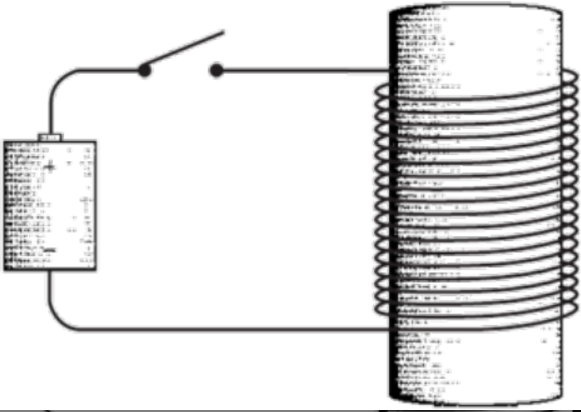

# 1. 至亲密友

你今年10岁，你最好的朋友就住在街对过。事实上，你们各自卧室的窗户正好彼此相对。每当夜幕降临，父母就如同往常一样，早早地催促你该上床睡觉了，但是你和你的朋友还想交流想法，交换见闻，分享各自的秘密，或者扯扯闲话，开开玩笑，聊聊梦想。这本无可厚非。无论怎样，渴望交流本来就是人类最主要的天性之一。

当卧室里的灯依然亮着的时候，你可以和朋友互相挥手，使用各种手势或简单的肢体语言，来表达一两个想法。但是，要表达复杂的想法可能就比较困难了。而且一旦父母宣布“关灯”，这种交流似乎也不可能继续下去。

如何交流呢？或许可以打电话？10岁小孩的房间里会有电话吗？即使有，无论电话在哪里，你们的谈话都有可能被偷听。

你和朋友所采用的方法就是使用手电筒。众所周知，手电筒是为了让孩子们能够躲在被子下看书而发明的；在天黑后用手电筒来交流信息似乎也是理想的选择。它们当然是很安静的，并且光线是高度定向的，同时光线也不会渗漏出卧室而引起家人的疑心。

手电筒能用来交谈吗？这当然值得一试。我们在一年级的时候学习怎样在纸上写字母和单词，因此，把同样的方法运用到手电筒上似乎也是有道理的。只需要站在窗户边，用光来画出字母。对于字母“O”，打开手电筒，在空气中划一个圈，然后关掉手电筒。对于字母“I”，竖着划一下。但是，你很快就会发现，这个方法也不太行得通。当你看着朋友的手电筒在空中圈圈点点时，会发现很难在头脑中组合出那么多复杂的笔画。这些旋转和倾斜的光线都太不准确了。

或许大家都曾经在电影里看到这样的情节，两个水手在海上通过灯的亮灭来互相发送信号。或许那正是解决问题的办法。如此一来，你就可以发明一种简单的技术。在这个方案里，字符表里的每个字符对应一连串的手电筒闪烁。“A”是闪一次，“B”是闪两次，“C”是闪三次，依此类推，“Z”就是闪26次。单词BAD可以用闪2次，闪1次，闪4次这样的一个组合来表示，而且在字符之间设置的小停顿使这个单词不至于被误认为是闪7次的字母“G”。另外，单词之间停顿可以稍长些。

这似乎很有希望，采用这种方案的好处是你不必在空中比划手电筒了，只要对准方向和按开关就行了。但是这种方案也有一个不足，那就是如果你想发送的第一个消息是“How are you？”，那么你将总计需要让手电筒闪131次！而且，这还是忽略了标点符号的，你还没有设计闪多少次来对应一个问号。

但是这已经离答案更近一些了。我们能够肯定的是，在此之前一定有人也遇到过类似的问题，而你解决这个问题的思路也是非常正确的。等到了白天，跑一趟图书馆，查查资料，你发现了一个被称为莫尔斯电码(Morse Code)的伟大发明。这正是你想找的，尽管你现在必须重新学习如何去“写”字母表里的字母。

它们的不同之处在于：在你发明的系统里，字母表里的每个字母就是用一定数目的闪光表示的，闪1下为“A”，闪26下为“Z”。而在莫尔斯电码里，则有两种闪烁——短闪和长闪。当然这使得莫尔斯电码更加复杂，但是在实际应用里它被证明是更为有效的。句子“How are you?”现在只要闪32下（包含一些短闪和一些长闪），而不再是131下，而且这其中还包括了一个代表问号的编码。

当问及莫尔斯电码是如何工作的时候，人们并不会谈论“短闪”与“长闪”。相反，他们使用“点(dot)”和“划(dash)”，因为这是在打印纸上显示编码的一个便利方法。在莫尔斯电码里，字母表里的每个字母都与一个点划序列相对应，正如下表所示。

虽然莫尔斯电码和计算机毫无关系，但是，熟悉编码的本质对于深入理解计算机软硬件内部结构以及隐匿在其后的语言将大有裨益。

在这本书里，编码这个词的意思是指一种用来在机器和人之间传递信息的方式。换句话说，编码就是交流。

对任何能听见我们的声音并理解我们所说的语言的人来说，我们发出的声音所形成的词语是一种可识别的编码，我们将这个编码称为“口头话语(the spoken word)”或“言辞(speech)”。对于写在纸上（或刻在石头上、木头上，或者在空气中比划）的词，我们还有其他的编码方式。这种编码以手写字符或打印在报纸、杂志以及书本上的字符形式出现，我们叫它“书面语言(the written word)”或“文本(text)”。

对于那些丧失听说能力的的聋哑人而言，人们发明了另一种编码来帮助他们进行面对面的交流，这就是手语。手语通过手和臂膀形成的动作和姿势来传达词语中的单个字符或者整个词语，以及基本的概念。对于那些失明的人，书面语言可以用布莱叶盲文(Braille)来替代。这种文字使用一系列凸起的点来代表字母、字母串以及整个单词。

前面所列的莫尔斯编码表，其本身就是一种类型的编码。在这个表中，每个字母由一系列的“点”和“划”来表示。然而实际上我们不能发送“点”和“划”，相反，我们发送与“点”和“划”对应的闪烁光。

当使用手电筒发送莫尔斯编码时，迅速地打开和关闭开关代表一个“点”（快闪），让闪光时间保持得相对长一些代表“划”（慢速闪光）。例如在发送字母A时，首先以非常快的速度打开并关闭手电，然后再以稍慢的速度进行一次。在发送下一个字符前，需要暂停一会。在此约定，一个“划”的时长是“点”的3倍。例如，如果一个“点”的时长是1秒钟，那么一个“划”的时长就应当是3秒钟。（在现实中，莫尔斯编码的传输速度远比这要快得多）。接收者看到一个短促的闪烁和一个拖长的闪光后，就知道这是一个A了。

在莫尔斯编码中，“点”和“划”之间的停顿是至关重要的。例如，当发送一个字母A时，在发送的“点”和“划”之间，手电筒要关闭一段时间，这相当于一个点的闪烁时长（如果“点”的时长是1秒钟，那么“点”和“划”之间的停顿也应该是1秒钟）。对于同一个单词中的字母，则通过较长的停顿来分隔，这大约相当于一个“划”的时长（或者说是3秒钟，如果一个“划”的时长就是3秒钟的话）。下图以“hello”的莫尔斯编码为例，说明字母之间的停顿（间隙）。

单词之间则通过相当于两个“划”的时长来分隔（如果一个“划”的时长为3秒钟，那么这个停顿就应当为6秒钟）。例如下图是“hi there”所对应的编码。

乍一看，莫尔斯编码的定义与打字机字母的排列一样都是随意的。这里的定义是指字母表中的字母与各“点”和“划”的组合序列之间的对应关系。然而，仔细研究之后，我们就会发现事实并非完全如此。简单且短促的编码，被分配给字母表中使用频率较高的字母，例如E和T。拼字比赛选手和“幸运轮”的粉丝们可能会很快意识到这一点。而不太常用的字母，比如Q和Z（这只会让选手在拼字中得到10分）则被分配以较长的编码。

几乎每个人都知道一点儿莫尔斯编码。三个点、三个划，再加三个点就表示SOS，即国际求救信号。

莫尔斯编码的一个缺点是，它没有区分大写字母和小写字母。但是除了可以代表字母外，莫尔斯编码还使用一组由点和划组成的五元序列来表示数字，如下所示。

这些编码至少比字母编码更有规律一些。大部分标点符号由5个、6个或者7个“点”和“划”的组合序列来表示，如下所示。

# 2. 编码与组合

莫尔斯码(Morse Code)是由塞缪尔·莫尔斯发明的(1791—1872)，在本书的其他章节中我们还将频繁地提到他。莫尔斯码其实是伴随着电报机的问世而被发明的，关于电报机，我们在后面也将做详细的探讨。正如通过研究莫尔斯码我们可以很方便地理解编码的本质一样，通过电报机来了解计算机硬件也是个不错的途径。

大多数人都会发现莫尔斯码的发送比接收更为简单。即使你并没有熟记莫尔斯码，也可以很方便地使用下面这张按字母表顺序排列的表格。

比起发送莫尔斯码，接收编码并进行解码要费时费力得多，因为译码者不得不根据一串由“点”、“划”组成的晦涩的编码序列来反查字母。例如，如果你接收到一串形如“划-点-划-划”的编码，那么你就必须从表的第一个字母开始逐个搜寻，直到找到与这串编码相符的字母“Y”为止。

问题就出在这里，因为我们现在只有一张提供“字母→莫尔斯码”的编码表，而缺少一张可以实现反向查询的“莫尔斯码→字母”译码表。在开始学习莫尔斯码的初级阶段，如果有这样的一个表无疑将是很方便的。但是要建立这样一张表，谈何容易。似乎这些字母对应的“点-划”序列并没有什么规律。

所以忘掉字母序列吧。或许根据编码中所包含点、划的多少来对其进行分组，是一个更好的组织这些编码的方法。例如，一个仅包含一个点或一个划的莫尔斯码只能代表两个字母：“E”或“T”。

一组含有2个点或划的编码组合，可以给我们呈现出4个字母——I, A, N和M。

一组含有3个点或划的莫尔斯码可以为我们表示更多的字母。

最后（如果我们不想考虑存在数字和标点符号的莫尔斯码的情况），一串由4个点或划组成的莫尔斯码就可以表示16个字符。

综合以上数据来看，这四张表包含了 2＋4＋8＋16 组码字，总共表示了 30 个字母，比拉丁字母表的 26 个字母还要多出 4 个。所以，你会注意到最后一个表中有 4 组编码是用来表示重音字母的。

当有人给你发送莫尔斯码的时候，上述四张表可能会让你的解码工作变得轻松很多。当接收到某一代表特定字母的码字后，你就可以知道其中所包含的“点”和“划”的数目，那么你至少可以很快找到对应的表格去进行查找。每个表格都组织得很规整，全部是“点”的码字被排在左上角，而全部是“划”的则被排在右下角。

你发现这四张表格在大小上的规律了么？注意看，每个表格所包含的码字数目都是前一张的两倍。我们可以用如下这样一个列表来总结这个有趣的规律。

在这四个表中，每张表的码字数都是前一张表码字数量的两倍，因此如果第一张表含有2个码字，那么第二张表则含有2×2个码字，而第三个表就有2×2×2个码字。下面用另一种方式呈现这个规律。

当然，如果我们遇到了数字的自乘，就可以通过幂的方式来表示它。由此我们的总结列表也可以写成下面这种样子。

现在这个表已经变得很简洁了。如果知道了码字中“点”和“划”的数目，那么以这个数目为指数的 2 的幂运算结果就是其总共可以表示的码字数。我们可以用下面这个简单的公式来概括上述表格所表示的内容：

`码字的数目=2^(“点”和“划”的数目)`

为了让莫尔斯码的解码过程更加简单，或许画张图会有所帮助，例如下面这张树型图。

这张图给出了所有字母及其所对应的由“点”和“划”组成的连续序列。当对一串码字进行解码时，我们需要沿着箭头从左向右进行搜寻。以“点-划-点”的码字为例来说，当你需要找出这串码字所代表的字母时，应首先从图的左边开始，选择“点”的分支；然后继续沿着箭头向右选择“划”，接着又是一个“点”。找到最后一个“点”时结果就会紧随其后出现了，没错就是字母“R”。

如果仔细想一想，你就会发现构建这样一个表对于定义莫尔斯码规范来说是很必要的。首先，它确保了我们不会对不同的字母定义相同的码字。其次，通过这个表我们可以用尽可能短的码字来表示所有的字母，而避免产生编码长度上的浪费。

我们可以继续加长码字至5位或者更长。一串由 5 个“点”或“划”组成的编码串可以为我们提供 32（2×2×2×2×2，或2^5）种扩展的码字。对于莫尔斯码中定义的10个数字和16个标点符号来说，通常这已经足够了，而实际上数字确实就是使用 5 位的莫尔斯码来表示的。但是在很多其他编码方式中，5位码字常用来表示重音字母而不是标点符号。

为了把所有的标点符号也都包含进去，编码系统必须要扩展到 6 位了！扩展后将为我们提供 64（2×2×2×2×2×2，即2^6）种新增的码字，这样总共的码字就达到了2+4+8+16+32+64，也就是126 种！这对莫尔斯码来说有点太多了，甚至还留下了很多“未定义”的码字。这里“未定义”用来表示那些不代表任何字符的码字。如果你在接收莫尔斯码的时候收到了一个未定义码字，可以肯定发送方一定是出了差错。

我们很容易就能得到这样一个小公式：`码字的数目=2^(编码的位数)`

利用它就可以继续计算出更长位数的点划序列所能表示的码字数目了。

莫尔斯码也被称作二进制码(Binary Code)，因为这种编码的组成元素只有两个——“点”和“划”。这跟硬币有些类似，因为硬币落到地上只能是正面朝上或反面朝上。二元对象（例如硬币）和二进制码（例如莫尔斯码）常常使用2的乘方来进行描述。

上面所做的关于二进制编码的分析工作，其实是数学的一个分支，称作“组合学”或“组合分析”，而我们所作的分析则只能说是一个简单的练习。传统意义上来说，因为组合分析涉及类似像扔硬币、掷骰子这样的需要对其组合数目进行推算的问题，所以它经常被应用到概率和统计学中。但是它对于我们理解码字的组合与分解也是十分有帮助的。

# 3. 布莱叶盲文与二进制码

塞缪尔·莫尔斯并不是第一个将书面语言的字母成功编码的人。实际上，在因自己的名字被用来命名某种编码方式而名声大噪的人中，莫尔斯先生也不是第一人。这项荣誉应该归一个法国盲人小伙子所有。尽管他比莫尔斯要晚出生18年，但是他很早就创建了自己的编码规范。他的生平鲜为人知（很少有人知道），但这也足以构成一个引人注目的传奇。

路易斯·布莱叶(Louis Braille)于1809年生于法国的库普雷，这是一个距离巴黎市东只有25英里的小镇。布莱叶的父亲是一个马具匠人。在布莱叶3岁的时候——一个本不该在父亲的工作间玩耍的年纪——他不小心被一个尖锐的工具刺伤了一只眼睛。伤口感染也影响到了他的另外一只眼睛，最后使他的双目完全失明。按常理，布莱叶将在无知和贫困当中度过自己的一生（就像当时大部分盲人那样），但是小路易斯对知识的渴望和过人的智慧很快被人们所发现。他最初同其他孩子一样在镇上的小学上学，后来在他10岁的时候，在小镇牧师和一名学校老师的帮助下，布莱叶被送往巴黎皇家盲人学校学习。

很显然，盲人教育中一个主要的障碍就是盲人无法阅读印刷的书籍。瓦伦丁·霍伊(1745—1822)，巴黎皇家盲人学校的创始人，曾发明过一种在纸面上印下凸起文字的系统，这样盲人就可以通过触摸的方式来进行阅读了。但是这种文字系统使用起来很困难，而且使用这种方法来印刷的书籍也非常少。

霍伊先生视力健全，因此他被自身的感知模式所禁锢。对他来说，一个字母A就是一个A，而且字母A在记录时也必须看起来（或者感觉起来）像一个A（如果让他用手电筒交流的话，估计他会像我们最开始所做的那样，试图在空中比划出要表达的字母，但其实我们发现这法子根本不灵）。霍伊先生或许没有意识到，有一种完全不同于印刷字母的文字系统可能更加适合盲人阅读。

这种非常规编码方式的起源说出来可能有些出人意料。查尔斯·巴比尔(Charles Barbier)，法国军队的一位军官，在1819年发明了一种他自称为“écriture nocturne”（也叫“夜间书写”）的文字系统。他在厚纸上使用凸起的点和划的组合来表示文字，这样当部队需要无声交流的时候，即使光线很暗，士兵们也可以通过这些符号互相传递信息。他们使用一个锥形的铁笔在厚纸的背面书写，这样纸的正面就会有相应的凸起。然后人们就可以使用手指触摸这些凸起的点和划来进行阅读了。

巴比尔文字系统的缺点是太过复杂了。该系统并非使用与字母表相对应的点划编码串来表示字母，而是用与读音相对应的编码串表示，因此有时仅仅是为了表示一个单词，就不得不使用很多的码字。如果只是传递简短的消息，这个系统用起来倒还不错；但是在表示长文本的时候，就明显力不从心，就更别说用来对整本书进行编码了。

布莱叶在12岁的时候就很熟悉巴比尔的这种文字系统了。他特别喜欢使用凸起的点，不仅仅因为凸起的点通过手指就可以很容易实现阅读，还因为它们“写”起来也很简单。在教室里，一个盲人学生如果有了纸张和铁笔，他就可以做笔记，而且同时还能阅读记下来的文字。路易斯·布莱叶开始不辞辛劳地改进这个文字系统，3 年以后（那时他15岁）就创建成了自己的系统，而这个系统中的一些基本规范，直到今天仍在被人们所使用。在很长一段时间内，这种新的文字系统只被他们学校内部的人们所熟悉，但是渐渐地，布莱叶盲文传播到了世界的各个角落。1835 年，路易斯·布莱叶患上了肺结核。1852 年，就在布莱叶 43 岁生日刚过完不久，病魔无情地夺走了他的生命。

如今，在引导盲人进入文字殿堂的道路上，改进后的布莱叶盲文系统与磁带录音书进行着竞争，但是布莱叶盲文仍然是不可替代的工具，特别是对于又聋又盲的人来说，布莱叶盲文仍然是他们开启阅读大门的唯一钥匙。近些年来，布莱叶盲文被越来越多地应用到公共场所中，使得盲人朋友们可以越来越方便地使用电梯、自动取款机等设备。

在这一章中我们将解析布莱叶盲文，来看看它是如何工作的。我们并不是要真的学习布莱叶盲文，而且也无须刻意记住什么关于它的内容。我们仅仅希望从中窥探到编码的一些本质。

在布莱叶盲文中，每个在书写文字中用到的符号——具体来说就是字母、数字和标点符号——都被编码成为2×3的点码单元中的一个或者多个凸起的点。这个点码单元包含的点通常使用 1 到 6 的数字来编号。

在现代应用中，使用特殊的打印机或轧花机可以将布莱叶盲文印到纸张上。

即使只是用布莱叶盲文在本书中印上几页，造价也实在是有点儿高，所以我在书中使用一种符号来表示布莱叶盲文。在这种表示方法中，点码单元中所有的 6 个点都会被表示出来。大点表示这是一个凸起的点，小点则表示其对应的位置是平的。例如，下面的布莱叶盲文：

其中，第 1, 3, 5 点是凸起的，而第 2, 4, 6 点的位置是平的。

令我们感兴趣的是，这些点码都是二进制的。一个单独的点不是平的就是凸起的。也就是说我们可以把在莫尔斯编码中学到的知识应用到布莱叶盲文的分析中！我们现在已经知道，每组有 6 个点，并且每个点有平和凸两种状态，因此 6 个可平可凸的点的组合数就是 2×2×2×2×2×2，即 2^6，也就是 64。

因此，布莱叶盲文系统能够表示 64 个不同的码字。下图就是所有可能的 64 种码字。

让我们来开始解析布莱叶盲文吧，首先看看基本的小写字母表。

例如，词组“you and me”用布莱叶盲文表示成如下组合：

注意，一个单词中每个字母所对应的点码单元之间都用一小块空白分开；而单词之间则用一个大的空格（实际上是没有凸点的点码单元）所分隔开来。

这就是路易斯·布莱叶制订的布莱叶盲文的基本规范，至少它对于拉丁字母很适用。布莱叶还制订了表示重音符号字母的编码，这在法语中要经常要用到。注意这里没有“w”这个字母的编码，因为在传统的法语中不会用到它（别担心，这个字母最后会出现的，下文将作讲解）。到此为止，64 个码字中只使用了 25 个。

经过仔细的检查，你会发现，从我们列举的那个三排布莱叶盲文的例子（小写字母表）中，可以总结出一个规律。第一排（字母 a 到 j ）只用到了点码单元中最上面的四个点——第 1、2、4 和 5 点。第二排在复用了第一排的编码的基础上，把第 3 点改为凸点。第三排也沿用了同样的规律，只是将第 3 和 6 点改为凸点。

自从路易斯·布莱叶发明布莱叶盲文以来，其应用已经扩展到各个领域。目前在英文出版物中最常用的盲文系统被称为二级布莱叶盲文(Grade 2 Braille)。二级布莱叶盲文使用了很多缩写，以便于保存树型结构和提高阅读速度。例如，如果字母的码字单独出现，它们就表示一个普通的单词。以下三排图样（包含“完整的”第三排）为我们展示了这些单词的码字。

因此，短语“you and me”使用二级布莱叶盲文就可以表示为：

到目前为止，我们已经描述了31个码字——单词间的大空格（即没有凸点的点码单元）以及总共 3 排每排 10 个的字母和单词码字。与理论上可以达到的最多码字数——64 相比，我们还差得远呢。正如从下面的分析中我们将看到的那样，在二级布莱叶盲文里，没有任何的码字会被浪费。

首先，我们可以使用字母 a 到 j 的码字加 6 号凸点的组合。这些新码字通常用来表示单词中字母串的缩写，还有我们前面所担心的 w 字母（像上文的二级布莱叶盲文单词编码一样，表示 w 字母的编码也可以表示一个单词）。

例如，单词“about”使用二级布莱叶盲文可以记作：

然后，我们取从 a 到 j 的码字，“降低”它们使用的点位，只用到编号为 2、3、5 和 6 的点，这样就得到了新的码字。根据上下文环境，它们将被用来表示一些标点符号或者字符串缩写。

前4个码字分别表示逗号、分号、冒号和句号。需要注意的是，左右括号使用的是相同的码字，但是开闭引号使用的却是不同的码字。

目前为止我们已经定义了51个码字了。“占用 3、4、5 和 6 号点”的码字还有很多组没有被定义，下面的 6 组就是这些被遗漏的码字，我们也用它们来表示一些字符串缩写和其他的标点符号。

表示字符串缩写“ble”的码字很重要，因为当它不是用来作为单词的一部分时，它的出现就意味着之后的码字应被译为数字。表示数字的码字与表示字母 a 到 j 的码字是相同的。

因此，下面这组编码：

表示的就是数字256。

如果你还要继续下去，那么我们还需要定义 7 个码字才算完全用满原有的 64 个码字。它们是：

省略后面的内容，个人感觉与本次阅读目的关系不大......

# 6. 电报机与继电器

“电报”（telegraph，字面意思就是“远距离书写”）这个想法在19世纪早期就出现了，而且在萨缪尔·莫尔斯1832 年开始实验之前，其他的发明家就已经开始研究它了。理论上说来，电报机的原理是很简单的：在线路的这一端采取一些措施，使线路的另一端发生某种变化。这恰好与我们上一章中用手电筒远距离发送信息所用到的方法很一致。不过呢，莫尔斯先生不会用灯泡作为他的信号发生装置了，因为最早的可使用的电灯泡到1879年才被发明出来。作为替代手段，莫尔斯利用了电磁(electromagnetism)现象。

如果你手头有一根铁棒，那么在上面用细导线绕几百圈，然后在导线上接通电流，铁棒就变成了一块磁铁。现在它可以吸引其他的铁块。断开电流，铁棒将丧失磁性。

电磁铁是电报机的基础。在线路的一端闭合或断开开关，可以使线路另一端的电磁铁有所动作。

实际上，莫尔斯的第一个电报机比后来演化出的版本要复杂。莫尔斯认为，发报系统应该确实能在纸上写出些什么东西。当然，电报机输出的不一定非得是单词，因为那样做就太过复杂了。但是不管是杂乱无章的线条还是点和划，在纸上总应该写些东西。注意，莫尔斯现在一头扎进了一个需要纸张和阅读的模型，这很像瓦伦丁·霍伊(Valentin Haüy)的观点—盲人用的书应该印有凸起的字母。

尽管萨缪尔·莫尔斯在1836年通知过专利局，他成功发明了电报机，但是直到1843年，他才说服美国国会，为其创建了一个公共基金。1844年5月24日，这是历史性的一天，当华盛顿特区和马里兰州巴尔迪摩市之间的电报线路架设完成时，一条信息被成功地传递，内容是圣经中的句子：“What hath God wrought!”

传统电报机中用来发送信息的电键，其外形如下图所示。

它虽然外表奇特，其实只是一个被设计成有“最大开闭速度”的开关而已。如果需要长时间使用电键，最舒适的方法是，用拇指，食指和中指握住手柄，轻击它使其上下移动。保持电键的按下状态一小段时间，就会产生一个“点”的莫尔斯码。按下状态保持的时间更长一些就会产生一个“划”的莫尔斯码。

线路的另一端是一个接收器，它主要是由一块电磁铁拉动一根金属杆构成的。最初，电磁铁控制的是一只钢笔。有一个装置通过使用一个压紧的弹簧来拉动一卷纸经过设备，与电磁铁连接着的钢笔就会在弹起或落下时，在纸上画出点和划。能读懂莫尔斯电码的人员就可以把这些“点”和“划”译成字母和单词了。

当然，我们人类是个懒惰的物种，电报操作员们很快发现，他们可以很容易地通过听钢笔弹起和落下的声音来翻译电码。在传统电报机中的“发声器”的帮助下，钢笔最终被废弃，整个装置看起来如下图所示。

当电报机的电键被按下时，发声器中的电磁铁拉动上面的活动横杠下降，它会发出“滴”的声音。当松开电键的时候，横杠弹回到原来的位置，发出“嗒”的声音。一次快速的“滴—嗒”声代表点；一次慢速的“滴—嗒”声则代表划。

电键、发声器、电池，还有一些导线连接到一起，电报机的电路示意图与前面章节中的手电筒电路图很相似。

正如我们以前所发现的那样，不必非得用两根导线来连接两个电报站。如果地球能为我们提供电路的另一半的话，一根导线就足够了。

就像我们在上一章所做的那样，我们可以把接地的电池用大写“V”表示。因此完整的单向系统如下图所示。

双向通信仅仅需要再增加一个电键和发报人。这与我们前一章中的做法是类似的。

电报机的发明标志着现代通信的开始。人们第一次能够在视线或者听力之外的距离范围进行实时交流了，而且信息传递的速度比骏马疾驰还要快。而更加耐人寻味的是，这个发明使用了二进制码。但是在后来的电子和无线通信（包括电话、无线电、电视）所使用的通信模式中，二进制码被废弃了，直到后来它又被应用在了电脑、光盘、数字影碟、数字卫星电视广播和高清电视上。

莫尔斯的电报机在某种程度上要胜过其他的设计，因为它对线路没有苛刻的要求。当你连好电键和发声器之间的线路后，它们一般都可以正常工作。而其他的电报系统对线路的要求就没这么简单了。但是正如我上一章提到的那样，这种电报机最大的问题就是长导线所带来的电阻。尽管一些电报线路使用高达300伏的电压，而使有效距离能够超过300英里，但是线路还是不能无限延长。

显然，设置一个中继系统是解决该问题的一个方案。每隔200英里左右，为一个工作人员装配好发声器和电键，他就可以接收信息，然后再把它转发出去。

现在，想象你已经被电报公司聘用，成为中继系统的一部分。他们把你扔在纽约和加利福尼亚之间的一个无名之地，让你在一个只有一桌一椅的小屋里工作。一条导线从东面的窗户伸进来，连接到发声器上。而你的电报机电键连到电池上，最后线路从西窗伸出去。你的职责就是接收从纽约发来的信息，然后转发它们，最终使它们到达加利福尼亚。

开始时，你喜欢接收完一条完整的信息后再把它转发。首先，根据发声器发出的滴答声，将字母记下来；当信息接收完毕时，再开始用你的电键来发送。最后，你终于掌握了诀窍，在听到滴答声的同时就可以发送信息，不需要再把信息记录下来了。这节约了不少时间。

有一天，当你正在转发信息时，瞄了瞄发声器上那根上蹿下跳的横杠，又看了看在电键上上下翻飞的手指。然后你就这样来来回回地瞅来瞅去，恍然发现发声器上下跳跃的节奏与电键是一致的。因此你就去外面找了根小木棍，然后用木棍和一些细绳把发声器和电键连接到了一起，如下图所示。

现在，设备可以自己工作了，而下午剩余的时间嘛，你就可以去休个假，钓个鱼。

这真是个有趣的想法，但是事实上，萨缪尔·莫尔斯在早些时候就已经领会了这个设备的概念。刚刚我们发明的这个设备称做“继电器”。继电器与发声器很像，传进来的电流驱动电磁铁拉动金属杠，金属杠同时又作为一个开关的组成部分，而这个开关连接着电池和输出线路。通过这种方法，输入的比较弱的电流就被“放大”成了较强的输出电流。

继电器的示意图如下。

# 11. 门

# 12. 二进制加法器