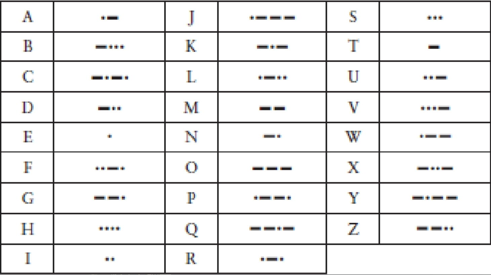

# 1. 至亲密友

你今年10岁，你最好的朋友就住在街对过。事实上，你们各自卧室的窗户正好彼此相对。每当夜幕降临，父母就如同往常一样，早早地催促你该上床睡觉了，但是你和你的朋友还想交流想法，交换见闻，分享各自的秘密，或者扯扯闲话，开开玩笑，聊聊梦想。这本无可厚非。无论怎样，渴望交流本来就是人类最主要的天性之一。

当卧室里的灯依然亮着的时候，你可以和朋友互相挥手，使用各种手势或简单的肢体语言，来表达一两个想法。但是，要表达复杂的想法可能就比较困难了。而且一旦父母宣布“关灯”，这种交流似乎也不可能继续下去。

如何交流呢？或许可以打电话？10岁小孩的房间里会有电话吗？即使有，无论电话在哪里，你们的谈话都有可能被偷听。

你和朋友所采用的方法就是使用手电筒。众所周知，手电筒是为了让孩子们能够躲在被子下看书而发明的；在天黑后用手电筒来交流信息似乎也是理想的选择。它们当然是很安静的，并且光线是高度定向的，同时光线也不会渗漏出卧室而引起家人的疑心。

手电筒能用来交谈吗？这当然值得一试。我们在一年级的时候学习怎样在纸上写字母和单词，因此，把同样的方法运用到手电筒上似乎也是有道理的。只需要站在窗户边，用光来画出字母。对于字母“O”，打开手电筒，在空气中划一个圈，然后关掉手电筒。对于字母“I”，竖着划一下。但是，你很快就会发现，这个方法也不太行得通。当你看着朋友的手电筒在空中圈圈点点时，会发现很难在头脑中组合出那么多复杂的笔画。这些旋转和倾斜的光线都太不准确了。

或许大家都曾经在电影里看到这样的情节，两个水手在海上通过灯的亮灭来互相发送信号。或许那正是解决问题的办法。如此一来，你就可以发明一种简单的技术。在这个方案里，字符表里的每个字符对应一连串的手电筒闪烁。“A”是闪一次，“B”是闪两次，“C”是闪三次，依此类推，“Z”就是闪26次。单词BAD可以用闪2次，闪1次，闪4次这样的一个组合来表示，而且在字符之间设置的小停顿使这个单词不至于被误认为是闪7次的字母“G”。另外，单词之间停顿可以稍长些。

这似乎很有希望，采用这种方案的好处是你不必在空中比划手电筒了，只要对准方向和按开关就行了。但是这种方案也有一个不足，那就是如果你想发送的第一个消息是“How are you？”，那么你将总计需要让手电筒闪131次！而且，这还是忽略了标点符号的，你还没有设计闪多少次来对应一个问号。

但是这已经离答案更近一些了。我们能够肯定的是，在此之前一定有人也遇到过类似的问题，而你解决这个问题的思路也是非常正确的。等到了白天，跑一趟图书馆，查查资料，你发现了一个被称为莫尔斯电码(Morse Code)的伟大发明。这正是你想找的，尽管你现在必须重新学习如何去“写”字母表里的字母。

它们的不同之处在于：在你发明的系统里，字母表里的每个字母就是用一定数目的闪光表示的，闪1下为“A”，闪26下为“Z”。而在莫尔斯电码里，则有两种闪烁——短闪和长闪。当然这使得莫尔斯电码更加复杂，但是在实际应用里它被证明是更为有效的。句子“How are you?”现在只要闪32下（包含一些短闪和一些长闪），而不再是131下，而且这其中还包括了一个代表问号的编码。

当问及莫尔斯电码是如何工作的时候，人们并不会谈论“短闪”与“长闪”。相反，他们使用“点(dot)”和“划(dash)”，因为这是在打印纸上显示编码的一个便利方法。在莫尔斯电码里，字母表里的每个字母都与一个点划序列相对应，正如下表所示。

虽然莫尔斯电码和计算机毫无关系，但是，熟悉编码的本质对于深入理解计算机软硬件内部结构以及隐匿在其后的语言将大有裨益。

在这本书里，编码这个词的意思是指一种用来在机器和人之间传递信息的方式。换句话说，编码就是交流。

对任何能听见我们的声音并理解我们所说的语言的人来说，我们发出的声音所形成的词语是一种可识别的编码，我们将这个编码称为“口头话语(the spoken word)”或“言辞(speech)”。对于写在纸上（或刻在石头上、木头上，或者在空气中比划）的词，我们还有其他的编码方式。这种编码以手写字符或打印在报纸、杂志以及书本上的字符形式出现，我们叫它“书面语言(the written word)”或“文本(text)”。

对于那些丧失听说能力的的聋哑人而言，人们发明了另一种编码来帮助他们进行面对面的交流，这就是手语。手语通过手和臂膀形成的动作和姿势来传达词语中的单个字符或者整个词语，以及基本的概念。对于那些失明的人，书面语言可以用布莱叶盲文(Braille)来替代。这种文字使用一系列凸起的点来代表字母、字母串以及整个单词。

前面所列的莫尔斯编码表，其本身就是一种类型的编码。在这个表中，每个字母由一系列的“点”和“划”来表示。然而实际上我们不能发送“点”和“划”，相反，我们发送与“点”和“划”对应的闪烁光。

当使用手电筒发送莫尔斯编码时，迅速地打开和关闭开关代表一个“点”（快闪），让闪光时间保持得相对长一些代表“划”（慢速闪光）。例如在发送字母A时，首先以非常快的速度打开并关闭手电，然后再以稍慢的速度进行一次。在发送下一个字符前，需要暂停一会。在此约定，一个“划”的时长是“点”的3倍。例如，如果一个“点”的时长是1秒钟，那么一个“划”的时长就应当是3秒钟。（在现实中，莫尔斯编码的传输速度远比这要快得多）。接收者看到一个短促的闪烁和一个拖长的闪光后，就知道这是一个A了。

在莫尔斯编码中，“点”和“划”之间的停顿是至关重要的。例如，当发送一个字母A时，在发送的“点”和“划”之间，手电筒要关闭一段时间，这相当于一个点的闪烁时长（如果“点”的时长是1秒钟，那么“点”和“划”之间的停顿也应该是1秒钟）。对于同一个单词中的字母，则通过较长的停顿来分隔，这大约相当于一个“划”的时长（或者说是3秒钟，如果一个“划”的时长就是3秒钟的话）。下图以“hello”的莫尔斯编码为例，说明字母之间的停顿（间隙）。

单词之间则通过相当于两个“划”的时长来分隔（如果一个“划”的时长为3秒钟，那么这个停顿就应当为6秒钟）。例如下图是“hi there”所对应的编码。

乍一看，莫尔斯编码的定义与打字机字母的排列一样都是随意的。这里的定义是指字母表中的字母与各“点”和“划”的组合序列之间的对应关系。然而，仔细研究之后，我们就会发现事实并非完全如此。简单且短促的编码，被分配给字母表中使用频率较高的字母，例如E和T。拼字比赛选手和“幸运轮”的粉丝们可能会很快意识到这一点。而不太常用的字母，比如Q和Z（这只会让选手在拼字中得到10分）则被分配以较长的编码。

几乎每个人都知道一点儿莫尔斯编码。三个点、三个划，再加三个点就表示SOS，即国际求救信号。

莫尔斯编码的一个缺点是，它没有区分大写字母和小写字母。但是除了可以代表字母外，莫尔斯编码还使用一组由点和划组成的五元序列来表示数字，如下所示。

这些编码至少比字母编码更有规律一些。大部分标点符号由5个、6个或者7个“点”和“划”的组合序列来表示，如下所示。

# 2. 编码与组合

莫尔斯码(Morse Code)是由塞缪尔·莫尔斯发明的(1791—1872)，在本书的其他章节中我们还将频繁地提到他。莫尔斯码其实是伴随着电报机的问世而被发明的，关于电报机，我们在后面也将做详细的探讨。正如通过研究莫尔斯码我们可以很方便地理解编码的本质一样，通过电报机来了解计算机硬件也是个不错的途径。

大多数人都会发现莫尔斯码的发送比接收更为简单。即使你并没有熟记莫尔斯码，也可以很方便地使用下面这张按字母表顺序排列的表格。

比起发送莫尔斯码，接收编码并进行解码要费时费力得多，因为译码者不得不根据一串由“点”、“划”组成的晦涩的编码序列来反查字母。例如，如果你接收到一串形如“划-点-划-划”的编码，那么你就必须从表的第一个字母开始逐个搜寻，直到找到与这串编码相符的字母“Y”为止。

问题就出在这里，因为我们现在只有一张提供“字母→莫尔斯码”的编码表，而缺少一张可以实现反向查询的“莫尔斯码→字母”译码表。在开始学习莫尔斯码的初级阶段，如果有这样的一个表无疑将是很方便的。但是要建立这样一张表，谈何容易。似乎这些字母对应的“点-划”序列并没有什么规律。

所以忘掉字母序列吧。或许根据编码中所包含点、划的多少来对其进行分组，是一个更好的组织这些编码的方法。例如，一个仅包含一个点或一个划的莫尔斯码只能代表两个字母：“E”或“T”。

一组含有2个点或划的编码组合，可以给我们呈现出4个字母——I, A, N和M。

一组含有3个点或划的莫尔斯码可以为我们表示更多的字母。

最后（如果我们不想考虑存在数字和标点符号的莫尔斯码的情况），一串由4个点或划组成的莫尔斯码就可以表示16个字符。

综合以上数据来看，这四张表包含了2＋4＋8＋16组码字，总共表示了30个字母，比拉丁字母表的26个字母还要多出4个。所以，你会注意到最后一个表中有4组编码是用来表示重音字母的。

当有人给你发送莫尔斯码的时候，上述四张表可能会让你的解码工作变得轻松很多。当接收到某一代表特定字母的码字后，你就可以知道其中所包含的“点”和“划”的数目，那么你至少可以很快找到对应的表格去进行查找。每个表格都组织得很规整，全部是“点”的码字被排在左上角，而全部是“划”的则被排在右下角。

你发现这四张表格在大小上的规律了么？注意看，每个表格所包含的码字数目都是前一张的两倍。我们可以用如下这样一个列表来总结这个有趣的规律。

在这四个表中，每张表的码字数都是前一张表码字数量的两倍，因此如果第一张表含有2个码字，那么第二张表则含有2×2个码字，而第三个表就有2×2×2个码字。下面用另一种方式呈现这个规律。

当然，如果我们遇到了数字的自乘，就可以通过幂的方式来表示它。由此我们的总结列表也可以写成下面这种样子。

现在这个表已经变得很简洁了。如果知道了码字中“点”和“划”的数目，那么以这个数目为指数的2的幂运算结果就是其总共可以表示的码字数。我们可以用下面这个简单的公式来概括上述表格所表示的内容：

`码字的数目=2^(“点”和“划”的数目)`

为了让莫尔斯码的解码过程更加简单，或许画张图会有所帮助，例如下面这张树型图。

这张图给出了所有字母及其所对应的由“点”和“划”组成的连续序列。当对一串码字进行解码时，我们需要沿着箭头从左向右进行搜寻。以“点-划-点”的码字为例来说，当你需要找出这串码字所代表的字母时，应首先从图的左边开始，选择“点”的分支；然后继续沿着箭头向右选择“划”，接着又是一个“点”。找到最后一个“点”时结果就会紧随其后出现了，没错就是字母“R”。

如果仔细想一想，你就会发现构建这样一个表对于定义莫尔斯码规范来说是很必要的。首先，它确保了我们不会对不同的字母定义相同的码字。其次，通过这个表我们可以用尽可能短的码字来表示所有的字母，而避免产生编码长度上的浪费。

我们可以继续加长码字至5位或者更长。一串由5个“点”或“划”组成的编码串可以为我们提供32（2×2×2×2×2，或2^5）种扩展的码字。对于莫尔斯码中定义的10个数字和16个标点符号来说，通常这已经足够了，而实际上数字确实就是使用5位的莫尔斯码来表示的。但是在很多其他编码方式中，5位码字常用来表示重音字母而不是标点符号。

为了把所有的标点符号也都包含进去，编码系统必须要扩展到6位了！扩展后将为我们提供64（2×2×2×2×2×2，即2^6）种新增的码字，这样总共的码字就达到了2+4+8+16+32+64，也就是126 种！这对莫尔斯码来说有点太多了，甚至还留下了很多“未定义”的码字。这里“未定义”用来表示那些不代表任何字符的码字。如果你在接收莫尔斯码的时候收到了一个未定义码字，可以肯定发送方一定是出了差错。

我们很容易就能得到这样一个小公式：`码字的数目=2^(编码的位数)`

利用它就可以继续计算出更长位数的点划序列所能表示的码字数目了。

莫尔斯码也被称作二进制码(Binary Code)，因为这种编码的组成元素只有两个——“点”和“划”。这跟硬币有些类似，因为硬币落到地上只能是正面朝上或反面朝上。二元对象（例如硬币）和二进制码（例如莫尔斯码）常常使用2的乘方来进行描述。

上面所做的关于二进制编码的分析工作，其实是数学的一个分支，称作“组合学”或“组合分析”，而我们所作的分析则只能说是一个简单的练习。传统意义上来说，因为组合分析涉及类似像扔硬币、掷骰子这样的需要对其组合数目进行推算的问题，所以它经常被应用到概率和统计学中。但是它对于我们理解码字的组合与分解也是十分有帮助的。

# 3. 布莱叶盲文与二进制码

塞缪尔·莫尔斯并不是第一个将书面语言的字母成功编码的人。实际上，在因自己的名字被用来命名某种编码方式而名声大噪的人中，莫尔斯先生也不是第一人。这项荣誉应该归一个法国盲人小伙子所有。尽管他比莫尔斯要晚出生18年，但是他很早就创建了自己的编码规范。他的生平鲜为人知（很少有人知道），但这也足以构成一个引人注目的传奇。

路易斯·布莱叶(Louis Braille)于1809年生于法国的库普雷，这是一个距离巴黎市东只有25英里的小镇。布莱叶的父亲是一个马具匠人。在布莱叶3岁的时候——一个本不该在父亲的工作间玩耍的年纪——他不小心被一个尖锐的工具刺伤了一只眼睛。伤口感染也影响到了他的另外一只眼睛，最后使他的双目完全失明。按常理，布莱叶将在无知和贫困当中度过自己的一生（就像当时大部分盲人那样），但是小路易斯对知识的渴望和过人的智慧很快被人们所发现。他最初同其他孩子一样在镇上的小学上学，后来在他10岁的时候，在小镇牧师和一名学校老师的帮助下，布莱叶被送往巴黎皇家盲人学校学习。

很显然，盲人教育中一个主要的障碍就是盲人无法阅读印刷的书籍。瓦伦丁·霍伊(1745—1822)，巴黎皇家盲人学校的创始人，曾发明过一种在纸面上印下凸起文字的系统，这样盲人就可以通过触摸的方式来进行阅读了。但是这种文字系统使用起来很困难，而且使用这种方法来印刷的书籍也非常少。

霍伊先生视力健全，因此他被自身的感知模式所禁锢。对他来说，一个字母A就是一个A，而且字母A在记录时也必须看起来（或者感觉起来）像一个A（如果让他用手电筒交流的话，估计他会像我们最开始所做的那样，试图在空中比划出要表达的字母，但其实我们发现这法子根本不灵）。霍伊先生或许没有意识到，有一种完全不同于印刷字母的文字系统可能更加适合盲人阅读。

这种非常规编码方式的起源说出来可能有些出人意料。查尔斯·巴比尔(Charles Barbier)，法国军队的一位军官，在1819年发明了一种他自称为“écriture nocturne”（也叫“夜间书写”）的文字系统。他在厚纸上使用凸起的点和划的组合来表示文字，这样当部队需要无声交流的时候，即使光线很暗，士兵们也可以通过这些符号互相传递信息。他们使用一个锥形的铁笔在厚纸的背面书写，这样纸的正面就会有相应的凸起。然后人们就可以使用手指触摸这些凸起的点和划来进行阅读了。

巴比尔文字系统的缺点是太过复杂了。该系统并非使用与字母表相对应的点划编码串来表示字母，而是用与读音相对应的编码串表示，因此有时仅仅是为了表示一个单词，就不得不使用很多的码字。如果只是传递简短的消息，这个系统用起来倒还不错；但是在表示长文本的时候，就明显力不从心，就更别说用来对整本书进行编码了。

布莱叶在12岁的时候就很熟悉巴比尔的这种文字系统了。他特别喜欢使用凸起的点，不仅仅因为凸起的点通过手指就可以很容易实现阅读，还因为它们“写”起来也很简单。在教室里，一个盲人学生如果有了纸张和铁笔，他就可以做笔记，而且同时还能阅读记下来的文字。路易斯·布莱叶开始不辞辛劳地改进这个文字系统，3年以后（那时他15岁）就创建成了自己的系统，而这个系统中的一些基本规范，直到今天仍在被人们所使用。在很长一段时间内，这种新的文字系统只被他们学校内部的人们所熟悉，但是渐渐地，布莱叶盲文传播到了世界的各个角落。1835年，路易斯·布莱叶患上了肺结核。1852年，就在布莱叶43岁生日刚过完不久，病魔无情地夺走了他的生命。

