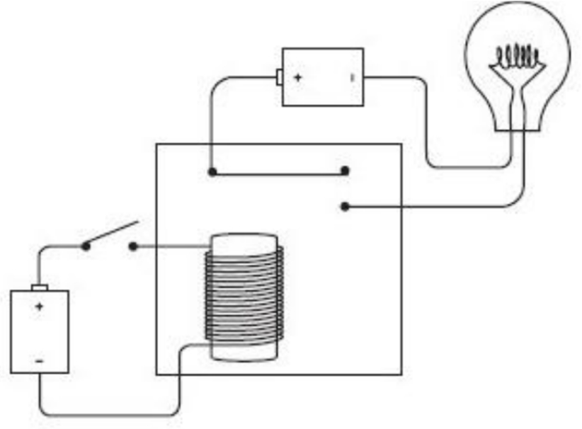
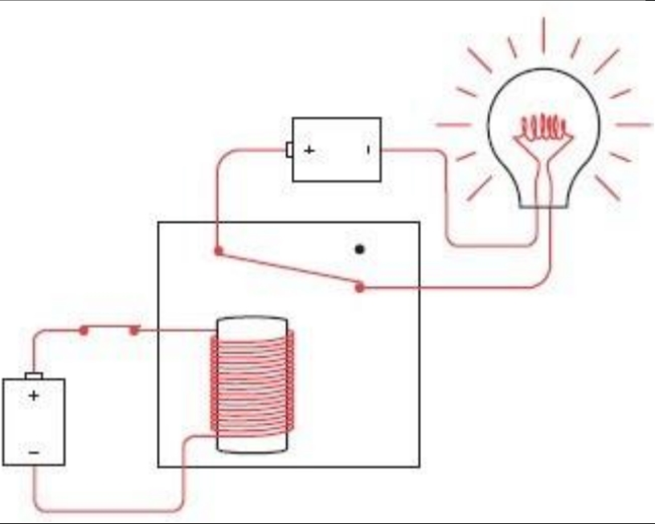
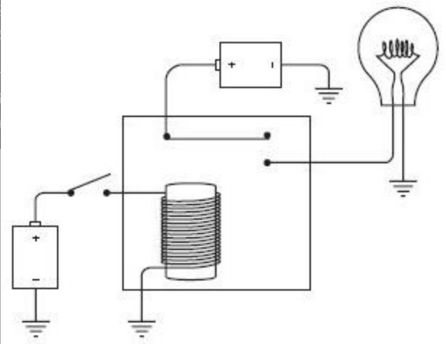
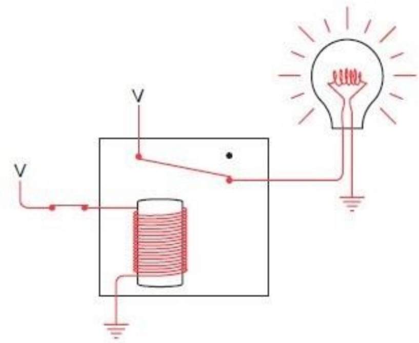

# 11. 门

在遥远的未来，关于20世纪的早期计算机史早已成为人们印象中模糊的记忆，那时很可能有些人会认为“logic gates”（逻辑门）装置是以著名的微软公司创始人的名字来命名的(Bill Gates的Gates在英文中有“门”的意思)。其实不然。就像我们所看到的一样，逻辑门与普通的让水通过或者让人通过的门是非常类似的。在逻辑学中，逻辑门的工作方式非常简单——让电流通过或阻止电流通过。

在上一章中，你走进了一家宠物店，并且说：“我想要一只公猫，已绝育的，白色或褐色都可以；或者一只母猫，已绝育的，除了白色任何颜色都可以；或者，只要是一只黑猫就行。” 这句话被总结为如下布尔表达式：

```
(M×N×(W+T))+(F×N×(1-W))+B
```

同样也可以用这样一个由开关和灯泡组成的电路来表示，如下图所示。


这样的电路有时被称为网络(network)，而如今这个词更多地被用来描述计算机之间的连接，而不仅指多个开关的集合。

尽管这个电路中的所有元件早在19世纪就都已经被发明出来了，但在那个时代，没有人意识到布尔表达式可以在电路中实现。这个等价关系直到20世纪30年代才被发现。主要贡献人是克洛德·艾尔伍德·香农（生于1916）。1938年，香农在麻省理工学院完成了那篇题为《继电器和开关电路的符号分析》(A Symbolic Analysis of Relay and Switching Circuits)的著名硕士论文，在文中阐述了这个问题（10年之后，他又发表了论文“通信的数学原理”，即The Mathematical Theory of Communication，这是第一篇使用“bit”这个词来表示二进制数字的文章）。

1938年以前，人们已经知道，当两个开关串联的时候，要同时闭合它们，电流才能通过；当两个开关并联的时候，闭合其中任何一个都可以使电路连通。但是没有人像香农那样能清晰严谨地阐述：电子工程师可以运用布尔代数的所有工具去设计开关电路。此外，如果你简化了一个描述网络的布尔表达式，那么你也可以简化相应的网络。

例如，你想要的猫可以用下列表达式描述：

```
(M×N×(W+T))+(F×N×(1-W))+B
```

利用结合律（感觉应该写错了，改为交换律），我们可以重新排列由AND(×)连接的变量，并将表达式写为如下形式：

```
(N×M×(W+T))+(N×F×(1-W))+B
```

为了讲清楚这里是如何变换的，我将定义两个新的符号，X和Y：

```
X=M×(W+T)
Y=F×(1-W)
```

现在，描述你想要的小猫的表达式可以写为：

```
(N×X)+(N×Y)+B
```

化简后，我们可以将X和Y表达式代回去。

注意，变量N在表达式中出现了两次。利用分配率，表达式可以写为只有一个N的形式：

```
(N×(X+Y))+B
```

现在将X和Y的表达式带入：

```
(N×((M×(W+T))+(F×(1-W))))+B
```

由于括号太多，这个表达式看起来并不简单。但是这个表达式中少了一个变量，也就意味着在网络中少了一个开关。以下就是简化后的电路图。


确实，证明修改前后的两个电路功能等价要比去证明两个表达式功能相同简单许多。

事实上，网络中仍然有三个开关是多余的。理论上讲，你只需要四个开关来定义你心目中的猫咪即可。这是为什么呢？每个开关都是一个二进制数。你可以设定一个开关代表猫的性别（开关断开表示是公的，而闭合表示是母的），另一个开关闭合表示猫是否有生育能力（开关断开表示未绝育，而闭合则表示已绝育）。另两个开关用来表示猫的颜色。这里有四种可能出现的颜色（白色、黑色、褐色和其他颜色），而我们知道，四种选择可以用两个二进制位来定义，于是你需要的就是两个颜色开关。例如，两个开关同时断开表示白色，一个闭合表示黑色，另一个闭合表示褐色，同时闭合表示其他颜色。

现在让我们制作一个用来选猫咪的控制面板。这个控制面板上只有四个开关（与你家墙上控制灯开闭的开关很相似），此外面板上还安装了一个灯泡，如下图所示。


开关打到上面是指开关闭合，反之是指开关断开。或许用来表示猫咪颜色的两个开关标记有点难于理解，这是为了将面板做得简洁而不得已导致的一个小缺憾。在表示颜色的两个开关中，左边的叫做B，意思是说只要它闭合（如上图所示）就表示黑色。两个开关中右边的那个叫做T，意思是说只要它闭合的时候就表示褐色。如果两个开关都闭合则表示其他颜色，这个选择叫做O。两个开关都断开的时候表示白色，用W表示，字母写在下部。

在计算机术语中，开关是一种输入设备(input device)，输入是控制电路如何工作的信息。在本例中，输入开关对应于4个二进制数信息，这些信息用来描述一只猫。输出设备(output device)就是灯泡。如果开关描述了一只符合标准的猫，灯泡就会亮。比如上面控制面板所示的开关就表示了一只未绝育的黑色母猫。这只猫符合你的标准，因此灯泡是亮的。

现在我们要做的就是设计一个电路来控制这个面板工作。

前面提到，香农的论文题目是《继电器与开关电路的符号分析》。这里的继电器与之前我们在第6章提到的电报系统中的继电器很类似。然而在香农发表论文的时候，继电器已经被广泛地用于其他领域，特别是在庞大的电话系统网络中。

继电器像开关一样，可以串联或并联在电路中执行简单的逻辑任务，这种继电器的组合叫做逻辑门(logic gates)。这里提到的逻辑门执行“简单”逻辑任务是指逻辑门只完成最基本的功能。继电器优于开关之处就在于，继电器可以被其他继电器所控制，而不必由人工控制。这就意味着，这些简单的逻辑门组合起来可以实现更复杂的功能，例如一些简单的算术操作。事实上，下一章中，我们就将介绍如何利用电线、开关、灯泡、电池和电报继电器来制作一个加法器（尽管它只能用于二进制数计算）。

前面提到过，继电器对于电报系统的工作而言是至关重要的。在长距离情况下，连接电报站的电线具有很高的电阻。这就需要采取一些措施来接收微弱信号并把它增强后再发射出去。继电器就是通过电磁铁控制开关来实现这一目的的。实际上，继电器是通过放大微弱信号来生成强信号的。

就我们的目的而言，我们对于继电器放大微弱信号的功能并不感兴趣。我们真正感兴趣的是继电器可以作为一个电流控制而非人工控制的开关。我们可以将继电器、开关、灯泡和两节电池按照下图连接。



注意，左边的开关是断开的，灯泡没有发光。当闭合开关的时候，左端电池产生电流流过缠在铁芯上的圆线圈。于是铁芯产生了磁性，将上面的弹性金属簧片拉下，使回路接通，灯泡发光。



当电磁铁将金属簧片拉下来时，我们称继电器被“触发”(triggered)。当左边的开关断开的时候，铁芯的磁性消失，金属簧片回到原位。

这看起来似乎是一种间接控制灯泡发光的方法，而实际上它就是这样的。如果我们只关心点亮开关，完全可以将继电器省略掉，但我们所关心的并不仅仅是点亮灯泡。我们还有更宏大的目标。

在这一章中，（在逻辑门建立之前）我们将多次运用继电器，因此就需要将上面那幅电路图简化。我们可以利用接地的方式减少一些电线。在这种情况下，大地仅代表了一个公共端，并不是真正意义上的物理接地。



这看起来并不像简化的结果，但到现在我们还没有完成。注意两节电池的负极都是接地的。因此，我们可以看到这样的符号。


和第5章、第6章中一样，可以用大写字母V（代表电压）来代替上图中的电池。这样，继电器看上去就如下图所示。


开关闭合，电流从V端流出，经过电磁铁芯流到大地上。产生磁效应吸合金属簧片，从而连通了V、灯泡和地之间的电路，使灯泡发光。



上面的图显示了两个电源和两个接地端。但是在这一章的所有电路中，所有电源，即“V”是可以彼此互连的，接地端也如此。在本章和下一章的电路中，所有继电器网络和逻辑门只需要一节电池，尽管可能是一节很大容量的电池。例如，上述电路图可以画为如下只用一节电池的方式。


但是，这个电路图中没有清楚地表明，为什么我们要使用继电器。可以先不看回路，单单看继电器，像前面的控制面板一样，从输出和输入开始。


# 12 二进制加法器

加法是算术运算中最基本的运算，因此如果想搭建一台计算机（这也正是本书所隐含的内容），那么首先就要造出可以计算两个数的和的器件。当你真正面对它时，就会发现，原来加法计算就是计算机要做的唯一工作。如果我们可以造出加法器，同样地，就可以利用加法来实现减法、乘法和除法，计算按揭付款，引导火箭飞到火星、下棋，以及填写我们的话费账单。

这一章中我们要创建的加法器与现代的计算器和计算机来比，将会很庞大、很笨拙、很慢，而且运转起来噪声不断。最有趣的是我们用来制作加法器的全部零件，都是像开关、灯泡、导线、电池、逻辑门、已经预先连接在各种逻辑门中的继电器等这些在之前的章节中学过的非常简单的电子器件。这个加法器所包含的所有器件早在120多年前就已经被发明出来了。我们并不用在房间中实际搭建出什么，相反地，可以在纸上以及我们的头脑中来搭建这个加法器。

这个加法器完全用于二进制数的计算，而且没有现代加法器那么便利。你不能使用键盘来给出需要相加的两个数，相反所要用到的是一排开关。计算结果是通过一排灯泡来显示的，而非以数字的形式来显示。

但是，这个加法器确实可以将两个数相加，其方法与计算机计算加法的方式非常相似。

计算二进制数加法与计算十进制数加法非常相似。如果你想要让245和673这两个十进制数相加，你会把这个问题分解为几个简单的步骤。每个步骤只需要将两个十进制数相加。在这个例子中，首先要将5和3相加。生活中，记住加法表能更快地解决问题。

二进制数加法与十进制数加法最大的不同就在于二进制数加法中用到了一个更为简单的加法表。

