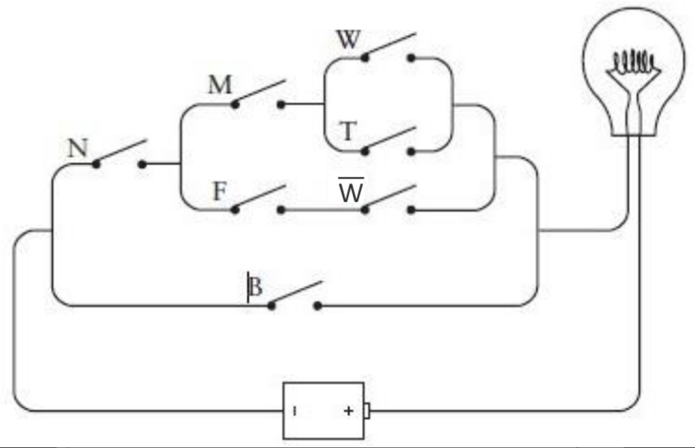

# 11. 门

在遥远的未来，关于20世纪的早期计算机史早已成为人们印象中模糊的记忆，那时很可能有些人会认为“logic gates”（逻辑门）装置是以著名的微软公司创始人的名字来命名的(Bill Gates的Gates在英文中有“门”的意思)。其实不然。就像我们所看到的一样，逻辑门与普通的让水通过或者让人通过的门是非常类似的。在逻辑学中，逻辑门的工作方式非常简单——让电流通过或阻止电流通过。

在上一章中，你走进了一家宠物店，并且说：“我想要一只公猫，已绝育的，白色或褐色都可以；或者一只母猫，已绝育的，除了白色任何颜色都可以；或者，只要是一只黑猫就行。” 这句话被总结为如下布尔表达式：

```
(M×N×(W+T))+(F×N×(1-W))+B
```

同样也可以用这样一个由开关和灯泡组成的电路来表示，如下图所示。


这样的电路有时被称为网络(network)，而如今这个词更多地被用来描述计算机之间的连接，而不仅指多个开关的集合。

尽管这个电路中的所有元件早在19世纪就都已经被发明出来了，但在那个时代，没有人意识到布尔表达式可以在电路中实现。这个等价关系直到20世纪30年代才被发现。主要贡献人是克洛德·艾尔伍德·香农（生于1916）。1938年，香农在麻省理工学院完成了那篇题为《继电器和开关电路的符号分析》(A Symbolic Analysis of Relay and Switching Circuits)的著名硕士论文，在文中阐述了这个问题（10年之后，他又发表了论文“通信的数学原理”，即The Mathematical Theory of Communication，这是第一篇使用“bit”这个词来表示二进制数字的文章）。

1938年以前，人们已经知道，当两个开关串联的时候，要同时闭合它们，电流才能通过；当两个开关并联的时候，闭合其中任何一个都可以使电路连通。但是没有人像香农那样能清晰严谨地阐述：电子工程师可以运用布尔代数的所有工具去设计开关电路。此外，如果你简化了一个描述网络的布尔表达式，那么你也可以简化相应的网络。

例如，你想要的猫可以用下列表达式描述：

```
(M×N×(W+T))+(F×N×(1-W))+B
```

利用结合律（感觉应该写错了，改为交换律），我们可以重新排列由AND(×)连接的变量，并将表达式写为如下形式：

```
(N×M×(W+T))+(N×F×(1-W))+B
```

为了讲清楚这里是如何变换的，我将定义两个新的符号，X和Y：

```
X=M×(W+T)
Y=F×(1-W)
```

现在，描述你想要的小猫的表达式可以写为：

```
(N×X)+(N×Y)+B
```

化简后，我们可以将X和Y表达式代回去。

注意，变量N在表达式中出现了两次。利用分配率，表达式可以写为只有一个N的形式：

```
(N×(X+Y))+B
```

现在将X和Y的表达式带入：

```
(N×((M×(W+T))+(F×(1-W))))+B
```

由于括号太多，这个表达式看起来并不简单。但是这个表达式中少了一个变量，也就意味着在网络中少了一个开关。以下就是简化后的电路图。



确实，证明修改前后的两个电路功能等价要比去证明两个表达式功能相同简单许多。

事实上，网络中仍然有三个开关是多余的。理论上讲，你只需要四个开关来定义你心目中的猫咪即可。这是为什么呢？每个开关都是一个二进制数。你可以设定一个开关代表猫的性别（开关断开表示是公的，而闭合表示是母的），另一个开关闭合表示猫是否有生育能力（开关断开表示未绝育，而闭合则表示已绝育）。另两个开关用来表示猫的颜色。这里有四种可能出现的颜色（白色、黑色、褐色和其他颜色），而我们知道，四种选择可以用两个二进制位来定义，于是你需要的就是两个颜色开关。例如，两个开关同时断开表示白色，一个闭合表示黑色，另一个闭合表示褐色，同时闭合表示其他颜色。

现在让我们制作一个用来选猫咪的控制面板。这个控制面板上只有四个开关（与你家墙上控制灯开闭的开关很相似），此外面板上还安装了一个灯泡，如下图所示。


开关打到上面是指开关闭合，反之是指开关断开。或许用来表示猫咪颜色的两个开关标记有点难于理解，这是为了将面板做得简洁而不得已导致的一个小缺憾。在表示颜色的两个开关中，左边的叫做B，意思是说只要它闭合（如上图所示）就表示黑色。两个开关中右边的那个叫做T，意思是说只要它闭合的时候就表示褐色。如果两个开关都闭合则表示其他颜色，这个选择叫做O。两个开关都断开的时候表示白色，用W表示，字母写在下部。

在计算机术语中，开关是一种输入设备(input device)，输入是控制电路如何工作的信息。在本例中，输入开关对应于4个二进制数信息，这些信息用来描述一只猫。输出设备(output device)就是灯泡。如果开关描述了一只符合标准的猫，灯泡就会亮。比如上面控制面板所示的开关就表示了一只未绝育的黑色母猫。这只猫符合你的标准，因此灯泡是亮的。


