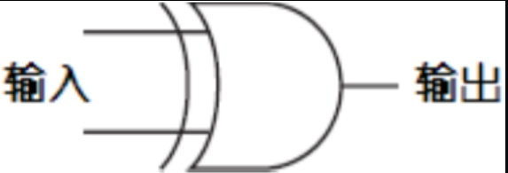

# 12. 二进制加法器

加法是算术运算中最基本的运算，因此如果想搭建一台计算机（这也正是本书所隐含的内容），那么首先就要造出可以计算两个数的和的器件。当你真正面对它时，就会发现，原来加法计算就是计算机要做的唯一工作。如果我们可以造出加法器，同样地，就可以利用加法来实现减法、乘法和除法，计算按揭付款，引导火箭飞到火星、下棋，以及填写我们的话费账单。

这一章中我们要创建的加法器与现代的计算器和计算机来比，将会很庞大、很笨拙、很慢，而且运转起来噪声不断。最有趣的是我们用来制作加法器的全部零件，都是像开关、灯泡、导线、电池、逻辑门、已经预先连接在各种逻辑门中的继电器等这些在之前的章节中学过的非常简单的电子器件。这个加法器所包含的所有器件早在120多年前就已经被发明出来了。我们并不用在房间中实际搭建出什么，相反地，可以在纸上以及我们的头脑中来搭建这个加法器。

这个加法器完全用于二进制数的计算，而且没有现代加法器那么便利。你不能使用键盘来给出需要相加的两个数，相反所要用到的是一排开关。计算结果是通过一排灯泡来显示的，而非以数字的形式来显示。

但是，这个加法器确实可以将两个数相加，其方法与计算机计算加法的方式非常相似。

计算二进制数加法与计算十进制数加法非常相似。如果你想要让245和673这两个十进制数相加，你会把这个问题分解为几个简单的步骤。每个步骤只需要将两个十进制数相加。在这个例子中，首先要将5和3相加。生活中，记住加法表能更快地解决问题。

## 二进制加法表分析

二进制数加法与十进制数加法最大的不同就在于二进制数加法中用到了一个更为简单的加法表。


如果你是一头鲸鱼并且在学校中学习了这个表格，你会大声说出：


以上加法表可以重新写为下面带有前导零的形式，这样每个结果就都是一个2位的值。


像这样，一对二进制数相加的结果中具有两个数位，其中一位叫做加法位(sum bit)，另一位则叫做进位位（carry bit，例如，1加1等于0，进位为1）。下面我们将二进制数加法表分成两个表格，第一个是表示加法的。


第二个是表示进位的。


用这种方法来看二进制加法非常方便，因为在我们的加法器中加法与进位是分别进行的。搭建一个二进制加法器需要我们首先设计一个电路，通过该电路执行这些操作。完全用二进制数，问题将在很大程度上得以简化，因为，电路中的所有器件，像开关、灯泡、导线等都可以用来表示二进制数的位。

与十进制数加法一样，我们将两个二进制数字串由右向左依次逐列相加。


注意，在我们将从右边数的第3列的数相加的时候，会有一个1进位到下一列中。这在第6、第7、第8列也是一样的。

想要让多大的二进制数相加？由于仅仅在头脑中来搭建加法器，所我们可以搭建出一个能够让非常长的二进制数相加的加法器。但是经过理智的考虑之后，我们决定让搭建起来的二进制加法器最高能够执行的加法长度为8位。也就是说，我们想要相加的二进制数，其范围是从0000-0000到1111-1111，即十进制数的0到255。两个8位二进制的和最大可为1-1111-1110，即510。

加法器的控制面板如下图所示。


在这个面板中，有两排开关，每排8个。这些开关就是输入设备，我们将用它们来“输入”两个8位二进制数。在这套输入设备中，开关断开（关）即表示0，闭合（开）表示1，这与你房间墙上的开关是一样的。面板底部的输出设备是一排灯泡，共9个。这些灯泡用来显示结果。不发光的灯泡表示0，发光的灯泡表示1。这里有9个灯泡，因为两个8位二进制数的相加结果可能是一个9位的二进制数。

加法器的其他部分是以各种形式连接起来的逻辑门。开关将触发逻辑门中的继电器来点亮相应的灯泡。例如，如果我们要将0110-0101和1011-0110（之前例子中的两个数）相加，则要将相应的开关置于下图所示位置。


灯泡发光显示结果为：1-0001-1011（然而，这只是一个希望的结果，因为我们还没有将加法器真正搭建出来！）

在上一章中提到过，本书中我们将会用到许多继电器。这个8位二进制加法器中所用到的继电器不少于144个，其中我们用来相加的8对二进制位，每对都需要18个继电器。如果将全部电路展示出来，你一定会崩溃的。没有人能看懂以各种方式连接起来的144个继电器所表达的意义。相反地，我们要利用逻辑门来分阶段地处理这个问题。

## 逻辑门与二进制加法

当看到进位（两个1相加就会产生一个进位）结果表的时候，或许你已经看出来逻辑门和二进制加法的一些相关性了。


你可能意识到了，这和上一章中与门的输出结果是一样的。


因此，利用与门可以计算两个二进制数加法的进位。

到此，我们着实取得了一些进展。下面我们要做的就是利用继电器来实现下表。


这是在作两个二进制数加法时需要解决的另一个问题。加法位的情况并不像进位位那样简单，但是我们即将实现它。

首先我们要知道，或门和我们想要的结果很相似，除了右下角的结果。


与非门同样和我们想要的结果很相似，除了左上角的结果。


下面我们将或门和与非门连接到相同的输入上，如下图所示。


下表总结了或门和与非门的输出，并将其与我们想要的结果进行了对比。


### 异或门

注意，我们想要的是1，那么这种情况只有在或门和与非门的输出都为1时才会出现。这表明两个输出端可以通过一个与门连接到一起。


这就是我们想要的结果。

注意，在整个电路中仍然有两个输入和一个输出。两个输入同时作为或门和与非门的输入。或门和与非门的输出又分别作为一个与门的输入，最后得出了我们想要的结果。


实际上这个电路有个专门的名称，叫做异或门，简写为XOR。之所以称为异或门是因为若想其输出结果为1，要么仅让输入A为1，要么仅让输入B为1，两输入端都为1则输出为0。为了不把或门、与非门和与门都画出来，我们可以使用一个电气工程师所采用的特定电气符号来表示异或门。



异或门在输入端比或门多出了一条曲线，除此之外它看上去和或门非常相像。异或门的特征如下表所示。


异或门是本书中详细介绍的最后一个逻辑门（第6个门有时会在电气工程中介绍到。它称做同或门，因为只有当两个输入相同的时候，其输出才为1。同或门所给出的输出刚好与异或门相反，因此同或门的符号和异或门相同，但在输出端多了个小圆圈）。

### 半加器

让我们回顾一下到目前为止所了解的内容。将两个二进制数相加将产生一个加法位和一个进位位。


可以利用下面这两个逻辑门来实现这些结果。


两个二进制数相加的结果是由异或门的输出给出的，而进位位是由与门的输出给出的。因此我们可以将与门和异或门连在一起来计算两个二进制数（即A和B）的和。


为了避免重复画与门和异或门，你可以采用如下这种简单的表示方式。


这个符号被称为半加器(Half Adder)。之所以叫半加器是有原因的，它将两个二进制数相加，得出一个加法位和一个进位位。但是绝大多数二进制数是多于1位的。半加器没有做到的是将之前一次的加法可能产生的进位位纳入下一次运算。例如，假设我们要将如下两个二进制数相加。


我们只能将半加器用于最右面一列的相加：1加1等于0，进位1。对于从右面算起的第二列，由于进位位的存在，实际上需要将三个二进制数相加，而随后每一列的加法都是这样的。随后的每一列二进制数相加都需要将进位位算进来。

### 全加器

为了对三个二进制数进行加法运算，我们需要将两个半加器和一个或门做如下连接。


要理解它的工作原理，首先从最左边第一个半加器的输入A和输入B开始，其输出是一个加和及相应的进位。这个和必须与前一列的进位输入相加，然后再把它们输入到第二个半加器中。第二个半加器的输出和是最后的结果。两个半加器的进位输出又被输入到一个或门中。你可能会觉得，这里还需要一个半加法器，这当然是可行的。但是如果你了解了所有的可能性之后，你会发现，两个半加法器的进位输出是不会同时为1的。或门在这里已经足够，因为或门除了在输入都为1的时候以外，其他情况下结果和异或门结果相同。

为了避免重复地画上面的那个图，我们用以下形式来替代上图中的一堆符号，它称为全加器(Full Adder)。


以下表格总结了全加法器所有可能的输入组合以及对应的输出结果。


在本章前面曾经提到过，我们的加法器需要144个继电器。下面就来解释一下这个数目是如何得到的。每个与门、或门和与非门都需要两个继电器，因此一个异或门中就包含6个继电器。一个半加器是由一个异或门和一个与门组成的，因此一个半加器就需要8个继电器。每个全加器由两个半加器和一个或门组成，所以它要18个继电器。我们需要8个全加器来制作8位二进制加法器。因而总共需要144个继电器。

## 控制面板

再来看看之前提到的由灯泡和开关所组成的控制面板。现在我们可以开始将开关和灯泡连接到全加器了。


首先将最右端的两个开关和最右端的一个灯泡连接到一个全加器上。


当把两个二进制数相加时，第1列的处理方式与其他列有所不同。因为后面的几列可能包括来自前面加法的进位，而第1列不会，所以全加器的进位输入端是接地的，这表示第1列的进位输入是一个0。第1列二进制数相加后很可能会产生一个进位输出，这个进位输出是下一列加法的输入。

对于接下来的两个二进制位和灯泡，可以按如下办法来连接全加器。


第一个全加器的进位输出就是第二个全加器的进位输入。随后的每列二进制数都以同样的方式连接。每一列进位输出都是下一列的进位输入。

最终，第8个灯泡和最后一对开关将以如下方式连接到全加法器上。


这里，最后一个进位输出将被连接到第9个灯泡上。

至此，我们就大功告成了。

### 8位加法器

还可以用另一种方式来看这8个全加器的连接，每个全加器的进位输出都作为下一个全加器的进位输入。


下面是画成一个盒子的完整的8位二进制加法器，输入标记为A0～A7和B0～B7，输出标记为S0～S7。


这就是表示多位数字中各位数字的常用方法。A0、B0和S0是最低有效位，或者说是最右边的一位。A7、B7和S7是最高有效位，或者说是最左边的一位。例如，下面演示了这样一列带有下标的字母是如何用来表示一个二进制数0110-1001的。


下标从0开始，并且向着高有效位的方向递增，因为它们和2的乘方数（幂）相对应。


如果把下面一排的每个二进制位和其对应的2的幂相乘再依次相加，你就会得到0110-1001的十进制数表示64+32+8+1，即105。

另一种8位二进制加法器可用下图表示。


双线箭头包含了8个输入端，代表一组8个独立的信号。它们被标识为A7…A0、B7…B0、S7…S0，同样也表示一个8位二进制数。

### 16位加法器

一旦你搭建起了8位二进制加法器，你就可以再搭建另外一个加法器。把它们级联起来就可以很容易地扩展出一个16位加法器。


右边加法器的进位输出被连接到了左边加法器的进位输入上。左边加法器的输入包含了两个加数的高8位，而得到的结果也是最终加和的高8位。

## 总结

你可能会问：“这真的就是计算机进行加法运算时所采用的方式么？”

基本上来说，是的。但也并不完全是。

首先，可以制作一个比这个算得更快的加法器。如果你看一下这个电路是如何工作的，最低有效位的一对数字相加所得出的一个进位输出，将要参与接下来的一对数字的加法运算，由此得到的一个进位输出又要参与再下一对数字的加法运算，依此类推。**加法器的总体速度等于数字的位数乘以全加器器件的速度，这被称做行波进位（ripple carry，或脉冲进位）。更快的加法器运用了一个被称为“前置进位”的电路来提高运算的速度。**

**其次，也是最重要的，计算机已经不再使用继电器了！尽管它曾经被使用过。第一台数字计算机在20世纪30年代被建造完成，当时所使用的就是继电器，后来也使用过真空管。今天的计算机使用的是晶体管。**在被用到计算机中时，晶体管的工作方式与继电器基本相同，但是正如我们即将了解到的，晶体管要比继电器计算速度更快、体积更小，而且噪声更弱、耗能也更低，而且更便宜。搭建一个8位加法器依然需要144个晶体管（如果你用前置进位法代替行波进位，将会用到更多的晶体管），但是电路却是极小的。

# 13. 如何实现减法

当你确信继电器连接到一起真的可以实现二进制数加法的时候，你可能会问：“那么如何实现减法呢？”本章后续的内容会帮你解答这个问题，因此提出这样的问题并不是说你在没事找事，而实际上这表明你是相当有察觉力的。加法和减法在某些方面相互补充，但在机制方面这两个运算则是不同的。加法是始终从两个加数的最右列向最左列进行计算的。每一列的进位加到下一列中。在减法中没有进位，而是有借位——一种与加法存在本质区别的麻烦机制。

例如，我们来看一个典型的借位减法的题目：


要解决这个问题，首先从最右列着手。我们看到，6是大于3的，因此从5上借1，再用13减去6，得到结果为7。由于我们已经在5上借了1，因此，现在实际上那一位是4，而4是小于7的，因此继续从2上借1, 14减7结果为7。而由于在2上借了1，实际上这一位是1，从中减去1，结果为0。因此，最后的结果应为77：


如何才能通过一连串逻辑门来实现这个逻辑呢？

## 对9的补数

然而，我们并不打算这样做。相反，我们打算用一个小技巧来让减法不涉及借位。此外，由于减法与计算机中以二进制编码的存储有关，详细地了解减法也是很重要的。

为了便于表达，将进行减法的两个数分别用被减数(minuend)和减数(subtrahend)表示。从被减数中减去减数，得到的结果叫做差(difference)。


为了避免借位，首先要从999中减去减数，而不是从原来的被减数中减去减数。


由于操作数是三位数，所以这里使用999。如果操作数是4位，则用9999。**从一串9中减去一个数叫做对9求补数。**176对9的补数是823。反之亦然：823对9的补数是176。这样的好处就是无论减数是多少，计算对9的补数都不需要借位。

计算出减数对9的补数后，将补数与原来的被减数相加：


最后再将结果加1，并减去1000。


到此，我们就得到了结果。答案与先前的相同，而且没有用到借位。为什么这种方法行得通呢？

原题目是这样的：253-176 在这个式子中加上一个数再减去这个数，结果是相同的。

因此先加上1000，再减去1000：253-176+1000-1000 这个式子与下式等价：253-176+999+1-1000

然后用以下方式将数字重新组合：253+(999-176)+1-1000

这个式子与刚才描述过的用9的补数进行的计算是相同的。我们用两个减法和两个加法来替代一个减法，而在这个过程中避免了烦琐的借位。如果减数大于被减数会怎么样呢？例如以下问题：


## 结果为负数的减法

通常遇到这个问题时你可能会说：“这里减数大于被减数，因此要将减数和被减数交换来执行减法，然后给结果取个相反数。”你可能在脑子里将这两个数交换，而写出这样的答案：


如果希望求解这个问题而不使用借位的话，就要采用与之前稍微不同的方法。首先要像前面一样，用999减去减数253，计算出对9的补数：


把该数对9的补数与被减数相加：


在前面的例子中，下一步应该加1，并减去1000来得到最终结果。但是在这里，这种方法并不适用。因为你会遇到923减去1000的情况，这又导致了借位。

由于我们之前已经加了999，这里再减去999：


到这里，我们会意识到这个问题的结果是负数，因此需要将减数与被减数交换，用999减去922。这里没有用到借位，结果与我们期望的相同：


（注释：这里说白了就是两种情况：当被减数 > 减数时，要求减数对10的补数，也就是对9的补数加一，这样才能避免借位；而对被减数 < 减数时，只需要求减数对9的补数就行了，可以完全避免借位）

## 二进制

同样的技巧可以用于二进制数中，而且实际上这要比十进制数简单。让我们一起来看看该如何操作。原来的减法题目是：


将这些数字转化为二进制数，问题变为：


第一步，用11111111（即255）减去减数：


当计算十进制数减法的时候，减数是从一串9中减去的，结果称为9的补数。在二进制数减法中，减数是从一串1中减去的，结果称为1的补数。**但是请注意，我们在求对1的补数时并不需要用到减法。在求对1的补数时，只需将原来的二进制数中的1变为0，将0变为1即可。因此对1求补数有时也会称为相反数(negation)或反码(inverse)。**这里你可能会想起第11章中的反向器，它的作用就是将0变为1，将1变为0。

第二步，将减数对1的补数与被减数相加：


第三步，将上式所得结果加1：


第四步，减去100000000（即256）：


结果就等于十进制数的77。

我们把这两个数颠倒位置后再做一遍。在十进制中，减法题目对应于：


而用二进制表示为：


第一步，用11111111减去减数，得到对1的补数：


第二步，将减数对1的补数与被减数相加：


现在我们要用某种方法在结果中减去11111111。当减数小于被减数的时候，我们将结果加1再减100000000来完成计算。但是你无法在不借位的情况下做到这一点。所以，我们先用11111111减去所得结果：


这里又一次用到了将各位取反来求得结果的方法，但是这个结果是77，而真正的答案应该是-77。

## 控制面板

到这里，我们已经有了足够的条件来改造上一章所搭建的加法器，并让它像实现加法一样来实现减法运算。为了不让问题太复杂，这个新的加/减法器只执行在减数小于被减数的减法操作，即结果为正数的操作。

该加法器的核心是由逻辑门集成的8位全加器。


你可能还记得，输入A0～A7及B0～B7与两排分别表示两个要相加的8位二进制数的开关相连。进位输入接地。S0～S7与表示结果的8个灯泡相连。由于这个加法有可能得到9位数值，进位输出端也连接了一个灯泡。

控制面板示意如下图所示。


在上图中，开关所表示的是183（即10110111）与22（即00010110）相加，结果如灯泡所示为205（即11001101）。

8位加/减法器所用的新面板较从前做了些许的改动。它增设了一个开关，用以选择做加法还是做减法。


如上图所示，这个开关向下断开时表示选择加法运算，反之向上接通则表示选择减法运算。此外，右侧的8个灯泡用于表示计算结果。这里，第9个灯泡表示“上溢/下溢”。这个灯泡表明了正在计算的数字是一个不能用8个灯泡来表示的数字。如果在加法中得到了大于255（上溢，overflow）或在减法中得到了负数（下溢，underflow）这个灯泡就会发光。当减数大于被减数的时候，就会得到一个负数。

### 求补器

加法器中新增的主要部分就是一个用来求8位二进制数对1补数的电路。之前提到，二进制数对1求补数相当于对其每位取反，因此我们计算8位二进制数补数的时候可以简单地应用8个反向器。


问题是，该电路只会对输入求反，而我们要的是一台既能做加法又能做减法的机器，因此就要求该电路当且仅当进行减法运算时才实现反转。电路可以改造为如下图所示。


标记为“取反”的信号将被输入到每一个异或门中。回想一下异或门的工作方式，如下表所示。


因此，如果“取反”信号是0，则8个异或门输出与输入相同。例如，如果输入是01100001，那么输出也为01100001。如果“取反”信号为1，则输出信号反置。例如，如果输入为01100001，输出则为10011110。

将8个异或门合并起来画成一个器件，称为求补器(One's Complement)，如下所示。


### 加 / 减法器

将一个求补器，一个8位二进制加法器和一个异或门做如下连接。


注意，这里三个信号都标识为“SUB”，这就是加/减法转换开关。当该信号为0的时候，其进行的是加法运算，为1时进行的则是减法运算。在减法中，输入B（第二排开关）在送入加法器之前，需先通过求补电路进行取反。此外，在做减法时，我们通过设定CI（进位输入）为1来使得结果加1。而在加法中，求补电路将不起作用，且输入CI为0。

加法器的SUB信号和CO（进位输出）输出作为异或门的输入来控制表示上溢/下溢的灯泡。如果SUB信号为0（表示进行加法运算），则当加法器CO输出为1时灯亮，意思是加法计算结果大于255。

当进行减法运算的时候，如果减数（输入B）小于被减数（输入A），这时加法器的CO输出为1，这表示减法的最后一步要减去100000000。当减数 > 被减数，加法器的CO输出为0，SUB为1，下溢（减法得到了负数），计算无效，上面所示器件现在还不能表示负数。

你应该会庆幸自己问了这个问题：“减法该如何实现呢？”

## 负数的表示

本章一直在谈论负数，但是并没有提到负数在二进制中是如何表示的。你可能设想二进制会同十进制一样应用传统的负数符号。例如，-77在二进制中为-1001101。这样做当然可以，但是应用二进制数的目的恰恰就在于只希望用0和1来表示所有的东西，当然也包括负号。

当然，你可以简单地用一个二进制位来表示负号，当这一位为1的时候就表示负数，为0则表示正数，尽管这样也是可行的，但还远远不够。还有另一种方法可以解决负数的表示问题，而且它还可以很轻松地让负数和正数相加。这种方法的缺点是必须提前算一下可能遇到的所有数字的位数。

让我们来想一想。通常用来表示正数和负数的方法，其好处就在于能表示所有的正数、负数。我们将0想象为这个无限延伸的序列的中点。这个序列中正数沿着一个方向延伸，而负数则按照另一个方向延伸：

…-1000000, -999999…-3, -2, -1, 0, 1, 2, 3…999999, 1000000…

但是，如果我们并不需要无限大或无限小的数，而且在开始的时候我们就可以预知所使用的数字的范围，那情况就有所不同了。

以支票账户为例，这里人们通常会遇到负数。假设我的账户余额不超过500美元，并且银行给了我们500美元的无息预支额度，意思就是账户余额数值应该是一个在499美元到-500美元之间的数。

这些假设表明账户能处理的额度是介于-500到499之间，总共1000个数。这个约束说明只用三位十进制数，且不用负号就可以表示所有需要的数字。我们并不需要用到从500到999之间的正数，因为我们所需要的数的最大值为499。因此从500到999的三位数可以用来表示负数。具体情况如下：

```
用500表示-500
用501表示-499
用502表示-498
……
用998表示-2
用999表示-1
用000表示0
用001表示1
用002表示2
……
用497表示497
用498表示498
用499表示499
```

也就是说，以5, 6, 7, 8或9开头的三位数实际上表示的都是负数，而不是把数字写成这样：

-500, -499, -498 …-4, -3, -2, -1, 0, 1, 2, 3, 4 … 497, 498, 499

用这种表示法，我们可以将它们写成：

500, 501, 502 … 996, 997, 998, 999, 000, 001, 002, 003, 004 … 497, 498,499

注意，这就形成了一个循环排序。最小的负数(500)看起来像是最大正数(499)的延续。而数字999（实际上是-1）是比0小1的第一个负数。如果我们在999上加1，通常会得到1000。由于我们处理的是三位数，这个结果实际上就是000。

这种标记方法称为10的补数(ten's complement)。为了将三位负数转化为10的补数，我们用999减去它再加1。也就是说，对10求补数就是对9的补数再加1。例如想要得到-255对10的补数，用999减去255得到744，然后再加1，得到745。

你可能听说过：“减一个数就等于加一个负数。”你可能会回答：“实际上还是减去了这个数。”然而，利用10的补数，我们将不会再用到减法。所有的步骤都用加法来进行。

假设你有一个余额为143美元的支票账户。你开了一张78美元的支票，也就意味着要将一个值为负的78美元加到143美元上。-78对10的补数为999-078+1，即922。因此新余额为143美元+922美元，相当于65美元（忽略溢出）。如果我们又开了一张150美元的支票，需要在余额上加上-150, -150对10求补数为850。因此先前的余额加上850等于915，就是新的账户余额。而这个余额实际上是-85美元。

这样的机制在二进制中被称为2的补数。以8位二进制数为例。范围为00000000～11111111，对应十进制中的0～255。但是如果你还想表示负数的话，则以1开头的每个8位数都表示一个负数，如下表所示。


现在所表示的数的范围是-128～+127。最高有效位（最左位）作为符号位(sign bit)。符号位中，1表示负数，0表示正数。

为了计算2的补数，则首先要计算1的补数，然后再加1。这等价于将每位取反再加1。例如，十进制数125写为二进制为01111101。为了表示-125的对2的补数，首先将01111101的每位取反，得到10000010，再加1，得到10000011。可以根据前面的表格核实一下结果。用同样的步骤，每位取反再加1，可以将数值还原。

这个系统为我们提供了一种不用负号就能表示正、负数的方法。同样也让我们自由地将正数和负数用加法法则相加。例如，将与-127和124等价的两个二进制数相加。利用上面的表格，可以简单地写为：


结果等于十进制的-3。

要注意的是，这里涉及了上溢和下溢情况，即结果大于127或小于-128。例如，将125与它自身相加：


由于最高位为1，结果代表一个负数，相当于十进制的数-6。将-125与它本身相加也会出现同样的情况：


在一开始，我们规定所处理的数值为8位，因此最左位被忽略。右边8位相当于十进制的+6。

一般来说，如果两个操作数的符号相同，而结果的符号与操作数的符号不相同，这样的加法就是无效的。

**现在，二进制数可以有两种不同的使用方法。二进制数可以是有符号的，也可以是无符号的。无符号的8位二进制数所表示的范围是0～255。有符号的8位二进制表示的范围是-128～127。无论是有符号的还是无符号的，数字本身是无法显示的。例如，如果有一个人问：“有一个8位二进制数，值为10110110。它相当于十进制的多少？”你必须先问：“它是有符号数还是无符号数？它可能为-74或者182。”**

这就是二进制数的麻烦之处，它们只是一些0和1，本身并没有任何含义。


