# 14. 反馈与触发器

电可以让物体运动，这个道理人人都懂。只要稍微扫视一下我们的房间就会发现：很多电器中都装了电动机，比如钟表、电扇、食品加工器，以及CD播放器等。电同样可以使扩音器中的磁芯振动，正因为如此我们的音响设备、电视机才能够产生声音，播放语音和音乐。有一类设备或许能很清晰地阐释电能驱使物体运动的最简单也最具代表性的方式，然而由于这类设备正在被能够实现同样功能的电子器件逐步取代，它们正在迅速地消失。在我看来，最令人赞叹的例子应该算是电子蜂鸣器和电铃了。

将继电器、电池、开关按如下形式连接。

如果你认为这个系统看起来有点古怪，说明你还没有发挥出想象力。或许以前我们没见过采用这种连接方式的继电器，因为我们通常所见过的继电器，其输入和输出是分开的，而这里却构成了一个回路。当开关闭合后，电路就连通了。

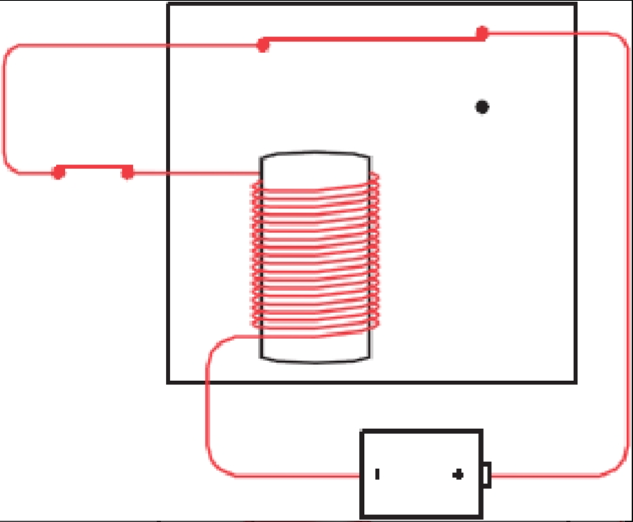

连通的电路使得电磁铁把金属簧片拉了下来。

当金属簧片的位置变化时，电路不再连通，电磁铁不再具有磁性，金属簧片又弹回原位。

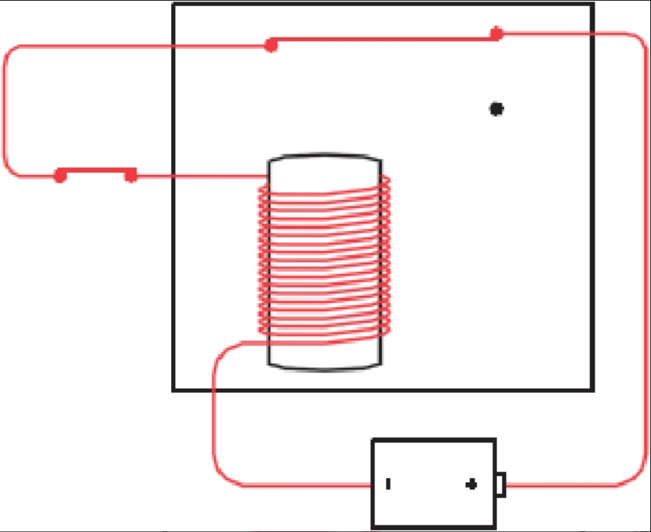

如此一来，电路又一次连通了。从整个过程来看：开关一旦闭合，金属簧片就会上下跳动——电路也会随之连通或断开——声音也就会随之发出。如果金属簧片发出了一种刺耳的声音，这套系统就成为了一个蜂鸣器。如果金属簧片前端是一把小锤子，旁边只要放上一个锣，就构成了一个电铃。

有两种方法可以使继电器连接成为一个蜂鸣器，下面再给出一种方法的描述，在示意图中包含了一个标准电压符号和一个接地符号。

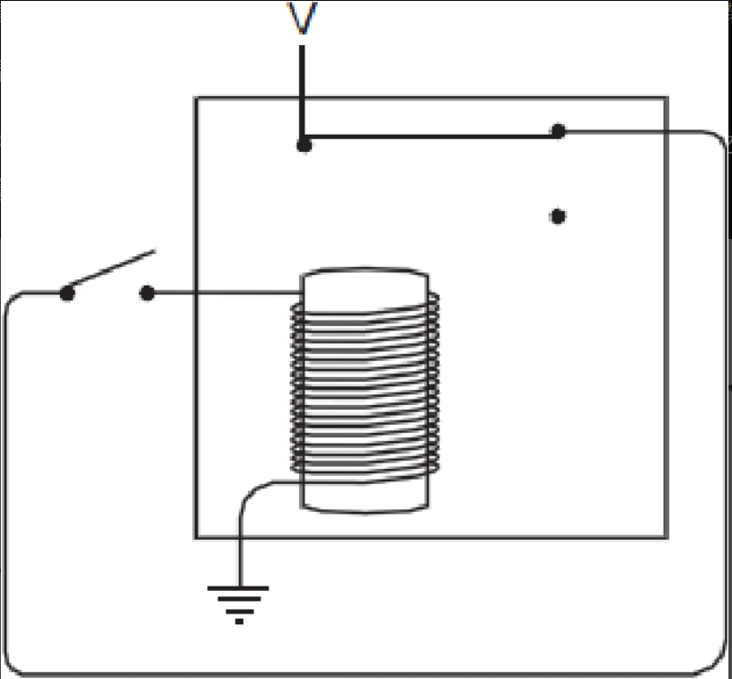

看到这幅图你或许立刻想起了第11章介绍过的反向器，因此电路可以简化为如下图所示。

正如你所记得的那样，当反向器的输入是0的时候，它的输出就为1；而当其输入为1时，输出就为0。电路中的开关一旦闭合，反向器中的继电器就会在连通与断开这两种状态之间反复交替。你也可以将电路中的开关省去，这样就可以使反向器连续地工作，如下所示。

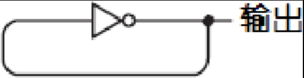

这幅图似乎在表达着一种矛盾的逻辑，反向器的输出与其输入是相反的，但是在这里，输出同时又是输入！然而，我们要牢牢记住，反向器在本质上就是一个继电器，而继电器将状态取反以得到另一个状态是需要一点点时间的。所以，即使输入和输出是相同的，输出也会很快地改变，成为输入的相反状态（当然，输出随即也会很快改变输入，如此反复）。

电路的输出是什么呢？其实就是要么提供电压，要么不提供电压，在两者之间切换。我们也可以换种方式来表达——输出结果要么是0，要么是1。

我们把这种电路称为振荡器(oscillator)，它和我们先前学到的所有东西存在本质上的区别。在此之前我们讲过的所有的电路，其状态的改变都依靠人为的干预，通常是通过改变开关状态来实现的。但是振荡器却在不需要人干涉的情况下，可以完全自发地工作。

当然，单独的一个振荡器用处并不大，但是在本章的后面和接下来的几章里，我们会发现，在与其他电路连接后所组成的自动控制系统中，振荡器有着举足轻重的作用。为了使不同组件同步工作，所有计算机都配备着某种振荡器。

当采用0和1的交替序列来表示振荡器的输出时，我们一般使用下面这样的图来形象地描述输出。

我们可以通过这幅图来充分地了解电路的输出，水平坐标代表时间，垂直坐标用来表示输出是0还是1。

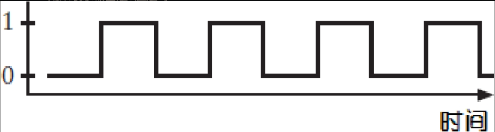

这幅图表示随着时间的推移，振荡器的输出在0和1之间按照固有的规律交替变化。正因为这一点，振荡器又经常被称为时钟(clock)，通过振荡进行计数也是一种计时方式。

振荡器运行速度究竟有多快呢？换句话说，金属簧片多久会振动一次？或者每秒钟振动多少次呢？这很大程度上依赖于继电器的内部构造。你容易想到，一个又大又重的继电器只能缓慢地上下摆动；而一个又小又轻的继电器却可以高速地跳动。

振荡器从某个初始状态开始，经过一段时间又回到先前初始状态的这一段间隔定义为振荡器的一个循环(cycle)，或者称为一个周期，如下图所示。

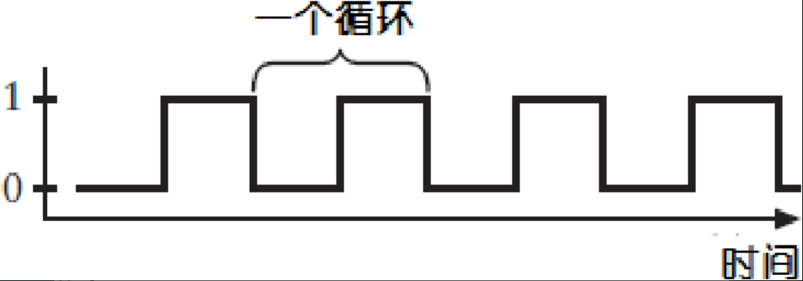

一个循环所占用的时间就是该振荡器的周期(period)。假设我们使用的振荡器的周期恰好是0.05s，任取一个时间点，将其设置为起始状态点，我们把它标注为零点，就可以在水平轴上标出相应的时间。

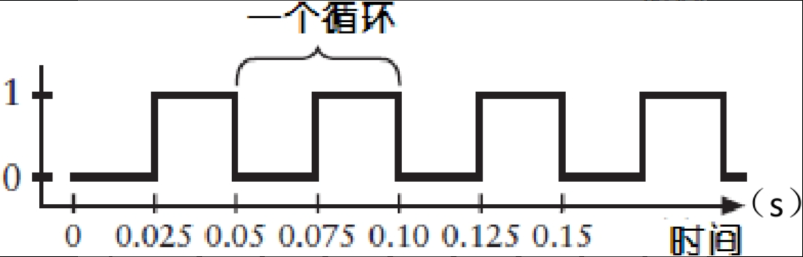

周期的倒数就是振荡器的频率(frequency)。在这个例子中振荡器的周期是0.05s，那么其频率就是1÷0.05s，即振荡器每秒钟产生20次循环，而相应的输出每秒钟也变化20次。

每秒钟的循环次数与每小时穿越的英里数、每平方英尺的重量、每份食物的卡路里数等概念一样都是很容易理解的，但这种描述方法已不常用。为了纪念发送和接收无线电波的第一人——亨利希·鲁道夫·赫兹(1857—1894)，后人使用“赫兹”这个词来表示这一概念。这种用法起源于20世纪20年代的德国，几十年之后逐渐被其他国家所广泛采纳。

这样，上述振荡器的频率就是20赫兹，记做20 Hz。

目前为止，我们还只是在猜测一个振荡器的速度。在本章后面我们将构建一种可以测量振荡器速度的元件。

在此之前，让我们先来看看采用特殊方式连接的一对或非门。或非门的特点是只有在两个输入端都没有电压时，输出端才产生电压。

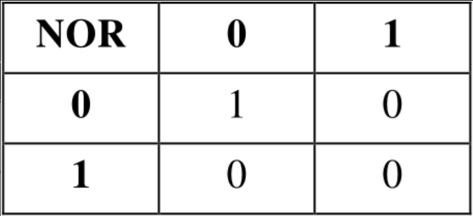

下面是一个包含两个或非门、两个开关和一个灯泡的电路。

值得注意的是这种特殊的弯曲的连线方式：左边或非门的输出是右边或非门的输入，而右边或非门的输出是左边或非门的输入。这种连接方式我们称之为反馈(feedback)。系统的输出返回给输入这种形式和我们在振荡器中讨论的情况很相似。接下来你将会看到，本章大部分电路都具备这种特质。

在初始状态下，电路中只有左边的或非门输出电流，这是因为其两个输入均为0。让我们闭合上面的开关，左边或非门将立刻输出0，右边或非门的输出也会随之变为1，这时灯泡将被点亮。

奇妙的是，这时一旦你关闭上边的开关，灯炮依然闪闪发光。这是因为由于左边或非门的输入中有一个为1，其输出依然是0，因而左边或非门的输出不变，所以灯泡仍然亮着。

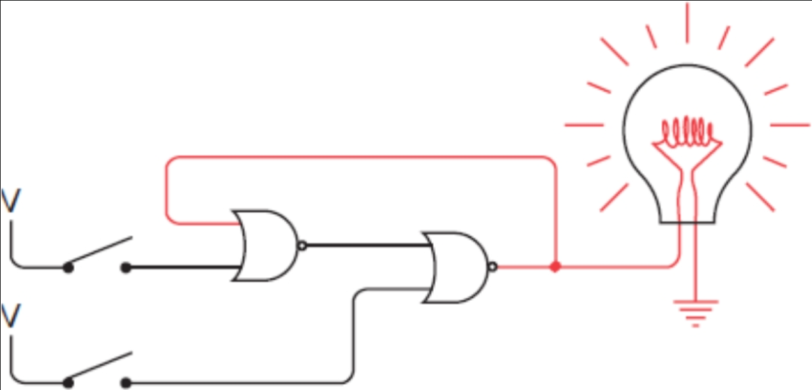

难道你不觉得有点奇怪吗？两个开关都断开——和第一幅场景描述的是一模一样——但这里的灯泡却仍发光。这与我们先前所见过的所有情况都完全不同。先前遇到的电路其输出依赖且仅依赖于其输入，这次的结论与以前的大相径庭。无论上面的开关怎么调整其状态，灯泡总是亮着。这个开关对电路毫无影响，究其原因可以发现这是由于左边或非门的输出一直为0。

现在来试试闭合下面的开关。我们会发现右边或非门的输入中有一个立刻变为1，其输出就相应地变为0，灯泡随之熄灭。左边或非门的输出此刻变为1。

这时你再去断开下面的开关就会发现，灯泡一直处在熄灭状态。

此时的电路状态与初始时是一样的。但是这次无论你怎么改变下面开关的状态，灯泡丝毫不受影响。我们将先前的情况一起总结一下：

接通上面的开关，灯泡被点亮，断开此开关灯泡仍然亮着。

接通下面的开关，灯泡被熄灭，断开此开关灯泡仍然不亮。

电路的奇怪之处是：同样是在两个开关都断开的状态下，灯泡有时亮着，有时却不亮。当两个开关都断开时，电路有两个稳定态，这类电路统称为触发器(Flip-Flop)，Flip-Flop这个单词也可以有“沙滩鞋”或者是“政治策略”的意思。触发器是在1918年被发明的，发明者是英国无线电物理学家威廉姆·亨利·艾克里斯(1875—1966)和F.W.乔丹（信息不详）。

触发器电路可以保持信息，它可以“记住”某些信息。特别地，对于本章先前所讲述的触发器，它可以记住最近一次是哪个开关先闭合。如果你遇到这样一种触发器，如果它的灯泡是亮着的，你就可以推测出最后一次连通的是上面的开关；而如果灯泡不亮则可推测出最后一次连通的是下面的开关。

触发器和跷跷板有着很强的相似性。跷跷板也有两个稳定状态，它不会长期停留在不稳定的中间位置。通过观察跷跷板，我们很容易推测出哪边最后一次被压下来。

尽管你现在可能还没感受到这一点，但触发器的的确确是一种必不可少的工具。它们可以让电路“记住”之前发生了什么事情。想象一下，如果你没有了记忆力，该如何去数数，我们不记得刚刚数过的数，当然也就无法确定下一个数是什么！同理，一个能计数的电路（本章后面要讲到）必定需要触发器。

触发器种类繁多，先前所讲述的是最简单的一种R-S（Reset-Set，复位/置位）触发器。我们通常把两个非或门绘制成另一种形式，加上标识符就得到了下面这幅图。

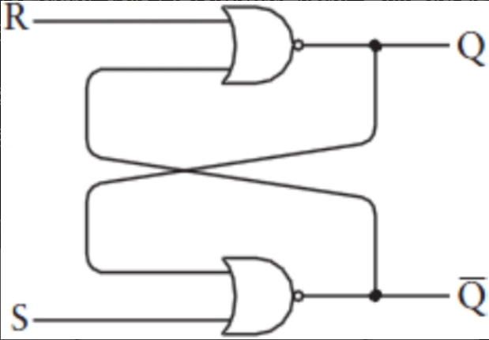

我们通常用Q来表示用于点亮灯泡的输出的状态。另一个输出[插图]（读做Q反）是对Q的取反。Q是0，[插图]就是1，反之亦然。输入端S(Set)用来置位，R(Reset)用来复位。你可以把“置位”理解为把Q设为1，而“复位”是把Q设为0。当状态S为1时（对应于先前触发器中上面的开关闭合的情况），此时Q变为1而[插图]变为0；当R状态为1时（对应于前面图中闭合下面的开关的情况），此时Q变为0而[插图]变为1。当S和R均为0时，输出保持Q原来的状态不变。我们把结论总结如下表所示。

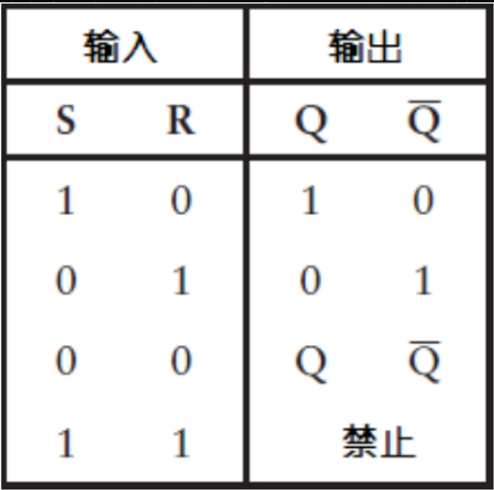

这类表称为功能表(function table)、逻辑表(logic table)或真值表(truth table)。它表达了不同输入组合所对应的不同输出结果。因为R-S触发器仅有两个输入端，所以不同的输入组合共有4种，分别对应于表中的4行。

注意表中倒数第2行，这一行输入S和R均为0，而输出标识为Q和[插图]。这表示当S和R输入均为0时，Q和[插图]端的输出保持为S、R同时被设为0以前的输出值。表中最后一行表示S和R均为1的输入组合是被禁止或者不合法的。不要误解为你会因此被逮捕，而是说如果S、R状态同时为1时，Q和[插图]均会为零，这与Q和[插图]互反的假设关系相矛盾。所以当使用R-S触发器进行电路设计时，R、S输入同时为1的情况一定要避免。

R-S触发器可以简化为带有输入和输出标志的小框图，就像下面画的这样。

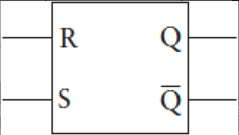

R-S触发器最突出的特点在于，它可以记住哪个输入端的最终状态为1。但是有时候我们需要一种记忆能力更加强大的电路，例如能记住在某个特定时间点上的一个信号是0还是1。

在构造具备这种功能的电路之前，让我们先来思考一下它的具体行为。这个电路存在两个输入。其中一个我们称之为数据端(Data)。与所有数字信号一样，数据端取值为0或1；另一个输入被称为保持位(Hold That Bit)，保持位的作用就是使当前的状态被“记住”，通常情况下保持位被设置为0，在这种情况下数据端对电路不产生影响。当保持位置1时，数据端的值就会在电路系统中被“记住”。随后保持位又置为0，这时电路已经“记住”了数据端的最后一次输入，而之后数据端的输入无论如何变化都不会对电路产生影响。

我们可以把状态转化的过程以真值表的形式表示如下。

在前两种情况下，保持位为1，输出Q与数据端输入相同；后面两种情况下，保持位为0，输出端Q和其前一个状态保持一致。值得注意的是，保持位为0意味着输出将不再变化，也就是说不再被数据端所影响，我们可以进一步将真值表简化为如下所示。

X表示“其取值情况与结果无关”，只要保持位的值为0，那么数据位对电路的输出没有影响，电路的输出和其前一个状态相同。

如果使用先前学过的R-S触发器来实现这种具有保持位的功能系统，那么我们的电路需要在输入端增加两个与门，下图所给出了该系统的实现电路。

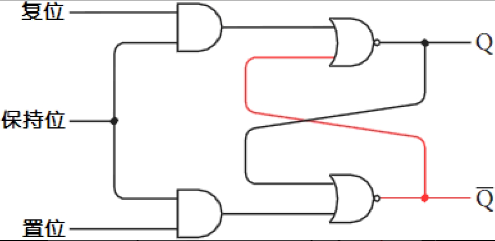

回忆一下与门，它的特点是只有在输入端都为1的状态下，输出才为1。在上面这幅图中，输出端Q为0，[插图]为1。

只要保持位为0，则置位端对于输出结果不会有任何影响。

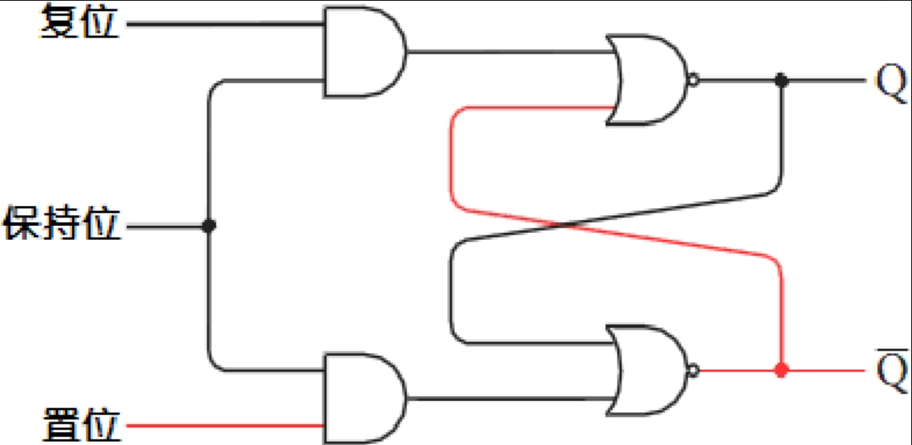

同样，复位信号对输出也无任何影响。

当保持位信号为1时，这套电路系统就和先前讲过的R-S触发器功能一致。

这时由于上面与门的输出和复位端输入相同，而下面与门的输出和置位端输入相同，所以电路系统的功能和普通的R-S触发器是一样的。

但是我们离目标还差一点。我们只想要两个输入，而不是三个，怎么解决这个问题呢？先回忆一下R-S触发器的功能表：两个输入端同时为1是非法的，要尽量避免；而两个输入端同时为0是无意义的，因为那种情况下输出就会保持不变。我们只要将保持位设置为0，就完全可以实现相同的功能。

由此可以总结出，真正有意义的输入可以是S为0, R为1或者是R为0, S为1的情形。如果把数据端信号看做置位信号，把它取反后的值看做复位端信号，我们可以画出相应的电路图如下所示。

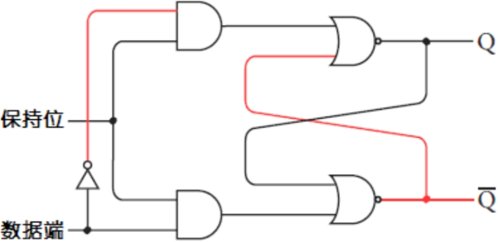

在上图所表示的情况下，所有输入均为0，而输出Q也为0（此时[插图]为1）。可以看出只要保持位为0，电路输出就丝毫不受输入端的影响。

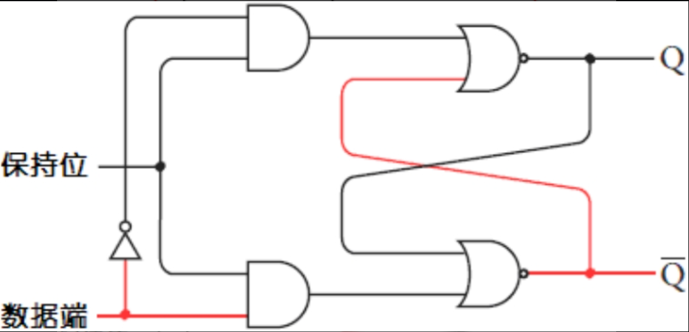

当保持位为1时，电路反映出数据端输入的值。

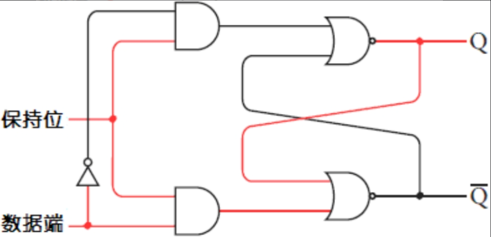

现在Q端的输出和数据输入是一致的，而[插图]端则正好相反。现在保持位又回到0，如下图所示。

这时，电路会“记得”当保持位最后一次置1时数据端输入的值，数据端的变化对此没有影响。例如，数据端再置回0对输出将不会产生影响。

这个电路称为电平触发的D型触发器，D(Data)表示数据端输入。所谓电平触发是指当保持位输入为某一特定电平（本例中为“1”）时，触发器才保存数据端的输入值（很快，我们将看到另一种形式的触发器）。

通常情况下，当这种电路出现在书中的时候，输入端是不会被标记为保持位的，而是被标记为时钟(clock)。当然，这种信号并不是真正的时钟，但是在某些情况下它却具有类似时钟的属性，即它可以在0和1之间有规律地来回变化。但是现在时钟仅仅用来指示什么时候保存数据。

通常把数据端简写为D，时钟端简写为Clk，其功能表如下所示。

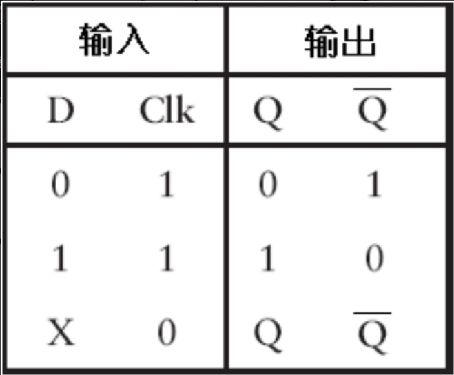

这个电路也就是所谓的电平触发的D型锁存器，它表示电路锁存住一位数据并保持它，以便将来使用。这个电路也可以被称为1位存储器。在本书的第16章将会介绍如何将多个1位存储器连接起来构成多位存储器。

在锁存器中保存多位值通常是很有用的。假如你想用第12章的加法器把3个8位数相加，可以在开关的第1行中存入第1个加数，以同样的方式把第2个加数存入第2行，但是必须记下第一次相加的结果。然后你需要把这个结果输入到开关的一行中，再把第3个加数输入到开关的另一行中。而你实际上不必输入中间结果，你应该能够在第一次计算之后直接使用它。

可以使用锁存器来解决这个问题。我们在一个小盒子里布置8个锁存器，如前所述，每个锁存器包括两个或非门、两个与门以及一个反相器。所有的时钟输入端都互相连在一起。结果如下图所示。

这个锁存器可以一次保存8位数。上面的8个输入端依次标记为D0～D7，下面的8个输出端被标记为Q0～Q7。左边的输入是时钟(Clk)，时钟信号通常为0。当时钟信号为1时，D端输入的8位值被送到Q端输出。当时钟信号为0时，这8位值将保持不变，直到时钟信号再次被置1。

也可以将8位锁存器的8个数据输入端和8个Q输出端画为两组线，如下图所示。

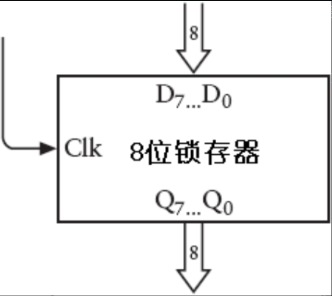

下面是8位加法器的图示。

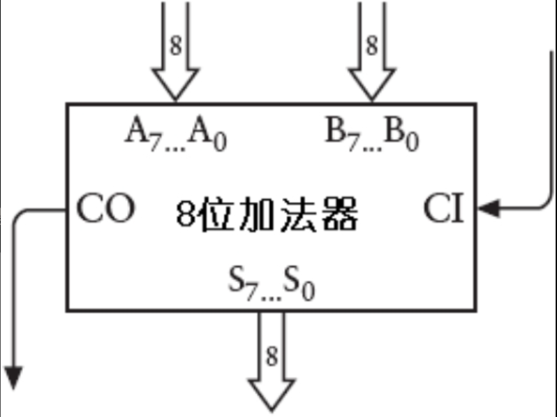

通常（先不考虑上一章讲到的减法器），8个A输入端和8个B输入端连接到开关上，CI（进位输入）接地，而8个S（计算和）输出以及CO（进位输出）端连接到灯泡上。

经过改进，8位加法器的8个S输出端既与灯泡相连，又连接到8位锁存器的数据(D)输入端。标记为“保存”(Save)的开关是锁存器的时钟输入，用来存放加法器的运算结果。

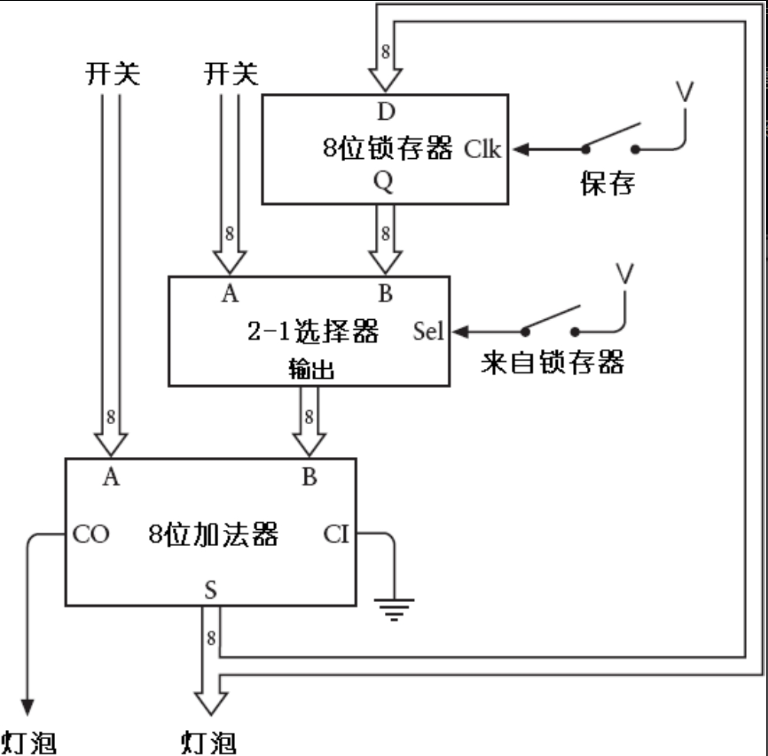

标识为2-1选择器的方块是让你用一个开关来选择加法器的B端输入是取自第2排开关还是取自锁存器的Q端输出。当开关闭合时，就选择了用8位锁存器的输出作为B端输入。2-1选择器使用了8个如下所示的电路。

如果选择端(Select)输入是1，那么或门的输出和B端的输入就是一致的。这是因为上面与门的输出和B端输入是一样的，而下面与门的输出是0。类似的，如果选择端的输入是0，那么或门的输出则和A端输入一致。总结起来如下表所示。

改进后的加法器中包含了8个这样的1位选择器。所有的选择端输入信号都是连在一起的。

改进后的加法器不能很好地处理进位输出(CO)信号。如果两个数的相加使得进位输出信号为1，那么当下个数被加进来的时候，这个信号将被忽略掉。一个可能的解决方案是将加法器、锁存器、选择器均设置为16位宽，或者至少应该比你可能遇到的最大的和的位数多一位。这个问题留到第17章具体讲述。

对于加法器来说，一个更好的改进方法是去掉一整排8个开关。但是首先要对D触发器做一些修改，为它加一个或门和一个称为清零(Clear)的输入信号。清零信号通常为0，但当它为1时，Q输出为0，如下图所示。

无论其他信号是什么，清零信号总是强制使Q输出为0，以达到使触发器清零的目的。

也许你还不明白为什么要设置这个信号，为什么不能通过把数据输入端置0和把时钟输入端置1来使触发器清零呢？这也许是因为我们无法精确控制数据端的输入信息的缘故。我们可能有一组8个锁存器，它们连着8位加法器的输出端，如下图所示。

注意，标识为“相加”(Add)的开关现在控制着锁存器的时钟输入。

你可能会发现这个加法器比前面的那个好用，特别是当你需要加上一长串数字时。首先按下清零开关，这个操作会使锁存器的输出为0，并且熄灭了所有的灯泡，同时使8位加法器的第2行输入全为0。然后，通过开关输入第一个加数，并且闭合“相加”开关，这个加数的值就反映在灯泡上。再输入第二个加数并再次闭合“相加”开关。由开关输入的8位操作数加到前面的结果上，所得的和体现到灯泡上。反复如此操作，可以连续进行很多次加运算。

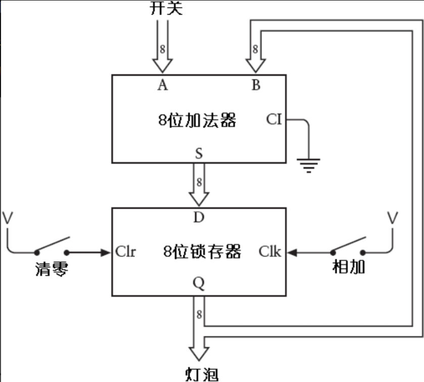

前面提到过，我们所设计的D触发器是电平触发的，也就是说为了使数据端的值保存在锁存器中，必须把时钟端的输入从0变为1（即高电平）。但是，当时钟端输入为1时，数据端的输入是可以改变的，这时数据端输入的任何改变都会反映在Q和[插图]的输出值中。

对某些应用而言，电平触发时钟输入已经足够用了；但是对另外一些应用来说，边沿触发(edge-triggered)时钟输入则更有效。对于边沿触发器而言，只有当时钟从0跳变到1时，才会引起输出的改变。它们的区别在于，在电平触发器中，当时钟输入为0时，数据端输入的任何改变都不会影响输出；而在边沿触发器中，当时钟输入为1时，数据端输入的改变也不会影响输出。只有在时钟输入从0变到1的瞬间，数据端的输入才会影响边沿触发器的输出。

边沿触发的D型触发器是由两级R-S触发器按如下方式连接而成的。

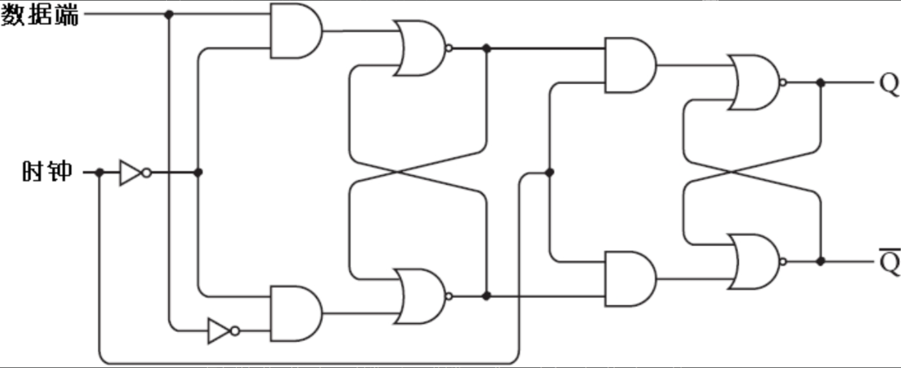

这里，时钟端的输入既控制着第一级R-S触发器，也控制着第二级，但是要注意的是时钟信号在第一级中进行了取反操作，这意味着除了当时钟信号为0时保存数据外，第一级R-S触发器和D型触发器工作原理完全一致。第二级R-S触发器的输出是第一级的输入，当时钟信号为1时，它们都被保存。一言概之，只有当时钟信号由0变为1时，数据端输入才被保存下来。

进一步分析，下图为一个处于非工作状态的触发器，其数据输入和时钟输入均为0，且Q输出也为0。

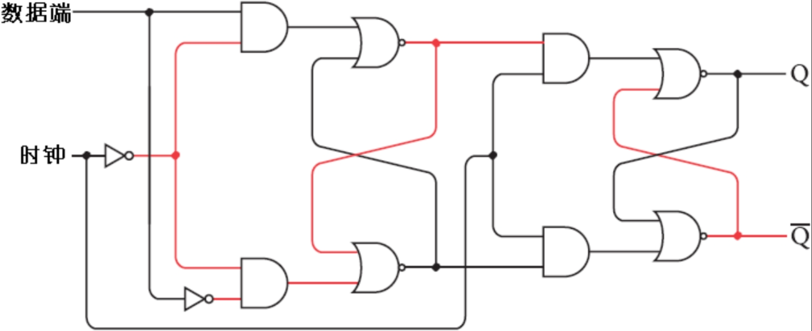

现在使数据端输入为1，如下图所示。

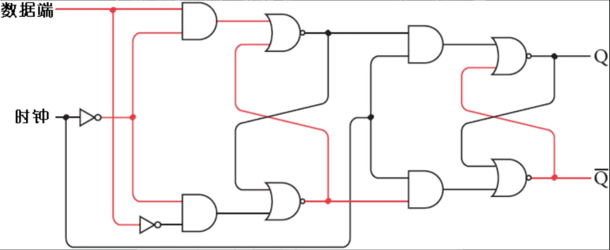

这改变了第一级触发器的状态，因为时钟输入取反变为1。但第二级触发器状态保持不变，因为时钟输入仍然为0。现在把时钟输入变为1。

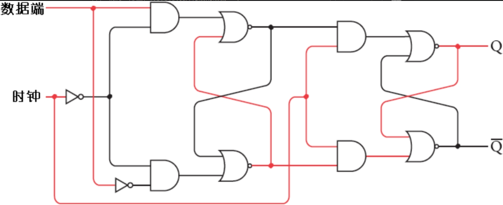

这就引起了第二级触发器输出的改变，使Q输出变为1。不同点在于，无论数据端输入发生何种变化（比方说变为0）都不会影响Q的输出。

只有在时钟输入从0变化到1的瞬间Q和[插图]输出才发生变化。

边沿触发的D型触发器的功能表需要一个新的符号来表示从0到1的瞬时变化，即用一个向上的箭头(↑)表示，如下表所示。

表中箭头表示当时钟端由0变为1时（称为时钟信号的“正跳变”，“负跳变”是指从1变为0），Q端输出与数据端输入是相同的。触发器的符号如下图所示。

图中的小三角符号表示触发器是边沿触发的。

下面展示的是一个使用边沿D型触发器的电路，这个电路是不能用电平触发形式复制出来的。先回忆一下本章开始构造的振荡器，其输出在0和1之间变化。

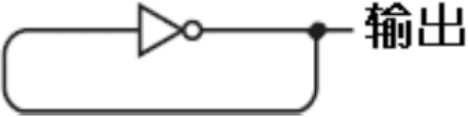

把振荡器的输出与边沿触发的D型触发器的时钟端输入连接，同时把[插图]端输出连接到本身的D输入端。

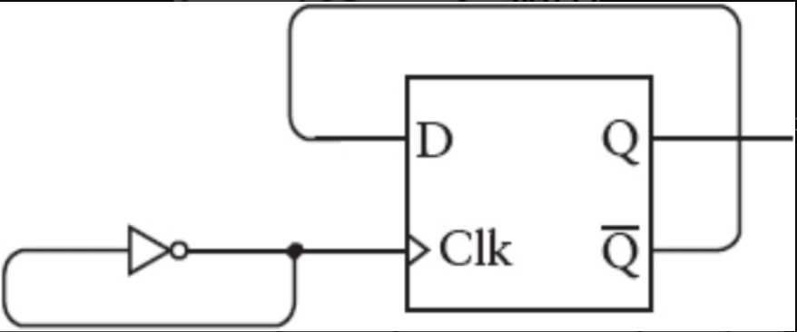

这个触发器的输出同时又是它自己的输入。反馈紧接着反馈！（实际上，这种构造可能是有问题的，振荡器是由状态来回迅速改变的继电器构成的，其输出与构成触发器的继电器相连，而这些其他的继电器不一定能跟得上振荡器的速度。为了避免这些问题，这里假设振荡器中的继电器比电路中其他地方的继电器速度要慢得多）

仔细看一看下面的功能表就可以明白在电路中发生的情况了，电路启动时，假设时钟输入为0且Q输出也为0，则[插图]端输出为1，而[插图]是和D端输入相连的。

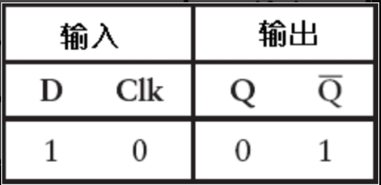

当时钟输入从0变为1时，Q输出与D输入相同。

但是由于[插图]的输出变为0，因此D输入也变为0。现在时钟输入为1，如下表所示。

当时钟输入变回0时，不会影响到输出，如下表所示。

现在时钟端输入又变为1。由于D输入为0，那么Q输出为0且[插图]输出为1。

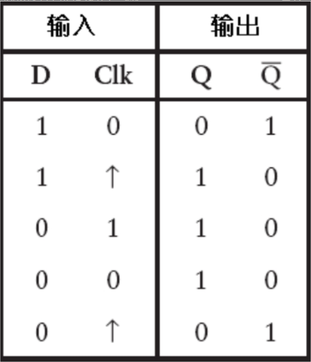

所以D输入也变为1，如下表所示。

以上发生的现象可以简单总结为：每当时钟输入由0变为1时，Q端输出就发生变化，或者从0到1，或者由1到0。下面的时序图可以更加清楚地说明这个问题。

当时钟端Clk输入由0变为1时，D的值（与[插图]的值相同）被输出到Q端。当下一次Clk信号由0变为1时，D和[插图]的值同样会改变。

如果这个振荡器的频率是20Hz（即20个周期的时间为1s），那么Q的输出频率是它的一半，即10Hz，由于这个原因，这种电路称为分频器(frequency divider)，它的[插图]输出反馈到触发器的数据端输入D。

当然，分频器的输出可以作为另一个分频器的Clk输入，并再一次进行分频。下面是三个分频器连接在一起的示意图。

上图顶部的4个信号变化规律如下图所示。

