# 17. 自动操作

我们人类的创造能力与勤奋精神常常令我感叹不已，但人类的本性却是相当懒惰的。举个简单而又常见的例子，我们总是不情愿工作。我们对工作的反感是如此的强烈—当然人类也很聪明—以至于情愿花费大量的时间去设计并制造一些设备，哪怕这些设备只能将工作时间缩减几分钟。悠闲地躺在吊床上，看着自己刚发明的新奇工具自动修剪草坪，没有什么事情能比这更让我们快乐的神经为之一动了。

很可惜，我并不打算在本章中介绍自动割草机的设计。在这里我们将学会设计更加先进的机器，目标就是要使加减法的过程自动化，这听起来有些难以置信。但是，本章最终设计出的机器用途将十分广泛，因为它可以解决所有能用加、减法处理的问题，而事实上现实中的很多问题都是可以用加法与减法来解决的。

当然，随着机器变得越来越精密，其复杂程度也越来越高，因此对其构造的某些部分理解起来比较困难。因此如果你略去了某些复杂的细节，这也是在情理之中，没有人会为此责怪你。有时，我们会感到焦躁不安，甚至厌倦，发誓再也不会为了解决一个复杂的数学难题而去求助于某些电子或机械设备。但是请保持耐心，在本章的末尾我们将会设计出一种机器，我们可以称它为计算机(Computer)。

回忆我们曾在第14章讨论过的一个加法器。这个版本的加法器包括一个8位的锁存器，用于对8个开关的输入数据进行迭代求和。下面是其结构图。

从图中可以看出，8位锁存器利用触发器来保存8位数据。使用这个设备时，首先需要按下清零开关使锁存器中的内容全部都变为0，然后通过开关输入第一个数。加法器只是简单地将这个数字和锁存器输出的0进行求和，因此相加的结果与原先输入的数字是一样的。按下相加开关可以把这个数保存在锁存器中，最后会点亮某些灯泡以显示它。现在通过开关输入第二个数，加法器把它与已经存放在锁存器中的第一个数相加。再次按下相加开关，就可以把相加的结果存入锁存器中，并通过灯泡显示这个结果。通过这种方式，可以把一串数相加并显示运行结果。显然，这种设计方案存在一个缺陷：8个灯泡无法显示大于255的数。


对于第14章所介绍的这种电路，目前为止只讲到了一种锁存器，它是电平触发(level triggered)的。在电平触发的锁存器中，为了保存数据必须将时钟输入端首先置1，然后回置为0。当时钟输入端为1时，锁存器的数据输入端可以改变，而这些变化将会影响到数据输出。在第14章的后半部分还介绍了边沿触发(edge-triggered)的锁存器，这种锁存器在时钟输入从0跳变为1的瞬间保存数据。边沿触发器在很多方面更加易于使用，因此假定本章用到的所有触发器都是边沿触发的。

用来累加多个数的锁存器称做累加器(accumulator)。在本章的后面将会看到累加器不仅仅做简单的累加，它还充当着锁存器的角色，保存第一个数，并且和下一个数做加法或减法运算。

很显然，上面的加法器存在着一个很大的缺陷：假如要把100个二进制数加起来，你必须端坐于加法器前，并且耐心地输入所有的数并累加起来。但是当你终于完成时，却发现其中有两个数输错了，而你只能重复一遍所有的工作。

但是，也许并非如此。在前一章我们使用了大约500万个继电器构造了一个64 KB的RAM阵列。除此之外，我们还把一个控制面板连接到电路帮助我们工作，闭合它的控制（Takeover，有些书中也称“接管”）端开关后，就可以使用其他开关来控制RAM阵列的读写。下面是64 KB RAM阵列结构图。

如果把这100个二进制数输入到RAM阵列中而不是直接输入到加法器中，一旦需要修改一些数据，我们的工作将会变得容易得多。


因此我们所现在面临的挑战就是如何把RAM阵列和累加器连接起来。很显然，RAM阵列的输出信号可以替代加法器的开关。而你也许想不到，用一个16位的计数器（比如我们在14章构造的那种）就可以控制RAM阵列的地址信号。在这个电路中，RAM阵列的数据输入信号和写操作端信号可以省去。修改后的电路结构如下图所示。

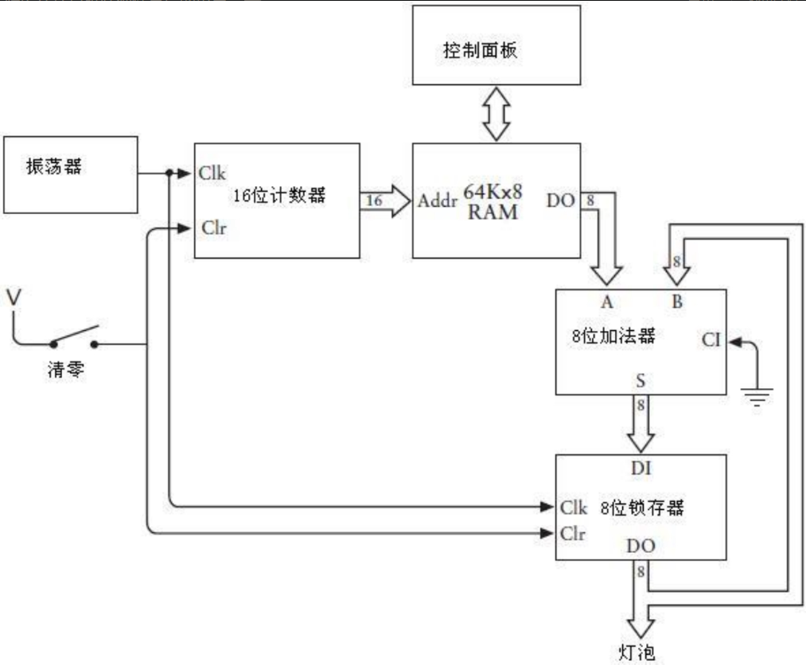

当然，这并不是迄今发明的最易于使用的计算设备。要使用它，首先要闭合清零开关，这样做的目的是，清除锁存器中的内容并把16位计数器的输出置为0000h，然后闭合RAM控制面板的控制端开关。现在你可以从地址0000h开始输入一组你想要相加的8位数。如果有100个数，那么它们将被存放在0000h～0063h的地址空间中（也应该把RAM阵列中未使用的单元设置为00h）。然后闭合RAM控制面板的控制端开关（这样控制面板就不再控制RAM阵列了），同时断开清零开关。做完了这些，我们可以静静地坐下来，观察灯泡显示运算结果。

让我们来看一下它是怎样工作的：当清零开关第一次断开时，RAM阵列的地址输入是0000h。RAM阵列的该地址中存放的8位数值是加法器的输入数据。加法器的另一个输入数据为00h，因为此时锁存器也已经清零了振荡器提供的时钟信号—一个可以在0,1之间快速切换的信号。清零开关断开后，当时钟信号由0跳变为1时，将有两件事同时发生：锁存器保存加法器的计算结果，同时16位计数器增1，指向RAM阵列的下一个地址单元。清零开关断开之后，时钟信号第一次从0跳变为1时，锁存器就将第一个数值保存下来，同时计数器增加为0001h；当时钟发生第二次跳变时，锁存器保存之前两个数的求和结果，同时计数器增加为0002h；按这种方式往复操作。

要注意的是，这里首先做了一些假设。最主要的一点就是，振荡器要足够慢以使电路的其他部分可以工作。每次时钟振荡的过程中，在加法器输出有效的结果之前，一些继电器必须去触发其他继电器。

这个电路存在的一个缺陷是：我们没有办法使它停下来。在某一个时刻，所有灯泡会停止发光，因为RAM阵列的剩余部分存放的数都是00h。这时，你可以读取二进制的运算结果。但是当计数器达到FFFFh时，它会重新回滚(roll over)到0000h（这就好像汽车的里程表一样），这时自动加法器会再一次把所有的数累加到已经计算出来的结果中去。

这个加法器还存在另一个问题：它只能做加法运算，并且只能做8位数的加法。在这个RAM阵列中，不但每一个数要小于255，而且任意个数相加的结果也要小于255。此外，该加法器也不能处理减法运算，尽管可以用2的补数表示负数，但在这种情况下加法器能处理的数字的范围被限制在-128到127之间。要处理更大的数（例如，16位数）的话，一个简单的方法是：把RAM阵列、加法器、锁存器的位宽全都加倍，同时增加8个灯泡。但这些投资在我们看来是不合算的。

当然，这里提到这个问题的原因是最终我们要解决它。但首先来关注另一个问题：如果你不需要把100个数加在一起呢？如果你想做的是用自动加法器把50对数分别相加，得出50个不同的结果呢？或者你需要一种万能机，它可以方便地对两个数，10个数甚至100个数求和，并且所有的计算结果都可以很方便地使用。

先前提到的自动加法器都是用连接在锁存器上的灯泡来显示运行结果的，但是如果你想对50对数分别求和的时候，这就不是一个好的方法了。你可能会想到把运算结果存回到RAM阵列中去，这样的话，就可以在适当的时候用RAM阵列的控制面板来检查运算结果。为了实现这个目的，控制面板上专门设计了灯泡。

这意味着我们可以去掉与锁存器连接的灯泡，取而代之的是把锁存器的输出端连接到RAM阵列的数据输入端，这样就可以把计算结果写回到RAM阵列中去，如下图所示。

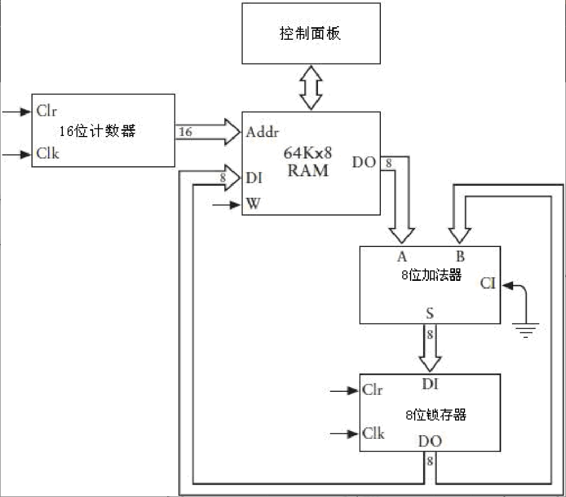

上图中略去了自动加法器的其他部分，其中包括振荡器和清零开关，这是因为我们不再需要特别标注计数器和锁存器的清零及时钟输入。此外，既然我们现在已经开始利用RAM的数据输入，因此需要一种用来控制RAM写入信号的方法。

现在我们不需要担心电路能否工作，而要把注意力集中到急需解决的问题上来。目前的当务之急是如何配置一个自动加法器，使它不仅仅可以对一组数字做累加运算，还希望它能够自主地确定要累加多少个数字，而且还能记住在RAM中存放了多少个计算结果，这样就可以简化查询工作。

例如，假设我们先要对三个数进行求和，然后对两个数进行求和，最后再对三个数进行求和。想象一下，我们可以把这些数保存在RAM阵列中以0000h开始的一组空间中，这些数存储在RAM阵列中的具体形式如下图所示。


本书中将用这样的形式表示一小段存储器。方格表示的是存储器的内容。存储器的每一个字节写在一个方格里。地址标记在方格的左边，并不是每一个地址都需要标记，因为地址是线性的，所以总是可以通过计算确定某个方格对应的地址。方格右边是关于该存储单元内容的注释，这些标记的单元就是我们想要自动加法器保存三个计算结果的位置（尽管这些方格画出来是空的，但是存储单元内并不是空的，它们总是保存着一些东西，就算只是一些随机数，但此时存放的是一些没有用的数）。

或许大家都有一种冲动，想亲自去做十六进制计算，并把结果填到那些小格子中去，但这并不是实验的目的，我们想要自动加法器为我们做这些加法。

我们并不希望自动加法器成为单任务系统—在它的第一个版本中，只是把RAM地址中的内容加到称为累加器的8位锁存器中—实际上我们希望它能做四件事：进行加法操作，首先它要把一个字节从存储器中传送到累加器中，这个操作称为加载(Load)。第二个操作把存储器中的一个字节加(Add)到累加器的内容中去。第三个操作把累加器中的计算结果取出并存放到存储器中。另外我们需要用一个方法令自动加法器停(Halt)下来。

我们借助具体的例子详细介绍这一过程，以上文提到的自动加法器所做的运算为例来说明。

```
(1)把0000h地址处的内容加载到累加器。
(2)把0001h地址处的内容加到累加器中。
(3)把0002h地址处的内容加到累加器中。
(4)把累加器中的内容存储到0003h地址处。
(5)把0004h地址处的内容加载到累加器。
(6)把0005h地址处的内容加到累加器。
(7)把累加器中的内容存储到0006h地址处。
(8)把0007h地址处的内容加载到累加器。
(9)把0008h地址处的内容加到累加器。
(10)把0009h地址处的内容加到累加器。
(11)把累加器中的内容存储到000Ah地址处。
(12)令自动加法器停止工作。
```

这里要注意，同最初的自动加法器一样，存储器中的每一个字节的地址仍然是以0000h为起点线性排列的。最初的加法器只是简单地把存储器指定地址的内容和累加器中的内容相加，在某些情况下需要这样做。但是有时我们需要把存储器中的某个值直接加载到累加器，或者把累加器中的值直接保存到存储器。做完了这些工作，算得上万事俱备只欠东风了，我们还希望自动加法器能方便地停下来，以便于查看RAM阵列中存放的值。

该如何来完成这些工作呢？能不能仅仅简单地向RAM阵列中输入一组数，然后期待自动加法器正确地完成所有工作呢？答案是否定的。对于RAM阵列中的每一个数，我们还需要用一些数字代码来标识加法器要做的每一项工作：加载、相加、保存和终止。

也许存放这些代码的最简单的方法（但肯定不是代价最小的）是把它们存放在一个独立的RAM阵列中。这个RAM应该和第一个RAM同时被访问。但是这个RAM中存放的是不需要求和的数，而是一些数字代码，用来标记自动加法器对第一个RAM中指定地址要做的一种操作。这两个RAM可以分别被标记为“数据”（第一个RAM阵列）和“代码”（第二个RAM阵列）。其结构如下图所示。


我们已经清楚地认识到新的自动加法器能够把数据求和的结果写入到第一个RAM阵列（标记为“数据”），而新的RAM阵列（标记为“代码”）则只能通过控制面板写入。

我们需要四个代码来标记新的自动加法器需要做的四个操作，这些代码可以任意指定。如下所示的是一种方案。


为了使上面讨论的三组加法得以正常执行，你需要通过控制面板把如下值存入代码RAM阵列。

比较一下该RAM阵列与存放累加数据的RAM阵列中的内容，你会发现，代码RAM阵列中存放的每一个代码都对应着数据RAM中要被加载或者加到累加器中的数，或者对应需要存回到数据RAM中的某个数。以这种方式使用的数字代码常常被称为指令码(instruction code)或操作码(operation code, opcode)。它们指示电路要执行的某种操作。

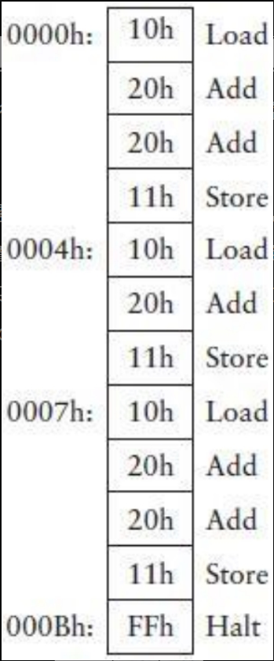

如前所述，最初的自动加法器的8位锁存器的输出要作为数据RAM阵列的输入，这就是Save指令的功能。还需要做另一个改变：以前8位加法器的输出是8位锁存器的输入，但现在为了执行Load指令，数据RAM阵列的输出有时也要作为8位锁存器的输入，这种新的变化需要一个2-1选择器来实现。改进后的自动加法器如下图所示。

图中略去了一些组件，但是仍然清晰地描述了各个组件之间的8位数据通路。16位的计数器为两个RAM阵列提供地址输入。通常，数据RAM阵列的输出传入到8位加法器执行加操作。8位锁存器的输入可以是数据RAM阵列的输出（当执行Load指令时），也可以是加法器的输出（当执行Add指令时），这种情况下就需要2-1选择器。通常，锁存器电路的输出又流回到加法器中，但是当执行Save指令时，它就成为了数据RAM阵列的输入数据。

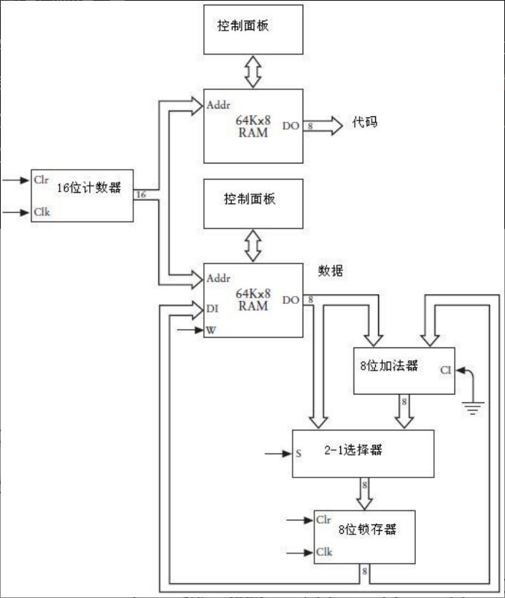

上图缺少的是控制所有这些组件的信号，它们统称为控制信号，包括16位计数器的“时钟”输入和“清零”输入，8位锁存器的“时钟”输入和“清零”输入，数据RAM阵列的“写”(W)输入，2-1选择器的“选择”(S)输入。其中的一些信号很明显是基于代码RAM阵列的输出，例如，如果代码RAM阵列输出是Load指令，那么2-1选择器的“选择”输入必须是0（即选择数据RAM的输出）。只有当操作码是指令Store时，数据RAM阵列的“写”(W)输入必须是1。这些控制信号可以通过逻辑门的各种组合来实现。

利用最少的附加硬件和一些新增的操作码，可以让这个电路从累加器中减去一个数。第1步是向操作码表增加一些代码。

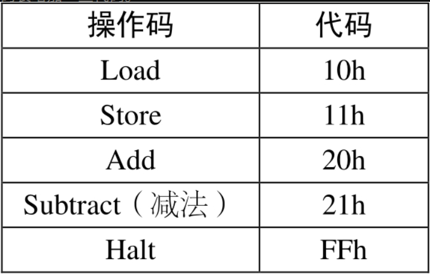

对于Add和Subtract的代码，其区别仅在于最低有效位，我们称该位为C0。如果操作码为21h，除了数据RAM阵列的数据传入加法器之前要取反，并且加法器进位输入置1之外，电路所做的操作与执行Add指令所做的操作相同。在这个增加了一个反相器的改进电路中，C0信号可以完成这两项任务。改进后的电路结构图如下。


假设现在要把56h和2Ah相加，然后再从中减去38h，可以按照下图中两个RAM阵列中的代码（操作码）和数据（操作数）完成该运算。


Load操作完成之后，累加器中的值更新为56h，加法操作完成后累加器中的值为56h与2Ah的和，即80h。Subtract操作使数据RAM阵列的下一个值(38h)按位取反，得到C7h。当加法器的进位输入置1时，取反得到C7h，然后使其与80h相加：

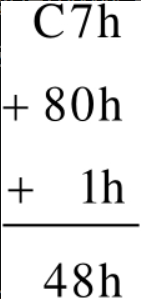

最后的结果是48h。（在十进制中，86加42再减去56等于72）

还有一个一直没有找到合适的解决办法的问题：加法器及连接到它的所有设备的宽度只有8位。以前提出过的一个解决办法是把两个8位加法器（其他的大部分设备也用两个）连在一起，构成一个16位的设备。

但还有代价更小的解决办法，假如你想把两个16位的数相加，比如：

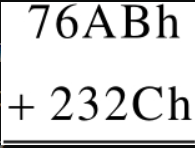

这种16位的加法先单独处理最右边的字节（通常称之为低字节）：

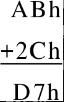

然后再计算最左边的字节，即高字节的和：

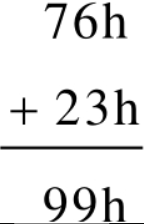

得到相同的结果99D7h。因此，如果我们把两个16位的数用这种方式保存在存储器中，就像下面这样：


运算结果D7h将被保存到地址0002h，而结果99h将被保存到地址0005h。

当然并非所有的情况都是这样处理，只是上面的例子中用到了这种方法。如果要把76ABh和236Ch这两个16位的数相加该怎么做呢？在这个例子中，对两个数的低字节求和时将会产生一个进位：


产生的这个进位必须与两个数的高字节的和再相加：


最后的计算结果为9A17h。

我们能够改进自动加法器的电路，使它可以正确地进行16位数的加法操作吗？答案是肯定的，我们需要做的仅仅是在第一步运算时保存低字节数运算的进位输出，并把它作为下一步高字节数运算的进位输入。如何保存1位呢？1位锁存器就是最好的选择了，该锁存器应该被称为进位锁存器(Carry latch)。

为了使用进位锁存器，还需要另一个操作码，我们称之为“进位加法”(Add with Carry)。当进行8位数加法时，使用的是常规的Add指令。加法器的进位输入是0，它的进位输出将会保存到进位锁存器（尽管它根本不会被用到）。

如果要对两个16位的数进行加法运算，我们仍然使用常规的Add指令对两个低字节数进行加法运算。加法器的进位输入是0，而其进位输出被锁存到进位锁存器中。当把两个高字节数相加时，要使用新的Add with Carry指令。在这种情况下，两个数相加时要用进位锁存器的输出作为加法器的进位输入。因此，如果第一步低字节数的加法运算有进位，则该进位将用于第二步高字节数的加法运算；如果没有进位，则进位锁存器的输出是0。

如果要进行16位数的减法运算，则还需要一个新的指令，称为“借位减法”(Subtract and Borrow)。通常，Subtract指令需要将减数取反并且把加法器的进位输入置1。进位输出通常不是1，因此应该被忽略。但对16位数进行减法运算时，进位输出应该保存在进位锁存器中。在进行第二步的高字节减法运算时，锁存器保存的结果应该作为加法器的进位输入。

在加入了Add with Carry和Subtract and Borrow之后，目前我们已经有了7个操作码，如下表所示。

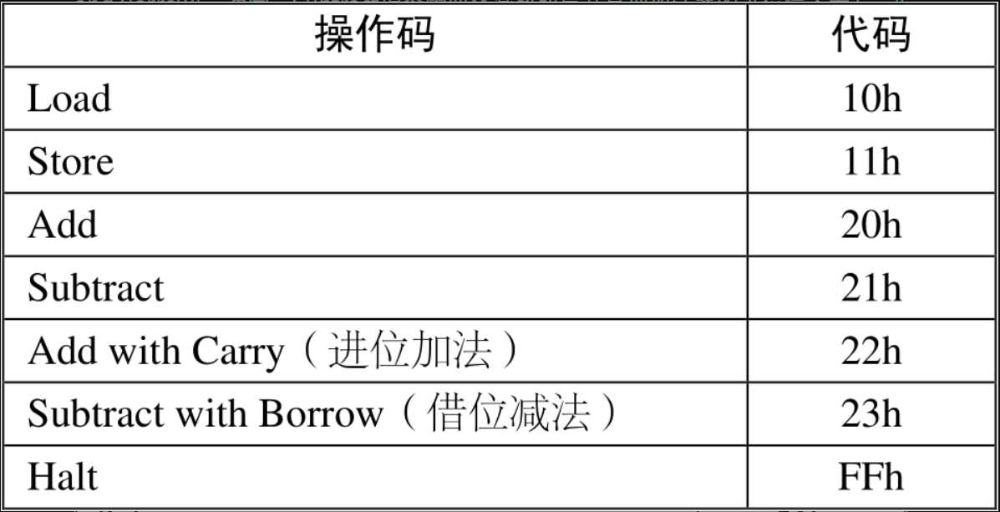

在执行减法或借位减法运算时，送入加法器中的操作数需要进行取反预处理。加法器的进位输出是进位锁存器的数据输入。无论何时，执行加法、减法、进位加法或借位减法中的任一种运算，进位锁存器都是同步的。当执行减法运算，或进位锁存器的数据输入为1且正在执行进位加法或者借位减法运算时，8位加法器的进位输入都是置1的。

需要记住的是，只有当前一次的加法或者进位加法操作使加法器产生进位输出时，Add with Carry指令才会使8位加法器的进位输入置1。因此，只要进行多字节数加法运算，不管实际是否需要，都应该使用Add with Carry指令。为了保证编码的正确，使前面提到16位加法正常进行，可用如下方法。

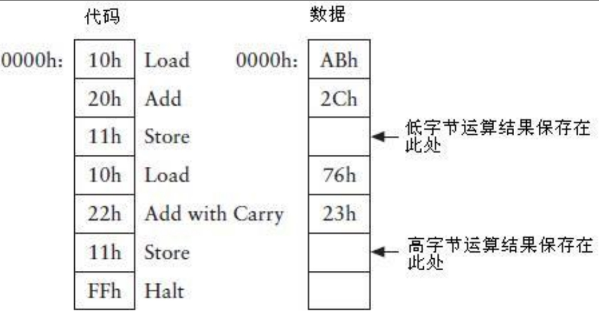

不论操作数是什么，该方法都可以正确执行。

增加了两个新的操作码之后，我们已经极大地扩展了加法器的功能，它不再局限于8位数的加法运算。通过执行进位加法操作，可以对16位数、24位数、32位数、40位数，甚至更多位的数进行加法运算。假如要进行两个32位数7A892BCDh和65A872FFh的加法运算，我们仅需要1条Add指令和3条Add with Carry指令，如下图所示。


当然，把这些数依次输入存储器并不是最好的做法。因为你不但要使用开关来输入这些数，而且保存这些数的存储单元的地址也不是连续的。例如，7A892BCDh从最低字节开始，每个字节依次保存在0000h, 0003h, 0006h, 0009h中。而为了得到最后的结果，还需要检查0002h, 0005h, 0008h, 000Bh这几个地址中的数。

除此之外，当前设计的自动加法器不允许在随后的计算中重复使用前面的计算结果。假设我们要对三个8位数求和，然后再从中减去一个8位数并保存结果。这可能需要一条Load指令，两条Add指令，一条Subtract指令以及一条Store指令。但如果想从原来的求和结果（3个8位数的和）中减去另一个数该怎么做呢？这个求和结果已经不能被访问了，每次我们使用它的时候都必须重新计算。

产生上述情况的原因就在于我们构造的自动加法器具有如下的特性：它的代码存储器和数据存储器是同步的、顺序的，并且都从0000h开始寻址。代码存储器中的每一条指令对应数据存储器中相同地址的存储单元。一旦执行了一条Store指令，相应的，就会有一个数被保存到数据存储器中，而这个数将不能重新加载到累加器。

要解决这个难题，需要对自动加法器的设计做一个根本性的且程度极大的修改。这个想法实现起来似乎非常困难，但是很快你就会发现（我希望是这样）改进后的加法器具有更高的灵活性。

现在让我们立刻开始吧，目前已经有了7个操作码，如下所示。


每一个操作码在存储器中占1个字节。现在除了Halt操作码外，我希望每一个指令在存储器中仅占据3个字节的空间，其中第一个字节为代码本身，另外的两个字节用来存放1个16位存储器单元地址。对于Load指令来说，后两个字节保存的地址用来指明数据RAM阵列的一个存储单元，该单元存放的是需要被加载到累加器中的字节。对于Add,Subtract, Add with Carry, Subtract with Borrow指令来说，该地址指明的存储单元所保存的是要从累加器中加上或减去的字节。对于Store指令来说，该地址指明的是累加器中的内容将要保存到的存储单元地址。

例如，当前加法器所能进行的最简单的运算就是对两个数求和。为了执行这个操作，需要按下面的方式设置代码RAM阵列和数据RAM阵列。

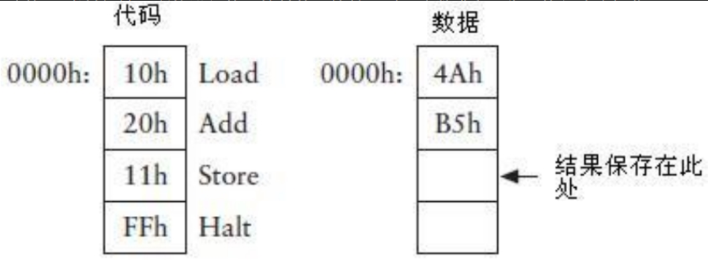

在改进的自动加法器中，每条指令（除了Halt指令）需要3个字节。

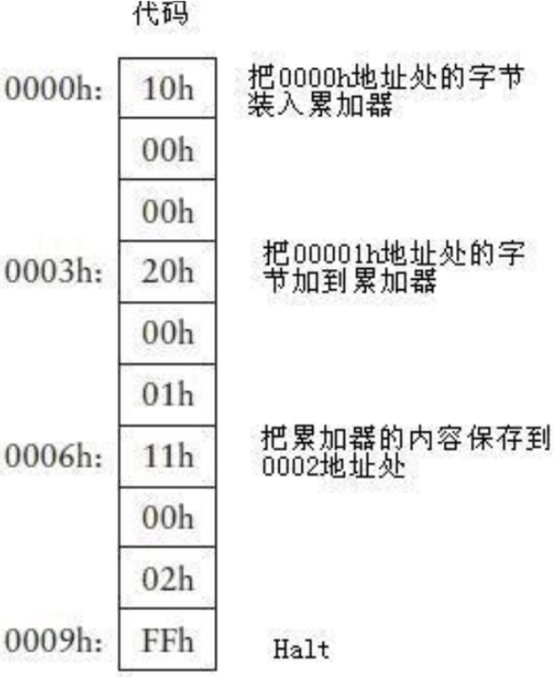

每一条指令的代码（除了Halt指令）后跟两个字节，用来指明数据RAM阵列中16位的存储地址。这三个地址恰巧是0000h, 0001h和0002h，但它们可以是任何其他可用的地址。

前面讲到了如何用Add或Add with Carry指令来对两个16位数—比如76ABh和232Ch求和。必须把两个数的低字节保存到存储器的0000h和0001h地址，把其高字节保存到0003h和0004h地址，运算的结果分别保存在0002h和0005h。

通过这种变化，我们可以用一种更合理的方式来保存这两个操作数及其运算结果，可能会把它们保存到我们从未用到过的存储区域。

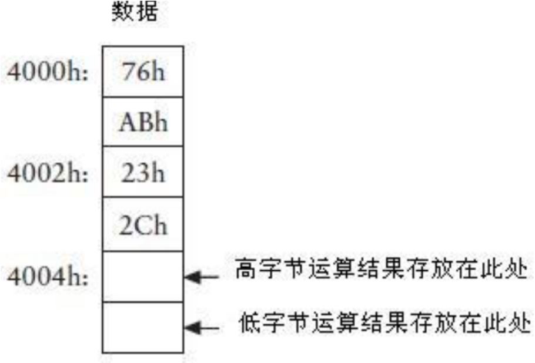

这6个存储单元不必像上图中这样全都连在一起，它们可以分散在整个64 KB数据RAM阵列的任意位置。为了把这些地址中的数相加，代码RAM阵列中的指令必须用以下方式设置。


可以看到，保存在地址4001h和4003h处的两个低字节数先执行加法，其结果保存在4005h地址处。两个高字节数（分别保存在4000h和4002h处）通过Add with Carry指令相加，其结果保存在地址4004h处。如果去掉Halt指令并向代码RAM中加入更多指令，随后的计算可以通过引用地址很方便地使用原来的那些操作数及其结果。

实现该设计的关键是把代码RAM阵列的数据输出到3个8位锁存器中。每个锁存器保存该3字节指令的一个字节。第一个锁存器保存指令代码本身，第二个锁存器保存地址的高字节，第三个锁存器保存地址的低字节。第二个和第三个锁存器的输出构成了数据RAM阵列的16位地址。

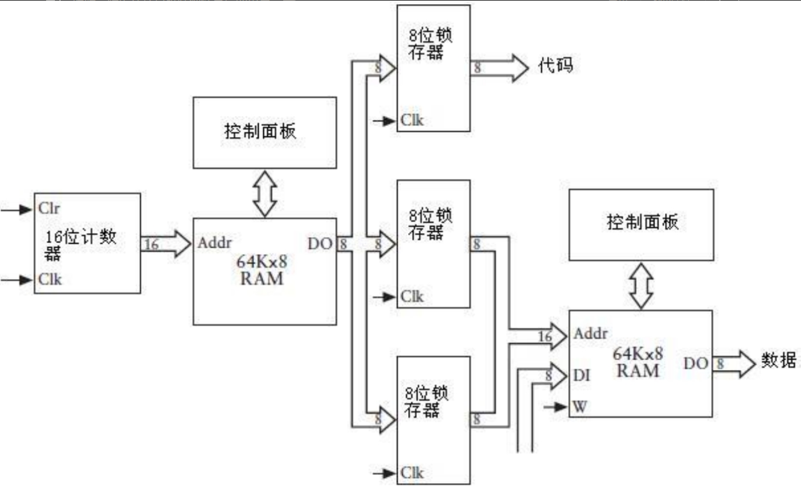

从存储器中取出指令的过程称为取指令(instruction fetch)。在我们设计的加法器中，每一条指令的长度是3个字节。因为每次从存储器取回一个字节，所以取每条指令需要的时间为3个时钟周期。此外，一个完整的指令周期需要4个时钟周期。这些变化必然使得控制信号更加复杂。

机器响应指令码做一系列操作的过程称为执行(execute)指令，但这并不能表明机器是一种有生命的东西，因为它不能自行分析机器代码并决定该做什么。每一种机器码用其唯一的方式触发多种控制信号，从而引发机器执行各种操作。

注意，为了让上面的加法器更加有用，我们牺牲了运算速度。使用同样的振荡器，它的运算速度只有本章提到的第一个加法器的1/4。这验证了一个称为TANSTAAFL的工程准则，它的意思是“天下没有免费的午餐”。通常上帝总是很公平的，你改进了机器的某个方面，则其他方面就会受到损失，有得就有失。

如果不使用继电器构造这个电路的话，很显然，两个64 KB的RAM阵列构成了电路中最主要的部分。事实上早就应该放弃这些部件了，甚至从一开始就应该决定只需要一个1KB的存储器。如果能确定所有的数据都可以存放在0000h～03FFh的地址空间中，那么使用一个小于64 KB的存储器加法器也可以很好地工作。

但是你现在仍然可能不在意使用了2个RAM阵列。事实上，确实不必要在意。前面介绍了两种RAM阵列，一个用来存放指令码，另一个用来存放操作数据—这种设计使得自动加法器的结构非常清晰和易于使用。但现在我们使用3字节长的指令格式，第二个和第三个字节用来指明操作数的存储地址，因此就没有必要再使用两个独立的RAM阵列。操作码和操作数可以存放在同一个RAM阵列。

为了实现这个设计，我们需要一个2-1选择器来确定如何对RAM阵列寻址。通常，和前面的方式相同，我们用一个16位的计数器来计算地址。数据RAM阵列的输出仍然连接到3个锁存器，分别用来保存指令代码及其对应操作数的16位地址，其16位的地址输出是2-1选择器的第二种输入。地址被锁存后，可以通过选择器将其作为RAM阵列的地址输入。

# 18. 从算盘到芯片

自古以来，人们为了尽量简化数学计算，绞尽脑汁发明了很多精巧的工具和机器。虽然人类的计数能力与生俱来，但需要帮助是在所难免的。每个人都是各有所长、各有所短，所以经常会遇到一些自身无法解决的问题。

在人类社会早期，人们借助数字这种工具来帮助自己记录物品和财产。包括古希腊以及美洲土著在内的很多文化中，人们借助小卵石或者谷粒进行计数。在欧洲，这些古老的计数方式演变成了计数板，而在中东，则演变成为我们较为熟悉的由骨架和算珠组成的算盘(abacus)，算盘的样子就像下面这幅图所示。


尽管人们通常将算盘与亚洲文化，尤其是中国文化联系到一起，但它似乎是在公元1200年左右由商人带到中国的。

很多人不喜欢做乘法和除法，但仍然有一小部分人对此进行了一些研究。苏格兰数学家约翰·纳皮尔(John Napier, 1550—1617)就是这小部分人中的一员，为了简化某些操作，他发明了对数。例如两个数乘积就可以简单地表示为其对数之和。因此，如果要得到两个数的乘积，可以采取以下步骤：首先在对数表中查出这两个数的值，然后将其值相加，最后在对数表中逆向搜寻出其乘积。

在随后的400年时间里，一些最伟大的思想家一直致力于建立对数表这项工作，与此同时，另外一些人则设计出一些小装置期望代替对数表。其中，一种带对数刻度的滑尺久负盛名，它由埃德蒙·甘特(Edmund Gunter, 1581—1626)发明，而威廉·奥特雷德(William Oughtred, 1574—1660)对其进行了改进。1976年当克鲁夫&艾萨(Keuffel &Esser)公司将其制造的最后一个滑尺赠送给华盛顿史密斯索尼亚(Smithsonian)学院时，滑尺也就宣布退出了历史舞台，导致其退出的原因是手持计算器的出现。

纳皮尔发明了另外一种由刻在骨头、牛角、象牙上的数字条组成的乘法辅助器，称为纳皮尔骨架(Napier's Bones)。在1620年左右，威廉·斯奇卡(Wilhelm Schickard, 1592—1635)制造出了最早的机械计算器，它类似于已经初步具备了自动功能的纳皮尔骨架。由相互连接的车轮、齿轮以及水平仪组成的一种计算器几乎在同一时期出现，身为数学家以及哲学家的布莱兹·帕斯卡(Blaise Pascal, 1623—1662)和哥特福瑞德·武赫勒姆·范·莱布尼兹(Gottfried Wilhelm von Leibniz, 1646—1716)是这种机械计算器的两个最主要的发明者。

你一定对8位加法器以及能对多于8位的数进行运算的加法器中的进位过程记忆犹新，因为这实在是太烦琐了。起初，进位仅被看做是加法运算中的“一碟小菜”，但它却成了加法器的核心问题。换句话讲，尽管我们设计了一个除了进位功能以外其他功能都俱全的加法器，这样的器件离“大功告成”还是很远！

评价老式计算器的一个关键是其进位处理能否成功，例如帕斯卡的设计，他的进位机制禁止进行减法运算，在进行减法运算时，采用的是加上9的补数的方式（在第13章中介绍过）。直到19世纪后半叶，真正意义上的机械计算器才得以出现并为人们所使用。

约瑟夫·玛丽·杰奎德(Joseph Marie Jacquard, 1752—1834)发明的一种奇妙的自动织布机对计算的历史产生了深远的影响，其程度甚至不亚于其在纺织行业产生的影响。杰奎德织布机（大约于1801年出现）使用打孔的金属卡片（很像钢琴上面的金属卡片）控制织物上的图案。杰奎德使用了大约1万张卡片完成了一幅杰作，那就是用黑白线织成的自画像。

在18世纪（直到20世纪40年代），计算机就好比一个以计算维持生计的人，而计算能力就好比计算机的生命线。在这个用天上星辰进行航海导航的时期，经常要用到对数表，而三角函数表对航海导航也非常重要。此外，如果你想要发表新数学表，就需要使用许多台计算机，让它们一起工作，最后将所有的结果汇总成一张表。当然，从初始计算到设置打印最终结果，每一个阶段都可能会出现意想不到的错误。


为了消除数学表中错误，英国数学家和经济学家查尔斯·巴贝芝（Charles Babbage,1791—1871，见右图）勤奋工作，他和塞缪尔·莫尔斯(Samuel Morse)差不多是同时代的人。

在那个时期，数学表（例如对数表）并没有计算表中每一项的确切对数值，因为那样做将耗费太多时间。取而代之的方法是选择性的对数计算，即选取一些数字进行对数计算，而对于介于这些数字之间的数的对数则采用插补法进行填充，即差分法(differences)，通过相对简单的计算求得结果。

大约在1820年，巴贝芝认为他可以设计制造一台可以自动建表，甚至可以自动设置打印类型的机器，这种机器可以完全消除上述错误。因此他设想出了差分机(Difference Engine)，从本质上讲差分机是一个大型机械加法器。在差分机中，多位的十进制数通过可以啮合在10个不同位置的轮子表示，而负数用10的补数来表示。尽管早期一些模型表明巴贝芝的设计是完全可行的，而且他也获得了英国政府的一些资金支持（当然不是很多），但差分机却从来没有完成过，在1833年，巴贝芝放弃了这项工作。

可正在那个时候，巴贝芝有了一个更好的想法，那就是解析机(Analytical Engine)，他的后半生一直都在不断重复地设计与修改（其间还制作过几个小模型以及部分构件）这个机器，直到其生命的尽头。解析机是19世纪最接近于计算机的器件，在巴贝芝的设计中，解析机包含一个存储部件（类似于现在存储器的概念）和一个运算部件（类似于算术逻辑单元）。乘法可以通过重复的加法运算求解，同样的，除法可以通过重复的减法求解。

解析机最令人着迷的地方在于，可以使用改造的杰奎德织布机中的卡片来编程。正如奥古斯塔·艾达·拜伦(Augusta Ada Byron, 1815—1852)，即拉弗雷斯女伯爵对解析机的评价（这句话出于她翻译的一篇由意大利数学家撰写的关于巴贝芝解析机的文章）：“我们可以肯定地说，正如杰奎德提花织布机织出了花瓣和树叶，解析机编织出了代数的结构模型。”

巴贝芝大概是第一个意识到条件跳转在计算机中重要性的人，关于这个问题，奥古斯塔·艾达曾写下这样一段话“操作循环(cycle)，应该这样去理解：

它意味着某个操作集(set of operations)重复执行的次数不止一次。它的次数可以是仅仅两次或者是无限次，但它们实际上都是组成操作集的操作被重复执行了。在很多实例的分析中，我们经常会看到由一个或多个循环构成的重复组群(recurring group)，也就是循环中包含的一个循环或者多个循环。”

尽管在1853年差分机最终由一对父子—乔治(George)和爱德华·舒尔茨(Edvard Scheutz)制造出来，但已经被人们遗忘了好多年的巴贝芝设计的差分机，直到20世纪30年代才因为人们开始探索20世纪计算机的起源时而重新被提起。那时，巴贝芝所做的一些工作已经都被后来的技术超越，除了超前的自动化观念，他所做的工作对20世纪计算机工程来说几乎没有可以利用的。

计算史上另一个转折点源于美利坚合众国宪法第一条第二款。这一款其中要求每10年进行一次人口普查。1880年的人口普查要求登记居民的年龄、性别以及国籍信息，每一次人口普查的数据采集工作都要花费大约7年的时间。

人口普查局的官员们担心1890年的人口普查的数据采集和处理可能会花费10年以上的时间，因此他们研究了在工作中使用自动系统的可能性，并选择了由赫尔曼·霍尔瑞斯(Herman Hollerith, 1860—1929)开发的机器，他曾在1880年人口普查中进行过相关工作。


霍尔瑞斯的设计需要使用大小为[插图]寸马尼拉(manila)穿孔卡片（尽管霍尔瑞斯不了解巴贝芝是怎样在解析机中利用卡片编制程序的，但他对杰奎德织布机中如何使用卡片却非常熟悉）。卡片上的孔按24列每列12个位置排列，共计288个位置。这些点代表了在人口普查中需要记录的一个人的特征，人口普查工作人员通过在卡片适当的位置上打1/4英寸的方孔来标记上述的特征。

在读本书时你可能会习惯性地想到二进制编码，而且你或许立刻会猜想，可以利用卡片上的288个穿孔来存储288位的信息，但是卡片的使用方式并非如此。

举例来说，在纯二进制系统中使用的人口普查卡片上应该有一个位置代表性别，在该位置穿孔则代表男性，不穿孔则代表女性（或与此相反）。但是在霍尔瑞斯设计的卡片中使用了两个位置代表性别，其中第一位置穿孔代表男性，另外一个位置穿孔代表女性。同样的，人口普查工作者通过两个穿孔来标识普查对象的年龄，第一个穿孔指定一个以5年为间隔的范围：如0～4, 5～9, 10～14，等等。第二个穿孔则表示对象处于该年龄段（5年）中的哪一年，即可推算出对象的准确年龄。对年龄进行编码共计需要28个打孔位置，而在纯二进制系统中只需要7个位置就可以对0～127的所有年龄进行编码。

霍尔瑞斯在记录人口普查信息时没有中使用二进制系统是可以理解的：对于1890年人口普查工作者来说，将年龄转换为二进制数字，这个要求太高了。穿孔卡片系统不能是完全的二进制系统，这里还有一个实际的原因，真正的二进制系统可以产生（几乎）所有孔都被打穿的情况，这将使得卡片极易碎裂，而且看上去也不美观。

可以对人口普查的数据做统计分析或将其制作成表格(tabulated)。比如，你希望了解每一个人口普查行政区中居住着多少人，当然，人口的年龄段的分布也是一个比较令人感兴趣的信息。为了达到这些目的，霍尔瑞斯制造了制表机，它是组合了人工操作以及自动功能的半自动化工具。操作人员把一个有288个弹簧针的板子压到每一个卡片上，每一根弹簧针对应于卡片上的一个穿孔位置，当弹簧针与水银池中的水银接触时，形成通路，这个电路触发电磁体即可进行十进制计数。

霍尔瑞斯在卡片分类机上也使用了电磁体。例如，如果需要收集所统记的每一种职业中人员的年龄分布信息，首先需要将卡片按照职业进行分类，然后分别对每种职业中人员的年龄信息进行统计。分类机使用和制表机中一样的手压方式，不同之处在于分类机使用的电磁体可以将26个间隔区域中任意一个的舱口打开。操作者把对应的卡片通过舱口放入间隔区域，之后再手动关闭舱口。

在1890年人口普查中使用这种自动化技术的实验取得了令人瞩目的成就，在这个实验中总共加工处理了超过6200万张卡片，数据量是1880年人口普查的两倍，但时间却只用了后者的三分之一，自此，霍尔瑞斯和他的发明闻名四海。1895年，他还到访了莫斯科，俄国人欣喜地购买了他的设备，并于1897年将其首次应用在俄国人口普查中。

赫尔曼·霍尔瑞斯此后一发不可收拾。1896年，他创办制表机公司(Tabulating Machine Company)，租借并出售其穿孔卡片设备。到1911年，由于公司的合并，制表机公司更名为计算制表记录公司(Computing-Tabulating-Recording Company)，或者叫做C-T-R公司。再到1915年，托马斯J·华盛顿(Thomas J.Watson, 1874—1956)成为C-T-R公司的总裁，他在1924年将公司的名字更改为国际商业机器公司(International Business Machines Corporation)，即IBM。

到1928年，在1890年人口普查中最初使用的卡片逐渐演变为著名的IBM卡片，“do not spindle, fold, or mutilate”，这种卡片有80列12行，使用了将近50年，甚至在其后期，还有人把它们叫做霍尔瑞斯卡片。关于这些卡片的遗留问题将在第20、21和24章中进一步的讲述。

进入到20世纪之前，让我们重新审视一下19世纪这一百年。因为主题所限，本书更多的关注的是数字性质的发明，其中包括电报、盲人用点字法、巴贝芝机器，以及霍尔瑞斯卡片。而在与数字概念以及相关设备打交道时，你会发现整个世界皆为数字。但是，19世纪的发现和发明确切的来讲不是数字的。实际上，通过感官所认识的大自然中只有很少一部分是数字的，更多的时候表现为不可分割的整体。

尽管霍尔瑞斯在他的制表机以及分类机中使用了继电器(relays)，但是人们直到20世纪30年代中期才开始用继电器来构建计算机—它们最终被叫做机电化(electromechanical)计算机。在这些机器中使用的继电器不同于一般的电报继电器，后者的主要作用是为了完善电话系统的路由控制。

早期的继电式计算机与上一章中的继电式计算机不是同一个概念（我们随后会学到，从20世纪70年代开始，这种继电式计算机依靠微处理器进行计算）。需要特别说明的一点，尽管现代计算机内部使用二进制数，但早期的继电式计算机并非如此。

我们的继电式计算机与早期的继电式计算机存在另外一个不同点，那就是在20世纪30年代，没有人能够疯狂到用继电器制造出524,288位的存储器！资金的花费、空间的占用和能源的耗费使得制造如此大的存储器变得不大可能。可得到的极少存储器也只用来存储中间结果，而程序本身则存储在一些物理媒介上面，例如带穿孔的纸带。实际上，将代码和程序放入到存储器进行处理是后来发明的做法。

下面按时间顺序进行介绍，第一台继电式计算机由康拉德·楚泽(Conrad Zuse, 1910—1995)制造，1935年还是工科学生的他在其父母位于柏林的家中制造了这台机器。这台机器中使用了二进制数，但其早期的版本中使用的是机械存储器而非继电器。楚泽使用老式35毫米电影胶片进行穿孔，然后在上面编制程序。

1937年，贝尔电话实验室(Bell Telephone Laboratories)的乔治·史提必兹(George Stibitz, 1904—1995)将一对电话继电器带回了家中，并在他厨房的桌子上连接了一个1位加法器，后来他妻子将其称之为K机器（K是厨房“kitchen”的头一个字母），这个实验促使1939年贝尔实验室中复数计算机的诞生。

同一时期，哈佛大学研究生霍华德·艾肯(Howard Aiken, 1900—1973)要寻找做大量的重复计算的方法，而正是他的这一需求促使哈佛大学与IBM合作，并最终在1943年创造出一台自动连续可控计算机(Automated Sequence Controlled Calculator, ASCC)，也就是闻名于世的Harvard Mark I。这是第一台可以打印表格的数字计算机，它最终将查尔斯·巴贝芝的梦想付诸于现实。Mark II是最大的继电式计算机，使用了13,000个继电器。哈佛大学计算机实验室当时的主任是艾肯，也正是他讲授了计算机科学的第一次课。

对于构造计算机来说，继电器不是最完美的设备，因为它们是机械性的，利用金属片的弯曲和伸直状态进行工作，而频繁的工作可能导致其断裂，另外如果接触点之间有污垢或者卡住纸屑，也会导致继电器失效。1947年发生了一件著名的事故，人们从Mark II计算机的一个继电器中发现了一只飞蛾。格蕾丝·莫瑞·赫柏(Grace Murray Hopper,1906—1992)于1944加入了艾肯的团队，日后成为了计算机编程语言领域非常著名的人物。他将上面提到的那只飞蛾用带子绑在计算机日志(logbook)上，并在其边上注明“第一个被发现的有生命的bug”。

真空管(vacuum tube)是一种可以替代继电器的元件，它是由约翰·安布罗斯·弗莱明(John Ambrose Fleming, 1849—1945)和李·德·福雷斯特(Lee de Forest, 1873—1961)在进行无线电通信连接研究时开发出来的。到20世纪40年代，真空管已经被广泛应用于放大电话信号，实际上，那时几乎每一个家庭都拥有一台带有发光二极管可控收音机，它们能放大无线信号，并且把它们变成还原为人们能听见的声音。真空管同样可以通过连接成与门、或门、与非门，以及与或门—这一点很像继电器。

究竟是由继电器还是由真空管组成这些逻辑门并不重要，重要的是这些逻辑门可以被装配组合成加法器、选择器、解码器、触发器，以及计数器。不论真空管何时取代继电器，前面章节中讲述的关于基于继电器部件的一切同样是有效的。

真空管同样存在自身的问题，比如，价格昂贵、耗电量大，以及产生的热量太多。可是，其最大的问题是真空管最终会被烧坏，如同人活一世一样，是无法改变的事实。那时，拥有真空管收音机的人们习惯于定期更换真空管，而电话系统设计时有很多冗余的真空管，所以一个真空管的报废有时并不是什么大事（不管怎样，人们不会期待电话系统是完美无瑕的）。可是在计算机中，当一个真空管烧坏时并不可能立刻被检测到，此外，一台计算机拥有数量巨大的真空管，按统计学来分析，每隔几分钟就会烧坏一个。

用真空管取代继电器的最大好处在于真空管的状态可以在百万分之一秒(μs)内发生转变。真空管状态转变（开关的打开与关闭）的速度比继电器要快1000倍，继电器在其最好状态下状态的转变也需要1ms，即千分之一秒。十分有趣的是在计算机的早期发展中，计算速度并不是主要考虑的问题，而这个时期的计算速度与从纸张或者电影胶片中读取程序的速度有关。由于当时的计算机都按照这种方式构建，因此采用真空管比继电器到底计算速度提升了多少，并不重要。

但是在20世纪40年代初期，新设计的计算机中真空管开始取代继电器。到1945年，真空管已经完全取代了继电器。虽然继电器计算机被称为电动机械计算机，但真空管是第一台电子计算机的基础。

在英国，巨像(Colossus)计算机（1943年首次投入使用）用来破译德国名为“Enigma”代码生成器产生的代码，艾伦·M·图灵(Alan M.Turing, 1912—1954)为这个项目（以及英国后来几个的计算机项目）做出了巨大贡献，图灵撰写了两篇非常有影响的论文，这使他如今成为计算机领域的鼎鼎大名的人物。第一篇论文发表于1937年，首次提出了“可计算性”(computability)这个概念，用来分析哪些事情计算机可以做到，哪些做不到。他为计算机构想了一个抽象模型，这就是现在为人所熟知的图灵机(Turing Machine)。图灵第二篇非常有名的论文是关于人工智能的，在这篇论文中他介绍了一种测试机器智能的方法，即现在为人熟知的图灵测试法(Turing Test)。

在摩尔电子工程学院（宾夕法尼亚大学），J·普利斯普·埃克特(J.Presper Eckert,1919—1995)和约翰·莫克利(John Mauchly, 1907—1980)设计了ENIAC（Electronic Numerical Integrator and Computer，电子数字积分计算机），使用了18,000个真空管并最终在1945年底完成。按全部吨位算（大约30吨），ENIAC是曾经（或许以后也是）制造出来的最大的计算机。到1977年，人们可以在Radio Shack买到速度更快的计算机。埃克特和莫克利想为计算机申请专利，可是却被竞争者约翰·V·安塔纳索夫(John V.Atanasoff, 1903—1995)阻扰了，他更早一步设计了一台电子计算机，但它运行得并不顺畅。

ENIAC吸引了数学家约翰·冯·诺依曼(John von Neumann, 1903—1957)的眼球。从1930年开始，出生在匈牙利的冯·诺依曼就定居美国。作为一名令公众瞩目的人物，因其仅凭自己的大脑就能进行复杂的数学计算而闻名，冯·诺依曼当时是普林斯顿高级研究院的一名数学教授，研究范围很广，从量子力学到游戏应用，甚至到经济理论。


约翰·冯·诺依曼协助设计的ENIAC的后续产品EDVAC(Electronic Discrete Variable Automatic Computer)。特别是在1946年与亚瑟·W·伯克斯(Arthur W.Burks)和荷曼·哥斯廷(Herman H.Goldstine)共同执笔的题为“电子计算器件逻辑设计的初步分析及讨论(Preliminary Discussion of the Logical Design of an Electronic Computing Instrument)”的论文中，他描述了几个EDVAC比ENIAC更加先进的特点。EDVAC的设计者们感觉到计算机内部中应当使用二进制数，而ENIAC使用的是十进制数。同时他们认为计算机中应当拥有尽可能大容量的存储器，这些存储器应该用来存储程序代码和程序执行中产生的数据（再说明一下，这些在ENIAC中都是不能实现的，对于ENIAC来说，编程不过是扳动开关和插拔电线的事情）。这些指令在存储器中是顺序存放的，而且可以由程序计数器进行寻址，但允许条件跳转。这就是著名的“存储程序概念”(stored-program concept)。

这些设计上的决策是计算机历史中非常重要的一个进化阶段，现在我们称之为“冯·诺依曼结构”。上一章中设计的计算机就是一个经典冯·诺依曼计算机。但是伴随着冯·诺依曼结构，又出现冯·诺依曼瓶颈(von Neumann bottleneck)。在冯·诺依曼计算机中，为了执行指令通常需要花费大量的时间先将这些指令从存储器中取出来。我们仔细回忆一下，第17章中最后设计的计算机需要花费3/4的时间用来取指令。

在EDVAC的那个时期，考虑到成本效益，用真空管制造大容量存储器是不可行的，因此那时提出了一些临时的替代方案。其中一个成功的方案是“水银延迟线路存储器”(mercury delay line memory)，它使用5英尺水银真空管，在管子的一端每隔1μs向水银发送一个短脉冲，这些短脉冲大约需要1ms到达管子的另一端（可以如同检测声波一样检测到这些短脉冲，并折回开始端），因此一个水银管可以存储大约1024位的信息。

直到20世纪50年代中期人们才开发出了“磁芯存储器”(magnetic core memory)。众多的被磁化的小金属环由电线串起来组成了磁芯存储器。每一个小金属环可以存储1位信息。磁芯存储器沿用了很长一段时间才被别的技术取代，所以常常会听见老一辈程序员们把存储器的访问过程叫做“访问磁芯”。

20世纪40年代，对计算机本质进行概念化设想的并非只有约翰·冯·诺依曼一人。

克劳德·香农（Claude Shannon，生于1916年）是另外一个非常有影响力的思想家。在第11章中讨论了他1938年的硕士论文，正是这篇文章确定了开关、继电器以及布尔代数之间的关系。在1948年为贝尔电话实验室工作期间，香农在Bell System Technical Journal上发表了一片题为“通信过程中的代数理论”(A Mathematical Theory of Communication)的文章，在这篇文章中他不仅将“位”的概念介绍给了世界，更开创了一个新的研究领域，即著名的“信息论”(information theory)。信息论研究的是数字信息在有噪声（这些噪声通常阻止信息的通过）的情况下传输，以及如何弥补因噪声产生的损失。1949年，他撰写了第一篇关于如何编程可以让计算机下棋的文章，1952年他设计了一个通过继电器控制的机械鼠，它可以在一个迷宫中记住路径。骑单车、变戏法这些耍宝也使得香农在贝尔实验室声名鹊起。

诺博尔特·韦纳(Norbert Wiener, 1894—1964)从哈佛大学获得数学博士学位时只有18岁，其撰写的Cybernetics, or Control and Communication in the Animal and Machine（1948年）一书使他闻名于世。他使用新创词汇“控制论”（cybernetics：源于希腊语舵手）表示人类和动物的生物过程同计算机和机器人的机械原理之间的关系。大众文化中，人们普遍使用cyber作为前缀表示与计算机相关的一切，最著名的一个词，数百万台计算机通过因特网相连被称做“cyberspace”（网络空间），这个词源于计算机科幻小说作家威廉·吉布森(William Gibson)在1984年发表的小说Neuromancer中“cyberpunk”一词。

1948年，埃克特与莫奇利(Eckert-Mauchly)计算机公司（后来成为雷明顿兰德公司一部分）开始开发第一台商用计算机—通用自动计算机，或者称为UNIVAC。这台机器于1951年完成，此后就被送到了人口普查局。UNIVAC在网络应用方面的首次亮相在哥伦比亚广播公司，它被用来预测1952年的总统选举结果。沃尔特·克朗凯特(Walter Cronkite)将UNIVAC称做“electronic brain”（电脑）。同样是在1952年，IBM发布了其第一个商用计算机系统，代号701。