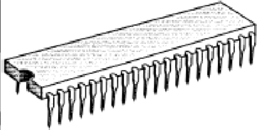
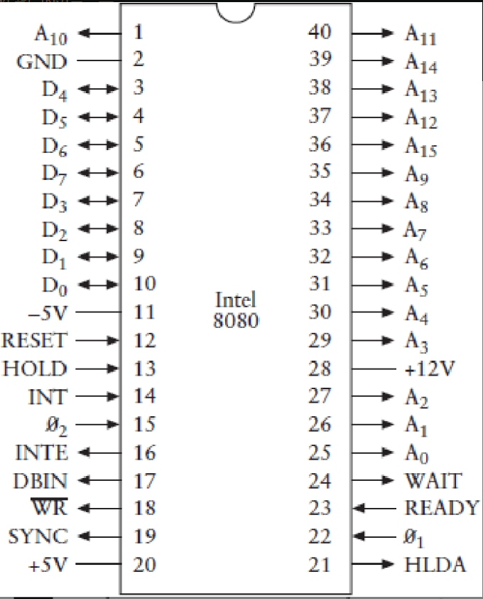
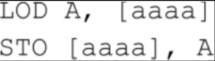
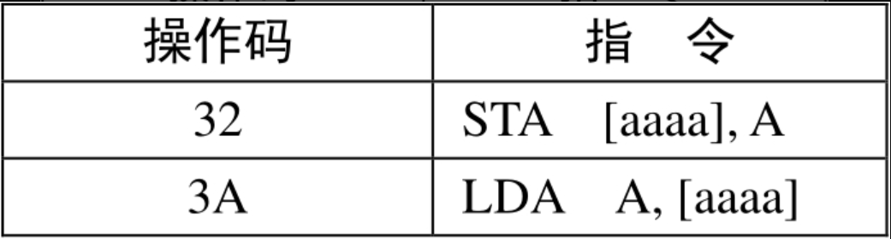

# 19. 两种典型的微处理器

微处理器—正是它，将计算机中央处理器的所有构成组件整合在一起，集成在一个硅芯片上—诞生于1971年。它的诞生有着很好的开端：第一个微处理器，即Intel 4004系列，包括了2300个晶体管。到现在，大约三十年过去了，家用计算机的微处理器中的晶体管数量也逐步逼近10,000,000个。

从本质上说，微处理器实际上所做的工作一直没有变。在现在的芯片上，新增的几百万个晶体管所做的很多事情令我们眼前一亮，但我们正处于微处理器探索的初期，过多的关心这些当代的芯片并不合适，因为它们只会分散我们的注意力而无法帮助我们去学习与理解它。为了更清晰地认识微处理器是如何工作的，让我们首先来看一下最原始的微处理器。

我们要讨论的微处理器出现于1974年。在这一年，英特尔公司在4月推出了8080处理器，摩托罗拉公司—从20世纪50年代生产半导体和晶体管—在8月推出了6800处理器。不仅如此，当年还有其他的一些微处理器面世。同年，德克萨斯仪器设备公司(Texas Instruments)推出了4位的处理器TMS 1000，它用于多种计算器、玩具和设备；国家半导体公司(National Semiconductor)推出了PACE—首个16位微处理器。但当我们回顾历史的时候就会发现，8080和6800是两个最具有重大历史意义的芯片。

英特尔为8080最初定的价格为360美元，这个价格对IBM的System/360来说是极大的讽刺。System/360是大型机处理系统，用户大都是一些大公司，售价动辄几百万美元（今天，你用1.95美元就可以买到一块8080芯片）。这并不是说8080可以与System/360相提并论，但在几年之内，IBM自己也关注起这些非常小的计算机。

8080是一个8位的微处理器，它包括6000个晶体管，运行的时钟频率为2 MHz，寻址空间为64 KB。摩托罗拉的6800（今天的售价也是1.95美元）包括4000个晶体管，其寻址空间也是64 KB。第一个版本的6800的运行速度为1 MHz，但摩托罗拉于1977年推出了运行速度分别为1.5 MHz和2 MHz的版本。

这些芯片被称为“单芯片微处理器”(single-chip microprocessors)，不太准确的说法是“单芯片的计算机”。处理器只是计算机的一部分。除了处理器之外，计算机还需要其他一些设备，至少要包括一些随机访问的存储器(RAM)，一些方便用户把信息输入计算机的设备（输入设备），一些使用户能够把信息从计算机中读取出来的设备（输出设备），以及其他一些能把所有构件连接在一块的芯片。本书会在第21章详细介绍这些构件。

现在，让我们来仔细研究一下微处理器本身。当描述微处理器的时候，我们总是习惯用一些框图来阐明其内部的构件及其连接情况。然而，在第17章我们已经使用了数不清的框图来描述它，现在我们将观察微处理器和外部设备的交互过程，以此来认识其内部的结构和工作原理。换句话说，为了弄清微处理器的工作原理，我们把它视做一个不需要详细研究其内部操作的黑盒。取而代之的方法是通过观测芯片的输入、输出信号，特别是芯片的指令集来理解微处理器的工作原理。

8080和6800都是40个管脚的集成电路。这些芯片最常见的IC封装大约为2英寸长，1/2英寸宽，1/8英寸厚。

当然，你所看到的只是外部的封装。其内部的硅晶片是非常小的，例如在早期的8位微处理器中，硅晶片还不到1/4平方英寸。外包装可以保护内部的硅晶片，并且通过管脚提供了处理器的输入和输出访问接入点。下面给出了8080的40个管脚的功能说明图。

本书中我们所创建的所有电气或电子设备都需要某种电源来供电。8080的一个特殊的地方就是它需要三种电源电压：管脚20必须接到5V的电压；管脚11需要接到-5V的电压；管脚28需接12V的电压；管脚2接地。（英特尔在1976年发布了8085芯片，目的就是简化对这些电源的要求）

其他的管脚都标有箭头。从芯片引出的箭头表明这是一个输出(output)信号，这种信号由微处理器控制，计算机的其他芯片对该信号响应。指向芯片的箭头表明该信号是一个输入(input)信号，该信号由其他芯片发出，并由8080芯片对其响应。还一些管脚既是输入又是输出。

第17章所设计的处理器需要一个振荡器来使其工作。8080需要两个不同的同步时钟输入，它们的频率都是2 MHz，分别标记为$$\phi_1$$和$$\phi_2$$，位于管脚22和15上。这些信号可以很方便地由英特尔生产的8224时钟信号发生器产生。为8224连接一个18 MHz的石英晶体后，它基本上就可以完成其余工作了。

一个微处理器通常有多个用来寻址存储器的输出信号。用于寻址的输出信号的数目与微处理器的可寻址空间大小直接相关。8080有16个用于寻址的输出信号，标记为$$A_0～A_{15}$$，因此它的可寻址空间大小为$2^{16}$，即65,536字节。

8080是一个8位的微处理器，可以一次从存储器读取或向存储器写入8位数据。该芯片还包括标记为$D_0$～$D_7$的8个信号，这些信号是芯片仅有的几个既可以用做输入又可以用做输出的信号。当微处理器从存储器中读取一个字节时，这些管脚的功能是输入；当微处理器向存储器写入一个字节时，其功能又变成了输出。

芯片的其余10个管脚是控制信号(control signals)。例如，RESET（复位）输入用于控制微处理器的复位。输出信号$\overline{WR}$的功能是指明微处理器需要向RAM中写入数据（$\overline{WR}$信号对应于RAM阵列的写输入）。此外，当芯片读取指令时，在某些时刻一些控制信号会出现在$D_0$～$D_7$管脚处。使用8080芯片构建的计算机系统通常使用8228系统控制芯片来锁存附加的控制信号。本章在后面将会讲述一些控制信号。但8080的控制信号是极其复杂的，因此，除非你准备用该芯片搭建一台计算机，否则最好不要在这些控制信号上过多花费时间。

假设8080微处理器连接了一个64KB的存储器，这样我们就能独立地读写数据而不依赖于微处理器。

8080芯片复位后，它把锁存在存储器0000h地址处的字节读入微处理器，通过在地址信号端$A_0$～$A_{15}$输出16个0实现该过程。它读取的字节必须是8080指令，读取该字节的过程被称为取指令(instruction fetch)。

在第17章设计的计算机中，所有的指令（除了HLT指令）都是3个字节长，包括1字节的操作码和2字节的地址。在8080中，指令的长度可以是1字节、2字节，或者3字节。有些指令使8080从存储器的一个特定地址读取字节到微处理器，有些指令使8080将一个字节从微处理器写入存储器的特定地址；还有些指令使8080在其内部执行而不需要访问RAM。8080执行完第一条指令后，接着从存储器读取第二条指令，并依此类推。这些指令组合在一起构成了计算机程序，可以用来做一些很有趣的事情。

当8080以最高速度2 MHz运行时，每个时钟周期是500ns(1÷2,000,000=0.000000500s)。第17章中的计算机的所有指令都需要4个时钟周期，8080的每条指令需要4～18个时钟周期，这就意味着每条指令的执行时间为2～9μs。

也许了解某个特定微处理器的功能的最好办法就是全面地测试其完整的指令集。

第17章最后完成的计算机仅包括12条指令。一个8位处理器的指令数很容易达到256，每一条指令的操作码就是一个特定的8位数（如果某些指令包含2字节的操作码，其指令集会更大）。8080虽然没有这么多指令，但是其指令数也已经达到了244。这看起来似乎是很多，但从总体上说，其功能并不比第17章的计算机强大。例如，如果想利用8080进行乘法或除法运算，你仍然需要自己写一小段代码。

在第17章曾经讲到过，为了方便地引用指令，我们为处理器的每一条指令的操作码都指派了一个特殊的助记符，而且其中的一些助记符是可以带有参数的。这种助记符只是在我们使用操作码时提供方便，它对于处理器是没有帮助的，处理器只能读取字节，对于助记符组成的文本的含义一无所知（为了讲解清楚，本书选用了Intel 8080说明文档中用到的部分助记符为例来说明）。

第17章设计的计算机的指令集包括两条非常重要的指令，我们称之为加载(Load)和保存(Store)。每条指令占3个字节。在Load指令中，第一个字节是操作码，其后的两个字节是要加载的操作数的16位地址。当处理器执行加载指令时，会把该指定地址中的字节加载到累加器。与之相似，当Store指令被执行时，累加器中的内容被保存到该指令指定的地址中。

我们可以用助记符把上述代码简写为以下形式：

这里的A表示累加器（它既是Load指令的目的操作数也是Store指令的源操作数），aaaa表示16位的存储器地址，通常用4个16进制的数来表示一个地址。

同第17章的累加器一样，8080的8位累加器也记做A。8080也有与第17章的计算机的Load指令和Store指令功能相同的两条指令，它们也称做加载(Load)和保存(Store)。在8080中，加载指令和保存指令的操作码分别是32h和3Ah，每个操作后面也同样跟着一个16位的地址。在8080中，它们的助记符分别是STA（Store Accumulator，表示加载到累加器）和LDA（Load Accumulator，表示保存到累加器）：

