# 14. 反馈与触发器

## 振荡器

将继电器、电池、开关按如下形式连接。

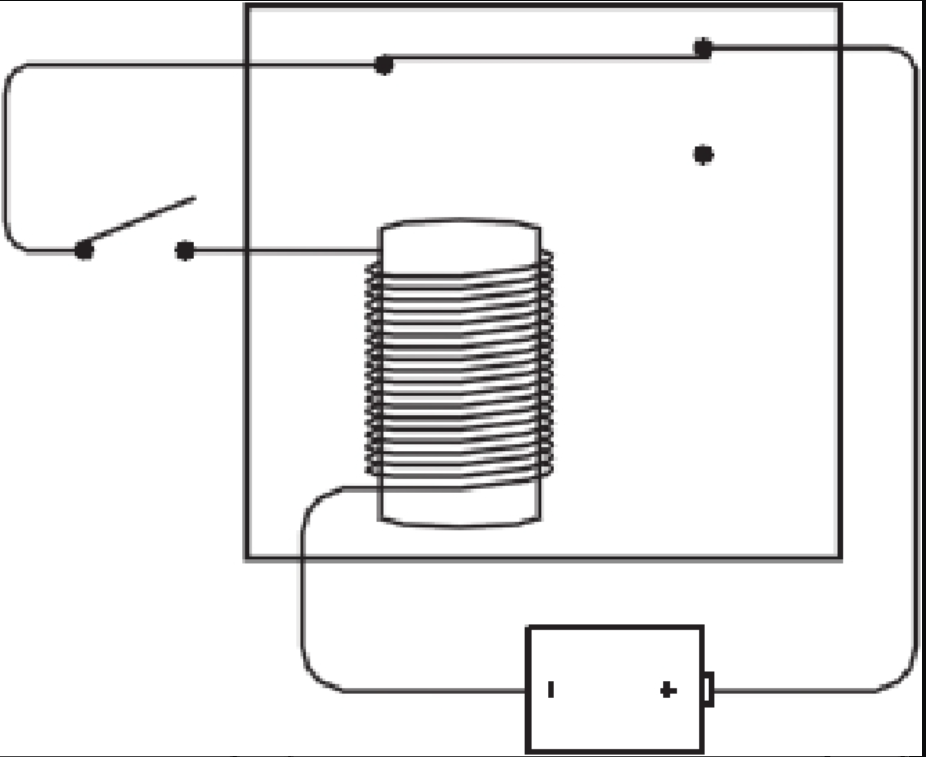

如果你认为这个系统看起来有点古怪，说明你还没有发挥出想象力。或许以前我们没见过采用这种连接方式的继电器，因为我们通常所见过的继电器，其输入和输出是分开的，而这里却构成了一个回路。当开关闭合后，电路就连通了。

连通的电路使得电磁铁把金属簧片拉了下来。

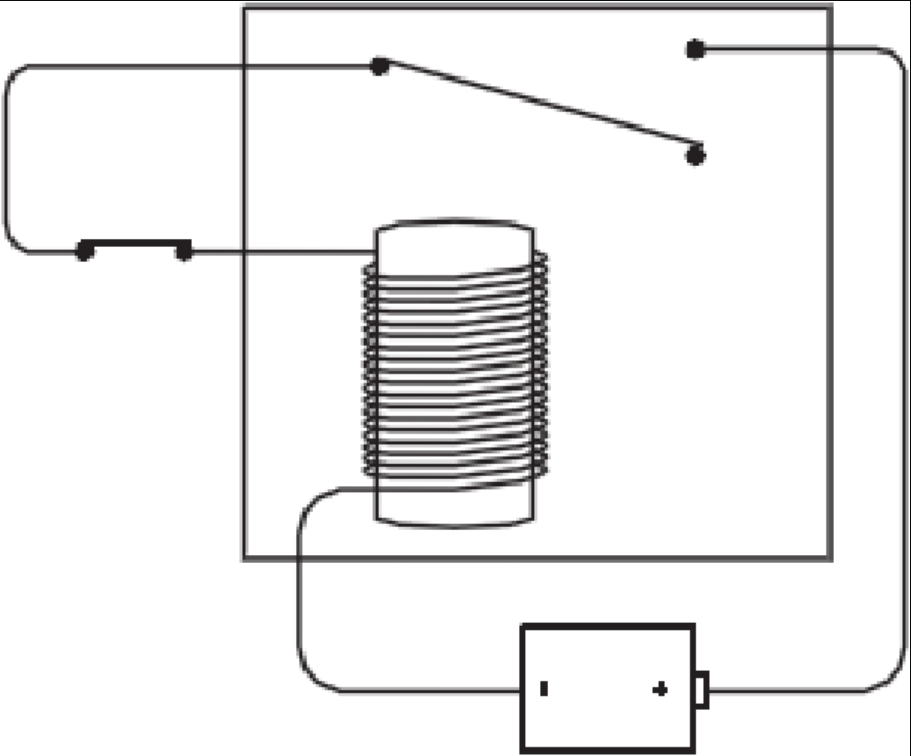

当金属簧片的位置变化时，电路不再连通，电磁铁不再具有磁性，金属簧片又弹回原位。

如此一来，电路又一次连通了。从整个过程来看：开关一旦闭合，金属簧片就会上下跳动——电路也会随之连通或断开——声音也就会随之发出。如果金属簧片发出了一种刺耳的声音，这套系统就成为了一个蜂鸣器。如果金属簧片前端是一把小锤子，旁边只要放上一个锣，就构成了一个电铃。

有两种方法可以使继电器连接成为一个蜂鸣器，下面再给出一种方法的描述，在示意图中包含了一个标准电压符号和一个接地符号。

看到这幅图你或许立刻想起了第11章介绍过的反向器，因此电路可以简化为如下图所示。

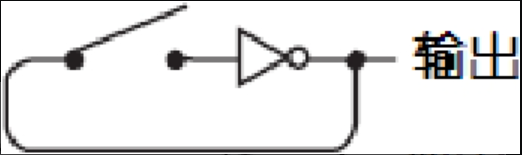

正如你所记得的那样，当反向器的输入是0的时候，它的输出就为1，而当其输入为1时，输出就为0。电路中的开关一旦闭合，反向器中的继电器就会在连通与断开这两种状态之间反复交替。你也可以将电路中的开关省去，这样就可以使反向器连续地工作，如下所示。

这幅图似乎在表达着一种矛盾的逻辑，反向器的输出与其输入是相反的，但是在这里，输出同时又是输入！**然而，我们要牢牢记住，反向器在本质上就是一个继电器，而继电器将状态取反以得到另一个状态是需要一点点时间的。**所以，即使输入和输出是相同的，输出也会很快地改变，成为输入的相反状态（当然，输出随即也会很快改变输入，如此反复）。

电路的输出是什么呢？其实就是要么提供电压，要么不提供电压，在两者之间切换。我们也可以换种方式来表达——输出结果要么是0，要么是1。

**我们把这种电路称为振荡器(oscillator)，它和我们先前学到的所有东西存在本质上的区别。在此之前我们讲过的所有的电路，其状态的改变都依靠人为的干预，通常是通过改变开关状态来实现的。但是振荡器却在不需要人干涉的情况下，可以完全自发地工作。**

当然，单独的一个振荡器用处并不大，但是在本章的后面和接下来的几章里，**我们会发现，在与其他电路连接后所组成的自动控制系统中，振荡器有着举足轻重的作用，为了使不同组件同步工作，所有计算机都配备着某种振荡器。**

当采用0和1的交替序列来表示振荡器的输出时，我们一般使用下面这样的图来形象地描述输出。

我们可以通过这幅图来充分地了解电路的输出，水平坐标代表时间，垂直坐标用来表示输出是0还是1。

### 振荡器=时钟

这幅图表示随着时间的推移，振荡器的输出在0和1之间按照固有的规律交替变化。**正因为这一点，振荡器又经常被称为时钟(clock)，通过振荡进行计数也是一种计时方式。**

### 振荡器的频率

振荡器运行速度究竟有多快呢？换句话说，金属簧片多久会振动一次？或者每秒钟振动多少次呢？这很大程度上依赖于继电器的内部构造。你容易想到，一个又大又重的继电器只能缓慢地上下摆动；而一个又小又轻的继电器却可以高速地跳动。

振荡器从某个初始状态开始，经过一段时间又回到先前初始状态的这一段间隔定义为振荡器的一个循环(cycle)，或者称为一个周期，如下图所示。

一个循环所占用的时间就是该振荡器的周期(period)。假设我们使用的振荡器的周期恰好是0.05s，任取一个时间点，将其设置为起始状态点，我们把它标注为零点，就可以在水平轴上标出相应的时间。

**周期的倒数就是振荡器的频率(frequency)。**在这个例子中振荡器的周期是0.05s，那么其频率就是1÷0.05s，即振荡器每秒钟产生20次循环，而相应的输出每秒钟也变化20次。

每秒钟的循环次数与每小时穿越的英里数、每平方英尺的重量、每份食物的卡路里数等概念一样都是很容易理解的，但这种描述方法已不常用。为了纪念发送和接收无线电波的第一人——亨利希·鲁道夫·赫兹(1857—1894)，后人使用“赫兹”这个词来表示这一概念。这种用法起源于20世纪20年代的德国，几十年之后逐渐被其他国家所广泛采纳。

这样，上述振荡器的频率就是20赫兹，记做20 Hz。

目前为止，我们还只是在猜测一个振荡器的速度。在本章后面我们将构建一种可以测量振荡器速度的元件。

## 触发器

在此之前，让我们先来看看采用特殊方式连接的一对或非门。或非门的特点是只有在两个输入端都没有电压时，输出端才产生电压。

下面是一个包含两个或非门、两个开关和一个灯泡的电路。

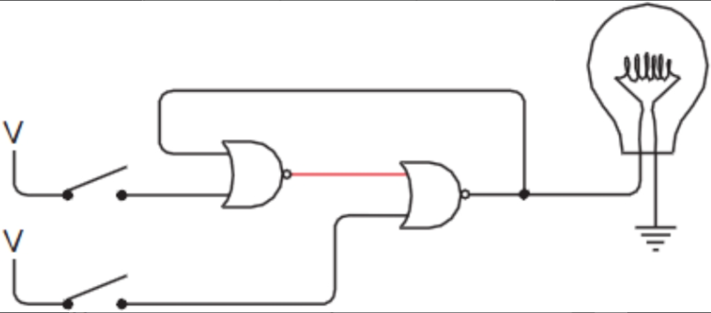

值得注意的是这种特殊的弯曲的连线方式：左边或非门的输出是右边或非门的输入，而右边或非门的输出是左边或非门的输入。**这种连接方式我们称之为反馈(feedback)。系统的输出返回给输入这种形式和我们在振荡器中讨论的情况很相似。**接下来你将会看到，本章大部分电路都具备这种特质。

在初始状态下，电路中只有左边的或非门输出电流，这是因为其两个输入均为0（初始状态其实自己选定的，不一定必须是这样的，但无论选定什么初始状态，后面的逻辑是一样的）。让我们闭合上面的开关，左边或非门将立刻输出0，右边或非门的输出也会随之变为1，这时灯泡将被点亮。

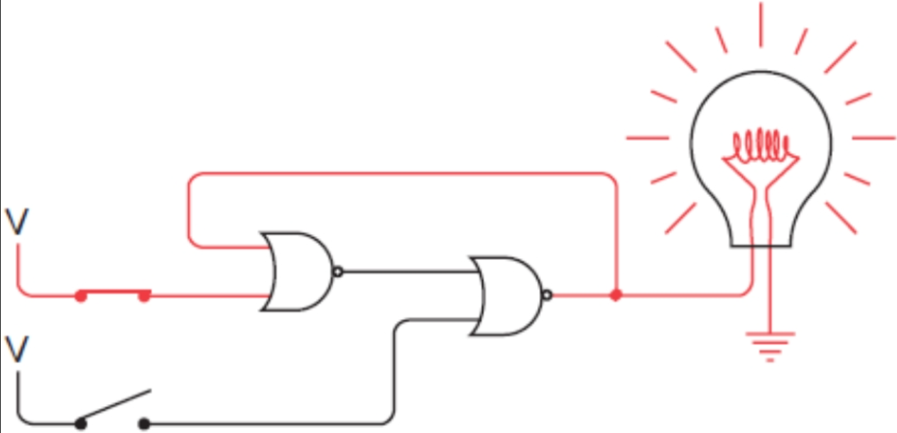

奇妙的是，这时一旦你断开上边的开关，灯炮依然闪闪发光，这是因为由于左边或非门的输入中有一个为1，其输出依然是0，因而左边或非门的输出不变，所以灯泡仍然亮着。

难道你不觉得有点奇怪吗？两个开关都断开——和第一幅场景描述的是一模一样——但这里的灯泡却仍发光。无论上面的开关怎么调整其状态，灯泡总是亮着。这个开关对电路毫无影响，究其原因可以发现这是由于左边或非门的输出一直为0。

现在来试试闭合下面的开关。我们会发现右边或非门的输入中有一个立刻变为1，其输出就相应地变为0，灯泡随之熄灭。左边或非门的输出此刻变为1。

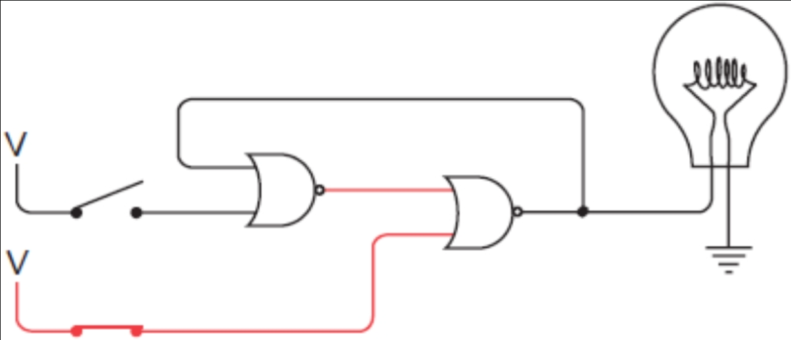

这时你再去断开下面的开关就会发现，灯泡一直处在熄灭状态。

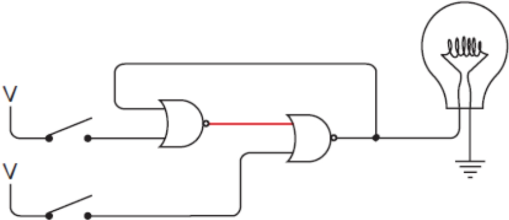

此时的电路状态与初始时是一样的，但是这次无论你怎么改变下面开关的状态，灯泡丝毫不受影响。我们将先前的情况一起总结一下：

- 接通上面的开关，灯泡被点亮，断开此开关灯泡仍然亮着。

- 接通下面的开关，灯泡被熄灭，断开此开关灯泡仍然不亮。

**电路的奇怪之处是：同样是在两个开关都断开的状态下，灯泡有时亮着，有时却不亮。当两个开关都断开时，电路有两个稳定态，这类电路统称为触发器(Flip-Flop)**。

**触发器电路可以保持信息，它可以“记住”某些信息。特别地，对于本章先前所讲述的触发器，它可以记住最近一次是哪个开关先闭合。如果你遇到这样一种触发器，如果它的灯泡是亮着的，你就可以推测出最后一次连通的是上面的开关；而如果灯泡不亮则可推测出最后一次连通的是下面的开关。**

尽管你现在可能还没感受到这一点，但触发器的的确确是一种必不可少的工具。它们可以让电路“记住”之前发生了什么事情。想象一下，如果你没有了记忆力，该如何去数数，我们不记得刚刚数过的数，当然也就无法确定下一个数是什么！同理，一个能计数的电路（本章后面要讲到）必定需要触发器。

### R-S触发器

触发器种类繁多，先前所讲述的是最简单的一种R-S（Reset-Set，复位/置位）触发器。我们通常把两个非或门绘制成另一种形式，加上标识符就得到了下面这幅图。

我们通常用Q来表示用于点亮灯泡的输出的状态，另一个输出 $$\overline{Q}$$（读做Q反）是对Q的取反，Q是0，$$\overline{Q}$$就是1，反之亦然。输入端S(Set)用来置位，R(Reset)用来复位，你可以把“置位”理解为把Q设为1，而“复位”是把Q设为0。当状态S为1时（对应于先前触发器中上面的开关闭合的情况），此时Q变为1而$$\overline{Q}$$变为0；当R状态为1时（对应于前面图中闭合下面的开关的情况），此时Q变为0而$$\overline{Q}$$变为1。当S和R均为0时，输出保持Q原来的状态不变，我们把结论总结如下表所示。

这类表称为功能表(function table)、逻辑表(logic table)或真值表(truth table)，它表达了不同输入组合所对应的不同输出结果。因为R-S触发器仅有两个输入端，所以不同的输入组合共有4种，分别对应于表中的4行。

注意表中倒数第2行，这一行输入S和R均为0，而输出标识为Q和$$\overline{Q}$$，这表示当S和R输入均为0时，Q和$$\overline{Q}$$端的输出保持为S、R同时被设为0以前的输出值。表中最后一行表示S和R均为1的输入组合是被禁止或者不合法的。不要误解为你会因此被逮捕，**而是说如果S、R状态同时为1时，Q和$$\overline{Q}$$均会为零，这与Q和$$\overline{Q}$$互反的假设关系相矛盾，所以当使用R-S触发器进行电路设计时，R、S输入同时为1的情况一定要避免。**

R-S触发器可以简化为带有输入和输出标志的小框图，就像下面画的这样。

**R-S触发器最突出的特点在于，它可以记住哪个输入端的最终状态为1。**但是有时候我们需要一种记忆能力更加强大的电路，例如能记住在某个特定时间点上的一个信号是0还是1。

### 保持位

在构造具备这种功能的电路之前，让我们先来思考一下它的具体行为。这个电路存在两个输入，其中一个我们称之为数据端(Data)，与所有数字信号一样，数据端取值为0或1。另一个输入被称为保持位(Hold That Bit)，保持位的作用就是使当前的状态被“记住”，通常情况下保持位被设置为0，在这种情况下数据端对电路不产生影响。当保持位置1时，数据端的值就会在电路系统中被“记住”，随后保持位又置为0，这时电路已经“记住”了数据端的最后一次输入，而之后数据端的输入无论如何变化都不会对电路产生影响。

我们可以把状态转化的过程以真值表的形式表示如下。

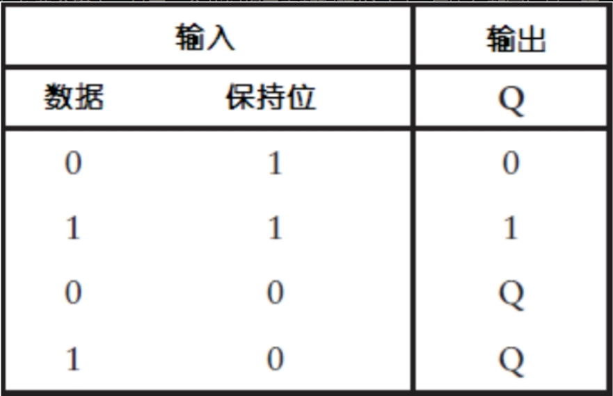

在前两种情况下，保持位为1，输出Q与数据端输入相同，后面两种情况下，保持位为0，输出端Q和其前一个状态保持一致。值得注意的是，保持位为0意味着输出将不再变化，也就是说不再被数据端所影响，我们可以进一步将真值表简化为如下所示。

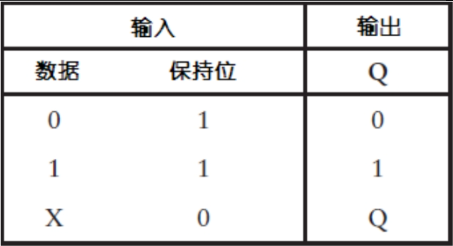

X表示“其取值情况与结果无关”，只要保持位的值为0，那么数据位对电路的输出没有影响，电路的输出和其前一个状态相同。

如果使用先前学过的R-S触发器来实现这种具有保持位的功能系统，那么我们的电路需要在输入端增加两个与门，下图所给出了该系统的实现电路。

回忆一下与门，它的特点是只有在输入端都为1的状态下，输出才为1。在上面这幅图中，输出端Q为0，$$\overline{Q}$$为1。

只要保持位为0，则置位端对于输出结果不会有任何影响。

同样，复位信号对输出也无任何影响。

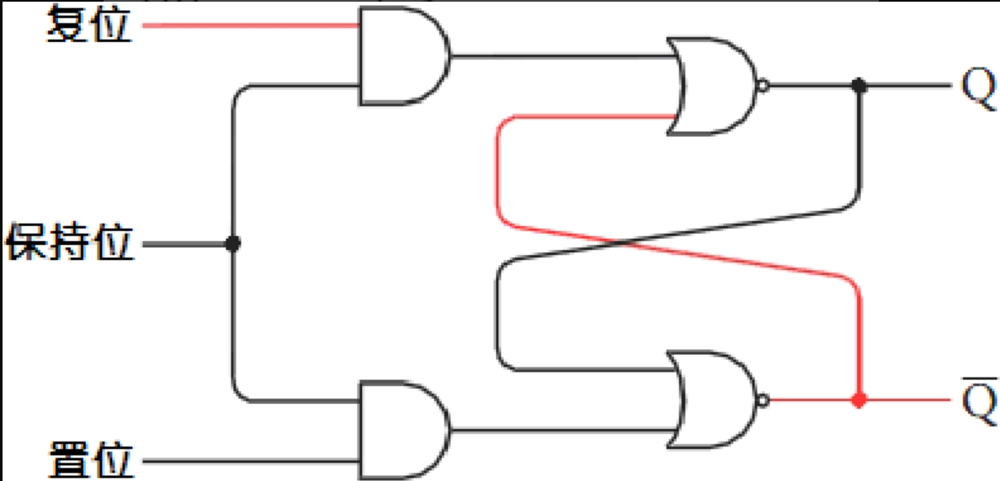

当保持位信号为1时，这套电路系统就和先前讲过的R-S触发器功能一致。

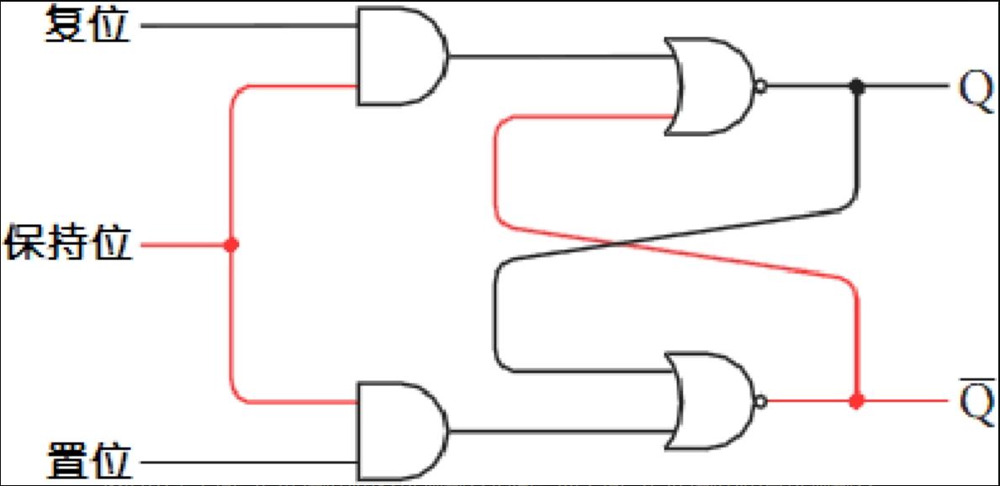

这时由于上面与门的输出和复位端输入相同，而下面与门的输出和置位端输入相同，所以电路系统的功能和普通的R-S触发器是一样的。

### 电平触发的D型触发器

但是我们离目标还差一点。我们只想要两个输入，而不是三个，怎么解决这个问题呢？先回忆一下R-S触发器的功能表：两个输入端同时为1是非法的，要尽量避免；而两个输入端同时为0是无意义的，因为那种情况下输出就会保持不变。

由此可以总结出，真正有意义的输入可以是S为0, R为1或者是R为0, S为1的情形。如果把数据端信号看做置位信号，把它取反后的值看做复位端信号，我们可以画出相应的电路图如下所示。

在上图所表示的情况下，所有输入均为0，而输出Q也为0（此时$$\overline{Q}$$为1）。可以看出只要保持位为0，电路输出就丝毫不受输入端的影响。

当保持位为1时，电路反映出数据端输入的值。

现在Q端的输出和数据输入是一致的，而$$\overline{Q}$$端则正好相反。现在保持位又回到0，如下图所示。

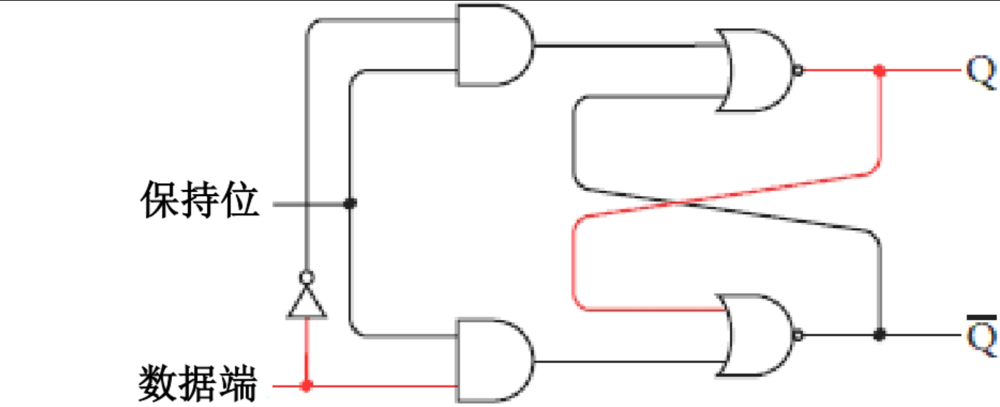

这时，电路会“记得”当保持位最后一次置1时数据端输入的值，数据端的变化对此没有影响。例如，数据端再置回0对输出将不会产生影响。

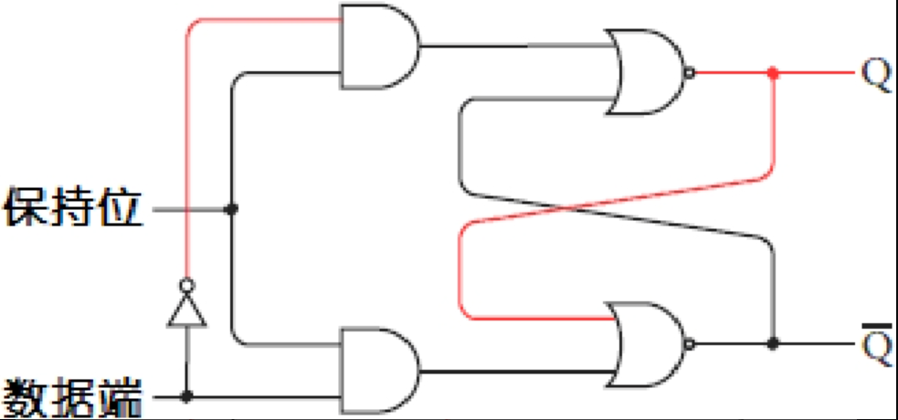

**这个电路称为电平触发的D型触发器，D(Data)表示数据端输入，所谓电平触发是指当保持位输入为某一特定电平（本例中为“1”）时，触发器才保存数据端的输入值**（很快，我们将看到另一种形式的触发器）。

通常情况下，当这种电路出现在书中的时候，保持位会被标记为时钟(clock)。当然，这种信号并不是真正的时钟，但是在某些情况下它却具有类似时钟的属性，即它可以在0和1之间有规律地来回变化。但是现在时钟仅仅用来指示什么时候保存数据。

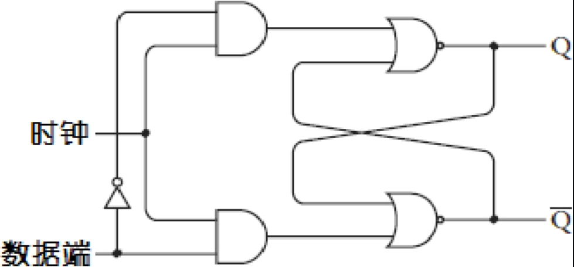

通常把数据端简写为D，时钟端简写为Clk，其功能表如下所示。

**这个电路也就是所谓的电平触发的D型锁存器，它表示电路锁存住一位数据并保持它，以便将来使用，这个电路也可以被称为1位存储器。**在本书的第16章将会介绍如何将多个1位存储器连接起来构成多位存储器。

## 3个8位数相加

在锁存器中保存多位值通常是很有用的。假如你想用把3个8位数相加，可以在开关的第1行中存入第1个加数，以同样的方式把第2个加数存入第2行，但是必须记下第一次相加的结果。然后你需要把这个结果输入到开关的一行中，再把第3个加数输入到开关的另一行中。而你实际上不必输入中间结果，你应该能够在第一次计算之后直接使用它。

可以使用锁存器来解决这个问题。我们在一个小盒子里布置8个锁存器，如前所述，每个锁存器包括两个或非门、两个与门以及一个反向器。所有的时钟输入端都互相连在一起，结果如下图所示。

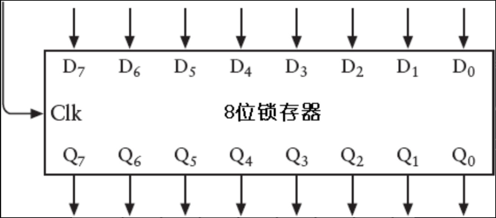

这个锁存器可以一次保存8位数，上面的8个输入端依次标记为D0～D7，下面的8个输出端被标记为Q0～Q7。左边的输入是时钟(Clk)，时钟信号通常为0。当时钟信号为1时，D端输入的8位值被送到Q端输出，当时钟信号为0时，这8位值将保持不变，直到时钟信号再次被置1。

也可以将8位锁存器的8个数据输入端和8个Q输出端画为两组线，如下图所示。

下面是8位加法器的图示。

通常（先不考虑上一章讲到的减法器），8个A输入端和8个B输入端连接到开关上，CI（进位输入）接地，而8个S（计算和）输出以及CO（进位输出）端连接到灯泡上。

经过改进，8位加法器的8个S输出端既与灯泡相连，又连接到8位锁存器的数据(D)输入端，标记为“保存”(Save)的开关是锁存器的时钟输入，用来存放加法器的运算结果。

### 2-1选择器

标识为2-1选择器的方块是让你用一个开关来选择加法器的B端输入是取自第2排开关还是取自锁存器的Q端输出。当开关闭合时，就选择了用8位锁存器的输出作为B端输入。2-1选择器使用了8个如下所示的电路。

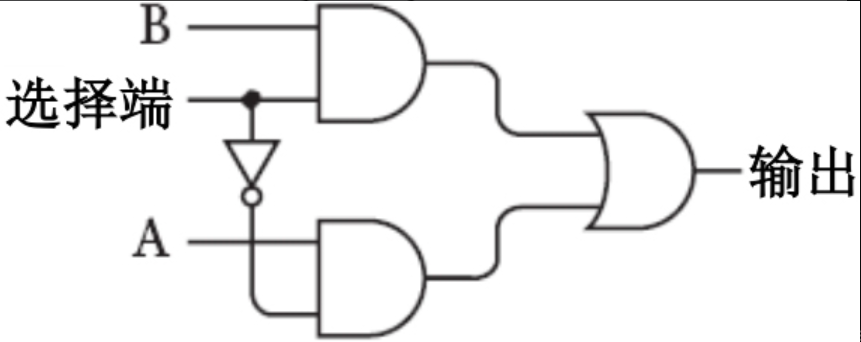

如果选择端(Select)输入是1，那么或门的输出和B端的输入就是一致的，这是因为上面与门的输出和B端输入是一样的，而下面与门的输出是0。类似的，如果选择端的输入是0，那么或门的输出则和A端输入一致。总结起来如下表所示。

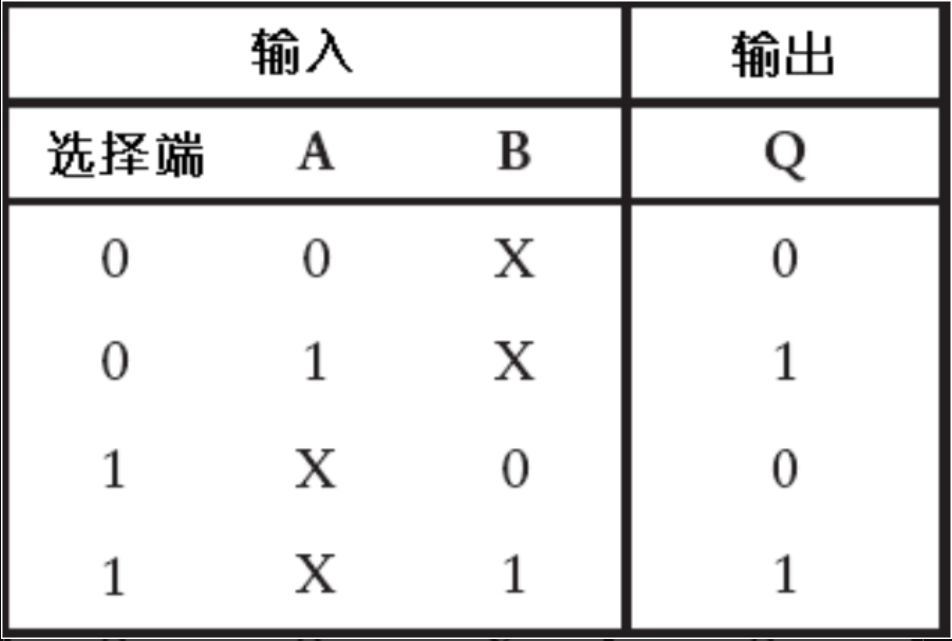

改进后的加法器中包含了8个这样的1位选择器，所有的选择端输入信号都是连在一起的。

改进后的加法器不能很好地处理进位输出(CO)信号。如果两个数的相加使得进位输出信号为1，那么当下个数被加进来的时候，这个信号将被忽略掉。这个问题留到第17章具体讲述。

### 清零信号

对于加法器来说，还有一个更好的改进方法是仅保留一排8个开关。但是首先要对D触发器做一些修改，为它加一个或门和一个称为清零(Clear)的输入信号。清零信号通常为0，但当它为1时，Q输出为0，如下图所示。

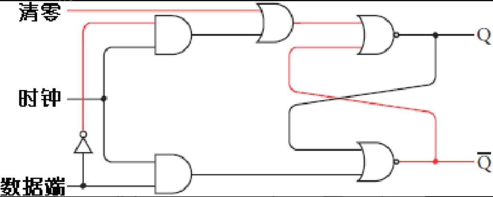

无论其他信号是什么，清零信号总是强制使Q输出为0，以达到使触发器清零的目的。

**也许你还不明白为什么要设置这个信号，为什么不能通过把数据输入端置0和把时钟输入端置1来使触发器清零呢？这也许是因为我们无法精确控制数据端的输入信息的缘故。**我们可能有一组8个锁存器，它们连着8位加法器的输出端，如下图所示。

注意，标识为“相加”(Add)的开关现在控制着锁存器的时钟输入。

你可能会发现这个加法器比前面的那个好用，特别是当你需要加一批数据时。首先按下清零开关，这个操作会使锁存器的输出为0，并且熄灭了所有的灯泡，同时使8位加法器的第2行输入全为0。然后，通过开关输入第一个加数，并且闭合“相加”开关，这个加数的值就反映在灯泡上。再输入第二个加数并再次闭合“相加”开关。由开关输入的8位操作数加到前面的结果上，所得的和体现到灯泡上。反复如此操作，可以连续进行很多次加运算。

前面提到过，我们所设计的D触发器是电平触发的，也就是说为了使数据端的值保存在锁存器中，必须把时钟端的输入从0变为1（即高电平）。当时钟端输入为1时，数据端的输入是可以改变的，这时数据端输入的任何改变都会反映在Q和$$\overline{Q}$$的输出值中。

## 边缘触发器

对某些应用而言，电平触发时钟输入已经足够用了；但是对另外一些应用来说，边沿触发(edge-triggered)时钟输入则更有效。对于边沿触发器而言，只有当时钟从0跳变到1时，才会引起输出的改变。**它们的区别在于，在电平触发器中，当时钟输入为0时，数据端输入的任何改变都不会影响输出；而在边沿触发器中，当时钟输入为1时，数据端输入的改变也不会影响输出，只有在时钟输入从0变到1的瞬间，数据端的输入才会影响边沿触发器的输出。**

边沿触发的D型触发器是由两级R-S触发器按如下方式连接而成的。

这里，时钟端的输入既控制着第一级R-S触发器，也控制着第二级，但是要注意的是时钟信号在第一级中进行了取反操作，这意味着除了当时钟信号为0时保存数据外，第一级R-S触发器和D型触发器工作原理完全一致。第二级R-S触发器的输入是第一级的输出，当时钟信号为1时，它们都被保存。一言概之，只有当时钟信号由0变为1时，数据端输入才被保存下来。

进一步分析，下图为一个处于非工作状态的触发器，其数据输入和时钟输入均为0，且Q输出也为0。

现在使数据端输入为1，如下图所示。

这改变了第一级触发器的状态，因为时钟输入取反变为1。但第二级触发器状态保持不变，因为时钟输入仍然为0。现在把时钟输入变为1。

这就引起了第二级触发器输出的改变，使Q输出变为1。不同点在于，无论数据端输入发生何种变化（比方说变为0）都不会影响Q的输出。

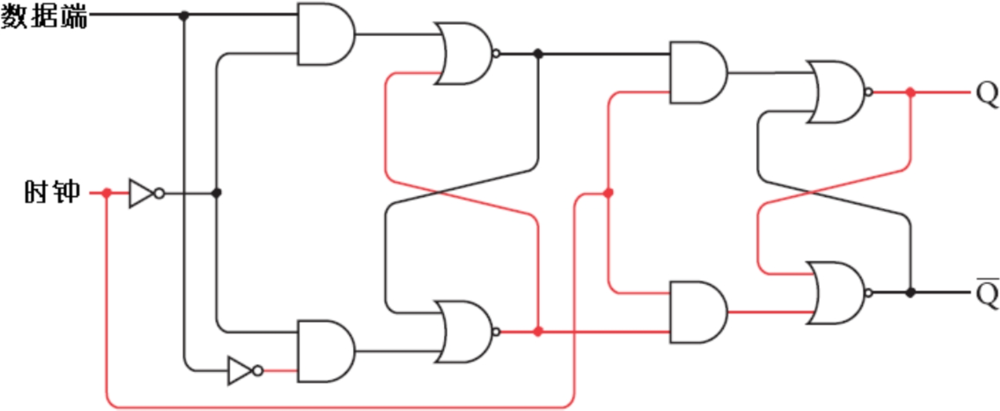

只有在时钟输入从0变化到1的瞬间Q和$$\overline{Q}$$输出才发生变化。

边沿触发的D型触发器的功能表需要一个新的符号来表示从0到1的瞬时变化，即用一个向上的箭头(↑)表示，如下表所示。

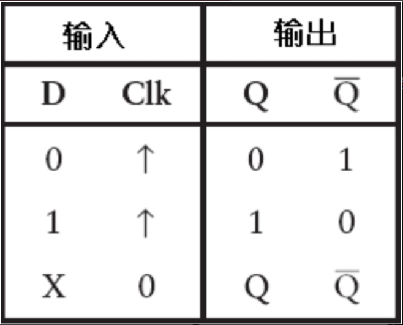

表中箭头表示当时钟端由0变为1时（称为时钟信号的“正跳变”，“负跳变”是指从1变为0），Q端输出与数据端输入是相同的。触发器的符号如下图所示。

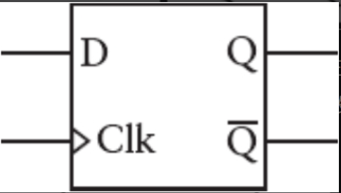

图中的小三角符号表示触发器是边沿触发的。

## 分频器与计数器

下面展示的是一个使用边沿D型触发器的电路，这个电路是不能用电平触发形式复制出来的。先回忆一下本章开始构造的振荡器，其输出在0和1之间变化。

把振荡器的输出与边沿触发的D型触发器的时钟端输入连接，同时把$$\overline{Q}$$端输出连接到本身的D输入端。

这个触发器的输出同时又是它自己的输入。（实际上，这种构造可能是有问题的，振荡器是由状态来回迅速改变的继电器构成的，其输出与构成触发器的继电器相连，而这些其他的继电器不一定能跟得上振荡器的速度。为了避免这些问题，这里假设振荡器中的继电器比电路中其他地方的继电器速度要慢得多）

仔细看一看下面的功能表就可以明白在电路中发生的情况了，电路启动时，假设时钟输入为0且Q输出也为0，则$$\overline{Q}$$端输出为1，而$$\overline{Q}$$是和D端输入相连的。

当时钟输入从0变为1时，Q输出与D输入相同。

但是由于$$\overline{Q}$$的输出变为0，因此D输入也变为0。现在时钟输入为1，如下表所示。

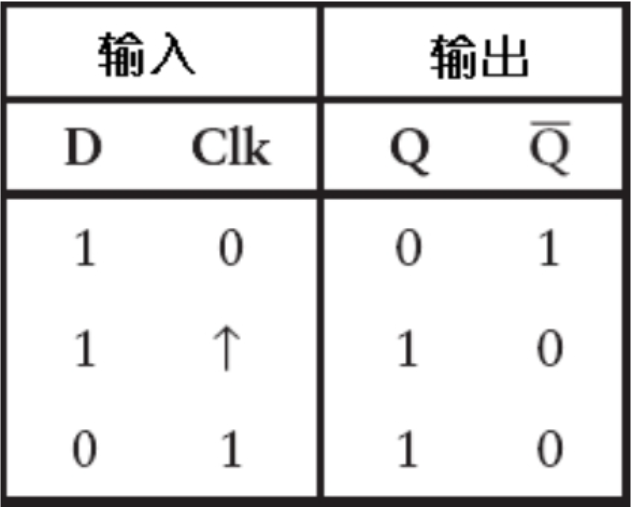

当时钟输入变回0时，不会影响到输出，如下表所示。

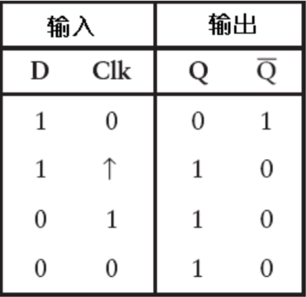

现在时钟端输入又变为1。由于D输入为0，那么Q输出为0且$$\overline{Q}$$输出为1。

所以D输入也变为1，如下表所示。

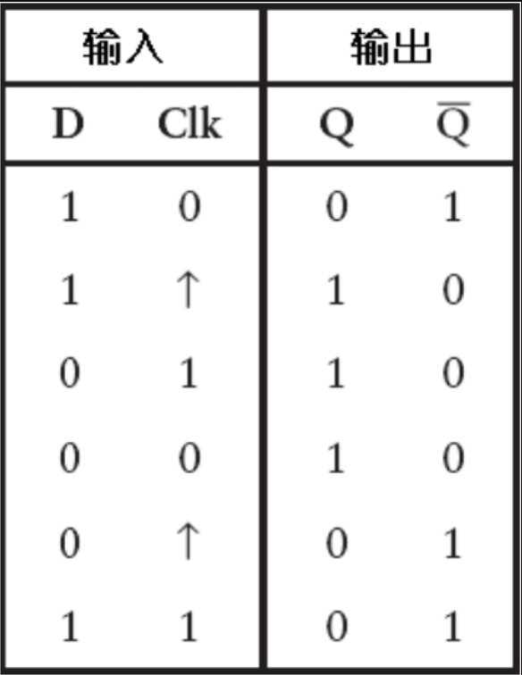

以上发生的现象可以简单总结为：每当时钟输入由0变为1时，Q端输出就发生变化，或者从0到1，或者由1到0。下面的时序图可以更加清楚地说明这个问题。

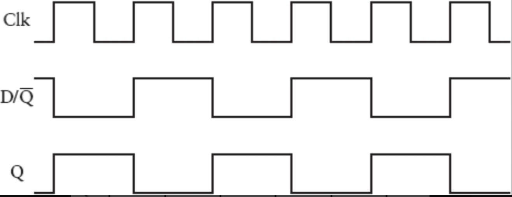

当时钟端Clk输入由0变为1时，D的值（与$$\overline{Q}$$的值相同）被输出到Q端。当下一次Clk信号由0变为1时，D和$$\overline{Q}$$的值同样会改变。

如果这个振荡器的频率是20Hz（即20个周期的时间为1s），那么Q的输出频率是它的一半，即10Hz，由于这个原因，这种电路称为分频器(frequency divider)。

当然，分频器的输出可以作为另一个分频器的Clk输入，并再一次进行分频。下面是三个分频器连接在一起的示意图。

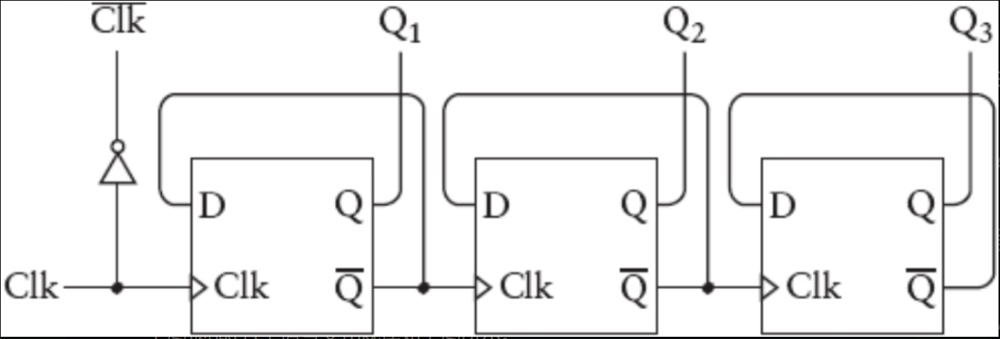

上图顶部的4个信号变化规律如下图所示。

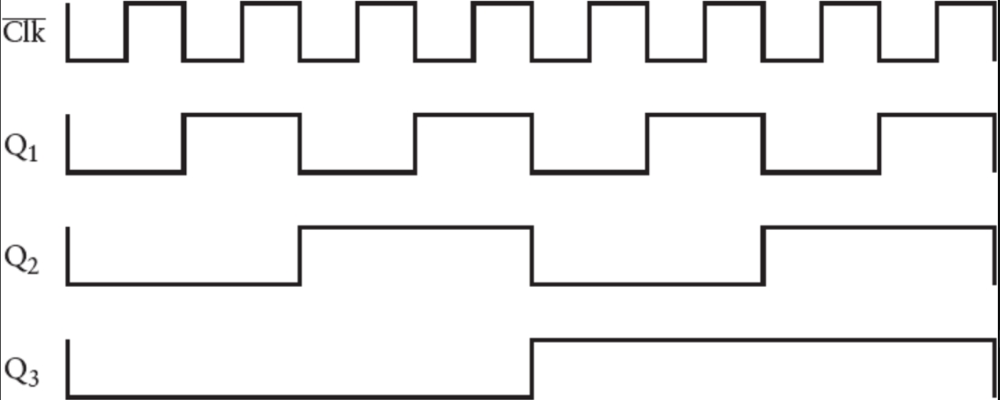

这里只给出了这幅图的一部分，因为这个电路会重复上述过程周而复始地变化下去，在这幅图中，你有没有发现眼熟的东西呢？

提示一下，把这些信号标上0和1。

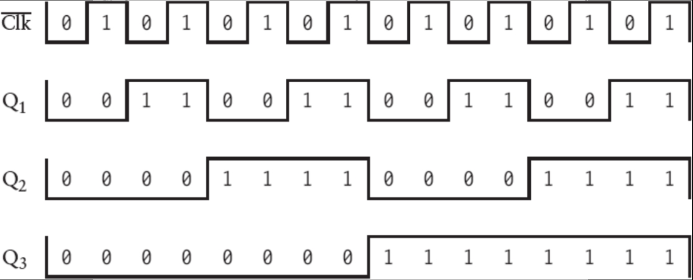

现在看出来了么？试着把这个图顺时针旋转90°，然后读一读每一行的4位数字，它们分别对应了十进制中的0～15中的一个数。

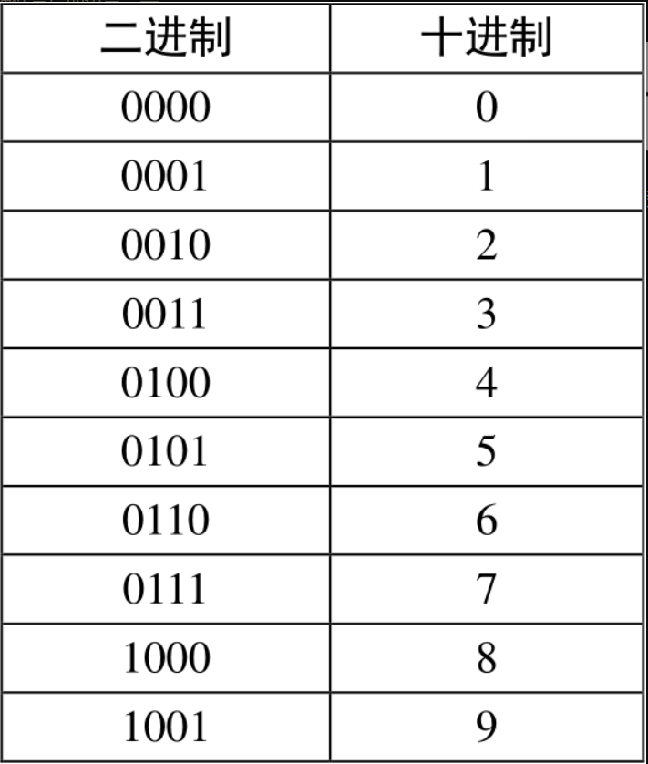

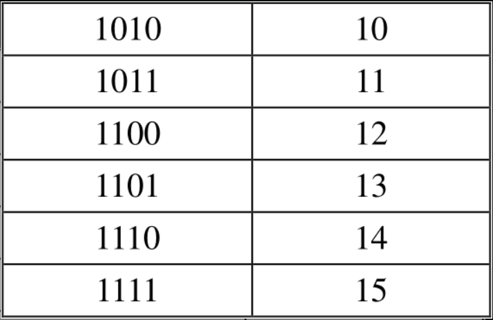

可以看出，这个电路具备了一个计数功能，当然，如果在这个电路中添加更多的触发器，其计数范围就会更大。在第8章中提到一个顺序递增的二进制序列，每一列数字在0和1之间的变化频率是其右边那一列数字变化频率的一半，这个计数器就是模仿了这一点。

把8个触发器连接在一起，然后放入一个盒子中，构成了一个8位计数器。

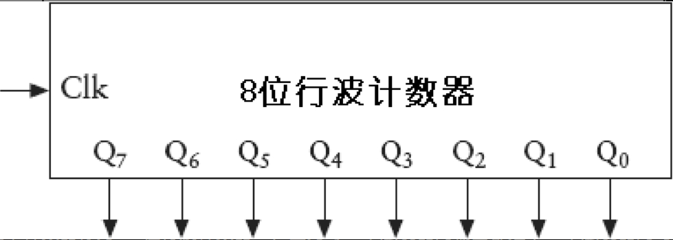

这个计数器称为“8位行波计数器”，因为每一个触发器的输出都是下一个触发器的时钟输入。**变化是在触发器中一级一级地顺序传递的，最后一级触发器的变化必定会有一些延迟，更先进的计数器是“并行（同步）计数器”，这种计数器的所有输出是在同一时刻改变的。**

在计数器中输出端用Q0～Q7标记，在最右边的Q0是第一个触发器的输出。如果将灯泡连到这些输出端上，就可以将8位数字读出来。

本章前面提到过可以找到某种方法来确定振荡器频率，现在已经找到这种方法了。如果把一个振荡器连接到8位计数器的时钟输入端上，那么这个计数器会显示出振荡器经过的循环次数。当计数器总数达到11111111（十进制的255），它又返回为00000000。使用计数器确定振荡器频率的最简单的方法就是把计数器的8个输出端分别接到8只灯泡上。当所有的输出都是0时（即所有灯泡都是熄灭的），启动一个秒表计时，当所有灯泡都点亮时，停止秒表计时，这就是振荡器循环256次所需要的时间。假设这个时间为10s，则振荡器的频率是256÷10，即25.6 Hz。

## 预置和清零的边沿型D触发器

随着触发器功能的增加，它的结构也变得更加复杂，下面给出了一个带预置和清零功能的边沿型D触发器。

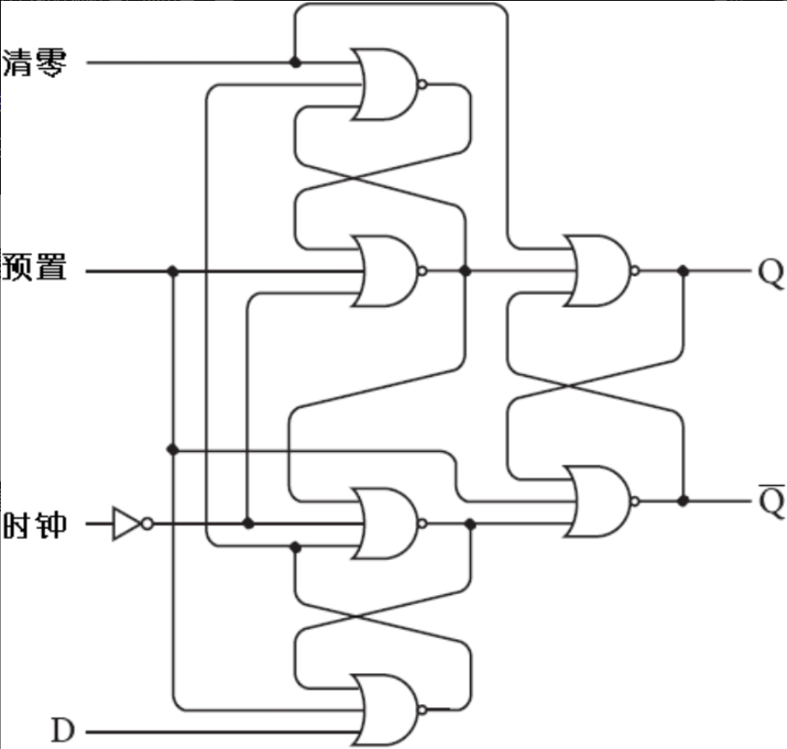

通常情况下，预置和清零信号输入会覆盖时钟和数据端输入。当预置信号为1时，Q变为1，$$\overline{Q}$$变为0。当清零信号为1, Q变为0，$$\overline{Q}$$变为1（同R-S触发器中的S和R输入端一样，预置和清零信号不能同时为1）。除此之外，该触发器工作原理是和普通边沿D触发器是一样的。

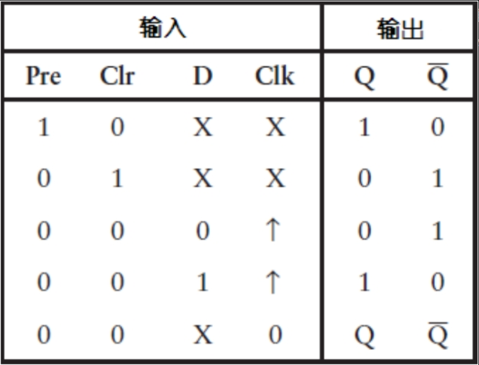

电路图符号可以简单地用下图来代替。

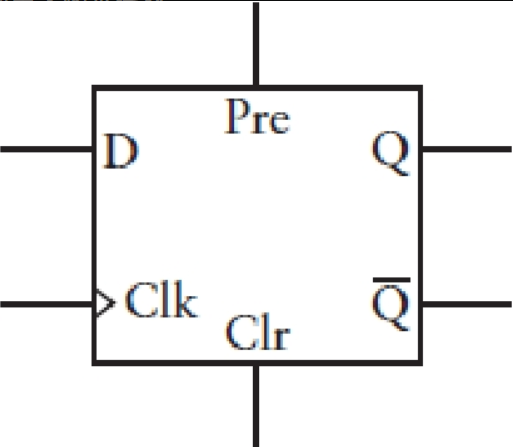

现在，我们已经懂得如何使用继电器来做加法、减法和计数了，这是一件很有成就感的事情，因为我们使用的硬件是100多年前就存在的东西。我们还有更多未知领域要去探索，请稍事休息吧。

# 16. 存储器组织

在前面章节中我们讨论过，一个触发器可以对1位信息进行存储，这样的存储能力要存储一大堆的信息还远远不够，但它却为我们达到目标迈出了坚实的一步。其实知道了如何存储1位信息，很容易就可以想象出如何存储2位、3位或更多位信息。

## 8位锁存器

在第14章的学习过程中，我们一起讨论过由一个反向器、两个与门和两个或非门构成的D型电平触发器，如下图所示。

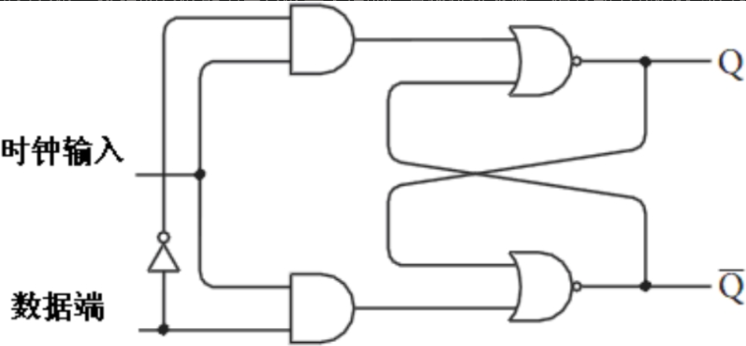

当时钟输入为1, Q端输出与数据端输入保持一致。但当时钟输入跳变为0时，Q端输出将保持数据端最后一次的输入。除非时钟输入再次还原为1，之后的数据端输入不会影响输出。此触发器的真值表如下。

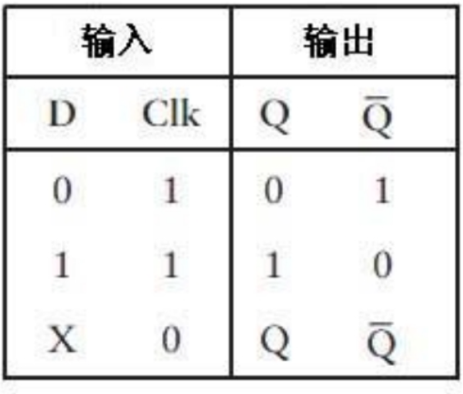

为了更加清楚地表述，我们给输入和输出端重新命名，使其名称与功能相符，如下图所示。

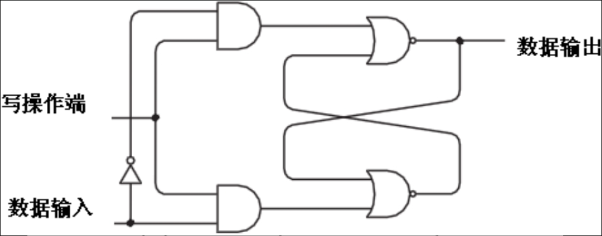

从结构上来讲，这套电路与先前所学到的是同一种触发器，只是命名的方式不尽相同，现在Q输出端被称为数据输出端(Data Out)，时钟输入端（在第14章叫做保持位）命名为写操作端(Write)。就像信息可以被记录在纸上一样，写操作端的信号同样使得数据输入(Data In)信号被写入(Written Into)，也可以称之为被存储(stored)到电路中。

一般情况下，如果写操作端为0，则数据输入信号的状态对输出无影响。而当我们想把数据输入信号存储在触发器中时，可以把写入信号应先置1后置为0。在第14章讲到过，这种类型的电路也被称为锁存器，因为存储进去的数据就好像被锁住了一样。下面给出了1位锁存器简化框图，框图未画出其内部结构中的部件。

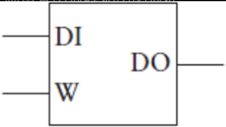

我们很容易想到如何把多个1位锁存器组织成为多位锁存器，所要做的就是把写操作端的信号连接到系统中，就像下面这样。

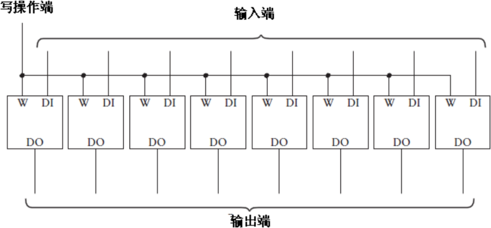

图中显示的8位锁存器其输入和输出端各有8个。**另外还包括一个写操作端，在非工作状态下一般为0，如果要把一个8位二进制数存储在锁存器中，首先要把写操作端置1，然后置0。**我们同样可以把这个锁存器以框图的形式表现出来，就像下面这样。

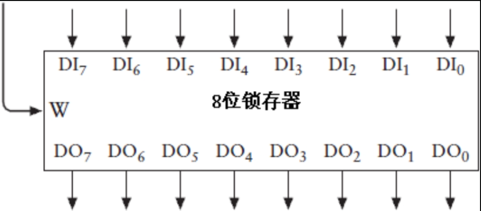

为了和先前提到的1位锁存器保持一致，我们将它可以画成下面这种形式。

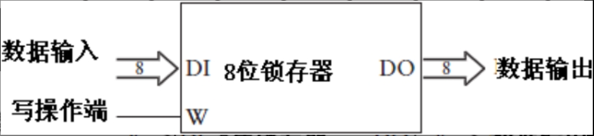

## 存储8个单独的比特

还有另一种方法集成8个1位锁存器，但其结构并不像上面的这样直观。假设我们只想用一个数据输入和输出信号端，而且希望锁存器能将输入信号数据分8次独立存储，最后一项要求就是我们还希望能够通过观察数据输出信号端确定实际的8位输出。

换句话说，在这种锁存器中我们只想存储8个单独的比特，而不是存储1个8位二进制数。

为什么会有这种需求呢？原因可能在于仅有一个灯泡！

先不去考虑数据如何存储在这些锁存器中，把重点放在如何用一个灯泡来确定某个锁存器的数据输出信号。最简单的方法就是把这个灯泡依次连接到每个锁存器上，分若干次来测试各个锁存器的输出，但是我们要追求更加自动化的方法。用开关来选择想要检查的锁存器是一个好的办法。

### 8-1选择器

究竟需要多少个开关才能解决问题呢？我们可以把这个过程进一步抽象，问题变成了怎么样从8个物体中选出一个我们想要的，我们需要3个开关。这是因为通过3个开关连通与闭合的排列组合，总共可表示出8个不同的值：000、001、010、011、100、101、110和111。

现在我们手头上已有8个1位锁存器、3个开关、1个灯泡，此外在开关和灯泡之间还有另外一种装置，如下图所示。

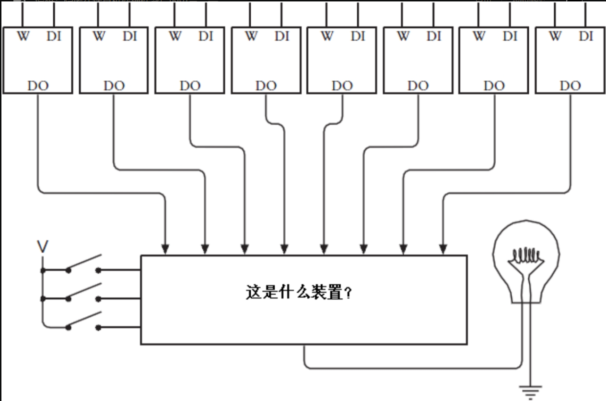

这个“额外装置”就是图中的神秘盒子，顶部带有8个输入端，左侧也带有3个输入端。通过三个开关的闭合和断开，对顶部的输入进行8选1操作，输出结果被传递到其底部连接的灯泡，使其发光。

上图标注的“这是什么装置？”到底是什么呢？我们先前曾碰见过类似的东西，当时讨论的装置没有这么多的输入端，这种装置曾出现在第14章中第一个改进的加法机的电路中。在该电路中要在一行开关和一个锁存器的输出之间选择一个，作为加法器的输入，当时称其为2-1选择器。而我们现在所需要的正是8-1数据选择器(8-Line-to-1-Line Data Selector)。

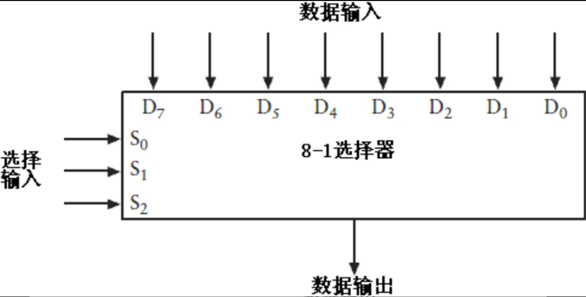

8-1选择器有8个数据输入端（在其顶部），以及3个选择输入端（在其左侧）。选择输入端的功能就是选择一个输入端数据，然后使其在输出端输出。如果选择输入端为000，则将D0锁存器的值输出；若选择端为111，则D7锁存器的值将被输出；若选择端为101，则相应地输出D5的值。系统的真值表如下所示。

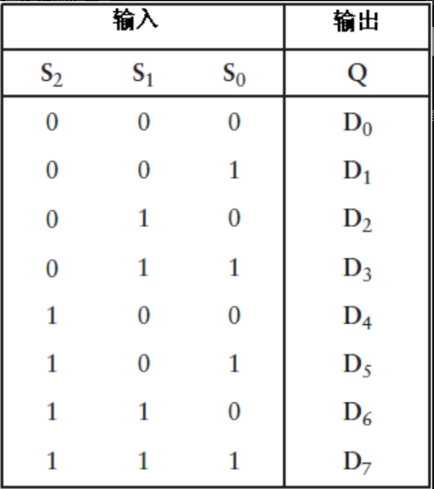

8-1选择器主要组成部件为：三个反向器、八个4端口输入与门、一个8端口输入或门，系统的组织结构如下图所示。

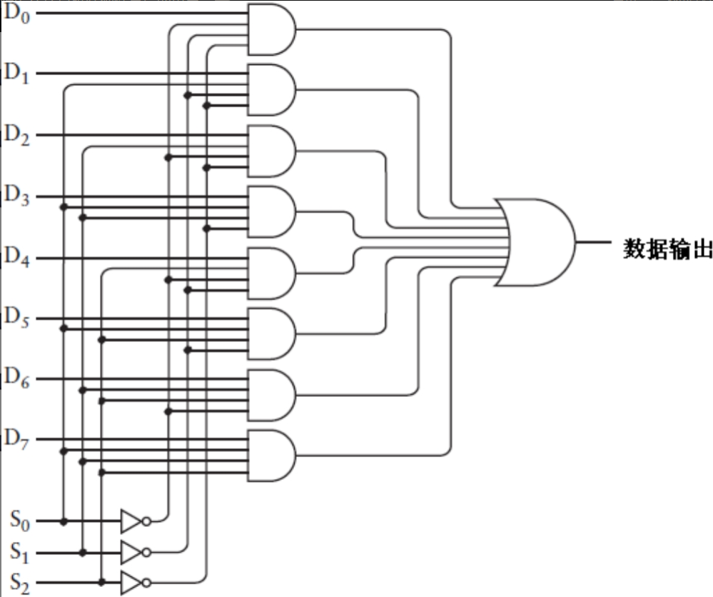

这个电路看上去线路密布，要理解它是如何工作的，最好方式就是一起来看一个例子。假设S2初始化为1, S1初始化为0, S0初始化为1。从顶部开始的第6个与门的输入由S0、$$\overline{S_1}$$、S2组成，初始状态下它们全为1。这使得其余与门输出全部为0。若D5变为0意味着第6个与门输出为0；反之第6个与门输出则为1。对最右边的或门也可以按照同样的方式理解。我们可以总结出下面这个结论：若选择端为101，则数据输出端与D5的输出保持一致。

### 3-8译码器

让我们重新理一下思路，想想自己究竟要干什么。我们的目的是通过某种方式连接8个1位锁存器，使自己能够从一个输入信号端写入数据，还能从一个输出信号端鉴别出数据。现在我们已经成功地使用了一个8-1选择器对8个锁存器进行了选择操作，并将相应锁存器的数据输出，下面是电路的结构图。

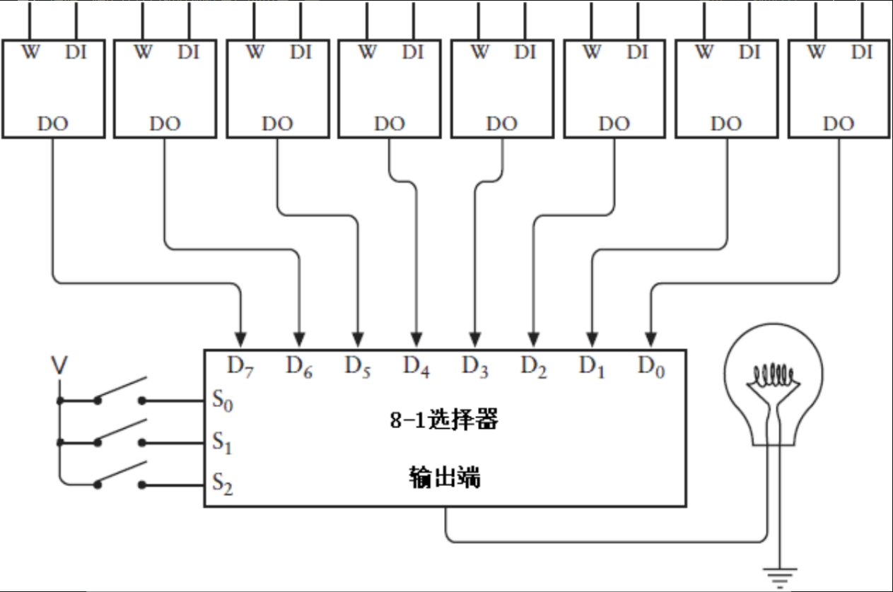

到这里我们只走完了长征的一半。既然输出端已经满足了要求，现在把注意力集中到输入端。

输入端包括了数据输入信号及写操作信号。可以把所有数据输入信号在锁存器的输入端连接在一起，但8个写入信号是不可以连在一起的，因为我们很可能要向每个锁存器依次写入数据。除此之外还需要一个独立的写入信号，它能被路由到任意（且唯一）的锁存器上，系统的结构可用下图表示。

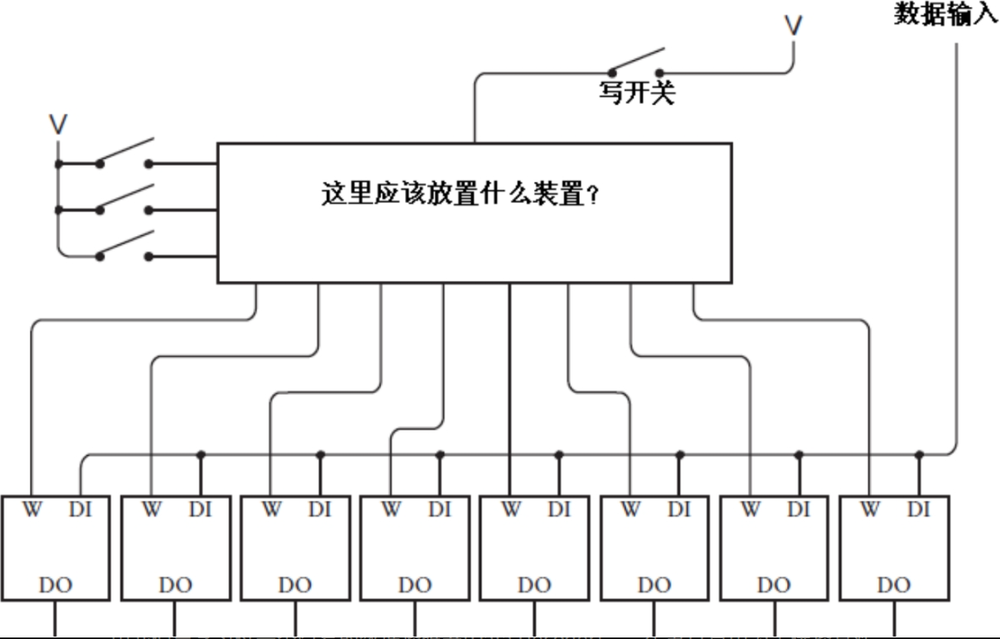

为了能圆满完成任务，我们需要另外一款电路元件，而且这款元件与8-1选择器功能类似，但它的作用正好相反。我们所说的正是3-8译码器(3-to-8 Decoder)。

3-8译码器的输出端口共有8个。**在任何时刻，译码器只会有一个锁存器的输出为1，其余均为0。**每一个输出端的结果都是由S0、S1、S2这三个信号的排列组合决定的。而数据的输出和输入一致，如下图所示。

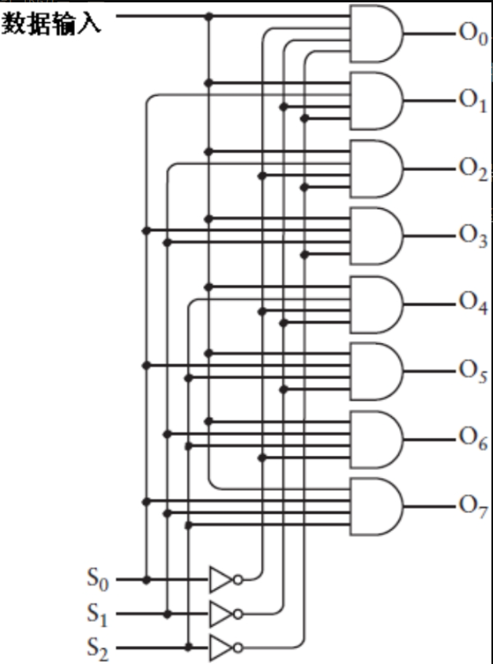

我想再次强调一遍：注意从上往下数的第6个与门，它的输入包括S0、$$\overline{S_1}$$、S2。没有任何一个与门具有和它相同的三个输入。在这种情况下，如果选择输入端为101，则除了$$O_5$$要根据情况进行判定外，其余与门输出都为0。这个时候，若数据端输入为0，则$$O_5$$随之输出为0；相应的，若数据端输入为1，则$$O_5$$输出为1。译码器的逻辑表可以如下表所示。

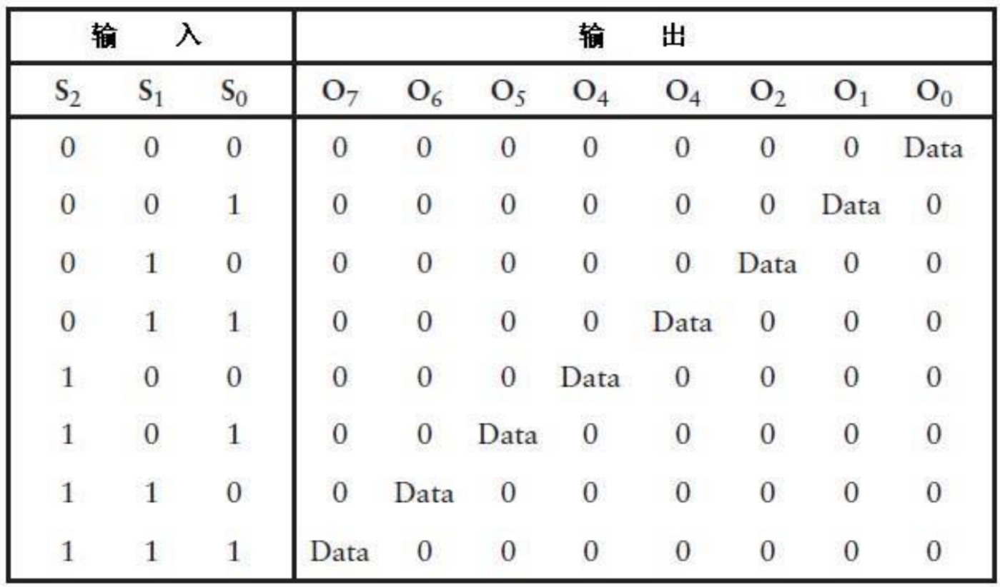

将8个锁存器加入到电路就形成了完整的系统。

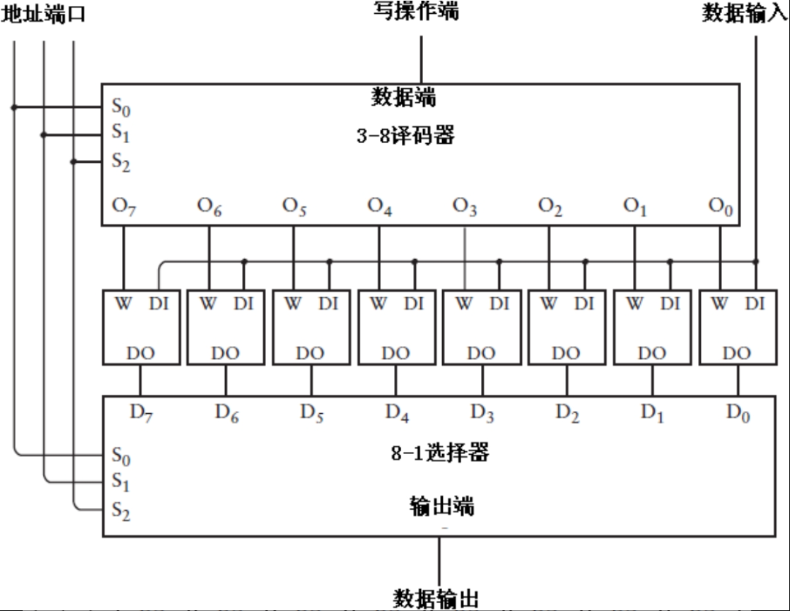

值得注意的是，译码器和选择器具有相同的选择信号，在上图中这三个信号一起被称为地址端口(Address)。地址的作用就像我们平时使用的邮箱号，长度为三位的地址决定了8个锁存器中的哪一个将被引用。3-8译码器的地址起到了决定哪些锁存器可以被写操作端的信号触发来保存数据的作用。8-1选择器通过地址来选择8个锁存器中的一个，最后将其输出。

## RAM

这种配置下的锁存器在有的资料中也被称为读/写存储器(read/write memory)，但更普遍的叫法是随机访问存储器(Random Access Memory)，或RAM（和单词animal发音类似）。可以认为我们讨论的这种存储器是可存储8个独立比特的RAM，它的简化结构图如下所示。

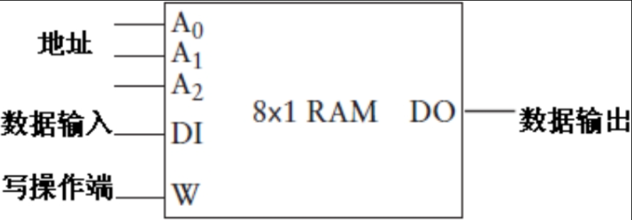

上图所示的电路之所以能够被称为存储器是因为它可以保存信息。**而能够被称为读/写存储器是因为它不仅可以在每个锁存器中存储新的数据（可以把这种功能称为写数据），而且我们还可以检查每个锁存器都保存了什么数据（可以把这种功能称为读数据）。**之所以可以被称为随机访问存储器，是因为读写操作很自由，我们只需要改变地址及相关的输入，就可以从8个锁存器中读出或写入需要的数据。相比于其他的顺序型的存储器——这种存储器在使用时有一定的限制，如果想要读取地址为101的数据，必须先把地址为100的数据读取出来。

将RAM进行特殊的配置可形成RAM阵列(Array)，我们所讨论的这种RAM阵列以8×1（读做8乘1）的方式组织起来。阵列以1比特作为存储单位，共存储8个单位的数据。所以这个RAM阵列中能存储的位数等于8与1的乘积。

RAM阵列的组合形式多种多样。比如我们可以通过共享地址的方式可以把两个8×1的RAM阵列连接起来，如下图所示。

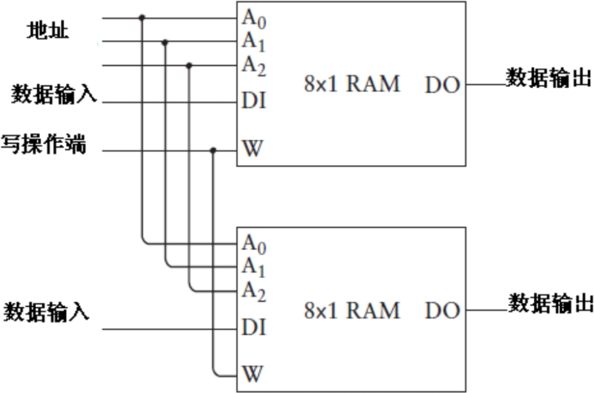

我们把这两个8×1的RAM阵列的地址和输出都分别看成一个整体，这样就得到了一个8×2的RAM阵列，如下图所示。

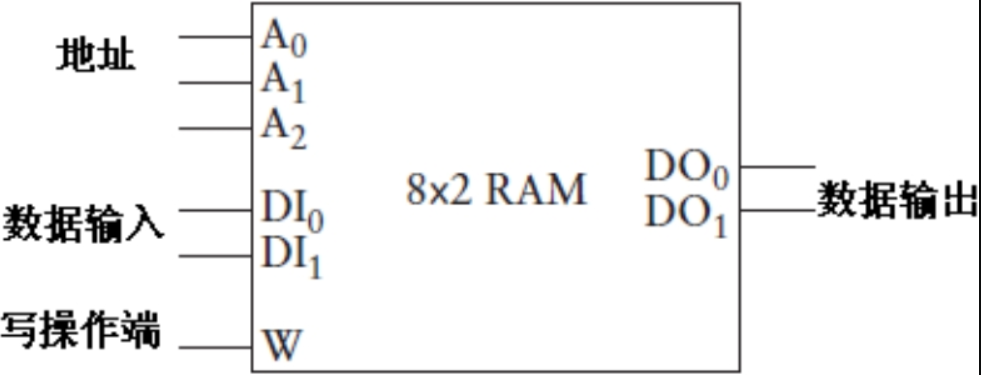

这个RAM阵列可存储的二进制数依然是8个，但每个数的位宽为2位。

我们还可以把两个8×1的RAM阵列看做是两个锁存器，使用一个2-1选择器和一个1-2译码器就可以把它们按照单个锁存器连接方式进行集成，下面给出了这种方案的电路图。

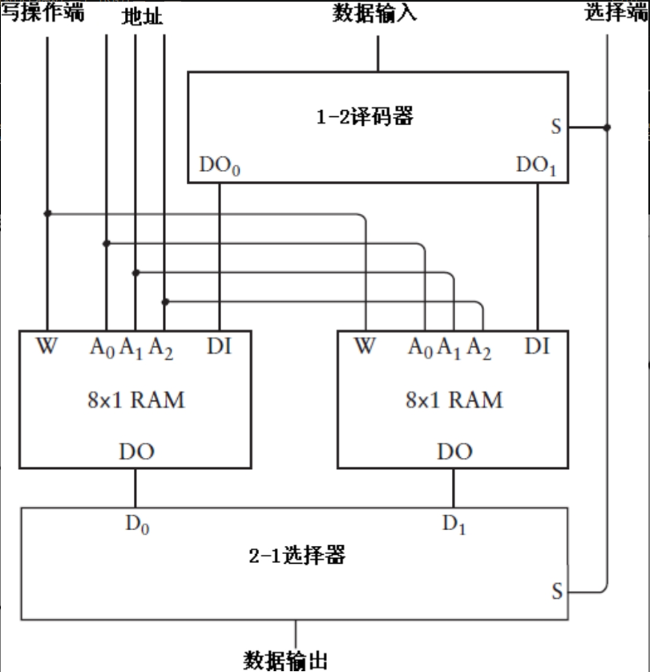

“选择”端之所以连接到译码器和选择器，主要作用是在两个8×1 RAM阵列中选择一个，本质上它扮演了第4根地址线的角色。因此这种结构实质上是一种16×1的RAM阵列，如下图所示。

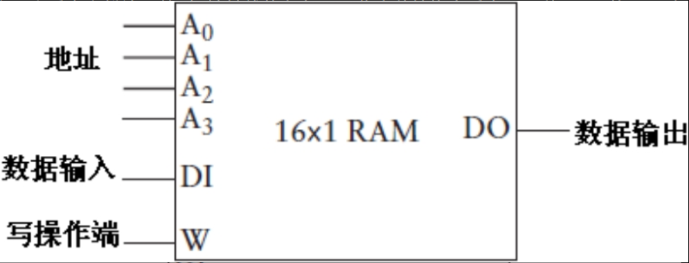

上图所示的RAM阵列存储容量为16个单位，每个单位占1位。

**RAM阵列的存储容量与其地址输入端的数量有直接的联系。在没有地址输入端的情况下（只有1位锁存器和8位锁存器的情况），只能存储1个单位的数据；**当存在1个地址输入端时，可以存储2个单位的数据；有两个地址输入端时，可以存储4个单位的数据；有3个地址输入端时，可以存储8个单位的数据；有4个地址输入端时，可以存储16个单位的数据。我们可以把它们之间的关系归纳成如下等式：

$$RAM阵列的存储单位数=2^{地址输入端的个数}$$

前面已经向大家演示了怎么搭建小型RAM阵列，你可能会问：为什么不搭建一个大规模的RAM阵列呢？就像下面这样。

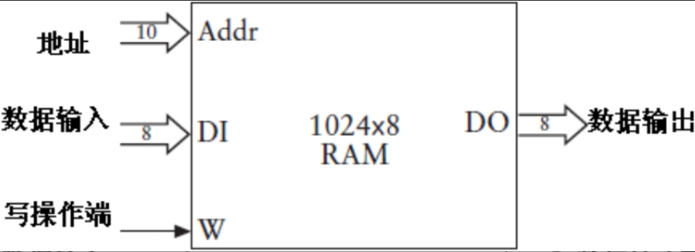

上图所示的RAM阵列可存储8192个比特的信息，每8个比特为一组，共分为1024个组。因为2的10次方恰好是1024，所以地址端共有10个输入端口。电路还包括8位的数据输入端和8位的数据输出端。

## 存储单位

从专业的角度来讲，这个RAM阵列的存储容量为1024个字节。

**1024字节通常简称为1千字节(kilobyte)，1K这种称呼不可避免地要引起许多混淆。其中它的前缀kilo（源于希腊文khilioi，意思为1000），经常在公制系统中用到。比如1千克(kilogram)代表着1000克(grams)；1千米(kilometer)代表着1000米(meter)。有所不同的是，这里所说的1千字节却代表着1024个字节—并非1000个字节。**

它们之间不同的根本原因在于公制系统是基于10的幂的计数系统，而计算机采用的是基于2的幂的计数系统，它们之间没有交集。比如10的幂为10、100、1000、10000、100000等，而2的幂为2、4、8、16、32、64等。我们可以证明不存在一对整数a和b使得10的a次幂与2的b次幂相等。

但是偶尔也会碰见非常接近的数字。事实的确如此，1000十分接近1024，用数学化的描述方法可以称这种关系为“约等于”，这样我们可以得到相应的数学表达式：

$$2^{10}≈10^3$$

这个表达式并非空穴来风，它真正的意义在于表明2的某次幂和10的某次幂几乎相等。我们利用这一巧合可以很方便地把1024个字节的存储空间用1千字节来表示。

千字节可以简写为KB。这样我们可以说前面所讲过的那个RAM阵列存储能力为1024个字节，也可以说成是1KB。

**绝不能认为1KB的RAM阵列的存储能力为1000字节，它实际上是大于1000字节，是1024个字节，为了准确而清晰地表达你脑海中的数据，我们可以使用“1 KB””或“1千字节”这两种通用的表述方式。**

存储容量为1KB的存储系统由8个数据输入端、8个数据输出端和10个地址输入端所组成。由于这些字节是由10个地址输入端来标识和访问的，所以这种RAM阵列存储容量为$$2^{10}$$个字节。如果我们再加上一条地址线，它的存储容量将变成原来的两倍。下面的公式表示了存储容量的翻倍的过程。

我们把1024个字节简化成为了1 KB，相同的逻辑，我们把1024 KB统称为1兆字节（megabyte，希腊文中的mega意味着宏大），兆字节通常缩写为MB。下面这个例子表示了兆字节为单位的存储容量翻倍的过程。

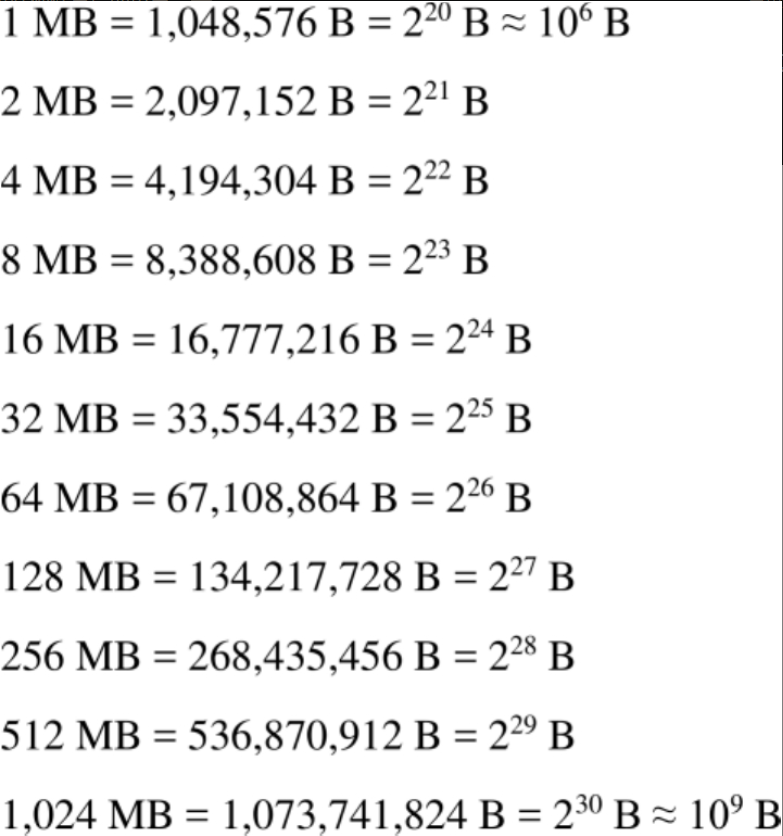

希腊文中的giga意味着巨大，1024 MB也就被顺其自然地称为1吉(gigabyte)字节，缩写为GB。

同理，1太字节（terabyte, teras希腊语意思为巨人）表示$$2^{40}$$个字节（约为$$10^{12}$$），也就是1,099,511,627, 776个字节，太字节的缩写为TB。

1 KB近似为1000个字节，1 MB近似为100万个字节，1 GB近似为10亿个字节，1 TB近似为1万亿个字节。

比TB还高数量级平时一般很少使用，比如$$2^{50}$$个字节表示为1批字节(petabyte)，计算出来就是1,125,899,906,842,624个字节，约等于一千万亿，即$$10^{15}$$字节。1安字节(exabyte)代表$$2^{60}$$个字节，也就是1,152,921,504,606,846,976个字节，约为100万的3次方，即$$10^{18}$$。

我们来补充一些生活中的基本常识。在写本书时（1999年），家用电脑的随机存储器的容量一般为32 MB、64 MB或128 MB（为了避免混淆，这里的任何描述都不涉及硬盘驱动器的任何内容，范围仅仅限定为RAM），通过计算可以得到它们的存储大小分别为33,554,432个字节、67,108,864个字节和134,217,728个字节。

简洁明了是我们人类交流方式的一大特色。比如，家中电脑内存大小如果为65,536字节，我们会说“我的是64 K（这句话很可能是在1980年听到的）”；家中电脑内存大小如果为33,554 ,432字节，我们会说“我的是32 M”。有少数电脑配备了1,073,741,824字节的内存，他们或许会说“我的可是上了G的”。

**有时人们可能会用到千比特或兆比特（注意是比特而不是字节），这只是极少数情况。当我们讨论涉及存储器的相关问题时，通常使用的是字节数而非比特（需要的时候可以通过把字节数乘以8将其转换成比特）**。

有一种情况下我们会经常用到千比特和兆比特，那就是在描述在线路中流动的数据时，很多句子中经常会出现千比特每秒(kbps)或兆比特每秒(mbps)这些用语。例如，一台56K的调制解调器指的是其数据处理速度为56千比特每秒，而不是56千字节每秒。

## 64K×8 RAM

既然我们已经学会如何构造任意大小的RAM阵列，接下来继续对这个问题深究下去。假设现在已经构造好了一个容量为65,536字节的存储器组织，如下图所示。

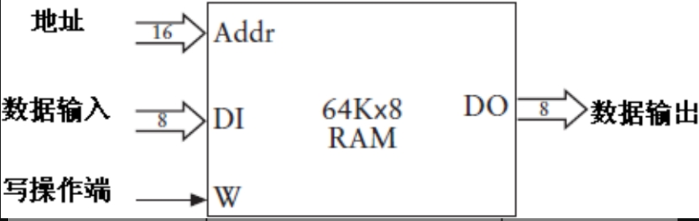

为什么选择大小为64 KB的RAM阵列？而非32 KB或128 KB？因为65,536转换为幂的形式就是$$2^{16}$$，这个RAM阵列需要配备16位的寻址端。换句话说，该地址恰好可以用2个字节表示。将地址范围转化为十六进制就是0000h～FFFFh。

我前面也提到过，64 KB的内存是1980年的个人电脑的主流配置，但它的确不是用电报继电器组成的。我们可以用继电器来组成一块内存吗？我也相信你不想这么做。在我们先前的讨论中，存储每个比特需要9个继电器，推算一下64K×8的RAM阵列就需要至少500万个继电器！

如果用一种控制面板来辅助我们管理对这块64KB存储器的操作—包括写数据和读数据，一切将会直观明了。在这款控制面板上，有16个开关用于控制地址位，还有8个开关用来控制要输入的8比特数据，写操作端也用一个开关来表示，8个灯泡用来显示8位数据，这个控制面板如下图所示。

初始状态下所有的开关均置为0。其中右下角有一个标识为控制端(takeover)的开关，这个开关的作用是确定由控制面板还是由外部所连接的其他电路来控制存储器。如果其他电路连接到与控制面板相连的存储器，这时控制端置0（如图所示），此时存储器由其他电路系统接管，控制面板上的其他开关将不起任何作用；当控制端置1时，控制面板将重新获得对存储器的控制能力。

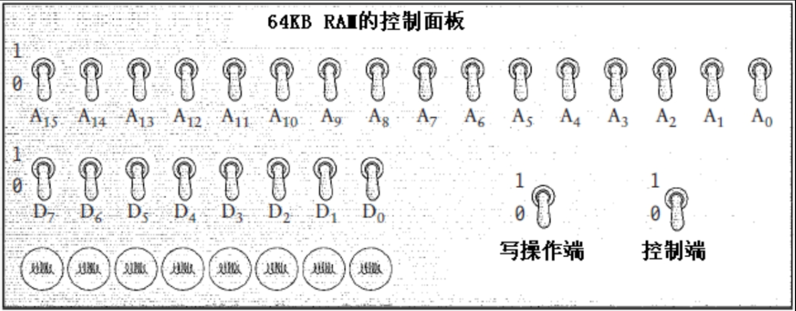

这种功能可以用一些2-1选择器来实现，仔细数一下会发现，我们需要25个2-1选择器—其中包括16个地址输入端、8个数据输入端，以及1个写操作端。电路如下图所示。

当控制端开关断开时，RAM阵列的地址端、数据输入和写操作端的数据全部来源于外部信号，也就是在2-1选择器的左上角的输入信号；当控制端开关闭合，RAM阵列的地址端、数据输入端和写操作端的数据来源于控制面板开关发出的信号。但最终RAM阵列的输出信号都会传输到8个灯泡上或其他可能的地方。

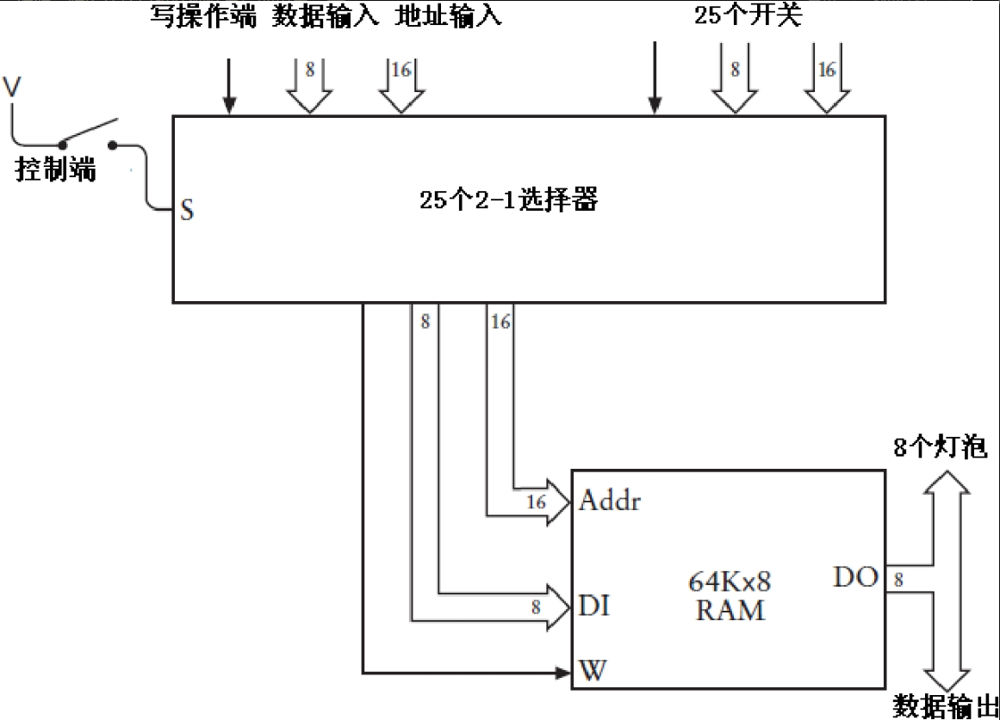

下面这幅是控制面板与64K×8 RAM阵列的逻辑结构框图。

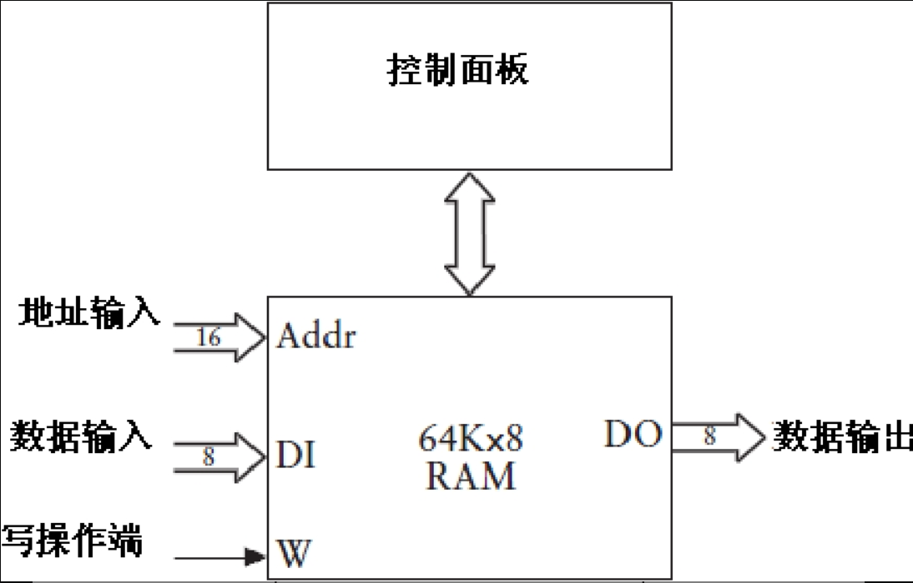

当控制端开关闭合时，通过操作16个地址开关，可以选择65,536个地址中的任何一个，灯泡的状态将表示该地址中所保存的8位数据。我们可以使用8个数据开关表示出一个新数，然后把写操作端置1，从而将数据写入存储器。

64K×8的RAM阵列和控制面板这一组合的确很实用，它可以帮助我们存储65,536个8位数据并且读取其中的任意一个。与此同时，我们也给其他部件提供了接入系统的机会—需要接入系统的通常是一些电路部件—这些部件可以轻易地读取并利用存储器中存放的数据，还可以把数据写入存储器。

关于存储器有一个问题尤其值得我们注意，而且需要特别注意。在学习第11章的时候，我们曾介绍过逻辑门的概念及原理，但是没有画出组成逻辑门的单个继电器的结构图，特别是，当时没有指明每个继电器都与某个电源连接在一起，只要继电器连通，电流就会流过电磁线圈并产生磁场，继而吸下金属片。

一个辛辛苦苦装满65,536字节珍贵数据的64 K×8 RAM阵列，如果断掉电源，会发生什么事情呢？首先所有的电磁铁都将因为没有电流而失去磁性，随着“梆”的一声，金属片将弹回原位，所有继电器将还原到未触发状态。RAM中存储的数据呢？它们将如风中残烛般消失在黑暗中。

正因为如此，随机访问存储器也被称为易失性(volatile)存储器。为了保证存储的数据不丢失，易失性存储器需要恒定的电流。
